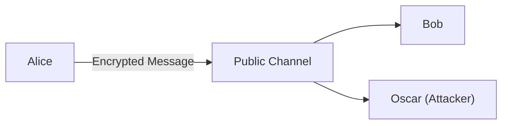
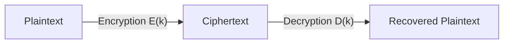
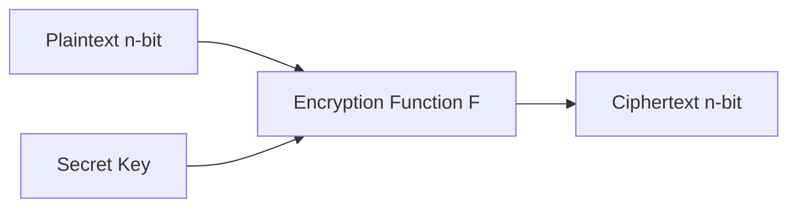
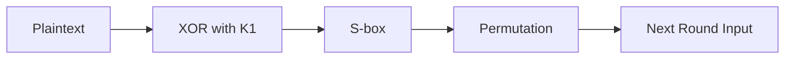

# Week - 1
:::info[TITLE]
## Lecture 1: <br />Introduction to Cryptography
:::
---

### Definition

* Cryptography is the **science of secure communication over an insecure channel**. 
* It ensures that only the intended receiver can understand the message.

---

## Basic Communication Model

* **Alice** → Sender
* **Bob** → Receiver
* **Oscar** → Attacker (eavesdropper)

### Goal

* Communicate securely even when the channel is public.



---

## Core Concepts

### Plaintext

* Original message (e.g., age = 24)

### Ciphertext

* Encrypted message (e.g., 50)

### Key (k)

* Secret value shared between Alice and Bob

---

## Encryption & Decryption

### Encryption

* Process of converting plaintext → ciphertext

### Decryption

* Process of converting ciphertext → plaintext

---

## Example (Step-by-Step)

### Given:

* Plaintext = 24
* Key = 26

### Encryption:

```
Ciphertext = Plaintext + Key
           = 24 + 26
           = 50
```

### Decryption:

```
Plaintext = Ciphertext - Key
          = 50 - 26
          = 24
```

---

## Key Points

* Oscar can see ciphertext but **cannot determine plaintext without key**
* Encryption algorithm can be public
* **Security depends on secrecy of key** 

---

## Key Distribution Problem

* Sharing the key securely is difficult
* Cannot send key over same public channel
* Must use:

  * Secure channel
  * Trusted method
* Keys should be changed frequently (**session keys**)

---

## Cryptography vs Cryptanalysis

| Field         | Description               |
| ------------- | ------------------------- |
| Cryptography  | Designing secure systems  |
| Cryptanalysis | Breaking security systems |
| Cryptology    | Combination of both       |

---

## Types of Cryptography

### 1. Symmetric Key Cryptography

* Same key used for encryption and decryption
* Also called:

  * Private key
  * Single key system

#### Examples:

* Shift Cipher
* Caesar Cipher
* Playfair Cipher

---

### 2. Public Key Cryptography

* Uses two keys:

  * Public key
  * Private key
* Solves key distribution problem
* Example concept: Diffie-Hellman

---

## Cryptosystem (Formal Model)

A cryptosystem consists of 5 components:

| Symbol | Meaning               |
| ------ | --------------------- |
| P      | Plaintext space       |
| C      | Ciphertext space      |
| K      | Key space             |
| E      | Encryption algorithms |
| D      | Decryption algorithms |

---

## Cryptosystem Flow



---

## Important Condition

For every key **k**:

```
D(k)(E(k)(m)) = m
```

* Decryption must return original message

---

## Properties of Algorithms

* Must be:

  * Efficient (polynomial time)
  * Not extremely complex (not NP-hard)

---

## Attacker’s Goal

* Find:

  * Key (k), or
  * Original plaintext (m)

---

## Final Takeaways

* Cryptography enables secure communication on public networks
* Key is the most critical component
* Encryption hides data, decryption reveals it
* Two main systems: symmetric & public-key
* Cryptosystem is formally defined using 5 components 

:::info[TITLE]
## Lecture 2: <br />Classical Cryptosystem
:::

### Shift Cipher

* Uses **Z₍26₎ (0–25)** for letters (A=0, B=1, …, Z=25) 
* **Encryption:** ( C = (P + k) \mod 26 )
* **Decryption:** ( P = (C - k) \mod 26 )
* Example: plaintext → numbers → add key → convert back to letters

---

### Caesar Cipher

* Special case of shift cipher with **k = 3**
* Circular shifting (Z wraps to A)

---

### Weakness of Shift Cipher

* Key space = **26 (very small)**
* Easily broken using **brute force (try all keys)**
* Attacker stops when meaningful text appears
* Not secure

---

### Kerckhoffs Principle

* **Algorithm is public**
* **Only key is secret** 

---

## Substitution Cipher

### Concept

* Replace each letter using a **permutation (mapping)**

### Key Space

* **26! (factorial)** → very large → stronger than shift cipher

---

### Encryption

* Apply permutation ( \phi ) to each letter

### Decryption

* Apply inverse permutation ( \phi^{-1} )

---

### Example Idea

* Mapping: A → D, B → X, etc.
* Encrypt: substitute letters
* Decrypt: reverse mapping

---

## Key Takeaways

* Shift cipher is simple but insecure
* Caesar cipher = shift cipher (k=3)
* Small key space → easy to break
* Substitution cipher improves security with large key space
* Still classical (not modern secure) 

:::info[TITLE]
## Lecture 3: <br />Cryptanalysis on Substitution Cipher (Frequency Analysis )
:::

## Substitution Cipher Security

### Key Space

* Total keys = **26! (~4 × 10²⁶)** → very large 
* Brute force is **computationally infeasible**

---

## Frequency Analysis Attack

### Idea

* English text has predictable letter frequencies:

  * **e → most frequent**
  * then **t, a, ...**

### Attack Steps

* Count frequency of letters in ciphertext
* Map highest frequency letter → ‘e’
* Next → ‘t’, etc.
* Use trial & error to fill gaps

### Reason it Works

* Substitution cipher is **monoalphabetic**
* Same letter → same mapping every time

---

## Polyalphabetic Cipher

### Concept

* Uses **multiple substitution alphabets**
* Same letter can map to **different letters**

### Advantage

* Breaks frequency patterns
* Harder to attack using frequency analysis

---

## Vigenère Cipher

### Idea

* Extension of shift cipher
* Uses **key vector (k₁, k₂, …, kₘ)**

### Encryption

* $$( C_i = (P_i + K_i) \mod 26 )$$

### Decryption

* $$( P_i = (C_i - K_i) \mod 26 )$$

### Process

1. Convert text → numbers
2. Divide into blocks
3. Add key (mod 26)
4. Convert back to letters

### Key Property

* Same letter → different outputs in different positions
  → prevents simple frequency attack

---

## Transposition Cipher

### Concept

* Does **not change letters**
* Only **rearranges positions**

---

### Rail Fence Technique

#### Process

1. Write plaintext in rows (zig-zag/grid style)
2. Read row-wise → ciphertext

#### Example Idea

* Input: `meetmeafterthepartyisover`
* Rearranged → different order → ciphertext

---

## General Transposition Cipher

### Key

* Permutation of positions
* Key space = **m!**

### Encryption

* Rearrange positions using permutation π

### Decryption

* Apply inverse permutation π⁻¹

---

## Key Takeaways

* Substitution cipher:

  * Large key space but **breakable via frequency analysis**
* Polyalphabetic cipher:

  * Improves security by varying mappings
* Vigenère cipher:

  * Practical polyalphabetic method
* Transposition cipher:

  * Rearranges data instead of replacing it
* Classical ciphers are **not secure by modern standards** 

:::info[TITLE]
## Lecture 4: <br />Play Fair Cipher
:::

## Playfair Cipher (Polyalphabetic Cipher)

### Overview

* Classical **polyalphabetic cipher**
* Proposed by **Charles Wheatstone** 
* Uses **5×5 key matrix (25 letters)**
* Letters **I and J are combined**

---

## Key Matrix Construction

### Steps

1. Choose a keyword (e.g., **CHARLES**)
2. Write unique letters of key
3. Fill remaining matrix with unused alphabets
4. Skip duplicates
5. Combine **I/J** in one cell

---

## Plaintext Preparation

### Rules

* Divide into **pairs (digraphs)**
* If:

  * Odd length → add **‘x’**
  * Same letters in pair → insert **‘x’** between them

### Example

* `meetmeatthebridge` →
  `me et me at th eb ri dg ex`

* `balloon` →
  `ba lx lo on`

---

## Encryption Rules

### 1. Same Row

* Replace each letter with **right neighbor**
* Wrap around

### 2. Same Column

* Replace each letter with **below neighbor**
* Wrap around

### 3. Rectangle Rule

* Replace each letter with:

  * Same row
  * Column of the other letter

---

## Example Output

* `me` → `gd`
* Final ciphertext:
  **GD DO GD QR PR SD MH ME VB** 

---

## Decryption Rules

### 1. Same Row

* Replace with **left neighbor**

### 2. Same Column

* Replace with **above neighbor**

### 3. Rectangle Rule

* Same as encryption (swap columns)

---

## Key Points

* Works on **pairs of letters (digraphs)**
* More secure than monoalphabetic substitution
* Still vulnerable to advanced analysis
* Key must be **shared secretly**

---

## Final Takeaway

* Playfair cipher improves security by:

  * Using **letter pairs**
  * Breaking simple frequency patterns
* But still not secure by modern standards

:::info[TITLE]
## Lecture 5: <br />Block Cipher
:::

## Block Cipher

### Definition

* Type of **symmetric key encryption** 
* Takes:

  * **n-bit plaintext**
  * **k-bit key**
* Produces:

  * **n-bit ciphertext**

---

## Basic Structure



---

## Round-Based Encryption

* Uses **r rounds**
* Each round uses a **round key (K₁, K₂, …, Kᵣ)**
* Final output = ciphertext

---

## Key Scheduling

* Generates round keys from secret key **K**
* Algorithm produces:

  * K₁, K₂, …, Kᵣ

---

## Decryption

* Reverse process of encryption
* Apply:

  * Inverse round functions
  * Round keys in reverse order
* Requires functions to be **invertible**

---

## Examples

### DES (Data Encryption Standard)

* Block size: **64-bit**
* Key size: **56-bit**
* Rounds: **16**

---

### AES (Advanced Encryption Standard)

* Block size: **128-bit**
* Key sizes:

  * 128-bit → 10 rounds
  * 192-bit → 12 rounds
  * 256-bit → 14 rounds

---

## Substitution-Permutation Network (SPN)

### Idea

* Combines:

  * **Substitution (S-box)**
  * **Permutation (bit shuffling)**

---

## SPN Encryption (1 Round)

### Steps

1. **XOR with round key**
2. **Divide into blocks**
3. Apply **S-box (substitution)**
4. Apply **Permutation (shuffle bits)**



---

## Multi-Round SPN

* Repeat above steps for multiple rounds
* Final round may skip permutation

---

## S-Box

* Maps **l-bit input → l-bit output**
* Provides **confusion**

---

## Permutation (P-box)

* Rearranges bits
* Provides **diffusion**

---

## Example Setup

* n = 16 bits
* Divide into 4 blocks of 4 bits
* Apply XOR → S-box → permutation
* Repeat for multiple rounds

---

## SPN Decryption

### Steps

1. XOR with last round key
2. Apply **inverse S-box**
3. Apply **inverse permutation**
4. Repeat in reverse order

---

## Key Points

* Block cipher works on **fixed-size blocks**
* Uses **multiple rounds for security**
* SPN structure provides:

  * Confusion (S-box)
  * Diffusion (Permutation)
* Decryption requires **invertible operations** 

---

## Final Takeaway

* Block ciphers are foundation of modern encryption
* SPN is core design (used in AES)
* Security comes from:

  * Multiple rounds
  * Key scheduling
  * Substitution + permutation
