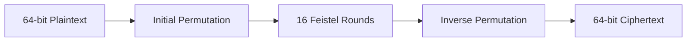
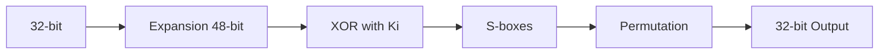
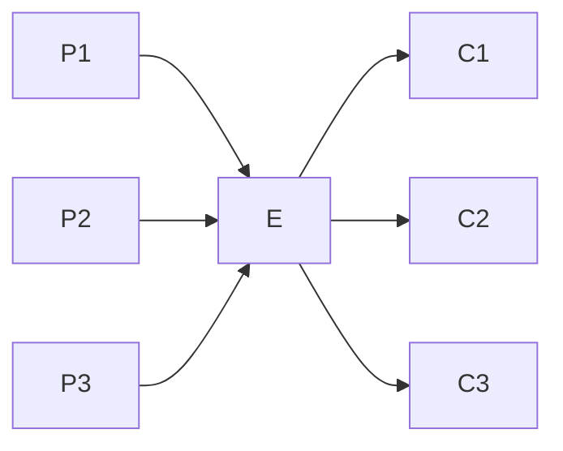
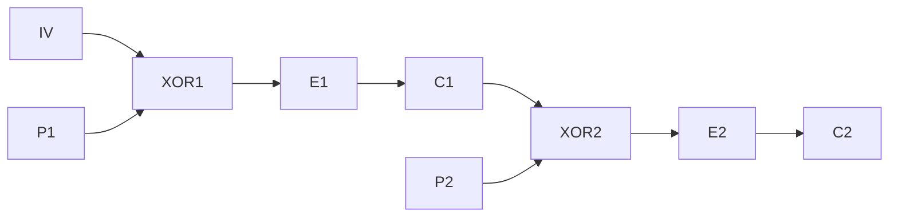
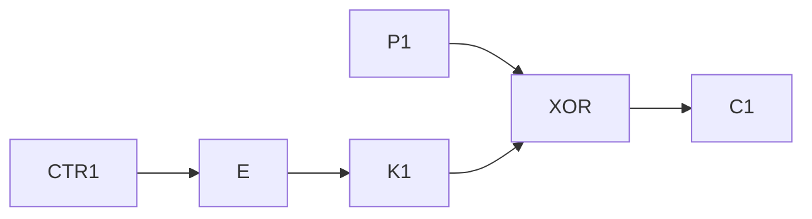
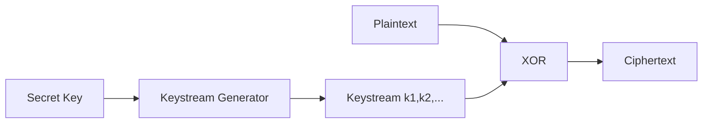

# Week - 2
:::info[TITLE]
## Lecture 6:  Data Encryption Standard (DES)
:::

## Data Encryption Standard (DES)

### Overview

* **Block cipher (symmetric key)** 
* Block size: **64-bit**
* Effective key size: **56-bit** (64-bit with parity bits)
* Rounds: **16**
* Based on **Feistel structure**

---

## Overall Structure

---

## Feistel Structure

### Split Input

* Plaintext → two halves:

  * L₀ (left 32-bit)
  * R₀ (right 32-bit)

### Round Operation

* ( $$L_i = R_\{i-1\} $$ )
* ( $$R_i = L_\{i-1\} ⊕ F(R_\{i-1\}, K_i) $$ )

---

## Round Function F

### Inputs

* 32-bit data
* 48-bit round key

### Steps

1. **Expansion (E-box)**

   * 32-bit → 48-bit (repeat some bits)

2. **XOR with round key**

   * 48-bit ⊕ 48-bit

3. **S-box substitution**

   * Split into 8 blocks (6-bit each)
   * Each → 4-bit output
   * Total → 32-bit

4. **Permutation (P-box)**

   * Shuffle bits

---

## S-Box Working

* Input: **6 bits**

  * First & last bits → row
  * Middle 4 bits → column
* Output: **4 bits**

---

## Key Scheduling

### Input Key

* 64-bit key (8 bits used for parity)
* Effective key = **56-bit**

### Steps

1. **PC-1 Permutation**

   * 56-bit shuffled output

2. **Split**

   * Two halves (C, D) → 28-bit each

3. **Left Circular Shift**

   * Shift by 1 or 2 bits (depends on round)

4. **PC-2 Permutation**

   * 56-bit → 48-bit
   * Generates round key ( K_i )

---

## Decryption

* Same structure as encryption
* Only difference:

  * Round keys used in **reverse order**
* Works because Feistel structure is invertible

---

## Important Points

* Initial & final permutations just **rearrange bits**
* Security mainly comes from:

  * S-box (non-linearity)
  * Multiple rounds

---

## Limitations

* Key size (56-bit) is **too small → vulnerable to brute force**
* S-box design not fully transparent
* Replaced by **AES** in modern systems

---

## Final Takeaway

* DES = classic Feistel block cipher
* Uses **16 rounds + S-box + permutations**
* Important historically, but **not secure today** 

:::info[TITLE]
## Lecture 7:  Data Encryption Standard (DES) (Contd.)
:::

## DES Decryption (Feistel Inversion)

### Key Idea

* **No need to invert F function**
* Same F function is reused
* Only **order of keys is reversed** 

---

### 1 Round Decryption

* Given:

  * ( $$L_1, R_1 $$ )

* Recover:

  * ( $$R_0 = L_1 $$ )
  * ( $$L_0 = R_1 ⊕ F(L_1, K_i) $$ )

✔ Works because of Feistel structure

---

## Full DES Decryption

### Steps

1. Take ciphertext
2. Apply **round keys in reverse order (K₁₆ → K₁)**
3. Apply same Feistel rounds
4. Apply **inverse initial permutation (IP⁻¹)**
5. Get plaintext

---

## Security Analysis of DES

### Issues

#### 1. Weak S-box Design

* Not fully explained
* Design not transparent

#### 2. Small Key Size

* Only **56-bit key**
* Vulnerable to brute force

---

## Attack Models

### 1. Ciphertext-Only Attack

* Attacker has only ciphertext

---

### 2. Known Plaintext Attack

* Attacker has:

  * Plaintext (P)
  * Corresponding ciphertext (C)
* Goal: find key

---

### 3. Chosen Plaintext Attack

* Attacker can:

  * Choose plaintext
  * Get ciphertext

---

### 4. Chosen Ciphertext Attack

* Attacker can:

  * Choose ciphertext
  * Get plaintext

---

## Exhaustive Search Attack (Brute Force)

### Idea

* Try all possible keys

### Steps

1. Attacker knows (P, C)
2. Try key ( K_i )
3. Encrypt/Decrypt and compare
4. If match → correct key

---

### Complexity

* Key space = ( 2^{56} )
* Time ≈ very large (years on single machine)

---

### Optimization (Parallel Computing)

* Divide key space across processors

#### Example

* With many processors:

  * Time reduces drastically
  * Can break DES in **days**

---

## Types of Attacks on DES

### 1. Generic Attacks

* Brute force
* Time-based

---

### 2. Non-Generic Attacks

* Use internal structure

#### Examples

* Linear cryptanalysis
* Differential cryptanalysis

---

## Key Takeaways

* DES is:

  * Easy to decrypt due to Feistel structure
  * Weak due to small key size

* Breakable using:

  * Brute force
  * Advanced cryptanalysis

---

## Final Conclusion

* DES is **not secure today**
* Led to improvements like:

  * **Triple DES**
  * **AES** 

:::info[TITLE]
## Lecture 8:  Triple DES and Modes of Operation
:::

## Triple DES (3DES)

### Motivation

* DES is insecure due to **small key size (56-bit)** 
* Solution: apply DES **multiple times**

---

### Concept

* Use DES **3 times**
* Effective key size ≈ **112 bits**
* Total rounds = **48 (3 × 16)**

---

### Encryption (EDE Mode)

1. Encrypt with ( K_1 )
2. Decrypt with ( K_2 )
3. Encrypt with ( K_1 )

---

### Decryption

1. Decrypt with ( K_1 )
2. Encrypt with ( K_2 )
3. Decrypt with ( K_1 )

---

### Drawbacks

* Very **slow (48 rounds)**
* Still based on DES weaknesses
* Replaced by **AES**

---

## Block Cipher Modes of Operation

### Need

* Block ciphers work on **fixed-size blocks**
* Real messages are **long**
* Modes define how to encrypt multiple blocks

---

## 1. ECB (Electronic Codebook)

### Idea

* Encrypt each block independently

### Problem

* Same plaintext → same ciphertext
* Reveals patterns (not secure) 

---

## 2. CBC (Cipher Block Chaining)

### Encryption

* ( $$C_1 = E(P_1 ⊕ IV) $$ )
* ( $$C_i = E(P_i ⊕ C_\{i-1\}) $$ )

### Decryption

* ( $$P_1 = D(C_1) ⊕ IV $$ )
* ( $$P_i = D(C_i) ⊕ C_\{i-1\} $$ )

### Advantage

* Hides patterns

---

## 3. CFB (Cipher Feedback)

### Encryption

* Encrypt previous ciphertext (or IV)
* XOR with plaintext

### Decryption

* Same process (uses encryption function)

---

## 4. OFB (Output Feedback)

### Idea

* Generate keystream independent of plaintext

### Encryption/Decryption

* Same process:

  * Encrypt IV repeatedly
  * XOR with plaintext/ciphertext

---

## 5. CTR (Counter Mode)

### Idea

* Use counter values as input

### Encryption

* ( C_i = P_i ⊕ E(counter_i) )

### Decryption

* Same as encryption

---

## Key Takeaways

* **3DES** improves DES but is slow
* ECB → insecure (pattern leakage)
* CBC → secure chaining
* CFB/OFB → stream-like modes
* CTR → fast & parallelizable

---

## Final Conclusion

* 3DES is transitional
* Modern systems use **AES + secure modes (like CTR, CBC)** 

:::info[TITLE]
## Lecture 9:  Stream Cipher
:::

## Stream Cipher

### Definition

* Symmetric encryption where data is encrypted **bit-by-bit (or byte-by-byte)** 
* Uses a **keystream generator**

---

## Basic Idea

* Plaintext: ( x_i )
* Keystream: ( k_i )
* Ciphertext:
  [
  c_i = x_i \oplus k_i
  ]

### Decryption

[
x_i = c_i \oplus k_i
]

✔ Same operation (XOR) used for both

---

## Structure

---

## Keystream Generator

* Takes **secret key**
* Produces sequence:

  * ( k_1, k_2, k_3, ... )

---

## Perfect Secrecy (Shannon)

### Condition

[
P(Plaintext \mid Ciphertext) = P(Plaintext)
]

* Ciphertext gives **no information** about plaintext 

---

## One-Time Pad (OTP)

### Idea

* Keystream is **truly random**
* Key length = plaintext length

### Result

* Achieves **perfect secrecy**

---

### Problem

* True randomness is **impractical**
* Key distribution is difficult

---

## Practical Approach

* Use **Pseudo-Random Generator (PRG)**
* Generates keystream from small key

---

## Linear Feedback Shift Register (LFSR)

### Concept

* Generates keystream using:

  * Shift registers
  * Feedback (XOR of selected bits)

---

## Example (4-bit LFSR)

* Initial state: (1,0,1,0)
* Shift bits → generate output
* Feedback based on polynomial

---

## Polynomial Representation

* Example:

  * ( 1 + x + x^3 )

* Determines:

  * Which bits are used for feedback

---

## Key Property

* If polynomial is **primitive**:

  * Generates **maximum-length sequence**

---

## General Form

* Polynomial:
  [
  1 + c_1x + c_2x^2 + ... + c_lx^l
  ]

* If ( c_i = 1 ) → contributes to feedback

---

## Key Takeaways

* Stream cipher uses:

  * XOR + keystream
* Security depends on:

  * Quality of keystream
* OTP = perfectly secure (theoretical)
* Practical systems use:

  * Pseudo-random generators (like LFSR) 

---

## Final Conclusion

* Stream ciphers are:

  * Fast
  * Efficient for real-time data
* But require **strong randomness** for security

:::info[TITLE]
## Lecture 10:  Pseudorandom Sequence
:::

## Pseudorandom Sequence

### Definition

* Sequence generated by an **algorithm (deterministic)**
* Appears **random**, but not truly random 

---

## Role in Stream Cipher

* Key ( k ) → **Keystream generator** → ( k_1, k_2, …, k_n )
* Encryption:
  [
  y_i = x_i \oplus k_i
  ]
* Decryption:
  [
  x_i = y_i \oplus k_i
  ]

---

## True Random vs Pseudorandom

### True Random

* ( P(k_i=0) = P(k_i=1) = \frac{1}{2} )
* Gives **perfect secrecy (One-Time Pad)**

### Problem

* Not practical to generate

---

### Pseudorandom

* Generated using algorithm
* Must **behave like random**

---

## Goal

* Make pseudorandom sequence:

  * **Indistinguishable from random**
  * Pass statistical tests

---

## Period of Sequence

### Definition

* Sequence repeats after ( N )

$$s_{i+N} = s_i$$

* ( N ) = **period**

---

## Randomness Testing

* Evaluate quality of sequence
* Use statistical properties

---

## Golomb’s Postulates

### 1. Balance Property

* Number of 0s ≈ number of 1s
* Difference ≤ 1

---

### 2. Run Property

* Runs = consecutive bits

Rules:

* Half runs → length 1
* 1/4 runs → length 2
* 1/8 runs → length 3

---

### 3. Autocorrelation Property

$$
C(\tau) =
\begin{cases} \\
N, & \tau \equiv 0 \ (\text{mod } N) \\
\text{constant}, & \text{otherwise} \\
\end{cases} \\
$$

* Measures similarity of shifted sequence

---

## Example Insight

* Sequence passes:

  * Balanced 0s & 1s
  * Proper run distribution
  * Constant autocorrelation
    → Considered **good pseudorandom sequence** 

---

## Pseudorandom Generator

* Called **PRG (Pseudo Random Generator)**
* Input: small key
* Output: long sequence

---

## LFSR (Linear Feedback Shift Register)

### Idea

* Uses:

  * Shift registers
  * XOR feedback

### Key Points

* Initial state = secret key
* Output = keystream

---

## Polynomial Representation

$$1 + c_1x + c_2x^2 + ... + c_lx^l$$

* Determines feedback connections

---

## Important Property

* If polynomial is **primitive**:

  * Generates **maximum-length sequence**
  * Better randomness

---

## Key Takeaways

* Pseudorandom ≠ truly random
* Security depends on:

  * Quality of randomness
* Tested using:

  * Golomb’s postulates
* LFSR is common generator
* Good PRG → strong stream cipher 

---

## Final Conclusion

* Perfect randomness is theoretical
* Practical systems rely on **high-quality pseudorandom sequences**
