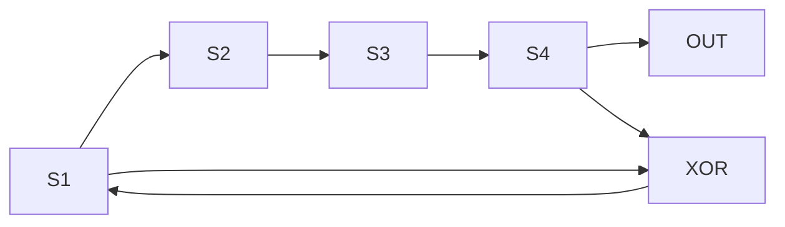
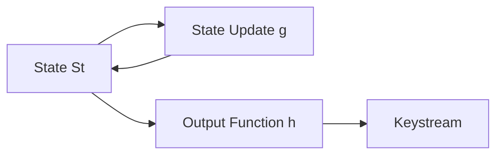

# Week - 3
:::info[TITLE]
## Lecture 11: <br />LFSR based Stream Cipher
:::

## LFSR (Linear Feedback Shift Register)

### Definition

* A **keystream generator** used in stream ciphers 
* Consists of **l-bit shift register + linear feedback (XOR)**

---

## Basic Structure



* Bits shift right
* New bit = XOR of selected bits (feedback)

---

## Polynomial Representation

[
1 + c_1x + c_2x^2 + ... + c_lx^l
]

* If ( c_i = 1 ) → bit participates in feedback
* Defines LFSR structure

---

## Example (4-bit LFSR)

### Given

* Initial state: **0110**
* Feedback: XOR of **1st & 4th bit**

---

### Operation (Steps)

| Round | State | Output |
| ----- | ----- | ------ |
| 0     | 0110  | 1      |
| 1     | 0011  | 0      |
| 2     | 1001  | 1      |
| ...   | ...   | ...    |

* After **15 steps → repeats**
* Period = **15 = 2⁴ − 1** 

---

## Key Observations

* Sequence repeats → **periodic**
* Max period = ( 2^l - 1 )
* Achieved if polynomial is **primitive**

---

## Keystream Generation

* Initial state = **secret key (α₁, α₂, …, αₗ)**

$$
\begin{aligned}
K_1 &= \alpha_4 \\
K_2 &= \alpha_3 \\
K_3 &= \alpha_2 \\
K_4 &= \alpha_1 \\
K_5 &= c_0\alpha_1 + c_1\alpha_2 + c_2\alpha_3 + c_3\alpha_4
\end{aligned}
$$

* Future bits = **linear combinations of initial key**

---

## Problem (Security)

* Output is **linear**
* Can be expressed as linear equations
* Vulnerable to attacks

---

## Solution → Non-Linear Generators

### Idea

* Combine multiple LFSRs
* Use **non-linear function (f)**

---

### Example: Geffe Generator

* Uses **3 LFSRs**
* Output = nonlinear combination

---

## Types of Stream Cipher (LFSR-based)

### Synchronized Stream Cipher

* Keystream depends only on:

  * Secret key
* Independent of plaintext/ciphertext

✔ LFSR belongs here

---

## General Model

* State = ( S_t )
* Update function = ( g )
* Output function = ( h )



---

## Key Takeaways

* LFSR = fast, simple keystream generator
* Good randomness if:

  * Proper polynomial used
* Weakness:

  * **Linear → predictable**
* Solution:

  * Use multiple LFSRs + nonlinear functions 

---

## Final Conclusion

* LFSR alone is **not secure**
* Used as building block in **modern stream ciphers**

# Week - 3
:::info[TITLE]
## Lecture 12: <br />Mathematical background
:::

## Algebra in Cryptography

### Motivation

* Cryptography uses **algebraic structures**
* Built on:

  * **Sets**
  * **Operations (binary operators)** 

---

## Set (G)

### Definition

* Collection of **distinct elements**
* Example:

  * Integers: ( $$\mathbb{Z} = \{..., -1, 0, 1, ...\}$$ )
  * Rational: $$( \mathbb{Q} = \frac{p}{q} )$$
  * Real: $$( \mathbb{R} )$$

---

## Binary Operation

* Operation on two elements:
  [
  a \cdot b,; a + b,; a \times b
  ]

---

## Algebraic Properties

### 1. Closure

[
a \cdot b \in G \quad \forall a,b \in G
]

---

### 2. Associativity

[
(a \cdot b)\cdot c = a \cdot (b \cdot c)
]

---

## Semigroup

* If a set satisfies:

  * Closure
  * Associativity

→ Called **Semigroup**

---

## Group

### Additional Properties

#### 3. Identity Element

[
a \cdot e = a \quad \forall a \in G
]

#### 4. Inverse Element

[
a \cdot b = e
]

→ Every element must have an inverse

---

## Examples

### 1. Natural Numbers (N, +)

* ❌ Not a group
* No identity (0 not included)

---

### 2. Positive Integers (+)

* ❌ Not a group
* No inverse (e.g., 2 → no -2)

---

### 3. Integers (Z, +)

* ✅ Group
* Identity = 0
* Inverse exists

---

### 4. Integers (Z, ×)

* ❌ Not a group
* Inverse (1/3) not in Z

---

### 5. Rational Numbers (Q, ×)

* ✅ Group
* Inverse exists (1/x)

---

### 6. Real Numbers (R, ×)

* ✅ Group

---

## Abelian Group

### Definition

[
a \cdot b = b \cdot a
]

* Operation is **commutative**

---

## Cyclic Group

### Definition

* Group generated by a single element **a**

    $$G = \{a, a^2, a^3, ..., a^k\}$$


* Every element can be written as:
  
  $$a^k$$
  

---

### Important Relations

$$a^0 = e$$
$$a^{-n} = (a^n)^{-1}$$


---

## Key Properties

* Cyclic groups are always **Abelian**
* Widely used in **cryptography**

---

## Final Takeaway

* Cryptography relies on:

  * Groups
  * Cyclic structures
* These form the base of:

  * RSA
  * Diffie-Hellman
  * ECC

# Week - 3
:::info[TITLE]
## Lecture 13: <br />Abstract algebra (Contd.)
:::

## Subgroup

### Definition

* Let ( G ) be a group and ( $$H \subseteq G$$ )
* If ( H ) itself forms a **group under same operation**, then ( H ) is a **subgroup**

---

## Cyclic Subgroup

* Generated by element ( a ):
 $$  H = \{a, a^2, a^3, ..., a^i\}$$

* Eventually:
  $$a^n = e$$

* ( n ) = **order of subgroup**

* Order of subgroup **divides order of group**

---

## Ring (R)

### Definition

A set ( R ) with two operations (+, ·) is a **ring** if:

---

### Properties

#### 1. Abelian Group under Addition

* Closure
* Associativity
* Identity (0)
* Inverse
* Commutative

---

#### 2. Closure under Multiplication

$$a \cdot b \in R$$


---

#### 3. Associativity (Multiplication)

$$(a \cdot b)\cdot c = a \cdot (b \cdot c)$$

---

#### 4. Distributive Law

$$a \cdot (b + c) = a \cdot b + a \cdot c$$


---

## Examples of Ring

* Integers ( $$(\mathbb{Z}, +, \cdot)$$ ) → Ring
* Real numbers ( $$(\mathbb{R}, +, \cdot)$$ ) → Ring 

---

## Commutative Ring

* If:
$$  a \cdot b = b \cdot a$$

→ Called **Commutative Ring**

---

## Integral Domain

### Definition

* A **commutative ring** with:

#### 1. No Zero Divisors

$$a \cdot b = 0 \Rightarrow a=0 \text{ or } b=0$$

---

## Field

### Definition

* A **field** is an integral domain where:

#### 1. Every non-zero element has multiplicative inverse

$$a^{-1} \text\{ exists for \} a \neq 0$$


---

### Properties

* Abelian under addition
* Commutative multiplication
* Distributive law

---

## Examples of Field

* Real numbers ( $$(\mathbb{R})$$ ) → Infinite field
* Rational numbers ( $$(\mathbb{Q})$$ ) → Field

---

## Key Takeaways

* **Subgroup** → subset forming group
* **Ring** → two operations (+, ·)
* **Integral Domain** → no zero divisors
* **Field** → division possible (except by 0)

---

## Final Conclusion

* These algebraic structures are foundation of:

  * Cryptographic algorithms
  * Finite fields (used in AES, ECC)

# Week - 3
:::info[TITLE]
## Lecture 14: <br />Number Theory
:::

## Number Theory (Basics for Cryptography)

### Overview

* Study of **integers and their properties**
* Foundation for cryptographic systems like **RSA** 

---

## Prime Numbers

### Definition

* Integer ( > 1 ) with exactly **2 divisors**:
  $$1 \text\{ and\ itself\}$$

### Examples

* Prime: 2, 3, 5, 7
* Not prime: 6 (divisors: 1,2,3,6)

✔ Note: **1 is not prime**

---

## Composite Numbers

* Integers that are **not prime**
* Have more than 2 divisors

---

## Fundamental Theorem of Arithmetic

$$n = p_1^{e_1} \cdot p_2^{e_2} \cdots p_n^{e_n}$$


* Every integer is:

  * Either **prime**, or
  * Product of **prime factors**

---

## Division Algorithm

$$a = qb + r$$

Where:

* ( q ) = quotient
* ( r ) = remainder
* ( 0 \le r < b )

### Example

$$24 = 2 \cdot 10 + 4$$

---

## Divisibility

* ( b \mid a ) means:
  $$a = b \cdot k$$
* Remainder = 0

---

## Greatest Common Divisor (GCD)

### Definition

* Largest number dividing both ( a ) and ( b )

$$\gcd(a,b)$$


---

### Example

* ( a = 24, b = 32 )

Common divisors:
$${1,2,4,8}$$

\gcd(24,32) = 8$$
---

## Key Property

$$\gcd(a,b) = \gcd(a + kb, b)$$

* Used in Euclidean Algorithm

---

## Euclidean Algorithm

### Idea

* Repeatedly apply division:

$$\gcd(a,b) = \gcd(b, a \bmod b)$$


---

### Steps

1. Compute ( $$r = a \bmod b$$ )
2. Replace:

   * ( $$a \leftarrow b$$ )
   * ( $$b \leftarrow r$$ )
3. Repeat until ( r = 0 )
4. Last non-zero remainder = gcd

---

## Modulo Operation

$$a \bmod b = r$$


From:
$$a = qb + r$$

---

## Key Takeaways

* Prime numbers → core of cryptography
* Every number → unique prime factorization
* GCD → important for:

  * Modular inverse
  * RSA
* Euclidean algorithm → efficient gcd computation 

---

## Final Conclusion

* Number theory provides:

  * Mathematical backbone for cryptography
  * Tools like primes, gcd, modulo arithmetic
* Essential for modern encryption systems

# Week - 3
:::info[TITLE]
## Lecture 15: <br />Number Theory (Contd.)
:::

## Euclidean Algorithm

### Goal

* Compute:
  $$  \gcd(a,b)$$

---

### Idea

$$\gcd(a,b) = \gcd(b, a \bmod b)$$

---

### Algorithm

**Input:** Integers ( a, b ) ( ( b > 0 ) )
**Output:** ( $$\gcd(a,b)$$ )

```
while b ≠ 0:
    r = a mod b
    a = b
    b = r
return a
```

---

### Example

Find ( $$\gcd(24,32)$$ )

$$32 = 24 \cdot 1 + 8$$
$$24 = 8 \cdot 3 + 0$$


✔ Answer:
$$\gcd = 8 $$

---

## Recursive Form

$$r_0 = a \bmod b$$
$$r_1 = b \bmod r_0$$
$$r_2 = r_0 \bmod r_1$$

Continue until:
$$r_{n+1} = 0 \Rightarrow \gcd = r_n$$

---

## Extended Result (Important)

$$\gcd(a,b) = ax + by$$

* ( $$x, y \in \mathbb{Z}$$ )
* Used in:

  * Modular inverse
  * RSA

---

## Modular Arithmetic

### Definition

$$a \equiv b \pmod{n}$$


* Means:
  [
  a \bmod n = b \bmod n
  ]

---

### Example

$$10 \equiv 18 \pmod{8}$$


---

## Properties (Equivalence Relation)

### 1. Reflexive

$$a \equiv a \pmod{n}$$

---

### 2. Symmetric

$$a \equiv b \Rightarrow b \equiv a$$

---

### 3. Transitive

$$a \equiv b,; b \equiv c \Rightarrow a \equiv c$$


---

## Equivalence Classes

* Integers grouped by same remainder

$$\mathbb{Z}_n = \{0,1,2,...,n-1\}$$

---

### Example: ( $$\mathbb{Z}_6 $$ )

$${0,1,2,3,4,5}$$

---

## Operations in ( $$\mathbb{Z}_n $$ )

### Addition

$$(a + b) \bmod n$$

---

### Properties

* Closure

* Identity:
  $$  a + 0 = a$$

* Inverse:
  $$a + (-a) = 0
  $$

* Commutative:
  $$a + b = b + a
  $$

---

## Generator in ( $$\mathbb{Z}_6 $$ )

* Element **1** generates entire group:

$$1 \to 2 \to 3 \to 4 \to 5 \to 0$$

✔ Cyclic group

---

## Key Takeaways

* Euclidean algorithm → efficient gcd
* Extended form → linear combination
* Modular arithmetic → core of cryptography
* ( $\mathbb{Z}_n$ ) forms cyclic group under addition

---

## Final Conclusion

* These concepts are essential for:

  * Modular inverse
  * RSA
  * Diffie-Hellman
* Form backbone of modern cryptography
