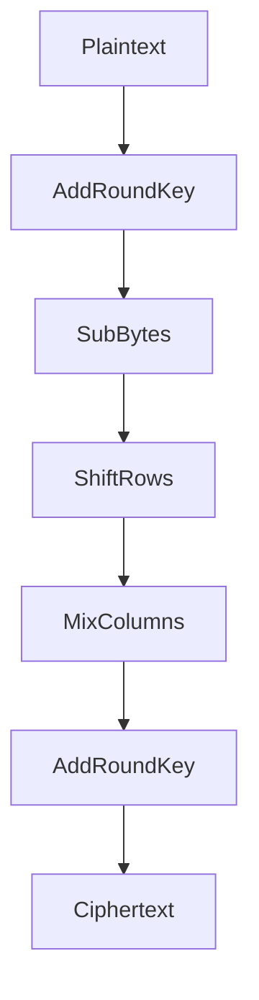
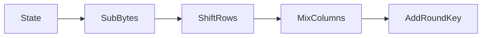

# Week - 5
:::info[TITLE]
## Lecture 21:  Advanced Encryption Standard (AES)
:::

### Overview

* Modern **block cipher** replacing DES 
* Standardized in **2001 (NIST)**
* Based on **Rijndael algorithm**

---

## Key Features

* Block size:
  $$
  128 \text{ bits}
  $$

* Key sizes:

  * 128-bit → 10 rounds
  * 192-bit → 12 rounds
  * 256-bit → 14 rounds

---

## AES Variants

| Variant | Key Size | Rounds |
| ------- | -------- | ------ |
| AES-128 | 128      | 10     |
| AES-192 | 192      | 12     |
| AES-256 | 256      | 14     |

---

## Design Goals

* Resistant to:

  * Differential attacks
  * Linear attacks
* Fast and efficient
* Simple structure 

---

## Data Representation (State)

* Plaintext = 128 bits → 16 bytes

### Stored as Matrix:

$$
\begin{bmatrix}
S_{00} & S_{01} & S_{02} & S_{03} \\
S_{10} & S_{11} & S_{12} & S_{13} \\
S_{20} & S_{21} & S_{22} & S_{23} \\
S_{30} & S_{31} & S_{32} & S_{33}
\end{bmatrix}
$$

* Each element = **1 byte (8 bits)**

---

## AES Structure

### Initial Step

* AddRoundKey

---

### Main Rounds (r − 1 times)

Each round consists of:

1. SubBytes
2. ShiftRows
3. MixColumns
4. AddRoundKey

---

### Final Round

* SubBytes
* ShiftRows
* AddRoundKey
  ❌ No MixColumns

---

## Round Flow

---

## Core Operations

### 1. SubBytes

* Non-linear substitution
* Uses **S-box**

$$
S_{ij} \rightarrow S(S_{ij})
$$

* Input: 8-bit
* Output: 8-bit

---

### 2. ShiftRows

* Row-wise shifting:

  * Row 0 → no shift
  * Row 1 → left shift by 1
  * Row 2 → left shift by 2
  * Row 3 → left shift by 3

---

### 3. MixColumns

* Column-wise transformation
* Uses polynomial arithmetic in:

$$
GF(2^8)
$$

---

### 4. AddRoundKey

* XOR with round key:

$$
\text{State} = \text{State} \oplus \text{RoundKey}
$$

---

## Key Expansion

* Generates:
  $$
  K_1, K_2, ..., K_r
  $$

* Each round uses different key

---

## Important Concepts

* Works on **bytes (8-bit units)**
* Uses:

  * Finite field arithmetic
  * Polynomial operations

---

## Why AES is Strong

* Non-linearity (S-box)
* Diffusion (MixColumns)
* Multiple rounds
* Large key sizes

---

## Key Takeaways

* AES = substitution + permutation based cipher
* Uses **4 core operations**
* Works on **4×4 byte matrix**
* Most widely used encryption standard today

---

## Final Conclusion

* AES is:

  * Secure
  * Efficient
  * Standard for modern encryption

$$
\text{Widely used in: HTTPS, Wi-Fi, Banking, etc.}
$$

:::info[TITLE]
## Lecture 22:  Advanced Encryption Standard (AES) - Continued
:::

## AES S-Box (Algebraic Construction)

* Not just a lookup table
* Built using **finite field ( GF(2^8) )** 

---

### Steps to Compute S-Box

1. Represent byte as polynomial in ( GF(2^8) )

$$
a(x) = a_0 + a_1 x + a_2 x^2 + \cdots + a_7 x^7
$$

---

2. Compute multiplicative inverse:

$$
a^{-1} \text{ in } GF(2^8)
$$

* If ( a = 0 ), define inverse as 0

---

3. Apply affine transformation:

$$
b_i = a_i \oplus a_{(i+4)} \oplus a_{(i+5)} \oplus a_{(i+6)} \oplus a_{(i+7)} \oplus c_i
$$

* Indices mod 8
* ( c_i ) = constant

---

### Example

Input:
$$
53_{16}
$$

Output:
$$
ED_{16}
$$

---

## MixColumns Operation

* Column-wise transformation
* Based on matrix multiplication in ( GF(2^8) )

---

### Transformation

$$
\begin{bmatrix}
S'_0 \\
S'_1 \\
S'_2 \\
S'_3
\end{bmatrix}
=

\begin{bmatrix}
2 & 3 & 1 & 1 \\
1 & 2 & 3 & 1 \\
1 & 1 & 2 & 3 \\
3 & 1 & 1 & 2
\end{bmatrix}
\cdot
\begin{bmatrix}
S_0 \\
S_1 \\
S_2 \\
S_3
\end{bmatrix}
$$

---

### Notes

* Multiplication done in:
  $$
  GF(2^8)
  $$

* Addition = XOR

---

## Key Scheduling (Key Expansion)

### Input

* Initial key:
  $$
  128 \text{ bits} = 16 \text{ bytes}
  $$

---

### Output

* Round keys:
  $$
  K_1, K_2, ..., K_{11}
  $$

(each 128-bit)

---

## Word Representation

* Split key into 4 words:

$$
W_1, W_2, W_3, W_4
$$

(each 32-bit)

---

## Generating Next Words

### Formula

$$
W_i = W_{i-4} \oplus W_{i-1}
$$

---

### Special Case (every 4th word)

Apply function ( g ):

$$
W_i = W_{i-4} \oplus g(W_{i-1})
$$

---

## g Function

### Steps

1. **Rotation**

$$
[b_0, b_1, b_2, b_3] \rightarrow [b_1, b_2, b_3, b_0]
$$

---

2. **SubBytes (S-box)**

$$
b_i \rightarrow S(b_i)
$$

---

3. **Add Round Constant**

$$
b_i = b_i \oplus Rcon
$$

---

## Decryption (Inverse Operations)

| Encryption  | Decryption    |
| ----------- | ------------- |
| SubBytes    | InvSubBytes   |
| ShiftRows   | InvShiftRows  |
| MixColumns  | InvMixColumns |
| AddRoundKey | Same (XOR)    |

---

## Important Insights

* XOR is its own inverse:
  $$
  a \oplus b \oplus b = a
  $$

---

* AES combines:

  * Field arithmetic
  * Bitwise operations

---

## Complete Round (Concept)

---

## Key Takeaways

* S-box:

  * Built using algebra (not random)
* MixColumns:

  * Matrix × vector in ( GF(2^8) )
* Key schedule:

  * Expands key into round keys
* Strong due to:

  * Non-linearity + diffusion

---

## Final Conclusion

* AES internally uses:
  $$
  GF(2^8)
  $$

* Combines:

  * Algebra
  * Bit operations

✔ This structured design makes AES **secure and efficient**

:::info[TITLE]
## Lecture 23:  Introduction to Public Key Cryptosystem, Diffie-Hellman Key Exchange
:::

## Motivation

* Two parties (**Alice & Bob**) communicate over **insecure channel**
* Goal:

  * Ensure **confidentiality**

---

## Symmetric Key Problem

### Model

* Same key used:
  $$
  \text{Encryption key} = \text{Decryption key} = K
  $$

---

### Issues

1. **Key Distribution Problem**

   * How to securely share ( K )?

2. **Scalability Problem**

   * For ( n ) users:
     $$
     \frac{n(n-1)}{2}
     $$
     keys required

---

## Diffie-Hellman Key Exchange

### Purpose

* Establish **shared secret key** over insecure channel

---

### Setup

* Public:
  $$
  p = \text{prime}, \quad g = \text{generator}
  $$

Example:
$$
p = 23,; g = 5
$$

---

### Step 1: Secret Selection

* Alice:
  $$
  a = 6
  $$

* Bob:
  $$
  b = 15
  $$

---

### Step 2: Compute Public Values

$$
A = g^a \mod p = 5^6 \mod 23 = 8
$$

$$
B = g^b \mod p = 5^{15} \mod 23 = 19
$$

---

### Step 3: Exchange

* Alice → Bob: ( A )
* Bob → Alice: ( B )

---

### Step 4: Shared Secret

* Alice computes:
  $$
  K = B^a \mod p = 19^6 \mod 23 = 2
  $$

* Bob computes:
  $$
  K = A^b \mod p = 8^{15} \mod 23 = 2
  $$

✔ Same key derived

---

## Security Basis

* Based on **Discrete Logarithm Problem**

$$
g^a \mod p \Rightarrow a \text{ is hard to compute}
$$

---

## Public Key Cryptosystem

### Idea

* Each user has **two keys**:

1. Public Key (Encryption key)
2. Private Key (Decryption key)

---

## Communication Flow

1. Bob generates:

   * Public key: ( $$K_{ pub } $$ )
   * Private key: ( $$K_{priv} $$ )

2. Bob publishes:
   $$
   K_{pub}
   $$

3. Alice encrypts:
   $$
   C = E(K_{pub}, M)
   $$

4. Bob decrypts:
   $$
   M = D(K_{priv}, C)
   $$

---

## Key Property

* Given:
  $$
  K_{pub}
  $$

❌ It should be **computationally infeasible** to find:
  $$
  K_{priv}
  $$

---

## Advantages over Symmetric

* No need to share secret key
* Scalable
* Suitable for large networks

---

## Examples of PKC

* RSA
* ElGamal
* Knapsack Cryptosystem

---

## Key Takeaways

* Diffie-Hellman → key exchange
* PKC → separate keys for encryption/decryption
* Security → based on hard mathematical problems

---

## Final Conclusion

* Public key cryptography solves:

  * Key distribution problem
  * Scalability issues

$\text{Foundation of modern secure communication (HTTPS, SSH, etc.)}$

:::info[TITLE]
## Lecture 24:  Knapsack Cryptosystem
:::

## AKA Subset Sum

### Problem Definition

Given:

* Numbers: $a_1, a_2, ..., a_n$
* Target sum: $S$

Find binary values $x_i \in {0,1}$ such that:

$$
\sum_{i=1}^{n} a_i x_i = S
$$

---

## Complexity

* Total subsets:
  $$
  2^n
  $$

* Brute force → **Exponential time (hard problem)**

---

## Superincreasing Sequence

### Definition

Sequence where:

$$
a_i > \sum_{j=1}^{i-1} a_j
$$

---

### Property

* Subset sum becomes **easy (polynomial time)**
* Solve using **greedy approach**

---

## Greedy Solution Idea

* Start from largest element
* If:
  $$
  S \ge a_n
  $$
  → include it
* Reduce:
  $$
  S = S - a_n
  $$
* Repeat

---

## Knapsack Cryptosystem Idea

### Step 1: Private Key (Bob)

* Choose **superincreasing sequence**:
  $$
  a_1, a_2, ..., a_n
  $$

* Choose:
  $$
  m > \sum a_i
  $$

* Choose:
  $$
  w \text{ such that } \gcd(w,m)=1
  $$

---

## Step 2: Public Key

Transform:

$$
A_i = w \cdot a_i \mod m
$$

* Public key:
  $$
  {A_1, A_2, ..., A_n}
  $$

---

## Step 3: Encryption (Alice)

* Message bits:
  $$
  x_1, x_2, ..., x_n
  $$

* Ciphertext:

$$
C = \sum A_i x_i
$$

---

## Step 4: Decryption (Bob)

* Compute:

$$
S = C \cdot w^{-1} \mod m
$$

* Now solve:

$$
S = \sum a_i x_i
$$

✔ Easy because sequence is **superincreasing**

---

## Key Insight

* Public sequence looks **random (hard problem)**
* Private sequence is **structured (easy problem)**

---

## Why It Works

* Transformation hides structure:
  $$
  A_i = w a_i \mod m
  $$

* Only Bob knows:

  * $w^{-1}$
  * original sequence

---

## Security Idea

* Based on:

  * Hardness of **subset sum problem**

---

## Weakness

* Original knapsack cryptosystem:

  * **Broken (not secure today)**
* Structure can be recovered

---

## Key Takeaways

* Subset sum:

  * Hard in general
  * Easy for superincreasing sequence
* Cryptosystem:

  * Uses transformation to hide structure

---

## Final Conclusion

* Knapsack cryptosystem introduced idea of:

  * **trapdoor function**

$$
\text{Easy with secret, hard without it}
$$

✔ Important concept in public key cryptography

:::info[TITLE]
## Lecture 25:  RSA Cryptosystem
:::

### Overview

* Public key cryptosystem by **Rivest, Shamir, Adleman**
* Based on:
  $$
  \text{Integer factorization problem}
  $$

---

## Key Idea

* Two keys:

  * Public key → encryption
  * Private key → decryption

---

## Key Generation (Bob)

### Step 1: Choose Primes

$$
p, q \text{ are large primes}
$$

---

### Step 2: Compute

$$
n = p \cdot q
$$

$$
\phi(n) = (p-1)(q-1)
$$

---

### Step 3: Choose Public Exponent

$$
e \text{ such that } \gcd(e,\phi(n))=1
$$

---

### Step 4: Compute Private Key

$$
d \equiv e^{-1} \pmod{\phi(n)}
$$

i.e.
$$
e \cdot d \equiv 1 \pmod{\phi(n)}
$$

---

## Keys

* Public key:
  $$
  (e,n)
  $$

* Private key:
  $$
  (d,n)
  $$

---

## Encryption (Alice)

Message:
$$
m \in \mathbb{Z}_n
$$

Ciphertext:
$$
C = m^e \mod n
$$

---

## Decryption (Bob)

$$
m = C^d \mod n
$$

---

## Why It Works

$$
m^{ed} \equiv m \pmod{n}
$$

Using:

* Euler’s theorem
* $ed \equiv 1 \pmod{\phi(n)}$

---

## Example

### Step 1

$$
p = 7,; q = 17
$$

---

### Step 2

$$
n = 7 \cdot 17 = 119
$$

$$
\phi(n) = 6 \cdot 16 = 96
$$

---

### Step 3

Choose:
$$
e = 5
$$

---

### Step 4

Find:
$$
d \equiv e^{-1} \pmod{96}
$$

$$
5d \equiv 1 \pmod{96}
$$

$$
d = 77
$$

(because $5 \cdot 77 = 385 = 4 \cdot 96 + 1$)

---

## Final Keys

* Public:
  $$
  (5,119)
  $$

* Private:
  $$
  (77,119)
  $$

---

## Important Notes

### 1. Large Primes Required

* Small primes → easy to factor
* Security depends on:
  $$
  n = p \cdot q
  $$

---

### 2. Prime Testing

* Algorithms:

  * Miller-Rabin

---

### 3. Efficient Exponentiation

Compute:
$$
a^b \mod n
$$

Using:

* Fast exponentiation (square & multiply)

---

## Key Property (Flexibility)

* RSA supports:

  * Encryption
  * Digital signatures

---

## Key Takeaways

* Based on:

  * Factorization hardness
* Uses:

  * Modular arithmetic
  * Euler’s theorem
* Requires:

  * Large primes

---

## Final Conclusion

* RSA is one of the most important:

$$
\text{Public key cryptosystems in practice}
$$

✔ Used in:

* HTTPS
* Digital signatures
* Secure communication
