# Unit - 2
:::info[Title]
## Basics of Routing & Switching
:::
***

## 1. Router

A router is a fundamental networking device that operates at the **Network Layer (Layer 3)** of the OSI model. It connects multiple networks and directs data packets between them using logical addressing (IP addresses).

Routers are responsible for determining the best path for data transmission across interconnected networks.

***

### 1.1 Definition of Router

A Router is:

> A networking device that forwards data packets between different networks based on IP addresses.

Unlike switches (which operate at Layer 2 using MAC addresses), routers:

* Use IP addressing
* Maintain routing tables
* Make path selection decisions

Routers connect:

* LAN to WAN
* LAN to LAN
* Enterprise network to Internet

Basic representation:


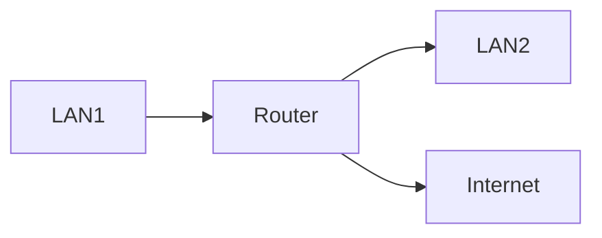


***

### 1.2 Function of Router

A router performs several critical functions in a network.

#### 1.2.1 Packet Forwarding

Routers examine:

* Destination IP address
* Routing table

They determine:

* Best next hop
* Appropriate outgoing interface

***

#### 1.2.2 Path Selection

Routers use routing algorithms to determine the optimal path.

Routing decisions may be based on:

* Hop count
* Bandwidth
* Delay
* Administrative distance
* Cost

Dynamic routing protocols help automate this process.

***

#### 1.2.3 Network Segmentation

Routers divide networks into smaller segments.

Benefits:

* Reduced broadcast traffic
* Improved performance
* Increased security

***

#### 1.2.4 Logical Addressing

Routers operate using:

* IPv4 or IPv6 addresses

They do not rely on MAC addresses for forwarding between networks.

***

#### 1.2.5 Packet Filtering (Basic Security)

Routers can apply:

* Access Control Lists (ACLs)
* Basic firewall rules

To allow or deny traffic.

***

### 1.3 Internetworking and Packet Forwarding

#### 1.3.1 Internetworking

Internetworking refers to:

> Connecting multiple separate networks into a larger network system.

Routers enable internetworking by:

* Connecting different IP subnets
* Handling traffic between networks

Example:

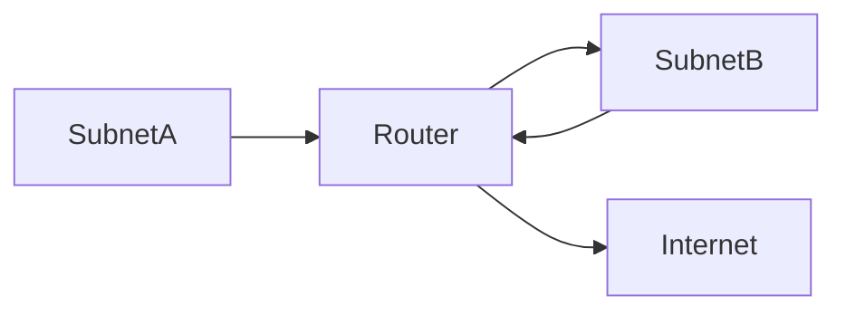

Each subnet has a unique network address.

***

#### 1.3.2 Packet Forwarding Process

When a router receives a packet, it performs these steps:

1. Receive packet on incoming interface
2. Read destination IP address
3. Check routing table
4. Determine next hop
5. Forward packet through outgoing interface

Flow:

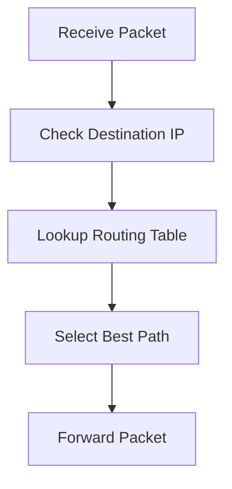

***

#### 1.3.3 Routing Table

A routing table contains:

* Destination network
* Subnet mask
* Next hop address
* Outgoing interface
* Metric

Example entry:

```
Destination: 192.168.1.0/24
Next Hop: 10.0.0.2
Interface: eth0
Metric: 1
```

***

#### 1.3.4 Forwarding Decision Types

Routers can forward packets using:

1. Static Routing
2. Dynamic Routing
3. Default Routing

Default route example:

```
0.0.0.0/0 → Internet Gateway
```

***

#### 1.3.5 Difference Between Router and Switch

| Feature              | Router            | Switch              |
| -------------------- | ----------------- | ------------------- |
| OSI Layer            | Layer 3           | Layer 2             |
| Address Type         | IP                | MAC                 |
| Broadcast Control    | Blocks broadcasts | Forwards broadcasts |
| Network Segmentation | Yes               | No                  |

***

### Summary

Router:

* Operates at Network Layer
* Connects multiple networks
* Forwards packets based on IP
* Uses routing tables
* Enables internetworking
* Provides basic security and traffic control

Routers are essential for:

* Internet connectivity
* Enterprise networks
* Network segmentation
* Path selection

***

***

## 2. Types of Routing

Routing determines how packets move from a source network to a destination network.

There are three main types of routing:

* Static Routing
* Dynamic Routing
* Default Routing

Each method differs in automation, scalability, and management complexity.

***

### 2.1 Static Routing

Static routing is a routing method in which routes are manually configured by a network administrator.

Definition:

> Static routing is a method where fixed paths are manually entered into the routing table and do not change automatically.

***

#### Characteristics of Static Routing

* Manually configured
* No automatic updates
* Low overhead
* Suitable for small networks

***

#### Example of Static Route

```
Destination: 192.168.2.0/24
Next Hop: 10.0.0.2
```

In router CLI (example format):

```
ip route 192.168.2.0 255.255.255.0 10.0.0.2
```

***

#### Advantages

* Simple configuration
* Predictable routing behavior
* No bandwidth usage for routing updates
* More secure (no external protocol influence)

***

#### Disadvantages

* Not scalable for large networks
* No automatic adaptation to topology changes
* High administrative effort

***

#### Static Routing Flow

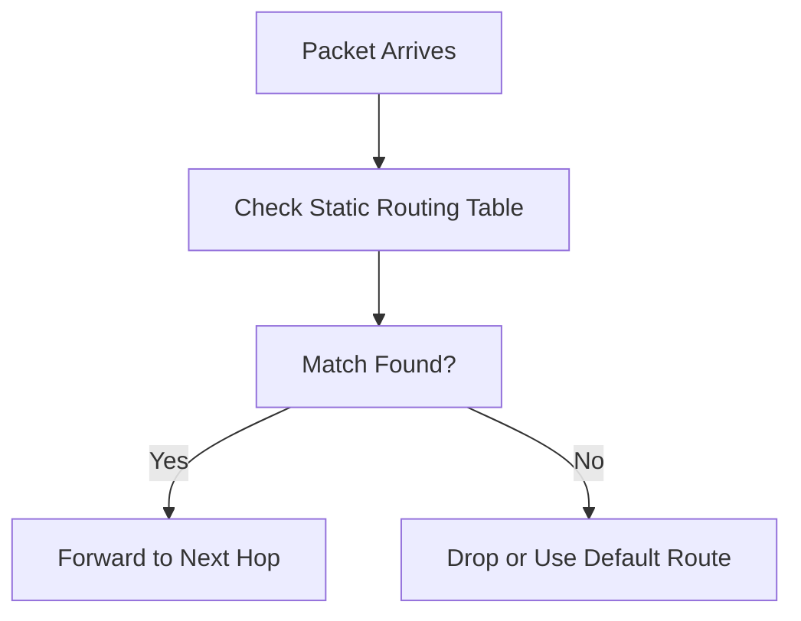

***

### 2.2 Dynamic Routing

Dynamic routing automatically updates routing tables using routing protocols.

Definition:

> Dynamic routing uses routing protocols to exchange routing information between routers and determine best paths automatically.

Routers share:

* Network information
* Route costs
* Network topology

This allows automatic adaptation to:

* Link failures
* Network changes
* Congestion

***

#### Advantages

* Scalable
* Automatic updates
* Fault tolerance
* Efficient path selection

***

#### Disadvantages

* Higher CPU usage
* Consumes bandwidth
* More complex configuration

***

#### 2.2.1 RIP (Routing Information Protocol)

RIP is one of the oldest dynamic routing protocols.

Type: Distance Vector Protocol

Metric used: Hop Count

Maximum hop count: 15

If hop count exceeds 15 → route is unreachable.

***

#### How RIP Works

* Routers exchange routing tables every 30 seconds
* Uses Bellman-Ford algorithm
* Chooses route with minimum hop count

***

#### Limitations

* Slow convergence
* Limited scalability
* Not suitable for large networks

***

#### RIP Operation

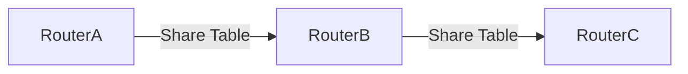

***

#### 2.2.2 OSPF (Open Shortest Path First)

OSPF is a Link-State Routing Protocol.

Metric used: Cost (based on bandwidth)

Algorithm used:

* Dijkstra’s Shortest Path First (SPF)

***

#### How OSPF Works

1. Routers build Link-State Database (LSDB)
2. Each router has full topology map
3. Calculates shortest path tree

***

#### Features

* Fast convergence
* Scalable
* Supports hierarchical design (Areas)
* Uses multicast updates

***

#### OSPF Topology Model

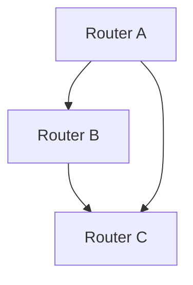

SPF computes best path automatically.

***

#### 2.2.3 EIGRP (Enhanced Interior Gateway Routing Protocol)

EIGRP is an advanced hybrid routing protocol (Cisco proprietary originally).

Combines:

* Distance Vector
* Link State features

Algorithm used:

* DUAL (Diffusing Update Algorithm)

***

#### Metrics Used

* Bandwidth
* Delay
* Reliability
* Load

***

#### Advantages

* Fast convergence
* Efficient updates
* Supports unequal cost load balancing

***

#### EIGRP Behavior

* Maintains topology table
* Sends updates only when changes occur
* Reduces network traffic

***

#### Comparison of Dynamic Protocols

| Feature     | RIP             | OSPF         | EIGRP     |
| ----------- | --------------- | ------------ | --------- |
| Type        | Distance Vector | Link State   | Hybrid    |
| Metric      | Hop Count       | Cost         | Composite |
| Convergence | Slow            | Fast         | Very Fast |
| Scalability | Low             | High         | High      |
| Algorithm   | Bellman-Ford    | Dijkstra SPF | DUAL      |

***

### 2.3 Default Routing

Default routing is used when:

* No specific route matches the destination

Definition:

> A default route forwards packets to a predefined gateway when no matching entry exists in the routing table.

Default route representation:

```
0.0.0.0/0
```

This means:

* Any unknown destination → forward to default gateway

***

#### Example

```
ip route 0.0.0.0 0.0.0.0 10.0.0.1
```

This sends all unknown traffic to 10.0.0.1.

***

#### Default Routing Flow

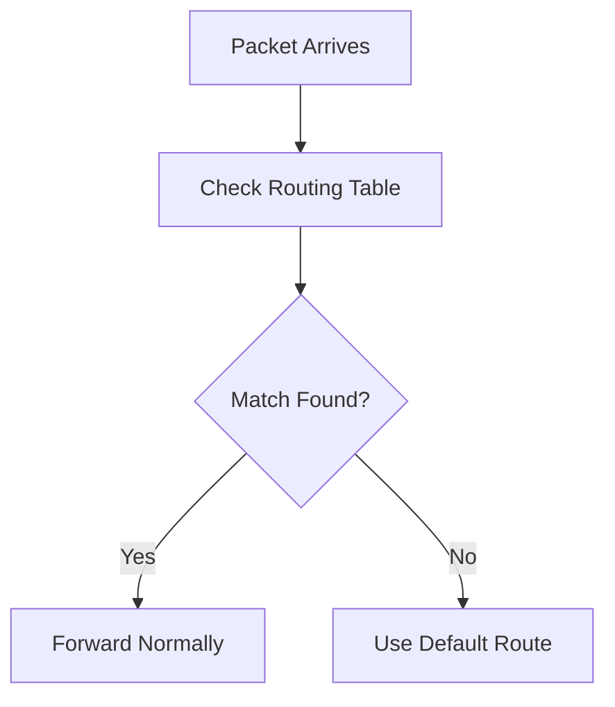

***

#### Use Cases

* Small networks connected to Internet
* Edge routers
* Stub networks

***

## Summary

Routing Types:

#### Static Routing

* Manual
* Simple
* Not scalable

#### Dynamic Routing

* Automatic
* Uses protocols (RIP, OSPF, EIGRP)
* Scalable and adaptive

#### Default Routing

* Fallback route
* Used for unknown destinations

Routing ensures:

* Efficient packet delivery
* Network scalability
* Reliable communication

***

***

## 3. Switches

Switches are essential networking devices used to connect multiple devices within the same Local Area Network (LAN). They operate primarily at the **Data Link Layer (Layer 2)** of the OSI model, although some advanced switches can also operate at Layer 3.

Switches are responsible for forwarding data frames based on **MAC addresses**, ensuring efficient communication within a network.

***

### 3.1 Definition of Switch

A Switch is:

> A networking device that connects multiple devices in a LAN and forwards data frames based on MAC addresses.

Unlike hubs (which broadcast data to all devices), switches:

* Send data only to the intended destination
* Reduce unnecessary traffic
* Improve network performance

Basic network representation:

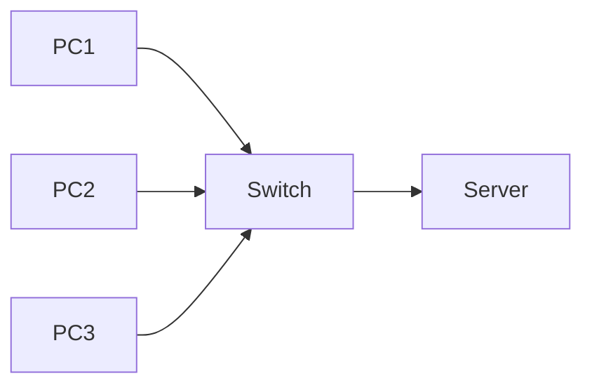

Each device connected to a switch operates in its own collision domain.

***

#### How a Switch Works

Switches maintain a **MAC Address Table** (also called CAM Table).

This table stores:

* MAC address
* Port number

Example:

```
MAC Address        Port
00:1A:2B:3C:4D:5E  Port 1
00:2B:3C:4D:5E:6F  Port 2
```

When a frame arrives:

1. Switch reads destination MAC address
2. Looks up MAC table
3. Forwards frame to correct port

If MAC address is unknown:

* Frame is broadcast to all ports (except incoming port)

***

### 3.2 Role of Switch in Network

Switches play multiple important roles in a LAN.

***

#### 3.2.1 Traffic Forwarding

Switch forwards frames intelligently.

Process:

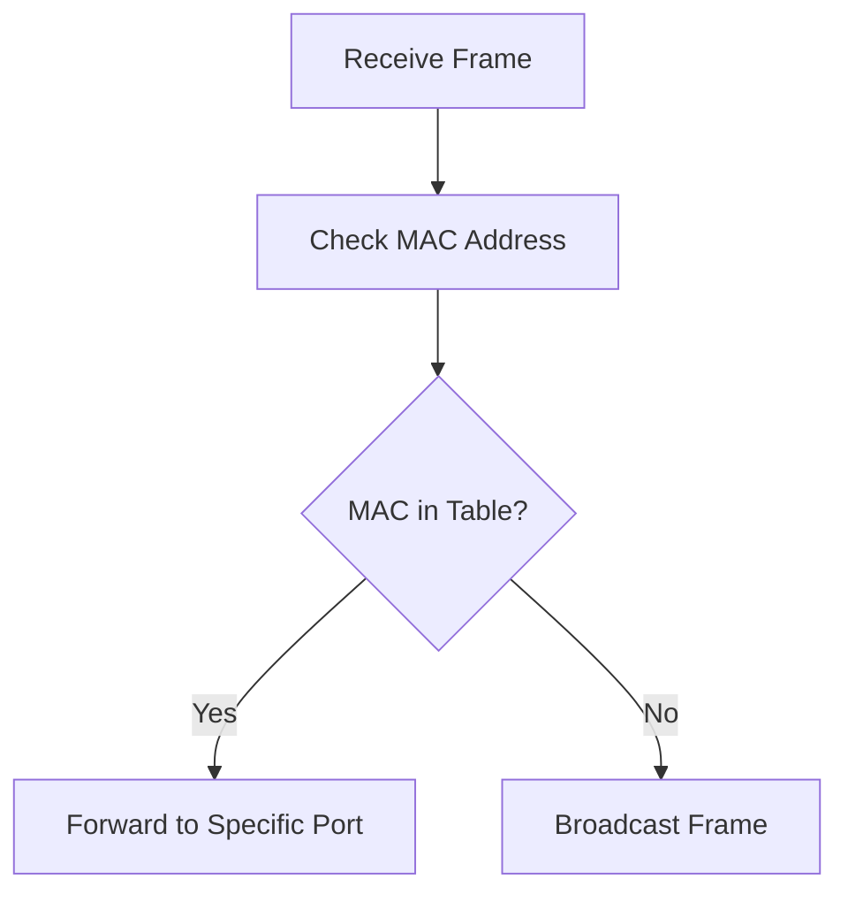

This improves:

* Efficiency
* Speed
* Network reliability

***

#### 3.2.2 Reducing Collision

Each port on a switch is a separate collision domain.

Unlike hubs:

* No shared bandwidth
* No collisions in full-duplex mode

Result:

* Higher throughput
* Better performance

***

#### 3.2.3 Learning MAC Addresses

Switch automatically learns MAC addresses by:

* Reading source MAC address of incoming frames
* Associating MAC with port

This process is called:

* MAC Learning

***

#### 3.2.4 Network Segmentation

Switch divides a network into:

* Multiple collision domains
* Separate communication paths

This reduces broadcast traffic and improves scalability.

***

#### 3.2.5 VLAN Support (Advanced Switches)

Managed switches support:

* Virtual LANs (VLANs)

VLAN allows:

* Logical separation of networks
* Improved security
* Traffic isolation

Example:

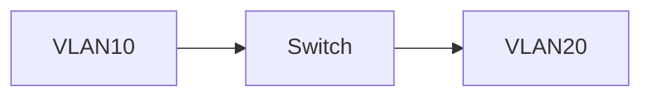

Devices in VLAN10 cannot directly communicate with VLAN20 unless routed.

***

#### 3.2.6 Full-Duplex Communication

Switch supports:

* Simultaneous sending and receiving

This eliminates collisions entirely.

***

#### 3.2.7 Switch vs Hub

| Feature          | Switch            | Hub       |
| ---------------- | ----------------- | --------- |
| OSI Layer        | Layer 2           | Layer 1   |
| Data Forwarding  | MAC-based         | Broadcast |
| Collision Domain | Separate per port | Single    |
| Efficiency       | High              | Low       |
| Security         | Better            | Poor      |

***

#### 3.2.8 Switch vs Router

| Feature            | Switch         | Router             |
| ------------------ | -------------- | ------------------ |
| OSI Layer          | Layer 2        | Layer 3            |
| Address Used       | MAC            | IP                 |
| Connects           | Devices in LAN | Different Networks |
| Broadcast Handling | Forwards       | Blocks             |

***

### Summary

Switch:

* Operates at Data Link Layer
* Uses MAC addresses
* Maintains MAC address table
* Reduces collisions
* Improves LAN efficiency
* Supports VLAN (advanced models)

Switches are fundamental for:

* Enterprise LAN
* Campus networks
* Data centers

***

***

## 4. Switching Techniques

Switching techniques define how data is transmitted from a source to a destination across a network.

There are three major switching techniques:

* Circuit Switching
* Packet Switching
* Message Switching

Each technique differs in:

* Resource allocation
* Delay characteristics
* Efficiency
* Reliability

***

### 4.1 Circuit Switching

Circuit Switching establishes a dedicated communication path between sender and receiver before data transmission begins.

Definition:

> Circuit Switching is a communication method in which a dedicated path is established and reserved for the entire duration of communication.

***

#### Working Principle

1. Call setup phase
2. Dedicated path established
3. Data transmission
4. Call termination

Process:

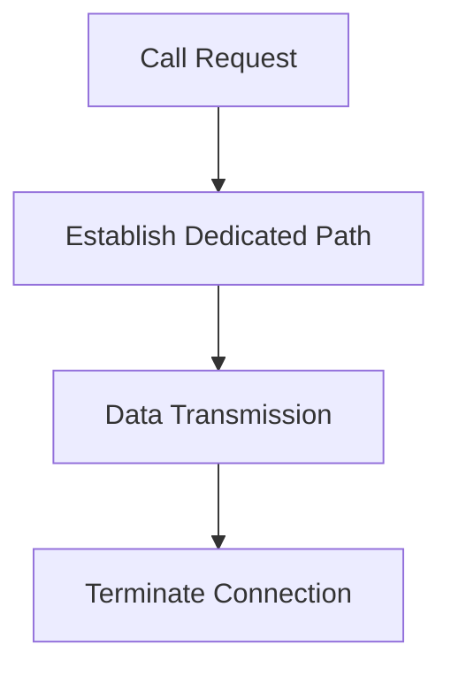

***

#### Characteristics

* Dedicated bandwidth
* Fixed path
* No data sharing with other users
* Continuous transmission

***

#### Example

Traditional telephone network (PSTN)

When you make a phone call:

* A physical circuit is reserved
* No other user can use that circuit

***

#### Advantages

* Guaranteed bandwidth
* Low delay once connected
* Predictable performance

***

#### Disadvantages

* Inefficient resource utilization
* Connection setup delay
* Not suitable for bursty data

***

#### Real-world Use

* Traditional telephone systems
* Early WAN networks

***

### 4.2 Packet Switching

Packet Switching divides data into small packets and sends them independently across the network.

Definition:

> Packet Switching is a communication method in which data is divided into packets, and each packet may travel independently through different paths.

***

#### Working Principle

1. Data is broken into packets
2. Each packet contains:
   * Source address
   * Destination address
   * Sequence number
3. Packets travel independently
4. Reassembled at destination

Process:

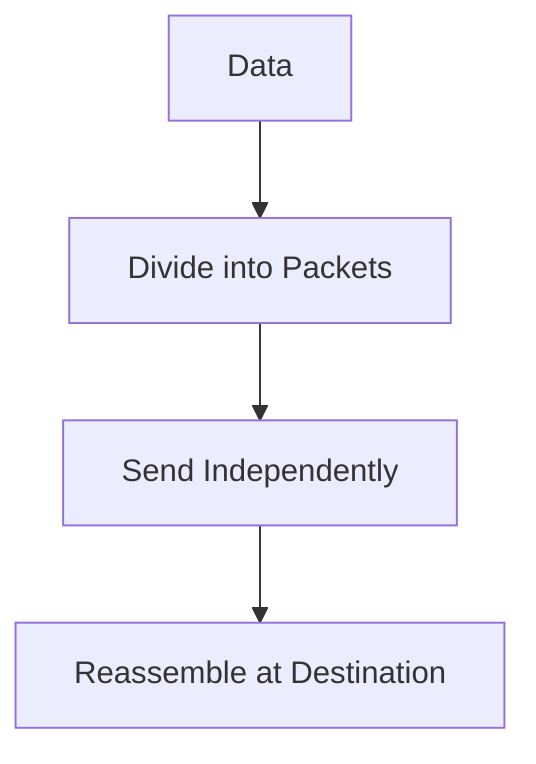

***

#### Characteristics

* No dedicated path
* Shared network resources
* Efficient bandwidth usage
* Variable delay

***

#### Types of Packet Switching

1. Datagram Packet Switching
   * Each packet routed independently
   * Example: Internet (IP)
2. Virtual Circuit Packet Switching
   * Logical path established first
   * Example: Frame Relay

***

#### Advantages

* Efficient resource utilization
* Scalable
* Fault tolerant (reroutes if path fails)

***

#### Disadvantages

* Variable delay (jitter)
* Possible packet loss
* Out-of-order delivery

***

#### Real-world Use

* Internet
* LAN/WAN networks
* Modern communication systems

Packet Switching is the foundation of the Internet.

***

### 4.3 Message Switching

Message Switching transmits the entire message as one unit from source to destination.

Definition:

> Message Switching is a store-and-forward technique where the entire message is transmitted to an intermediate node before being forwarded.

***

#### Working Principle

1. Entire message sent to switch
2. Switch stores message
3. Switch forwards to next node

Process:

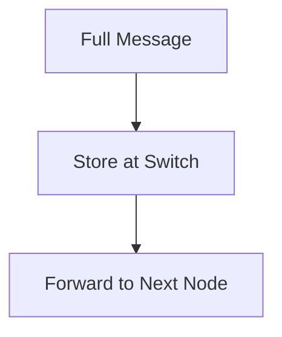

***

#### Characteristics

* No dedicated path
* Entire message stored at each node
* Requires large buffer storage
* High delay

***

#### Advantages

* No need for dedicated circuit
* Efficient line utilization

***

#### Disadvantages

* High storage requirement
* Large delay
* Not suitable for real-time communication

***

#### Real-world Use

* Telegraph systems
* Early email systems
* Some messaging infrastructures

***

## Comparison of Switching Techniques

| Feature             | Circuit Switching | Packet Switching | Message Switching       |
| ------------------- | ----------------- | ---------------- | ----------------------- |
| Dedicated Path      | Yes               | No               | No                      |
| Resource Allocation | Reserved          | Shared           | Shared                  |
| Delay               | Low after setup   | Variable         | High                    |
| Efficiency          | Low               | High             | Moderate                |
| Suitable For        | Voice calls       | Internet data    | Non-real-time messaging |
| Example             | Telephone network | Internet         | Telegraph               |

***

## Summary

Circuit Switching:

* Dedicated path
* Predictable performance
* Inefficient for data networks

Packet Switching:

* Most widely used
* Efficient and scalable
* Used in Internet

Message Switching:

* Store-and-forward
* High delay
* Rare in modern systems

***

***

## 5. Endpoint Security

Endpoint security focuses on protecting individual devices (endpoints) that connect to a network.

Endpoints include:

* Desktop computers
* Laptops
* Smartphones
* Tablets
* Servers
* IoT devices

Since endpoints are entry points to a network, they are common targets for cyberattacks.

***

### 5.1 Endpoint Solution

An Endpoint Solution is:

> A security mechanism deployed on individual devices to protect them from malware, unauthorized access, and cyber threats.

Endpoint solutions operate at the device level and typically include:

* Malware protection
* Firewall controls
* Intrusion detection
* Data protection
* Access control

***

#### Why Endpoint Solutions are Important

Modern threats often:

* Target user devices
* Use phishing emails
* Exploit software vulnerabilities
* Install ransomware

If one endpoint is compromised:

* Entire network may be affected

Endpoint security acts as the first line of defense.

***

#### Basic Architecture

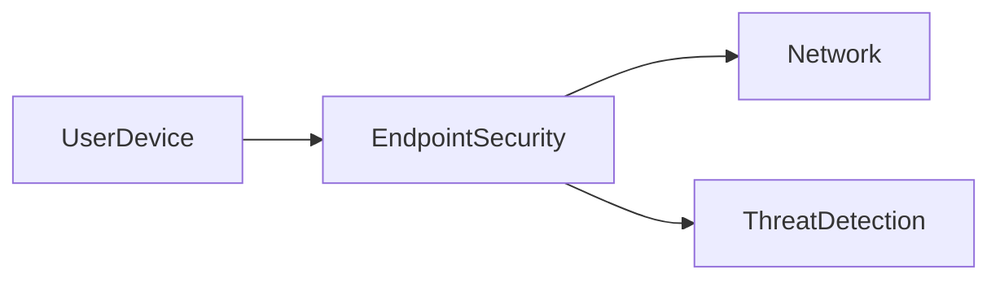

Endpoint software monitors:

* Files
* Processes
* Network activity
* System behavior

***

### 5.2 Endpoint Security Management

Endpoint Security Management refers to:

> Centralized administration and monitoring of all endpoint security policies and devices in an organization.

In enterprise environments:

* Hundreds or thousands of devices exist
* Central management is required

***

#### Key Functions of Endpoint Management

1. Policy Enforcement
2. Threat Monitoring
3. Patch Management
4. Software Updates
5. Remote Monitoring
6. Incident Response

***

#### Centralized Management Model

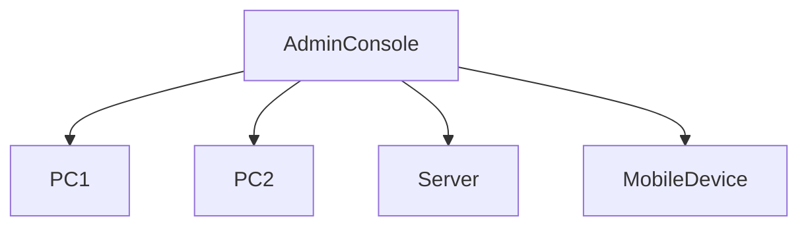

Benefits:

* Uniform security policies
* Real-time monitoring
* Faster response to incidents

***

#### Security Policies Managed

* Password policies
* Firewall rules
* Device access rules
* USB restrictions
* Encryption policies

***

### 5.3 Types of Endpoint Solutions

There are multiple types of endpoint security tools designed to address different threat vectors.

***

#### 5.3.1 Antivirus and Antimalware

Antivirus software detects and removes malicious software.

Malware types include:

* Virus
* Worm
* Trojan
* Ransomware
* Spyware

***

#### Detection Techniques

1. Signature-based detection
   * Matches known malware signatures
2. Heuristic analysis
   * Detects suspicious behavior
3. Behavioral analysis
   * Monitors unusual activity
4. AI/ML-based detection
   * Identifies unknown threats

***

#### Working Flow

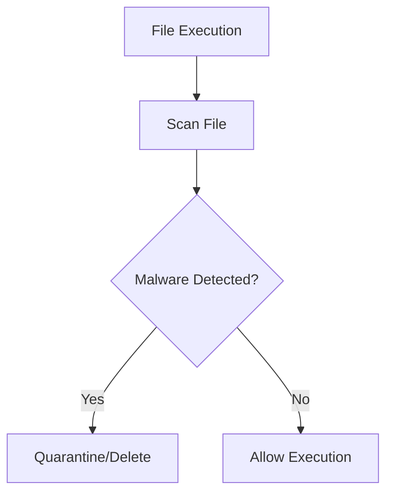

Advantages:

* Protects against known threats
* Real-time scanning
* Automatic updates

Limitations:

* May not detect zero-day attacks

***

#### 5.3.2 Firewall Protection

Endpoint firewalls control incoming and outgoing traffic at the device level.

Definition:

> A firewall monitors and filters network traffic based on predefined security rules.

***

#### Functions

* Block unauthorized connections
* Allow trusted applications
* Prevent remote exploitation

***

#### Firewall Filtering Criteria

* IP Address
* Port Number
* Protocol (TCP/UDP)
* Application

***

Example:

```
Allow: Port 80 (HTTP)
Block: Port 23 (Telnet)
```

Firewall improves:

* Network isolation
* Data protection
* Intrusion prevention

***

#### 5.3.3 Endpoint Detection and Response (EDR)

EDR is an advanced security solution that provides:

* Continuous monitoring
* Threat detection
* Incident response

Definition:

> EDR is a security solution that monitors endpoint activities in real time to detect, investigate, and respond to threats.

***

#### Key Features

* Behavioral monitoring
* Threat hunting
* Incident investigation
* Automated remediation

***

#### EDR Workflow

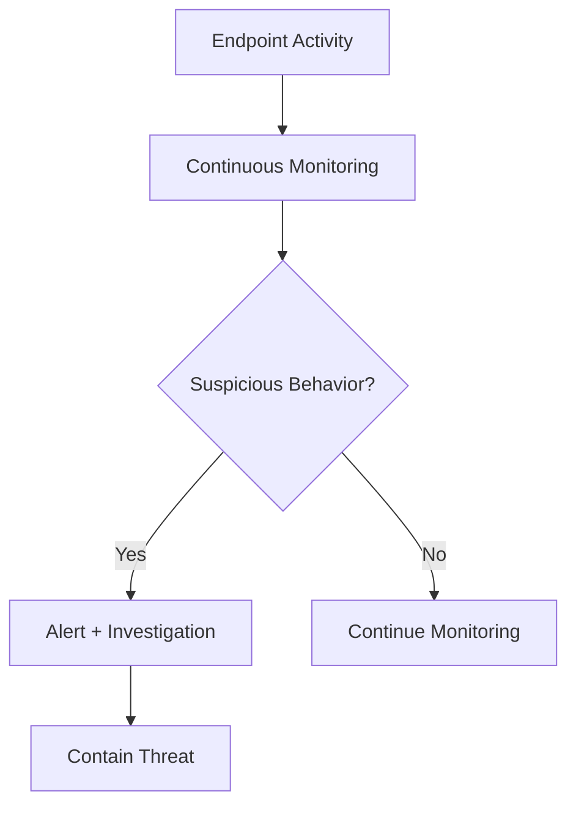

Advantages:

* Detects advanced persistent threats (APT)
* Protects against ransomware
* Real-time response

***

#### 5.3.4 Device Control

Device Control restricts the use of removable devices and external hardware.

Examples:

* USB drives
* External hard disks
* Bluetooth devices
* CD/DVD drives

***

#### Purpose

* Prevent data theft
* Prevent malware introduction
* Enforce corporate policy

***

#### Example Policy

* Block all USB storage devices
* Allow only encrypted drives
* Log all device usage

***

#### Device Control Flow

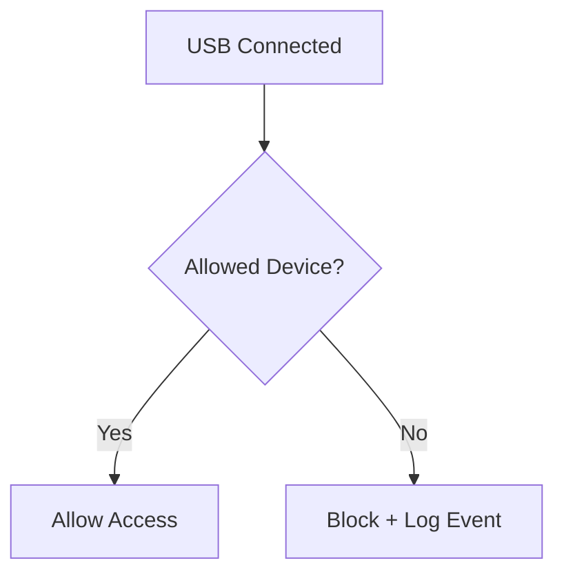

***

## Comparison of Endpoint Solutions

| Solution Type  | Purpose                   | Protection Type      |
| -------------- | ------------------------- | -------------------- |
| Antivirus      | Detect malware            | Signature & Behavior |
| Firewall       | Filter traffic            | Network-based        |
| EDR            | Advanced threat detection | Real-time monitoring |
| Device Control | Restrict hardware access  | Policy-based         |

***

## Summary

Endpoint Security:

* Protects individual devices
* Prevents malware infection
* Controls network access
* Detects advanced threats
* Enforces security policies

Key Components:

* Antivirus & Antimalware
* Firewall Protection
* Endpoint Detection & Response
* Device Control

Endpoint security is critical because:

> The endpoint is often the weakest link in cybersecurity.

***

***

## 6. Access Directory (Active Directory)

Active Directory (AD) is Microsoft’s directory service used in Windows Server environments to manage users, computers, and other network resources centrally.

It provides:

* Centralized authentication
* Authorization
* Policy enforcement
* Resource management

Active Directory is widely used in enterprise networks.

***

### 6.1 Directory Service Concept

A Directory Service is:

> A centralized database system that stores, organizes, and provides access to information about network resources.

It contains information such as:

* Users
* Groups
* Computers
* Printers
* Shared folders
* Policies

Purpose:

* Enable centralized management
* Simplify authentication
* Control access to resources

Directory services follow:

* Hierarchical structure
* Object-based storage
* Logical organization

Basic Model:

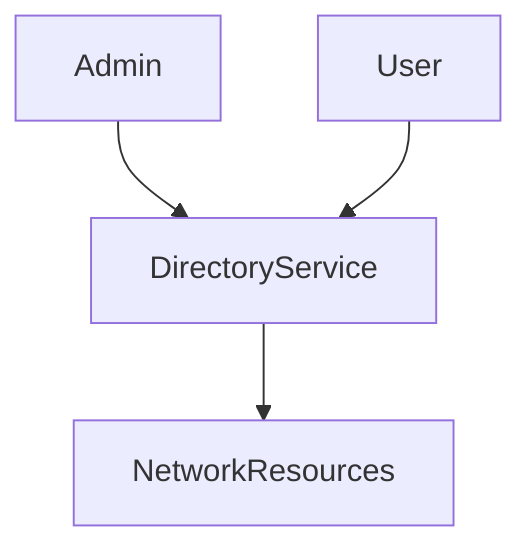

***

### 6.2 Active Directory

Active Directory (AD) is Microsoft’s implementation of a directory service.

It is based on:

* LDAP (Lightweight Directory Access Protocol)
* Kerberos Authentication
* DNS integration

Active Directory stores objects such as:

* User accounts
* Computer accounts
* Security groups
* Organizational Units (OUs)

Key Component:

* Domain Controller (DC)

A Domain Controller:

* Stores AD database
* Authenticates users
* Enforces security policies

***

### 6.3 Active Directory Structure

Active Directory follows a hierarchical structure.

Hierarchy levels:

Forest → Tree → Domain → Organizational Units → Objects

***

#### 6.3.1 Forest

A Forest is:

> The top-level container in Active Directory that contains one or more trees.

It represents the entire AD environment.

Features:

* Shared schema
* Shared global catalog
* Shared configuration

A forest establishes trust relationships between domains.

Visualization:

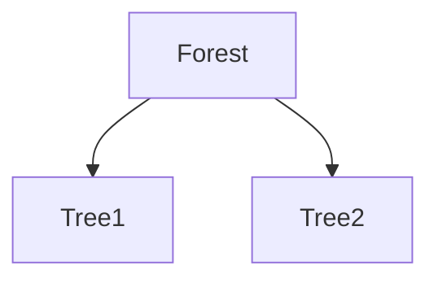

***

#### 6.3.2 Tree

A Tree is:

> A collection of one or more domains that share a contiguous namespace.

Example:

* [example.com](http://example.com)
* [sales.example.com](http://sales.example.com)
* [hr.example.com](http://hr.example.com)

All share the same root domain.

Visualization:

```mermaid
flowchart TD
    example.com --> sales.example.com
    example.com --> hr.example.com
```

Trees allow hierarchical organization of domains.

***

#### 6.3.3 Domain

A Domain is:

> A logical grouping of objects within Active Directory that share a common database and security policies.

Domains contain:

* Users
* Computers
* Groups
* OUs

Each domain:

* Has unique DNS name
* Has at least one Domain Controller

Domains are administrative boundaries.

***

### 6.4 Features of Active Directory

Active Directory provides several important features.

***

#### 6.4.1 Centralized Authentication

Users log in once and access multiple resources.

Single Sign-On (SSO) capability.

***

#### 6.4.2 Group Policy Management

Administrators can apply policies such as:

* Password policies
* Software installation rules
* Desktop restrictions
* Security settings

Group Policy Objects (GPOs) allow centralized control.

***

#### 6.4.3 Scalability

AD supports:

* Thousands of users
* Multiple domains
* Large enterprise networks

***

#### 6.4.4 Replication

Domain Controllers replicate AD database automatically.

This ensures:

* High availability
* Fault tolerance

***

#### 6.4.5 Organizational Units (OUs)

OUs allow logical grouping of objects within a domain.

Example:

* IT Department
* HR Department
* Finance

Helps in:

* Delegating administration
* Applying specific policies

***

### 6.5 Security and Authentication in AD

Active Directory uses secure authentication mechanisms.

***

#### 6.5.1 Kerberos Authentication

Kerberos is the default authentication protocol.

Process:

1. User logs in
2. Requests authentication ticket
3. Receives Ticket Granting Ticket (TGT)
4. Uses ticket to access resources

Authentication Flow:

```mermaid
flowchart TD
    User --> DomainController
    DomainController --> IssueTicket
    User --> AccessServer
    AccessServer --> VerifyTicket
```

Kerberos ensures:

* Secure ticket-based authentication
* No password transmission over network

***

#### 6.5.2 Access Control

AD uses:

* Access Control Lists (ACLs)
* Security Identifiers (SIDs)

Each object has:

* Unique SID
* Permission rules

***

#### 6.5.3 Multi-Factor Authentication (MFA)

Modern AD environments may integrate:

* Smart cards
* OTP
* Biometric authentication

***

#### 6.5.4 Trust Relationships

Domains can trust other domains.

Types:

* One-way trust
* Two-way trust

This allows resource sharing across domains.

***

## Summary

Active Directory:

* Centralized directory service
* Hierarchical structure (Forest → Tree → Domain)
* Uses LDAP and Kerberos
* Provides authentication and authorization
* Supports Group Policies
* Enables centralized management
* Ensures secure enterprise networking

AD is a core component of Windows-based enterprise networks.

***

***

## 7. Tor Network

Tor (The Onion Router) is a decentralized network designed to provide **anonymity and privacy** for users on the Internet.

It protects users by:

* Hiding their IP address
* Encrypting traffic multiple times
* Routing data through multiple volunteer-operated servers

Tor is widely used for:

* Anonymous browsing
* Protecting journalists and activists
* Bypassing censorship
* Accessing hidden services

***

### 7.1 Introduction to Tor

Tor is:

> A privacy-focused network that routes Internet traffic through multiple encrypted layers to anonymize users.

Tor prevents:

* ISP tracking
* Website tracking of real IP
* Government surveillance (to some extent)

Basic flow:

```mermaid
flowchart LR
    User --> EntryNode --> MiddleNode --> ExitNode --> Internet
```

Instead of directly connecting to a website, traffic passes through multiple nodes.

***

### 7.2 Onion Routing

Onion Routing is the core technology behind Tor.

Definition:

> A technique where data is wrapped in multiple layers of encryption, like layers of an onion.

Each node:

* Removes one layer of encryption
* Learns only the next hop
* Does not know full path

Encryption layers:

```mermaid
flowchart TD
    A[Original Data] --> B[Encrypt Layer 1]
    B --> C[Encrypt Layer 2]
    C --> D[Encrypt Layer 3]
```

When passing through nodes:

* Entry node removes outer layer
* Middle node removes next layer
* Exit node removes final layer

No single node knows:

* Source and destination simultaneously

***

### 7.3 Volunteer-Operated Nodes

Tor network consists of:

* Thousands of volunteer-run servers worldwide

Anyone can:

* Set up a Tor relay
* Contribute bandwidth

Types of nodes:

* Entry (Guard) Nodes
* Middle Relays
* Exit Nodes

Because it is decentralized:

* No single authority controls Tor
* Network resilience increases

***

### 7.4 Entry Nodes and Exit Nodes

Tor uses a three-node circuit.

***

#### Entry Node (Guard Node)

* First node in the circuit
* Knows user’s real IP
* Does not know final destination

***

#### Middle Node

* Forwards traffic
* Does not know source or destination

***

#### Exit Node

* Last node in the circuit
* Connects to final website
* Knows destination
* Does NOT know original user

Visualization:

```mermaid
flowchart LR
    User --> EntryNode --> MiddleNode --> ExitNode --> Website
```

Important:

* Exit node can see unencrypted traffic
* HTTPS is strongly recommended

***

### 7.5 Hidden Services (.onion Websites)

Tor supports hidden services known as:

* .onion websites

Definition:

> Hidden services are websites hosted within the Tor network and accessible only via Tor.

Features:

* Both server and client remain anonymous
* No exit node required

Connection model:

```mermaid
flowchart LR
    User --> TorNetwork --> HiddenService
```

Advantages:

* Host identity hidden
* Server location hidden
* Strong privacy

Examples:

* Anonymous forums
* Whistleblowing platforms

***

### 7.6 Encryption

Tor uses layered encryption:

* TLS between nodes
* Public-key cryptography
* Symmetric session keys

Encryption ensures:

* Data confidentiality
* Node isolation
* Secure relay communication

Encryption Layers:

```mermaid
flowchart TD
    Layer3[Encrypted for Exit]
    Layer2[Encrypted for Middle]
    Layer1[Encrypted for Entry]
```

Each node decrypts only its layer.

***

### 7.7 Circuits

A Circuit is:

> A temporary path created through three Tor nodes.

Characteristics:

* Typically 3 nodes
* Randomly selected
* Changes periodically (around every 10 minutes)

Circuit creation process:

1. Client selects nodes
2. Builds encrypted path
3. Sends traffic through circuit

Visualization:

```mermaid
flowchart TD
    Client --> Guard
    Guard --> Relay
    Relay --> Exit
```

Circuits provide:

* Route diversity
* Resistance to tracking

***

### 7.8 Privacy and Censorship Resistance

Tor enhances privacy by:

* Masking IP address
* Preventing traffic analysis (to some degree)
* Rotating circuits

Censorship resistance:

* Bypasses geo-blocking
* Bypasses ISP restrictions
* Uses bridges to avoid blocking

Bridge Relays:

* Special entry nodes
* Not publicly listed
* Used in restricted countries

***

### Advantages of Tor

* High anonymity
* Free and open-source
* Decentralized
* Protects against surveillance

***

### Limitations

* Slower speeds
* Exit node risks
* Vulnerable to traffic correlation attacks
* Not 100% anonymous

***

## Summary

Tor Network:

* Uses Onion Routing
* Routes traffic through volunteer nodes
* Uses layered encryption
* Supports hidden services (.onion)
* Provides privacy and censorship resistance

Core components:

* Entry Node
* Middle Relay
* Exit Node
* Circuit-based routing

Tor is one of the most important privacy technologies in modern networking.

***

***

## 8. Networking Devices (OSI Layers)

Networking devices operate at different layers of the OSI (Open Systems Interconnection) model. Each layer has specific responsibilities and corresponding devices.

***

### 8.1 OSI Model Overview

The OSI Model is a conceptual framework that divides network communication into 7 layers.

Layers:

1. Physical
2. Data Link
3. Network
4. Transport
5. Session
6. Presentation
7. Application

Diagram:

```mermaid
flowchart TD
    L7[Application]
    L6[Presentation]
    L5[Session]
    L4[Transport]
    L3[Network]
    L2[Data Link]
    L1[Physical]
```

Each layer:

* Performs specific functions
* Communicates with adjacent layers
* Simplifies troubleshooting

This topic focuses mainly on Layers 1, 2, and 3 devices.

***

### 8.2 Layer 1 – Physical Layer Devices

The Physical Layer is responsible for:

* Transmission of raw bits
* Electrical signals
* Cables and connectors
* Physical hardware

It does NOT understand:

* MAC addresses
* IP addresses

***

#### 8.2.1 Hub

A Hub is:

> A basic networking device that broadcasts incoming signals to all connected devices.

Characteristics:

* Operates at Layer 1
* No intelligence
* No MAC filtering
* Single collision domain

Working:

```mermaid
flowchart LR
    PC1 --> Hub
    PC2 --> Hub
    PC3 --> Hub
```

If PC1 sends data:

* Hub sends it to PC2 and PC3

Disadvantages:

* High collisions
* Low security
* Inefficient bandwidth use

Hubs are mostly obsolete today.

***

#### 8.2.2 Repeater

A Repeater is:

> A device that regenerates and amplifies weak signals to extend transmission distance.

Purpose:

* Overcome signal attenuation
* Extend network range

Working:

```mermaid
flowchart LR
    DeviceA --> Repeater --> DeviceB
```

Repeater does NOT:

* Filter traffic
* Understand addresses

It simply:

* Strengthens signals

***

### 8.3 Layer 2 – Data Link Layer Devices

The Data Link Layer:

* Uses MAC addresses
* Handles frame transmission
* Controls access to medium
* Detects errors

***

#### 8.3.1 Switch

A Switch is:

> A Layer 2 device that forwards frames based on MAC addresses.

Features:

* Maintains MAC address table
* Reduces collisions
* Supports VLANs
* Full-duplex communication

Operation:

```mermaid
flowchart TD
    A[Frame Received] --> B[Read MAC]
    B --> C{Known?}
    C -->|Yes| D[Forward to Specific Port]
    C -->|No| E[Broadcast]
```

Switch improves:

* Performance
* Security
* Network segmentation

***

#### 8.3.2 Bridge

A Bridge is:

> A device that connects two LAN segments and filters traffic using MAC addresses.

Characteristics:

* Operates at Layer 2
* Smaller version of switch
* Used to segment networks

Bridge vs Switch:

| Bridge           | Switch             |
| ---------------- | ------------------ |
| Few ports        | Many ports         |
| Slower           | Faster             |
| Older technology | Modern replacement |

***

#### 8.3.3 Network Interface Card (NIC)

A NIC is:

> A hardware component that connects a device to a network.

Features:

* Contains unique MAC address
* Converts data into signals
* Operates at Layer 2

Types:

* Ethernet NIC
* Wireless NIC

NIC enables:

* Device participation in LAN

***

#### 8.3.4 Wireless Access Point (WAP)

A WAP is:

> A device that allows wireless devices to connect to a wired network.

Features:

* Operates at Layer 2
* Uses Wi-Fi standards (802.11)
* Bridges wireless and wired networks

Working:

```mermaid
flowchart LR
    Laptop --> WAP --> Switch --> Network
```

WAP allows:

* Wireless connectivity
* Mobility
* Secure authentication (WPA2/WPA3)

***

### 8.4 Layer 3 – Network Layer Devices

The Network Layer:

* Uses IP addresses
* Handles routing
* Determines best path

***

#### 8.4.1 Router

A Router is:

> A Layer 3 device that forwards packets between different networks using IP addresses.

Functions:

* Path selection
* Routing table maintenance
* Network segmentation
* Broadcast domain separation

Routers connect:

* LAN to WAN
* Different IP subnets

***

#### 8.4.2 Layer 3 Switch

A Layer 3 Switch is:

> A switch that performs both switching (Layer 2) and routing (Layer 3).

Features:

* High-speed routing
* Inter-VLAN routing
* Uses IP routing internally

Difference from router:

* Faster within LAN
* Typically used in enterprise networks

***

#### 8.4.3 Multilayer Switch

A Multilayer Switch operates at:

* Layer 2
* Layer 3
* Sometimes Layer 4

Features:

* Advanced routing
* Access control
* QoS support
* Traffic filtering

Used in:

* Data centers
* Enterprise core networks

***

## Summary

#### Layer 1 Devices

* Hub
* Repeater

  Transmit raw signals only

#### Layer 2 Devices

* Switch
* Bridge
* NIC
* WAP

  Work with MAC addresses

#### Layer 3 Devices

* Router
* Layer 3 Switch
* Multilayer Switch

  Work with IP addresses

***

### Quick Comparison

| Device    | OSI Layer | Address Used | Function             |
| --------- | --------- | ------------ | -------------------- |
| Hub       | 1         | None         | Broadcast signals    |
| Repeater  | 1         | None         | Regenerate signal    |
| Switch    | 2         | MAC          | Forward frames       |
| Bridge    | 2         | MAC          | Connect LAN segments |
| NIC       | 2         | MAC          | Connect device       |
| WAP       | 2         | MAC          | Wireless bridge      |
| Router    | 3         | IP           | Route packets        |
| L3 Switch | 2 & 3     | MAC + IP     | Fast routing         |

***

***

## 9. Network Layer Attacks

Network Layer Attacks target **Layer 3 (Network Layer)** of the OSI model.

These attacks exploit weaknesses in IP-based communication.

Main goals of network layer attacks:

* Disrupt availability
* Impersonate legitimate systems
* Intercept communication
* Overload network infrastructure

***

### 9.1 IP Spoofing

IP Spoofing is:

> A technique where an attacker modifies the source IP address in a packet to impersonate another device.

Normally, every packet contains:

* Source IP address
* Destination IP address

In IP spoofing:

* Attacker forges source IP
* Makes packet appear legitimate

***

#### How IP Spoofing Works

1. Attacker crafts packet
2. Replaces real source IP with fake IP
3. Sends packet to target

Visualization:

```mermaid
flowchart LR
    Attacker -->|Fake Source IP| Victim
```

Victim believes packet came from trusted source.

***

#### Why It Is Dangerous

* Bypass IP-based authentication
* Hide attacker identity
* Used in DoS attacks
* Used in session hijacking

***

#### Prevention Methods

* Ingress and Egress filtering
* Packet filtering firewall
* Source address validation

***

### 9.2 Denial of Service (DoS) Attacks

A Denial of Service attack is:

> An attempt to make a network, server, or service unavailable by overwhelming it with traffic.

Goal:

* Exhaust bandwidth
* Exhaust CPU resources
* Exhaust memory

DoS can become DDoS (Distributed DoS) when:

* Multiple systems attack simultaneously

***

#### 9.2.1 ICMP Flood

Also known as:

* Ping Flood

Attack mechanism:

* Attacker sends massive ICMP Echo Requests
* Target responds with Echo Replies
* Network becomes congested

Visualization:

```mermaid
flowchart LR
    Attacker -->|Many Ping Requests| Server
    Server -->|Replies| Attacker
```

Effect:

* Bandwidth exhaustion
* High CPU usage

Prevention:

* ICMP rate limiting
* Firewall filtering

***

#### 9.2.2 SYN/ACK Flood

This attack targets the TCP three-way handshake.

Normal TCP handshake:

1. SYN
2. SYN-ACK
3. ACK

Attack process:

1. Attacker sends many SYN packets
2. Server replies with SYN-ACK
3. Attacker does NOT send final ACK
4. Server waits and keeps connection open

Result:

* Server’s connection queue fills
* Legitimate users cannot connect

Visualization:

```mermaid
flowchart TD
    Attacker -->|SYN| Server
    Server -->|SYN-ACK| Attacker
    Attacker -->|No ACK| Server
```

Prevention:

* SYN cookies
* Firewall protection
* Rate limiting

***

#### 9.2.3 UDP Flood

UDP Flood sends:

* Large number of UDP packets
* To random ports

Server must:

* Check for listening service
* Send ICMP “Port Unreachable” messages

This consumes:

* CPU resources
* Bandwidth

Visualization:

```mermaid
flowchart LR
    Attacker -->|UDP Packets| Server
    Server -->|ICMP Response| Attacker
```

Prevention:

* UDP rate limiting
* Firewall filtering
* Intrusion Detection Systems (IDS)

***

### 9.3 Session Hijacking

Session Hijacking is:

> An attack where an attacker takes over an active communication session between two parties.

It exploits:

* Weak session management
* Predictable session IDs
* Unencrypted communication

***

#### Types of Session Hijacking

1. Active hijacking
   * Attacker disrupts session
   * Takes control
2. Passive hijacking
   * Attacker monitors traffic
   * Steals session ID

***

#### How It Works

1. User logs in
2. Server assigns session ID
3. Attacker intercepts session ID
4. Attacker uses stolen ID

Visualization:

```mermaid
flowchart LR
    User --> Server
    Attacker -->|Intercept Session ID| Server
```

If attacker gains valid session ID:

* Can access user account
* Perform actions as legitimate user

***

#### Prevention

* Use HTTPS (TLS encryption)
* Secure session tokens
* Regenerate session IDs
* Implement strong authentication

***

## Comparison of Network Layer Attacks

| Attack Type       | Target        | Goal                  | Prevention            |
| ----------------- | ------------- | --------------------- | --------------------- |
| IP Spoofing       | IP Layer      | Identity masking      | Filtering             |
| ICMP Flood        | Bandwidth     | Exhaust resources     | Rate limiting         |
| SYN Flood         | TCP           | Fill connection queue | SYN cookies           |
| UDP Flood         | CPU/Bandwidth | Resource exhaustion   | Firewall              |
| Session Hijacking | Session       | Take control          | HTTPS + secure tokens |

***

## Summary

Network Layer Attacks include:

* IP Spoofing
* DoS Attacks (ICMP, SYN, UDP)
* Session Hijacking

They aim to:

* Disrupt service
* Steal identity
* Compromise sessions

Protection requires:

* Firewalls
* IDS/IPS
* Secure configuration
* Encryption

***

***

## 10. Firewall

A Firewall is a critical network security device used to monitor and control incoming and outgoing network traffic based on predefined security rules.

It acts as a barrier between:

* Trusted internal network
* Untrusted external network (Internet)

Firewalls can be:

* Hardware-based
* Software-based
* Cloud-based

***

### 10.1 Definition of Firewall

A Firewall is:

> A security system that monitors and filters network traffic based on security policies.

Purpose:

* Prevent unauthorized access
* Block malicious traffic
* Allow legitimate communication

Basic placement:

```mermaid
flowchart LR
    Internet --> Firewall --> InternalNetwork
```

Firewall enforces:

* Security rules
* Access policies
* Traffic restrictions

***

### 10.2 Packet Filtering

Packet Filtering is the simplest type of firewall mechanism.

Definition:

> Packet filtering examines packets and allows or blocks them based on predefined rules.

It operates at:

* Network Layer (IP)
* Transport Layer (TCP/UDP ports)

***

#### Filtering Criteria

Firewall checks:

* Source IP address
* Destination IP address
* Source port
* Destination port
* Protocol (TCP, UDP, ICMP)

Example rule:

```
Allow: Source 192.168.1.10 → Port 80
Deny: All traffic to Port 23 (Telnet)
```

***

#### Working Process

```mermaid
flowchart TD
    A[Packet Arrives] --> B[Check Rules]
    B --> C{Match Rule?}
    C -->|Allow| D[Forward Packet]
    C -->|Deny| E[Drop Packet]
```

***

#### Advantages

* Fast processing
* Simple configuration
* Low resource usage

***

#### Limitations

* Stateless (no connection tracking)
* Cannot inspect packet content
* Vulnerable to spoofing

***

### 10.3 Proxy Services

A Proxy Firewall (Application Gateway) operates at:

* Application Layer (Layer 7)

Definition:

> A proxy firewall acts as an intermediary between client and server, inspecting application-level traffic.

Instead of direct communication:

* Client connects to proxy
* Proxy connects to server

Flow:

```mermaid
flowchart LR
    Client --> ProxyFirewall --> Server
```

***

#### Features

* Deep packet inspection
* Content filtering
* Malware scanning
* URL filtering

***

#### Advantages

* Higher security
* Can block specific content
* Hides internal network structure

***

#### Disadvantages

* Slower than packet filtering
* Higher resource usage

***

### 10.4 Stateful Inspection

Stateful Inspection Firewall improves upon packet filtering.

Definition:

> A stateful firewall tracks the state of active connections and makes decisions based on connection context.

It maintains a:

* State table (connection table)

***

#### How It Works

When connection is established:

1. Firewall records session details
2. Only allows packets belonging to valid session
3. Blocks unexpected packets

Example TCP flow:

```mermaid
flowchart TD
    A[SYN Request] --> B[State Recorded]
    B --> C[SYN-ACK]
    C --> D[ACK]
```

If packet does not match session state:

* It is dropped

***

#### Advantages

* More secure than stateless firewall
* Prevents spoofed packets
* Tracks legitimate sessions

***

#### Comparison

| Feature            | Packet Filtering | Proxy Firewall | Stateful Firewall |
| ------------------ | ---------------- | -------------- | ----------------- |
| OSI Layer          | 3/4              | 7              | 3/4               |
| Tracks Connections | No               | Yes            | Yes               |
| Content Inspection | No               | Yes            | Limited           |
| Performance        | Fast             | Slower         | Moderate          |
| Security Level     | Basic            | High           | High              |

***

## Summary

Firewall:

* Protects internal network
* Filters incoming/outgoing traffic
* Enforces security policies

Types Covered:

1. Packet Filtering
2. Proxy Services
3. Stateful Inspection

Firewalls are essential for:

* Preventing attacks
* Controlling access
* Securing enterprise networks

***

***

## 11. Access Control List (ACL)

An Access Control List (ACL) is a set of rules used to control network traffic and define permissions.

ACLs are commonly implemented in:

* Routers
* Switches
* Firewalls
* Operating systems

They determine whether traffic is **allowed or denied** based on defined criteria.

***

### 11.1 Definition of ACL

An Access Control List (ACL) is:

> A list of ordered rules that permit or deny network traffic based on specific conditions such as IP address, protocol, and port number.

ACLs help in:

* Traffic filtering
* Network segmentation
* Enhancing security
* Restricting unauthorized access

ACL acts as a filter between networks.

Basic placement:

```mermaid
flowchart LR
    Internet --> ACL --> InternalNetwork
```

***

### 11.2 Working of ACL

ACLs operate by checking packets against a list of rules sequentially.

Each rule contains:

* Action (Allow / Deny)
* Source IP
* Destination IP
* Protocol (TCP/UDP/ICMP)
* Port number

***

#### Step-by-Step Working

1. Packet arrives
2. ACL checks rules from top to bottom
3. First matching rule is applied
4. Processing stops after match
5. If no rule matches → Implicit Deny

***

#### Rule Evaluation Process

```mermaid
flowchart TD
    A[Packet Arrives] --> B[Check Rule 1]
    B --> C{Match?}
    C -->|Yes| D[Apply Action]
    C -->|No| E[Check Next Rule]
    E --> F{No More Rules?}
    F -->|Yes| G[Implicit Deny]
```

***

#### Example ACL Rules

```
1. Permit 192.168.1.10 to any
2. Deny any to 192.168.1.50
3. Permit TCP any to any port 80
```

Important rule:

* ACLs are processed in order
* Rule order matters

***

#### Types of ACL

1. Standard ACL
   * Filters based on source IP only
2. Extended ACL
   * Filters based on source IP
   * Destination IP
   * Protocol
   * Port number

***

#### Implicit Deny Rule

At the end of every ACL:

```
deny all
```

This is not visible but automatically applied.

If traffic does not match any rule:

* It is blocked

***

### 11.3 Stateless Firewall Concept

ACL is considered a stateless filtering mechanism.

Definition:

> A stateless firewall examines each packet independently without tracking the state of connections.

Stateless filtering:

* Does not remember previous packets
* Does not track sessions
* Makes decisions packet-by-packet

***

#### Stateless Operation Example

Suppose a TCP connection:

* Client sends SYN
* Server replies with SYN-ACK

Stateless firewall checks each packet independently.

It does NOT verify:

* Whether SYN-ACK belongs to an established session

***

#### Stateless Filtering Flow

```mermaid
flowchart TD
    A[Incoming Packet] --> B[Check Rule]
    B --> C[Allow or Deny]
```

No session memory is stored.

***

#### Advantages of Stateless ACL

* Simple
* Fast processing
* Low resource usage

***

#### Disadvantages

* Cannot detect session hijacking
* Cannot prevent spoofed replies
* Less secure than stateful inspection

***

### Stateless vs Stateful Comparison

| Feature           | Stateless (ACL) | Stateful Firewall |
| ----------------- | --------------- | ----------------- |
| Tracks Connection | No              | Yes               |
| Memory Usage      | Low             | Higher            |
| Security          | Basic           | Advanced          |
| Performance       | Very Fast       | Moderate          |
| Example           | Router ACL      | Modern firewall   |

***

## Summary

Access Control List (ACL):

* Ordered list of allow/deny rules
* Filters traffic based on defined criteria
* Processes rules sequentially
* Includes implicit deny

Stateless Firewall:

* Checks packets independently
* Does not track sessions
* Fast but less secure

ACLs are fundamental security tools in:

* Routers
* Firewalls
* Enterprise networks

***

***

## 12. Packet Filtering

Packet Filtering is one of the fundamental techniques used in network security to control traffic flow based on predefined rules.

It is commonly implemented in:

* Routers
* Firewalls
* Layer 3 switches

Packet filtering works primarily at:

* Network Layer (Layer 3)
* Transport Layer (Layer 4)

***

### 12.1 Definition

Packet Filtering is:

> A security mechanism that inspects packets and allows or blocks them based on filtering rules such as IP address, port number, and protocol type.

It evaluates packet headers without inspecting the payload (content).

Basic concept:

```mermaid
flowchart LR
    IncomingTraffic --> PacketFilter --> InternalNetwork
```

***

### 12.2 Filtering Criteria

Packet filtering decisions are made based on specific fields in packet headers.

***

#### 12.2.1 Source and Destination IP

Filter based on:

* Source IP address
* Destination IP address

Example rule:

```
Allow traffic from 192.168.1.10
Deny traffic to 10.0.0.5
```

This helps in:

* Blocking malicious IPs
* Allowing trusted networks
* Restricting access to specific servers

***

#### 12.2.2 Port Numbers

Ports identify specific services.

Common ports:

* 80 → HTTP
* 443 → HTTPS
* 22 → SSH
* 23 → Telnet

Example:

```
Allow TCP port 80
Deny TCP port 23
```

Port filtering controls which services are accessible.

***

#### 12.2.3 Protocol Type

Filtering can also be based on protocol type:

* TCP
* UDP
* ICMP

Example:

```
Allow TCP traffic
Block ICMP traffic
```

This is useful to prevent:

* Ping floods
* UDP attacks

***

### 12.3 Allow and Deny Rules

Packet filters operate using ordered rules.

Each rule contains:

* Action (Allow / Deny)
* Matching criteria

Example:

```
1. Allow TCP from 192.168.1.0/24 to any port 80
2. Deny all other traffic
```

Rules are processed sequentially.

First matching rule is applied.

***

### 12.4 Implicit Deny

At the end of every packet filter rule set, there is an invisible rule:

```
Deny All
```

If a packet does not match any defined rule:

* It is automatically blocked

This ensures:

* Default secure behavior

***

### 12.5 Stateless Inspection

Packet filtering is stateless.

Definition:

> Stateless inspection treats each packet independently and does not track connection state.

Example:

If TCP handshake occurs:

* Packet filter does not remember prior packets
* It evaluates each packet separately

Stateless Flow:

```mermaid
flowchart TD
    Packet --> CheckRules --> AllowOrDeny
```

Advantages:

* Fast processing
* Low resource usage

Limitations:

* Cannot verify legitimate session
* Vulnerable to spoofed packets

***

### 12.6 Router and Firewall Implementation

Packet filtering can be implemented in:

#### Routers

Using ACLs to filter traffic between networks.

Example:

```
access-list 101 permit tcp any any eq 80
access-list 101 deny ip any any
```

#### Firewalls

More advanced filtering with logging and monitoring.

Firewall may combine:

* Packet filtering
* Stateful inspection
* Deep packet inspection

***

### 12.7 Network Segmentation

Packet filtering supports network segmentation.

Segmentation means:

* Dividing network into smaller logical parts
* Controlling traffic between segments

Example:

```mermaid
flowchart LR
    HRNetwork --> Firewall --> FinanceNetwork
```

Benefits:

* Improved security
* Reduced attack surface
* Controlled communication

***

### 12.8 Access Control Lists (ACLs)

Packet filtering rules are implemented using ACLs.

ACL defines:

* Who can access what
* Which protocol is allowed
* Which port is allowed

ACL types:

* Standard ACL
* Extended ACL

ACL ensures structured filtering.

***

### 12.9 Performance Considerations

Packet filtering performance depends on:

* Number of rules
* Rule complexity
* Hardware capacity

Performance factors:

1. Rule order
2. Packet volume
3. CPU and memory resources

Best Practices:

* Place most frequently matched rules at top
* Avoid unnecessary rules
* Optimize filtering policies

Trade-off:

* More security checks → more processing overhead
* Simpler rules → better performance

***

## Summary

Packet Filtering:

* Filters traffic based on header information
* Uses IP, port, and protocol criteria
* Implements allow/deny rules
* Includes implicit deny
* Stateless by nature
* Used in routers and firewalls
* Supports network segmentation

Packet filtering is:

* Fast
* Efficient
* Foundational security mechanism

However, for advanced security:

* Stateful and deep inspection firewalls are preferred

***

***

## 13. DMZ (Demilitarized Zone)

A DMZ (Demilitarized Zone) is a network segment that acts as a buffer between an internal trusted network and an untrusted external network (such as the Internet).

It is designed to:

* Expose public services safely
* Protect the internal network
* Reduce attack impact

***

### 13.1 Definition of DMZ

A DMZ is:

> A separate network zone that hosts publicly accessible services while isolating them from the internal network.

It creates a controlled area where:

* External users can access services
* Internal systems remain protected

Basic Architecture:

```mermaid
flowchart LR
    Internet --> ExternalFirewall --> DMZ --> InternalFirewall --> InternalNetwork
```

***

### 13.2 Purpose of DMZ

The main purposes of a DMZ are:

* Protect internal network from external threats
* Provide secure public access to services
* Minimize damage if a public server is compromised

Without DMZ:

* Public servers would be directly inside internal network
* High risk of internal compromise

With DMZ:

* Even if server is hacked → internal network remains safe

***

### 13.3 Isolation and Buffer Zone

DMZ acts as a buffer zone between:

* Untrusted external network
* Trusted internal network

Isolation ensures:

* Limited access between zones
* Strict traffic filtering
* Reduced lateral movement

Isolation Model:

```mermaid
flowchart TD
    Internet --> Firewall1 --> DMZ
    DMZ --> Firewall2 --> InternalNetwork
```

Two firewalls create layered security.

***

### 13.4 Hosted Services in DMZ

Public-facing services are placed in DMZ.

***

#### 13.4.1 Web Server

Hosts:

* Websites
* Web applications

Accessible from:

* Internet

Web servers are common attack targets, so placing them in DMZ reduces risk.

***

#### 13.4.2 Mail Server

Handles:

* Email communication
* SMTP traffic

Public mail exchange servers are placed in DMZ to protect internal mail systems.

***

#### 13.4.3 FTP Server

Provides:

* File transfer services

FTP servers are exposed to Internet users but isolated from internal file systems.

***

#### 13.4.4 DNS Server

Public DNS servers:

* Resolve domain names
* Answer external queries

Internal DNS servers remain protected behind internal firewall.

***

### 13.5 Firewall Configuration

DMZ requires proper firewall configuration.

***

#### 13.5.1 External Firewall

Placed between:

* Internet and DMZ

Functions:

* Allow only required services (HTTP, HTTPS, SMTP)
* Block unauthorized traffic
* Perform NAT (Network Address Translation)

Example:

```
Allow: TCP port 80 to Web Server
Deny: All other traffic
```

***

#### 13.5.2 Internal Firewall

Placed between:

* DMZ and Internal Network

Functions:

* Restrict DMZ access to internal systems
* Allow only necessary communication

Example:

```
Allow: Web Server to Database on specific port
Deny: All other traffic
```

Internal firewall ensures DMZ compromise does not spread.

***

### 13.6 Security Measures

Common security measures in DMZ:

* Strong firewall rules
* Intrusion Detection Systems (IDS)
* Intrusion Prevention Systems (IPS)
* Network segmentation
* Regular patching
* Limited user privileges

Additional protections:

* Disable unnecessary services
* Harden operating systems
* Use encrypted communication (HTTPS)

***

### 13.7 Proxy and Reverse Proxy

#### Proxy

Acts on behalf of internal users accessing external websites.

Used for:

* Content filtering
* Caching
* Privacy

***

#### Reverse Proxy

Placed in DMZ to:

* Protect internal web servers
* Handle incoming requests
* Perform load balancing

Architecture:

```mermaid
flowchart LR
    Internet --> ReverseProxy --> WebServer
```

Benefits:

* Hides internal server IP
* Adds extra security layer
* Improves performance

***

### 13.8 Network Separation

Network separation divides network into:

* External zone
* DMZ zone
* Internal zone

Each zone has:

* Different security policies
* Controlled communication paths

This reduces:

* Attack surface
* Internal exposure

***

### 13.9 Security Policies

Effective DMZ requires strict policies:

* Least privilege access
* Allow only required ports
* Strict inbound and outbound filtering
* Regular audits
* Strong authentication

Policies must define:

* Who can access what
* Which services are exposed
* Logging requirements

***

### 13.10 Monitoring and Logging

Monitoring ensures detection of suspicious activities.

Important logs include:

* Firewall logs
* Server access logs
* IDS alerts
* Authentication attempts

Monitoring tools:

* SIEM systems
* Log analyzers
* Real-time alert systems

Example Monitoring Flow:

```mermaid
flowchart TD
    DMZServer --> LogCollector --> SecurityTeam
```

Benefits:

* Early attack detection
* Incident response
* Forensic investigation

***

## Summary

DMZ (Demilitarized Zone):

* Buffer network between Internet and internal network
* Hosts public services
* Uses dual firewall architecture
* Enhances network security
* Limits internal exposure

Key Concepts:

* Isolation
* Controlled access
* Security layering
* Monitoring and logging

DMZ is a fundamental design in enterprise network security.

***

***

## 14. Alerts and Audit Trails

Alerts and Audit Trails are critical components of network security monitoring and incident management.

They help organizations:

* Detect threats
* Respond to incidents
* Maintain accountability
* Ensure compliance

***

## 14.1 Alerts

An Alert is:

> A notification generated by a security system when suspicious or predefined activity is detected.

Alerts are typically generated by:

* Firewalls
* IDS/IPS systems
* Antivirus software
* SIEM systems
* Servers

***

### 14.1.1 Purpose of Alerts

The main purposes of alerts are:

* Early detection of attacks
* Immediate response to threats
* Minimize damage
* Maintain system integrity

Alerts help security teams act before incidents escalate.

***

### 14.1.2 Event Types

Alerts are triggered by different types of events:

1. Unauthorized login attempts
2. Malware detection
3. Port scanning activity
4. Suspicious file changes
5. Network traffic anomalies
6. Firewall rule violations

Events can be categorized as:

* Informational
* Warning
* Critical

***

### 14.1.3 Real-Time Notification

Modern security systems provide:

* Real-time alerts
* Instant notifications

Notification methods include:

* Email
* SMS
* Dashboard alerts
* Mobile app notifications

Real-time detection flow:

```mermaid
flowchart TD
    Event --> DetectionSystem --> AlertGenerated --> SecurityTeam
```

Immediate notification reduces response time.

***

### 14.1.4 Alert Prioritization

Not all alerts have the same importance.

Alerts are classified based on severity:

* Low (Informational)
* Medium (Suspicious activity)
* High (Confirmed threat)
* Critical (Active attack)

Prioritization ensures:

* Important threats are handled first
* Alert fatigue is minimized

***

### 14.1.5 Incident Response Integration

Alerts are integrated with incident response processes.

Steps:

1. Alert generated
2. Security team reviews
3. Investigation conducted
4. Threat contained
5. Recovery and reporting

Integration model:

```mermaid
flowchart TD
    Alert --> Investigation --> Containment --> Recovery --> Documentation
```

Effective alerts improve incident response efficiency.

***

### 14.1.6 Examples (IDS, Firewall Alerts)

#### IDS (Intrusion Detection System) Alerts

Triggered when:

* Suspicious network patterns detected
* Port scans observed
* Known attack signatures matched

Example:

```
Alert: Multiple failed login attempts detected
```

***

#### Firewall Alerts

Triggered when:

* Blocked unauthorized IP
* Port scanning attempt
* Denied access to restricted port

Example:

```
Firewall Alert: Denied traffic from 203.0.113.5 to port 22
```

***

## 14.2 Audit Trails

An Audit Trail is:

> A chronological record of system activities that provides evidence of actions performed within a system.

Audit trails record:

* User activities
* System changes
* Security events

They are crucial for accountability and investigation.

***

### 14.2.1 Purpose

Audit trails are used to:

* Track user actions
* Detect misuse
* Investigate incidents
* Meet regulatory requirements

***

### 14.2.2 Logged Events

Typical logged events include:

* User logins and logouts
* File access
* Configuration changes
* Failed authentication attempts
* Firewall rule changes
* System restarts

Logs provide a detailed activity history.

***

### 14.2.3 User Accountability

Audit trails ensure:

* Users are accountable for their actions
* Actions are traceable

Each user is identified by:

* Username
* Timestamp
* IP address
* Device ID

This prevents:

* Unauthorized changes
* Insider threats

***

### 14.2.4 Compliance Requirements

Many regulations require audit logging:

* GDPR
* HIPAA
* PCI-DSS
* ISO 27001

Audit trails support:

* Legal investigations
* Compliance audits
* Security certification

***

### 14.2.5 Forensic Analysis

Audit logs are essential in digital forensics.

They help determine:

* What happened
* When it happened
* Who was involved
* How the attack occurred

Forensic investigation flow:

```mermaid
flowchart TD
    Incident --> LogAnalysis --> EvidenceCollection --> Report
```

Logs serve as digital evidence.

***

### 14.2.6 Monitoring and Analysis

Logs must be monitored continuously.

Monitoring tools include:

* SIEM (Security Information and Event Management)
* Log management systems
* Threat intelligence platforms

Continuous monitoring helps detect anomalies.

***

### 14.2.7 Integrity and Non-Repudiation

Logs must be protected against tampering.

Methods:

* Log hashing
* Digital signatures
* Secure log storage
* Access control

Non-repudiation means:

* Users cannot deny their actions

Ensures trust and accountability.

***

### 14.2.8 Examples (SIEM Logs, Windows Logs, Device Logs)

#### SIEM Logs

SIEM collects logs from:

* Servers
* Firewalls
* IDS
* Applications

Centralized dashboard provides visibility.

***

#### Windows Event Logs

Types:

* Application logs
* Security logs
* System logs

Example entry:

```
Event ID 4625: Failed login attempt
```

***

#### Device Logs

Network devices log:

* Configuration changes
* Interface status
* Traffic statistics

Example:

```
Interface Gig0/1 changed state to down
```

***

## Summary

Alerts:

* Provide real-time detection
* Trigger incident response
* Help minimize damage

Audit Trails:

* Record system activities
* Ensure accountability
* Support forensic investigation
* Ensure compliance

Together, Alerts and Audit Trails form the foundation of:

* Security monitoring
* Incident response
* Digital forensics
* Regulatory compliance

***

***
