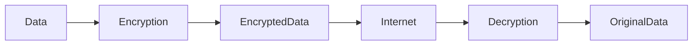
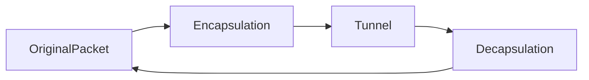
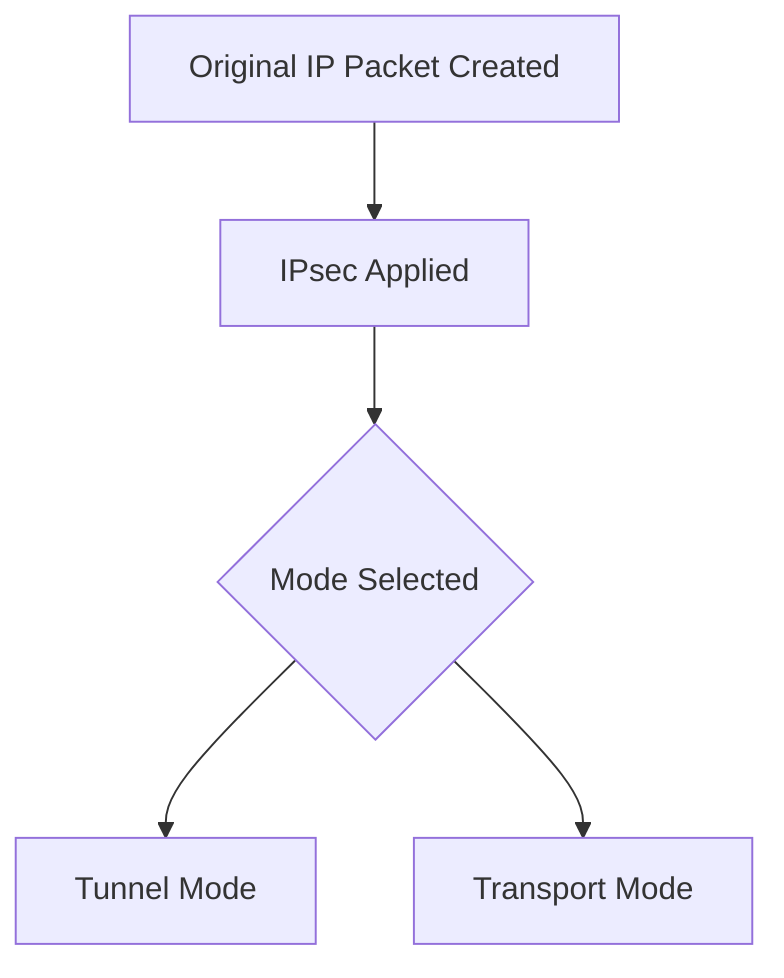
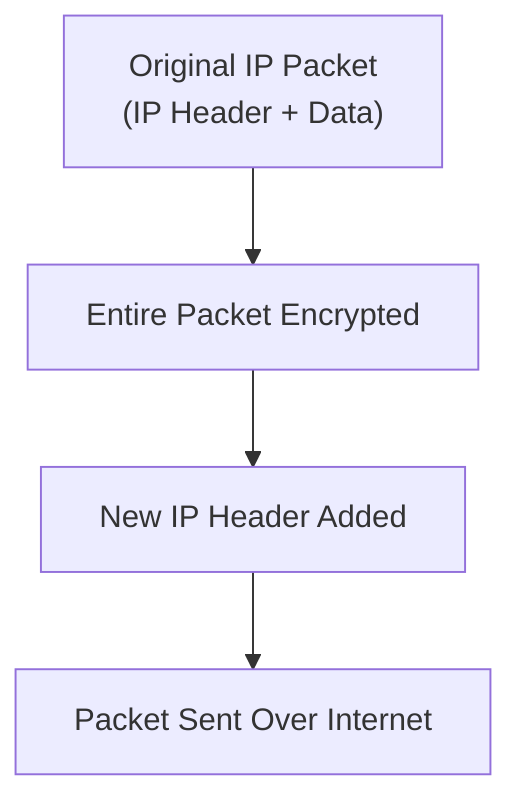
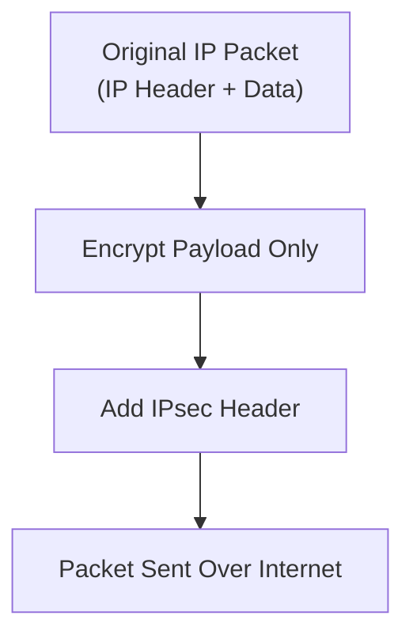
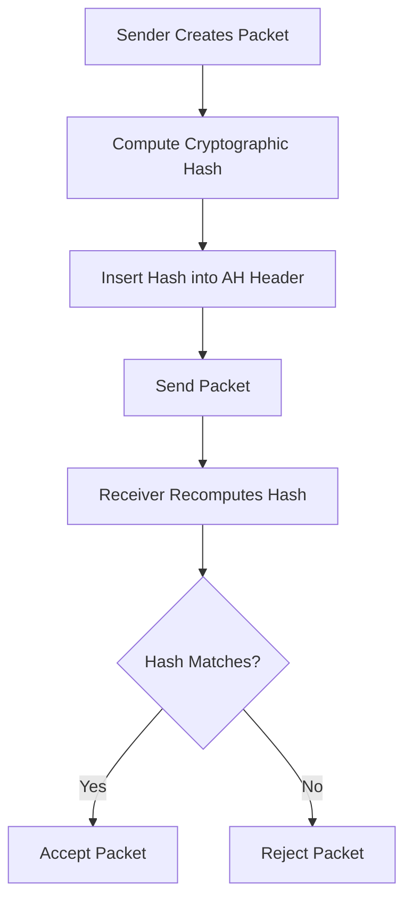
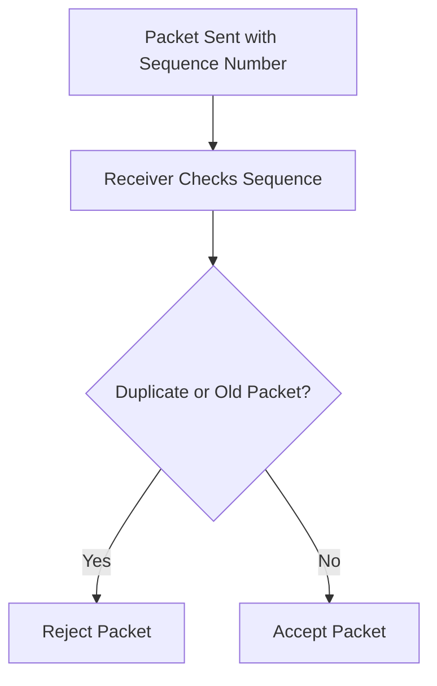
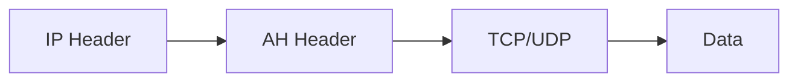

# Unit - 3
:::info[Title]
## Proxy & VPNs
:::
***

## 1. Virtual Private Network (VPN)

A Virtual Private Network (VPN) is a secure networking technology that creates an encrypted connection over a public network such as the Internet.

It allows users to:

* Connect securely to remote networks
* Protect sensitive data
* Maintain privacy while browsing

VPN is widely used in:

* Corporate networks
* Remote work environments
* Secure online communication

***

### 1.1 Definition of VPN

A VPN is:

> A technology that establishes a secure, encrypted tunnel between a user’s device and a remote network over the Internet.

The key idea behind VPN:

* Use a public network (Internet)
* Create a private communication channel

Basic VPN Architecture:


Without VPN:

* Traffic travels openly through ISP
* IP address is visible

With VPN:

* Traffic is encrypted
* IP address is masked

***

### 1.2 Purpose of VPN

The main purpose of a VPN is to ensure secure and private communication over an untrusted network.

VPN provides:

* Confidentiality
* Integrity
* Authentication
* Privacy

***

#### 1.2.1 Secure and Encrypted Connection

VPN encrypts data before transmission.

Encryption ensures:

* Unauthorized users cannot read data
* Protection against hackers
* Protection on public Wi-Fi networks

Encryption Process:



Common encryption protocols:

* IPsec
* SSL/TLS
* OpenVPN
* WireGuard

***

#### 1.2.2 Protect Online Privacy

VPN hides the user’s real IP address.

Instead of:

User → Website

It becomes:

User → VPN Server → Website

Example:


Benefits:

* Prevent ISP tracking
* Avoid targeted ads
* Protect against surveillance
* Anonymous browsing

***

#### 1.2.3 Secure Data Transmission

VPN ensures data integrity and confidentiality during transmission.

It protects against:

* Man-in-the-middle attacks
* Packet sniffing
* Data interception

Data remains:

* Encrypted
* Authenticated
* Secure

Especially important for:

* Banking transactions
* Corporate data
* Government communication

***

#### 1.2.4 Access Restricted Content

VPN allows bypassing:

* Geo-restrictions
* Government censorship
* Workplace restrictions

Example:

If a website is blocked in a country:

* Connect to VPN server in another country
* Access content through that server

Flow:


This enables:

* Streaming region-locked content
* Accessing blocked services
* Bypassing firewalls

***

### Summary

VPN:

* Creates encrypted tunnel
* Protects privacy
* Secures communication
* Masks IP address
* Bypasses restrictions

Core Benefits:

* Confidentiality
* Integrity
* Authentication
* Privacy

VPN is essential for:

* Remote employees
* Public Wi-Fi users
* Enterprises
* Privacy-conscious individuals

***

***

## 2. Types of VPN

VPNs are classified based on:

* Connection type
* Deployment architecture
* Underlying protocol
* Intended usage

Each VPN type serves different organizational and security needs.

***

### 2.1 Remote Access VPN

A Remote Access VPN allows individual users to connect securely to a private network from a remote location.

#### 2.1.1 Purpose

* Provide secure access to internal company resources
* Enable remote work
* Protect data over public networks

It creates an encrypted tunnel between:

* User’s device
* Corporate VPN server

Architecture:


***

#### 2.1.2 Use Case (Employees Working Remotely)

Scenario:

* Employee works from home
* Connects to company server
* Accesses internal applications

Common use:

* IT employees
* Remote staff
* Traveling employees

Benefits:

* Secure access to files
* Secure access to databases
* Access to internal ERP systems

***

### 2.2 Site-to-Site VPN

Site-to-Site VPN connects two or more networks securely over the Internet.

#### 2.2.1 Purpose

* Connect branch offices
* Share resources between locations
* Maintain secure communication

Instead of individual users connecting:

* Entire networks are connected

Architecture:


***

#### 2.2.2 Use Case (Multiple Office Locations)

Example:

* Headquarters in Mumbai
* Branch office in Delhi

Both offices:

* Share internal database
* Share file servers
* Communicate securely

Used by:

* Banks
* Corporations
* Government organizations

***

### 2.3 Intranet-Based VPN

Intranet VPN connects multiple internal branches of the same organization.

#### 2.3.1 Purpose

* Secure internal communication
* Connect multiple company branches
* Enable centralized management

***

#### 2.3.2 Use Case (Internal Communication Across Branches)

Example:

* Company has offices in 5 cities
* All need access to central server

Benefits:

* Private communication
* Unified corporate network
* Reduced leased line cost

***

### 2.4 Extranet-Based VPN

Extranet VPN connects an organization to external partners.

#### 2.4.1 Purpose

* Secure communication with vendors
* Allow limited partner access
* Share selected resources securely

***

#### 2.4.2 Use Case (Partner Organization Communication)

Example:

* Manufacturer connects with supplier
* Supplier accesses limited inventory system

Benefits:

* Controlled partner access
* Data sharing with restrictions
* Business collaboration

***

### 2.5 SSL/TLS VPN

SSL/TLS VPN uses Secure Socket Layer (SSL) or Transport Layer Security (TLS) protocols.

#### 2.5.1 Purpose

* Secure remote access via web browser
* Encrypted HTTPS-based communication

Works at:

* Application Layer

Architecture:


***

#### 2.5.2 Use Case (Browser-Based Secure Access)

User:

* Opens browser
* Logs into VPN portal
* Accesses web-based applications

Advantages:

* No complex client installation
* Easy deployment
* Firewall friendly

Used in:

* Universities
* Corporate portals
* Remote dashboards

***

### 2.6 IPsec VPN

IPsec VPN uses Internet Protocol Security for encryption and authentication.

#### 2.6.1 Purpose

* Secure network-layer communication
* Provide strong encryption and authentication

Operates at:

* Network Layer

***

#### 2.6.2 Use Case (Site-to-Site & Remote Access)

Common use:

* Branch office connectivity
* Corporate remote access

Benefits:

* Strong encryption (AES)
* Authentication
* Integrity protection

Widely used in enterprise networks.

***

### 2.7 PPTP VPN

PPTP (Point-to-Point Tunneling Protocol) is an older VPN protocol.

#### 2.7.1 Purpose

* Create VPN tunnels over PPP
* Simple and easy configuration

***

#### 2.7.2 Security Concerns

Weaknesses:

* Weak encryption
* Vulnerable to brute-force attacks
* Easily cracked authentication

Not recommended for modern security.

***

#### 2.7.3 Legacy Usage

Still found in:

* Older systems
* Basic home routers
* Low-security environments

Mostly replaced by:

* L2TP/IPsec
* OpenVPN
* WireGuard

***

### 2.8 L2TP/IPsec VPN

L2TP combined with IPsec provides enhanced security.

#### 2.8.1 Purpose

* Provide secure tunneling
* Combine Layer 2 tunneling with IPsec encryption

L2TP handles:

* Tunneling

IPsec handles:

* Encryption
* Authentication

***

#### 2.8.2 Enhanced Security Over PPTP

Advantages:

* Stronger encryption
* Better authentication
* More secure than PPTP

Used in:

* Windows VPN clients
* Enterprise remote access

***

## Summary

VPN Types Overview:

| Type          | Purpose                     | Use Case              |
| ------------- | --------------------------- | --------------------- |
| Remote Access | Individual secure access    | Remote employees      |
| Site-to-Site  | Connect networks            | Branch offices        |
| Intranet VPN  | Internal branch connection  | Corporate networks    |
| Extranet VPN  | Partner access              | Vendor communication  |
| SSL/TLS VPN   | Browser-based secure access | Web portals           |
| IPsec VPN     | Strong encryption           | Enterprise networking |
| PPTP          | Basic VPN                   | Legacy systems        |
| L2TP/IPsec    | Secure remote access        | Modern OS support     |

***

***

## 3. Tunneling Protocols

Tunneling protocols are used in VPNs to create secure communication channels over public networks.

Tunneling means:

> Encapsulating one packet inside another packet to securely transmit it across an insecure network.

Basic tunneling concept:



The outer packet carries the encrypted inner packet safely across the Internet.

***

### 3.1 Overview of Tunneling Protocols

Tunneling protocols:

* Create encrypted communication channels
* Encapsulate data packets
* Provide authentication and integrity
* Protect data from interception

Common VPN tunneling protocols:

* PPTP
* L2TP
* IPsec
* SSTP
* OpenVPN
* WireGuard
* IKEv2/IPsec

They differ in:

* Security strength
* Speed
* Encryption method
* Compatibility

***

### 3.2 PPTP (Point-to-Point Tunneling Protocol)

PPTP is one of the earliest VPN tunneling protocols.

It was developed by:

* Microsoft and other vendors

***

#### 3.2.1 Purpose

* Create VPN tunnels over PPP (Point-to-Point Protocol)
* Provide remote access connectivity

It encapsulates PPP frames inside GRE (Generic Routing Encapsulation).

Architecture:


***

#### 3.2.2 Security Level

Security is considered weak.

Weaknesses:

* Uses outdated encryption (MPPE)
* Vulnerable to brute-force attacks
* Authentication flaws

Today:

* Not recommended for secure environments
* Used only in legacy systems

***

### 3.3 L2TP (Layer 2 Tunneling Protocol)

L2TP is a tunneling protocol that combines features of:

* PPTP
* Cisco’s L2F

***

#### 3.3.1 Purpose

* Provide tunneling mechanism
* Transport PPP frames

Important:

* L2TP itself does NOT provide encryption

***

#### 3.3.2 Combined with IPsec

Because L2TP lacks encryption, it is commonly combined with IPsec.

L2TP handles:

* Tunneling

IPsec handles:

* Encryption
* Authentication
* Integrity

Architecture:


Security level:

* Much stronger than PPTP
* Widely supported in modern systems

***

### 3.4 IPsec

IPsec (Internet Protocol Security) is a suite of protocols that secure IP communication.

***

#### 3.4.1 Purpose

* Provide secure communication at Network Layer
* Encrypt and authenticate IP packets

IPsec works in two modes:

* Transport Mode
* Tunnel Mode

***

#### 3.4.2 Authentication and Encryption

IPsec provides:

1. Confidentiality (Encryption)
2. Integrity (Hash verification)
3. Authentication
4. Anti-replay protection

IPsec uses:

* AES encryption
* SHA hashing
* IKE for key exchange

Widely used in:

* Site-to-Site VPN
* Enterprise networks

***

### 3.5 SSTP (Secure Socket Tunneling Protocol)

SSTP is developed by Microsoft.

***

#### 3.5.1 Developed by Microsoft

* Introduced in Windows Vista
* Designed to bypass firewall restrictions

***

#### 3.5.2 Operates over SSL/TLS

SSTP uses:

* TCP port 443
* SSL/TLS encryption

This makes it:

* Firewall-friendly
* Hard to block

Security:

* Strong encryption
* Suitable for corporate use

***

### 3.6 OpenVPN

OpenVPN is an open-source VPN protocol.

***

#### 3.6.1 Open-Source Protocol

* Free
* Highly configurable
* Cross-platform

Used by:

* Enterprises
* Commercial VPN providers

***

#### 3.6.2 Uses SSL/TLS

OpenVPN relies on:

* SSL/TLS for encryption
* OpenSSL library

Supports:

* AES encryption
* Strong authentication

***

#### 3.6.3 High Security

Advantages:

* Very secure
* Open-source (audited)
* Supports UDP and TCP
* Highly flexible

Widely trusted for:

* Commercial VPN services
* Enterprise deployment

***

### 3.7 WireGuard

WireGuard is a modern VPN protocol.

***

#### 3.7.1 Modern Lightweight Protocol

* Introduced in 2016
* Designed for simplicity
* Very small codebase

Uses modern cryptography:

* ChaCha20
* Poly1305
* Curve25519

***

#### 3.7.2 Simplicity and Performance

Advantages:

* Very fast
* Easy to configure
* Lower overhead
* More efficient than IPsec

Architecture:


Used in:

* Modern VPN services
* Mobile applications
* Linux kernel integration

***

### 3.8 IKEv2/IPsec

IKEv2 combined with IPsec is a strong and reliable VPN solution.

***

#### 3.8.1 Strong Security

IKEv2 handles:

* Key exchange
* Authentication
* Session management

IPsec handles:

* Encryption
* Data protection

Benefits:

* Strong encryption
* Stable connection

***

#### 3.8.2 Mobile Device Support

Key advantage:

* Automatic reconnection
* Mobility support (MOBIKE)

Ideal for:

* Smartphones
* Mobile users
* Switching networks (WiFi → Mobile data)

***

## Comparison of Tunneling Protocols

| Protocol    | Security    | Speed     | Usage          |
| ----------- | ----------- | --------- | -------------- |
| PPTP        | Weak        | Fast      | Legacy         |
| L2TP/IPsec  | Strong      | Moderate  | Enterprise     |
| IPsec       | Very Strong | Moderate  | Site-to-Site   |
| SSTP        | Strong      | Moderate  | Windows        |
| OpenVPN     | Very Strong | Moderate  | Commercial VPN |
| WireGuard   | Very Strong | Very Fast | Modern VPN     |
| IKEv2/IPsec | Very Strong | Fast      | Mobile         |

***

## Summary

Tunneling Protocols:

* Create secure VPN tunnels
* Encapsulate packets
* Provide encryption and authentication

Modern recommended protocols:

* OpenVPN
* WireGuard
* IKEv2/IPsec

Outdated protocol:

* PPTP

***

***

## 4. Tunnel Mode and Transport Mode

Tunnel Mode and Transport Mode are the **two operational modes of IPsec** that determine **how security is applied to IP packets**.

They define:

* What portion of the packet is encrypted/authenticated
* Whether a new IP header is added
* Whether internal IP addresses are hidden
* The type of VPN scenario in which they are used

IPsec can operate in either mode depending on the security requirement.

***

### 4.1 Overview of IPsec Modes

According to the PDF (page 29) :

In the context of VPNs and IPsec, **Tunnel Mode** and **Transport Mode** are two different ways IPsec secures communication between devices or networks.

#### Core Difference

| Mode           | What is Protected       |
| -------------- | ----------------------- |
| Tunnel Mode    | Entire IP packet        |
| Transport Mode | Only the payload (data) |

***

#### Conceptual Flow of IPsec Modes



The selected mode determines **encapsulation structure and security level**.

***

### 4.2 Tunnel Mode

(Refer pages 30–31, 49 )

Tunnel Mode is typically used for **VPNs between networks**.

***

#### 4.2.1 Purpose

Tunnel Mode is used to:

* Create secure VPN tunnels between networks
* Secure communication between two VPN gateways
* Hide internal network structure

It is most commonly used in:

* **Site-to-Site VPNs**
* Network-to-Network communication

Its primary objective is:

> To encapsulate and protect the entire original IP packet.

***

#### 4.2.2 Encapsulation of Entire IP Packet

As per page 30 :

In Tunnel Mode, the **entire original IP packet (including its IP header)** is encapsulated inside a new IP packet.

#### Structure Transformation

**Before IPsec:**

```
[Original IP Header][Data]
```

**After Tunnel Mode:**

```
[New IP Header][IPsec Header][Original IP Header][Data]
```

The complete original packet becomes encrypted payload.

***

#### Tunnel Mode Encapsulation Flow



***

#### 4.2.3 Header Modification

According to page 31 :

* The original IP header is **hidden inside the encrypted portion**.
* A **new IP header** is added.
* The new header contains:
  * Source: VPN Gateway A
  * Destination: VPN Gateway B

This ensures:

* Internal IP addresses are hidden
* Network topology remains private
* Only gateway addresses are visible on the internet

***

#### 4.2.4 Use Case (Site-to-Site VPN)

Tunnel Mode is commonly used in:

* Site-to-Site VPNs
* Inter-branch communication

#### Example Scenario

Branch Office (192.168.2.0/24)

Head Office (192.168.1.0/24)


Steps:

1. Host sends packet.
2. Gateway encrypts entire packet.
3. New IP header added.
4. Packet travels securely.
5. Destination gateway decrypts and forwards.

✔ Entire networks communicate as if directly connected.

***

### 4.3 Transport Mode

(Refer pages 32–34, 49 )

Transport Mode is used for **end-to-end communication between two devices**.

***

#### 4.3.1 Purpose

Transport Mode is used for:

* Host-to-Host communication
* Secure end-to-end device communication
* Remote access VPN scenarios

Its objective:

> To secure the data while keeping routing information visible.

***

#### 4.3.2 Encrypts Payload Only

As per page 32 :

In Transport Mode:

* Only the **payload (data)** is encrypted.
* The original IP header remains unchanged.

#### Structure Transformation

**Before IPsec:**

```
[IP Header][Data]
```

**After Transport Mode:**

```
[Original IP Header][IPsec Header][Encrypted Data]
```

***

#### Transport Mode Processing Flow



***

#### 4.3.3 Original Header Remains Intact

From page 34 :

* The original IP header is **not modified**.
* Source and destination IP addresses remain visible.
* Additional security headers are added for authentication/integrity.

Implications:

* Routers can read routing information.
* Internal IP addresses are visible.
* Less overhead compared to Tunnel Mode.

***

#### 4.3.4 Use Case (End-to-End Communication)

Used in:

* Device-to-Device communication
* Point-to-Point connections
* Some Remote Access VPN implementations

#### Example

Laptop ↔ Server


Steps:

1. Laptop sends packet.
2. Only data is encrypted.
3. IP header remains visible.
4. Server decrypts payload.

✔ Faster than Tunnel Mode

✔ Lower overhead

✔ Suitable for direct host communication

***

### Tunnel Mode vs Transport Mode (Comparison)

| Feature             | Tunnel Mode      | Transport Mode |
| ------------------- | ---------------- | -------------- |
| Encrypts            | Entire IP packet | Payload only   |
| Original IP Header  | Hidden           | Remains intact |
| New IP Header Added | Yes              | No             |
| Internal IP Hidden  | Yes              | No             |
| Used For            | Site-to-Site VPN | End-to-End     |
| Overhead            | Higher           | Lower          |

***

### Key Exam Points

1. Tunnel Mode encrypts entire IP packet including original header.
2. Transport Mode encrypts only the payload.
3. Tunnel Mode adds a new IP header.
4. Tunnel Mode is used in Site-to-Site VPN.
5. Transport Mode is used in End-to-End communication.
6. Tunnel Mode hides internal IP addresses.
7. Transport Mode keeps routing header visible.

***

***

\<aside> 💡

Till here for MID SEM

\</aside>

## 5. Authentication Header (AH)

Authentication Header (AH) is one of the **two main protocols of IPsec**, the other being ESP (Encapsulating Security Payload).

AH is designed to provide:

* Authentication
* Data Integrity
* Anti-Replay Protection

It does **NOT provide encryption (confidentiality)**.

***

### 5.1 Introduction to AH

According to page 35 :

> The Authentication Header (AH) is one of the two main protocols used in IPsec to provide security services for IP packets.

AH can be used:

* In **Tunnel Mode**
* In **Transport Mode**

It is inserted:

Between the original IP header and the upper-layer protocol (e.g., TCP/UDP).

***

#### Position of AH in Packet

```mermaid
flowchart LR
    A[Original IP Header] --> B[AH Header]
    B --> C[Upper Layer Protocol (TCP/UDP)]
    C --> D[Data]
```

AH protects the packet by adding cryptographic verification data.

***

### 5.2 Purpose of AH

(Refer pages 37–39 )

AH provides **security services focused on trust and integrity**, not secrecy.

***

#### 5.2.1 Authentication

Authentication ensures:

* The sender is genuine
* The packet truly comes from the claimed source

AH achieves authentication using a **cryptographic hash function**.

Process:

1. Sender computes hash of packet contents.
2. Hash is placed inside AH header.
3. Receiver recomputes hash.
4. If both hashes match → packet is authentic.

***

#### Authentication Flow



***

#### 5.2.2 Data Integrity

According to page 37 :

Integrity ensures:

> The contents of the IP packet have not been altered during transmission.

AH calculates a cryptographic hash known as:

**Integrity Check Value (ICV)**

If even 1 bit changes in transit:

* The hash will differ
* Packet will be rejected

✔ Prevents tampering

✔ Detects modification

***

#### 5.2.3 Anti-Replay Protection

(Page 38 )

AH protects against **replay attacks**.

Replay attack = attacker captures a valid packet and resends it later.

AH prevents this using:

* A **Sequence Number field**

How it works:

1. Each packet gets a unique sequence number.
2. Receiver checks order of packets.
3. Duplicate or out-of-order packets are rejected.

***

#### Anti-Replay Flow



✔ Protects against repeated transmission attacks

✔ Ensures freshness of packets

***

#### 5.2.4 No Confidentiality (No Encryption)

(Page 39 )

Important:

AH does NOT encrypt data.

This means:

* Data remains visible
* Only integrity and authenticity are protected

So AH provides:

✔ Authentication

✔ Integrity

✔ Anti-Replay

But NOT:

✘ Confidentiality

If encryption is required → ESP must be used.

***

### 5.3 Structure of AH

(Refer pages 40–41 )

AH is inserted between:

Original IP header and upper-layer protocol.

***

#### AH Packet Structure



***

The AH header contains several fields:

***

#### 5.3.1 Next Header

* Identifies the type of next header.
* Indicates upper-layer protocol (TCP, UDP, etc.)
* Helps receiver know what comes after AH.

Example:

* TCP
* UDP
* ICMP

***

#### 5.3.2 Payload Length

* Specifies length of AH header.
* Indicates how much data is covered.
* Used for parsing packet correctly.

***

#### 5.3.3 Reserved Field

* Reserved for future use.
* Currently set to zero.
* Ensures future compatibility.

***

#### 5.3.4 Security Parameters Index (SPI)

* Unique identifier for a Security Association (SA).
* Tells receiver which SA to use.
* Helps identify cryptographic keys and algorithms.

Important concept:

Each secure connection has its own SA.

***

#### 5.3.5 Sequence Number

* Prevents replay attacks.
* Incremented for each packet.
* Ensures packet uniqueness.

If repeated → rejected.

***

#### 5.3.6 Authentication Data (ICV)

This is the most important field.

* Contains cryptographic hash value.
* Known as **Integrity Check Value (ICV)**.
* Ensures authenticity and integrity.

If ICV mismatch:

* Packet discarded.

***

#### AH Header Layout Summary

```mermaid
flowchart LR
    A[Next Header]
    B[Payload Length]
    C[Reserved]
    D[SPI]
    E[Sequence Number]
    F["Authentication Data (ICV)"]
```

***

### AH Summary Table

| Feature                 | Provided by AH |
| ----------------------- | -------------- |
| Authentication          | Yes            |
| Data Integrity          | Yes            |
| Anti-Replay             | Yes            |
| Encryption              | No             |
| Uses Cryptographic Hash | Yes            |
| Uses Sequence Numbers   | Yes            |

***

### Important Exam Points

1. AH is one of two main IPsec protocols.
2. AH provides authentication and integrity.
3. AH does not provide encryption.
4. AH prevents replay attacks using sequence numbers.
5. AH includes SPI and ICV fields.
6. ICV ensures packet integrity.
7. AH is inserted between IP header and upper-layer protocol.

***

***

## 6. IPsec Protocol Suite

IPsec (Internet Protocol Security) is a **comprehensive suite of protocols** designed to secure IP communications.

It provides:

* Authentication
* Integrity
* Confidentiality
* Replay Protection

IPsec is widely used to establish **Virtual Private Networks (VPNs)** and secure communication over IP networks.

***

### 6.1 Overview of IPsec

According to page 43 :

IPsec is a collection of protocols and standards that secure IP packets by applying cryptographic protection.

It works at the **Network Layer (Layer 3)** of the OSI model.

#### Security Services Provided by IPsec

| Security Service  | Meaning                  |
| ----------------- | ------------------------ |
| Authentication    | Verifies sender identity |
| Integrity         | Ensures data not altered |
| Confidentiality   | Encrypts data            |
| Replay Protection | Prevents reused packets  |

***

#### High-Level Working of IPsec

```mermaid
flowchart TD
    A[Sender Creates IP Packet] --> B[IPsec Applied]
    B --> C[Authentication / Encryption]
    C --> D[Packet Sent Securely]
    D --> E[Receiver Verifies & Decrypts]
```

IPsec uses multiple components to achieve this protection.

***

### 6.2 Components of IPsec

(Page 43–48 )

The IPsec suite consists of:

1. Authentication Header (AH)
2. Encapsulating Security Payload (ESP)
3. Security Associations (SA)
4. Internet Key Exchange (IKE)
5. Key Management

***

### 6.2.1 Authentication Header (AH)

(Page 44 )

AH provides:

* Authentication
* Integrity
* Anti-Replay Protection

It does NOT provide encryption.

#### Services of AH

| Feature         | Provided |
| --------------- | -------- |
| Authentication  | Yes      |
| Integrity       | Yes      |
| Confidentiality | No       |
| Anti-Replay     | Yes      |

AH ensures that the packet:

* Came from the correct sender
* Was not modified in transit

***

#### 6.2.2 Encapsulating Security Payload (ESP)

(Page 45 )

ESP provides:

* Confidentiality
* Authentication
* Integrity
* Optional Anti-Replay

ESP is more commonly used than AH because it supports encryption.

***

#### **6.2.2.1 Confidentiality**

ESP encrypts the payload of the IP packet.

This ensures:

* Data remains secret
* Unauthorized users cannot read it

Encryption protects sensitive information during transmission.

***

#### **6.2.2.2 Authentication**

ESP verifies:

* Sender identity
* Validity of packet

Authentication prevents spoofing.

***

#### **6.2.2.3 Integrity**

ESP ensures:

* Data has not been modified
* Any tampering is detected

It uses cryptographic hash functions similar to AH.

***

#### **6.2.2.4 Optional Anti-Replay**

ESP can include:

* Sequence numbers
* Packet freshness verification

This prevents attackers from resending captured packets.

***

#### ESP Working Flow

```mermaid
flowchart TD
    A[Original IP Packet] --> B[Encrypt Payload]
    B --> C[Add ESP Header & Trailer]
    C --> D[Add Authentication Data]
    D --> E[Send Secure Packet]
```

***

#### 6.2.3 Security Associations (SA)

#### **6.2.3.1 Definition**

A Security Association (SA) is:

> A one-way logical connection between two entities for secure communication.

Each direction of communication requires a separate SA.

***

#### **6.2.3.2 Attributes**

Each SA includes:

* Security protocol (AH or ESP)
* Cryptographic algorithms
* Encryption keys
* Authentication keys
* Lifetime parameters

SA defines how packets should be protected.

***

#### **6.2.3.3 Establishment via IKE**

Security Associations are established through:

Internet Key Exchange (IKE)

IKE negotiates:

* Algorithms
* Keys
* Authentication methods

***

#### SA Establishment Flow

```mermaid
flowchart TD
    A[Initiator Requests Secure Connection] --> B[IKE Negotiation]
    B --> C[Agree on Algorithms & Keys]
    C --> D[SA Established]
    D --> E[Secure Communication Begins]
```

***

#### 6.2.4 Internet Key Exchange (IKE)

IKE automates:

* Negotiation
* Authentication
* Key exchange

It establishes and manages Security Associations.

***

#### **6.2.4.1 Purpose**

IKE is used to:

* Automatically negotiate secure parameters
* Establish trusted communication channel

***

#### **6.2.4.2 Authentication**

IKE authenticates communicating parties using:

* Pre-shared keys (PSK)
* Digital certificates

This prevents unauthorized access.

***

#### **6.2.4.3 Key Management**

IKE handles:

* Exchange of cryptographic keys
* Secure distribution
* Key refresh

***

#### **6.2.4.4 Phase 1 and Phase 2**

IKE operates in two phases:

| Phase   | Function                 |
| ------- | ------------------------ |
| Phase 1 | Establish secure channel |
| Phase 2 | Negotiate IPsec SAs      |

***

#### IKE Two-Phase Process

```mermaid
flowchart TD
    A[IKE Phase 1] --> B[Secure Authenticated Channel Established]
    B --> C[IKE Phase 2]
    C --> D[IPsec SAs Created]
```

***

#### 6.2.5 Key Management

Key Management involves:

* Generating
* Distributing
* Managing cryptographic keys

***

#### **6.2.5.1 Manual Keys**

Keys are:

* Configured manually
* Entered by administrator

Disadvantages:

* Not scalable
* Hard to maintain

***

#### **6.2.5.2 Automated Keys**

Keys are:

* Generated dynamically
* Exchanged using IKE

Advantages:

* More secure
* Easier management
* Scalable

***

#### **6.2.5.3 Lifetime Management**

Keys and SAs have:

* Defined validity period
* Expressed in time (seconds)
* Or data volume (kilobytes)

After expiration:

* Keys are renegotiated
* New secure session established

***

#### Key Lifecycle Flow

```mermaid
flowchart TD
    A[Key Generated] --> B[Used for Secure Communication]
    B --> C[Lifetime Expires]
    C --> D[Renegotiation via IKE]
    D --> E[New Key Generated]
```

***

### Complete IPsec Architecture Overview

```mermaid
flowchart TD
    A[IPsec] --> B[AH]
    A --> C[ESP]
    A --> D[Security Associations]
    A --> E[IKE]
    A --> F[Key Management]
```

***

### Summary Table

| Component      | Function                    |
| -------------- | --------------------------- |
| AH             | Authentication & Integrity  |
| ESP            | Encryption + Authentication |
| SA             | Defines security parameters |
| IKE            | Negotiates keys & SAs       |
| Key Management | Handles lifecycle of keys   |

***

### Important Exam Points

1. IPsec secures IP communication at Network Layer.
2. IPsec provides authentication, integrity, confidentiality, replay protection.
3. AH does not provide encryption.
4. ESP provides encryption.
5. SA is a one-way secure logical connection.
6. IKE negotiates and manages SAs.
7. IKE has Phase 1 and Phase 2.
8. Keys can be manual or automated.
9. Keys have defined lifetime.

***

***

## 7. IKE Phase 1

Internet Key Exchange (IKE) is part of the IPsec suite and is responsible for:

* Negotiating security parameters
* Authenticating communicating parties
* Establishing secure channels
* Managing cryptographic keys

IKE operates in **two phases**, and Phase 1 is the foundation for secure IPsec communication.

***

### 7.1 Objective of IKE Phase 1

According to page 51 :

The objective of IKE Phase 1 is:

> To establish a secure, authenticated communication channel and negotiate a shared secret key for further use in Phase 2.

#### Key Goals

* Authenticate both parties
* Establish a secure channel
* Negotiate encryption algorithms
* Create a secure IKE Security Association (IKE SA)

***

#### IKE Phase 1 Overview Flow

```mermaid
flowchart TD
    A[Initiator Contacts Responder] --> B[Negotiate Security Parameters]
    B --> C[Authenticate Parties]
    C --> D[Generate Shared Secret Key]
    D --> E[Establish IKE Security Association]
```

Phase 1 creates a secure tunnel used in Phase 2.

***

### 7.2 Authentication Methods

Authentication ensures:

* The identity of both communicating devices
* Protection against unauthorized access

IKE Phase 1 supports multiple authentication methods.

***

#### 7.2.1 Pre-Shared Keys (PSK)

Pre-Shared Key (PSK):

* A secret key manually configured on both devices
* Must be identical on both sides

#### How PSK Works

1. Both parties configure the same secret key.
2. During negotiation, the key is used to authenticate.
3. If keys match → authentication successful.

***

```mermaid
flowchart LR
    A[Device A] -- Shared Secret --> B[Device B]
    A --> C[Authenticate Using PSK]
    B --> C
    C --> D[Secure Channel Established]
```

✔ Simple to configure

✔ Suitable for small environments

✘ Not scalable for large networks

***

#### 7.2.2 Digital Certificates

Digital certificates provide stronger authentication.

* Based on Public Key Infrastructure (PKI)
* Issued by a trusted Certificate Authority (CA)

#### How It Works

1. Each device has a certificate.
2. Certificates are exchanged.
3. Certificates are verified.
4. Secure connection established.

***

```mermaid
flowchart TD
    A[Device A Sends Certificate] --> B[Device B Verifies Certificate]
    B --> C[Device B Sends Certificate]
    C --> D[Device A Verifies]
    D --> E[Mutual Authentication Successful]
```

✔ More secure than PSK

✔ Scalable

✔ Used in enterprise environments

***

### 7.3 Encryption Algorithm Negotiation

During Phase 1, both parties negotiate which encryption algorithm will be used to secure IKE communication.

Purpose:

> To protect confidentiality of IKE exchanges.

Common algorithms:

#### 7.3.1 DES (Data Encryption Standard)

* Older encryption algorithm
* Uses 56-bit key
* Considered weak today

✔ Historically used

✘ Not recommended for modern security

***

#### 7.3.2 3DES (Triple DES)

* Applies DES three times
* Stronger than DES
* Slower due to triple processing

✔ More secure than DES

✘ Slower performance

***

#### 7.3.3 AES (Advanced Encryption Standard)

* Modern encryption algorithm
* Supports 128, 192, 256-bit keys
* Strong and efficient

✔ Highly secure

✔ Widely used

✔ Recommended standard

***

#### Algorithm Negotiation Flow

```mermaid
flowchart TD
    A[Initiator Proposes Algorithms] --> B[Responder Selects Supported Option]
    B --> C[Agreement Reached]
    C --> D[Secure Communication Uses Selected Algorithm]
```

***

### 7.4 Lifetime Negotiation

(Page 53 & 55 )

Lifetime negotiation defines:

> How long the negotiated keys and Security Associations remain valid.

Parameters may be expressed in:

* Seconds
* Kilobytes of transmitted data

When lifetime expires:

* Keys are renegotiated
* New secure session established

***

```mermaid
flowchart TD
    A[SA Created] --> B[Secure Communication Ongoing]
    B --> C{Lifetime Expired?}
    C -->|No| B
    C -->|Yes| D[Renegotiate Keys]
```

✔ Prevents long-term key exposure

✔ Improves security

***

### 7.5 Main Mode

Main Mode is one method of performing IKE Phase 1 negotiation.

It uses:

* Three-message exchange process
* More secure
* Slower than Aggressive Mode

***

#### 7.5.1 Secure but Slower

Main Mode:

* Provides identity protection
* Hides identities during negotiation
* Requires more communication steps

✔ Higher security

✘ Slower negotiation

***

```mermaid
flowchart TD
    A[Message 1: Security Proposal] --> B[Message 2: Response]
    B --> C[Message 3: Key Exchange]
    C --> D[Message 4: Response]
    D --> E[Message 5: Authentication]
    E --> F[Message 6: Confirmation]
```

Secure but requires more exchanges.

***

### 7.6 Aggressive Mode

Aggressive Mode is an alternative to Main Mode.

It:

* Uses fewer messages
* Faster negotiation
* Slightly less secure

***

#### 7.6.1 Faster but Less Secure

Aggressive Mode:

* Exchanges information more quickly
* Some identity information transmitted in clear
* Less identity protection

✔ Faster setup

✘ Lower security compared to Main Mode

***

```mermaid
flowchart TD
    A[Message 1: Proposal + Key Exchange] --> B[Message 2: Response + Authentication]
    B --> C[Message 3: Final Confirmation]
```

Fewer messages → faster but less secure.

***

### 7.7 Establishment of IKE Security Association

After successful Phase 1:

* A secure IKE Security Association (IKE SA) is established.
* Negotiated parameters are stored.
* Keying material derived for Phase 2.

IKE SA includes:

* Agreed encryption algorithm
* Authentication method
* Shared secret keys
* Lifetime

***

#### Final Establishment Flow

```mermaid
flowchart TD
    A[Authentication Successful] --> B[Shared Secret Established]
    B --> C[IKE SA Created]
    C --> D[Secure Channel Ready for Phase 2]
```

Phase 1 establishes the secure control channel.

Phase 2 will create IPsec SAs for actual data protection.

***

### Summary Table – IKE Phase 1

| Feature                | Description                            |
| ---------------------- | -------------------------------------- |
| Objective              | Establish secure authenticated channel |
| Authentication Methods | PSK, Digital Certificates              |
| Encryption Algorithms  | DES, 3DES, AES                         |
| Lifetime               | Defines SA validity period             |
| Modes                  | Main Mode, Aggressive Mode             |
| Output                 | IKE Security Association               |

***

### Important Exam Points

1. IKE Phase 1 establishes a secure authenticated channel.
2. It negotiates encryption algorithms and authentication methods.
3. Supports PSK and Digital Certificates.
4. AES is most secure among DES, 3DES, AES.
5. Lifetime defines validity of SA.
6. Main Mode is more secure but slower.
7. Aggressive Mode is faster but less secure.
8. Phase 1 results in creation of IKE SA.

***

***

## 8. Implementation of VPNs

VPN implementation involves setting up a **secure and encrypted communication channel** over an existing network (typically the Internet).

Different VPN implementations are used depending on:

* Type of users (individual vs network)
* Security requirements
* Scale of deployment
* Infrastructure availability

***

### 8.1 Overview of VPN Implementation

According to page 58 :

VPN implementation involves:

* Configuring secure communication
* Choosing appropriate protocols
* Establishing authentication mechanisms
* Managing encryption

#### General VPN Implementation Flow

```mermaid
flowchart TD
    A[User/Network Requests Access] --> B[Authentication]
    B --> C[Secure Tunnel Established]
    C --> D[Encrypted Data Transmission]
    D --> E[Secure Access to Resources]
```

VPNs can be implemented as:

* Remote Access VPN
* Site-to-Site VPN
* SSL/TLS VPN
* Clientless VPN
* OpenVPN
* WireGuard

***

### 8.2 Remote Access VPN Implementation

Remote Access VPN provides secure access to a private network for **individual users or remote devices**.

Used when:

* Employees work from home
* Users travel
* Remote workforce needs secure access

***

#### 8.2.1 VPN Client Software

Users must install:

* VPN client software on their devices

This software:

* Initiates connection
* Handles encryption
* Manages authentication

***

```mermaid
flowchart LR
    A[Remote User Device] --> B[VPN Client Software]
    B --> C[VPN Server]
    C --> D[Corporate Network]
```

***

#### 8.2.2 Authentication

Users authenticate using:

* Username and password
* Sometimes two-factor authentication

Purpose:

* Ensure only authorized users access network

***

#### 8.2.3 Encryption Protocols

Encryption protocols used:

* PPTP
* L2TP/IPsec
* IKEv2/IPsec
* SSL/TLS

These protocols ensure secure data transmission.

***

#### 8.2.4 Examples (SSL VPN, IPsec Client VPN)

Examples include:

* SSL VPNs (web-based VPNs)
* IPsec-based client VPNs

These allow secure remote connectivity.

***

### 8.3 Site-to-Site VPN Implementation

Site-to-Site VPN connects **entire networks** securely.

Used for:

* Multi-branch companies
* Inter-office communication

***

#### 8.3.1 VPN Gateway / Firewall

Each site uses:

* VPN Gateway
* Firewall device

These devices:

* Establish secure tunnels
* Manage encryption
* Authenticate other gateway

***

```mermaid
flowchart LR
    A[Branch Office Network] --> B[VPN Gateway]
    B --> C[Encrypted Tunnel]
    C --> D[VPN Gateway]
    D --> E[Head Office Network]
```

***

#### 8.3.2 Gateway Authentication

Gateways authenticate using:

* Pre-shared keys
* Digital certificates

Ensures trusted communication between sites.

***

#### 8.3.3 IPsec Encryption

IPsec is commonly used for:

* Tunneling
* Encryption
* Secure communication

Provides:

* Authentication
* Integrity
* Confidentiality

***

#### 8.3.4 MPLS VPN

MPLS (Multiprotocol Label Switching) VPNs:

* Used in enterprise networks
* Provide secure site connectivity
* Operate through service providers

Used for scalable, reliable enterprise networking.

***

### 8.4 SSL/TLS VPN Implementation

(Page 63–64 )

SSL/TLS VPN provides secure access using:

* Web browser
* SSL/TLS encryption

***

#### 8.4.1 Web Browser Interface

Users connect to:

* Secure web portal

No complex client installation required (in some cases).

***

#### 8.4.2 Authentication

Users log in using:

* Credentials
* Often two-factor authentication

***

#### 8.4.3 SSL/TLS Encryption

Communication is secured using:

* SSL/TLS protocols

Provides:

* Encryption
* Authentication
* Data protection

***

#### 8.4.4 Examples (Cisco AnyConnect, OpenVPN)

Examples include:

* Cisco AnyConnect
* OpenVPN with SSL/TLS

These solutions provide secure remote access.

***

### 8.5 Clientless VPN

Clientless VPN allows secure access:

* Without installing client software

***

#### 8.5.1 Web-Based Access

Users access resources via:

* Standard web browser
* Secure portal

***

#### 8.5.2 No Client Software Required

Advantages:

* Easy to use
* No installation
* Suitable for temporary access

***

#### 8.5.3 Examples (Cisco SSL VPN, Juniper Secure Access)

Examples include:

* Cisco SSL VPN
* Juniper Networks Secure Access

Used for web-based secure access.

***

### 8.6 OpenVPN Implementation

OpenVPN is an open-source VPN solution.

Provides:

* Flexibility
* High security
* SSL/TLS encryption

***

#### 8.6.1 OpenVPN Software

OpenVPN software must be installed on:

* Client
* Server

***

```mermaid
flowchart LR
    A[Client with OpenVPN] --> B[Encrypted SSL/TLS Tunnel]
    B --> C[OpenVPN Server]
```

***

#### 8.6.2 Authentication Methods

Authentication methods include:

* Username/password
* Digital certificates

***

#### 8.6.3 SSL/TLS Encryption

OpenVPN uses:

* SSL/TLS for secure communication
* Secure key exchange

Commonly used for:

* Site-to-site VPN
* Remote access VPN

***

### 8.7 WireGuard Implementation

WireGuard is:

* Modern
* Lightweight
* Open-source VPN protocol

Known for:

* Simplicity
* High performance
* Modern cryptography

***

#### 8.7.1 Software Installation

WireGuard software installed on:

* Client devices
* Server devices

***

#### 8.7.2 Public/Private Key Authentication

WireGuard uses:

* Public keys
* Private keys

Each device:

* Has a key pair
* Exchanges public keys
* Establishes secure tunnel

***

```mermaid
flowchart TD
    A[Generate Key Pair] --> B[Exchange Public Keys]
    B --> C[Establish Encrypted Tunnel]
    C --> D[Secure Communication]
```

***

#### 8.7.3 Modern Cryptography

WireGuard uses:

* Modern cryptographic algorithms
* Efficient codebase
* Improved performance

Advantages:

* Faster than traditional VPNs
* Easier configuration
* Smaller attack surface

***

### Complete VPN Implementation Overview

```mermaid
flowchart LR
    A[VPN Implementation] --> B[Remote Access VPN]
    A --> C[Site-to-Site VPN]
    A --> D[SSL/TLS VPN]
    A --> E[Clientless VPN]
    A --> F[OpenVPN]
    A --> G[WireGuard]
```

***

### Summary Table

| VPN Type       | Used For            | Requires Client?   | Protocol Used       |
| -------------- | ------------------- | ------------------ | ------------------- |
| Remote Access  | Individual users    | Yes                | IPsec, SSL          |
| Site-to-Site   | Network connection  | No (gateway-based) | IPsec               |
| SSL/TLS VPN    | Browser access      | Sometimes          | SSL/TLS             |
| Clientless VPN | Web-based access    | No                 | SSL                 |
| OpenVPN        | Flexible deployment | Yes                | SSL/TLS             |
| WireGuard      | Modern VPN          | Yes                | Modern cryptography |

***

### Important Exam Points

1. VPN implementation creates secure encrypted communication.
2. Remote Access VPN requires client software.
3. Site-to-Site VPN uses VPN gateways and IPsec.
4. SSL/TLS VPN uses web browser interface.
5. Clientless VPN requires no client installation.
6. OpenVPN uses SSL/TLS encryption.
7. WireGuard uses public/private key authentication.
8. MPLS VPN is used in enterprise site connectivity.

***

***
