# Unit - 4
:::info[Title]
## Wireless Attacks
:::

## 1. Wireless Attacks

### 1.1 Introduction to Wireless Attacks

#### 1.1.1 Definition

Wireless attacks are malicious activities performed over wireless networks (such as Wi-Fi) to gain unauthorized access, disrupt communication, or steal sensitive information.

* Wireless networks use **radio signals**, so attackers do not need physical access.
* Any device within range can attempt to:
  * intercept data
  * connect illegally
  * manipulate traffic
* These attacks mainly target:
  * Wi-Fi networks
  * routers/access points
  * connected devices

***

#### 1.1.2 Types of Wireless Attacks

* **Fake Authentication Attack**
  * Attacker pretends to be a legitimate user or device.
  * Exploits weak authentication mechanisms.
  * Used to gain unauthorized access to the network.
* **Deauthentication (Deauth) Attack**
  * Attacker sends deauth frames to disconnect users from Wi-Fi.
  * Forces users to reconnect.
  * During reconnection, attacker can capture credentials.

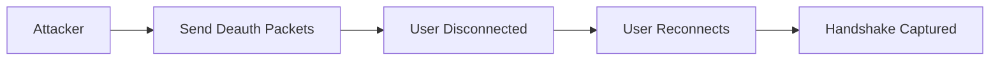

* **Attacks on WPA / WPA2 Encryption**
  * **Brute Force Attack**
    * Tries all possible password combinations.
    * Works if password is weak.
  * **Dictionary Attack**
    * Uses a list of common passwords.
    * Faster than brute force.
  * **WPS Attack**
    * Exploits weakness in WPS PIN.
    * PIN-based authentication is easier to crack.
  * **Evil Twin Attack**
    * Attacker creates fake Wi-Fi with same name (SSID).
    * Users connect thinking it is legitimate.

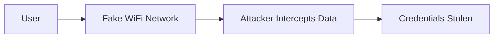

* **Fake Hotspot**
  * Attacker creates open/public Wi-Fi (e.g., "Free WiFi").
  * Users connect unknowingly.
  * Attacker monitors and captures traffic.
* **Packet Sniffing**
  * Capturing wireless data packets.
  * Can expose sensitive information if not encrypted.
* **Man-in-the-Middle (MitM) Attack**
  * Attacker intercepts communication between user and network.
  * Can read or modify data.

***

#### 1.1.3 Impact on Network Security

* **Loss of Confidentiality**
  * Sensitive data like passwords, emails, and banking info can be stolen.
* **Loss of Integrity**
  * Data can be altered during transmission.
* **Loss of Availability**
  * Network services can be disrupted (e.g., deauth attacks, DoS).
* **Unauthorized Access**
  * Attackers gain access to internal systems and resources.
* **Privacy Violation**
  * User activity can be monitored without consent.
* **Financial Damage**
  * Fraud, identity theft, or business loss.
* **Malware Injection**
  * Attackers can inject malicious content into traffic.

***

#### 🔐 Prevention Measures

* Use **WPA3 encryption**
* Disable **WPS**
* Use **strong and complex passwords**
* Avoid connecting to **unknown Wi-Fi networks**
* Use **VPN on public networks**
* Regularly update router firmware
* Enable **network monitoring / IDS**

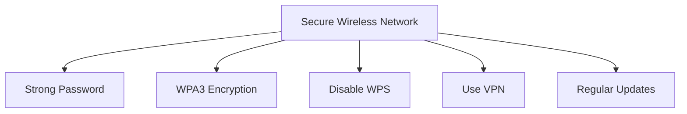

***

## 2. Network Sniffing

### 2.1 Introduction to Network Sniffing

#### 2.1.1 Definition of Network Sniffing

Network sniffing is the process of **capturing and analyzing data packets** as they travel across a computer network.

* It involves intercepting network traffic at the packet level.
* Used to understand how data flows between devices.
* Can be:
  * **Legitimate** (for monitoring and troubleshooting)
  * **Malicious** (for unauthorized data interception)
* Commonly performed using tools like **Wireshark**.

***

#### 2.1.2 Packet Capturing Concept

* In computer networks, data is broken into small units called **packets**.
* Each packet contains:
  * **Header** → source address, destination address, protocol info
  * **Payload** → actual data
* Packet capturing involves:
  * Intercepting these packets from the network.
  * Storing them for analysis.
* Capturing happens at the **network interface level**:
  * Network Interface Card (NIC) receives packets.
  * In **promiscuous mode**, NIC captures all packets (not just its own).
* Packet capture can be:
  * **Live capture** → real-time monitoring
  * **Offline analysis** → analyzing saved data

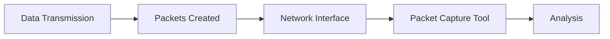

***

#### 2.1.3 Legitimate vs Malicious Use

**Legitimate Use**

* Network administrators use sniffing for:
  * Troubleshooting network issues
  * Monitoring traffic
  * Detecting anomalies
* Helps in:
  * Debugging applications
  * Ensuring network security

**Malicious Use**

* Attackers use sniffing to:
  * Steal sensitive data (passwords, cookies)
  * Monitor user activity
  * Perform session hijacking

**Key Difference**

* Legitimate → authorized, defensive
* Malicious → unauthorized, offensive

***

### 2.2 Purpose of Network Sniffing

#### 2.2.1 Troubleshooting

* Helps identify network problems such as:
  * Packet loss
  * retransmissions
  * congestion
* Allows administrators to:
  * locate faulty devices
  * diagnose configuration errors

***

#### 2.2.2 Security Monitoring

* Detects suspicious or malicious activities:
  * unauthorized access
  * unusual traffic patterns
* Helps in:
  * intrusion detection
  * identifying attacks (e.g., MITM, DoS)

***

#### 2.2.3 Performance Monitoring

* Measures network performance:
  * bandwidth usage
  * latency
  * error rates
* Helps optimize:
  * network efficiency
  * resource allocation

***

#### 2.2.4 Protocol Analysis

* Examines communication protocols used in network:
  * TCP, UDP, IP, HTTP, DNS
* Helps understand:
  * how devices communicate
  * protocol behavior and issues
* Useful for:
  * debugging applications
  * learning network operations

***

## 3. Wireshark

### 3.1 Introduction to Wireshark

#### 3.1.1 Definition

Wireshark is a **network protocol analyzer** used to capture and analyze data packets traveling across a network in real time.

* It is one of the **most widely used tools** for packet analysis.
* Allows users to:
  * inspect packets at a very detailed level
  * understand network communication
* Supports multiple operating systems:
  * Linux
  * Windows
  * macOS

***

#### 3.1.2 Role in Network Analysis

Wireshark plays a critical role in analyzing and understanding network behavior.

* Helps in:
  * **capturing network traffic**
  * **examining packet contents**
  * **identifying issues in communication**
* Used by:
  * network administrators
  * security analysts
  * ethical hackers
* Key roles include:
  * troubleshooting network problems
  * detecting malicious activities
  * analyzing protocol behavior
  * debugging applications

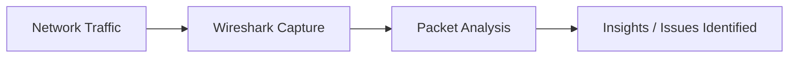

***

### 3.2 Features of Wireshark

#### 3.2.1 Packet Capture

* Captures packets directly from the network interface.
* Can:
  * capture traffic in real time
  * read previously saved capture files
* Supports multiple interfaces:
  * Ethernet
  * Wi-Fi
  * virtual interfaces

***

#### 3.2.2 Protocol Analysis

* Supports a wide range of network protocols:
  * TCP
  * UDP
  * IP
  * HTTP
  * DNS
* Displays detailed information such as:
  * headers
  * flags
  * sequence numbers
* Helps understand how devices communicate.

***

#### 3.2.3 Live Capture and Offline Analysis

* **Live Capture**
  * Captures packets as they are transmitted over the network.
  * Useful for real-time monitoring.
* **Offline Analysis**
  * Analyzes saved packet capture files (.pcap).
  * Useful for:
    * reviewing past traffic
    * forensic analysis

***

#### 3.2.4 Filtering and Search

* Allows users to focus on specific packets.
* Two main types:
  * **Display Filters** → applied after capture
  * **Capture Filters** → applied before capture
* Examples:
  * `tcp` → show TCP packets
  * `ip.addr == 192.168.1.1` → filter by IP
  * `port 80` → filter HTTP traffic
* Helps in quickly locating relevant data.

***

#### 3.2.5 Colorization and Decoding

* Packets are color-coded based on protocol type:
  * improves readability
  * makes analysis faster
* Automatically decodes packets into:
  * human-readable format
  * structured protocol layers
* Makes complex data easier to understand.

***

#### 3.2.6 Statistics and Graphs

* Provides statistical analysis of captured traffic.
* Includes:
  * protocol hierarchy
  * packet counts
  * IO graphs
* Helps visualize:
  * network trends
  * traffic patterns
  * performance metrics

***

#### 3.2.7 VoIP Analysis

* Specialized features for analyzing Voice over IP (VoIP).
* Supports protocols:
  * SIP (Session Initiation Protocol)
  * RTP (Real-time Transport Protocol)
* Helps in:
  * diagnosing call quality issues
  * analyzing voice traffic

***

#### 3.2.8 Exporting Data

* Captured data can be exported for further use.
* Supported formats:
  * text files
  * CSV
  * PCAP
* Useful for:
  * reporting
  * sharing analysis
  * further processing in other tools

***

## 4. Packet Analysis

### 4.1 Introduction to Packet Analysis

#### 4.1.1 Definition

Packet analysis is the process of **capturing, examining, and interpreting data packets** that travel across a network.

* Each packet represents a unit of communication.
* Analysis helps understand:
  * how data is transmitted
  * how devices interact
* Performed using tools like **Wireshark**.

***

#### 4.1.2 Importance in Networking

* Essential for:
  * troubleshooting network issues
  * monitoring performance
  * detecting security threats
* Helps in:
  * identifying bottlenecks
  * understanding protocol behavior
  * diagnosing application errors

***

### 4.2 Aspects of Packet Analysis

#### 4.2.1 Capture Packets

**4.2.1.1 Tools (Wireshark)**

* Wireshark is commonly used to:
  * capture packets in real time
  * analyze saved captures
* Supports multiple protocols and interfaces.

**4.2.1.2 Network Interface Selection**

* Must select correct interface:
  * Ethernet
  * Wi-Fi
* Wrong interface → no useful data.
* Promiscuous mode allows capturing all packets.

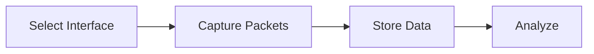

***

#### 4.2.2 Packet Structure

**4.2.2.1 Headers**

* Contains control information:
  * source IP
  * destination IP
  * protocol type
  * sequence numbers
* Helps route packets correctly.

**4.2.2.2 Payloads**

* Actual data being transmitted.
* May contain:
  * text
  * files
  * encrypted data

***

#### 4.2.3 Protocol Analysis

**4.2.3.1 TCP**

* Connection-oriented protocol.
* Ensures reliable delivery.
* Uses:
  * sequence numbers
  * acknowledgments

**4.2.3.2 UDP**

* Connectionless protocol.
* Faster but less reliable.
* No acknowledgment mechanism.

**4.2.3.3 IP**

* Responsible for addressing and routing packets.
* Uses IP addresses to identify devices.

**4.2.3.4 HTTP**

* Application layer protocol.
* Used for web communication.
* Transfers web pages and data.

**4.2.3.5 DNS**

* Resolves domain names into IP addresses.
* Essential for internet communication.

***

#### 4.2.4 Packet Details

**4.2.4.1 Source and Destination Address**

* Identifies sender and receiver.
* Used to trace communication path.

**4.2.4.2 Port Numbers**

* Identifies specific services:
  * HTTP → 80
  * HTTPS → 443
* Helps determine application type.

**4.2.4.3 Timing Information**

* Shows when packets are sent/received.
* Helps analyze:
  * delays
  * latency

**4.2.4.4 Payload Analysis**

* Examines actual data content.
* Useful for:
  * debugging
  * detecting malicious data

***

#### 4.2.5 Filtering

**4.2.5.1 Purpose of Filtering**

* Reduces large data into relevant packets.
* Focuses on specific traffic.

**4.2.5.2 Types of Filters**

* **Display Filters**
  * Applied after capture.
  * Used to view specific packets.
* **Capture Filters**
  * Applied before capture.
  * Captures only required data.

***

#### 4.2.6 Follow Streams

**4.2.6.1 TCP Stream Analysis**

* Combines packets of same session.
* Shows complete communication.

**4.2.6.2 Communication Reconstruction**

* Reconstructs entire conversation between devices.
* Helps understand context of communication.

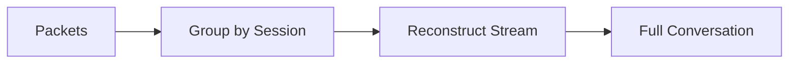

***

#### 4.2.7 Security Analysis

**4.2.7.1 Suspicious Traffic Detection**

* Identifies unusual patterns:
  * unknown IPs
  * abnormal traffic volume

**4.2.7.2 Unauthorized Access Detection**

* Detects unauthorized login attempts.
* Helps identify potential attacks.

***

#### 4.2.8 VoIP Analysis

**4.2.8.1 SIP Protocol**

* Used for initiating voice calls.
* Handles call setup and termination.

**4.2.8.2 RTP Protocol**

* Transfers voice data.
* Ensures real-time communication.

***

#### 4.2.9 Statistical Analysis

**4.2.9.1 Network Utilization**

* Measures bandwidth usage.
* Helps optimize network performance.

**4.2.9.2 Error Rates**

* Detects packet errors or losses.
* Indicates network issues.

**4.2.9.3 Graph Analysis**

* Visual representation of traffic.
* Helps identify trends and anomalies.

***

#### 4.2.10 Encryption Analysis

**4.2.10.1 Encrypted Traffic**

* Data may be encrypted (e.g., HTTPS).
* Payload cannot be read without keys.

**4.2.10.2 HTTPS Identification**

* Recognized via port 443.
* Indicates secure communication.

***

#### 4.2.11 Troubleshooting

**4.2.11.1 Packet Loss**

* Missing packets during transmission.
* Causes performance issues.

**4.2.11.2 Retransmissions**

* Packets resent due to errors.
* Indicates network instability.

**4.2.11.3 Misconfigurations**

* Incorrect network settings.
* Causes communication failures.

***

#### 4.2.12 Documentation

**4.2.12.1 Recording Findings**

* Document observations and issues.
* Helps in reporting and analysis.

**4.2.12.2 Annotation Tools**

* Add notes to captured packets.
* Improves clarity and understanding.

***

#### 4.2.13 Educational Resources

**4.2.13.1 Continuous Learning**

* Stay updated with:
  * new protocols
  * new tools

**4.2.13.2 Protocol Knowledge**

* Understanding protocols improves analysis skills.
* Essential for network professionals.

***

## 5. Display and Capture Filters

### 5.1 Introduction to Filters

#### 5.1.1 Purpose of Filters

Filters are used in packet analysis to **selectively capture or display specific packets** based on defined conditions.

* Network traffic can be very large and complex.
* Filters help in:
  * reducing unnecessary data
  * focusing on relevant packets
  * improving analysis efficiency
* Essential for:
  * troubleshooting
  * security analysis
  * protocol study

***

#### 5.1.2 Use in Wireshark

* Wireshark provides powerful filtering capabilities.
* Filters are used to:
  * isolate specific traffic (e.g., HTTP, DNS)
  * analyze particular devices or IPs
  * track communication between systems
* Two main types:
  * **Display Filters**
  * **Capture Filters**

***

### 5.2 Display Filters

#### 5.2.1 Definition

Display filters are used to **view specific packets after they have been captured**.

* Do not affect packet capture.
* Only control what is shown on screen.

***

#### 5.2.2 Working Mechanism

* Applied on already captured data.
* Filters packets based on:
  * protocol
  * IP address
  * port
* Allows dynamic filtering without recapturing data.

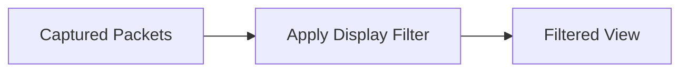

***

#### 5.2.3 Examples

**5.2.3.1 Protocol Filters (TCP, UDP, ICMP)**

* `tcp` → shows only TCP packets
* `udp` → shows only UDP packets
* `icmp` → shows only ICMP packets

***

**5.2.3.2 Address Filters (IP Address, IP Range)**

* `ip.addr == 192.168.1.1` → packets to/from specific IP
* `ip.addr in 192.168.1.0/24` → packets within a network range

***

### 5.3 Capture Filters

#### 5.3.1 Definition

Capture filters are used to **capture only specific packets during the capture process**.

* Applied before capturing starts.
* Reduces amount of stored data.

***

#### 5.3.2 Working Mechanism

* Filters packets at the time of capture.
* Only packets matching conditions are stored.
* Based on **BPF (Berkeley Packet Filter) syntax**.

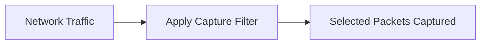

***

#### 5.3.3 Examples

**5.3.3.1 Host Filters**

* `host 192.168.1.1` → capture traffic to/from a specific host

***

**5.3.3.2 Network Filters**

* `net 192.168.1.0/24` → capture traffic in a network range

***

**5.3.3.3 Port Filters**

* `port 80` → capture HTTP traffic
* `port 443` → capture HTTPS traffic

***

**5.3.3.4 Port Range Filters**

* `portrange 5000-5010` → capture traffic within port range

***

### 🔁 Key Difference (Important)

| Feature      | Display Filter            | Capture Filter               |
| ------------ | ------------------------- | ---------------------------- |
| Applied When | After capture             | Before capture               |
| Purpose      | View specific packets     | Capture specific packets     |
| Data Storage | All packets stored        | Only filtered packets stored |
| Flexibility  | High (can change anytime) | Fixed during capture         |
| Syntax       | Wireshark-specific        | BPF syntax                   |

***

## 6. Ettercap

### 6.1 Introduction to Ettercap

#### 6.1.1 Definition

Ettercap is an **open-source network security tool** used for performing **Man-in-the-Middle (MITM) attacks**, network sniffing, and protocol analysis.

* Designed for both:
  * **security testing (ethical hacking)**
  * **network analysis**
* Works on:
  * Ethernet networks
  * Wi-Fi networks
* Available for:
  * Linux / Unix
  * Windows
* It can intercept, analyze, and manipulate network traffic in real time.

***

#### 6.1.2 Features

* **MITM Attack Support**
  * Intercepts communication between two devices.
* **Packet Sniffing**
  * Captures and analyzes network packets.
* **Protocol Analysis**
  * Understands and decodes various protocols.
* **Active and Passive Modes**
  * Supports both attack types.
* **Plugin Support**
  * Extend functionality using plugins.
* **Cross-Platform**
  * Works on multiple operating systems.
* **Supports Multiple Protocols**
  * HTTP, FTP, DNS, etc.

***

### 6.2 Capabilities of Ettercap

#### 6.2.1 Man-in-the-Middle Attacks

* Ettercap can place itself between two communicating devices.
* Process:
  * Intercepts communication
  * Reads data
  * Can modify data before forwarding
* Common technique:
  * **ARP Spoofing**
    * Attacker sends fake ARP messages.
    * Victim routes traffic through attacker.

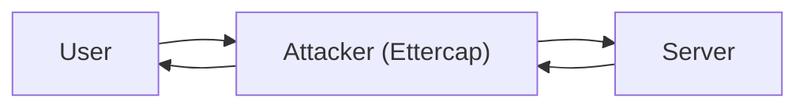

* Used for:
  * credential theft
  * session hijacking
  * data manipulation

***

#### 6.2.2 Network Sniffing

* Captures packets from network traffic.
* Works in:
  * **promiscuous mode** → captures all packets
  * **non-promiscuous mode** → captures only targeted traffic
* Can extract:
  * usernames
  * passwords
  * session data

***

#### 6.2.3 Protocol Analysis

* Analyzes different network protocols.
* Identifies:
  * protocol type
  * communication patterns
  * anomalies
* Helps in:
  * debugging
  * security auditing
* Supports decoding of multiple protocols to readable format.

***

#### 6.2.4 Active and Passive Attacks

**Active Attacks**

* Attacker actively interacts with network traffic.
* Examples:
  * modifying packets
  * injecting malicious data
  * redirecting traffic

**Passive Attacks**

* Attacker only observes traffic.
* No modification of data.
* Used for:
  * monitoring
  * data collection

***

### 🔐 Security Note (Exam Important)

* Ettercap is a **dual-use tool**:
  * Used by security professionals for testing
  * Used by attackers for exploitation
* Prevention measures:
  * Use **encrypted protocols (HTTPS, SSH)**
  * Implement **ARP spoofing detection**
  * Use **network segmentation**
  * Enable **intrusion detection systems (IDS)**

***

## 7. DNS Poisoning

### 7.1 Introduction to DNS Poisoning

#### 7.1.1 Definition

DNS poisoning is a type of cyber attack in which an attacker **manipulates the Domain Name System (DNS)** to redirect users from a legitimate website to a **malicious or fake website**.

* DNS normally converts:
  * domain names → IP addresses
* In DNS poisoning:
  * attacker injects **false DNS records**
* Result:
  * user is redirected without knowing

***

#### 7.1.2 Alternate Name (DNS Spoofing)

* DNS poisoning is also called **DNS spoofing**.
* “Spoofing” means:
  * pretending to be something legitimate
* In this case:
  * attacker pretends to be a trusted DNS server
* Provides fake IP address for a real domain.

***

### 7.2 Working of DNS Poisoning

#### 7.2.1 DNS Resolution Manipulation

* Normally:
  * User requests a domain (e.g., google.com)
  * DNS server returns correct IP address
* In attack:
  * attacker injects fake DNS entry
  * DNS server stores incorrect mapping
* Methods:
  * cache poisoning
  * spoofed DNS responses
  * compromising DNS server

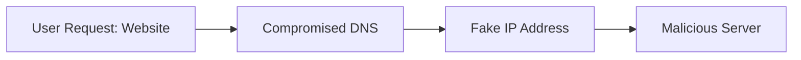

***

#### 7.2.2 Redirection to Malicious Sites

* User enters a legitimate URL.
* Due to poisoned DNS:
  * user is redirected to attacker-controlled site
* Fake site may:
  * look identical to original
  * trick user into entering credentials

***

### 7.3 Impact of DNS Poisoning

#### 7.3.1 Data Interception

* Attacker can capture:
  * login credentials
  * banking details
  * personal information
* Enables:
  * identity theft
  * session hijacking

***

#### 7.3.2 Phishing Attacks

* Fake websites used to:
  * trick users into revealing sensitive data
* Highly dangerous because:
  * URL appears correct
  * user trusts the website

***

### 🔐 Additional Impacts (from full content coverage)

* **Loss of Confidentiality**
  * Sensitive data exposed
* **Loss of Integrity**
  * Data may be altered
* **Financial Loss**
  * Fraud or unauthorized transactions
* **Malware Distribution**
  * Users may download malicious files

***

### 🔐 Prevention Measures (Exam Important)

* Use **DNSSEC (DNS Security Extensions)**
* Use **HTTPS / SSL certificates**
* Avoid clicking unknown links
* Regularly update DNS servers
* Use **trusted DNS providers**
* Implement **intrusion detection systems**

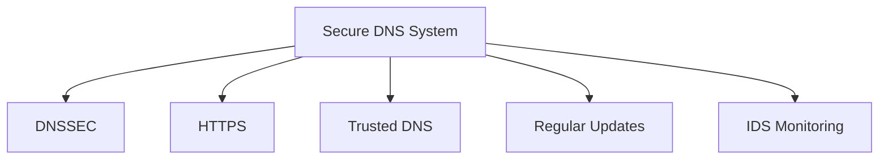

***

## 8. Denial of Service (DoS) Attack

### 8.1 Introduction to DoS

#### 8.1.1 Definition

A Denial of Service (DoS) attack is a malicious attempt to **disrupt the normal functioning of a server, service, or network** by overwhelming it with excessive traffic or requests.

* The target becomes:
  * slow
  * unresponsive
  * completely unavailable
* It does not necessarily steal data but **prevents legitimate access**.

***

#### 8.1.2 Objective

The main objective of a DoS attack is to:

* Make a system or service **unavailable to legitimate users**
* Overload system resources such as:
  * bandwidth
  * CPU
  * memory
* Disrupt business operations
* Cause financial or reputational damage

***

### 8.2 Types of DoS Attacks

#### 8.2.1 DoS

* Involves a **single attacker system**.
* Sends a large number of requests to the target.
* Characteristics:
  * easier to detect
  * limited scale
  * originates from one source

***

#### 8.2.2 DDoS (Distributed Denial of Service)

* Involves **multiple systems (botnet)** attacking a target simultaneously.
* Characteristics:
  * very powerful and scalable
  * difficult to detect and block
  * traffic comes from multiple locations

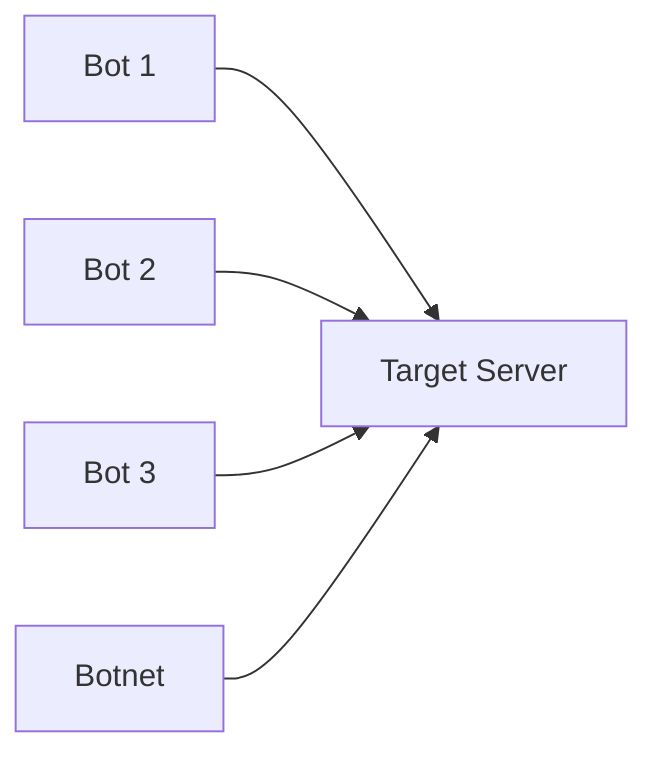

***

### 8.3 Impact of DoS Attacks

#### 8.3.1 Service Disruption

* Legitimate users cannot access services.
* Websites, applications, or servers may:
  * crash
  * become extremely slow
* Affects:
  * e-commerce
  * banking systems
  * online services

***

#### 8.3.2 Resource Exhaustion

* System resources get overloaded:
  * CPU usage spikes
  * memory gets consumed
  * bandwidth gets saturated
* Leads to:
  * system failure
  * degraded performance

***

### 🔐 Additional Impacts (from full content coverage)

* **Loss of Availability**
  * Primary goal of DoS attacks
* **Financial Loss**
  * Downtime leads to revenue loss
* **Reputation Damage**
  * Loss of customer trust
* **Operational Disruption**
  * Interrupts normal business activities

***

### 🔐 Prevention Measures (Exam Important)

* Implement **firewalls and intrusion prevention systems (IPS)**
* Use **rate limiting** to control traffic flow
* Deploy **load balancers**
* Use **traffic filtering and monitoring**
* Enable **SYN flood protection**
* Use **cloud-based DDoS protection services**

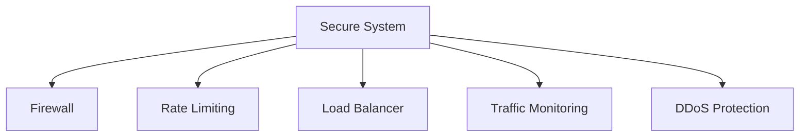

***

## 9. Vulnerability Scanning

### 9.1 Introduction to Vulnerability Scanning

#### 9.1.1 Definition

Vulnerability scanning is a **proactive security process** used to identify and assess weaknesses in a network, system, or application.

* It uses **automated tools** to scan for known vulnerabilities.
* A vulnerability is a **weakness that can be exploited** by an attacker.
* Scanning can be performed on:
  * networks
  * operating systems
  * applications
* It helps detect issues **before attackers exploit them**.

***

#### 9.1.2 Importance

* Essential for maintaining **network security**.
* Helps organizations:
  * identify security gaps
  * reduce risk of attacks
  * improve system configuration
* Important points:
  * Not all vulnerabilities can be detected manually
  * Automated scanning improves efficiency
  * Regular scanning is required for updated security
* Plays a key role in:
  * penetration testing
  * security audits
  * compliance requirements

***

### 9.2 Key Components of Vulnerability Scanning

#### 9.2.1 Network Discovery

**9.2.1.1 Host Identification**

* Identifies active devices on the network.
* Detects:
  * computers
  * servers
  * routers
* Helps create a map of network assets.

**9.2.1.2 Service Mapping**

* Identifies services running on each host.
* Includes:
  * open ports
  * active services (HTTP, FTP, SSH)
* Helps determine potential entry points.

***

#### 9.2.2 Vulnerability Detection

**9.2.2.1 OS Vulnerabilities**

* Detects weaknesses in operating systems.
* Examples:
  * missing security patches
  * outdated OS versions
  * insecure configurations

**9.2.2.2 Application Vulnerabilities**

* Identifies flaws in applications.
* Examples:
  * SQL injection
  * cross-site scripting (XSS)
  * misconfigured services
* Scanners compare system data with:
  * known vulnerability databases

***

#### 9.2.3 Risk Assessment

**9.2.3.1 Severity Levels**

* Each vulnerability is assigned a risk level:
  * **Critical** → immediate threat
  * **High** → serious risk
  * **Medium** → moderate risk
  * **Low** → minor issue
* Helps prioritize fixes.

**9.2.3.2 Impact Analysis**

* Evaluates the potential damage:
  * data loss
  * system compromise
  * service disruption
* Considers:
  * likelihood of exploitation
  * business impact

***

#### 9.2.4 Reporting

**9.2.4.1 Vulnerability Reports**

* Provides detailed information about:
  * detected vulnerabilities
  * affected systems
  * severity levels
* Includes:
  * descriptions
  * technical details

***

**9.2.4.2 Remediation Suggestions**

* Suggests steps to fix vulnerabilities:
  * applying patches
  * updating software
  * changing configurations
* Helps administrators take corrective action.

***

### 🔄 Vulnerability Scanning Workflow

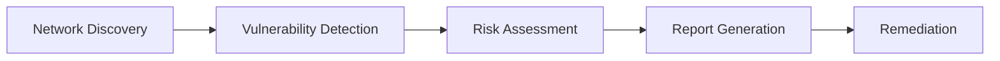

***

### 🔐 Additional Points (from full content)

* Types of vulnerabilities based on origin:
  * **Vendor-originated** → software bugs, missing patches
  * **System administration-originated** → misconfigurations
  * **User-originated** → unsafe practices
* Types of scanners:
  * Network scanners
  * Web application scanners
  * Host-based scanners
  * Database scanners
  * Cloud-based scanners
  * Mobile application scanners
  * Passive scanners
* Important concepts:
  * **False Positive** → reports a vulnerability that doesn’t exist
  * **False Negative** → fails to detect an actual vulnerability

***

### 🔐 Prevention / Best Practices

* Perform **regular scans**
* Keep systems **updated and patched**
* Use **trusted scanning tools** (e.g., Nessus)
* Follow **security policies and standards**
* Combine **automated + manual testing**

***

## 10. Nessus

### 10.1 Introduction to Nessus

#### 10.1.1 Definition

Nessus is a **powerful vulnerability scanning tool** used to identify security weaknesses, misconfigurations, and vulnerabilities in networks, systems, and applications.

* Performs **automated security assessments**
* Widely used in:
  * network security
  * penetration testing
  * vulnerability management
* Helps detect:
  * outdated software
  * missing patches
  * insecure configurations

***

#### 10.1.2 Developer (Tenable)

* Nessus is developed by **Tenable Inc.**
* Known for:
  * maintaining a large vulnerability database
  * providing regular plugin updates
* One of the most **trusted and widely used tools** in cybersecurity.

***

### 10.2 Features of Nessus

#### 10.2.1 Vulnerability Scanning

* Performs automated scans on:
  * networks
  * operating systems
  * applications
* Detects:
  * known vulnerabilities
  * configuration issues
  * security risks
* Uses updated vulnerability databases for accurate results.

***

#### 10.2.2 Plugin Architecture

* Nessus uses a **plugin-based system**.
* Features:
  * thousands of plugins available
  * each plugin detects specific vulnerabilities
  * plugins are regularly updated
* Covers:
  * OS vulnerabilities
  * application flaws
  * network issues

***

#### 10.2.3 Compliance Checks

* Checks systems against **security standards and regulations**:
  * PCI DSS
  * HIPAA
* Helps organizations:
  * ensure compliance
  * meet legal and security requirements

***

#### 10.2.4 Scanning Profiles

* Allows customization of scans based on requirements.
* Users can define:
  * scan scope
  * scan intensity
  * specific targets
* Helps tailor scans for:
  * quick checks
  * deep analysis

***

#### 10.2.5 Policy Auditing

* Evaluates system configurations against defined security policies.
* Helps identify:
  * weak configurations
  * policy violations
* Ensures systems follow **security best practices**.

***

#### 10.2.6 Web Application Scanning

* Scans web applications for vulnerabilities.
* Detects issues such as:
  * SQL injection
  * cross-site scripting (XSS)
  * misconfigurations
* Helps secure:
  * websites
  * web services

***

### 🔄 Nessus Workflow (Concept)

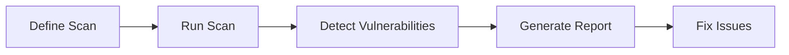

***

### 🔐 Additional Points (from full content)

* Nessus provides:
  * detailed reports
  * severity classification
  * remediation suggestions
* Advantages:
  * high accuracy
  * large vulnerability database
  * easy-to-use interface
* Used by:
  * security professionals
  * system administrators
  * organizations for risk management

***

### 🔐 Best Practices

* Regularly update plugins
* Schedule periodic scans
* Prioritize critical vulnerabilities
* Combine with manual testing
* Use reports for continuous improvement

***

## 11. Network Policies

### 11.1 Introduction to Network Policies

#### 11.1.1 Definition

Network policies are **rules, guidelines, and procedures** that define how network resources and services should be accessed, used, and secured within an organization.

* They control:
  * user access
  * data flow
  * security practices
* Ensure proper management of:
  * network infrastructure
  * communication
  * security controls

***

#### 11.1.2 Importance

* Provides a **structured approach** to network management.
* Helps in:
  * protecting sensitive data
  * preventing unauthorized access
  * maintaining system integrity
* Ensures:
  * consistency in operations
  * compliance with regulations
  * efficient use of network resources

***

### 11.2 Types of Network Policies

#### 11.2.1 Access Control Policies

**11.2.1.1 Authentication**

* Verifies identity of users or devices.
* Methods include:
  * passwords
  * biometrics
  * tokens
* Ensures only valid users can access the network.

**11.2.1.2 Authorization**

* Determines what authenticated users are allowed to do.
* Based on:
  * roles
  * permissions
* Follows principle of **least privilege**.

***

#### 11.2.2 Firewall Policies

**11.2.2.1 Traffic Control**

* Controls incoming and outgoing network traffic.
* Allows or blocks traffic based on:
  * IP addresses
  * ports
  * protocols

**11.2.2.2 Rule Management**

* Defines rules for firewall behavior.
* Includes:
  * allow/deny rules
  * priority levels
* Requires regular updates for security.

***

#### 11.2.3 Security Policies

**11.2.3.1 Encryption**

* Protects data during transmission.
* Uses protocols like:
  * HTTPS
  * TLS/SSL

**11.2.3.2 Intrusion Detection**

* Detects suspicious activities.
* Uses:
  * IDS (Intrusion Detection Systems)
  * IPS (Intrusion Prevention Systems)

**11.2.3.3 Antivirus Measures**

* Protects systems from malware.
* Includes:
  * regular scans
  * updated virus definitions

***

#### 11.2.4 BYOD Policies (Bring Your Own Device)

**11.2.4.1 Device Management**

* Controls personal devices accessing the network.
* Includes:
  * device registration
  * monitoring

**11.2.4.2 Security Requirements**

* Defines security rules for personal devices:
  * strong passwords
  * antivirus installation
  * software updates

***

#### 11.2.5 Remote Access Policies

**11.2.5.1 VPN Usage**

* Requires use of **Virtual Private Network (VPN)** for remote access.
* Ensures:
  * secure communication
  * encrypted data transfer

**11.2.5.2 Multi-factor Authentication**

* Adds additional security layers.
* Requires:
  * password + OTP / biometric

***

#### 11.2.6 Network Monitoring and Logging Policies

**11.2.6.1 Event Logging**

* Records network activities:
  * login attempts
  * data access
* Helps track system behavior.

**11.2.6.2 Log Analysis**

* Analyzes logs to detect:
  * anomalies
  * security incidents
* Useful for forensic investigation.

***

#### 11.2.7 Data Classification and Handling Policies

**11.2.7.1 Data Sensitivity Levels**

* Classifies data based on importance:
  * public
  * confidential
  * sensitive

**11.2.7.2 Data Handling Rules**

* Defines how data should be:
  * stored
  * transmitted
  * accessed
* Ensures proper protection of sensitive data.

***

#### 11.2.8 Incident Response Policies

**11.2.8.1 Incident Detection**

* Identifies security incidents:
  * attacks
  * breaches
* Uses monitoring tools and alerts.

**11.2.8.2 Response Process**

* Steps to handle incidents:
  * detection
  * containment
  * eradication
  * recovery
* Includes communication and reporting procedures.

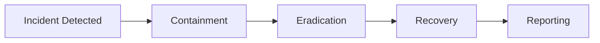

***

### 11.3 Importance of Network Policies

#### 11.3.1 Security and Risk Mitigation

* Reduces risks by enforcing security controls.
* Protects against cyber threats.

***

#### 11.3.2 Compliance

* Ensures adherence to:
  * legal requirements
  * industry standards

***

#### 11.3.3 Consistency

* Provides uniform rules across the organization.
* Reduces configuration errors.

***

#### 11.3.4 Efficient Network Operations

* Improves performance and resource management.
* Ensures smooth network functioning.

***

#### 11.3.5 Employee Awareness

* Educates users about:
  * acceptable usage
  * security practices

***

#### 11.3.6 Incident Response

* Enables quick and effective response to security issues.
* Minimizes damage.

***

#### 11.3.7 Audit and Accountability

* Maintains records of activities.
* Supports auditing and investigations.

***

## 12. Network Scanning Report Generation

### 12.1 Introduction

#### 12.1.1 Purpose of Report

A network scanning report provides a **comprehensive summary of vulnerabilities and security issues** identified during a scan.

* It documents:
  * discovered vulnerabilities
  * affected systems
  * risk levels
* Helps stakeholders understand:
  * current security posture
  * potential threats
* Acts as a **reference document** for fixing issues.

***

#### 12.1.2 Importance in Security

* Essential for:
  * vulnerability management
  * penetration testing
  * security audits
* Helps organizations:
  * identify weaknesses
  * prioritize risks
  * take corrective actions
* Supports:
  * decision-making
  * compliance with security standards

***

### 12.2 Steps in Report Generation

#### 12.2.1 Scan Results Overview

* Provides a high-level summary of scan results.
* Includes:
  * total vulnerabilities found
  * severity distribution
* Gives a quick understanding of overall risk.

***

#### 12.2.2 Scope and Objectives

* Defines:
  * systems and networks scanned
  * IP ranges and assets covered
* Specifies:
  * purpose of scan (e.g., compliance, testing)
* Ensures clarity about what was assessed.

***

#### 12.2.3 Methodology

* Describes how the scan was performed.
* Includes:
  * tools used (e.g., Nessus)
  * techniques applied
* May specify:
  * authenticated vs unauthenticated scanning

***

#### 12.2.4 Scan Configuration

* Details scan settings:
  * scan profiles
  * parameters used
  * timing and duration
* Helps reproduce the scan if needed.

***

#### 12.2.5 Executive Summary

* Provides a **non-technical overview** for management.
* Includes:
  * key findings
  * critical vulnerabilities
  * overall risk level
* Written in simple language for decision-makers.

***

#### 12.2.6 Vulnerability Analysis

* Lists all detected vulnerabilities.
* Includes:
  * description of each vulnerability
  * severity level (critical, high, medium, low)
  * affected systems
* May include:
  * CVE identifiers
  * technical details

***

#### 12.2.7 Recommendations

* Suggests actions to fix vulnerabilities:
  * patching systems
  * updating software
  * changing configurations
* Recommendations should be:
  * clear
  * actionable
  * prioritized

***

#### 12.2.8 Graphs and Visualizations

* Uses charts and graphs to represent data.
* Examples:
  * vulnerability distribution
  * severity levels
  * trends over time
* Helps in:
  * quick understanding
  * visual analysis


***

#### 12.2.9 Compliance Status

* Indicates whether systems meet security standards:
  * PCI DSS
  * HIPAA
* Highlights:
  * compliance gaps
  * non-compliant areas

***

#### 12.2.10 Risk Assessment

* Evaluates overall risk level.
* Considers:
  * severity of vulnerabilities
  * likelihood of exploitation
  * potential business impact
* Helps prioritize remediation.

***

#### 12.2.11 Mitigation and Remediation Plan

* Provides a structured plan to fix issues.
* Includes:
  * steps to reduce risks
  * timeline for fixes
  * prioritization of critical issues

***

#### 12.2.12 Detailed Technical Findings

* Provides in-depth technical details for experts.
* Includes:
  * affected systems
  * ports and services
  * exploit scenarios
* May include:
  * logs
  * screenshots
  * evidence

***

#### 12.2.13 Appendix

* Contains additional supporting information.
* Includes:
  * raw scan data
  * network diagrams
  * detailed reports
* Serves as a reference for further analysis.

***

### 🔄 Overall Flow of Report Generation

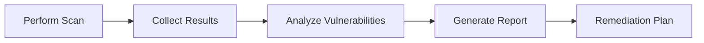

***

### 🔐 Key Points (Exam Ready)

* Report must be:
  * clear
  * structured
  * actionable
* Should include:
  * executive summary
  * technical details
  * recommendations
* Used for:
  * improving security
  * tracking vulnerabilities
  * compliance verification

***

## 13. Router Attacks

### 13.1 Introduction to Router Attacks

#### 13.1.1 Importance of Routers

Routers are **critical components of network infrastructure** that manage and direct data traffic between devices and networks.

* They:
  * connect local networks to the internet
  * route data packets between systems
* Act as a **central point of control**, making them a key target for attackers.
* If compromised:
  * entire network security is affected

***

#### 13.1.2 Threat Landscape

* Routers are exposed to multiple threats because they:
  * handle all incoming and outgoing traffic
  * often have default or weak configurations
* Common risks:
  * unauthorized access
  * traffic interception
  * redirection to malicious sites
* Attacks on routers can lead to:
  * data theft
  * network control by attackers
  * large-scale security breaches

***

### 13.2 Types of Router Attacks

#### 13.2.1 DNS Spoofing and Cache Poisoning

**13.2.1.1 DNS Spoofing**

* Attacker modifies router DNS settings.
* Redirects users to **malicious websites** instead of legitimate ones.
* Often used for:
  * phishing
  * credential theft

***

**13.2.1.2 Cache Poisoning**

* Injects false DNS entries into router cache.
* Router stores incorrect domain-to-IP mappings.
* All users connected to the router get redirected.

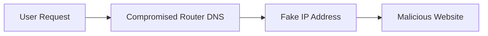

***

**13.2.1.3 Preventive Measures**

* Use **DNSSEC** for secure DNS resolution
* Regularly update router firmware
* Use trusted DNS servers
* Disable unnecessary DNS services

***

#### 13.2.2 Firmware Exploits

**13.2.2.1 Vulnerability Exploitation**

* Attackers exploit weaknesses in router firmware.
* Causes:
  * outdated firmware
  * unpatched vulnerabilities
* Effects:
  * unauthorized access
  * remote control of router
  * installation of malicious code

***

**13.2.2.2 Preventive Measures**

* Keep firmware **up to date**
* Disable remote firmware updates if not needed
* Monitor vendor security updates
* Use strong admin credentials

***

#### 13.2.3 Denial of Service Attacks

**13.2.3.1 DoS Mechanism**

* Attackers flood router with excessive traffic.
* Router becomes:
  * overloaded
  * unresponsive
* Results:
  * network downtime
  * service disruption

***

**13.2.3.2 Preventive Measures**

* Implement **rate limiting**
* Use **traffic filtering**
* Enable **SYN flood protection**
* Deploy intrusion prevention systems (IPS)

***

#### 13.2.4 Man-in-the-Middle Attacks

**13.2.4.1 Data Interception**

* Attacker intercepts traffic passing through router.
* Techniques:
  * ARP spoofing
  * DNS manipulation
* Attacker can:
  * read sensitive data
  * modify communication
  * inject malicious content

```mermaid
flowchart LR
A[User] --> B[Compromised Router]
B --> C[Internet Server]
C --> B
B --> A
```

***

**13.2.4.2 Preventive Measures**

* Use **encryption (HTTPS, WPA3)**
* Enable secure communication protocols
* Use **VPN for sensitive data**
* Monitor network traffic regularly

***

### 🔐 Additional Security Practices

* Change default router credentials
* Disable unused services and ports
* Enable firewall on router
* Use network segmentation
* Regularly audit router configurations

***

### 🔐 Key Exam Points

* Routers are **high-value targets** in networks
* Attacks can affect **entire network users**
* Common attacks:
  * DNS spoofing
  * firmware exploits
  * DoS
  * MITM
* Prevention focuses on:
  * updates
  * encryption
  * monitoring

***

## 14. Packet Sniffing (Detailed)

### 14.1 Introduction

#### 14.1.1 Definition

Packet sniffing (also called network sniffing or protocol analysis) is the process of **capturing and inspecting data packets** as they travel across a network.

* It is used to monitor and analyze network traffic.
* Can be:
  * **legitimate** → for troubleshooting and monitoring
  * **malicious** → for unauthorized data interception
* Performed using tools like:
  * Wireshark
  * tcpdump
  * Ettercap

***

#### 14.1.2 Use Cases

**Legitimate Use**

* Network troubleshooting
* Performance monitoring
* Security analysis
* Debugging applications

**Malicious Use**

* Stealing credentials (usernames, passwords)
* Session hijacking
* Monitoring user activity
* Data theft

***

### 14.2 Components

#### 14.2.1 Data Packets

**14.2.1.1 Structure**

* Data in networks is transmitted in small units called **packets**.
* Each packet consists of:
  * **Header**
    * source address
    * destination address
    * protocol information
  * **Payload**
    * actual data

```mermaid
flowchart LR
A[Packet] --> B[Header]
A --> C[Payload]
```

***

**14.2.1.2 Content**

* Packet content may include:
  * text data
  * files
  * credentials
  * session information
* If unencrypted:
  * data is readable
* If encrypted:
  * data appears unreadable without keys

***

#### 14.2.2 Network Interface

**14.2.2.1 Role**

* The **Network Interface Card (NIC)** is responsible for:
  * sending and receiving packets
* Acts as the point where packet sniffing occurs.
* It connects the device to:
  * Ethernet
  * Wi-Fi

***

**14.2.2.2 Capture Mechanism**

* NIC captures packets from the network medium.
* Packet capture tools interact with NIC to:
  * intercept packets
  * store them for analysis
* Normally:
  * NIC captures only packets addressed to it
* For sniffing:
  * special mode is required (promiscuous mode)

***

#### 14.2.3 Promiscuous Mode

**14.2.3.1 Definition**

Promiscuous mode is a setting in which the network interface **captures all packets on the network**, not just those intended for the device.

* Essential for packet sniffing tools.

***

**14.2.3.2 Functionality**

* In this mode:
  * NIC listens to all traffic on the network
  * captures packets from all devices
* Enables:
  * full network monitoring
  * detailed traffic analysis

```mermaid
flowchart LR
A[Network Traffic] --> B[NIC in Promiscuous Mode]
B --> C[Capture All Packets]
C --> D[Analysis Tool]
```

***

### 🔐 Key Points (Exam Ready)

* Packet sniffing = **capturing + analyzing packets**
* Core components:
  * packets
  * network interface
  * promiscuous mode
* Can be:
  * **beneficial (monitoring)**
  * **harmful (data theft)**
* Encryption (HTTPS) protects data from sniffing

***

### 🔐 Prevention Measures

* Use **encryption (HTTPS, SSL/TLS)**
* Avoid unsecured networks
* Use **VPN**
* Implement **network monitoring tools**
* Disable promiscuous mode when not needed

***

## 15. Types of Authentication

### 15.1 Introduction

#### 15.1.1 Definition

Authentication is the process of **verifying the identity of a user, device, or system** before granting access to resources.

* Ensures that only **authorized entities** can access systems.
* Acts as the **first line of defense** in security.
* Commonly based on:
  * something you know
  * something you have
  * something you are

***

#### 15.1.2 Importance

* Prevents **unauthorized access**
* Protects:
  * sensitive data
  * systems
  * network resources
* Helps maintain:
  * confidentiality
  * integrity
  * availability
* Essential for:
  * secure communication
  * user identity verification
  * access control systems

***

### 15.2 Types

#### 15.2.1 Password-Based Authentication

* Users provide a **password** to gain access.
* **Strengths**
  * simple and widely used
  * cost-effective
* **Weaknesses**
  * vulnerable to:
    * brute force attacks
    * phishing
    * password reuse

***

#### 15.2.2 Multi-Factor Authentication (MFA)

* Requires **two or more authentication factors**.
* Example:
  * password + OTP
  * password + biometric
* **Strengths**
  * higher security
  * reduces risk of unauthorized access
* **Weaknesses**
  * slightly complex
  * may inconvenience users

***

#### 15.2.3 Biometric Authentication

* Uses **unique physical or behavioral traits**.
* Examples:
  * fingerprint
  * face recognition
  * iris scan
  * voice recognition
* **Strengths**
  * difficult to replicate
  * convenient
* **Weaknesses**
  * false positives/negatives
  * biometric data theft risk

***

#### 15.2.4 Token-Based Authentication

* Uses **physical or digital tokens** to generate authentication codes.
* Examples:
  * security tokens
  * smart cards
  * mobile OTP apps
* **Strengths**
  * dynamic and time-sensitive
  * reduces replay attacks
* **Weaknesses**
  * cost of devices
  * risk of loss or theft

***

#### 15.2.5 Certificate-Based Authentication

* Uses **digital certificates** issued by a trusted authority (CA).
* Verifies identity through:
  * cryptographic keys
* **Strengths**
  * strong security
  * scalable
* **Weaknesses**
  * complex management
  * certificate renewal required

***

#### 15.2.6 Single Sign-On (SSO)

* Allows users to **log in once** and access multiple systems.
* **Strengths**
  * improved user experience
  * reduces password fatigue
* **Weaknesses**
  * if compromised → access to multiple systems

***

#### 15.2.7 Risk-Based Authentication

* Adjusts authentication based on **risk factors**.
* Factors include:
  * location
  * device
  * user behavior
* **Strengths**
  * dynamic security
  * balances security and usability
* **Weaknesses**
  * requires accurate risk analysis
  * possible false decisions

***

#### 15.2.8 Time-Based One-Time Password (TOTP)

* Generates **temporary passwords** valid for a short time.
* Used in:
  * authentication apps (e.g., Google Authenticator)
* **Strengths**
  * time-sensitive → more secure
  * reduces replay attacks
* **Weaknesses**
  * requires time synchronization
  * dependency on device

***

#### 15.2.9 Knowledge-Based Authentication (KBA)

* Requires answers to **security questions**.
* Examples:
  * mother’s maiden name
  * favorite teacher
* **Strengths**
  * simple to implement
* **Weaknesses**
  * answers may be guessed or found
  * vulnerable to social engineering

***

#### 15.2.10 Adaptive Authentication

* Adjusts authentication requirements dynamically based on context.
* Factors:
  * user behavior
  * device type
  * location
* **Strengths**
  * flexible and context-aware
  * enhances security
* **Weaknesses**
  * complex implementation
  * may cause false positives

***

### 🔐 Key Points (Exam Ready)

* Authentication ensures **identity verification**
* Types include:
  * password
  * biometric
  * token
  * certificate
  * MFA
* Advanced methods:
  * risk-based
  * adaptive
  * TOTP

***

### 🔐 Best Practices

* Use **multi-factor authentication**
* Avoid weak passwords
* Regularly update credentials
* Use secure authentication methods
* Educate users about security

***

## 16. Wireless Attacks (Advanced)

### 16.1 Fake Authentication Attack

#### 16.1.1 Definition

A Fake Authentication Attack is a type of attack where an attacker **pretends to be a legitimate client or device** to gain unauthorized access to a wireless network.

* The attacker sends **forged authentication requests** to the access point.
* Exploits weaknesses in authentication mechanisms.
* Often used as a **pre-step for further attacks**.

***

#### 16.1.2 Working

* Attacker sends fake authentication frames to the access point.
* Access point believes the attacker is a legitimate user.
* Once authenticated:
  * attacker can interact with the network
  * may launch further attacks (e.g., sniffing, MITM)

```mermaid
flowchart LR
A[Attacker] --> B[Fake Authentication Request]
B --> C[Access Point Accepts]
C --> D[Unauthorized Access]
```

***

### 16.2 Deauthentication Attack

#### 16.2.1 Definition

A Deauthentication (Deauth) Attack is a wireless attack where an attacker **forces a device to disconnect from a Wi-Fi network**.

* Exploits unprotected **management frames** in Wi-Fi protocols.
* Does not require authentication to perform.

***

#### 16.2.2 Legitimate vs Malicious Use

**Legitimate Use**

* Used by administrators to:
  * disconnect inactive users
  * manage network connections

**Malicious Use**

* Used by attackers to:
  * disrupt connectivity
  * force reconnection
  * capture authentication handshakes

```mermaid
flowchart LR
A[Attacker] --> B[Send Deauth Packets]
B --> C[User Disconnected]
C --> D[Reconnect Attempt]
D --> E[Handshake Captured]
```

***

### 16.3 Attacks on WPA and WPA2

#### 16.3.1 Brute Force Attack

* Attacker tries **all possible password combinations**.
* Characteristics:
  * time-consuming
  * effective against weak passwords
* Prevention:
  * use strong, complex passwords
  * use WPA3 if available

***

#### 16.3.2 Dictionary Attack

* Uses a **predefined list of common passwords**.
* Faster than brute force.
* Relies on users choosing weak/common passwords.
* Prevention:
  * avoid predictable passwords
  * use long passphrases

***

#### 16.3.3 WPS Attack

* Exploits vulnerability in **Wi-Fi Protected Setup (WPS)**.
* WPS uses a PIN:
  * easier to crack than full password
* Once PIN is cracked:
  * attacker gets network access
* Prevention:
  * disable WPS
  * use strong Wi-Fi security settings

***

#### 16.3.4 Evil Twin Attack

* Attacker creates a **fake Wi-Fi network** with same SSID as legitimate network.
* Users unknowingly connect to fake network.
* Attacker can:
  * monitor traffic
  * steal credentials
  * perform MITM attacks

```mermaid
flowchart LR
A[User] --> B["Fake WiFi (Evil Twin)"]
B --> C[Attacker Intercepts Traffic]
C --> D[Data Stolen]
```

***

### 16.4 Fake Hotspot

#### 16.4.1 Definition

A Fake Hotspot is a **malicious wireless network** set up by an attacker to trick users into connecting.

* Often named like:
  * "Free WiFi"
  * "Public WiFi"
* Appears legitimate to users.

***

#### 16.4.2 Risks

* **Data Theft**
  * attacker captures sensitive information
* **Man-in-the-Middle Attacks**
  * attacker intercepts communication
* **Malware Injection**
  * malicious files or scripts may be delivered
* **Credential Harvesting**
  * login credentials can be stolen

***

### 🔐 Prevention Measures (Exam Important)

* Use **WPA3 encryption**
* Disable **WPS**
* Avoid connecting to unknown networks
* Verify Wi-Fi network authenticity
* Use **VPN on public Wi-Fi**
* Enable firewall and security tools

```mermaid
flowchart TD
A[Secure Wireless Usage] --> B[Strong Passwords]
A --> C[Disable WPS]
A --> D[Use VPN]
A --> E[Verify Networks]
A --> F[Use WPA3]
```

***

### 🔐 Key Points (Exam Ready)

* Wireless attacks exploit:
  * weak authentication
  * insecure protocols
* Common advanced attacks:
  * fake authentication
  * deauthentication
  * WPA/WPA2 attacks
  * evil twin
  * fake hotspot
* Prevention focuses on:
  * strong encryption
  * user awareness
  * secure configurations

***

***

<h2 align="center"><a data-footnote-ref href="#user-content-fn-1">END</a></h2>

[^1]: Page ends here.
