# Unit - 5
:::info[Title]
Network Penetration Testing
:::

## 1. Information Security

### 1.1 Network Penetration Testing

#### 1.1.1 Definition of Penetration Testing

Network penetration testing (pentesting) is a **security assessment technique** in which a system, network, or application is **intentionally tested by simulating real-world attacks** to identify vulnerabilities.

* It involves:
  * attempting to exploit weaknesses
  * identifying security flaws
* Conducted in a **controlled and authorized manner**
* Helps understand how an attacker could compromise a system

***

#### 1.1.2 Purpose of Penetration Testing

* To identify **security vulnerabilities** before attackers do
* To evaluate the **effectiveness of security controls**
* To test:
  * firewalls
  * intrusion detection systems
  * authentication mechanisms
* Helps organizations:
  * strengthen defenses
  * reduce risk of cyber attacks
  * improve overall security posture

***

#### 1.1.3 Goals (Identify vulnerabilities, simulate attacks, improve security)

* **Identify Vulnerabilities**
  * Detect weaknesses in:
    * network configurations
    * operating systems
    * applications
  * Includes:
    * missing patches
    * insecure settings
* **Simulate Real-World Attacks**
  * Mimics techniques used by attackers:
    * scanning
    * exploitation
    * privilege escalation
  * Helps understand potential attack paths

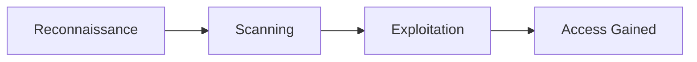

* **Improve Security**
  * Provides recommendations to fix vulnerabilities
  * Helps in:
    * patch management
    * system hardening
    * policy improvements

***

### 🔐 Key Points (Exam Ready)

* Penetration testing = **authorized simulated attack**
* Focuses on:
  * identifying vulnerabilities
  * testing defenses
  * improving security
* Combines:
  * automated tools
  * manual techniques

***

## 2. Steps for Network Penetration Testing

### 2.1 Planning and Preparation

#### 2.1.1 Define Objectives

* Clearly define the **goals of the penetration test**.
* Objectives may include:
  * identifying vulnerabilities
  * testing security controls
  * evaluating incident response
* Helps determine:
  * scope of testing
  * systems to be tested
  * depth of analysis

***

#### 2.1.2 Gather Information

* Collect basic information about the target:
  * network architecture
  * IP ranges
  * domain details
* Sources:
  * public records
  * organizational data
  * technical documentation
* Helps in building a **testing strategy**.

***

#### 2.1.3 Obtain Permissions

* Ensure **legal authorization** before testing.
* Define:
  * scope of engagement
  * allowed techniques
  * time duration
* Important to avoid:
  * legal issues
  * unintended system damage

***

### 2.2 Reconnaissance

#### 2.2.1 Passive Reconnaissance

* Collect information **without directly interacting** with the target.
* Methods:
  * searching public databases
  * social media analysis
  * DNS records lookup
* No risk of detection.

***

#### 2.2.2 Active Reconnaissance

* Directly interacts with the target system.
* Methods:
  * network scanning
  * port scanning
  * service detection
* Higher accuracy but may be detected.

***

#### 2.2.3 Tools Used (WHOIS, Netcraft, Shodan, NSLOOKUP, Wappalyzer)

* **WHOIS**
  * provides domain registration details
* **Netcraft**
  * identifies hosting and technologies
* **Shodan**
  * search engine for internet-connected devices
* **NSLOOKUP**
  * retrieves DNS information
* **Wappalyzer**
  * detects technologies used by websites

***

### 2.3 Vulnerability Analysis

#### 2.3.1 Automated Scanning

* Uses tools to detect vulnerabilities:
  * Nessus
  * OpenVAS
* Identifies:
  * known vulnerabilities
  * misconfigurations
* Fast and efficient.

***

#### 2.3.2 Manual Analysis

* Security expert analyzes results manually.
* Helps:
  * verify findings
  * reduce false positives
  * discover complex vulnerabilities

***

### 2.4 Exploitation

#### 2.4.1 Exploiting Vulnerabilities

* Attempt to **exploit identified weaknesses**.
* Examples:
  * SQL injection
  * buffer overflow
  * password attacks
* Goal:
  * gain unauthorized access

***

#### 2.4.2 Privilege Escalation

* After gaining access, attacker tries to:
  * increase access level
  * gain administrative control
* Techniques:
  * exploiting system flaws
  * misconfigured permissions

***

### 2.5 Post-Exploitation

#### 2.5.1 Maintaining Access

* Attacker ensures continued access to system.
* Methods:
  * backdoors
  * persistence mechanisms
* Used to:
  * monitor system
  * perform further actions

***

#### 2.5.2 Pivoting Across Network

* Moving from one compromised system to others.
* Helps:
  * expand attack scope
  * access internal systems

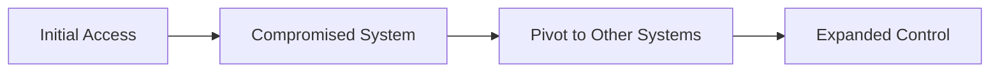

***

### 2.6 Documentation and Reporting

#### 2.6.1 Recording Findings

* Document all discovered vulnerabilities.
* Includes:
  * vulnerability details
  * affected systems
  * severity levels

***

#### 2.6.2 Preparing Reports

* Create structured reports for stakeholders.
* Includes:
  * executive summary
  * technical details
  * recommendations

***

### 2.7 Follow-Up

#### 2.7.1 Fix Verification

* After fixes are applied:
  * re-test systems
  * verify vulnerabilities are resolved

***

#### 2.7.2 Security Improvements

* Implement long-term improvements:
  * patch management
  * policy updates
  * employee training

***

### 🔄 Overall Penetration Testing Process


***

### 🔐 Key Points (Exam Ready)

* Penetration testing is a **structured process**
* Key phases:
  * planning
  * recon
  * analysis
  * exploitation
  * reporting
* Final step (follow-up) ensures:
  * vulnerabilities are fixed
  * security is improved

***

## 3. Reconnaissance Tools and Techniques

### 3.1 WHOIS

#### 3.1.1 Definition

WHOIS is a protocol and tool used to **retrieve information about domain names and IP addresses**.

* Provides publicly available registration details.
* Used in reconnaissance to gather **initial target information**.

***

#### 3.1.2 Role of ICANN

* ICANN manages domain name registrations globally.
* Responsible for:
  * allocating domain names
  * maintaining WHOIS databases
* Ensures:
  * uniqueness of domain names
  * proper record keeping

***

#### 3.1.3 Domain Information Gathering

* WHOIS provides:
  * domain owner details
  * registration date
  * expiry date
  * registrar information
  * contact details
* Useful for:
  * identifying target organization
  * gathering attack surface information

***

### 3.2 NSLOOKUP

#### 3.2.1 Definition

NSLOOKUP is a command-line tool used to **query DNS servers** and obtain domain-related information.

* Available in most operating systems.
* Used for DNS troubleshooting and reconnaissance.

***

#### 3.2.2 DNS Query Function

* Queries DNS servers to retrieve:
  * IP addresses
  * mail servers (MX records)
  * name servers (NS records)
* Helps understand DNS structure of a target.

***

#### 3.2.3 Mapping Domain to IP

* Converts domain names into IP addresses.

Example:

```bash
nslookup example.com
```

* Output shows:
  * resolved IP address
  * DNS server used

***

### 3.3 Wappalyzer

#### 3.3.1 Definition

Wappalyzer is a tool used to **identify technologies used by websites**.

* Available as:
  * browser extension
  * web tool

***

#### 3.3.2 Technology Detection

* Detects:
  * web servers (Apache, Nginx)
  * frameworks (React, Angular)
  * CMS (WordPress, Joomla)
  * analytics tools
* Helps identify **technology stack** of target.

***

#### 3.3.3 Use in Reconnaissance

* Allows attacker to:
  * identify vulnerabilities in specific technologies
  * choose targeted exploits
* Example:
  * detecting outdated CMS → known vulnerabilities

***

### 3.4 Nmap / Zenmap

#### 3.4.1 Definition

Nmap is a powerful tool used for **network discovery and security auditing**.\
Zenmap is the GUI version of Nmap.

***

#### 3.4.2 Host Discovery

* Identifies active devices on the network.

Example:

```bash
nmap -sn 192.168.1.0/24
```

* Shows which hosts are **online**.

***

#### 3.4.3 Service Detection

* Detects open ports and running services.

Example:

```bash
nmap -sV target_ip
```

* Provides:
  * service name
  * version information

***

#### 3.4.4 OS Fingerprinting

* Identifies operating system of target.

Example:

```bash
nmap -O target_ip
```

* Helps attackers tailor exploits.

***

### 3.5 Angry IP Scanner

#### 3.5.1 Definition

Angry IP Scanner is a fast and lightweight tool used to **scan IP addresses and ports**.

* Open-source and cross-platform.

***

#### 3.5.2 IP and Port Scanning

* Scans:
  * IP ranges
  * open ports
* Provides:
  * active hosts
  * hostname
  * MAC address

***

#### 3.5.3 Use Cases

* Network administrators:
  * monitor network devices
* Security analysts:
  * identify open ports
  * detect vulnerabilities

***

### 🔄 Reconnaissance Workflow

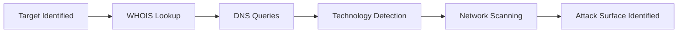

***

### 🔐 Key Points (Exam Ready)

* Reconnaissance = **information gathering phase**
* Tools used:
  * WHOIS → domain info
  * NSLOOKUP → DNS data
  * Wappalyzer → technology stack
  * Nmap → network scanning
  * Angry IP Scanner → IP/port scanning
* Helps in:
  * identifying targets
  * planning attacks
  * discovering vulnerabilities

***

## 4. Banner Grabbing and OS Detection

### 4.1 Banner Grabbing

#### 4.1.1 Definition

Banner grabbing is a technique used to **collect information about a system or service** by analyzing the banner (response message) returned by a server.

* A banner may include:
  * software name
  * version number
  * operating system details
* Helps identify what is running on a target system.

***

#### 4.1.2 Purpose

* To gather **service and system information**.
* Helps attackers or testers:
  * identify software versions
  * detect outdated or vulnerable services
* Used for:
  * vulnerability assessment
  * penetration testing

***

#### 4.1.3 Tools (Telnet, Nmap, Netcat)

* **Telnet**
  * Connects to a remote service and displays banner.

```bash
telnet example.com 80
```

***

* **Nmap**
  * Performs banner grabbing using service detection.

```bash
nmap -sV target_ip
```

***

* **Netcat (nc)**
  * Reads banner information from services.

```bash
nc target_ip 80
```

***

### 4.2 Open Port and Service Identification

#### 4.2.1 Importance of Open Ports

* Open ports indicate **active services** running on a system.
* Examples:
  * Port 80 → HTTP
  * Port 443 → HTTPS
  * Port 22 → SSH
* Helps identify:
  * available services
  * potential vulnerabilities

***

#### 4.2.2 Entry Points for Attack

* Open ports act as **entry points** into a system.
* If a service is:
  * outdated
  * misconfigured

→ it can be exploited.

* Example:
  * open FTP port with weak credentials

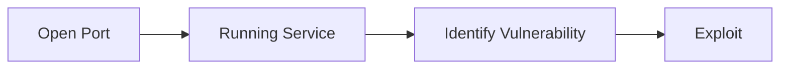

***

### 4.3 OS Detection

#### 4.3.1 Identifying Operating System

* OS detection identifies the **operating system of the target machine**.
* Methods:
  * analyzing network responses
  * examining TCP/IP stack behavior
* Tools:
  * Nmap (`-O` option)

```bash
nmap -O target_ip
```

* Output may include:
  * OS type (Linux, Windows)
  * version details

***

#### 4.3.2 Targeted Exploitation

* Knowing the OS allows attackers to:
  * select appropriate exploits
  * target specific vulnerabilities
* Example:
  * Windows system → exploit SMB vulnerability
  * Linux system → exploit SSH misconfiguration

***

### 🔄 Combined Workflow

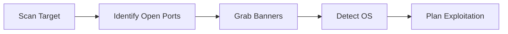

***

### 🔐 Key Points (Exam Ready)

* Banner grabbing reveals:
  * service name
  * version
* Open ports indicate:
  * running services
  * possible vulnerabilities
* OS detection helps:
  * tailor attacks
  * improve testing accuracy

***

### 🔐 Prevention Measures

* Disable unnecessary services
* Close unused ports
* Use firewalls
* Hide or modify banners
* Regularly update software

***

## 5. Vulnerability Analysis

### 5.1 Overview of Vulnerability

#### 5.1.1 Definition

A vulnerability is a **weakness or flaw in a system, network, or application** that can be exploited by an attacker to gain unauthorized access or cause damage.

* Exists due to:
  * software bugs
  * misconfigurations
  * poor security practices
* Can lead to:
  * data breaches
  * system compromise
  * service disruption

***

#### 5.1.2 Types of Vulnerabilities

* **Network Vulnerabilities**
  * weak firewall rules
  * open ports
* **System Vulnerabilities**
  * outdated operating systems
  * unpatched software
* **Application Vulnerabilities**
  * SQL injection
  * cross-site scripting (XSS)
* **Human Vulnerabilities**
  * weak passwords
  * social engineering

***

### 5.2 Classification of Vulnerabilities

#### 5.2.1 Vendor-Originated

* Caused by flaws in **software or hardware provided by vendors**.
* Examples:
  * software bugs
  * unpatched security flaws
* Solution:
  * apply updates and patches

***

#### 5.2.2 System Administration-Originated

* Caused by **misconfiguration or poor management**.
* Examples:
  * weak firewall settings
  * default credentials
  * unnecessary services running
* Solution:
  * proper configuration
  * regular audits

***

#### 5.2.3 User-Originated

* Caused by **user behavior or mistakes**.
* Examples:
  * weak passwords
  * clicking malicious links
  * ignoring security policies
* Solution:
  * user awareness and training

***

### 5.3 Vulnerability Scanners

#### 5.3.1 Role of Scanners

Vulnerability scanners are tools used to **identify security weaknesses automatically**.

* They:
  * scan systems and networks
  * detect known vulnerabilities
  * generate reports
* Examples:
  * Nessus
  * OpenVAS

***

#### 5.3.2 Automated Security Auditing

* Scanners perform automated checks for:
  * missing patches
  * insecure configurations
  * outdated software
* Benefits:
  * fast and efficient
  * reduces manual effort
  * improves accuracy
* Limitation:
  * may produce false positives/negatives

***

### 5.4 Types of Vulnerability Scanners

#### 5.4.1 Network Vulnerability Scanners

* Scan entire networks to identify:
  * open ports
  * exposed services
* Example:
  * Nessus

***

#### 5.4.2 Web Application Scanners

* Detect vulnerabilities in web apps.
* Examples:
  * SQL injection
  * XSS
  * authentication flaws

***

#### 5.4.3 Host-Based Scanners

* Installed on individual systems.
* Scan:
  * OS vulnerabilities
  * installed software

***

#### 5.4.4 Database Scanners

* Focus on database systems.
* Detect:
  * weak configurations
  * unauthorized access

***

#### 5.4.5 Mobile Application Scanners

* Analyze mobile apps for:
  * insecure data storage
  * weak authentication

***

#### 5.4.6 Cloud-Based Scanners

* Scan cloud infrastructure.
* Identify:
  * misconfigured cloud services
  * exposed storage

***

#### 5.4.7 Passive Scanners

* Monitor network traffic without active scanning.
* Do not interact directly with systems.
* Useful for:
  * continuous monitoring
  * low-risk environments

***

### 🔄 Vulnerability Analysis Workflow

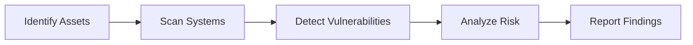

***

### 🔐 Key Points (Exam Ready)

* Vulnerability = **security weakness**
* Types:
  * network, system, application, human
* Classification:
  * vendor, admin, user
* Scanners:
  * automate detection
  * improve efficiency
* Important to combine:
  * automated tools + manual analysis

***

### 🔐 Best Practices

* Regular vulnerability scanning
* Timely patch updates
* Secure configurations
* User awareness training
* Continuous monitoring

***

## 6. False Positive and False Negative

### 6.1 False Negative

#### 6.1.1 Definition

A False Negative occurs when a **vulnerability actually exists**, but the scanning tool or analysis **fails to detect it**.

* The system is **incorrectly marked as secure**.
* The vulnerability remains hidden and unaddressed.

***

#### 6.1.2 Security Risks

* Highly dangerous because:
  * real threats go unnoticed
  * attackers can exploit undetected vulnerabilities
* Leads to:
  * false sense of security
  * increased risk of breaches
* Example:
  * a vulnerable service is running, but scanner does not report it

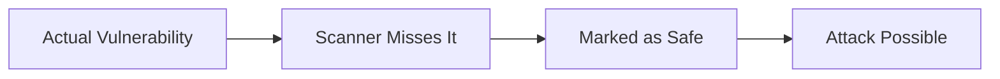

***

### 6.2 False Positive

#### 6.2.1 Definition

A False Positive occurs when a **scanner reports a vulnerability that does not actually exist**.

* The system is **incorrectly flagged as vulnerable**.
* Leads to unnecessary investigation.

***

#### 6.2.2 Impact on Analysis

* Causes:
  * wasted time and resources
  * unnecessary fixes or patches
* May lead to:
  * confusion in reports
  * reduced trust in scanning tools
* Example:
  * scanner flags a secure system as vulnerable

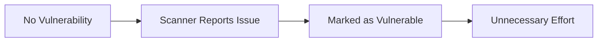

***

### 🔄 Comparison (Important)

| Aspect     | False Negative             | False Positive                   |
| ---------- | -------------------------- | -------------------------------- |
| Meaning    | Missed vulnerability       | Incorrect vulnerability reported |
| Risk Level | High (dangerous)           | Low (inconvenience)              |
| Impact     | Security breach possible   | Wasted effort                    |
| Example    | Vulnerability not detected | Non-existent issue flagged       |

***

### 🔐 Key Points (Exam Ready)

* **False Negative = dangerous**
  * real vulnerability missed
* **False Positive = misleading**
  * fake vulnerability reported
* Best approach:
  * combine automated tools with manual verification
  * validate scan results carefully

***

## 7. Exploitation Phase

### 7.1 Exploitation Techniques

#### 7.1.1 Password Cracking

Password cracking is the process of **recovering or guessing passwords** to gain unauthorized access.

* Common methods:
  * **Brute Force Attack**
    * tries all possible combinations
  * **Dictionary Attack**
    * uses a list of common passwords
  * **Credential Stuffing**
    * uses leaked credentials
* Targets:
  * user accounts
  * admin panels
  * network services
* Risks:
  * unauthorized access
  * data theft

***

#### 7.1.2 SQL Injection

SQL Injection is an attack where malicious SQL queries are **inserted into input fields** to manipulate a database.

* Occurs when:
  * input validation is weak
* Attacker can:
  * bypass authentication
  * retrieve sensitive data
  * modify or delete records

Example:

```sql
' OR '1'='1
```

* This can trick a login system into granting access.

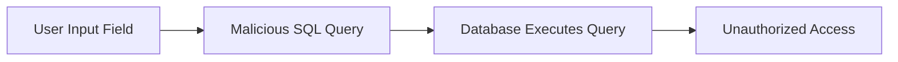

***

#### 7.1.3 Buffer Overflow

Buffer overflow occurs when a program writes **more data into a buffer than it can hold**.

* Causes:
  * improper memory handling
* Results:
  * overwriting adjacent memory
  * execution of malicious code
* Can lead to:
  * system crashes
  * remote code execution

***

### 7.2 Privilege Escalation

#### 7.2.1 Gaining Higher Access

Privilege escalation is the process of **increasing access rights** after initial compromise.

* Types:
  * **Vertical escalation**
    * user → admin
  * **Horizontal escalation**
    * one user → another user
* Techniques:
  * exploiting system vulnerabilities
  * abusing misconfigured permissions

***

#### 7.2.2 System Control

* After escalation, attacker can:
  * gain full control of system
  * access sensitive data
  * modify system settings
* Possible actions:
  * install malware
  * create backdoors
  * disable security controls

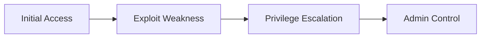

***

### 🔐 Key Points (Exam Ready)

* Exploitation phase = **using vulnerabilities to gain access**
* Common techniques:
  * password cracking
  * SQL injection
  * buffer overflow
* Privilege escalation:
  * increases access level
  * leads to full system control

***

### 🔐 Prevention Measures

* Use strong passwords and MFA
* Validate and sanitize inputs
* Apply secure coding practices
* Regularly update and patch systems
* Implement least privilege principle

***

## 8. Common Network Vulnerabilities

### 8.1 Open Ports and Services

#### 8.1.1 Description

* Open ports indicate **active services** running on a system.
* Unnecessary or exposed services increase attack surface.
* Attackers scan ports to find:
  * vulnerable services
  * outdated software

***

#### 8.1.2 Prevention

* Close unused ports
* Disable unnecessary services
* Use firewalls to restrict access
* Regularly audit open ports

***

### 8.2 Weak Passwords

#### 8.2.1 Description

* Weak passwords are:
  * short
  * predictable
  * reused across systems
* Easily cracked using:
  * brute force
  * dictionary attacks

***

#### 8.2.2 Prevention

* Use strong passwords (length + complexity)
* Enable multi-factor authentication (MFA)
* Enforce password policies
* Avoid password reuse

***

### 8.3 Misconfigured Firewalls

#### 8.3.1 Description

* Improper firewall settings may:
  * allow unauthorized traffic
  * expose internal systems
* Examples:
  * open all ports
  * weak rule configurations

***

#### 8.3.2 Prevention

* Define strict firewall rules
* Allow only necessary traffic
* Regularly review configurations
* Use intrusion detection/prevention systems

***

### 8.4 Outdated Software

#### 8.4.1 Description

* Old software contains **known vulnerabilities**.
* Attackers exploit unpatched systems.

***

#### 8.4.2 Prevention

* Regularly update software
* Apply security patches
* Use automated patch management

***

### 8.5 Insecure Wireless Networks

#### 8.5.1 Description

* Weak Wi-Fi security:
  * no encryption
  * weak passwords
* Allows unauthorized access.

***

#### 8.5.2 Prevention

* Use WPA3/WPA2 encryption
* Disable WPS
* Use strong passwords
* Monitor connected devices

***

### 8.6 Network Sniffing Vulnerability

#### 8.6.1 Description

* Data transmitted in **unencrypted form** can be intercepted.
* Attackers use sniffing tools to capture sensitive data.

***

#### 8.6.2 Prevention

* Use encryption (HTTPS, SSL/TLS)
* Use VPN
* Avoid unsecured networks

***

### 8.7 Man-in-the-Middle Attacks

#### 8.7.1 Description

* Attacker intercepts communication between two parties.
* Can:
  * read data
  * modify data

***

#### 8.7.2 Prevention

* Use encrypted communication (HTTPS)
* Implement secure authentication
* Use VPN

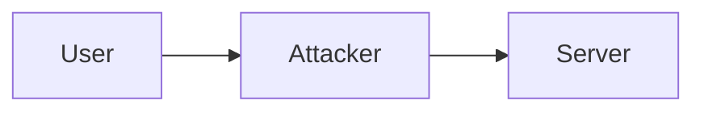

***

### 8.8 Denial-of-Service (DoS) Vulnerabilities

#### 8.8.1 Description

* Systems can be overwhelmed with excessive traffic.
* Causes service unavailability.

***

#### 8.8.2 Prevention

* Use rate limiting
* Deploy load balancers
* Use DDoS protection services

***

### 8.9 Protocol Vulnerabilities

#### 8.9.1 Description

* Weaknesses in network protocols (e.g., HTTP, FTP).
* Examples:
  * lack of encryption
  * insecure authentication

***

#### 8.9.2 Prevention

* Use secure protocols (HTTPS, SFTP)
* Disable insecure protocols
* Update protocol configurations

***

### 8.10 Web Application Vulnerabilities

#### 8.10.1 Description

* Flaws in web applications:
  * SQL injection
  * XSS
  * authentication bypass

***

#### 8.10.2 Prevention

* Validate user input
* Use secure coding practices
* Perform regular testing

***

### 8.11 Physical Security Weaknesses

#### 8.11.1 Description

* Lack of physical protection of devices.
* Examples:
  * unlocked server rooms
  * unauthorized physical access

***

#### 8.11.2 Prevention

* Restrict physical access
* Use locks and surveillance
* Implement access control systems

***

### 8.12 Social Engineering

#### 8.12.1 Description

* Manipulating users to reveal sensitive information.
* Examples:
  * phishing
  * impersonation

***

#### 8.12.2 Prevention

* User awareness training
* Verify identities
* Avoid sharing sensitive data

***

### 8.13 Insufficient Logging and Monitoring

#### 8.13.1 Description

* Lack of proper logs prevents detection of attacks.
* Security incidents go unnoticed.

***

#### 8.13.2 Prevention

* Enable logging
* Monitor network activity
* Use SIEM tools

***

### 8.14 Default Configurations

#### 8.14.1 Description

* Systems left with default settings:
  * default passwords
  * default ports
* Easily exploited.

***

#### 8.14.2 Prevention

* Change default credentials
* Customize configurations
* Harden systems

***

### 8.15 Insecure Network Architecture

#### 8.15.1 Description

* Poor network design:
  * no segmentation
  * flat network structure
* Increases attack impact.

***

#### 8.15.2 Prevention

* Use network segmentation
* Implement firewalls and VLANs
* Design secure architecture

***

### 8.16 VPN Vulnerabilities

#### 8.16.1 Description

* Weak VPN configurations:
  * weak encryption
  * outdated protocols
* Can expose remote access.

***

#### 8.16.2 Prevention

* Use strong encryption
* Update VPN software
* Enable multi-factor authentication

***

### 8.17 IoT Device Vulnerabilities

#### 8.17.1 Description

* IoT devices often lack strong security.
* Issues:
  * default credentials
  * outdated firmware

***

#### 8.17.2 Prevention

* Change default settings
* Update firmware regularly
* Isolate IoT devices on separate network

***

### 🔐 Key Points (Exam Ready)

* Vulnerabilities exist in:
  * network
  * systems
  * users
* Common causes:
  * weak passwords
  * misconfigurations
  * outdated systems
* Prevention requires:
  * regular updates
  * monitoring
  * strong security practices

***

## 9. Zero-Day Vulnerability

### 9.1 Definition

#### 9.1.1 Unknown Vulnerability

A zero-day vulnerability is a **previously unknown security flaw** in software, hardware, or systems that is **not yet discovered or patched by the vendor**.

* “Zero-day” means:
  * developers have **0 days to fix it**
* It is unknown to:
  * software developers
  * security teams
* But may already be known to attackers.

***

#### 9.1.2 Zero-Day Attack Concept

* A zero-day attack occurs when attackers **exploit the vulnerability before a fix is available**.
* Key characteristics:
  * no existing patch
  * no signature for detection
  * highly difficult to defend

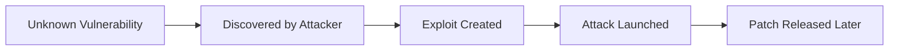

***

### 9.2 Risks

#### 9.2.1 Exploitation Before Patch

* Systems remain vulnerable because:
  * no fix is available
  * users are unaware of the threat
* Attackers can:
  * gain unauthorized access
  * steal sensitive data
  * compromise systems

***

#### 9.2.2 High Severity

* Zero-day vulnerabilities are **extremely dangerous**.
* Reasons:
  * no immediate defense
  * high success rate for attackers
  * can affect large number of systems
* Impact includes:
  * data breaches
  * system compromise
  * widespread attacks

***

### 🔐 Additional Points (Full Coverage)

* Often targeted in:
  * operating systems
  * web browsers
  * enterprise software
* Used in:
  * advanced persistent threats (APTs)
  * targeted cyber attacks
* Lifecycle:
  * vulnerability exists
  * attacker discovers
  * exploit used
  * vendor releases patch

***

### 🔐 Prevention / Mitigation

* Apply updates and patches as soon as available
* Use **intrusion detection/prevention systems (IDS/IPS)**
* Implement **behavior-based detection**
* Use **least privilege principle**
* Regularly monitor systems

***

### 🔐 Key Points (Exam Ready)

* Zero-day = **unknown vulnerability**
* Zero-day attack = **exploit before patch**
* High risk due to:
  * no defense
  * no detection signatures
* Requires:
  * proactive security
  * monitoring
  * rapid patching

***

## 10. Network Diagram in Penetration Testing

### 10.1 Definition

#### 10.1.1 Visual Representation of Network

A network diagram is a **graphical representation of a network structure**, showing how different devices and systems are connected.

* Displays:
  * network layout
  * communication paths
  * connections between devices
* Used in penetration testing to:
  * understand the target environment
  * plan attack strategies

***

#### 10.1.2 Components (routers, servers, firewalls)

A network diagram typically includes:

* **Routers**
  * connect different networks
  * route traffic between them
* **Servers**
  * provide services (web, database, file servers)
  * store and process data
* **Firewalls**
  * control traffic flow
  * protect internal network
* **Switches**
  * connect devices within a network
* **Clients**
  * user devices (PCs, laptops, mobiles)
* **Internet / External Network**
  * represents external connectivity

***

### 10.2 Importance

#### 10.2.1 Understanding Network Architecture

* Helps security professionals:
  * visualize network structure
  * understand how systems interact
* Provides insight into:
  * data flow
  * network segmentation
  * security layers
* Useful for:
  * planning penetration tests
  * identifying critical systems

***

#### 10.2.2 Identifying Weak Points

* Helps locate:
  * exposed systems
  * misconfigured devices
  * insecure connections
* Enables identification of:
  * entry points for attackers
  * potential attack paths

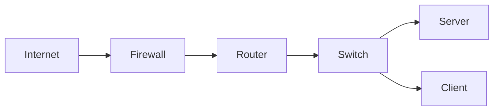

***

### 🔄 Role in Penetration Testing Workflow

* Used during:
  * reconnaissance
  * planning
  * vulnerability analysis
* Helps in:
  * mapping attack surface
  * prioritizing targets

***

### 🔐 Key Points (Exam Ready)

* Network diagram = **visual map of network**
* Includes:
  * routers, servers, firewalls, clients
* Important for:
  * understanding structure
  * identifying vulnerabilities
* Used to:
  * plan attacks
  * analyze risks

***

## 11. Burp Suite Proxy

### 11.1 Introduction

#### 11.1.1 Definition

Burp Suite is a widely used tool for **web application security testing** that acts as an **intercepting proxy** between a user’s browser and the web server.

* It captures and analyzes HTTP/HTTPS traffic.
* Allows testers to:
  * inspect requests and responses
  * modify data in transit

***

#### 11.1.2 Role in Web Security Testing

* Acts as a **middle layer** between client and server.
* Helps in:
  * identifying vulnerabilities
  * testing application behavior
  * analyzing communication
* Common use cases:
  * detecting input validation flaws
  * testing authentication mechanisms
  * finding web vulnerabilities (SQLi, XSS)

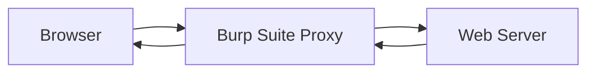

***

### 11.2 Features

#### 11.2.1 Interception and Modification

* Intercepts HTTP/HTTPS requests and responses.
* Allows:
  * viewing raw data
  * modifying parameters before sending
* Useful for:
  * testing input validation
  * bypassing restrictions

***

#### 11.2.2 Request and Response Tampering

* Modify:
  * form inputs
  * headers
  * cookies
* Helps identify:
  * security flaws
  * improper validation
* Example:
  * changing user role in request

***

#### 11.2.3 Decoder Tool

* Encodes and decodes data.
* Supports formats like:
  * Base64
  * URL encoding
* Useful for:
  * analyzing encoded payloads
  * understanding hidden data

***

#### 11.2.4 Extensions Tool

* Allows adding plugins to extend functionality.
* Provides:
  * additional scanning tools
  * automation capabilities
* Supports integration with:
  * third-party tools

***

#### 11.2.5 Repeater Tool

* Allows sending the same request multiple times.
* Used for:
  * testing different inputs
  * analyzing responses
* Helps in:
  * manual testing
  * vulnerability verification

***

#### 11.2.6 Intruder Tool

* Automates attacks by sending multiple payloads.
* Used for:
  * brute force attacks
  * fuzzing inputs
  * testing parameters
* Supports:
  * different attack types (sniper, cluster bomb)

***

### 🔄 Burp Suite Workflow

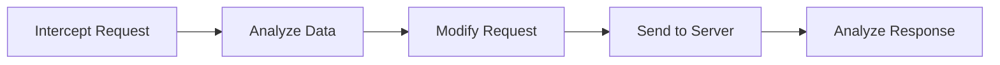

***

### 🔐 Key Points (Exam Ready)

* Burp Suite = **intercepting proxy tool**
* Used for:
  * web security testing
  * vulnerability analysis
* Key features:
  * interception
  * tampering
  * repeater
  * intruder
* Helps detect:
  * SQL injection
  * XSS
  * authentication flaws

***

### 🔐 Best Practices

* Use in authorized environments only
* Combine with manual testing
* Validate findings carefully
* Keep tool updated

***

## 12. OWASP ZAP Proxy

### 12.1 Introduction

#### 12.1.1 Definition

OWASP ZAP is an **open-source web application security testing tool** used to find vulnerabilities in web applications.

* Works as an **intercepting proxy** between browser and server
* Helps in:
  * scanning web applications
  * detecting security issues
  * analyzing HTTP/HTTPS traffic

***

#### 12.1.2 OWASP Organization

OWASP is a global organization focused on improving software security.

* Provides:
  * free security tools (like ZAP)
  * security guidelines
  * best practices
* Known for:
  * OWASP Top 10 (common web vulnerabilities)

***

### 12.2 Features

#### 12.2.1 Automated Scanning

* Automatically scans web applications for vulnerabilities.
* Detects:
  * SQL injection
  * cross-site scripting (XSS)
  * security misconfigurations
* Useful for:
  * quick security assessments
  * beginners

***

#### 12.2.2 Manual Testing

* Allows testers to manually inspect and manipulate requests.
* Helps in:
  * deeper analysis
  * finding complex vulnerabilities
* Provides better control than automated scanning.

***

#### 12.2.3 Active Scanning

* Actively sends malicious payloads to test vulnerabilities.
* Interacts directly with the application.
* Can identify:
  * exploitable weaknesses
* More thorough but:
  * may affect application performance

***

#### 12.2.4 Passive Scanning

* Observes traffic without modifying it.
* Detects:
  * security issues without sending attacks
* Safe and non-intrusive.

***

#### 12.2.5 Open Source Nature

* Free and open-source tool.
* Benefits:
  * customizable
  * community-supported
  * regularly updated

***

### 🔄 OWASP ZAP Workflow

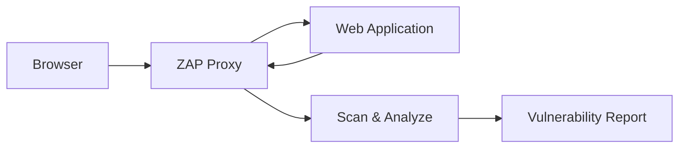

***

### 🔐 Key Points (Exam Ready)

* OWASP ZAP = **open-source security testing tool**
* Developed by:
  * OWASP organization
* Features:
  * automated scanning
  * manual testing
  * active + passive scanning
* Used for:
  * detecting web vulnerabilities
  * improving application security

***

### 🔐 Best Practices

* Use both:
  * automated + manual testing
* Validate scan results
* Regularly update tool
* Use in authorized environments only

***

## 13. Post-Exploitation

### 13.1 Maintaining Access

#### 13.1.1 Persistence Techniques

* Maintaining access means ensuring **continued control over a compromised system** even after initial exploitation.
* Attackers (or testers in controlled environments) use persistence techniques to:
  * avoid losing access
  * monitor system activity
  * perform further actions later
* Common persistence techniques:
  * **Backdoors**
    * hidden access mechanisms
  * **Creating new user accounts**
    * especially with admin privileges
  * **Modifying startup scripts/services**
    * ensures access after reboot
  * **Scheduled tasks**
    * automatically execute malicious scripts
  * **Registry modifications (Windows)**
    * maintain persistence
* Risks:
  * long-term unauthorized access
  * continuous data theft
  * system compromise

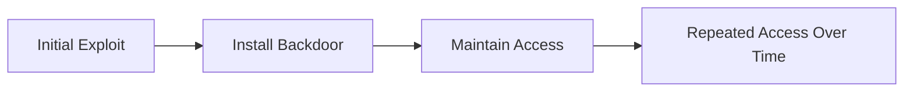

***

### 13.2 Pivoting

#### 13.2.1 Expanding Attack Scope

* Pivoting is the process of using a **compromised system as a stepping stone** to attack other systems in the network.
* Purpose:
  * expand reach inside network
  * access internal systems not directly exposed
* Example:
  * attacker compromises one machine → uses it to scan internal network

***

#### 13.2.2 Lateral Movement

* Lateral movement refers to **moving from one system to another within the same network**.
* Techniques:
  * credential reuse
  * exploiting trust relationships
  * using shared resources
* Goal:
  * gain access to:
    * sensitive systems
    * databases
    * servers

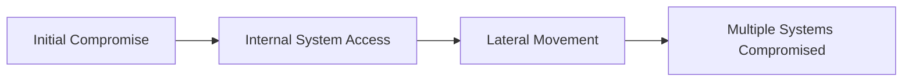

***

### 🔐 Key Points (Exam Ready)

* Post-exploitation occurs **after initial access**
* Two main activities:
  * maintaining access (persistence)
  * pivoting (expanding attack scope)
* Lateral movement allows:
  * deeper network compromise
* Critical phase for:
  * assessing impact
  * understanding real-world attack scenarios

***

### 🔐 Prevention Measures

* Monitor system activity continuously
* Use strong access controls
* Implement network segmentation
* Use multi-factor authentication
* Regularly audit user accounts and permissions

***

## 14. Documentation and Reporting (Detailed)

### 14.1 Vulnerability Details

#### 14.1.1 Vulnerability Identifier

* A unique identifier assigned to each vulnerability.
* Examples:
  * internal ID (e.g., VULN-001)
  * external IDs (e.g., CVE numbers)
* Helps in:
  * tracking vulnerabilities
  * referencing issues in reports

***

#### 14.1.2 Description

* Provides a clear explanation of the vulnerability.
* Includes:
  * what the vulnerability is
  * how it occurs
  * why it is a problem
* Should be:
  * simple for management
  * detailed for technical teams

***

#### 14.1.3 Location / Affected Component

* Specifies where the vulnerability exists.
* Examples:
  * specific server
  * application module
  * API endpoint
  * network device
* Helps in:
  * identifying affected assets
  * targeting fixes

***

#### 14.1.4 Risk Level

* Indicates severity of vulnerability.
* Common levels:
  * Critical
  * High
  * Medium
  * Low
* Based on:
  * exploitability
  * potential impact

***

### 14.2 Technical Details

#### 14.2.1 CVE ID

* CVE (Common Vulnerabilities and Exposures) is a **standard identifier** for known vulnerabilities.
* Format:
  * CVE-YYYY-XXXX
* Helps in:
  * referencing known issues
  * accessing vulnerability databases

***

#### 14.2.2 Attack Vector

* Describes how the vulnerability can be exploited.
* Examples:
  * network-based
  * local access
  * web-based input
* Helps understand:
  * attack path
  * required conditions

***

#### 14.2.3 Impact

* Describes consequences of exploitation.
* Examples:
  * data leakage
  * system compromise
  * privilege escalation
* Helps prioritize fixes.

***

### 14.3 Evidence and Proof

#### 14.3.1 Evidence Collection

* Collect proof of vulnerability existence.
* Includes:
  * logs
  * screenshots
  * captured packets
  * tool outputs
* Ensures:
  * credibility of findings
  * reproducibility

***

#### 14.3.2 Proof-of-Concept

* Demonstrates how the vulnerability can be exploited.
* May include:
  * sample payloads
  * step-by-step exploitation
* Shows:
  * real impact
  * severity of issue

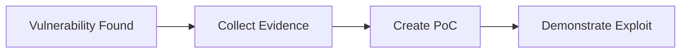

***

### 14.4 Remediation Details

#### 14.4.1 Recommendations

* Suggested actions to fix the vulnerability.
* Examples:
  * apply patches
  * update configurations
  * improve input validation

***

#### 14.4.2 Affected Versions

* Lists versions of software impacted.
* Helps:
  * identify vulnerable systems
  * prioritize updates

***

#### 14.4.3 Mitigation Techniques

* Temporary or permanent solutions.
* Examples:
  * firewall rules
  * disabling vulnerable features
  * applying security controls

***

#### 14.4.4 Dependencies

* Identifies related components affecting vulnerability.
* Examples:
  * libraries
  * third-party software
* Important for:
  * complete resolution
  * avoiding partial fixes

***

### 14.5 Compliance and Risk

#### 14.5.1 Regulatory Compliance

* Checks if vulnerability affects compliance with standards:
* Examples:
  * PCI DSS
  * HIPAA
  * ISO standards
* Helps organizations:
  * meet legal requirements
  * avoid penalties

***

#### 14.5.2 Ease of Exploitation

* Indicates how easily the vulnerability can be exploited.
* Factors:
  * required skill level
  * availability of tools
  * access requirements
* Categories:
  * Easy
  * Moderate
  * Difficult

***

### 🔄 Reporting Workflow

```mermaid
flowchart LR
A[Identify Vulnerability] --> B[Document Details]
B --> C[Collect Evidence]
C --> D[Analyze Risk]
D --> E[Provide Remediation]
E --> F[Final Report]
```

***

### 🔐 Key Points (Exam Ready)

* Documentation is critical in penetration testing
* Report must include:
  * vulnerability details
  * technical data
  * evidence
  * remediation
* Good report =
  * clear
  * structured
  * actionable

***

<h2 align="center"><a data-footnote-ref href="#user-content-fn-1">END</a></h2>

[^1]: This page ends here.
