# Unit - 3

:::info[TITLE]
## Inter-Process Communication
:::

---

---

## 1. Inter-Process Communication (IPC)

Inter-Process Communication (IPC) is a fundamental concept in Operating Systems that enables multiple processes to communicate and coordinate their actions.

Modern operating systems allow multiple processes to execute concurrently. When these processes need to share data or synchronize activities, IPC mechanisms are required.

---

### 1.1 Introduction to IPC

When multiple processes execute simultaneously, they may:

- Compete for shared resources
- Share data
- Cooperate to complete a task
- Run independently without interaction

IPC provides structured mechanisms to enable communication and synchronization between processes.

Two broad models of IPC:

- **Shared Memory Model**
- **Message Passing Model**

(These will be covered in detail in later sections.)

---

#### 1.1.1 Definition of IPC

Inter-Process Communication (IPC) is:

> A mechanism that allows processes to communicate with each other and synchronize their actions while executing concurrently in an operating system.
> 

IPC ensures:

- Data consistency
- Proper synchronization
- Controlled resource sharing

Without IPC, processes running concurrently could corrupt shared data or interfere with each other.

---

#### 1.1.2 Concurrent Processes

Concurrent processes are processes that:

- Execute simultaneously (on multi-core systems), or
- Appear to execute simultaneously (via context switching)

Concurrency does not necessarily mean true parallelism. It means overlapping execution in time.

Example:

- Process P1 is editing a file
- Process P2 is printing a document
- Process P3 is downloading data

On a single CPU:

- OS switches rapidly between processes
- Each gets CPU time slice
- Execution appears simultaneous

Concurrency model:

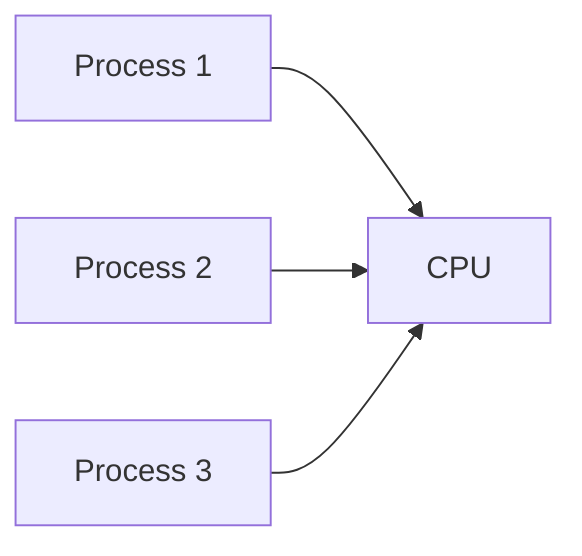

Concurrent processes may:

- Be independent
- Be cooperating

---

#### 1.1.3 Independent Processes

Independent processes:

- Do not share data
- Do not affect each other
- Execute without interaction

Characteristics:

- No shared variables
- No shared files (or read-only access)
- No synchronization required

Example:

- Calculator app running
- Music player running
- Browser running

These processes operate independently.

Since they do not interact:

- IPC is not required

---

#### 1.1.4 Co-operating Processes

Co-operating processes:

- Share data
- Affect each other
- Work together toward a common goal

Characteristics:

- Shared memory or message exchange
- Synchronization required
- Risk of race conditions

Example:

- Producer process generating data
- Consumer process using that data
- Multiple threads updating shared counter

Cooperating process interaction:

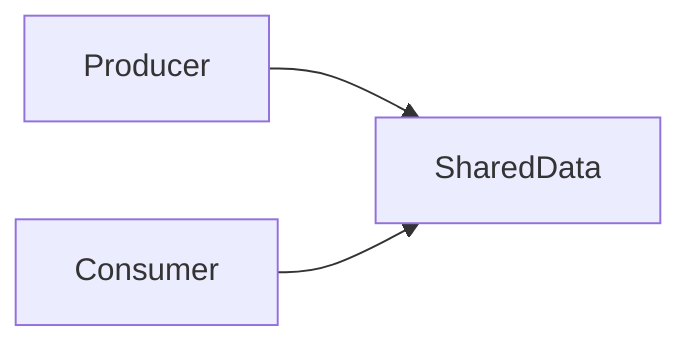

Because shared data exists:

- IPC is mandatory
- Synchronization mechanisms are required

---

### 1.2 Need for IPC

IPC is required because cooperating processes must coordinate properly.

Without IPC:

- Data corruption may occur
- Inconsistent system state may arise
- Unexpected behavior may result

---

#### 1.2.1 Information Sharing

Many applications require sharing data among processes.

Examples:

- Shared database access
- Shared file system
- Shared configuration data

Scenario:

- One process updates a record
- Another process reads it

If not synchronized:

- Reader may read incomplete data
- Inconsistent results may occur

Information sharing requires:

- Shared memory
- Message passing
- Proper synchronization

---

#### 1.2.2 Computation Speedup

Large tasks can be divided into smaller subtasks.

Each subtask:

- Assigned to different process
- Executed concurrently

Example:

- Matrix multiplication divided into parts
- Sorting large dataset using parallel processes

Speedup model:

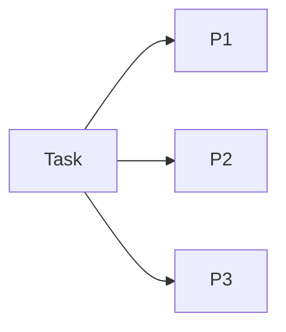

IPC enables:

- Exchange of intermediate results
- Synchronization between subtasks

Without IPC:

- Processes cannot coordinate
- Parallel execution becomes ineffective

---

#### 1.2.3 Modularity

Large systems are divided into modules.

Each module:

- Implemented as separate process
- Communicates with others

Benefits:

- Easier debugging
- Better maintainability
- Independent development

Example:

- Web server
- Database server
- Authentication service

These modules interact through IPC mechanisms.

Modular architecture:

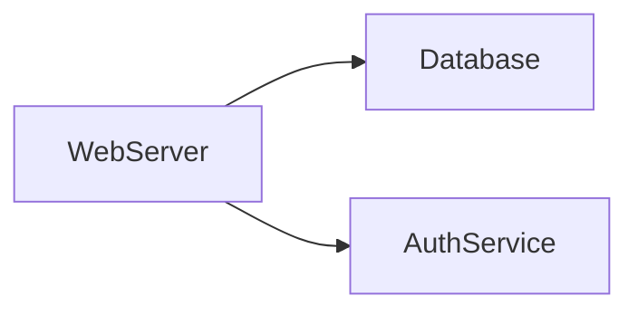

IPC enables clean separation with controlled communication.

---

#### 1.2.4 Convenience

Users may perform multiple tasks simultaneously.

Example:

- Editing a document
- Listening to music
- Downloading files

IPC allows:

- Background processing
- Data synchronization
- Controlled resource sharing

Convenience improves:

- System usability
- Multitasking efficiency
- Responsiveness

---

### Summary

Inter-Process Communication (IPC):

- Enables cooperating processes to communicate
- Prevents data inconsistency
- Supports modular design
- Enables parallel computation
- Improves system performance and usability

Types of Processes:

- Independent → No IPC required
- Co-operating → IPC required

Major Reasons for IPC:

- Information Sharing
- Computation Speedup
- Modularity
- Convenience

---

---

## 2. Race Condition

Race Condition is one of the most important problems in concurrent systems.

It occurs when multiple processes access shared data concurrently and the final result depends on the timing of their execution.

Race conditions lead to:

- Data inconsistency
- Unpredictable outputs
- System instability
- Security vulnerabilities

Race conditions arise mainly in **co-operating processes** where shared resources are involved.

---

### 2.1 Definition of Race Condition

A Race Condition occurs:

> When two or more processes access shared data concurrently and the final result depends on the order in which the processes execute.
> 

Key idea:

The outcome becomes unpredictable because execution order is not guaranteed.

If processes execute in one order → correct result.

If execution order changes → incorrect result.

Thus, processes are “racing” to access shared data.

---

### 2.2 Causes of Race Condition

Race conditions occur due to improper synchronization between concurrent processes.

Main causes:

1. Unpredictable instruction execution order
2. Resource sharing

---

#### 2.2.1 Unpredictable Instruction Execution Order

In concurrent systems:

- CPU scheduling is unpredictable
- Context switching can occur anytime
- Processes can be interrupted at any instruction

Because of this:

- One process may be paused midway
- Another process may modify shared data
- When the first process resumes → data is already changed

Execution model:

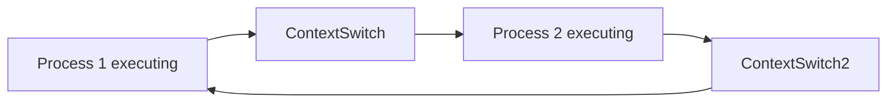

The operating system scheduler determines:

- Which process runs
- For how long
- When it is interrupted

Since scheduling is dynamic:

- Order of execution cannot be predicted
- Shared data may become inconsistent

---

#### 2.2.2 Resource Sharing (File, Memory, Data)

Race conditions typically occur when processes share:

- Variables in memory
- Files
- Databases
- Shared buffers
- Hardware devices

Example shared resources:

- Global variable
- Shared counter
- Shared file descriptor

If two processes modify the same memory location without protection:

- Updates may overwrite each other
- Final value may be incorrect

Shared memory scenario:

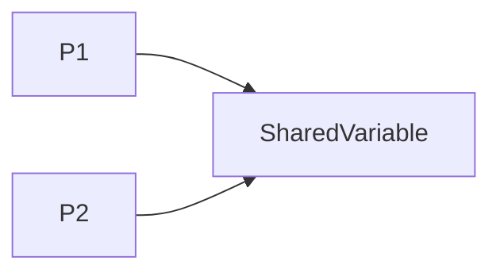

Without synchronization:

- Both may read same old value
- Both update independently
- One update gets lost

This is called **lost update problem**.

---

### 2.3 Example of Race Condition

Consider a shared variable:

```
int counter = 5;
```

Two processes P1 and P2 want to increment it.

Increment operation is not atomic.

It involves three steps:

1. Read value
2. Increment value
3. Write back value

#### Pseudocode:

Process P1:

```
temp = counter;
temp = temp + 1;
counter = temp;
```

Process P2:

```
temp = counter;
temp = temp + 1;
counter = temp;
```

---

#### Correct Execution (No Race)

If executed sequentially:

Initial value = 5

P1 increments → 6

P2 increments → 7

Final value = 7 ✔️

---

#### Race Condition Scenario

Execution order:

1. P1 reads counter → 5
2. P2 reads counter → 5
3. P1 increments temp → 6
4. P2 increments temp → 6
5. P1 writes 6
6. P2 writes 6

Final value = 6 ❌ (Incorrect)

Expected value = 7

This happened because both processes:

- Read the same initial value
- Overwrote each other’s update

Execution visualization:

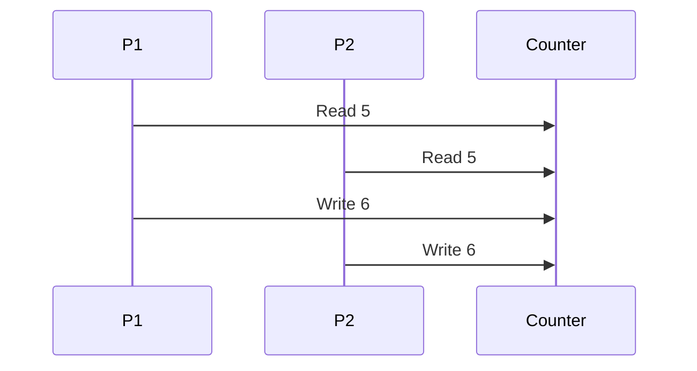

Final result becomes incorrect due to race condition.

---

### Why Race Condition is Dangerous

Race conditions can cause:

- Incorrect financial calculations
- Database corruption
- Lost transactions
- System crashes
- Security vulnerabilities

Example in banking system:

Two users withdraw ₹100 from account balance ₹1000.

Without synchronization:

- Both read ₹1000
- Both subtract ₹100
- Both write ₹900

Final balance = ₹900 ❌

Correct balance = ₹800

This is a critical failure.

---

### Key Characteristics of Race Condition

- Occurs in concurrent systems
- Requires shared resource
- Depends on execution timing
- Produces inconsistent results
- Hard to reproduce consistently

---

### Prevention Concept (Preview)

Race conditions are prevented using:

- Critical Sections
- Mutual Exclusion
- Semaphores
- Mutex locks
- Monitors

Next logical topic:

- Critical Section
- Requirements for Critical Section Solution

---

---

## 3. Critical Section

Critical Section is the fundamental concept used to solve the **race condition problem** in concurrent systems.

Whenever multiple processes share a resource (memory, file, variable), the portion of code where the shared resource is accessed must be protected.

---

### 3.1 Definition of Critical Section

A Critical Section is:

> A segment of code in which a process accesses shared resources and that must not be executed by more than one process at the same time.
> 

In simple terms:

If a process is executing inside its critical section, no other process should be allowed to execute its critical section simultaneously.

Why?

To prevent:

- Race conditions
- Data corruption
- Inconsistent system state

---

### 3.2 Need of Critical Section

Critical section is required because:

- Multiple processes share common data
- Instruction execution order is unpredictable
- Concurrent access leads to race conditions

Example:

```c
counter = counter + 1;
```

This looks like a single operation but internally involves:

1. Read counter
2. Increment value
3. Write back

If two processes execute this simultaneously:

- Incorrect result may occur

Therefore:

We must ensure that only one process updates the counter at a time.

---

Shared memory risk visualization:


Without protection → Race Condition

With Critical Section → Safe Access

---

### 3.3 Structure of Critical Section

Each process that accesses shared data follows a specific structure.

General structure:

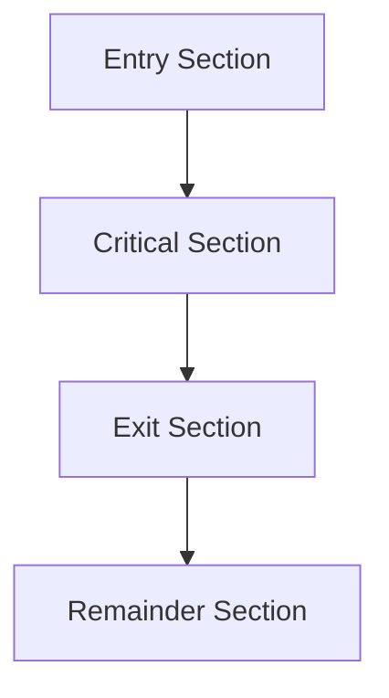

This structure ensures proper synchronization.

---

#### 3.3.1 Entry Section

The Entry Section contains code that:

- Requests permission to enter the critical section
- Ensures no other process is inside

It acts as a gatekeeper.

Example logic:

```c
// Entry Section
while(lock == true);
lock = true;
```

Its purpose:

- Enforce mutual exclusion
- Wait if another process is inside

---

#### 3.3.2 Critical Section

The Critical Section contains:

- Actual code that accesses shared resource

Example:

```c
// Critical Section
counter = counter + 1;
```

Only one process should execute this at a time.

---

#### 3.3.3 Exit Section

The Exit Section:

- Releases control
- Signals that critical section is free

Example:

```c
// Exit Section
lock = false;
```

This allows other waiting processes to enter.

---

#### 3.3.4 Remainder Section

The Remainder Section:

- Contains rest of the code
- Does not access shared resource

Example:

```c
// Remainder Section
print("Process completed work");
```

No synchronization required here.

---

Complete Process Structure Example:

```c
while(true) {

    // Entry Section
    acquire_lock();

    // Critical Section
    update_shared_variable();

    // Exit Section
    release_lock();

    // Remainder Section
    do_other_work();
}
```

---

### 3.4 Requirements for Critical Section Solution

Any solution to the Critical Section problem must satisfy **three essential conditions**.

---

#### 3.4.1 Mutual Exclusion

Mutual Exclusion means:

> At most one process can execute in its critical section at any given time.
> 

If process P1 is inside critical section:

- P2 must wait
- P3 must wait

Visualization:

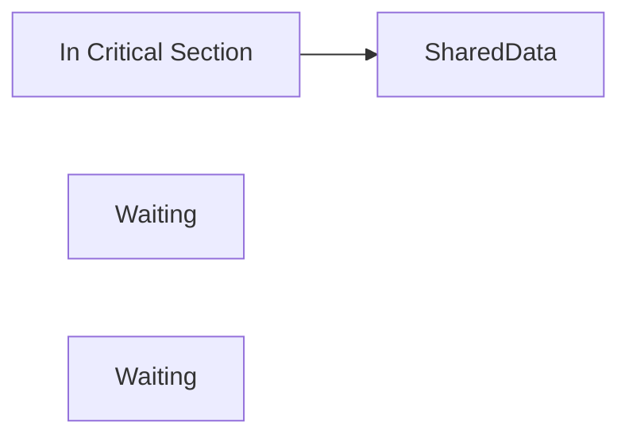

Without mutual exclusion:

- Race condition occurs

Mutual exclusion ensures:

- Data integrity
- Correct program execution

---

#### 3.4.2 Progress

Progress means:

> If no process is in the critical section and some processes wish to enter, then the selection of the next process to enter must not be postponed indefinitely.
> 

In simpler words:

- If critical section is free
- One of the waiting processes must be allowed to enter

It prevents:

- Deadlock
- Unnecessary blocking

Wrong behavior example:

- Critical section is free
- But processes keep waiting
- No one enters

That violates progress condition.

---

#### 3.4.3 Bounded Waiting

Bounded Waiting means:

> There must be a limit on the number of times other processes are allowed to enter their critical section after a process has requested entry.
> 

In simpler terms:

- No process should wait forever
- No starvation should occur

If P1 requests entry:

- Other processes may enter first
- But only a limited number of times

This ensures fairness.

Starvation example:

P1 requests entry

P2 and P3 continuously enter

P1 never gets chance

This violates bounded waiting.

---

### Summary of Three Conditions

| Condition | Meaning | Prevents |
| --- | --- | --- |
| Mutual Exclusion | Only one process inside | Race Condition |
| Progress | If free, someone must enter | Deadlock |
| Bounded Waiting | No infinite waiting | Starvation |

All three must be satisfied for a correct solution.

---

### Why Critical Section is Important

It forms the foundation for:

- Peterson’s Solution
- Test-and-Set Instruction
- Semaphores
- Monitors
- Mutex Locks

Without critical section control:

- Concurrent systems become unreliable
- Data corruption becomes unavoidable

---

---

## 4. Solutions to Synchronization Problem

The Synchronization Problem arises when multiple processes attempt to access shared resources concurrently.

To solve the **Critical Section Problem**, we need mechanisms that ensure:

- Mutual Exclusion
- Progress
- Bounded Waiting

One major category of solutions is **Hardware-based Solutions**, which rely on special CPU instructions.

---

### 4.1 Hardware Solution

Hardware solutions use **special machine-level instructions** that guarantee atomic execution.

These instructions are:

- Executed without interruption
- Not preempted by other processes
- Guaranteed to complete before context switching

They help enforce mutual exclusion efficiently.

---

#### 4.1.1 Exclusive Access to Memory

Some hardware architectures provide mechanisms for:

- Locking memory
- Temporarily disabling interrupts
- Preventing other processors from accessing memory

Example approach:

Disable interrupts while executing critical section.

```c
// Disable interrupts
disable_interrupts();

// Critical Section
counter++;

// Enable interrupts
enable_interrupts();
```

Problem with this approach:

- Only works in single-processor systems
- Dangerous in user mode
- Not suitable for multiprocessor systems

Therefore, more robust hardware instructions are used.

---

#### 4.1.2 Test-and-Set Instruction

The **Test-and-Set (TAS)** instruction is a hardware-supported atomic instruction.

It performs two operations atomically:

1. Tests the value of a variable
2. Sets it to 1 (or true)

Definition:

```c
boolean test_and_set(boolean *target) {
    boolean old_value = *target;
    *target = true;
    return old_value;
}
```

Important:

This entire operation happens atomically.

Meaning:

- No other process can interrupt this instruction
- Ensures safe locking

Usage:

If lock is false → process sets it to true and enters

If lock is true → process waits

---

#### 4.1.3 Swap Instruction

Another hardware instruction is **Swap**.

Swap exchanges values of two variables atomically.

Definition:

```c
void swap(boolean *a, boolean *b) {
    boolean temp = *a;
    *a = *b;
    *b = temp;
}
```

This instruction:

- Is atomic
- Prevents interruption
- Can be used to implement mutual exclusion

Swap-based locking logic:

```c
do {
    key = true;
    while (key == true)
        swap(&lock, &key);

    // Critical Section

    lock = false;

} while (true);
```

If lock is false → process enters

If lock is true → process waits

---

### 4.2 Test-and-Set Mechanism

Test-and-Set provides a simple hardware solution for critical section control.

---

#### 4.2.1 Atomic Operation Concept

An Atomic Operation:

> Is an operation that executes completely without interruption.
> 

Key properties:

- Cannot be divided
- Cannot be partially executed
- Not affected by context switching

Visualization:


No other process can intervene between Start and End.

Atomicity ensures:

- Safe lock acquisition
- Prevention of race condition

---

#### 4.2.2 Entry into Critical Section

Using Test-and-Set:

Let shared variable:

```c
boolean lock = false;
```

Entry code:

```c
while (test_and_set(&lock))
    ;  // Busy waiting
```

How it works:

Case 1: lock = false

- test_and_set returns false
- lock becomes true
- Process enters critical section

Case 2: lock = true

- test_and_set returns true
- Process keeps waiting

Execution model:

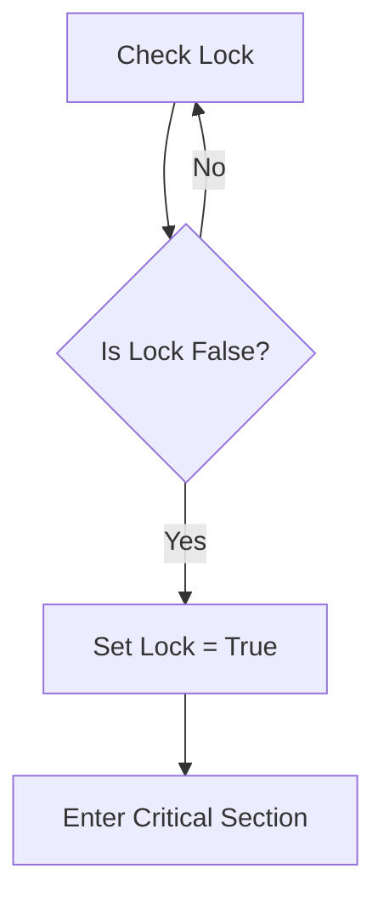

This ensures mutual exclusion.

---

#### 4.2.3 Exit from Critical Section

Exit section simply releases lock:

```c
lock = false;
```

This allows another waiting process to enter.

Complete structure:

```c
while (true) {

    // Entry Section
    while (test_and_set(&lock));

    // Critical Section
    counter++;

    // Exit Section
    lock = false;

    // Remainder Section
}
```

---

### Advantages of Test-and-Set

- Simple implementation
- Guaranteed mutual exclusion
- Works in multiprocessor systems
- Hardware-level efficiency

---

### Disadvantages

- Busy Waiting (Spinlock)
- Wastes CPU cycles
- Does not guarantee bounded waiting
- Possible starvation

Busy waiting means:

Process repeatedly checks lock without doing useful work.

---

### Summary

Hardware Solutions use:

- Exclusive memory access
- Test-and-Set instruction
- Swap instruction

Test-and-Set Mechanism:

- Uses atomic operation
- Ensures mutual exclusion
- Implements entry and exit logic

However:

- May cause busy waiting
- Does not fully guarantee fairness

---

---

## 5. Peterson’s Solution

Peterson’s Solution is a **software-based solution** to the Critical Section Problem for **two processes**.

Unlike hardware solutions (Test-and-Set, Swap), Peterson’s solution:

- Does not require special hardware instructions
- Uses shared variables
- Guarantees all three conditions:
    - Mutual Exclusion
    - Progress
    - Bounded Waiting

It is one of the most important classical synchronization algorithms.

---

### 5.1 Introduction to Peterson’s Solution

Peterson’s Solution:

- Was proposed by Gary L. Peterson
- Solves the critical section problem for two processes only
- Is based entirely on shared memory variables

It uses:

- A turn variable
- A boolean flag array

The idea is:

- Each process declares its intention to enter the critical section
- Gives priority to the other process
- Waits if necessary

This prevents race conditions without hardware support.

---

### 5.2 Shared Variables

Peterson’s solution uses two shared variables.

```c
boolean flag[2];
int turn;
```

---

#### 5.2.1 Turn Variable

The variable `turn` indicates:

- Whose turn it is to enter the critical section

Values:

- turn = 0 → Process 0 has priority
- turn = 1 → Process 1 has priority

Purpose:

If both processes want to enter critical section:

- The turn variable decides who enters first

This prevents deadlock and ensures progress.

---

#### 5.2.2 Boolean Flag Array

The `flag` array indicates:

- Whether a process wants to enter critical section

Values:

- flag[0] = true → Process 0 wants to enter
- flag[1] = true → Process 1 wants to enter

If flag[i] = false → process i does not want to enter

This helps detect simultaneous requests.

---

### 5.3 Algorithm for Two Processes

Let there be two processes:

- P0
- P1

For process Pi (i = 0 or 1), let:

- j = 1 - i (other process)

Algorithm:

```c
do {

    // Entry Section
    flag[i] = true;
    turn = j;
    while (flag[j] && turn == j);

    // Critical Section

    // Exit Section
    flag[i] = false;

    // Remainder Section

} while (true);
```

Explanation:

Step 1:

Process i declares its intention:

```c
flag[i] = true;
```

Step 2:

Process gives priority to other process:

```c
turn = j;
```

Step 3:

Wait condition:

```c
while (flag[j] && turn == j);
```

Meaning:

- If other process wants to enter
- AND it is their turn
- Then wait

Otherwise → enter critical section.

---

Execution Model:

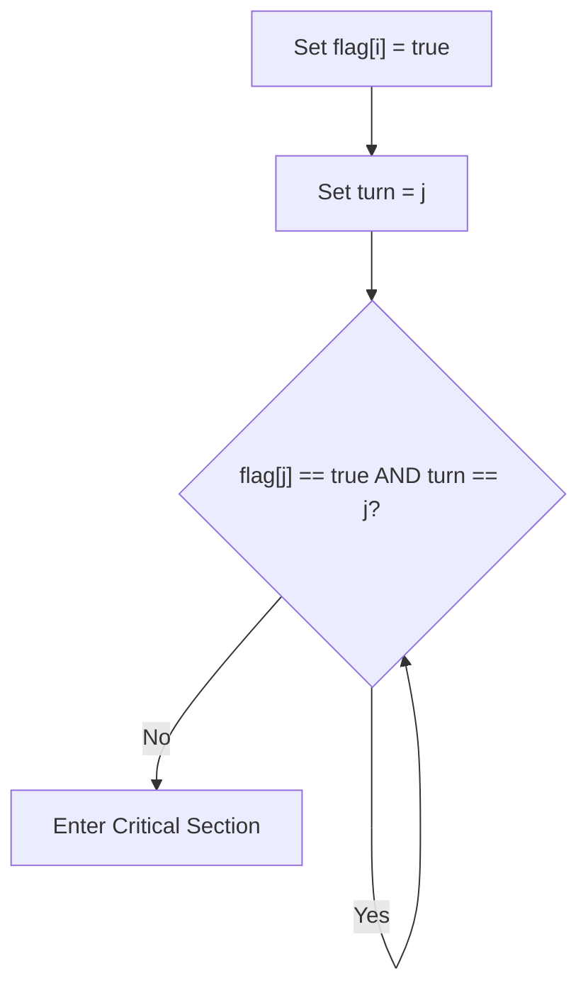

---

### 5.4 Analysis of Peterson’s Solution

Now we verify whether Peterson’s solution satisfies the three critical section conditions.

---

#### 5.4.1 Mutual Exclusion

Mutual Exclusion requires:

Only one process can be inside critical section at a time.

Proof idea:

If both processes try to enter:

- Both set their flag to true
- Both set turn to other

Since turn can have only one value:

- Only one process will exit the while loop
- The other will wait

Therefore:

Both cannot enter critical section simultaneously.

Mutual Exclusion satisfied ✔️

---

#### 5.4.2 Progress

Progress requires:

If no process is inside critical section, and some wish to enter, one must be allowed to enter.

In Peterson’s solution:

- If only one process wants to enter → it enters immediately
- If both want to enter → turn decides

There is no unnecessary blocking.

Therefore:

Progress satisfied ✔️

---

#### 5.4.3 Bounded Waiting

Bounded Waiting requires:

No process waits forever.

In Peterson’s solution:

If Pi sets flag[i] = true:

- Pj can enter at most once before Pi gets chance
- Because turn variable alternates

Thus:

No starvation occurs.

Bounded Waiting satisfied ✔️

---

### 5.5 Disadvantages

Despite satisfying all three conditions, Peterson’s solution has limitations.

---

#### 5.5.1 Busy Waiting

The algorithm uses:

```c
while (flag[j] && turn == j);
```

This is busy waiting (spinlock).

Meaning:

- Process continuously checks condition
- CPU cycles are wasted
- Inefficient in real systems

Better solutions use:

- Semaphores
- Blocking mechanisms

---

#### 5.5.2 Limited to Two Processes

Peterson’s solution:

- Works only for two processes
- Does not scale easily

For n processes:

- Algorithm becomes complex
- Not practical for modern systems

Modern operating systems use:

- Semaphores
- Mutex locks
- Monitors

---

### Summary

Peterson’s Solution:

- Software-based solution
- Uses flag array and turn variable
- Works for two processes

Satisfies:

- Mutual Exclusion ✔️
- Progress ✔️
- Bounded Waiting ✔️

Limitations:

- Busy waiting
- Not scalable beyond two processes

---

---

## 6. Strict Alternation

Strict Alternation is one of the earliest **software-based solutions** proposed for the Critical Section Problem.

It attempts to ensure that two processes enter their critical sections **alternately**, using a shared variable.

Although simple, it is not a correct solution because it violates one of the critical section requirements.

---

### 6.1 Turn Variable Concept

Strict Alternation uses a single shared variable:

```c
int turn = 0;   // 0 for P0, 1 for P1
```

Meaning:

- If turn = 0 → Process P0 can enter critical section
- If turn = 1 → Process P1 can enter critical section

Only the process whose turn it is can execute the critical section.

Basic idea:

- Processes take turns entering the critical section
- After finishing, a process gives turn to the other process

This ensures that both processes never enter critical section at the same time.

---

Execution Flow:

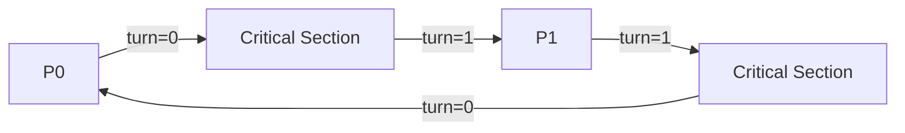

---

### 6.2 User Mode Software Solution

Strict Alternation can be implemented entirely in user mode without hardware support.

For Process P0:

```c
while (true) {

    // Entry Section
    while (turn != 0);

    // Critical Section

    turn = 1;

    // Remainder Section
}
```

For Process P1:

```c
while (true) {

    // Entry Section
    while (turn != 1);

    // Critical Section

    turn = 0;

    // Remainder Section
}
```

How it works:

- Each process waits until it is its turn
- Executes critical section
- Assigns turn to the other process

This ensures:

✔ Mutual Exclusion (only one process enters at a time)

Because if turn = 0:

- Only P0 can enter
- P1 must wait

---

### 6.3 Limitations

Although Strict Alternation ensures mutual exclusion, it has serious problems.

---

#### ❌ 1. Violates Progress Condition

Progress requires:

> If no process is in the critical section and some wish to enter, one should be allowed to enter immediately.
> 

Problem scenario:

- turn = 1
- P1 is in remainder section (not interested in critical section)
- P0 wants to enter critical section

But P0 must wait until:

- P1 changes turn to 0

Even though P1 is not using critical section, P0 is forced to wait.

This violates progress.

Visualization:

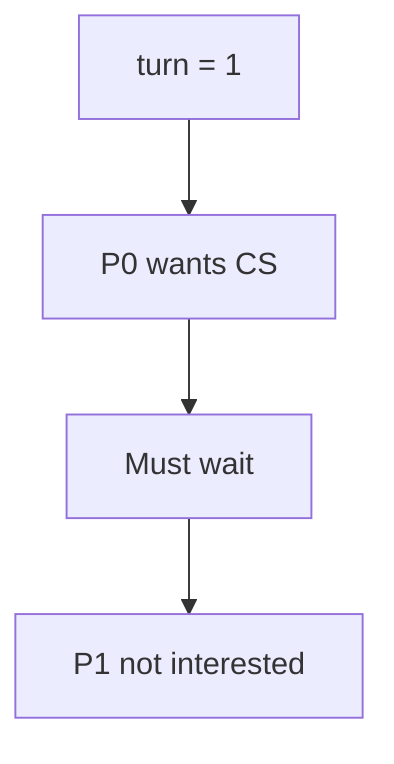

System is idle but P0 is blocked unnecessarily.

---

#### ❌ 2. Inefficient CPU Usage (Busy Waiting)

Strict Alternation uses:

```c
while (turn != i);
```

This is busy waiting.

- Process continuously checks turn
- CPU cycles are wasted

Not efficient for real systems.

---

#### ❌ 3. Not Flexible

It forces strict alternation even when:

- Only one process needs critical section

It does not allow:

- Consecutive entries by same process

This reduces performance.

---

#### ❌ 4. Limited to Two Processes

Strict Alternation works only for:

- Two processes

Does not scale easily to multiple processes.

---

### Comparison with Peterson’s Solution

| Feature | Strict Alternation | Peterson’s Solution |
| --- | --- | --- |
| Mutual Exclusion | ✔ | ✔ |
| Progress | ❌ | ✔ |
| Bounded Waiting | ✔ | ✔ |
| Busy Waiting | Yes | Yes |
| Processes Supported | 2 | 2 |

Peterson’s solution improves upon Strict Alternation by solving the progress problem.

---

### Summary

Strict Alternation:

- Uses shared turn variable
- Ensures mutual exclusion
- Fails progress condition
- Causes unnecessary waiting
- Uses busy waiting
- Limited to two processes

It is an important historical concept but not a complete solution.

---

---

## 7. Producer–Consumer Problem (Bounded Buffer Problem)

The Producer–Consumer Problem is a classical synchronization problem that illustrates the need for **process coordination and mutual exclusion**.

It involves:

- One or more **Producer processes**
- One or more **Consumer processes**
- A **shared bounded buffer**

The producer generates data and places it into the buffer.

The consumer removes data from the buffer.

The challenge is to ensure:

- No data corruption
- No buffer overflow
- No buffer underflow
- Proper synchronization

---

### 7.1 Introduction

In this problem:

- The buffer has a fixed size (bounded)
- Producer inserts items into buffer
- Consumer removes items from buffer

The buffer acts as shared memory between processes.

Visual representation:


Key challenges:

1. Prevent race condition while accessing buffer
2. Ensure producer does not add to full buffer
3. Ensure consumer does not remove from empty buffer

If synchronization is not applied:

- Data inconsistency occurs
- System may crash
- Lost updates may occur

---

### 7.2 Conditions for Inconsistency

Two main problematic conditions exist.

---

#### 7.2.1 Buffer Full Condition

When:

- Buffer is completely filled
- No empty slot available

If producer tries to insert:

- Buffer overflow occurs
- Existing data may be overwritten

Example:

Buffer size = 5

Items already = 5

If producer inserts another item:

- Undefined behavior
- Data corruption

Visualization:


This must be prevented.

---

#### 7.2.2 Buffer Empty Condition

When:

- Buffer contains zero items

If consumer tries to remove:

- Underflow occurs
- Invalid data access
- System instability

Example:

Buffer size = 5

Items present = 0

If consumer removes item:

- Garbage value
- Crash

Visualization:


---

### 7.3 Solution for Producer

Producer must ensure:

- It does not insert into full buffer
- It synchronizes properly

Basic producer logic:

```c
while (true) {
    produce_item();
    while (buffer_is_full)
        ; // wait

    insert_item();
}
```

---

#### 7.3.1 Sleep or Discard

If buffer is full:

Option 1: Sleep

- Producer goes into waiting state
- Wakes when space becomes available

Option 2: Discard

- Produced item is discarded
- May not be acceptable in many systems

Sleeping is preferred because:

- No CPU waste
- No data loss

Busy waiting wastes CPU cycles.

---

#### 7.3.2 Notification Mechanism

Producer must be notified when:

- Consumer removes an item
- Space becomes available

Notification mechanism ensures:

- Producer resumes execution
- Avoids continuous polling

Conceptual mechanism:

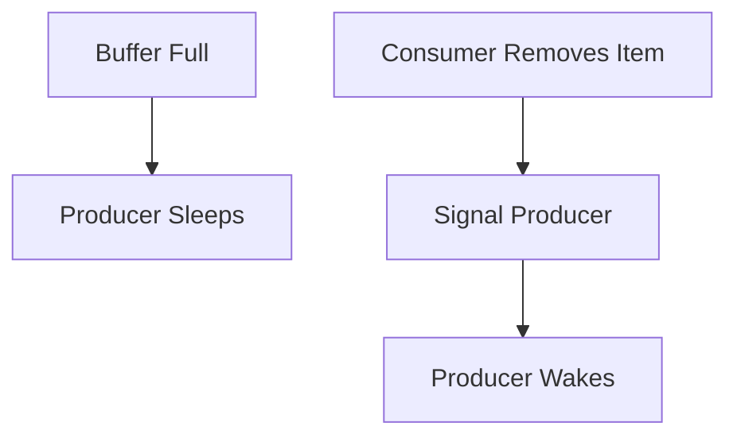

This avoids inefficient busy waiting.

---

### 7.4 Solution for Consumer

Consumer must ensure:

- It does not remove from empty buffer
- It synchronizes properly

Basic consumer logic:

```c
while (true) {
    while (buffer_is_empty)
        ; // wait

    remove_item();
    consume_item();
}
```

---

#### 7.4.1 Sleep if Empty

If buffer is empty:

- Consumer must sleep
- Wait for producer to insert data

Sleeping prevents:

- CPU wastage
- Invalid data access

---

#### 7.4.2 Notification from Producer

When producer inserts new item:

- It must notify consumer
- Consumer wakes and continues

Conceptual mechanism:

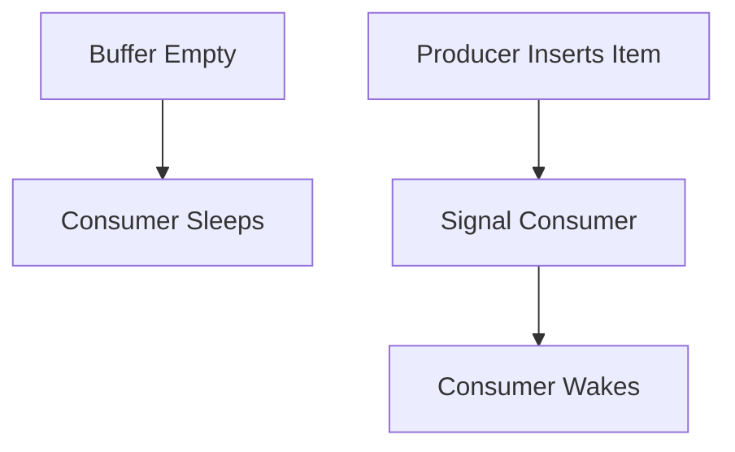

---

### Key Synchronization Requirements

To correctly solve Producer–Consumer problem:

1. Mutual Exclusion
    - Only one process modifies buffer at a time
2. Synchronization
    - Producer waits if buffer full
    - Consumer waits if buffer empty
3. No Busy Waiting
    - Efficient blocking mechanism preferred

---

### Why This Problem is Important

This problem models real-world systems:

- Print spooler
- Network packet buffering
- Data streaming
- Operating system I/O buffering
- Message queues

It demonstrates:

- Need for semaphores
- Need for monitors
- Need for synchronization primitives

---

### Summary

Producer–Consumer Problem:

- Involves shared bounded buffer
- Requires synchronization
- Prevents overflow and underflow
- Demonstrates race condition risks

Two main conditions:

- Buffer Full
- Buffer Empty

Proper solution requires:

- Mutual exclusion
- Sleep/wake mechanism
- Notification signaling

---

---

## 8. Semaphore

Semaphore is one of the most powerful synchronization mechanisms used in Operating Systems.

It was introduced by **Edsger Dijkstra** to solve synchronization problems such as:

- Critical Section Problem
- Producer–Consumer Problem
- Readers–Writers Problem
- Dining Philosophers Problem

Semaphore provides a controlled way to:

- Manage shared resources
- Avoid race conditions
- Synchronize processes

---

### 8.1 Definition of Semaphore

A Semaphore is:

> A synchronization tool that uses an integer variable to control access to shared resources among concurrent processes.
> 

A semaphore has:

- An integer value
- Two atomic operations:
    - wait()
    - signal()

Important:

Semaphore operations are **atomic**, meaning:

- They execute completely without interruption
- No other process can interfere during execution

---

General structure:

```c
int semaphore = initial_value;
```

The value represents:

- Available resources
- Or permission to enter critical section

---

### 8.2 wait() Operation

The `wait()` operation is also called:

- P() operation
- down() operation

Definition:

```c
wait(S) {
    while (S <= 0)
        ; // busy waiting
    S--;
}
```

Improved version (blocking instead of busy waiting):

```c
wait(S) {
    S--;
    if (S < 0) {
        add process to waiting queue;
        block();
    }
}
```

Meaning of wait():

- Decreases semaphore value
- If resource not available → process waits

Case 1: S > 0

- Process enters
- S decreases

Case 2: S = 0

- Process must wait

Visualization:

```mermaid
flowchart TD
    A["wait(S)"] --> B{S > 0?}
    B -->|Yes| C[Decrement S]
    B -->|No| D[Block Process]
```

Purpose:

- Prevent multiple processes from entering critical section simultaneously

---

### 8.3 signal() Operation

The `signal()` operation is also called:

- V() operation
- up() operation

Definition:

```c
signal(S) {
    S++;
}
```

Improved blocking version:

```c
signal(S) {
    S++;
    if (S <= 0) {
        remove process from waiting queue;
        wakeup();
    }
}
```

Meaning of signal():

- Increases semaphore value
- If processes are waiting → wake one

Visualization:

```mermaid
flowchart TD
    A["signal(S)"] --> B[Increment S]
    B --> C{Processes Waiting?}
    C -->|Yes| D[Wake One Process]
    C -->|No| E[Continue]
```

Purpose:

- Release resource
- Allow next waiting process to enter

---

### Using Semaphore for Critical Section

Example:

```c
semaphore mutex = 1;

Process {
    wait(mutex);

    // Critical Section

    signal(mutex);
}
```

Here:

- mutex initialized to 1
- Only one process can enter at a time

---

### 8.4 Types of Semaphore

There are two main types of semaphores.

---

#### 8.4.1 Counting Semaphore

Counting semaphore:

- Can take any non-negative integer value
- Used to control access to multiple instances of a resource

Example:

If 5 identical printers exist:

```c
semaphore printers = 5;
```

Each process:

```c
wait(printers);
// use printer
signal(printers);
```

If printers = 0:

- All printers are busy
- Process must wait

Counting semaphore is used for:

- Resource pools
- Buffer management
- Connection control

Example: Producer–Consumer buffer size = 10

```c
semaphore empty = 10;
semaphore full = 0;
```

---

#### 8.4.2 Binary Semaphore

Binary semaphore:

- Value can be only 0 or 1
- Used for mutual exclusion

Also called:

- Mutex (Mutual Exclusion Lock)

Initialization:

```c
semaphore mutex = 1;
```

Usage:

```c
wait(mutex);

// Critical Section

signal(mutex);
```

If mutex = 0:

- Another process is inside critical section
- Process must wait

Binary semaphore ensures:

✔ Mutual Exclusion

✔ Controlled access

---

### Advantages of Semaphore

- Prevents race condition
- Supports blocking (no busy waiting in advanced implementation)
- Works for multiple processes
- Supports both single and multiple resources

---

### Disadvantages

- Complex to implement correctly
- Can cause:
    - Deadlock
    - Starvation
- Requires careful programming

Incorrect usage example:

If signal() is forgotten:

- Other processes wait forever

---

### Summary

Semaphore:

- Synchronization mechanism
- Uses integer variable
- Uses atomic wait() and signal()

Two Types:

- Counting Semaphore → multiple resources
- Binary Semaphore → mutual exclusion

Operations:

- wait() → acquire resource
- signal() → release resource

Semaphore solves:

- Critical Section Problem
- Producer–Consumer Problem
- Many classical synchronization problems

---

---

## 9. Monitor

Monitor is a **high-level synchronization construct** designed to simplify process synchronization.

It overcomes the complexity and error-prone nature of semaphores by providing:

- Automatic mutual exclusion
- Structured access to shared data
- Cleaner synchronization design

Monitors are supported directly in some programming languages such as:

- Java (synchronized methods)
- C## (lock)
- Pascal (monitor constructs)

---

### 9.1 Introduction to Monitor

A Monitor is:

> A synchronization mechanism that encapsulates shared data and procedures that operate on that data, ensuring that only one process executes inside the monitor at a time.
> 

Key idea:

- Shared data is hidden inside the monitor
- Processes access shared data only through monitor procedures
- Only one process can execute a monitor procedure at any given time

This automatically solves the mutual exclusion problem.

Conceptual Structure:

```mermaid
flowchart TD
    A[Process 1] --> M[Monitor]
    B[Process 2] --> M
    C[Process 3] --> M
    M --> SharedData
```

Only one process can be active inside the monitor.

---

### 9.2 Properties of Monitor

Monitor has specific characteristics that make it safer than semaphores.

---

#### 9.2.1 Encapsulation of Data

Encapsulation means:

- Shared variables are declared inside the monitor
- They cannot be accessed directly from outside

Example structure:

```
monitor Example {
    int shared_data;

    procedure update() {
        shared_data++;
    }
}
```

Here:

- shared_data is protected
- Access only through update()

This prevents accidental modification from outside processes.

Encapsulation improves:

- Data security
- Maintainability
- Code clarity

---

#### 9.2.2 Mutual Exclusion Property

Monitor automatically enforces:

> Only one process can execute inside the monitor at any time.
> 

If multiple processes call monitor procedures:

- One enters
- Others wait in queue

No need for explicit wait(mutex) or signal(mutex).

Visualization:

```mermaid
flowchart TD
    A[Process 1 Inside Monitor]
    B[Process 2 Waiting]
    C[Process 3 Waiting]
```

This ensures:

✔ Mutual Exclusion

✔ No race condition

---

#### 9.2.3 Procedure Access Rules

Access rules for monitors:

1. Only monitor procedures can access shared data
2. External processes must call monitor procedures
3. Direct access to internal variables is not allowed

Example:

```
monitor Counter {
    int count = 0;

    procedure increment() {
        count++;
    }

    procedure get() {
        return count;
    }
}
```

Processes cannot directly modify count.

This rule prevents:

- Unsafe memory access
- Synchronization errors

---

### 9.3 Monitor with Condition Variables

Basic monitor handles mutual exclusion, but sometimes:

- A process must wait for a condition to become true

For this purpose, monitors use **Condition Variables**.

---

#### 9.3.1 wait Operation

If a condition is not satisfied:

- Process executes wait()
- It is suspended
- Releases monitor lock

Syntax (conceptual):

```
condition x;

x.wait();
```

Important behavior:

- Process moves to waiting queue
- Monitor becomes available to other processes

Visualization:

```mermaid
flowchart TD
    A[Process Inside Monitor] --> B{Condition False?}
    B -->|Yes| C["wait()"]
    C --> D[Process Suspended]
```

---

#### 9.3.2 signal Operation

signal() wakes up one waiting process.

Syntax:

```
x.signal();
```

Behavior:

- One suspended process resumes
- It re-enters monitor

Important:

- If no process is waiting → signal has no effect

Visualization:

```mermaid
flowchart TD
    A["signal()"] --> B{Waiting Process?}
    B -->|Yes| C[Wake One]
    B -->|No| D[Continue]
```

Condition variables allow synchronization beyond simple mutual exclusion.

---

### 9.4 Producer–Consumer Problem using Monitor

Let’s implement bounded buffer using monitor.

Monitor structure:

```
monitor BoundedBuffer {
    int buffer[N];
    int count = 0;
    int in = 0;
    int out = 0;

    condition notFull;
    condition notEmpty;

    procedure produce(item) {
        if (count == N)
            notFull.wait();

        buffer[in] = item;
        in = (in + 1) % N;
        count++;

        notEmpty.signal();
    }

    procedure consume() {
        if (count == 0)
            notEmpty.wait();

        item = buffer[out];
        out = (out + 1) % N;
        count--;

        notFull.signal();
    }
}
```

Explanation:

Producer:

- If buffer full → wait
- Insert item
- Signal consumer

Consumer:

- If buffer empty → wait
- Remove item
- Signal producer

Flow:

```mermaid
flowchart TD
    P[Producer] -->|"produce()"| M[Monitor]
    M --> Buffer
    Buffer --> M
    M -->|"consume()"| C[Consumer]
```

Monitor ensures:

✔ Mutual Exclusion

✔ Proper synchronization

✔ No busy waiting

✔ Clean structured design

---

### Advantages of Monitor

- Easier to use than semaphores
- Reduces programming errors
- Built-in mutual exclusion
- Structured synchronization

---

### Disadvantages

- Requires language support
- Implementation complexity
- Less flexible than raw semaphores

---

### Comparison: Semaphore vs Monitor

| Feature | Semaphore | Monitor |
| --- | --- | --- |
| Mutual Exclusion | Manual | Automatic |
| Error Prone | Yes | Less |
| Structure | Low-level | High-level |
| Ease of Use | Difficult | Easier |

---

### Summary

Monitor:

- High-level synchronization construct
- Encapsulates shared data
- Automatically enforces mutual exclusion
- Uses condition variables for waiting

It provides a cleaner and safer solution compared to semaphores.

---

---

## 10. Readers and Writers Problem

The Readers–Writers Problem is a classical synchronization problem that deals with processes that share a common data resource (such as a file or database).

There are two types of processes:

- **Readers** → Only read the shared data
- **Writers** → Modify (write/update) the shared data

The main challenge:

- Allow multiple readers to read simultaneously
- Allow only one writer at a time
- Ensure writers get proper access without corruption

---

### 10.1 Introduction

In many real-world systems:

- Database servers
- File systems
- Shared documents
- Configuration files

Multiple users may read data at the same time.

However, when a writer modifies data:

- No other writer should write
- No reader should read simultaneously

Otherwise:

- Data inconsistency
- Corruption
- Incomplete updates

Visual Concept:

```mermaid
flowchart LR
    R1[Reader] --> SharedData
    R2[Reader] --> SharedData
    W1[Writer] --> SharedData
```

Rules:

✔ Multiple Readers → Allowed

✔ Single Writer → Allowed

❌ Writer + Reader → Not Allowed

❌ Writer + Writer → Not Allowed

---

### 10.2 Problem Statement

The Readers–Writers problem states:

> Design a synchronization mechanism such that:
> 
> - Multiple readers can access shared data simultaneously.
> - Writers require exclusive access.

There are multiple versions of the problem:

1. Reader-priority version
2. Writer-priority version
3. Fair solution (no starvation)

Here we focus on classical reader-priority explanation.

---

#### 10.2.1 Reader + Writer Case

Case:

- A reader is reading
- A writer wants to write

Problem:

If writer writes while reader is reading:

- Reader may read inconsistent data
- Partial update possible

Solution requirement:

Writer must wait until all readers finish.

Thus:

❌ Reader + Writer not allowed

---

#### 10.2.2 Writer + Reader Case

Case:

- A writer is writing
- A reader wants to read

If reader reads during writing:

- Reader may see partially updated data
- Data inconsistency occurs

Thus:

❌ Writer + Reader not allowed

Reader must wait until writer completes.

---

#### 10.2.3 Writer + Writer Case

Case:

- One writer is writing
- Another writer wants to write

If both write simultaneously:

- Data corruption
- Lost updates
- Undefined behavior

Thus:

❌ Writer + Writer not allowed

Only one writer at a time.

---

#### 10.2.4 Reader + Reader Case

Case:

- One reader is reading
- Another reader wants to read

Since readers do not modify data:

✔ Reader + Reader allowed

Multiple readers can access data simultaneously.

This improves:

- Performance
- Efficiency
- Throughput

Visualization:

```mermaid
flowchart TD
    R1[Reader 1] --> SharedData
    R2[Reader 2] --> SharedData
    R3[Reader 3] --> SharedData
```

---

### 10.3 Use of Semaphore in Readers–Writers Problem

We use semaphores to enforce the required rules.

Two semaphores are commonly used:

```c
semaphore mutex = 1;   // Protects readcount
semaphore wrt = 1;     // Controls writer access
int readcount = 0;
```

#### Purpose of Variables

- `mutex` → Protects readcount variable
- `wrt` → Ensures exclusive writing
- `readcount` → Number of active readers

---

#### Reader Process

```c
wait(mutex);
readcount++;
if (readcount == 1)
    wait(wrt);      // First reader blocks writers
signal(mutex);

// Reading section

wait(mutex);
readcount--;
if (readcount == 0)
    signal(wrt);    // Last reader allows writers
signal(mutex);
```

Explanation:

1. Reader increments readcount
2. If first reader → block writers
3. Multiple readers allowed
4. Last reader releases writer

---

#### Writer Process

```c
wait(wrt);

// Writing section

signal(wrt);
```

Explanation:

- Writer waits for wrt semaphore
- Ensures exclusive access
- No reader or writer allowed during writing

---

#### Execution Flow

```mermaid
flowchart TD
    A[Reader Enters] --> B[Increment readcount]
    B --> C{First Reader?}
    C -->|Yes| D["wait(wrt)"]
    C -->|No| E[Continue Reading]
    D --> E
```

Writer Flow:

```mermaid
flowchart TD
    W[Writer] --> X["wait(wrt)"]
    X --> Y[Writing]
    Y --> Z["signal(wrt)"]
```

---

### Behavior Summary

| Scenario | Allowed? |
| --- | --- |
| Reader + Reader | ✔ |
| Writer + Writer | ❌ |
| Reader + Writer | ❌ |
| Writer + Reader | ❌ |

---

### Starvation Issue

In reader-priority solution:

- If readers continuously arrive
- Writers may starve

Because:

- Writers wait until readcount becomes 0
- If new readers keep entering → writer never executes

This is called **Writer Starvation**.

Improved versions exist:

- Writer-priority solution
- Fair solution

---

### Advantages of Semaphore Solution

✔ Ensures mutual exclusion

✔ Allows concurrency among readers

✔ Efficient resource usage

---

### Summary

Readers–Writers Problem:

- Deals with shared data access
- Allows multiple readers
- Only one writer allowed
- Requires synchronization

Using Semaphores:

- mutex → protect readcount
- wrt → ensure exclusive writing

Problem demonstrates:

- Practical use of semaphores
- Real-world database synchronization

---

---

## 11. Dining Philosophers Problem

The Dining Philosophers Problem is a classical synchronization problem proposed by **Edsger Dijkstra**.

It demonstrates issues like:

- Deadlock
- Starvation
- Resource allocation conflicts
- Process synchronization

It models a situation where multiple processes compete for limited shared resources.

---

### 11.1 Introduction

In this problem:

- Five philosophers sit around a circular table
- A chopstick is placed between each pair
- Each philosopher needs two chopsticks to eat

Rules:

- A philosopher alternates between thinking and eating
- To eat → must hold both left and right chopstick
- After eating → releases both

This models:

- Processes (philosophers)
- Shared resources (chopsticks)

Visualization:

```mermaid
graph TD
    P0 --- C0 --- P1
    P1 --- C1 --- P2
    P2 --- C2 --- P3
    P3 --- C3 --- P4
    P4 --- C4 --- P0
```

---

### 11.2 Problem Description

The problem illustrates synchronization issues when:

- Each process requires multiple resources
- Resources are limited
- Improper ordering causes deadlock

---

#### 11.2.1 Philosophers and Chopsticks

There are:

- 5 Philosophers: P0, P1, P2, P3, P4
- 5 Chopsticks: C0, C1, C2, C3, C4

Each philosopher Pi requires:

- Chopstick i (left)
- Chopstick (i+1) mod 5 (right)

Chopsticks are shared resources.

Only one philosopher can use a chopstick at a time.

---

#### 11.2.2 Thinking and Eating States

Each philosopher cycles between two states:

1. Thinking
2. Eating

State Diagram:

```mermaid
stateDiagram-v2
    [*] --> Thinking
    Thinking --> Hungry
    Hungry --> Eating
    Eating --> Thinking
```

- Thinking → no resources required
- Hungry → attempts to acquire both chopsticks
- Eating → holds both chopsticks

---

### 11.3 Chopstick Allocation

Chopsticks must be allocated carefully to avoid deadlock.

---

#### 11.3.1 Left and Right Chopstick

For philosopher Pi:

- Left chopstick = Ci
- Right chopstick = C(i+1)

Example:

- P0 → C0 and C1
- P1 → C1 and C2
- P4 → C4 and C0

Since chopsticks are shared:

- Neighbor philosophers compete

---

#### 11.3.2 Modulus Operation Logic

To handle circular table logic:

Right chopstick index:

```
(i + 1) mod 5
```

This ensures:

- P4’s right chopstick = (4 + 1) mod 5 = 0

This circular indexing models resource sharing properly.

Pseudo code:

```c
left = i;
right = (i + 1) % 5;
```

---

### 11.4 Case Analysis

---

#### 11.4.1 Best Case Scenario

Scenario:

- Only one philosopher attempts to eat
- Others are thinking

Result:

✔ No conflict

✔ No deadlock

✔ Resources available

Execution:

```mermaid
flowchart TD
    P0 --> A[Take C0]
    A --> B[Take C1]
    B --> Eat
    Eat --> Release
```

System runs smoothly.

---

#### 11.4.2 Resource Conflict Case

Scenario:

- P0 and P1 both attempt to eat

Both need C1.

Result:

- One gets C1
- Other waits

No deadlock if at least one philosopher can complete.

Temporary blocking may occur.

---

#### 11.4.3 Deadlock Case

Worst case scenario:

All philosophers simultaneously pick up their left chopstick.

State:

- P0 holds C0
- P1 holds C1
- P2 holds C2
- P3 holds C3
- P4 holds C4

Each waits for right chopstick.

But right chopstick is already held by neighbor.

Result:

❌ Circular wait

❌ No one releases

❌ System stuck

Deadlock visualization:

```mermaid
flowchart LR
    P0 -->|waiting for C1| P1
    P1 -->|waiting for C2| P2
    P2 -->|waiting for C3| P3
    P3 -->|waiting for C4| P4
    P4 -->|waiting for C0| P0
```

All are blocked permanently.

---

### 11.5 Solution using Binary Semaphore

We can use:

```c
semaphore chopstick[5] = {1,1,1,1,1};
```

Each chopstick is a binary semaphore.

Basic philosopher code:

```c
do {
    wait(chopstick[i]);                // Take left
    wait(chopstick[(i+1)%5]);          // Take right

    // Eating

    signal(chopstick[i]);              // Release left
    signal(chopstick[(i+1)%5]);        // Release right

    // Thinking

} while(true);
```

Problem:

This still allows deadlock if all take left first.

---

### 11.6 Deadlock Avoidance Strategy

Several strategies exist to prevent deadlock.

---

#### Strategy 1: Resource Ordering

Allow at most 4 philosophers to sit at table:

```c
semaphore room = 4;
```

Philosopher code:

```c
wait(room);

wait(chopstick[i]);
wait(chopstick[(i+1)%5]);

// Eating

signal(chopstick[i]);
signal(chopstick[(i+1)%5]);

signal(room);
```

Since only 4 philosophers compete:

✔ At least one chopstick remains free

✔ Deadlock prevented

---

#### Strategy 2: Pick Lower-Numbered Chopstick First

Each philosopher picks:

- Lower numbered chopstick first
- Then higher

Breaks circular wait condition.

---

#### Strategy 3: Asymmetric Solution

Odd philosophers:

- Pick left first

Even philosophers:

- Pick right first

Breaks circular dependency.

---

### Deadlock Conditions Demonstrated

Dining Philosophers problem illustrates four necessary conditions of deadlock:

1. Mutual Exclusion
2. Hold and Wait
3. No Preemption
4. Circular Wait

Deadlock occurs only when all four conditions are satisfied.

---

### Summary

Dining Philosophers Problem:

- Models resource allocation conflict
- Demonstrates deadlock
- Uses semaphores for solution
- Requires deadlock avoidance strategies

Key Learnings:

✔ Resource ordering prevents circular wait

✔ Limiting access prevents deadlock

✔ Synchronization must consider multiple resources

---


<details>
  <summary>
  #### Extra Deep Dive
  </summary>

  ### [Link to Linux Kernel Teaching — The Linux Kernel documentation](https://linux-kernel-labs.github.io/refs/heads/master/)
  
</details>
