# Unit - 4
:::info[TITLE]
## Deadlocks
:::

## 1. Deadlocks

***

### 1.1 Introduction to Deadlocks

Deadlock is one of the most critical problems in Operating Systems, especially in **multiprogramming and concurrent environments** where multiple processes compete for limited resources.

When processes are not properly synchronized, they may end up waiting indefinitely, causing the system to halt progress.

***

#### 1.1.1 Definition of Deadlock

A **Deadlock** is a condition in which:

> A set of processes are blocked because each process is holding at least one resource and waiting for another resource that is held by another process in the set.

From your PPT and PDF:

* A process enters a **waiting state** if a requested resource is unavailable
* If this waiting continues **indefinitely**, the system is in **deadlock**

**Key Points:**

* No process can proceed
* Resources are locked
* System performance degrades or halts

***

#### 1.1.2 Multiprogramming Environment

In a **multiprogramming system**:

* Multiple processes execute concurrently
* Processes compete for:
  * CPU
  * Memory
  * I/O devices
  * Files

**Why Deadlocks Occur Here:**

* Resources are **limited**
* Processes execute **independently**
* No guaranteed order of execution
* OS allocates resources dynamically

**Execution Flow:**

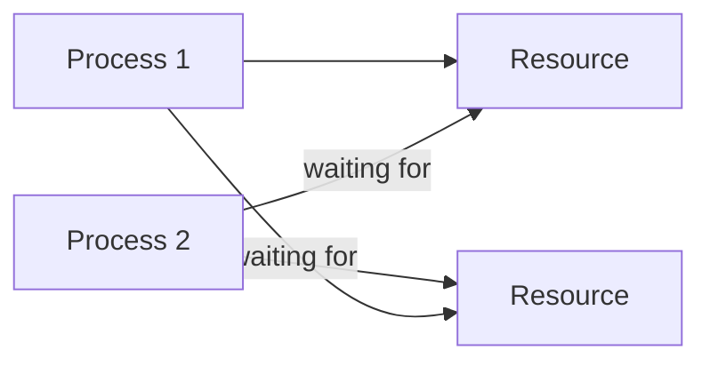

👉 This circular dependency leads to **deadlock**

***

#### 1.1.3 Waiting State and Resource Contention

**Waiting State**

A process enters a **waiting (blocked) state** when:

* It requests a resource
* The resource is currently unavailable

**Resource Contention**

Occurs when:

* Multiple processes request the **same resource simultaneously**

**Problem:**

* If processes keep waiting for each other → **deadlock**

**Example:**

* Process P1 holds Resource R1, waiting for R2
* Process P2 holds Resource R2, waiting for R1

👉 Neither can proceed

***

### 1.2 Example of Deadlock

***

#### 1.2.1 Bridge Crossing Problem

This is a **classic example** from your PPT.

**Scenario:**

* A narrow bridge allows traffic from **all four directions**
* Each section of the bridge is treated as a **resource**

**Situation:**

* Cars enter the bridge from all directions
* Each car occupies a section
* No car can move forward because another car blocks the path

**Visualization:**

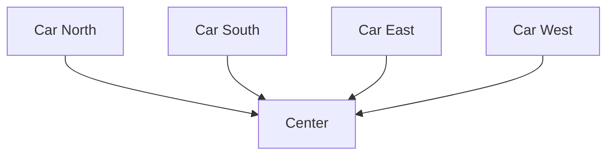

👉 All cars are stuck → **Deadlock**

**Resolution:**

* One or more cars must **back up (pre-emption)**
* Otherwise, system remains stuck forever

***

#### 1.2.2 Real-life Analogy

Deadlock situations occur in real life too:

**Examples:**

1. **Traffic Jam**
   * Vehicles block each other in a circular path
2. **Dining Table Problem**
   * People holding forks and waiting for others
3. **File Locking in Systems**
   * Two programs locking files and waiting for each other

**Simplified Example:**

* Person A has Book 1, needs Book 2
* Person B has Book 2, needs Book 1

👉 Both wait forever → Deadlock

***

#### 1.2.3 Starvation Possibility

Deadlock can also lead to **starvation** (important exam point).

**Starvation:**

> A condition where a process waits indefinitely because resources are continuously allocated to other processes.

**In Bridge Example:**

* Some cars may **never get a chance to move**
* Even if deadlock is resolved, some processes may still **never execute**

**Key Difference:**

| Concept    | Meaning                            |
| ---------- | ---------------------------------- |
| Deadlock   | All processes stuck                |
| Starvation | Some processes never get resources |

***

### 🔥 Important Exam Insights

* Deadlock = **circular waiting + no progress**
* Happens mainly in **resource sharing systems**
* Requires:
  * Multiple processes
  * Limited resources
  * Improper allocation
* Real-world examples are often asked (bridge, traffic, etc.)

***

## 2. System Model

The **System Model** describes how processes interact with resources in an operating system. It explains the **lifecycle of resource usage**, which is crucial to understanding how deadlocks occur.

In a multiprogramming system:

* Processes need resources to execute
* Resources are limited
* Improper handling of resources can lead to **deadlock**

***

### 2.1 Resource Usage Model

Every process follows a **three-step cycle** while using resources:

1. Request → 2. Use → 3. Release

This is the **core model** from your PPT and PDF.

***

#### 🔁 Overall Flow

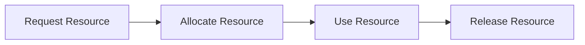

***

#### 2.1.1 Resource Request

A process must **request a resource** before using it.

**Key Points:**

* Request is made via:
  * System calls
  * OS resource manager
* If resource is:
  * ✅ Available → granted immediately
  * ❌ Not available → process enters **waiting state**

**Example:**

```c
// Requesting a resource (pseudo)
request(R1);
```

**Important Concept:**

* If multiple processes request the same resource → **contention occurs**

**Problem Case:**

* If processes keep requesting resources held by others → can lead to **deadlock**

***

#### 2.1.2 Resource Allocation

Once the resource is available, the OS **allocates it to the process**.

**Key Points:**

* Resource is assigned **exclusively or shared**
* Process enters **execution state**
* OS updates internal tables:
  * Allocation table
  * Resource availability

**Example:**

```c
// Resource allocated
use(R1);
```

**Types of Allocation:**

* **Exclusive Allocation** → only one process can use (e.g., printer)
* **Shared Allocation** → multiple processes can use (e.g., read-only file)

**Critical Issue:**

* If a process holds a resource and requests another → **hold & wait condition begins**

***

#### 2.1.3 Resource Release

After completing its task, a process must **release the resource**.

**Key Points:**

* Resource is returned to the system
* Becomes available for other processes
* OS updates resource status

**Example:**

```c
// Releasing resource
release(R1);
```

**Important Rule:**

> A process must release resources **after use**, otherwise system efficiency decreases

***

#### ⚠️ Problem if Not Released:

* Resource remains occupied
* Other processes wait
* Can lead to:
  * **Deadlock**
  * **Starvation**

***

### 🧠 Combined Example (Full Cycle)

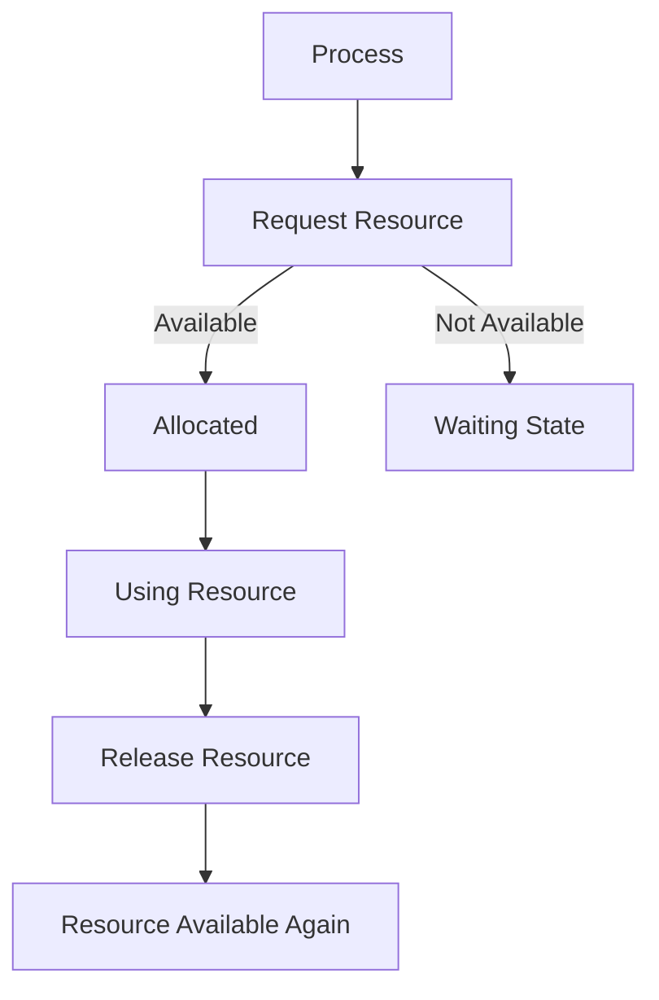

***

### 🔥 Important Exam Insights

* Every process follows:\
  👉 **Request → Allocate → Release**
* Deadlock occurs when:
  * Request is granted partially
  * Resources are not released
* This model is the **foundation** for:
  * Deadlock conditions
  * Banker’s Algorithm
  * Resource Allocation Graph

***

### ⚡ Key Observations

* Processes **must not hold resources indefinitely**
* OS must ensure:
  * Proper allocation
  * Fair scheduling
* Improper handling → **deadlock is inevitable**

***

## 3. Necessary Conditions for Deadlock

Deadlock occurs **only if all four conditions are true simultaneously**.\
These are called **necessary and sufficient conditions** (from your PPT + PDF).

> ❗ If **any one condition is removed → deadlock cannot occur**

***

### 🧠 Overview of All Conditions

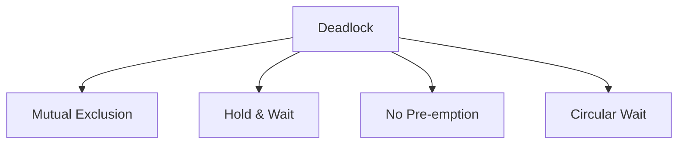

***

### 3.1 Mutual Exclusion

> At least one resource must be **non-shareable**, i.e., only one process can use it at a time.

***

#### 3.1.1 Non-shareable Resources

A resource is **non-shareable** if:

* Only one process can access it at a time
* Other processes must wait

**Why this causes deadlock:**

* If a process holds a resource exclusively
* Other processes cannot proceed → waiting begins

**Examples of non-shareable resources:**

* Printer
* CPU (in some cases)
* File locks
* I/O devices

***

#### 3.1.2 Examples (Printer, Devices)

**Example:**

* Process P1 is printing → holds printer
* Process P2 wants to print → must wait

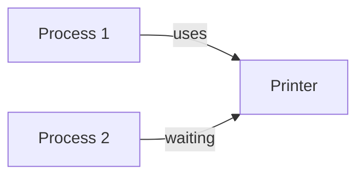

👉 This exclusive access creates the **first condition for deadlock**

***

### 3.2 Hold and Wait

> A process is holding at least one resource and waiting for additional resources held by other processes.

***

#### 3.2.1 Holding Resources While Waiting

**Situation:**

* Process P1 holds Resource R1
* P1 requests Resource R2 (held by P2)

**Key Idea:**

* Process does NOT release its current resource while waiting

***

#### 3.2.2 Resource Dependency

This creates **dependency between processes**

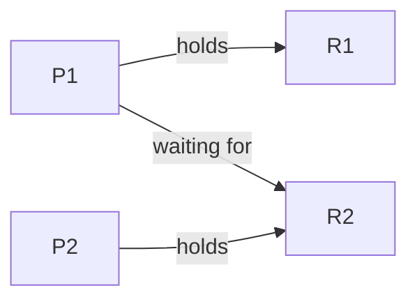

👉 P1 depends on P2 → dependency chain begins

**Why dangerous:**

* If all processes follow this → system gets stuck

***

### 3.3 No Pre-emption

> Resources cannot be forcibly taken away; they must be released voluntarily by the process.

***

#### 3.3.1 Voluntary Resource Release

* A process releases a resource **only after completing its task**
* OS cannot forcefully take it

**Example:**

```c
// Process holds resource until completion
use(resource);
release(resource); // voluntary
```

***

#### 3.3.2 Lack of Forceful Allocation

**Problem:**

* If a process is stuck, OS cannot:
  * Take its resource
  * Give it to another process

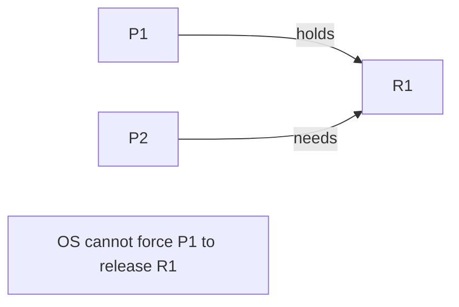

👉 This restriction allows deadlock to persist

***

### 3.4 Circular Wait

> A set of processes exist such that each process is waiting for a resource held by the next process in a circular chain.

***

#### 3.4.1 Circular Dependency Chain

**Structure:**

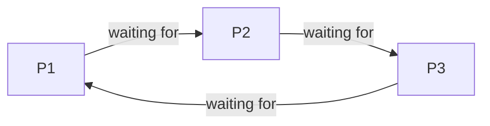

👉 Forms a **cycle**

***

#### 3.4.2 Process Waiting Cycle

**Real Example:**

* P1 holds R1 → needs R2
* P2 holds R2 → needs R3
* P3 holds R3 → needs R1

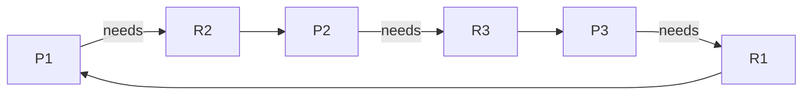

👉 This is a **deadlock cycle**

***

### 🔥 Final Summary (Very Important)

| Condition        | Meaning                | Why It Causes Deadlock   |
| ---------------- | ---------------------- | ------------------------ |
| Mutual Exclusion | Resource not shareable | Blocks other processes   |
| Hold & Wait      | Holding + waiting      | Creates dependency       |
| No Pre-emption   | Cannot take resources  | No recovery possible     |
| Circular Wait    | Cycle of processes     | System stuck permanently |

***

### 🎯 Key Exam Points

* All 4 conditions must exist **together**
* Removing ANY one condition prevents deadlock
* Most questions ask:
  * Define each condition
  * Give examples
  * Explain with diagram

***

### 💡 Memory Trick

👉 **M-H-N-C**

* M → Mutual Exclusion
* H → Hold & Wait
* N → No Pre-emption
* C → Circular Wait

***

## 4. Resource Allocation Graph (RAG)

A **Resource Allocation Graph (RAG)** is a graphical tool used to represent:

* Processes
* Resources
* Allocation and request relationships

It is widely used to **analyze and detect deadlocks** in a system.

***

### 🧠 Basic Idea

* Nodes represent **processes and resources**
* Edges represent **requests and allocations**

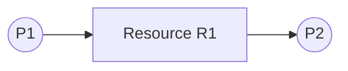

***

### 4.1 Components of RAG

***

#### 4.1.1 Processes (Pi)

* Represented as **circles**
* Denoted as:
  * P1, P2, P3, ..., Pn

**Meaning:**

* Each circle represents a **process in the system**


***

#### 4.1.2 Resources (Rj)

* Represented as **rectangles (boxes)**
* Denoted as:
  * R1, R2, R3, ..., Rn

**Meaning:**

* Each rectangle represents a **resource type**

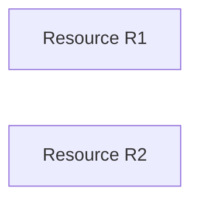

***

#### 4.1.3 Resource Instances

* A resource may have **multiple instances**
* Represented as **dots inside the resource box**

**Example:**

* R1 has 2 instances → shown as 2 dots

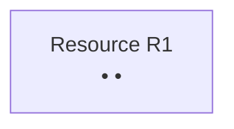

**Key Insight:**

* Important for determining:
  * **Guaranteed deadlock**
  * **Possible deadlock**

***

### 4.2 Edges in Graph

Edges define the **relationship between processes and resources**

***

#### 4.2.1 Request Edge (Process → Resource)

> A directed edge from process to resource

**Meaning:**

* Process is **requesting** a resource
* Process is in **waiting state**

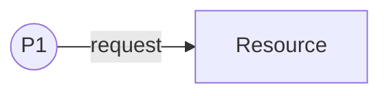

**Interpretation:**

* P1 wants R1 but does not have it yet

***

#### 4.2.2 Assignment Edge (Resource → Process)

> A directed edge from resource to process

**Meaning:**

* Resource is **allocated** to process
* Process is currently **holding the resource**

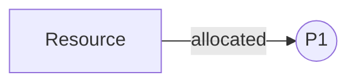

**Interpretation:**

* P1 is using R1

***

### 4.3 Graph Behavior

***

#### 4.3.1 Conversion of Request to Assignment Edge

**Process:**

1. Process requests resource → request edge
2. Resource becomes available
3. OS allocates resource → edge direction reverses

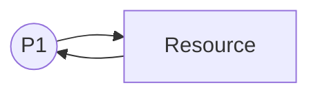

**Explanation:**

* Initially: P1 → R1 (request)
* After allocation: R1 → P1 (assignment)

***

#### 4.3.2 Directed Graph Nature

* RAG is a **directed graph**
* Direction of edges is **very important**

**Why?**

* Direction tells:
  * Who is waiting
  * Who is holding

**Important Rule:**

* Incorrect direction = wrong interpretation

***

### 4.4 Deadlock Detection using RAG

RAG is used to determine whether a system is in a **deadlock state**

***

#### 4.4.1 No Cycle → No Deadlock

> If there is **no cycle**, the system is **safe**

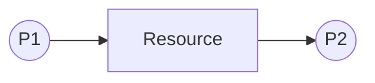

**Explanation:**

* No circular dependency
* Processes can complete

***

#### 4.4.2 Cycle with Single Instance → Deadlock

> If a cycle exists AND each resource has **only one instance** → **deadlock exists**

**Example:**

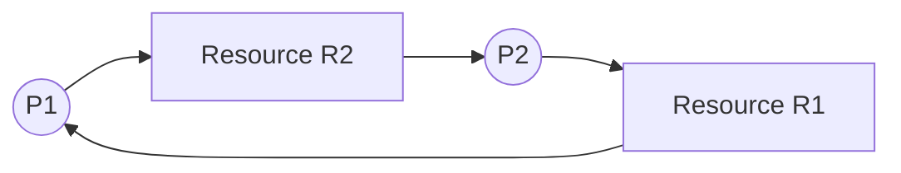

**Explanation:**

* P1 waiting for R2 (held by P2)
* P2 waiting for R1 (held by P1)

👉 Circular wait → **deadlock**

***

#### 4.4.3 Cycle with Multiple Instances → Possibility of Deadlock

> If a cycle exists AND resources have **multiple instances** → **deadlock may or may not occur**

**Example:**

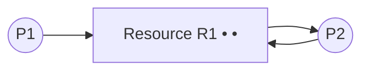

**Explanation:**

* Even though cycle exists:
  * Another instance may be available
  * Process may proceed

👉 So:

* Cycle ≠ guaranteed deadlock
* Only indicates **possibility**

***

### 🔥 Final Summary

| Case                       | Result            |
| -------------------------- | ----------------- |
| No cycle                   | No deadlock       |
| Cycle + single instance    | Deadlock          |
| Cycle + multiple instances | Possible deadlock |

***

### 🎯 Important Exam Points

* RAG is a **graphical representation**
* Two types of edges:
  * Request
  * Assignment
* Cycle detection is **key concept**
* Most common questions:
  * Draw RAG
  * Identify deadlock
  * Explain cycle condition

***

### 💡 Quick Memory Trick

👉 **RAG = Nodes + Edges + Cycle Check**

* Nodes → Process + Resource
* Edges → Request + Allocation
* Cycle → Deadlock indicator

***

## 5. Deadlock Handling Methods

Deadlocks are unavoidable in many systems, so operating systems use **different strategies to handle them**.

From your PPT + PDF, there are **four main approaches**:

1. Prevention
2. Avoidance
3. Detection & Recovery
4. Ignorance

***

### 🧠 Overview

```mermaid
flowchart TD
    A[Deadlock Handling] --> B[Prevention]
    A --> C[Avoidance]
    A --> D[Detection & Recovery]
    A --> E[Ignorance]
```

***

### 5.1 Prevention

Deadlock **prevention** ensures that deadlock **never occurs**.

***

#### 5.1.1 Concept of Prevention

> Design the system such that **at least one of the four necessary conditions is violated**

**Key Idea:**

* Deadlock requires all 4 conditions
* If we break even ONE → deadlock impossible

**Approach:**

* Restrict how processes request resources
* Control resource allocation strictly

***

#### 5.1.2 Violating Necessary Conditions

To prevent deadlock, we break these conditions:

| Condition        | Prevention Method             |
| ---------------- | ----------------------------- |
| Mutual Exclusion | Make resources shareable      |
| Hold & Wait      | Request all resources at once |
| No Pre-emption   | Forcefully take resources     |
| Circular Wait    | Impose resource ordering      |

**Example:**

* Force process to:
  * Request all resources at once
  * OR release resources before requesting new ones

👉 Prevents **Hold & Wait**

***

### ⚠️ Limitations of Prevention

* Reduces system efficiency
* Resources may remain unused
* Not practical in real systems

***

### 5.2 Avoidance

Deadlock **avoidance** allows deadlock possibility but **avoids unsafe situations**

***

#### 5.2.1 Safe State Concept

> A system is in a **safe state** if it can allocate resources to all processes without causing deadlock

**Safe State:**

* There exists a **safe sequence** of execution

```mermaid
flowchart LR
    P1 --> P2 --> P3 --> P4
```

**Unsafe State:**

* No safe sequence exists
* May lead to deadlock

👉 Important:

* Safe state → no deadlock
* Unsafe state → may lead to deadlock

***

#### 5.2.2 Decision-based Resource Allocation

**Key Idea:**

* OS decides **whether to grant a request or not**

**How?**

* Before allocation:
  * Check if system remains **safe**
* If safe → allocate
* If unsafe → deny request

```mermaid
flowchart TD
    A[Request Resource] --> B{Safe State?}
    B -->|Yes| C[Allocate]
    B -->|No| D[Wait]
```

**Requirements:**

* Must know:
  * Maximum resource needs of processes
* Used in:
  * **Banker’s Algorithm**

***

### ⚠️ Limitations of Avoidance

* Requires prior knowledge of resource needs
* Complex to implement
* May delay processes unnecessarily

***

### 5.3 Detection and Recovery

Deadlock is **allowed to occur**, then detected and resolved.

***

#### 5.3.1 Detecting Deadlock After Occurrence

**Key Idea:**

* System does not prevent or avoid deadlock
* Instead:
  * Periodically checks for deadlock

**Methods:**

* Resource Allocation Graph (cycle detection)
* Banker-like detection algorithm

```mermaid
flowchart TD
    A[System Running] --> B[Check Deadlock]
    B -->|Detected| C[Recover]
    B -->|Not Detected| A
```

***

#### 5.3.2 Recovery Mechanisms

Once deadlock is detected, system must **recover**

**Two main methods:**

***

**1. Process Termination**

* Kill one or more processes

**Types:**

* Abort all processes → fast but costly
* Abort one-by-one → less costly but slower

***

**2. Resource Pre-emption**

* Take resource from one process and give to another

**Issues:**

* **Victim selection**
  * Which process to choose?
* **Rollback**
  * Restart process from safe state
* **Starvation**
  * Same process repeatedly chosen as victim

***

### ⚠️ Limitations

* Loss of work
* High overhead
* Complex recovery

***

### 5.4 Ignorance

Also called the **Ostrich Algorithm**

***

#### 5.4.1 Ostrich Algorithm Concept

> Ignore deadlocks as if they do not exist

**Idea:**

* Assume deadlocks are **rare**
* Do nothing

**Why "Ostrich"?**

* Like an ostrich hides its head → ignores danger

***

#### 5.4.2 Practical Use Cases

Used in:

* General-purpose OS:
  * Linux
  * Windows

**Why?**

* Deadlocks are:
  * Rare
  * Not worth heavy overhead

**Example:**

* If deadlock occurs:
  * Restart system
  * Kill process manually

***

### 🔥 Final Comparison

| Method               | Approach             | Advantage          | Disadvantage        |
| -------------------- | -------------------- | ------------------ | ------------------- |
| Prevention           | Avoid conditions     | No deadlock        | Low efficiency      |
| Avoidance            | Safe state check     | Better utilization | Complex             |
| Detection & Recovery | Fix after occurrence | Flexible           | Overhead, data loss |
| Ignorance            | Do nothing           | Simple             | Risky               |

***

### 🎯 Important Exam Points

* 4 methods MUST be remembered
* Difference between:
  * Prevention vs Avoidance
* Safe state concept is very important
* Recovery methods (termination & pre-emption) often asked

***

### 💡 Memory Trick

👉 **P-A-D-I**

* P → Prevention
* A → Avoidance
* D → Detection & Recovery
* I → Ignorance

***

## 6. Deadlock Prevention Techniques

Deadlock prevention works by **eliminating at least one of the four necessary conditions**.\
In this section, we study **how each condition is broken in practice** (as covered in PPT + PDF).

***

### 🧠 Strategy Overview

```mermaid
flowchart TD
    A[Deadlock Prevention] --> B[Break Mutual Exclusion]
    A --> C[Break Hold & Wait]
    A --> D[Break No Pre-emption]
    A --> E[Break Circular Wait]
```

***

### 6.1 Mutual Exclusion Prevention

> Prevent deadlock by making resources **shareable** wherever possible

***

#### 6.1.1 Making Resources Shareable

**Idea:**

* Convert **non-shareable resources → shareable resources**

**How?**

* Use techniques like:
  * Spooling (for printers)
  * Read-only sharing
  * Virtual resources

**Example:**

* Instead of direct printer access:
  * Store print jobs in queue (spooling)
  * Printer processes jobs sequentially

```mermaid
flowchart LR
    P1 --> Queue
    P2 --> Queue
    Queue --> Printer
```

**Benefit:**

* Multiple processes can **logically share** the resource

***

#### 6.1.2 Limitations of Hardware Constraints

**Problem:**

Some resources **cannot be shared**, such as:

* Printer (physical device)
* CD/DVD writer
* CPU registers
* I/O devices

**Conclusion:**

> Mutual exclusion cannot be completely eliminated

***

### ⚠️ Key Insight

* This technique is **limited in real systems**
* Only applicable to **some resources**

***

### 6.2 Hold and Wait Prevention

> Ensure that a process **does not hold resources while waiting for others**

***

#### 6.2.1 Conservative Approach (All Resources at Start)

**Idea:**

* Process must request **all required resources at once**

**Rule:**

> Process starts execution **only if all resources are available**

```mermaid
flowchart TD
    A[Request All Resources] --> B{All Available?}
    B -->|Yes| C[Start Execution]
    B -->|No| D[Wait]
```

**Advantages:**

* No partial allocation → no hold & wait

**Disadvantages:**

* Poor resource utilization
* Hard to predict all resource needs
* May cause long waiting times

***

#### 6.2.2 Resource Release Before Request

**Idea:**

* Before requesting new resources:
  * Process must **release all currently held resources**

**Flow:**

```mermaid
flowchart TD
    A[Holding Resources] --> B[Release All]
    B --> C[Request New Resources]
```

**Advantages:**

* Eliminates hold & wait

**Disadvantages:**

* Inefficient (frequent release & request)
* Performance overhead

***

#### 6.2.3 Timeout Mechanism

**Idea:**

* Limit how long a process can wait

**Rule:**

> If waiting exceeds a time limit → release all resources

**Example:**

```c
if(wait_time > MAX_TIME) {
    release_all_resources();
}
```

**Advantages:**

* Prevents indefinite waiting

**Disadvantages:**

* May lead to:
  * Unnecessary rollbacks
  * Starvation

***

### 6.3 No Pre-emption Prevention

> Allow the system to **forcefully take resources** from processes

***

#### 6.3.1 Forceful Resource Pre-emption

**Idea:**

* If a process is waiting for a resource:
  * OS can **take away resources** from other processes

**Flow:**

```mermaid
flowchart TD
    P1[Process Holding Resource] --> R[Resource]
    P2[Waiting Process] --> R
    OS[OS Pre-empts Resource] --> P2
```

**Use Case:**

* High-priority or system processes

***

#### 6.3.2 Victim Selection Strategy

**Problem:**

* Which process should lose its resource?

**Criteria:**

* Priority of process
* Amount of work done
* Number of resources held
* Cost of rollback

**Example:**

* Select process with:
  * Lowest priority
  * Least progress

***

### ⚠️ Issues with Pre-emption

* Data inconsistency
* Rollback required
* Performance overhead

***

### 6.4 Circular Wait Prevention

> Prevent formation of **circular chain of processes**

***

#### 6.4.1 Resource Ordering Technique

**Idea:**

* Assign a **unique number to each resource**

**Example:**

| Resource | Number |
| -------- | ------ |
| R1       | 1      |
| R2       | 2      |
| R3       | 3      |

**Rule:**

> Processes must request resources in **increasing or decreasing order**

***

#### 6.4.2 Increasing/Decreasing Resource Request Order

**Increasing Order Example:**

```mermaid
flowchart LR
    P1 --> R1
    P1 --> R2
    P1 --> R3
```

**Rule:**

* If process needs lower-numbered resource:
  * Must release higher-numbered ones first

**Why it works:**

* Prevents circular dependency
* Breaks **cycle formation**

***

### 🔥 Final Summary

| Condition Broken | Technique                            | Key Idea       |
| ---------------- | ------------------------------------ | -------------- |
| Mutual Exclusion | Make shareable                       | Limited use    |
| Hold & Wait      | Request all / release before request | Inefficient    |
| No Pre-emption   | Force resource removal               | Complex        |
| Circular Wait    | Resource ordering                    | Most practical |

***

### 🎯 Important Exam Points

* Prevention = **break conditions**
* Most practical method:\
  👉 **Circular Wait Prevention (resource ordering)**
* Hold & Wait prevention often asked in detail
* Victim selection is important in pre-emption

***

### 💡 Memory Trick

👉 **M-H-N-C → Break any one**

* M → Make shareable
* H → Hold all / release all
* N → No pre-emption → allow pre-emption
* C → Circular → ordering

***

## 7. Deadlock Avoidance

Deadlock **avoidance** is a dynamic approach where the system **decides at runtime** whether to grant a resource request based on the **current state** of the system.

> Instead of preventing conditions, it **avoids entering unsafe states**

***

### 🧠 Core Idea

* Not all states lead to deadlock
* Only **unsafe states** are dangerous
* OS allows execution **only if the system remains safe**

```mermaid
flowchart TD
    A[Resource Request] --> B{Will system remain SAFE?}
    B -->|Yes| C[Grant Request]
    B -->|No| D[Deny / Wait]
```

***

### 7.1 Concept of Avoidance

***

#### 7.1.1 Preventing Unsafe States

> A system avoids deadlock by **never entering an unsafe state**

***

#### 🔹 Safe vs Unsafe State

**✅ Safe State:**

* There exists a **safe sequence**
* All processes can complete execution

**❌ Unsafe State:**

* No guaranteed safe sequence
* May lead to deadlock (not always immediately)

***

#### 🔁 Visualization

```mermaid
flowchart LR
    Safe[Safe State] --> Unsafe[Unsafe State]
    Unsafe --> Deadlock[Deadlock Possible]
```

👉 Important:

* All deadlocks occur in **unsafe states**
* But not all unsafe states are deadlocks

***

#### 🔹 Safe Sequence

> A sequence of processes such that each process can complete using available + released resources

**Example:**

P1 → P2 → P3 → P4

* P1 completes → releases resources
* P2 uses released resources → completes
* And so on

***

#### 🔹 Why Avoid Unsafe States?

* Once system enters unsafe state:
  * OS loses control
  * Deadlock may occur anytime

***

### 7.1.2 Resource Allocation Decision Making

> OS checks every request **before granting it**

***

#### Decision Steps:

1. Process requests resource
2. OS simulates allocation
3. Check if system remains **safe**
4. If safe → allocate
5. If unsafe → deny request

***

#### 🔁 Flow Diagram

```mermaid
flowchart TD
    A[Process Requests Resource] --> B[Simulate Allocation]
    B --> C{Safe State?}
    C -->|Yes| D[Grant Resource]
    C -->|No| E[Make Process Wait]
```

***

#### 🔹 Key Requirement

* System must know:
  * **Maximum resource needs** of each process in advance

👉 This is why:

* Avoidance is used with **Banker’s Algorithm**

***

### ⚠️ Limitations

* Requires prior knowledge of resource usage
* Complex calculations
* Not suitable for all systems

***

### 7.2 Resource Allocation State

To decide safely, OS maintains **complete information about resources**

***

#### 7.2.1 Available Resources

> Number of resources currently **free and available**

**Representation:**

* Vector: `Available[m]`

**Example:**

```
Available = [3, 2, 1]
```

Means:

* 3 instances of Resource A
* 2 of B
* 1 of C

***

#### 7.2.2 Allocated Resources

> Resources currently **assigned to each process**

**Representation:**

* Matrix: `Allocation[n][m]`

**Example:**

```
P1: [1, 0, 2]
P2: [0, 1, 1]
```

**Meaning:**

* P1 holds resources
* P2 holds different resources

***

#### 7.2.3 Maximum Requirements

> Maximum resources a process may need during execution

**Representation:**

* Matrix: `Max[n][m]`

**Example:**

```
P1: [3, 2, 2]
P2: [1, 2, 2]
```

***

### 🔁 Derived Concept: Need Matrix

> Remaining resources required by each process

#### Formula:

```
Need[i][j] = Max[i][j] - Allocation[i][j]
```

***

#### Example:

```
Max = [3,2,2]
Allocation = [1,0,2]

Need = [2,2,0]
```

***

### 🧠 Combined View

```mermaid
flowchart TD
    A[Available] --> Decision
    B[Allocation] --> Decision
    C[Max] --> Decision
    Decision --> SafeCheck[Safe State Check]
```

***

### 🔥 Final Summary

| Concept      | Meaning               |
| ------------ | --------------------- |
| Safe State   | No deadlock possible  |
| Unsafe State | May lead to deadlock  |
| Available    | Free resources        |
| Allocation   | Resources in use      |
| Max          | Maximum demand        |
| Need         | Remaining requirement |

***

### 🎯 Important Exam Points

* Avoidance = **safe state checking**
* Safe sequence is **very important**
* Must know:
  * Available
  * Allocation
  * Max
  * Need
* Strong link to:\
  👉 **Banker’s Algorithm**

***

### 💡 Memory Trick

👉 **A-A-M-N**

* A → Available
* A → Allocation
* M → Max
* N → Need

***

## 8. Safe State

The concept of **Safe State** is central to **Deadlock Avoidance**.\
It helps the operating system decide whether granting a resource request will keep the system **deadlock-free**.

***

### 🧠 Core Idea

> A system is safe if it can allocate resources to all processes in some order **without causing deadlock**

***

### 🔁 State Classification

```mermaid
flowchart LR
    Safe[Safe State] --> Unsafe[Unsafe State]
    Unsafe --> Deadlock[Deadlock May Occur]
```

👉 Important:

* All **deadlocks occur in unsafe states**
* But **not all unsafe states are deadlocks**

***

### 8.1 Definition of Safe State

***

#### 8.1.1 Safe Resource Allocation

> A resource allocation is safe if the system can satisfy all processes **in some sequence**

**Meaning:**

* Even if all processes request their **maximum resources**
* The system can still complete execution

**Condition:**

There exists a sequence:

P₁ → P₂ → P₃ → ... → Pₙ

Such that each process can:

* Get required resources
* Execute
* Release resources

***

#### 🔹 Formal Definition (from PDF)

A state is safe if:

> There exists a sequence of processes such that each process can be allocated its remaining resources using currently available resources + resources released by previous processes

***

#### 8.1.2 Deadlock-Free Guarantee

**Key Insight:**

* If system is in **safe state**:
  * Deadlock will **never occur**

**Why?**

* There is always at least **one valid execution order**

```mermaid
flowchart TD
    Start --> P1
    P1 --> Release1[Release Resources]
    Release1 --> P2
    P2 --> Release2
    Release2 --> P3
    P3 --> End
```

👉 Each process completes successfully

***

### 8.2 Safe Sequence

***

#### 8.2.1 Process Execution Order

> A **safe sequence** is an order in which processes can complete without deadlock

**Example:**

Processes: P1, P2, P3

Safe Sequence:

P1 → P2 → P3

**Explanation:**

* P1 gets resources → completes → releases
* P2 uses released resources → completes
* P3 completes

***

#### 8.2.2 Resource Release and Reallocation

**Step-by-step flow:**

```mermaid
flowchart TD
    A[Available Resources] --> B[P1 Executes]
    B --> C[Resources Released]
    C --> D[P2 Executes]
    D --> E[Resources Released]
    E --> F[P3 Executes]
```

**Key Idea:**

* Resources are **reused dynamically**
* Each process depends on:
  * Available + previously released resources

***

#### 🔹 Example (Conceptual)

Initial Available = 3

| Process | Need |
| ------- | ---- |
| P1      | 2    |
| P2      | 1    |
| P3      | 2    |

**Safe Sequence:**

1. P2 executes → releases 1
2. Available = 4
3. P1 executes → releases 2
4. Available = 6
5. P3 executes

👉 System completes → **safe**

***

### 8.3 Unsafe State

***

#### 8.3.1 Lack of Safe Sequence

> A state is unsafe if **no safe sequence exists**

**Meaning:**

* System cannot guarantee completion of all processes
* OS cannot find a valid execution order

***

#### 8.3.2 Possibility of Deadlock

**Important:**

* Unsafe state ≠ deadlock
* But unsafe state → **risk of deadlock**

```mermaid
flowchart TD
    Unsafe --> MaybeDeadlock[Deadlock May Occur]
    MaybeDeadlock --> SystemStuck[System May Freeze]
```

***

#### 🔹 Example:

Available = 1

| Process | Need |
| ------- | ---- |
| P1      | 2    |
| P2      | 2    |

**Problem:**

* Neither process can proceed
* No safe sequence exists

👉 System is **unsafe**

***

### 🔥 Final Summary

| State    | Meaning              | Result            |
| -------- | -------------------- | ----------------- |
| Safe     | Safe sequence exists | No deadlock       |
| Unsafe   | No safe sequence     | Deadlock possible |
| Deadlock | Circular waiting     | System stuck      |

***

### 🎯 Important Exam Points

* Safe state is **core concept in avoidance**
* Safe sequence must be clearly explained
* Unsafe ≠ deadlock (very important)
* Questions often ask:
  * Identify safe/unsafe state
  * Find safe sequence

***

### 💡 Memory Trick

👉 **Safe = Sequence Exists**

* If sequence exists → safe
* If not → unsafe

***

## 9. Banker’s Algorithm

The **Banker’s Algorithm** is a **deadlock avoidance algorithm** that ensures the system **never enters an unsafe state**.

It is one of the most important algorithms in Operating Systems and is heavily asked in exams.

***

### 9.1 Introduction

***

#### 9.1.1 Concept and Purpose

> Banker’s Algorithm checks whether a resource request can be granted **without causing deadlock**

**Key Idea:**

* Before allocating resources:
  * Simulate allocation
  * Check if system remains **safe**

**Purpose:**

* Avoid deadlock dynamically
* Maintain system in **safe state**

***

#### 9.1.2 Real-life Banking Analogy

**Analogy:**

* Bank has limited money (resources)
* Customers (processes) request loans
* Bank ensures:
  * It can satisfy all customers eventually

**Rule:**

> Bank gives loan only if it can guarantee all customers will be served

***

#### 🔁 Visualization

```mermaid
flowchart TD
    A[Customer Requests Loan] --> B[Bank Checks Safety]
    B -->|Safe| C[Grant Loan]
    B -->|Unsafe| D[Deny Loan]
```

***

### 9.2 Data Structures

The algorithm uses **four key data structures**

***

#### 9.2.1 Available Vector

> Number of available instances of each resource

**Representation:**

```
Available[m]
```

**Example:**

```
Available = [3, 2, 1]
```

***

#### 9.2.2 Max Matrix

> Maximum demand of each process

**Representation:**

```
Max[n][m]
```

**Example:**

```
P1: [3, 2, 2]
P2: [1, 2, 2]
```

***

#### 9.2.3 Allocation Matrix

> Resources currently allocated to processes

**Representation:**

```
Allocation[n][m]
```

**Example:**

```
P1: [1, 0, 2]
P2: [0, 1, 1]
```

***

#### 9.2.4 Need Matrix

> Remaining resources required by each process

**Formula:**

```
Need[i][j] = Max[i][j] - Allocation[i][j]
```

**Example:**

```
Max = [3,2,2]
Allocation = [1,0,2]

Need = [2,2,0]
```

***

### 🧠 Combined View

```mermaid
flowchart TD
    A[Max] --> C[Need]
    B[Allocation] --> C
    C --> Decision[Safety Check]
    D[Available] --> Decision
```

***

### 9.3 Safety Algorithm

Used to check if system is in **safe state**

***

#### 9.3.1 Work and Finish Vectors Initialization

* Work = Available
* Finish\[i] = false for all processes

```
Work = Available
Finish[i] = false
```

***

#### 9.3.2 Process Selection Condition

Find a process `i` such that:

```
Finish[i] == false AND Need[i] ≤ Work
```

**Meaning:**

* Process can complete with available resources

***

#### 9.3.3 Resource Release Simulation

If process `i` is selected:

```
Work = Work + Allocation[i]
Finish[i] = true
```

**Meaning:**

* Process completes
* Releases resources

***

#### 9.3.4 Safe State Verification

**Condition:**

* If all `Finish[i] == true` → **SAFE**
* Else → **UNSAFE**

***

#### 🔁 Flow

```mermaid
flowchart TD
    A[Initialize Work & Finish] --> B[Find Process with Need ≤ Work]
    B -->|Found| C[Simulate Execution]
    C --> D[Release Resources]
    D --> B
    B -->|Not Found| E{All Finished?}
    E -->|Yes| F[Safe State]
    E -->|No| G[Unsafe State]
```

***

### 9.4 Resource Request Algorithm

Used when a process **requests resources**

***

#### 9.4.1 Request Validation (Request ≤ Need)

Check:

```
Request[i] ≤ Need[i]
```

* If not → error (process exceeded max claim)

***

#### 9.4.2 Availability Check (Request ≤ Available)

Check:

```
Request[i] ≤ Available
```

* If not → process must wait

***

#### 9.4.3 Temporary Allocation

Pretend allocation is done:

```
Available = Available - Request
Allocation[i] = Allocation[i] + Request
Need[i] = Need[i] - Request
```

***

#### 9.4.4 Safety Check After Allocation

* Run **Safety Algorithm**
* If safe → grant request
* If unsafe → rollback

***

#### 🔁 Flow

```mermaid
flowchart TD
    A[Process Requests Resource] --> B{Request ≤ Need?}
    B -->|No| Error
    B -->|Yes| C{Request ≤ Available?}
    C -->|No| Wait
    C -->|Yes| D[Temporary Allocation]
    D --> E[Run Safety Algorithm]
    E -->|Safe| F[Grant Request]
    E -->|Unsafe| G[Rollback]
```

***

### 9.5 Examples of Banker’s Algorithm

***

#### 9.5.1 Allocation Table Analysis

**Given:**

| Process | Allocation | Max      | Need     |
| ------- | ---------- | -------- | -------- |
| P1      | \[1,0,2]   | \[3,2,2] | \[2,2,0] |
| P2      | \[0,1,1]   | \[1,2,2] | \[1,1,1] |

Available = \[3,2,1]

***

#### 9.5.2 Safe/Unsafe Decision Making

**Step-by-step:**

1. Check P2:
   * Need ≤ Available → YES
   * Execute P2 → release resources
2. Update Available
3. Check P1:
   * Now possible → execute

👉 Safe sequence exists → system is **safe**

***

### 🔥 Final Summary

| Component  | Meaning          |
| ---------- | ---------------- |
| Available  | Free resources   |
| Max        | Maximum demand   |
| Allocation | Resources held   |
| Need       | Remaining demand |

***

### 🎯 Important Exam Points

* Banker’s Algorithm = **Deadlock Avoidance**
* Must know:
  * Data structures
  * Safety Algorithm
  * Request Algorithm
* Very common:
  * Solve numericals
  * Find safe sequence

***

### 💡 Memory Trick

👉 **A-M-A-N**

* A → Available
* M → Max
* A → Allocation
* N → Need

***

## 10. Deadlock Detection

Deadlock **detection** is an approach where the system:

> **Allows deadlock to occur**, then detects it and takes corrective action.

Unlike prevention or avoidance:

* No restrictions are imposed beforehand
* System runs freely
* Deadlock is handled **after it happens**

***

### 🧠 Core Idea

```mermaid
flowchart TD
    A[System Running Normally] --> B[Deadlock Occurs]
    B --> C[Detection Algorithm]
    C --> D[Recovery Mechanism]
```

***

### 10.1 Detection Concept

***

#### 10.1.1 Identifying Deadlocks After Occurrence

> System periodically checks whether a deadlock exists

**Key Idea:**

* Deadlock is not prevented
* System detects:
  * Circular waiting
  * Resource blocking

**Methods used:**

* Resource Allocation Graph (RAG)
* Wait-for Graph
* Banker-like detection algorithm

***

#### 🔹 When Detection Happens

* Periodically (every few seconds)
* Or when:
  * CPU usage drops
  * Processes are stuck

***

#### 10.1.2 Performance Overhead Consideration

**Problem:**

* Detection requires:
  * Scanning system state
  * Running algorithms

**Overhead includes:**

* CPU time
* Memory usage
* System slowdown

***

#### ⚖️ Trade-off

| Advantage       | Disadvantage   |
| --------------- | -------------- |
| Flexible        | High overhead  |
| No restrictions | Detection cost |

***

### 10.2 Single Instance Resource Detection

Used when **each resource has only one instance**

***

#### 10.2.1 Wait-for Graph Concept

> A simplified version of Resource Allocation Graph

**Idea:**

* Remove resource nodes
* Only keep process nodes
* Show **which process is waiting for which**

***

#### 🔁 Example

```mermaid
flowchart LR
    P1 --> P2
    P2 --> P3
    P3 --> P1
```

👉 P1 waits for P2\
👉 P2 waits for P3\
👉 P3 waits for P1

***

#### 10.2.2 Graph Construction

**Steps:**

1. Start from Resource Allocation Graph
2. Remove resource nodes
3. Replace edges:

* If P1 waits for resource held by P2\
  → Create edge: P1 → P2

***

#### 🔁 Conversion

```mermaid
flowchart LR
    P1 --> R1 --> P2
```

Becomes:

```mermaid
flowchart LR
    P1 --> P2
```

***

#### 10.2.3 Cycle Detection

> Deadlock exists if there is a **cycle in the wait-for graph**

**Rule:**

* Cycle present → **Deadlock**
* No cycle → **No Deadlock**

***

#### 🔁 Example

```mermaid
flowchart LR
    P1 --> P2
    P2 --> P3
    P3 --> P1
```

👉 Cycle → Deadlock confirmed

***

### 10.3 Multiple Instance Resource Detection

Used when resources have **multiple instances**

***

#### 10.3.1 Modified Banker’s Algorithm

> Similar to Banker’s Safety Algorithm, but used for detection

**Difference:**

* Banker’s → Avoidance
* Detection Algorithm → Identify deadlock

***

#### 10.3.2 Finish Vector Logic

**Initialization:**

* If Allocation\[i] ≠ 0 → Finish\[i] = false
* If Allocation\[i] = 0 → Finish\[i] = true

**Why?**

* Processes with no resources:
  * Cannot be part of deadlock

***

#### 🔁 Algorithm Steps

1. Set:
   * Work = Available
2. Find process `i` such that:
   * Finish\[i] = false
   * Need\[i] ≤ Work
3. If found:
   * Work = Work + Allocation\[i]
   * Finish\[i] = true
4. Repeat

***

#### 10.3.3 Identification of Deadlocked Processes

**Final Condition:**

* If any process has:
  * Finish\[i] = false

👉 That process is **deadlocked**

***

#### 🔁 Flow

```mermaid
flowchart TD
    A[Initialize Work & Finish] --> B[Find Process with Need ≤ Work]
    B -->|Found| C[Simulate Completion]
    C --> D[Release Resources]
    D --> B
    B -->|Not Found| E[Check Finish Vector]
    E --> F[Processes with Finish = false are Deadlocked]
```

***

### 10.4 Detection Frequency

How often should the system check for deadlocks?

***

#### 10.4.1 Frequent Detection Approach

> Run detection algorithm frequently

**Advantages:**

* Detect deadlock early
* Fewer processes involved

**Disadvantages:**

* High overhead
* Performance degradation

***

#### 10.4.2 On-demand Detection Approach

> Run detection only when needed

**Trigger Conditions:**

* CPU utilization drops
* Processes blocked for long time

**Advantages:**

* Low overhead
* Efficient

**Disadvantages:**

* Deadlock may involve many processes
* Harder recovery

***

#### 10.4.3 Trade-offs

| Approach  | Advantage       | Disadvantage   |
| --------- | --------------- | -------------- |
| Frequent  | Early detection | High overhead  |
| On-demand | Efficient       | Late detection |

***

### 🔥 Final Summary

| Method              | Used For           | Key Idea        |
| ------------------- | ------------------ | --------------- |
| Wait-for Graph      | Single instance    | Cycle detection |
| Detection Algorithm | Multiple instance  | Finish vector   |
| Frequency Control   | Performance tuning | Trade-off       |

***

### 🎯 Important Exam Points

* Detection = **after deadlock occurs**
* Wait-for graph → single instance
* Modified Banker’s → multiple instance
* Finish\[i] = false → deadlocked process
* Frequency question is very common

***

### 💡 Memory Trick

👉 **Detect → Find Cycle / Find Finish = False**

* Cycle → Deadlock
* Finish false → Deadlocked process

***

## 11. Deadlock Recovery

Once a deadlock is **detected**, the system must take action to **break the deadlock and restore normal execution**.

> Recovery is the process of **freeing resources and allowing processes to proceed**

***

### 🧠 Core Idea

```mermaid
flowchart TD
    A[Deadlock Detected] --> B[Choose Recovery Method]
    B --> C[Process Termination]
    B --> D[Resource Pre-emption]
```

***

### 11.1 Recovery Techniques

There are **two main techniques** (from PPT + PDF):

1. Process Termination
2. Resource Pre-emption

***

#### 11.1.1 Process Termination

> Eliminate deadlock by **killing processes**

**Idea:**

* Remove one or more processes from the system
* This releases their resources

***

#### 11.1.2 Resource Pre-emption

> Take resources from processes and give them to others

**Idea:**

* Temporarily interrupt processes
* Reassign resources to break the cycle

***

### 11.2 Process Termination

***

#### 11.2.1 Abort All Processes

> Terminate all processes involved in deadlock

***

**Advantages:**

* Simple
* Immediate resolution

**Disadvantages:**

* Loss of all work done
* High cost (recomputation required)

***

#### 🔁 Flow

```mermaid
flowchart TD
    A[Deadlock Detected] --> B[Abort All Processes]
    B --> C[All Resources Released]
    C --> D[System Recovers]
```

***

#### 11.2.2 Abort One Process at a Time

> Terminate processes **one by one** until deadlock is resolved

***

**Steps:**

1. Select one process
2. Terminate it
3. Check if deadlock is resolved
4. Repeat if necessary

***

#### 🔁 Flow

```mermaid
flowchart TD
    A[Deadlock Detected] --> B[Select Process]
    B --> C[Terminate Process]
    C --> D[Check Deadlock]
    D -->|Still Exists| B
    D -->|Resolved| E[System Normal]
```

***

**Advantages:**

* Less work lost
* More controlled

**Disadvantages:**

* Time-consuming
* Requires repeated detection checks

***

### 🔍 Process Selection Criteria

When choosing which process to terminate:

* Priority of process
* Amount of computation completed
* Resources held
* Number of resources needed to complete
* Process importance

***

### 11.3 Resource Pre-emption

***

#### 11.3.1 Victim Selection

> Choose a process whose resources will be taken away

***

**Criteria:**

* Lowest priority
* Least progress made
* Minimum cost to restart
* Fewer resources held

***

#### 🔁 Example

```mermaid
flowchart LR
    P1 -->|holds| R1
    P2 -->|needs| R1
    OS[OS selects victim P1] --> Take[Take R1]
    Take --> Give[Give to P2]
```

***

#### 11.3.2 Rollback Mechanism

> After pre-emption, process must be **rolled back to a safe state**

***

**Idea:**

* Process state is restored to a previous checkpoint
* Execution restarts from that point

***

#### 🔁 Flow

```mermaid
flowchart TD
    A[Pre-empt Resource] --> B[Rollback Process]
    B --> C[Restart Execution]
```

***

**Important:**

* Requires:
  * Checkpointing mechanism
  * State saving

***

#### 11.3.3 Starvation Issue

> A process may repeatedly lose resources and **never complete**

***

**Problem:**

* Same process is chosen as victim again and again

```mermaid
flowchart TD
    P1 --> Victim
    Victim --> P1
    P1 --> Victim
```

👉 Infinite loop → starvation

***

**Solution:**

* Limit number of times a process can be pre-empted
* Use fair selection policies

***

### 🔥 Final Summary

| Technique   | Method             | Advantage  | Disadvantage |
| ----------- | ------------------ | ---------- | ------------ |
| Abort All   | Kill all processes | Fast       | High loss    |
| Abort One   | Kill one-by-one    | Controlled | Slow         |
| Pre-emption | Take resources     | Flexible   | Complex      |

***

### 🎯 Important Exam Points

* Recovery = **after detection**
* Two main methods:
  * Termination
  * Pre-emption
* Victim selection is very important
* Starvation is a key issue in pre-emption
* Rollback concept often asked

***

### 💡 Memory Trick

👉 **T-P-R-S**

* T → Termination
* P → Pre-emption
* R → Rollback
* S → Starvation

***

<h2 align="center"><a data-footnote-ref href="#user-content-fn-1">END</a></h2>

[^1]: This is the end
