# Unit - 5
:::info[TITLE]
## Memory Management & Virtual Memory
:::

## 1. Memory Management Basics

***

### 1.1 Introduction to Memory Management

Memory Management is one of the **core functions of an Operating System**, responsible for managing and coordinating the use of **main memory (RAM)** among multiple processes.

***

#### 1.1.1 Definition of Memory Management

> Memory Management is the process of **controlling and coordinating computer memory**, assigning portions of memory to programs and ensuring efficient utilization.

**Key Points:**

* Manages allocation and deallocation of memory
* Keeps track of memory usage
* Ensures no process interferes with another

**From your PPT:**

* It is a **key characteristic of OS resource management**

***

#### 1.1.2 Role of OS in Resource Management

The OS acts as a **memory manager** and performs:

**1. Allocation**

* Assigns memory to processes when required

**2. Deallocation**

* Frees memory after process execution

**3. Protection**

* Prevents unauthorized access between processes

**4. Address Mapping**

* Converts logical → physical addresses

**5. Optimization**

* Ensures efficient memory usage

***

#### 🔁 OS Memory Handling Flow

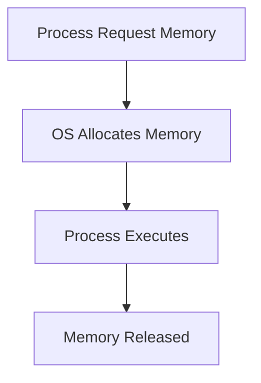

***

#### 1.1.3 Importance of Main Memory (RAM)

Main memory (RAM) is:

> The **primary working area** where programs are executed

**Key Points:**

* All active processes run in RAM
* Faster than secondary storage
* Limited in size → needs efficient management

**From PPT:**

* Most programs execute in **main memory**
* It is a **critical factor in system performance**

***

#### ⚠️ Why Memory Management is Important

* Prevents memory conflicts
* Enables multiprogramming
* Improves CPU utilization
* Avoids memory wastage

***

### 1.2 Memory Hierarchy

***

#### 1.2.1 Concept of Memory Hierarchy

> Memory hierarchy organizes different types of memory based on **speed, cost, and size**

**Goal:**

* Achieve **fast access + low cost**

***

#### 🔁 Memory Hierarchy Structure

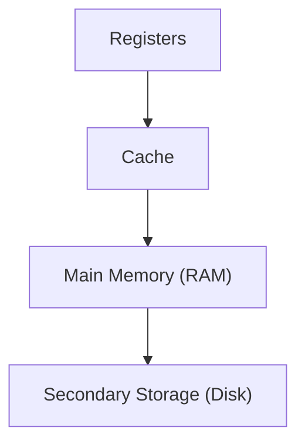

***

#### 1.2.2 Minimizing Access Time

Memory hierarchy is designed to:

> Reduce **average memory access time**

**How?**

* Frequently used data → stored in **faster memory (cache)**
* Less used data → stored in **slower memory (disk)**

**Concept Used:**

* **Locality of Reference** (important for later topics)

***

#### Example:

* CPU first checks:
  1. Cache
  2. RAM
  3. Disk

👉 This reduces delay

***

#### 1.2.3 Levels of Memory

| Level                   | Speed     | Cost    | Size     |
| ----------------------- | --------- | ------- | -------- |
| Registers               | Fastest   | Highest | Smallest |
| Cache                   | Very Fast | High    | Small    |
| Main Memory (RAM)       | Moderate  | Medium  | Medium   |
| Secondary Memory (Disk) | Slow      | Low     | Large    |

***

#### 🧠 Key Insight

* Higher level → faster, expensive, small
* Lower level → slower, cheaper, large

***

### 🔥 Final Summary

* Memory Management = **control + allocation of RAM**
* OS ensures:
  * Efficiency
  * Protection
  * Proper allocation
* Memory hierarchy balances:
  * **Speed vs Cost vs Size**

***

### 🎯 Important Exam Points

* Definition of memory management (must learn)
* Role of OS in memory
* Memory hierarchy diagram (very common)
* RAM importance

***

## 2. Addressing and Mapping

Addressing and mapping define **how a program’s addresses (generated by CPU)** are converted into **actual memory locations** where data resides.

This is essential because:

* Programs use **logical (virtual) addresses**
* Memory hardware uses **physical addresses**

***

### 2.1 Logical and Physical Address

***

#### 2.1.1 Logical Address (CPU Generated)

> A **logical address** (also called virtual address) is the address generated by the CPU during program execution.

**Key Points:**

* Generated by **user program**
* Exists in **logical address space**
* Not directly used by memory hardware

**Example:**

* CPU generates address like: `1000`

👉 This is **not the real memory location**

***

#### 2.1.2 Physical Address (Actual Memory Location)

> A **physical address** is the actual location in main memory (RAM)

**Key Points:**

* Used by **memory unit**
* Represents real memory location
* Obtained after **address translation**

**Example:**

* Logical → 1000
* Physical → 5420

***

#### 2.1.3 Logical vs Physical Address Space

| Feature         | Logical Address | Physical Address |
| --------------- | --------------- | ---------------- |
| Generated by    | CPU             | MMU              |
| Visible to user | Yes             | No               |
| Address space   | Logical space   | Physical space   |
| Usage           | Program view    | Memory view      |

***

#### 🔁 Address Translation Concept


***

### 2.2 Memory Management Unit (MMU)

***

#### 2.2.1 Address Translation Mechanism

> MMU is a hardware component that converts **logical addresses → physical addresses**

**Key Functions:**

* Maps virtual address to real address
* Ensures memory protection
* Supports relocation

***

#### 🔁 Translation Process

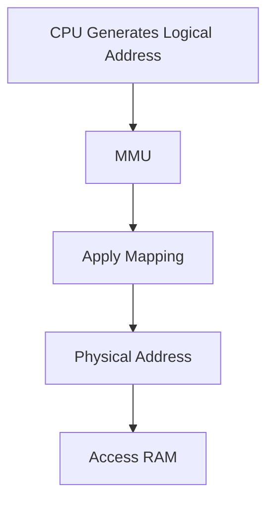

***

#### 2.2.2 Virtual to Physical Mapping

**Basic Mapping:**

```
Physical Address = Logical Address + Base Register
```

**Explanation:**

* Base register stores starting address
* Logical address is offset

**Example:**

```python
Base = 5000
Logical = 200

Physical = 5200
```

***

### 🧠 Key Insight

* Program thinks memory starts at **0**
* But actually mapped to different location in RAM

***

### 2.3 Binding of Instructions and Data

> Binding = process of mapping **program addresses to memory addresses**

***

#### 2.3.1 Compile-Time Binding

**When?**

* During compilation

**Condition:**

* Memory location is known in advance

**Characteristics:**

* Generates **absolute code**
* Cannot change location later

**Problem:**

* No flexibility

***

#### 2.3.2 Load-Time Binding

**When?**

* During loading of program into memory

**Characteristics:**

* Generates **relocatable code**
* Can change starting address

**Advantage:**

* More flexible than compile-time

***

#### 2.3.3 Execution-Time Binding

**When?**

* During execution

**Characteristics:**

* Address translation happens **dynamically**
* Requires hardware support (MMU)

**Advantage:**

* Maximum flexibility
* Supports virtual memory

***

#### 🔁 Binding Comparison

| Type           | Time             | Flexibility |
| -------------- | ---------------- | ----------- |
| Compile-time   | Before execution | Low         |
| Load-time      | During loading   | Medium      |
| Execution-time | During execution | High        |

***

### 2.4 Types of Code

***

#### 2.4.1 Absolute Code

> Code with fixed memory addresses

**Features:**

* Cannot be relocated
* Used in compile-time binding

**Example:**

* Address hardcoded in program

***

#### 2.4.2 Relocatable Code

> Code that can be loaded at different memory locations

**Features:**

* Uses relative addressing
* Flexible
* Used in load-time & execution-time binding

***

### 2.5 Multistep Processing of User Program

***

#### 2.5.1 Compilation → Linking → Loading → Execution

This is the **complete lifecycle of a program**

***

#### 🔁 Step-by-Step Flow

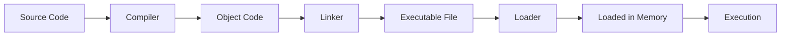

***

#### 🔍 Step Explanation

**1. Compilation**

* Converts source code → object code

**2. Linking**

* Combines libraries + object files
* Produces executable

**3. Loading**

* Loads program into memory

**4. Execution**

* CPU starts executing instructions

***

### 🔥 Final Summary

* Logical address = **CPU generated**
* Physical address = **actual memory location**
* MMU performs **translation**
* Binding determines **when mapping happens**
* Program execution follows:\
  👉 Compile → Link → Load → Execute

***

### 🎯 Important Exam Points

* Logical vs Physical address (very common)
* MMU role
* Binding types (comparison asked frequently)
* Absolute vs Relocatable code
* Program execution steps diagram

***

## 3. Memory Management Requirements

For an operating system to manage memory efficiently and safely, it must satisfy certain **fundamental requirements**:

* Relocation
* Protection
* Address translation
* Hardware support

These ensure **flexibility, security, and correctness** in memory usage.

***

### 3.1 Relocation

> Relocation is the ability to **load and execute a program at any memory location**

***

#### 3.1.1 Dynamic Relocation

> Dynamic relocation allows a program to be moved during execution

**Key Idea:**

* Program is **not fixed** to a single memory location
* OS can:
  * Move processes in memory
  * Allocate memory dynamically

**Why needed?**

* Multiprogramming environment
* Efficient memory utilization

***

#### 🔁 Example

* Program assumes it starts at address `0`
* Actually loaded at address `5000`

👉 All addresses must be **adjusted dynamically**

***

#### 3.1.2 Address Translation at Runtime

> Address translation is performed **during execution** using hardware (MMU)

**Process:**


**Formula:**

```
Physical Address = Base Register + Logical Address
```

**Benefit:**

* Program can run **anywhere in memory**
* No need to modify program code

***

### 3.2 Protection

> Protection ensures that processes **do not access unauthorized memory**

***

#### 3.2.1 Memory Access Control

**OS Responsibilities:**

* Prevent one process from accessing another’s memory
* Prevent illegal memory access

**Types of violations:**

* Accessing another process memory
* Accessing OS memory
* Accessing invalid address

***

#### 🔁 Protection Check

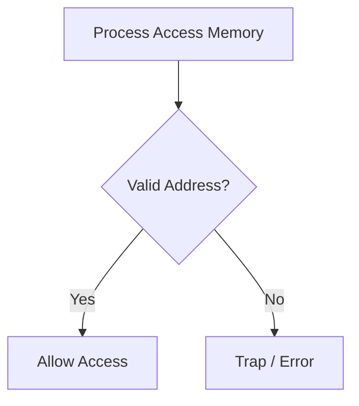

***

#### 3.2.2 Runtime Protection

> Protection checks are performed **during execution**

**How?**

* Every memory access is checked against:
  * Allowed range
* If invalid:
  * OS generates **trap (interrupt)**

**Benefit:**

* Ensures **system stability and security**

***

### 3.3 Base and Limit Registers

These are **hardware registers** used for:

* Address translation
* Protection

***

#### 3.3.1 Base Register

> Stores the **starting address** of the process in physical memory

**Function:**

* Added to logical address

**Example:**

```
Base = 4000
Logical = 200

Physical = 4200
```

***

#### 3.3.2 Limit Register

> Defines the **maximum size (range)** of the process

**Function:**

* Ensures process stays within its memory bounds

**Example:**

```
Limit = 1000
Logical Address must be < 1000
```

***

#### 3.3.3 Address Space Definition

Together, base and limit define:

> The **valid address space of a process**

***

#### 🔁 Working of Base & Limit Registers

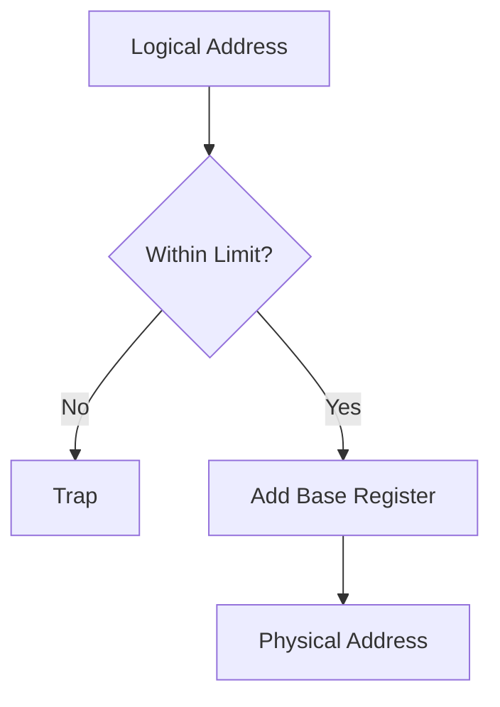

***

### 🧠 Key Insight

* Base → where process starts
* Limit → how far it can go

👉 Together → ensure **safe execution**

***

### 3.4 Hardware Address Protection

***

#### 3.4.1 Dynamic Relocation Mechanism

> Combines relocation + protection using hardware support

**Steps:**

1. CPU generates logical address
2. Check against limit register
3. Add base register
4. Generate physical address

***

#### 🔁 Complete Flow

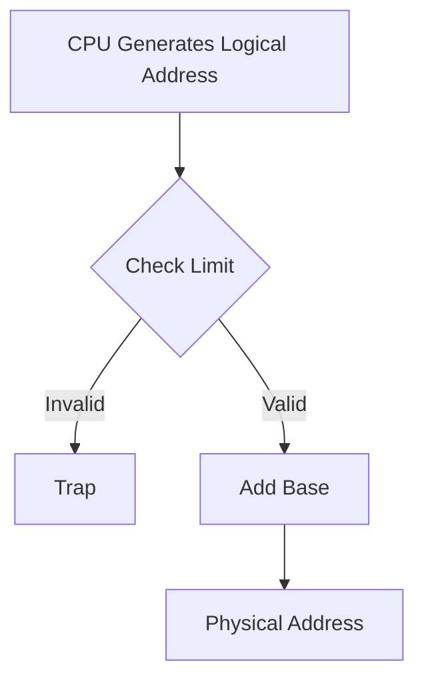

***

#### 3.4.2 Trap Handling

> A **trap** is generated when an illegal memory access occurs

***

**Causes of Trap:**

* Access beyond limit
* Access to protected memory
* Invalid address

***

**OS Action:**

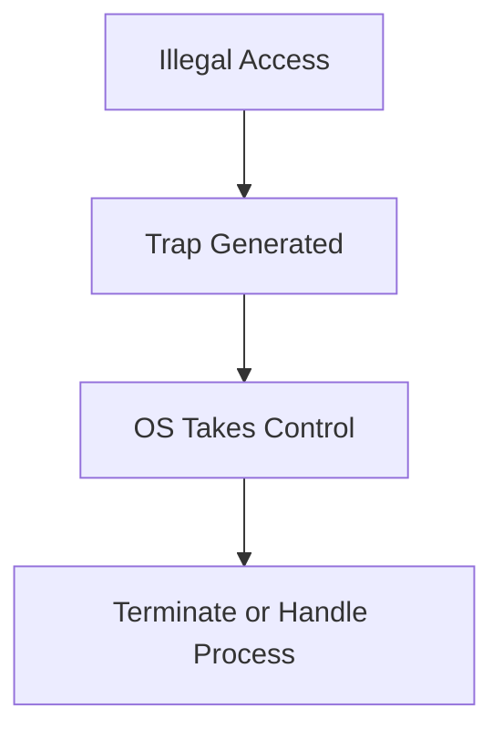

***

**Importance:**

* Prevents system crash
* Ensures security
* Maintains process isolation

***

### 🔥 Final Summary

| Requirement    | Purpose                         |
| -------------- | ------------------------------- |
| Relocation     | Flexibility in memory placement |
| Protection     | Prevent unauthorized access     |
| Base Register  | Starting address                |
| Limit Register | Maximum range                   |
| Trap           | Error handling mechanism        |

***

### 🎯 Important Exam Points

* Define relocation and protection
* Base & limit registers diagram (very important)
* Runtime address translation
* Trap concept (short question favorite)

***

### 💡 Memory Trick

👉 **R-P-B-L-T**

* R → Relocation
* P → Protection
* B → Base
* L → Limit
* T → Trap

***

## 4. Loading and Swapping

This section explains how programs are **brought into memory** and how processes are **moved between memory and disk** to optimize usage.

***

### 4.1 Static vs Dynamic Loading

> Loading refers to the process of **bringing a program into main memory for execution**

***

#### 4.1.1 Static Loading

> In static loading, the **entire program is loaded into memory before execution begins**

**Key Characteristics:**

* Whole program is loaded at once
* Execution starts only after complete loading
* Requires enough memory to hold entire program

**🔁 Flow**


**Advantages:**

* Simple to implement
* No runtime overhead

**Disadvantages:**

* Wastes memory
* Not suitable for large programs

***

#### 4.1.2 Dynamic Loading

> In dynamic loading, **only required parts of the program are loaded when needed**

**Key Idea:**

* Program is divided into modules
* Modules are loaded **on demand**

***

#### 🔁 Flow

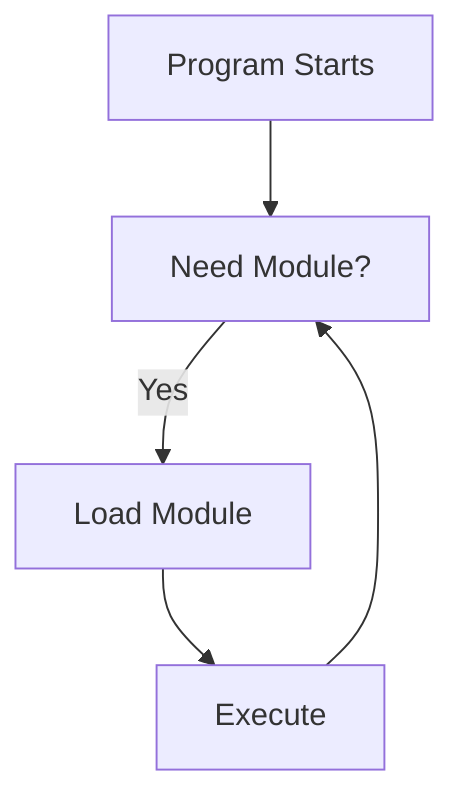

***

**Advantages:**

* Efficient memory usage
* Suitable for large programs
* Faster startup

**Disadvantages:**

* Slight overhead during execution
* Requires support for loading mechanism

***

#### 4.1.3 Static vs Dynamic Linking

Linking is the process of **combining program with libraries**

***

**🔹 Static Linking**

> Libraries are linked at compile time

**Features:**

* Library code becomes part of executable
* No need for external libraries at runtime

**Advantages:**

* Faster execution
* No dependency

**Disadvantages:**

* Larger program size
* Less flexible

***

**🔹 Dynamic Linking**

> Libraries are linked at runtime

**Features:**

* Uses shared libraries
* Linking happens during execution

**Advantages:**

* Smaller executable
* Shared memory usage

**Disadvantages:**

* Slight runtime overhead
* Dependency on external libraries

***

### 🧠 Comparison Table

| Feature      | Static Loading   | Dynamic Loading  |
| ------------ | ---------------- | ---------------- |
| Loading time | Before execution | During execution |
| Memory usage | High             | Efficient        |
| Flexibility  | Low              | High             |

***

### 4.2 Swapping

> Swapping is a technique of **moving processes between main memory and secondary storage**

***

#### 4.2.1 Concept of Swapping

**Definition:**

> Swapping temporarily transfers a process from **main memory to disk** and brings it back when needed

**Why needed?**

* Memory is limited
* Multiple processes need execution

***

#### 🔁 Swapping Process


***

#### 4.2.2 Backing Store

> Backing store is the **secondary storage (disk)** used to store swapped-out processes

**Characteristics:**

* High-speed disk
* Large storage capacity
* Stores inactive processes

**From PPT:**

* Also called **swap space**

***

#### 4.2.3 Roll-in / Roll-out

**🔹 Roll-out**

> Moving process from **memory → disk**

**🔹 Roll-in**

> Bringing process from **disk → memory**

***

#### 🔁 Flow

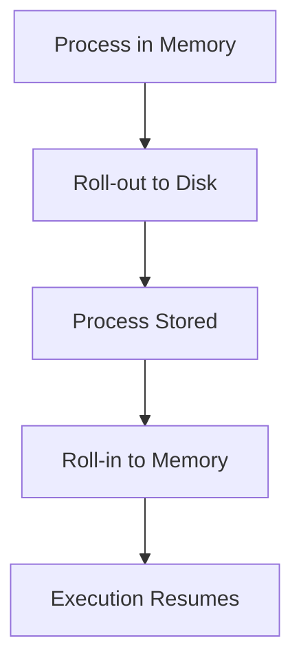

***

#### 4.2.4 Ready Queue Handling

When swapping occurs:

* Processes moved out → placed in **backing store**
* When brought back:
  * Added to **ready queue**

***

#### 🔁 Process Scheduling with Swapping

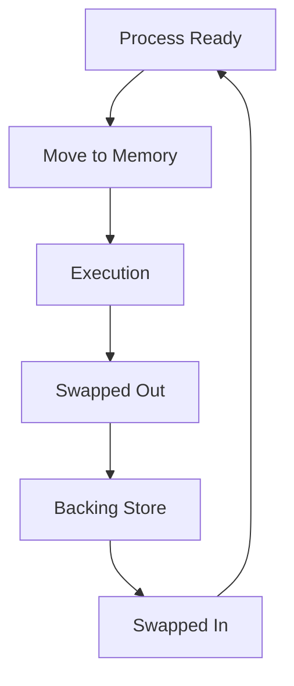

***

### 🔥 Final Summary

| Concept         | Meaning                            |
| --------------- | ---------------------------------- |
| Static Loading  | Load entire program                |
| Dynamic Loading | Load on demand                     |
| Static Linking  | Link at compile time               |
| Dynamic Linking | Link at runtime                    |
| Swapping        | Move process between RAM and disk  |
| Backing Store   | Disk storage for swapped processes |

***

### 🎯 Important Exam Points

* Static vs Dynamic loading (very common)
* Static vs Dynamic linking
* Swapping concept + roll-in/roll-out
* Backing store definition
* Diagrams are frequently asked

***

### 💡 Memory Trick

👉 **L-S-D-S**

* L → Loading
* S → Static
* D → Dynamic
* S → Swapping

***

## 5. Memory Allocation Techniques

Memory allocation techniques define **how memory is assigned to processes** in a system.\
The goal is to ensure **efficient utilization, minimal waste, and proper process execution**.

***

### 5.1 Memory Allocation Concept

***

#### 5.1.1 Definition

> Memory allocation is the process of **assigning portions of main memory to processes**

**Key Points:**

* Managed by OS
* Ensures processes get required memory
* Prevents memory conflicts

***

#### 5.1.2 Types of Allocation

There are two main types:

1. **Contiguous Allocation**
2. **Non-contiguous Allocation** (Paging, Segmentation — later topics)

***

### 5.2 Contiguous Memory Allocation

***

#### 5.2.1 Concept

> In contiguous allocation, each process is allocated a **single continuous block of memory**

**Key Idea:**

* Process must fit entirely in one block

***

#### 🔁 Visualization

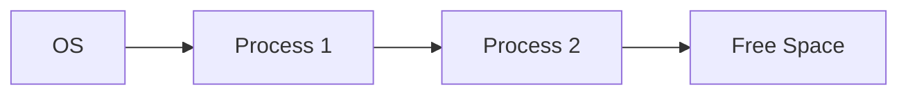

***

#### 5.2.2 Low Memory and High Memory

Memory is divided into:

**🔹 Low Memory**

* Reserved for OS
* Contains interrupt vectors, system code

**🔹 High Memory**

* Available for user processes

***

#### 🔁 Layout

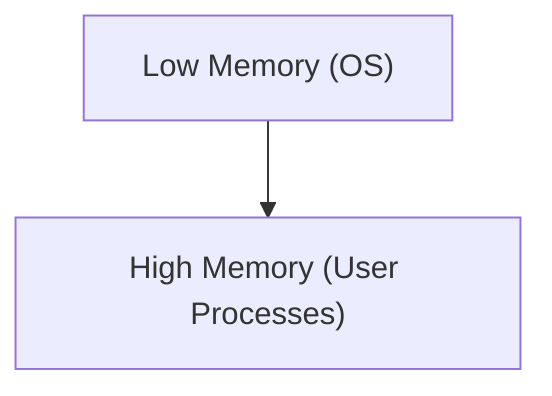

***

### 5.3 Partitioning Techniques

To manage contiguous allocation, memory is divided into **partitions**

***

#### 5.3.1 Single Process Monitor

> Only one process is loaded in memory at a time

**Features:**

* OS occupies part of memory
* Remaining memory → one user process

**Limitation:**

* No multiprogramming
* CPU underutilized

***

#### 5.3.2 Multiprogramming with Fixed Partition (MFT)

> Memory is divided into **fixed-size partitions**

**Features:**

* Number of partitions is fixed
* One process per partition

***

#### 🔁 Diagram

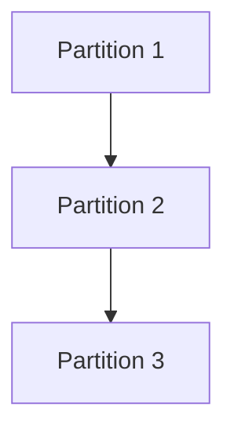

***

#### 5.3.3 Multiprogramming with Variable Partition (MVT)

> Memory is divided into **variable-sized partitions**

**Features:**

* Partition size depends on process size
* More flexible than MFT

***

### 5.4 Fixed Partition (MFT)

***

#### 5.4.1 Working

* Memory is divided into fixed blocks
* Each block holds one process
* If process is smaller → unused space remains

***

#### 🔁 Example

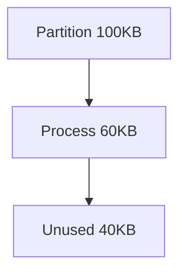

***

#### 5.4.2 Advantages

* Simple to implement
* Easy allocation

***

#### 5.4.3 Disadvantages

* **Internal Fragmentation**
* Limited number of processes
* Wastage of memory

***

### 5.5 Variable Partition (MVT)

***

#### 5.5.1 Dynamic Partitioning

* Memory allocated based on process size
* No fixed partition size

***

#### 🔁 Example

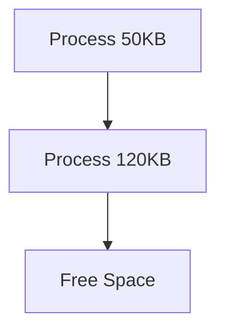

***

#### 5.5.2 Advantages

* Better memory utilization
* No internal fragmentation

***

#### 5.5.3 Disadvantages

* **External Fragmentation**
* Complex management
* Requires compaction

***

### 5.6 Fragmentation

> Fragmentation is the **wastage of memory due to inefficient allocation**

***

#### 5.6.1 Internal Fragmentation

> Wasted space **inside allocated memory block**

**Cause:**

* Fixed partition larger than process

**Example:**

```mermaid
flowchart TD
    A[Partition 100KB] --> B[Process 70KB]
    B --> C[Unused 30KB]
```

***

#### 5.6.2 External Fragmentation

> Free memory is scattered into small blocks and cannot be used effectively

**Cause:**

* Variable partitioning

***

#### 🔁 Example

```mermaid
flowchart TD
    A[Free 20KB] --> B[Process]
    B --> C[Free 30KB]
```

👉 Total free = 50KB but not contiguous

***

#### 5.6.3 Causes and Examples

| Type     | Cause              | Example            |
| -------- | ------------------ | ------------------ |
| Internal | Fixed partition    | Extra unused space |
| External | Variable partition | Scattered holes    |

***

### 5.7 Compaction

***

#### 5.7.1 Concept

> Compaction is the process of **shifting processes to combine free space into one block**

***

#### 🔁 Before & After

```mermaid
flowchart LR
    A[Free] --> B[Process] --> C[Free] --> D[Process]
```

➡ After compaction:

```mermaid
flowchart LR
    A[Process] --> B[Process] --> C[Large Free Block]
```

***

#### 5.7.2 Advantages

* Eliminates external fragmentation
* Creates large continuous memory block

***

#### 5.7.3 Limitations

* Time-consuming
* Requires relocation support
* High overhead

***

### 🔥 Final Summary

| Concept                | Key Idea             |
| ---------------------- | -------------------- |
| Contiguous Allocation  | Single memory block  |
| MFT                    | Fixed partitions     |
| MVT                    | Variable partitions  |
| Internal Fragmentation | Waste inside block   |
| External Fragmentation | Scattered free space |
| Compaction             | Combine free memory  |

***

### 🎯 Important Exam Points

* MFT vs MVT comparison (very common)
* Internal vs External fragmentation
* Compaction concept
* Contiguous allocation diagram

***

### 💡 Memory Trick

👉 **M-F-F-C**

* M → MFT
* F → Fragmentation
* F → Fixed/Variable
* C → Compaction

***

## 6. Paging

Paging is a **non-contiguous memory allocation technique** that eliminates external fragmentation by dividing memory into fixed-size units.

> Instead of allocating one large block, memory is divided into **pages and frames**

***

### 6.1 Paging Concept

***

#### 6.1.1 Pages and Frames

* **Page** → Fixed-size block of logical memory (program side)
* **Frame** → Fixed-size block of physical memory (RAM side)

**Key Rule:**

> **Page size = Frame size**

***

#### 🔁 Visualization

```mermaid
flowchart LR
    P1[Page 0] --> F1[Frame 5]
    P2[Page 1] --> F2[Frame 2]
    P3[Page 2] --> F3[Frame 8]
```

***

#### 6.1.2 Equal Size Requirement

> Pages and frames must be of **equal size**

**Why?**

* Simplifies mapping
* Avoids fragmentation complexity

**Benefit:**

* Eliminates **external fragmentation**

***

### 6.2 Paging Operation

***

#### 6.2.1 Page-to-Frame Mapping

> Each page of a process is mapped to any available frame in memory

**Key Idea:**

* Pages can be placed **anywhere in RAM**

***

#### 🔁 Mapping Example

```mermaid
flowchart LR
    Page0 --> Frame3
    Page1 --> Frame7
    Page2 --> Frame1
```

***

#### 6.2.2 Non-contiguous Allocation

> Pages of a process are stored in **different locations in memory**

**Advantage:**

* Efficient memory usage
* No need for contiguous space

***

#### 🔁 Comparison

| Technique  | Allocation      |
| ---------- | --------------- |
| Contiguous | One block       |
| Paging     | Multiple blocks |

***

### 6.3 Address Structure in Paging

***

#### 6.3.1 Page Number

> Identifies **which page** in logical memory

* Used as index in **page table**

***

#### 6.3.2 Offset

> Identifies **location within the page**

***

#### 🔁 Logical Address Format

```
Logical Address = Page Number + Offset
```

***

#### Example:

```
Logical Address = 13-bit
Page Size = 4KB (2^12)

→ Page Number = upper bits
→ Offset = lower 12 bits
```

***

### 6.4 Page Table

***

#### 6.4.1 Structure

> Page table stores mapping between pages and frames

**Each entry contains:**

* Frame number
* Status bits (valid/invalid, protection)

***

#### 🔁 Page Table Example

| Page No | Frame No |
| ------- | -------- |
| 0       | 5        |
| 1       | 2        |
| 2       | 8        |

***

#### 6.4.2 Logical → Physical Mapping

**Process:**

1. Extract page number
2. Look up page table
3. Get frame number
4. Combine with offset

***

#### 🔁 Translation

```mermaid
flowchart TD
    A[Logical Address] --> B[Page Number + Offset]
    B --> C[Page Table Lookup]
    C --> D[Frame Number]
    D --> E[Physical Address]
```

***

### 6.5 Page Allocation

***

#### 6.5.1 Page Placement

> Pages can be placed in **any free frame**

**No restriction:**

* Frames do not need to be contiguous

***

#### 6.5.2 Frame Allocation

> OS allocates frames to processes

**Strategies:**

* Equal allocation
* Proportional allocation
* Priority-based allocation

***

### 6.6 Steps to Determine Address Location

***

#### 6.6.1 Page Number Calculation

> Divide logical address by page size

```
Page Number = Address / Page Size
```

***

#### 6.6.2 Frame Identification

> Use page number to find frame number from page table

***

#### 6.6.3 Offset Addition

> Add offset to frame base address

***

#### 🔁 Complete Address Translation

```mermaid
flowchart TD
    A[Logical Address] --> B[Divide into Page + Offset]
    B --> C[Find Frame from Page Table]
    C --> D[Combine Frame + Offset]
    D --> E[Physical Address]
```

***

#### 🔍 Example

```
Page Size = 1000
Logical Address = 3450

Page Number = 3
Offset = 450

If Page 3 → Frame 7

Physical Address = 7000 + 450 = 7450
```

***

### 🔥 Final Summary

| Concept    | Meaning                   |
| ---------- | ------------------------- |
| Page       | Logical memory unit       |
| Frame      | Physical memory unit      |
| Page Table | Mapping structure         |
| Offset     | Position inside page      |
| Paging     | Non-contiguous allocation |

***

### 🎯 Important Exam Points

* Page vs Frame (definition)
* Address structure (Page + Offset)
* Page table working (very important)
* Numerical problems (address translation)
* Advantage: removes external fragmentation

***

### 💡 Memory Trick

👉 **P-F-O-T**

* P → Page
* F → Frame
* O → Offset
* T → Table

***

## 7. Hardware Support for Paging

Paging requires **hardware support** to perform fast and efficient address translation.\
Without hardware, paging would be too slow due to frequent memory lookups.

***

### 🧠 Core Idea

```mermaid
flowchart LR
    CPU[Logical Address] --> HW[Hardware Support]
    HW --> RAM[Physical Address]
```

***

### 7.1 Page Table Implementation

Page table stores mapping from **page → frame**, but where is it stored?

***

#### 7.1.1 Register-based

> Page table is stored in **CPU registers**

**Features:**

* Very fast access
* Suitable for **small page tables**

**Limitations:**

* Limited size
* Expensive hardware

***

#### 🔁 Flow

```mermaid
flowchart LR
    CPU --> Registers --> PhysicalAddress
```

***

#### 7.1.2 Memory-based

> Page table is stored in **main memory**

**Features:**

* Can handle large page tables
* More practical approach

**Problem:**

* Requires **2 memory accesses**:
  1. Access page table
  2. Access actual data

***

#### 🔁 Flow

```mermaid
flowchart TD
    A[Logical Address] --> B[Page Table in Memory]
    B --> C[Frame Number]
    C --> D[Actual Data]
```

***

### ⚠️ Problem

👉 Memory-based page table = **slow**\
👉 Solution = **TLB**

***

### 7.2 Translation Lookaside Buffer (TLB)

***

#### 7.2.1 Concept

> TLB is a **high-speed cache** that stores recent page table entries

**Purpose:**

* Reduce memory access time
* Avoid repeated page table lookup

***

#### 🔁 Working

```mermaid
flowchart TD
    A[CPU Logical Address] --> B[Check TLB]
    B -->|Hit| C[Get Frame Number]
    B -->|Miss| D[Access Page Table]
    D --> E[Update TLB]
    E --> C
    C --> F[Access Memory]
```

***

#### 7.2.2 TLB Hit and Miss

**🔹 TLB Hit**

* Page entry found in TLB
* Fast access

**🔹 TLB Miss**

* Entry not found
* Need to access page table

***

#### 🔁 Comparison

| Case     | Steps             | Speed  |
| -------- | ----------------- | ------ |
| TLB Hit  | 1 memory access   | Fast   |
| TLB Miss | 2 memory accesses | Slower |

***

#### 7.2.3 Effective Access Time Calculation

> Average time to access memory considering TLB hits and misses

***

#### Formula:

```
EAT = (Hit Ratio × Hit Time) + (Miss Ratio × Miss Time)
```

***

#### Expanded Form:

```
EAT = h(TLB + Memory) + (1 - h)(TLB + 2 × Memory)
```

Where:

* h = hit ratio

***

#### 🔍 Example:

```
Hit ratio = 0.8
Memory access = 100 ns
TLB access = 10 ns

EAT = 0.8(10 + 100) + 0.2(10 + 200)
    = 0.8(110) + 0.2(210)
    = 88 + 42 = 130 ns
```

***

### 7.3 TLB Features

***

#### 7.3.1 Associative Memory

> TLB uses **associative (content-addressable) memory**

**Features:**

* Search entire TLB in parallel
* Faster lookup than normal memory

***

#### 🔁 Working

```mermaid
flowchart LR
    Input[Page Number] --> TLB
    TLB -->|Match Found| Frame
```

***

#### 7.3.2 Replacement Policy (LRU)

> When TLB is full, entries must be replaced

**Common Policy:**

* **LRU (Least Recently Used)**

**Idea:**

* Remove least recently accessed entry

***

#### 7.3.3 Address Space Identifier (ASID)

> ASID uniquely identifies processes in TLB

**Purpose:**

* Avoid flushing TLB on context switch

**Benefit:**

* Faster process switching
* Improved performance

***

### 7.4 Memory Protection in Paging

Paging also supports **memory protection mechanisms**

***

#### 7.4.1 Protection Bit

> Defines access permissions for each page

**Types:**

* Read
* Write
* Execute

**Example:**

```mermaid
flowchart TD
    Page --> CheckPermission
    CheckPermission -->|Allowed| Access
    CheckPermission -->|Denied| Trap
```

***

#### 7.4.2 Valid/Invalid Bit

> Indicates whether a page is **valid or not**

**Values:**

* Valid → page is in memory
* Invalid → page not in memory

**Use:**

* Detect **page faults**

***

#### 7.4.3 Page Table Length Register (PTLR)

> Stores size of page table

**Purpose:**

* Ensures page number is within valid range

**Protection:**

```mermaid
flowchart TD
    A[Page Number] --> B{Within PTLR?}
    B -->|Yes| C[Access Page Table]
    B -->|No| D[Trap]
```

***

### 🔥 Final Summary

| Concept    | Meaning                   |
| ---------- | ------------------------- |
| Page Table | Stores page-frame mapping |
| TLB        | Cache for page table      |
| Hit        | Fast access               |
| Miss       | Slow access               |
| ASID       | Process identifier        |
| PTLR       | Page table size limit     |

***

### 🎯 Important Exam Points

* TLB working (very important)
* Hit vs Miss
* EAT formula (numerical asked frequently)
* Associative memory concept
* Protection bits and&#x20;
* valid/invalid bit

***

### 💡 Memory Trick

👉 **T-H-E-A-P**

* T → TLB
* H → Hit
* E → EAT
* A → ASID
* P → PTLR

***

## 8. Segmentation

Segmentation is a **memory management technique** that divides a program into **logical parts (segments)** instead of fixed-size blocks.

> Unlike paging, segmentation reflects the **user’s view of memory**

***

### 🧠 Core Idea

```mermaid
flowchart TD
    Program --> Code
    Program --> Stack
    Program --> Heap
```

👉 Program is divided based on **functionality**, not size

***

### 8.1 Segmentation Concept

***

#### 8.1.1 Logical Division (Code, Stack, Heap)

> A program is divided into **logical segments**

**Common Segments:**

* **Code Segment** → Instructions
* **Data Segment** → Variables
* **Stack Segment** → Function calls
* **Heap Segment** → Dynamic memory

***

#### 🔁 Example

```mermaid
flowchart LR
    Code --> Data --> Stack --> Heap
```

***

#### 8.1.2 User View of Memory

> Segmentation matches how programmers think about memory

**Key Idea:**

* Memory is seen as:
  * Functions
  * Modules
  * Objects

👉 Not as continuous addresses

***

### 8.2 Addressing in Segmentation

***

#### 8.2.1 Segment Number

> Identifies **which segment**

* Acts as index in **segment table**

***

#### 8.2.2 Offset

> Specifies location **within the segment**

***

#### 🔁 Logical Address Format

```
Logical Address = (Segment Number, Offset)
```

***

#### Example:

```
(2, 150)
→ Segment 2, offset 150
```

***

### 8.3 Segment Table

***

#### 8.3.1 Base and Limit

Each segment has:

* **Base** → Starting physical address
* **Limit** → Size of segment

***

#### 🔁 Segment Table Example

| Segment | Base | Limit |
| ------- | ---- | ----- |
| 0       | 1000 | 400   |
| 1       | 2000 | 300   |
| 2       | 3000 | 500   |

***

#### 8.3.2 Address Translation

**Steps:**

1. Get segment number
2. Check offset < limit
3. Add base to offset

***

#### 🔁 Translation Flow

```mermaid
flowchart TD
    A[(Segment, Offset)] --> B[Segment Table]
    B --> C{Offset < Limit?}
    C -->|No| D[Trap]
    C -->|Yes| E[Add Base]
    E --> F[Physical Address]
```

***

#### Formula:

```
Physical Address = Base + Offset
```

***

### 8.4 Hardware Implementation

***

#### 8.4.1 Mapping 2D → 1D Address

> Segmentation converts **2D address → 1D physical address**

**Logical Address:**

* (Segment, Offset)

**Physical Address:**

* Single memory address

***

#### 🔁 Mapping

```mermaid
flowchart LR
    Logical[(Segment, Offset)] --> Hardware
    Hardware --> Physical[Physical Address]
```

***

#### 8.4.2 Trap Handling

> Trap occurs when offset exceeds segment limit

***

**Causes:**

* Invalid offset
* Access outside segment

***

#### 🔁 Flow

```mermaid
flowchart TD
    A[Offset Check] --> B{Valid?}
    B -->|No| C[Trap]
    B -->|Yes| D[Continue Execution]
```

***

### 8.5 Segmentation Features

***

#### 8.5.1 Advantages

* Matches user/program view
* Supports modular programming
* Easy sharing of segments
* Better protection

***

#### 8.5.2 Disadvantages

* **External Fragmentation**
* Complex memory management
* Slower than paging

***

### 8.6 Segmentation vs Paging

***

#### 8.6.1 Differences

| Feature       | Segmentation         | Paging          |
| ------------- | -------------------- | --------------- |
| Division      | Logical (code, data) | Fixed size      |
| Size          | Variable             | Fixed           |
| Address       | Segment + Offset     | Page + Offset   |
| Fragmentation | External             | Internal        |
| View          | User-oriented        | System-oriented |

***

#### 8.6.2 Use Cases

**Segmentation:**

* When program structure matters
* Modular programming

**Paging:**

* Efficient memory utilization
* OS-level management

***

### 🔥 Final Summary

| Concept      | Meaning                 |
| ------------ | ----------------------- |
| Segment      | Logical unit            |
| Base         | Starting address        |
| Limit        | Size                    |
| Offset       | Position in segment     |
| Segmentation | Logical memory division |

***

### 🎯 Important Exam Points

* Segment table (base + limit)
* Address translation steps
* Segmentation vs Paging (very common)
* Advantages & disadvantages

***

### 💡 Memory Trick

👉 **S-B-L-O**

* S → Segment
* B → Base
* L → Limit
* O → Offset

***

## 9. Advanced Page Table Structures

Basic page tables can become **very large** for modern systems.\
To solve this, advanced structures are used to **reduce memory usage and improve efficiency**.

***

### 🧠 Core Idea

```mermaid
flowchart TD
    A[Large Page Table Problem] --> B[Hierarchical Paging]
    A --> C[Hashed Page Table]
    A --> D[Inverted Page Table]
```

***

### 9.1 Hierarchical Paging

***

#### 9.1.1 Multilevel Page Table

> Break a large page table into **multiple smaller tables**

**Idea:**

* Instead of one big table → use **levels**
* Only required parts are loaded

***

#### 🔁 Structure

```mermaid
flowchart TD
    A[Logical Address] --> B[Page Directory]
    B --> C[Page Table]
    C --> D[Frame Number]
```

***

**Key Points:**

* Reduces memory usage
* Suitable for large address spaces

***

#### 9.1.2 Address Division

> Logical address is divided into multiple parts

**Example (2-level paging):**

```id="v9dn7p"
Logical Address = Page Directory | Page Table | Offset
```

***

#### 🔁 Breakdown

| Part      | Purpose           |
| --------- | ----------------- |
| Directory | Select page table |
| Table     | Select frame      |
| Offset    | Locate data       |

***

#### 🔍 Example

```id="xf5rvk"
32-bit address:

10 bits → Page Directory  
10 bits → Page Table  
12 bits → Offset
```

***

### 9.2 Hashed Page Table

***

#### 9.2.1 Hash Function

> Uses a **hash function** to map virtual address → page table entry

**Idea:**

* Apply hash on page number
* Get index in hash table

***

#### 🔁 Working

```mermaid
flowchart TD
    A[Virtual Page Number] --> B[Hash Function]
    B --> C[Hash Table Entry]
    C --> D[Frame Number]
```

***

#### 9.2.2 Collision Handling

> Multiple pages may map to same hash index

**Solution:**

* Use **linked list (chaining)**

***

#### 🔁 Collision Handling

```mermaid
flowchart TD
    A[Index] --> B[Entry 1]
    B --> C[Entry 2]
    C --> D[Entry 3]
```

***

**Key Points:**

* Traverse list until match found
* Adds some delay

***

### 9.3 Inverted Page Table

***

#### 9.3.1 Concept

> Instead of one entry per page, store **one entry per frame**

**Difference:**

* Normal page table → per process
* Inverted page table → **global for system**

***

#### 🔁 Structure

```mermaid
flowchart TD
    Frame1 --> ProcessPage1
    Frame2 --> ProcessPage2
    Frame3 --> ProcessPage3
```

***

**Entry contains:**

* Process ID
* Page number
* Frame number

***

#### 9.3.2 Memory Optimization

> Greatly reduces memory usage

**Why?**

* Only one entry per frame
* Independent of number of processes

***

#### 🔍 Comparison

| Type                | Entries |
| ------------------- | ------- |
| Normal Page Table   | Pages   |
| Inverted Page Table | Frames  |

***

#### 9.3.3 Search Overhead

> Finding a page is slower

**Problem:**

* Must search entire table

**Solution:**

* Use **hashing** to speed up search

***

#### 🔁 Search Process

```mermaid
flowchart TD
    A[Virtual Address] --> B[Search Table]
    B -->|Found| C[Frame]
    B -->|Not Found| D[Page Fault]
```

***

### 🔥 Final Summary

| Structure  | Key Idea            | Advantage             | Disadvantage |
| ---------- | ------------------- | --------------------- | ------------ |
| Multilevel | Split table         | Saves memory          | More lookup  |
| Hashed     | Use hash function   | Faster lookup         | Collision    |
| Inverted   | One entry per frame | Very memory efficient | Slow search  |

***

### 🎯 Important Exam Points

* Why advanced tables are needed (very important)
* Multilevel paging structure
* Hashed page table (collision handling)
* Inverted page table (difference)
* Comparison often asked

***

### 💡 Memory Trick

👉 **M-H-I**

* M → Multilevel
* H → Hashed
* I → Inverted

***

## 10. Virtual Memory

Virtual Memory is a **key concept in modern operating systems** that allows programs to run even if they are **larger than the available physical memory (RAM)**.

***

### 🧠 Core Idea

```mermaid
flowchart LR
    Program[Large Program] --> VM[Virtual Memory]
    VM --> RAM[Part in RAM]
    VM --> Disk[Part in Disk]
```

👉 Only required parts are loaded into RAM, rest stay on disk

***

### 10.1 Concept of Virtual Memory

***

#### 10.1.1 Definition

> Virtual Memory is a technique that allows execution of programs that are **not completely loaded into main memory**

**From PPT:**

* It allows processes to execute even when **only a part is in RAM**

***

#### 10.1.2 Need for Virtual Memory

**Problems without Virtual Memory:**

* Programs are too large for RAM
* Limited physical memory
* Low multiprogramming

***

**Solution:**

Virtual Memory:

* Uses **secondary storage (disk)** as extension of RAM
* Loads only required pages

***

#### 🔁 Example

* Program size = 1GB
* RAM available = 4GB

👉 Only active pages are loaded → rest stored on disk

***

#### 10.1.3 Virtual Memory > Physical Memory

> Virtual memory size can be **greater than physical memory**

***

#### 🔁 Concept

```mermaid
flowchart TD
    A["Virtual Memory (Large)"] --> B["Physical Memory (Small)"]
    B --> C[Disk Storage]
```

***

**Key Insight:**

* RAM acts as **cache for disk memory**
* OS manages movement between them

***

### 10.2 Advantages of Virtual Memory

***

#### 10.2.1 Multiprogramming Support

* Allows multiple processes to run simultaneously
* Improves CPU utilization

**From PPT:**

* Enables **more processes in memory**

***

#### 10.2.2 Efficient Memory Usage

* Only required pages are loaded
* Reduces memory wastage

**Additional Benefits:**

* Large programs can run
* Better resource utilization
* Faster execution for active parts

***

### 10.3 Disadvantages of Virtual Memory

***

#### 10.3.1 Performance Overhead

> Switching between RAM and disk is slow

**Reasons:**

* Disk access is slower than RAM
* Page faults increase delay

***

#### 🔁 Impact

```mermaid
flowchart TD
    A[Page Fault] --> B[Load from Disk]
    B --> C[Delay in Execution]
```

***

#### 10.3.2 Disk Dependency

> Virtual memory heavily depends on secondary storage

**Problems:**

* Requires large disk space
* System slows down if disk is slow

**From PPT:**

* Performance depends on **disk speed**

***

### 🔥 Final Summary

| Concept          | Meaning             |
| ---------------- | ------------------- |
| Virtual Memory   | Extension of RAM    |
| Disk             | Secondary storage   |
| Page Fault       | Missing page in RAM |
| Multiprogramming | More processes run  |

***

### 🎯 Important Exam Points

* Definition of virtual memory (very common)
* Virtual vs physical memory
* Advantages & disadvantages
* Concept of page fault (linked topic)

***

### 💡 Memory Trick

👉 **V-R-D**

* V → Virtual Memory
* R → RAM
* D → Disk

***

## 11. Locality of Reference

Locality of Reference is a **fundamental principle** used in memory systems to improve performance.

> Programs tend to access **a small portion of memory repeatedly over a short period of time**

This concept is the **foundation of caching, paging, and virtual memory**

***

### 🧠 Core Idea

```mermaid
flowchart TD
    Program --> FewMemoryLocations
    FewMemoryLocations --> RepeatedAccess
```

👉 Instead of accessing entire memory, programs focus on **specific regions**

***

### 11.1 Concept

***

#### 11.1.1 Definition

> Locality of Reference is the tendency of a program to access **same or nearby memory locations repeatedly**

**From PPT:**

* Programs access **instructions whose addresses are near each other**

***

#### 🔍 Example

* Loop execution:

  ```c
  for(i = 0; i < 10; i++) {
      sum += i;
  }
  ```

👉 Same instructions executed repeatedly

***

#### 11.1.2 Importance

Locality of Reference helps in:

**1. Cache Memory**

* Frequently used data stored in cache

**2. Virtual Memory**

* Only required pages loaded

**3. Performance Optimization**

* Reduces memory access time

***

#### 🔁 Effect

```mermaid
flowchart LR
    Locality --> Cache
    Cache --> FasterExecution
```

***

### 11.2 Types of Locality

There are **two main types**

***

### 11.2.1 Temporal Locality

> If a memory location is accessed now, it is likely to be accessed again soon

***

#### 🔍 Example

```c
int x = 5;
print(x);
print(x);
```

👉 Same variable `x` used repeatedly

***

#### 🔁 Concept

```mermaid
flowchart TD
    Access1 --> Access2 --> Access3
```

***

#### Key Idea:

* Reuse of **same data/instruction**

***

### 11.2.2 Spatial Locality

> If a memory location is accessed, nearby locations are likely to be accessed soon

***

#### 🔍 Example

```c
int arr[5] = {1,2,3,4,5};
for(i=0;i<5;i++)
    print(arr[i]);
```

👉 Accessing **adjacent memory locations**

***

#### 🔁 Concept

```mermaid
flowchart LR
    A[Location 100] --> B[101] --> C[102]
```

***

#### Key Idea:

* Access to **neighboring memory locations**

***

### 🔥 Final Summary

| Type     | Meaning                   | Example         |
| -------- | ------------------------- | --------------- |
| Temporal | Same location reused      | Loop variable   |
| Spatial  | Nearby locations accessed | Array traversal |

***

### 🎯 Important Exam Points

* Definition of locality (very important)
* Temporal vs Spatial (comparison asked frequently)
* Relation with:
  * Cache
  * Virtual memory

***

### 💡 Memory Trick

👉 **T-S**

* T → Temporal → Time (same data again)
* S → Spatial → Space (nearby data)

***

## 12. Demand Paging

Demand Paging is a **virtual memory technique** where pages are loaded into memory **only when they are needed**.

> Instead of loading entire program, OS loads pages **on demand**

***

### 🧠 Core Idea

```mermaid
flowchart TD
    Program --> Disk
    Disk -->|Needed Page| RAM
```

👉 Only required pages are brought into memory

***

### 12.1 Concept of Demand Paging

***

#### 12.1.1 Lazy Loading

> Pages are loaded **only when they are first accessed**

**Key Idea:**

* Do not load unused pages
* Load page **only when required**

***

#### 🔁 Flow

```mermaid
flowchart TD
    A[Program Starts] --> B[Page Needed?]
    B -->|Yes| C[Load Page]
    B -->|No| D[Do Nothing]
```

***

**Benefits:**

* Saves memory
* Faster program startup
* Efficient resource usage

***

#### 12.1.2 Page Fault Generation

> A **page fault** occurs when a process tries to access a page that is **not in memory**

***

#### 🔁 Condition

* Page table entry has:
  * **Valid bit = 0 (invalid)**

👉 Page is not loaded → page fault occurs

***

#### 🔁 Flow

```mermaid
flowchart TD
    A[CPU Requests Page] --> B{Page in Memory?}
    B -->|No| C[Page Fault]
    B -->|Yes| D[Continue Execution]
```

***

**From PPT:**

* Page fault occurs when page is **not available in memory**

***

### 12.2 Page Fault Handling

When a page fault occurs, OS must **handle it properly**

***

#### 12.2.1 Valid/Invalid Check

> First, OS checks whether the memory reference is valid

**Cases:**

* ❌ Invalid reference → terminate process
* ✅ Valid but not loaded → continue handling

***

#### 🔁 Flow

```mermaid
flowchart TD
    A[Page Fault] --> B{Valid Address?}
    B -->|No| C[Terminate Process]
    B -->|Yes| D[Load Page]
```

***

#### 12.2.2 Load from Disk

> Required page is loaded from **secondary storage (disk)**

**Steps:**

1. Find free frame
2. Read page from disk
3. Load into memory

***

#### 🔁 Flow

```mermaid
flowchart TD
    A[Find Free Frame] --> B[Read from Disk]
    B --> C[Load into RAM]
```

***

#### 12.2.3 Restart Instruction

> After loading page, execution resumes

**Key Point:**

* Instruction that caused fault is **restarted**

***

#### 🔁 Complete Handling Flow

```mermaid
flowchart TD
    A[CPU Request] --> B[Check Page Table]
    B -->|Not in Memory| C[Page Fault]
    C --> D[Check Validity]
    D -->|Valid| E[Load Page from Disk]
    E --> F[Update Page Table]
    F --> G[Restart Instruction]
    D -->|Invalid| H[Terminate Process]
```

***

### 🔥 Final Summary

| Concept       | Meaning                     |
| ------------- | --------------------------- |
| Demand Paging | Load pages only when needed |
| Page Fault    | Page not in memory          |
| Valid Bit     | Indicates presence          |
| Disk          | Stores pages                |

***

### 🎯 Important Exam Points

* Definition of demand paging
* Page fault concept (very common)
* Steps in page fault handling (diagram important)
* Valid/invalid bit usage

***

### 💡 Memory Trick

👉 **D-P-R**

* D → Demand
* P → Page Fault
* R → Restart

***

## 13. Page Replacement

When all frames in memory are full and a new page needs to be loaded, the OS must **replace an existing page**.

> Page Replacement decides **which page to remove** to make space for a new one

***

### 🧠 Core Idea

```mermaid
flowchart TD
    A[Memory Full] --> B[Need New Page]
    B --> C[Select Victim Page]
    C --> D[Replace with New Page]
```

***

### 13.1 Concept

***

#### 13.1.1 Need for Replacement

> Page replacement is required when **no free frames are available**

**Situation:**

* All frames are occupied
* New page request occurs

👉 OS must:

* Remove an existing page
* Load required page

***

#### 🔍 Example

* Frames = 3
* Pages in memory = P1, P2, P3
* New page request = P4

👉 One of P1, P2, P3 must be removed

***

#### 13.1.2 Swap In / Swap Out

**🔹 Swap Out**

> Remove page from memory → send to disk

**🔹 Swap In**

> Load new page from disk → into memory

***

#### 🔁 Flow

```mermaid
flowchart LR
    OldPage --> Disk
    Disk --> NewPage
```

***

### 13.2 Replacement Steps

***

#### 13.2.1 Find Victim Page

> Select a page to be removed from memory

**Criteria (depends on algorithm):**

* Oldest page
* Least recently used
* Least frequently used

👉 This step is **most important**

***

#### 13.2.2 Replace Page

> Replace victim page with required page

***

#### 🔁 Example

```mermaid
flowchart TD
    A[Frame: P1] --> B[Replace with P4]
```

***

**If victim page is modified:**

* Must be written back to disk

***

#### 13.2.3 Update Tables

> Update system data structures

**Updates required:**

* Page table
* Frame allocation
* Status bits

***

#### 🔁 Flow

```mermaid
flowchart TD
    A[Replace Page] --> B[Update Page Table]
    B --> C[Update Frame Info]
    C --> D[Resume Execution]
```

***

### 🔥 Final Summary

| Step | Action           |
| ---- | ---------------- |
| 1    | Find victim page |
| 2    | Replace page     |
| 3    | Update tables    |

***

### 🎯 Important Exam Points

* Need for page replacement (very common)
* Swap in vs swap out
* Steps of replacement (must remember)
* Victim page concept

***

### 💡 Memory Trick

👉 **F-R-U**

* F → Find victim
* R → Replace
* U → Update

***

## 14. Page Replacement Algorithms

When memory is full, the OS uses **page replacement algorithms** to decide **which page to remove**.

> Goal: **Minimize page faults and improve performance**

***

### 🧠 Core Idea

```mermaid
flowchart TD
    A[Page Fault] --> B[Choose Algorithm]
    B --> C[Select Victim Page]
    C --> D[Replace Page]
```

***

### 14.1 FIFO (First-In First-Out)

***

#### 14.1.1 Concept

> Replace the page that entered memory **first**

**Idea:**

* Oldest page is removed

***

#### 🔁 Example

```mermaid
flowchart LR
    P1 --> P2 --> P3 --> ReplaceP1
```

***

#### 14.1.2 Drawbacks

* May remove frequently used pages
* Leads to **Belady’s Anomaly**
  * More frames → more page faults (unexpected)

***

### 14.2 Optimal Algorithm

***

#### 14.2.1 Concept

> Replace the page that will **not be used for the longest time in future**

***

#### 🔁 Idea

```mermaid
flowchart TD
    Current --> FuturePrediction --> ReplaceFarthestPage
```

***

#### 14.2.2 Limitation

* Requires **future knowledge**
* Not implementable in real systems

👉 Used as **benchmark**

***

### 14.3 LRU (Least Recently Used)

***

#### 14.3.1 Concept

> Replace the page that was **least recently used**

***

#### 🔁 Idea

```mermaid
flowchart TD
    Recent --> Old --> ReplaceOld
```

***

#### 14.3.2 Implementation

**Methods:**

1. **Counter Method**
   * Track usage time
2. **Stack Method**
   * Maintain order of usage

***

**Advantage:**

* Good performance
* Based on locality

**Disadvantage:**

* Expensive to implement

***

### 14.4 LRU Approximation

***

#### 14.4.1 Reference Bit

> Use a **reference bit (R)** to track usage

**Idea:**

* If page used → R = 1
* If not used → R = 0

**Replacement:**

* Choose page with R = 0

***

### 14.5 NRU (Not Recently Used)

***

#### 14.5.1 Classification

Pages are divided into **4 classes** based on:

* R → Reference bit
* M → Modified bit

***

#### 🔁 Classes

| Class | R | M | Meaning                |
| ----- | - | - | ---------------------- |
| 0     | 0 | 0 | Not used, not modified |
| 1     | 0 | 1 | Not used, modified     |
| 2     | 1 | 0 | Used, not modified     |
| 3     | 1 | 1 | Used, modified         |

***

#### 14.5.2 Replacement Strategy

> Replace page from **lowest class first**

**Priority:**

Class 0 → Class 1 → Class 2 → Class 3

***

### 14.6 Second Chance Algorithm

***

#### 14.6.1 Improvement over FIFO

> Enhances FIFO using reference bit

***

#### 🔁 Working

1. Check oldest page
2. If R = 0 → replace
3. If R = 1 → give second chance
   * Set R = 0
   * Move page to end

***

#### 🔁 Flow

```mermaid
flowchart TD
    A[Check Oldest Page] --> B{R = 0?}
    B -->|Yes| C[Replace]
    B -->|No| D[Set R=0 & Move]
    D --> A
```

***

### 14.7 NFU (Not Frequently Used)

***

#### 14.7.1 Frequency Counting

> Replace page with **lowest usage count**

***

#### 🔁 Idea

* Each page has a counter
* Increment counter when page is used
* Replace page with smallest counter

***

#### Advantages:

* Considers usage frequency

#### Disadvantages:

* Old pages may remain forever
* Does not consider recency

***

### 🔥 Final Summary

| Algorithm     | Idea                | Advantage        | Disadvantage     |
| ------------- | ------------------- | ---------------- | ---------------- |
| FIFO          | Oldest page         | Simple           | Poor performance |
| Optimal       | Future use          | Best result      | Not practical    |
| LRU           | Least recently used | Good             | Costly           |
| NRU           | Class-based         | Simple           | Approximation    |
| Second Chance | FIFO + R bit        | Better than FIFO | Slight overhead  |
| NFU           | Frequency-based     | Tracks usage     | Ignores recency  |

***

### 🎯 Important Exam Points

* FIFO vs LRU vs Optimal (very common)
* Belady’s Anomaly (important)
* NRU classification table
* Second Chance working
* Algorithm comparison

***

### 💡 Memory Trick

👉 **F-O-L-N-S-N**

* F → FIFO
* O → Optimal
* L → LRU
* N → NRU
* S → Second Chance
* N → NFU

***

## 15. Additional Concepts

These concepts are important for understanding **performance and optimization in paging systems**.

***

### 15.1 Dirty Pages

***

#### 15.1.1 Definition

> A **dirty page** is a page in memory that has been **modified after being loaded from disk**

**Key Idea:**

* Original copy exists on disk
* Memory copy is updated
* Disk copy becomes **outdated**

***

#### 🔁 Concept

```mermaid
flowchart LR
    DiskPage --> RAMPage
    RAMPage --> Modified
```

***

#### 15.1.2 Role

Dirty pages affect **page replacement decisions**

**Case 1: Clean Page**

* Not modified
* Can be removed directly

**Case 2: Dirty Page**

* Modified
* Must be written back to disk

***

#### 🔁 Flow

```mermaid
flowchart TD
    A[Page Replacement] --> B{Dirty Page?}
    B -->|Yes| C[Write to Disk]
    B -->|No| D[Remove Directly]
```

***

### 15.2 Dirty Bit

***

#### 15.2.1 Modified Bit

> Dirty bit (or modified bit) indicates whether a page has been changed

**Values:**

| Bit | Meaning                   |
| --- | ------------------------- |
| 0   | Page not modified (clean) |
| 1   | Page modified (dirty)     |

***

#### 🔁 Working

```mermaid
flowchart TD
    A[Page Accessed] --> B{Modified?}
    B -->|Yes| C[Dirty Bit = 1]
    B -->|No| D[Dirty Bit = 0]
```

***

#### 15.2.2 Write-back Decision

> Dirty bit helps OS decide whether to **write page back to disk**

**Rule:**

* Dirty bit = 1 → write back
* Dirty bit = 0 → discard

***

#### 🔁 Decision Flow

```mermaid
flowchart TD
    A[Evict Page] --> B{Dirty Bit?}
    B -->|1| C[Write to Disk]
    B -->|0| D[Remove]
```

***

### 15.3 Performance Metrics

***

### 15.3.1 Page Fault Rate

> Page fault rate is the **frequency of page faults during execution**

***

#### Formula:

```
Page Fault Rate = Number of Page Faults / Total Memory Accesses
```

***

#### 🔍 Example:

```
Page Faults = 50
Total Accesses = 1000

Rate = 50 / 1000 = 0.05 (5%)
```

***

#### Importance:

* Lower fault rate → better performance
* High fault rate → system slowdown

***

### 15.3.2 Effective Access Time (EAT)

> EAT is the **average time taken to access memory**, considering page faults

***

#### Formula:

```
EAT = (1 - p) × Memory Access Time + p × Page Fault Time
```

Where:

* p = page fault rate

***

#### 🔍 Example:

```
Memory Access = 100 ns
Page Fault Time = 8 ms (8,000,000 ns)
p = 0.01

EAT = (0.99 × 100) + (0.01 × 8,000,000)
    = 99 + 80,000
    = 80,099 ns
```

***

#### 🔁 Insight

👉 Even small page fault rate → huge performance impact

***

### 🔥 Final Summary

| Concept         | Meaning                    |
| --------------- | -------------------------- |
| Dirty Page      | Modified page              |
| Dirty Bit       | Indicates modification     |
| Page Fault Rate | Frequency of faults        |
| EAT             | Average memory access time |

***

### 🎯 Important Exam Points

* Dirty page vs clean page
* Dirty bit role (very common)
* Page fault rate formula
* EAT calculation (numerical important)

***

### 💡 Memory Trick

👉 **D-D-P-E**

* D → Dirty Page
* D → Dirty Bit
* P → Page Fault Rate
* E → Effective Access Time

***

<h2 align="center">END</h2>