# Unit - 6
:::info[TITLE]
## I/O Systems, File & Disk Management
:::

## 1. I/O Systems 

This topic is about **how the CPU communicates with external devices** like keyboard, disk, printer, etc.\
Since devices are **slow compared to CPU**, special mechanisms are needed to manage I/O efficiently.

***

### 1.1 Introduction to I/O Systems

***

#### 1.1.1 Definition of I/O Devices

I/O devices are hardware components that allow:

* **Input** → data into the system (keyboard, mouse)
* **Output** → results from the system (monitor, printer)

👉 Without I/O devices, a computer cannot interact with users.

***

#### 1.1.2 Types of I/O Devices

I/O devices are classified based on their usage:

* **Human-readable devices** → keyboard, monitor
* **Machine-readable devices** → disk drives, sensors
* **Communication devices** → network cards

👉 This classification helps OS manage them differently.

***

#### 1.1.3 Block Devices vs Character Devices

This is a very important distinction:

* **Block devices**
  * Transfer data in chunks (blocks)
  * Support random access
  * Example: Hard disk
* **Character devices**
  * Transfer data one character at a time
  * Sequential access
  * Example: Keyboard

👉 OS treats them differently in drivers and buffering.

***

### 1.2 Device Controller

***

#### 1.2.1 Concept of Device Controller

A device controller is a **hardware unit that controls a specific device**.

👉 CPU does NOT directly talk to devices\
👉 It communicates through the **device controller**

***

#### 1.2.2 Components (Buffer, Registers)

* **Buffer** → Temporary storage for data transfer
* **Registers**:
  * Control register → command from CPU
  * Status register → device status
  * Data register → actual data

***

#### 1.2.3 Role as Interface between Device and OS

The controller:

* Receives instructions from OS
* Operates the device
* Transfers data between device and memory

👉 It acts like a **translator between CPU and hardware**

***

### 1.3 Device Drivers

***

#### 1.3.1 Definition

Device driver is **software that controls hardware devices**.

***

#### 1.3.2 Functions of Device Drivers

* Converts OS commands → device-specific instructions
* Controls device operations
* Handles interrupts

👉 Without drivers, OS cannot use hardware.

***

#### 1.3.3 Types of Drivers

* Block device drivers
* Character device drivers
* Network drivers

***

### 1.4 I/O Communication Techniques

***

#### 1.4.1 Memory-Mapped I/O

Device registers are treated like **memory locations**

👉 CPU uses normal memory instructions

✔ Simple\
❌ May reduce memory space

***

#### 1.4.2 Port-Mapped I/O

Devices have a **separate address space**

👉 Special instructions used

✔ Better separation\
❌ Slightly complex

***

### 1.5 Direct Memory Access (DMA)

***

#### 1.5.1 Concept of DMA

DMA allows data transfer **without CPU involvement**

👉 Device ↔ Memory directly

***

#### 1.5.2 Need for DMA

Without DMA:

* CPU handles every byte → slow

With DMA:

* Faster transfer
* CPU free for other work

***

#### 1.5.3 Working of DMA

Steps:

1. CPU initializes DMA controller
2. DMA takes control of bus
3. Transfers data between device and memory
4. Sends interrupt when done

👉 CPU is only involved at start and end

***

#### 1.5.4 DMA Modes

* **Burst Mode** → transfer entire block at once
* **Cycle Stealing** → transfer small chunks
* **Block Mode** → continuous transfer

***

### 1.6 I/O Methods

***

#### 1.6.1 Polling

CPU repeatedly checks:

> “Is device ready?”

❌ Waste of CPU time

***

#### 1.6.2 Interrupt-driven I/O

Device sends signal when ready

✔ Efficient\
✔ CPU not wasted

***

#### 1.6.3 Polling vs Interrupt

* Polling = CPU checks
* Interrupt = Device notifies

👉 Interrupt is better in real systems

***

### 1.7 Interrupt Handling

***

#### 1.7.1 Interrupt Concept

Interrupt is a signal that:

* Stops current execution
* Transfers control to ISR

***

#### 1.7.2 Types of Interrupts

* Hardware → from devices
* Software → from programs

***

#### 1.7.3 Interrupt Cycle

After each instruction:\
👉 CPU checks for interrupt

***

#### 1.7.4 Interrupt Vector

Stores address of ISR

***

#### 1.7.5 Interrupt Service Routine (ISR)

Code executed to handle interrupt

***

#### 1.7.6 Steps in Interrupt Handling

1. Interrupt occurs
2. CPU saves current state
3. Executes ISR
4. Restores state
5. Continues execution

***

#### 1.7.7 Return from Interrupt (IRET)

Special instruction used to:\
👉 Return back to normal program

***

### 1.8 Instruction Cycle with Interrupt

CPU cycle includes:

1. Fetch → get instruction
2. Execute → run instruction
3. Interrupt → check for interrupts

👉 This cycle repeats continuously

***

### 1.9 Device Types

***

#### 1.9.1 Dedicated Devices

* Used by only one process
* Example: Printer

***

#### 1.9.2 Shared Devices

* Used by multiple processes
* Example: Disk

***

### 1.10 Principles of I/O Software

***

#### 1.10.1 Device Independence

Same interface for all devices

***

#### 1.10.2 Error Handling

OS detects and handles device errors

***

#### 1.10.3 Uniform Naming

Devices are named consistently

***

### 1.11 Device Independent I/O Software

***

#### 1.11.1 Concept

Provides a **common interface for all devices**

***

#### 1.11.2 Functions

* Buffering
* Error handling
* Device allocation

***

#### 1.11.3 Buffering

Temporary storage for smooth data transfer

***

#### 1.11.4 Device Allocation

Assigns devices to processes

***

### 1.12 Buffering Techniques

***

#### 1.12.1 Single Buffering

* One buffer
* Simple but slower

***

#### 1.12.2 Double Buffering

* Two buffers
* Parallel processing

***

#### 1.12.3 Circular Buffering

* Multiple buffers in loop
* Efficient for continuous data

***

### 🔥 Final Understanding

* CPU is **fast**, devices are **slow**
* OS uses:
  * Controllers
  * Drivers
  * Interrupts
  * DMA
  * Buffering

👉 to make communication **efficient and smooth**

***

### 🎯 Most Important for Exam

* DMA working
* Polling vs Interrupt
* Interrupt handling steps
* Buffering types
* Device controller vs driver

***

### 💡 One-line Summary

👉 **I/O System = Efficient communication between CPU and external devices**

***

## 2. File System (Explained Clearly)

A File System is the part of the OS responsible for **storing, organizing, and managing files on storage devices (disk, SSD)**.

> It provides a **structured way to store and retrieve data**

***

### 🧠 Core Idea

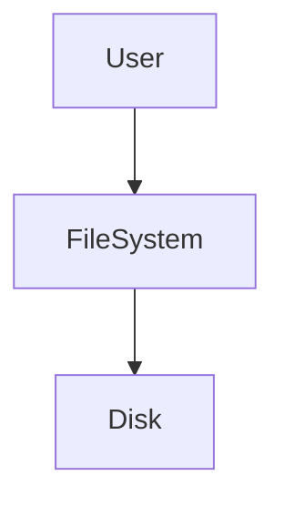

👉 User interacts with files → File system handles actual storage

***

### 2.1 File Concept

***

#### 2.1.1 Definition

> A file is a **collection of related data stored on secondary storage**

**Examples:**

* Text file (.txt)
* Program file (.c, .py)
* Image file (.jpg)

👉 Files are the **basic unit of storage**

***

#### 2.1.2 File Naming

Each file has a **unique name**

**Rules:**

* Consists of name + extension
* Example:
  * `notes.txt`
  * `program.c`

👉 Extension indicates file type

***

#### 2.1.3 File Types

Based on extension:

* `.txt` → Text
* `.exe` → Executable
* `.jpg` → Image

***

#### 2.1.4 Internal File Types

Based on content:

* **Text files** → human-readable
* **Source files** → program code
* **Object files** → compiled code
* **Executable files** → ready to run

***

### 2.2 File Attributes

***

#### 2.2.1 Name

* Human-readable file name

#### 2.2.2 Identifier

* Unique number assigned by OS

#### 2.2.3 Location

* Address of file on disk

#### 2.2.4 Size

* File size in bytes

#### 2.2.5 Protection

* Permissions (read, write, execute)

#### 2.2.6 Time & Date

* Creation, modification, access time

***

### 🧠 Insight

👉 Attributes = **metadata about file**

***

### 2.3 File Operations

***

#### 2.3.1 Create

* Create a new file

#### 2.3.2 Read

* Read data from file

#### 2.3.3 Write

* Write data into file

#### 2.3.4 Delete

* Remove file from system

#### 2.3.5 Open / Close

* Open → prepare file for use
* Close → release resources

#### 2.3.6 Rename

* Change file name

#### 2.3.7 Truncate

* Delete file content but keep file

***

#### 🔁 Flow


***

### 2.4 File Structure

***

#### 2.4.1 Byte Sequence

> File is treated as a sequence of bytes

* No structure
* Used in UNIX

***

#### 2.4.2 Record Structure

> File is divided into records

* Each record has fixed/variable size

***

#### 2.4.3 Tree Structure

> File organized hierarchically

* Used in databases

***

### 2.5 File Access Methods

***

#### 2.5.1 Sequential Access

> Data is accessed **in order**

**Example:**

* Reading file from start to end

✔ Simple\
❌ Slow for random access

***

#### 2.5.2 Direct Access

> Access data at any position

**Example:**

* Jump to record 50

✔ Fast\
✔ Flexible

***

#### 2.5.3 Indexed Access

> Uses index to locate data

**Example:**

* Index → points to records

✔ Efficient\
✔ Fast searching

***

### 2.6 File System Layered Structure

***

#### 🧠 Concept

File system is divided into layers for **modularity and efficiency**

***

#### 🔁 Layered Architecture

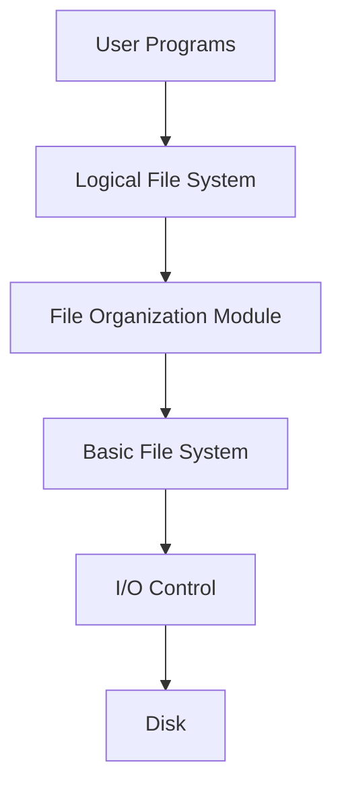

***

#### 2.6.1 Logical File System

* Handles:
  * File naming
  * File attributes
  * Directory structure

***

#### 2.6.2 File Organization Module

* Manages:
  * Allocation of files
  * Logical → physical mapping

***

#### 2.6.3 Basic File System

* Performs:
  * Read/write operations
  * Buffer management

***

#### 2.6.4 I/O Control

* Contains:
  * Device drivers
  * Interrupt handlers

***

### 🔥 Final Summary

| Concept        | Meaning              |
| -------------- | -------------------- |
| File           | Collection of data   |
| Attributes     | Metadata             |
| Operations     | Actions on file      |
| Access methods | How data is accessed |
| Layered FS     | Structured design    |

***

### 🎯 Important Exam Points

* File definition (very common)
* File attributes (short question)
* File operations (list-based question)
* Access methods comparison
* File system layers (diagram important)

***

### 💡 Memory Trick

👉 **F-A-O-A-L**

* F → File
* A → Attributes
* O → Operations
* A → Access
* L → Layers

***

## 3. Directory Structure (Explained Clearly)

A directory is used to **organize files** in a system.

> Just like folders in your computer, directories help **store and locate files efficiently**

***

### 🧠 Core Idea

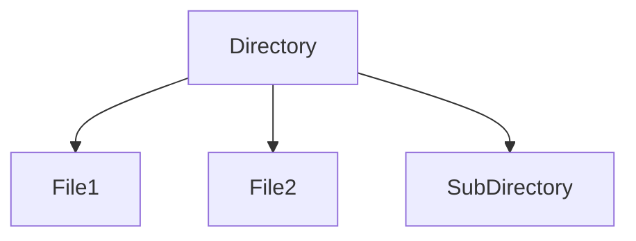

👉 Directory = **container of files and folders**

***

### 3.1 Directory Concept

***

#### 3.1.1 Definition

> A directory is a **special file that stores information about other files**

**It contains:**

* File names
* File locations
* File attributes

👉 It acts like an **index for files**

***

#### 3.1.2 Directory Operations

These are basic operations performed on directories:

***

**3.1.2.1 File Search**

* Locate a file in directory
* OS searches using file name

***

**3.1.2.2 File Creation**

* Add a new file entry
* Allocate space

***

**3.1.2.3 File Deletion**

* Remove file entry
* Free allocated space

***

**3.1.2.4 Listing**

* Display all files in directory

***

### 3.2 Directory Structures

Different ways to organize directories:

***

#### 3.2.1 Single Level Directory

> All files are stored in one directory

***

#### 🔁 Structure

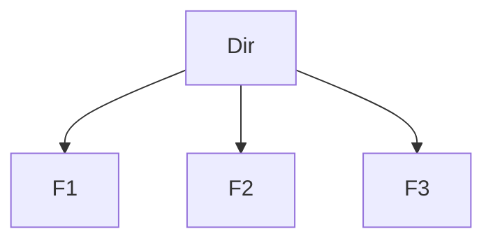

***

**Advantages:**

* Simple

**Disadvantages:**

* File name conflicts
* Not suitable for large systems

***

#### 3.2.2 Two Level Directory

> Separate directory for each user

***

#### 🔁 Structure

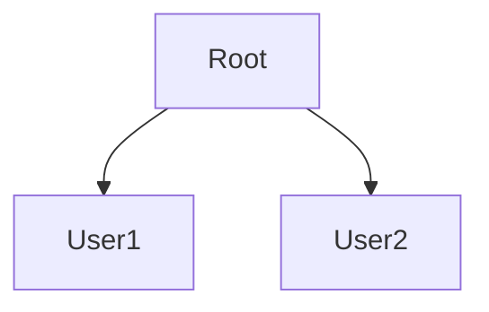

***

**Advantages:**

* No name conflict between users

**Disadvantages:**

* Limited sharing

***

#### 3.2.3 Tree Structure Directory

> Hierarchical structure (most common)

***

#### 🔁 Structure

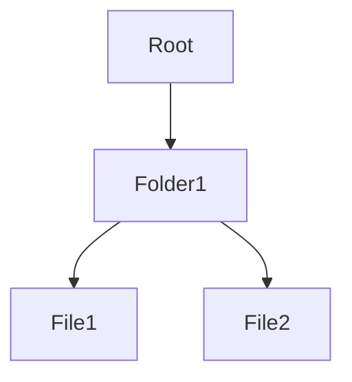

***

**Advantages:**

* Organized
* Easy navigation

***

#### 3.2.4 Acyclic Graph Directory

> Allows sharing of files/directories without cycles

***

#### 🔁 Structure

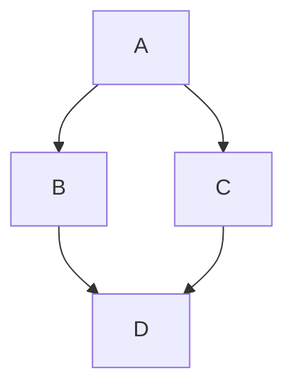

***

**Advantage:**

* File sharing

**Restriction:**

* No cycles allowed

***

#### 3.2.5 General Graph Directory

> Allows cycles (loops)

***

#### 🔁 Structure

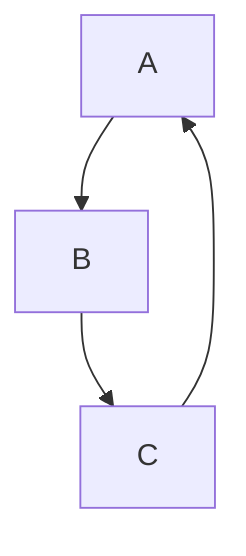

***

**Advantage:**

* Maximum flexibility

**Disadvantage:**

* Complex
* Risk of infinite loops

***

### 3.3 Path Names

***

#### 3.3.1 Absolute Path

> Full path from root directory

**Example:**

```
/home/user/file.txt
```

✔ Unique\
✔ Clear

***

#### 3.3.2 Relative Path

> Path relative to current directory

**Example:**

```
docs/file.txt
```

✔ Short\
✔ Convenient

***

### 🧠 Insight

* Absolute → starts from root
* Relative → starts from current location

***

### 3.4 Directory Implementation

***

#### 3.4.1 Linear List

> Directory stored as a simple list

**Features:**

* Easy to implement

**Disadvantages:**

* Slow search

***

#### 3.4.2 Hash Table

> Uses hashing for faster lookup

**Features:**

* Faster search

**Disadvantages:**

* Collision handling needed

***

### 🔥 Final Summary

| Concept        | Meaning                    |
| -------------- | -------------------------- |
| Directory      | Collection of file entries |
| Structure      | Organization method        |
| Path           | File location              |
| Implementation | How directory is stored    |

***

### 🎯 Important Exam Points

* Directory structures (very important)
* Tree vs Graph comparison
* Absolute vs Relative path
* Directory operations

***

### 💡 Memory Trick

👉 **S-T-A-G**

* S → Single level
* T → Two level
* A → Acyclic graph
* G → General graph

***

## 4. File Allocation Methods (Explained Clearly)

File allocation methods define **how files are stored on disk blocks**.

> OS must decide **where and how to place file data on disk**

***

### 🧠 Core Idea

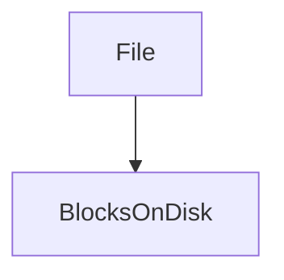

👉 A file is divided into **blocks**, and these blocks must be stored efficiently

***

### 4.1 Contiguous Allocation

***

#### 4.1.1 Concept

> File is stored in **continuous (adjacent) blocks** on disk

***

#### 🔁 Example

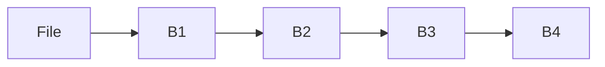

👉 All blocks are next to each other

***

#### How it works:

* Store:
  * Starting block
  * Length of file

***

#### 4.1.2 Advantages

* Fast access (both sequential & direct)
* Simple implementation
* Minimal disk seek time

***

#### 4.1.3 Disadvantages

* **External fragmentation**
* Difficult to expand file
* Requires large continuous space

***

### 4.2 Linked Allocation

***

#### 4.2.1 Concept

> File is stored as a **linked list of blocks**

Each block contains:

* Data
* Pointer to next block

***

#### 🔁 Example

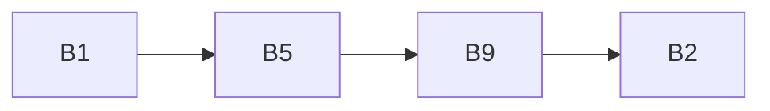

👉 Blocks are scattered but connected

***

#### 4.2.2 Advantages

* No external fragmentation
* Easy to grow file
* Flexible

***

#### 4.2.3 Disadvantages

* Slow access (must follow links)
* Pointer overhead
* Cannot support efficient random access

***

### 4.3 Indexed Allocation

***

#### 4.3.1 Concept

> Uses an **index block** to store addresses of all file blocks

***

#### 🔁 Structure

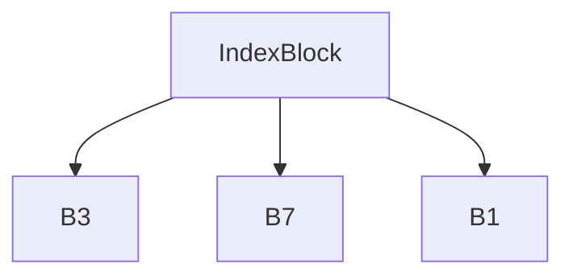

***

#### 4.3.2 Index Block

* Contains list of:
  * Block addresses

👉 OS directly accesses any block using index

***

#### 4.3.3 Advantages

* Supports direct access
* No external fragmentation
* Efficient for large files

***

#### 4.3.4 Disadvantages

* Extra memory for index block
* Overhead for small files
* Complex implementation

***

### 🔥 Final Comparison

| Method     | Storage      | Access | Fragmentation |
| ---------- | ------------ | ------ | ------------- |
| Contiguous | Continuous   | Fast   | External      |
| Linked     | Scattered    | Slow   | None          |
| Indexed    | Indexed list | Fast   | None          |

***

### 🎯 Important Exam Points

* Compare all 3 methods (very common)
* Advantages/disadvantages
* Diagrams (high scoring)
* Which method supports random access → Indexed

***

### 💡 Memory Trick

👉 **C-L-I**

* C → Contiguous
* L → Linked
* I → Indexed

***

### 🧠 Final Insight

* Contiguous → **fast but rigid**
* Linked → **flexible but slow**
* Indexed → **balanced (best practical)**

***

## 5. Free Space Management (Explained Clearly)

Free space management is about **keeping track of unused disk blocks**.

> OS must know which blocks are **free** so it can allocate them to new files

***

### 🧠 Core Idea

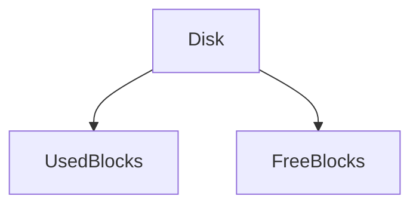

👉 OS maintains a structure to track **free blocks**

***

### 5.1 Bit Map (Bit Vector)

***

#### 5.1.1 Concept

> Each disk block is represented by a **bit (0 or 1)**

**Representation:**

* `0` → Free block
* `1` → Allocated block

***

#### 🔁 Example

```
Block No:   0 1 2 3 4 5 6 7
Bit Map:    1 0 1 1 0 0 1 0
```

👉 Free blocks = 1, 4, 5, 7

***

#### 5.1.2 Working

* OS scans bitmap
* Finds free block (bit = 0)
* Allocates it

***

#### Advantages:

* Simple
* Easy to find contiguous blocks

***

#### Disadvantages:

* Requires extra memory for bitmap
* Scanning can be slow for large disks

***

### 5.2 Linked List

***

#### 5.2.1 Concept

> Free blocks are linked together as a **linked list**

Each free block stores:

* Pointer to next free block

***

#### 🔁 Example

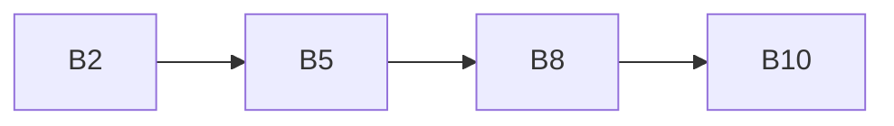

👉 These are free blocks

***

#### 5.2.2 Working

* OS keeps pointer to first free block
* Allocate → remove from list
* Free → add back to list

***

#### Advantages:

* No extra memory needed (stored in blocks)
* Simple

***

#### Disadvantages:

* Slow to find large contiguous blocks
* Sequential access only

***

### 5.3 Grouping Method

***

#### 5.3.1 Concept

> Instead of storing one pointer, a block stores **multiple free block addresses**

👉 Improves efficiency over linked list

***

#### 🔁 Structure

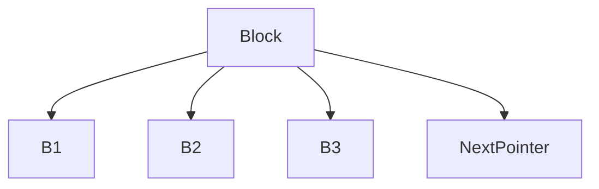

***

#### 5.3.2 Working

* First free block contains:
  * List of free blocks
  * Pointer to next group
* OS uses this list to allocate blocks quickly

***

#### Advantages:

* Faster than linked list
* Can allocate multiple blocks at once

***

#### Disadvantages:

* Slightly complex
* Extra management needed

***

### 🔥 Final Comparison

| Method      | Structure         | Speed  | Suitable For   |
| ----------- | ----------------- | ------ | -------------- |
| Bit Map     | Array of bits     | Medium | General use    |
| Linked List | Chain of blocks   | Slow   | Simple systems |
| Grouping    | Block of pointers | Fast   | Large systems  |

***

### 🎯 Important Exam Points

* Bit map representation (very common)
* Linked list vs grouping comparison
* Advantages/disadvantages
* Which method is fastest → Grouping

***

### 💡 Memory Trick

👉 **B-L-G**

* B → Bit Map
* L → Linked List
* G → Grouping

***

### 🧠 Final Insight

* Bit map → **easy & visual**
* Linked list → **simple but slow**
* Grouping → **optimized version of linked list**

***

## 6. File System Implementation (Explained Clearly)

File system implementation describes **how files are actually stored and managed internally** by the OS.

> It involves structures on disk + structures in memory for efficient access

***

### 🧠 Core Idea

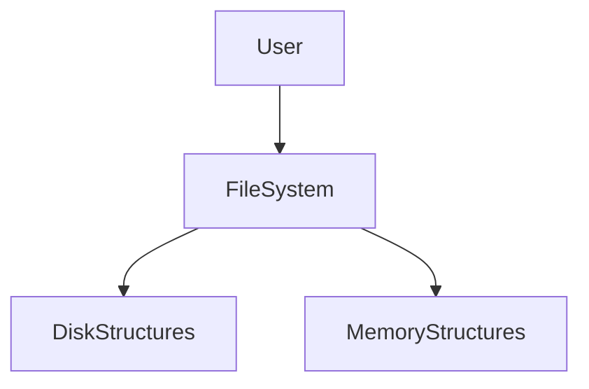

👉 OS uses both **disk + memory structures** to manage files efficiently

***

## 6.1 On-Disk Structures

These structures are stored **permanently on disk**

***

### 6.1.1 Boot Control Block

> Contains information needed to **boot the system**

**Key Points:**

* Located at beginning of disk
* Contains bootstrap program
* Loads OS into memory

***

### 6.1.2 Volume Control Block

> Stores information about the entire file system (also called **superblock**)

**Contains:**

* Total number of blocks
* Free block count
* File system size
* Pointer to free space

***

### 6.1.3 Directory Structure

> Stores information about files and directories

**Contains:**

* File names
* Locations
* Attributes

👉 Helps in **file organization and lookup**

***

### 6.1.4 File Control Block (FCB)

> Contains metadata about a file

***

#### 🔍 FCB contains:

* File name
* Size
* Location
* Permissions
* Timestamps

***

#### 🔁 Concept

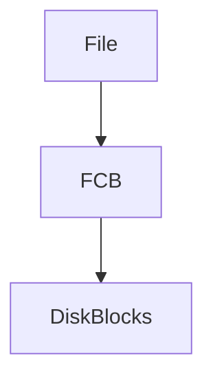

👉 FCB acts like a **record for each file**

***

## 6.2 In-Memory Structures

These structures exist **temporarily in RAM** for faster access

***

### 6.2.1 In-Memory Partition Table

> Stores information about mounted file systems

**Purpose:**

* Tracks available partitions
* Helps OS access different disks

***

### 6.2.2 Directory Cache

> Stores recently accessed directory entries

**Benefit:**

* Faster file lookup
* Reduces disk access

***

### 6.2.3 Open File Table

> Tracks files currently opened by processes

***

#### Contains:

* File pointer
* Access mode
* File status

***

#### 🔁 Concept

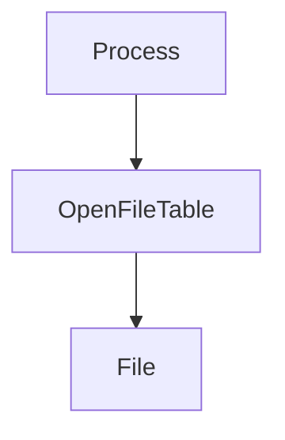

👉 Avoids repeated disk access

***

## 6.3 Virtual File System (VFS)

***

### 6.3.1 Concept

> VFS provides a **uniform interface for different file systems**

***

#### Example:

* FAT
* NTFS
* EXT4

👉 All accessed through same interface

***

#### 🔁 Architecture

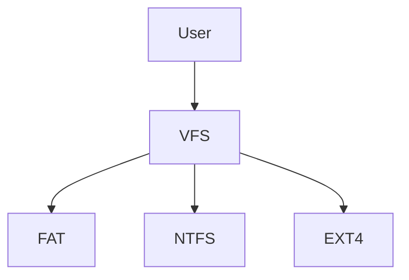

***

### 6.3.2 Purpose

* Supports multiple file systems
* Provides abstraction
* Simplifies OS design

***

### 🔥 Final Summary

| Structure       | Purpose           |
| --------------- | ----------------- |
| Boot Block      | Start system      |
| Volume Block    | File system info  |
| Directory       | File organization |
| FCB             | File metadata     |
| Open File Table | Track open files  |
| VFS             | Uniform interface |

***

### 🎯 Important Exam Points

* FCB (very important)
* On-disk vs In-memory structures
* VFS concept (common theory question)
* Directory cache & open file table

***

### 💡 Memory Trick

👉 **B-V-D-F-O-V**

* B → Boot block
* V → Volume block
* D → Directory
* F → FCB
* O → Open file table
* V → VFS

***

### 🧠 Final Insight

* Disk structures = **permanent storage**
* Memory structures = **fast access support**
* VFS = **universal interface**

***

## 7. File Protection and Security (Explained Clearly)

File protection ensures that **only authorized users can access or modify files**.

> It is essential for **data security, privacy, and system integrity**

***

### 🧠 Core Idea

```mermaid
flowchart TD
    User --> CheckPermissions
    CheckPermissions -->|Allowed| AccessFile
    CheckPermissions -->|Denied| Reject
```

👉 OS controls **who can do what with a file**

***

### 7.1 Access Control

***

#### 7.1.1 Access Types

These define **what operations are allowed on a file**

**Common Access Types:**

* **Read (R)** → View file content
* **Write (W)** → Modify file
* **Execute (X)** → Run file
* **Append (A)** → Add data at end
* **Delete (D)** → Remove file

***

#### 7.1.2 User Categories

Users are grouped to manage permissions easily:

* **Owner** → Creator of file
* **Group** → Users in same group
* **Others** → All remaining users

***

#### 🔍 Example

| User   | Permission  |
| ------ | ----------- |
| Owner  | Read, Write |
| Group  | Read        |
| Others | No access   |

***

### 7.2 Protection Mechanisms

***

### 7.2.1 Access Control List (ACL)

> ACL is a list that defines **permissions for each user**

***

#### 🔁 Structure

```mermaid
flowchart TD
    File --> User1[User1: RW]
    File --> User2[User2: R]
    File --> User3[User3: No Access]
```

***

#### Features:

* Fine-grained control
* Different permissions for different users

***

#### Advantages:

* Flexible
* Detailed security

***

#### Disadvantages:

* Complex for large systems

***

### 7.2.2 Permission Bits

> Permissions are stored as **bits (binary flags)**

***

#### Format (UNIX style):

```
rwx rwx rwx
```

* First → Owner
* Second → Group
* Third → Others

***

#### Example:

```
rwx r-x r--
```

* Owner → full access
* Group → read + execute
* Others → read only

***

#### Advantages:

* Simple
* Efficient

***

#### Disadvantages:

* Less flexible than ACL

***

### 7.3 File Sharing

***

#### 7.3.1 Modes

File sharing allows multiple users/processes to access files.

**Types:**

* **Read-only sharing**
  * Multiple users can read
* **Read-write sharing**
  * Users can modify file

***

#### 🔁 Example

```mermaid
flowchart TD
    User1 --> File
    User2 --> File
```

***

#### 7.3.2 Issues

Sharing introduces problems:

**1. Consistency Problem**

* Multiple users modifying file → conflict

**2. Synchronization Issue**

* Need control mechanisms (locks)

**3. Security Risk**

* Unauthorized access

***

### 🔥 Final Summary

| Concept         | Meaning               |
| --------------- | --------------------- |
| Access Types    | Operations allowed    |
| User Categories | Owner, group, others  |
| ACL             | Detailed permissions  |
| Permission Bits | Simple permissions    |
| File Sharing    | Multiple users access |

***

### 🎯 Important Exam Points

* ACL vs Permission bits (very common)
* Access types (short question)
* User categories
* File sharing issues

***

### 💡 Memory Trick

👉 **A-U-P-S**

* A → Access types
* U → Users
* P → Permissions
* S → Sharing

***

### 🧠 Final Insight

* Security = **who can access + what they can do**
* ACL = detailed control
* Permission bits = simple control

***

## 8. File System Performance (Explained Clearly)

File system performance determines **how fast data can be read from or written to disk**.

> Since disk operations are slow, optimizing them is **very important for overall system performance**

***

### 🧠 Core Idea

```mermaid
flowchart TD
    Request --> DiskAccess
    DiskAccess --> Delay
    Optimization --> FasterAccess
```

👉 Goal = **reduce delay in disk access**

***

## 8.1 Performance Factors

These factors directly affect how fast disk operations happen.

***

### 8.1.1 Disk Access Time

> Total time required to **read/write data from disk**

***

#### Formula:

```
Disk Access Time = Seek Time + Rotational Latency + Transfer Time
```

***

#### Components:

* Seek Time
* Rotational Latency
* Transfer Time

👉 Lower access time = better performance

***

### 8.1.2 Seek Time

> Time taken by disk head to move to correct track

***

#### Key Points:

* Largest component of delay
* Depends on distance moved

***

#### 🔍 Example:

* Moving from track 10 → track 200 → high seek time

***

### 8.1.3 Latency (Rotational Latency)

> Time taken for disk to rotate and bring required sector under head

***

#### Key Points:

* Depends on disk speed (RPM)
* Faster disk → lower latency

***

#### 🔍 Example:

* If disk spins at 7200 RPM → faster access

***

### 🧠 Insight

👉 Most delay comes from:

* Seek time
* Latency

***

## 8.2 Optimization Techniques

To improve performance, OS uses several techniques:

***

### 8.2.1 Caching

> Frequently accessed data is stored in **fast memory (cache)**

***

#### 🔁 Concept

```mermaid
flowchart LR
    CPU --> Cache --> Disk
```

***

#### Benefits:

* Reduces disk access
* Faster data retrieval

***

#### Example:

* Recently opened file stored in cache

***

### 8.2.2 Buffering

> Temporary storage used during data transfer

***

#### Purpose:

* Smooth data flow
* Reduce speed mismatch (CPU vs disk)

***

#### 🔁 Example

```mermaid
flowchart TD
    Disk --> Buffer --> CPU
```

***

#### Types:

* Single buffering
* Double buffering
* Circular buffering

***

### 8.2.3 Disk Scheduling Impact

> Order of disk requests affects performance

***

#### Idea:

* Arrange requests to reduce head movement

***

#### 🔁 Example

Without scheduling:

```
Requests: 10 → 200 → 20 → 180
```

With scheduling:

```
Optimized: 10 → 20 → 180 → 200
```

👉 Less movement → faster access

***

#### Common Algorithms:

* FCFS
* SSTF
* SCAN

***

### 🔥 Final Summary

| Factor      | Meaning                    |
| ----------- | -------------------------- |
| Seek Time   | Head movement time         |
| Latency     | Rotation delay             |
| Access Time | Total delay                |
| Caching     | Store frequently used data |
| Buffering   | Temporary storage          |
| Scheduling  | Optimize request order     |

***

### 🎯 Important Exam Points

* Disk access time formula (very important)
* Seek time vs latency
* Caching vs buffering
* Role of disk scheduling

***

### 💡 Memory Trick

👉 **S-L-C-B-S**

* S → Seek time
* L → Latency
* C → Caching
* B → Buffering
* S → Scheduling

***

### 🧠 Final Insight

* Disk is the **slowest component**
* Performance improves by:
  * Reducing head movement
  * Reducing disk access
  * Using memory efficiently

***

## 9. Disk Structure (Explained Clearly)

Disk structure explains **how data is physically organized on storage devices (HDD/SSD)**.

> Understanding disk structure helps in **efficient data storage and retrieval**

***

### 🧠 Core Idea

```mermaid
flowchart TD
    Disk --> Platters --> Tracks --> Sectors --> Data
```

👉 Data is stored in a **hierarchical physical structure**

***

## 9.1 Disk Basics

***

### 9.1.1 Disk Concept

> A disk is a **secondary storage device** used to store data permanently

**Key Features:**

* Non-volatile (data not lost on power off)
* Large storage capacity
* Slower than RAM

***

### 9.1.2 Storage Technologies

#### 🔹 Magnetic Disks (HDD)

<div align="center" data-with-frame="true"></img></div>


* Uses magnetic coating
* Data stored using magnetism
* Mechanical movement involved

***

#### 🔹 Solid State Drives (SSD)


* Uses flash memory
* No moving parts
* Faster than HDD

***

### 🧠 Insight

* HDD → cheaper, slower
* SSD → faster, expensive

***

## 9.2 Disk Geometry

Disk geometry describes **physical layout of disk**

***

### 9.2.1 Platters

> Circular disks coated with magnetic material

* Multiple platters stacked
* Both sides used for storage

***

### 9.2.2 Tracks

> Concentric circles on platter

* Data stored along tracks

***

### 9.2.3 Sectors

> Smallest unit of storage

* Each track divided into sectors
* Typically 512 bytes or 4KB

***

### 9.2.4 Cylinders

> Set of tracks at same position across all platters

***

#### 🔁 Concept

```mermaid
flowchart TD
    Platter1 --> Track1
    Platter2 --> Track1
    Platter3 --> Track1
```

👉 All aligned tracks = cylinder

***

### 9.2.5 Clusters

> Group of sectors treated as a unit

* Used by file system
* Improves efficiency

***

### 🧠 Insight

* Sector → smallest physical unit
* Cluster → logical unit used by OS

***

## 9.3 Disk Mapping

***

### 9.3.1 Logical Block Addressing (LBA)

> Data is addressed using **linear block numbers**

***

#### 🔁 Concept

```mermaid
flowchart LR
    Block0 --> Block1 --> Block2 --> Block3
```

👉 Simplifies addressing

***

### 9.3.2 Physical Mapping

> Converts logical address → physical location

***

#### Mapping:

* Logical → Cylinder
* Cylinder → Track
* Track → Sector

***

#### 🔁 Flow

```mermaid
flowchart TD
    LogicalBlock --> Cylinder --> Track --> Sector
```

***

### 🧠 Insight

* LBA hides physical complexity
* OS uses logical addressing

***

## 9.4 Disk Capacity

***

### 9.4.1 CHS Calculation

> Disk capacity is calculated using:

***

#### Formula:

```
Capacity = Cylinders × Heads × Sectors × Bytes per Sector
```

***

#### 🔍 Example:

```
Cylinders = 1000
Heads = 4
Sectors = 100
Bytes = 512

Capacity = 1000 × 4 × 100 × 512
         = 204,800,000 bytes (~200 MB)
```

***

### 🔥 Final Summary

| Component | Meaning            |
| --------- | ------------------ |
| Platter   | Disk surface       |
| Track     | Circular path      |
| Sector    | Smallest unit      |
| Cylinder  | Group of tracks    |
| Cluster   | Group of sectors   |
| LBA       | Logical addressing |

***

### 🎯 Important Exam Points

* Disk geometry (diagram very important)
* Sector vs cluster
* LBA concept
* CHS formula (numerical asked)

***

### 💡 Memory Trick

👉 **P-T-S-C-C**

* P → Platter
* T → Track
* S → Sector
* C → Cylinder
* C → Cluster

***

### 🧠 Final Insight

* Disk structure = **physical organization**
* OS uses logical abstraction (LBA)
* Performance depends on geometry + access

***

## 10. Disk Scheduling (Explained Clearly)

Disk scheduling decides **the order in which disk I/O requests are processed**.

> Goal: **Minimize disk head movement → reduce seek time → improve performance**

***

### 🧠 Core Idea

```mermaid
flowchart TD
    Requests --> SchedulingAlgorithm --> OptimizedOrder --> FasterAccess
```

👉 Better scheduling = faster disk performance

***

## 10.1 Disk Access Time

Disk access time is the **total time to access data from disk**

***

### 10.1.1 Seek Time

> Time taken to move disk head to correct track

* Largest delay
* Depends on distance

***

### 10.1.2 Rotational Latency

> Time for disk to rotate and bring sector under head

* Depends on disk speed (RPM)

***

### 10.1.3 Transfer Time

> Time to actually read/write data

* Usually small compared to others

***

### 🧠 Formula

```
Access Time = Seek Time + Latency + Transfer Time
```

***

## 10.2 Scheduling Algorithms

These algorithms decide **which request to serve next**

***

### 10.2.1 FCFS (First Come First Serve)

> Serve requests in order of arrival

***

#### Example:

```
Queue: 10 → 180 → 40 → 120
```

***

#### Advantages:

* Simple
* Fair

#### Disadvantages:

* High head movement
* Poor performance

***

### 10.2.2 SSTF (Shortest Seek Time First)

> Select request closest to current head position

***

#### Example:

* Head at 50
* Requests: 10, 40, 100

👉 Choose 40

***

#### Advantages:

* Reduced seek time

#### Disadvantages:

* **Starvation possible**

***

### 10.2.3 SCAN (Elevator Algorithm)

> Head moves in one direction servicing requests, then reverses

***

#### 🔁 Movement

```mermaid
flowchart LR
    Start --> Right --> End --> Left
```

***

#### Advantages:

* Better than FCFS
* Reduced starvation

***

### 10.2.4 C-SCAN (Circular SCAN)

> Head moves in one direction only, then jumps back

***

#### 🔁 Movement

```mermaid
flowchart LR
    Start --> Right --> End --> Jump --> Start
```

***

#### Advantages:

* Uniform wait time

***

### 10.2.5 LOOK

> Similar to SCAN but stops at last request (not disk end)

***

#### Advantage:

* Avoids unnecessary movement

***

### 10.2.6 C-LOOK

> Similar to C-SCAN but jumps only between requests

***

#### Advantage:

* More efficient than C-SCAN

***

### 🧠 Insight

| Algorithm | Idea             |
| --------- | ---------------- |
| FCFS      | Order-based      |
| SSTF      | Closest request  |
| SCAN      | Elevator         |
| C-SCAN    | Circular         |
| LOOK      | Optimized SCAN   |
| C-LOOK    | Optimized C-SCAN |

***

## 10.3 Performance Metrics

***

### 10.3.1 Total Head Movement

> Total distance moved by disk head

* Lower movement → better performance

***

#### 🔍 Example:

```
Head moves: 50 → 100 → 20 → 150
Total movement = sum of distances
```

***

### 10.3.2 Throughput

> Number of requests served per unit time

* Higher throughput → better performance

***

### 10.3.3 Starvation

> Some requests may never be served

***

#### Occurs in:

* SSTF

***

#### Example:

* Requests far from head are ignored repeatedly

***

### 🔥 Final Summary

| Algorithm | Advantage      | Disadvantage    |
| --------- | -------------- | --------------- |
| FCFS      | Simple         | Slow            |
| SSTF      | Fast           | Starvation      |
| SCAN      | Balanced       | Slight delay    |
| C-SCAN    | Uniform wait   | Jump overhead   |
| LOOK      | Efficient      | Complex         |
| C-LOOK    | Best optimized | Slight overhead |

***

### 🎯 Important Exam Points

* FCFS vs SSTF vs SCAN (very common)
* SCAN vs C-SCAN vs LOOK
* Starvation concept
* Total head movement numericals

***

### 💡 Memory Trick

👉 **F-S-S-C-L-C**

* F → FCFS
* S → SSTF
* S → SCAN
* C → C-SCAN
* L → LOOK
* C → C-LOOK

***

### 🧠 Final Insight

* Disk scheduling = **optimization problem**
* Best practical:
  * SCAN / LOOK
* Avoid:
  * SSTF (starvation risk)

***

## 11. Disk Management (Explained Clearly)

Disk management deals with **how the OS initializes, organizes, and maintains disks**, including booting, reliability, and handling errors.

> It ensures the system **starts correctly and stores data safely**

***

### 🧠 Core Idea

```mermaid
flowchart TD
    PowerOn --> BootProcess --> OSLoaded --> DiskUsage
```

👉 Disk management starts from **booting → ends with reliable storage**

***

## 11.1 Booting Process

***

### 11.1.1 Bootstrap Program

> A small program that **loads the operating system into memory**

* Stored in ROM
* Runs automatically when system starts

***

### 11.1.2 ROM (Read Only Memory)

> Permanent memory that contains bootstrap code

* Non-volatile
* Cannot be easily modified

***

### 11.1.3 Boot Block

> Special disk sector containing boot information

* Located at start of disk
* Helps in loading OS

***

### 🧠 Insight

👉 Booting = **ROM → Disk → OS**

***

## 11.2 Boot Process Flow

***

### 🔁 Step-by-Step Flow

```mermaid
flowchart TD
    A[Power ON] --> B[ROM executes]
    B --> C[Load MBR]
    C --> D[Load Boot Sector]
    D --> E[Load OS into RAM]
```

***

### 11.2.1 ROM → MBR

* ROM executes bootstrap program
* Loads **Master Boot Record (MBR)**

***

### 11.2.2 MBR → Boot Sector

* MBR identifies active partition
* Loads its boot sector

***

### 11.2.3 Boot Sector → OS Loading

* Boot sector loads OS kernel into memory
* OS starts execution

***

## 11.3 Disk Logical Structure

***

#### 🔁 Structure

```mermaid
flowchart LR
    MBR --> DBR --> FAT --> Root --> Data
```

***

### 11.3.1 Master Boot Record (MBR)

> First sector of disk

Contains:

* Bootloader
* Partition table

***

### 11.3.2 DOS Boot Record (DBR)

> Boot sector of a partition

* Contains file system info
* Helps load OS

***

### 11.3.3 File Allocation Table (FAT)

> Tracks allocation of disk blocks

* Shows which blocks belong to which file

***

### 11.3.4 Root Directory

* Contains file entries
* Starting point of file system

***

### 11.3.5 Data Area

* Actual storage of file data

***

### 🧠 Insight

👉 Disk = **Control info + Directory + Data**

***

## 11.4 FAT Details

***

### 11.4.1 FAT Entries

Each entry represents a **cluster status**

***

### 11.4.2 Free Cluster

* Available for allocation

***

### 11.4.3 Bad Sector

* Damaged and unusable

***

### 11.4.4 End of File (EOF)

* Marks end of file

***

#### 🔁 Example

```
Cluster 1 → 2 → 5 → EOF
```

***

### 🧠 Insight

👉 FAT acts like a **linked list of clusters**

***

## 11.5 Disk Reliability

***

### 11.5.1 RAID Concept

> RAID = Redundant Array of Independent Disks

👉 Combines multiple disks for:

* Performance
* Reliability

***

### 11.5.2 RAID Levels

***

#### 🔹 RAID 0 (Striping)


* Splits data across disks\
  ✔ Fast\
  ❌ No protection

***

#### 🔹 RAID 1 (Mirroring)


* Duplicate data\
  ✔ High reliability\
  ❌ Double storage

***

#### 🔹 RAID 5 (Parity)


* Uses parity for recovery\
  ✔ Balanced\
  ✔ Fault tolerant

***

#### 🔹 RAID 10 (1+0)


* Combination of RAID 0 + RAID 1\
  ✔ Fast + reliable\
  ❌ Expensive

***

## 11.6 Bad Blocks

***

### 11.6.1 Definition

> Bad blocks are **damaged disk areas that cannot store data**

***

### 11.6.2 Causes

* Physical damage
* Manufacturing defects
* Wear and tear

***

### 11.6.3 Detection

* Disk scanning tools
* Error detection codes

***

### 11.6.4 Management

* Mark block as unusable
* Replace with spare block
* Use RAID for recovery

***

### 🔥 Final Summary

| Concept   | Meaning            |
| --------- | ------------------ |
| Booting   | Start OS           |
| MBR       | First disk sector  |
| FAT       | Tracks file blocks |
| RAID      | Reliability        |
| Bad Block | Damaged area       |

***

### 🎯 Important Exam Points

* Boot process flow (very common)
* MBR vs DBR
* FAT working
* RAID levels comparison
* Bad blocks handling

***

### 💡 Memory Trick

👉 **B-M-F-R-B**

* B → Boot
* M → MBR
* F → FAT
* R → RAID
* B → Bad blocks

***

### 🧠 Final Insight

* Booting = **system startup process**
* FAT = **file tracking system**
* RAID = **data safety mechanism**

***

<h2 align="center"><a data-footnote-ref href="#user-content-fn-1">END</a></h2>

[^1]: This is the end.
