# Unit - 1
:::info[TITLE]
## Introduction
:::


## 1. Introduction to Python Programming


### 1.1 Overview of Python

#### 1.1.1 Definition of Python

- Python is a **high-level, general-purpose, interpreted programming language**.
- Designed with an emphasis on **code readability** and **simplicity**.
- Uses **English-like syntax**, reducing the cost of program maintenance.
- Supports **multiple programming paradigms**:
    - Procedural
    - Object-Oriented
    - Functional
- Python is **dynamically typed**, meaning variable types are determined at runtime.
- Source code is compiled into **bytecode** and executed by the **Python Virtual Machine (PVM)**.
- Common use areas:
    - Web development
    - Data science
    - Artificial Intelligence & Machine Learning
    - Automation & scripting
    - Cybersecurity tools
    - Scientific computing


#### 1.1.2 High-level Language Concept

- A **high-level language** abstracts hardware details from the programmer.
- Python code is **human-readable** and closer to natural language.
- Programmer does **not manage memory manually**.
- Hardware-dependent tasks are handled by the interpreter/runtime.
- Compared to low-level languages (C, Assembly):
    - Easier to learn
    - Slower execution (but faster development)
    - Portable across platforms

**Characteristics of Python as a high-level language:**

- Automatic memory management (Garbage Collection)
- Platform independence
- Rich standard library
- No pointer arithmetic exposed to user
- Strong abstraction from CPU and memory architecture


### 1.2 History of Python

#### 1.2.1 Guido van Rossum

- Python was created by **Guido van Rossum**, a Dutch programmer.
- Development started in the **late 1980s**.
- Inspired by the **ABC programming language**.
- Guido’s goals:
    - Simple and readable syntax
    - Powerful but beginner-friendly
- First public release:
    - **Python 0.9.0** in **1991**
- Guido van Rossum is often referred to as:
    - **BDFL (Benevolent Dictator For Life)** until 2018


#### 1.2.2 Python Version Evolution

- **Python 1.x**
    - Early versions
    - Core language features established
- **Python 2.x (2000–2020)**
    - Introduced list comprehensions
    - Unicode support (limited)
    - End of Life: **January 1, 2020**
- **Python 3.x (2008–present)**
    - Improved Unicode support
    - Cleaner syntax
    - Better memory management
    - Python 2 backward compatibility intentionally broken
- Modern Python development uses **Python 3 only**

**Important Python 3 improvements:**

- `print` as a function
- True division by default
- Better string handling (Unicode by default)
- Improved libraries and performance optimizations


### 1.3 Popularity and Use Cases

#### 1.3.1 Industry Adoption

- Python is one of the **most popular programming languages worldwide**.
- Widely adopted due to:
    - Large developer community
    - Extensive third-party libraries
    - Cross-platform support
- Used by major companies:
    - Google
    - Netflix
    - Facebook (Meta)
    - Amazon
    - Microsoft
- Popular in academia and research institutions.
- Preferred language for:
    - Rapid prototyping
    - Automation scripts
    - Data analysis pipelines
- Strong presence in **Cybersecurity**:
    - Penetration testing tools
    - Network scanning
    - Malware analysis
    - Automation of security tasks


#### Python Program Examples (Grouped)

```python showLineNumbers
## Example 1: Basic Python Program
print("Hello, Python")
```

```python showLineNumbers
## Example 2: Demonstrating readability
a = 10
b = 20
sum = a + b
print("Sum:", sum)
```

```python showLineNumbers
## Example 3: Dynamic typing demonstration
x = 10
x = "Python"
print(x)
```

```python showLineNumbers
## Example 4: Platform-independent script
import sys
print("Running on:", sys.platform)
```

## 2. Features of Python

### 2.1 Easy to Use and Read

- Python emphasizes **human readability** over machine convenience.
- Uses **simple, expressive syntax** that closely resembles English.
- No use of:
    - Semicolons (`;`)
    - Curly braces (`{}`) for blocks
- **Indentation is mandatory**, which enforces a uniform coding style.
- Reduces ambiguity and improves code consistency across teams.
- Encourages writing **less code to achieve more functionality**.
- Follows the philosophy of *“Readability counts”*.

**Impact on software development:**

- Faster learning curve
- Reduced development time
- Fewer syntax-related bugs
- Easier debugging and maintenance

```python showLineNumbers
## Readable and clean syntax example
for i in range(3):
    print("Python is easy to read")
```


### 2.2 Dynamically Typed

- Python does **not require explicit type declaration**.
- The **type is determined at runtime**, based on the assigned value.
- Variables act as **references to objects**, not containers of values.
- Type information is stored with the **object in memory**, not the variable.

**Consequences:**

- High flexibility in coding
- Faster prototyping
- Possibility of runtime type errors if not handled carefully

**Internal behavior:**

- Interpreter performs type checking during execution.

```python showLineNumbers
## Dynamic typing demonstration
x = 10
x = 3.14
x = "Python"
print(x)
```


### 2.3 High-Level Language

- Python abstracts low-level operations from the programmer.
- Programmer does not manage:
    - Memory allocation
    - CPU registers
    - Hardware-specific instructions
- Enables focus on **problem-solving rather than system internals**.
- Uses automatic memory management.

**Advantages over low-level languages:**

- Platform independence
- Improved safety
- Reduced development complexity

```python showLineNumbers
## No manual memory handling required
a = 100
b = 200
print(a + b)
```


### 2.4 Compiled and Interpreted Nature

- Python combines **compilation and interpretation**.
- Execution stages:
    1. Source code (`.py`) is compiled into **bytecode**
    2. Bytecode is executed by the **Python Virtual Machine (PVM)**
- Bytecode improves execution speed compared to direct interpretation.
- Bytecode is platform-independent.

```python showLineNumbers
## Checking bytecode generation
import os
print("__pycache__" in os.listdir())
```

#### Execution Flow

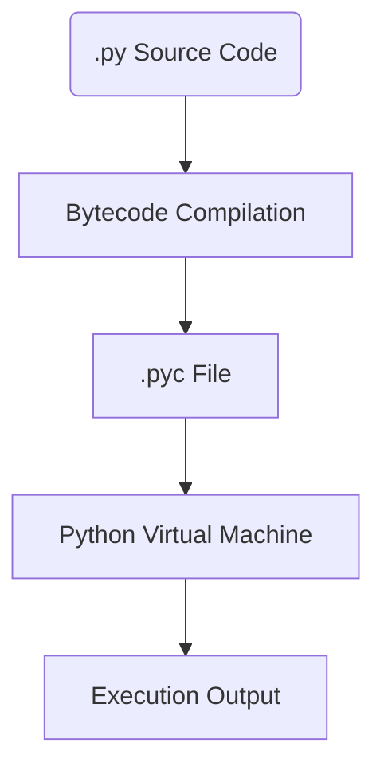


#### 2.4.1 CPython

- **CPython** is the default and reference implementation of Python.
- Written in **C language**.
- Responsible for:
    - Bytecode compilation
    - Memory management
    - Garbage collection
- Defines Python’s behavior and standards.
- Other implementations exist but follow CPython semantics.

```python showLineNumbers
## Checking Python implementation
import platform
print(platform.python_implementation())
```


### 2.5 Garbage Collection

- Python uses **automatic garbage collection**.
- Two mechanisms:
    - **Reference Counting**
    - **Cyclic Garbage Collection**

**Reference Counting:**

- Every object tracks how many references point to it.
- Object is destroyed when reference count becomes zero.

**Cyclic Garbage Collector:**

- Handles circular references that reference counting cannot resolve.
- Periodically scans object graphs.

```python showLineNumbers
## Inspecting garbage collection status
import gc
print(gc.isenabled())
```


### 2.6 Object-Oriented Nature

- Python follows a **pure object-oriented approach**.
- Everything is an object:
    - Integers
    - Strings
    - Functions
    - Classes
- Supports all OOP principles:
    - Encapsulation
    - Inheritance
    - Polymorphism
    - Abstraction
- Enables modular, reusable, and scalable programs.

```python showLineNumbers
## Everything is an object
x = 10
print(type(x))
print(x.__class__)
```


### 2.7 Cross-Platform Compatibility

- Python programs can run on multiple operating systems **without modification**.
- Interpreter abstracts OS-level differences.
- Only requirement: compatible Python interpreter must be installed.

**Supported platforms:**

- Windows
- Linux
- macOS

```python showLineNumbers
## Platform detection
import sys
print(sys.platform)
```


### 2.8 Rich Standard Library

- Python includes an extensive **standard library**.
- Provides modules for:
    - File handling
    - OS interaction
    - Networking
    - Mathematics
    - Date and time
    - Data serialization
- Reduces dependency on external libraries.

```python showLineNumbers
## Using standard library modules
import datetime
print(datetime.datetime.now())
```


### 2.9 Open Source

- Python is **free and open source**.
- Governed by the **Python Software Foundation (PSF)**.
- Source code is publicly available.
- Encourages community contribution and transparency.

**Benefits of open source:**

- Rapid updates and improvements
- Security through community review
- Large ecosystem of tools and libraries

```python showLineNumbers
## Checking Python license
import sys
print(sys.license)
```


## 3. Python Applications


### 3.1 Web Applications

- Python is widely used for **server-side web development**.
- Supports:
    - URL routing
    - Request/response handling
    - Template rendering
    - Database integration
- Common characteristics:
    - Rapid development
    - Secure frameworks
    - Scalability
- Python web apps usually follow **MVC / MVT architecture**.
- Backend logic is separated from frontend (HTML/CSS/JS).

**Typical use cases:**

- REST APIs
- Authentication systems
- Content management systems
- Backend services for mobile apps

```python showLineNumbers
## Minimal web application using Flask
from flask import Flask

app = Flask(__name__)

@app.route("/")
def home():
    return "Hello, Web Application"

if __name__ == "__main__":
    app.run(debug=True)
```


### 3.2 Desktop GUI Applications

- Python can be used to create **graphical desktop applications**.
- GUI applications interact with users via:
    - Buttons
    - Text fields
    - Dialog boxes
- Python abstracts OS-level GUI APIs.

**Common features:**

- Event-driven programming
- Platform-independent GUI logic
- Suitable for small to medium desktop tools

```python showLineNumbers
## Simple GUI example using Tkinter
import tkinter as tk

root = tk.Tk()
root.title("Python GUI")

label = tk.Label(root, text="Hello Desktop App")
label.pack()

root.mainloop()
```


### 3.3 Console-Based Applications

- Console applications run in the **command-line interface (CLI)**.
- Lightweight and fast.
- Widely used for:
    - Automation
    - System administration
    - Cybersecurity tools
- Input/output handled via standard streams.

**Advantages:**

- Minimal resource usage
- Easy debugging
- Ideal for scripting

```python showLineNumbers
## Console-based application
name = input("Enter your name: ")
print("Welcome,", name)
```


### 3.4 Software Development

- Python is used as a **general-purpose development language**.
- Supports:
    - Modular programming
    - Package management
    - Testing frameworks
- Frequently used to:
    - Build utilities
    - Write installers
    - Create developer tools
- Acts as a “glue language” to integrate components written in other languages.

```python showLineNumbers
## Modular software structure example
def add(a, b):
    return a + b

def subtract(a, b):
    return a - b

print(add(10, 5))
print(subtract(10, 5))
```


### 3.5 Scientific and Numeric Applications

- Python is heavily used in **scientific computing and numerical analysis**.
- Supports:
    - Mathematical modeling
    - Simulations
    - Data analysis
- High-level abstractions hide complex numerical computations.
- Efficient due to integration with low-level optimized libraries.

```python showLineNumbers
## Numerical computation example
import math

radius = 5
area = math.pi * radius ** 2
print("Area of circle:", area)
```


### 3.6 Business Applications

- Python is used to automate **business logic and workflows**.
- Common tasks:
    - Report generation
    - Data processing
    - Accounting tools
    - Inventory systems
- Reduces manual effort and human error.
- Easily integrates with databases and spreadsheets.

```python showLineNumbers
## Simple business logic example
sales = [12000, 15000, 11000]
total_sales = sum(sales)
print("Total Sales:", total_sales)
```


### 3.7 Audio and Video Applications

- Python can process **multimedia data** such as audio and video.
- Used for:
    - Audio analysis
    - Video processing
    - Media automation
- Supports:
    - Format conversion
    - Frame extraction
    - Signal processing

```python showLineNumbers
## Basic audio file handling example
import wave

audio = wave.open("sample.wav", "rb")
print("Channels:", audio.getnchannels())
audio.close()
```


### 3.8 3D CAD Applications

- Python is used as a **scripting language in CAD software**.
- Enables:
    - Automation of design tasks
    - Parametric modeling
    - Custom CAD tools
- Python scripts control geometry creation and manipulation.

```python showLineNumbers
## Conceptual example: parametric value
length = 10
width = 5
area = length * width
print("CAD Object Area:", area)
```


### 3.9 Enterprise Applications

- Python is used in **large-scale enterprise systems**.
- Common in:
    - ERP systems
    - CRM platforms
    - Backend services
- Supports:
    - Distributed systems
    - Microservices architecture
    - Secure authentication
- Python’s readability helps maintain large codebases.

```python showLineNumbers
## Enterprise-style configuration handling
config = {
    "host": "localhost",
    "port": 8080,
    "debug": False
}

print("Server running on port:", config["port"])
```


### 3.10 Image Processing Applications

- Python is widely used for **image manipulation and analysis**.
- Applications include:
    - Face detection
    - Object recognition
    - Image enhancement
- Python handles images as numerical matrices.
- Enables automation of visual tasks.

```python showLineNumbers
## Image processing example
from PIL import Image

img = Image.open("sample.jpg")
print(img.size)
print(img.mode)
```


## 4. Python Variables


### 4.1 Variable Definition

- A **variable** is a *name (identifier)* that refers to an **object stored in memory**.
- In Python, variables do **not store values directly**; they **reference objects**.
- Variable creation occurs **at the moment of assignment**.
- No explicit declaration is required.
- Python follows **name binding**, not value copying.

**Key implications:**

- Multiple variables can refer to the same object.
- Reassignment changes the reference, not the object itself (for immutable types).
- Variables have no fixed type; the object does.

```python showLineNumbers
x = 10
y = x
print(x, y)
```


#### 4.1.1 Memory Location

- Every object in Python is stored in memory and has:
    - **Identity** (memory address)
    - **Type**
    - **Value**
- The `id()` function returns the **identity of an object** (unique during its lifetime).
- Variables act as **labels** pointing to memory addresses.

**Memory behavior:**

- Immutable objects → new memory created on modification
- Mutable objects → same memory modified

```python showLineNumbers
a = 100
b = a
print(id(a), id(b))

a = a + 1
print(id(a))
```

**Reference model:**

- Assignment → reference binding
- Deletion → reference removal, not immediate memory release

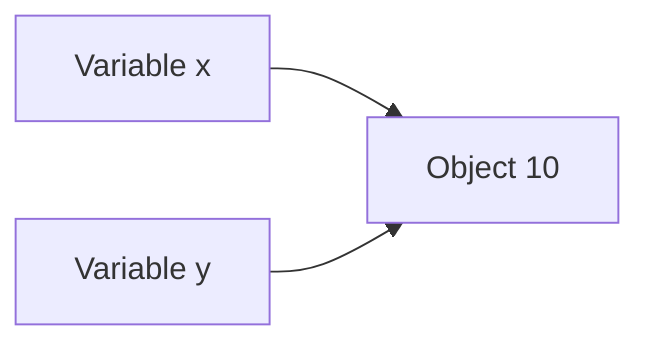


### 4.2 Variable Characteristics

- Variables are:
    - Dynamically typed
    - Case-sensitive
    - Re-bindable
- Variable names can be reassigned to different objects at runtime.
- Python variables do not require pre-declaration.
- Variables live in a **namespace** (local, global, built-in).

**Namespace levels:**

- Local
- Enclosing
- Global
- Built-in

```python showLineNumbers
x = 5
print(type(x))

x = "Python"
print(type(x))
```


#### 4.2.1 Dynamic Typing

- Python uses **dynamic typing**, meaning:
    - Type checking occurs at runtime
    - Type is associated with the object, not the variable
- Enables rapid development but requires runtime discipline.

**Strong typing:**

- Python is dynamically typed but **strongly typed**
- Implicit type coercion is not allowed.

```python showLineNumbers
x = 10
print(type(x))

x = 10.5
print(type(x))
```

```python showLineNumbers
## Strong typing example (will raise error)
print("5" + 5)
```

**Type introspection tools:**

- `type()`
- `isinstance()`

```python showLineNumbers
x = 10
print(isinstance(x, int))
```


### 4.3 Rules for Variable Names

- Variable names must:
    - Begin with a letter (a–z, A–Z) or underscore `_`
    - Contain only letters, digits, and underscores
- Cannot begin with a digit.
- Cannot contain:
    - Spaces
    - Special symbols (`@`, `#`, `%`, etc.)
- Must not be a **Python keyword**.
- Case-sensitive:
    - `value` and `Value` are different.
- Unicode letters are allowed but discouraged for readability.

**Valid variable names:**

- `count`
- `_total`
- `num1`
- `student_name`

**Invalid variable names:**

- `1value`
- `total-marks`
- `class`
- `student name`

```python showLineNumbers
## Valid variables
total_marks = 90
_count = 10
name1 = "Ankur"
```

```python showLineNumbers
## Invalid variable examples (will raise errors)
## 1value = 10
## total-marks = 90
## class = "Python"
```


#### Additional Deep Concepts (Important for Understanding)

#### Variable Lifetime

- Variables exist as long as their reference exists.
- Destroyed when:
    - Reference count reaches zero
    - Garbage collector cleans unused objects

#### Mutable vs Immutable Variables

- Immutable:
    - `int`, `float`, `str`, `tuple`
- Mutable:
    - `list`, `dict`, `set`

```python showLineNumbers
## Immutable behavior
x = 10
print(id(x))
x += 1
print(id(x))
```

```python showLineNumbers
## Mutable behavior
lst = [1, 2, 3]
print(id(lst))
lst.append(4)
print(id(lst))
```


#### Variable Deletion

- `del` removes the reference, not necessarily the object.

```python showLineNumbers
x = 100
del x
```


#### Common Pitfalls

- Accidentally overwriting built-ins:

```python showLineNumbers
## Bad practice
list = [1, 2, 3]
```

- Confusing assignment with copying:

```python showLineNumbers
a = [1, 2]
b = a
b.append(3)
print(a)
```


## 5. Identifier Naming


### 5.1 Rules for Identifiers

- An **identifier** is the name used to identify:
    - Variables
    - Functions
    - Classes
    - Modules
    - Objects
- Identifiers form the **symbolic layer** of a Python program.

#### Core Syntax Rules

- Must begin with:
    - A letter (`a–z`, `A–Z`)
    - An underscore (`_`)
- Remaining characters may include:
    - Letters
    - Digits (`0–9`)
    - Underscore (`_`)
- **Cannot start with a digit**
- **No spaces allowed**
- **No special characters** (`@ ## $ % & !` etc.)
- **Case-sensitive**
- Must **not be a Python keyword**

```python showLineNumbers
valid_name = 10
_valid_name = 20
validName123 = 30
```


#### Keywords Restriction

- Python reserves specific words for internal language syntax.
- Keywords **cannot be used as identifiers**.
- Examples of keywords:
    - `if`, `else`, `while`, `for`, `class`, `def`, `return`, `True`, `None`

```python showLineNumbers
## Invalid: keyword usage
## class = 10
## if = 5
```

To view all keywords:

```python showLineNumbers
import keyword
print(keyword.kwlist)
```


#### Case Sensitivity

- Python treats identifiers with different casing as **distinct**.

```python showLineNumbers
value = 10
Value = 20
print(value, Value)
```


#### Unicode Identifiers

- Python allows **Unicode characters** in identifiers.
- Technically valid but **strongly discouraged** in professional codebases.
- Reduces readability and portability.

```python showLineNumbers
π = 3.14
print(π)
```


#### Underscore Naming Conventions (Semantic Meaning)

- `_var` → intended for internal use
- `var_` → avoids keyword conflict
- `__var` → name mangling in classes
- `__var__` → reserved for Python internals (dunder methods)

```python showLineNumbers
_var = "internal"
class Test:
    def __init__(self):
        self.__hidden = 10
```


### 5.2 Valid Identifiers

#### Examples of Valid Identifiers

- Follow all syntax rules
- Meaningful and readable

```python showLineNumbers
count = 0
student_name = "Ankur"
totalMarks = 95
_temp_value = 3.5
```


#### Identifier Naming Styles (Best Practices)

#### Snake Case (Recommended)

- Used for variables and functions

```python showLineNumbers
student_score = 90
calculate_average()
```

#### Pascal Case

- Used for class names

```python showLineNumbers
class StudentRecord:
    pass
```

#### Camel Case

- Allowed but **not standard in Python**

```python showLineNumbers
studentScore = 85
```


#### Descriptive Identifiers

- Identifier names should express **intent**, not implementation.

```python showLineNumbers
## Good
total_price = 500

## Bad
tp = 500
```


#### Length Guidelines

- Short for small scope
- Longer for clarity in larger scope

```python showLineNumbers
i = 0                 ## acceptable in loops
number_of_students = 60
```


### 5.3 Invalid Identifiers

#### Common Invalid Patterns

```python showLineNumbers
## Starts with digit
## 1value = 10

## Contains space
## student name = "A"

## Contains special character
## total$ = 100

## Keyword conflict
## for = 5
```


#### Shadowing Built-in Names (Logically Invalid)

- Python allows this syntactically, but it is **dangerous**.
- Overwrites built-in functionality.

```python showLineNumbers
list = [1, 2, 3]
## list() is now inaccessible
```

```python showLineNumbers
sum = 10
## sum() built-in function lost
```


#### Identifier Collisions

- Same identifier used in different scopes may cause confusion.

```python showLineNumbers
x = 10

def func():
    x = 20
    print(x)

func()
print(x)
```


### Advanced Identifier Concepts

#### Name Binding

- Identifiers are bound to objects at runtime.
- Binding occurs via:
    - Assignment
    - Function definition
    - Import statements

```python showLineNumbers
a = 10
```


#### Name Resolution (LEGB Rule)

Python resolves identifiers in the following order:

1. Local
2. Enclosing
3. Global
4. Built-in

```python showLineNumbers
x = 5

def outer():
    x = 10
    def inner():
        print(x)
    inner()

outer()
```

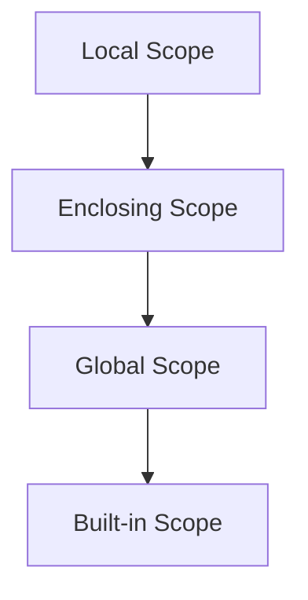


#### Identifier Lifetime

- Exists as long as the object is referenced.
- Destroyed when:
    - Reference count reaches zero
    - Garbage collector cleans it


#### Good Identifier Design Principles

- Be descriptive, not verbose
- Avoid abbreviations unless common
- Avoid single-letter names except:
    - Loop counters
    - Mathematical expressions
- Never shadow keywords or built-ins
- Follow PEP 8 naming conventions


#### Summary-Level Depth Check (Concepts Covered)

- Syntax rules
- Keywords
- Case sensitivity
- Unicode identifiers
- Naming conventions
- Scope and resolution
- Name binding
- Shadowing risks
- Best practices


## 6. Declaring Variables and Assigning Values


### 6.1 Variable Declaration

- Python **does not require explicit variable declaration**.
- A variable is **created automatically** when a value is assigned to it.
- Declaration and initialization happen **in a single step**.
- There is **no separate memory allocation statement** (unlike C/C++).
- Python follows **dynamic name binding**.

**Key idea:**

> In Python, *assignment creates a binding between a name and an object*.
> 

```python showLineNumbers
x = 10
```

- `x` → variable name
- `=` → assignment operator
- `10` → object (integer)


#### Declaration at Runtime

- Variables can be declared at **any point during program execution**.
- No forward declaration required.

```python showLineNumbers
print(a)        ## Error: a not defined
a = 5
print(a)
```


#### Multiple Variable Declaration

- Python allows **multiple variables to be declared in one line**.

```python showLineNumbers
a = b = c = 10
```

- All variables reference the **same object** in memory.

```python showLineNumbers
print(id(a), id(b), id(c))
```


#### Multiple Assignment (Tuple Unpacking)

- Assign different values to different variables in a single statement.

```python showLineNumbers
x, y, z = 1, 2, 3
```

- Internally uses tuple packing and unpacking.

```python showLineNumbers
x, y = y, x   ## Value swapping without temp variable
```


#### Variable Declaration Inside Blocks

- Python does **not have block-level scope**.
- Variables declared inside loops or conditionals exist in the enclosing scope.

```python showLineNumbers
if True:
    temp = 100

print(temp)
```


#### Global and Local Declaration

- Variables declared inside a function are **local by default**.
- Use `global` keyword to modify global variable inside a function.

```python showLineNumbers
x = 10

def modify():
    global x
    x = 20

modify()
print(x)
```


#### Variable Declaration via Input

- Variables can be declared by taking input at runtime.
- Input is always read as a string unless explicitly converted.

```python showLineNumbers
age = int(input("Enter age: "))
```


#### Variable Deletion

- `del` removes the name binding.
- Object is destroyed only when reference count becomes zero.

```python showLineNumbers
x = 50
del x
```


### 6.2 Assignment Operator

- Assignment operator `=` binds a variable to an object.
- It **does not copy values**, it assigns references.
- Python supports **multiple types of assignment**.


#### Simple Assignment

```python showLineNumbers
x = 5
```


#### Chained Assignment

```python showLineNumbers
a = b = c = 100
```


#### Parallel Assignment

```python showLineNumbers
x, y = 10, 20
```


#### Augmented Assignment Operators

- Combine arithmetic and assignment.
- Improves readability and efficiency.

| Operator | Meaning |
| --- | --- |
| `+=` | Add and assign |
| `-=` | Subtract and assign |
| `*=` | Multiply and assign |
| `/=` | Divide and assign |
| `//=` | Floor divide and assign |
| `%=` | Modulus and assign |
| `**=` | Power and assign |

```python showLineNumbers
x = 10
x += 5
x *= 2
```


#### Assignment vs Copying (Critical Concept)

- Assignment creates a **new reference**.
- Mutable objects can lead to unintended side effects.

```python showLineNumbers
a = [1, 2]
b = a
b.append(3)
print(a)
```


#### Copying Objects Correctly

```python showLineNumbers
## Shallow copy
a = [1, 2]
b = a.copy()

## Deep copy
import copy
c = copy.deepcopy(a)
```


#### Assignment with Mutable and Immutable Objects

- Immutable → new object created
- Mutable → object modified in-place

```python showLineNumbers
## Immutable
x = 10
x += 1
```

```python showLineNumbers
## Mutable
lst = [1, 2]
lst += [3]
```


#### Assignment Expressions (Walrus Operator `:=`)

- Assign and evaluate in one expression.
- Introduced in Python 3.8.

```python showLineNumbers
if (n := len([1, 2, 3])) > 2:
    print(n)
```


#### Assignment Flow (Conceptual)

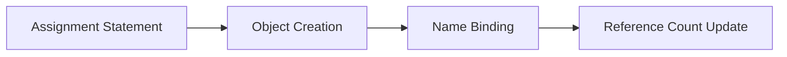


#### Common Assignment Mistakes

- Using `=` instead of `==` (comparison)
- Accidental shared references
- Shadowing global variables

```python showLineNumbers
## Logical error
if x = 5:   ## invalid
    pass
```


#### Key Takeaways

- Declaration happens at assignment
- Assignment binds names to objects
- Python uses reference semantics
- Mutable vs immutable behavior is crucial
- Assignment affects scope and lifetime


## 7. Python Operators


### 7.1 Arithmetic Operators

Arithmetic operators perform **mathematical operations** on numeric operands.

Python supports **integer arithmetic, floating-point arithmetic, and arbitrary-precision integers**.

#### Operators

| Operator | Meaning |
| --- | --- |
| `+` | Addition |
| `-` | Subtraction |
| `*` | Multiplication |
| `/` | True Division |
| `//` | Floor Division |
| `%` | Modulus |
| `**` | Exponentiation |


#### True Division vs Floor Division (Mind-bender #1)

- `/` **always returns float**
- `//` returns the **floor** of the result (towards negative infinity)

```python showLineNumbers
print(7 / 2)     ## 3.5
print(7 // 2)    ## 3
print(-7 // 2)   ## -4  (not -3!)
```

> Floor division moves **downward**, not toward zero.

#### Modulus with Negative Numbers (Mind-bender #2)

Python ensures:

```
(a // b) * b + (a % b) == a
```

```python showLineNumbers
print(7 % 2)     ## 1
print(-7 % 2)    ## 1
print(7 % -2)    ## -1
```


#### Exponentiation Associativity (Mind-bender #3)

- `*` is **right-associative**.

```python showLineNumbers
print(2 ** 3 ** 2)   ## 512 → 2 ** (3 ** 2)
```


#### Arbitrary Precision Integers

- Python integers are **unbounded** (limited by memory).

```python showLineNumbers
x = 10 ** 100
print(x)
```


### 7.2 Comparison Operators

Comparison operators return **Boolean values (`True` or `False`)**.

#### Operators

| Operator | Meaning |
| --- | --- |
| `==` | Equal |
| `!=` | Not equal |
| `>` | Greater than |
| `<` | Less than |
| `>=` | Greater than or equal |
| `<=` | Less than or equal |


#### Chained Comparisons (Mind-bender #4)

Python allows **mathematical-style chaining**.

```python showLineNumbers
x = 5
print(1 < x < 10)     ## True
```

Equivalent to:

```python showLineNumbers
print(1 < x and x < 10)
```


#### Lexicographical Comparison (Strings)

- Compared character-by-character using **Unicode values**.

```python showLineNumbers
print("apple" < "banana")   ## True
print("Z" < "a")            ## True
```


#### Comparison Across Types

- Some comparisons are invalid in Python 3.

```python showLineNumbers
## print(5 < "5")   ## TypeError
```


### 7.3 Assignment Operators

Assignment operators **bind names to objects**.

### Operators

| Operator | Meaning |
| --- | --- |
| `=` | Assign |
| `+=` | Add and assign |
| `-=` | Subtract and assign |
| `*=` | Multiply and assign |
| `/=` | Divide and assign |
| `//=` | Floor divide and assign |
| `%=` | Modulus and assign |
| `**=` | Power and assign |
| `&=`, | `=`,` ^=`,` <<=`,` >>=` |


#### Assignment vs Mutation (Mind-bender #5)

```python showLineNumbers
a = [1, 2]
b = a
b += [3]
print(a)   ## [1, 2, 3]
```

vs

```python showLineNumbers
a = [1, 2]
b = a
b = b + [3]
print(a)   ## [1, 2]
```

> `+=` mutates mutable objects, `+` creates new objects.
> 


#### Walrus Operator `:=`

Assigns and evaluates in one expression.

```python showLineNumbers
if (n := len("Python")) > 3:
    print(n)
```


### 7.4 Logical Operators

Logical operators work on **Boolean logic**, but return **operands**, not always `True`/`False`.

#### Operators

| Operator | Meaning |
| --- | --- |
| `and` | Logical AND |
| `or` | Logical OR |
| `not` | Logical NOT |


#### Short-Circuit Evaluation (Mind-bender #6)

- Python stops evaluation as soon as result is known.

```python showLineNumbers
x = 0
y = 10
print(x and y)   ## 0
print(x or y)    ## 10
```


#### Truthy and Falsy Values

Falsy values:

- `False`
- `None`
- `0`, `0.0`
- `""`
- `[]`, `{}`, `()`

Everything else → Truthy.

```python showLineNumbers
print([] or "fallback")   ## fallback
```


#### Logical Operators Return Objects (Important!)

```python showLineNumbers
print("A" and "B")   ## B
print("" or "B")     ## B
```


### 7.5 Bitwise Operators

Operate on **binary representations** of integers.

#### Operators

| Operator | Meaning |
| --- | --- |
| `&` | AND |
| ` | ` |
| `^` | XOR |
| `~` | NOT |
| `<<` | Left shift |
| `>>` | Right shift |


#### Binary-Level Thinking

```python showLineNumbers
a = 5    ## 0101
b = 3    ## 0011
print(a & b)   ## 1
print(a | b)   ## 7
```


#### Bitwise NOT (Mind-bender #7)

```python showLineNumbers
print(~5)   ## -6
```

Because:

```
~x == -(x + 1)
```


#### Bit Shifting

```python showLineNumbers
print(5 << 1)   ## 10
print(5 >> 1)   ## 2
```

Equivalent to:

- Left shift → multiply by powers of 2
- Right shift → divide by powers of 2


### 7.6 Membership Operators

Used to test **existence of elements in sequences**.

#### Operators

| Operator | Meaning |
| --- | --- |
| `in` | Exists |
| `not in` | Does not exist |


#### How `in` Works Internally

- Lists/Tuples → linear search
- Sets/Dictionaries → hash-based lookup (O(1))

```python showLineNumbers
print(3 in [1, 2, 3])        ## True
print("a" in "cat")         ## True
print("x" in {"x": 1})      ## True (checks keys)
```


### 7.7 Identity Operators

Used to check **object identity**, not equality.

#### Operators

| Operator | Meaning |
| --- | --- |
| `is` | Same object |
| `is not` | Different objects |


#### `is` vs `==` (Mind-bender #8)

```python showLineNumbers
a = [1, 2]
b = [1, 2]
print(a == b)   ## True
print(a is b)   ## False
```


#### Integer Caching (Mind-bender #9)

Python caches small integers `[-5, 256]`.

```python showLineNumbers
a = 100
b = 100
print(a is b)   ## True

x = 1000
y = 1000
print(x is y)   ## False
```


#### `None` Comparison (Best Practice)

```python showLineNumbers
x = None
print(x is None)   ## Correct
```


#### Operator Precedence (Mind-bender #10)

Order (high → low):

1. `*`
2. `+ -`
3. `/ // %`
4. Comparisons
5. `not`
6. `and`
7. `or`

```python showLineNumbers
print(not False and True)   ## True
```


#### Operator Evaluation Flow

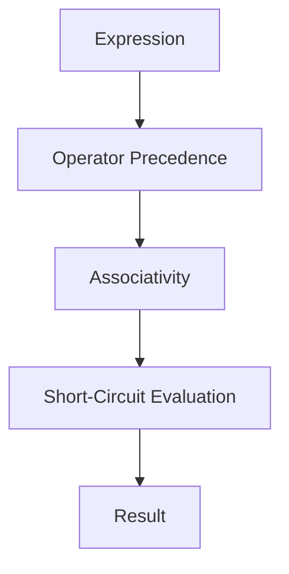


## 8. Basic Programming Concepts


### 8.1 Variables

- Variables are **names bound to objects** in memory.
- Python uses **dynamic typing** and **strong typing**.
- A variable:
    - Has no fixed type
    - Can be rebound to different objects
- Variables exist within **namespaces** (scope).

```python showLineNumbers
x = 10
x = "Python"
```

- Assignment binds a name to an object.
- Multiple variables can reference the same object.

```python showLineNumbers
a = b = 5
```

- Python uses **reference semantics**, not value semantics.


### 8.2 Data Types

- Data types define:
    - Nature of data
    - Operations allowed
    - Memory behavior
- Python is **dynamically typed**, so type is decided at runtime.
- Major categories:
    - Numeric
    - Sequence
    - Mapping
    - Set
    - Boolean
    - Special

```python showLineNumbers
x = 10
print(type(x))
```


#### 8.2.1 Numeric Types

#### int

- Represents integers of **arbitrary precision**.
- No overflow limit (bounded by memory).

```python showLineNumbers
a = 12345678901234567890
```

#### float

- Represents floating-point numbers.
- Uses **IEEE 754 double precision**.

```python showLineNumbers
pi = 3.14159
```

#### complex

- Represents complex numbers: `a + bj`.

```python showLineNumbers
z = 2 + 3j
print(z.real, z.imag)
```


#### 8.2.2 Sequence Types

- Ordered collections.
- Support:
    - Indexing
    - Slicing
    - Iteration
- Common sequence types:
    - str
    - list
    - tuple
    - range


#### 8.2.2.1 String

- Immutable sequence of Unicode characters.
- Indexed from `0`.
- Supports slicing.

```python showLineNumbers
s = "HELLO"
print(s[0])
print(s[1:4])
```

- Strings are immutable.

```python showLineNumbers
## s[0] = 'h'  ## Error
```

- Supports operators:
    - `+` (concatenation)
    - (repetition)
    - `in` (membership)

```python showLineNumbers
print("Py" in "Python")
```


#### 8.2.2.2 List

- Mutable sequence.
- Can store mixed data types.

```python showLineNumbers
lst = [1, "Python", 3.5]
```

- Supports dynamic resizing.

```python showLineNumbers
lst.append(10)
```

- Lists are mutable → in-place modification.

```python showLineNumbers
lst[0] = 100
```


#### 8.2.2.3 Tuple

- Immutable sequence.
- Faster and safer than lists.
- Used for fixed data.

```python showLineNumbers
t = (1, 2, 3)
```

- Supports indexing and slicing.

```python showLineNumbers
print(t[1])
```

- Can be used as dictionary keys.


#### 8.2.2.4 Range

- Represents an immutable sequence of numbers.
- Memory-efficient.
- Commonly used in loops.

```python showLineNumbers
r = range(1, 5)
print(list(r))
```

- Parameters:
    - `range(start, stop, step)`


#### 8.2.3 Mapping Type

#### 8.2.3.1 Dictionary

- Stores data as **key-value pairs**.
- Keys must be immutable.
- Values can be any type.
- Ordered (Python 3.7+).

```python showLineNumbers
student = {"name": "Ankur", "age": 20}
```

- Access via keys.

```python showLineNumbers
print(student["name"])
```

- Mutable and dynamic.

```python showLineNumbers
student["age"] = 21
```


#### 8.2.4 Set Types

#### 8.2.4.1 Set

- Unordered collection of **unique elements**.
- Mutable.
- No indexing.

```python showLineNumbers
s = {1, 2, 3, 3}
print(s)
```

- Supports mathematical operations:
    - Union
    - Intersection
    - Difference

```python showLineNumbers
a = {1, 2, 3}
b = {3, 4}
print(a & b)
```


#### 8.2.4.2 Frozen Set

- Immutable version of set.
- Hashable.
- Can be used as dictionary keys or set elements.

```python showLineNumbers
fs = frozenset([1, 2, 3])
```


#### 8.2.5 Boolean Type

- Represents logical truth values.
- Only two values:
    - `True`
    - `False`

```python showLineNumbers
x = True
y = False
```

- Used in conditions and control flow.

```python showLineNumbers
print(10 > 5)
```

- Many objects evaluate to True/False automatically (truthiness).


#### 8.2.6 Special Data Type

#### NoneType

- Represents absence of value.
- Used as default return value for functions.

```python showLineNumbers
x = None
```

- Comparison should be done using `is`.

```python showLineNumbers
print(x is None)
```


### 8.3 Python Keywords

- Keywords are **reserved words** with predefined meaning.
- Cannot be used as identifiers.
- Fixed and finite set.

```python showLineNumbers
import keyword
print(keyword.kwlist)
```

Examples:

- `if`, `else`, `while`
- `True`, `False`, `None`
- `class`, `def`, `return`


### 8.4 Python Comments

- Used to improve **code readability**.
- Ignored by interpreter.


#### 8.4.1 Single-line Comments

- Begin with `#`.

```python showLineNumbers
## This is a single-line comment
x = 10
```


#### 8.4.2 Multi-line Comments

- Python does not have true multi-line comments.
- Achieved using multiple `#` or docstrings.

```python showLineNumbers
## Line 1
## Line 2
## Line 3
```

```python showLineNumbers
"""
This is often used as
a multi-line comment
but technically a docstring
"""
```


### 8.5 Decision Making Statements

- Allow program to take **different execution paths**.
- Based on Boolean expressions.


#### 8.5.1 If Statement

- Executes block when condition is True.

```python showLineNumbers
x = 10
if x > 5:
    print("Greater than 5")
```


#### 8.5.2 If-Else Statement

- Executes one block if condition is True, another if False.

```python showLineNumbers
x = 3
if x % 2 == 0:
    print("Even")
else:
    print("Odd")
```


#### 8.5.3 Nested If Statement

- If statement inside another if.

```python showLineNumbers
x = 10
if x > 0:
    if x % 2 == 0:
        print("Positive Even")
```


#### Decision Flow

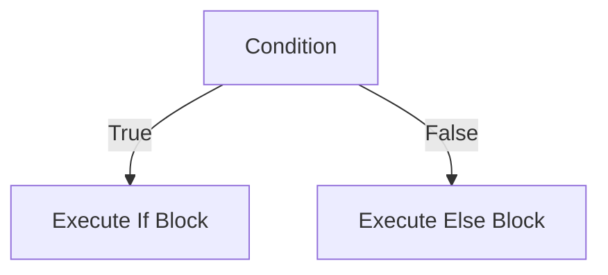


### 8.6 Indentation in Python

- Python uses **indentation instead of braces**.
- Indentation defines code blocks.
- Standard indentation:
    - 4 spaces per level
- Inconsistent indentation causes errors.

```python showLineNumbers
if True:
    print("Correct")
    print("Still inside block")
```

```python showLineNumbers
## IndentationError example
## if True:
## print("Error")
```

- Enforces clean and readable code structure.


## 9. Python Loops


### 9.1 Types of Loops

- Loops allow **repeated execution** of a block of code.
- Python provides **two primary looping constructs**:
    - `while` loop → condition-controlled
    - `for` loop → iterator-controlled
- Loops operate on:
    - Boolean conditions
    - Iterables (sequence or iterator objects)

**Core loop concepts:**

- Initialization
- Condition checking
- Execution
- Update
- Termination

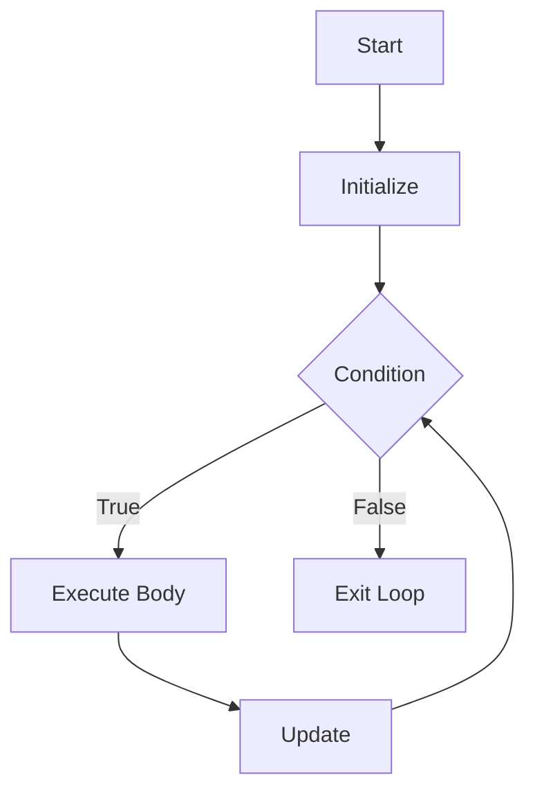


### 9.2 While Loop

- Executes repeatedly **as long as condition is True**.
- Condition is evaluated **before** each iteration.
- Used when number of iterations is **unknown beforehand**.

#### Syntax

```python showLineNumbers
while condition:
    statements
```


#### Basic While Loop

```python showLineNumbers
i = 1
while i <= 5:
    print(i)
    i += 1
```


#### Infinite Loop

- Occurs when condition never becomes False.

```python showLineNumbers
## while True:
##     print("Infinite Loop")
```


#### While Loop with Boolean Expressions

- Any non-zero, non-empty object evaluates to True.

```python showLineNumbers
x = [1, 2]
while x:
    print(x.pop())
```


#### While–Else (Rare but Mind-Bending)

- `else` executes **only if loop terminates normally**.

```python showLineNumbers
i = 1
while i <= 3:
    print(i)
    i += 1
else:
    print("Loop completed without break")
```


### 9.3 For Loop

- Iterates over **iterables**, not index values.
- Based on Python’s **iterator protocol**.
- Cleaner and safer than index-based loops.

#### Syntax

```python showLineNumbers
for variable in iterable:
    statements
```


#### For Loop Over Sequence

```python showLineNumbers
for ch in "Python":
    print(ch)
```


#### For Loop Internals (Mind-bender #1)

Internally:

- `iter()` is called on iterable
- `next()` is repeatedly called
- `StopIteration` ends loop

```python showLineNumbers
it = iter([1, 2, 3])
print(next(it))
print(next(it))
print(next(it))
```


#### For Loop with Dictionary

```python showLineNumbers
data = {"a": 1, "b": 2}

for key in data:
    print(key, data[key])
```


#### 9.3.1 for-else Statement

- `else` executes **only if loop finishes without break**.
- Often misunderstood.

```python showLineNumbers
for i in range(5):
    if i == 10:
        break
else:
    print("No break occurred")
```

**Typical use case:**

- Searching

```python showLineNumbers
nums = [2, 4, 6]
for n in nums:
    if n % 2 != 0:
        break
else:
    print("All numbers are even")
```


### 9.4 Nested Loops

- Loop inside another loop.
- Inner loop completes fully for each outer iteration.

```python showLineNumbers
for i in range(3):
    for j in range(2):
        print(i, j)
```


#### Time Complexity Explosion (Mind-bender #2)

- Nested loops increase complexity multiplicatively.

```
1 loop → O(n)
2 nested loops → O(n²)
```


#### Nested Loop Control Flow

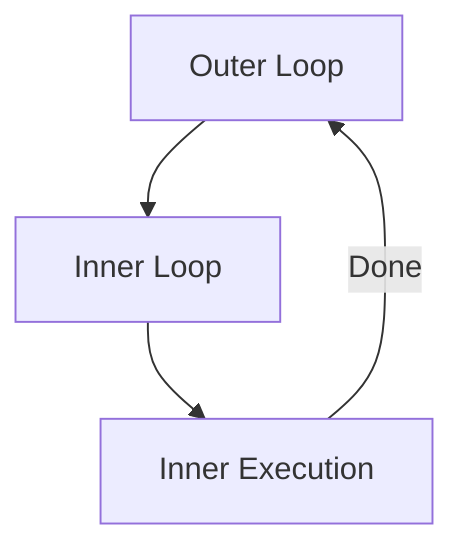


### 9.5 Loop Control Statements

Used to **alter normal loop execution**.


#### 9.5.1 Break Statement

- Immediately terminates loop.
- Control moves to statement after loop.

```python showLineNumbers
for i in range(10):
    if i == 5:
        break
    print(i)
```


#### Break in Nested Loops (Mind-bender #3)

- Break exits **only the innermost loop**.

```python showLineNumbers
for i in range(3):
    for j in range(3):
        if j == 1:
            break
        print(i, j)
```


#### 9.5.2 Continue Statement

- Skips current iteration.
- Control returns to loop condition.

```python showLineNumbers
for i in range(5):
    if i == 2:
        continue
    print(i)
```


#### Continue vs Pass (Mind-bender #4)

- `continue` skips execution
- `pass` does nothing


#### 9.5.3 Pass Statement

- Placeholder statement.
- Used where syntax requires a statement but logic is pending.

```python showLineNumbers
for i in range(3):
    pass
```


### 9.6 Range Function

- Produces an **immutable sequence of integers**.
- Memory efficient (lazy evaluation).

#### Syntax

```python showLineNumbers
range(start, stop, step)
```


#### Range Behavior

```python showLineNumbers
print(list(range(5)))
print(list(range(1, 10, 2)))
```


#### Range with Negative Step (Mind-bender #5)

```python showLineNumbers
print(list(range(10, 0, -2)))
```


#### Range Object Is Not a List

```python showLineNumbers
r = range(5)
print(type(r))
```


#### Range Membership (Fast)

- Uses arithmetic, not iteration.

```python showLineNumbers
print(3 in range(1000000))
```


#### Loop + Range Pattern

```python showLineNumbers
for i in range(len("Python")):
    print(i)
```


#### Better Pythonic Loop

```python showLineNumbers
for index, value in enumerate("Python"):
    print(index, value)
```


### Advanced Loop Concepts

#### Loop Variable Scope

- Loop variable remains available after loop.

```python showLineNumbers
for i in range(3):
    pass
print(i)
```


#### Modifying Iterable While Looping (Dangerous)

```python showLineNumbers
lst = [1, 2, 3]
for x in lst:
    lst.remove(x)
print(lst)
```


#### Loop Optimization Insight

- Prefer:
    - `for` over `while`
    - Iteration over indexing
    - Built-ins over manual loops


#### Loop Termination Flow

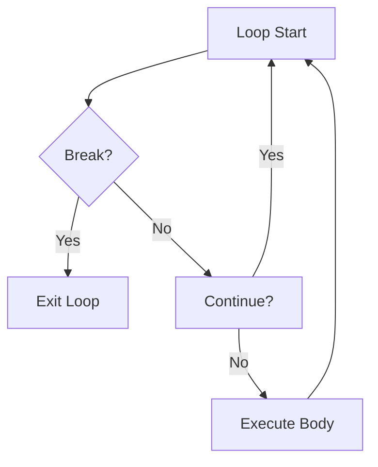


#### Mind-Bending Summary

- `for` uses iterators, not indices
- `else` runs only when no `break`
- `range` is lazy and arithmetic-based
- `break` exits only inner loop
- Loop variables leak scope
- Modifying iterable during iteration is unsafe
- Short-circuiting affects loop behavior


## 10. Python String


### 10.1 String Definition

- A **string** is an **immutable sequence of Unicode characters**.
- In Python, there is **no separate character data type**:
    - A single character is a string of length `1`.
- Internally, strings are stored as **Unicode code points**, not raw ASCII.
- Each string object has:
    - Identity (memory reference)
    - Type (`str`)
    - Value (sequence of Unicode characters)

**Key properties:**

- Ordered
- Immutable
- Iterable
- Supports indexing and slicing

```python showLineNumbers
s = "Python"
print(type(s))
```


#### Immutability (Mind-bender #1)

- Strings **cannot be modified in-place**.
- Any “modification” creates a **new string object**.

```python showLineNumbers
s = "Python"
print(id(s))
s = s + "3"
print(id(s))   ## different memory
```


### 10.2 Creating Strings

Strings can be created using:

#### Single Quotes

```python showLineNumbers
s1 = 'Hello'
```

#### Double Quotes

```python showLineNumbers
s2 = "Hello"
```

#### Triple Quotes

- Used for:
    - Multi-line strings
    - Docstrings

```python showLineNumbers
s3 = """This is
a multi-line
string"""
```


#### Escape Characters

| Escape | Meaning |
| --- | --- |
| `\n` | New line |
| `\t` | Tab |
| `\\` | Backslash |
| `\'` | Single quote |
| `\"` | Double quote |

```python showLineNumbers
print("Hello\nWorld")
```


#### Raw Strings (Mind-bender #2)

- Ignore escape sequences.
- Commonly used for file paths and regex.

```python showLineNumbers
path = r"C:\new\test"
print(path)
```


### 10.3 String Indexing

- Indexing starts at `0`.
- Negative indexing starts at `1`.

```python showLineNumbers
s = "PYTHON"
print(s[0])
print(s[-1])
```


#### IndexError

- Accessing out-of-range index raises error.

```python showLineNumbers
## print(s[10])  ## IndexError
```


#### String as Iterable

```python showLineNumbers
for ch in "ABC":
    print(ch)
```


### 10.4 String Slicing

#### Syntax

```
string[start : stop : step]
```

- `start` → inclusive
- `stop` → exclusive
- `step` → jump size

```python showLineNumbers
s = "PYTHON"
print(s[1:4])      ## YTH
print(s[:3])       ## PYT
print(s[::2])      ## PTO
```


#### Reverse String (Mind-bender #3)

```python showLineNumbers
print(s[::-1])
```


#### Negative Step Slicing

```python showLineNumbers
print(s[5:1:-1])
```


#### Slicing Never Raises IndexError

```python showLineNumbers
print(s[0:100])
```


### 10.5 String Operators

#### Concatenation `+`

```python showLineNumbers
print("Py" + "thon")
```


#### Repetition

```python showLineNumbers
print("Hi" * 3)
```


#### Membership `in`, `not in`

```python showLineNumbers
print("Py" in "Python")
```


#### Comparison Operators

- Lexicographical comparison using **Unicode values**.

```python showLineNumbers
print("apple" < "banana")
print("Z" < "a")
```


#### `%` String Formatting (Old-style)

```python showLineNumbers
name = "Ankur"
print("Hello %s" % name)
```


### 10.6 String Functions


#### Case Conversion

```python showLineNumbers
s = "python"
print(s.upper())
print(s.lower())
print(s.capitalize())
print(s.title())
```


#### Searching and Counting

```python showLineNumbers
s = "banana"
print(s.count("a"))
print(s.find("na"))
print(s.index("na"))
```

**Mind-bender #4:**

- `find()` → returns `1` if not found
- `index()` → raises exception if not found


#### Checking String Properties

```python showLineNumbers
print("abc".isalpha())
print("123".isdigit())
print("abc123".isalnum())
print("abc".islower())
print("ABC".isupper())
print("var1".isidentifier())
```


#### Splitting and Joining

```python showLineNumbers
s = "a,b,c"
parts = s.split(",")
print(parts)

joined = "-".join(parts)
print(joined)
```


#### Trimming Whitespace

```python showLineNumbers
s = "  python  "
print(s.strip())
print(s.lstrip())
print(s.rstrip())
```


#### Replace

```python showLineNumbers
s = "I like Java"
print(s.replace("Java", "Python"))
```


### ord() and chr() — ASCII & Unicode Deep Dive

#### ord()

- Returns **Unicode code point** of a character.
- ASCII is a **subset of Unicode** (0–127).

```python showLineNumbers
print(ord('A'))    ## 65
print(ord('a'))    ## 97
print(ord('0'))    ## 48
```


#### chr()

- Converts Unicode code point to character.

```python showLineNumbers
print(chr(65))
print(chr(97))
```


#### ASCII vs Unicode (Mind-bender #5)

- ASCII: 7-bit (0–127)
- Unicode: Supports **all world languages, emojis, symbols**

```python showLineNumbers
print(ord('₹'))
print(ord('😊'))
```


#### Character Arithmetic

```python showLineNumbers
print(chr(ord('a') + 1))   ## b
```


### Advanced String Concepts (Mind-Bending)

#### String Interning

- Python may reuse immutable string objects for optimization.

```python showLineNumbers
a = "python"
b = "python"
print(a is b)
```


#### `is` vs `==` with Strings

```python showLineNumbers
a = "hello"
b = "".join(["he", "llo"])

print(a == b)   ## True
print(a is b)   ## False
```


#### Encoding and Decoding

- Strings are Unicode.
- Bytes are raw binary data.

```python showLineNumbers
s = "Python"
b = s.encode("utf-8")
print(b)

decoded = b.decode("utf-8")
print(decoded)
```


#### Length of String

```python showLineNumbers
print(len("Python"))
```


#### Strings in Memory (Conceptual)

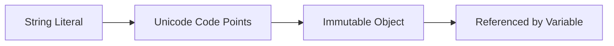


#### Common Pitfalls

- Trying to modify string in-place
- Confusing bytes with strings
- Using `is` instead of `==`
- Assuming ASCII-only characters


#### Key Takeaways

- Strings are immutable Unicode sequences
- Indexing & slicing are powerful and safe
- `ord()` and `chr()` bridge characters and numbers
- Unicode > ASCII
- Many string “operations” create new objects
- Understanding immutability avoids performance bugs


## 11. Python List


### 11.1 List Definition

- A **list** is a **mutable, ordered sequence** of elements.
- Elements can be of **heterogeneous data types**.
- Lists are implemented as **dynamic arrays** internally.
- Defined using square brackets `[]`.

```python showLineNumbers
lst = [1, "Python", 3.14, True]
```

**Core properties:**

- Ordered
- Mutable
- Allows duplicates
- Supports indexing, slicing, iteration


### 11.2 Characteristics of List

#### Mutability (Mind-bender #1)

- Lists can be modified **in-place**.
- Same memory location is reused.

```python showLineNumbers
lst = [1, 2, 3]
print(id(lst))
lst.append(4)
print(id(lst))
```


#### Dynamic Size

- Lists grow and shrink dynamically.
- Python over-allocates memory to optimize append operations.


#### Reference Semantics

- Assignment copies the **reference**, not the list.

```python showLineNumbers
a = [1, 2]
b = a
b.append(3)
print(a)
```


#### Heterogeneous Storage

```python showLineNumbers
lst = [10, "A", 3.5, [1, 2]]
```


### 11.3 List Indexing

- Index starts from `0`.
- Negative indexing starts from `1`.

```python showLineNumbers
lst = [10, 20, 30, 40]
print(lst[0])
print(lst[-1])
```


#### IndexError

```python showLineNumbers
## print(lst[10])   ## IndexError
```


#### Nested Indexing

```python showLineNumbers
lst = [1, [2, 3], 4]
print(lst[1][0])
```


### 11.4 List Slicing

#### Syntax

```
list[start : stop : step]
```

```python showLineNumbers
lst = [0, 1, 2, 3, 4, 5]
print(lst[1:4])
print(lst[::2])
```


#### Reverse List (Mind-bender #2)

```python showLineNumbers
print(lst[::-1])
```


#### Slicing Creates New List

```python showLineNumbers
a = [1, 2, 3]
b = a[:]
print(a is b)
```


#### Slice Assignment (Powerful & Dangerous)

```python showLineNumbers
lst = [1, 2, 3]
lst[1:2] = [10, 20]
print(lst)
```


### 11.5 List Operations


#### 11.5.1 Repetition

```python showLineNumbers
lst = [1, 2]
print(lst * 3)
```

**Mind-bender #3 (Shallow Copy Trap)**

```python showLineNumbers
lst = [[0]] * 3
lst[0][0] = 1
print(lst)
```


#### 11.5.2 Concatenation `+`

```python showLineNumbers
a = [1, 2]
b = [3, 4]
print(a + b)
```

```python showLineNumbers
## Creates new list
print(a is (a + b))
```


#### 11.5.3 Length

```python showLineNumbers
lst = [1, 2, 3]
print(len(lst))
```


#### 11.5.4 Iteration

```python showLineNumbers
for item in lst:
    print(item)
```

```python showLineNumbers
for i, v in enumerate(lst):
    print(i, v)
```


#### 11.5.5 Membership

```python showLineNumbers
print(2 in lst)
print(5 not in lst)
```

**Performance Insight**

- Membership in list → **O(n)**


### 11.6 Adding Elements to List

#### append()

```python showLineNumbers
lst.append(5)
```


#### extend()

```python showLineNumbers
lst.extend([6, 7])
```


#### insert()

```python showLineNumbers
lst.insert(1, 100)
```


#### Adding via Slice Assignment

```python showLineNumbers
lst[1:1] = [9, 9]
```


### 11.7 Removing Elements from List

#### remove()

```python showLineNumbers
lst.remove(9)
```


#### pop()

```python showLineNumbers
x = lst.pop()
```


#### del

```python showLineNumbers
del lst[0]
```


#### clear()

```python showLineNumbers
lst.clear()
```


#### Removing While Iterating (Mind-bender #4)

```python showLineNumbers
lst = [1, 2, 3, 4]
for x in lst:
    if x % 2 == 0:
        lst.remove(x)
print(lst)
```


#### Safe Removal Pattern

```python showLineNumbers
lst = [x for x in lst if x % 2 != 0]
```


### 11.8 List Built-in Functions

```python showLineNumbers
lst = [3, 1, 4, 2]
```

#### len()

```python showLineNumbers
print(len(lst))
```


#### max(), min()

```python showLineNumbers
print(max(lst))
print(min(lst))
```


#### sum()

```python showLineNumbers
print(sum(lst))
```


#### sorted()

```python showLineNumbers
print(sorted(lst))
```


#### any(), all()

```python showLineNumbers
print(any(lst))
print(all(lst))
```


### List Comprehension (Critical & Mind-Bending)

#### Definition

- Compact syntax for creating lists.
- Faster and more readable than loops.

#### Syntax

```python showLineNumbers
[expression for item in iterable if condition]
```


#### Basic Example

```python showLineNumbers
squares = [x**2 for x in range(5)]
```


#### Conditional Comprehension

```python showLineNumbers
evens = [x for x in range(10) if x % 2 == 0]
```


#### Nested Comprehension

```python showLineNumbers
pairs = [(i, j) for i in range(2) for j in range(3)]
```


#### Conditional Expression Inside

```python showLineNumbers
labels = ["Even" if x % 2 == 0 else "Odd" for x in range(5)]
```


#### List Comprehension vs Loop (Performance)

```python showLineNumbers
## Faster
[x*x for x in range(1000000)]
```


### Advanced List Concepts


#### Shallow vs Deep Copy

```python showLineNumbers
import copy
a = [[1, 2], [3, 4]]
b = copy.copy(a)
c = copy.deepcopy(a)
```


#### List as Stack

```python showLineNumbers
stack = []
stack.append(1)
stack.append(2)
stack.pop()
```


#### List as Queue (Inefficient)

```python showLineNumbers
queue = []
queue.append(1)
queue.pop(0)
```


#### Optimization Tip

- Use `collections.deque` for queues.


#### Memory Layout (Conceptual)

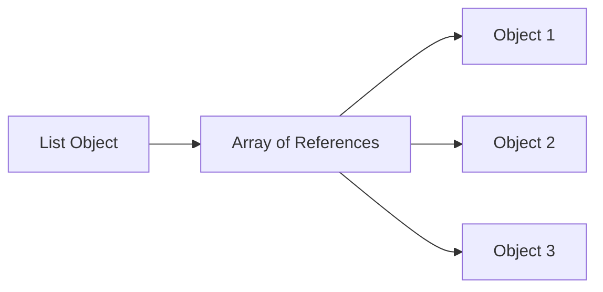


#### Common Pitfalls

- Shared references with
- Modifying list during iteration
- Using list for membership-heavy lookups
- Confusing shallow and deep copy


#### Optimization Techniques

- Prefer list comprehensions
- Avoid repeated `.append()` inside loops when possible
- Use `enumerate()` instead of manual indexing
- Use `set` for fast membership tests
- Avoid unnecessary slicing on large lists


#### Key Takeaways

- Lists are mutable and reference-based
- Slicing creates copies, assignment doesn’t
- Comprehensions are powerful and efficient
- Understanding memory behavior avoids bugs
- Lists are versatile but not always optimal


## 12. Python Tuples


### 12.1 Tuple Definition

- A **tuple** is an **ordered, immutable sequence** of elements.
- Once created, a tuple’s **structure (size) cannot be changed**.
- Defined using **parentheses `()`** or by **comma separation**.
- Like lists, tuples store **references to objects**, not the objects themselves.

```python showLineNumbers
t = (1, 2, 3)
print(type(t))
```

**Core properties:**

- Ordered
- Immutable (structure-level)
- Allows duplicates
- Supports indexing, slicing, iteration


### 12.2 Features of Tuples

#### Immutability (Mind-bender #1)

- Tuple elements **cannot be reassigned**.
- Any “modification” requires creating a **new tuple**.

```python showLineNumbers
t = (1, 2, 3)
## t[0] = 10   ## TypeError
```


#### Reference Immutability vs Object Mutability (Mind-bender #2)

- Tuple structure is immutable,
- But **mutable objects inside a tuple can be modified**.

```python showLineNumbers
t = (1, [2, 3])
t[1].append(4)
print(t)
```

> Tuple didn’t change — the **list inside it did**.
> 


#### Faster Than Lists

- Tuples are generally **faster to iterate** than lists.
- Smaller memory footprint.
- Preferred for **read-only data**.


#### Hashability

- A tuple is hashable **only if all its elements are hashable**.
- Hashable tuples can be used as:
    - Dictionary keys
    - Set elements

```python showLineNumbers
d = {(1, 2): "value"}
```


### 12.3 Creating Tuples

#### Using Parentheses

```python showLineNumbers
t = (1, 2, 3)
```


#### Without Parentheses (Tuple Packing)

```python showLineNumbers
t = 1, 2, 3
```


#### Single-Element Tuple (Very Common Trap)

```python showLineNumbers
t1 = (5)      ## int
t2 = (5,)     ## tuple
```


#### Empty Tuple

```python showLineNumbers
t = ()
```


#### Tuple from Iterable

```python showLineNumbers
t = tuple([1, 2, 3])
```


### 12.4 Accessing Tuple Elements

- Indexing starts from `0`.

```python showLineNumbers
t = ("Python", "Tuple", "Immutable")
print(t[0])
```


#### Nested Tuple Access

```python showLineNumbers
t = (1, (2, 3), 4)
print(t[1][0])
```


#### IndexError

```python showLineNumbers
## print(t[10])   ## IndexError
```


### 12.5 Negative Indexing

- Access elements from the end using negative indices.

```python showLineNumbers
t = (10, 20, 30, 40)
print(t[-1])
print(t[-2])
```


### 12.6 Tuple Slicing

#### Syntax

```
tuple[start : stop : step]
```

```python showLineNumbers
t = (0, 1, 2, 3, 4, 5)
print(t[1:4])
print(t[::2])
```


#### Reverse Tuple (Mind-bender #3)

```python showLineNumbers
print(t[::-1])
```


#### Slicing Always Creates a New Tuple

```python showLineNumbers
a = (1, 2, 3)
b = a[:]
print(a is b)   ## False
```


### 12.7 Deleting Tuples

- Individual elements **cannot be deleted**.
- Entire tuple can be deleted using `del`.

```python showLineNumbers
t = (1, 2, 3)
del t
```


### 12.8 Tuple Repetition

- Repetition using .

```python showLineNumbers
t = (1, 2)
print(t * 3)
```


#### Repetition with Mutable Elements (Mind-bender #4)

```python showLineNumbers
t = ([0],) * 3
t[0].append(1)
print(t)
```

> Same list referenced multiple times.
> 


### 12.9 Tuple Methods

Tuples have **very few methods** due to immutability.


#### 12.9.1 count()

- Returns number of occurrences of a value.

```python showLineNumbers
t = (1, 2, 2, 3, 2)
print(t.count(2))
```


#### 12.9.2 index()

- Returns index of first occurrence.
- Raises error if not found.

```python showLineNumbers
t = ("a", "b", "c")
print(t.index("b"))
```

```python showLineNumbers
## t.index("x")   ## ValueError
```


### 12.10 Advantages of Tuples

- Faster than lists
- Memory-efficient
- Safe from accidental modification
- Suitable for fixed data
- Can be dictionary keys
- Ideal for function returns

```python showLineNumbers
def get_point():
    return (10, 20)
```


### Tuple Unpacking (Very Important)

#### Basic Unpacking

```python showLineNumbers
t = (1, 2, 3)
a, b, c = t
```


#### Swapping Variables (No Temp Variable)

```python showLineNumbers
a, b = b, a
```


#### Extended Unpacking (Mind-bender #5)

```python showLineNumbers
a, *b, c = (1, 2, 3, 4, 5)
print(a, b, c)
```


### Tuple “Comprehension” (Important Clarification)

#### There Is NO Tuple Comprehension

- Syntax like `(x for x in range(5))` creates a **generator**, not a tuple.

```python showLineNumbers
g = (x*x for x in range(5))
print(type(g))
```


#### Correct Way to Build Tuple from Comprehension

```python showLineNumbers
t = tuple(x*x for x in range(5))
```

> This is a **generator expression**, not tuple comprehension.
> 


### Advanced Tuple Concepts


#### Tuple vs List Performance

- Tuple iteration faster
- Tuple creation slightly faster
- Tuple uses less memory


#### Tuple as Dictionary Key (Deep Insight)

```python showLineNumbers
locations = {
    (0, 0): "Origin",
    (1, 2): "Point A"
}
```


#### Tuple Interning (Implementation Detail)

- Small tuples **may** be reused internally.
- Do **not** rely on `is` for tuples.

```python showLineNumbers
a = (1, 2)
b = (1, 2)
print(a == b)
print(a is b)
```


#### Named Tuples (Advanced & Useful)

- Combines tuple immutability with named fields.

```python showLineNumbers
from collections import namedtuple

Point = namedtuple("Point", ["x", "y"])
p = Point(10, 20)
print(p.x, p.y)
```


#### Tuple Memory Model (Conceptual)

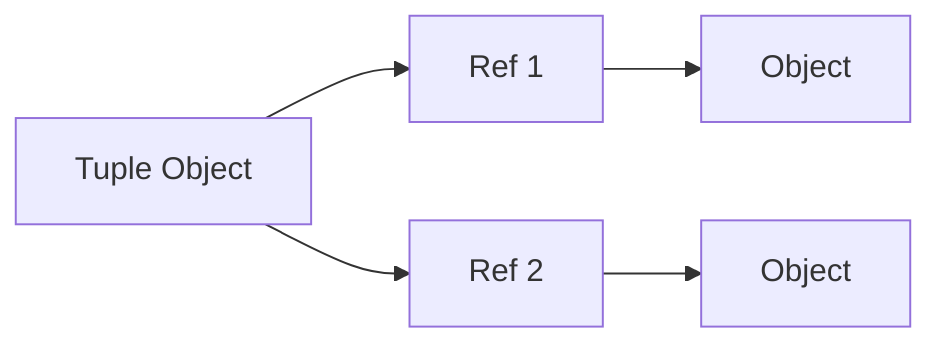


### Optimization Techniques

- Use tuples instead of lists for read-only data
- Use tuple unpacking instead of indexing
- Prefer tuples for fixed-size records
- Avoid repeated tuple concatenation (`+`) in loops


### Common Pitfalls

- Forgetting comma in single-element tuple
- Expecting tuple to be deeply immutable
- Confusing generator expressions with tuple creation
- Using tuple where list mutation is required


### Key Takeaways

- Tuples are immutable, ordered sequences
- Immutability improves safety and performance
- Tuples can contain mutable objects
- No true tuple comprehension exists
- Generator expressions are often confused with tuples
- Ideal for fixed, structured data


## 13. Python Set


### 13.1 Set Definition

- A **set** is an **unordered collection of unique, hashable elements**.
- Implemented internally using a **hash table**.
- Does **not allow duplicate values**.
- Elements must be **immutable (hashable)**:
    - Allowed: `int`, `float`, `str`, `tuple` (if immutable inside)
    - Not allowed: `list`, `dict`, `set`

```python showLineNumbers
s = {1, 2, 3, 3}
print(s)   ## duplicates removed
```

**Core properties:**

- Unordered
- Mutable
- No indexing or slicing
- Fast membership testing (average **O(1)**)


#### Why Sets Exist (Conceptual)

- Designed for:
    - Uniqueness enforcement
    - Fast lookup
    - Mathematical set operations


### 13.2 Creating Sets

#### Using Curly Braces

```python showLineNumbers
s = {1, 2, 3}
```


#### Using set() Constructor

```python showLineNumbers
s = set([1, 2, 3])
```


#### Empty Set (Common Trap)

```python showLineNumbers
s = {}        ## dict, NOT set
s = set()     ## correct empty set
```


#### Set from String

```python showLineNumbers
s = set("banana")
print(s)
```

> Order is arbitrary and duplicates are removed.
> 


#### Set from Tuple

```python showLineNumbers
s = set((1, 2, 3))
```


### 13.3 Adding Elements to Set

#### add()

- Adds a **single element**.

```python showLineNumbers
s = {1, 2}
s.add(3)
```


#### update()

- Adds **multiple elements** from an iterable.

```python showLineNumbers
s.update([4, 5])
```

```python showLineNumbers
s.update("ab")
```


#### Adding Mutable Objects (Not Allowed)

```python showLineNumbers
## s.add([1, 2])   ## TypeError
```


#### Hashing Insight (Mind-bender #1)

- Set membership depends on:
    - `__hash__()`
    - `__eq__()`

```python showLineNumbers
print(hash("python"))
```


### 13.4 Removing Elements from Set

#### remove()

- Removes specified element.
- Raises `KeyError` if element not found.

```python showLineNumbers
s = {1, 2, 3}
s.remove(2)
```


#### discard()

- Removes element if present.
- **No error** if element not found.

```python showLineNumbers
s.discard(5)
```


#### pop()

- Removes and returns **an arbitrary element**.

```python showLineNumbers
x = s.pop()
```

> Not random — arbitrary due to hash order.
> 


#### clear()

- Removes all elements.

```python showLineNumbers
s.clear()
```


### 13.5 Difference Between discard() and remove()

| Feature | remove() | discard() |
| --- | --- | --- |
| Removes element | Yes | Yes |
| Element absent | KeyError | No error |
| Safe for unknown data | ❌ | ✅ |

```python showLineNumbers
s = {1, 2, 3}

## s.remove(5)   ## KeyError
s.discard(5)    ## Safe
```


### Mathematical Set Operations (Core Power of Sets)

#### Union

```python showLineNumbers
a = {1, 2, 3}
b = {3, 4}
print(a | b)
```


#### Intersection

```python showLineNumbers
print(a & b)
```


#### Difference

```python showLineNumbers
print(a - b)
```


#### Symmetric Difference

```python showLineNumbers
print(a ^ b)
```


#### Subset / Superset

```python showLineNumbers
print({1, 2} <= a)
print(a >= {1})
```


### Membership Testing (Major Performance Advantage)

```python showLineNumbers
print(3 in {1, 2, 3})
```

**Performance insight:**

- List membership → O(n)
- Set membership → O(1) average


### Set Comprehension (Advanced & Powerful)

#### Syntax

```python showLineNumbers
{expression for item in iterable if condition}
```


#### Basic Example

```python showLineNumbers
squares = {x*x for x in range(5)}
```


#### Conditional Set Comprehension

```python showLineNumbers
evens = {x for x in range(10) if x % 2 == 0}
```


#### Deduplication Trick

```python showLineNumbers
unique_words = {word.lower() for word in ["Python", "python", "PYTHON"]}
```


### Advanced Set Concepts (Mind-Bending)


#### Unordered Nature (Mind-bender #2)

```python showLineNumbers
s = {10, 20, 30}
print(s)
```

> Output order is not guaranteed.
> 


#### Mutating Set During Iteration (Dangerous)

```python showLineNumbers
s = {1, 2, 3}
## for x in s:
##     s.remove(x)   ## RuntimeError
```


#### Safe Pattern

```python showLineNumbers
for x in s.copy():
    s.remove(x)
```


#### Set vs List Memory Model

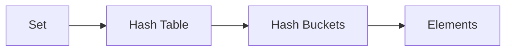


#### Hash Collisions

- Multiple elements may map to same bucket.
- Python handles collisions internally.


### 13.6 Frozen Sets

#### Definition

- `frozenset` is an **immutable version of set**.
- Hashable if all elements are hashable.
- Can be used as:
    - Dictionary keys
    - Elements of another set

```python showLineNumbers
fs = frozenset([1, 2, 3])
```


#### Immutability (Mind-bender #3)

```python showLineNumbers
## fs.add(4)   ## AttributeError
```


#### Frozenset in Dictionary

```python showLineNumbers
d = {frozenset({1, 2}): "value"}
```


#### Frozenset Operations

- Supports all **non-mutating set operations**.

```python showLineNumbers
a = frozenset([1, 2])
b = frozenset([2, 3])
print(a & b)
```


### Optimization Techniques Using Sets

- Use sets for:
    - Duplicate removal
    - Membership testing
    - Intersection-heavy logic
- Convert lists to sets for performance-critical paths.
- Prefer `discard()` over `remove()` when data may be missing.
- Use set comprehensions for clarity and speed.


### Common Pitfalls

- Expecting order
- Using `{}` for empty set
- Adding mutable objects
- Modifying set during iteration
- Confusing `pop()` as random


### Key Takeaways

- Sets enforce uniqueness automatically
- Backed by hash tables → very fast lookups
- Unordered by design
- Support rich mathematical operations
- `frozenset` enables immutability + hashability
- Ideal for performance-sensitive logic


## 14. Python Dictionary


### 14.1 Dictionary Definition

- A **dictionary** is a **mutable mapping** that stores data as **key–value pairs**.
- Implemented using a **hash table**, enabling very fast lookups.
- **Keys must be unique and hashable**; values can be any object.
- From **Python 3.7+**, dictionaries preserve **insertion order** (this is guaranteed, not accidental).

```python showLineNumbers
d = {"a": 1, "b": 2}
```

This creates a dictionary where keys `"a"` and `"b"` are mapped to values `1` and `2`.

Lookup by key is fast because Python hashes the key and jumps directly to the value.


### 14.2 Creating Dictionaries

#### Using Curly Braces

```python showLineNumbers
student = {"name": "Ankur", "age": 20}
```

This is the most common and readable way to create dictionaries.


#### Using `dict()` Constructor

```python showLineNumbers
student = dict(name="Ankur", age=20)
```

Here, keys must be valid identifiers. This style is often used for configuration-like data.


#### From List of Tuples

```python showLineNumbers
pairs = [("a", 1), ("b", 2)]
d = dict(pairs)
```

Each tuple is treated as `(key, value)`.

Useful when data already exists in paired form.


#### Using `zip()`

```python showLineNumbers
keys = ["a", "b"]
values = [1, 2]
d = dict(zip(keys, values))
```

`zip()` pairs elements positionally, which is useful when keys and values come from different sources.


#### Dictionary Comprehension

```python showLineNumbers
squares = {x: x*x for x in range(5)}
```

This creates key–value pairs dynamically.

Dictionary comprehensions are faster and clearer than building dictionaries using loops.


#### Empty Dictionary

```python showLineNumbers
d = {}
```

This creates an empty dictionary ready to accept key–value pairs.


### 14.3 Accessing Dictionary Values

#### Using Square Brackets

```python showLineNumbers
d = {"x": 10, "y": 20}
print(d["x"])
```

This retrieves the value associated with key `"x"`.

If the key does not exist, Python raises a **KeyError**.


#### Using `get()` (Safe Access)

```python showLineNumbers
print(d.get("z"))
print(d.get("z", 0))
```

`get()` returns `None` or a default value instead of crashing the program.

This is preferred when keys may or may not exist.


#### Iterating Through Dictionary

```python showLineNumbers
for key in d:
    print(key, d[key])
```

Iterating over a dictionary yields **keys by default**, not values.


### 14.4 Adding and Updating Dictionary Values

#### Adding a New Key

```python showLineNumbers
d["z"] = 30
```

If the key does not exist, Python inserts a new key–value pair.


#### Updating an Existing Key

```python showLineNumbers
d["x"] = 100
```

If the key already exists, its value is overwritten.


#### Using `update()`

```python showLineNumbers
d.update({"x": 5, "y": 15})
```

`update()` can modify multiple entries at once and is often cleaner than repeated assignments.


#### Incrementing Safely (Mind-bender)

```python showLineNumbers
d["count"] = d.get("count", 0) + 1
```

This pattern avoids `KeyError` and is common in frequency-count problems.


### 14.5 Deleting Dictionary Elements

#### Using `del`

```python showLineNumbers
del d["x"]
```

Removes the key and its value.

Raises `KeyError` if the key does not exist.


#### Using `pop()`

```python showLineNumbers
value = d.pop("y")
```

`pop()` removes the key and **returns its value**, which is useful when you need the removed data.


#### Using `popitem()`

```python showLineNumbers
k, v = d.popitem()
```

Removes and returns the **last inserted key–value pair** (Python 3.7+).

Often used in stack-like dictionary behavior.


#### Using `clear()`

```python showLineNumbers
d.clear()
```

Removes all entries but keeps the dictionary object alive.


### 14.6 Properties of Dictionary Keys

#### Key Rules

- Must be **hashable**
- Must be **immutable**
- Must be **unique**

```python showLineNumbers
d = {(1, 2): "valid"}
```

Tuples are allowed as keys because they are immutable.

```python showLineNumbers
## d = {[1, 2]: "invalid"}  ## TypeError
```

Lists are mutable, so Python rejects them as keys.


#### Hash Collision Insight

```python showLineNumbers
d = {True: "yes", 1: "no"}
print(d)
```

`True` and `1` hash to the same value and are considered equal, so one overwrites the other.


### 14.7 Built-in Dictionary Functions

#### 14.7.1 `len()`

```python showLineNumbers
print(len(d))
```

Returns the number of key–value pairs, not memory size.


#### 14.7.2 `any()`

```python showLineNumbers
d = {"a": 0, "b": 1}
print(any(d.values()))
```

Returns `True` if **at least one value is truthy**.


#### 14.7.3 `all()`

```python showLineNumbers
print(all(d.values()))
```

Returns `True` only if **all values are truthy**.


#### 14.7.4 `sorted()`

```python showLineNumbers
d = {"b": 2, "a": 1}
print(sorted(d))
```

Sorts dictionary **keys**, not values.

```python showLineNumbers
print(sorted(d.items()))
```

Sorts key–value pairs as tuples.


### 14.8 Built-in Dictionary Methods


#### 14.8.1 `clear()`

```python showLineNumbers
d.clear()
```

Empties the dictionary without deleting it.


#### 14.8.2 `copy()`

```python showLineNumbers
d2 = d.copy()
```

Creates a **shallow copy**—nested objects are still shared.

```python showLineNumbers
d = {"a": [1, 2]}
d2 = d.copy()
d2["a"].append(3)
print(d)
```

This shows why shallow copies can cause unexpected side effects.


#### 14.8.3 `pop()`

```python showLineNumbers
d.pop("a")
```

Removes a specific key and returns its value.


#### 14.8.4 `popitem()`

```python showLineNumbers
key, value = d.popitem()
```

Removes the most recently inserted item.


#### 14.8.5 `keys()`

```python showLineNumbers
keys = d.keys()
```

Returns a **dynamic view**, not a list.

```python showLineNumbers
d["new"] = 100
print(keys)
```

The view updates automatically.


#### 14.8.6 `items()`

```python showLineNumbers
for k, v in d.items():
    print(k, v)
```

Best way to iterate over keys and values together.


#### 14.8.7 `get()`

```python showLineNumbers showLineNumbers
print(d.get("missing", "default"))
```

Safely retrieves values without raising errors.


#### 14.8.8 `update()`

```python showLineNumbers
d.update({"x": 1, "y": 2})
```

Efficient way to merge or modify dictionaries.


#### 14.8.9 `values()`

```python showLineNumbers
vals = d.values()
```

Returns a dynamic view of values, useful with `any()` and `all()`.


### Advanced & Mind-Bending Dictionary Concepts

#### Dictionary Views Are Live

```python showLineNumbers
d = {"a": 1}
v = d.values()
d["b"] = 2
print(v)
```

Changes in the dictionary are reflected immediately in the view.


#### Performance Insight

- Lookup, insert, delete: **O(1) average**
- Much faster than lists for key-based access


#### Dictionary Memory Model

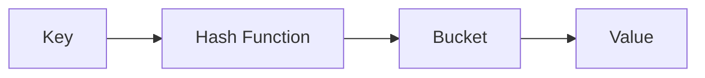


### Key Takeaways

- Dictionaries are hash-based key–value stores
- Keys must be immutable and unique
- Order is preserved (3.7+)
- `get()` prevents runtime errors
- Shallow copies share nested objects
- Dictionary views are dynamic and powerful