# Unit - 2
:::info[TITLE]
## Functions
:::


## 1. Functions


### 1.1 Introduction to Functions

- A **function** is a named object that encapsulates a block of executable code.
- In Python, functions are **first-class objects** stored in memory like any other object.
- Internally, a function consists of:
    - A **code object** (compiled bytecode)
    - A **global namespace reference**
    - A **default argument table**
    - A **closure (if any)**
    - Metadata (name, docstring, annotations)

**Mental model (important):**

> A function is **not code**, it is an **object that owns code**.
> 

```python
def f():
    pass
```

This creates:

- A function object in heap memory
- A name `f` in the current namespace pointing to that object


#### Function Object Anatomy (Deep Internals)

Every function object contains:

- `__code__` → compiled bytecode + metadata
- `__globals__` → reference to global symbol table
- `__defaults__` → tuple of default parameter values
- `__closure__` → captured outer variables
- `__dict__` → function attributes
- `__name__`, `__doc__`

```python
def demo(a=10):
    """sample"""
    return a

print(demo.__code__)
print(demo.__defaults__)
print(demo.__globals__ is globals())
```


### 1.2 Defining and Using Functions


#### 1.2.1 Function Definition

- The `def` statement is **executed at runtime**.
- When Python encounters `def`:
    1. The function body is compiled into **bytecode**
    2. A **function object** is created
    3. The function name is **registered in the current namespace**

```python
def add(x, y):
    return x + y
```

**Mind-bender #1: `def` executes immediately**

```python
print("before")

def f():
    print("inside")

print("after")
```

The function body is **not executed**, but the function object **is created immediately**.


#### Namespace Registration (Registry Concept)

- Python stores names in **symbol tables** (registries):
    - Local
    - Enclosing
    - Global
    - Built-in (LEGB rule)

```python
def test():
    pass

print("test" in globals())
```

The function name is registered in the **global registry**.


#### 1.2.2 Function Call

Calling a function triggers a **full execution pipeline**:

1. Create a **stack frame**
2. Allocate local namespace (dictionary)
3. Bind arguments → parameters
4. Execute bytecode
5. Return value
6. Destroy frame (or reuse via optimization)

```python
result = add(2, 3)
```


#### Call Stack & Frame Objects (Very Important)

Each function call creates a **frame object**:

- Stored on the call stack
- Contains:
    - Local variables
    - Instruction pointer
    - Operand stack
    - Reference to code object

```python
import inspect

def f():
    frame = inspect.currentframe()
    print(frame.f_locals)

f()
```


#### Function Call Flow

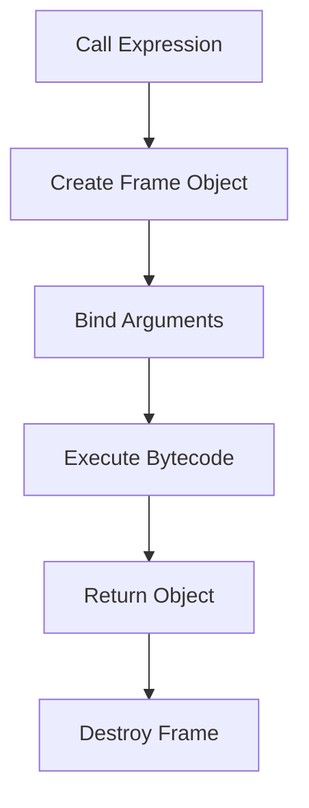


#### 1.2.3 Parameters and Arguments

- **Parameters** → local names in function definition
- **Arguments** → object references passed during call
- Python uses **call-by-object-reference**

```python
def modify(x):
    x += 1

a = 10
modify(a)
print(a)
```

`a` does not change because integers are immutable.


#### Mutability Trap (Critical)

```python
def modify(lst):
    lst.append(99)

data = [1, 2]
modify(data)
print(data)
```

The list changes because:

- Reference is shared
- Object is mutable


#### Argument Binding Order (Internal)

1. Positional arguments
2. Keyword arguments
3. Default arguments
4. `args`
5. `*kwargs`

Violation raises `TypeError`.


#### 1.2.4 Return Statement

- `return`:
    - Terminates function execution
    - Sends a reference back to caller
- If omitted → implicit `return None`

```python
def f():
    return

print(f())
```


#### Multiple Returns (Illusion)

```python
def calc(a, b):
    return a+b, a-b
```

Python returns **one tuple object**, not multiple values.


#### Return & Frame Cleanup

- On return:
    - Frame is popped
    - Local namespace is destroyed
    - Reference counts updated
- Returned object lives if referenced.


#### 1.2.5 Function Docstring

- A docstring is a **runtime-stored string literal**
- Stored in `__doc__`
- Used by:
    - `help()`
    - IDEs
    - Documentation generators

```python
def f():
    """This is a docstring"""
    pass

print(f.__doc__)
```

Docstrings are **not comments**.


### 1.3 Types of Python Functions


#### 1.3.1 Built-in Functions

- Stored in the **built-in namespace**
- Written in **C**
- Extremely optimized

Examples:

- `len`, `id`, `type`, `print`

```python
print(type(len))
```

**Misinformation trap:**

❌ Built-in functions are keywords

✔ They are **objects in builtins registry**


#### Built-in Registry

```python
import builtins
print("len" in dir(builtins))
```


#### 1.3.2 Functions Defined in Built-in Modules

- Provided by standard library modules
- Loaded dynamically into memory
- Names registered in module namespace

```python
import math
print(math.sqrt(25))
```

Here:

- `math` → module object
- `sqrt` → function attribute


#### Namespace Shadowing (Dangerous)

```python
from math import sqrt

def sqrt(x):
    return x + 1

print(sqrt(9))
```

Local registry overrides imported name.


#### 1.3.3 User-Defined Functions

- Created using `def`
- Stored in heap
- Registered in local or global namespace

```python
def is_even(n):
    return n % 2 == 0
```


#### Functions as First-Class Objects (Registry Power)

```python
def f():
    print("hi")

registry = {}
registry["handler"] = f
registry["handler"]()
```

Functions can be:

- Stored in data structures
- Passed as arguments
- Returned from functions


### Advanced Function Internals (Mind-Bending)


#### Default Argument Memory Trap

```python
def add_item(x, lst=[]):
    lst.append(x)
    return lst
```

Why it breaks:

- Default values stored in `__defaults__`
- Evaluated **once at definition time**

```python
print(add_item(1))
print(add_item(2))
```


#### Correct Pattern

```python
def add_item(x, lst=None):
    if lst is None:
        lst = []
    lst.append(x)
    return lst
```


#### Closures & `__closure__`

```python
def outer():
    x = 10
    def inner():
        return x
    return inner

f = outer()
print(f.__closure__[0].cell_contents)
```

The value is stored in a **cell object**, not copied.


#### Function Identity vs Equality

```python
def a(): pass
def b(): pass

print(a == b)
print(a is b)
```

Functions compare by identity, not code.


#### Recursion & Stack Frames

Each recursive call:

- Allocates a new frame
- Consumes stack memory

```python
def fact(n):
    if n == 0:
        return 1
    return n * fact(n-1)
```

Too deep → `RecursionError`.


### Common Exam-Level Misinformation

- ❌ Python uses call-by-value
    
    ✔ Uses **call-by-object-reference**
    
- ❌ Functions execute at definition
    
    ✔ They execute at **call time**
    
- ❌ Default arguments reset each call
    
    ✔ They persist in memory
    
- ❌ Docstrings are comments
    
    ✔ They are runtime metadata
    
- ❌ Multiple values returned
    
    ✔ One tuple object returned
    


### Final Mental Model (Very Important)

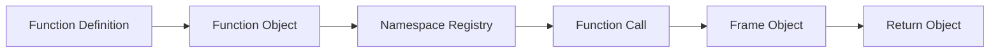


## 2. Pass by Reference vs Pass by Value


### 2.1 Concept of Call by Value

- **Call by value** means a function receives a **copy of the value**, not the original variable.
- Any modification inside the function affects **only the local copy**.
- The caller’s data remains unchanged.
- This model is common in languages like **C (for primitive data types)**.

#### Conceptual Memory Model

- Two **separate objects** exist in memory.
- Caller and callee do **not share memory** for the value.

```python
def increment(x):
    x = x + 1

a = 10
increment(a)
print(a)
```

**Explanation:**

- `a` is bound to integer object `10`
- `x` receives a reference to the *same* integer initially
- `x = x + 1` creates a **new integer object (11)**
- `x` is rebound locally
- `a` still points to `10`

This **looks like call by value**, but no actual copying happened.

#### Common Misinformation

❌ *Python copies values when passing arguments*

✔ Python **never copies values automatically**


### 2.2 Concept of Call by Reference

- **Call by reference** means a function receives a **direct reference to the caller’s variable**.
- Any change inside the function **directly modifies the caller’s data**.
- Seen in languages like **C++ (using references)**.

#### Conceptual Memory Model

- Caller and callee point to the **same memory location**.
- No rebinding—only direct modification.

```python
def modify(lst):
    lst.append(100)

data = [1, 2]
modify(data)
print(data)
```

**Explanation:**

- `data` and `lst` reference the **same list object**
- `append()` mutates the list in-place
- Caller observes the change

#### Common Misinformation

❌ *Python uses call by reference*

✔ Python **does not expose variable references like C++**


### 2.3 Parameter Passing Mechanism in Python

Python uses **neither call by value nor call by reference**.

> Python uses **Call by Object Reference**
> 
> 
> (also called **Call by Sharing**)
> 

#### What This Means

- Objects live in **heap memory**
- Variables are **names**, not memory locations
- Function parameters are **new names bound to existing objects**
- Behavior depends entirely on:
    - **Mutability of the object**
    - **Mutation vs rebinding**


#### Function Call Internals (Step-by-Step)

1. Function call creates a **new stack frame**
2. A local namespace (dictionary) is allocated
3. Parameter names are bound to object references
4. Bytecode executes
5. Frame is destroyed on return

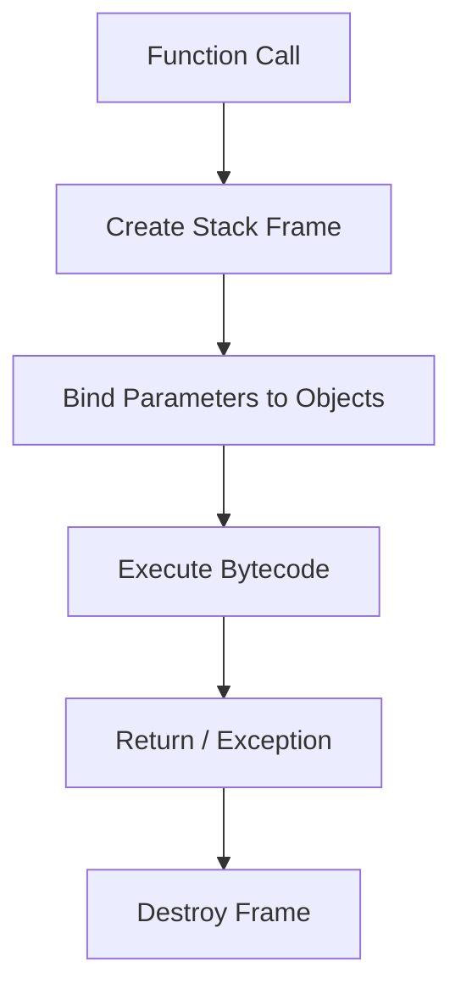


#### 2.3.1 Object Reference Model

This model explains **all Python argument behavior**.

```python
def rebind(x):
    x = 20

def mutate(lst):
    lst.append(5)

a = 10
b = [1, 2]

rebind(a)
mutate(b)

print(a)
print(b)
```

**Explanation:**

- `a` unchanged → integers are **immutable**
- `b` changed → lists are **mutable**
- `x` and `a` initially reference the same object
- Rebinding `x` creates a new object
- Mutation changes the shared object

#### Name–Object Relationship

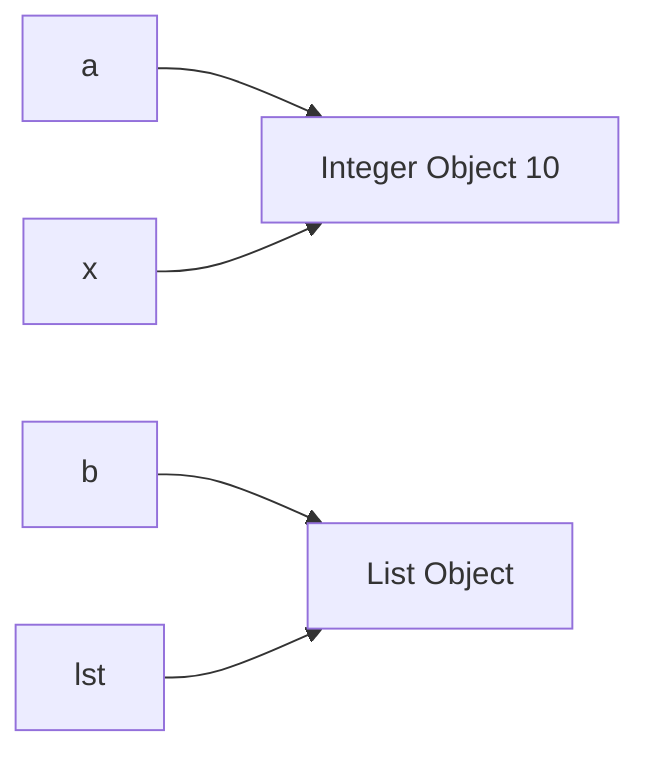

#### Golden Rule

> **Mutation affects the caller, rebinding does not**
> 


#### Rebinding vs Mutation (Critical Distinction)

#### Rebinding

> A name stops pointing to one object and starts pointing to another object.
> 

The **object does not change**. Only the **name–object link** changes.

```python
def f(x):
    x = x + 1
```

- Creates a new object
- Changes local binding only
- Caller unaffected

#### Mutation

> Changing the internal state of an object **without changing its identity**.
> 

```python
def f(lst):
    lst.append(1)
```

- Modifies object in-place
- All references see the change


#### Augmented Assignment Trap (`+=`)

```python
def f(x):
    x += 1

def g(lst):
    lst += [1]
```

- Immutable → `+=` creates new object
- Mutable → `+=` mutates in place

Same syntax, **different memory behavior**.


#### 2.3.2 `id()` Function and Memory Reference

- `id(obj)` returns a **unique identity** for the object during its lifetime.
- In **CPython**, this is usually the **memory address**.
- Used to detect **shared references**, not value equality.

```python
x = [1, 2]
y = x
print(id(x), id(y))
```

Same `id` confirms both names reference the same object.


#### Integer Interning (Optimization Detail)

- Python caches small integers (`5` to `256`) for performance.

```python
a = 100
b = 100
print(a is b)
```

```python
a = 1000
b = 1000
print(a is b)
```

#### Misinformation

❌ `*is` checks value equality*

✔ `is` checks **object identity**


### Exceptions and Parameter Passing (Subtle but Important)

```python
def modify(lst):
    lst.append(1)
    raise Exception("Stop")

data = []
try:
    modify(data)
except:
    pass

print(data)
```

**Explanation:**

- Mutation occurs **before** exception
- Stack unwinds **after mutation**
- Python does **not roll back object state**


### Heap vs Stack (Python Memory Model)

- Objects → **Heap**
- Names & parameters → **Stack frames / namespaces**
- Python never passes raw memory addresses

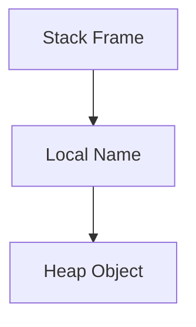


### Common Exam-Level Misinformation (Very Important)

| Statement | Reality |
| --- | --- |
| Python uses call by value | ❌ False |
| Python uses call by reference | ❌ False |
| Python copies objects | ❌ False |
| Mutable always changes caller | ❌ Only if mutated |
| `id()` is always memory address | ❌ Implementation detail |
| Exceptions undo changes | ❌ False |


### Final Mental Model (Lock This In)

> Python passes **object references**,
> 
> 
> binds them to **local parameter names**,
> 
> and behavior depends on **mutation vs rebinding**.
> 

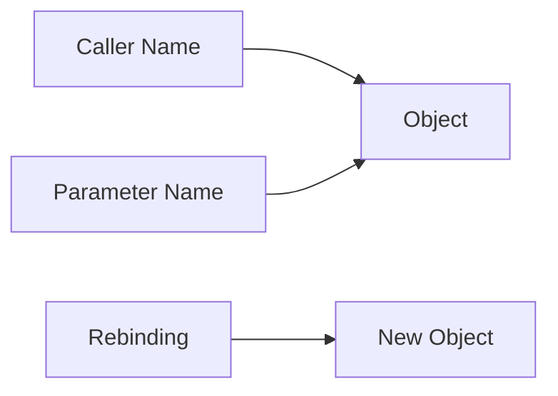


## 3. Types of Python Function Arguments

*(Deep dive: binding rules, memory behavior, evaluation timing, and exam-level traps)*


### 3.1 Required (Positional) Arguments

- **Required arguments** are parameters that **must receive values** during a function call.
- They are bound **strictly by position**, not by name.
- Python performs argument binding **left to right**.

```python
def power(base, exp):
    return base ** exp

power(2, 3)
```

**Explanation:**

- `base ← 2`
- `exp ← 3`
- Binding happens before the function body executes.

If a required argument is missing, Python raises a **TypeError** *before execution begins*.


#### 3.1.1 Correct Order of Arguments

- Positional arguments must follow the **exact order** defined in the function signature.

```python
power(3, 2)
```

**Explanation:**

- No error occurs
- But meaning changes because binding is positional
- Python does **not** know your intent, only positions


#### 3.1.2 Effects of Incorrect Order

Incorrect order does **not raise an error**, but causes **logical bugs**, which are harder to detect than syntax errors.

```python
def divide(a, b):
    return a / b

divide(2, 10)
```

This returns `0.2`, not `5`.

❗ **Misinformation trap**

❌ “Python checks argument meaning”

✔ Python only checks **position and count**


### 3.2 Default Arguments

- Default arguments allow parameters to have **predefined values**.
- Used when a parameter is optional.

```python
def greet(name, msg="Hello"):
    return f"{msg}, {name}"
```

Here:

- `msg` is optional
- If not passed, default value is used


#### 3.2.1 Defining Default Values (CRITICAL INTERNAL DETAIL)

- Default values are:
    - Evaluated **once**
    - At **function definition time**
    - Stored inside the function object (`__defaults__`)

```python
def f(x, y=10):
    return x + y
```

```python
print(f.__defaults__)
```


#### Default Argument Memory Trap (Very Important)

```python
def add_item(x, acc=[]):
    acc.append(x)
    return acc

print(add_item(1))
print(add_item(2))
```

**Explanation:**

- `acc` is created **once**
- Stored in function object memory
- Shared across calls

This is **not argument passing behavior**, but **function object state**.


#### Correct Pattern

```python
def add_item(x, acc=None):
    if acc is None:
        acc = []
    acc.append(x)
    return acc
```

This ensures a **new list per call**.


#### 3.2.2 Overriding Default Arguments

- Providing a value explicitly overrides the default.

```python
greet("Ankur", "Hi")
```

**Explanation:**

- Default is ignored
- Explicit argument always wins


### 3.3 Keyword Arguments

- Keyword arguments bind parameters **by name**, not position.
- Improve readability and safety.

```python
power(exp=3, base=2)
```


#### 3.3.1 Named Argument Passing

- Names must match parameter names exactly.

```python
def profile(name, age):
    return name, age

profile(age=20, name="Ankur")
```

**Explanation:**

- Order does not matter
- Binding happens by name lookup


#### Keyword Argument Rules (Strict)

- Positional arguments must come **before** keyword arguments.

```python
## profile(name="Ankur", 20)   ## SyntaxError
```

Python enforces this at **parse time**, not runtime.


#### 3.3.2 Order Independence

```python
profile(age=20, name="Ankur")
profile(name="Ankur", age=20)
```

Both are equivalent because binding is name-based.

❗ **Misinformation trap**

❌ “Keyword arguments are slower”

✔ Difference is negligible; clarity is preferred


### 3.4 Variable-Length Arguments

Used when the number of arguments is **unknown or flexible**.


#### 3.4.1 Arbitrary Positional Arguments (`args`)

- `args` collects extra positional arguments into a **tuple**.
- The tuple is created **during function call**, not definition.

```python
def total(*args):
    return sum(args)

total(1, 2, 3, 4)
```

**Explanation:**

- `args` is a tuple → immutable
- Length depends on how many arguments are passed


#### Argument Packing & Unpacking

```python
nums = [1, 2, 3]
total(*nums)
```

- `nums` **unpacks** the list
- Elements become positional arguments


#### Internal Binding Order (Important)

```python
def f(a, b, *args):
    print(a, b, args)

f(1, 2, 3, 4)
```

- `a ← 1`
- `b ← 2`
- Remaining → `args`


#### 3.4.2 Arbitrary Keyword Arguments (`*kwargs`)

- `*kwargs` collects extra keyword arguments into a **dictionary**.

```python
def show(**kwargs):
    return kwargs

show(name="Ankur", age=20)
```

**Explanation:**

- Keys → argument names
- Values → argument values
- Useful for configurations and APIs


#### Packing & Unpacking with `*`

```python
data = {"name": "Ankur", "age": 20}
show(**data)
```


#### Combined Usage (Advanced)

```python
def demo(a, b=10, *args, **kwargs):
    print(a, b, args, kwargs)

demo(1, 2, 3, 4, x=5, y=6)
```

**Binding order (EXAM GOLD):**

1. Required positional
2. Default positional
3. `args`
4. Keyword-only arguments
5. `*kwargs`


### Common Misinformation & Exam Traps

| Myth | Reality |
| --- | --- |
| Default args reset every call | ❌ Evaluated once |
| `*args` is a list | ❌ Tuple |
| `**kwargs` is optional | ❌ Required if defined |
| Keyword args ignore position | ❌ Only named |
| Argument errors happen inside function | ❌ During binding |


### One-Line Mental Model (Lock This In)

> **Argument passing in Python is name binding to object references, governed by strict binding rules executed before function body runs.**
> 


### Ultra-Short Summary

- Positional → order matters
- Default → evaluated once
- Keyword → order independent
- `args` → tuple of extras
- `*kwargs` → dict of extras
- Binding happens **before execution**
- Mutation vs rebinding rules still apply


## 4. Python – Object-Oriented Programming Concepts

*(Deep dive: object model, memory layout, method resolution, misconceptions, and Python-specific realities)*


### 4.1 Introduction to OOP

- **Object-Oriented Programming (OOP)** is a paradigm that organizes programs around **objects** rather than functions or logic alone.
- Python is **purely object-oriented at runtime**:
    - Everything is an object: integers, functions, classes, modules.
- OOP in Python is **dynamic**, not rigid like Java/C++.

#### Why Python OOP is Different

- No strict access modifiers (`public/private/protected`)
- Classes are **runtime objects**
- Methods are just **functions with binding**
- Inheritance and polymorphism are **duck-typed**, not interface-enforced

❗ **Misinformation trap**

❌ Python OOP works like Java

✔ Python OOP works via **dynamic binding + object model**


### 4.2 Object and Class


#### 4.2.1 Class Definition

- A **class** is a **blueprint**, but internally:
    
    > A class is an **object that creates other objects**
    > 
- Defined using the `class` keyword.
- Class body executes **immediately**, just like `def`.

```python
class Person:
    species = "Human"

    def greet(self):
        return "Hello"
```

**What happens internally:**

1. Class body executes top-down
2. Attributes and methods collected in a namespace dict
3. `type()` is called to create the class object
4. Class name bound to the class object

```python
print(type(Person))
```


#### Class Object Anatomy (Important)

A class object contains:

- `__dict__` → attributes & methods
- `__mro__` → method resolution order
- `__bases__` → parent classes
- `__init__`, `__new__`, etc.

```python
print(Person.__dict__.keys())
```


#### 4.2.2 Object Creation

- Objects are instances of classes.
- Creation involves **two steps**, not one.

```python
p = Person()
```

#### Internally:

1. `__new__()` → allocates memory (returns object)
2. `__init__()` → initializes object state

```python
class Test:
    def __new__(cls):
        print("Allocating")
        return super().__new__(cls)

    def __init__(self):
        print("Initializing")

Test()
```

❗ **Misinformation trap**

❌ `__init__` creates objects

✔ `__new__` creates, `__init__` initializes


#### Object Memory Model

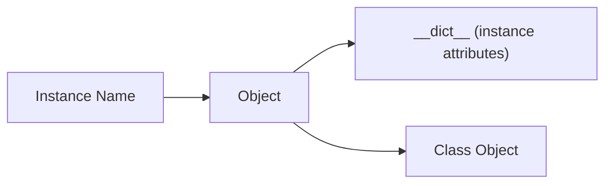


#### 4.2.3 Attributes

Attributes are **names bound to objects**.

#### Instance Attributes

```python
p.name = "Ankur"
```

- Stored in `p.__dict__`
- Unique per object

```python
print(p.__dict__)
```


#### Class Attributes

```python
print(Person.species)
```

- Stored in `Person.__dict__`
- Shared across instances


#### Attribute Lookup Order (Mind-Bending but Crucial)

When accessing `p.attr`, Python searches:

1. `p.__dict__`
2. `Person.__dict__`
3. Parent classes (`__mro__`)
4. `object`

```python
print(p.species)
```


#### Attribute Shadowing

```python
p.species = "Alien"
print(Person.species)
print(p.species)
```

Instance attribute shadows class attribute.


#### 4.2.4 Methods

- A **method** is a function stored in a class.
- When accessed via an instance, it becomes a **bound method**.

```python
p.greet()
```

Internally:

```python
Person.greet(p)
```


#### Bound vs Unbound Concept

```python
print(p.greet)
print(Person.greet)
```

- `p.greet` → bound (self already attached)
- `Person.greet` → function, needs explicit instance

❗ **Misinformation trap**

❌ `self` is a keyword

✔ `self` is a **convention**, not special


### 4.3 Principles of OOP


### 4.3.1 Encapsulation

- Encapsulation means **binding data and behavior together**.
- Python enforces encapsulation by **convention**, not force.

#### Attribute Access Levels (Convention)

| Syntax | Meaning |
| --- | --- |
| `name` | public |
| `_name` | internal |
| `__name` | name-mangled |

```python
class Demo:
    def __init__(self):
        self.__secret = 42
```

```python
print(Demo().__dict__)
```

Python rewrites `__secret` → `_Demo__secret`.

❗ **Misinformation trap**

❌ Double underscore makes attribute private

✔ It only **mangles the name**


#### Getters and Setters (Pythonic Way)

```python
class Account:
    def __init__(self, balance):
        self._balance = balance

    @property
    def balance(self):
        return self._balance
```

This preserves encapsulation **without Java-style boilerplate**.


### 4.3.2 Inheritance

- Inheritance allows a class to **reuse and extend behavior**.
- Python supports:
    - Single
    - Multiple
    - Multilevel inheritance

```python
class Animal:
    def speak(self):
        return "sound"

class Dog(Animal):
    def speak(self):
        return "bark"
```


#### Method Resolution Order (MRO) – VERY IMPORTANT

```python
print(Dog.__mro__)
```

Python uses **C3 Linearization** to resolve methods.


#### MRO Diagram

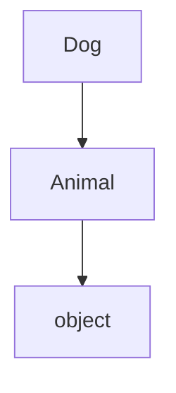


#### `super()` Internals

```python
class A:
    def show(self):
        print("A")

class B(A):
    def show(self):
        super().show()
        print("B")
```

`super()` does **not mean parent**

It means: *next class in MRO*

❗ **Misinformation trap**

❌ `super()` always calls parent

✔ It follows MRO order


### 4.3.3 Polymorphism

- Polymorphism means **same interface, different behavior**.
- Python uses **duck typing**.

```python
class Bird:
    def fly(self):
        return "Flying"

class Plane:
    def fly(self):
        return "Flying fast"
```

```python
def lift(obj):
    return obj.fly()
```

Python doesn’t care about type, only behavior.


#### Operator Overloading (Special Methods)

```python
class Point:
    def __init__(self, x):
        self.x = x

    def __add__(self, other):
        return Point(self.x + other.x)
```

This is **compile-time polymorphism via runtime dispatch**.


### 4.3.4 Abstraction

- Abstraction focuses on **what**, not **how**.
- Implemented using **abstract base classes (ABC)**.

```python
from abc import ABC, abstractmethod

class Shape(ABC):
    @abstractmethod
    def area(self):
        pass
```

```python
class Square(Shape):
    def area(self):
        return 4
```

Trying to instantiate `Shape` raises `TypeError`.


#### Why Abstraction Matters

- Forces correct subclass implementation
- Prevents incomplete object creation
- Enables framework-level design


### Common OOP Misinformation (Exam Gold)

| Myth | Reality |
| --- | --- |
| Python isn’t truly OOP | ❌ Everything is object |
| `self` is keyword | ❌ Convention |
| Private attributes exist | ❌ Name mangling only |
| `super()` calls parent | ❌ Calls next in MRO |
| Inheritance is mandatory | ❌ Composition preferred |


### Final Mental Model (Lock This In)

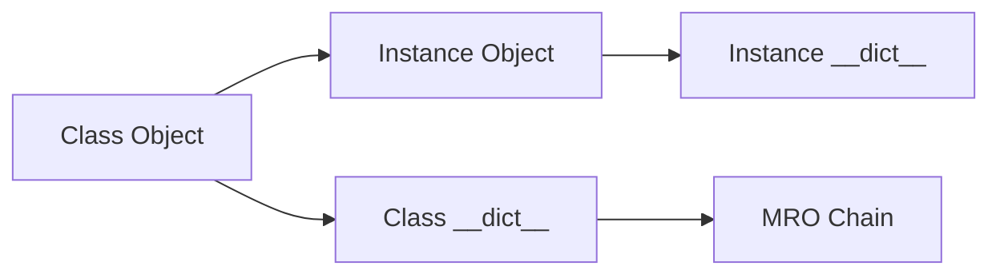


### 4.4 Encapsulation

Encapsulation in Python is **not about access restriction** like Java/C++.

It is about **controlling how data is accessed and modified**.

> Python enforces encapsulation by **convention + object model**, not by force.
> 


#### 4.4.1 Data Hiding

- **Data hiding** means preventing accidental or unsafe access to internal object state.
- Python does **not** truly hide data.
- Instead, Python relies on:
    - Naming conventions
    - Developer discipline
    - Properties

```python
class Account:
    def __init__(self, balance):
        self.balance = balance
```

Nothing stops external access:

```python
acc = Account(1000)
acc.balance = -500
```

❗ **Misinformation**

❌ Python supports true data hiding

✔ Python supports **controlled access**, not enforced hiding


#### Why Python Avoids Strict Data Hiding

- Objects are dynamic
- Introspection is encouraged
- Debugging and testing are easier
- “We are all consenting adults” philosophy


#### 4.4.2 Private Data Members

Python uses **name mangling**, not private memory.

```python
class Demo:
    def __init__(self):
        self.__secret = 42
```

Internally, Python rewrites:

```
__secret  →  _Demo__secret
```

```python
d = Demo()
print(d.__dict__)
```

You’ll see:

```python
{'_Demo__secret': 42}
```

Access is still possible:

```python
print(d._Demo__secret)
```

❗ **Misinformation**

❌ `__var` is private

✔ `__var` is **name-mangled**, not private


#### Single Underscore (`_var`)

- Indicates **internal use**
- No runtime effect

```python
self._temp = 10
```

Used by convention only.


#### 4.4.3 Getter and Setter Methods

Python prefers **properties** over explicit getters/setters.

❌ Java-style (not Pythonic):

```python
def get_balance(self):
    return self.balance
```

✔ Pythonic way:

```python
class Account:
    def __init__(self, balance):
        self._balance = balance

    @property
    def balance(self):
        return self._balance

    @balance.setter
    def balance(self, value):
        if value < 0:
            raise ValueError("Invalid balance")
        self._balance = value
```

**Why this matters:**

- Interface stays the same
- Internal logic can change
- Encapsulation without breaking code


### 4.5 Inheritance

Inheritance allows a class to **reuse and extend behavior** from another class.

Python supports:

- Single inheritance
- Multi-level inheritance
- Multiple inheritance

Inheritance works via **Method Resolution Order (MRO)**.


#### 4.5.1 Single Inheritance

One parent → one child.

```python
class Animal:
    def speak(self):
        return "sound"

class Dog(Animal):
    def speak(self):
        return "bark"
```

```python
d = Dog()
d.speak()
```

**Lookup process:**

1. `Dog`
2. `Animal`
3. `object`


#### 4.5.2 Multi-Level Inheritance

Inheritance chain across multiple levels.

```python
class A:
    def show(self):
        return "A"

class B(A):
    pass

class C(B):
    pass
```

```python
print(C.__mro__)
```

Python searches **top to bottom** in MRO.


#### 4.5.3 Multiple Inheritance

A class inherits from **more than one parent**.

```python
class A:
    def show(self):
        return "A"

class B:
    def show(self):
        return "B"

class C(A, B):
    pass
```

```python
c = C()
c.show()
```

Python chooses method using **C3 Linearization**.

```python
print(C.__mro__)
```

❗ **Misinformation**

❌ Python randomly chooses parent

✔ Python uses deterministic MRO


#### `super()` (Very Important)

```python
class A:
    def show(self):
        print("A")

class B(A):
    def show(self):
        super().show()
        print("B")
```

`super()` means:

> Call the **next class in MRO**, not necessarily the parent.
> 


### 4.6 Polymorphism

Polymorphism means:

> **Same interface, different behavior**
> 

Python achieves this via **duck typing**.


#### 4.6.1 Method Overriding

Child class provides its own implementation.

```python
class Shape:
    def area(self):
        return 0

class Square(Shape):
    def area(self):
        return 4
```

Method selection happens at **runtime**, not compile time.


#### 4.6.2 Runtime Polymorphism

Python decides **which method to run at runtime** based on object type.

```python
def print_area(shape):
    print(shape.area())
```

```python
print_area(Square())
```

No type checking.

Only method presence matters.

❗ **Misinformation**

❌ Python checks class type

✔ Python checks **behavior**


#### Operator Polymorphism

```python
class Point:
    def __init__(self, x):
        self.x = x

    def __add__(self, other):
        return Point(self.x + other.x)
```

Same operator `+`, different behavior.


### 4.7 Abstraction

Abstraction focuses on **what an object does**, not **how it does it**.

Python uses **Abstract Base Classes (ABC)**.


#### 4.7.1 Data Abstraction Concept

- Prevents incomplete implementations
- Defines required methods
- Enforces design contracts


#### 4.7.2 Abstract Classes

- Cannot be instantiated
- Serve as templates

```python
from abc import ABC

class Shape(ABC):
    pass
```

```python
## Shape()  → TypeError
```


#### 4.7.3 Abstract Methods

Methods that **must be implemented** by subclasses.

```python
from abc import ABC, abstractmethod

class Shape(ABC):
    @abstractmethod
    def area(self):
        pass
```

```python
class Square(Shape):
    def area(self):
        return 4
```

Failure to implement raises error **at instantiation time**.


#### 4.7.4 `abc` Module

The `abc` module provides:

- `ABC`
- `abstractmethod`

```python
from abc import ABC, abstractmethod
```

**Key internal behavior:**

- Abstract methods stored in `__abstractmethods__`
- Class instantiation blocked if not overridden


### Common Exam-Level Misinformation (Very Important)

| Myth | Reality |
| --- | --- |
| Python enforces private members | ❌ Convention only |
| `__var` is private | ❌ Name mangling |
| `super()` calls parent | ❌ Calls next in MRO |
| Multiple inheritance is unsafe | ❌ Safe with MRO |
| Abstraction is optional | ❌ Enforced via ABC |


### Final Mental Model (Lock This In)

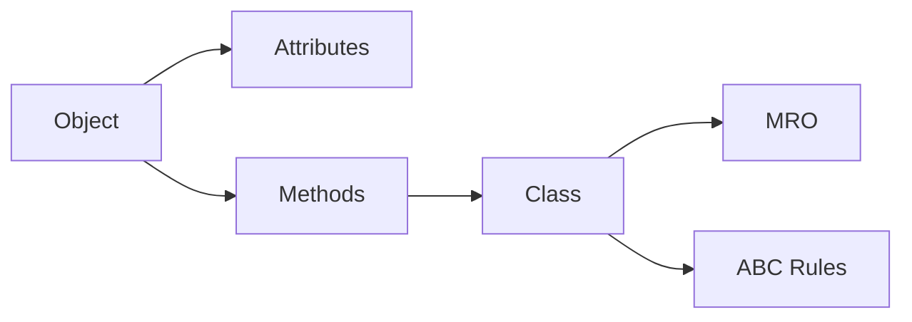


### Ultra-Short Summary

- Encapsulation → controlled access via convention
- Inheritance → behavior reuse via MRO
- Polymorphism → runtime method selection
- Abstraction → enforced contracts via ABC
- Python favors **flexibility over restriction**


## 5. Python Exceptions

*(Deep dive: runtime error model, stack frames, propagation, internals, and exam-level misconceptions)*


### 5.1 Introduction to Exceptions

- An **exception** is a **runtime event** that disrupts the normal flow of program execution.
- Exceptions occur when Python encounters a situation it **cannot resolve safely**.
- Internally, an exception is an **object** derived from `BaseException`.

```python
print(type(Exception))
```

#### What Happens Internally

1. Error condition detected
2. Exception object is **created**
3. Current execution stops
4. Python searches for a handler
5. If not found → program terminates

❗ **Key truth**

> Exceptions are **objects**, not messages or errors alone.
> 


### 5.2 Syntax Errors vs Exceptions

#### Syntax Errors

- Detected **before execution**
- Raised by the **parser**
- Program never starts running

```python
## if True
##     print("hi")
```

This raises `SyntaxError` during parsing.


#### Exceptions

- Occur **during execution**
- Program starts running successfully
- Error arises due to logic, input, or environment

```python
print(10 / 0)
```

Raises `ZeroDivisionError`.


#### Core Difference

| Syntax Error | Exception |
| --- | --- |
| Compile-time | Runtime |
| Parser-level | Interpreter-level |
| Cannot be caught | Can be handled |
| Code doesn’t run | Code partially runs |

❗ **Misinformation trap**

❌ SyntaxError is an exception you can catch

✔ SyntaxError stops execution before runtime (except in special eval cases)


### 5.3 Exception Handling

Python handles exceptions using **structured control flow**.

#### Why Exception Handling Exists

- Prevent abrupt program termination
- Separate error-handling logic from normal logic
- Allow recovery and cleanup


#### 5.3.1 `try` Block

- Wraps code that **may fail**
- Python monitors this block for exceptions

```python
try:
    x = int("abc")
```

#### Internal Behavior

- Bytecode execution is monitored
- If no exception → entire block runs
- If exception → execution jumps immediately


#### 5.3.2 `except` Block

- Catches and handles specific exception types
- Matching is done using **class hierarchy**

```python
try:
    x = int("abc")
except ValueError:
    print("Invalid conversion")
```

#### Exception Matching Rules

- Exact match or subclass match
- Order matters: more specific first

```python
try:
    x = 1 / 0
except ArithmeticError:
    print("Arithmetic")
except ZeroDivisionError:
    print("Zero division")
```

`ArithmeticError` catches first because it is a **base class**.

❗ **Exam trap**

❌ Python checks except blocks randomly

✔ Python checks **top to bottom**


### 5.4 Raising Exceptions

#### 5.4.1 `raise` Keyword

- Used to manually trigger exceptions
- Can raise:
    - Built-in exceptions
    - Custom exceptions

```python
raise ValueError("Invalid value")
```

#### Why `raise` Exists

- Enforce constraints
- Signal incorrect usage
- Propagate errors upward


#### Re-raising Exceptions

```python
try:
    x = 1 / 0
except:
    print("Error occurred")
    raise
```

- Preserves original traceback
- Useful for logging + propagation

❗ **Misinformation**

❌ `raise` creates a new exception always

✔ `raise` alone **re-raises** the same exception


### 5.5 Assertions

#### 5.5.1 `assert` Statement

- Used for **debug-time checks**
- Not meant for runtime error handling
- Can be globally disabled

```python
assert x > 0, "x must be positive"
```

#### How Assertions Work Internally

```python
assert condition
```

is equivalent to:

```python
if __debug__:
    if not condition:
        raise AssertionError
```


#### Disabling Assertions

```bash
python -O script.py
```

- Removes assertion checks
- Assertions **must not** be used for critical logic

❗ **Exam trap**

❌ Assertions always run

✔ Assertions can be optimized away


### 5.6 `try–except–else`

- `else` runs **only if no exception occurs**
- Cleaner than putting code after `try`

```python
try:
    x = int("10")
except ValueError:
    print("Error")
else:
    print("Success:", x)
```

#### Why `else` Exists

- Prevents accidental catching of errors
- Keeps success logic separate

❗ **Misinformation**

❌ `else` runs after except

✔ `else` runs only if **except is skipped**


### 5.7 `finally` Clause

- Executes **no matter what**
- Used for cleanup (files, locks, resources)

```python
try:
    x = 1 / 0
finally:
    print("Cleanup")
```

#### Behavior Guarantees

- Runs after:
    - Normal execution
    - Handled exception
    - Unhandled exception
- Even runs when `return` is used

```python
def f():
    try:
        return 10
    finally:
        print("finally")

print(f())
```

Output:

```
finally
10
```


### Exception Propagation (Deep Internals)

- Exceptions propagate **up the call stack**
- Each frame is checked for a handler
- Stack unwinds until:
    - Handler found
    - Or program terminates

```python
def a():
    b()

def b():
    c()

def c():
    1 / 0

a()
```

Python shows a **traceback** showing stack frames.


### Exception Object Anatomy

Every exception object has:

- Type
- Message
- Traceback (`__traceback__`)
- Context (`__context__`, `__cause__`)

```python
try:
    1 / 0
except Exception as e:
    print(type(e))
```


### Common Exception Hierarchy (Important)

```
BaseException
 ├── Exception
 │    ├── ValueError
 │    ├── TypeError
 │    ├── ZeroDivisionError
 │    └── IndexError
 ├── SystemExit
 ├── KeyboardInterrupt
 └── GeneratorExit
```

❗ **Exam trap**

❌ Catch `BaseException`

✔ Catch `Exception` (never swallow system exits)


### Common Misinformation (Very Important)

| Myth | Reality |
| --- | --- |
| Exceptions are slow | ❌ Only slow when raised |
| SyntaxError can be caught | ❌ Usually cannot |
| finally runs only on error | ❌ Always runs |
| assert is error handling | ❌ Debug only |
| except catches all errors | ❌ Depends on type |


### Final Mental Model (Lock This In)

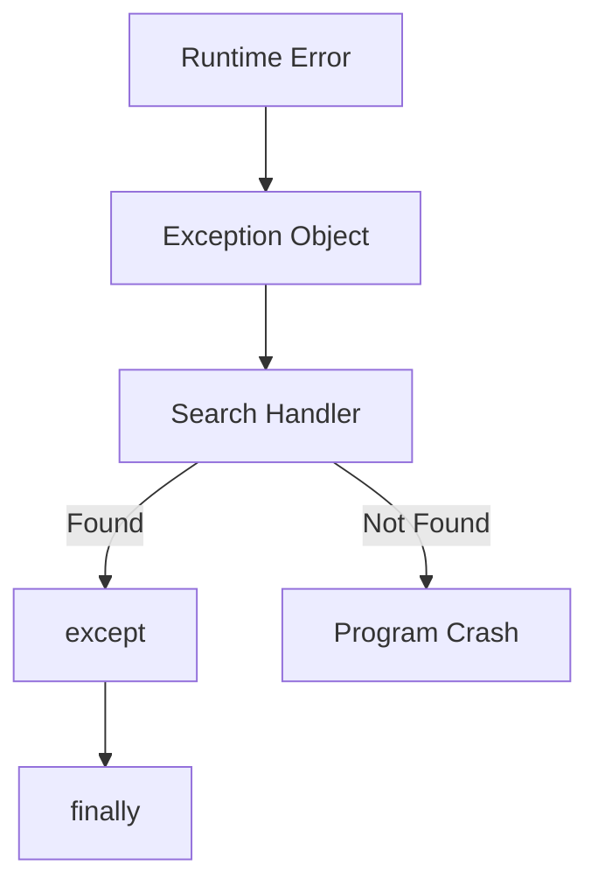


### Ultra-Short Summary

- Exceptions are objects
- Syntax errors ≠ exceptions
- `try` monitors execution
- `except` handles specific types
- `raise` signals errors
- `assert` is for debugging
- `else` runs on success
- `finally` always runs
- Exceptions propagate via stack frames


## 6. Python File Handling

*(Deep dive: OS interaction, file objects, buffering, encodings, resource management, and exam-level misconceptions)*


### 6.1 Introduction to File Handling

- **File handling** allows a program to **store data permanently** on secondary storage (disk).
- Files are managed by the **Operating System**, not Python.
- Python acts as a **high-level interface** to OS-level file descriptors.

#### Key Idea (Very Important)

> Python does **not** read/write files directly.
> 
> 
> It requests the OS to do so via a **file descriptor**.
> 


#### File Handling Pipeline (Internal View)

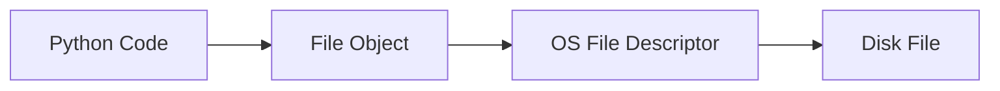


### 6.2 Opening Files


#### 6.2.1 `open()` Function

- `open()` is a **built-in function** that returns a **file object**.
- Syntax:

```python
file = open("data.txt", "r")
```

#### What Happens Internally

1. Python requests OS to open the file
2. OS returns a file descriptor (integer)
3. Python wraps it inside a **file object**
4. File pointer is positioned at start (usually)

```python
print(type(file))
```

The returned object is an instance of `_io.TextIOWrapper`.


#### File Object Anatomy

A file object maintains:

- File descriptor
- Mode (read/write)
- Cursor position
- Buffer
- Encoding (for text files)

```python
print(file.mode)
print(file.closed)
```


### 6.2.2 File Opening Modes

| Mode | Meaning |
| --- | --- |
| `r` | Read (default) |
| `w` | Write (overwrite) |
| `a` | Append |
| `x` | Create, fail if exists |
| `b` | Binary mode |
| `t` | Text mode |
| `r+` | Read + write |
| `w+` | Write + read |
| `a+` | Append + read |

```python
open("file.txt", "rb")
```

#### Critical Misinformation

❌ `w` edits file

✔ `w` **destroys existing content**


### 6.3 Reading Files


#### 6.3.1 `read()` Method

- Reads **entire file** or specified number of characters.
- Moves file pointer forward.

```python
file = open("data.txt", "r")
content = file.read()
```

**Explanation:**

- Reads from current cursor to EOF
- Cursor moves to end

```python
print(file.tell())
```


#### Partial Read

```python
file.read(10)
```

Reads first 10 characters.


#### 6.3.2 `readline()` Method

- Reads **one line at a time**
- Includes newline (`\n`)

```python
line = file.readline()
```

Useful for **large files**.


#### 6.3.3 `readlines()` Method

- Reads all lines into a **list**

```python
lines = file.readlines()
```

❗ **Memory Warning**

- Loads entire file into memory
- Avoid for large files


#### Iterating Over File (Best Practice)

```python
for line in file:
    print(line)
```

Python reads line-by-line efficiently using buffering.


### 6.4 Writing Files


#### 6.4.1 `write()` Method

- Writes a **string** to file
- Returns number of characters written

```python
file = open("out.txt", "w")
file.write("Hello\n")
```

❗ Must be a string in text mode.


#### Buffering Insight (Important)

- Data may stay in memory buffer
- Not immediately written to disk
- Flushed on:
    - `close()`
    - `flush()`
    - Program exit

```python
file.flush()
```


#### 6.4.2 `writelines()` Method

- Writes a **list of strings**
- Does NOT add newline automatically

```python
lines = ["one\n", "two\n", "three\n"]
file.writelines(lines)
```


### 6.5 Closing Files


#### 6.5.1 `close()` Method

- Releases OS resources
- Flushes buffers
- Marks file as closed

```python
file.close()
```

```python
print(file.closed)
```

#### Why Closing Is Critical

- OS has limited file descriptors
- Unclosed files → resource leak
- Data loss risk due to buffering

❗ **Misinformation**

❌ Python closes files automatically

✔ Only sometimes (garbage collection is unreliable)


### 6.6 File Handling Best Practices


#### 6.6.1 `with` Statement (Context Manager)

- Ensures file is **always closed**
- Even if an exception occurs

```python
with open("data.txt", "r") as file:
    data = file.read()
```

#### Internal Mechanism

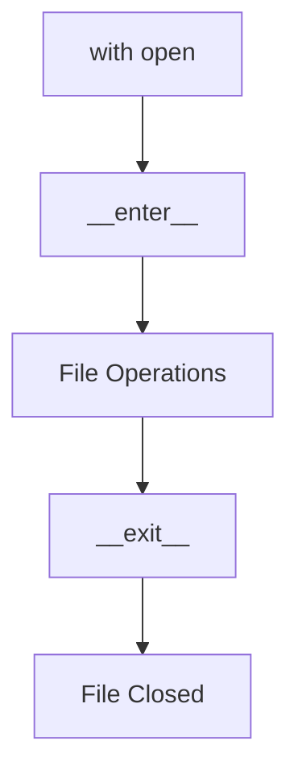

`__exit__()` is called **no matter what**.


#### Why `with` Is Superior

- No forgotten `close()`
- Cleaner code
- Exception-safe
- Recommended by Python docs


#### 6.6.2 Exception Handling While Closing Files

❌ Unsafe Pattern:

```python
file = open("data.txt")
data = file.read()
file.close()
```

If `read()` fails → `close()` never runs.


✔ Safe Pattern:

```python
try:
    file = open("data.txt")
    data = file.read()
finally:
    file.close()
```


✔ Best Pattern (Preferred):

```python
with open("data.txt") as file:
    data = file.read()
```


### Text vs Binary Files (Important)

```python
open("image.png", "rb")
```

- Text mode → encoding/decoding
- Binary mode → raw bytes

```python
data = open("file.bin", "rb").read()
print(type(data))   ## bytes
```


### Encoding & Decoding (Common Pitfall)

```python
open("data.txt", "r", encoding="utf-8")
```

❗ Encoding mismatch causes `UnicodeDecodeError`.


### File Cursor Control

```python
file.seek(0)
file.tell()
```

- `seek()` → move cursor
- `tell()` → current position


### Exception Types in File Handling

| Exception | Cause |
| --- | --- |
| `FileNotFoundError` | File missing |
| `PermissionError` | No access rights |
| `IsADirectoryError` | Opening directory |
| `IOError` | I/O failure |


### Common Exam-Level Misinformation

| Myth | Reality |
| --- | --- |
| `close()` always runs | ❌ Not guaranteed |
| `w` appends data | ❌ Overwrites |
| `readlines()` is efficient | ❌ Memory-heavy |
| Files auto-close | ❌ GC unreliable |
| Text and binary are same | ❌ Encoding matters |


### Final Mental Model (Lock This In)

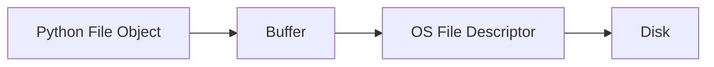


### Ultra-Short Summary

- Files are OS-managed resources
- `open()` returns a file object
- Reading moves cursor
- Writing is buffered
- Closing is mandatory
- `with` guarantees cleanup
- Exceptions do not auto-close files
- Text ≠ binary


---

[𝕮𝖚𝖗𝖗𝖎𝖈𝖚𝖑𝖚𝖒](https://www.notion.so/d0041eacd2a3493ba9367f74ea0b45e9?pvs=21)