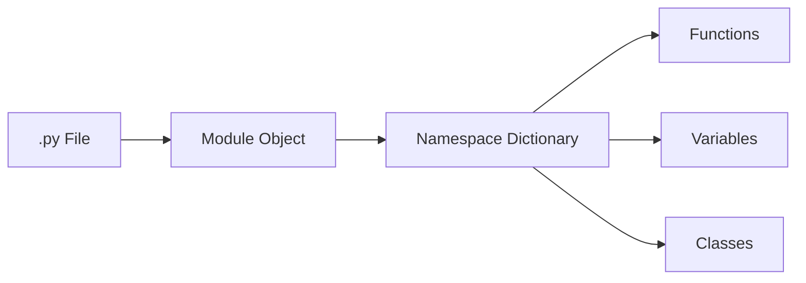
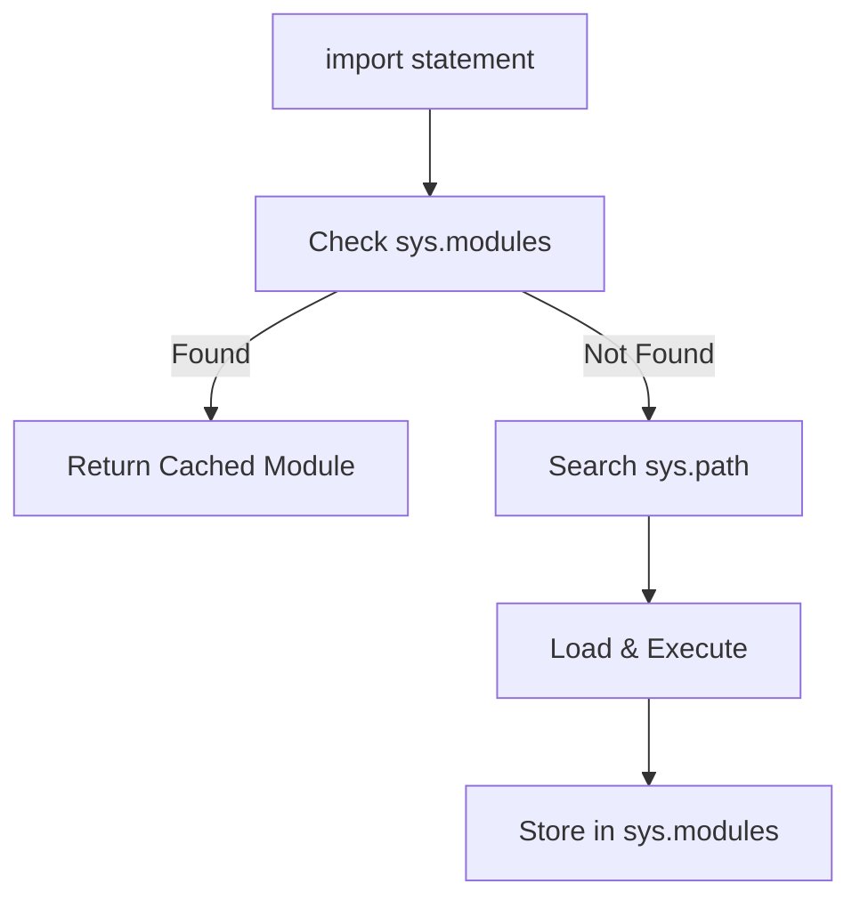
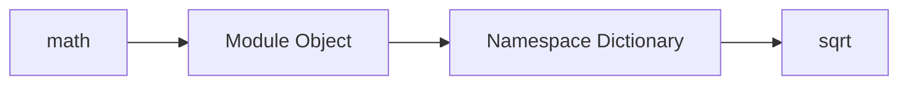
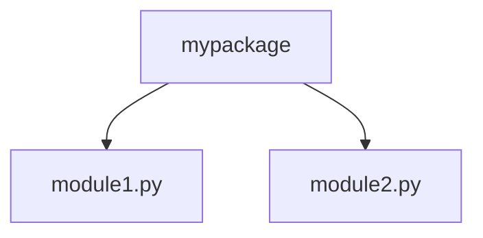
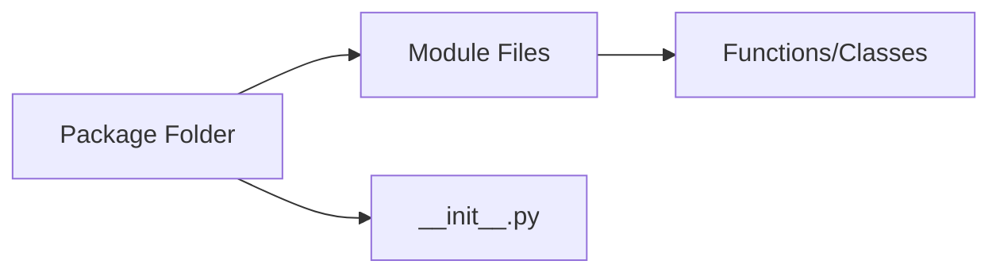
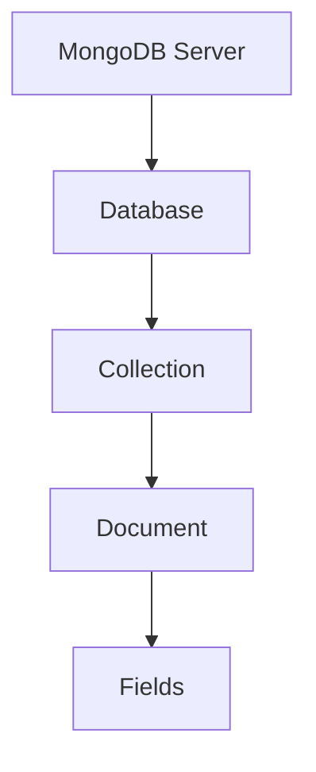

# Unit - 3
:::info[TITLE]
## WORKING WITH MODULES & PACKAGES
:::


## 1. Working with Modules & Packages


### 1.1 Modular Programming


#### 1.1.1 Definition of Modular Programming

**Modular Programming** is a software design technique in which a large program is divided into **smaller, independent, self-contained units** called *modules*.

Each module:

- Performs a specific task
- Has its own namespace
- Can be developed, tested, and maintained independently

> A module is essentially a logical separation of functionality.
> 

In Python, **modules are simply `.py` files** containing code.


#### Why Modular Programming Exists

Without modularity:

- Code becomes large and unmanageable
- Debugging becomes difficult
- Reusability is impossible
- Collaboration becomes chaotic


#### 1.1.2 Advantages of Modular Programming

| Advantage | Meaning |
| --- | --- |
| Code organization | Logical separation |
| Maintainability | Easy updates |
| Debugging | Errors isolated |
| Reusability | Use modules elsewhere |
| Collaboration | Multiple developers |


#### 1.1.3 Simplification

Large problems are broken into smaller parts.

Instead of:

```python
## 1000-line script
```

We use:

```
math_utils.py
file_utils.py
main.py
```

Each file handles a specific responsibility.

This reduces:

- Cognitive load
- Logical complexity
- Coupling


#### 1.1.4 Flexibility

Modules allow:

- Swapping components
- Updating features independently
- Extending functionality

Example:

```python
## version 1
def calculate():
    return 10
```

Later:

```python
## version 2
def calculate():
    return 20
```

Only the module changes — the main program remains untouched.


#### 1.1.5 Reusability

Modules can be reused across projects.

Example:

```python
## math_utils.py
def square(x):
    return x * x
```

Now usable in any project:

```python
import math_utils
print(math_utils.square(5))
```

Reusability reduces:

- Redundant coding
- Errors
- Development time


#### 1.1.6 Scope and Namespace

Each module has its own **namespace**.

Namespace = a dictionary that maps names to objects.

```python
import math
print(math.__dict__.keys())
```

Why this matters:

- Avoids name collisions
- Encapsulates functionality


#### LEGB Rule (Critical for Modules)

Python resolves names using:

1. **L**ocal
2. **E**nclosing
3. **G**lobal
4. **B**uilt-in

Modules define a new **global namespace**.


### 1.2 Python Modules


#### 1.2.1 What is a Module?

A module is:

> A file containing Python definitions and statements.
> 

Example:

`calculator.py`

```python
def add(a, b):
    return a + b
```

Using it:

```python
import calculator
print(calculator.add(2, 3))
```


#### What Happens Internally During `import`

1. Python searches module in:
    - Current directory
    - PYTHONPATH
    - Standard library
2. Compiles to bytecode (`.pyc`)
3. Executes module
4. Creates module object
5. Stores it in `sys.modules`

```python
import sys
print(sys.modules.keys())
```


#### Important Internal Concept

> A module is an object of type `module`.
> 

```python
import math
print(type(math))
```

Modules have:

- `__name__`
- `__file__`
- `__dict__`


#### 1.2.2 Types of Modules


**1.2.2.1 User-Defined Modules**

Modules created by the programmer.

Example:

`my_module.py`

```python
def greet():
    return "Hello"
```

Usage:

```python
import my_module
print(my_module.greet())
```


**1.2.2.2 Built-in Modules**

Pre-installed modules provided by Python.

Examples:

- `math`
- `os`
- `sys`
- `random`

```python
import math
print(math.sqrt(16))
```

Built-in modules are written in:

- Python
- C (for performance)


**1.2.2.3 C-Based Extension Modules**

Written in C and compiled.

Examples:

- `math`
- `time`
- `json` (partially C-based)

Why?

- Faster execution
- Direct OS interaction

These are dynamically linked at runtime.


#### 1.2.3 Creating a Module

Step 1: Create a file

`utils.py`

```python
def multiply(a, b):
    return a * b
```

Step 2: Import in another file

```python
import utils
print(utils.multiply(3, 4))
```


#### `__name__` Special Variable (Very Important)

Each module has:

```python
print(__name__)
```

If file is run directly:

```
__main__
```

If imported:

```
module_name
```


#### Guard Pattern

```python
if __name__ == "__main__":
    print("Run directly")
```

Prevents execution when imported.


### 1.2.4 Using Functions from a Module


#### Using Dot Operator

```python
import math
print(math.pi)
```


#### Using `from` Import

```python
from math import sqrt
print(sqrt(9))
```


#### Import with Alias

```python
import math as m
print(m.sqrt(16))
```


#### Import All (Not Recommended)

```python
from math import *
```

Problems:

- Namespace pollution
- Harder debugging
- Name conflicts


### How Python Avoids Re-Importing

Modules are cached in:

```python
sys.modules
```

Importing again does **not** reload module automatically.


#### Reloading Module

```python
import importlib
importlib.reload(module_name)
```


### Common Misinformation (Exam Gold)

| Myth | Reality |
| --- | --- |
| Import runs file every time | ❌ Cached after first import |
| Modules are just files | ❌ Modules are objects |
| from import is faster | ❌ Same underlying mechanism |
| `*` import is best | ❌ Dangerous practice |
| **name** is optional | ❌ Crucial for modular design |


### Final Mental Model




### Ultra-Short Summary

- Modular programming splits large systems
- A module is a Python file
- Import creates a module object
- Modules have their own namespace
- Modules are cached
- `__name__ == "__main__"` prevents auto execution
- Dot operator accesses module members


### 1.3 Importing Modules

Importing in Python is **not just loading a file**.

It is a **multi-step process involving search paths, caching, compilation, and namespace binding**.


#### How Python’s Import System Actually Works (Internal View)

When you write:

```python
import math
```

Python performs:

1. Check `sys.modules` (module cache)
2. If not found → search `sys.path`
3. Locate module file or built-in module
4. Compile to bytecode (if needed)
5. Create a **module object**
6. Execute module code
7. Store in `sys.modules`
8. Bind module name in current namespace


#### Import Execution Model




#### 1.3.1 `import` Statement

Basic form:

```python
import module_name
```

Example:

```python
import math
```

Now `math` becomes a name bound to a **module object**.

```python
print(type(math))
```

#### Important Behavior

- Module code executes **only once**
- Future imports reuse cached module

```python
import sys
print("math" in sys.modules)
```


#### 1.3.2 Accessing Module Members Using Dot Operator

```python
import math
print(math.sqrt(16))
```

The dot operator:

- Looks up attribute in module’s namespace
- Accesses `math.__dict__`

Why this is good:

- Avoids name collisions
- Keeps namespace clean


#### Attribute Lookup Model




#### 1.3.3 Renaming Modules using `as`

```python
import math as m
print(m.sqrt(25))
```

Why use alias?

- Shorter names
- Avoid conflicts
- Improve readability

Example:

```python
import numpy as np
```

Alias only affects **local namespace**, not module itself.


#### 1.3.4 `from ... import` Statement

```python
from math import sqrt
print(sqrt(16))
```

Instead of importing the module, you import a **specific attribute**.

Internally:

- Python loads module (if not loaded)
- Retrieves attribute
- Binds name directly


#### Difference from `import`

```python
import math
math.sqrt(9)
```

vs

```python
from math import sqrt
sqrt(9)
```

Second method:

- Avoids prefix
- Risk of name collision


#### 1.3.5 Importing Multiple Attributes

```python
from math import sqrt, pi
```

Multiple names bound directly.

Be careful:

```python
from module import name
```

If module changes internally, direct references may not update unless reloaded.


#### 1.3.6 Import All using

```python
from math import *
```

Imports all public names.

What counts as public?

- Names not starting with `_`
- Or defined in `__all__`


#### Why  Is Dangerous

- Namespace pollution
- Hard debugging
- Overwriting existing names

Example:

```python
from math import *
sqrt = 10
```

Now `sqrt` no longer refers to math function.


#### `__all__` Control

Inside module:

```python
__all__ = ["func1", "func2"]
```

Controls what `*` imports.


### Common Misinformation (Imports)

| Myth | Reality |
| --- | --- |
| Import runs file every time | ❌ Cached in sys.modules |
| from import is faster | ❌ Same loading mechanism |
| `*` is convenient | ❌ Unsafe |
| Modules reload automatically | ❌ Need importlib.reload |


### 1.4 Python Packages


#### 1.4.1 Definition of Packages

A **package** is:

> A directory containing Python modules and a special file `__init__.py` (in traditional packages).
> 

Used for:

- Organizing modules
- Creating hierarchical structure
- Avoiding naming conflicts


#### 1.4.2 Structure of a Package

Example:

```
mypackage/
    __init__.py
    module1.py
    module2.py
```


#### Package Hierarchy Model




#### 1.4.3 Creating a Package

Step 1: Create folder

Step 2: Add `__init__.py`

Step 3: Add modules

Example:

```
calculator/
    __init__.py
    add.py
    subtract.py
```


#### 1.4.4 `__init__.py` File

Purpose:

- Marks directory as package (traditional)
- Executes when package is imported
- Can initialize package state

Example:

```python
## calculator/__init__.py
print("Calculator package loaded")
```


#### Modern Python Note

Since Python 3.3:

- `__init__.py` not mandatory
- Implicit namespace packages supported
- Still recommended for clarity


#### 1.4.5 Sub-Packages

Packages can contain packages.

Example:

```
company/
    __init__.py
    hr/
        __init__.py
        payroll.py
```


#### 1.4.6 Importing from Packages

```python
import calculator.add
```

or

```python
from calculator import add
```

or

```python
from calculator.add import function_name
```


#### Relative Imports (Inside Packages)

```python
from . import module
from ..subpackage import module
```

Dot meaning:

- `.` → current package
- `..` → parent package


#### 1.4.7 Distribution using `setup.py`

`setup.py` is used for:

- Packaging
- Distribution
- Installation via pip

Basic example:

```python
from setuptools import setup

setup(
    name="mypackage",
    version="1.0",
    packages=["mypackage"],
)
```

This allows:

```bash
pip install .
```


#### How Package Import Differs from Module Import

- Python treats packages as modules
- Package is also a module object
- Submodules are attributes

```python
import package
print(type(package))
```


#### sys.path (Very Important for Packages)

Python searches for modules in:

```python
import sys
print(sys.path)
```

Includes:

- Current directory
- Standard library
- Site-packages
- Environment paths


#### Circular Import Problem (Advanced)

If:

- Module A imports B
- Module B imports A

Result:

- Partially initialized modules
- Attribute errors

Solution:

- Move imports inside functions
- Refactor structure


### Final Mental Model




### Ultra-Short Summary

- `import` loads module once
- Modules cached in `sys.modules`
- Dot operator accesses namespace
- `as` renames locally
- `from` imports specific names
- is risky
- Packages are directories of modules
- `__init__.py` initializes package
- `sys.path` controls search path
- setup.py enables distribution


## 2. Introduction to Popular Python Libraries


### 2.1 Python Libraries

#### 2.1.1 What is a Library?

- A **library** is a collection of **pre-written code modules** designed to perform specific tasks.
- Libraries reduce development time by providing reusable functions, classes, and tools.
- A library may contain:
    - Multiple modules
    - Sub-packages
    - Compiled extensions
- Libraries can be:
    - Built-in (comes with Python)
    - Third-party (installed via `pip`)
- Libraries extend Python’s capabilities without modifying the core interpreter.
- Example:
    
    ```python
    import math
    print(math.sqrt(25))
    ```
    


#### 2.1.2 How Python Libraries Work

- Libraries are imported using the Python **import system**.
- Internally:
    1. Python searches `sys.path`
    2. Loads the library module
    3. Executes it
    4. Caches it in `sys.modules`
- Many libraries use:
    - Pure Python code
    - C-based extensions for speed
- Third-party libraries are typically stored in:
    - `site-packages` directory
- Installed using:
    
    ```bash
    pip install library_name
    ```
    
- Libraries can depend on other libraries (dependency management handled by pip).


#### 2.1.3 DLL and Dynamic Linking Concept

- Many Python libraries use **Dynamic Link Libraries (DLLs)** (Windows) or shared objects (`.so`) (Linux).
- Dynamic linking means:
    - External compiled code is loaded at runtime.
    - Python interacts with compiled C/C++ code.
- Benefits:
    - Faster execution
    - Lower-level system access
    - Performance optimization
- Example:
    - `math` module uses C backend.
- Python uses:
    - CPython API
    - Extension modules
- This allows Python to combine:
    - High-level simplicity
    - Low-level performance


#### 2.1.4 Standard Library of Python

- The **Standard Library** comes pre-installed with Python.
- Often described as “batteries included”.
- Covers areas like:
    - File handling (`os`, `pathlib`)
    - System interaction (`sys`)
    - Math (`math`, `statistics`)
    - Networking (`socket`)
    - JSON handling (`json`)
    - Date and time (`datetime`)
- Example:
    
    ```python
    import datetime
    print(datetime.datetime.now())
    ```
    
- Standard library modules are:
    - Reliable
    - Optimized
    - Cross-platform
- No installation required.


### 2.2 Libraries for Game Development

#### 2.2.1 Pygame

- Open-source library for 2D game development.
- Built on top of SDL (Simple DirectMedia Layer).
- Supports:
    - Graphics rendering
    - Sound
    - Keyboard & mouse input
- Ideal for beginners.
- Example:
    
    ```python
    import pygame
    pygame.init()
    screen = pygame.display.set_mode((400, 300))
    ```
    
- Used for educational and indie games.


#### 2.2.2 Panda3D

- 3D game engine.
- Developed by Disney.
- Supports:
    - Advanced rendering
    - Physics engines
    - Scene graph system
- Written in C++ with Python bindings.
- Used for professional 3D simulations.


#### 2.2.3 Godot (Python Scripting)

- Open-source game engine.
- Primarily uses GDScript.
- Python-like syntax.
- Supports:
    - 2D and 3D development
    - Cross-platform export
- Python can be integrated via plugins.
- Used for indie and commercial games.


#### 2.2.4 PyOpenGL

- Python binding for OpenGL.
- Used for:
    - 3D graphics rendering
    - GPU-based rendering
- Works with OpenGL C API.
- Used in:
    - Scientific visualization
    - Graphics engines
- Requires understanding of graphics pipeline.


#### 2.2.5 Arcade

- Modern 2D game framework.
- Easier alternative to Pygame.
- Uses OpenGL under the hood.
- Designed for:
    - Clean API
    - Educational use
- Example:
    
    ```python
    import arcade
    arcade.open_window(400, 400, "Game")
    ```
    


#### 2.2.6 Ren’Py

- Visual novel game engine.
- Focused on storytelling games.
- Python-based scripting.
- Used for:
    - Dialogue systems
    - Character interaction
    - Scene transitions
- Popular in indie visual novels.


#### 2.2.7 Pyglet

- Multimedia library for:
    - Windowing
    - OpenGL graphics
    - Audio
- Pure Python implementation.
- No external dependencies required.
- Suitable for lightweight game development.


### 2.3 Libraries for Data Analysis

#### 2.3.1 Pandas

- High-level library for **data manipulation and analysis**.
- Built on top of **NumPy**.
- Core data structures:
    - `Series` (1D labeled array)
    - `DataFrame` (2D labeled table)
- Supports:
    - CSV/Excel/JSON reading
    - Data cleaning
    - Filtering, grouping, aggregation
- Example:
    
    ```python
    import pandas as pd
    df = pd.read_csv("data.csv")
    print(df.head())
    ```
    
- Used in:
    - Data science
    - Financial analysis
    - Machine learning preprocessing


#### 2.3.2 NumPy

- Core numerical computing library.
- Provides:
    - `ndarray` (N-dimensional array)
    - Vectorized operations
    - Broadcasting
- Written in C for performance.
- Faster than Python lists for numerical work.
- Example:
    
    ```python
    import numpy as np
    arr = np.array([1, 2, 3])
    print(arr * 2)
    ```
    
- Foundation for:
    - Pandas
    - SciPy
    - TensorFlow
    - PyTorch


#### 2.3.3 Matplotlib

- Visualization library for **static plots**.
- Supports:
    - Line charts
    - Bar charts
    - Histograms
    - Scatter plots
- Example:
    
    ```python
    import matplotlib.pyplot as plt
    plt.plot([1,2,3], [4,5,6])
    plt.show()
    ```
    
- Highly customizable.
- Used in academic and scientific research.


#### 2.3.4 Seaborn

- Built on top of Matplotlib.
- Provides:
    - Statistical visualizations
    - Better default styling
- Simplifies complex plots.
- Example:
    
    ```python
    import seaborn as sns
    sns.histplot([1,2,2,3,3,3])
    ```
    
- Used for:
    - Data exploration
    - Statistical modeling visualization


#### 2.3.5 SciPy

- Scientific computing library.
- Built on NumPy.
- Includes modules for:
    - Optimization
    - Integration
    - Signal processing
    - Linear algebra
- Used in:
    - Engineering
    - Physics
    - Scientific research


#### 2.3.6 Plotly

- Interactive visualization library.
- Supports:
    - Web-based dynamic plots
    - Dash dashboards
- Example:
    
    ```python
    import plotly.express as px
    fig = px.line(x=[1,2,3], y=[4,5,6])
    fig.show()
    ```
    
- Used for:
    - Business dashboards
    - Interactive reports


#### 2.3.7 Statsmodels

- Statistical modeling library.
- Supports:
    - Regression models
    - Time series analysis
    - Hypothesis testing
- Example:
    
    ```python
    import statsmodels.api as sm
    ```
    
- Used in econometrics and statistical research.


#### 2.3.8 TensorFlow

- Machine learning and deep learning framework.
- Developed by Google.
- Supports:
    - Neural networks
    - GPU acceleration
    - Large-scale ML pipelines
- Used for:
    - AI models
    - Computer vision
    - NLP
- Uses computational graphs internally.


#### 2.3.9 PyTorch

- Deep learning framework by Meta (Facebook).
- Popular for:
    - Research flexibility
    - Dynamic computation graphs
- Supports GPU acceleration.
- Example:
    
    ```python
    import torch
    x = torch.tensor([1.0, 2.0])
    ```
    
- Widely used in AI research.


### 2.4 Libraries for Web Development


#### 2.4.1 Django

- High-level web framework.
- Follows:
    - MVT (Model-View-Template) pattern.
- Features:
    - Built-in admin panel
    - ORM
    - Authentication
    - Security protections
- Used for large-scale applications.


#### 2.4.2 Flask

- Lightweight web framework.
- Minimal and flexible.
- Requires extensions for:
    - Database
    - Authentication
- Example:
    
    ```python
    from flask import Flask
    app = Flask(__name__)
    ```
    
- Used for small to medium projects.


#### 2.4.3 FastAPI

- Modern web framework.
- Built for:
    - High performance
    - APIs
- Uses type hints.
- Supports:
    - Automatic documentation (Swagger)
    - Async programming
- Suitable for microservices.


#### 2.4.4 Pyramid

- Flexible web framework.
- Can scale from small to large apps.
- Developer-configurable.
- Suitable for complex systems.


#### 2.4.5 Bottle

- Micro-framework.
- Single-file deployment possible.
- Lightweight and minimal.
- Used for small web apps and prototypes.


#### 2.4.6 Tornado

- Asynchronous networking library.
- Non-blocking I/O.
- Suitable for:
    - Real-time apps
    - WebSockets
- High concurrency support.


#### 2.4.7 Requests

- HTTP library.
- Simplifies API communication.
- Example:
    
    ```python
    import requests
    r = requests.get("https://example.com")
    ```
    
- Used for:
    - Web scraping
    - API integration


#### 2.4.8 SQLAlchemy

- SQL toolkit and ORM.
- Provides:
    - Database abstraction
    - Query building
- Supports multiple databases.
- Used with Flask and other frameworks.


#### 2.4.9 BeautifulSoup

- HTML/XML parsing library.
- Used for:
    - Web scraping
    - Data extraction
- Example:
    
    ```python
    from bs4 import BeautifulSoup
    ```
    
- Works with Requests.


#### 2.4.10 Celery

- Distributed task queue.
- Used for:
    - Background jobs
    - Asynchronous task execution
- Common in Django/Flask projects.
- Supports:
    - Redis
    - RabbitMQ


## 3. PyCharm IDE


### 3.1 Introduction to PyCharm

#### 3.1.1 Editions (Community vs Professional)

**PyCharm** is an Integrated Development Environment (IDE) for Python developed by JetBrains.

Two main editions:

**Community Edition (Free & Open Source):**

- Supports Python development
- Basic debugging tools
- Git integration
- Virtual environment support
- Suitable for:
    - Students
    - Beginners
    - Basic Python projects

**Professional Edition (Paid):**

- All Community features
- Web development support (Django, Flask, FastAPI)
- Database tools
- Scientific tools
- Remote development
- Docker integration
- Used for enterprise-level projects


#### 3.1.2 Platform Support

PyCharm supports:

- Windows
- macOS
- Linux

Cross-platform features:

- Same UI across platforms
- Same project configuration
- JVM-based architecture (runs on Java Virtual Machine)


#### 3.1.3 Python Version Support

- Supports Python 2.x and 3.x
- Supports virtual environments:
    - `venv`
    - `virtualenv`
    - Conda environments
- Allows interpreter selection per project
- Supports:
    - Local interpreters
    - Remote interpreters
    - Docker interpreters


### 3.2 Git Integration with PyCharm

PyCharm provides built-in Git version control integration.


#### 3.2.1 Installing Git

Before using Git in PyCharm:

- Install Git from official website
- Verify installation:
    
    ```bash
    git --version
    ```
    


#### 3.2.2 Configuring Git in PyCharm

Steps:

1. Go to **Settings / Preferences**
2. Navigate to **Version Control → Git**
3. Set Git executable path
4. Test connection


#### 3.2.3 Enabling Version Control

To enable Git for a project:

- Go to **VCS → Enable Version Control Integration**
- Select Git

PyCharm initializes `.git` folder.


#### 3.2.4 Cloning a Repository

Steps:

1. File → New → Project from Version Control
2. Enter repository URL
3. Choose directory
4. Clone

Equivalent Git command:

```bash
git clone <repository_url>
```


#### 3.2.5 Commit Operation

Commit saves changes locally.

Steps:

1. Make changes
2. Open **Commit window**
3. Select files
4. Write commit message
5. Click Commit

Equivalent command:

```bash
git commit -m "message"
```


#### 3.2.6 Push Operation

Push uploads local commits to remote repository.

Steps:

1. VCS → Git → Push
2. Confirm branch
3. Push

Equivalent command:

```bash
git push
```


#### 3.2.7 Pull Operation

Pull updates local repository from remote.

Steps:

1. VCS → Git → Pull
2. Choose branch
3. Pull

Equivalent command:

```bash
git pull
```


#### 3.2.8 Viewing Logs

PyCharm provides:

- Commit history
- Branch visualization
- Change comparison

Accessible via:

- VCS → Git → Show History

Displays:

- Commit ID
- Author
- Date
- Message
- File changes


#### 3.2.9 Resolving Merge Conflicts

Occurs when:

- Two branches modify the same file differently.

Steps:

1. PyCharm detects conflict
2. Opens merge tool
3. Shows:
    - Current changes
    - Incoming changes
4. Choose:
    - Accept left
    - Accept right
    - Merge manually
5. Mark as resolved
6. Commit changes


### 3.3 PyTest in PyCharm


#### 3.3.1 Introduction to PyTest

- PyTest is a testing framework for Python.
- Used to:
    - Write unit tests
    - Automate validation
    - Detect regressions
- Supports:
    - Simple syntax
    - Fixtures
    - Parameterization


#### 3.3.2 Features of PyTest

- Automatic test discovery
- Simple assert statements
- Detailed error reporting
- Fixture system
- Plugin ecosystem
- Test parameterization


#### 3.3.3 Writing Test Cases

Basic test structure:

```python
def test_add():
    assert 2 + 3 == 5
```

Rules:

- File name starts with `test_`
- Function name starts with `test_`


#### 3.3.4 Running Tests in PyCharm

Steps:

1. Right-click test file
2. Select “Run”
3. Results displayed in test window

PyCharm shows:

- Passed tests
- Failed tests
- Execution time


#### 3.3.5 Debugging Tests

Steps:

1. Set breakpoint
2. Right-click test
3. Select “Debug”

Allows:

- Step into code
- Inspect variables
- Analyze stack frames


#### 3.3.6 Test Coverage

Test coverage measures:

> How much of your code is executed by tests.
> 

In PyCharm:

- Run with coverage option
- Code coverage highlighted:
    - Green → covered
    - Red → not covered

Helps ensure:

- Code reliability
- Fewer hidden bugs


## 4. Python Connectivity with Databases


### 4.1 Introduction to MongoDB

#### 4.1.1 What is MongoDB?

- MongoDB is a **NoSQL, document-oriented database**.
- Stores data in **JSON-like documents**.
- Designed for:
    - High performance
    - Scalability
    - Flexibility
- Developed by MongoDB Inc.
- Open-source with enterprise versions available.
- Used in:
    - Web applications
    - Big data systems
    - IoT platforms
- Does not use traditional tables and rows.


#### 4.1.2 NoSQL Concept

- NoSQL stands for **“Not Only SQL.”**
- Non-relational database model.
- Does not rely on:
    - Fixed schemas
    - Table relationships (joins)
- Supports:
    - Horizontal scaling
    - Distributed architecture
- Types of NoSQL databases:
    - Document-based
    - Key-value
    - Column-based
    - Graph-based
- MongoDB is a **document-based NoSQL database**.


#### 4.1.3 BSON Format

- MongoDB stores data in **BSON (Binary JSON)**.
- BSON is a binary-encoded format of JSON.
- Advantages:
    - Faster parsing
    - Efficient storage
    - Supports additional data types:
        - Date
        - Binary
        - ObjectId
- Example JSON:
    
    ```json
    { "name": "Ankur", "age": 20 }
    ```
    
- Stored internally as BSON.


#### 4.1.4 Language Support

- MongoDB supports multiple programming languages.
- Official drivers available for:
    - Python (PyMongo)
    - Java
    - C++
    - Node.js
    - C#
- Python connects using:
    
    ```bash
    pip install pymongo
    ```
    
- Example connection:
    
    ```python
    from pymongo import MongoClient
    client = MongoClient("mongodb://localhost:27017/")
    ```
    


### 4.2 MongoDB Structure


#### 4.2.1 Database

- A database is a **container for collections**.
- Example:
    
    ```jsx
    use school
    ```
    
- Multiple databases can exist on a MongoDB server.


#### 4.2.2 Collection

- A collection is similar to a **table in RDBMS**.
- Stores multiple documents.
- Does not enforce strict schema.
- Example:
    
    ```jsx
    db.students.insertOne({name: "Ankur"})
    ```
    


#### 4.2.3 Document

- A document is a **record in MongoDB**.
- Stored in BSON format.
- Structure:
    
    ```json
    {
      "name": "Ankur",
      "age": 20
    }
    ```
    
- Documents can contain:
    - Nested objects
    - Arrays


#### 4.2.4 Fields

- Fields are key-value pairs inside documents.
- Example:
    
    ```json
    { "name": "Ankur" }
    ```
    
- `name` → field
- `"Ankur"` → value


#### 4.2.5 Relationship Between Database, Collection, and Document

Hierarchy:



- Server → Multiple Databases
- Database → Multiple Collections
- Collection → Multiple Documents
- Document → Multiple Fields


#### 4.2.6 Sample Document Structure

Example:

```json
{
  "_id": ObjectId("..."),
  "name": "Ankur",
  "age": 20,
  "courses": ["Python", "MongoDB"],
  "address": {
    "city": "Mumbai",
    "zip": 400001
  }
}
```

- `_id` is auto-generated primary key.
- Supports nested objects and arrays.


### 4.3 MongoDB Features


#### 4.3.1 Document-Oriented Storage

- Stores data as JSON-like documents.
- Flexible schema.
- Allows dynamic fields.
- Easier mapping to programming language objects.


#### 4.3.2 Indexing

- Improves query performance.
- Example:
    
    ```jsx
    db.students.createIndex({name: 1})
    ```
    
- Types of indexes:
    - Single field
    - Compound
    - Text
    - Geospatial


#### 4.3.3 Scalability (Sharding)

- Horizontal scaling using **sharding**.
- Data distributed across multiple servers.
- Suitable for:
    - Large datasets
    - High-traffic systems


#### 4.3.4 Replication & High Availability

- Uses **Replica Sets**.
- Copies data to multiple servers.
- Provides:
    - Fault tolerance
    - Automatic failover


#### 4.3.5 Aggregation

- Aggregation pipeline processes data.
- Example:
    
    ```jsx
    db.students.aggregate([
        { $group: { _id: "$age", count: { $sum: 1 } } }
    ])
    ```
    
- Used for:
    - Summaries
    - Reports
    - Data transformation


#### 4.3.6 Rich Queries

- Supports complex queries.
- Example:
    
    ```jsx
    db.students.find({ age: { $gt: 18 } })
    ```
    
- Supports operators:
    - `$gt`, `$lt`
    - `$in`
    - `$and`, `$or`


#### 4.3.7 Fast In-Place Updates

- Updates modify documents directly.
- Example:
    
    ```jsx
    db.students.updateOne(
        {name: "Ankur"},
        {$set: {age: 21}}
    )
    ```
    
- Efficient compared to relational updates.


#### 4.3.8 IoT Applications

- Suitable for IoT due to:
    - Flexible schema
    - Real-time data ingestion
    - Scalability
- Handles high-volume sensor data.


### 4.4 RDBMS vs MongoDB


#### 4.4.1 Terminology Comparison

| RDBMS | MongoDB |
| --- | --- |
| Database | Database |
| Table | Collection |
| Row | Document |
| Column | Field |
| Primary Key | `_id` |


#### 4.4.2 Primary Key Concept (`_id`)

- Every document has `_id`.
- Unique identifier.
- Automatically generated if not provided.
- Can be:
    - ObjectId
    - Custom value


#### 4.4.3 Server & Client Comparison

- RDBMS:
    - Structured schema
    - Vertical scaling
- MongoDB:
    - Schema-less
    - Horizontal scaling
    - Distributed architecture


### 4.5 Installing MongoDB (Windows)


#### 4.5.1 Downloading MongoDB

- Visit official MongoDB website.
- Download Windows installer.


#### 4.5.2 Selecting Version and OS

- Choose:
    - Windows version
    - MSI installer
    - Stable release


#### 4.5.3 Creating Data Directory

Create directory:

```bash
mkdir C:\data\db
```

Used to store database files.


#### 4.5.4 Setting dbpath

Specify database path when running:

```bash
mongod --dbpath C:\data\db
```


#### 4.5.5 Running mongod

Start MongoDB server:

```bash
mongod
```

Server runs on:

```
mongodb://localhost:27017
```


### 4.6 MongoDB CRUD Operations


#### 4.6.1 Create Operations

#### 4.6.1.1 insertOne()

```jsx
db.students.insertOne({name: "Ankur", age: 20})
```

Inserts one document.


#### 4.6.1.2 insertMany()

```jsx
db.students.insertMany([
    {name: "A"},
    {name: "B"}
])
```

Inserts multiple documents.


#### 4.6.1.3 createCollection()

```jsx
db.createCollection("teachers")
```

Creates new collection.


#### 4.6.2 Read Operations

#### 4.6.2.1 find()

```jsx
db.students.find()
```

Returns all matching documents.


#### 4.6.2.2 findOne()

```jsx
db.students.findOne({name: "Ankur"})
```

Returns first matching document.


#### 4.6.3 Update Operations

#### 4.6.3.1 updateOne()

```jsx
db.students.updateOne(
    {name: "Ankur"},
    {$set: {age: 21}}
)
```

Updates single document.


#### 4.6.3.2 updateMany()

```jsx
db.students.updateMany(
    {age: {$gt: 18}},
    {$set: {status: "Adult"}}
)
```

Updates multiple documents.


#### 4.6.3.3 replaceOne()

```jsx
db.students.replaceOne(
    {name: "Ankur"},
    {name: "Ankur", age: 22}
)
```

Replaces entire document.


#### 4.6.4 Delete Operations

#### 4.6.4.1 deleteOne()

```jsx
db.students.deleteOne({name: "Ankur"})
```

Deletes one document.


#### 4.6.4.2 deleteMany()

```jsx
db.students.deleteMany({age: {$lt: 18}})
```

Deletes multiple documents.


---