# Unit - 4
:::info[TITLE]
## Flask Framework
:::

## 1. Introduction to Flask & Web Development

### 1.1 Overview of Flask

#### 1.1.1 Definition of Flask

Flask is a **micro web framework for Python** used to build web applications.
It provides the essential tools required to handle web requests, responses, and routing, while allowing developers to add additional features as needed.

* It is **simple, flexible, and lightweight**
* Used for building:

  * Websites
  * APIs
  * Backend services

#### 1.1.2 Flask as a Micro Web Framework

A **micro framework** means:

* It provides only **core functionalities**:

  * Routing
  * Request handling
  * Response handling
* It does **not include built-in components** like:

  * Authentication
  * Database ORM
  * Form validation

👉 Developers can add these using **extensions**

| Feature        | Flask (Micro) | Full Framework (e.g., Django) |
| -- | - | -- |
| Built-in tools | Minimal       | Many                          |
| Flexibility    | High          | Limited                       |
| Complexity     | Low           | Higher                        |

#### 1.1.3 Lightweight and Modular Nature

Flask is **lightweight** because:

* Minimal core codebase
* No unnecessary dependencies

Flask is **modular** because:

* Features can be added as **modules/extensions**
* Components are **independent and replaceable**

Example:

```python id="flask_minimal_app"
from flask import Flask

app = Flask(__name__)

@app.route('/')
def home():
    return "Hello Flask"
```

👉 Only a few lines are enough to create a working web app.

#### 1.1.4 Does Not Impose Many Dependencies

Flask does **not force developers** to use specific:

* Databases
* Libraries
* Project structures

👉 You can choose:

* SQLite / MySQL / PostgreSQL
* Any frontend (HTML, React, etc.)
* Any architecture

This makes Flask:

* Highly customizable
* Suitable for different project sizes

#### 1.1.5 Flexibility and Developer Control

Flask gives **full control** to the developer:

* You decide:

  * Project structure
  * Libraries to use
  * How components interact

Advantages:

* Easier to build custom systems
* No restrictions like full-stack frameworks
* Better for experimentation and learning

#### 1.1.6 “Batteries Not Included” Concept

Flask is often described as:

> “Batteries Not Included”

Meaning:

* It provides only **basic tools**
* Additional features must be added manually

Examples of things NOT included by default:

* Authentication system
* Admin panel
* ORM (Object Relational Mapping)

👉 These are added using extensions:

* Flask-Login → authentication
* Flask-Mail → email
* SQLAlchemy → database ORM


### 1.2 Core Components of Flask

Flask is built on two major components:

### 1.2.1 Werkzeug

#### 1.2.1.1 Definition (WSGI Toolkit)

Werkzeug is a **WSGI (Web Server Gateway Interface) toolkit**.

* It acts as the **backend engine** of Flask
* Handles communication between:

  * Web server
  * Python application

👉 It provides low-level utilities for web handling

#### 1.2.1.2 Request Handling

Werkzeug handles **incoming HTTP requests**:

* Parses:

  * URL
  * Headers
  * Form data
* Converts raw HTTP data into Python objects

Example:

```python id="request_example"
from flask import request

@app.route('/login', methods=['POST'])
def login():
    username = request.form['username']
    return f"Hello {username}"
```

👉 `request` object is powered by Werkzeug

#### 1.2.1.3 Response Handling

Werkzeug also manages **outgoing responses**:

* Converts Python return values into HTTP responses
* Handles:

  * Status codes (200, 404, etc.)
  * Headers
  * Content

Example:

```python id="response_example"
from flask import Response

@app.route('/')
def home():
    return Response("Welcome", status=200)
```


### 1.2.2 Jinja2

#### 1.2.2.1 Definition (Templating Engine)

Jinja2 is a **templating engine** used in Flask to generate dynamic HTML.

* Allows embedding Python-like logic inside HTML
* Separates:

  * Backend logic
  * Frontend presentation

#### 1.2.2.2 Dynamic HTML Rendering

Jinja2 enables **dynamic content rendering**:

* Variables
* Conditions
* Loops

Example:

```html id="jinja_template_example"
<h1>Hello {{ name }}</h1>
```

Flask code:

```python id="jinja_render"
from flask import render_template

@app.route('/user/<name>')
def user(name):
    return render_template('user.html', name=name)
```

👉 Output:

```
Hello John
```


### 🧠 Diagram: Flask Architecture

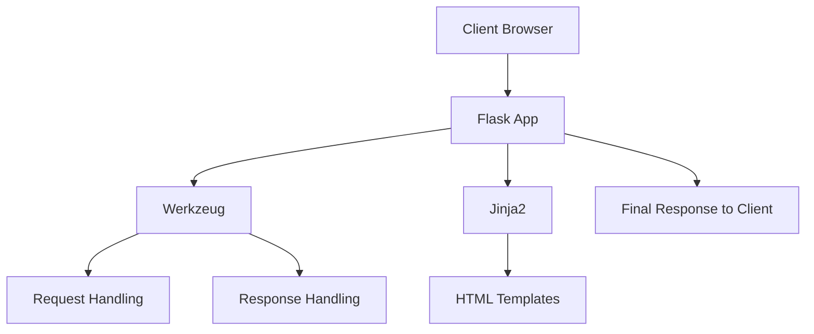

## 2. Basic Flask Application

### 2.1 Creating Flask Application

#### 2.1.1 Importing Flask Module

To start working with Flask, the first step is to import the **Flask class** from the `flask` package.

```python showLineNumbers id="flask_import"
from flask import Flask
```

* `Flask` is the **core class** used to create a web application instance
* This import gives access to:

  * Routing
  * Request handling
  * Response handling

#### 2.1.2 Creating App using Flask(**name**)

After importing Flask, we create an application instance:

```python showLineNumbers id="flask_app_creation"
app = Flask(__name__)
```

* `app` is the **main Flask application object**
* All configurations, routes, and logic are attached to this object

#### 2.1.3 Meaning of **name**

`__name__` is a special Python variable.

* If the file is executed directly → `__name__ = "__main__"`
* If imported as a module → `__name__ = module_name`

👉 Why Flask uses it:

* Helps Flask determine:

  * Project root directory
  * Location of templates and static files


### 2.2 Defining Routes

#### 2.2.1 @app.route() Decorator

The `@app.route()` decorator is used to define **URL routes**.

```python showLineNumbers id="route_basic"
@app.route('/')
def home():
    return "Home Page"
```

* It tells Flask:

  * When a user visits `'/'`, run the `home()` function

#### 2.2.2 Mapping URLs to Functions

Routing connects:

* URL → Python function

Flow:

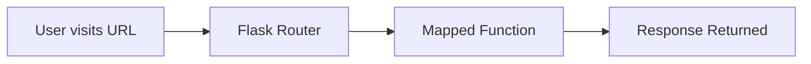

Example:

```python showLineNumbers id="route_mapping"
@app.route('/about')
def about():
    return "About Page"
```

* `/about` → executes `about()`

#### 2.2.3 Root URL (‘/’) Handling

* `'/'` represents the **home page**
* It is the default entry point of the web application

Example:

```python showLineNumbers id="root_route"
@app.route('/')
def home():
    return "Welcome to Flask App"
```

👉 Visiting `http://localhost:5000/` will show the output


### 2.3 Returning Response

#### 2.3.1 Returning Strings

Flask allows returning simple strings as responses:

```python showLineNumbers id="return_string"
@app.route('/')
def home():
    return "Hello World"
```

* Flask automatically converts string → HTTP response

#### 2.3.2 Displaying Output in Browser

When a route function returns data:

* Flask sends it as an HTTP response
* Browser displays it as a web page

Flow:

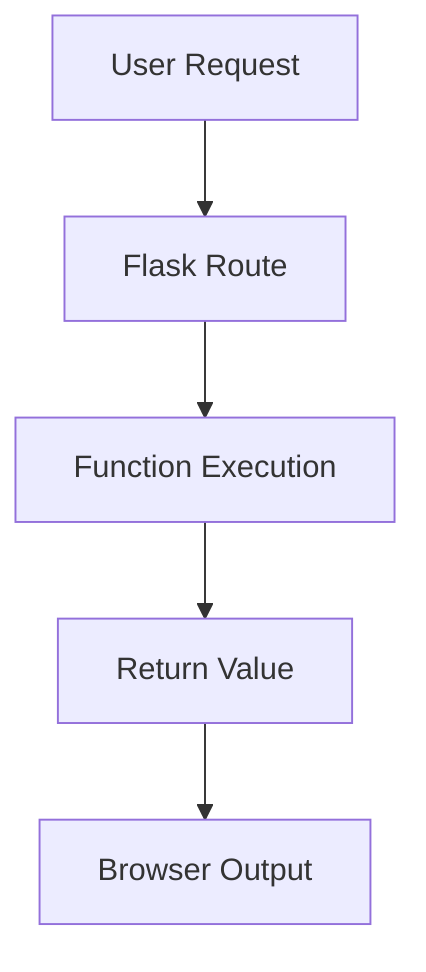

### 2.4 Running Flask Application

#### 2.4.1 if **name** == "**main**"

This condition ensures the app runs **only when the file is executed directly**.

```python showLineNumbers id="main_block"
if __name__ == "__main__":
    app.run()
```

* Prevents execution when imported as a module
* Standard Python practice

#### 2.4.2 app.run() Method

`app.run()` starts the Flask development server.

```python showLineNumbers id="app_run"
app.run()
```

Default behavior:

* Runs on: `http://127.0.0.1:5000/`
* Starts a local server


### 2.5 Debug Mode

#### 2.5.1 debug=True Configuration

Debug mode is enabled using:

```python showLineNumbers id="debug_mode"
app.run(debug=True)
```

* Activates development features
* Useful during coding phase

#### 2.5.2 Auto Reloading Server

* Server automatically restarts when code changes
* No need to manually restart

👉 Saves development time

#### 2.5.3 Detailed Error Messages

* Displays full error trace in browser
* Helps in debugging quickly

Example:

* Shows:

  * Line number
  * Error type
  * Stack trace

#### 2.5.4 Not Recommended in Production

Debug mode should **NOT be used in production** because:

* Exposes internal details
* Security risk (can reveal sensitive data)
* Allows code execution in some cases

### 🧠 Complete Basic Flask App Example

```python showLineNumbers id="full_flask_app"
from flask import Flask

app = Flask(__name__)

@app.route('/')
def home():
    return "Home Page"

@app.route('/user/<name>')
def user(name):
    return f"Hello {name}"

if __name__ == "__main__":
    app.run(debug=True)
```

### 🎯 Key Points (Exam Focus)

* Flask app created using `Flask(__name__)`
* `__name__` helps locate resources
* `@app.route()` maps URL → function
* `'/'` is root route
* Functions return response (string/HTML)
* `app.run()` starts server
* Debug mode:

  * Auto reload
  * Detailed errors
  * Not for production

## 3. Virtual Environment Setup

### 3.1 Concept of Virtual Environment

#### 3.1.1 Definition

A **Virtual Environment** is an isolated environment in Python used to manage project-specific dependencies.

* It allows each project to have its **own set of libraries**
* Works independently of the system-wide Python installation
* Ensures clean and controlled development

👉 In Flask projects, virtual environments are used because:

* Flask is **not part of the standard library**
* It must be installed separately for each project

#### 3.1.2 Isolation of Dependencies

A virtual environment ensures that:

* Libraries installed in one project:

  * **Do not affect other projects**
* Each project can have:

  * Different versions of the same library

Example:

| Project   | Flask Version |
| --------- | ------------- |
| Project A | Flask 2.0     |
| Project B | Flask 3.0     |

👉 Both can run without conflict because of isolation

#### 3.1.3 Avoiding Conflicts Between Projects

Without virtual environments:

* Installing/upgrading a library may **break another project**

With virtual environments:

* Each project is **self-contained**
* No dependency conflicts

Benefits:

* Clean dependency management
* Easy debugging
* Better project portability


### 🧠 Diagram: Virtual Environment Isolation

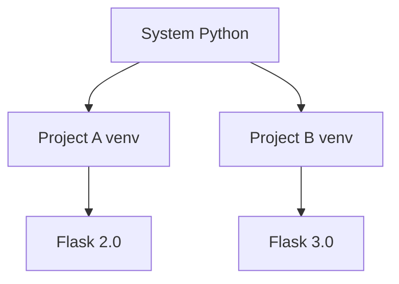


### 3.2 Installation Steps

#### 3.2.1 Installing virtualenv

Install the virtual environment tool using pip:

```python showLineNumbers id="install_virtualenv"
pip install virtualenv
```

* Installs the `virtualenv` package globally
* Required to create isolated environments


#### 3.2.2 Creating Virtual Environment

Create a new virtual environment:

```python showLineNumbers id="create_venv"
virtualenv venv
```

* `venv` → name of the environment folder
* Creates:

  * Python interpreter copy
  * Site-packages directory

Project structure after creation:

```id="venv_structure"
project/
│
├── venv/
│   ├── bin/ or Scripts/
│   ├── lib/
│   └── ...
```


#### 3.2.3 Activating Virtual Environment (Linux/Mac)

```python showLineNumbers id="activate_linux"
source venv/bin/activate
```

* Activates the environment
* Terminal prompt changes (shows active env)

Example:

```id="linux_prompt"
(venv) user@system:~$
```


#### 3.2.4 Activating Virtual Environment (Windows)

```python showLineNumbers id="activate_windows"
venv\Scripts\activate
```

* Activates environment on Windows
* Same behavior as Linux/Mac

Example:

```id="windows_prompt"
(venv) C:\project>
```


#### 3.2.5 Installing Flask (pip install flask)

Once the environment is activated, install Flask:

```python showLineNumbers id="install_flask"
pip install flask
```

* Installs Flask **only inside the virtual environment**
* Does not affect global Python installation


#### 3.2.6 Deactivating Virtual Environment

To exit the virtual environment:

```python showLineNumbers id="deactivate_venv"
deactivate
```

* Returns to system Python
* Removes `(venv)` from terminal prompt


### 🔁 Workflow Summary

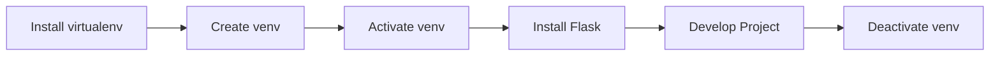


### 🎯 Key Points (Exam Focus)

* Virtual environment = **isolated Python environment**
* Prevents dependency conflicts
* Each project can have different library versions
* Steps:

  * Install virtualenv
  * Create environment
  * Activate
  * Install Flask
  * Deactivate
* Flask must be installed inside the environment

## 4. Routing and Application Settings

### 4.1 Routing in Flask

#### 4.1.1 Definition of Routing

**Routing** is the process of mapping a **URL (Uniform Resource Locator)** to a specific **Python function** in a Flask application.

* It defines how the application responds to a client request
* Each route corresponds to a **unique URL endpoint**

#### 4.1.2 URL to Function Mapping

In Flask, routing connects:

* URL → Function → Response

Flow:

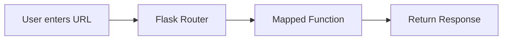

Example:

```python showLineNumbers id="url_mapping"
@app.route('/about')
def about():
    return "About Page"
```

* Visiting `/about` triggers the `about()` function

#### 4.1.3 @app.route() Decorator Usage

The `@app.route()` decorator is used to define routes.

```python showLineNumbers id="route_decorator"
@app.route('/')
def home():
    return "Home Page"
```

* It binds a URL to a function
* Must be placed **above the function definition**


### 4.2 Static Routes

#### 4.2.1 Definition

A **static route** is a fixed URL that does not change.

* It always returns the same response
* No variables are used in the URL

#### 4.2.2 Example: '/'

The root route `'/'` represents the homepage.

```python showLineNumbers id="static_route"
@app.route('/')
def home():
    return "Home Page"
```

#### 4.2.3 Function Execution on Route Access

* When the user visits the URL:

  * Flask executes the mapped function
* Example:

  * Visiting `/` → calls `home()`

#### 4.2.4 Output Display in Browser

* The returned value is sent as an HTTP response
* Browser displays it directly

Example output:

```id="static_output"
Home Page
```


### 4.3 Dynamic Routes

#### 4.3.1 URL Variables ({'<variable>'})

Dynamic routes allow passing values through the URL.

Syntax:

```python showLineNumbers id="dynamic_route_syntax"
@app.route('/user/<username>')
```

* `<username>` is a variable placeholder
* Flask extracts the value from the URL

#### 4.3.2 Passing Values to Functions

* The variable in the URL is passed as a function argument

```python showLineNumbers id="dynamic_route_function"
@app.route('/user/<username>')
def user(username):
    return username
```

#### 4.3.3 Example: /user/{'<username>'}

If user visits:

```
http://localhost:5000/user/John
```

* `username = "John"`

#### 4.3.4 Personalized Output Generation

Dynamic routes enable personalized responses:

```python showLineNumbers id="dynamic_output"
@app.route('/user/<username>')
def user(username):
    return f"Hello {username}"
```

Output:

```id="dynamic_result"
Hello John
```


### 4.4 String Interpolation

#### 4.4.1 f-String Syntax

Python **f-strings** are used for formatting strings dynamically.

Syntax:

```python showLineNumbers id="fstring_syntax"
f"Text {variable}"
```

#### 4.4.2 Dynamic Value Injection into Response

Used to insert variables into response strings:

```python showLineNumbers id="fstring_example"
@app.route('/user/<name>')
def user(name):
    return f"Welcome {name}"
```

👉 Makes responses:

* Dynamic
* Personalized


### 4.5 Application Settings

#### 4.5.1 Debug Configuration

Debug mode is enabled using:

```python showLineNumbers id="debug_config"
app.run(debug=True)
```

Features:

* Auto reload server
* Shows detailed errors

#### 4.5.2 Secret Key Usage

Flask uses a **SECRET_KEY** for:

* Session management
* Security features (cookies, flash messages)

Example:

```python showLineNumbers id="secret_key"
app.config['SECRET_KEY'] = 'your_secret_key'
```

👉 Important for:

* Flash messages
* Authentication systems

#### 4.5.3 Database URI Configuration

Used to connect Flask to a database.

Example:

```python showLineNumbers id="db_uri"
app.config['SQLALCHEMY_DATABASE_URI'] = 'sqlite:///database.db'
```

* Defines database location
* Used by ORM tools like SQLAlchemy


### 4.6 Full Flask Application

#### 4.6.1 Combining Static Routes

```python showLineNumbers id="combined_static"
@app.route('/')
def home():
    return "Home Page"

@app.route('/about')
def about():
    return "About Page"
```

#### 4.6.2 Combining Dynamic Routes

```python showLineNumbers id="combined_dynamic"
@app.route('/user/<name>')
def user(name):
    return f"Hello {name}"
```

#### 4.6.3 Running Complete App

```python showLineNumbers id="full_app"
from flask import Flask

app = Flask(__name__)

@app.route('/')
def home():
    return "Home Page"

@app.route('/about')
def about():
    return "About Page"

@app.route('/user/<name>')
def user(name):
    return f"Hello {name}"

if __name__ == "__main__":
    app.run(debug=True)
```


### 🧠 Complete Flow Diagram

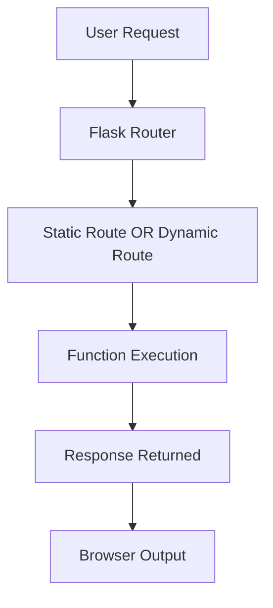


### 🎯 Key Points (Exam Focus)

* Routing = URL → Function mapping
* `@app.route()` defines routes
* Static routes → fixed URLs
* Dynamic routes → use `<variable>`
* Values passed as function parameters
* f-strings used for dynamic responses
* SECRET_KEY → security feature
* Database URI → DB connection
* Debug mode → development only

## 5. URL Building & HTTP Methods

### 5.1 URL Building

#### 5.1.1 Definition

**URL Building** in Flask is the process of dynamically generating URLs using the `url_for()` function instead of hardcoding them.

* It links URLs to **function names (endpoints)**
* Ensures correct URL generation even if routes change

#### 5.1.2 Need for URL Building

URL building is needed because:

* Hardcoding URLs makes applications **fragile**
* Changing a route requires updating URLs everywhere
* Helps maintain **clean and scalable applications**

Example problem:

```python showLineNumbers id="hardcoded_problem"
# Hardcoded URL
<a href="/user/John">Profile</a>
```

👉 If route changes → code breaks everywhere

#### 5.1.3 Problems with Hardcoded URLs

Hardcoded URLs cause:

* ❌ Code duplication
* ❌ Maintenance difficulty
* ❌ Broken links when routes change
* ❌ Tight coupling between frontend and backend

Example:

```python showLineNumbers id="hardcoded_issue"
@app.route('/profile/<name>')
def profile(name):
    return f"Hello {name}"
```

But HTML still uses:

```id="hardcoded_html"
<a href="/user/John">
```

👉 Mismatch → broken navigation


### 5.2 url_for() Function

#### 5.2.1 Syntax

```python showLineNumbers id="url_for_syntax"
url_for(endpoint, **values)
```

* `endpoint` → function name
* `values` → parameters passed to URL


#### 5.2.2 endpoint (Function Name)

The **endpoint** is the name of the function linked to a route.

Example:

```python showLineNumbers id="endpoint_example"
@app.route('/home')
def home():
    return "Home"
```

```python showLineNumbers id="url_for_home"
url_for('home')
```

Output:

```id="endpoint_output"
/home
```

👉 Flask uses function name, not URL string


#### 5.2.3 values (Dynamic Parameters)

Used to pass variables for dynamic routes.

Example:

```python showLineNumbers id="url_for_dynamic"
@app.route('/user/<username>')
def user(username):
    return f"Hello {username}"
```

```python showLineNumbers id="url_for_values"
url_for('user', username='John')
```

Output:

```id="dynamic_url"
/user/John
```


#### 5.2.4 Dynamic URL Generation

`url_for()` dynamically builds URLs at runtime.

Example:

```python showLineNumbers id="dynamic_url_build"
@app.route('/profile/<name>')
def profile(name):
    return f"Profile of {name}"

@app.route('/go')
def go():
    return url_for('profile', name='Alice')
```

Output:

```id="dynamic_result_url"
/profile/Alice
```

👉 URL is generated automatically based on route definition


### 🧠 URL Building Flow

```mermaid id="url_building_flow"
flowchart LR
    A[Function Name] --> B[url_for()]
    B --> C[Route Mapping]
    C --> D[Generated URL]
```


### 5.3 Benefits of URL Building

#### 5.3.1 Route Consistency

* URLs always match route definitions
* No mismatch between frontend and backend

#### 5.3.2 Automatic Query Parameter Handling

`url_for()` can also handle query parameters:

```python showLineNumbers id="query_params"
url_for('search', q='flask', page=2)
```

Output:

```id="query_output"
/search?q=flask&page=2
```

👉 Automatically formats query strings


#### 5.3.3 Easier Maintenance

* If route changes → no need to update everywhere
* Only change route definition

Example:

```python showLineNumbers id="route_change"
@app.route('/new_profile/<name>')
def profile(name):
    return name
```

👉 `url_for()` will still generate correct URL


#### 5.3.4 Template Integration

`url_for()` is commonly used inside HTML templates.

Example:

```html id="template_url"
<a href="{{ url_for('home') }}">Home</a>
```

For static files:

```html id="static_url"
<link rel="stylesheet" href="{{ url_for('static', filename='style.css') }}">
```

👉 Ensures:

* Correct linking
* Dynamic resource loading


### 🎯 Key Points (Exam Focus)

* URL Building = dynamic URL generation
* Use `url_for()` instead of hardcoding
* `endpoint` = function name
* `values` = parameters for dynamic routes
* Prevents broken links
* Supports query parameters
* Used in both Python code and templates

## 6. HTTP Methods

### 6.1 Introduction to HTTP Methods

#### 6.1.1 Definition

**HTTP Methods** (also called HTTP verbs) define the type of operation a client wants to perform on a server.

* They are part of the **HTTP protocol**
* Used to communicate intent:

  * Retrieve data
  * Send data
  * Update data
  * Delete data

👉 In Flask, HTTP methods are used to control how routes handle requests.


#### 6.1.2 Client-Server Interaction

HTTP methods define how a **client (browser)** interacts with a **server (Flask app)**.

Flow:

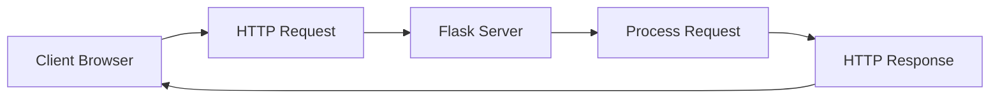

Each request includes:

* URL
* Method (GET, POST, etc.)
* Optional data (form, JSON)


### 6.2 Types of HTTP Methods

### 6.2.1 GET

#### 6.2.1.1 Retrieve Data

* Used to **fetch data from the server**
* Does NOT modify server data

Example:

```python showLineNumbers id="get_example"
@app.route('/')
def home():
    return "Welcome"
```

👉 Browser sends a GET request automatically when visiting a page


#### 6.2.1.2 Default Method

* GET is the **default HTTP method**
* If no method is specified, Flask assumes GET

Example:

```python showLineNumbers id="get_default"
@app.route('/about')
def about():
    return "About Page"
```

👉 No need to specify `methods=['GET']`


#### 6.2.1.3 Use Case: Fetch Web Page

* Loading a webpage
* Retrieving information from server

Example:

* Visiting:

```id="get_url"
http://localhost:5000/
```

👉 Sends a GET request


### 6.2.2 POST

#### 6.2.2.1 Send Data to Server

* Used to **send data from client to server**
* Data is included in the request body

#### 6.2.2.2 Create/Update Resources

* Used when:

  * Creating new data
  * Updating existing data (in many cases)

#### 6.2.2.3 Use Case: Form Submission

Common use:

* Login forms
* Registration forms

Example:

```python showLineNumbers id="post_example"
from flask import request

@app.route('/login', methods=['POST'])
def login():
    username = request.form['username']
    return f"Hello {username}"
```

👉 Data is sent securely in request body (not visible in URL)


### 6.2.3 PUT

#### 6.2.3.1 Update Existing Resource

* Used to **update existing data on the server**
* Replaces the resource with new data

#### 6.2.3.2 Use Case: Editing Record

Example:

* Updating user profile
* Editing database record

Example:

```python showLineNumbers id="put_example"
@app.route('/update/<id>', methods=['PUT'])
def update(id):
    return f"Update record {id}"
```

👉 Typically used in APIs


### 6.2.4 DELETE

#### 6.2.4.1 Remove Resource

* Used to **delete data from server**

#### 6.2.4.2 Use Case: Delete Database Entry

Example:

* Delete user account
* Remove product from database

Example:

```python showLineNumbers id="delete_example"
@app.route('/delete/<id>', methods=['DELETE'])
def delete(id):
    return f"Deleted record {id}"
```


### 🧠 HTTP Methods Comparison Table

| Method | Purpose       | Data Sent | Use Case        |
| ------ | ------------- | --------- | --------------- |
| GET    | Retrieve data | URL       | Fetch webpage   |
| POST   | Send data     | Body      | Form submission |
| PUT    | Update data   | Body      | Edit record     |
| DELETE | Remove data   | URL/Body  | Delete record   |


### 🧠 HTTP Request Lifecycle

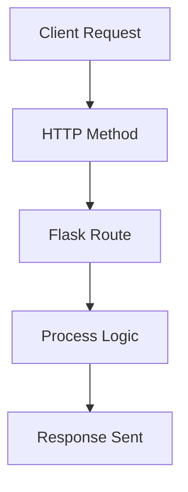


### 🎯 Key Points (Exam Focus)

* HTTP methods define **type of operation**
* GET → retrieve data (default)
* POST → send data (forms)
* PUT → update resource
* DELETE → remove resource
* GET requests:

  * Visible in URL
* POST requests:

  * Data sent in body (more secure)
* PUT & DELETE mainly used in APIs

## 7. Handling HTTP Methods in Flask

### 7.1 methods Parameter

#### 7.1.1 Defining Allowed Methods in Route

Flask routes accept **specific HTTP methods** using the `methods` parameter in `@app.route()`.

* By default, Flask allows only **GET**
* To handle other methods (POST, PUT, DELETE), you must explicitly define them

Syntax:

```python showLineNumbers id="methods_param"
@app.route('/path', methods=['GET', 'POST'])
```

👉 This tells Flask:

* Only these methods are allowed for this route


#### 7.1.2 Example: ['GET','POST']

```python showLineNumbers id="methods_example"
@app.route('/login', methods=['GET', 'POST'])
def login():
    return "Login Page"
```

* GET → display page
* POST → process submitted data


### 7.2 request Object

The `request` object is used to **access incoming request data**.

```python showLineNumbers id="import_request"
from flask import request
```


#### 7.2.1 request.method

Used to identify which HTTP method was used.

```python showLineNumbers id="request_method"
@app.route('/login', methods=['GET', 'POST'])
def login():
    if request.method == 'POST':
        return "Form Submitted"
    return "Login Form"
```


#### 7.2.2 request.form

Used to retrieve **form data sent via POST request**.

```python showLineNumbers id="request_form"
username = request.form['username']
```

* Accesses data sent from HTML forms
* Works like a dictionary


#### 7.2.3 Accessing Form Data

Example:

```python showLineNumbers id="form_access"
@app.route('/submit', methods=['POST'])
def submit():
    name = request.form['name']
    return f"Hello {name}"
```

👉 Form input is sent from client → accessed using `request.form`


### 🧠 Request Handling Flow

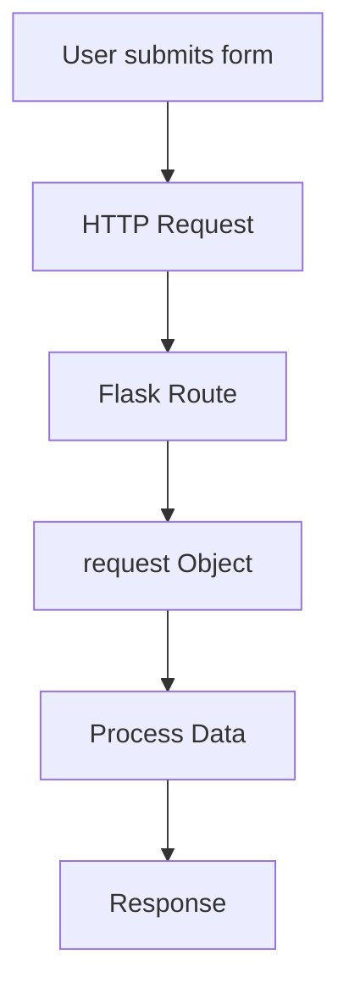


### 7.3 Examples

### 7.3.1 Handling GET Request

```python showLineNumbers id="handle_get"
@app.route('/')
def home():
    return "Welcome Page"
```

👉 Default GET request


### 7.3.2 Handling POST Request

```python showLineNumbers id="handle_post"
from flask import request

@app.route('/login', methods=['POST'])
def login():
    username = request.form['username']
    return f"Hello {username}"
```

👉 Handles data submitted via form


### 7.3.3 Form Submission Workflow

#### 7.3.3.1 GET → Display Form

```python showLineNumbers id="get_form"
@app.route('/login', methods=['GET'])
def login():
    return '''
        <form method="POST">
            <input name="username">
            <input type="submit">
        </form>
    '''
```


#### 7.3.3.2 POST → Process Input

```python showLineNumbers id="post_form"
from flask import request

@app.route('/login', methods=['GET', 'POST'])
def login():
    if request.method == 'POST':
        username = request.form['username']
        return f"Welcome {username}"
    return '''
        <form method="POST">
            <input name="username">
            <input type="submit">
        </form>
    '''
```

👉 Same route handles both:

* GET → show form
* POST → process form


### 🧠 Form Workflow Diagram

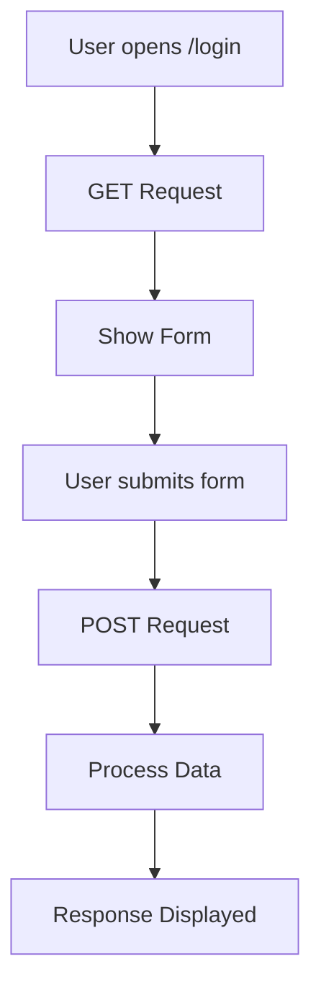


### 7.4 Advanced Methods

#### 7.4.1 PUT Request Handling

```python showLineNumbers id="put_method"
@app.route('/update/<id>', methods=['PUT'])
def update(id):
    return f"Updated record {id}"
```

* Used for updating resources
* Mostly used in APIs


#### 7.4.2 DELETE Request Handling

```python showLineNumbers id="delete_method"
@app.route('/delete/<id>', methods=['DELETE'])
def delete(id):
    return f"Deleted record {id}"
```

* Used to remove resources
* Common in REST APIs


### 7.5 Combining URL Building & HTTP Methods

#### 7.5.1 Login Form Example

```python showLineNumbers id="login_combined"
from flask import Flask, request, url_for

app = Flask(__name__)

@app.route('/login', methods=['GET', 'POST'])
def login():
    if request.method == 'POST':
        username = request.form['username']
        return f"Hello {username}"
    return f'''
        <form method="POST" action="{url_for('login')}">
            <input name="username">
            <input type="submit">
        </form>
    '''
```


#### 7.5.2 url_for() for Form Action

* Used to dynamically set form action URL

```python showLineNumbers id="url_for_form"
url_for('login')
```

👉 Prevents hardcoding URLs


#### 7.5.3 Handling GET & POST Together

* Same route handles both methods
* Controlled using `request.method`

Pattern:

```python showLineNumbers id="combined_pattern"
@app.route('/route', methods=['GET', 'POST'])
def handler():
    if request.method == 'POST':
        # process data
        pass
    else:
        # display form
        pass
```


### 🎯 Key Points (Exam Focus)

* `methods` parameter defines allowed HTTP methods
* Default method = GET
* `request.method` → identifies request type
* `request.form` → accesses form data
* GET → display page
* POST → process data
* Same route can handle both GET & POST
* `url_for()` used to avoid hardcoded URLs
* PUT & DELETE used mainly in APIs

## 8. Templates in Flask

### 8.1 Introduction to Templates

#### 8.1.1 Definition

**Templates** are HTML files used to generate **dynamic web pages** in Flask.

* They separate:

  * Backend logic (Python)
  * Frontend presentation (HTML)
* Stored in a special folder named **`templates`**

👉 Instead of returning plain strings, Flask can render full HTML pages.


#### 8.1.2 Dynamic HTML Generation

Templates allow **dynamic content generation**, meaning:

* Same HTML structure
* Different data displayed

Example:

```html id="template_basic"
<h1>Hello {{ name }}</h1>
```

* `{{ name }}` is replaced with actual data at runtime

👉 Output changes based on input:

```id="template_output"
Hello John
```


### 8.2 Jinja2 Templating Engine

#### 8.2.1 Embedding Python Expressions

Flask uses **Jinja2** to embed Python-like expressions inside HTML.

* Allows:

  * Variables
  * Conditions
  * Loops

Example:

```html id="jinja_expression"
<p>{{ 5 + 5 }}</p>
```

Output:

```id="jinja_result"
10
```


#### 8.2.2 Syntax Basics

| Syntax  | Purpose            |
| ------- | ------------------ |
| `{{ }}` | Output variables   |
| `` | Control statements |
| `{# #}` | Comments           |

Example:

```html id="jinja_syntax"
<h1>{{ name }}</h1>


<p>Adult</p>

```


### 8.3 Template Concepts

### 8.3.1 Dynamic Content (`{{ variable }}`)

Used to display data passed from Flask.

Example:

```html id="dynamic_content"
<h1>Welcome {{ username }}</h1>
```

Flask code:

```python showLineNumbers id="dynamic_pass"
from flask import render_template

@app.route('/user/<name>')
def user(name):
    return render_template('user.html', username=name)
```


### 8.3.2 Control Statements

#### 8.3.2.1 if Conditions

Used for conditional rendering.

```html id="if_condition"

<p>Welcome {{ user }}</p>

<p>Please login</p>

```


#### 8.3.2.2 for Loops

Used to iterate over data.

```html id="for_loop"
<ul>

    <li>{{ item }}</li>

</ul>
```

Flask code:

```python showLineNumbers id="loop_data"
@app.route('/list')
def list_items():
    items = ["Apple", "Banana", "Mango"]
    return render_template('list.html', items=items)
```


### 8.3.3 Template Inheritance

#### 8.3.3.1 Base Template (base.html)

A base template defines **common layout**:

```html id="base_template"
<!DOCTYPE html>
<html>
<head>
    <title></title>
</head>
<body>
    <header>My Website</header>

    

    <footer>Footer</footer>
</body>
</html>
```


#### 8.3.3.2 Child Templates

Child templates extend the base template:

```html id="child_template"



Home Page



<h1>Welcome to Home</h1>

```

👉 Benefits:

* Reuse layout
* Avoid duplicate code
* Maintain consistency


### 🧠 Template Inheritance Flow

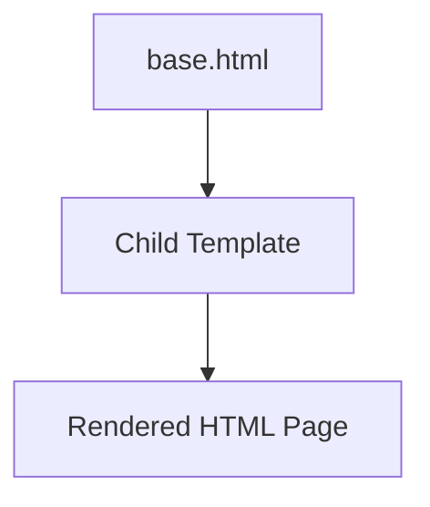


### 8.4 Template Working

#### 8.4.1 templates Folder Rule (Default Location)

Flask automatically looks for templates in:

```id="templates_path"
project/
│
├── app.py
└── templates/
    └── index.html
```

👉 Important rule:

* Folder name must be exactly **`templates`**


#### 8.4.2 render_template() Function

Used to render HTML templates.

```python showLineNumbers id="render_template"
from flask import render_template

@app.route('/')
def home():
    return render_template('index.html')
```

* Loads template from `templates/` folder
* Converts it into final HTML


#### 8.4.3 Passing Data to Templates

Data is passed as keyword arguments.

```python showLineNumbers id="pass_data"
@app.route('/user/<name>')
def user(name):
    return render_template('user.html', username=name)
```

Template:

```html id="use_data"
<h1>Hello {{ username }}</h1>
```


### 🧠 Template Rendering Flow

```mermaid id="template_flow"
flowchart TD
    A[Flask Route] --> B[render_template()]
    B --> C[Load HTML Template]
    C --> D[Insert Data (Jinja2)]
    D --> E[Final HTML]
    E --> F[Browser Display]
```


### 🎯 Key Points (Exam Focus)

* Templates = HTML files for dynamic content
* Stored in `templates/` folder
* Flask uses **Jinja2 engine**
* `{{ }}` → variables
* `` → logic (if, loops)
* Template inheritance → reuse layout
* `render_template()` → renders HTML
* Data passed from Flask to template
* Enables separation of logic and UI

## 9. Static Files in Flask

### 9.1 Introduction to Static Files

#### 9.1.1 Definition

**Static files** are resources that do **not change dynamically** and are sent to the client as-is.

* Served directly by Flask (or a web server in production)
* Used to enhance UI/UX and functionality

Examples:

* Stylesheets
* Scripts
* Images
* Fonts

#### 9.1.2 Types (CSS, JS, Images, Fonts)

| Type       | Purpose           | Example         |
| ---------- | ----------------- | --------------- |
| CSS        | Styling web pages | `style.css`     |
| JavaScript | Interactivity     | `script.js`     |
| Images     | Visual content    | `logo.png`      |
| Fonts      | Typography        | `.woff`, `.ttf` |


### 9.2 Static Folder Structure

#### 9.2.1 Default static Folder Rule

Flask **automatically serves static files** from a folder named **`static`** at the project root.

```text id="static_structure_root"
project/
│
├── app.py
├── templates/
└── static/
```

* Folder name must be exactly **`static`**
* Flask internally maps it to `/static/...` URL path


#### 9.2.2 Subfolders (css, js, images)

Organize static files into subfolders:

```text id="static_subfolders"
static/
│
├── css/
│   └── style.css
├── js/
│   └── script.js
└── images/
    └── logo.png
```

Benefits:

* Better organization
* Easier maintenance


### 9.3 Linking Static Files

#### 9.3.1 url_for('static', filename)

Use `url_for()` to generate paths to static files.

```html id="link_static_css"
<link rel="stylesheet" href="{{ url_for('static', filename='css/style.css') }}">
```

* `'static'` → predefined endpoint
* `filename` → relative path inside `static/`


#### 9.3.2 Dynamic Path Generation

Flask dynamically builds correct paths:

```html id="dynamic_static"
<script src="{{ url_for('static', filename='js/script.js') }}"></script>
```

👉 Avoids hardcoding:

```html id="bad_static"
<script src="/static/js/script.js"></script>
```


### 9.4 Examples

#### 9.4.1 CSS Styling

**CSS file (`static/css/style.css`):**

```css id="css_example"
body {
    background-color: lightblue;
}
```

**HTML template:**

```html id="css_link"
<link rel="stylesheet" href="{{ url_for('static', filename='css/style.css') }}">
```


#### 9.4.2 JavaScript Execution

**JS file (`static/js/script.js`):**

```javascript id="js_example"
console.log("JavaScript Loaded");
```

**HTML template:**

```html id="js_link"
<script src="{{ url_for('static', filename='js/script.js') }}"></script>
```


#### 9.4.3 Image Loading

**HTML template:**

```html id="image_example"

```


### 9.5 Output Behavior

#### 9.5.1 Styled Output (CSS Applied)

* CSS modifies appearance:

  * Colors
  * Layout
  * Fonts

Example:

```text id="css_output"
Page background becomes light blue
```


#### 9.5.2 Image Rendering

* Images are displayed directly in browser

Example:

```text id="image_output"
Logo appears on webpage
```


#### 9.5.3 Console Output from JS

* JavaScript runs in browser
* Output visible in developer console

Example:

```text id="js_output"
JavaScript Loaded
```


### 🧠 Static File Flow

```mermaid id="static_flow"
flowchart TD
    A[HTML Template] --> B[url_for('static')]
    B --> C[Static File Path]
    C --> D[Flask Server]
    D --> E[Browser Loads File]
```


### 9.6 Combining Templates and Static Files

#### 9.6.1 Complete Web Page Example

**Flask App:**

```python showLineNumbers id="static_full_app"
from flask import Flask, render_template

app = Flask(__name__)

@app.route('/')
def home():
    return render_template('index.html')

if __name__ == "__main__":
    app.run(debug=True)
```

**Template (`templates/index.html`):**

```html id="full_page"
<!DOCTYPE html>
<html>
<head>
    <title>Flask Static Example</title>
    <link rel="stylesheet" href="{{ url_for('static', filename='css/style.css') }}">
</head>
<body>

<h1>Hello Flask</h1>


<script src="{{ url_for('static', filename='js/script.js') }}"></script>

</body>
</html>
```


### 🧠 Combined Flow

```mermaid id="combined_static_template"
flowchart TD
    A[Flask Route] --> B[render_template()]
    B --> C[HTML Template]
    C --> D[url_for('static')]
    D --> E[Static Files]
    E --> F[Browser Render]
```


### 9.7 Best Practices

#### 9.7.1 File Organization

* Use folders:

  * `css/`
  * `js/`
  * `images/`
* Keep structure clean and readable


#### 9.7.2 Use of url_for()

* Always use:

```html
{{ url_for('static', filename='...') }}
```

* Avoid hardcoded paths


#### 9.7.3 Template Inheritance

* Combine static files with base templates

Example:

```html id="base_static"
<link rel="stylesheet" href="{{ url_for('static', filename='css/style.css') }}">
```

👉 Ensures:

* Consistent styling
* Reusable layout


#### 9.7.4 Minification of Assets

* Reduce file size of:

  * CSS
  * JavaScript

Benefits:

* Faster loading
* Better performance


### 🎯 Key Points (Exam Focus)

* Static files = non-dynamic resources
* Stored in `static/` folder
* Flask automatically serves static files
* Use `url_for('static', filename=...)`
* Types: CSS, JS, Images, Fonts
* CSS → styling
* JS → interactivity
* Images → visual content
* Never hardcode static paths
* Organize using subfolders

## 10. Flask with Database Connectivity

### 10.1 Introduction

#### 10.1.1 Need for Database Integration

Web applications need a database to **store and manage data permanently**.

Without a database:

* Data is lost when the app stops
* No user accounts, records, or history can be maintained

With a database:

* Data is stored **persistently**
* Applications can manage:

  * Users
  * Products
  * Transactions
  * Logs

👉 Flask connects to databases using external libraries.


#### 10.1.2 Dynamic Data Handling

Databases enable **dynamic web applications**.

* Content changes based on stored data
* Example:

  * User login
  * Displaying user profile
  * Showing product lists

Flow:

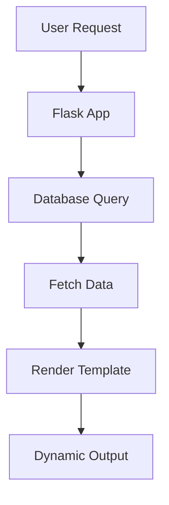


### 10.2 Supported Databases

#### 10.2.1 SQLite

* Lightweight, file-based database
* No server required
* Best for:

  * Small applications
  * Development/testing

Example:

```text id="sqlite_db"
database.db
```


#### 10.2.2 MySQL

* Relational database system
* Requires server setup
* Suitable for:

  * Medium to large applications

Features:

* High performance
* Multi-user support


#### 10.2.3 PostgreSQL

* Advanced relational database
* Highly scalable and robust

Features:

* Supports complex queries
* Used in enterprise applications


### 10.3 Database Libraries

#### 10.3.1 sqlite3

* Built-in Python module
* Used for SQLite database

```python showLineNumbers id="sqlite3_import"
import sqlite3
```


#### 10.3.2 SQLAlchemy (ORM)

* ORM = Object Relational Mapping
* Allows working with database using Python objects instead of SQL

Example:

```python showLineNumbers id="sqlalchemy_example"
from flask_sqlalchemy import SQLAlchemy

db = SQLAlchemy(app)
```

Advantages:

* Easier to use
* Database-independent


#### 10.3.3 mysql-connector-python

* Used to connect Flask with MySQL

```python showLineNumbers id="mysql_connector"
import mysql.connector
```


#### 10.3.4 psycopg2

* Used for PostgreSQL connectivity

```python showLineNumbers id="psycopg2_import"
import psycopg2
```


### 10.4 Steps for Connectivity

#### 10.4.1 Creating Database

First, create a database.

Example:

* SQLite → automatically created file
* MySQL/PostgreSQL → created using SQL tools


#### 10.4.2 Defining Schema

Schema defines:

* Tables
* Columns
* Data types

Example:

```sql id="schema_example"
CREATE TABLE users (
    id INTEGER PRIMARY KEY,
    name TEXT,
    email TEXT
);
```

👉 Important step before storing data


#### 10.4.3 Installing Libraries

Install required database libraries:

```python showLineNumbers id="install_db_lib"
pip install flask_sqlalchemy
```

or

```python showLineNumbers id="install_mysql"
pip install mysql-connector-python
```


#### 10.4.4 Configuring Flask App

Set database configuration inside Flask app:

```python showLineNumbers id="db_config"
from flask import Flask
from flask_sqlalchemy import SQLAlchemy

app = Flask(__name__)

app.config['SQLALCHEMY_DATABASE_URI'] = 'sqlite:///database.db'
db = SQLAlchemy(app)
```


#### 10.4.5 CRUD Operations

CRUD = Create, Read, Update, Delete

##### Create (Insert Data)

```python showLineNumbers id="crud_create"
new_user = User(name="John")
db.session.add(new_user)
db.session.commit()
```

##### Read (Fetch Data)

```python showLineNumbers id="crud_read"
users = User.query.all()
```

##### Update (Modify Data)

```python showLineNumbers id="crud_update"
user.name = "Alice"
db.session.commit()
```

##### Delete (Remove Data)

```python showLineNumbers id="crud_delete"
db.session.delete(user)
db.session.commit()
```


### 🧠 Database Interaction Flow

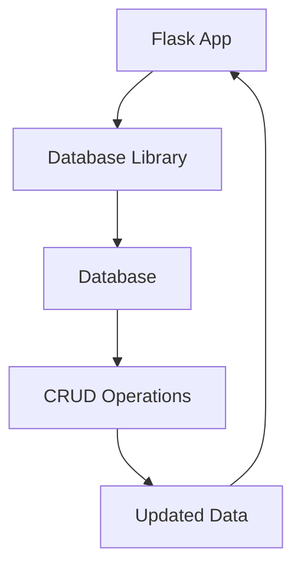


### 10.5 Advantages

#### 10.5.1 Data Persistence

* Data remains stored even after app stops
* No data loss


#### 10.5.2 Dynamic Content

* Web pages update based on database data
* Example:

  * User dashboard
  * Product listings


#### 10.5.3 Secure Storage

* Databases provide:

  * Access control
  * Data integrity
  * Encryption support

👉 More secure than storing data in files


### 🎯 Key Points (Exam Focus)

* Databases enable **persistent storage**
* Flask connects using libraries like:

  * sqlite3
  * SQLAlchemy
  * mysql-connector
  * psycopg2
* SQLAlchemy = ORM (no raw SQL needed)
* Steps:

  * Create DB
  * Define schema
  * Install libraries
  * Configure Flask
  * Perform CRUD
* CRUD = Create, Read, Update, Delete
* Benefits:

  * Data persistence
  * Dynamic content
  * Secure storage

## 11. Error Handling and Exceptions

### 11.1 Importance

#### 11.1.1 Robust Applications

#### 11.1.2 User-Friendly Errors

### 11.2 HTTP Error Handling

#### 11.2.1 404 Error Handling

#### 11.2.2 500 Error Handling

#### 11.2.3 @app.errorhandler()

### 11.3 Custom Exceptions

#### 11.3.1 try-except Usage

#### 11.3.2 Application-specific Errors

### 11.4 Logging

#### 11.4.1 Logging Exceptions

#### 11.4.2 Debugging Support 


## 12. Flash Messages

### 12.1 Introduction

#### 12.1.1 Definition

#### 12.1.2 Temporary Notifications

### 12.2 Message Types

#### 12.2.1 Success

#### 12.2.2 Error

#### 12.2.3 Warning 

### 12.3 Functions

#### 12.3.1 flash()

#### 12.3.2 get_flashed_messages()

### 12.4 Implementation Steps

#### 12.4.1 Setting SECRET_KEY

#### 12.4.2 Creating Messages

#### 12.4.3 Displaying in Templates


## 13. Working with Emails (Flask-Mail)

### 13.1 Introduction

#### 13.1.1 Purpose

#### 13.1.2 Use Cases (Verification, Reset)

### 13.2 Installation

#### 13.2.1 pip install Flask-Mail

### 13.3 Configuration

#### 13.3.1 MAIL_SERVER

#### 13.3.2 MAIL_PORT

#### 13.3.3 MAIL_USE_TLS

#### 13.3.4 MAIL_USERNAME

#### 13.3.5 MAIL_PASSWORD

### 13.4 Sending Emails

#### 13.4.1 Mail Instance

#### 13.4.2 Message Object

##### 13.4.2.1 sender

##### 13.4.2.2 recipients

##### 13.4.2.3 body

#### 13.4.3 send() Method 


## 14. Authentication and Authorization (Flask-Login)

### 14.1 Concepts

#### 14.1.1 Authentication

#### 14.1.2 Authorization

### 14.2 Flask-Login Features

#### 14.2.1 User Session Management

#### 14.2.2 User Loader

#### 14.2.3 login_required Decorator 

### 14.3 Behavior

#### 14.3.1 Redirect Unauthorized Users to Login Page

### 14.4 Implementation Steps

#### 14.4.1 Setup Flask App

#### 14.4.2 Initialize LoginManager

#### 14.4.3 Create User Model

#### 14.4.4 Define Routes (login, logout, protected)

#### 14.4.5 Templates (login.html, home.html)


## 15. Deployment of Flask Application

### 15.1 Introduction

#### 15.1.1 Need for Deployment

#### 15.1.2 Production vs Development Server

### 15.2 WSGI Servers

#### 15.2.1 Gunicorn (Linux)

##### 15.2.1.1 Installation

##### 15.2.1.2 Command Usage

##### 15.2.1.3 -w (Workers)

##### 15.2.1.4 -b (Bind Address)

#### 15.2.2 Waitress (Windows)

### 15.3 Reverse Proxy

#### 15.3.1 Purpose (Forward Requests to Flask App) 

#### 15.3.2 Nginx Configuration

#### 15.3.3 Apache Configuration

### 15.4 Deployment Platforms

#### 15.4.1 Heroku

##### 15.4.1.1 Install CLI

##### 15.4.1.2 Create Profile

##### 15.4.1.3 Deployment Commands

#### 15.4.2 AWS Elastic Beanstalk

#### 15.4.3 Docker Deployment 

### 15.5 Serving Static Files

#### 15.5.1 Static Files in Production

#### 15.5.2 static Folder Usage


## 16. Summary Concepts (From PDF Table)

### 16.1 Handling Exceptions

#### 16.1.1 Using @app.errorhandler

#### 16.1.2 try-except for Application Errors

### 16.2 Flash Messages

#### 16.2.1 Temporary Notifications

#### 16.2.2 Success/Error Display

### 16.3 Sending Emails

#### 16.3.1 Flask-Mail Configuration

#### 16.3.2 Use Cases (Activation, Reset)

### 16.4 Deployment

#### 16.4.1 WSGI Servers

#### 16.4.2 Reverse Proxy

#### 16.4.3 Cloud Platforms 


