# Unit - 5
:::info[TITLE]
## Django Framework
:::

## 1. Introduction to Django Framework

### 1.1 Overview of Django

#### 1.1.1 Definition of Django Framework

Django is a **high-level, open-source Python web framework** used to build secure, scalable, and database-driven web applications quickly.

* Follows **MVT (Model–View–Template)** architecture
* Provides built-in tools to reduce development effort
* Designed for **rapid development and clean design**

---

#### 1.1.2 Django as High-Level Python Web Framework

Django is called a **high-level framework** because:

* It handles many low-level tasks automatically:

  * URL routing
  * Database interaction
  * Security handling
* Developers focus on:

  * Application logic
  * Features
  * User experience

👉 Compared to low-level frameworks:

* Less manual coding
* Faster development

---

#### 1.1.3 DRY (Don't Repeat Yourself) Principle

Django follows the **DRY principle**, which means:

* Avoid repeating the same code multiple times
* Write reusable and modular code

Examples:

* Reusable templates
* Shared models
* Centralized configuration

👉 Benefits:

* Cleaner code
* Easier maintenance
* Reduced bugs

---

#### 1.1.4 Built-in Features (Authentication, Admin, ORM, Security)

Django comes with powerful built-in features:

**1. Authentication System**

* User login/logout
* Password hashing
* Permissions and roles

**2. Admin Panel**

* Auto-generated admin interface
* Perform CRUD operations easily

**3. ORM (Object Relational Mapping)**

* Interact with database using Python code
* No need for raw SQL

**4. Security Features**

* Protection against:

  * SQL Injection
  * Cross-Site Scripting (XSS)
  * Cross-Site Request Forgery (CSRF)

---

### 1.2 Features of Django

#### 1.2.1 Rapid Development Capability

Django allows developers to build applications **quickly** due to:

* Pre-built components
* Minimal configuration
* Built-in tools

👉 Reduces development time significantly

---

#### 1.2.2 Reusability of Components

Django promotes **modular design**:

* Apps can be reused across projects
* Components like:

  * Models
  * Views
  * Templates

👉 Encourages scalable architecture

---

#### 1.2.3 Scalability and Security

**Scalability:**

* Can handle small to large applications
* Used by large platforms (Instagram, etc.)

**Security:**

* Built-in protections against common attacks
* Secure authentication system

---

#### 1.2.4 Database-Driven Application Support

Django is ideal for **database-based applications**:

* Stores and manages data efficiently
* Supports multiple databases:

  * SQLite
  * MySQL
  * PostgreSQL

---

### 1.3 Django Architecture (MVT Pattern)

Django follows the **MVT (Model–View–Template)** pattern.

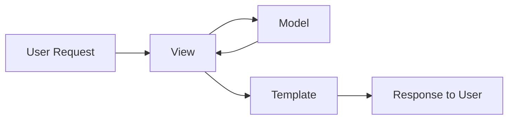

---

#### 1.3.1 Model

##### 1.3.1.1 Database Abstraction Layer

* Represents database structure
* Defines tables using Python classes

##### 1.3.1.2 Data Structure Definition

* Fields define table columns

Example:

```python showLineNumbers id="model_example"
from django.db import models

class User(models.Model):
    name = models.CharField(max_length=100)
```

##### 1.3.1.3 ORM Mapping

* Maps Python objects → database tables
* Allows querying without SQL

---

#### 1.3.2 View

##### 1.3.2.1 Request Handling

* Receives HTTP request from user

##### 1.3.2.2 Business Logic Processing

* Processes data
* Interacts with model

##### 1.3.2.3 Response Generation

* Returns HTTP response

Example:

```python showLineNumbers id="view_example"
from django.http import HttpResponse

def home(request):
    return HttpResponse("Hello Django")
```

---

#### 1.3.3 Template

##### 1.3.3.1 Presentation Layer

* Handles UI (HTML pages)

##### 1.3.3.2 Dynamic HTML Rendering

* Displays dynamic data

##### 1.3.3.3 Template Tags and Variables

* Uses:

  * `{{ variable }}`
  * ``

Example:

```html id="template_example"
<h1>Hello {{ name }}</h1>
```

---

### 1.4 Django ORM vs SQL

#### 1.4.1 SQL-Based Database Interaction Challenges

Using SQL directly:

* Requires writing complex queries
* Database-dependent
* Error-prone

Example:

```sql id="sql_example"
SELECT * FROM users;
```

---

#### 1.4.2 ORM Abstraction Benefits

Django ORM simplifies database interaction:

```python showLineNumbers id="orm_example"
User.objects.all()
```

Benefits:

* No SQL needed
* Cleaner syntax
* Faster development

---

#### 1.4.3 Database Independence

ORM allows switching databases easily:

* No need to rewrite queries
* Works across:

  * SQLite
  * MySQL
  * PostgreSQL

---

#### 1.4.4 Query Handling without Raw SQL

* Queries written in Python
* Django converts them to SQL internally

👉 Improves:

* Readability
* Maintainability
* Productivity

---

### 🎯 Key Points (Exam Focus)

* Django = high-level Python web framework
* Follows MVT architecture
* DRY principle reduces redundancy
* Built-in features: Auth, Admin, ORM, Security
* ORM replaces raw SQL
* Model → data
* View → logic
* Template → UI
* Supports multiple databases
* Enables rapid development


## 2. Django Project Installation in Virtual Environment

### 2.1 Prerequisites

#### 2.1.1 Python Installation

Python must be installed before working with Django.

* Django is a **Python-based framework**
* Recommended version: Python 3.x

Check installation:

```python showLineNumbers id="check_python"
python --version
```

or:

```python showLineNumbers id="check_python_alt"
python3 --version
```

---

#### 2.1.2 pip Package Manager

`pip` is used to install Python packages like Django.

* Comes pre-installed with Python (usually)
* Used to manage dependencies

Check pip:

```python showLineNumbers id="check_pip"
pip --version
```

---

### 2.2 Virtual Environment

#### 2.2.1 Definition and Purpose

A **virtual environment (venv)** is an isolated Python environment.

* Keeps project dependencies separate
* Prevents system-wide conflicts

---

#### 2.2.2 Dependency Isolation

Each project has its own:

* Python packages
* Library versions

Example:

* Project A → Django 3.x
* Project B → Django 5.x

👉 Both can run without conflict

---

#### 2.2.3 Avoiding Version Conflicts

Without virtual environments:

* Updating a package may break other projects

With virtual environments:

* Projects are independent
* Safe upgrades

---

### 🧠 Virtual Environment Concept

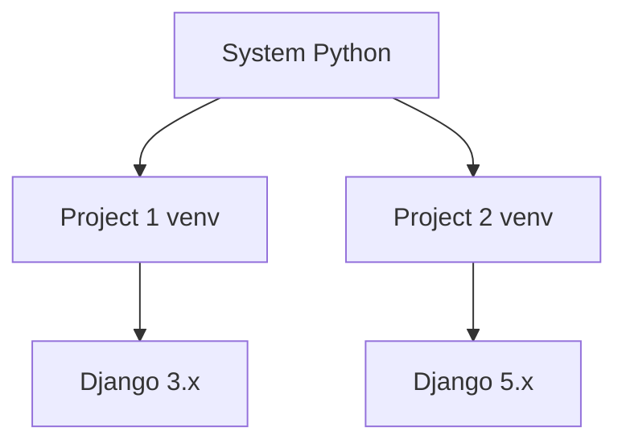

---

### 2.3 Creating Virtual Environment

#### 2.3.1 python -m venv Command

Create a virtual environment:

```python showLineNumbers id="create_venv_django"
python -m venv venv
```

* `venv` = environment folder name
* Creates isolated Python setup

---

#### 2.3.2 Folder Structure (Include, Lib, Scripts)

After creation:

```text id="venv_structure_django"
venv/
│
├── Include/
├── Lib/
├── Scripts/ (Windows) / bin/ (Linux/Mac)
└── pyvenv.cfg
```

* **Include/** → header files
* **Lib/** → installed packages
* **Scripts/bin/** → executables

---

### 2.4 Activating Environment

#### 2.4.1 Activation in Windows

```python showLineNumbers id="activate_windows_django"
venv\Scripts\activate
```

---

#### 2.4.2 Activation in Linux/Mac

```python showLineNumbers id="activate_linux_django"
source venv/bin/activate
```

👉 After activation:

* Terminal shows `(venv)` prefix

Example:

```text id="venv_active_prompt"
(venv) user@system:~$
```

---

### 2.5 Installing Django

#### 2.5.1 pip install django

Install Django inside the virtual environment:

```python showLineNumbers id="install_django"
pip install django
```

* Installs Django locally (inside venv)
* Does not affect system Python

---

#### 2.5.2 Verifying Installation (django-admin)

Check Django installation:

```python showLineNumbers id="check_django"
django-admin --version
```

👉 Displays installed Django version

---

### 🧠 Installation Flow

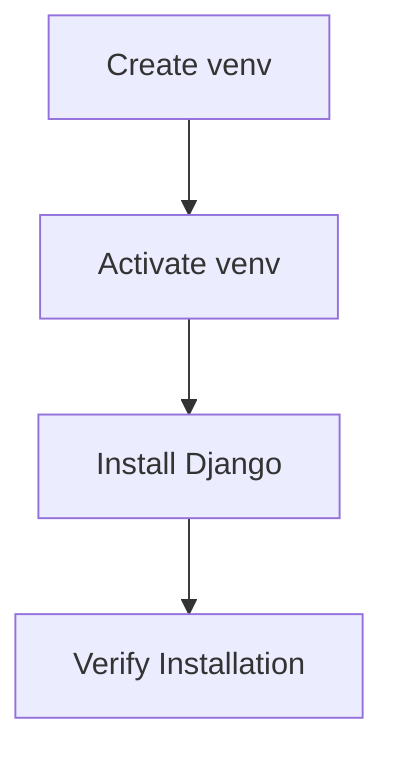

---

### 2.6 Deactivating Environment

#### 2.6.1 deactivate Command

To exit virtual environment:

```python showLineNumbers id="deactivate_django"
deactivate
```

* Returns to system Python
* Removes `(venv)` from terminal

---

### 🎯 Key Points (Exam Focus)

* Virtual environment = isolated Python setup
* Prevents dependency conflicts
* Created using `python -m venv`
* Activated using:

  * Windows → `venv\Scripts\activate`
  * Linux/Mac → `source venv/bin/activate`
* Install Django using `pip install django`
* Verify using `django-admin --version`
* Use `deactivate` to exit environment


## 3. Phases in Django Project Creation

### 3.1 Creating Django Project

#### 3.1.1 django-admin startproject Command

A Django project is created using:

```python showLineNumbers id="startproject"
django-admin startproject myproject
```

* `myproject` → name of the project
* Creates the base structure for Django application

👉 This is the **first step in Django development**

---

#### 3.1.2 Project Folder Structure

After creation:

```text id="django_project_structure"
myproject/
│
├── manage.py
└── myproject/
    ├── __init__.py
    ├── settings.py
    ├── urls.py
    ├── asgi.py
    └── wsgi.py
```

* Outer folder → project container
* Inner folder → actual Django project

---

### 🧠 Project Creation Flow

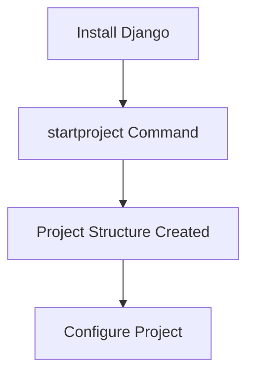

---

### 3.2 Core Project Files

### 3.2.1 manage.py

#### 3.2.1.1 Command Execution Interface

* Command-line utility
* Used to interact with Django project

Examples:

```python showLineNumbers id="manage_commands"
python manage.py runserver
python manage.py migrate
```

---

#### 3.2.1.2 Project Management Utility

* Performs administrative tasks:

  * Run server
  * Apply migrations
  * Create apps
  * Create superuser

👉 Central control file for Django project

---

### 3.2.2 settings.py

#### 3.2.2.1 Project Configuration

* Main configuration file
* Controls behavior of project

Contains:

* Debug mode
* Installed apps
* Middleware

---

#### 3.2.2.2 Installed Apps

Defines all apps used in project:

```python showLineNumbers id="installed_apps"
INSTALLED_APPS = [
    'django.contrib.admin',
    'django.contrib.auth',
]
```

👉 Add custom apps here

---

#### 3.2.2.3 Database Configuration

Defines database settings:

```python showLineNumbers id="db_config_django"
DATABASES = {
    'default': {
        'ENGINE': 'django.db.backends.sqlite3',
        'NAME': BASE_DIR / 'db.sqlite3',
    }
}
```

👉 Default database = SQLite

---

#### 3.2.2.4 Static Files Configuration

Defines static file settings:

```python showLineNumbers id="static_config"
STATIC_URL = '/static/'
```

👉 Used for:

* CSS
* JavaScript
* Images

---

### 3.2.3 urls.py

#### 3.2.3.1 URL Routing Definition

* Maps URLs to views

Example:

```python showLineNumbers id="urls_example"
from django.urls import path

urlpatterns = [
    path('', views.home),
]
```

---

#### 3.2.3.2 Mapping URLs to Views

* Connects user request → view function

Flow:

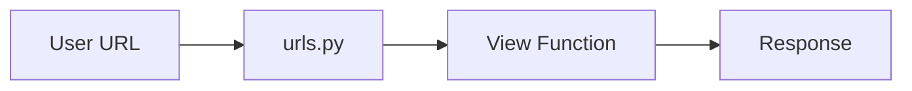

---

### 3.2.4 wsgi.py and asgi.py

#### 3.2.4.1 WSGI Interface

* Used for **synchronous applications**
* Connects Django app with web servers (e.g., Gunicorn)

```python showLineNumbers id="wsgi_example"
application = get_wsgi_application()
```

---

#### 3.2.4.2 ASGI Interface

* Used for **asynchronous applications**
* Supports:

  * WebSockets
  * Real-time apps

```python showLineNumbers id="asgi_example"
application = get_asgi_application()
```

---

### 🧠 WSGI vs ASGI

| Feature  | WSGI             | ASGI           |
| -------- | ---------------- | -------------- |
| Type     | Synchronous      | Asynchronous   |
| Use Case | Traditional apps | Real-time apps |
| Example  | Gunicorn         | Daphne         |

---

### 3.3 Running Development Server

#### 3.3.1 python manage.py runserver

Start the Django development server:

```python showLineNumbers id="runserver"
python manage.py runserver
```

Default:

* URL → `http://127.0.0.1:8000/`

---

#### 3.3.2 Server Output Interpretation

When server starts, you see:

```text id="server_output"
Starting development server at http://127.0.0.1:8000/
Quit the server with CTRL-C.
```

* Indicates server is running
* Shows accessible URL

---

#### 3.3.3 Accessing Application in Browser

Open browser and visit:

```text id="browser_url"
http://127.0.0.1:8000/
```

👉 Default Django welcome page appears

---

### 🎯 Key Points (Exam Focus)

* Create project using `django-admin startproject`
* `manage.py` → project control tool
* `settings.py` → configuration file
* `urls.py` → URL routing
* `wsgi.py` → sync deployment
* `asgi.py` → async support
* Run server using `python manage.py runserver`
* Default server runs on port 8000

## 4. Creation of Apps and Their Structure

### 4.1 Introduction to Django Apps

#### 4.1.1 Definition of App

A **Django app** is a self-contained module that performs a specific function within a project.

* Represents a feature or functionality
* Examples:

  * Blog app
  * Authentication app
  * Product app

👉 A project is made up of **multiple apps**

---

#### 4.1.2 Modular Structure of Django

Django follows a **modular architecture**:

* Each app is independent
* Apps can be:

  * Reused across projects
  * Developed separately

👉 Benefits:

* Scalability
* Code organization
* Maintainability

---

### 4.2 Creating an App

#### 4.2.1 python manage.py startapp

Create a new app:

```python showLineNumbers id="startapp"
python manage.py startapp myapp
```

* `myapp` → name of the app
* Must be created inside project directory

---

#### 4.2.2 App Folder Structure

```text id="app_structure"
myapp/
│
├── __init__.py
├── admin.py
├── apps.py
├── models.py
├── views.py
├── tests.py
└── migrations/
    └── __init__.py
```

---

### 🧠 App Structure Overview

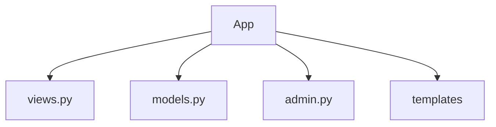

---

### 4.3 Important App Files

#### 4.3.1 views.py

* Contains view functions
* Handles user requests
* Returns responses

---

#### 4.3.2 models.py

* Defines database structure
* Contains model classes

---

#### 4.3.3 admin.py

* Registers models for admin panel
* Enables CRUD operations

Example:

```python showLineNumbers id="admin_register"
from django.contrib import admin
from .models import User

admin.site.register(User)
```

---

#### 4.3.4 apps.py

* Configuration file for the app
* Contains app metadata

Example:

```python showLineNumbers id="apps_file"
from django.apps import AppConfig

class MyappConfig(AppConfig):
    name = 'myapp'
```

---

### 4.4 Views in Django

#### 4.4.1 Definition of View

A **view** is a function that:

* Receives HTTP request
* Processes it
* Returns HTTP response

---

#### 4.4.2 Request-Response Cycle

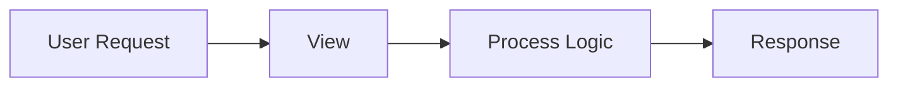

---

#### 4.4.3 HttpResponse Usage

```python showLineNumbers id="httpresponse_example"
from django.http import HttpResponse

def home(request):
    return HttpResponse("Hello World")
```

---

#### 4.4.4 Returning HTML Content

```python showLineNumbers id="html_response"
def home(request):
    return HttpResponse("<h1>Welcome</h1>")
```

---

### 4.5 URL Configuration

#### 4.5.1 urls.py in App

Create a `urls.py` inside app:

```python showLineNumbers id="app_urls"
from django.urls import path
from . import views

urlpatterns = [
    path('', views.home),
]
```

---

#### 4.5.2 path() Function

Used to define URL patterns:

```python
path('url/', view_function)
```

---

#### 4.5.3 URL Pattern Mapping

Maps URL → view function

---

### 4.6 Project-Level URL Integration

#### 4.6.1 include() Function

Used to include app URLs in project:

```python showLineNumbers id="include_example"
from django.urls import include, path

urlpatterns = [
    path('', include('myapp.urls')),
]
```

---

#### 4.6.2 Linking App URLs to Main URLs

* Connects app routing to main project
* Enables modular routing

---

### 4.7 Templates in Django

#### 4.7.1 templates Folder Creation

```text id="templates_structure"
myapp/
└── templates/
    └── index.html
```

---

#### 4.7.2 HTML Template Files

Example:

```html id="html_template"
<h1>Hello Django</h1>
```

---

#### 4.7.3 Template Rendering Flow

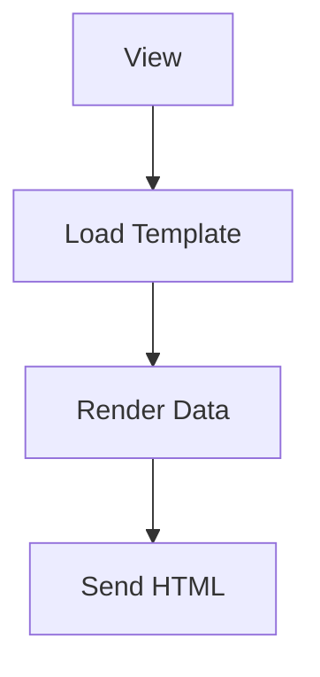

---

#### 4.7.4 Template Rendering Methods

##### 4.7.4.1 loader.get_template()

```python showLineNumbers id="get_template"
from django.template import loader
template = loader.get_template('index.html')
```

---

##### 4.7.4.2 template.render()

```python showLineNumbers id="render_template"
html = template.render({'name': 'Ankur'})
```

---

##### 4.7.4.3 Returning HttpResponse with Template

```python showLineNumbers id="template_response"
return HttpResponse(html)
```

---

### 4.8 App Registration

#### 4.8.1 Adding App to INSTALLED_APPS

```python showLineNumbers id="register_app"
INSTALLED_APPS = [
    'myapp',
]
```

---

#### 4.8.2 settings.py Configuration

* Required for Django to recognize app
* Enables models, templates, admin

---

### 4.9 Models and Database

#### 4.9.1 Model Definition

```python showLineNumbers id="model_def"
from django.db import models

class User(models.Model):
    name = models.CharField(max_length=100)
```

---

#### 4.9.2 Fields (CharField, IntegerField, etc.)

Common fields:

* CharField
* IntegerField
* EmailField
* DateField

---

#### 4.9.3 Primary Key Behavior

* Django automatically creates:

```text id="pk_example"
id (AutoField, Primary Key)
```

---

### 4.10 SQLite Database

#### 4.10.1 Default Database Usage

* Django uses SQLite by default
* No setup required

---

#### 4.10.2 db.sqlite3 File

* Database stored as file:

```text id="sqlite_file"
db.sqlite3
```

---

### 4.11 Migrations

#### 4.11.1 makemigrations Command

```python showLineNumbers id="makemigrations"
python manage.py makemigrations
```

* Creates migration files

---

#### 4.11.2 migrate Command

```python showLineNumbers id="migrate"
python manage.py migrate
```

* Applies changes to database

---

#### 4.11.3 Migration Files (0001_initial.py)

* Stored in `migrations/` folder
* Contains schema changes

---

#### 4.11.4 Migration Internals

##### 4.11.4.1 SQL Generation

* Django converts models → SQL queries

---

##### 4.11.4.2 sqlmigrate Command

```python showLineNumbers id="sqlmigrate"
python manage.py sqlmigrate myapp 0001
```

* Shows SQL generated

---

##### 4.11.4.3 Auto Increment ID

* Primary key auto-generated
* Automatically increments

---

### 🎯 Key Points (Exam Focus)

* App = modular component of Django project
* Create app using `startapp`
* `views.py` → handles logic
* `models.py` → database structure
* `admin.py` → admin panel integration
* `urls.py` → URL mapping
* Templates → UI rendering
* Register app in `INSTALLED_APPS`
* SQLite is default DB
* Migrations handle DB changes
* Commands:

  * `makemigrations`
  * `migrate`
  * `sqlmigrate`


## 5. Working with Admin Console

### 5.1 Introduction to Admin Interface

#### 5.1.1 Definition

The **Django Admin Interface** is a built-in web interface that allows developers and administrators to **manage application data without writing extra code**.

* Automatically generated by Django
* Accessible through a browser
* Used for backend management

👉 Saves time by eliminating the need to build custom admin panels

---

#### 5.1.2 CRUD Operations Support

Admin panel supports full **CRUD operations**:

* **Create** → Add new records
* **Read** → View existing data
* **Update** → Edit records
* **Delete** → Remove records

👉 All operations are performed through UI without coding

---

### 5.2 Admin URL Configuration

#### 5.2.1 admin.site.urls

Django provides a built-in route for admin:

```python showLineNumbers id="admin_urls"
from django.contrib import admin
from django.urls import path

urlpatterns = [
    path('admin/', admin.site.urls),
]
```

* `/admin/` → default admin route
* `admin.site.urls` → connects admin system

---

#### 5.2.2 urlpatterns Mapping

* `urlpatterns` maps URLs to views
* Admin route is added to main URL configuration

Flow:

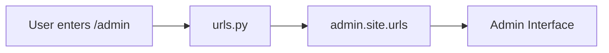

---

### 5.3 Creating Superuser

#### 5.3.1 createsuperuser Command

Create admin user:

```python showLineNumbers id="create_superuser"
python manage.py createsuperuser
```

---

#### 5.3.2 Username, Email, Password Setup

During creation:

* Enter username
* Enter email (optional)
* Enter password

Example:

```text id="superuser_input"
Username: admin
Email: admin@example.com
Password: ********
```

---

#### 5.3.3 Authentication Process

* Credentials stored securely in database
* Passwords are hashed
* Used to log into admin panel

👉 Only authenticated users can access admin

---

### 5.4 Admin Interface Usage

#### 5.4.1 Login Page

Access admin panel:

```text id="admin_login_url"
/admin/
```

Login screen:

* Username field
* Password field

---

#### 5.4.2 Dashboard Interface

After login:

* Displays list of registered models
* Provides navigation panel

Example:

```text id="admin_dashboard"
Users
Products
Orders
```

---

#### 5.4.3 Data Management

Admin allows:

* Add new records
* Edit existing records
* Delete records
* Search and filter data

Example model registration:

```python showLineNumbers id="admin_register_model"
from django.contrib import admin
from .models import Product

admin.site.register(Product)
```

👉 Registered models appear in admin dashboard

---

### 🧠 Admin Workflow

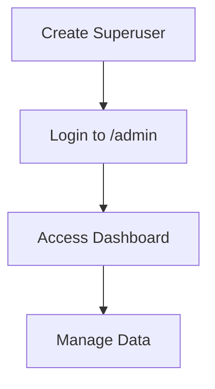

---

### 🎯 Key Points (Exam Focus)

* Django admin = built-in backend interface
* Supports CRUD operations
* Accessed via `/admin/`
* Enabled using `admin.site.urls`
* Superuser required for login
* Create using `createsuperuser`
* Models must be registered in `admin.py`
* Provides easy data management without coding


## 6. Creating Views and URL Mapping

### 6.1 URL Patterns

#### 6.1.1 Definition

**URL patterns** define how incoming URLs are mapped to specific view functions in Django.

* Stored in `urls.py`
* Act as a **routing system**
* Connect user requests → application logic

---

#### 6.1.2 path() Function Usage

The `path()` function is used to define URL routes.

Syntax:

```python showLineNumbers id="path_syntax"
path(route, view, name=None)
```

* `route` → URL pattern
* `view` → function to execute
* `name` → optional identifier

Example:

```python showLineNumbers id="basic_path"
from django.urls import path
from . import views

urlpatterns = [
    path('', views.home),
]
```

---

### 🧠 URL Routing Flow


---

### 6.2 Mapping URLs to Views

#### 6.2.1 Linking Views to URLs

Each URL is connected to a specific view.

```python showLineNumbers id="map_view"
urlpatterns = [
    path('home/', views.home),
]
```

👉 Visiting `/home/` calls `home()`

---

#### 6.2.2 Multiple Routes Handling

Multiple URLs can be defined:

```python showLineNumbers id="multiple_routes"
urlpatterns = [
    path('', views.index),
    path('about/', views.about),
    path('contact/', views.contact),
]
```

👉 Each route maps to a different view

---

### 6.3 Dynamic URL Mapping

#### 6.3.1 URL Parameters

Django allows dynamic values in URLs.

```python showLineNumbers id="url_param"
path('user/<str:name>/', views.user)
```

* `<str:name>` → dynamic parameter

---

#### 6.3.2 Passing Values to Views

```python showLineNumbers id="view_param"
def user(request, name):
    return HttpResponse(f"Hello {name}")
```

👉 URL value passed as argument

---

#### 6.3.3 Regular Expression Handling

##### 6.3.3.1 Capturing Groups

Earlier Django versions use regex:

```python showLineNumbers id="regex_url"
from django.urls import re_path

re_path(r'^user/(?P<name>\w+)/$', views.user)
```

* `(?P<name>\w+)` → captures value

---

##### 6.3.3.2 Dynamic Routing Logic

* Enables flexible URL patterns
* Matches complex paths dynamically

---

### 6.4 View Functions

#### 6.4.1 Basic Function-Based Views

```python showLineNumbers id="basic_view"
from django.http import HttpResponse

def home(request):
    return HttpResponse("Welcome")
```

---

#### 6.4.2 Returning HttpResponse

* Sends response back to browser

```python showLineNumbers id="http_response"
return HttpResponse("Hello User")
```

---

#### 6.4.3 Rendering Templates with Context

```python showLineNumbers id="render_template_django"
from django.shortcuts import render

def home(request):
    return render(request, 'index.html', {'name': 'Ankur'})
```

* `render()` loads template
* Passes data using context

---

### 🧠 View Execution Flow

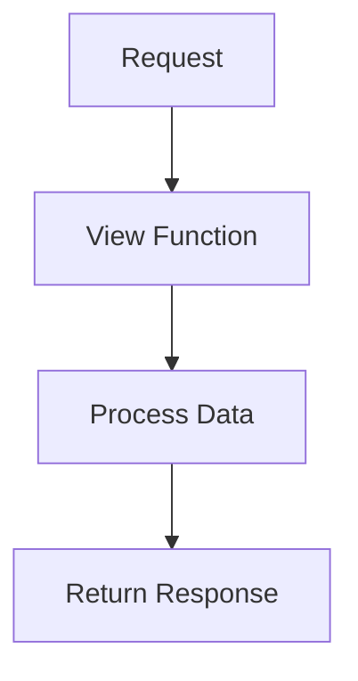

---

### 6.5 Named URLs

#### 6.5.1 name Parameter

Assign a name to URL:

```python showLineNumbers id="named_url"
path('home/', views.home, name='home')
```

👉 Used for referencing URLs dynamically

---

#### 6.5.2 Reverse URL Resolution

Django resolves URLs using names instead of hardcoding.

Example:

```python showLineNumbers id="reverse_url"
from django.urls import reverse

reverse('home')
```

👉 Returns:

```text id="reverse_output"
/home/
```

---

### 6.6 Using URLs in Templates

#### 6.6.1 `` Tag

Used inside templates:

```html id="url_tag"
<a href="">Home</a>
```

👉 Dynamically generates correct URL

---

#### 6.6.2 Linking Pages Dynamically

Example:

```html id="dynamic_link"
<a href="">Profile</a>
```

👉 Prevents hardcoding URLs

---

### 🎯 Key Points (Exam Focus)

* URL patterns map URL → view
* `path()` defines routes
* Dynamic URLs use `<type:variable>`
* Values passed to view functions
* `HttpResponse` returns output
* `render()` used for templates
* Named URLs improve flexibility
* `` used in templates
* Reverse URL avoids hardcoding


## 7. Form Processing, Static and Media Files

### 7.1 Static Files

#### 7.1.1 Definition

**Static files** are resources that do not change dynamically and are served as-is.

* Used for UI and frontend behavior
* Do not depend on user input

Examples:

* CSS stylesheets
* JavaScript files
* Images

---

#### 7.1.2 static Folder Structure

```text id="django_static_structure"
project/
│
├── static/
│   ├── css/
│   │   └── style.css
│   ├── js/
│   │   └── script.js
│   └── images/
│       └── logo.png
```

👉 Django looks for static files in the `static/` directory

---

### 7.2 Static File Handling

#### 7.2.1 Adding CSS Files

Example (`static/css/style.css`):

```css id="css_file"
body {
    background-color: lightblue;
}
```

---

#### 7.2.2 Linking Static Files in Templates

```html id="link_static_css"
<link rel="stylesheet" href="">
```

---

#### 7.2.3 Template Tags for Static

##### 7.2.3.1 ``

Must be added at top of template:

```html id="load_static"

```

---

##### 7.2.3.2 ``

```html id="static_tag"
<link rel="stylesheet" href="">
```

👉 Generates correct path to static file

---

### 🧠 Static File Flow

```mermaid id="static_flow_django"
flowchart TD
    A[Template] --> B[]
    B --> C[Static File]
    C --> D[Browser Render]
```

---

### 7.3 Template Integration

#### 7.3.1 Applying CSS

* CSS is applied through linked stylesheet
* Controls layout and styling

---

#### 7.3.2 Styled Output Rendering

* Browser renders styled HTML

Example:

```text id="styled_output"
Page background becomes light blue
```

---

### 7.4 Form Processing

#### 7.4.1 Handling User Input

Forms are used to collect user data.

Example HTML form:

```html id="form_example"
<form method="POST">
    <input type="text" name="username">
    <input type="submit">
</form>
```

---

#### 7.4.2 request Object Usage

Django provides `request` object to access form data.

```python showLineNumbers id="request_usage"
def submit(request):
    data = request.POST['username']
    return HttpResponse(data)
```

---

#### 7.4.3 GET vs POST Handling

##### 7.4.3.1 request.GET

* Used for retrieving data from URL
* Data visible in URL

Example:

```python showLineNumbers id="get_example"
name = request.GET.get('name')
```

---

##### 7.4.3.2 request.POST

* Used for sending data securely
* Data not visible in URL

Example:

```python showLineNumbers id="post_example_django"
name = request.POST.get('username')
```

---

### 🧠 Form Processing Flow

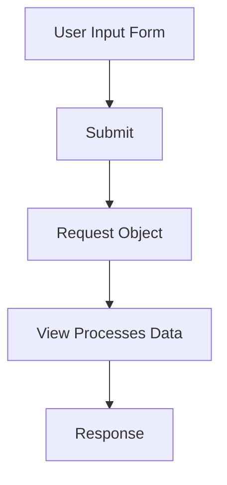

---

### 7.5 Media Files

#### 7.5.1 Definition of Media Files

**Media files** are user-uploaded files.

Examples:

* Profile images
* Documents
* Videos

---

#### 7.5.2 Difference from Static Files

| Feature  | Static Files | Media Files     |
| -------- | ------------ | --------------- |
| Source   | Developer    | User            |
| Content  | Fixed        | Dynamic         |
| Examples | CSS, JS      | Images, uploads |

---

#### 7.5.3 File Upload Handling

Example model:

```python showLineNumbers id="file_model"
class Profile(models.Model):
    image = models.ImageField(upload_to='images/')
```

Example form handling:

```python showLineNumbers id="file_upload"
def upload(request):
    if request.method == 'POST':
        file = request.FILES['image']
```

👉 Files stored in **media directory**

---

### 🎯 Key Points (Exam Focus)

* Static files = CSS, JS, images (developer-defined)
* Stored in `static/` folder
* Use `` and ``
* Forms collect user input
* `request.GET` → URL data
* `request.POST` → form data
* Media files = user-uploaded files
* File upload handled using `request.FILES`
* Static ≠ Media files


## 8. Django App Deployment

### 8.1 Introduction to Deployment

#### 8.1.1 Need for Deployment

**Deployment** means making your Django application accessible to users over the internet.

* Moves app from local machine → live server
* Required for real-world usage
* Allows access via domain/IP

Without deployment:

* App runs only locally
* No external access

---

#### 8.1.2 Development vs Production

| Feature     | Development            | Production  |
| ----------- | ---------------------- | ----------- |
| Server      | Built-in (`runserver`) | WSGI server |
| Performance | Low                    | High        |
| Security    | Basic                  | Strong      |
| Debug Mode  | Enabled                | Disabled    |

👉 Important:

* `runserver` is **not used in production**

---

### 8.2 Deployment Preparation

#### 8.2.1 Configuration Settings

Before deployment, update `settings.py`:

```python showLineNumbers id="settings_prod"
DEBUG = False
ALLOWED_HOSTS = ['yourdomain.com']
```

* Disable debug mode
* Set allowed hosts

---

#### 8.2.2 Environment Setup

* Install dependencies:

```python showLineNumbers id="install_requirements"
pip install -r requirements.txt
```

* Use virtual environment
* Set environment variables for security

---

### 8.3 Deployment Platforms

#### 8.3.1 Hosting Services

Common platforms:

* Heroku
* AWS (Elastic Beanstalk, EC2)
* DigitalOcean
* PythonAnywhere

👉 Provide:

* Server infrastructure
* Deployment tools

---

#### 8.3.2 Server Setup

Typical setup includes:

* Web server (Nginx / Apache)
* WSGI server (Gunicorn)
* Database (PostgreSQL/MySQL)

👉 Architecture:

```mermaid id="django_deploy_flow"
flowchart TD
    A[User Request] --> B[Web Server (Nginx)]
    B --> C[WSGI Server (Gunicorn)]
    C --> D[Django App]
    D --> E[Database]
```

---

### 8.4 Running Django in Production

#### 8.4.1 Deployment Commands

Run using Gunicorn:

```python showLineNumbers id="gunicorn_django"
gunicorn myproject.wsgi:application
```

* `myproject.wsgi` → project module
* `application` → WSGI callable

---

#### 8.4.2 Server Execution

* Gunicorn handles requests
* Nginx forwards requests to Gunicorn
* Django processes and returns response

👉 Production flow is optimized and secure

---

### 8.5 Static Files in Production

#### 8.5.1 Static File Serving

In production:

* Static files are served by:

  * Nginx
  * Apache

👉 Not handled by Django directly

---

#### 8.5.2 collectstatic Concept

Command:

```python showLineNumbers id="collectstatic"
python manage.py collectstatic
```

* Collects all static files into one directory
* Used for efficient serving

Example:

```text id="static_root"
STATIC_ROOT/
```

👉 Required before deployment

---

### 🎯 Key Points (Exam Focus)

* Deployment = making app live on server
* Development server ≠ production server
* Set:

  * `DEBUG = False`
  * `ALLOWED_HOSTS`
* Use WSGI server (Gunicorn)
* Use web server (Nginx/Apache)
* Platforms: Heroku, AWS, etc.
* Static files served separately in production
* Use `collectstatic` before deployment