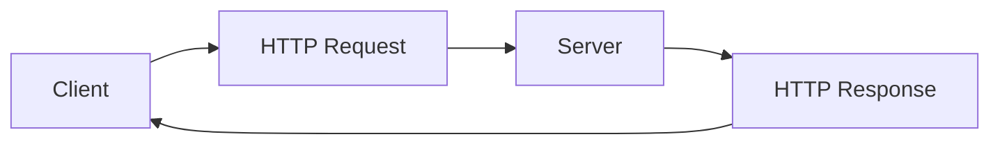
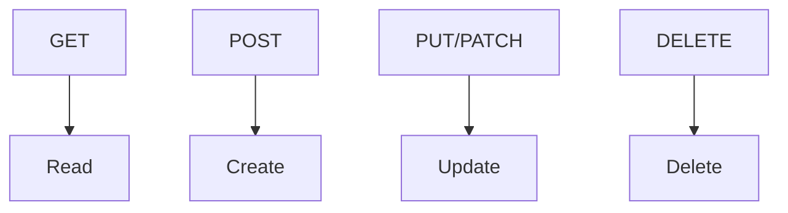
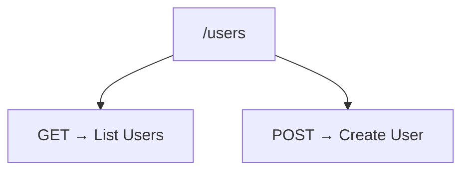
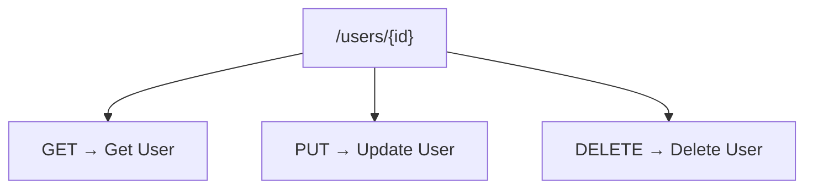
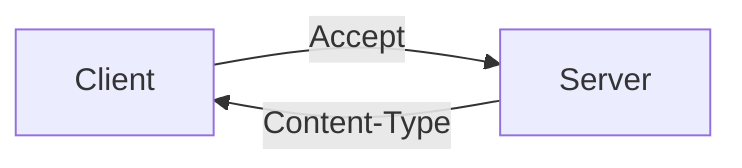
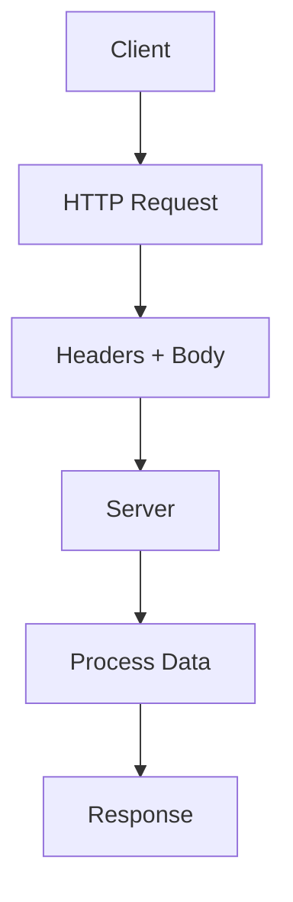
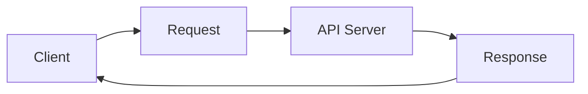
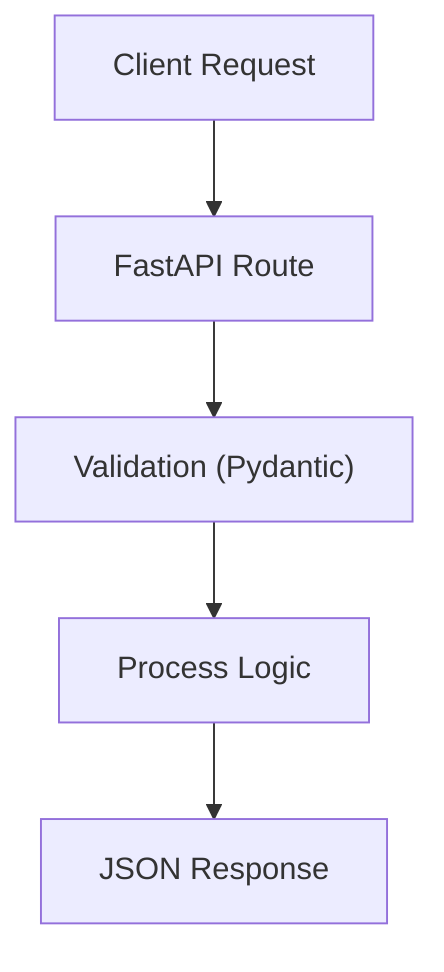

# Unit - 6
:::info[TITLE]
## RESTful APIs
:::

## 1. Introduction to RESTful APIs

### 1.1 REST Architecture Overview

#### 1.1.1 Definition of REST (Representational State Transfer)

**REST (Representational State Transfer)** is an architectural style used to design networked applications.

* Introduced by Roy Fielding
* Based on standard web protocols (HTTP)
* Uses resources and representations to communicate

👉 REST is **not a protocol**, but a set of design principles


#### 1.1.2 REST as Architectural Style for Web Services

REST defines how web services should be structured:

* Uses **stateless communication**
* Follows client-server architecture
* Relies on standard HTTP methods

👉 Helps in building:

* Scalable
* Maintainable
* Efficient APIs

---

#### 1.1.3 REST API Definition

A **REST API** is an interface that allows communication between client and server using REST principles.

* Uses HTTP methods (GET, POST, etc.)
* Exchanges data in formats like JSON or XML
* Operates on resources identified by URLs

Example:

```text id="rest_example"
/users
/products/10
```

---

#### 1.1.4 Comparison with SOAP (Lightweight vs Heavyweight)

| Feature     | REST                | SOAP     |
| ----------- | ------------------- | -------- |
| Type        | Architectural style | Protocol |
| Data Format | JSON, XML           | XML only |
| Complexity  | Simple              | Complex  |
| Performance | Fast                | Slower   |
| Flexibility | High                | Low      |

👉 REST is preferred for modern web applications

---

#### 1.1.5 Advantages of REST (Scalability, Flexibility, Performance)

**1. Scalability**

* Stateless design allows easy scaling
* Servers don’t store client state

**2. Flexibility**

* Supports multiple data formats
* Works with different platforms

**3. Performance**

* Lightweight communication
* Uses caching and efficient HTTP methods

---

### 1.2 Working of REST APIs

#### 1.2.1 Client-Server Communication

* Client sends request
* Server processes it
* Server returns response

👉 Separation of concerns:

* Client → UI
* Server → logic & data

---

#### 1.2.2 Request-Response Model



* Every interaction follows this cycle

---

#### 1.2.3 Use of HTTP Protocol

REST APIs use HTTP methods:

* GET → retrieve data
* POST → create data
* PUT → update data
* DELETE → remove data

👉 HTTP is the foundation of REST

---

#### 1.2.4 Resource-Based Interaction

REST treats everything as a **resource**:

* Users
* Products
* Orders

Each resource is identified by a URL:

```text id="resource_example"
/users/1
/products/5
```

👉 Operations are performed on resources

---

#### 1.2.5 Response Formats (JSON, XML, HTML, Images)

REST APIs can return different formats:

* JSON (most common)
* XML
* HTML
* Images

Example JSON:

```json id="json_example"
{
  "id": 1,
  "name": "Ankur"
}
```

---

#### 1.2.6 JSON as Most Popular Data Format

JSON (**JavaScript Object Notation**) is widely used because:

* Lightweight and fast
* Easy to read and write
* Language-independent

Example:

```json id="json_example_2"
{
  "username": "ankur",
  "email": "ankur@example.com"
}
```

👉 Preferred format for modern REST APIs

---

### 🎯 Key Points (Exam Focus)

* REST = architectural style for web services
* REST API uses HTTP methods and URLs
* Stateless communication
* Resource-based design
* JSON is most commonly used format
* REST is faster and more flexible than SOAP
* Client ↔ Server via request-response model


## 2. HTTP Protocol in REST APIs

### 2.1 Introduction to HTTP

#### 2.1.1 Definition of HTTP Protocol

**HTTP (HyperText Transfer Protocol)** is the foundation of communication on the web.

* Used to transfer data between client and server
* Works on a **request–response model**
* Operates over TCP/IP

👉 It defines how messages are formatted and transmitted

---

#### 2.1.2 Role of HTTP in REST APIs

REST APIs are built on top of HTTP:

* HTTP methods → define actions (GET, POST, etc.)
* URLs → identify resources
* Headers → carry metadata
* Body → carries data

👉 HTTP acts as the **communication layer** for REST

---

#### 2.1.3 Stateless Nature of HTTP

HTTP is **stateless**, meaning:

* Each request is independent
* Server does not store client state

Example:

```text id="stateless_example"
Request 1 → Server processes → forgets  
Request 2 → treated as new request
```

👉 Benefits:

* Scalability
* Simplicity

---

### 🧠 HTTP Communication Flow


---

### 2.2 HTTP Methods (CRUD Operations)

HTTP methods define actions on resources.

---

### 2.2.1 GET Method

##### 2.2.1.1 Retrieve Resource

* Used to fetch data
* Does not modify server state

Example:

```text id="get_example"
/users
```

---

##### 2.2.1.2 Response Codes (200, 404, 400)

* **200 OK** → successful response
* **404 Not Found** → resource does not exist
* **400 Bad Request** → invalid request

---

### 2.2.2 POST Method

##### 2.2.2.1 Create Resource

* Sends data to server
* Creates new resource

---

##### 2.2.2.2 Response Code 201 Created

* Indicates resource created successfully

---

##### 2.2.2.3 Location Header Usage

* Returns URL of newly created resource

Example:

```text id="location_header"
/users/10
```

---

### 2.2.3 PUT Method

##### 2.2.3.1 Update Resource

* Updates entire resource

---

##### 2.2.3.2 Create if Not Exists

* Creates resource if it doesn’t exist

---

##### 2.2.3.3 Idempotent Nature

* Multiple identical requests → same result

---

##### 2.2.3.4 Response Codes (200, 204, 201)

* **200 OK** → updated successfully
* **204 No Content** → updated, no response body
* **201 Created** → new resource created

---

### 2.2.4 PATCH Method

##### 2.2.4.1 Partial Update

* Updates only specific fields

---

##### 2.2.4.2 Patch Instructions (JSON Patch/XML Patch)

Example:

```json id="patch_example"
{
  "name": "Updated Name"
}
```

---

##### 2.2.4.3 Non-idempotent Nature

* Repeated requests may produce different results

---

### 2.2.5 DELETE Method

##### 2.2.5.1 Delete Resource

* Removes resource from server

---

##### 2.2.5.2 Response Code 200 OK

* Indicates successful deletion

---

### 2.2.6 Other Methods

##### 2.2.6.1 OPTIONS Method

* Returns supported HTTP methods

Example:

```text id="options_example"
Allow: GET, POST, PUT
```

---

##### 2.2.6.2 HEAD Method

* Same as GET but returns only headers
* No response body

---

### 🧠 CRUD Mapping



---

### 2.3 Idempotence Concept

#### 2.3.1 Definition of Idempotent Operations

An operation is **idempotent** if:

👉 Repeating it multiple times gives the same result

---

#### 2.3.2 Example of Idempotent Operation

* GET request
* PUT request

Example:

```text id="idempotent_example"
PUT /users/1 → same result even if repeated
```

---

#### 2.3.3 Example of Non-Idempotent Operation

* POST request

Example:

```text id="non_idempotent_example"
POST /users → creates new user each time
```

---

### 🎯 Key Points (Exam Focus)

* HTTP = communication protocol for REST
* Stateless → each request independent
* Methods:

  * GET → read
  * POST → create
  * PUT → update
  * PATCH → partial update
  * DELETE → remove
* Status codes indicate result
* Idempotent:

  * GET, PUT
* Non-idempotent:

  * POST
* OPTIONS → allowed methods
* HEAD → headers only


## 3. REST API Architectural Constraints

### 3.1 Overview of Constraints

#### 3.1.1 Definition of REST Constraints

**REST constraints** are a set of rules that define how a RESTful system should be designed.

* Introduced by Roy Fielding
* Ensure consistency and standardization
* Guide the structure of APIs

👉 If an API follows these constraints → it is considered **RESTful**

---

#### 3.1.2 Importance of Following Constraints

Following REST constraints ensures:

* **Scalability** → system can handle more users
* **Performance** → efficient communication
* **Simplicity** → easy to understand and maintain
* **Interoperability** → works across platforms

👉 Ignoring constraints → API becomes inconsistent and hard to manage

---

### 3.2 Types of Constraints

### 3.2.1 Uniform Interface

This is the **core constraint** of REST.

* Standard way of interacting with resources
* Uses:

  * HTTP methods (GET, POST, etc.)
  * URLs for resource identification

Key ideas:

* Resource identification via URI
* Manipulation using representations (JSON)
* Self-descriptive messages

👉 Makes APIs predictable and consistent

---

### 3.2.2 Stateless Constraint

Each request must contain **all required information**.

* Server does not store client state
* Every request is independent

Example:

```text id="stateless_example_rest"
Request 1 → login  
Request 2 → must include auth token again
```

👉 Benefits:

* Scalability
* Reliability

---

### 3.2.3 Cacheable Constraint

Responses should be **cacheable** whenever possible.

* Server indicates if response can be cached
* Improves performance

Example headers:

```text id="cache_example"
Cache-Control: max-age=3600
```

👉 Reduces:

* Server load
* Response time

---

### 3.2.4 Client-Server Architecture

Separates client and server responsibilities.

* Client → UI (frontend)
* Server → data + logic

👉 Benefits:

* Independent development
* Better scalability

---

### 3.2.5 Layered System

System can have multiple layers:

* Client → Proxy → Server → Database


👉 Benefits:

* Security
* Load balancing
* Modularity

---

### 3.2.6 Code on Demand (Optional)

Server can send executable code to client.

* Example:

  * JavaScript sent to browser

👉 Rarely used but adds flexibility

---

### 3.3 REST System Components

#### 3.3.1 Client

* Sends requests to server
* Examples:

  * Browser
  * Mobile app
  * API client (Postman)

---

#### 3.3.2 Server

* Processes requests
* Handles business logic
* Interacts with database

---

#### 3.3.3 Interaction via HTTP


* Communication happens using HTTP
* Includes:

  * Methods (GET, POST, etc.)
  * Headers
  * Body

---

### 🎯 Key Points (Exam Focus)

* REST constraints define structure of APIs
* 6 constraints:

  * Uniform Interface
  * Stateless
  * Cacheable
  * Client-Server
  * Layered System
  * Code on Demand (optional)
* Stateless → no session storage
* Cacheable → improves performance
* Client-server → separation of concerns
* Interaction happens via HTTP
* Following constraints → RESTful system


## 4. URLs and Resource Representation

### 4.1 Resource Identification Using URLs

#### 4.1.1 Definition of Resource

A **resource** is any data or object that can be accessed via an API.

Examples:

* Users
* Products
* Orders

👉 In REST, everything is treated as a **resource**

---

#### 4.1.2 URL as Resource Identifier

Each resource is identified using a **URL (Uniform Resource Locator)**.

* Acts as an address of the resource
* Unique for each resource

Example:

```text id="url_identifier"
/users/1
```

👉 `/users/1` → identifies a specific user

---

#### 4.1.3 Endpoint Concept

An **endpoint** is a specific URL where an API can be accessed.

* Combines:

  * URL
  * HTTP method

Example:

```text id="endpoint_example"
GET /users
POST /users
```

👉 Same URL + different method = different operation

---

#### 4.1.4 Hierarchical and Meaningful URLs

Good REST APIs use:

* **Readable URLs**
* **Hierarchical structure**

Examples:

```text id="good_urls"
/users
/users/1
/users/1/orders
```

👉 Benefits:

* Easy to understand
* Logical structure
* Better maintainability

---

#### 4.1.5 URL Examples

##### 4.1.5.1 GET /users

* Retrieves list of users

---

##### 4.1.5.2 GET /users/{'{id}'}

* Retrieves specific user

---

##### 4.1.5.3 POST /users

* Creates new user

---

##### 4.1.5.4 PUT /users/{'{id}'}

* Updates user

---

##### 4.1.5.5 DELETE /users/{'{id}'}

* Deletes user

---

### 🧠 URL–Operation Mapping




---

### 4.2 Resource Representation Formats

#### 4.2.1 JSON Format

**JSON (JavaScript Object Notation)** is the most widely used format.

* Lightweight
* Easy to read and write
* Language-independent

---

#### 4.2.2 XML Format

**XML (eXtensible Markup Language)**:

* Structured but more verbose
* Used in older systems (e.g., SOAP)

---

#### 4.2.3 YAML, CSV, Plain Text

Other formats include:

* YAML → human-readable
* CSV → tabular data
* Plain text → simple responses

👉 JSON is preferred in modern APIs

---

### 4.3 Data Transfer Representation

#### 4.3.1 Key-Value Structure in JSON

JSON uses **key-value pairs**:

```json id="json_kv"
{
  "id": 1,
  "name": "Ankur"
}
```

---

#### 4.3.2 Example JSON Response Structure

```json id="json_response_example"
{
  "status": "success",
  "data": {
    "id": 1,
    "username": "ankur"
  }
}
```

👉 Common structure:

* status
* data
* message (optional)

---

### 4.4 HTTP Headers and Content Negotiation

#### 4.4.1 Content-Type Header

Defines the format of data being sent.

Example:

```text id="content_type"
Content-Type: application/json
```

---

#### 4.4.2 Accept Header

Defines the format client expects in response.

Example:

```text id="accept_header"
Accept: application/json
```

---

#### 4.4.3 Client-Server Format Agreement

Content negotiation ensures:

* Client and server agree on data format
* Correct representation is used

👉 Improves compatibility

---

### 🧠 Header Flow



---

### 4.5 Example API Request

#### 4.5.1 HTTP POST Request Structure

```text id="http_post_structure"
POST /users HTTP/1.1
```

---

#### 4.5.2 Headers (Host, Content-Type, Accept)

```text id="headers_example"
Host: example.com
Content-Type: application/json
Accept: application/json
```

#### 4.5.3 JSON Request Body

```json id="request_body_example"
{
  "username": "ankur",
  "email": "ankur@example.com"
}
```


### 🧠 Full Request Flow




### 🎯 Key Points (Exam Focus)

* Resource = entity (user, product, etc.)
* URL identifies resource
* Endpoint = URL + HTTP method
* Use meaningful and hierarchical URLs
* JSON is most common format
* Headers:

  * Content-Type → request format
  * Accept → response format
* Content negotiation ensures compatibility
* REST APIs use structured request/response format


## 5. Designing and Implementing RESTful APIs

### 5.1 Proper Use of HTTP Methods

#### 5.1.1 GET for Retrieval

* Fetch data
* No modification

```text id="get_ex"
/users
```

---

#### 5.1.2 POST for Creation

* Create new resource
* Not idempotent

```text id="post_ex"
POST /users
```

---

#### 5.1.3 PUT for Update/Create

* Update full resource
* Creates if not exists
* Idempotent

```text id="put_ex"
PUT /users/1
```

---

#### 5.1.4 PATCH for Partial Update

* Update specific fields only

```text id="patch_ex"
PATCH /users/1
```

---

#### 5.1.5 DELETE for Removal

* Delete resource

```text id="delete_ex"
DELETE /users/1
```

---

### 5.2 Designing Resource URIs

#### 5.2.1 Meaningful URL Design

Rules:

* Use nouns
* Keep hierarchy
* Avoid verbs

---

#### 5.2.2 Good vs Bad URL Examples

Good:

```text id="good_uri"
/users/1/orders
```

Bad:

```text id="bad_uri"
/getUserOrders
```

---

### 5.3 API Versioning

#### 5.3.1 Need for Versioning

* Prevent breaking existing clients
* Support upgrades

---

#### 5.3.2 URI Versioning (/v1/users)

```text id="uri_version"
/v1/users
```

---

#### 5.3.3 Header Versioning

```text id="header_version"
Accept: application/vnd.api.v1+json
```

---

#### 5.3.4 Query Parameter Versioning

```text id="query_version"
/users?version=1
```

---

### 5.4 HTTP Status Codes

#### 5.4.1 200 OK → Success

#### 5.4.2 201 Created → Resource created

#### 5.4.3 204 No Content → Success, no body

#### 5.4.4 400 Bad Request → Invalid input

#### 5.4.5 401 Unauthorized → Auth required

#### 5.4.6 403 Forbidden → Access denied

#### 5.4.7 404 Not Found → Resource missing

#### 5.4.8 500 Internal Server Error → Server issue

---

### 5.5 Error Handling

#### 5.5.1 Structured Error Response

```json id="error_struct"
{
  "error": "Invalid input",
  "code": 400
}
```

---

#### 5.5.2 Error Code and Message

* Code → machine-readable
* Message → human-readable

---

#### 5.5.3 Detailed Error Information

```json id="error_detail"
{
  "error": "Validation failed",
  "fields": {
    "email": "Invalid format"
  }
}
```

---

### 5.6 HATEOAS Concept

#### 5.6.1 Definition

**HATEOAS** → API provides links for next actions

---

#### 5.6.2 Linking Resources

```json id="hateoas_links"
{
  "user": 1,
  "links": {
    "self": "/users/1",
    "orders": "/users/1/orders"
  }
}
```

---

#### 5.6.3 Navigation via Links

* Client follows links
* No hardcoded URLs

---

### 5.7 Authentication and Authorization

#### 5.7.1 Need for Security

* Protect data
* Control access

---

#### 5.7.2 OAuth 2.0

* Token-based authorization
* Used in large systems

---

#### 5.7.3 JWT (JSON Web Tokens)

* Encoded token
* Contains user data

---

#### 5.7.4 API Keys

* Simple authentication
* Sent with requests

---

#### 5.7.5 Authorization Header (Bearer Token)

```text id="auth_header"
Authorization: Bearer <token>
```

---

### 5.8 Performance Optimization

#### 5.8.1 Pagination

* Limit data size

```text id="pagination"
/users?page=1&limit=10
```

---

#### 5.8.2 Caching (ETag, Cache-Control)

```text id="cache_header"
Cache-Control: max-age=3600
ETag: "abc123"
```

---

#### 5.8.3 Compression (Gzip)

* Reduce response size
* Faster transfer

---

### 5.9 API Documentation

#### 5.9.1 OpenAPI (Swagger)

* Standard API documentation
* Interactive UI

---

#### 5.9.2 Endpoint Documentation Structure

* URL
* Method
* Parameters
* Request body
* Response
* Status codes

---

### 5.10 Logging and Monitoring

#### 5.10.1 Logging API Requests

* Track requests
* Debug issues

---

#### 5.10.2 Monitoring Errors and Usage

* Detect failures
* Analyze traffic

---

### 🎯 Key Points (Exam Focus)

* Use correct HTTP methods
* Design clean, noun-based URLs
* Version APIs properly
* Use proper status codes
* Return structured errors
* HATEOAS = link-based navigation
* Secure APIs (JWT, OAuth, API keys)
* Optimize performance (pagination, caching)
* Document APIs clearly
* Monitor and log API usage


## 6. Consuming RESTful APIs

### 6.1 Introduction to API Consumption

#### 6.1.1 Definition

**API consumption** means using an API to send requests and receive data.

* Client interacts with server
* Data exchanged via HTTP

---

#### 6.1.2 Client Interaction with APIs

Flow:

* Client sends request
* Server processes
* Server returns response



---

### 6.2 Using cURL

#### 6.2.1 Command-Line Tool Overview

* CLI tool to send HTTP requests
* Useful for quick testing

---

#### 6.2.2 GET Request Using cURL

```bash id="curl_get"
curl http://api.example.com/users
```

---

#### 6.2.3 POST Request Using cURL

```bash id="curl_post"
curl -X POST http://api.example.com/users \
-H "Content-Type: application/json" \
-d '{"name":"Ankur"}'
```

---

#### 6.2.4 Passing Headers (Authorization)

```bash id="curl_auth"
curl -H "Authorization: Bearer token123" http://api.example.com/users
```

---

### 6.3 Using Postman

#### 6.3.1 GUI-Based Tool Overview

* Graphical API testing tool
* No coding required

---

#### 6.3.2 Steps to Use Postman

##### 6.3.2.1 Enter API URL

Enter endpoint:

```text id="postman_url"
http://api.example.com/users
```

---

##### 6.3.2.2 Select HTTP Method

* Choose GET / POST / PUT / DELETE

---

##### 6.3.2.3 Add Headers

Example:

```text id="postman_headers"
Content-Type: application/json
Authorization: Bearer token
```

---

##### 6.3.2.4 Add Request Body

```json id="postman_body"
{
  "name": "Ankur"
}
```

---

##### 6.3.2.5 Send Request and View Response

* Click **Send**
* View status, headers, body

---

### 6.4 Using Python requests Library

#### 6.4.1 Installation (pip install requests)

```python showLineNumbers id="install_requests"
pip install requests
```

---

#### 6.4.2 GET Request Example

```python showLineNumbers id="requests_get"
import requests

response = requests.get("http://api.example.com/users")
print(response.json())
```

---

#### 6.4.3 POST Request Example

```python showLineNumbers id="requests_post"
import requests

data = {"name": "Ankur"}
response = requests.post("http://api.example.com/users", json=data)
print(response.json())
```

---

#### 6.4.4 Adding Headers

```python showLineNumbers id="requests_headers"
headers = {"Authorization": "Bearer token123"}

response = requests.get("http://api.example.com/users", headers=headers)
```

---

#### 6.4.5 Handling Errors (try-except)

```python showLineNumbers id="requests_error"
import requests

try:
    response = requests.get("http://api.example.com/users")
    response.raise_for_status()
    print(response.json())
except requests.exceptions.RequestException as e:
    print("Error:", e)
```

---

### 6.5 Comparison of Tools

#### 6.5.1 cURL (Command Line)

* Fast
* Lightweight
* No GUI

---

#### 6.5.2 Postman (GUI)

* Easy to use
* Visual interface
* Good for testing

---

#### 6.5.3 Python requests (Automation)

* Used in scripts/programs
* Best for automation
* Flexible

---

### 🎯 Key Points (Exam Focus)

* API consumption = using APIs via HTTP
* Tools:

  * cURL → CLI testing
  * Postman → GUI testing
  * requests → programmatic usage
* GET → fetch data
* POST → send data
* Headers used for auth & format
* Error handling important in code
* Postman best for beginners
* requests best for automation


## 7. Building REST APIs with Flask

### 7.1 Introduction to Flask for APIs

#### 7.1.1 Lightweight Framework

Flask is a **micro web framework** in Python.

* Minimal setup
* No built-in ORM or auth (you add what you need)
* Full control over structure

---

#### 7.1.2 Use Cases

* REST APIs
* Microservices
* Prototypes
* Small to medium backend systems

---

### 7.2 Installation

#### 7.2.1 pip install flask

```python showLineNumbers id="install_flask"
pip install flask
```

---

### 7.3 Basic API Implementation

#### 7.3.1 Creating Flask App

```python showLineNumbers id="flask_app"
from flask import Flask

app = Flask(__name__)
```

---

#### 7.3.2 Sample Data Storage

```python showLineNumbers id="sample_data"
users = [
    {"id": 1, "name": "Ankur"},
    {"id": 2, "name": "John"}
]
```

---

#### 7.3.3 GET Endpoint (/users)

```python showLineNumbers id="get_users"
from flask import jsonify

@app.route('/users', methods=['GET'])
def get_users():
    return jsonify(users)
```

---

#### 7.3.4 GET Endpoint with ID (/users/{'{id}'})

```python showLineNumbers id="get_user_by_id"
@app.route('/users/<int:id>', methods=['GET'])
def get_user(id):
    user = next((u for u in users if u["id"] == id), None)
    if user:
        return jsonify(user)
    return jsonify({"error": "User not found"}), 404
```

---

#### 7.3.5 POST Endpoint (/users)

```python showLineNumbers id="post_user"
from flask import request

@app.route('/users', methods=['POST'])
def create_user():
    data = request.get_json()
    new_user = {
        "id": len(users) + 1,
        "name": data["name"]
    }
    users.append(new_user)
    return jsonify(new_user), 201
```

---

### 7.4 Response Handling

#### 7.4.1 jsonify() Function

* Converts Python dict → JSON
* Sets correct headers

---

#### 7.4.2 Returning JSON Response

```python showLineNumbers id="json_response"
return jsonify({"message": "Success"}), 200
```

---

#### 7.4.3 Error Response Handling (404)

```python showLineNumbers id="error_404"
return jsonify({"error": "Not Found"}), 404
```

---

### 7.5 Running Flask App

#### 7.5.1 app.run(debug=True)

```python showLineNumbers id="run_flask"
if __name__ == "__main__":
    app.run(debug=True)
```

* `debug=True` → auto reload + error details

---

### 🧠 API Flow (Flask)


---

### 7.6 Advantages of Flask

#### 7.6.1 Simple and Easy

* Minimal learning curve
* Quick setup

---

#### 7.6.2 Large Ecosystem

* Extensions available for:

  * Database (SQLAlchemy)
  * Auth (Flask-Login)

---

#### 7.6.3 Suitable for Small/Medium Apps

* Lightweight
* Flexible

---

### 7.7 Limitations of Flask

#### 7.7.1 No Built-in Async Support

* Not ideal for high concurrency (without extra tools)

---

#### 7.7.2 Requires Extra Libraries

* No built-in:

  * ORM
  * Authentication
  * Admin panel

👉 You must integrate manually

---

### 🎯 Key Points (Exam Focus)

* Flask = lightweight Python framework
* Used for building REST APIs
* Key components:

  * `Flask()` → app
  * `@app.route()` → endpoints
  * `jsonify()` → JSON response
* Supports:

  * GET
  * POST
* `request.get_json()` → input data
* Returns status codes (200, 201, 404)
* Easy but requires extensions for full features


## 8. Building REST APIs with FastAPI

### 8.1 Introduction to FastAPI

#### 8.1.1 Modern High-Performance Framework

**FastAPI** is a modern Python framework for building APIs.

* Very fast (uses async)
* Built for performance and scalability
* Based on Python type hints

---

#### 8.1.2 Built on ASGI

* Uses **ASGI (Asynchronous Server Gateway Interface)**
* Supports:

  * Async requests
  * WebSockets
* Works with servers like **Uvicorn**

---

### 8.2 Installation

#### 8.2.1 pip install fastapi uvicorn

```python showLineNumbers id="install_fastapi"
pip install fastapi uvicorn
```

---

### 8.3 Basic API Implementation

#### 8.3.1 Creating FastAPI App

```python showLineNumbers id="fastapi_app"
from fastapi import FastAPI

app = FastAPI()
```

---

#### 8.3.2 Defining Data Model (Pydantic BaseModel)

```python showLineNumbers id="pydantic_model"
from pydantic import BaseModel

class User(BaseModel):
    id: int
    name: str
```

---

#### 8.3.3 GET Endpoint (/users)

```python showLineNumbers id="fastapi_get"
users = []

@app.get("/users")
def get_users():
    return users
```

---

#### 8.3.4 GET Endpoint with ID (/users/{'{id}'})

```python showLineNumbers id="fastapi_get_id"
from fastapi import HTTPException

@app.get("/users/{id}")
def get_user(id: int):
    for user in users:
        if user["id"] == id:
            return user
    raise HTTPException(status_code=404, detail="User not found")
```

---

#### 8.3.5 POST Endpoint

```python showLineNumbers id="fastapi_post"
@app.post("/users")
def create_user(user: User):
    users.append(user.dict())
    return user
```

---

### 8.4 Exception Handling

#### 8.4.1 HTTPException Usage

```python showLineNumbers id="http_exception"
raise HTTPException(status_code=404, detail="Not Found")
```

---

#### 8.4.2 Returning Error Responses

* Automatically returns JSON error

Example:

```json id="fastapi_error"
{
  "detail": "User not found"
}
```

---

### 8.5 Running FastAPI Server

#### 8.5.1 uvicorn

```python showLineNumbers id="run_fastapi"
uvicorn main:app --reload
```

* `main` → filename
* `app` → FastAPI instance
* `--reload` → auto restart

---

### 🧠 FastAPI Flow



---

### 8.6 Advantages of FastAPI

#### 8.6.1 Built-in Async Support

* Handles concurrent requests efficiently
* High performance

---

#### 8.6.2 Automatic Validation

* Uses Pydantic models
* Validates request data automatically

---

#### 8.6.3 Auto Documentation (Swagger, ReDoc)

* Generates interactive API docs
* Available at:

```text id="docs_urls"
/docs
/redoc
```

---

### 8.7 Limitations of FastAPI

#### 8.7.1 Learning Curve

* Requires understanding:

  * Async programming
  * Type hints

---

#### 8.7.2 Smaller Ecosystem than Flask

* Fewer extensions compared to Flask
* Still growing

---

### 🎯 Key Points (Exam Focus)

* FastAPI = modern, high-performance API framework
* Built on ASGI (async support)
* Uses Pydantic for validation
* Endpoints:

  * `@app.get()`
  * `@app.post()`
* Uses `HTTPException` for errors
* Run with `uvicorn`
* Auto docs available (/docs)
* Faster than Flask for concurrent requests