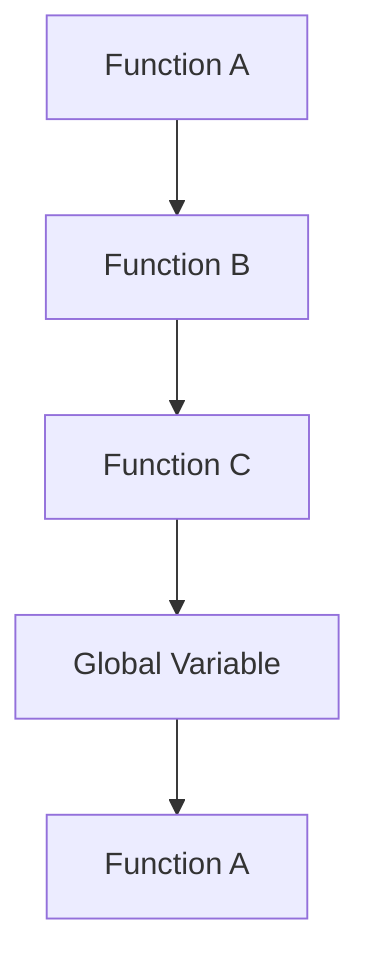
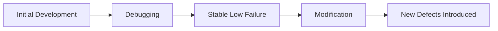
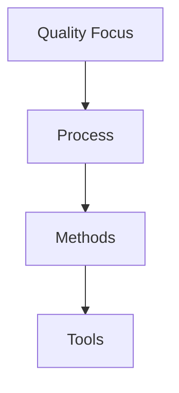
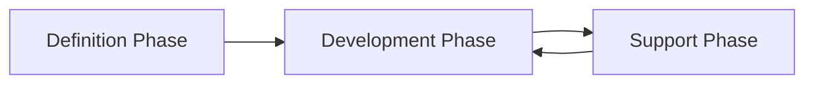
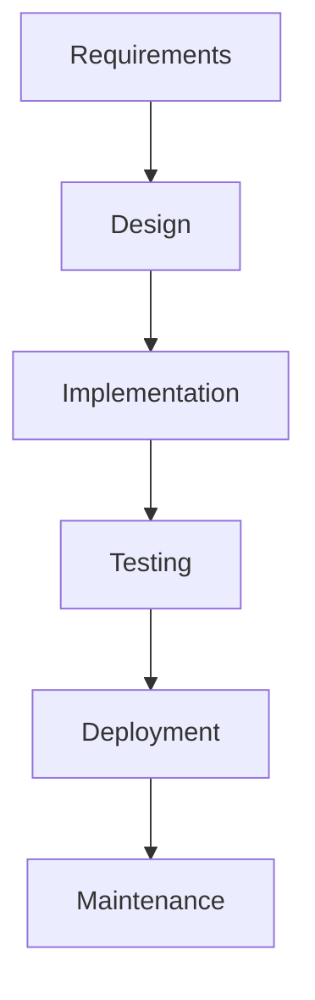
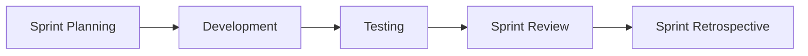
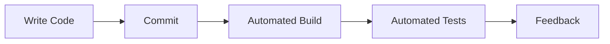
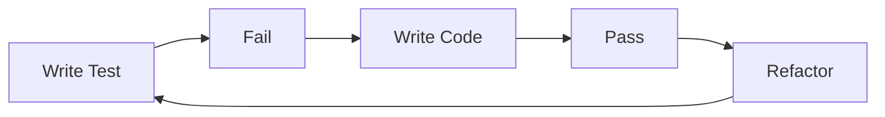
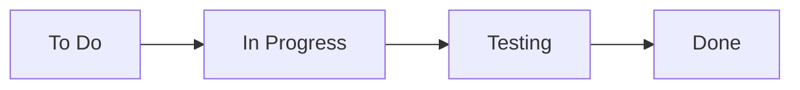

# Unit - 1
:::info[TITLE]
## INTRODUCTION
:::

---

## 1. Introduction to Software Engineering

---

### 1.1 Engineering Fundamentals

---

#### 1.1.1 Definition of Engineering

- Engineering is the **application of scientific knowledge, mathematics, and practical experience** to design and build systems that solve real-world problems.
- It involves:
    - Analysis
    - Design
    - Construction
    - Testing
    - Maintenance
- Engineering focuses on **efficiency, safety, reliability, and cost-effectiveness**.
- It transforms theoretical concepts into practical solutions.
- Core aspects:
    - Creativity
    - Optimization
    - Risk management
    - Problem-solving

Engineering is not just building — it is **designing under constraints** such as:

- Budget
- Time
- Resources
- Safety
- Performance

---

#### 1.1.2 Application of Science, Tools and Methods

Engineering uses:

- Scientific principles
- Mathematical modeling
- Analytical methods
- Technical tools

In practice, engineering involves:

- Requirements analysis
- Design modeling
- Simulation
- Testing procedures

Tools may include:

- Design software
- Programming languages
- Testing frameworks
- Project management systems

The key idea:

> Engineering applies structured knowledge using appropriate tools to achieve reliable solutions.
> 

---

#### 1.1.3 Cost-Effective Problem Solving

Engineering solutions must be:

- Technically sound
- Economically viable

Cost-effectiveness includes:

- Development cost
- Maintenance cost
- Operational cost
- Long-term sustainability

A solution is not good engineering if:

- It works but is too expensive
- It is efficient but difficult to maintain

Engineering seeks **optimal balance** between:

- Quality
- Performance
- Cost
- Time

---

### 1.2 Definition of Software Engineering

Software Engineering is:

> The systematic, disciplined, and quantifiable approach to the development, operation, and maintenance of software.
> 

It combines:

- Engineering principles
- Computer science
- Project management
- Quality assurance

Software engineering emerged due to:

- Increasing software complexity
- Software crisis (late 1960s)
- High failure rates of large projects

---

#### 1.2.1 Systematic Approach

A systematic approach means:

- Following structured processes
- Using defined methodologies
- Planning before coding

Includes:

- Requirements gathering
- Design documentation
- Testing strategies
- Version control

Software should not be written randomly — it must follow a defined process.

---

#### 1.2.2 Disciplined Development

Disciplined development ensures:

- Standards are followed
- Coding guidelines are maintained
- Documentation is produced
- Reviews are conducted

It avoids:

- Ad-hoc coding
- Uncontrolled changes
- Poor quality output

Discipline ensures:

- Predictability
- Reliability
- Maintainability

---

#### 1.2.3 Quantifiable Methods

Software engineering uses measurable metrics such as:

- Lines of Code (LOC)
- Function points
- Defect density
- Productivity rates
- Testing coverage
- Performance benchmarks

Quantification allows:

- Performance evaluation
- Cost estimation
- Risk assessment
- Quality control

Without measurement:

- Improvement is impossible
- Planning becomes inaccurate

---

#### 1.2.4 Development, Operation and Maintenance

Software engineering covers the entire lifecycle:

1. **Development**
    - Requirements
    - Design
    - Implementation
    - Testing
2. **Operation**
    - Deployment
    - User support
    - Monitoring
3. **Maintenance**
    - Bug fixes (Corrective)
    - Environment adaptation (Adaptive)
    - Enhancements (Perfective)
    - Code improvement (Preventive)

Maintenance often consumes:

- 60–80% of total software cost.

Software engineering ensures software remains:

- Reliable
- Scalable
- Maintainable
- Efficient throughout its life.

---

---

## 2. Changing Nature of Software

Software has evolved from simple standalone programs to complex, distributed, intelligent systems. Modern software must be:

- Scalable
- Secure
- Networked
- Adaptive
- Continuously updated

The nature of software changes due to:

- Technological advancement
- User expectations
- Internet expansion
- Cloud computing
- Artificial Intelligence

---

### 2.1 Categories of Software

Software can be categorized based on its purpose and usage environment.

---

#### 2.1.1 System Software

- Manages hardware and provides a platform for application software.
- Acts as an interface between hardware and user applications.
- Examples:
    - Operating Systems (Windows, Linux)
    - Device Drivers
    - Compilers
    - Assemblers
- Characteristics:
    - Performance-critical
    - Resource management
    - Close to hardware
- Highly optimized and often written in low-level languages.

System software ensures:

- Memory management
- Process scheduling
- File handling
- Security control

---

#### 2.1.2 Application Software

- Designed to help users perform specific tasks.
- Built on top of system software.
- Examples:
    - Word processors
    - Browsers
    - Accounting systems
    - Mobile apps
- Focus:
    - User interface
    - Business logic
    - Usability

Application software changes rapidly due to:

- Market demands
- User feedback
- Competitive features

---

#### 2.1.3 Engineering and Scientific Software

- Used for complex mathematical and scientific computations.
- High accuracy and precision required.
- Examples:
    - Simulation systems
    - CAD tools
    - Weather modeling
    - Space research software
- Often involves:
    - Numerical analysis
    - Statistical modeling
    - Algorithm optimization

Characteristics:

- Heavy computational processing
- Visualization tools
- High reliability requirements

---

#### 2.1.4 Embedded Software

- Software built into hardware devices.
- Controls machines and devices.
- Examples:
    - Washing machines
    - Automobiles
    - Medical equipment
    - IoT devices
- Characteristics:
    - Real-time operation
    - Limited memory and processing power
    - High reliability
- Often written in C/C++.

Embedded software must:

- Respond within strict time constraints
- Be highly efficient
- Operate with minimal resources

---

#### 2.1.5 Product-Line Software

- Designed for mass-market use.
- Built as a product rather than for a specific client.
- Examples:
    - Microsoft Office
    - Adobe Photoshop
    - Antivirus software
- Features:
    - Configurable options
    - Wide user base
    - Regular updates
- Emphasizes:
    - User experience
    - Scalability
    - Market competitiveness

---

#### 2.1.6 Web Applications

- Software accessed via web browsers.
- Runs on remote servers.
- Examples:
    - E-commerce websites
    - Online banking
    - Social media platforms
- Characteristics:
    - Client-server architecture
    - Cloud deployment
    - Continuous integration & deployment
- Must handle:
    - Large traffic
    - Security threats
    - Data privacy

Modern web applications:

- Use APIs
- Support mobile integration
- Operate globally

---

#### 2.1.7 Artificial Intelligence Software

- Software capable of learning, reasoning, and decision-making.
- Uses:
    - Machine learning
    - Neural networks
    - Natural language processing
- Examples:
    - Chatbots
    - Recommendation systems
    - Autonomous vehicles
    - Image recognition systems
- Characteristics:
    - Data-driven
    - Adaptive
    - Continuous improvement

AI software differs because:

- Behavior evolves over time
- Requires training datasets
- Needs large computational resources

---

#### Summary of Changing Nature

| Category | Focus | Key Feature |
| --- | --- | --- |
| System Software | Hardware control | Performance |
| Application Software | User tasks | Usability |
| Engineering Software | Scientific computation | Precision |
| Embedded Software | Device control | Real-time |
| Product-Line Software | Mass market | Scalability |
| Web Applications | Online access | Connectivity |
| AI Software | Intelligence | Learning capability |

---

Software today is:

- Distributed
- Data-driven
- Continuously evolving
- Highly interconnected

---

---

## 3. Legacy Software

Legacy software refers to **old software systems that are still in use but are difficult to maintain, modify, or extend**.

These systems often:

- Run critical business operations
- Use outdated technologies
- Lack proper documentation
- Are expensive to maintain

Despite their limitations, organizations continue using them because:

- Replacing them is costly
- They still function reliably
- Business processes depend on them

---

### 3.1 Characteristics of Legacy Systems

---

#### 3.1.1 Older Programs

- Developed using outdated programming languages or technologies.
- Examples:
    - COBOL systems in banks
    - Mainframe applications
- Often built decades ago.
- May run on obsolete hardware.

**Challenges:**

- Lack of modern compatibility
- Difficulty integrating with new systems
- Scarcity of skilled developers familiar with old technologies

---

#### 3.1.2 Poor Quality

- May not follow modern software engineering practices.
- Common issues:
    - High defect density
    - Poor modularity
    - Code duplication
- Lack of version control during development.

**Impact:**

- Increased maintenance cost
- Higher risk of failure
- Reduced system reliability

---

#### 3.1.3 Inextensible Design

- Designed without future scalability in mind.
- Tight coupling between components.
- Hard-coded configurations.

**Consequences:**

- Difficult to add new features
- Complex integration with modern systems
- Risk of breaking existing functionality

Legacy systems often lack:

- Modular architecture
- API interfaces
- Microservices structure

---

#### 3.1.4 Convoluted Code

- Code is complex, tangled, and difficult to understand.
- May contain:
    - Deep nesting
    - Spaghetti code
    - Global variable misuse
- Poor naming conventions.

**Example of Convoluted Structure (Conceptual):**

This creates:

- Circular dependencies
- Hard-to-trace logic
- Debugging difficulty

---

#### 3.1.5 Poor Documentation

- Missing or outdated documentation.
- No clear system design records.
- Developers must rely on reading code.

Types of missing documentation:

- Requirement specifications
- Design diagrams
- API documentation
- Test cases

**Impact:**

- Onboarding new developers becomes difficult
- Maintenance becomes slow and error-prone

---

#### 3.1.6 Testing Limitations

- Lack of automated testing.
- Minimal or no unit tests.
- Manual testing practices.

Common issues:

- No regression testing
- No test coverage metrics
- Limited test environments

**Result:**

- High risk during modifications
- Fear of changing code
- Increased technical debt

---

### Why Legacy Software Persists

Organizations continue using legacy systems because:

- They are mission-critical
- Migration is expensive
- Risk of business disruption

---

### Risks of Legacy Software

| Risk | Explanation |
| --- | --- |
| Security vulnerabilities | Outdated security patches |
| Performance issues | Inefficient architecture |
| Scalability problems | Not designed for growth |
| Integration difficulty | Poor API support |
| Knowledge loss | Experts retiring |

---

### Modern Approaches to Handle Legacy Systems

- Refactoring
- Re-engineering
- Wrapping with APIs
- Gradual migration
- System replacement

---

### Summary

Legacy software is:

- Old but operational
- Hard to maintain
- Expensive to modify
- Risky to replace

It represents a major challenge in software engineering because:

> Maintaining old systems is often more difficult than building new ones.
> 

---

---

## 4. Software Characteristics

Software differs fundamentally from hardware. Understanding its nature is essential in software engineering because many management, maintenance, and cost decisions depend on these characteristics.

---

### 4.1 Nature of Software

---

#### 4.1.1 Software is Developed, Not Manufactured

Unlike hardware, software is **engineered and developed**, not physically manufactured.

In hardware:

- Once designed, each additional unit has production cost.
- Manufacturing cost dominates.

In software:

- Development cost is high.
- Copying cost is nearly zero.
- No physical assembly line.

Key Differences:

| Hardware | Software |
| --- | --- |
| Manufactured repeatedly | Developed once |
| Per-unit production cost | Near-zero replication cost |
| Physical assembly | Logical construction |

Implication:

- Most cost lies in design, coding, testing, and maintenance.
- Software economics differ from traditional engineering economics.

---

#### 4.1.2 Software Does Not Wear Out

Hardware:

- Physically deteriorates over time.
- Follows a “bathtub curve.”

Software:

- Does not physically degrade.
- Fails due to:
    - Bugs
    - Design flaws
    - Environmental changes
    - Modifications

Software “ages” because:

- Requirements change.
- Patches introduce new defects.
- Complexity increases over time.

Thus:

> Software deteriorates due to changes, not usage.
> 

---

#### 4.1.3 Custom-Built Software

Historically:

- Software was custom-developed for specific clients.
- Each system built from scratch.

Characteristics:

- High development time
- High cost
- Unique architecture

Modern shift:

- More reusable frameworks
- Product-line software
- Libraries and APIs

However, many enterprise systems remain partially custom-built.

---

#### 4.1.4 Component-Based Assembly

Modern software increasingly uses:

- Prebuilt components
- Libraries
- APIs
- Frameworks

Instead of writing everything from scratch, developers:

- Assemble components
- Integrate modules
- Configure existing tools

Examples:

- Using authentication libraries
- Payment gateway APIs
- Database drivers

Advantages:

- Reduced development time
- Improved reliability
- Reuse of tested modules

Limitation:

- Dependency management complexity
- Compatibility issues

---

### 4.2 Failure Curves

Failure curves explain how systems fail over time.

---

#### 4.2.1 Hardware Failure Curve

[Image](https://www.researchgate.net/publication/272814973/figure/fig1/AS%3A669446318333958%401536619848221/Hardware-and-Software-Failures-Over-Time-1.ppm)

[Image](https://www.researchgate.net/publication/260360030/figure/fig1/AS%3A968031664619521%401607808142426/Typical-failure-rate-curve-as-a-function-of-time.ppm)

Hardware typically follows a **Bathtub Curve**:

Phases:

1. **Infant Mortality Phase**
    - Early failures due to manufacturing defects.
2. **Normal Life Phase**
    - Low, steady failure rate.
3. **Wear-Out Phase**
    - Failures increase due to physical aging.

This is called the bathtub curve because of its shape.

---

#### 4.2.2 Software Failure Curve

[Image](https://www.researchgate.net/publication/272814973/figure/fig1/AS%3A669446318333958%401536619848221/Hardware-and-Software-Failures-Over-Time-1.ppm)

Software does NOT follow bathtub behavior.

Initial phase:

- High failure rate (bugs present).

After debugging:

- Failure rate decreases significantly.

Key difference:

- No wear-out phase.
- Failure rate increases only if modifications introduce errors.

Thus:

> Software failures arise from design faults, not physical deterioration.
> 

---

#### 4.2.3 Idealized vs Actual Curve

**Idealized Curve:**

- After debugging, failure rate becomes almost zero.
- Stable over time if no changes made.

**Actual Curve:**

- Each modification may introduce new defects.
- Failure rate increases with poor maintenance.
- System complexity grows over time.

Conceptual comparison:

Reality:

- Software requires continuous maintenance.
- Without disciplined engineering, reliability declines.

---

### Summary of Software Characteristics

| Characteristic | Meaning |
| --- | --- |
| Developed, not manufactured | Cost concentrated in development |
| Does not wear out | Fails due to design changes |
| Custom-built | Designed for specific needs |
| Component-based | Built using reusable modules |

---

### Key Exam Points

- Software cost is mainly development and maintenance.
- Software does not physically degrade.
- Failure rate increases due to poor maintenance.
- Hardware and software failure curves are fundamentally different.

---

---

## 5. Software Applications

Software applications are developed to solve specific problems across different domains. Based on functionality and usage environment, applications are categorized into different types.

---

### 5.1 Types of Applications

---

#### 5.1.1 System Software

- Software that manages hardware and provides a platform for other software.
- Acts as an interface between user applications and hardware.
- Examples:
    - Operating Systems (Windows, Linux)
    - Compilers
    - Device Drivers
    - File Management Systems
- Responsibilities:
    - Memory management
    - Process scheduling
    - Resource allocation
    - Security control
- Typically performance-critical and system-level.

---

#### 5.1.2 Real-Time Software

- Software that must respond within a fixed time constraint.
- Correctness depends on both:
    - Logical result
    - Time at which result is produced

Types:

1. **Hard Real-Time**
    - Strict deadline
    - Failure unacceptable
    - Example: Air traffic control
2. **Soft Real-Time**
    - Some delay acceptable
    - Example: Video streaming

Characteristics:

- Deterministic response
- High reliability
- Low latency

---

#### 5.1.3 Business Software

- Used for commercial and organizational operations.
- Examples:
    - Payroll systems
    - Inventory management
    - Banking software
    - ERP systems
- Focus:
    - Data processing
    - Transaction handling
    - Reporting
- Requires:
    - Accuracy
    - Security
    - Scalability

---

#### 5.1.4 Engineering and Scientific Software

- Used for complex mathematical and scientific computations.
- Examples:
    - Simulation software
    - CAD systems
    - Weather forecasting models
- Characteristics:
    - Numerical computation
    - High precision
    - Graphical visualization
- Used in:
    - Research institutions
    - Space agencies
    - Manufacturing industries

---

#### 5.1.5 Embedded Software

- Integrated into hardware devices.
- Controls machine functions.
- Examples:
    - Microwave controllers
    - Automotive engine control units
    - Medical devices
- Characteristics:
    - Resource-constrained
    - Real-time processing
    - High reliability
- Often written in low-level languages.

---

#### 5.1.6 Personal Computer Software

- Designed for individual users.
- Runs on desktops or laptops.
- Examples:
    - Word processors
    - Media players
    - Graphic design tools
- Focus:
    - User interface
    - Ease of use
    - Performance
- Often commercial and product-based.

---

#### 5.1.7 Web-Based Software

- Applications accessed through web browsers.
- Runs on remote servers.
- Examples:
    - E-commerce websites
    - Online banking systems
    - Social media platforms
- Characteristics:
    - Client-server architecture
    - Internet-dependent
    - Continuous deployment
- Must handle:
    - Security threats
    - Scalability
    - Global users

---

#### 5.1.8 Artificial Intelligence Software

- Software capable of learning and decision-making.
- Uses:
    - Machine Learning
    - Neural Networks
    - Natural Language Processing
- Examples:
    - Chatbots
    - Recommendation systems
    - Autonomous vehicles
- Characteristics:
    - Data-driven
    - Adaptive behavior
    - Continuous improvement
- Requires large datasets and computational power.

---

### Summary Table

| Application Type | Primary Focus | Example |
| --- | --- | --- |
| System Software | Hardware management | OS |
| Real-Time Software | Time-bound response | Air traffic system |
| Business Software | Transaction processing | Banking |
| Engineering Software | Scientific computation | Simulation tools |
| Embedded Software | Device control | IoT devices |
| PC Software | Individual use | MS Word |
| Web-Based Software | Internet services | E-commerce |
| AI Software | Intelligent behavior | Chatbots |

---

---

## 6. Software Engineering as a Layered Technology

Software Engineering is described as a **layered technology** because it is built upon multiple structured layers, each supporting the one above it.

The layered approach ensures:

- Quality
- Discipline
- Consistency
- Continuous improvement

---

### 6.1 Layers of Software Engineering

[Image](https://images.openai.com/static-rsc-3/6APh5iPGP-yGtTRbB1gvEhjbcbMD4tC6PPEIfBVLse2iAPufri1KOi1kWyKUgpnslSPBy8DRVcWShhFmAxMr72Cs1DghLD_2ZdJi2OSM77g?purpose=fullsize&v=1)

[Image](https://imgv2-1-f.scribdassets.com/img/document/282948219/original/801f13cc98/1?v=1)

The four fundamental layers are:

1. **Quality Focus (Foundation)**
2. **Process**
3. **Methods**
4. **Tools**

The foundation is quality — everything else is built upon it.

---

#### 6.1.1 A Quality Focus

- The foundation of software engineering.
- Ensures that:
    - Standards are followed
    - Defects are minimized
    - Customer satisfaction is achieved
- Includes:
    - Quality assurance (QA)
    - Quality control (QC)
    - Reviews and audits
- Quality must be:
    - Planned
    - Managed
    - Measured
- Without quality focus:
    - Processes become ineffective
    - Products become unreliable

Key idea:

> Quality is not added later; it is built into every layer.
> 

---

#### 6.1.2 Process

- Defines the **framework for software development**.
- Provides structure and discipline.
- Describes:
    - Activities
    - Tasks
    - Milestones
    - Deliverables
- Examples:
    - Waterfall Model
    - Agile Model
    - Spiral Model

Process answers:

- What should be done?
- When should it be done?
- Who should do it?

A well-defined process ensures:

- Predictability
- Repeatability
- Controlled development

---

#### 6.1.3 Methods

- Provide **technical guidelines** for building software.
- Describe how to:
    - Perform requirements analysis
    - Design system architecture
    - Write code
    - Conduct testing
- Examples:
    - UML modeling
    - Data flow diagrams
    - Design patterns
    - Testing strategies

Methods translate process activities into actionable techniques.

---

#### 6.1.4 Tools

- Provide automated or semi-automated support.
- Help implement methods efficiently.
- Examples:
    - IDEs (PyCharm)
    - Version control (Git)
    - Testing frameworks
    - CI/CD tools
    - CASE tools

Tools improve:

- Productivity
- Accuracy
- Speed

But important:

> Tools alone cannot ensure quality without proper process and methods.
> 

---

### Relationship Between Layers

- Quality supports Process.
- Process defines how Methods are applied.
- Methods are supported by Tools.

---

### Key Exam Points

- Software engineering is layered technology.
- Quality is the foundation.
- Process provides structure.
- Methods provide technical solutions.
- Tools provide automation.
- All layers must work together.

---

---

## 7. Generic View of Software Engineering

The **Generic View of Software Engineering** describes software development as a set of structured phases that span the entire life cycle of a system.

It divides software engineering into three major phases:

1. Definition Phase
2. Development Phase
3. Support Phase

This model emphasizes that software engineering is not only about coding but also about planning, analysis, and long-term maintenance.

---

### 7.1 Phases of Software Engineering

---

#### 7.1.1 Definition Phase

The Definition Phase focuses on understanding **what** needs to be built.

Primary objectives:

- Identify customer requirements
- Define system scope
- Analyze feasibility
- Estimate cost and time

---

#### 7.1.1.1 System/Information Engineering

- Concerned with the overall system architecture.
- Defines how software interacts with:
    - Hardware
    - Databases
    - External systems
- Focuses on system-level requirements.

Activities include:

- Requirement gathering
- System modeling
- Identifying constraints

It ensures that:

- The software fits into the larger system environment.
- Interfaces are properly defined.

---

#### 7.1.1.2 Software Project Planning

- Establishes a roadmap for development.
- Defines:
    - Budget
    - Schedule
    - Resource allocation
    - Risk management

Planning answers:

- How long will it take?
- How much will it cost?
- Who will work on it?

Includes:

- Cost estimation
- Timeline creation
- Team assignment
- Risk analysis

Effective planning reduces:

- Delays
- Budget overruns
- Project failure

---

#### 7.1.1.3 Requirements Analysis

- Detailed study of user needs.
- Produces:
    - Software Requirement Specification (SRS)

Types of requirements:

1. Functional Requirements
2. Non-Functional Requirements

Activities:

- Interviews
- Surveys
- Prototyping
- Feasibility study

Importance:

> Incorrect requirements lead to project failure.
> 

---

#### 7.1.2 Development Phase

The Development Phase focuses on **building the software**.

---

#### 7.1.2.1 Software Design

Transforms requirements into:

- System architecture
- Module structure
- Interface design
- Data structures

Types of design:

1. High-Level Design (HLD)
2. Low-Level Design (LLD)

Design ensures:

- Modularity
- Scalability
- Maintainability

Good design reduces:

- Complexity
- Future maintenance cost

---

#### 7.1.2.2 Code Generation

- Actual implementation of the design.
- Converts design into programming language instructions.
- Follows coding standards.
- Uses version control systems.

Key aspects:

- Readability
- Efficiency
- Error handling
- Security practices

Poor coding leads to:

- High defect rate
- Maintenance difficulty

---

#### 7.1.2.3 Software Testing

- Verifies that the software works correctly.
- Identifies defects before deployment.

Levels of testing:

1. Unit Testing
2. Integration Testing
3. System Testing
4. Acceptance Testing

Testing ensures:

- Functional correctness
- Performance validation
- Security compliance

Testing reduces:

- Post-deployment failures
- Customer dissatisfaction

---

#### 7.1.3 Support Phase

After deployment, software enters the Support Phase.

This phase focuses on maintaining and improving the software.

---

#### 7.1.3.1 Corrective Maintenance

- Fixing errors discovered after deployment.
- Example:
    - Bug fixes
    - Security patches

Occurs due to:

- Missed defects
- Runtime errors

---

#### 7.1.3.2 Adaptive Maintenance

- Modifying software to adapt to new environments.
- Example:
    - OS upgrades
    - Hardware changes
    - Regulatory changes

Ensures compatibility with changing systems.

---

#### 7.1.3.3 Perfective Maintenance

- Enhancing system performance.
- Adding new features.
- Improving usability.

Driven by:

- Customer feedback
- Market competition

---

#### 7.1.3.4 Preventive Maintenance

- Improving maintainability.
- Refactoring code.
- Updating documentation.
- Reducing technical debt.

Prevents future problems.

---

### Overall Phase Flow

Maintenance often feeds back into development for updates and improvements.

---

### Key Points for Exams

- Software engineering has three major phases.
- Definition focuses on requirements and planning.
- Development focuses on design, coding, and testing.
- Support focuses on maintenance.
- Maintenance consumes a large portion of total software cost.

---

---

## 8. Process Models

Process models define the structured approach used to develop software. They provide a framework for planning, executing, and controlling software development activities.

---

### 8.1 Overview of Process Models

A **process model** describes how software is developed in a systematic way.

It defines:

- Activities
- Tasks
- Milestones
- Deliverables
- Workflow

Common Process Models:

- Waterfall Model
- Spiral Model
- Incremental Model
- V-Model
- Agile Model

Purpose:

- Provide discipline
- Reduce risk
- Improve quality
- Enable predictable development

General Flow of Process Models:

Different models vary in how these stages are organized.

---

### 8.2 Agile Process Model

Agile is a modern software development approach emphasizing:

- Flexibility
- Customer collaboration
- Rapid delivery
- Adaptability

Unlike traditional models, Agile supports:

- Frequent changes
- Short development cycles
- Continuous feedback

---

#### 8.2.1 Agility Concept

Agility means:

- Ability to respond quickly to change.
- Flexibility in requirements.
- Adaptation to evolving needs.

Agile focuses on:

- Customer collaboration
- Working software
- Iterative improvement

Agility reduces:

- Risk of failure
- Misalignment with customer needs

---

#### 8.2.2 Iterative Development

Agile divides development into small iterations.

Each iteration includes:

- Planning
- Design
- Coding
- Testing

Instead of delivering at the end of the project, Agile delivers small increments regularly.

Benefits:

- Early detection of issues
- Regular feedback
- Continuous improvement

---

#### 8.2.3 Sprints (1–4 Weeks)

A sprint is:

- A fixed-duration iteration.
- Typically lasts 1 to 4 weeks.

During a sprint:

- A set of features is completed.
- Work is not changed mid-sprint.
- Deliverable must be functional.

Sprint Cycle:

After each sprint:

- Product increment is delivered.
- Feedback is gathered.

---

#### 8.2.4 Continuous Feedback

Agile emphasizes:

- Constant communication with stakeholders.
- Frequent demonstrations.
- Customer involvement throughout development.

Feedback sources:

- Sprint review meetings
- User testing
- Stakeholder input

Advantages:

- Requirements clarification
- Early problem detection
- Improved product alignment

---

### 8.3 Agile Manifesto

The Agile Manifesto defines 12 principles guiding Agile development.

---

#### 8.3.1 Customer Satisfaction

- Highest priority is satisfying the customer.
- Deliver valuable software early and continuously.

---

#### 8.3.2 Welcoming Changing Requirements

- Even late changes are welcomed.
- Agile adapts to change instead of resisting it.

---

#### 8.3.3 Frequent Delivery

- Deliver working software frequently.
- Short delivery cycles improve trust.

---

#### 8.3.4 Collaboration

- Business people and developers must work together daily.
- Collaboration improves clarity and productivity.

---

#### 8.3.5 Motivated Individuals

- Projects built around motivated people.
- Provide support and trust.

Motivation improves:

- Productivity
- Quality
- Innovation

---

#### 8.3.6 Face-to-Face Communication

- Most effective communication method.
- Reduces misunderstandings.

---

#### 8.3.7 Working Software as Measure

- Primary measure of progress is working software.
- Documentation alone is not sufficient.

---

#### 8.3.8 Sustainable Development

- Maintain constant pace indefinitely.
- Avoid burnout.

---

#### 8.3.9 Technical Excellence

- Continuous attention to:
    - Good design
    - Code quality
    - Best practices

Improves agility.

---

#### 8.3.10 Simplicity

- Maximize the amount of work not done.
- Avoid unnecessary features.

---

#### 8.3.11 Self-Organizing Teams

- Teams decide how to accomplish tasks.
- Encourages innovation and ownership.

---

#### 8.3.12 Continuous Improvement

- Regular reflection on:
    - Performance
    - Process
    - Efficiency
- Teams adjust behavior accordingly.

---

### Summary

Agile Process Model:

- Iterative
- Flexible
- Customer-focused
- Feedback-driven

Agile Manifesto emphasizes:

- People over processes
- Working software over documentation
- Collaboration over contracts
- Responding to change over rigid planning

---

### 8.4 Agile Frameworks

Agile frameworks provide structured ways to implement Agile principles in real-world projects. The most popular frameworks include:

- Extreme Programming (XP)
- Scrum
- Kanban

Each framework emphasizes collaboration, flexibility, and continuous improvement but applies them differently.

---

#### 8.4.1 Extreme Programming (XP)

Extreme Programming (XP) is an Agile framework focused on:

- High-quality code
- Technical excellence
- Frequent releases
- Customer involvement

XP is especially useful when:

- Requirements change frequently
- Project risk is high
- High reliability is required

---

**8.4.1.1 Pair Programming**

- Two developers work together on one workstation.
- Roles:
    - Driver → Writes code
    - Navigator → Reviews and suggests improvements
- They switch roles frequently.

Benefits:

- Fewer defects
- Better design decisions
- Knowledge sharing
- Improved team collaboration

Reduces:

- Bugs
- Dependency on a single developer

---

**8.4.1.2 Continuous Integration**

- Code is integrated into the main repository frequently.
- Automated builds and tests run after each integration.

Purpose:

- Detect errors early
- Avoid integration conflicts
- Maintain stable codebase

Typical Flow:

Prevents:

- “Integration hell”
- Large-scale merge conflicts

---

**8.4.1.3 Test-Driven Development (TDD)**

TDD follows this cycle:

1. Write a test
2. Run test (fail)
3. Write code to pass test
4. Refactor

Cycle:

Advantages:

- Higher code quality
- Clear requirements
- Reduced debugging

---

**8.4.1.4 Core Values of XP**

XP is based on five core values:

1. Communication
2. Simplicity
3. Feedback
4. Courage
5. Respect

These values guide team behavior and decision-making.

---

#### 8.4.2 Scrum Framework

Scrum is the most widely used Agile framework.

It organizes work into:

- Time-boxed sprints
- Clearly defined roles
- Structured events

---

**8.4.2.1 Roles**

Scrum defines three main roles:

**1. Product Owner**

- Represents customer
- Manages product backlog
- Prioritizes features

**2. Scrum Master**

- Facilitates process
- Removes obstacles
- Ensures Scrum rules followed

**3. Development Team**

- Cross-functional team
- Delivers working increments
- Self-organizing

---

**8.4.2.2 Sprint Planning**

- Conducted at start of sprint.
- Team selects items from product backlog.
- Defines sprint goal.

Outcome:

- Sprint Backlog
- Clear sprint objectives

---

**8.4.2.3 Daily Stand-ups**

- 15-minute daily meeting.
- Each member answers:
    1. What did I do yesterday?
    2. What will I do today?
    3. Any obstacles?

Purpose:

- Improve transparency
- Identify blockers early
- Maintain accountability

---

**8.4.2.4 Sprint Review**

- Conducted at end of sprint.
- Team demonstrates working software.
- Stakeholders provide feedback.

Focus:

- Product increment
- Customer satisfaction

---

**8.4.2.5 Sprint Retrospective**

- Team reflects on sprint performance.
- Discusses:
    - What went well?
    - What can improve?
- Focus on process improvement.

Encourages:

- Continuous improvement
- Team growth

---

#### 8.4.3 Kanban Framework

Kanban focuses on:

- Visual workflow
- Continuous delivery
- Work optimization

Unlike Scrum:

- No fixed-length sprints
- Work flows continuously

---

**8.4.3.1 Visual Workflow**

Work is visualized using a Kanban board:

Benefits:

- Transparency
- Clear task status
- Bottleneck identification

---

**8.4.3.2 Work-in-Progress Limits**

- Limits number of tasks in progress.
- Prevents overload.
- Improves focus.

Example:

- Maximum 3 tasks in “In Progress” column.

Purpose:

- Reduce multitasking
- Improve quality

---

**8.4.3.3 Continuous Flow**

- Tasks move continuously.
- No fixed iteration boundaries.
- Work pulled based on capacity.

Advantages:

- Faster delivery
- Flexible workflow

---

**8.4.3.4 Feedback Loops**

- Regular performance review.
- Identify bottlenecks.
- Improve workflow efficiency.

Feedback ensures:

- Process optimization
- Reduced delays
- Continuous enhancement

---

### Comparison of Agile Frameworks

| Feature | XP | Scrum | Kanban |
| --- | --- | --- | --- |
| Focus | Technical excellence | Structured team management | Workflow optimization |
| Iterations | Short cycles | Fixed sprints | Continuous flow |
| Roles | Flexible | Defined roles | Flexible |
| WIP Limits | No strict rule | Sprint-based | Strict WIP limits |
| Best For | High code quality | Team coordination | Continuous delivery |

---

---