# Unit - 2

:::info[TITLE]
## Software Project Management
:::
---

## 1. Software Project Management

Software Project Management (SPM) deals with planning, organizing, directing, and controlling software development activities to achieve project objectives within defined constraints.

Software projects are unique because:

- Requirements frequently change
- Estimation is difficult
- Technology evolves rapidly
- Human factors strongly influence outcomes

---

### 1.1 Introduction to Software Project Management

Software Project Management combines:

- Software Engineering principles
- Management techniques
- Risk control strategies
- Planning and scheduling methods

Unlike traditional engineering projects, software projects are:

- Intangible
- Highly complex
- Dependent on intellectual effort

The goal of SPM is to deliver:

- The right product
- At the right time
- Within budget
- With acceptable quality

---

#### 1.1.1 Definition of Software Project Management

Software Project Management is:

> The process of planning, organizing, leading, and controlling software development activities to achieve defined objectives within time, cost, and quality constraints.
> 

Key Components:

1. Planning
2. Scheduling
3. Resource Allocation
4. Risk Management
5. Monitoring & Control

A software project has:

- Start and end date
- Defined scope
- Specific deliverables
- Budget constraints

Unlike operations, a project is temporary and unique.

---

#### 1.1.2 Importance of Management in Software Engineering

Software development without management leads to:

- Missed deadlines
- Budget overruns
- Poor quality
- Team conflicts

Management ensures:

1. Clear Objectives
2. Proper Resource Utilization
3. Controlled Development Process
4. Risk Identification
5. Stakeholder Communication

Reasons management is critical in software:

- High complexity
- Uncertain requirements
- Rapid technological change
- Large team coordination

Well-managed projects:

- Reduce failure rates
- Improve productivity
- Increase customer satisfaction

---

#### 1.1.3 Challenges in Software Projects

Software projects face unique challenges:

1. Changing Requirements
    - Clients modify expectations
    - Scope creep occurs
2. Estimation Difficulty
    - Hard to estimate time and cost
    - Intangible work
3. Technological Risks
    - New tools
    - Unproven technologies
4. Communication Issues
    - Large distributed teams
    - Misinterpretation of requirements
5. Resource Constraints
    - Limited skilled personnel
    - Budget limitations
6. Risk Management Complexity
    - Security threats
    - Performance issues
    - Integration failures
7. Team Management Problems
    - Motivation
    - Conflict
    - Skill gaps

---

#### Common Causes of Project Failure

- Poor requirement analysis
- Unrealistic deadlines
- Lack of stakeholder involvement
- Inadequate testing
- Weak leadership

---

### Key Points for Exams

- Software Project Management ensures controlled development.
- It balances scope, cost, time, and quality.
- Software projects are more complex than traditional engineering projects.
- Management is essential to reduce project risk and failure.

---

---

## 2. Management Spectrum

The Management Spectrum identifies the four major dimensions that must be managed effectively in software engineering: People, Product, Process, and Project.

---

### 2.1 The 4 Ps of Software Engineering

The 4 Ps represent the core management focus areas in software development.

---

#### 2.1.1 People

- Most critical factor in software development.
- Software is built by skilled professionals.
- Productivity and quality depend heavily on team capability and motivation.

Without competent people, even the best process fails.

---

#### 2.1.2 Product

- Refers to the software system being developed.
- Must be clearly defined before development begins.
- Includes scope, requirements, objectives, and constraints.

Unclear product definition leads to scope creep and rework.

---

#### 2.1.3 Process

- Framework used to develop the software.
- Defines activities, tasks, standards, and quality controls.
- Ensures disciplined and repeatable development.

Process provides structure and reduces risk.

---

#### 2.1.4 Project

- Concerned with planning and controlling development.
- Includes scheduling, cost estimation, monitoring, and risk management.

Project management ensures delivery within time and budget constraints.

---

### 2.2 People

People are the most important asset in software engineering. Effective management of human resources determines project success.

---

#### 2.2.1 Key Roles in Software Projects

**2.2.1.1 Project Manager**

- Plans and schedules project activities.
- Allocates resources.
- Manages risks.
- Communicates with stakeholders.
- Monitors progress and ensures deadlines are met.

Requires leadership, communication, and decision-making skills.

---

**2.2.1.2 Software Engineers / Developers**

- Design system architecture.
- Write and maintain code.
- Implement features.
- Fix defects.

They convert requirements into working software.

---

**2.2.1.3 Test Engineers**

- Design and execute test cases.
- Identify and report defects.
- Validate system performance.

Ensure software reliability and quality before release.

---

**2.2.1.4 Business Analysts**

- Gather and document requirements.
- Prepare Software Requirement Specifications (SRS).
- Bridge gap between clients and technical team.

Ensure clarity and alignment of business needs.

---

**2.2.1.5 Stakeholders & Clients**

- Provide requirements and feedback.
- Approve deliverables.
- Influence project direction.

Active involvement reduces misunderstanding and rework.

---

#### 2.2.2 Characteristics of Effective Teams

Effective teams significantly improve project outcomes.

---

**2.2.2.1 Clear Communication**

- Regular meetings and updates.
- Transparent documentation.
- Open discussion channels.

Prevents misunderstanding and project delays.

---

**2.2.2.2 Technical Competence**

- Skilled professionals with relevant expertise.
- Continuous learning culture.

Improves productivity and software quality.

---

**2.2.2.3 Motivation and Commitment**

- Dedicated team members meet deadlines efficiently.
- Motivated teams produce better quality work.

Encouraged through recognition and positive work environment.

---

**2.2.2.4 Leadership and Collaboration**

- Strong leadership guides project direction.
- Collaboration promotes idea sharing and teamwork.

Reduces conflicts and improves efficiency.

---

**2.2.2.5 Team Selection and Training**

- Proper recruitment based on required skills.
- Ongoing training programs.

Ensures adaptability to new technologies.

---

**2.2.2.6 Conflict Resolution**

- Identifying causes of conflict early.
- Encouraging open communication.
- Fair mediation by leadership.

Maintains team harmony and productivity.

---

**2.2.2.7 Performance Evaluation**

- Regular performance reviews.
- Use of measurable metrics.
- Constructive feedback.

Improves team growth and accountability.

---

### 2.3 Product

Product refers to the software system that is being developed.

Clear definition of the product is essential before starting development.

---

#### 2.3.1 Understanding Product Scope

Product scope defines:

- What features will be included.
- What is excluded.
- System boundaries.

Clear scope prevents scope creep and confusion.

---

#### 2.3.2 Identifying Software Requirements

Requirements include:

- Functional Requirements
- Non-Functional Requirements

Methods for identifying requirements:

- Interviews
- Surveys
- Workshops
- Prototyping

Accurate requirement identification reduces rework and project risk.

---

#### 2.3.3 Defining Product Objectives

Objectives describe:

- Business goals.
- Expected performance.
- System outcomes.

Clear objectives guide development decisions and success measurement.

---

#### 2.3.4 Estimating Size and Complexity

Estimation helps determine:

- Effort required.
- Cost.
- Development time.

Common techniques:

- Lines of Code (LOC)
- Function Point Analysis
- Use Case Points

Complexity depends on:

- Number of modules
- Integration requirements
- Security needs
- Performance constraints

Accurate estimation improves planning and risk management.

---

#### 2.3.5 Effort Estimation Techniques

Effort estimation techniques are used to predict the amount of work, time, and resources required to develop software.

Accurate estimation helps in:

* Project planning
* Budget allocation
* Resource management
* Risk reduction

---

**2.3.5.1 Expert Judgment**

* Based on the experience of skilled professionals.
* Experts estimate effort using knowledge from previous projects.

**Advantages:**

* Quick and easy
* Useful when historical data is limited

**Limitations:**

* Subjective
* Depends on expert accuracy

---

**2.3.5.2 Work Breakdown Structure (WBS)**

* The project is divided into smaller tasks or modules.
* Each task is estimated individually.

**Steps:**

1. Break project into components
2. Estimate effort for each task
3. Combine estimates

**Advantages:**

* More accurate estimation
* Easy to manage complex projects

---

**2.3.5.3 Use Case Point (UCP)**

* Based on number and complexity of use cases.
* Estimates effort using user interactions.

**Advantages:**

* Useful for object-oriented systems
* Based on functional requirements

---

**2.3.5.4 Function Point Analysis (FPA)**

* Measures software size based on functionality.
* Independent of programming language.

**Components:**

* External Inputs (EI)
* External Outputs (EO)
* External Queries (EQ)
* Internal Logical Files (ILF)
* External Interface Files (EIF)

---

**2.3.5.5 COCOMO Model**

* Algorithmic model used for cost estimation.
* Based on software size (KLOC).

**Types:**

* Basic COCOMO
* Intermediate COCOMO
* Detailed COCOMO

Used to estimate:

* Effort
* Development time
* Cost

---

### 2.4 Process

Process defines the structured framework used to build software in a disciplined and predictable manner.

---

#### 2.4.1 Definition of Software Process

A software process is:

> A set of activities, methods, practices, and transformations that people use to develop and maintain software.
> 

It defines:

- What activities must be performed
- In what order
- By whom
- With what deliverables

A defined process ensures:

- Repeatability
- Predictability
- Quality control
- Reduced project risk

---

#### 2.4.2 Process Management Activities

Process management ensures that the selected process is properly implemented and continuously improved.

---

**2.4.2.1 Selecting Process Model**

The choice of model depends on:

- Project size
- Risk level
- Requirement stability
- Customer involvement

Examples:

- Waterfall → Stable requirements
- Spiral → High-risk projects
- Agile → Dynamic requirements

---

**2.4.2.2 Defining Activities and Milestones**

Activities:

- Requirements gathering
- Design
- Coding
- Testing
- Deployment

Milestones:

- Requirement approval
- Design completion
- Prototype ready
- Product release

Process Flow Example:

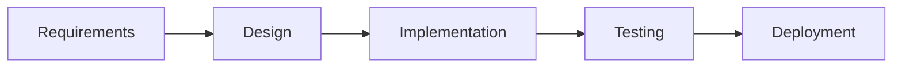

---

**2.4.2.3 Ensuring Process Compliance**

Compliance ensures:

- Standards are followed
- Documentation is maintained
- Reviews are conducted

Methods:

- Audits
- Code reviews
- Process checklists
- Quality assurance reviews

---

**2.4.2.4 Continuous Process Improvement**

Process must evolve to improve efficiency.

Approaches:

- Collect feedback
- Analyze defects
- Refine development steps
- Implement automation

Improvement Cycle:

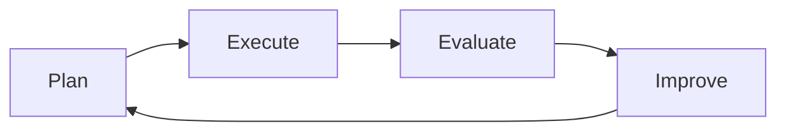

---

#### 2.4.3 Common Process Models

---

**2.4.3.1 Waterfall Model**

Sequential development model.

Phases do not overlap.

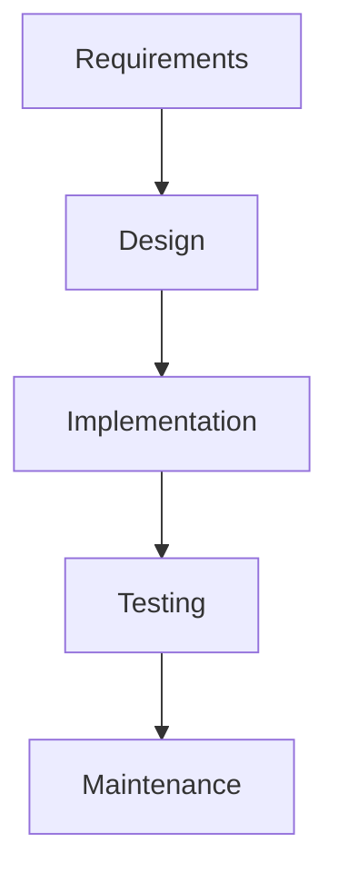

Suitable when:

- Requirements are stable
- Risk is low

Limitation:

- Difficult to accommodate changes

---

**2.4.3.2 Incremental Model**

Software developed in increments.

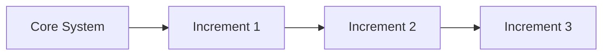

Advantages:

- Early delivery
- Flexible
- Reduced risk

---

**2.4.3.3 Spiral Model**

Risk-driven model.

Each cycle includes:

- Planning
- Risk analysis
- Engineering
- Evaluation

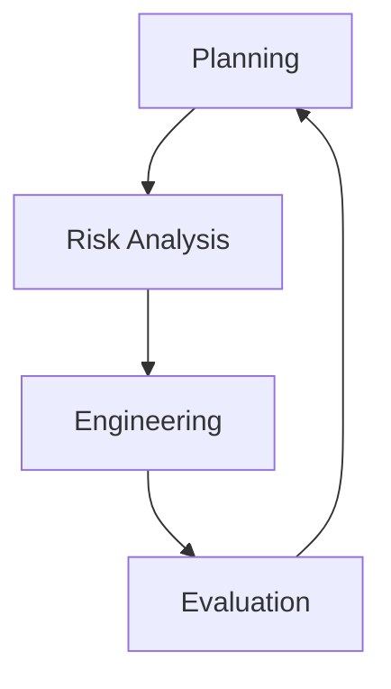

Suitable for:

- Large and complex systems
- High-risk projects

---

**2.4.3.4 Agile Models (Scrum, XP)**

Iterative and incremental.

Short development cycles (Sprints).

Best for:

- Dynamic requirements
- Customer involvement

---

#### 2.4.4 Importance of Process

A well-defined process:

- Improves quality
- Reduces risk
- Ensures consistency
- Enables predictability

Without process:

- Development becomes chaotic
- Deadlines slip
- Quality declines

Process provides discipline and control.

---

### 2.5 Project

A project is a temporary effort undertaken to create a unique product.

---

#### 2.5.1 Definition of Project

A software project:

- Has defined objectives
- Has start and end dates
- Operates under constraints
- Produces specific deliverables

Projects differ from operations because:

- They are temporary
- They are unique

---

#### 2.5.2 Project Management Activities

---

**2.5.2.1 Project Planning**

Planning defines:

- Scope
- Timeline
- Resources
- Budget

---

**2.5.2.2 Cost Estimation**

Estimation methods:

Explanation of Estimation Methods:

- Expert Judgment
  - Based on experience of experts from similar projects.
  - Quick but subjective.

- Function Point Analysis (FPA)
  - Estimates size based on functionality.
  - Uses inputs, outputs, files, and interactions.

- COCOMO Model
  - Uses KLOC (thousands of lines of code).
  - Provides effort estimation using formula:

  $$\text{Effort } (E) = a \times \text{KLOC}^{b}$$

  Where:
  - E = Effort in person-months
  - KLOC = Thousands of lines of code
  - a, b = constants based on project type

Purpose:

- Predict budget
- Prevent overruns

---

**2.5.2.3 Scheduling**

Defines task order and duration.

Example Gantt Chart:

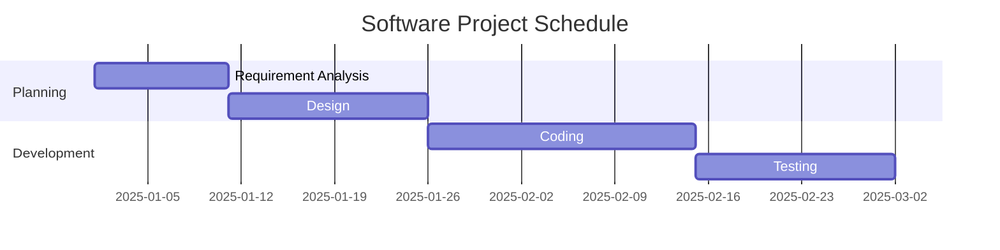

---

**2.5.2.4 Risk Management**

Risk management includes:

- Risk identification
- Risk analysis
- Risk mitigation
- Risk monitoring

Example Risk Flow:

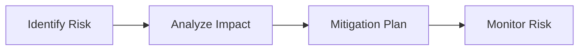

---

**2.5.2.5 Monitoring and Control**

Monitoring ensures:

- Project stays on schedule
- Budget remains controlled
- Quality standards maintained

Activities:

- Status reporting
- Performance measurement
- Corrective actions

---

#### 2.5.3 Project Constraints

Known as the **Triple Constraint**.

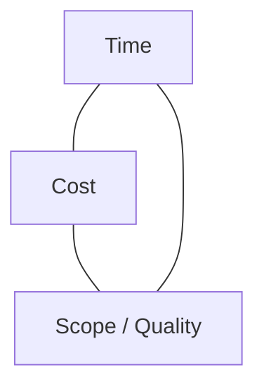

---

**2.5.3.1 Time**

- Project deadline
- Delivery schedule

---

**2.5.3.2 Cost**

- Budget
- Resource expenses

---

**2.5.3.3 Scope / Quality**

- Features included
- Performance expectations

If one constraint changes, others are affected.

---

#### 2.5.4 Project Management Tools

---

**2.5.4.1 Gantt Charts**

- Visual representation of project timeline
- Shows task durations and dependencies

(Example shown above)

---

**2.5.4.2 PERT / CPM**

Used for scheduling and critical path analysis.

PERT Example:

Critical Path:

- Longest path in project
- Determines minimum completion time

---

**2.5.4.3 Project Management Software (e.g., JIRA)**

Tools help in:

- Task tracking
- Sprint management
- Issue reporting
- Progress monitoring

Examples:

- JIRA
- Trello
- Microsoft Project

---

---

## 3. Integration of 4 Ps

The 4 Ps — **People, Product, Process, and Project** — are not independent elements. They are interrelated and must work together for successful software development.

Failure in one P directly affects the others.

The integration of 4 Ps ensures:

- Balanced development
- Controlled execution
- High-quality outcomes
- Reduced project risk

---

### 3.1 Relationship Among People, Product, Process, and Project

The interaction can be understood as a chain of responsibility and control.

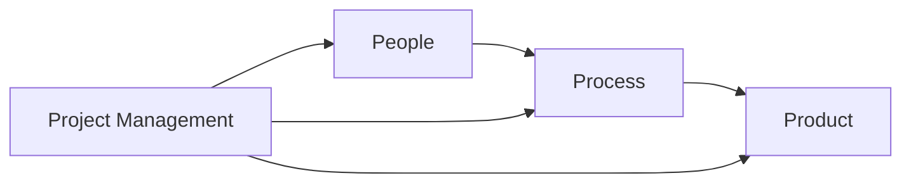

Explanation:

- People execute the Process.
- Process produces the Product.
- Project Management controls and coordinates everything.

---

#### 3.1.1 People Execute the Process

- People are the driving force behind the software process.
- Even the best process fails without skilled and motivated individuals.
- Developers, testers, and analysts apply process guidelines to perform tasks.

Examples:

- Developers follow coding standards.
- Testers follow defined testing procedures.
- Analysts follow requirement gathering frameworks.

Key Idea:

> Process is only effective when properly executed by competent people.
> 

Impact:

- Poorly trained teams → process breakdown
- Lack of communication → inconsistent execution

Thus, team capability directly influences process effectiveness.

---

#### 3.1.2 Process Builds the Product

- The product is the outcome of executing the defined process.
- A structured process ensures:
    - Clear requirements
    - Well-designed architecture
    - Proper testing
    - Quality assurance

If process is weak:

- Product quality suffers.
- Defects increase.
- Rework becomes frequent.

Example:

- Skipping testing phase → unreliable product.
- Poor requirement analysis → incorrect functionality.

Key Idea:

> A disciplined process transforms requirements into a reliable product.
> 

---

#### 3.1.3 Project Management Ensures Control

Project management provides oversight and control over:

- People
- Process
- Product

It ensures:

- Deadlines are met
- Budget is maintained
- Scope remains controlled
- Risks are managed

Project management activities:

- Monitoring progress
- Allocating resources
- Handling risks
- Communicating with stakeholders

Without project control:

- Scope creep occurs
- Costs increase
- Deadlines slip

Key Idea:

> Project management integrates and controls People and Process to deliver the desired Product.
> 

---

### Summary of Integration

| Element | Role | Dependency |
| --- | --- | --- |
| People | Execute tasks | Must follow process |
| Process | Framework for development | Produces product |
| Product | Final output | Depends on process quality |
| Project | Control mechanism | Coordinates all |

---

### Overall Understanding

The 4 Ps must function as a unified system:

- Skilled People
- Clear Product definition
- Structured Process
- Controlled Project management

Balanced integration leads to:

- Predictable delivery
- High-quality software
- Reduced project risk

---

---

## 4. W5HH Principle

The **W5HH Principle** is a structured questioning technique used in software project planning and management. It was proposed to ensure that all critical aspects of a project are clearly understood before development begins.

W5HH stands for:

- Why
- What
- When
- Who
- Where
- How
- How Much

It helps managers ask the right questions before committing resources.

---

### 4.1 Introduction to W5HH

The W5HH principle provides a framework for:

- Clarifying objectives
- Defining scope
- Planning execution
- Estimating cost
- Assigning responsibility

It ensures that:

- No critical factor is overlooked
- Project ambiguity is minimized
- Stakeholders are aligned

W5HH is particularly useful during:

- Project initiation
- Feasibility study
- Proposal preparation
- Planning phase

---

### 4.2 The 5 W’s

The first five questions focus on defining and understanding the project clearly.

---

#### 4.2.1 Why (Purpose of System)

This question identifies:

- The business need
- The problem being solved
- The expected benefits

It answers:

- Why is the system being developed?
- What value will it provide?

Examples:

- Improve operational efficiency
- Reduce costs
- Increase customer satisfaction

Without a clear “Why”:

- Projects lose direction
- Objectives become unclear

---

#### 4.2.2 What (System Functionality)

Defines:

- What the system should do
- Features and services provided
- Functional requirements

Includes:

- System capabilities
- Inputs and outputs
- Performance expectations

Clear definition of “What” prevents:

- Scope creep
- Requirement confusion

---

#### 4.2.3 When (Schedule & Timeline)

Determines:

- Project deadlines
- Milestones
- Delivery schedule

Includes:

- Start date
- Completion date
- Intermediate deliverables

Example timeline:

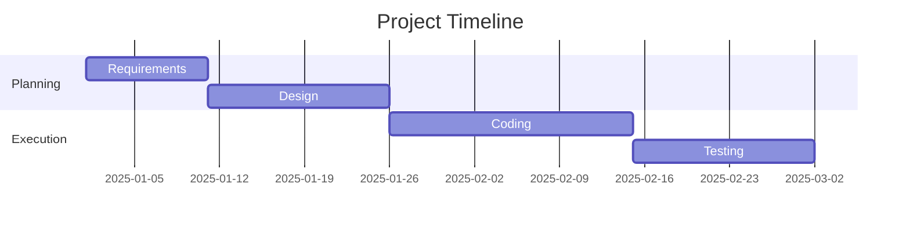

Proper scheduling ensures:

- Timely delivery
- Resource planning
- Milestone tracking

---

#### 4.2.4 Who (Roles & Responsibilities)

Identifies:

- Project manager
- Developers
- Testers
- Business analysts
- Stakeholders

Clarifies:

- Who is responsible for each task?
- Who makes decisions?
- Who approves deliverables?

Clear role definition prevents:

- Accountability confusion
- Task overlap
- Delays

---

#### 4.2.5 Where (Deployment Environment)

Specifies:

- Where the system will operate
- Deployment platform
- Hardware environment
- Network infrastructure

Examples:

- Cloud environment
- On-premise servers
- Mobile platforms

Understanding “Where” ensures:

- Compatibility
- Infrastructure readiness
- Security compliance

---

### 4.3 The 2 H’s

The final two questions focus on execution and feasibility.

---

#### 4.3.1 How (Development Approach & Technology)

Defines:

- Which process model will be used
- Tools and technologies
- Programming languages
- Testing strategy

Examples:

- Agile development
- Waterfall model
- Use of Python and MongoDB

This question determines:

- Technical feasibility
- Development strategy
- Risk management approach

---

#### 4.3.2 How Much (Cost & Resources)

Determines:

- Project budget
- Resource allocation
- Human effort required

Includes:

- Cost estimation
- Infrastructure cost
- Maintenance cost

Estimation techniques:

- Expert judgment
- Function points
- COCOMO model

Without clear cost analysis:

- Budget overruns occur
- Project viability becomes uncertain

---

### Overall Flow of W5HH

The sequence ensures:

- Clear objectives
- Defined scope
- Structured planning
- Controlled execution

---

### Importance of W5HH

W5HH helps:

- Reduce project ambiguity
- Improve planning accuracy
- Align stakeholders
- Control risk
- Improve project success rate

It acts as a checklist before starting any software project.

---

---

## 5. Team Management

Team Management refers to the planning, organizing, directing, and controlling of human resources in a software project to achieve project goals efficiently and effectively.

Software development is highly people-centric. Even with strong processes and tools, success depends largely on how well the team is managed.

---

### 5.1 Introduction to Team Management

Team Management in software engineering involves:

- Coordinating team members
- Assigning responsibilities
- Monitoring performance
- Encouraging collaboration
- Resolving conflicts

Unlike manufacturing projects, software development depends heavily on:

- Intellectual effort
- Creativity
- Collaboration
- Communication

Effective team management ensures:

- Productivity
- Quality output
- Reduced misunderstandings
- On-time project completion

---

### 5.2 Importance of Team Management

Proper team management directly impacts the success or failure of a software project.

---

#### 5.2.1 Handling Project Complexity

Software systems are often:

- Large
- Multi-module
- Integrated with external systems

Effective team coordination helps:

- Divide complex tasks into manageable modules
- Ensure smooth integration
- Avoid overlapping work

Without proper management:

- Tasks may be duplicated
- Dependencies may be ignored
- Integration issues may arise

---

#### 5.2.2 Effective Communication

Clear communication ensures:

- Accurate requirement understanding
- Proper task coordination
- Quick issue resolution

Communication methods include:

- Meetings
- Stand-ups
- Documentation
- Collaboration tools

Poor communication leads to:

- Requirement misunderstandings
- Rework
- Delays

---

#### 5.2.3 Task Allocation and Role Assignment

Proper task allocation ensures:

- Right person handles the right task
- Skills are utilized efficiently
- Workload is balanced

Role clarity prevents:

- Confusion
- Accountability issues
- Task duplication

Task allocation must consider:

- Technical expertise
- Experience level
- Availability

---

#### 5.2.4 Meeting Project Deadlines

Strong team coordination ensures:

- Timely completion of tasks
- Milestone tracking
- Reduced bottlenecks

Managers monitor:

- Progress reports
- Performance metrics
- Task dependencies

Delayed tasks can affect:

- Entire project schedule
- Client satisfaction

---

#### 5.2.5 Improving Software Quality

Quality improves when:

- Developers follow coding standards
- Testers conduct thorough validation
- Reviews are performed regularly

Team collaboration ensures:

- Fewer defects
- Better design decisions
- Early issue detection

Quality is a shared responsibility of the entire team.

---

#### 5.2.6 Conflict Management

Conflicts may arise due to:

- Differences in opinion
- Resource competition
- Miscommunication
- Stress

Effective conflict resolution requires:

- Open dialogue
- Neutral leadership
- Fair decision-making

Unresolved conflict reduces:

- Team morale
- Productivity
- Collaboration

---

#### 5.2.7 Motivation and Team Morale

Motivated teams:

- Work efficiently
- Meet deadlines
- Produce high-quality results

Motivation techniques:

- Recognition
- Career growth opportunities
- Positive work environment
- Fair rewards

High morale improves:

- Creativity
- Innovation
- Team stability

---

### 5.3 Roles in Software Engineering Team Management

Clear role definition improves accountability and coordination.

---

#### 5.3.1 Project Manager

Responsibilities:

- Overall project planning
- Resource management
- Risk handling
- Client communication
- Performance monitoring

The Project Manager ensures:

- Deadlines are met
- Budget is controlled
- Team works cohesively

Requires:

- Leadership skills
- Decision-making ability
- Strong communication

---

#### 5.3.2 Team Leader

Responsibilities:

- Technical guidance
- Task distribution
- Supporting developers
- Monitoring technical progress

Acts as a bridge between:

- Project Manager
- Development team

Ensures:

- Technical consistency
- Smooth implementation

---

#### 5.3.3 Developers

Responsibilities:

- Design and coding
- Implementing features
- Fixing defects
- Following standards

Developers must:

- Collaborate with team members
- Follow project guidelines
- Maintain code quality

---

#### 5.3.4 Testers

Responsibilities:

- Test planning
- Test execution
- Bug reporting
- Validation of fixes

Testers ensure:

- Functional correctness
- System reliability
- Performance standards

They play a critical role in maintaining software quality.

---

### Summary

Effective team management ensures:

- Clear communication
- Balanced workload
- High morale
- Quality output
- Timely delivery

In software engineering, managing people effectively is often more challenging than managing technology.

---

---

## 6. Requirements Validation

Requirements Validation ensures that the documented requirements:

- Correctly reflect customer needs
- Are complete and consistent
- Are feasible and testable
- Do not contain ambiguities

Validation answers the question:

> “Are we building the right product?”
> 

It is performed after requirements analysis and before design begins.

---

### 6.1 Requirements Validation Techniques

Various techniques are used to verify and validate requirements before development proceeds.

---

#### 6.1.1 Requirements Reviews

A systematic examination of the Software Requirement Specification (SRS).

Participants may include:

- Project Manager
- Developers
- Testers
- Business Analysts
- Stakeholders

Objectives:

- Identify missing requirements
- Detect inconsistencies
- Remove ambiguities
- Ensure clarity

Benefits:

- Early error detection
- Reduced rework cost
- Improved requirement quality

Common review types:

- Formal reviews
- Walkthroughs
- Inspections

---

#### 6.1.2 Prototyping

Prototyping involves creating a working model of the system to better understand requirements.

It helps stakeholders visualize the system before full development.

Advantages:

- Clarifies user expectations
- Identifies requirement gaps
- Reduces misunderstanding

---

**6.1.2.1 Throwaway Prototype**

- Built quickly to understand requirements.
- Discarded after validation.
- Used only for requirement clarification.

Characteristics:

- Not part of final system
- Focus on user interface
- Rapid development

---

**6.1.2.2 Evolutionary Prototype**

- Developed gradually into the final system.
- Refined through multiple iterations.
- Becomes part of the actual product.

Suitable for:

- Complex systems
- Unclear requirements

---

#### 6.1.3 Model Validation

Models are used to represent system requirements visually and logically.

They help detect:

- Missing elements
- Logical inconsistencies
- Design errors

---

**6.1.3.1 Use Case Diagrams**

Use Case Diagrams represent:

- System functionality
- User interactions

Example:

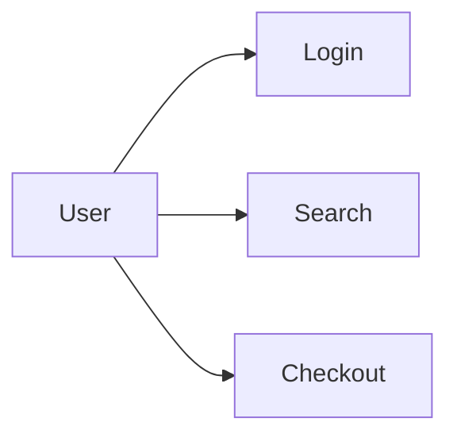

Benefits:

- Clarifies system behavior
- Identifies actors and interactions

---

**6.1.3.2 Data Flow Diagrams (DFDs)**

DFDs show:

- Flow of data
- Processing steps
- Data storage

Example:

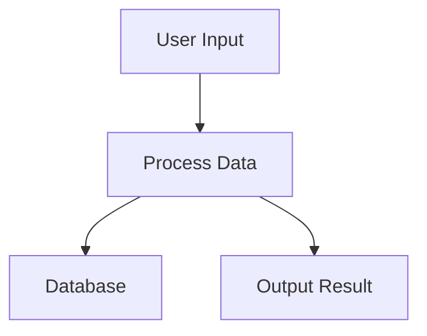

Helps validate:

- Data handling
- Process logic

---

**6.1.3.3 ER Diagrams**

Entity-Relationship diagrams represent:

- Entities
- Attributes
- Relationships

Example:

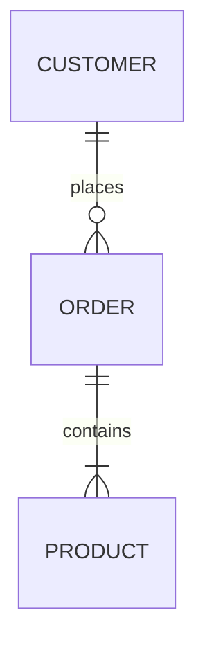

Helps validate:

- Data structure
- Relationships
- Database consistency

---

#### 6.1.4 Requirements-Based Testing

Tests are derived directly from requirements.

Each requirement should have:

- At least one test case

Purpose:

- Ensure every requirement is verifiable
- Detect missing or ambiguous requirements

This technique ensures:

- Traceability
- Completeness

---

#### 6.1.5 User Acceptance Testing

User Acceptance Testing (UAT):

- Performed by end users
- Validates system against real-world needs

Objectives:

- Confirm system meets expectations
- Validate business requirements
- Ensure readiness for deployment

UAT is the final validation step before release.

---

### 6.2 Requirements Validation Process

Requirements validation follows a structured sequence.

---

#### 6.2.1 Prepare SRS

Software Requirement Specification (SRS):

- Document containing detailed requirements
- Serves as reference for validation

Must be:

- Clear
- Complete
- Structured

---

#### 6.2.2 Select Validation Techniques

Based on:

- Project size
- Complexity
- Stakeholder involvement

Techniques may include:

- Reviews
- Prototyping
- Modeling
- Testing

---

#### 6.2.3 Conduct Reviews

Review the SRS document.

Activities:

- Identify inconsistencies
- Check feasibility
- Validate requirements

Review participants:

- Technical team
- Domain experts
- Stakeholders

---

#### 6.2.4 Identify Defects

Common requirement defects:

- Ambiguity
- Incompleteness
- Inconsistency
- Unverifiable statements

Defects must be documented and tracked.

---

#### 6.2.5 Modify Requirements

After defect identification:

- Update SRS
- Clarify unclear statements
- Remove inconsistencies
- Add missing requirements

Ensures requirement correctness.

---

#### 6.2.6 Obtain Stakeholder Approval

Final step:

- Stakeholders review updated SRS
- Formal approval is obtained

Approval ensures:

- Agreement on system scope
- Reduced future disputes
- Controlled development start

---

### Requirements Validation Flow

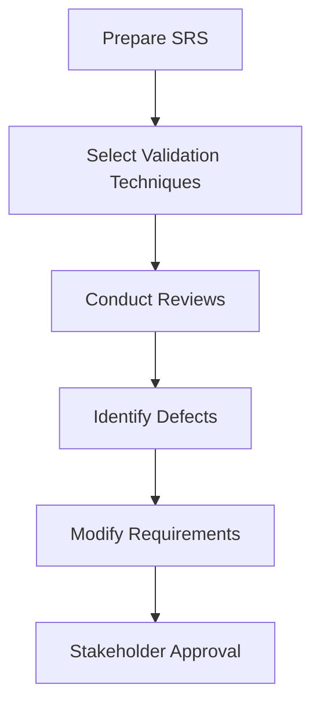

---

### Importance of Requirements Validation

Requirements validation:

- Reduces project failure risk
- Minimizes costly rework
- Ensures system correctness
- Improves stakeholder satisfaction

Early validation is significantly cheaper than fixing defects after development.

---

### 6.3 Common Problems in Requirements Validation

Even though requirements validation is critical, several challenges can reduce its effectiveness. These issues can lead to incorrect, incomplete, or misunderstood requirements.

---

#### 6.3.1 Stakeholder Unavailability

Validation requires active involvement of:

- Clients
- End users
- Domain experts
- Sponsors

Problems arise when:

- Stakeholders are too busy
- Decision-makers are unavailable
- Feedback is delayed

Impact:

- Requirements remain unclear
- Approvals are postponed
- Project timelines are affected

Without stakeholder participation, validation becomes incomplete and unreliable.

---

#### 6.3.2 Changing User Needs

User needs may evolve due to:

- Market changes
- Regulatory updates
- Competitive pressure
- Technological advancement

Frequent changes can cause:

- Scope creep
- Requirement instability
- Increased rework

Challenge:

Maintaining a balance between flexibility and project control.

---

#### 6.3.3 Miscommunication

Miscommunication can occur between:

- Clients and analysts
- Analysts and developers
- Developers and testers

Causes:

- Ambiguous language
- Incomplete documentation
- Poor communication channels

Consequences:

- Incorrect implementation
- Increased defects
- Customer dissatisfaction

Clear documentation and structured reviews reduce this risk.

---

#### 6.3.4 Technical Jargon

Use of complex technical terms can confuse:

- Non-technical stakeholders
- End users

Example:

Using database normalization terms instead of explaining data storage simply.

Impact:

- Misinterpretation of requirements
- Incorrect approvals

Solution:

- Use simple, clear language
- Include diagrams and prototypes

---

#### 6.3.5 Lack of Domain Knowledge

If the team lacks domain expertise:

- Business rules may be misunderstood
- Critical requirements may be missed

Examples:

- Healthcare systems without medical knowledge
- Banking systems without financial regulations understanding

Impact:

- Functional errors
- Compliance issues
- System rejection

Involving domain experts is essential for accurate validation.

---

### 6.4 Outcome of Requirements Validation

When requirements validation is performed properly, it produces significant benefits for the project.

---

#### 6.4.1 Reduced Errors

Early identification of:

- Ambiguities
- Inconsistencies
- Missing requirements

Leads to:

- Fewer design defects
- Reduced coding errors
- Lower testing failures

Fixing errors at requirement stage is far less costly than post-deployment fixes.

---

#### 6.4.2 Reduced Development Risk

Validation ensures:

- Feasibility of requirements
- Technical clarity
- Agreement among stakeholders

This reduces risks such as:

- Project failure
- Budget overruns
- Schedule delays

Risk reduction increases project stability.

---

#### 6.4.3 Higher User Satisfaction

Validated requirements ensure:

- System meets user expectations
- Business needs are fulfilled
- Delivered product aligns with original goals

Satisfied users are more likely to:

- Accept the system
- Recommend it
- Continue business engagement

---

#### 6.4.4 Strong Foundation for Design and Testing

Validated requirements provide:

- Clear input for system design
- Basis for test case development
- Traceability from requirement to implementation

This ensures:

- Structured development
- Efficient testing
- Improved software quality

Requirements act as the blueprint for the entire development lifecycle.

---

### Summary

Common Problems:

- Stakeholder unavailability
- Requirement changes
- Miscommunication
- Technical jargon
- Lack of domain knowledge

Outcomes of Proper Validation:

- Reduced errors
- Reduced risk
- Increased user satisfaction
- Strong design and testing foundation

---

---