# Unit - 3
:::info[TITLE]
## Requirements Engineering
:::
---

# 1. Problem Recognition

Problem Recognition is the first and most critical step in software development. Before building any system, we must clearly understand:

- What problem exists
- Why it exists
- Who is affected
- What impact it creates

Many software failures occur because teams jump directly to solutions without properly defining the real problem.

---

## 1.1 Concept of Problem Recognition

Problem recognition focuses on identifying the actual need or gap that requires a software solution.

It ensures:

- Clear understanding of current issues
- Alignment with business objectives
- Avoidance of unnecessary development
- Strong foundation for requirements engineering

Correct problem recognition prevents:

- Building wrong solutions
- Wasting resources
- Scope confusion

---

### 1.1.1 Definition of Problem Recognition

Problem Recognition is:

> The systematic identification and analysis of an existing issue, inefficiency, opportunity, or regulatory requirement that necessitates a software-based solution.
> 

It involves:

- Understanding current system limitations
- Identifying stakeholder needs
- Evaluating impact and urgency

It answers:

- What is wrong?
- Why does it matter?
- Who is affected?

---

### 1.1.2 Identifying Business Pain Points

Business pain points are operational problems that negatively impact performance.

Examples:

- Manual data entry causing delays
- High customer complaint rate
- Inventory mismanagement
- Slow transaction processing

Pain points often cause:

- Increased cost
- Reduced efficiency
- Customer dissatisfaction
- Revenue loss

Recognizing these issues helps define the need for automation or system improvement.

---

### 1.1.3 Identifying Market Opportunities

Not all problems are failures — some are opportunities.

Market opportunity recognition involves:

- Identifying unmet customer needs
- Detecting gaps in competitor offerings
- Observing technology trends

Examples:

- Introducing online booking in a traditional service
- Mobile app for previously offline services
- AI-based personalization

Opportunity-driven software focuses on:

- Innovation
- Competitive advantage
- Market expansion

---

### 1.1.4 Legal or Regulatory Necessities

Sometimes problems arise due to compliance requirements.

Examples:

- Data protection laws (privacy regulations)
- Financial reporting standards
- Government compliance systems

Failure to comply can result in:

- Legal penalties
- Business shutdown
- Reputation damage

Recognizing legal necessity ensures:

- Regulatory compliance
- Secure system design
- Proper documentation

---

### 1.1.5 Defining Core Problem Without Jumping to Solution

One of the biggest mistakes in software engineering is proposing a solution before understanding the problem.

Incorrect approach:

“We need a mobile app.”

Correct approach:

“Our customers struggle to access our services remotely.”

Solution comes after problem clarity.

Steps to define core problem:

1. Identify symptoms
2. Analyze root cause
3. Separate problem from solution
4. Validate with stakeholders

Problem clarification flow:

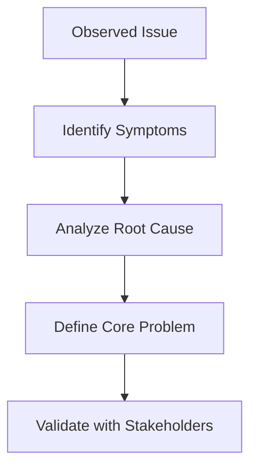

This ensures:

- Correct understanding
- Reduced misalignment
- Effective solution design

---

### 1.1.6 Example: Grocery Delivery Scenario

Problem Scenario:

Customers face long queues at grocery stores.

Incorrect solution approach:

“Let’s build a grocery app.”

Proper problem recognition process:

1. Identify issue
    - Long waiting time
    - Crowded stores
2. Analyze causes
    - Limited checkout counters
    - High demand during peak hours
3. Define core problem
    - Customers need faster and more convenient purchasing options.
4. Explore solutions
    - Online ordering
    - Scheduled delivery
    - Self-checkout systems

Problem recognition ensures:

- Solution addresses actual need
- Business goals align with user expectations
- Development is justified

---

## Key Takeaways

- Problem recognition precedes requirement gathering.
- It identifies root causes, not just symptoms.
- Clear problem definition reduces project failure risk.
- Solutions must emerge after thorough problem analysis.

---

---

# 2. Requirements Engineering

Requirements Engineering (RE) is the structured process of discovering, analyzing, documenting, validating, and managing system requirements.

It answers:

- What should the system do?
- What constraints must it follow?
- What are stakeholder expectations?

Requirements Engineering ensures:

- The right system is built
- Stakeholders agree on scope
- Risks are minimized early

---

## 2.1 Requirements Engineering Tasks

Requirements Engineering consists of multiple systematic tasks performed in sequence.

---

### 2.1.1 Inception

Inception is the starting point of Requirements Engineering.

Purpose:

- Understand problem context
- Identify stakeholders
- Define project boundaries
- Clarify business objectives

It sets the foundation for all subsequent activities.

---

**2.1.1.1 Identify Stakeholders**

Stakeholders include:

- Clients
- End users
- Project managers
- Developers
- Regulatory authorities

Stakeholders can be:

- Primary (direct system users)
- Secondary (indirectly affected parties)

Why stakeholder identification is important:

- Prevent missing requirements
- Avoid conflicts later
- Ensure proper communication

Failure to identify stakeholders can lead to:

- Incomplete requirements
- Rework
- Dissatisfied users

---

**2.1.1.2 Define Initial Scope**

Initial scope defines:

- System boundaries
- Major features
- High-level objectives
- Constraints

Scope answers:

- What will be included?
- What will not be included?

Clear scope prevents:

- Scope creep
- Resource wastage
- Misaligned expectations

Scope identification flow:

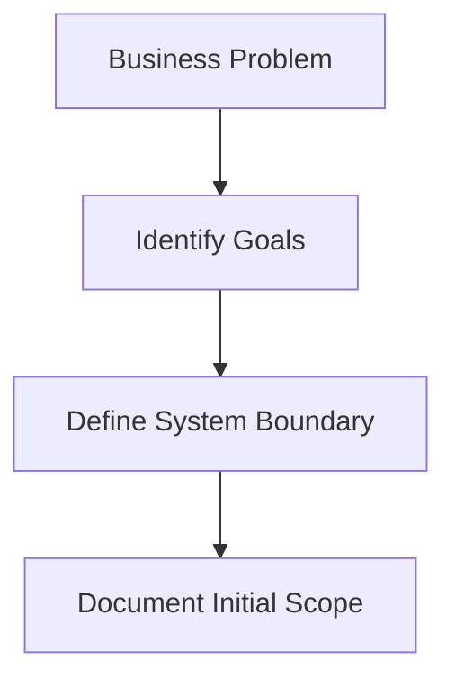

---

### 2.1.2 Elicitation

Elicitation is the process of gathering detailed requirements from stakeholders.

It aims to uncover:

- Functional requirements
- Non-functional requirements
- Constraints
- Assumptions

Challenges in elicitation:

- Stakeholders may not clearly express needs
- Requirements may conflict
- Hidden requirements may exist

---

**2.1.2.1 Interviews**

Structured or unstructured discussions with stakeholders.

Advantages:

- Direct interaction
- Clarification possible
- Detailed understanding

Types:

- Structured interviews (fixed questions)
- Semi-structured interviews
- Open-ended interviews

Risk:

- Bias
- Misinterpretation
- Incomplete responses

---

**2.1.2.2 Surveys / Questionnaires**

Used when:

- Large number of stakeholders
- Geographically distributed users

Advantages:

- Collect broad feedback
- Cost-effective

Limitation:

- Lack of deep clarification
- May not capture complex requirements

---

**2.1.2.3 Workshops**

Interactive group sessions involving:

- Stakeholders
- Analysts
- Developers

Benefits:

- Faster requirement clarification
- Conflict resolution
- Consensus building

Often used in:

- Agile development
- Large enterprise projects

---

**2.1.2.4 Observation**

Also known as ethnographic study.

Analyst observes:

- Current system usage
- User behavior
- Workflow processes

Benefits:

- Identifies hidden requirements
- Detects inefficiencies
- Reveals real-world usage patterns

Especially useful when:

- Users cannot clearly explain processes

---

### 2.1.3 Elaboration

Elaboration refines and expands initial requirements.

It focuses on:

- Detailed analysis
- Modeling
- Requirement structuring
- Removing ambiguity

Elaboration ensures:

- Technical feasibility
- Logical consistency
- Clear documentation

---

**2.1.3.1 Use Cases**

Use cases describe:

- Interaction between user (actor) and system
- System behavior in response to user actions

Components:

- Actor
- Main flow
- Alternate flow
- Preconditions
- Postconditions

Example:

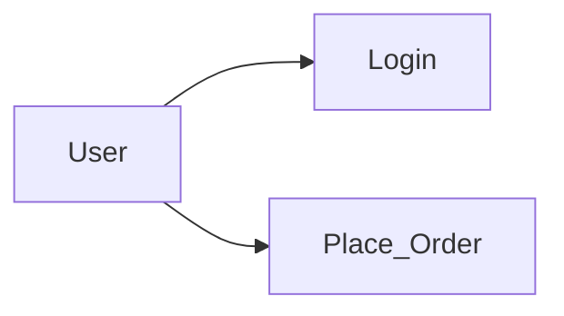

Benefits:

- Clarifies system functionality
- Provides basis for testing
- Improves requirement completeness

---

**2.1.3.2 User Stories**

Common in Agile methodology.

Format:

> As a [user], I want [feature] so that [benefit].
> 

Example:

“As a customer, I want to track my order so that I can know delivery status.”

Characteristics:

- Simple
- User-focused
- Incremental

Used for:

- Sprint planning
- Backlog creation

---

**2.1.3.3 Data Flow Diagrams**

DFDs model:

- Data movement
- Processing steps
- Data storage

Example:

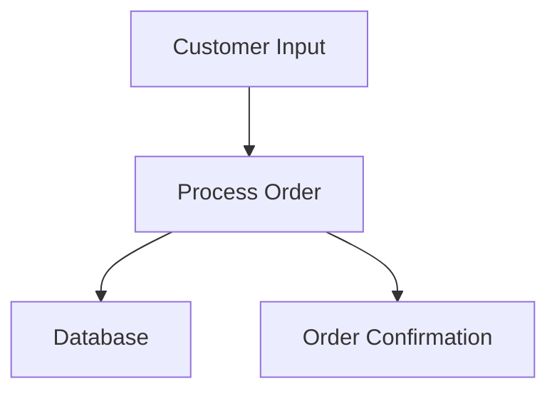

Benefits:

- Visual clarity
- Identifies missing processes
- Detects data inconsistencies

DFDs help validate:

- Data dependencies
- Logical flow
- System completeness

---

## Summary

Requirements Engineering includes:

- Inception → Identify stakeholders & define scope
- Elicitation → Gather detailed requirements
- Elaboration → Refine and model requirements

These tasks ensure:

- Clear understanding of system needs
- Reduced development risk
- Strong foundation for design and implementation

---

### 2.1.4 Negotiation

Negotiation occurs after elicitation and elaboration when requirements may:

- Conflict with each other
- Exceed budget
- Be technically infeasible
- Compete for priority

The goal of negotiation is to:

- Resolve conflicts
- Balance constraints
- Reach stakeholder agreement

Negotiation ensures the final requirement set is:

- Realistic
- Feasible
- Prioritized
- Accepted by all stakeholders

---

**2.1.4.1 Conflict Resolution Between Stakeholders**

Conflicts may arise due to:

- Different business goals
- Limited resources
- Opposing priorities
- Technical limitations

Example conflict:

- Marketing wants advanced features
- Finance wants minimal cost
- Developers highlight technical complexity

Resolution techniques:

- Structured discussions
- Prioritization frameworks
- Trade-off analysis
- Mediated decision-making

Conflict resolution flow:

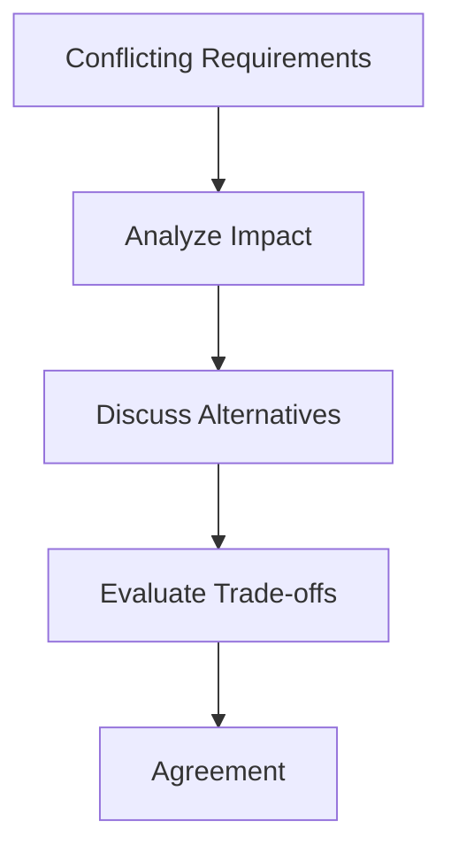

Effective resolution prevents:

- Scope disputes
- Delays
- Stakeholder dissatisfaction

---

**2.1.4.2 Requirement Prioritization**

Not all requirements can be implemented immediately.

Prioritization helps decide:

- Which features are essential
- Which can be deferred

Common prioritization techniques:

- MoSCoW Method
    - Must Have
    - Should Have
    - Could Have
    - Won’t Have
- Business Value vs Cost Analysis
- Risk-based prioritization

Benefits:

- Efficient resource usage
- Faster delivery of critical features
- Controlled scope

---

**2.1.4.3 Budget and Feasibility Consideration**

Requirements must be evaluated for:

- Technical feasibility
- Financial feasibility
- Operational feasibility

Feasibility questions:

- Can we build this with available technology?
- Do we have required skills?
- Is it within budget?
- Is it achievable within time constraints?

Unfeasible requirements must be:

- Modified
- Deferred
- Removed

---

### 2.1.5 Specification

Specification converts refined requirements into structured documentation.

It ensures:

- Clarity
- Completeness
- Formal communication
- Legal agreement between client and developer

---

**2.1.5.1 Software Requirements Specification (SRS)**

SRS is a formal document describing:

- Functional requirements
- Non-functional requirements
- System constraints
- Interfaces
- Assumptions

Typical SRS structure:

- Introduction
- Overall description
- Specific requirements
- Appendices

Characteristics of good SRS:

- Correct
- Complete
- Consistent
- Unambiguous
- Verifiable

SRS acts as:

- Contract between client and developer
- Basis for design and testing

---

**2.1.5.2 Product Backlog**

Used primarily in Agile development.

Product Backlog is:

- A prioritized list of features
- Continuously updated
- Maintained by Product Owner

Contains:

- User stories
- Enhancements
- Bug fixes
- Technical tasks

Backlog supports:

- Incremental development
- Sprint planning
- Dynamic requirement changes

---

**2.1.5.3 Formal Requirement Statements**

Formal statements must be:

- Clear
- Testable
- Measurable

Example of good requirement:

“The system shall authenticate users within 2 seconds.”

Avoid vague terms like:

- Fast
- User-friendly
- Efficient

Formal requirements enable:

- Objective validation
- Precise testing
- Reduced ambiguity

---

### 2.1.6 Validation

Validation ensures:

- Requirements accurately represent stakeholder needs
- Requirements are complete and consistent
- No contradictions exist

Validation answers:

> Are we building the right system?
> 

---

**2.1.6.1 Formal Technical Reviews**

Structured evaluation sessions involving:

- Analysts
- Developers
- Testers
- Stakeholders

Objectives:

- Identify missing requirements
- Detect inconsistencies
- Ensure feasibility

Benefits:

- Early defect detection
- Reduced rework cost

---

**2.1.6.2 Walkthroughs**

Informal review process where:

- Author presents requirements
- Team discusses and asks questions

Advantages:

- Encourages collaboration
- Easy to conduct
- Improves understanding

Less formal than inspections but still effective.

---

**2.1.6.3 Detecting Missing or Inconsistent Requirements**

Validation checks for:

- Missing functionality
- Conflicting requirements
- Incomplete descriptions
- Unclear constraints

Example inconsistency:

Requirement A: “System supports 10,000 users.”

Requirement B: “System designed for small business use.”

Such conflicts must be resolved before development.

---

### 2.1.7 Requirements Management

Requirements Management ensures:

- Requirements are tracked
- Changes are controlled
- Documentation stays updated

It continues throughout the project lifecycle.

---

**2.1.7.1 Version Control**

Each requirement document version is tracked.

Purpose:

- Record changes
- Maintain history
- Prevent confusion

Version control tools:

- Git
- Document management systems

Ensures traceability and accountability.

---

**2.1.7.2 Traceability Matrix**

Requirements Traceability Matrix (RTM) links:

- Requirements
- Design elements
- Test cases
- Implementation components

Example flow:

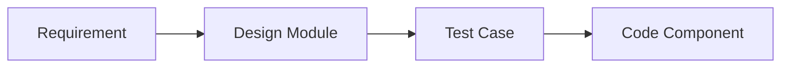

Benefits:

- Ensures no requirement is missed
- Supports impact analysis
- Improves test coverage

---

**2.1.7.3 Managing Requirement Changes**

Requirements may change due to:

- Market evolution
- Stakeholder feedback
- Technical limitations

Change management steps:

1. Change request submission
2. Impact analysis
3. Approval decision
4. Implementation
5. Documentation update

Change control flow:

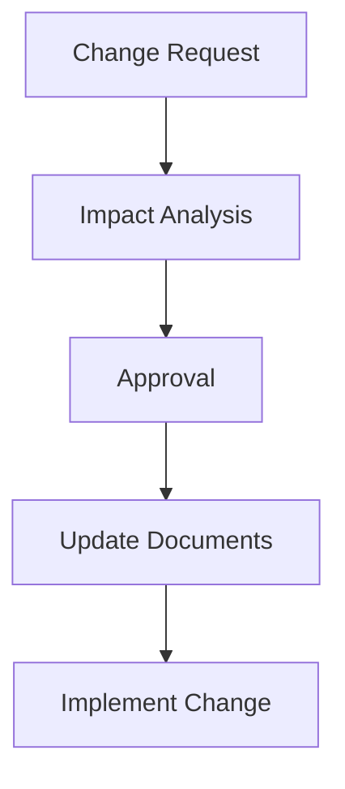

Controlled change management prevents:

- Scope creep
- Budget overrun
- Project instability

---

## Summary

Requirements Engineering Tasks include:

- Inception
- Elicitation
- Elaboration
- Negotiation
- Specification
- Validation
- Requirements Management

Together, they ensure:

- Clear system definition
- Controlled scope
- Reduced risk
- Successful software delivery

---

---

# 3. Introduction to Software Engineering Process

A Software Engineering Process defines the structured approach used to develop and maintain software systems.

It provides:

- Discipline
- Predictability
- Quality control
- Risk reduction

Without a defined process, development becomes:

- Unstructured
- Difficult to manage
- Error-prone
- Unpredictable

A process ensures that software development is systematic rather than chaotic.

---

## 3.1 What is a Software Process?

A Software Process is:

> A structured set of activities required to develop a software system from initial concept to maintenance.
> 

It defines:

- What activities must be performed
- In what sequence
- By whom
- With what outputs

A process includes:

- Methods
- Tools
- Standards
- Documentation practices

The purpose of a software process is to:

- Deliver quality software
- Meet deadlines
- Control cost
- Reduce risk

---

### 3.1.1 Structured Set of Activities

A structured process ensures that software development follows a logical order.

These activities are not random; they are:

- Organized
- Defined
- Controlled
- Measurable

General process structure:

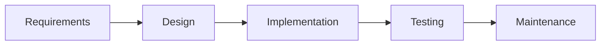

Each activity:

- Produces specific deliverables
- Has defined responsibilities
- Is subject to quality checks

Structure ensures:

- Consistency
- Traceability
- Accountability

---

## 3.2 Core Process Activities

Every software process, regardless of model (Waterfall, Agile, Spiral), includes four fundamental activities:

1. Specification
2. Design & Implementation
3. Validation
4. Evolution

These activities form the foundation of all process models.

---

### 3.2.1 Specification

Specification defines:

- What the system should do
- Functional requirements
- Non-functional requirements
- Constraints

It answers:

> What problem is being solved?
> 

Specification includes:

- Requirement gathering
- Requirement analysis
- Documentation (SRS)

Outcome:

- Clear understanding of system objectives
- Approved requirement document

Poor specification leads to:

- Misaligned development
- Rework
- Project failure

---

### 3.2.2 Design & Implementation

This phase transforms requirements into working software.

Design involves:

- System architecture
- Database design
- Interface design
- Module design

Implementation involves:

- Writing code
- Integrating components
- Following coding standards

Design ensures:

- Scalability
- Maintainability
- Performance

Implementation converts design into executable software.

Design & Implementation flow:

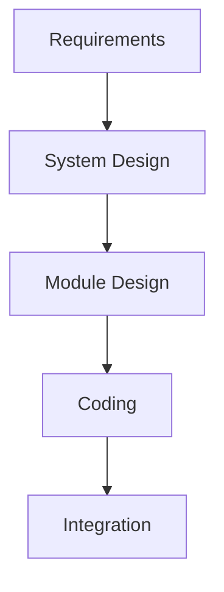

---

### 3.2.3 Validation

Validation ensures:

- The system meets specified requirements
- The software behaves correctly
- Defects are identified and corrected

Includes:

- Unit testing
- Integration testing
- System testing
- User acceptance testing

Validation answers:

> Are we building the product right?
> 

Testing reduces:

- Defects
- Risk
- Post-deployment failures

---

### 3.2.4 Evolution

Software does not remain static after deployment.

Evolution includes:

- Corrective maintenance (fixing bugs)
- Adaptive maintenance (adapting to environment changes)
- Perfective maintenance (adding improvements)
- Preventive maintenance (improving maintainability)

Reasons for evolution:

- Changing business needs
- New regulations
- Technological updates
- Performance optimization

Evolution flow:

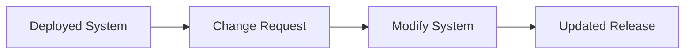

Software evolution is often the longest phase in the lifecycle.

---

## Summary

A Software Engineering Process:

- Is a structured set of activities
- Provides discipline and control
- Ensures systematic development

Core activities:

1. Specification → Define what to build
2. Design & Implementation → Build the system
3. Validation → Verify correctness
4. Evolution → Maintain and improve system

These activities exist in all software development models.

---

---

# 4. Software Process Models

Software Process Models define the structured approach used to organize and manage software development activities.

Each model provides:

- A framework for executing process activities
- Guidelines for sequencing tasks
- Methods for managing risk and change

Different models are suitable for different project types, sizes, and risk levels.

---

## 4.1 Waterfall Model

The Waterfall Model is a **linear and sequential** software development model.

Development flows downward through distinct phases.

### Phases of Waterfall Model:

1. Requirements
2. Design
3. Implementation
4. Testing
5. Maintenance

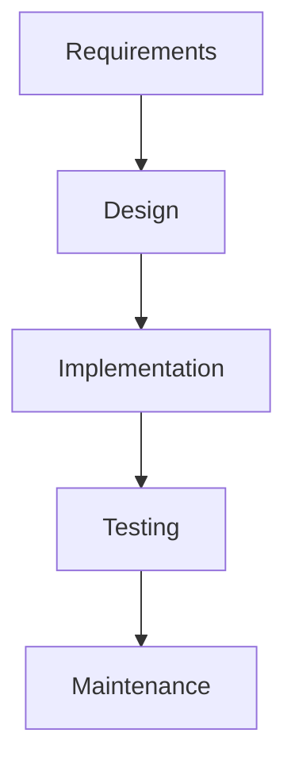

### Characteristics:

- Each phase must be completed before the next begins
- No overlapping phases
- Heavy documentation
- Clear milestone-based progress

### Advantages:

- Simple and easy to understand
- Well-defined structure
- Good for small projects with stable requirements

### Disadvantages:

- Difficult to accommodate changes
- Late detection of issues
- Not suitable for complex or evolving projects

### Suitable When:

- Requirements are clear and stable
- Technology is well understood
- Risk is low

---

## 4.2 Incremental Model

The Incremental Model develops the system in **small functional increments**.

Each increment delivers a portion of the total functionality.

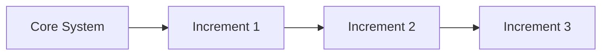

### Characteristics:

- System divided into modules
- Each increment adds new functionality
- Early delivery of working software

### Advantages:

- Reduced risk
- Early customer feedback
- Easier testing and debugging

### Disadvantages:

- Requires good architecture planning
- Integration complexity
- May require strong management control

### Suitable When:

- Requirements are partially known
- Need early delivery
- Large projects with modular structure

---

## 4.3 Spiral Model

The Spiral Model is a **risk-driven process model** combining iterative development and systematic risk analysis.

Each cycle (spiral) includes:

1. Planning
2. Risk Analysis
3. Engineering
4. Evaluation

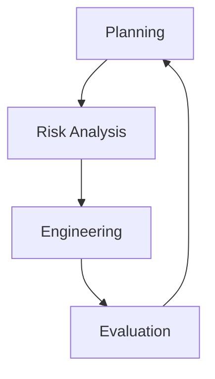

### Characteristics:

- Iterative cycles
- Emphasis on risk assessment
- Suitable for large and complex systems

### Advantages:

- Early identification of risks
- Flexible and adaptable
- Continuous refinement

### Disadvantages:

- Complex to manage
- Expensive
- Requires risk assessment expertise

### Suitable When:

- Project is large
- Risk is high
- Requirements are unclear

---

## 4.4 Agile Process Model

Agile is an **iterative and incremental** approach focusing on flexibility, collaboration, and customer involvement.

Development occurs in short cycles called **Sprints** (1–4 weeks).

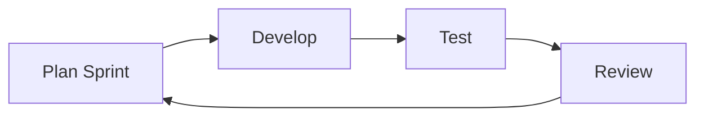

### Characteristics:

- Short development cycles
- Continuous customer feedback
- Adaptive planning
- Working software delivered frequently

### Advantages:

- Handles changing requirements
- Early and continuous delivery
- High customer involvement

### Disadvantages:

- Less documentation
- Requires strong team collaboration
- Not ideal for very large or regulated projects without adaptation

### Suitable When:

- Requirements change frequently
- Customer involvement is high
- Rapid development is needed

Common Agile frameworks:

- Scrum
- Extreme Programming (XP)
- Kanban

---

## Comparison Overview

| Model | Flexibility | Risk Handling | Documentation | Suitable For |
| --- | --- | --- | --- | --- |
| Waterfall | Low | Low | High | Stable projects |
| Incremental | Medium | Medium | Moderate | Modular systems |
| Spiral | High | High | Moderate | High-risk projects |
| Agile | Very High | Medium | Low to Moderate | Dynamic projects |

---

## Key Understanding

- No single model fits all projects.
- Model selection depends on:
    - Requirement stability
    - Risk level
    - Project size
    - Customer involvement

Choosing the right process model significantly impacts project success.

---

---

# 5. Introduction to Requirements Engineering

Requirements Engineering focuses on identifying, analyzing, documenting, validating, and managing system requirements.

Before designing or coding a system, it is essential to clearly define what the system must do and under what constraints it must operate.

A poorly defined requirement is one of the primary causes of software failure.

---

## 5.1 What is a Requirement?

A Requirement is:

> A condition, capability, or constraint that a system must satisfy to meet stakeholder needs.
> 

Requirements describe:

- Services the system must provide
- Constraints under which the system must operate

Requirements must be:

- Clear
- Complete
- Consistent
- Verifiable
- Feasible

---

### 5.1.1 Service Provided by System

A requirement can describe a **service or functionality** that the system must deliver.

This includes:

- Input processing
- Output generation
- Data storage
- Business logic execution

Examples:

- The system shall allow users to register.
- The system shall generate monthly reports.
- The system shall calculate tax automatically.

Services define:

- What the system does
- How users interact with it
- System responses to inputs

Service requirements form the core functional capabilities of the system.

---

### 5.1.2 Constraint on the System

Requirements may also specify constraints.

Constraints limit or restrict:

- How the system is built
- How it performs
- What technologies are used

Examples:

- The system shall operate on Windows and Linux.
- The application must comply with data protection regulations.
- The response time shall not exceed 2 seconds.

Constraints ensure:

- Legal compliance
- Performance standards
- Technical compatibility

Constraints do not describe functionality but restrict system behavior or implementation.

---

## 5.2 Types of Requirements

Requirements are broadly categorized into:

1. Functional Requirements
2. Non-Functional Requirements

Both are equally important.

---

### 5.2.1 Functional Requirements

Functional requirements describe:

- What the system should do
- Specific behaviors or functions
- Business logic

They define system behavior in response to:

- User input
- System events
- Data conditions

Functional requirements are typically expressed as:

- Use cases
- User stories
- Detailed statements

---

**5.2.1.1 System Behavior**

System behavior includes:

- Input handling
- Processing rules
- Output generation
- Interaction flow

Example behavior:

If user enters valid credentials → System grants access.

If user enters invalid credentials → System displays error message.

Behavior defines:

- Logical operations
- State transitions
- Decision-making logic

Example behavior flow:

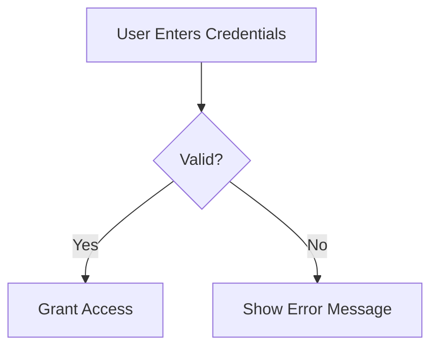

---

**5.2.1.2 Example: Login Functionality**

Functional Requirement Example:

- The system shall allow registered users to log in using username and password.
- The system shall validate credentials against the database.
- The system shall display an error message for invalid login attempts.

This requirement describes:

- Input: Username and password
- Processing: Validation
- Output: Access or error

It clearly defines system behavior.

---

### 5.2.2 Non-Functional Requirements

Non-functional requirements (NFRs) describe:

- How the system performs
- Quality attributes
- Constraints

They define system quality rather than specific functionality.

Common categories include:

- Performance
- Security
- Usability
- Reliability
- Scalability

Non-functional requirements often determine overall user satisfaction.

---

**5.2.2.1 Performance**

Performance requirements specify:

- Response time
- Throughput
- Load handling capacity

Examples:

- The system shall process 1000 transactions per minute.
- Page load time shall not exceed 2 seconds.

Performance affects:

- User experience
- System efficiency
- Scalability

---

**5.2.2.2 Security**

Security requirements define:

- Authentication mechanisms
- Authorization levels
- Data protection methods

Examples:

- All passwords must be encrypted.
- The system shall implement two-factor authentication.
- User sessions shall expire after 10 minutes of inactivity.

Security protects:

- Sensitive data
- System integrity
- User privacy

---

**5.2.2.3 Usability**

Usability requirements define:

- Ease of use
- User interface standards
- Accessibility

Examples:

- The interface shall be accessible to users with disabilities.
- New users shall complete basic tasks within 5 minutes of training.

Good usability ensures:

- User satisfaction
- Reduced training cost
- Higher adoption rate

---

**5.2.2.4 Example: Response Time Constraint**

Example Non-Functional Requirement:

- The system shall respond to user queries within 2 seconds under normal load.

This requirement:

- Does not describe what the system does
- Describes how fast it performs

Response time constraints ensure:

- Smooth user interaction
- Reduced frustration
- Competitive advantage

Performance validation flow:

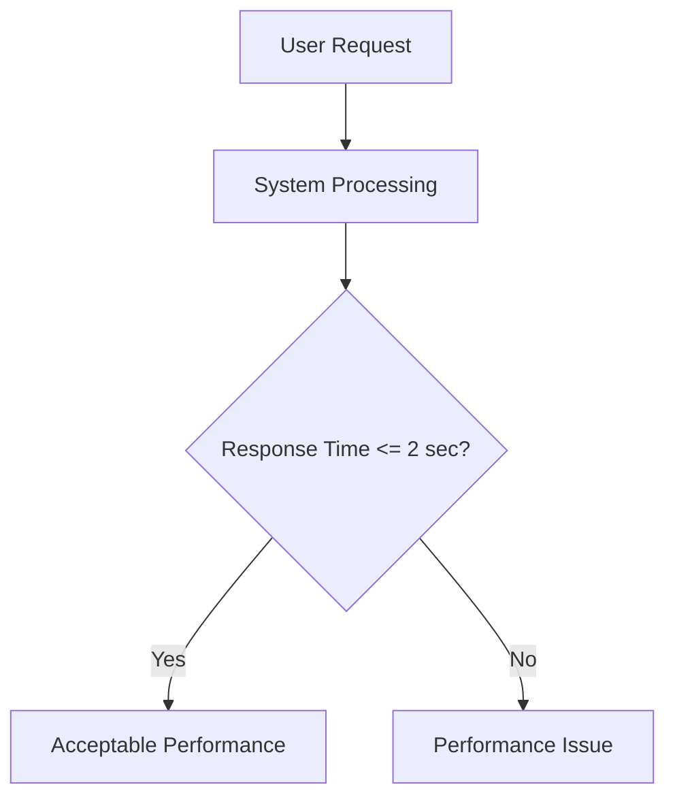

---

## Summary

Requirement = Service + Constraint

Functional Requirements:

- Describe what the system does
- Define system behavior

Non-Functional Requirements:

- Describe how the system performs
- Define quality attributes

Both are essential for:

- Complete system specification
- Accurate design
- Proper testing
- Successful deployment

---

---

# 6. Requirements Engineering Process

The Requirements Engineering (RE) Process is a systematic approach to discovering, analyzing, documenting, and validating system requirements.

It ensures that:

- Stakeholder needs are clearly understood
- Requirements are structured and feasible
- Errors are detected early
- The foundation for design and testing is strong

The RE process typically includes:

1. Elicitation
2. Analysis
3. Specification
4. Validation

---

## 6.1 Elicitation

Elicitation is the process of gathering requirements from stakeholders.

It focuses on discovering:

- What users need
- What business expects
- What constraints exist

Challenges in elicitation:

- Stakeholders may not clearly express needs
- Requirements may be hidden
- Conflicting opinions may exist

---

### 6.1.1 Interviews

Interviews involve direct interaction with stakeholders.

Types:

- Structured interviews (fixed questions)
- Semi-structured interviews
- Unstructured interviews

Advantages:

- Detailed clarification
- Immediate feedback
- Deeper understanding

Limitations:

- Time-consuming
- Risk of biased responses

Interview flow:

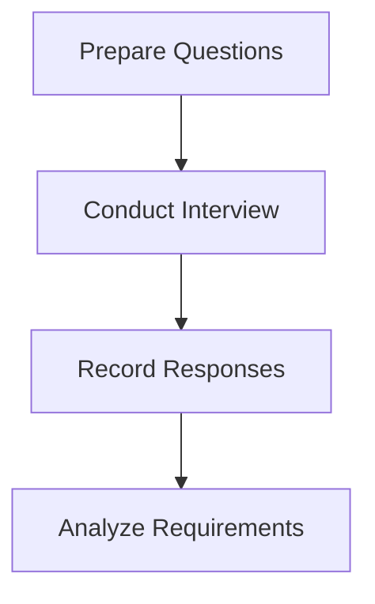

Interviews are most effective when stakeholders:

- Have domain knowledge
- Are decision-makers

---

### 6.1.2 Questionnaires

Questionnaires are written sets of questions distributed to multiple stakeholders.

Suitable when:

- Large number of users
- Geographically dispersed stakeholders

Advantages:

- Cost-effective
- Quick data collection

Limitations:

- Limited clarification
- Risk of incomplete answers

Best used for:

- Collecting quantitative data
- Gathering general feedback

---

### 6.1.3 Observation

Observation involves watching users perform tasks in their natural work environment.

Also called:

- Ethnographic study

Benefits:

- Identifies hidden requirements
- Detects inefficiencies
- Reveals actual workflows

Useful when:

- Users cannot clearly articulate their processes

Observation captures real-world behavior rather than assumed behavior.

---

## 6.2 Analysis

After elicitation, requirements are analyzed to ensure clarity and feasibility.

Analysis focuses on:

- Removing ambiguity
- Resolving conflicts
- Prioritizing requirements
- Assessing feasibility

---

### 6.2.1 Conflict Resolution

Conflicts may arise due to:

- Different stakeholder expectations
- Limited resources
- Technical limitations

Conflict resolution involves:

- Discussion and negotiation
- Trade-off analysis
- Impact assessment

Conflict resolution process:

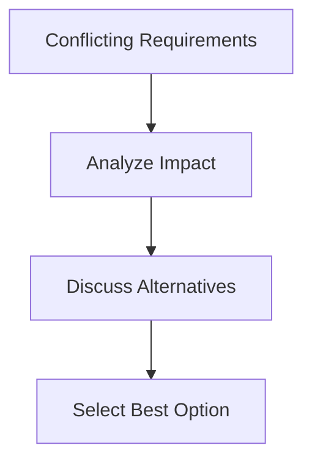

Resolving conflicts early prevents:

- Development delays
- Budget overruns
- Stakeholder dissatisfaction

---

### 6.2.2 Requirement Prioritization

Not all requirements can be implemented simultaneously.

Prioritization helps decide:

- Which features are essential
- Which can be delayed

Common methods:

- MoSCoW method
    - Must Have
    - Should Have
    - Could Have
    - Won’t Have
- Business value analysis
- Risk-based prioritization

Benefits:

- Efficient resource use
- Faster delivery of critical features
- Controlled scope

---

## 6.3 Specification

Specification converts analyzed requirements into structured documentation.

It ensures:

- Clear communication
- Formal agreement
- Reference for design and testing

---

### 6.3.1 Clear Documentation of Requirements

Requirements must be documented in a:

- Clear
- Precise
- Unambiguous
- Testable format

Example of clear requirement:

“The system shall process user login within 2 seconds.”

Avoid vague terms such as:

- Fast
- Easy
- User-friendly

Clear documentation enables:

- Accurate implementation
- Effective testing
- Reduced misinterpretation

Specification often results in:

- Software Requirements Specification (SRS)
- Product backlog (Agile projects)

---

## 6.4 Validation

Validation ensures that documented requirements:

- Accurately reflect stakeholder needs
- Are complete
- Are consistent
- Are feasible

Validation answers:

> Are we building the right system?
> 

---

### 6.4.1 Correctness Check

Ensures that:

- Requirements match stakeholder expectations
- No incorrect functionality is included

Methods:

- Stakeholder review
- Requirement walkthroughs
- Prototype validation

Incorrect requirements can lead to building the wrong system.

---

### 6.4.2 Completeness Check

Ensures that:

- All required functionalities are documented
- No important feature is missing
- All constraints are identified

Checklist example:

- Are all user roles covered?
- Are error conditions specified?
- Are performance requirements included?

Incomplete requirements result in:

- System gaps
- Rework
- User dissatisfaction

---

### 6.4.3 Consistency Check

Ensures that:

- No requirement contradicts another
- Terminology is uniform
- System constraints are aligned

Example inconsistency:

Requirement A: “System supports unlimited users.”

Requirement B: “System supports maximum 1000 users.”

Such conflicts must be resolved before development begins.

Consistency ensures:

- Logical integrity
- Smooth implementation
- Reduced confusion

---

## Overall Requirements Engineering Flow

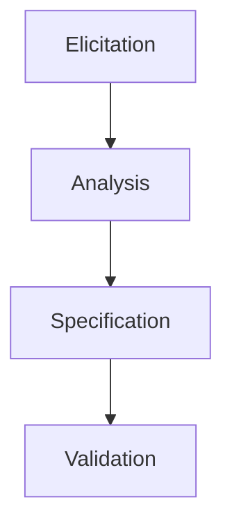

This structured process ensures:

- Clear understanding
- Controlled development
- Reduced project risk

---

---

# 7. Software Requirements Specification (SRS)

The Software Requirements Specification (SRS) is one of the most important documents in software engineering.

It formally defines:

- What the system must do
- How it must behave
- What constraints it must follow

The SRS serves as:

- A contract between client and developer
- A reference for design and testing
- A baseline for project control

A well-written SRS reduces:

- Miscommunication
- Rework
- Project failure risk

---

## 7.1 What is SRS?

An SRS is a structured document that clearly describes system requirements.

It ensures:

- Agreement between stakeholders
- Clear communication
- Traceability
- Quality control

It is created after:

- Requirements elicitation
- Requirements analysis
- Requirement negotiation

---

### 7.1.1 Formal Requirement Document

SRS is a formal document, meaning:

- It follows a structured format
- It uses precise language
- It avoids ambiguity
- It is approved by stakeholders

Characteristics of formal documentation:

- Clear terminology
- Defined scope
- Measurable statements
- Version control

Example of formal requirement:

“The system shall authenticate users within 2 seconds.”

Avoid informal wording such as:

- The system should be fast
- The interface should look nice

Formal documentation enables:

- Accurate implementation
- Objective testing
- Legal accountability

---

### 7.1.2 IEEE Definition

According to IEEE (Institute of Electrical and Electronics Engineers):

> An SRS is a document that describes the behavior of a system and the constraints under which it must operate.
> 

IEEE recommends standard formats such as:

- IEEE 830 (older standard)
- ISO/IEC/IEEE 29148 (modern standard)

IEEE standards emphasize:

- Clarity
- Completeness
- Consistency
- Verifiability

Using IEEE standards ensures:

- Professional documentation
- Industry acceptance
- Structured requirement presentation

---

## 7.2 Contents of SRS Document

An SRS typically contains the following sections:

---

### 7.2.1 Introduction

The Introduction section includes:

- Purpose of the system
- Scope of the project
- Definitions and acronyms
- References
- Document overview

It answers:

- Why is the system being built?
- What is its objective?

Purpose:

- Provide context
- Set boundaries
- Clarify terminology

---

### 7.2.2 Overall Description

This section gives a high-level overview of the system.

Includes:

- Product perspective
- Product functions
- User classes
- Operating environment
- Design constraints
- Assumptions and dependencies

It describes:

- How the system fits into the larger environment
- Who will use the system
- Technical platform details

This section avoids too much detail and focuses on big-picture understanding.

---

### 7.2.3 Functional Requirements

Functional requirements describe:

- System behavior
- Specific services
- Inputs and outputs
- Business logic

They answer:

> What should the system do?
> 

Example:

- The system shall allow users to create accounts.
- The system shall generate monthly sales reports.

Functional requirements are often derived from:

- Use cases
- User stories
- Process models

They must be:

- Clear
- Testable
- Specific

---

### 7.2.4 Non-Functional Requirements

Non-functional requirements define:

- Quality attributes
- Performance standards
- Security constraints
- Usability requirements

They answer:

> How should the system perform?
> 

Examples:

- The system shall support 10,000 concurrent users.
- The system shall respond within 2 seconds.
- All data shall be encrypted.

Non-functional requirements strongly impact:

- System architecture
- Technology selection
- Design decisions

---

### 7.2.5 System Models

System models visually represent requirements.

They help improve clarity and understanding.

Common models:

- Use Case Diagrams
- Data Flow Diagrams (DFDs)
- Entity-Relationship (ER) Diagrams
- State Diagrams

Example Use Case Diagram:


Models help:

- Detect missing functionality
- Identify logical errors
- Improve stakeholder communication

---

### 7.2.6 Constraints & Assumptions

Constraints restrict system development.

Examples:

- Must operate on Windows platform
- Must comply with data protection laws
- Must integrate with existing system

Assumptions are conditions believed to be true during development.

Examples:

- Internet connection will be available
- Users have basic computer knowledge

Constraints and assumptions help:

- Clarify limitations
- Identify risks
- Guide system design

---

## Structure Overview of SRS

```mermaid
flowchart TD
    A[Introduction]
    B[Overall Description]
    C[Functional Requirements]
    D[Non-Functional Requirements]
    E[System Models]
    F[Constraints & Assumptions]

    A --> B --> C --> D --> E --> F
```

---

## 7.3 Characteristics of Good SRS

A good Software Requirements Specification (SRS) must meet certain quality criteria to ensure reliability and clarity.

IEEE standards define several characteristics that a high-quality SRS should possess.

---

### 7.3.1 Correct

An SRS is correct if:

- Every requirement reflects actual stakeholder needs
- No incorrect functionality is included

Correctness ensures:

- The right system is built
- Stakeholder expectations are met

To ensure correctness:

- Conduct stakeholder reviews
- Validate with prototypes
- Confirm business rules

Incorrect requirements may result in:

- Building the wrong system
- Costly rework

---

### 7.3.2 Complete

An SRS is complete if:

- All required functionality is documented
- All constraints are identified
- All user interactions are covered
- All exceptional conditions are specified

Completeness includes:

- Functional requirements
- Non-functional requirements
- Interface requirements
- Error handling

Incomplete SRS leads to:

- Missing features
- Design gaps
- System failure

Checklist for completeness:

- Are all user roles defined?
- Are error cases described?
- Are performance requirements included?

---

### 7.3.3 Consistent

An SRS is consistent if:

- No requirements contradict each other
- Terminology is uniform throughout the document

Example inconsistency:

- Requirement A: System supports unlimited users.
- Requirement B: System supports maximum 500 users.

Consistency ensures:

- Logical clarity
- Smooth implementation
- Reduced confusion

Consistency checks are typically done through:

- Formal reviews
- Cross-referencing requirements

---

### 7.3.4 Unambiguous

An SRS is unambiguous if:

- Each requirement has only one clear interpretation

Avoid vague words like:

- Fast
- Efficient
- User-friendly
- Secure

Ambiguous requirement example:

“The system shall load quickly.”

Unambiguous version:

“The system shall load within 2 seconds under normal operating conditions.”

Clarity ensures:

- Accurate implementation
- Reliable testing

---

### 7.3.5 Verifiable

An SRS is verifiable if:

- Each requirement can be tested or measured

Example of non-verifiable requirement:

“The system shall be easy to use.”

Verifiable version:

“A new user shall complete registration within 3 minutes without assistance.”

Verification methods:

- Testing
- Inspection
- Demonstration
- Analysis

Verifiability ensures objective validation.

---

## 7.4 Importance of Requirements Specification

Requirements Specification plays a crucial role in software development.

It acts as the foundation of the entire project lifecycle.

---

### 7.4.1 Reduce Development Cost

Errors detected in the requirement stage are:

- Much cheaper to fix
- Easier to correct

Cost of fixing defects increases significantly in later stages:

- Design stage → Higher cost
- Coding stage → Even higher
- Post-deployment → Extremely expensive

Clear SRS reduces:

- Rework
- Budget overruns
- Project delays

---

### 7.4.2 Avoid Misunderstandings

SRS provides:

- Clear communication between stakeholders
- Defined expectations
- Agreed-upon scope

Without SRS:

- Developers may misunderstand requirements
- Clients may expect different outcomes
- Scope confusion may occur

SRS ensures alignment between:

- Client
- Development team
- Testers

---

### 7.4.3 Contract Between Client & Developer

SRS acts as:

- A formal agreement
- A legal reference document

It defines:

- What will be delivered
- What will not be delivered
- Performance standards

In case of disputes:

- SRS serves as evidence
- Scope clarification is possible

It protects both:

- Client interests
- Developer obligations

---

### 7.4.4 Basis for Design, Testing & Maintenance

SRS serves as input for:

- System design
- Code development
- Test case creation
- Future maintenance

Traceability flow:

```mermaid
flowchart TD
    A[SRS] --> B[System Design]
    B --> C[Implementation]
    C --> D[Testing]
    D --> E[Maintenance]
```

Each requirement in SRS should:

- Map to design components
- Map to test cases
- Be traceable to implementation

Strong SRS ensures:

- Structured development
- Complete testing
- Easier system upgrades

---

## Summary

Characteristics of Good SRS:

- Correct
- Complete
- Consistent
- Unambiguous
- Verifiable

Importance:

- Reduces cost
- Prevents misunderstanding
- Acts as contract
- Supports design, testing, and maintenance

A well-prepared SRS significantly increases the probability of project success.

---

---

# 8. Use Cases & Functional Specification

Use Cases are a powerful technique used in Requirements Engineering to describe system functionality from the user’s perspective.

They help answer:

- How users interact with the system
- What services the system provides
- What happens during normal and exceptional scenarios

Use Cases focus on **external behavior**, not internal implementation.

---

## 8.1 Use Cases – Basics

Use Cases describe functional requirements in a structured, user-oriented manner.

They are especially useful during:

- Requirements analysis
- System modeling
- Functional specification preparation

---

### 8.1.1 Definition of Use Case

A Use Case is:

> A description of a sequence of actions performed by a system to achieve a goal for an actor.
> 

It captures:

- User goal
- System response
- Interaction flow

Use Cases describe:

- What the system does
- Not how it does it

Example:

Use Case: "Login to System"

Goal:

Allow registered user to access system securely.

---

### 8.1.2 Interaction Between Actor and System

A Use Case models interaction between:

- Actor (external entity)
- System (software under development)

Interaction flow typically includes:

1. Actor initiates action
2. System processes request
3. System returns response

Example flow:

```mermaid
flowchart LR
    User -->|Enter Credentials| System
    System -->|Validate| Database
    System -->|Access Granted| User
```

This interaction defines:

- Input
- Processing
- Output

Use Cases focus only on externally visible behavior.

---

## 8.2 Components of a Use Case

A Use Case Diagram includes several core elements.

---

### 8.2.1 Actor

An Actor represents:

- A user
- Another system
- An external entity

Actors are external to the system.

They initiate interaction.

In diagrams, actors are represented as stick figures.

---

### 8.2.2 Use Case

A Use Case represents:

- A system function
- A service provided to an actor

It is shown as an oval in diagrams.

Examples:

- Login
- Register
- Generate Report
- Place Order

Each use case should represent a **single goal**.

---

### 8.2.3 System Boundary

The System Boundary defines:

- What is inside the system
- What is outside the system

It is represented as a rectangle enclosing use cases.

Purpose:

- Clarifies scope
- Defines system limits
- Avoids confusion about responsibilities

Example diagram:

```mermaid
flowchart LR
    subgraph System
        A(Login)
        B(Register)
    end
    User --> A
    User --> B
```

Everything inside the rectangle is part of the system.

---

### 8.2.4 Relationships (Association, Include, Extend)

Use Case diagrams show relationships between actors and use cases.

---

**Association**

- Direct interaction between actor and use case
- Represented by a line

Example:

User → Login

---

**Include Relationship**

- One use case always includes another
- Common reusable functionality
- Represented by «include»

Example:

Login may include:

- Validate Credentials

```mermaid
flowchart LR
    A(Login) -->|<<include>>| B(Validate Credentials)
```

Used for:

- Reusable common functions
- Mandatory behavior

---

**Extend Relationship**

- Optional or conditional behavior
- Represented by «extend»

Example:

Login may extend:

- Two-Factor Authentication

```mermaid
flowchart LR
    A(Login) -->|<<extend>>| B(Two-Factor Authentication)
```

Used when:

- Additional behavior is triggered under specific conditions

---

## 8.3 Actors

Actors represent external entities interacting with the system.

They define:

- Who uses the system
- Who receives services

Actors are not part of the system.

---

### 8.3.1 Primary Actor

Primary Actor:

- Initiates the use case
- Has a goal to achieve
- Directly benefits from system functionality

Examples:

- Customer
- Admin
- Student

Primary actors drive the interaction.

---

### 8.3.2 Secondary Actor

Secondary Actor:

- Supports the primary actor
- Provides services to the system
- May be external systems

Examples:

- Payment Gateway
- Email Server
- External Database

Secondary actors do not initiate use cases but assist in completing them.

---

## Example: Online Shopping System

Actors:

- Customer (Primary)
- Payment Gateway (Secondary)

Use Cases:

- Register
- Login
- Place Order
- Make Payment

Example Diagram:

```mermaid
flowchart LR
    Customer --> Login
    Customer --> Place_Order
    Place_Order -->|<<include>>| Make_Payment
    Payment_Gateway --> Make_Payment
```

---

## Importance of Use Cases

Use Cases:

- Clarify system behavior
- Improve requirement understanding
- Provide basis for functional specification
- Help create test cases
- Support stakeholder communication

They bridge the gap between:

- Business requirements
- Technical implementation

---

## 8.4 Use Case Diagram

A Use Case Diagram is a visual representation of the interactions between actors and the system.

It is part of UML (Unified Modeling Language).

It focuses on:

- System functionality
- External interactions
- High-level system behavior

It does **not** show:

- Internal logic
- Data flow
- Implementation details

---

### 8.4.1 Purpose

The main purpose of a Use Case Diagram is to:

- Provide a high-level overview of system functionality
- Identify system scope
- Show actor-system interaction
- Help stakeholders understand system features

It is useful during:

- Requirement analysis
- Stakeholder discussions
- System documentation

Benefits:

- Simple and easy to understand
- Non-technical stakeholders can interpret it
- Helps detect missing functionalities

---

### 8.4.2 Notation

Use Case Diagrams use standard UML symbols.

---

**8.4.2.1 Stick Figure – Actor**

- Represents a user or external entity
- Positioned outside the system boundary
- Initiates interaction

Example:

```mermaid
flowchart LR
    Actor --> UseCase
```

Actors can be:

- Human users
- External systems
- Devices

---

**8.4.2.2 Oval – Use Case**

- Represents a system function
- Placed inside system boundary
- Named using verb phrases

Examples:

- Login
- Register
- Submit Form
- Generate Report

Use cases represent goals.

---

**8.4.2.3 Rectangle – System Boundary**

- Represents the scope of the system
- Encloses all use cases
- Separates system from external world

Example:

```mermaid
flowchart LR
    Student --> Login
    subgraph Online Examination System
        Login
        Fill_Form
        Pay_Fees
    end
```

Everything inside the rectangle is system functionality.

---

## 8.5 Example: Online Examination System

Let us model a simple Online Examination System.

---

### 8.5.1 Actors (Student, Admin)

Primary Actors:

- Student
- Admin

Student performs:

- Login
- Fill Exam Form
- Pay Fees
- Download Hall Ticket

Admin performs:

- Manage Exams
- Approve Applications
- Generate Reports

---

### 8.5.2 Use Cases (Login, Fill Exam Form, Pay Fees, Download Hall Ticket)

Example Use Case Diagram:

```mermaid
flowchart LR
    Student --> Login
    Student --> Fill_Exam_Form
    Student --> Pay_Fees
    Student --> Download_Hall_Ticket

    Admin --> Manage_Exams
    Admin --> Approve_Applications

    subgraph Online Examination System
        Login
        Fill_Exam_Form
        Pay_Fees
        Download_Hall_Ticket
        Manage_Exams
        Approve_Applications
    end
```

This diagram shows:

- Who interacts with system
- What functionalities exist
- Clear system boundary

---

## 8.6 Use Case Example – Login

A detailed use case includes structured description.

---

### 8.6.1 Precondition

Preconditions are conditions that must be true before the use case begins.

For Login:

- User must be registered
- System must be operational
- User must have valid credentials

Preconditions ensure the use case can start properly.

---

### 8.6.2 Main Flow

Main Flow (Normal Flow) describes standard successful execution.

Example:

1. User enters username and password
2. System validates credentials
3. System checks account status
4. System grants access
5. Dashboard is displayed

Flow diagram:

```mermaid
flowchart TD
    A[Enter Credentials] --> B{Valid?}
    B -->|Yes| C[Grant Access]
    B -->|No| D[Display Error]
```

Main flow represents ideal successful scenario.

---

### 8.6.3 Postcondition

Postconditions describe system state after successful completion.

For Login:

- User session is created
- User is redirected to dashboard
- Authentication token is generated

If login fails:

- No session created
- Error message displayed

Postconditions confirm the outcome of use case execution.

---

## Summary

Use Case Diagram:

- Shows high-level system functionality
- Uses UML notation
- Defines actors and system boundary

Use Case Description:

- Includes precondition
- Defines main flow
- Specifies postcondition

Use Cases help in:

- Requirement clarity
- Functional specification
- Test case design
- Stakeholder communication

---

---

# 9. Functional Specification

Functional Specification is a detailed document that describes **what the system must do** in a structured and precise manner.

It is derived from:

- Requirements Engineering
- Use Cases
- Stakeholder discussions

It converts high-level requirements into clear, implementable functional statements.

---

## 9.1 Introduction to Functional Specification

Functional Specification bridges the gap between:

- Requirement analysis
- System design

It provides developers with:

- Clear instructions
- Detailed behavior descriptions
- Structured feature breakdown

---

### 9.1.1 Definition

A Functional Specification is:

> A formal document that describes the functional behavior of a system in detail, specifying what the system shall do in response to user inputs and system events.
> 

It focuses only on:

- Functional behavior
- System services
- User interactions

It does not describe:

- Internal design
- Algorithms
- Implementation details

---

### 9.1.2 Conversion of Use Cases to Functional Requirements

Use Cases describe interaction scenarios.

Functional Specification converts those scenarios into:

- Clear, testable statements

Example:

Use Case: Login

Converted Functional Requirements:

- The system shall display a login form.
- The system shall validate user credentials.
- The system shall allow access upon successful authentication.
- The system shall display an error message for invalid credentials.

Conversion Flow:

```mermaid
flowchart TD
    A[Use Case Scenario] --> B[Identify Actions]
    B --> C[Convert to Functional Statements]
    C --> D[Document in Functional Specification]
```

Each step in a use case becomes one or more functional requirements.

---

## 9.2 Functional Specification Structure

A well-structured functional specification ensures clarity and completeness.

---

### 9.2.1 Introduction

This section includes:

- Purpose of the document
- Scope of functionality
- Definitions and terminology
- References

It clarifies:

- What this document covers
- Who should use it

---

### 9.2.2 System Overview

Provides high-level description of:

- System objectives
- Major features
- User roles
- System boundaries

This section gives context before detailed requirements.

---

### 9.2.3 Functional Requirements

Core section of the document.

Describes:

- System behavior
- Processing logic
- Feature-specific requirements

Requirements must be:

- Clear
- Numbered
- Testable
- Specific

Example:

FR-1: The system shall allow students to register online.

FR-2: The system shall verify email address during registration.

Functional requirements are often grouped by:

- Modules
- Features
- User roles

---

### 9.2.4 Input / Output Description

Defines:

- Input data
- Input validation rules
- Output format
- Display behavior

Example:

Input:

- Username (String, max 20 characters)
- Password (Minimum 8 characters)

Output:

- Success message
- Error message

This section ensures:

- Clarity for developers
- Accurate UI development
- Correct data handling

---

### 9.2.5 Business Rules

Business Rules define:

- Logical constraints
- Domain policies
- Calculation rules
- Eligibility conditions

Examples:

- A student can register for a maximum of 5 exams.
- Payment must be completed before hall ticket generation.

Business rules are critical because:

- They define domain logic
- They ensure compliance
- They prevent invalid operations

---

### 9.2.6 Error Handling

Specifies how the system handles:

- Invalid inputs
- System failures
- Security violations
- Network issues

Example:

- If payment fails, display transaction failure message.
- If server is unavailable, show maintenance notification.

Proper error handling improves:

- System reliability
- User experience
- Fault tolerance

---

## 9.3 Relationship Between Use Cases & Functional Specification

Use Cases and Functional Specification are closely connected.

Use Cases describe scenarios.

Functional Specification defines detailed behavior.

---

### 9.3.1 One Use Case → Multiple Functional Requirements

A single Use Case may generate multiple functional requirements.

Example:

Use Case: Online Exam Registration

Derived Requirements:

- Display exam list
- Validate eligibility
- Process payment
- Generate confirmation

One use case expands into several functional statements.

---

### 9.3.2 Completeness

Functional Specification ensures:

- All Use Cases are covered
- No scenario is missed
- All alternate flows are included

Completeness ensures no feature gap.

Mapping example:

```mermaid
flowchart LR
    A[Use Case] --> B[Functional Requirement 1]
    A --> C[Functional Requirement 2]
    A --> D[Functional Requirement 3]
```

If any use case has no mapped requirement → incomplete specification.

---

### 9.3.3 Testability

Functional requirements must be:

- Measurable
- Verifiable

Each requirement should:

- Map to at least one test case

Example:

Requirement:

“The system shall respond within 2 seconds.”

Test Case:

Measure response time under normal load.

Testability ensures:

- Quality assurance
- Objective validation

---

### 9.3.4 Traceability

Traceability ensures:

- Each requirement is linked to its source
- Each requirement is implemented
- Each requirement is tested

Traceability Flow:

```mermaid
flowchart TD
    A[Use Case] --> B[Functional Requirement]
    B --> C[Design Module]
    C --> D[Test Case]
```

Traceability helps:

- Impact analysis during changes
- Requirement management
- Quality control

---

## Summary

Functional Specification:

- Converts use cases into detailed requirements
- Provides structured functional documentation
- Supports development and testing

Relationship:

- Use Cases → High-level interaction
- Functional Specification → Detailed implementation behavior

Together they ensure:

- Completeness
- Testability
- Traceability
- Clear system behavior

---

---

# 10. Requirements Validation

Requirements Validation is a critical activity performed after requirements specification and before system design.

It ensures that:

- Documented requirements truly reflect stakeholder needs
- Requirements are complete and consistent
- No major errors exist before development begins

Validation helps answer:

> Are we building the right system?
> 

---

## 10.1 Definition of Requirements Validation

Requirements Validation is:

> The process of evaluating the documented requirements to ensure they accurately represent stakeholder needs and are suitable for development.
> 

It involves:

- Reviewing requirements
- Checking quality attributes
- Identifying inconsistencies
- Detecting missing requirements

Validation focuses on correctness of requirements from a stakeholder perspective.

---

## 10.2 Need for Requirements Validation

Requirements errors are among the most expensive defects in software projects.

Validation is necessary because:

- Requirements define the foundation of the system
- Errors at this stage affect all later stages

The cost of fixing errors increases dramatically in later phases:

- Requirement phase → Low cost
- Design phase → Higher
- Coding phase → Very high
- Post-deployment → Extremely high

---

### 10.2.1 Prevent Wrong System Development

If requirements are incorrect:

- The system may not meet user needs
- Stakeholders may reject the final product

Example:

If login security is not specified properly → System becomes vulnerable.

Validation ensures:

- Right problem is addressed
- Correct functionality is defined

---

### 10.2.2 Avoid Costly Rework

Rework occurs when:

- Requirements are misunderstood
- Features are missing
- Functionality is incorrect

Fixing issues during development is expensive.

Validation at early stage:

- Detects defects early
- Reduces rework
- Saves cost and time

---

### 10.2.3 Improve User Satisfaction

Validated requirements ensure:

- Stakeholder expectations are aligned
- Business objectives are met
- System behaves as intended

Satisfied users are more likely to:

- Accept the system
- Continue using it
- Recommend it

User involvement in validation increases acceptance.

---

### 10.2.4 Reduce Project Failure Risk

Common causes of project failure:

- Poor requirement understanding
- Scope creep
- Conflicting expectations

Validation reduces risk by:

- Clarifying requirements
- Ensuring feasibility
- Confirming stakeholder agreement

Proper validation increases project success probability.

---

## 10.3 Verification vs Validation

Verification and Validation are related but different concepts.

Verification:

> Are we building the product right?
> 

Validation:

> Are we building the right product?
> 

Comparison:

| Aspect | Verification | Validation |
| --- | --- | --- |
| Focus | Internal consistency | Stakeholder needs |
| Stage | Throughout development | After requirement specification |
| Method | Reviews, inspections | Reviews, stakeholder approval |
| Objective | Correct implementation | Correct requirements |

Verification checks correctness of documentation.

Validation checks correctness of intent.

---

## 10.4 Objectives of Requirements Validation

Requirements validation ensures that the SRS has the following qualities:

---

### 10.4.1 Correct

Each requirement must:

- Reflect actual stakeholder needs
- Not contain incorrect functionality

Incorrect requirements lead to wrong system design.

---

### 10.4.2 Complete

Requirements must include:

- All functional requirements
- All non-functional requirements
- All constraints

No important feature should be missing.

---

### 10.4.3 Consistent

Requirements must:

- Not contradict each other
- Use uniform terminology

Example inconsistency:

Requirement A: Maximum 500 users

Requirement B: Unlimited users

Such conflicts must be resolved.

---

### 10.4.4 Unambiguous

Each requirement must have:

- Only one clear interpretation

Avoid vague words like:

- Fast
- Secure
- User-friendly

Instead use measurable statements.

---

### 10.4.5 Feasible

Requirements must be:

- Technically achievable
- Within budget
- Realistic within schedule

Example of infeasible requirement:

“System shall support 1 million users instantly with no infrastructure planning.”

Feasibility ensures practical development.

---

### 10.4.6 Testable

Each requirement must be:

- Measurable
- Verifiable

Example:

Non-testable:

“System shall be easy to use.”

Testable:

“New user shall complete registration within 3 minutes.”

Testability ensures objective evaluation.

---

### 10.4.7 Traceable

Each requirement should:

- Have a unique identifier
- Be linked to source
- Be linked to design and test cases

Traceability ensures:

- Impact analysis during changes
- No requirement is lost
- Complete test coverage

Traceability flow:

```mermaid
flowchart TD
    A[Stakeholder Need] --> B[Requirement]
    B --> C[Design Component]
    C --> D[Test Case]
```

---

## Summary

Requirements Validation:

- Ensures system correctness before development
- Reduces cost and risk
- Improves quality
- Increases stakeholder satisfaction

Objectives include:

- Correct
- Complete
- Consistent
- Unambiguous
- Feasible
- Testable
- Traceable

Early validation significantly improves software project success.

---

## 10.5 Validation Checklist

A Validation Checklist is used to systematically verify the quality and completeness of the SRS document.

It helps reviewers ensure that:

- No important requirement is missing
- No ambiguity exists
- All constraints are clearly defined
- Requirements are realistic and testable

Using a checklist improves consistency during review.

---

### 10.5.1 Function Completeness

Check whether:

- All required system functions are documented
- All user roles are covered
- All use cases are represented
- All alternate flows are included

Questions to ask:

- Does every actor have defined functions?
- Are error scenarios specified?
- Are boundary conditions included?

Missing functions can lead to:

- System gaps
- User dissatisfaction
- Rework

---

### 10.5.2 Non-Functional Requirements Specified

Ensure that:

- Performance requirements are defined
- Security constraints are included
- Usability standards are mentioned
- Reliability requirements are stated

Common mistake:

Focusing only on functionality and ignoring quality attributes.

Checklist example:

- Is response time specified?
- Is data encryption defined?
- Are availability targets included?

---

### 10.5.3 Realistic Requirements

Requirements must be:

- Technically feasible
- Achievable within budget
- Realistic within schedule

Unrealistic example:

“The system shall handle unlimited users instantly.”

Checklist:

- Do we have required infrastructure?
- Are skills available?
- Is budget sufficient?

Feasibility reduces project risk.

---

### 10.5.4 Measurable & Testable Requirements

Each requirement must be:

- Quantifiable
- Verifiable

Bad example:

“The system shall be efficient.”

Good example:

“The system shall process transactions within 2 seconds under normal load.”

Checklist:

- Can this requirement be tested?
- Can we measure its performance?

If it cannot be tested, it should be rewritten.

---

### 10.5.5 Clear Constraints

Constraints must be clearly defined.

Examples:

- Platform constraints (Windows, Linux)
- Legal constraints (data protection laws)
- Hardware limitations

Checklist:

- Are regulatory requirements specified?
- Are integration dependencies documented?
- Are design limitations mentioned?

Clear constraints guide architecture decisions.

---

### 10.5.6 Conflict Detection

Check for contradictions within requirements.

Example conflict:

- System shall support unlimited users.
- System supports maximum 1000 concurrent users.

Checklist:

- Do any requirements contradict each other?
- Are terminology and definitions consistent?
- Are units of measurement uniform?

Conflict detection prevents confusion during development.

---

## 10.6 Requirements Validation Techniques

Validation techniques help detect errors, omissions, and inconsistencies in requirements.

---

### 10.6.1 Requirements Reviews

Formal evaluation of SRS by stakeholders and technical team.

Participants may include:

- Project Manager
- Developers
- Testers
- Business Analysts
- Clients

Objectives:

- Identify missing requirements
- Detect ambiguity
- Ensure feasibility

Review flow:

```mermaid
flowchart TD
    A[Prepare SRS] --> B[Conduct Review]
    B --> C[Identify Issues]
    C --> D[Revise Document]
```

Benefits:

- Early defect detection
- Reduced rework cost

---

### 10.6.2 Prototyping

Prototyping involves building a working model of the system to validate requirements.

It helps stakeholders:

- Visualize system behavior
- Provide feedback
- Clarify expectations

---

**10.6.2.1 Throwaway Prototype**

- Built quickly for requirement clarification
- Discarded after validation
- Not part of final system

Purpose:

- Understand unclear requirements
- Demonstrate interface concepts

Advantage:

- Fast feedback

---

**10.6.2.2 Evolutionary Prototype**

- Gradually refined into final system
- Improved iteratively
- Becomes part of final product

Suitable for:

- Complex systems
- Unclear or evolving requirements

---

### 10.6.3 Model Validation

System models help visually validate requirements.

Models improve clarity and detect logical errors.

---

**10.6.3.1 Use Case Diagrams**

- Validate system functionality
- Confirm actor interactions
- Identify missing use cases

Example:

```mermaid
flowchart LR
    User --> Login
    User --> Register
```

Ensures complete coverage of user interactions.

---

**10.6.3.2 DFDs (Data Flow Diagrams)**

- Validate data movement
- Identify missing processes
- Detect redundant data flow

Example:

```mermaid
flowchart TD
    A[User Input] --> B[Process Data]
    B --> C[Database]
    B --> D[Output]
```

Helps verify logical consistency.

---

**10.6.3.3 ER Diagrams**

- Validate data relationships
- Ensure database consistency
- Identify missing entities

Example:

```mermaid
erDiagram
    STUDENT ||--o{ EXAM : registers
```

Helps detect structural data issues.

---

### 10.6.4 Requirements-Based Testing

Test cases are derived directly from requirements.

Each requirement should have:

- At least one corresponding test case

Purpose:

- Ensure every requirement is verifiable
- Detect ambiguous or incomplete requirements

Traceability example:

```mermaid
flowchart LR
    Requirement --> Test_Case
```

This ensures coverage and accountability.

---

### 10.6.5 User Acceptance Testing

User Acceptance Testing (UAT):

- Performed by end users
- Validates system against real-world needs

Objectives:

- Confirm requirements are met
- Validate business functionality
- Obtain stakeholder approval

UAT ensures final system matches stakeholder expectations.

---

## Summary

Validation Checklist ensures:

- Completeness
- Realism
- Measurability
- Conflict detection

Validation Techniques include:

- Reviews
- Prototyping
- Model validation
- Requirements-based testing
- User acceptance testing

Proper validation significantly reduces:

- Development risk
- Cost overruns
- Requirement-related failures

---

## 10.7 Requirements Validation Process

The Requirements Validation Process is a structured sequence of activities performed to ensure that the documented requirements are correct, complete, and acceptable to stakeholders.

It ensures early detection of defects before design and implementation begin.

---

### 10.7.1 Prepare SRS

The first step is to prepare the Software Requirements Specification (SRS).

The SRS must:

- Contain all functional and non-functional requirements
- Be clearly structured
- Use precise language
- Include constraints and assumptions

Preparation ensures there is a formal document ready for evaluation.

Without a prepared SRS, validation cannot proceed effectively.

---

### 10.7.2 Select Techniques

Next, appropriate validation techniques are selected.

Techniques may include:

- Requirements reviews
- Prototyping
- Model validation
- Requirements-based testing
- User acceptance testing

Selection depends on:

- Project size
- Complexity
- Stakeholder involvement
- Risk level

Choosing the right technique improves validation effectiveness.

---

### 10.7.3 Conduct Reviews

Formal or informal reviews are conducted.

Participants may include:

- Project Manager
- Developers
- Testers
- Business Analysts
- Stakeholders

Objectives:

- Identify unclear requirements
- Detect missing functionality
- Check feasibility
- Detect contradictions

Reviews encourage collaborative evaluation.

---

### 10.7.4 Identify Defects

During validation, defects are identified such as:

- Ambiguity
- Incompleteness
- Inconsistency
- Unrealistic requirements
- Missing constraints

All defects must be:

- Documented
- Classified
- Tracked

Early defect identification prevents costly rework later.

---

### 10.7.5 Modify Requirements

After defects are identified:

- Requirements are revised
- Ambiguities are clarified
- Missing requirements are added
- Conflicts are resolved

Updated SRS must reflect:

- Corrected statements
- Approved changes

This step improves requirement quality.

---

### 10.7.6 Obtain Stakeholder Approval

Final step is stakeholder approval.

Stakeholders:

- Review revised SRS
- Confirm correctness
- Provide formal sign-off

Approval ensures:

- Agreement on scope
- Reduced disputes
- Controlled development start

Validation process flow:

```mermaid
flowchart TD
    A[Prepare SRS] --> B[Select Techniques]
    B --> C[Conduct Reviews]
    C --> D[Identify Defects]
    D --> E[Modify Requirements]
    E --> F[Stakeholder Approval]
```

---

## 10.8 Common Problems in Requirements Validation

Despite structured processes, validation may face challenges.

---

### 10.8.1 Stakeholder Unavailability

Stakeholders may be:

- Busy
- Unresponsive
- Indecisive

Impact:

- Delayed approvals
- Incomplete feedback
- Validation gaps

Without stakeholder input, requirements may remain inaccurate.

---

### 10.8.2 Changing User Needs

User needs may change due to:

- Market changes
- Business strategy updates
- Regulatory changes

Frequent changes may:

- Cause instability
- Delay validation
- Increase project risk

Change management mechanisms are essential.

---

### 10.8.3 Miscommunication

Miscommunication may occur between:

- Analysts and stakeholders
- Developers and analysts
- Technical and non-technical teams

Consequences:

- Incorrect interpretation
- Conflicting requirements
- Rework

Clear documentation and structured reviews reduce this risk.

---

### 10.8.4 Technical Jargon

Using complex technical language may:

- Confuse non-technical stakeholders
- Lead to incorrect approvals

Example:

Using database normalization terms without explanation.

Requirements should use:

- Clear language
- Simple terminology
- Supporting diagrams

---

### 10.8.5 Lack of Domain Knowledge

If analysts lack domain expertise:

- Important business rules may be missed
- Incorrect assumptions may be made

Example:

Developing banking software without understanding financial regulations.

Domain knowledge is essential for accurate validation.

---

## 10.9 Outcome of Requirements Validation

Proper validation produces significant benefits.

---

### 10.9.1 Reduced Errors

Early detection of:

- Ambiguities
- Missing requirements
- Conflicts

Leads to:

- Fewer defects during coding
- Reduced rework
- Improved quality

Fixing errors early is cheaper and easier.

---

### 10.9.2 Reduced Development Risk

Validation ensures:

- Requirements are feasible
- Scope is controlled
- Stakeholders are aligned

This reduces:

- Budget overruns
- Project delays
- Failure probability

Risk reduction improves project stability.

---

### 10.9.3 Higher User Satisfaction

Validated requirements reflect:

- Actual user needs
- Business objectives

Satisfied users are more likely to:

- Accept the system
- Continue using it
- Provide positive feedback

User involvement improves system acceptance.

---

### 10.9.4 Strong Foundation for Design & Testing

Validated requirements serve as:

- Input for system design
- Basis for test case development
- Reference for maintenance

Traceability ensures:

```mermaid
flowchart TD
    A[Validated Requirements] --> B[System Design]
    B --> C[Implementation]
    C --> D[Testing]
```

Strong foundation leads to:

- Structured development
- Effective testing
- Long-term maintainability

---

## Final Summary

Requirements Validation Process:

- Structured
- Iterative
- Stakeholder-driven

Common Challenges:

- Stakeholder issues
- Requirement changes
- Communication gaps
- Knowledge limitations

Outcomes:

- Reduced errors
- Reduced risk
- Higher satisfaction
- Strong development foundation

Proper validation significantly increases the likelihood of project success.

---

---