# Unit - 4

:::info[TITLE]
## Architectural Design
:::

## 1. Software Design Basics

### 1.1 Definition of Software Design

Software Design is the **process of planning and creating a structured solution** for a software system based on given requirements.

* It converts **requirements → technical solution**
* It defines:

  * Architecture
  * Components
  * Interfaces
  * Data structures
* It acts as a **blueprint for implementation** 

---

#### 1.1.1 Purpose of Software Design

The main purpose of software design is to **prepare a clear and efficient solution before coding begins**.

**Key purposes:**

1. **Transformation of Requirements**

   * Converts user requirements into a **design model**
   * Makes system development possible

2. **Blueprint for Development**

   * Provides a **step-by-step structure** for coding
   * Developers follow design instead of guessing logic

3. **Improves Software Quality**

   * Ensures:

     * Maintainability
     * Scalability
     * Reliability
     * Performance

4. **Reduces Complexity**

   * Breaks system into **modules/components**
   * Makes large systems manageable

5. **Facilitates Communication**

   * Helps developers, testers, and stakeholders understand system design

---

#### 1.1.2 Design as a Bridge (Analysis → Coding)

Software Design serves as a **link between problem understanding and implementation**.

* **Analysis Phase**

  * Focus: *What is the problem?*
  * Output: Requirements, DFDs, Use Cases

* **Design Phase**

  * Focus: *How will the system work?*
  * Output: Design Model (architecture, diagrams)

* **Coding Phase**

  * Focus: *Implement the design*
  * Output: Source Code

```mermaid
flowchart LR
A[Analysis\n(Requirements, DFD, Use Cases)] --> B[Design\n(Architecture, Models)]
B --> C[Coding\n(Implementation)]
C --> D[Testing]
```

**Importance:**

* Without design → unstructured, error-prone system
* With design → organized, efficient, maintainable system

---

### 1.2 Software Design Manifesto

The **Software Design Manifesto** was proposed by **Mitch Kapor** .

It states that **good software design must satisfy three qualities**:

---

#### 1.2.1 Firmness

Software should be **correct and reliable**.

* Free from critical errors
* Performs intended functions correctly
* Stable during execution

**If missing:**

* System crashes
* Incorrect results
* Unreliable behavior

---

#### 1.2.2 Commodity

Software should be **useful and fulfill its purpose**.

* Meets user requirements
* Provides necessary functionality
* Efficient and practical

**If missing:**

* Software becomes useless
* Does not solve user problems

---

#### 1.2.3 Delight

Software should provide a **pleasant and satisfying experience**.

* Easy to use
* Good interface (UI/UX)
* Comfortable interaction

**If missing:**

* Difficult to use
* Poor user experience

---

### 🔁 Combined Understanding

For a software to be successful, it must satisfy:

* **Firmness → Works correctly**
* **Commodity → Solves the problem**
* **Delight → Feels good to use**

---

## 2. Design Model

### 2.1 Definition of Design Model

A **Design Model** is a **blueprint of the software system** that represents how the system will be constructed.

* It defines:

  * System architecture
  * Components
  * Interfaces
  * Data structures
* It transforms **analysis model → implementation-ready structure**
* Acts as a **guide for developers during coding** 

---

### 2.2 Elements of Design Model

The design model is composed of four major elements:

---

#### 2.2.1 Architectural Design

Architectural Design defines the **overall structure of the system**.

* Identifies major components/modules
* Defines how components interact
* Describes system organization

**Examples:**

* Layered Architecture
* Client-Server
* MVC

**Focus:**

* High-level system structure

---

#### 2.2.2 Data Design

Data Design defines how **data is stored, organized, and managed**.

* Identifies data structures
* Defines database schema
* Establishes relationships between data

**Includes:**

* Tables
* Attributes
* Relationships

**Focus:**

* Data organization and storage

---

#### 2.2.3 Interface Design

Interface Design defines how **users and system components interact**.

* User Interface (UI)
* System Interfaces (APIs)

**Includes:**

* Screens
* Input/output formats
* Navigation

**Focus:**

* Interaction between:

  * User ↔ System
  * System ↔ System

---

#### 2.2.4 Component-Level Design

Component-Level Design defines the **internal structure of each module**.

* Describes:

  * Classes
  * Methods
  * Logic
* Provides detailed design for implementation

**Focus:**

* Low-level design (inside components)

---

#### Relationship Between Elements

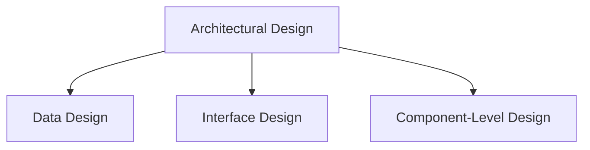

---

### 2.3 Outputs of Design Model

Each design element produces specific outputs used in development:

---

#### 2.3.1 Architecture Diagram

* Represents **overall system structure**
* Shows components and their connections
* Used for high-level understanding

---

#### 2.3.2 ER Diagram

* Represents **data model**
* Shows:

  * Entities
  * Attributes
  * Relationships

---

#### 2.3.3 UI / Interface Specification

* Defines **user interface design**
* Includes:

  * Screens
  * Layout
  * User interactions
* May include API/interface details

---

#### 2.3.4 Class Diagram

* Represents **component-level structure**
* Shows:

  * Classes
  * Attributes
  * Methods
  * Relationships

---

### Overall Flow of Design Model

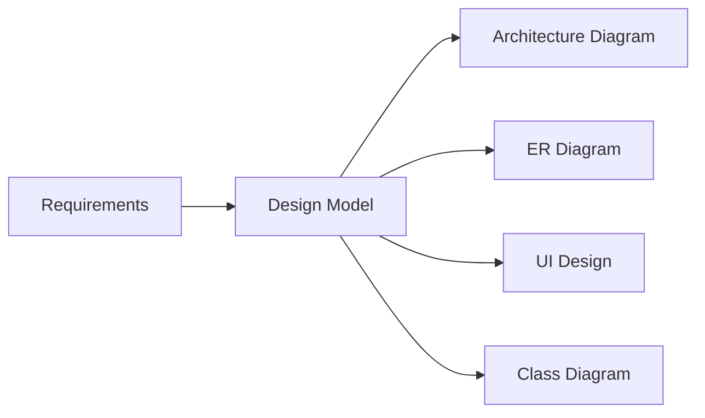
---

## 3. Analysis Model `=>` Design Model Mapping

The **Analysis Model → Design Model Mapping** shows how elements identified during analysis are **converted into design elements**.

* Analysis Model → focuses on **understanding the problem (what)**
* Design Model → focuses on **solution structure (how)**

---

### 🔁 Overall Mapping

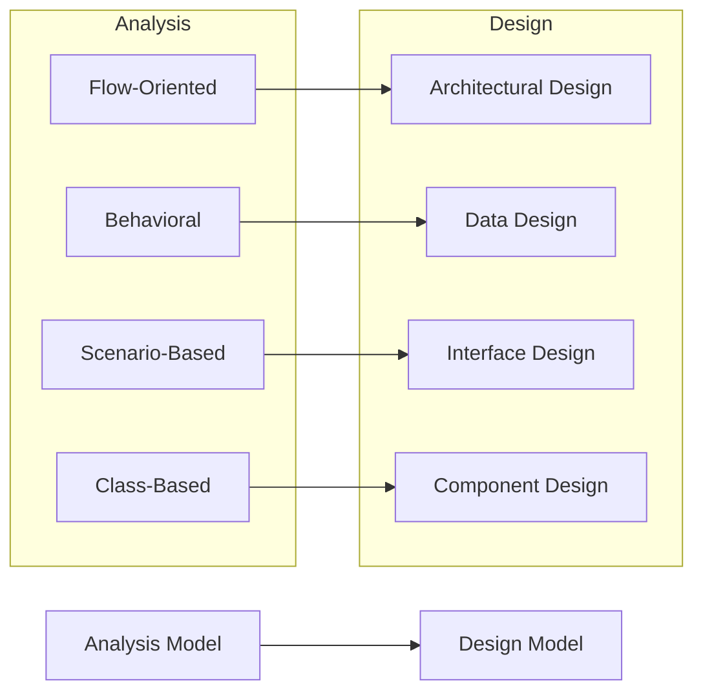

---

### 3.1 Flow-Oriented Elements

Flow-oriented elements describe **how data moves and is processed** in the system.

---

#### 3.1.1 Data Flow Diagrams (DFD)

* Represents **flow of data through the system**
* Shows:

  * Processes
  * Data stores
  * External entities
  * Data flow

**Purpose:**

* Understand input → processing → output

**Used in design for:**

* Identifying modules
* Defining system structure

---

#### 3.1.2 Control Flow Diagrams

* Shows **flow of control (execution order)**
* Focuses on:

  * Conditions
  * Decision points
  * Control logic

**Used in design for:**

* Defining program logic
* Structuring control mechanisms

---

#### 3.1.3 Processing Narratives

* Describes **step-by-step processing logic in text form**

**Includes:**

* Input processing
* Output generation
* Internal operations

**Used in design for:**

* Converting logic into algorithms

---

### 3.2 Scenario-Based Elements

Scenario-based elements describe **user interaction with the system**.

---

#### 3.2.1 Use Case Descriptions

* Textual description of:

  * User actions
  * System responses

**Purpose:**

* Define system functionality from user perspective

---

#### 3.2.2 Use Case Diagrams

* Visual representation of:

  * Actors (users)
  * Use cases (functions)

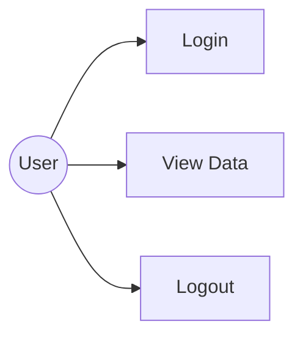

---

#### 3.2.3 Activity Diagrams

* Shows **workflow of activities**

* Includes:

  * Actions
  * Decisions
  * Parallel flows

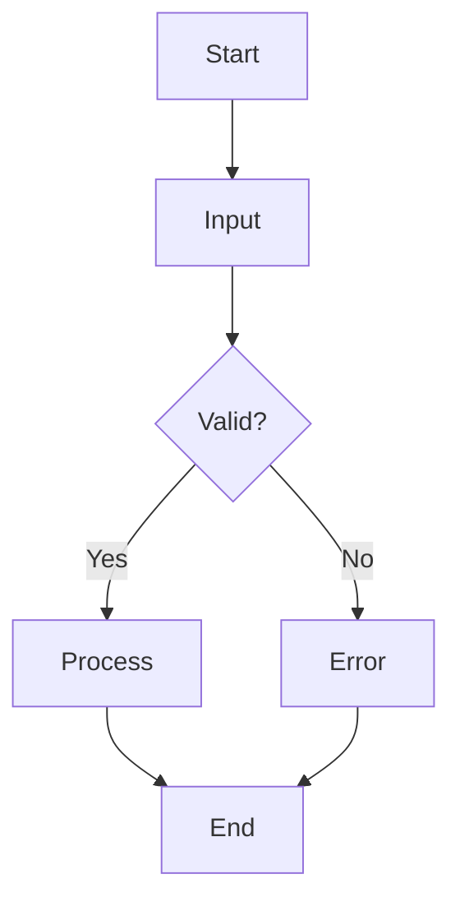

---

#### 3.2.4 Swimlane Diagrams

* Activity diagram with **role separation**

* Divides system into **lanes (actors/components)**

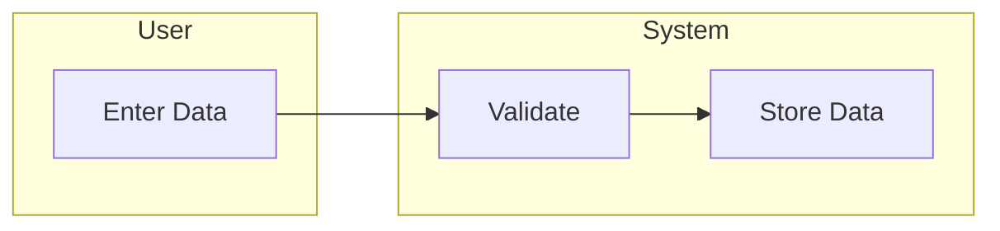

---

### 3.3 Class-Based Elements

Class-based elements define **system structure using objects and classes**.

---

#### 3.3.1 Class Diagrams

* Shows:

  * Classes
  * Attributes
  * Methods
  * Relationships

**Used in design for:**

* Creating object-oriented structure

---

#### 3.3.2 Analysis Packages

* Groups related classes into **packages**

**Purpose:**

* Organize system into logical units

---

#### 3.3.3 CRC Models (Class-Responsibility-Collaboration)

* Defines:

  * Class responsibilities
  * Collaborations with other classes

**Used for:**

* Understanding class behavior

---

#### 3.3.4 Collaboration Diagrams

* Shows **interaction between objects**

* Focus:

  * Message passing
  * Object relationships

---

### 3.4 Behavioral Elements

Behavioral elements describe **dynamic behavior of the system over time**.

---

#### 3.4.1 State Diagrams

* Represents **states of an object/system**

* Shows:

  * State transitions
  * Events

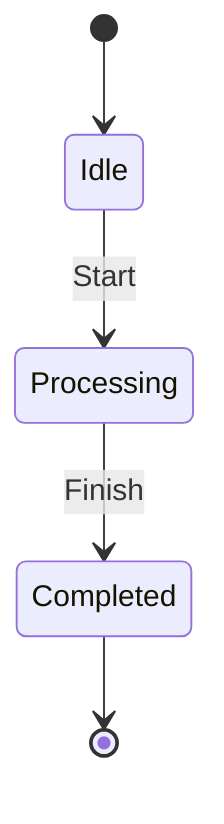

---

#### 3.4.2 Sequence Diagrams

* Shows **interaction between objects over time**

* Focus:

  * Message sequence
  * Time order

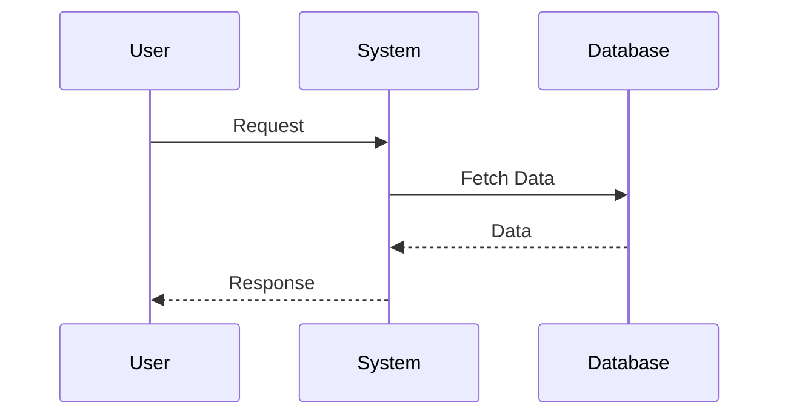

---

## 4. Architectural Design

### 4.1 Definition of Architecture

Software Architecture is the **overall structure of a software system** and the way its components interact with each other.

* It is **not the actual software**, but a **representation of the system**
* Helps in understanding and evaluating system design 

---

#### 4.1.1 Architecture as Representation

Architecture is a **model or blueprint** that enables a software engineer to:

* Analyze whether design meets requirements
* Explore different design alternatives
* Identify and reduce risks early

👉 It provides a **high-level view of the system** before implementation

---

#### 4.1.2 Goals of Architecture

The main goals of software architecture are:

* **Analyze design effectiveness**

  * Check if system satisfies requirements

* **Evaluate alternatives**

  * Compare different architectural approaches

* **Reduce risks**

  * Identify issues early before coding begins

---

### 4.2 Importance of Architecture

Architecture plays a **critical role in software development**.

---

#### 4.2.1 Stakeholder Communication

* Acts as a **common language** between:

  * Developers
  * Designers
  * Clients
  * Testers

* Helps everyone understand system structure

---

#### 4.2.2 Early Design Decisions

* Captures **key decisions at early stages**
* These decisions:

  * Influence future development
  * Are difficult to change later

---

#### 4.2.3 System Success Impact

* Strong architecture leads to:

  * Better performance
  * Higher reliability
  * Easier maintenance

* Poor architecture leads to:

  * System failure
  * High cost of changes

---

### 4.3 Architectural Context

Architectural context defines the **environment in which the system operates**.

---

#### 4.3.1 External Entities

External entities are **outside the system but interact with it**.

**Examples:**

* Users
* Devices (sensors, control panels)
* Other systems (internet services)

---

#### 4.3.2 System Interaction

* Describes how system communicates with external entities
* Defines:

  * Input/output flow
  * Communication channels

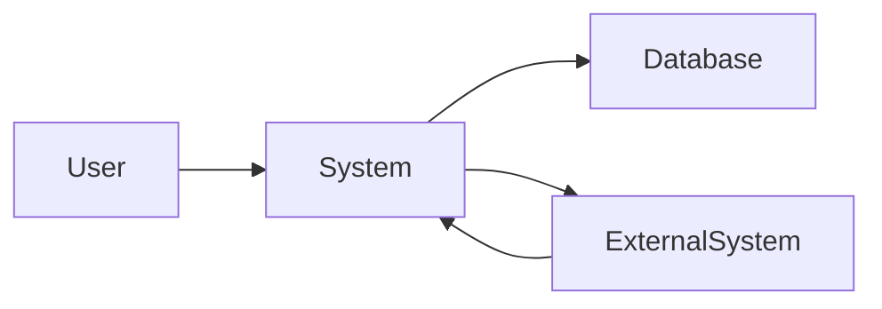

---

### 4.4 Architectural Properties

Architectural properties define the **characteristics of the system structure**.

---

#### 4.4.1 Structural Properties

* Define:

  * System components (modules, objects)
  * Relationships between components

* Focus on:

  * Organization
  * Interaction
  * Structure of system

---

#### 4.4.2 Extra-Functional Properties

These define **quality attributes** of the system:

* **Performance**

  * Speed and responsiveness

* **Capacity**

  * Ability to handle load

* **Reliability**

  * Consistent and correct functioning

* **Security**

  * Protection from threats

* **Adaptability**

  * Ability to evolve and change

---

### 4.5 Families of Related Systems

Architecture supports **reuse across similar systems**.

---

#### 4.5.1 Reusable Architectural Patterns

* Common solutions reused in multiple systems
* Examples:

  * Layered Architecture
  * Client-Server

---

#### 4.5.2 Architectural Building Blocks

* Systems are built using **standard components and patterns**
* Enables:

  * Faster development
  * Consistency
  * Reusability

👉 Architecture promotes **reuse instead of redesigning from scratch**

---

## 5. Architectural Genres and Styles

### 5.1 Architectural Genres

#### 5.1.1 Definition

An **Architectural Genre** refers to a **broad category of software systems** within a particular domain.

* It groups systems based on **similar characteristics or purposes**
* Each genre contains multiple **styles and patterns**
* Concept is similar to categories in real-world structures (e.g., buildings) 

---

#### 5.1.2 Categories and Subcategories

* A genre is divided into:

  * **Categories** (general types of systems)
  * **Subcategories** (specific variations within a category)

**Example:**

* Genre: Software Systems

  * Category: Web Applications

    * Subcategory: E-commerce, Social Media

👉 Each level becomes more **specific and structured**

---

#### 5.1.3 Pattern-Based Structures

* Each genre follows **predictable patterns**
* These patterns define:

  * Structure
  * Behavior
  * Interaction

**Key Idea:**

* Systems in the same genre often use **similar architectural patterns**

---

### 5.2 Architectural Styles

An **Architectural Style** defines a **specific way of organizing a system**.

* It describes:

  * Components
  * Connections
  * Rules of interaction

---

#### 5.2.1 Components

* Fundamental building blocks of the system

**Examples:**

* Modules
* Objects
* Databases
* Services

**Role:**

* Perform specific functions within the system

---

#### 5.2.2 Connectors

* Define **how components communicate and interact**

**Examples:**

* Function calls
* APIs
* Message passing
* Data streams

**Role:**

* Enable:

  * Communication
  * Coordination
  * Cooperation

---

#### 5.2.3 Constraints

* Rules that define **how components can be combined**

**Examples:**

* Layered systems: upper layer depends on lower layer
* Client-server: client cannot directly access database

**Role:**

* Maintain structure and discipline in design

---

#### 5.2.4 Semantic Models

* Provide **meaning and understanding of the system behavior**

* Help designers:

  * Analyze system properties
  * Predict system behavior
  * Understand interactions

**Key Idea:**

* System behavior can be understood by studying its components and relationships

---

### 🔁 Structure of Architectural Style

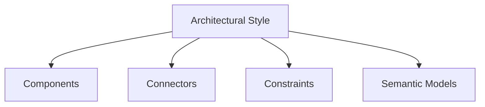

---

## 6. Types of Software Architectures

### 6.1 Data-Centered Architecture

A **Data-Centered Architecture** focuses on a **central data repository** accessed by multiple components.

---

#### 6.1.1 Central Repository

* A **central data store** (database) is maintained
* All components:

  * Read data
  * Write data
  * Modify data

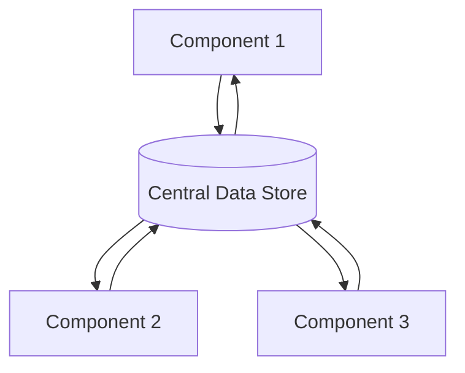

---

#### 6.1.2 Blackboard Model

* A type of data-centered architecture
* Data is shared through a **common “blackboard”**
* Independent components contribute and read data

---

#### 6.1.3 Advantages

* Easy to add new components
* Components are independent
* Centralized data management
* Easy data sharing

---

#### 6.1.4 Disadvantages

* Single point of failure
* Performance bottleneck
* Security risks (central access)

---

### 6.2 Data Flow Architecture

Data Flow Architecture focuses on **transforming input data into output through a series of processing steps**.

---

#### 6.2.1 Pipe-and-Filter Model

* System is divided into:

  * **Filters** → process data
  * **Pipes** → transfer data

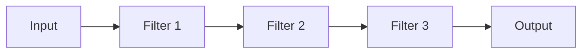

---

#### 6.2.2 Batch Sequential Model

* Data is processed in **sequence of steps**
* Output of one step becomes input to next

---

#### 6.2.3 Advantages

* Simple and easy to understand
* High reusability of components
* Easy testing and maintenance

---

#### 6.2.4 Disadvantages

* Not suitable for interactive systems
* Data format changes affect entire system

---

### 6.3 Call and Return Architecture

This architecture organizes system into **hierarchical modules**.

---

#### 6.3.1 Main Program/Subprogram

* A **main program** controls execution
* Calls multiple **subprograms/functions**

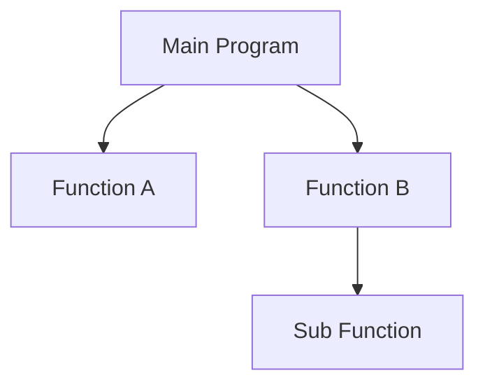

---

#### 6.3.2 RPC (Remote Procedure Call)

* Allows calling a **procedure on another system over a network**
* Appears like a local function call

---

#### 6.3.3 Hierarchical Control Structure

* System is arranged in **levels**
* Top-level modules control lower-level modules

---

### 6.4 Object-Oriented Architecture

Architecture based on **objects and classes**.

---

#### 6.4.1 Objects and Classes

* **Object** → instance of a class
* **Class** → blueprint defining:

  * Attributes
  * Methods

---

#### 6.4.2 Encapsulation

* Data and methods are **bundled together**
* Internal details are hidden from outside

**Benefits:**

* Security
* Modularity
* Reusability

---

### 6.5 Layered Architecture

System is divided into **layers**, each with specific responsibilities.

---

#### 6.5.1 Layer Types

1. **User Interface Layer**

   * Handles user interaction

2. **Application Layer**

   * Controls application flow

3. **Utility Layer**

   * Provides common services

4. **Core Layer**

   * Contains business logic

---

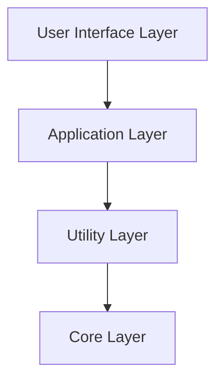

---

#### 6.5.2 Responsibilities of Layers

* Each layer:

  * Performs a specific function
  * Interacts only with adjacent layers

**Advantages:**

* Easy maintenance
* Clear separation of concerns
* Scalability

**Disadvantages:**

* Performance overhead
* Strict dependency between layers

---

## 7. Architectural Patterns

Architectural Patterns are **proven solutions to common architectural problems** in software design.

* They define:

  * Structure of system
  * Interaction between components
  * Behavior under specific conditions 

---

### 7.1 Concurrency Patterns

Concurrency patterns are used when a system must **handle multiple tasks simultaneously**.

---

#### 7.1.1 Process Management

* Manages multiple **processes or threads** running in parallel

**Functions:**

* Process creation
* Process termination
* Resource allocation

**Example:**

* Operating system managing multiple applications

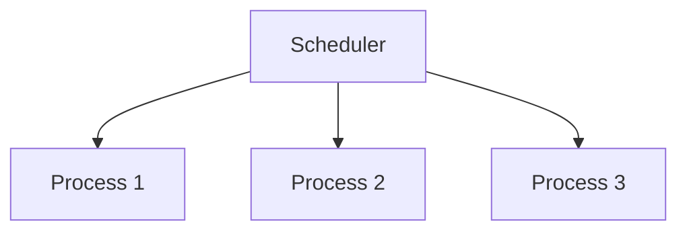

---

#### 7.1.2 Task Scheduling

* Determines **order and timing of task execution**

**Types:**

* Sequential scheduling
* Priority-based scheduling
* Round-robin scheduling

**Purpose:**

* Efficient CPU utilization
* Fair resource sharing

---

### 7.2 Persistence Patterns

Persistence patterns ensure that **data survives beyond program execution**.

---

#### 7.2.1 DBMS Pattern

* Uses a **Database Management System** for storage

**Features:**

* Data stored in database
* Supports:

  * Insert
  * Update
  * Delete
  * Retrieve

**Advantages:**

* Data consistency
* Reliability
* Centralized storage

---

#### 7.2.2 Application-Level Persistence

* Persistence is handled **within the application itself**

**Examples:**

* File storage
* Object serialization

**Features:**

* Custom storage logic
* More control over data

---

### 7.3 Distribution Patterns

Distribution patterns define how **components interact across different systems or locations**.

---

#### 7.3.1 Distributed Systems

* System is divided across **multiple machines or nodes**

**Features:**

* Communication over network
* Resource sharing
* Scalability

---

#### 7.3.2 Broker Pattern

* A **broker acts as an intermediary** between client and server


**Functions of Broker:**

* Message routing
* Service discovery
* Communication management

**Advantages:**

* Decouples client and server
* Improves flexibility
* Supports distributed systems

---

## 8. Architectural Design Process

The Architectural Design Process defines how a system’s **structure, components, and interactions** are developed from requirements.

---

### 8.1 Context Modeling

Context modeling identifies the **environment in which the system operates**.

---

#### 8.1.1 System Placement

* Defines where the system exists in relation to:

  * External systems
  * Devices
  * Users

* Shows system boundary

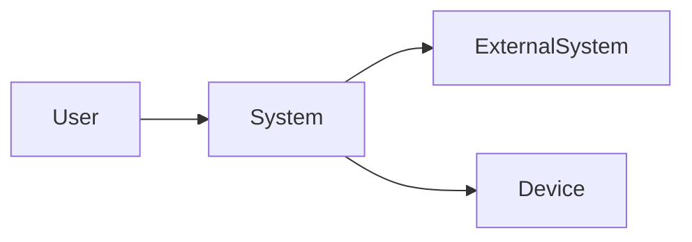

---

#### 8.1.2 External Interaction

* Defines how the system **communicates with external entities**

**Includes:**

* Input from users/devices
* Output to systems
* Data exchange mechanisms

---

### 8.2 Architectural Archetypes

---

#### 8.2.1 Definition

An **Archetype** is an **abstract representation of a system component** that captures a specific responsibility or behavior.

* Similar to a **class template**
* Used to model system structure at a high level 

---

#### 8.2.2 Types (Controller, Node, Detector, Indicator)

* **Controller**

  * Manages system operations
  * Controls flow of execution

* **Node**

  * Represents a processing unit or subsystem

* **Detector**

  * Detects events or changes (e.g., sensors)

* **Indicator**

  * Provides output or signals (e.g., alarms, display)

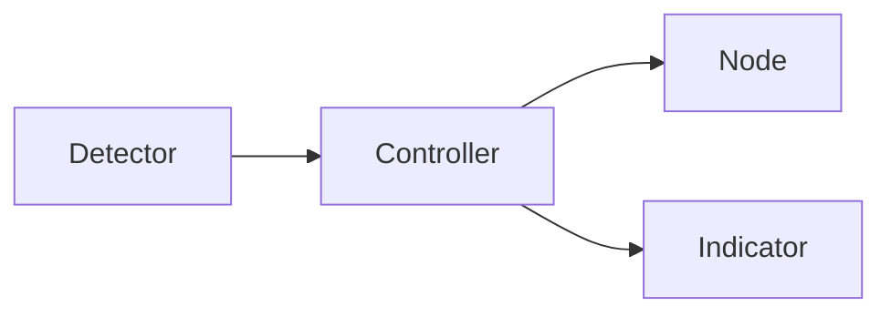

---

### 8.3 Component Structure

Defines how the system is divided into **components/modules**.

---

#### 8.3.1 Initial Structure

* High-level identification of components
* Basic interaction between components

**Example Components:**

* User Interface
* Processing Unit
* Communication Module

---

#### 8.3.2 Refined Structure

* Detailed breakdown of components into sub-components
* Specifies:

  * Internal logic
  * Interactions
  * Responsibilities

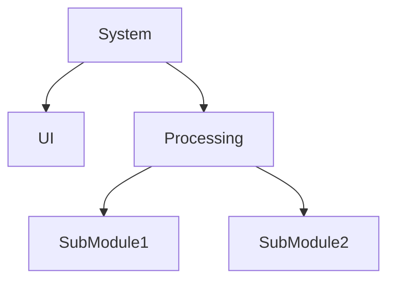

---

### 8.4 Architectural Complexity

Architectural complexity is determined by **dependencies between components**.

---

#### 8.4.1 Sharing Dependencies

* Occurs when multiple components **share the same resource**

**Example:**

* Multiple modules accessing same database

---

#### 8.4.2 Flow Dependencies

* Occurs when one component **depends on output of another**

**Example:**

* Input → Processing → Output chain

---

#### 8.4.3 Constrained Dependencies

* Occurs when there are **rules restricting execution order**

**Example:**

* Task A must complete before Task B starts

---

```mermaid id="y2w8rs"
flowchart LR
A[Component A] --> B[Component B]
B --> C[Component C]
```

---

## 9. Architectural Description Language (ADL)

ADL is used to **formally describe the architecture of a software system**.

---

### 9.1 Definition of ADL

An **Architectural Description Language (ADL)** is a language that provides **syntax and semantics** to represent software architecture.

* It helps in:

  * Describing components
  * Defining relationships
  * Representing system structure
* Enables clear and precise architectural documentation 

---

#### 9.1.1 Syntax and Semantics

* **Syntax**

  * Defines the **structure and rules** for writing architectural descriptions
  * Specifies how components and connections are expressed

* **Semantics**

  * Defines the **meaning of the elements** in the architecture
  * Helps in understanding system behavior

---

### 9.2 Capabilities of ADL

ADL provides powerful capabilities to model and manage architecture.

---

#### 9.2.1 Decomposition of Components

* Breaks system into **smaller components/modules**

**Purpose:**

* Simplifies complex systems
* Improves understanding

---

#### 9.2.2 Composition into Systems

* Combines smaller components to form a **complete system**

**Purpose:**

* Build system structure
* Define relationships between components

```mermaid id="g4x7qp"
flowchart TD
C1[Component 1] --> System
C2[Component 2] --> System
C3[Component 3] --> System
```

---

#### 9.2.3 Interface Representation

* Defines how components **interact with each other**

**Includes:**

* Inputs and outputs
* Communication mechanisms
* Connection rules

```mermaid id="x8n2vb"
flowchart LR
A[Component A] -->|Interface| B[Component B]
```

---

## 10. Architectural Design Method

Architectural Design Method defines **how requirements are converted into system architecture**.

---

### 10.1 Requirement Mapping

Requirement Mapping is the process of **translating user needs into architectural structure**.

---

#### 10.1.1 Customer Requirements

* These are **user-defined needs and expectations**

**Examples:**

* Functional requirements (features)
* Non-functional requirements:

  * Performance
  * Security
  * Reliability

👉 Example:

* “System should support multiple users”
* “System should respond within 2 seconds”

---

#### 10.1.2 Translation to Architecture

* Requirements are converted into:

  * Components
  * Modules
  * Interactions

**Process:**

1. Identify major system functions
2. Define system components
3. Establish relationships between components
4. Select appropriate architectural style

```mermaid id="r9c3hv"
flowchart LR
Req[Customer Requirements] --> Arch[Architecture Design]
Arch --> Components[Components & Modules]
```

---

### 10.2 Deriving Program Architecture

Program architecture is derived from **analysis models and data flow**.

---

#### 10.2.1 Transform Mapping

Transform Mapping is a method used to **convert data flow diagrams (DFD) into program structure**.

**Steps:**

1. Identify input flow (data entering system)
2. Identify transformation center (processing logic)
3. Identify output flow (results produced)
4. Map these into program modules

```mermaid id="u6k2zn"
flowchart LR
Input --> Transform[Processing Center] --> Output
```

**Purpose:**

* Convert analysis (DFD) into structured program design
* Helps define module hierarchy

---

## 11. Partitioning in Architecture

Partitioning is the process of **dividing a system into smaller, manageable parts (modules)** to improve design quality.

* Helps in:

  * Reducing complexity
  * Improving maintainability
  * Enhancing clarity of system structure 

---

### 11.1 Horizontal Partitioning

Horizontal Partitioning divides the system into **separate functional branches**.

---

#### 11.1.1 Functional Decomposition

* System is divided based on **major functions**

**Example:**

* Login Module
* Payment Module
* Report Module

```mermaid id="x7p2qa"
flowchart LR
System --> Function1
System --> Function2
System --> Function3
```

---

#### 11.1.2 Control Modules

* Special modules that **coordinate communication between functions**

**Functions:**

* Manage data flow
* Control execution order
* Integrate different modules

---

### 11.2 Vertical Partitioning (Factoring)

Vertical Partitioning organizes system into **hierarchical levels** based on control and responsibility.

---

#### 11.2.1 Decision Modules

* Located at **top level**
* Responsible for:

  * Decision making
  * Control flow

**Example:**

* Main controller
* Manager modules

---

#### 11.2.2 Worker Modules

* Located at **lower levels**
* Responsible for:

  * Performing actual tasks
  * Processing data

```mermaid id="k8z4vm"
flowchart TD
Decision[Decision Module]
Decision --> Worker1[Worker Module 1]
Decision --> Worker2[Worker Module 2]
```

---

### 11.3 Advantages of Partitioning

Partitioning improves overall software design.

---

#### 11.3.1 Easier Testing

* Modules can be **tested independently**
* Simplifies debugging

---

#### 11.3.2 Maintainability

* Changes in one module **do not affect entire system**
* Easy to update

---

#### 11.3.3 Reduced Side Effects

* Errors are **localized within modules**
* Minimizes impact on other parts

---

#### 11.3.4 Extensibility

* New features can be **added easily**
* Supports system growth

---

## 12. Fundamental Design Concepts

Fundamental design concepts are **basic principles that guide software design** and help create systems that are **efficient, maintainable, and scalable** 

---

### 12.1 Abstraction

Abstraction is the process of **focusing on essential features while hiding unnecessary details**.

---

#### 12.1.1 Data Abstraction

* Represents data in a simplified form
* Hides internal data representation

**Example:**

* A “Bank Account” shows balance, not internal storage

---

#### 12.1.2 Procedural Abstraction

* Represents operations without showing implementation

**Example:**

* `withdraw()` function hides internal logic

---

### 12.2 Architecture

Architecture refers to the **overall structure of the software system**.

---

#### 12.2.1 Structural View

* Defines:

  * Components
  * Relationships
  * Organization

---

#### 12.2.2 Conceptual Integrity

* Ensures system design is:

  * Consistent
  * Unified
  * Well-organized

---

### 12.3 Patterns

Patterns are **reusable solutions to common design problems**.

---

#### 12.3.1 Reusable Design Solutions

* Provide:

  * Proven approaches
  * Standard structures
* Improve design efficiency

---

### 12.4 Separation of Concerns

Separation of concerns divides a system into **distinct sections**, each handling a specific responsibility.

---

#### 12.4.1 Problem Decomposition

* Breaks complex problems into **smaller parts**
* Each part focuses on one concern

---

### 12.5 Modularity

Modularity is the process of dividing a system into **independent modules**.

---

#### 12.5.1 Definition

* Each module performs a **specific function**

---

#### 12.5.2 Benefits

* Easier understanding
* Easier testing
* Easier maintenance

---

#### 12.5.3 Trade-offs

* Too many modules → complex integration
* Too few modules → high complexity

---

### 12.6 Information Hiding

Information hiding means **restricting access to internal details** of a module.

---

#### 12.6.1 Controlled Interfaces

* Access to module is only through **defined interfaces**

---

#### 12.6.2 Encapsulation

* Combines:

  * Data
  * Methods
* Hides internal implementation

---

### 12.7 Functional Independence

Functional independence ensures each module works **independently with minimal interaction**.

---

#### 12.7.1 High Cohesion

* A module performs **one specific task**

---

#### 12.7.2 Low Coupling

* Minimal dependency between modules

```mermaid id="q2z7nx"
flowchart LR
A[Module A] --> B[Module B]
style A fill:#d4f1f9
style B fill:#d4f1f9
```

---

### 12.8 Refinement

Refinement is the process of **gradually adding detail to a design**.

---

#### 12.8.1 Stepwise Elaboration

* Start with high-level design
* Break into detailed steps progressively

---

### 12.9 Aspects

Aspects deal with **cross-cutting concerns** affecting multiple parts of the system.

---

#### 12.9.1 Cross-Cutting Concerns

**Examples:**

* Logging
* Security
* Error handling

---

### 12.10 Refactoring

Refactoring is the process of **improving code structure without changing functionality**.

---

#### 12.10.1 Code Improvement

* Simplifies code
* Removes redundancy

---

#### 12.10.2 Maintainability

* Makes code:

  * Easier to understand
  * Easier to modify

---

### 12.11 Design Classes (OO Design)

Design classes provide **detailed structure for implementing analysis classes**.

---

#### 12.11.1 Analysis to Design Mapping

* Converts:

  * Analysis classes → Design classes

* Adds:

  * Attributes
  * Methods
  * Implementation details

---

## 13. Design Quality

Design Quality ensures that the software design is **correct, complete, and suitable for implementation**.

* A good design should:

  * Meet requirements
  * Be easy to understand
  * Guide coding and testing effectively 

---

### 13.1 Design Requirements

Design must satisfy both **explicit and implicit requirements**.

---

#### 13.1.1 Explicit Requirements

* Requirements that are **clearly stated by the user or in documentation**

**Examples:**

* Functional features
* System constraints
* Input/output specifications

👉 These must be **fully implemented in design**

---

#### 13.1.2 Implicit Requirements

* Requirements that are **not directly stated but expected**

**Examples:**

* Performance
* Security
* Usability
* Reliability

👉 These are **assumed expectations** and must also be considered

---

### 13.2 Design Characteristics

A high-quality design should have the following characteristics:

---

#### 13.2.1 Readability

* Design should be **easy to read and interpret**

**Features:**

* Clear structure
* Proper naming
* Simple representation

---

#### 13.2.2 Understandability

* Design should be **easy to understand by developers and stakeholders**

**Features:**

* Logical organization
* Clear relationships between components
* Well-defined modules

---

#### 13.2.3 Completeness

* Design should provide a **complete view of the system**

**Includes:**

* Data aspects
* Functional behavior
* System interactions

👉 No important detail should be missing for implementation

---

## 14. Interface Design and UI Design

Interface and UI Design focus on **how users and system components interact** and how the system is presented to users.

---

### 14.1 Interface Design

#### 14.1.1 Definition

Interface Design defines **how different parts of the system communicate**.

* Includes:

  * User Interface (UI)
  * System Interfaces (APIs)
* Specifies:

  * Inputs
  * Outputs
  * Interaction methods 

---

#### 14.1.2 User-System Interaction

* Defines how users interact with the system

**Includes:**

* Input methods (keyboard, mouse, touch)
* Output formats (screens, reports)
* Navigation between screens

```mermaid id="c8r2mv"
flowchart LR
User --> Interface --> System
System --> Interface --> User
```

---

### 14.2 Interface Analysis

Interface Analysis focuses on understanding **who will use the system and how**.

---

#### 14.2.1 Users (End Users)

* Identify different types of users:

  * Beginners
  * Experienced users
* Consider:

  * Skills
  * Needs
  * Preferences

---

#### 14.2.2 Tasks

* Identify tasks users need to perform

**Examples:**

* Login
* Data entry
* Report generation

---

#### 14.2.3 Content

* Identify information displayed to users

**Includes:**

* Text
* Images
* Data
* Messages

---

### 14.3 UI Design

UI Design focuses on the **visual and interactive aspects of the system**.

---

#### 14.3.1 UI Elements

* Components used in interface:

  * Buttons
  * Forms
  * Menus
  * Icons

---

#### 14.3.2 User Experience

* Focus on how users **feel while using the system**

**Goals:**

* Ease of use
* Efficiency
* Satisfaction

---

### 14.4 UI Design Process

#### 14.4.1 Design Steps

1. **Interface Analysis**

   * Understand users, tasks, and content

2. **Design**

   * Create layout and structure

3. **Implementation**

   * Develop UI components

4. **Evaluation**

   * Test usability and improve

```mermaid id="p4x9qt"
flowchart LR
Analysis --> Design --> Implementation --> Evaluation
```

---

### 14.5 Golden Rules of UI Design

These rules ensure **effective and user-friendly interfaces**.

---

#### 14.5.1 User Control

* Users should feel **in control of the system**

**Examples:**

* Undo/Redo options
* Cancel operations

---

#### 14.5.2 Reduce Memory Load

* System should minimize what users need to remember

**Examples:**

* Provide menus
* Use icons
* Autofill data

---

#### 14.5.3 Consistency

* Interface should follow **uniform design patterns**

**Examples:**

* Same layout across screens
* Consistent colors and buttons

---

## 15. Data-Oriented Analysis and Design

Data-Oriented Analysis and Design focuses on **how data is represented, structured, and managed** in a system.

---

### 15.1 Data vs Information

#### 15.1.1 Definitions

* **Data**

  * Raw facts or figures without context
  * Example: `100`, `John`, `2026`

* **Information**

  * Processed data that has meaning
  * Example: “John scored 100 marks in 2026”

---

#### 15.1.2 Differences

| Aspect  | Data             | Information    |
| ------- | ---------------- | -------------- |
| Nature  | Raw facts        | Processed data |
| Meaning | No meaning alone | Meaningful     |
| Use     | Input            | Output         |
| Example | 50, A, 10/04     | “Score is 50”  |

---

### 15.2 Entity-Relationship (ER) Model

The ER Model is a **conceptual model used for database design**.

* Represents real-world objects and their relationships
* Introduced by **Peter Chen** 

---

#### 15.2.1 Entities

* An **entity** is an object that exists and can be identified

**Examples:**

* Student

* Employee

* Product

* **Entity Set**: Collection of similar entities

---

#### 15.2.2 Attributes

* Properties that describe an entity

**Examples:**

* Student → Name, Roll No, Age

---

#### 15.2.3 Relationships

* Defines association between entities

**Example:**

* Student **enrolls in** Course

---

### 15.3 ER Diagrams

ER Diagrams visually represent the **ER model**.

---

#### 15.3.1 Notations

* **Rectangle** → Entity
* **Diamond** → Relationship
* **Ellipse** → Attribute
* **Line** → Connection

```mermaid id="e4k2zs"
flowchart LR
Student[Student] ---|enrolls| Course[Course]
Student --- Name((Name))
Student --- Roll((Roll No))
```

---

#### 15.3.2 Attribute Types

* **Composite Attribute**

  * Can be divided into sub-parts
  * Example: Name → First, Last

* **Multivalued Attribute**

  * Can have multiple values
  * Example: Phone Numbers

* **Derived Attribute**

  * Calculated from other attributes
  * Example: Age from Date of Birth

---

### 15.4 Cardinality Constraints

Cardinality defines **number of relationships between entities**.

---

#### 15.4.1 One-to-One (1:1)

* One entity is related to **only one** entity

**Example:**

* Person ↔ Passport

---

#### 15.4.2 One-to-Many (1:N)

* One entity is related to **many entities**

**Example:**

* Teacher → Students

---

#### 15.4.3 Many-to-One (N:1)

* Many entities relate to **one entity**

**Example:**

* Many Students → One Course

---

#### 15.4.4 Many-to-Many (M:N)

* Many entities relate to **many entities**

**Example:**

* Students ↔ Courses

```mermaid id="m8r3qn"
flowchart LR
Student --- Course
```

---

### 15.5 Extended ER Features

Extended ER (EER) adds **advanced modeling concepts**.

---

#### 15.5.1 Specialization

* Top-down approach
* Divides an entity into **sub-entities**

**Example:**

* Vehicle → Car, Bike

---

#### 15.5.2 Generalization

* Bottom-up approach
* Combines entities into a **general entity**

**Example:**

* Car + Bike → Vehicle

---

#### 15.5.3 Aggregation

* Treats a relationship as a **higher-level entity**

**Purpose:**

* Represent complex relationships

```mermaid id="n5t2lx"
flowchart TD
A[Entity A] --> R[Relationship]
B[Entity B] --> R
R --> C[Aggregated Entity]
```

---

## 16. Data Flow Modeling

Data Flow Modeling represents **how data moves through a system and how it is processed**.

---

### 16.1 Flow Modeling Notation

Flow modeling uses standard symbols to represent system elements.

---

#### 16.1.1 External Entity

* A **source or destination of data** outside the system

**Examples:**

* User
* Device
* External system

---

#### 16.1.2 Process

* A **data transformation unit**
* Converts input data into output

**Examples:**

* Calculate result
* Generate report

---

#### 16.1.3 Data Flow

* Represents **movement of data** between components

* Shown as **arrows**

---

#### 16.1.4 Data Store

* A place where **data is stored for later use**

**Examples:**

* Database
* File system

---

```mermaid id="h3k8vp"
flowchart LR
User -->|Input Data| Process
Process -->|Store| DataStore[(Data Store)]
DataStore -->|Retrieve| Process
Process -->|Output| User
```

---

### 16.2 Data Flow Diagrams (DFD)

DFD is a graphical representation of **data flow in a system**.

---

#### 16.2.1 Level 0 (Context Diagram)

* Represents the **entire system as a single process**
* Shows interaction with external entities

```mermaid id="v7q2zb"
flowchart LR
User --> System
System --> User
```

---

#### 16.2.2 Level 1

* Breaks the system into **multiple processes**
* Shows internal data flow

```mermaid id="p2n7xr"
flowchart LR
User --> P1[Process 1]
P1 --> P2[Process 2]
P2 --> Output
```

---

#### 16.2.3 Data Flow Hierarchy

* DFD is developed in **levels**:

  * Level 0 → Overview
  * Level 1 → Detailed
  * Level 2 → More detailed

👉 Each level provides **more detail than the previous**

---

### 16.3 DFD Construction

---

#### 16.3.1 Constructing DFD – I

Steps:

1. Review user requirements
2. Identify data objects
3. Identify external entities
4. Create Level 0 DFD

---

#### 16.3.2 Constructing DFD – II

Steps:

1. Describe processing logic
2. Break processes into sub-processes
3. Maintain data flow consistency
4. Create Level 1 DFD

---

#### 16.3.3 Expansion Rules

* Expand one process into **multiple sub-processes**
* Maintain **input-output consistency**
* Use approximate **1:5 expansion ratio**

---

### 16.4 DFD Guidelines

---

#### 16.4.1 Naming Conventions

* Use **meaningful names**
* Label all:

  * Processes
  * Data flows
  * Data stores

---

#### 16.4.2 Flow Continuity

* Data must:

  * Originate from a source
  * End at a destination

* No broken or incomplete flows

---

#### 16.4.3 Balancing

* Input/output of parent process must match **child processes**

👉 Ensures consistency across levels

---

### 16.5 Data Dictionary

---

#### 16.5.1 Definition

A **Data Dictionary** is a **repository of information about data (metadata)**.

* Contains:

  * Data definitions
  * Data types
  * Structures
* Supports DFD development 

---

#### 16.5.2 Uses

* **Validation**

  * Ensures DFD correctness

* **Screen/Report Design**

  * Helps design UI and reports

* **Data Storage**

  * Defines database structure

* **Logic Development**

  * Helps in defining process logic

---

## 17. Component-Level Design

Component-Level Design focuses on the **internal working of individual modules/components** in a software system.

---

### 17.1 Definition

Component-Level Design is the process of defining the **detailed structure and logic of each component**.

* It provides:

  * Class definitions
  * Methods/functions
  * Algorithms
* Acts like **detailed design for implementation** 

---

#### 17.1.1 Internal Component Details

Each component includes:

* **Data Structures**

  * Variables, data types

* **Processing Logic**

  * Algorithms
  * Control flow

* **Interfaces**

  * Input/output behavior

👉 Fully describes how a component works internally

---

### 17.2 Component Structure

Defines how components are **organized and interact internally**.

---

#### 17.2.1 Basic Structure

* High-level representation of components

**Includes:**

* Major modules
* Basic relationships

```mermaid id="k3r7vm"
flowchart TD
System --> Component1
System --> Component2
```

---

#### 17.2.2 Refined Structure

* Detailed breakdown of components into **sub-components**

**Includes:**

* Internal modules
* Specific functions
* Interactions

```mermaid id="t8p2xn"
flowchart TD
Component --> Sub1[Sub Component 1]
Component --> Sub2[Sub Component 2]
Sub1 --> Function1
Sub2 --> Function2
```

---

### 17.3 Cohesion and Coupling

Cohesion and Coupling are key concepts used to measure **quality of module design**.

---

#### 17.3.1 Types of Cohesion

Cohesion refers to how **closely related functions within a module are**.

**Types (low → high quality):**

* **Coincidental Cohesion**

  * Unrelated functions grouped together

* **Logical Cohesion**

  * Related by category

* **Temporal Cohesion**

  * Executed at same time

* **Procedural Cohesion**

  * Follow a sequence

* **Communicational Cohesion**

  * Use same data

* **Sequential Cohesion**

  * Output of one part is input to another

* **Functional Cohesion (Best)**

  * Performs one specific task

---

#### 17.3.2 Types of Coupling

Coupling refers to **dependency between modules**.

**Types (high → low quality):**

* **Content Coupling**

  * One module depends on internal details of another

* **Common Coupling**

  * Shared global data

* **Control Coupling**

  * One module controls another

* **Stamp Coupling**

  * Passing data structures

* **Data Coupling (Best)**

  * Modules communicate through simple data

---

### 🔁 Goal

* **High Cohesion + Low Coupling = Good Design**

---

## 18. Procedural Design

Procedural Design focuses on **designing the step-by-step logic (procedures/algorithms)** used to implement system functionality.

---

### 18.1 Definition

Procedural Design is the process of defining **algorithms and control structures** that specify how tasks are performed.

* Emphasizes:

  * Sequence of operations
  * Logic flow
  * Step-by-step execution

* Closely related to **component-level design**

---

#### 18.1.1 Algorithmic Design

Algorithmic Design involves creating **clear and efficient algorithms** for solving problems.

**Characteristics of a good algorithm:**

* Correct
* Efficient
* Finite (must terminate)
* Unambiguous

**Basic control structures:**

* Sequence
* Selection (if-else)
* Iteration (loops)

```mermaid id="z9k3tp"
flowchart TD
Start --> Input
Input --> Decision{Condition}
Decision -->|Yes| Process1
Decision -->|No| Process2
Process1 --> End
Process2 --> End
```

---

### 18.2 Procedural Abstraction

Procedural Abstraction means representing a procedure by **what it does, not how it does it**.

---

#### 18.2.1 Implementation Details

* Internal working of a procedure is **hidden from the user**

**Example:**

* Function: `calculateSalary()`

  * User knows its purpose
  * Internal calculations are hidden

**Benefits:**

* Reduces complexity
* Improves readability
* Enhances modularity

---
