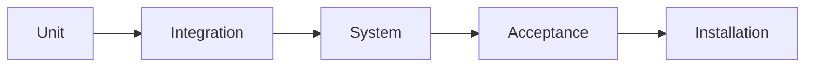
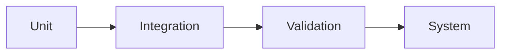
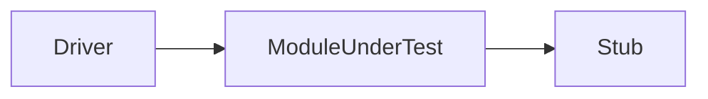

# Unit - 5

:::info[TITLE]
## Coding & Unit Testing
:::

## 1. Programming Principles and Guidelines

Programming principles and guidelines help in writing **efficient, readable, and maintainable code**.

---

### 1.1 Selection of Data Structures

* Choose data structures that **fit the problem requirements**

**Examples:**

* Array → fixed-size data
* Linked List → dynamic data
* Stack/Queue → ordered processing

**Importance:**

* Improves performance
* Reduces complexity
* Optimizes memory usage

---

### 1.2 Simplicity in Conditional Logic

* Keep conditions **simple and easy to understand**

**Guidelines:**

* Avoid deeply nested conditions
* Use clear logical expressions
* Prefer readability over clever logic

**Bad Practice:**

* Complex nested if-else

**Good Practice:**

* Break into smaller conditions

---

### 1.3 Understanding Software Architecture

* Code should follow the **overall system architecture**

**Guidelines:**

* Respect module boundaries
* Maintain proper interfaces
* Avoid violating design structure

**Importance:**

* Ensures consistency
* Improves integration
* Reduces errors

---

### 1.4 Meaningful Variable Naming

* Use **clear and descriptive names**

**Examples:**

* `x` ❌
* `studentCount` ✅

**Guidelines:**

* Follow naming conventions
* Use consistent style
* Avoid ambiguous names

---

### 1.5 Self-Documenting Code

* Code should **explain itself**

**Guidelines:**

* Use meaningful names
* Avoid unnecessary comments
* Write clean logic

**Example:**

* `calculateTotalMarks()` is self-explanatory

---

### 1.6 Visual Layout of Code

* Maintain proper **formatting and structure**

**Includes:**

* Indentation
* Spacing
* Alignment

**Benefits:**

* Improves readability
* Makes debugging easier

---

### 1.7 Structured Programming Practices

* Follow **structured programming principles**

**Concepts:**

* Sequence
* Selection (if-else)
* Iteration (loops)

**Guidelines:**

* Single entry and exit
* Avoid `goto` statements
* Use clear control flow

---

## 2. Programming Practices

Programming practices are **techniques followed while coding** to improve quality, readability, and reliability of software.

---

### 2.1 Control Constructs

* Use **structured control constructs**:

  * Sequence
  * Selection (if-else, switch)
  * Iteration (loops)

**Guideline:**

* Follow **single entry and single exit** principle

---

### 2.2 Avoidance of GOTO Statements

* Avoid using `goto` as it makes code **unstructured and hard to understand**

**Problems with goto:**

* Breaks program flow
* Difficult debugging
* Reduces readability

---

### 2.3 Information Hiding

* Hide internal implementation details of modules

**Guideline:**

* Access data only through **defined interfaces**

**Benefit:**

* Improves security
* Reduces dependency

---

### 2.4 Nesting

* Nesting means placing one control structure inside another

**Guideline:**

* Avoid **deep nesting**

**Reason:**

* Makes code complex
* Hard to understand and debug

---

### 2.5 User-Defined Data Types

* Create custom data types for better clarity

**Examples:**

* Structures
* Classes

**Benefit:**

* Improves readability
* Better organization of data

---

### 2.6 Modular Size

* Divide program into **modules of appropriate size**

**Guideline:**

* Avoid very large modules
* Keep modules manageable

**Benefit:**

* Easier testing
* Easier maintenance

---

### 2.7 Side Effects

* Side effects occur when a change in one part **affects other parts unexpectedly**

**Guideline:**

* Minimize dependencies between modules

**Benefit:**

* Reduces unexpected errors

---

### 2.8 Robustness

* Software should handle **errors and unexpected inputs gracefully**

**Guideline:**

* Implement exception handling
* Avoid program crashes

**Example:**

* Handle divide-by-zero

---

### 2.9 Switch Case with Default

* Always include a **default case in switch statements**

**Reason:**

* Handles unexpected values

**Benefit:**

* Improves reliability
* Prevents undefined behavior

---

## 3. Coding Standards

Coding standards are **rules and conventions for writing code in a uniform and consistent manner**.

---

### 3.1 Definition of Coding Standards

Coding Standards define how code should be:

* Written
* Structured
* Formatted

They ensure that all developers follow a **common coding style** 

---

### 3.2 Purpose of Coding Standards

---

#### 3.2.1 Uniform Appearance

* Code written by different developers looks **consistent**

**Benefit:**

* Easier to read and review

---

#### 3.2.2 Improved Understanding

* Standardized format makes code **easy to understand**

**Benefit:**

* Faster learning for new developers

---

#### 3.2.3 Encouragement of Good Practices

* Promotes:

  * Clean code
  * Proper structure
  * Best practices

---

### 3.3 Rules in Coding Standards

---

#### 3.3.1 Limiting Global Variables

* Restrict use of **global variables**

**Reason:**

* Avoid unwanted dependencies
* Reduce side effects

---

#### 3.3.2 Naming Conventions

* Follow consistent naming rules:

**Examples:**

* Global variables → Capitalized
* Local variables → lowercase
* Constants → UPPERCASE

**Benefit:**

* Improves readability and clarity

---

### 3.4 Header Information in Modules

Each module should include a **standard header section**.

---

#### 3.4.1 Module Name

* Name of the module

---

#### 3.4.2 Creation Date

* Date when module was created

---

#### 3.4.3 Author Name

* Name of the developer

---

#### 3.4.4 Modification History

* Record of changes made over time

---

#### 3.4.5 Synopsis

* Brief description of module functionality

---

#### 3.4.6 Global Variables Used

* List of global variables accessed or modified

---

#### 3.4.7 Function Details

* List of functions with:

  * Inputs
  * Outputs
  * Purpose

---

### 3.5 Error Handling Standards

Defines how errors are **handled consistently across the program**.

---

#### 3.5.1 Error Return Conventions

* Functions should return **standard values on error**

**Example:**

* Return `0` or `-1` for failure

---

#### 3.5.2 Exception Handling

* Handle runtime errors using:

  * Try-catch blocks
  * Error messages

**Benefit:**

* Prevents crashes
* Improves robustness

---

## 4. Incremental Development of Code

Incremental Development means building software **step by step**, adding and testing small parts instead of developing everything at once.

---

### 4.1 Writing Code per Functionality

* Develop **one small feature at a time**

**Example:**

* Step 1 → Login form
* Step 2 → Username validation
* Step 3 → Password check

**Benefit:**

* Easier to manage and understand

---

### 4.2 Testing Using Test Cases

* After writing each part, **test it immediately**

**Guideline:**

* Use test cases to verify correctness
* Ensure expected output is produced

---

### 4.3 Error Detection and Fixing

* Detect errors early during development
* Fix issues before moving to next functionality

**Benefit:**

* Reduces complexity of debugging
* Prevents error accumulation

---

### 4.4 Functional Coverage Check

* Ensure all required functionalities are:

  * Implemented
  * Tested properly

**Guideline:**

* Match code with requirements

---

### 4.5 Advantages of Incremental Development

* Easy debugging
* Early error detection
* Better code quality
* Continuous improvement
* Reduced development risk

---

## 5. Coding Guidelines

Coding guidelines are **recommended practices** that help developers write **clear, simple, and maintainable code**.

---

### 5.1 Avoid Complex Coding Styles

* Do not write overly **clever or complicated code**

**Guidelines:**

* Prefer simple logic
* Avoid unnecessary tricks
* Keep code easy to read

**Reason:**

* Complex code is hard to debug and maintain

---

### 5.2 Code Documentation

* Code should be **well documented**

**Includes:**

* Comments explaining logic
* Description of functions and modules

**Guidelines:**

* Comment only where needed
* Keep comments clear and meaningful

---

### 5.3 Function Length Limitation

* Functions should be **short and focused**

**Guideline:**

* Ideally, a function should not exceed **~10 lines** 

**Benefits:**

* Easier understanding
* Easier testing
* Better modularity

---

### 5.4 Avoid GOTO Statements

* Avoid `goto` as it leads to **unstructured programming**

**Problems:**

* Breaks logical flow
* Makes code difficult to trace

**Better Alternative:**

* Use loops and conditional statements

---

## 6. Types of Faults

Faults are **errors or defects in a program** that may cause incorrect behavior or failure.

---

### 6.1 Algorithmic Faults

* Errors in **logic or algorithm design**

**Example:**

* Wrong formula used
* Incorrect condition

---

### 6.2 Syntax Errors

* Errors in **programming language rules**

**Example:**

* Missing semicolon
* Incorrect keywords

👉 Detected by **compiler**

---

### 6.3 Computation/Precision Errors

* Errors due to **insufficient accuracy or incorrect calculations**

**Example:**

* Floating-point rounding errors

---

### 6.4 Documentation Errors

* Incorrect or misleading documentation

**Example:**

* Wrong comments
* Outdated instructions

---

### 6.5 Stress/Overload Issues

* System fails under **heavy load or high usage**

**Example:**

* Server crash when too many users access it

---

### 6.6 Capacity/Boundary Issues

* Errors at **limits or extreme conditions**

**Example:**

* Array index out of bounds
* Maximum input size failure

---

### 6.7 Timing/Coordination Issues

* Errors due to **synchronization problems**

**Example:**

* Race conditions
* Deadlocks

---

### 6.8 Throughput/Performance Issues

* System performs **slower than expected**

**Example:**

* Slow response time
* Low processing speed

---

### 6.9 Recovery Issues

* System fails to **recover from errors properly**

**Example:**

* Application crashes without recovery

---

### 6.10 Hardware/Compatibility Issues

* Errors due to **hardware or software incompatibility**

**Example:**

* Software not working on specific OS

---

### 6.11 Standards Violations

* Code does not follow **coding standards or guidelines**

**Impact:**

* Difficult maintenance
* Poor readability

---

## 7. Code Review

Code Review is a **process of examining source code** to identify errors and improve quality before execution.

---

### 7.1 Definition of Code Review

Code Review is performed after the code is **compiled and free from syntax errors**.

* It is a **static verification technique**
* Code is reviewed **without executing it**
* Helps detect logical errors and improve code quality 

---

### 7.2 Importance of Code Review

* Detects errors early
* Improves code quality
* Ensures adherence to coding standards
* Enhances readability and maintainability
* Promotes knowledge sharing among team members

---

### 7.3 Types of Code Review

---

#### 7.3.1 Code Walkthrough

* An **informal review technique**

**Features:**

* Code is explained by the **developer (author)**
* Reviewers ask questions and analyze logic
* Focus on understanding and identifying logical errors

**Characteristics:**

* No code execution
* Less formal
* Group discussion

---

#### 7.3.2 Code Inspection

* A **formal and structured review technique**

**Features:**

* Uses predefined roles and checklists
* Focuses on detecting defects
* More systematic than walkthrough

**Characteristics:**

* Static verification
* Strict process
* Ensures standard compliance

---

## 8. Code Walkthrough

Code Walkthrough is an **informal review technique** used to analyze code logic and identify errors.

---

### 8.1 Definition

Code Walkthrough is a process where the **developer (author) explains the code step-by-step** to a group of reviewers.

* It is a **static review technique**
* Code is **not executed**
* Focus is on understanding logic and detecting errors 

---

### 8.2 Objectives

* Identify **logical and algorithmic errors**
* Improve code clarity and understanding
* Share knowledge among team members
* Ensure code meets requirements

---

### 8.3 Process of Walkthrough

1. **Preparation**

   * Code is shared with reviewers in advance
   * Reviewers study the code

2. **Execution**

   * Author explains code logic step-by-step
   * Reviewers simulate execution mentally

3. **Discussion**

   * Reviewers ask questions
   * Issues and errors are identified

4. **Documentation**

   * Observations and defects are recorded

5. **Improvement**

   * Code is modified based on feedback

---

## 9. Code Inspection

Code Inspection is a **formal and systematic review technique** used to detect defects in source code without executing it.

---

### 9.1 Definition

Code Inspection is a **static verification method** where code is examined using a **structured process, predefined roles, and checklists**.

* More formal than walkthrough
* Focuses on defect detection
* Code is **not executed** 

---

### 9.2 Objectives

* Detect defects early in development
* Improve overall software quality
* Reduce cost of fixing errors later
* Ensure adherence to coding standards

---

### 9.3 Error Detection Focus

Inspection focuses on identifying common types of errors:

* Logical errors
* Incorrect use of variables
* Parameter mismatches
* Improper control structures
* Violations of programming practices

---

### 9.4 Compliance with Standards

* Ensures code follows **coding standards and guidelines**

**Includes checking:**

* Naming conventions
* Proper formatting
* Documentation quality
* Error handling practices

👉 Helps maintain consistency and quality across the project

---

## 10. Classical Programming Errors

Classical programming errors are **common mistakes in coding** that can lead to incorrect results or system failure.

---

### 10.1 Uninitialized Variables

* Variables used **without assigning initial values**

**Problem:**

* Produces unpredictable results

---

### 10.2 Loop Errors

* Errors in loop structure or execution

**Examples:**

* Infinite loops
* Incorrect loop conditions

---

### 10.3 Array Index Errors

* Accessing array elements **outside valid range**

**Examples:**

* Index < 0
* Index ≥ array size

---

### 10.4 Memory Allocation Issues

* Improper allocation or deallocation of memory

**Examples:**

* Memory leaks
* Accessing freed memory

---

### 10.5 Parameter Mismatches

* Mismatch between **actual and formal parameters**

**Examples:**

* Wrong data type
* Incorrect number of parameters

---

### 10.6 Logical Errors

* Errors in program logic

**Examples:**

* Incorrect conditions
* Wrong calculations

---

### 10.7 Loop Control Errors

* Incorrect modification of loop variables

**Examples:**

* Skipping iterations
* Improper increment/decrement

---

## 11. Software Documentation

Software Documentation refers to the **written materials that describe the development, usage, and maintenance of software**.

---

### 11.1 Definition

Software Documentation includes all documents created during the **software development process**.

* Provides information about:

  * System functionality
  * Design
  * Usage
  * Maintenance 

---

### 11.2 Types of Documents

---

#### 11.2.1 User Manual

* Guides users on **how to use the software**

**Includes:**

* Instructions
* Features explanation
* Examples

---

#### 11.2.2 SRS Document (Software Requirements Specification)

* Describes **functional and non-functional requirements**

**Includes:**

* System requirements
* Constraints
* User needs

---

#### 11.2.3 Design Documents

* Describe **system architecture and design details**

**Includes:**

* Modules
* Components
* Data structures

---

#### 11.2.4 Test Documents

* Provide details about **testing process**

**Includes:**

* Test cases
* Test plans
* Test results

---

#### 11.2.5 Installation Manual

* Provides steps to **install and set up the software**

**Includes:**

* Installation steps
* System requirements
* Configuration details

---

## 12. Software Testing

Software Testing is a process used to **verify and validate software to ensure it works correctly and meets requirements**.

---

### 12.1 Definition of Testing

Software Testing is the process of **executing a program with the intent of finding errors before delivery to the user**.

* It checks:

  * Correct functionality
  * System behavior
  * Output accuracy 

---

### 12.2 Purpose of Testing

* Identify bugs and defects
* Ensure software meets requirements
* Improve quality and reliability
* Verify system performance
* Build confidence before delivery

---

## 13. Who Tests the Software

Software testing is performed by **both developers and testers**, each with different perspectives and responsibilities.

---

### 13.1 Developer

* Developers test their own code

**Characteristics:**

* Have deep knowledge of the system
* Focus on making the code work correctly
* May test “gently” due to familiarity

---

### 13.2 Tester

* Testers are responsible for **finding defects**

**Characteristics:**

* Independent from development
* Try to **break the system**
* Focus on quality and reliability

---

### 13.3 Need for Testing Strategy

* Testing should follow a **planned approach**

**Guidelines:**

* Define test cases and procedures
* Cover all functionalities
* Test at different stages of development

**Importance:**

* Avoids random testing
* Saves time and effort
* Improves effectiveness of testing

---

### 13.4 Egoless Programming

* Developers should accept feedback **without ego**

**Concept:**

* Code belongs to the team, not an individual

**Benefits:**

* Better collaboration
* Improved code quality
* Open discussion and learning

---

## 14. When to Test Software

Software testing should be performed **throughout the Software Development Life Cycle (SDLC)**, not just at the end.

---

### 14.1 Unit Testing Stage

* Testing of **individual modules/components**

**Purpose:**

* Ensure each unit works correctly

**When:**

* After coding each module

---

### 14.2 Integration Testing Stage

* Testing of **combined modules**

**Purpose:**

* Check interaction between modules
* Detect interface errors

**When:**

* After integrating multiple components

---

### 14.3 Functional Testing

* Testing based on **functional requirements**

**Purpose:**

* Verify system functions as expected
* Validate outputs against inputs

---

### 14.4 Performance Testing

* Testing system under **load and stress conditions**

**Purpose:**

* Measure:

  * Speed
  * Response time
  * Scalability

---

### 14.5 Acceptance Testing

* Testing performed by **end users or clients**

**Purpose:**

* Ensure software meets user requirements
* Final approval before delivery

---

### 14.6 Installation Testing

* Testing after software is **installed in user environment**

**Purpose:**

* Verify correct installation
* Ensure system works in real environment

---

### 🔁 Testing Flow

---

## 15. Verification vs Validation

Verification and Validation are **two key processes in software quality assurance**.

---

### 15.1 Verification

Verification answers: **“Are we building the product right?”**

---

#### 15.1.1 Definition

Verification is the process of **evaluating development artifacts** (documents, design, code) to ensure they meet specified requirements.

* It is a **static process**
* Code is **not executed** 

---

#### 15.1.2 Activities

* Reviews
* Inspections
* Walkthroughs
* Meetings

---

#### 15.1.3 Characteristics

* Done during development phases
* Focuses on **process correctness**
* Performed by **QA team**
* Cost of fixing errors is **low**
* Ensures outputs match inputs/specifications

---

### 15.2 Validation

Validation answers: **“Are we building the right product?”**

---

#### 15.2.1 Definition

Validation is the process of **evaluating the final software** to ensure it meets user requirements.

* It is a **dynamic process**
* Code is **executed** 

---

#### 15.2.2 Activities

* Unit Testing
* Integration Testing
* System Testing
* Acceptance Testing

---

#### 15.2.3 Characteristics

* Done after development
* Focuses on **product correctness**
* Performed by **testing team**
* Cost of fixing errors is **high**
* Ensures software meets user expectations

---

### 15.3 Comparison of Verification and Validation

| Aspect         | Verification              | Validation                         |
| -------------- | ------------------------- | ---------------------------------- |
| Key Question   | Are we building it right? | Are we building the right product? |
| Type           | Static                    | Dynamic                            |
| Code Execution | Not required              | Required                           |
| Focus          | Process                   | Product                            |
| Stage          | During development        | After development                  |
| Performed By   | QA team                   | Testing team                       |
| Activities     | Reviews, inspections      | Testing                            |
| Cost of Errors | Low                       | High                               |
---

## 16. Software Testing Strategy

Software Testing Strategy defines a **systematic approach to testing software at different levels**.

---

### 16.1 Unit Testing

* Testing of **individual components or modules**

**Focus:**

* Internal logic
* Data structures
* Control flow

**Goal:**

* Ensure each unit works correctly in isolation

---

### 16.2 Integration Testing

* Testing after combining **multiple modules**

**Focus:**

* Interfaces between modules
* Data flow between components

**Goal:**

* Detect interaction errors

---

### 16.3 Validation Testing

* Testing to ensure software meets **requirements specified in SRS**

**Focus:**

* Functional requirements
* Behavioral requirements
* Performance requirements

**Goal:**

* Confirm software satisfies user expectations

---

### 16.4 System Testing

* Testing the **complete integrated system**

**Focus:**

* Overall system functionality
* Interaction with other elements:

  * Hardware
  * Database
  * Users

**Goal:**

* Ensure system works as a whole in real environment

---

### 🔁 Testing Strategy Flow

---

## 17. Unit Testing

Unit Testing focuses on testing the **smallest testable parts (units) of software** to ensure they work correctly.

---

### 17.1 Definition of Unit

* A **unit** is the smallest part of a program that can be tested

**Examples:**

* Function
* Method
* Class

---

### 17.2 Purpose of Unit Testing

* Verify correctness of individual modules
* Detect errors early
* Ensure proper working of internal logic
* Improve software quality

---

### 17.3 Scope of Unit Testing

Unit testing checks internal behavior of a component.

---

#### 17.3.1 Data Flow Testing

* Ensures data:

  * Enters correctly
  * Is processed properly
  * Produces correct output

---

#### 17.3.2 Control Structure Testing

* Tests control structures:

  * Conditions (if-else)
  * Loops
  * Execution paths

---

#### 17.3.3 Boundary Testing

* Tests **edge values and limits**

**Examples:**

* Minimum and maximum values
* Boundary conditions

---

#### 17.3.4 Error Handling

* Ensures system handles errors properly

**Examples:**

* Invalid input
* Exception handling

---

### 17.4 Unit Testing in Isolation

* Each module is tested **independently**

**Problem:**

* Other dependent modules may not be available

**Solution:**

* Use **stubs and drivers**

---

### 17.5 Stubs and Drivers

Used to simulate missing components during testing.

---

#### 17.5.1 Drivers

##### 17.5.1.1 Definition

* A **driver** is a dummy program that:

  * Calls the module under test
  * Provides input data
  * Displays output

---

##### 17.5.1.2 Bottom-Up Approach

* Testing starts from **lower-level modules**
* Drivers simulate higher-level modules

---

#### 17.5.2 Stubs

##### 17.5.2.1 Definition

* A **stub** is a dummy module that:

  * Is called by the module under test
  * Returns predefined output

---

##### 17.5.2.2 Top-Down Approach

* Testing starts from **top-level modules**
* Stubs simulate lower-level modules

---

### 🔁 Driver vs Stub

---

## 18. Metrics

Metrics are **quantitative measures** used to evaluate the **software, process, or development effort**.

---

### 18.1 Definition of Metrics

A metric is a **numerical value** that helps in assessing:

* Software quality
* Development efficiency
* Project progress

👉 Used for **estimation, control, and improvement** 

---

### 18.2 Types of Measures

Software metrics are mainly classified into two types:

---

#### 18.2.1 Size Measure

* Measures the **size of software**

**Examples:**

* Lines of Code (LOC / KLOC)
* Function Points

**Purpose:**

* Estimate:

  * Effort (person-month)
  * Cost ($/KLOC)
  * Productivity

---

#### 18.2.2 Complexity Measure

* Measures the **complexity of a program**

**Examples:**

* Cyclomatic Complexity
* Halstead Measure
* Knot Count

**Purpose:**

* Evaluate:

  * Program difficulty
  * Testing effort
  * Maintainability

---

## 19. Size-Oriented Metrics

Size-Oriented Metrics measure software based on the **size of the code**, usually in terms of **Lines of Code (LOC/KLOC)**.

* Used for:

  * Estimation
  * Cost calculation
  * Productivity analysis 

---

### 19.1 KLOC (Lines of Code)

* KLOC = **Thousand Lines of Code**

**Purpose:**

* Measure size of software

**Example:**

* 10,000 lines = 10 KLOC

---

### 19.2 Effort (Person-Month)

* Effort required to develop software

**Unit:**

* Person-Month

**Meaning:**

* Work done by one person in one month

---

### 19.3 Productivity

* Measures efficiency of development

**Formula:**

* Productivity = **KLOC / Person-Month**

**Meaning:**

* Amount of code produced per unit effort

---

### 19.4 Cost

* Total cost of development

**Formula:**

* Cost = **$/KLOC**

**Meaning:**

* Cost required per thousand lines of code

---

### 19.5 Quality

* Measures number of defects

**Formula:**

* Quality = **Number of faults / KLOC**

**Meaning:**

* Lower value → better quality

---

### 19.6 Documentation Metrics

* Measures documentation size and quality

**Formula:**

* Documentation = **Pages / KLOC**

**Purpose:**

* Evaluate documentation effort and completeness

---

## 20. Complexity Metrics

Complexity Metrics measure how **complex a program is**, based on its logic, structure, and control flow.

---

### 20.1 Cyclomatic Complexity

---

#### 20.1.1 Definition

Cyclomatic Complexity is a metric that measures the **logical complexity of a program**.

* Indicates number of **independent paths**
* Helps determine number of test cases needed 

---

#### 20.1.2 Independent Paths

* An **independent path** is a path through the program that introduces at least one new condition or statement

**Meaning:**

* More paths → more complexity

---

#### 20.1.3 Formula (E - N + 2)

* **V(G) = E − N + 2**

Where:

* E = Number of edges in flow graph
* N = Number of nodes

---

#### 20.1.4 Formula (P + 1)

* **V(G) = P + 1**

Where:

* P = Number of predicate (decision) nodes

---

### 20.2 Halstead Metrics

Halstead Metrics measure complexity based on **operators and operands used in code**.

---

#### 20.2.1 Operators and Operands

* **n₁** = Number of distinct operators
* **n₂** = Number of distinct operands
* **N₁** = Total occurrences of operators
* **N₂** = Total occurrences of operands

---

#### 20.2.2 Program Length

* **N = N₁ + N₂**

---

#### 20.2.3 Program Vocabulary

* **n = n₁ + n₂**

---

#### 20.2.4 Volume

* **V = N × log₂(n)**

---

#### 20.2.5 Difficulty

* **D = (n₁ / 2) × (N₂ / n₂)**

---

#### 20.2.6 Effort

* **E = D × V**

---

### 20.3 Knot Count

---

#### 20.3.1 Definition

Knot Count measures complexity based on **intersections in control flow**.

* More knots → more complex program 

---

#### 20.3.2 Relation to GOTO

* Knots are usually caused by:

  * `goto` statements
  * Unstructured jumps

---

#### 20.3.3 Complexity Indication

* High knot count:

  * Difficult to read
  * Hard to maintain

* Low knot count:

  * Structured and clean code

---

## 21. Comparison of Metrics

---

### 21.1 Size Measure vs Complexity Measure

| Aspect      | Size Measure                                | Complexity Measure                          |
| ----------- | ------------------------------------------- | ------------------------------------------- |
| Basis       | Size of code (LOC/KLOC)                     | Logic and structure of code                 |
| Focus       | Quantity of code                            | Difficulty of program                       |
| Measurement | Lines of Code                               | Control flow, operators, operands           |
| Purpose     | Estimate effort, cost, productivity         | Evaluate testing effort and maintainability |
| Limitation  | Same size programs can differ in complexity | More detailed but harder to compute         |
| Example     | KLOC, Function Points                       | Cyclomatic, Halstead, Knot Count            |

---

### 21.2 Cyclomatic vs Halstead vs Knot Count

| Metric                | Basis                      | Measures                    | Key Idea                               | Advantage                     | Limitation                                    |
| --------------------- | -------------------------- | --------------------------- | -------------------------------------- | ----------------------------- | --------------------------------------------- |
| Cyclomatic Complexity | Control flow               | Number of independent paths | More decision points → more complexity | Helps determine test cases    | Ignores data complexity                       |
| Halstead Metrics      | Operators & operands       | Program size and effort     | Based on code elements                 | Provides effort estimation    | Calculation is complex                        |
| Knot Count            | Control flow intersections | Unstructured jumps          | More knots → more complexity           | Simple indicator of structure | Mainly for specific languages (e.g., FORTRAN) |

---
