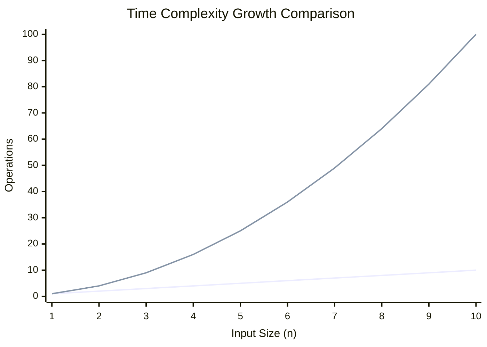

# Unit - 1
:::info[TITLE]
## Introduction and Analysis of Algorithms
:::

## 1. Algorithm Analysis and Time Complexity

### 1.1 Introduction
- **Algorithm Analysis** involves calculating the number of times individual statements execute to find the time complexity of an algorithm.
- Instead of measuring the exact time in seconds (which varies depending on the processor speed, background tasks, and architecture of the machine), we count the number of basic operations (like assignments, comparisons, and arithmetic operations).
- Evaluating execution time mathematically helps determine algorithm efficiency independently of the hardware it runs on.

### 1.2 Examples of Time Complexity Calculation
- **Sum of $n$ numbers**:
  - `sum = 0` (Executed $1$ time)
  - `for i = 1 to n` (Loop control check executed $n+1$ times)
  - `sum = sum + a[i]` (Executed $n$ times)
  - `print sum` (Executed $1$ time)
  - The overall execution time grows linearly in proportion to $n$.
- **Linear Search**:
  - **Best Case**: The target is found at the very first position (index 0). The loop runs exactly once. Time complexity is $\Omega(1)$ (constant time).
  - **Worst Case**: The target is the very last element in the array, or it is not present at all. The loop must scan all $n$ items. Time complexity is $O(n)$ (linear time).
- **Nested Loops (Printing all pairs)**:
  - `for i = 1 to n` (Outer loop control check runs $n+1$ times)
  - `for j = 1 to n` (Inner loop control check runs $n \times (n+1)$ times)
  - `print(i, j)` (Inner print statement runs $n \times n = n^2$ times)
  - The dominant factor is $n^2$, so the complexity is $O(n^2)$ (quadratic time).
- **Binary Search**:
  - At each step, the search space is cut in half: $n, n/2, n/4, \dots, 1$.
  - The search ends when only 1 element remains. We find the number of steps $k$ such that $\frac{n}{2^k} = 1$.
  - Solving for $k$: $n = 2^k \implies \log_2(n) = \log_2(2^k) \implies k = \log_2(n)$.
  - Time complexity is $O(\log n)$ (logarithmic time).

## 2. Asymptotic Notations

Asymptotic notations are mathematical tools used to describe the running time of an algorithm as the input size $n$ approaches infinity.

### 2.1 Big O Notation ($O$)
- **Definition**: Represents the **Upper bound** of an algorithm's running time. It guarantees that the algorithm will take "at most this much" time. (Analogy: "The bus will arrive no later than 10 minutes").
- **Mathematical Definition**: $O(g(n)) = \{ f(n) : \text{there exist positive constants } c \text{ and } n_0 \text{ such that } 0 \le f(n) \le c \cdot g(n) \text{ for all } n \ge n_0 \}$.
- **Examples**:
  - If $f(n) = 3n + 2$, we want to represent $f(n)$ as $O(n)$.
  - $3n + 2 \le c \cdot n$. This condition is TRUE for all values of $c = 4$ and $n \ge 2$. Thus, $3n + 2 = O(n)$.
  - $2n^2 + 5n + 4 = O(n^2)$.

### 2.2 Big Omega Notation ($\Omega$)
- **Definition**: Represents the **Lower bound**. It guarantees the algorithm will take "at least this much" time. (Analogy: "The bus will not arrive before 2 minutes").
- **Mathematical Definition**: $\Omega(g(n)) = \{ f(n) : \text{there exist positive constants } c \text{ and } n_0 \text{ such that } 0 \le c \cdot g(n) \le f(n) \text{ for all } n \ge n_0 \}$.
- **Example**: For $f(n) = 3n + 2$, it is bounded below by $n$, so $3n + 2 = \Omega(n)$.

### 2.3 Big Theta Notation ($\Theta$)
- **Definition**: Represents the **Tight bound**. It guarantees the algorithm behaves "exactly this much" (order-wise). It describes predictable, overall behavior where the upper and lower bounds are identical. (Analogy: "The bus reliably arrives around 5-6 minutes, every single time").
- **Mathematical Definition**: $\Theta(g(n)) = \{ f(n) : \text{there exist positive constants } c_1, c_2, \text{ and } n_0 \text{ such that } 0 \le c_1 \cdot g(n) \le f(n) \le c_2 \cdot g(n) \text{ for all } n \ge n_0 \}$.
- **Examples**: 
  - $3n + 5 = \Theta(n)$
  - $4n^2 + 2n + 10 = \Theta(n^2)$
  - $5 \log n + 2 = \Theta(\log n)$

### 2.4 Complexity Comparison

### 2.5 Importance of Algorithm Efficiency
- **Algorithm efficiency is more important than processor speed.** A highly optimized algorithm running on a slow machine will easily beat a poorly designed algorithm on a supercomputer for large inputs.
- **Example Comparison**: 
  - **Powerful PC + Linear Search ($O(n)$)**: 
    - Processor Speed $= 10^{10}$ ops/sec. Input Size $= 1,000,000$. Operations $= 10^6$. 
    - Time $= \frac{10^6}{10^{10}} = 10^{-4}$ sec ($0.0001$ sec).
  - **Average PC + Binary Search ($O(\log n)$)**: 
    - Processor Speed $= 10^8$ ops/sec. Input Size $= 1,000,000$. 
    - Operations $= \log_2(1,000,000) \approx 20$. 
    - Time $= \frac{20}{10^8} = 2 \times 10^{-7}$ sec ($0.0000002$ sec).
  - **Conclusion**: Even though the Powerful PC is $100\times$ faster, the Average PC with Binary Search finishes much faster because it performs only 20 operations instead of 1,000,000.

## 3. Sorting Algorithms

### 3.1 Bubble Sort
- **Mechanism**: Repeatedly steps through the list, compares adjacent elements, and swaps them if they are in the wrong order. This process makes the largest unsorted element "bubble" up to its correct position at the end of the array.
- **Algorithm Analysis**:
  - **Passes**: Requires $n-1$ passes to sort an array of $n$ elements.
  - **Total Comparisons**: In the first pass, $n-1$ comparisons are made. In the second pass, $n-2$, and so on down to 1.
  - Using the sum formula: $(n-1) + (n-2) + \dots + 1 = \frac{n(n-1)}{2}$.
- **Time Complexity** (Classic version without an early exit optimization):
  - **Best Case (Already Sorted)**: $O(n^2)$
  - **Average Case (Random Order)**: $O(n^2)$
  - **Worst Case (Reverse Sorted)**: $O(n^2)$

### 3.2 Insertion Sort
- **Mechanism**: Builds the final sorted array one item at a time (similar to sorting playing cards in your hands). It takes an element and inserts it into its correct position in the already sorted portion on the left.
- **Algorithm Analysis**:
  - **Best Case (Already Sorted Array)**: The inner `while` loop condition fails immediately because the element is already greater than the previous one. Results in exactly $n-1$ comparisons and 0 shifts. Total operations yield $O(n)$.
  - **Worst Case (Reverse Sorted Array)**: Every element must be compared and shifted all the way to the beginning. 
    - Comparisons: $\frac{n(n-1)}{2}$
    - Shifts: $\frac{n(n-1)}{2}$
    - Total operations ignoring constants: $O(n^2)$.
- **Time Complexity**:
  - **Best Case**: $O(n)$
  - **Average Case**: $O(n^2)$ (On average, an element needs to be shifted halfway through the sorted sub-array).
  - **Worst Case**: $O(n^2)$

### 3.3 Selection Sort
- **Mechanism**: Divides the input list into two parts: a sorted sublist and an unsorted sublist. Repeatedly scans the unsorted part to find the absolute minimum element, and then swaps it with the first element of the unsorted part.
- **Algorithm Analysis**:
  - **Total Comparisons**: In every case, it must scan the remaining unsorted elements to find the minimum. This requires $(n-1) + (n-2) + \dots + 1 = \frac{n(n-1)}{2}$ comparisons.
  - **Swaps**: Exactly $1$ swap is performed at the end of every pass. Total swaps = $n-1$. Because $n-1 \ll \frac{n(n-1)}{2}$, the comparisons dominate the time complexity.
- **Time Complexity**:
  - **Best Case (Already Sorted)**: $O(n^2)$
  - **Average Case**: $O(n^2)$
  - **Worst Case (Reverse Sorted)**: $O(n^2)$
