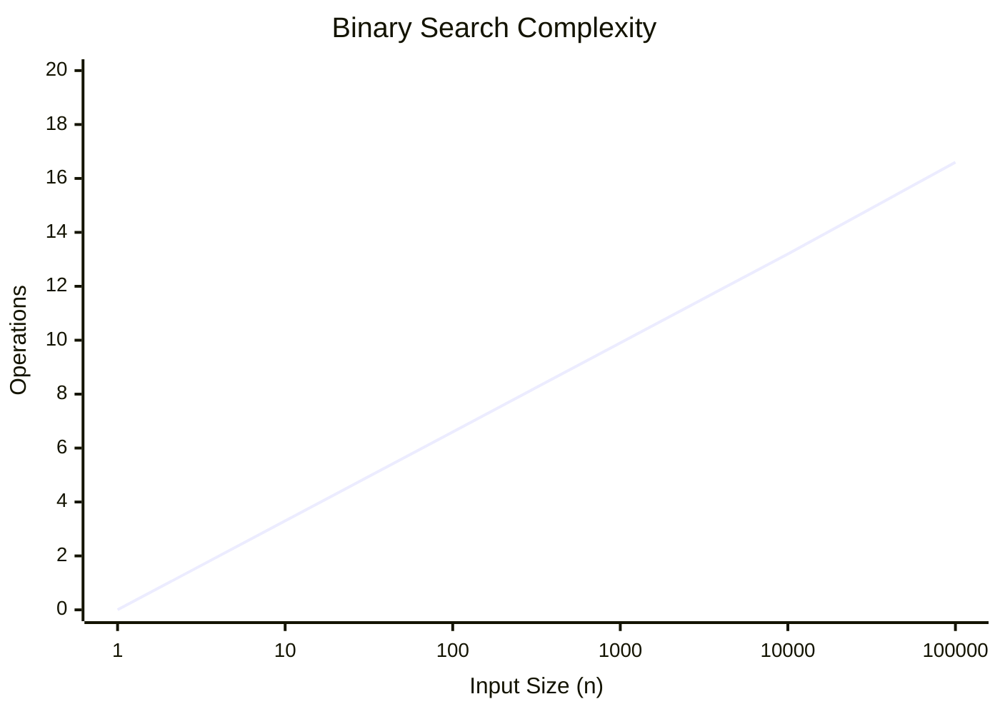
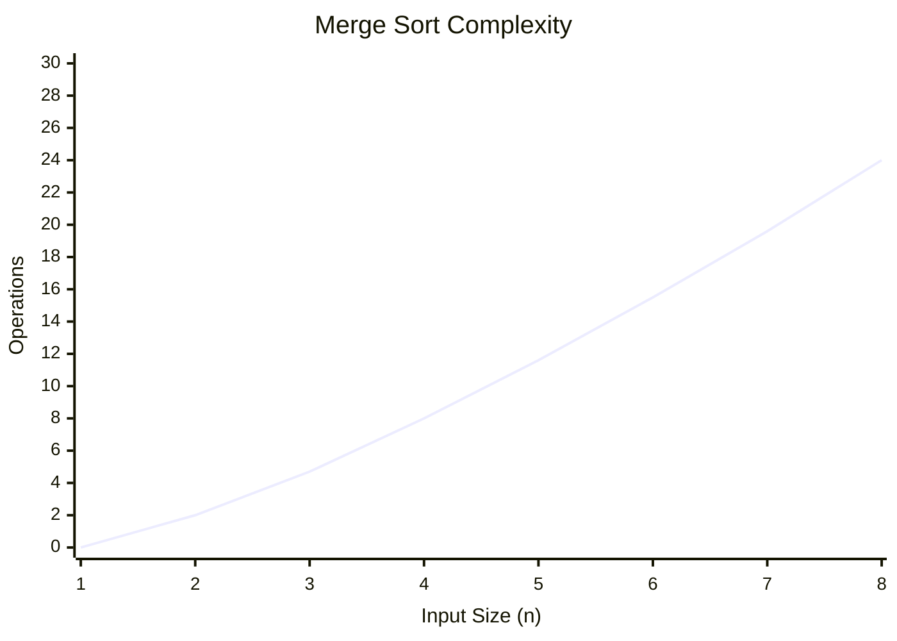
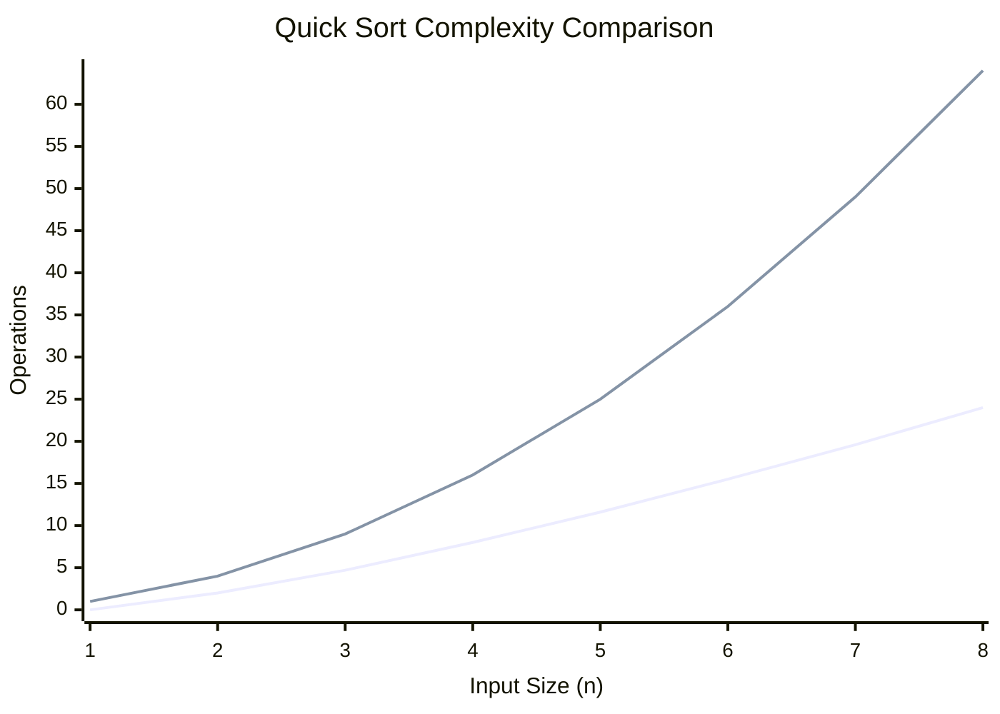

# Unit - 2
:::info[TITLE]
## Divide & Conquer Algorithms
:::
import Tabs from '@theme/Tabs';
import TabItem from '@theme/TabItem';

## 1. Introduction

### 1.1 Overview
- When faced with a large problem without an immediate overall solution, a common approach is to **take a part of it and solve it**.
- If the partial solution works, it can be applied to the remaining parts of the larger problem.
- **Example**: To plant a $10,000$ sq. ft farm, if one person can plant $250$ sq. ft/hr, you need $10$ people to complete the entire farm within $4$ hours.

## 2. Recurrence Equations

### 2.1 Definition
- Many algorithms, particularly Divide and Conquer, are **recursive** in nature.
- When analyzing their time complexity, we derive a **recurrence relation**.
- A recurrence relation expresses the running time as a function of the input size $n$ in terms of the running time on inputs of **smaller sizes**.
- It is a recursive description of a function.

## 3. Methods to Solve Recurrences

### 3.1 Common Methods
- **Substitution Method**
- Homogeneous (characteristic equation)
- Inhomogeneous
- **Master Method**
- **Recurrence Tree Method**
- Intelligent guesswork
- Change of variable
- Range transformations

## 4. Substitution Method

### 4.1 Concept
- Make a guess for the solution and then use **mathematical induction** to prove whether the guess is correct or incorrect.
- Example: $T(n) = T(n-1) + n$
  - Replacing $n$ with $n-1$ and $n-2$:
    - $T(n-1) = T(n-2) + n - 1$
    - $T(n-2) = T(n-3) + n - 2$
  - Substituting back:
    - $T(n) = T(n-3) + n - 2 + n - 1 + n$
  - Generalizing for $k$ steps:
    - $T(n) = T(n-k) + (n-k+1) + (n-k+2) + \dots + n$
  - If we take $k = n$:
    - $T(n) = T(0) + 1 + 2 + \dots + n$
    - $T(n) = \frac{n(n+1)}{2} = O(n^2)$

## 5. Master Method

### 5.1 Overview
- The Master Method is a "cookbook" method for solving recurrences of the form:
  $T(n) = aT(n/b) + f(n)$
- **$a$**: Number of sub-problems.
- **$n/b$**: Size of each sub-problem.
- **$f(n)$**: Time required to divide the problem and recombine the results.

### 5.2 Three Cases
1. **Case 1**: If $f(n) \le n^{\log_b a}$ (specifically $f(n)$ is in $O(n^{\log_b a - \epsilon})$)
   - Then $T(n) = \Theta(n^{\log_b a})$
2. **Case 2**: If $f(n) = n^{\log_b a}$ (specifically $f(n)$ is in $\Theta(n^{\log_b a})$)
   - Then $T(n) = \Theta(n^{\log_b a} \log n)$
3. **Case 3**: If $f(n) \ge n^{\log_b a}$ (specifically $f(n)$ is in $\Omega(n^{\log_b a + \epsilon})$)
   - Then $T(n) = \Theta(f(n))$

### 5.3 Examples
- **Merge Sort**: $T(n) = 2T(n/2) + \Theta(n)$
  - $a=2, b=2 \implies n^{\log_2 2} = n^1 = n$. Here $f(n) = \Theta(n)$.
  - **Case 2 applies**: $T(n) = \Theta(n \log n)$
- **Binary Search**: $T(n) = T(n/2) + \Theta(1)$
  - $a=1, b=2 \implies n^{\log_2 1} = n^0 = 1$. Here $f(n) = \Theta(1)$.
  - **Case 2 applies**: $T(n) = \Theta(\log n)$

## 6. Recurrence Tree Method

### 6.1 Concept
- Each node in the tree represents the **cost of a single sub-problem**.
- We sum the costs across each **level** of the tree to obtain per-level costs.
- Finally, sum all per-level costs to determine the **total cost** of the recursion.
- Example for $T(n) = 2T(n/2) + n$:
  - Level 0 cost: $n$
  - Level 1 cost: $n/2 + n/2 = n$
  - Total levels: $\log_2 n$
  - Total cost: $\sum_{i=0}^{\log_2 n - 1} n + 2^{\log_2 n} T(1) = n \log n + n = O(n \log n)$

## 7. Divide & Conquer (D&C) Technique

### 7.1 Three Steps
1. **Divide**: Break the problem into several smaller sub-problems similar to the original problem.
2. **Conquer**: Solve the sub-problems recursively. If they are small enough, solve them in a straightforward (base case) manner.
3. **Combine**: Merge the sub-problem solutions to create the solution for the original problem.

### 7.2 Running Time Analysis
- The total time $T(n)$ is generally $T(n) = a T(n/b) + f(n)$.

## 8. Multiplying Large Integers

### 8.1 Problem Statement
- Multiplying two $n$-digit large integers using divide and conquer.
- Example: $981 \times 1234$
- Splitting into halves:
  - $w=09, x=81, y=12, z=34$
  - $981 = 10^2 w + x$
  - $1234 = 10^2 y + z$

### 8.2 Standard vs. Optimized
- Standard approach requires 4 multiplications: $w \cdot y$, $w \cdot z$, $x \cdot y$, $x \cdot z$.
- **Karatsuba optimization** reduces it to 3 multiplications:
  - $p = w \cdot y$
  - $q = x \cdot z$
  - $r = (w+x)(y+z)$
  - The middle term $w \cdot z + x \cdot y = r - p - q$.
- **Time Complexity**: Reduces from $O(n^2)$ to $O(n^{\log_2 3}) \approx O(n^{1.585})$.

## 9. Binary Search

### 9.1 Concept
- Finds an element $x$ in a **sorted array** $T[1 \dots n]$.
- Compares $x$ with the midpoint. If $x < \text{mid}$, search the left half. If $x > \text{mid}$, search the right half.

### 9.2 Step-by-Step Explanation
1. **Initialize** two pointers, `left` at the start (0) and `right` at the end ($n-1$) of the array.
2. **Loop** while `left` is less than or equal to `right`.
3. **Calculate Midpoint**: Find the middle index `mid = left + (right - left) / 2`.
4. **Compare**:
   - If the element at `mid` equals $x$, return `mid`.
   - If the element at `mid` is less than $x$, $x$ must be in the right half, so set `left = mid + 1`.
   - If the element at `mid` is greater than $x$, $x$ must be in the left half, so set `right = mid - 1`.
5. **Not Found**: If the loop ends without returning, $x$ is not in the array. Return -1.

### 9.3 Algorithm Complexity
- Recurrence: $T(n) = T(n/2) + \Theta(1)$
- **Time Complexity**:
  - Best Case: $O(1)$
  - Average & Worst Case: $O(\log n)$
- **Space Complexity**: $O(1)$ for iterative, $O(\log n)$ for recursive due to call stack.



### 9.4 Implementation

<Tabs>
  <TabItem value="cpp" label="C++" default>
    ```cpp showLineNumbers
    int binarySearch(int arr[], int left, int right, int x) {
        while (left <= right) {
            int mid = left + (right - left) / 2;
            if (arr[mid] == x) return mid;
            if (arr[mid] < x) left = mid + 1;
            else right = mid - 1;
        }
        return -1;
    }
    ```
  </TabItem>
  <TabItem value="py" label="Python">
    ```python showLineNumbers
    def binary_search(arr, x):
        left, right = 0, len(arr) - 1
        while left <= right:
            mid = left + (right - left) // 2
            if arr[mid] == x: return mid
            if arr[mid] < x: left = mid + 1
            else: right = mid - 1
        return -1
    ```
  </TabItem>
  <TabItem value="java" label="Java">
    ```java showLineNumbers
    int binarySearch(int arr[], int x) {
        int left = 0, right = arr.length - 1;
        while (left <= right) {
            int mid = left + (right - left) / 2;
            if (arr[mid] == x) return mid;
            if (arr[mid] < x) left = mid + 1;
            else right = mid - 1;
        }
        return -1;
    }
    ```
  </TabItem>
</Tabs>

## 10. Merge Sort

### 10.1 Concept
- Divides the unsorted list into $n$ sub-lists of $1$ element each.
- Repeatedly **merges** adjacent sub-lists to produce new sorted sub-lists until only $1$ sorted list remains.

### 10.2 Step-by-Step Explanation
1. **Divide**: Check if the array has more than 1 element. If so, find the middle point to divide the array into two halves, `L` (left) and `R` (right).
2. **Conquer**: Recursively call `mergeSort` on the first half `L` and then on the second half `R`.
3. **Combine (Merge)**: 
   - Initialize three pointers: $i$ (for `L`), $j$ (for `R`), and $k$ (for the original array).
   - Compare elements `L[i]` and `R[j]`. Place the smaller element into the original array at index $k$ and increment the respective pointer.
   - Once either `L` or `R` is exhausted, copy the remaining elements of the other half into the original array.

### 10.3 Algorithm Complexity
- Separating takes linear time; merging takes linear time.
- Recurrence: $T(n) = 2T(n/2) + \Theta(n)$
- **Time Complexity**: $\Theta(n \log n)$ for all cases (Best, Average, Worst).
- **Space Complexity**: $O(n)$ because it requires an auxiliary array for merging.



### 10.4 Implementation

<Tabs>
  <TabItem value="cpp" label="C++" default>
    ```cpp showLineNumbers
    void merge(int arr[], int l, int m, int r) {
        int n1 = m - l + 1, n2 = r - m;
        int L[n1], R[n2];
        for (int i = 0; i < n1; i++) L[i] = arr[l + i];
        for (int j = 0; j < n2; j++) R[j] = arr[m + 1 + j];
        
        int i = 0, j = 0, k = l;
        while (i < n1 && j < n2) {
            if (L[i] <= R[j]) arr[k++] = L[i++];
            else arr[k++] = R[j++];
        }
        while (i < n1) arr[k++] = L[i++];
        while (j < n2) arr[k++] = R[j++];
    }

    void mergeSort(int arr[], int l, int r) {
        if (l >= r) return;
        int m = l + (r - l) / 2;
        mergeSort(arr, l, m);
        mergeSort(arr, m + 1, r);
        merge(arr, l, m, r);
    }
    ```
  </TabItem>
  <TabItem value="py" label="Python">
    ```python showLineNumbers
    def merge_sort(arr):
        if len(arr) > 1:
            mid = len(arr) // 2
            L = arr[:mid]
            R = arr[mid:]

            merge_sort(L)
            merge_sort(R)

            i = j = k = 0
            while i < len(L) and j < len(R):
                if L[i] <= R[j]:
                    arr[k] = L[i]
                    i += 1
                else:
                    arr[k] = R[j]
                    j += 1
                k += 1

            while i < len(L):
                arr[k] = L[i]
                i += 1
                k += 1

            while j < len(R):
                arr[k] = R[j]
                j += 1
                k += 1
    ```
  </TabItem>
  <TabItem value="java" label="Java">
    ```java showLineNumbers
    void merge(int arr[], int l, int m, int r) {
        int n1 = m - l + 1;
        int n2 = r - m;
        int L[] = new int[n1];
        int R[] = new int[n2];
        for (int i = 0; i < n1; ++i) L[i] = arr[l + i];
        for (int j = 0; j < n2; ++j) R[j] = arr[m + 1 + j];
        
        int i = 0, j = 0, k = l;
        while (i < n1 && j < n2) {
            if (L[i] <= R[j]) {
                arr[k] = L[i];
                i++;
            } else {
                arr[k] = R[j];
                j++;
            }
            k++;
        }
        while (i < n1) arr[k++] = L[i++];
        while (j < n2) arr[k++] = R[j++];
    }

    void mergeSort(int arr[], int l, int r) {
        if (l < r) {
            int m = l + (r - l) / 2;
            mergeSort(arr, l, m);
            mergeSort(arr, m + 1, r);
            merge(arr, l, m, r);
        }
    }
    ```
  </TabItem>
</Tabs>

## 11. Quick Sort

### 11.1 Concept
- Chooses a **pivot** element.
- **Partitions** the array so elements less than the pivot move to the left, and elements greater move to the right.
- Recursively applies the same logic to the left and right partitions.

### 11.2 Step-by-Step Explanation
1. **Choose Pivot**: Select an element from the array to act as the pivot (often the last element).
2. **Partition**: Rearrange the array so that all elements smaller than the pivot are on its left, and all elements greater are on its right. The pivot is now in its final sorted position.
   - Maintain a pointer $i$ to track the boundary of elements smaller than the pivot.
   - Iterate through the array with $j$; if an element is smaller than the pivot, increment $i$ and swap elements at $i$ and $j$.
   - Finally, swap the pivot with the element at $i+1$.
3. **Recursion**: Recursively apply the above steps to the sub-array of elements smaller than the pivot, and the sub-array of elements greater than the pivot.

### 11.3 Algorithm Complexity
- **Worst Case**: The partition produces one sub-array of $n-1$ elements and one of $0$ elements (e.g., array is already sorted).
  - Recurrence: $T(n) = T(n-1) + \Theta(n)$
  - Time Complexity: $\Theta(n^2)$
- **Best / Average Case**: Partition produces two roughly equal halves.
  - Recurrence: $T(n) = 2T(n/2) + \Theta(n)$
  - Time Complexity: $\Theta(n \log n)$
- **Space Complexity**: $O(\log n)$ due to the recursive call stack (if tail-call optimized), worst-case $O(n)$ if heavily unbalanced.



### 11.4 Implementation

<Tabs>
  <TabItem value="cpp" label="C++" default>
    ```cpp showLineNumbers
    int partition(int arr[], int low, int high) {
        int pivot = arr[high];
        int i = (low - 1);
        for (int j = low; j <= high - 1; j++) {
            if (arr[j] < pivot) {
                i++;
                std::swap(arr[i], arr[j]);
            }
        }
        std::swap(arr[i + 1], arr[high]);
        return (i + 1);
    }

    void quickSort(int arr[], int low, int high) {
        if (low < high) {
            int pi = partition(arr, low, high);
            quickSort(arr, low, pi - 1);
            quickSort(arr, pi + 1, high);
        }
    }
    ```
  </TabItem>
  <TabItem value="py" label="Python">
    ```python showLineNumbers
    def partition(arr, low, high):
        pivot = arr[high]
        i = low - 1
        for j in range(low, high):
            if arr[j] < pivot:
                i += 1
                arr[i], arr[j] = arr[j], arr[i]
        arr[i + 1], arr[high] = arr[high], arr[i + 1]
        return i + 1

    def quick_sort(arr, low, high):
        if low < high:
            pi = partition(arr, low, high)
            quick_sort(arr, low, pi - 1)
            quick_sort(arr, pi + 1, high)
    ```
  </TabItem>
  <TabItem value="java" label="Java">
    ```java showLineNumbers
    int partition(int arr[], int low, int high) {
        int pivot = arr[high];
        int i = (low - 1);
        for (int j = low; j < high; j++) {
            if (arr[j] < pivot) {
                i++;
                int temp = arr[i];
                arr[i] = arr[j];
                arr[j] = temp;
            }
        }
        int temp = arr[i + 1];
        arr[i + 1] = arr[high];
        arr[high] = temp;
        return i + 1;
    }

    void quickSort(int arr[], int low, int high) {
        if (low < high) {
            int pi = partition(arr, low, high);
            quickSort(arr, low, pi - 1);
            quickSort(arr, pi + 1, high);
        }
    }
    ```
  </TabItem>
</Tabs>

## 12. Matrix Multiplication (Strassen's Algorithm)

### 12.1 Concept
- Multiplying two $2 \times 2$ matrices traditionally requires **8 scalar multiplications**.
- For $n \times n$ matrices, classic complexity is $\Theta(n^3)$.
- **Strassen's Algorithm** uses algebraic tricks to compute the product using only **7 scalar multiplications** for a $2 \times 2$ block.

### 12.2 Step-by-Step Explanation
1. **Divide**: Split the input matrices $A$ and $B$ into 4 sub-matrices of size $(n/2 \times n/2)$.
2. **Compute 7 Products**: Using specific algebraic combinations of these sub-matrices (involving additions and subtractions), compute 7 intermediate matrix products ($P_1$ to $P_7$) instead of the usual 8.
3. **Combine**: Use additions and subtractions of the $P_1 \dots P_7$ matrices to form the 4 sub-matrices of the final result matrix $C$.
4. **Recursion**: If the sub-matrices are larger than $1 \times 1$, recursively apply Strassen's algorithm to compute the 7 products.

### 12.3 Algorithm Complexity
- Recurrence: $T(n) = 7T(n/2) + \Theta(n^2)$
- Using Master Method (Case 3): $T(n) = \Theta(n^{\log_2 7}) \approx \Theta(n^{2.81})$

## 13. Exponentiation

### 13.1 Sequential Approach
- Compute $x = a^n$ by multiplying $a$ by itself $n-1$ times.
- Loop executes $n-1$ times: `r = a * r`
- Total time (considering large numbers): $T(m,n) \in \Theta(m^2 n^2)$ where $m$ is the size of the operand.

### 13.2 Divide & Conquer Approach
- $a^n = (a^{n/2})^2$ if $n$ is even.
- $a^n = a \times a^{n-1}$ if $n$ is odd.
- Recurrence: $N(n) = N(n/2) + 1$ (if even)
- Total time (considering large numbers): $T(m,n) \in \Theta(m^{\log_2 3} n^{\log_2 3})$

### 13.3 Step-by-Step Explanation (D&C)
1. **Base Case**: If $n = 0$, return 1. If $n = 1$, return $a$.
2. **Divide**: Calculate the exponent for half the power, recursively calling the function for $a^{n/2}$.
3. **Combine**:
   - If $n$ is **even**: Square the result of $a^{n/2}$ (i.e., return $a^{n/2} \times a^{n/2}$).
   - If $n$ is **odd**: Square the result of $a^{n/2}$ and multiply by an extra $a$ (i.e., return $a \times a^{n/2} \times a^{n/2}$).
