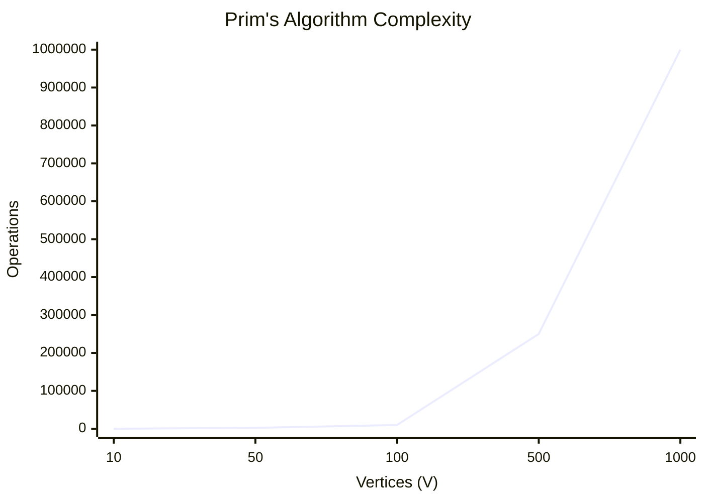
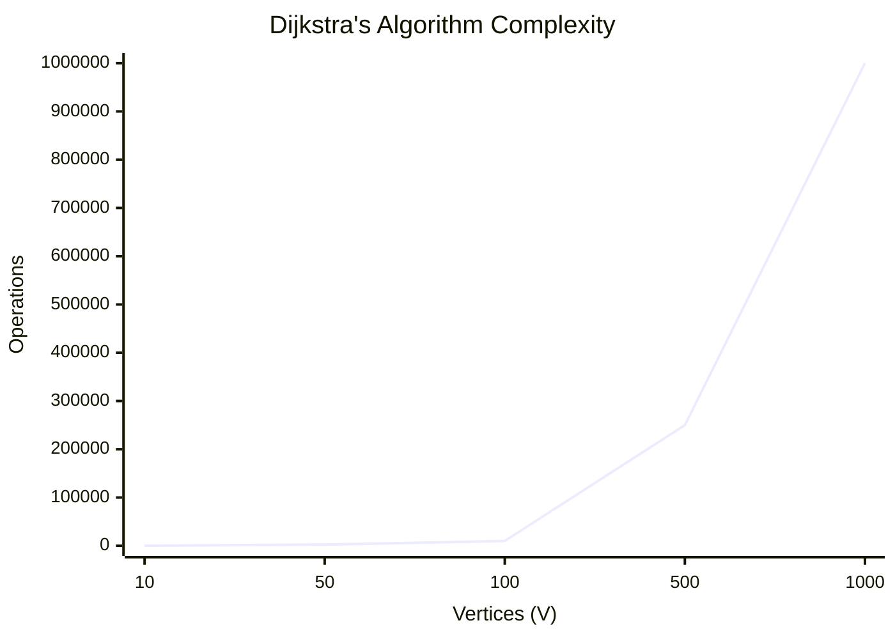
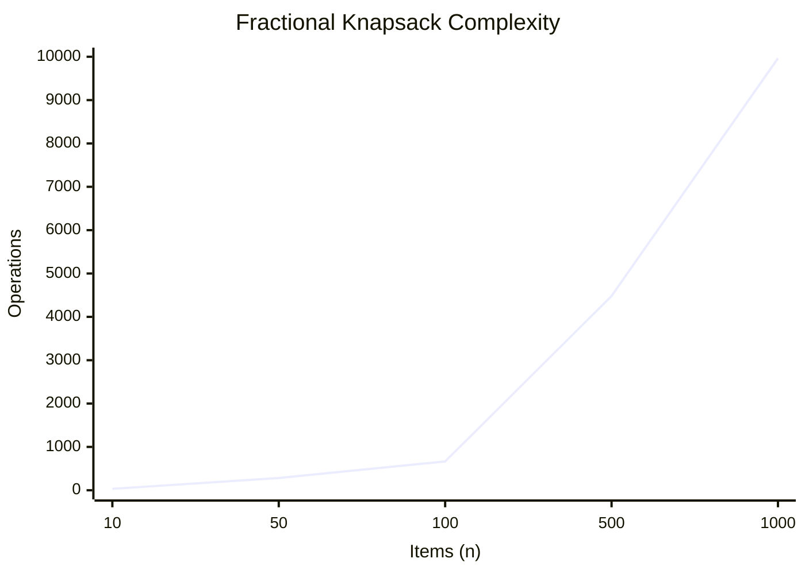
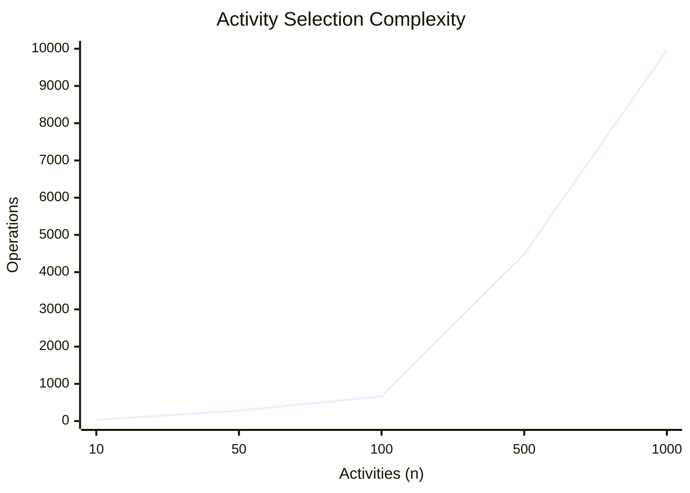
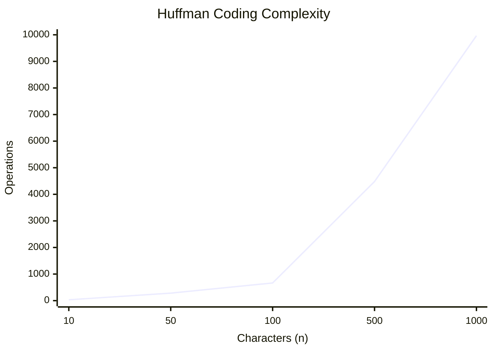

# Unit - 3
:::info[TITLE]
## Greedy Algorithms
:::

import Tabs from '@theme/Tabs';
import TabItem from '@theme/TabItem';

## 1. Introduction

### 1.1 Overview
- A greedy algorithm always makes the choice that seems to be the **best at that moment**.
- It **never reconsiders** this decision once it has been made.
- **Example**: Getting the best possible dress from a shop for yourself.

## 2. Characteristics of Greedy Algorithms

### 2.1 Key Features
1. The greedy approach forms a **set or list of candidates** $C$.
2. Once a candidate is **selected** in the solution, it is there forever. Once a candidate is **excluded** from the solution, it is never reconsidered.
3. To construct the solution in an optimal way, the Greedy Algorithm maintains **two sets**:
   - One set contains candidates that have already been **considered and chosen**.
   - The other set contains candidates that have been **considered but rejected**.

## 3. Elements of Greedy Strategy

### 3.1 Four Functions
1. **Solution Function**: Checks whether a chosen set of items provides a solution.
2. **Feasible Function**: Checks the feasibility of a set.
3. **Selection Function**: Tells which of the candidates is the most promising.
4. **Objective Function**: Gives the value of a solution (doesn't always appear explicitly).

## 4. Minimum Spanning Tree (MST)

### 4.1 Concept
- Let $G = \langle N, A \rangle$ be a **connected, undirected graph** where:
  - $N$ is the set of nodes.
  - $A$ is the set of edges.
- Each edge has a given **positive length or weight**.
- A **spanning tree** of a graph $G$ is a sub-graph which is a tree and contains all the vertices of $G$ but **does not contain cycles**.
- A **minimum spanning tree (MST)** of a weighted connected graph $G$ is a spanning tree with the **minimum or smallest weight** of edges.

### 4.2 Algorithms for MST
1. Kruskal’s Algorithm
2. Prim’s Algorithm

## 5. Kruskal’s Algorithm

### 5.1 Concept
- A greedy algorithm that finds an MST for a connected weighted graph by adding increasing cost edges at each step.

### 5.2 Step-by-Step Explanation
1. **Sort**: Sort all edges of the graph in increasing order of their weight.
2. **Initialize**: Create a disjoint set for each vertex to keep track of connected components. Create an empty set `T` for the MST.
3. **Iterate**: Loop through the sorted edges. For each edge $(u, v)$:
   - Check if $u$ and $v$ belong to different connected components using `find(u)` and `find(v)`.
   - If they do, adding this edge won't form a cycle. Add it to `T` and `merge(u, v)` the two components.
   - If they belong to the same component, discard the edge (as it would form a cycle).
4. **Terminate**: Stop when `T` contains $V - 1$ edges (where $V$ is the number of vertices).

### 5.3 Algorithm Complexity
- **Time Complexity**: $\Theta(E \log V)$ or $\Theta(E \log E)$ where $E$ is the number of edges and $V$ is the number of vertices (due to sorting edges).
- **Space Complexity**: $O(V)$ for the disjoint set data structure.


### 5.4 Implementation

<Tabs>
  <TabItem value="cpp" label="C++">
    ```cpp showLineNumbers
    #include <bits/stdc++.h>
    using namespace std;

    struct Edge { int u, v, weight; };
    bool compare(Edge a, Edge b) { return a.weight < b.weight; }

    int find(int i, vector<int>& parent) {
        if (parent[i] == i) return i;
        return parent[i] = find(parent[i], parent);
    }

    void union_set(int u, int v, vector<int>& parent, vector<int>& rank) {
        int root_u = find(u, parent);
        int root_v = find(v, parent);
        if (root_u != root_v) {
            if (rank[root_u] < rank[root_v]) parent[root_u] = root_v;
            else if (rank[root_u] > rank[root_v]) parent[root_v] = root_u;
            else { parent[root_v] = root_u; rank[root_u]++; }
        }
    }

    void kruskalMST(vector<Edge>& edges, int V) {
        sort(edges.begin(), edges.end(), compare);
        vector<int> parent(V);
        vector<int> rank(V, 0);
        for (int i = 0; i < V; i++) parent[i] = i;

        int mst_weight = 0;
        for (auto& edge : edges) {
            int u = edge.u;
            int v = edge.v;
            if (find(u, parent) != find(v, parent)) {
                mst_weight += edge.weight;
                union_set(u, v, parent, rank);
            }
        }
    }
    ```
  </TabItem>
  <TabItem value="py" label="Python">
    ```python showLineNumbers
    class DisjointSet:
        def __init__(self, vertices):
            self.parent = {v: v for v in vertices}
            self.rank = {v: 0 for v in vertices}

        def find(self, item):
            if self.parent[item] == item: return item
            self.parent[item] = self.find(self.parent[item])
            return self.parent[item]

        def union(self, x, y):
            xroot = self.find(x)
            yroot = self.find(y)
            if xroot != yroot:
                if self.rank[xroot] < self.rank[yroot]: self.parent[xroot] = yroot
                elif self.rank[xroot] > self.rank[yroot]: self.parent[yroot] = xroot
                else:
                    self.parent[yroot] = xroot
                    self.rank[xroot] += 1

    def kruskal_mst(vertices, edges):
        edges.sort(key=lambda x: x[2])
        ds = DisjointSet(vertices)
        mst_weight = 0
        for u, v, weight in edges:
            if ds.find(u) != ds.find(v):
                ds.union(u, v)
                mst_weight += weight
        return mst_weight
    ```
  </TabItem>
  <TabItem value="java" label="Java" default>
    ```java showLineNumbers
    import java.util.*;

    class KruskalMST {
        static class Edge implements Comparable<Edge> {
            int u, v, weight;
            public int compareTo(Edge compareEdge) {
                return this.weight - compareEdge.weight;
            }
        }

        static class subset {
            int parent, rank;
        }

        static int find(subset subsets[], int i) {
            if (subsets[i].parent != i)
                subsets[i].parent = find(subsets, subsets[i].parent);
            return subsets[i].parent;
        }

        static void union(subset subsets[], int x, int y) {
            int xroot = find(subsets, x);
            int yroot = find(subsets, y);

            if (subsets[xroot].rank < subsets[yroot].rank)
                subsets[xroot].parent = yroot;
            else if (subsets[xroot].rank > subsets[yroot].rank)
                subsets[yroot].parent = xroot;
            else {
                subsets[yroot].parent = xroot;
                subsets[xroot].rank++;
            }
        }

        static void kruskalMST(Edge edges[], int V) {
            Arrays.sort(edges);
            subset subsets[] = new subset[V];
            for (int i = 0; i < V; ++i) {
                subsets[i] = new subset();
                subsets[i].parent = i;
                subsets[i].rank = 0;
            }

            int mst_weight = 0;
            for (int i = 0; i < edges.length; ++i) {
                int x = find(subsets, edges[i].u);
                int y = find(subsets, edges[i].v);

                if (x != y) {
                    mst_weight += edges[i].weight;
                    union(subsets, x, y);
                }
            }
        }
    }
    ```
  </TabItem>
</Tabs>

## 6. Prim’s Algorithm

### 6.1 Concept
- In Prim's algorithm, the minimum spanning tree grows in a natural way, starting from an arbitrary root.
- At each stage, a new branch is added to the tree already constructed; the algorithm stops when all nodes have been reached.

### 6.2 Step-by-Step Explanation
1. **Initialize**: Create a set $B$ to keep track of vertices included in the MST.
2. **Start**: Pick an arbitrary vertex and add it to $B$.
3. **Iterate**: While $B$ does not contain all vertices:
   - Find the edge $e = \{u, v\}$ with the **minimum weight** such that $u \in B$ and $v \notin B$.
   - Add $v$ to $B$ and include $e$ in the MST.
4. **Terminate**: Return the MST when all vertices are in $B$.

### 6.3 Algorithm Complexity
- **Time Complexity**: $\Theta(V^2)$ with an adjacency matrix, or $\Theta(E \log V)$ using a Min-Heap.
- **Space Complexity**: $O(V + E)$ or $O(V^2)$ depending on graph representation.



### 6.4 Implementation

<Tabs>
  <TabItem value="cpp" label="C++">
    ```cpp showLineNumbers
    #include <bits/stdc++.h>
    using namespace std;

    void primMST(vector<vector<pair<int, int>>>& adj, int V) {
        priority_queue<pair<int, int>, vector<pair<int, int>>, greater<pair<int, int>>> pq;
        vector<int> key(V, INT_MAX);
        vector<bool> inMST(V, false);
        int src = 0; 
        pq.push({0, src});
        key[src] = 0;

        int mst_weight = 0;
        while (!pq.empty()) {
            int u = pq.top().second;
            int weight = pq.top().first;
            pq.pop();

            if (inMST[u]) continue;
            inMST[u] = true;
            mst_weight += weight;

            for (auto& neighbor : adj[u]) {
                int v = neighbor.first;
                int w = neighbor.second;
                if (!inMST[v] && w < key[v]) {
                    key[v] = w;
                    pq.push({w, v});
                }
            }
        }
    }
    ```
  </TabItem>
  <TabItem value="py" label="Python">
    ```python showLineNumbers
    import heapq

    def prim_mst(adj, V):
        pq = [(0, 0)] # (weight, vertex)
        key = [float('inf')] * V
        key[0] = 0
        in_mst = [False] * V
        mst_weight = 0

        while pq:
            weight, u = heapq.heappop(pq)
            if in_mst[u]: continue
            in_mst[u] = True
            mst_weight += weight

            for v, w in adj[u]:
                if not in_mst[v] and w < key[v]:
                    key[v] = w
                    heapq.heappush(pq, (w, v))
        return mst_weight
    ```
  </TabItem>
  <TabItem value="java" label="Java" default>
    ```java showLineNumbers
    import java.util.*;

    class PrimMST {
        static class Node implements Comparable<Node> {
            int vertex, weight;
            Node(int v, int w) { vertex = v; weight = w; }
            public int compareTo(Node n) { return this.weight - n.weight; }
        }

        static void primMST(List<List<Node>> adj, int V) {
            PriorityQueue<Node> pq = new PriorityQueue<>();
            int[] key = new int[V];
            Arrays.fill(key, Integer.MAX_VALUE);
            boolean[] inMST = new boolean[V];

            pq.add(new Node(0, 0));
            key[0] = 0;
            int mst_weight = 0;

            while (!pq.isEmpty()) {
                Node u = pq.poll();
                if (inMST[u.vertex]) continue;

                inMST[u.vertex] = true;
                mst_weight += u.weight;

                for (Node neighbor : adj.get(u.vertex)) {
                    int v = neighbor.vertex;
                    int weight = neighbor.weight;

                    if (!inMST[v] && weight < key[v]) {
                        key[v] = weight;
                        pq.add(new Node(v, key[v]));
                    }
                }
            }
        }
    }
    ```
  </TabItem>
</Tabs>

## 7. Dijkstra’s Algorithm

### 7.1 Concept
- Used to find the **Single Source Shortest Path** in a directed (or undirected) graph with positive edge weights.

### 7.2 Step-by-Step Explanation
1. **Initialize**: Create a distance array $D$ initialized to infinity ($\infty$) for all vertices except the source vertex, which is set to $0$.
2. **Set up**: Maintain a set of unvisited vertices $C$.
3. **Iterate**:
   - Extract the vertex $u$ from $C$ that has the minimum distance value $D[u]$.
   - For every adjacent vertex $v$ of $u$:
     - If $D[v] > D[u] + \text{weight}(u, v)$, update $D[v] = D[u] + \text{weight}(u, v)$.
4. **Terminate**: The algorithm finishes when all vertices are evaluated. The array $D$ will hold the shortest distances from the source to all other vertices.

### 7.3 Algorithm Complexity
- **Time Complexity**: $O(V^2)$ with basic arrays, or $O((V+E) \log V)$ using a Min-Priority Queue.
- **Space Complexity**: $O(V)$ for the distance array and priority queue.



### 7.4 Implementation

<Tabs>
  <TabItem value="cpp" label="C++">
    ```cpp showLineNumbers
    #include <bits/stdc++.h>
    using namespace std;

    void dijkstra(vector<vector<pair<int, int>>>& adj, int V, int src) {
        priority_queue<pair<int, int>, vector<pair<int, int>>, greater<pair<int, int>>> pq;
        vector<int> dist(V, INT_MAX);
        pq.push({0, src});
        dist[src] = 0;

        while (!pq.empty()) {
            int u = pq.top().second;
            int d = pq.top().first;
            pq.pop();

            if (d > dist[u]) continue;

            for (auto& neighbor : adj[u]) {
                int v = neighbor.first;
                int weight = neighbor.second;
                if (dist[v] > dist[u] + weight) {
                    dist[v] = dist[u] + weight;
                    pq.push({dist[v], v});
                }
            }
        }
    }
    ```
  </TabItem>
  <TabItem value="py" label="Python">
    ```python showLineNumbers
    import heapq

    def dijkstra(adj, V, src):
        pq = [(0, src)] # (distance, vertex)
        dist = [float('inf')] * V
        dist[src] = 0

        while pq:
            d, u = heapq.heappop(pq)
            if d > dist[u]: continue

            for v, weight in adj[u]:
                if dist[v] > dist[u] + weight:
                    dist[v] = dist[u] + weight
                    heapq.heappush(pq, (dist[v], v))
        return dist
    ```
  </TabItem>
  <TabItem value="java" label="Java" default>
    ```java showLineNumbers
    import java.util.*;

    class Dijkstra {
        static class Node implements Comparable<Node> {
            int vertex, distance;
            Node(int v, int d) { vertex = v; distance = d; }
            public int compareTo(Node n) { return this.distance - n.distance; }
        }

        static int[] dijkstra(List<List<Node>> adj, int V, int src) {
            PriorityQueue<Node> pq = new PriorityQueue<>();
            int[] dist = new int[V];
            Arrays.fill(dist, Integer.MAX_VALUE);

            pq.add(new Node(src, 0));
            dist[src] = 0;

            while (!pq.isEmpty()) {
                Node u = pq.poll();
                if (u.distance > dist[u.vertex]) continue;

                for (Node neighbor : adj.get(u.vertex)) {
                    int v = neighbor.vertex;
                    int weight = neighbor.distance;

                    if (dist[u.vertex] + weight < dist[v]) {
                        dist[v] = dist[u.vertex] + weight;
                        pq.add(new Node(v, dist[v]));
                    }
                }
            }
            return dist;
        }
    }
    ```
  </TabItem>
</Tabs>

## 8. Fractional Knapsack Problem

### 8.1 Concept
- Given $n$ objects and a knapsack capacity $W$.
- Object $i$ has a positive weight $w_i$ and a positive value $v_i$.
- Goal: Fill the knapsack to **maximize the value**, breaking objects into fractions $x_i$ if necessary ($0 \le x_i \le 1$).

### 8.2 Step-by-Step Explanation
1. **Calculate Ratio**: Compute the value-to-weight ratio $v_i / w_i$ for each item.
2. **Sort**: Sort all items in **descending order** based on their $v_i / w_i$ ratio.
3. **Select**: Iterate through the sorted items:
   - If the item can completely fit in the remaining knapsack capacity, add it fully.
   - If the item cannot fully fit, add the **fraction** of the item that exactly fills the remaining capacity, then stop.
4. **Return**: The total accumulated value.

### 8.3 Algorithm Complexity
- **Time Complexity**: $O(n \log n)$ due to sorting.
- **Space Complexity**: $O(1)$ if sorted in place, otherwise $O(n)$.



### 8.4 Implementation

<Tabs>
  <TabItem value="cpp" label="C++">
    ```cpp showLineNumbers
    #include <bits/stdc++.h>
    using namespace std;

    struct Item { int value, weight; };
    bool compare(Item a, Item b) {
        double r1 = (double)a.value / a.weight;
        double r2 = (double)b.value / b.weight;
        return r1 > r2;
    }

    double fractionalKnapsack(int W, Item arr[], int n) {
        sort(arr, arr + n, compare);
        double finalvalue = 0.0;
        for (int i = 0; i < n; i++) {
            if (arr[i].weight <= W) {
                W -= arr[i].weight;
                finalvalue += arr[i].value;
            } else {
                finalvalue += arr[i].value * ((double)W / arr[i].weight);
                break;
            }
        }
        return finalvalue;
    }
    ```
  </TabItem>
  <TabItem value="py" label="Python">
    ```python showLineNumbers
    class Item:
        def __init__(self, value, weight):
            self.value = value
            self.weight = weight

    def fractional_knapsack(W, arr):
        arr.sort(key=lambda x: (x.value/x.weight), reverse=True)
        final_value = 0.0
        for item in arr:
            if item.weight <= W:
                W -= item.weight
                final_value += item.value
            else:
                final_value += item.value * (W / item.weight)
                break
        return final_value
    ```
  </TabItem>
  <TabItem value="java" label="Java" default>
    ```java showLineNumbers
    import java.util.*;

    class FractionalKnapsack {
        static class Item {
            int value, weight;
            Item(int v, int w) { value = v; weight = w; }
        }

        static double getMaxValue(int W, Item[] arr) {
            Arrays.sort(arr, new Comparator<Item>() {
                @Override
                public int compare(Item item1, Item item2) {
                    double cpr1 = (double)item1.value / item1.weight;
                    double cpr2 = (double)item2.value / item2.weight;
                    if (cpr1 < cpr2) return 1;
                    else return -1;
                }
            });

            double finalValue = 0.0;
            for (Item item : arr) {
                if (item.weight <= W) {
                    W -= item.weight;
                    finalValue += item.value;
                } else {
                    finalValue += item.value * ((double) W / item.weight);
                    break;
                }
            }
            return finalValue;
        }
    }
    ```
  </TabItem>
</Tabs>

## 9. Activity Selection Problem

### 9.1 Concept
- Given a set of $n$ activities with a start time $s_i$ and finish time $f_i$.
- Find the **maximum size set of mutually compatible activities** (activities that do not overlap).

### 9.2 Step-by-Step Explanation
1. **Sort**: Sort all input activities in **increasing order of their finish times** ($f_i$).
2. **Select First**: Always select the first activity from the sorted array, as it finishes earliest and leaves maximum time for subsequent activities.
3. **Iterate**: For each remaining activity:
   - If its start time $s_i$ is **greater than or equal to** the finish time of the previously selected activity, add it to the selected set.
4. **Return**: The set of selected activities.

### 9.3 Algorithm Complexity
- **Time Complexity**: $O(n \log n)$ due to sorting. If already sorted, it takes $O(n)$.
- **Space Complexity**: $O(1)$ or $O(n)$ depending on storage for results.



### 9.4 Implementation

<Tabs>
  <TabItem value="cpp" label="C++">
    ```cpp showLineNumbers
    #include <bits/stdc++.h>
    using namespace std;

    struct Activity { int start, finish; };
    bool compare(Activity a, Activity b) { return a.finish < b.finish; }

    void activitySelection(Activity arr[], int n) {
        sort(arr, arr + n, compare);
        int i = 0;
        cout << "(" << arr[i].start << ", " << arr[i].finish << ")\n";
        for (int j = 1; j < n; j++) {
            if (arr[j].start >= arr[i].finish) {
                cout << "(" << arr[j].start << ", " << arr[j].finish << ")\n";
                i = j;
            }
        }
    }
    ```
  </TabItem>
  <TabItem value="py" label="Python">
    ```python showLineNumbers
    def activity_selection(activities):
        activities.sort(key=lambda x: x[1])
        i = 0
        selected = [activities[i]]
        for j in range(1, len(activities)):
            if activities[j][0] >= activities[i][1]:
                selected.append(activities[j])
                i = j
        return selected
    ```
  </TabItem>
  <TabItem value="java" label="Java" default>
    ```java showLineNumbers
    import java.util.*;

    class ActivitySelection {
        static class Activity {
            int start, finish;
            Activity(int s, int f) { start = s; finish = f; }
        }

        static void printMaxActivities(Activity[] arr) {
            Arrays.sort(arr, new Comparator<Activity>() {
                @Override
                public int compare(Activity a1, Activity a2) {
                    return a1.finish - a2.finish;
                }
            });

            int i = 0;
            System.out.println("(" + arr[i].start + ", " + arr[i].finish + ")");

            for (int j = 1; j < arr.length; j++) {
                if (arr[j].start >= arr[i].finish) {
                    System.out.println("(" + arr[j].start + ", " + arr[j].finish + ")");
                    i = j;
                }
            }
        }
    }
    ```
  </TabItem>
</Tabs>

## 10. Huffman Codes

### 10.1 Concept
- A greedy algorithm that constructs an **optimal prefix code** for lossless data compression.
- It assigns **variable-length codes** to input characters based on their **frequencies**.
- The most frequent character gets the **smallest code**, while the least frequent character gets the **largest code**.
- Prefix codes ensure that no code is a prefix of another code, preventing decoding ambiguity.

### 10.2 Step-by-Step Explanation
1. **Count Frequencies**: Calculate the frequency of each character in the input data.
2. **Initialize Min-Heap**: Create a leaf node for each character and insert them into a priority queue (min-heap) based on frequency.
3. **Build Tree**: While the heap contains more than one node:
   - Extract the two nodes with the **minimum frequencies**.
   - Create a new internal node with a frequency equal to the **sum** of the two nodes.
   - Attach the two nodes as left and right children.
   - Insert the new node back into the min-heap.
4. **Assign Codes**: Traverse the tree from the root. Assign `0` to the left branch and `1` to the right branch. The path from the root to a leaf node provides the Huffman code for that character.

### 10.3 Algorithm Complexity
- **Time Complexity**: $O(n \log n)$ to build the heap and tree.
- **Space Complexity**: $O(n)$ for storing the tree and codes.



### 10.4 Implementation

<Tabs>
  <TabItem value="cpp" label="C++">
    ```cpp showLineNumbers
    #include <bits/stdc++.h>
    using namespace std;

    struct Node {
        char data;
        unsigned freq;
        Node *left, *right;
        Node(char data, unsigned freq) : data(data), freq(freq), left(NULL), right(NULL) {}
    };

    struct compare {
        bool operator()(Node* l, Node* r) { return l->freq > r->freq; }
    };

    void printCodes(struct Node* root, string str) {
        if (!root) return;
        if (root->data != '$') cout << root->data << ": " << str << "\n";
        printCodes(root->left, str + "0");
        printCodes(root->right, str + "1");
    }

    void HuffmanCodes(char data[], int freq[], int size) {
        priority_queue<Node*, vector<Node*>, compare> minHeap;
        for (int i = 0; i < size; ++i) minHeap.push(new Node(data[i], freq[i]));

        while (minHeap.size() != 1) {
            Node *left = minHeap.top(); minHeap.pop();
            Node *right = minHeap.top(); minHeap.pop();
            Node *top = new Node('$', left->freq + right->freq);
            top->left = left;
            top->right = right;
            minHeap.push(top);
        }
        printCodes(minHeap.top(), "");
    }
    ```
  </TabItem>
  <TabItem value="py" label="Python">
    ```python showLineNumbers
    import heapq

    class Node:
        def __init__(self, freq, symbol, left=None, right=None):
            self.freq = freq
            self.symbol = symbol
            self.left = left
            self.right = right
            self.huff = ''
        def __lt__(self, nxt): return self.freq < nxt.freq

    def print_nodes(node, val=''):
        new_val = val + str(node.huff)
        if node.left: print_nodes(node.left, new_val)
        if node.right: print_nodes(node.right, new_val)
        if not node.left and not node.right:
            print(f"{node.symbol} -> {new_val}")

    def huffman_coding(chars, freqs):
        nodes = []
        for x in range(len(chars)):
            heapq.heappush(nodes, Node(freqs[x], chars[x]))
        
        while len(nodes) > 1:
            left = heapq.heappop(nodes)
            right = heapq.heappop(nodes)
            left.huff = 0
            right.huff = 1
            newNode = Node(left.freq+right.freq, left.symbol+right.symbol, left, right)
            heapq.heappush(nodes, newNode)
            
        print_nodes(nodes[0])
    ```
  </TabItem>
  <TabItem value="java" label="Java" default>
    ```java showLineNumbers
    import java.util.*;

    class Huffman {
        static class Node implements Comparable<Node> {
            int freq;
            char c;
            Node left, right;
            public int compareTo(Node n) { return this.freq - n.freq; }
        }

        static void printCode(Node root, String s) {
            if (root.left == null && root.right == null && Character.isLetter(root.c)) {
                System.out.println(root.c + ":" + s);
                return;
            }
            printCode(root.left, s + "0");
            printCode(root.right, s + "1");
        }

        static void buildHuffmanTree(char[] charArray, int[] charFreq) {
            PriorityQueue<Node> q = new PriorityQueue<>();
            for (int i = 0; i < charArray.length; i++) {
                Node n = new Node();
                n.c = charArray[i];
                n.freq = charFreq[i];
                n.left = null;
                n.right = null;
                q.add(n);
            }
            Node root = null;
            while (q.size() > 1) {
                Node x = q.peek(); q.poll();
                Node y = q.peek(); q.poll();
                Node f = new Node();
                f.freq = x.freq + y.freq;
                f.c = '-';
                f.left = x;
                f.right = y;
                root = f;
                q.add(f);
            }
            printCode(root, "");
        }
    }
    ```
  </TabItem>
</Tabs>

