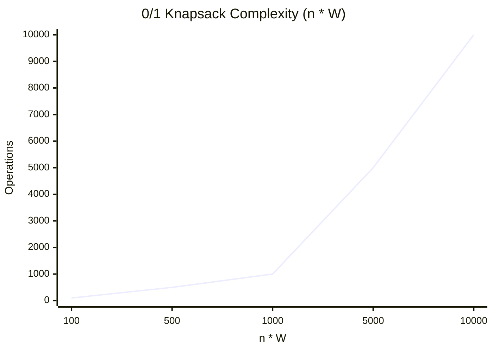
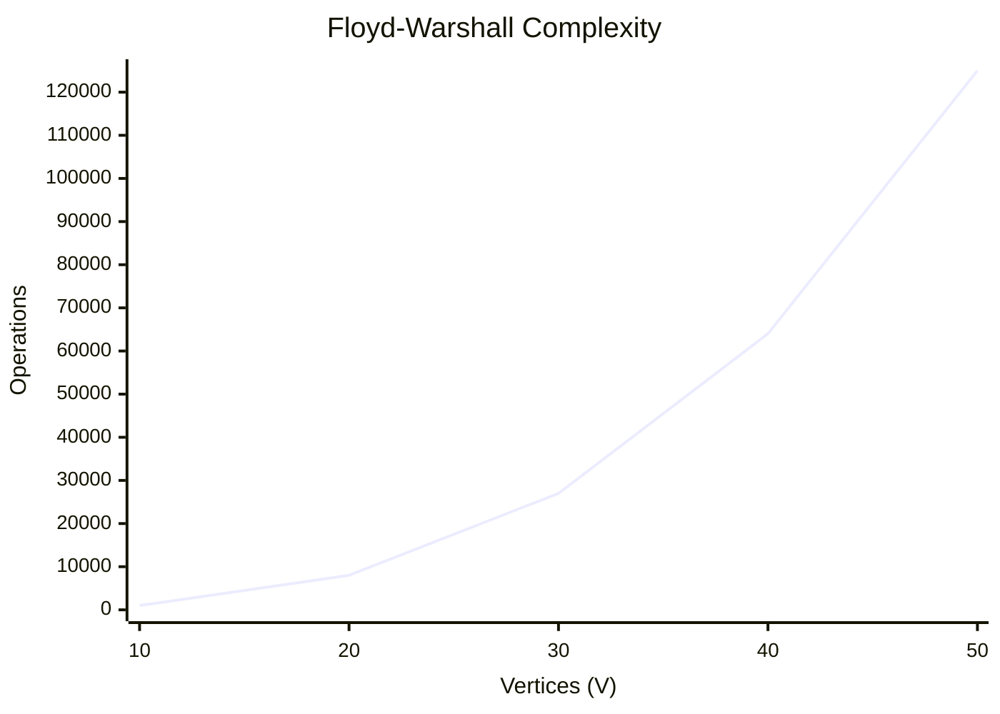
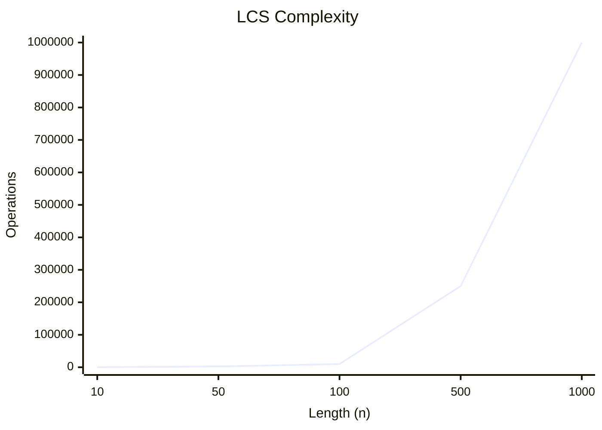

# Unit - 4
:::info[TITLE]
## Dynamic Programming
:::

import Tabs from '@theme/Tabs';
import TabItem from '@theme/TabItem';

## 1. Introduction

### 1.1 Overview
- A dynamic-programming algorithm solves every sub-problem just **once** and then **saves its answer** in a table.
- It avoids the work of **re-computing** the answer every time the sub-problem is encountered.
- **Example**: If there are multiple items with weights and profits, and we need to fit them into a bag to maximize profit, DP helps to efficiently find the optimal answer.

## 2. Principle of Optimality

### 2.1 Concept
- The dynamic programming algorithm obtains the solution using the **principle of optimality**.
- It states that "in an optimal sequence of decisions or choices, each subsequence must also be optimal."
- If it is not possible to apply the principle of optimality, then it is almost impossible to obtain the solution using the dynamic programming approach.

## 3. Generalized Solution using DP

### 3.1 Four Steps
1. **Characterize** the structure of an optimal solution.
2. **Recursively define** the value of an optimal solution.
3. **Compute the value** of an optimal solution in a bottom-up fashion.
4. **Construct an optimal solution** from the computed information.

## 4. 0/1 Knapsack Problem

### 4.1 Concept
- We are given $n$ items, each with a weight $w_i$ and a value $v_i$, and a knapsack of capacity $W$.
- The goal is to maximize the value without exceeding the knapsack capacity.
- Unlike Fractional Knapsack, we **cannot break** items (it's either 0 or 1).

### 4.2 Step-by-Step Explanation
1. **Initialize** a 2D array $V[0 \dots n][0 \dots W]$.
2. Set $V[i][0] = 0$ for $0 \le i \le n$.
3. Iterate through items $i$ from 1 to $n$ and weights $j$ from 1 to $W$:
   - If $j < w_i$: The item can't be included. $V[i][j] = V[i - 1][j]$.
   - Else: Take the max of excluding the item or including the item.
     $V[i][j] = \max(V[i - 1][j], V[i - 1][j - w_i] + v_i)$.
4. The answer is found at $V[n][W]$.

### 4.3 Algorithm Complexity
- **Time Complexity**: $O(n \times W)$, where $n$ is the number of items and $W$ is the knapsack capacity.
- **Space Complexity**: $O(n \times W)$ for the 2D DP table. Can be optimized to $O(W)$ using a 1D array.



### 4.4 Implementation

<Tabs>
  <TabItem value="cpp" label="C++">
    ```cpp showLineNumbers
    #include <bits/stdc++.h>
    using namespace std;

    int knapSack(int W, int wt[], int val[], int n) {
        vector<vector<int>> K(n + 1, vector<int>(W + 1));
        for (int i = 0; i <= n; i++) {
            for (int w = 0; w <= W; w++) {
                if (i == 0 || w == 0) K[i][w] = 0;
                else if (wt[i - 1] <= w)
                    K[i][w] = max(val[i - 1] + K[i - 1][w - wt[i - 1]], K[i - 1][w]);
                else
                    K[i][w] = K[i - 1][w];
            }
        }
        return K[n][W];
    }
    ```
  </TabItem>
  <TabItem value="py" label="Python">
    ```python showLineNumbers
    def knapSack(W, wt, val, n):
        K = [[0 for x in range(W + 1)] for x in range(n + 1)]
        for i in range(n + 1):
            for w in range(W + 1):
                if i == 0 or w == 0:
                    K[i][w] = 0
                elif wt[i-1] <= w:
                    K[i][w] = max(val[i-1] + K[i-1][w-wt[i-1]],  K[i-1][w])
                else:
                    K[i][w] = K[i-1][w]
        return K[n][W]
    ```
  </TabItem>
  <TabItem value="java" label="Java" default>
    ```java showLineNumbers
    class Knapsack {
        static int knapSack(int W, int wt[], int val[], int n) {
            int K[][] = new int[n + 1][W + 1];
            for (int i = 0; i <= n; i++) {
                for (int w = 0; w <= W; w++) {
                    if (i == 0 || w == 0) K[i][w] = 0;
                    else if (wt[i - 1] <= w)
                        K[i][w] = Math.max(val[i - 1] + K[i - 1][w - wt[i - 1]], K[i - 1][w]);
                    else
                        K[i][w] = K[i - 1][w];
                }
            }
            return K[n][W];
        }
    }
    ```
  </TabItem>
</Tabs>

## 5. Binomial Coefficient

### 5.1 Concept
- A binomial coefficient $C(n, k)$ calculates the number of ways to choose $k$ items from $n$ items.
- $C(n, k) = C(n-1, k-1) + C(n-1, k)$.
- DP avoids redundant calculations by storing intermediate values.

### 5.2 Step-by-Step Explanation
1. Initialize a 2D array $C$ of size $(n+1) \times (k+1)$.
2. Loop $i$ from 0 to $n$, and $j$ from 0 to $\min(i, k)$.
3. Base cases: If $j == 0$ or $j == i$, then $C[i][j] = 1$.
4. Otherwise: $C[i][j] = C[i-1][j-1] + C[i-1][j]$.
5. Return $C[n][k]$.

### 5.3 Algorithm Complexity
- **Time Complexity**: $O(n \times k)$
- **Space Complexity**: $O(n \times k)$ or $O(k)$ with a 1D array optimization.

### 5.4 Implementation

<Tabs>
  <TabItem value="cpp" label="C++">
    ```cpp showLineNumbers
    int binomialCoeff(int n, int k) {
        vector<int> C(k + 1, 0);
        C[0] = 1;
        for (int i = 1; i <= n; i++) {
            for (int j = min(i, k); j > 0; j--)
                C[j] = C[j] + C[j - 1];
        }
        return C[k];
    }
    ```
  </TabItem>
  <TabItem value="py" label="Python">
    ```python showLineNumbers
    def binomialCoeff(n, k):
        C = [0 for i in range(k+1)]
        C[0] = 1
        for i in range(1, n+1):
            for j in range(min(i, k), 0, -1):
                C[j] = C[j] + C[j-1]
        return C[k]
    ```
  </TabItem>
  <TabItem value="java" label="Java" default>
    ```java showLineNumbers
    class Binomial {
        static int binomialCoeff(int n, int k) {
            int C[] = new int[k + 1];
            C[0] = 1;
            for (int i = 1; i <= n; i++) {
                for (int j = Math.min(i, k); j > 0; j--)
                    C[j] = C[j] + C[j - 1];
            }
            return C[k];
        }
    }
    ```
  </TabItem>
</Tabs>

## 6. Floyd-Warshall Algorithm (All Pairs Shortest Path)

### 6.1 Concept
- Finds the shortest paths between **all pairs of vertices** in a weighted graph.
- Works for graphs with negative weight edges (but no negative weight cycles).

### 6.2 Step-by-Step Explanation
1. Initialize the solution matrix same as the input graph matrix as a first step.
2. Update the solution matrix by considering all vertices as an intermediate vertex.
3. The idea is to one by one pick all vertices and update all shortest paths which include the picked vertex as an intermediate vertex in the shortest path.
4. If $dist[i][j] > dist[i][k] + dist[k][j]$, update $dist[i][j]$.

### 6.3 Algorithm Complexity
- **Time Complexity**: $\Theta(V^3)$
- **Space Complexity**: $\Theta(V^2)$



### 6.4 Implementation

<Tabs>
  <TabItem value="cpp" label="C++">
    ```cpp showLineNumbers
    #include <bits/stdc++.h>
    using namespace std;
    #define INF 99999

    void floydWarshall(int graph[][4], int V) {
        int dist[V][V], i, j, k;
        for (i = 0; i < V; i++)
            for (j = 0; j < V; j++)
                dist[i][j] = graph[i][j];

        for (k = 0; k < V; k++) {
            for (i = 0; i < V; i++) {
                for (j = 0; j < V; j++) {
                    if (dist[i][k] + dist[k][j] < dist[i][j])
                        dist[i][j] = dist[i][k] + dist[k][j];
                }
            }
        }
    }
    ```
  </TabItem>
  <TabItem value="py" label="Python">
    ```python showLineNumbers
    INF = 99999
    def floydWarshall(graph, V):
        dist = list(map(lambda i: list(map(lambda j: j, i)), graph))
        for k in range(V):
            for i in range(V):
                for j in range(V):
                    dist[i][j] = min(dist[i][j], dist[i][k] + dist[k][j])
    ```
  </TabItem>
  <TabItem value="java" label="Java" default>
    ```java showLineNumbers
    class AllPairShortestPath {
        final static int INF = 99999;

        void floydWarshall(int graph[][], int V) {
            int dist[][] = new int[V][V];
            int i, j, k;
            for (i = 0; i < V; i++)
                for (j = 0; j < V; j++)
                    dist[i][j] = graph[i][j];

            for (k = 0; k < V; k++) {
                for (i = 0; i < V; i++) {
                    for (j = 0; j < V; j++) {
                        if (dist[i][k] + dist[k][j] < dist[i][j])
                            dist[i][j] = dist[i][k] + dist[k][j];
                    }
                }
            }
        }
    }
    ```
  </TabItem>
</Tabs>

## 7. Matrix Chain Multiplication

### 7.1 Concept
- Determines the most efficient way to multiply a given sequence of matrices.
- The problem is not actually to perform the multiplications, but merely to decide the sequence of the matrix multiplications involved.
- Many options exist because matrix multiplication is associative.

### 7.2 Step-by-Step Explanation
1. Let the input array `p` represent matrix dimensions such that matrix $i$ has dimension $p[i-1] \times p[i]$.
2. Construct a 2D array `m[n][n]` to store the minimum scalar multiplications.
3. For chain length $L = 2$ to $n$:
   - For $i = 1$ to $n - L + 1$, set $j = i + L - 1$.
   - Compute `m[i][j]` by checking all possible partition points $k$ from $i$ to $j-1$.
   - Cost is `m[i][k] + m[k+1][j] + p[i-1]*p[k]*p[j]`.
   - Take the minimum of all possible $k$'s.
4. `m[1][n-1]` holds the optimal cost.

### 7.3 Algorithm Complexity
- **Time Complexity**: $O(n^3)$
- **Space Complexity**: $O(n^2)$

### 7.4 Implementation

<Tabs>
  <TabItem value="cpp" label="C++">
    ```cpp showLineNumbers
    #include <bits/stdc++.h>
    using namespace std;

    int MatrixChainOrder(int p[], int n) {
        int m[n][n];
        for (int i = 1; i < n; i++) m[i][i] = 0;

        for (int L = 2; L < n; L++) {
            for (int i = 1; i < n - L + 1; i++) {
                int j = i + L - 1;
                m[i][j] = INT_MAX;
                for (int k = i; k <= j - 1; k++) {
                    int q = m[i][k] + m[k + 1][j] + p[i - 1] * p[k] * p[j];
                    if (q < m[i][j]) m[i][j] = q;
                }
            }
        }
        return m[1][n - 1];
    }
    ```
  </TabItem>
  <TabItem value="py" label="Python">
    ```python showLineNumbers
    import sys

    def MatrixChainOrder(p, n):
        m = [[0 for x in range(n)] for x in range(n)]
        for i in range(1, n): m[i][i] = 0

        for L in range(2, n):
            for i in range(1, n-L+1):
                j = i + L - 1
                m[i][j] = sys.maxsize
                for k in range(i, j):
                    q = m[i][k] + m[k + 1][j] + p[i-1]*p[k]*p[j]
                    if q < m[i][j]: m[i][j] = q
        return m[1][n-1]
    ```
  </TabItem>
  <TabItem value="java" label="Java" default>
    ```java showLineNumbers
    class MatrixChainMultiplication {
        static int MatrixChainOrder(int p[], int n) {
            int m[][] = new int[n][n];
            for (int i = 1; i < n; i++) m[i][i] = 0;

            for (int L = 2; L < n; L++) {
                for (int i = 1; i < n - L + 1; i++) {
                    int j = i + L - 1;
                    if (j == n) continue;
                    m[i][j] = Integer.MAX_VALUE;
                    for (int k = i; k <= j - 1; k++) {
                        int q = m[i][k] + m[k + 1][j] + p[i - 1] * p[k] * p[j];
                        if (q < m[i][j]) m[i][j] = q;
                    }
                }
            }
            return m[1][n - 1];
        }
    }
    ```
  </TabItem>
</Tabs>

## 8. Longest Common Subsequence (LCS)

### 8.1 Concept
- Given two sequences, find the length of the longest subsequence present in both of them.
- A subsequence is a sequence that appears in the same relative order, but not necessarily contiguous.

### 8.2 Step-by-Step Explanation
1. Let the two strings be $X$ of length $m$ and $Y$ of length $n$.
2. Create a 2D array $L[m+1][n+1]$.
3. Loop through the characters of $X$ and $Y$.
4. If $X[i-1] == Y[j-1]$, then $L[i][j] = L[i-1][j-1] + 1$.
5. If they are different, $L[i][j] = \max(L[i-1][j], L[i][j-1])$.
6. $L[m][n]$ contains the length of the LCS.

### 8.3 Algorithm Complexity
- **Time Complexity**: $O(m \times n)$
- **Space Complexity**: $O(m \times n)$



### 8.4 Implementation

<Tabs>
  <TabItem value="cpp" label="C++">
    ```cpp showLineNumbers
    #include <bits/stdc++.h>
    using namespace std;

    int lcs(char* X, char* Y, int m, int n) {
        int L[m + 1][n + 1];
        for (int i = 0; i <= m; i++) {
            for (int j = 0; j <= n; j++) {
                if (i == 0 || j == 0) L[i][j] = 0;
                else if (X[i - 1] == Y[j - 1]) L[i][j] = L[i - 1][j - 1] + 1;
                else L[i][j] = max(L[i - 1][j], L[i][j - 1]);
            }
        }
        return L[m][n];
    }
    ```
  </TabItem>
  <TabItem value="py" label="Python">
    ```python showLineNumbers
    def lcs(X, Y):
        m = len(X)
        n = len(Y)
        L = [[0]*(n+1) for i in range(m+1)]
        for i in range(m+1):
            for j in range(n+1):
                if i == 0 or j == 0:
                    L[i][j] = 0
                elif X[i-1] == Y[j-1]:
                    L[i][j] = L[i-1][j-1] + 1
                else:
                    L[i][j] = max(L[i-1][j], L[i][j-1])
        return L[m][n]
    ```
  </TabItem>
  <TabItem value="java" label="Java" default>
    ```java showLineNumbers
    class LongestCommonSubsequence {
        int lcs(char[] X, char[] Y, int m, int n) {
            int L[][] = new int[m + 1][n + 1];
            for (int i = 0; i <= m; i++) {
                for (int j = 0; j <= n; j++) {
                    if (i == 0 || j == 0) L[i][j] = 0;
                    else if (X[i - 1] == Y[j - 1]) L[i][j] = L[i - 1][j - 1] + 1;
                    else L[i][j] = Math.max(L[i - 1][j], L[i][j - 1]);
                }
            }
            return L[m][n];
        }
    }
    ```
  </TabItem>
</Tabs>
