# Unit - 1
:::info[Title]
## Fundamentals of Android OS & Applications
:::

## 1. Introduction

### 1.1 History of Android

#### 1.1.1 Evolution of Android Versions

Android is an open-source mobile operating system developed primarily by Google. Since its first release in 2008, Android has undergone continuous evolution, introducing new features, improved security, enhanced performance, and better user experience with each version.

| Version         | Codename           | Release Year |
| --------------- | ------------------ | ------------ |
| Android 1.0     | -                  | 2008         |
| Android 1.1     | -                  | 2009         |
| Android 1.5     | Cupcake            | 2009         |
| Android 1.6     | Donut              | 2009         |
| Android 2.0/2.1 | Eclair             | 2009         |
| Android 2.2     | Froyo              | 2010         |
| Android 2.3     | Gingerbread        | 2010         |
| Android 3.0     | Honeycomb          | 2011         |
| Android 4.0     | Ice Cream Sandwich | 2011         |
| Android 4.1–4.3 | Jelly Bean         | 2012         |
| Android 4.4     | KitKat             | 2013         |
| Android 5.0     | Lollipop           | 2014         |
| Android 6.0     | Marshmallow        | 2015         |
| Android 7.0     | Nougat             | 2016         |
| Android 8.0     | Oreo               | 2017         |
| Android 9       | Pie                | 2018         |
| Android 10      | Android 10         | 2019         |
| Android 11      | Android 11         | 2020         |

The Android operating system evolved from a simple smartphone platform into a powerful ecosystem supporting smartphones, tablets, smart TVs, wearables, automobiles, and IoT devices.

#### 1.1.2 Android Inc.

Android Inc. was founded in October 2003 in Palo Alto, California, USA, by Andy Rubin, Rich Miner, Nick Sears, and Chris White. The founders envisioned creating intelligent mobile devices capable of understanding user preferences and location-based information.

Initially, the company aimed to develop an advanced operating system for digital cameras. However, realizing the greater market potential of smartphones, the company shifted its focus toward mobile operating systems.

##### Key Features of Android Inc.

* Founded in October 2003.
* Headquarters located in Palo Alto, California.
* Founders: Andy Rubin, Rich Miner, Nick Sears, and Chris White.
* Original goal was to create software for digital cameras.
* Later shifted focus to smartphone operating systems.

#### 1.1.3 Android Inc. to Google Android

Google recognized the potential of Android as an open-source mobile operating system capable of competing with Symbian OS, Apple iOS, and Microsoft Windows Mobile.

In August 2005, Google acquired Android Inc. for approximately $50 million. After the acquisition, Android became a subsidiary project under Google and received significant resources for development and innovation.

Google's objective was to create an open-source ecosystem that would encourage manufacturers and developers to build mobile devices and applications without restrictive licensing costs.

##### Impact of Google's Acquisition

* Accelerated Android development.
* Created an open-source mobile ecosystem.
* Attracted smartphone manufacturers worldwide.
* Increased innovation in mobile application development.
* Enabled Android to become the world's most widely used mobile operating system.

#### 1.1.4 Key Dates in Android History

The growth of Android can be understood through several important milestones:

| Date             | Event                                       |
| ---------------- | ------------------------------------------- |
| October 2003     | Android Inc. was founded                    |
| July/August 2005 | Google acquired Android Inc.                |
| November 5, 2007 | Open Handset Alliance (OHA) was formed      |
| October 22, 2008 | First Android smartphone HTC Dream launched |
| September 2020   | Android 11 released                         |

##### Open Handset Alliance (OHA)

The Open Handset Alliance is a consortium of technology companies led by Google. Its purpose is to promote open standards for mobile devices and accelerate innovation in the Android ecosystem.

##### HTC Dream

HTC Dream (also known as T-Mobile G1) was the first commercially available Android smartphone. It introduced users to the Android platform and demonstrated the capabilities of an open mobile operating system.

##### Significance of Android History

* Revolutionized smartphone technology.
* Encouraged open-source mobile development.
* Created opportunities for millions of developers.
* Enabled affordable smartphones worldwide.
* Established a secure and scalable mobile platform.

##### Quick Revision Points

* Android Inc. was founded in October 2003.
* Andy Rubin is considered the father of Android.
* Google acquired Android Inc. in 2005.
* Open Handset Alliance was formed in 2007.
* HTC Dream became the first Android smartphone in 2008.
* Android follows an open-source development model.
* Android versions were initially named after desserts in alphabetical order.


### 1.2 Android Hardware

Android is designed to run on a wide variety of hardware platforms. The operating system supports multiple processor architectures, allowing manufacturers to build smartphones, tablets, wearables, and embedded devices using different CPUs.

The primary hardware platform for Android is ARM architecture, although x86, x86-64, ARM64, and RISC-V are also supported.

#### 1.2.1 ARM Architecture

ARM (Advanced RISC Machine) is the most widely used processor architecture in Android devices.

It is based on the RISC (Reduced Instruction Set Computing) design philosophy, which uses a smaller and simpler set of instructions to achieve high performance and low power consumption.

##### Features of ARM Architecture

- Low power consumption
- High energy efficiency
- Reduced heat generation
- Compact processor design
- Suitable for battery-powered devices

##### Android ARM Variants

- ARMv7 (32-bit)
- ARMv8-A (64-bit)

##### Advantages of ARM in Android

- Longer battery life
- Efficient multitasking
- Better thermal management
- Widely supported by device manufacturers

##### Applications

ARM processors are commonly used in:

- Smartphones
- Tablets
- Smart TVs
- Wearable devices
- IoT devices

#### 1.2.2 x86 and x86-64 Support

Although Android was originally developed for ARM processors, support for x86 and x86-64 architectures was later introduced.

The Android-x86 project initially enabled Android to run on Intel and AMD processors before official support was provided by Google.

##### x86 Architecture

x86 is a processor architecture primarily used in desktop and laptop computers.

Characteristics:

- High processing power
- Wide software compatibility
- Common in PCs and servers

##### x86-64 Architecture

x86-64 is the 64-bit extension of the x86 architecture.

Features:

- Supports larger memory spaces
- Improved performance
- Better multitasking capabilities
- Enhanced security features

##### Android on Intel Processors

Since 2012, Android devices powered by Intel processors have appeared in the market, including:

- Smartphones
- Tablets
- Embedded systems

##### Benefits of x86 Support

- Easier Android testing on PCs
- Improved virtualization support
- Better compatibility with desktop hardware

#### 1.2.3 64-bit Android Platforms

As mobile applications became more advanced, Android introduced support for 64-bit computing.

Android first supported 64-bit x86 processors and later expanded support to ARM64 platforms.

Starting from Android 5.0 (Lollipop), both 32-bit and 64-bit variants became officially supported.

##### Advantages of 64-bit Platforms

- Access to larger memory spaces
- Improved application performance
- Faster processing of large datasets
- Enhanced security mechanisms
- Better multitasking

##### Supported 64-bit Architectures

- ARM64 (AArch64)
- x86-64

##### Importance of ARM64

ARM64 has become the standard architecture for modern Android devices because it provides:

- Better performance
- Improved battery efficiency
- Stronger security
- Support for modern applications

##### Android 5.0 Lollipop

Android 5.0 marked a major milestone by introducing official 64-bit support across all major processor platforms.

#### 1.2.4 RISC-V Support

RISC-V is an open-standard processor architecture based on the RISC design philosophy.

Unlike ARM and x86, RISC-V is open-source, allowing manufacturers to design processors without paying licensing fees.

##### Features of RISC-V

- Open-source architecture
- Highly customizable
- Low development cost
- Scalable design
- Suitable for embedded and mobile systems

##### Android and RISC-V

An experimental Android port for the RISC-V architecture was released in 2021.

This demonstrated Android's ability to support emerging processor technologies.

##### Advantages of RISC-V for Android

- Reduced hardware costs
- Greater flexibility for manufacturers
- Encourages innovation
- Vendor-independent ecosystem

##### Future Scope

RISC-V is expected to play an important role in:

- Smartphones
- IoT devices
- Embedded systems
- Edge computing platforms

##### Quick Revision

- ARM is the primary hardware architecture for Android.
- ARMv7 is a 32-bit architecture.
- ARMv8-A supports 64-bit processing.
- Android later added support for x86 and x86-64 processors.
- Android 5.0 Lollipop introduced official 64-bit support.
- ARM64 is the dominant architecture in modern Android devices.
- RISC-V is an open-source processor architecture.
- Experimental Android support for RISC-V was released in 2021.

##### Summary

Android supports multiple hardware architectures to ensure compatibility across a wide range of devices. ARM remains the dominant platform due to its power efficiency, while x86, x86-64, and RISC-V expand Android's flexibility and hardware ecosystem.
### 1.3 Android Software Architecture

Android follows a layered software architecture that separates applications, frameworks, runtime components, libraries, and hardware interactions. This layered approach improves modularity, security, maintainability, and performance.

The Android architecture consists of the following layers:

1. Applications Layer
2. Application Framework
3. Android Runtime
4. Platform Libraries
5. Linux Kernel

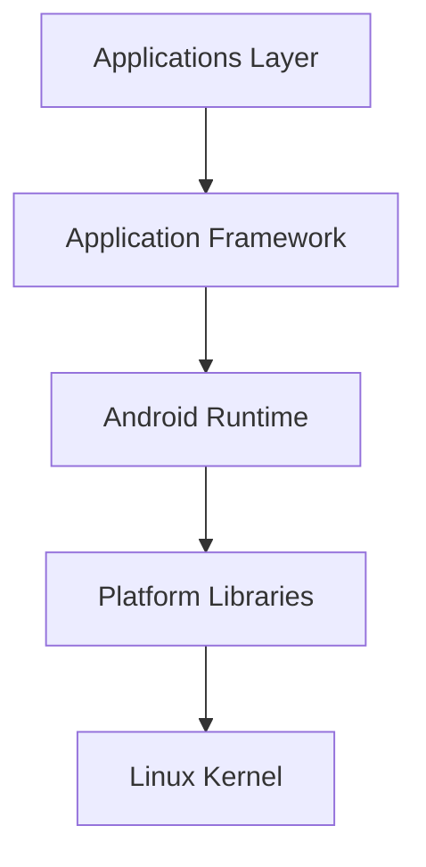

#### 1.3.1 Applications Layer

The Applications Layer is the topmost layer of Android architecture.

It contains all applications installed on the device, including both system applications and third-party applications downloaded from app stores.

##### Types of Applications

###### System Applications

Pre-installed applications such as:

- Phone
- Contacts
- Messages
- Camera
- Gallery
- Browser
- Settings

###### User Applications

Applications installed by users, such as:

- WhatsApp
- Instagram
- Facebook
- Games
- Banking Applications

##### Features

- Provides direct interaction with users.
- Uses services offered by the Application Framework.
- Runs within the Android Runtime environment.
- Each application executes in its own sandbox.

##### Advantages

- User-friendly interface.
- Easy application installation and management.
- Supports millions of third-party applications.

#### 1.3.2 Application Framework

The Application Framework provides essential classes, services, and APIs required for Android application development.

It acts as an intermediary between applications and lower layers of the Android operating system.

##### Responsibilities

- Hardware abstraction
- Resource management
- Activity management
- User interface management
- Application lifecycle control
- Communication between applications

##### Major Components

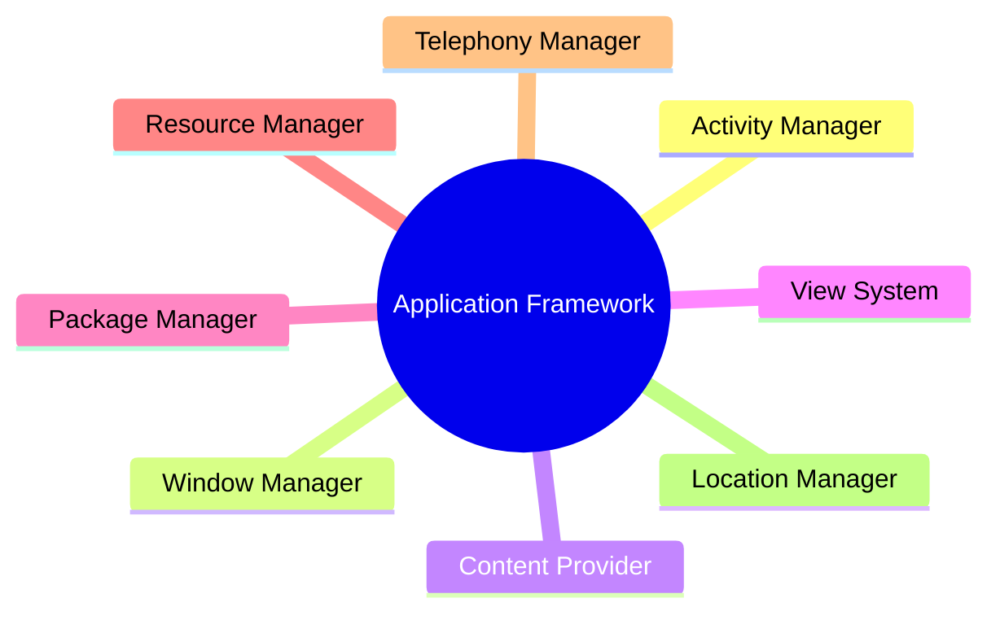

##### 1.3.2.1 Activity Manager

The Activity Manager controls the lifecycle of Android applications and activities.

An Activity represents a single screen in an Android application.

###### Functions

- Manages activity lifecycle
- Controls task stacks
- Handles application processes
- Manages foreground and background activities

###### Lifecycle States

- Created
- Started
- Resumed
- Paused
- Stopped
- Destroyed

###### Importance

Ensures efficient memory usage and smooth multitasking.

##### 1.3.2.2 Window Manager

The Window Manager manages windows and screen layouts displayed to users.

It is responsible for controlling how application windows appear and interact.

###### Functions

- Manages screen windows
- Controls window positioning
- Handles screen transitions
- Manages pop-ups and dialogs

###### Benefits

- Smooth user interface rendering
- Better screen organization
- Efficient display management

##### 1.3.2.3 Content Provider

A Content Provider enables data sharing between different Android applications.

It provides a standardized interface for accessing structured data.

###### Functions

- Stores application data
- Shares data securely
- Supports CRUD operations

###### CRUD Operations

- Create
- Read
- Update
- Delete

###### Examples

- Contacts Database
- Media Files
- Calendar Data

###### Advantages

- Secure data sharing
- Controlled access permissions
- Centralized data management

##### 1.3.2.4 View System

The View System provides user interface components used to build application screens.

Every visual element in Android is represented by a View object.

###### Common UI Components

- TextView
- Button
- EditText
- ImageView
- RecyclerView
- CheckBox

###### Functions

- Displays content
- Accepts user input
- Handles UI events
- Supports layout management

###### Benefits

- Reusable UI components
- Consistent user experience
- Flexible interface design

##### 1.3.2.5 Package Manager

The Package Manager manages application packages installed on the device.

Android applications are distributed as APK (Android Package) files.

###### Functions

- Application installation
- Application updates
- Application removal
- Permission verification
- Package information retrieval

###### Responsibilities

- Maintains package database
- Verifies application signatures
- Tracks application permissions

###### Importance

Ensures secure application deployment and management.

##### 1.3.2.6 Resource Manager

The Resource Manager manages all non-code resources used by Android applications.

###### Resources Managed

- Images
- Strings
- Colors
- Layouts
- Animations
- Styles

###### Functions

- Resource loading
- Resource localization
- Dynamic resource access

###### Benefits

- Multi-language support
- Simplified UI management
- Efficient resource organization

##### 1.3.2.7 Telephony Manager

The Telephony Manager provides access to telecommunication services and information.

###### Functions

- Access network information
- Retrieve SIM card details
- Monitor call status
- Obtain device information

###### Information Provided

- Network operator
- Device ID
- SIM state
- Call state
- Mobile network type

###### Applications

- Call management apps
- Network monitoring tools
- Telecom-related applications

##### 1.3.2.8 Location Manager

The Location Manager provides location-based services to Android applications.

It enables applications to determine the device's geographical location.

###### Location Sources

- GPS
- Mobile Networks
- Wi-Fi Networks

###### Functions

- Retrieve current location
- Track movement
- Geofencing
- Navigation support

###### Applications

- Google Maps
- Food Delivery Apps
- Ride-Sharing Apps
- Fitness Tracking Apps

###### Benefits

- Accurate navigation
- Real-time tracking
- Location-aware services

##### Quick Revision

- Applications Layer is the topmost layer of Android Architecture.
- Application Framework provides APIs and system services.
- Activity Manager controls application lifecycle.
- Window Manager handles windows and screen layouts.
- Content Provider enables secure data sharing.
- View System manages user interface components.
- Package Manager manages APK installation and permissions.
- Resource Manager manages application resources.
- Telephony Manager provides telecom-related information.
- Location Manager provides location-based services.

##### Summary

The Application Framework serves as the backbone of Android application development by providing reusable services and APIs. Components such as Activity Manager, Content Provider, Package Manager, and Location Manager simplify application development while ensuring security, efficiency, and consistency across Android devices.
#### 1.3.3 Android Runtime

Android Runtime (ART) is one of the most important components of Android Architecture. It provides the execution environment required for Android applications to run efficiently.

Android Runtime consists of:

1. Core Libraries
2. Dalvik Virtual Machine (DVM)

These components provide the foundation for the Application Framework and enable applications to execute smoothly.

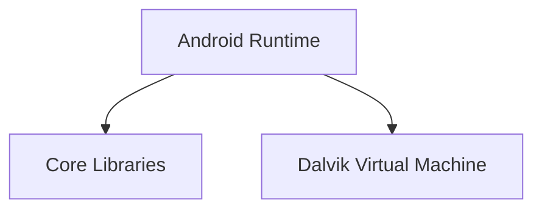

##### Functions of Android Runtime

- Executes Android applications.
- Provides essential APIs and libraries.
- Handles memory management.
- Supports multitasking.
- Provides application isolation and security.

##### 1.3.3.1 Core Libraries

Core Libraries provide the fundamental classes and APIs required for Android application development.

These libraries enable developers to write applications using Java and Kotlin programming languages.

##### Responsibilities

- Data structures
- File handling
- Networking
- Database access
- Collections framework
- Utility classes

##### Features

- Similar to Java Standard Libraries.
- Provides reusable programming components.
- Simplifies application development.
- Supports object-oriented programming.

##### Major Library Categories

###### Collection Libraries

Used to store and manipulate groups of objects.

Examples:

- ArrayList
- HashMap
- LinkedList
- HashSet

###### Utility Libraries

Provide helper classes for common operations.

Examples:

- Date handling
- String processing
- Mathematical operations

###### Networking Libraries

Used for communication over networks.

Examples:

- HTTP communication
- Socket programming
- URL processing

###### File Management Libraries

Used for:

- Reading files
- Writing files
- Managing directories

##### Advantages

- Faster development.
- Code reusability.
- Standardized APIs.
- Improved application reliability.

##### 1.3.3.2 Dalvik Virtual Machine (DVM)

Dalvik Virtual Machine (DVM) is a register-based virtual machine specifically designed for Android devices.

It executes Android applications efficiently while minimizing memory and power consumption.

##### Characteristics

- Register-based architecture
- Optimized for mobile devices
- Supports multitasking
- Efficient memory usage

##### Working of DVM

1. Java source code is compiled into bytecode.
2. Bytecode is converted into `.dex` (Dalvik Executable) format.
3. DVM executes the `.dex` file.

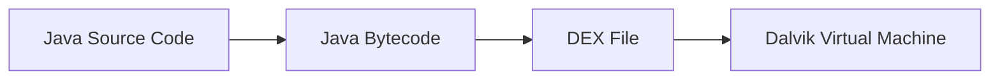

##### Features of DVM

- Low memory consumption
- Faster execution
- Multiple instances support
- Process isolation
- Battery-efficient operation

##### Difference Between JVM and DVM

| Feature | JVM | DVM |
|----------|------|------|
| Architecture | Stack-Based | Register-Based |
| Platform | General Purpose | Android Specific |
| File Format | .class | .dex |
| Memory Usage | Higher | Lower |
| Optimization | Desktop Systems | Mobile Devices |

##### Advantages

- Efficient multitasking.
- Better performance on low-resource devices.
- Reduced battery consumption.
- Supports multiple applications simultaneously.


#### 1.3.4 Platform Libraries

Platform Libraries provide essential C/C++ and Java-based libraries that support Android application development.

These libraries offer functionality for graphics, multimedia, databases, web rendering, security, and display management.

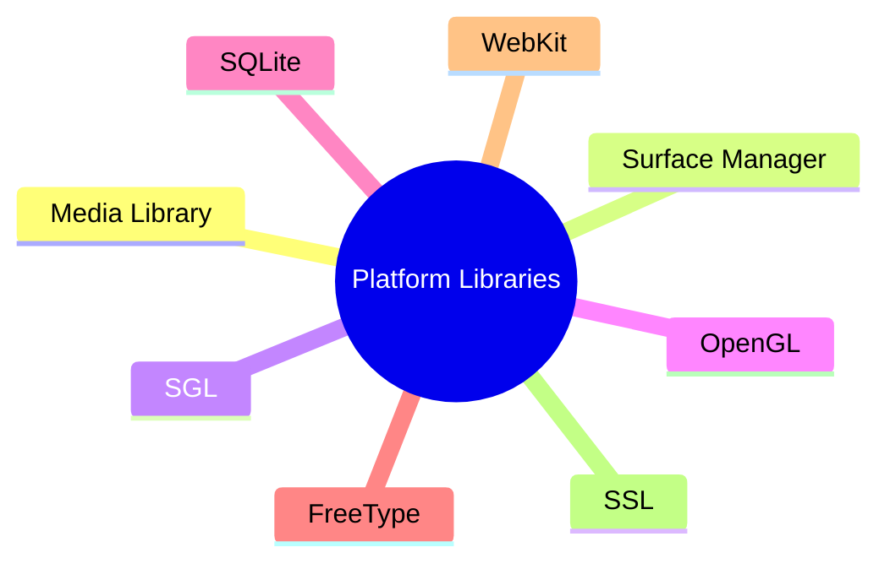

##### 1.3.4.1 Media Library

The Media Library provides support for audio and video playback and recording.

##### Functions

- Audio playback
- Audio recording
- Video playback
- Video recording
- Multimedia streaming

##### Supported Media Types

- MP3
- AAC
- WAV
- MP4
- MPEG

##### Advantages

- Rich multimedia support
- High-quality media processing
- Efficient encoding and decoding

##### 1.3.4.2 Surface Manager

Surface Manager manages access to the display subsystem.

It controls how application screens are displayed and rendered on the device.

##### Functions

- Display management
- Screen composition
- Surface rendering
- Graphics coordination

##### Benefits

- Smooth screen updates
- Efficient graphics rendering
- Better user experience

##### 1.3.4.3 SGL

SGL (Skia Graphics Library) is Android's 2D graphics engine.

It provides APIs for drawing graphical elements on the screen.

##### Functions

- 2D graphics rendering
- Shape drawing
- Image rendering
- Text rendering

##### Applications

- User interface rendering
- Graphics-based applications
- Custom views

##### Advantages

- Lightweight graphics engine
- Efficient rendering performance

##### 1.3.4.4 OpenGL

OpenGL (Open Graphics Library) is a cross-platform API used for rendering 2D and 3D graphics.

Android primarily uses OpenGL ES (Embedded Systems).

##### Functions

- 2D graphics rendering
- 3D graphics rendering
- Animation support
- Hardware acceleration

##### Applications

- Mobile games
- Augmented Reality (AR)
- Virtual Reality (VR)
- Graphic-intensive applications

##### Advantages

- High-performance graphics
- Hardware acceleration
- Cross-platform support

##### 1.3.4.5 SQLite

SQLite is a lightweight relational database management system embedded within Android.

It allows applications to store and retrieve structured data locally.

##### Features

- Serverless database
- Lightweight
- Fast performance
- ACID compliant

##### Operations

- Create
- Insert
- Update
- Delete
- Query

##### Applications

- Offline data storage
- User information management
- Application settings

##### Advantages

- No separate database server required.
- Efficient local storage.
- Easy integration with Android applications.

##### 1.3.4.6 FreeType

FreeType is a font rendering library used in Android.

It enables applications to display text in various font formats.

##### Functions

- Font rendering
- Text display
- Character processing
- Typography support

##### Benefits

- Improved text quality
- Multiple font support
- Better readability

##### 1.3.4.7 WebKit

WebKit is an open-source web browser engine used to display web content.

It provides functionality for rendering web pages within Android applications.

##### Functions

- HTML rendering
- CSS rendering
- JavaScript execution
- Web page loading

##### Applications

- Web browsers
- Hybrid mobile applications
- Embedded web views

##### Advantages

- Fast web page rendering
- Standards compliance
- Cross-platform compatibility

##### 1.3.4.8 SSL

SSL (Secure Sockets Layer) is a security technology that establishes an encrypted communication channel between clients and servers.

Although modern systems use TLS, SSL remains a commonly used term.

##### Functions

- Data encryption
- Authentication
- Secure communication
- Data integrity protection

##### Working Process

1. Client requests secure connection.
2. Server provides digital certificate.
3. Encryption keys are exchanged.
4. Secure communication begins.

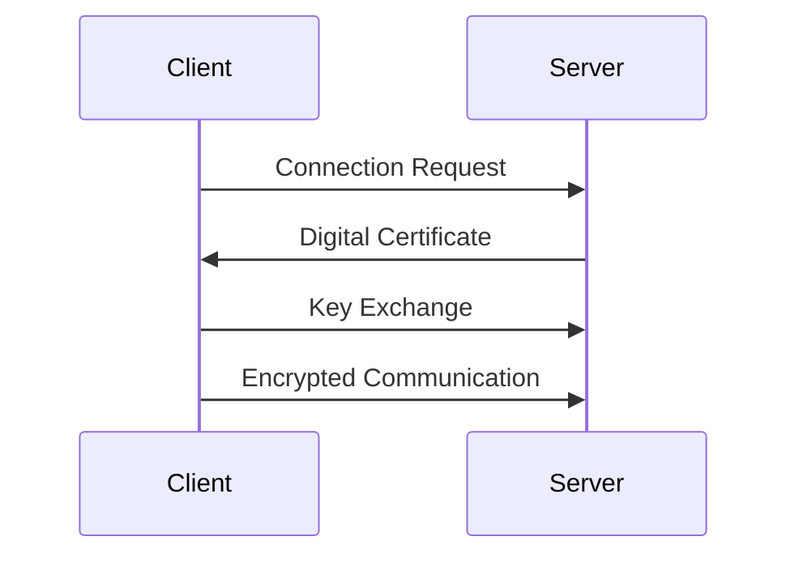

##### Advantages

- Protects sensitive information.
- Prevents data interception.
- Ensures secure online transactions.
- Supports secure application communication.

##### Quick Revision

- Android Runtime consists of Core Libraries and DVM.
- Core Libraries provide APIs for Android application development.
- DVM is a register-based virtual machine.
- DVM executes `.dex` files.
- Media Library handles audio and video processing.
- Surface Manager controls display rendering.
- SGL provides 2D graphics support.
- OpenGL provides 2D and 3D graphics support.
- SQLite is Android's embedded database.
- FreeType handles font rendering.
- WebKit renders web content.
- SSL provides encrypted communication.

##### Summary

Android Runtime provides the execution environment necessary for applications, while Platform Libraries supply specialized functionality for multimedia, graphics, databases, web rendering, and security. Together, they form the core software infrastructure that enables Android applications to operate efficiently and securely.
#### 1.3.5 Linux Kernel

The Linux Kernel is the foundation and heart of the Android operating system. It acts as an interface between the device hardware and the higher layers of Android Architecture.

All Android applications and system services ultimately interact with the hardware through the Linux Kernel.

##### Responsibilities of Linux Kernel

- Hardware abstraction
- Memory management
- Process management
- Device management
- Security enforcement
- Network communication
- Power management

##### Major Components

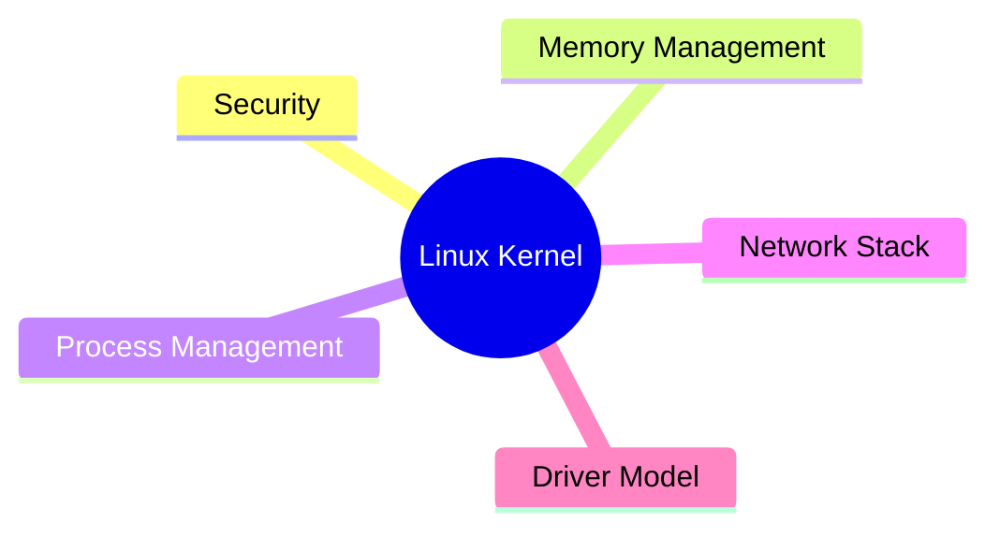

##### Advantages of Linux Kernel in Android

- Open-source architecture
- High stability
- Strong security mechanisms
- Efficient resource utilization
- Broad hardware support
- Reliable multitasking


##### 1.3.5.1 Security

Security is one of the most important responsibilities of the Linux Kernel.

The kernel enforces isolation between applications and protects system resources from unauthorized access.

##### Functions

- User and process isolation
- Permission enforcement
- Access control
- Secure communication between applications and the system

##### Security Features

###### User-Based Security

Each Android application runs under a separate Linux User ID (UID).

This ensures:

- Application isolation
- Protection of user data
- Restricted access to system resources

###### Permission Enforcement

Applications must obtain appropriate permissions before accessing:

- Camera
- Microphone
- Contacts
- Storage
- Location

###### Process Isolation

Applications cannot directly access another application's memory or files.

##### Benefits

- Improved device security
- Reduced malware impact
- Better privacy protection


##### 1.3.5.2 Memory Management

Memory Management is responsible for allocating, tracking, and releasing memory resources.

The Linux Kernel ensures efficient utilization of RAM while preventing memory conflicts among applications.

##### Functions

- Memory allocation
- Memory deallocation
- Virtual memory management
- Memory protection
- Garbage collection support

##### Responsibilities

###### RAM Management

Allocates memory to applications as needed.

###### Memory Protection

Prevents one application from accessing another application's memory space.

###### Low Memory Handling

When available memory becomes low:

- Background processes may be terminated.
- Resources are reclaimed automatically.

##### Benefits

- Improved system stability
- Efficient resource utilization
- Better multitasking performance

##### Example

When multiple applications are running simultaneously, the kernel dynamically allocates memory based on priority and resource requirements.


##### 1.3.5.3 Process Management

Process Management controls the execution of applications and system processes.

A process is an instance of a running program.

##### Functions

- Process creation
- Process scheduling
- Process termination
- Resource allocation
- CPU utilization management

##### Process Lifecycle

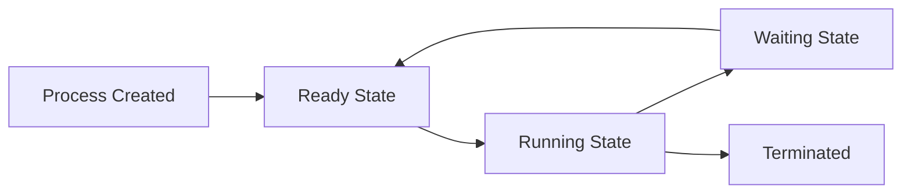

##### Scheduling

The Linux Kernel scheduler determines:

- Which process executes next
- CPU allocation time
- Process priorities

##### Advantages

- Efficient multitasking
- Fair CPU allocation
- Improved responsiveness

##### Example

When a user switches between applications, the kernel manages background and foreground processes efficiently.


##### 1.3.5.4 Network Stack

The Network Stack manages all network communication within Android.

It provides support for internet connectivity and data transmission between devices.

##### Functions

- TCP/IP communication
- Wi-Fi connectivity
- Mobile data communication
- Bluetooth networking
- Packet routing

##### Protocol Support

###### TCP (Transmission Control Protocol)

Provides reliable communication.

###### UDP (User Datagram Protocol)

Provides faster communication with lower overhead.

###### IP (Internet Protocol)

Handles addressing and routing of packets.

##### Communication Flow

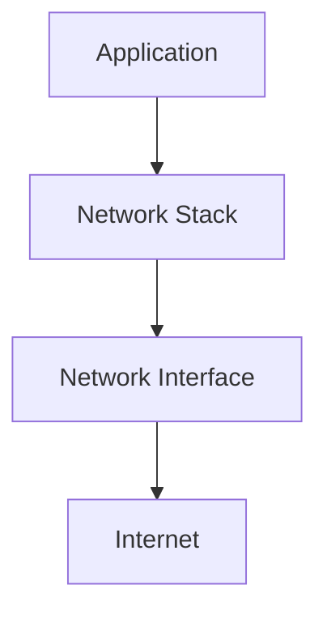

##### Benefits

- Reliable network communication
- Internet connectivity
- Wireless communication support

##### Applications

- Web Browsing
- Online Gaming
- Video Streaming
- Cloud Services


##### 1.3.5.5 Driver Model

The Driver Model provides support for communication between Android and hardware devices.

Drivers act as translators between software and hardware components.

##### Functions

- Hardware initialization
- Device communication
- Resource management
- Hardware abstraction

##### Common Android Drivers

###### Display Driver

Controls screen rendering and display output.

###### Camera Driver

Manages camera hardware and image capture.

###### Audio Driver

Handles sound input and output operations.

###### Bluetooth Driver

Enables Bluetooth communication.

###### Wi-Fi Driver

Provides wireless network connectivity.

###### Memory Driver

Controls memory hardware interactions.

##### Driver Architecture

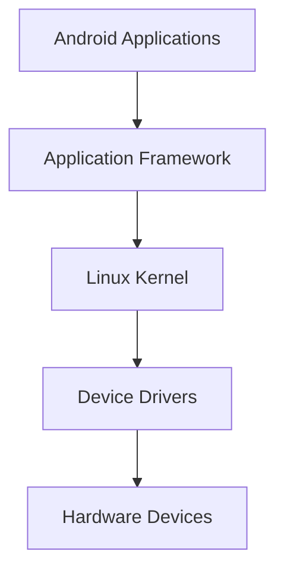

##### Advantages

- Hardware independence
- Device compatibility
- Simplified hardware access
- Improved system reliability

##### Importance

Manufacturers integrate device-specific drivers into the Linux Kernel to ensure Android functions correctly on their hardware.


##### Quick Revision

- Linux Kernel is the foundation of Android Architecture.
- It acts as a bridge between hardware and software.
- Security provides application isolation and permission enforcement.
- Memory Management handles RAM allocation and protection.
- Process Management controls process execution and scheduling.
- Network Stack manages internet and network communication.
- Driver Model enables interaction with hardware devices.
- Common drivers include display, camera, audio, Bluetooth, and Wi-Fi drivers.

##### Summary

The Linux Kernel forms the lowest layer of Android Architecture and is responsible for managing hardware resources, security, memory, processes, networking, and device drivers. It provides a stable and secure environment that enables Android applications and services to function efficiently across a wide variety of devices.

### 1.4 Android Security and Permission Model

Android follows a multi-layered security architecture designed to protect user data, system resources, and applications from unauthorized access.

The Android Security Model is based on:

- Application Sandbox
- Linux Kernel Security
- Permission System
- Application Signing
- SELinux Enforcement
- Verified Boot
- Encryption

The primary objective of Android security is to ensure:

- Confidentiality
- Integrity
- Availability

##### Security Goals

- Protect user privacy
- Prevent unauthorized access
- Isolate applications
- Secure communication
- Reduce malware threats

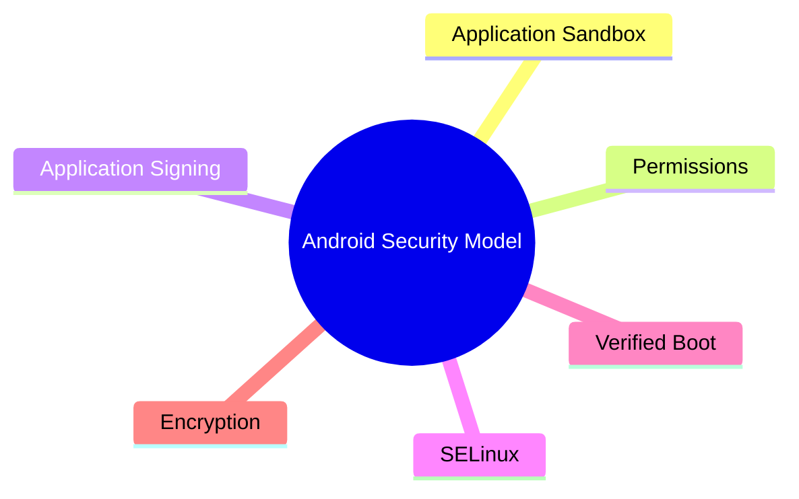

#### 1.4.1 Understanding Android Security Model

Android employs a defense-in-depth strategy, where multiple security layers work together to protect the system.

Each application operates independently and must explicitly request access to protected resources.

##### Core Security Principles

###### Least Privilege

Applications receive only the permissions necessary to perform their intended functions.

###### Isolation

Applications are isolated from one another to prevent unauthorized access.

###### Authentication

Applications must be digitally signed before installation.

###### Access Control

Access to sensitive resources is controlled through permissions and security policies.

##### Security Architecture Overview

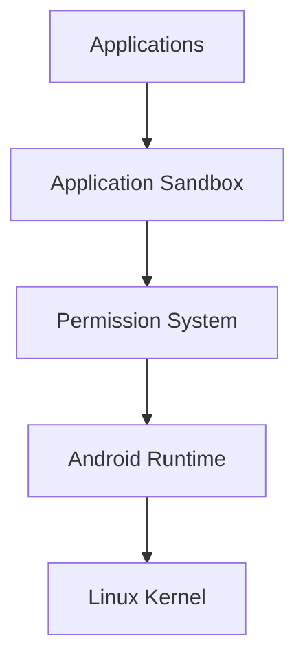

##### Benefits

- Protects user data.
- Restricts malicious activities.
- Prevents unauthorized system access.
- Enhances device reliability.


#### 1.4.2 Application Sandbox

The Application Sandbox is one of Android's most important security mechanisms.

Each application runs inside its own isolated environment known as a sandbox.

This isolation prevents applications from directly accessing:

- Other applications' data
- System resources
- Private files

Without proper permissions, an application cannot interfere with another application's operation.

##### Purpose of Sandboxing

- Data protection
- Application isolation
- Malware containment
- Secure resource access

##### How Sandbox Works

When an application is installed:

1. Android creates a unique user account.
2. A unique User ID (UID) is assigned.
3. Separate storage space is created.
4. Access restrictions are enforced by the Linux Kernel.

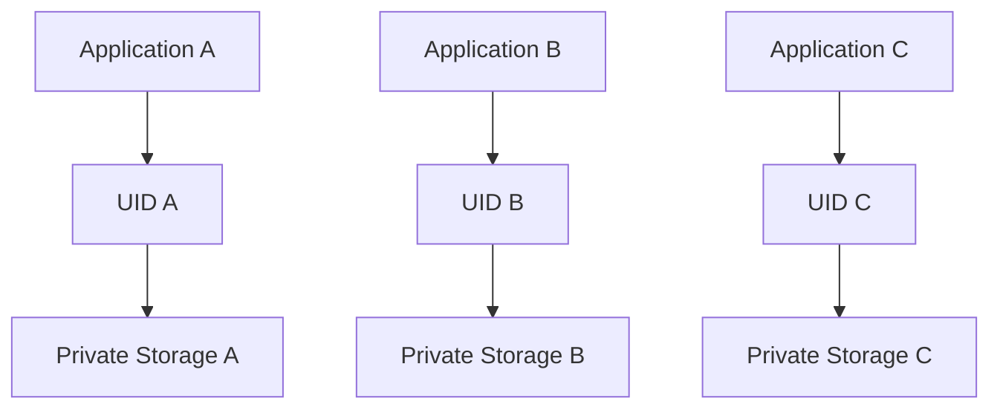

##### Advantages

- Prevents data leakage.
- Reduces malware spread.
- Improves system security.
- Protects application integrity.


##### 1.4.2.1 User ID (UID)

A User ID (UID) is a unique identifier assigned to every Android application during installation.

The Linux Kernel uses the UID to enforce application isolation.

##### Purpose of UID

- Identify applications uniquely.
- Control access permissions.
- Separate application processes.
- Protect application data.

##### Working of UID

When an application is installed:

1. Android assigns a unique UID.
2. The application runs under that UID.
3. Files created by the application belong to that UID.
4. Other applications cannot access those files directly.

##### Example

```text
Application A → UID 10001
Application B → UID 10002
Application C → UID 10003
```

Since each application has a different UID:

- Application A cannot access Application B's files.
- Application B cannot modify Application C's data.
- System security is maintained automatically.

##### Benefits

- Strong application isolation.
- Secure process management.
- Reduced risk of unauthorized access.

##### Importance in Security

UID-based isolation forms the foundation of Android's sandbox model.


##### 1.4.2.2 File Permissions

File Permissions determine which users and applications can access specific files and directories.

Android inherits its file permission system from Linux.

##### Purpose

- Protect application data.
- Prevent unauthorized file access.
- Control read, write, and execute operations.

##### Permission Types

###### Read (r)

Allows viewing file contents.

###### Write (w)

Allows modifying file contents.

###### Execute (x)

Allows executing programs or scripts.

##### Permission Structure

```text
rwx rwx rwx
│   │   │
│   │   └── Others
│   └────── Group
└────────── Owner
```

##### Android File Protection

By default:

- Applications can access only their own files.
- Private application data remains inaccessible to other applications.
- Sensitive files require explicit permissions.

##### Example

```text
/data/data/com.example.app/
```

The above directory is accessible only by the application that owns it.

##### Benefits

- Enhanced privacy.
- Secure storage management.
- Reduced risk of data theft.
- Better access control.

##### Relationship Between UID and File Permissions


The Linux Kernel combines UID-based isolation and file permissions to create a secure application environment.


##### Quick Revision

- Android uses a multi-layered security architecture.
- Application Sandbox isolates applications from one another.
- Every application receives a unique UID.
- UID is assigned during installation.
- Linux Kernel enforces UID-based isolation.
- Applications cannot access each other's private data by default.
- File Permissions control access to files and directories.
- Permission types include Read, Write, and Execute.
- Sandboxing reduces malware impact and improves security.

##### Summary

Android's Security Model is built on the principles of isolation, least privilege, and access control. The Application Sandbox ensures that every application operates in its own secure environment, while User IDs and File Permissions enforce strict boundaries between applications. Together, these mechanisms protect user data, prevent unauthorized access, and form the foundation of Android's security architecture.

#### 1.4.3 Permissions

Permissions are a security mechanism used by Android to control an application's access to system resources and user data.

Without appropriate permissions, an application cannot access sensitive features such as:

- Camera
- Microphone
- Contacts
- SMS
- Storage
- Location

Permissions help protect user privacy and prevent unauthorized access to device resources.

##### Objectives of Permissions

- Protect user data
- Restrict unauthorized access
- Improve application security
- Provide user control over sensitive resources

##### Permission Categories

###### Normal Permissions

These permissions have minimal risk and are automatically granted during installation.

Examples:

- Internet Access
- Network State Access
- Bluetooth Access

###### Dangerous Permissions

These permissions provide access to sensitive user data and require user approval.

Examples:

- Camera
- Microphone
- Location
- Contacts
- SMS

##### Permission Workflow

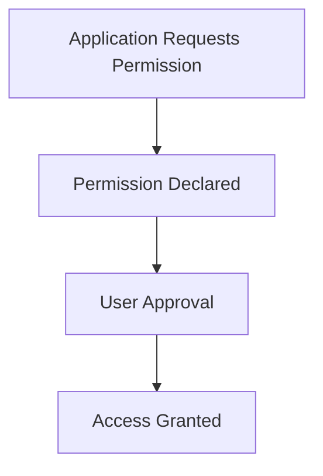


##### 1.4.3.1 Manifest Declaration

Before using protected resources, an application must declare its required permissions in the `AndroidManifest.xml` file.

The Android Manifest acts as a configuration file that informs the system about the application's requirements.

##### Purpose

- Inform Android about required permissions
- Enable security checks
- Define application capabilities

##### Example

```xml
<manifest>
    <uses-permission android:name="android.permission.CAMERA"/>
    <uses-permission android:name="android.permission.ACCESS_FINE_LOCATION"/>
</manifest>
```

##### Common Permission Declarations

| Permission | Purpose |
|------------|---------|
| CAMERA | Access device camera |
| RECORD_AUDIO | Access microphone |
| ACCESS_FINE_LOCATION | Access GPS location |
| READ_CONTACTS | Access contacts |
| SEND_SMS | Send text messages |
| INTERNET | Access internet |

##### Advantages

- Transparent permission requirements
- Easier security auditing
- Better user awareness

##### Limitations

Manifest declaration alone does not automatically grant dangerous permissions.

User approval may still be required.


##### 1.4.3.2 Runtime Permissions

Starting from Android 6.0 (Marshmallow), Android introduced Runtime Permissions for dangerous permissions.

Instead of granting permissions during installation, users are prompted when the application attempts to access a protected resource.

##### Purpose

- Increase user control
- Improve privacy protection
- Prevent unnecessary permission access

##### Runtime Permission Process

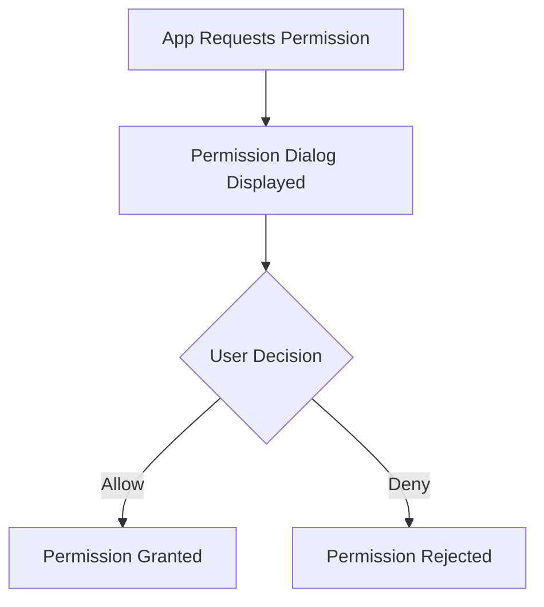

##### Example

When a camera application is opened for the first time:

1. The application requests camera access.
2. Android displays a permission dialog.
3. The user selects Allow or Deny.
4. Access is granted or rejected accordingly.

##### Benefits

- Enhanced privacy
- Better user awareness
- Reduced security risks
- Greater control over personal data

##### Key Points

- Introduced in Android 6.0 Marshmallow.
- Applicable mainly to dangerous permissions.
- Users can revoke permissions later through Settings.


#### 1.4.4 Application Signing

Application Signing is a security mechanism that requires every Android application to be digitally signed before installation.

A digital signature verifies the application's authenticity and integrity.

##### Purpose

- Verify developer identity
- Prevent application tampering
- Secure application updates
- Establish trust between applications

##### How Application Signing Works

1. Developer creates application.
2. Application is signed using a private key.
3. Android verifies the signature during installation.
4. Installation proceeds only if verification succeeds.


##### Benefits

- Protects application integrity
- Prevents unauthorized modifications
- Enables secure updates
- Ensures application authenticity

##### Types of Signing Keys

###### Debug Key

Used during application development and testing.

Characteristics:

- Automatically generated
- Not suitable for production

###### Release Key

Used for publishing applications.

Characteristics:

- Created by developer
- Used for production releases
- Must be securely stored


##### 1.4.4.1 Signature Verification

Signature Verification is the process through which Android validates an application's digital signature during installation.

##### Purpose

- Verify application authenticity
- Detect tampering
- Protect users from malicious modifications

##### Verification Process

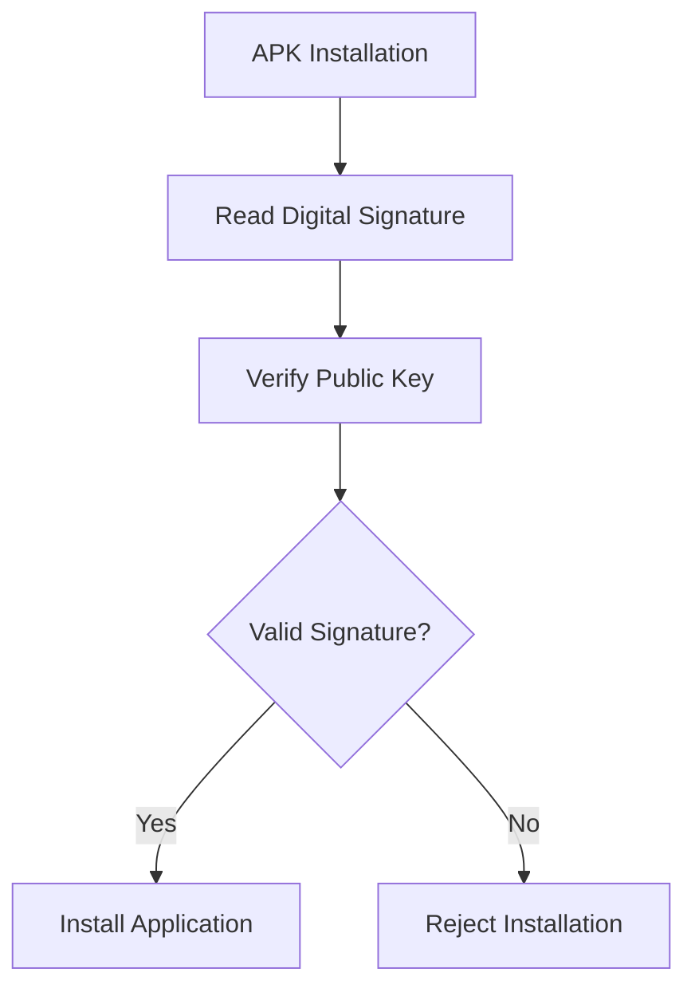

##### Working

1. Android extracts the application's signature.
2. The signature is compared with the developer's public key.
3. Integrity is verified.
4. Installation proceeds if validation succeeds.

##### Benefits

- Prevents malicious APK modification.
- Detects unauthorized changes.
- Maintains application trustworthiness.

##### Example

If an attacker modifies an APK after it has been signed, the signature becomes invalid and Android rejects the installation.


##### 1.4.4.2 Update Verification

Update Verification ensures that application updates originate from the same developer who published the original application.

##### Purpose

- Prevent unauthorized updates
- Protect application ownership
- Maintain application integrity

##### Verification Process

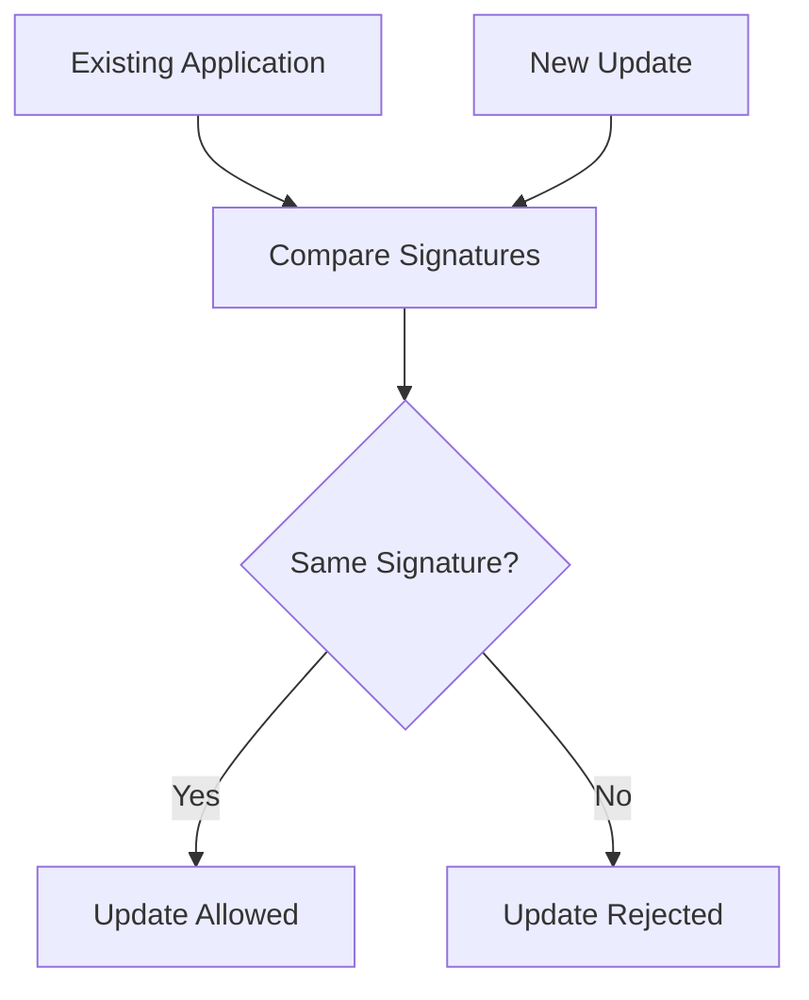

##### Working

1. Android retrieves the signature of the installed application.
2. The update package signature is checked.
3. Both signatures are compared.
4. Update is accepted only if the signatures match.

##### Example

Original App Signature:

```text
Developer Key A
```

Update Signature:

```text
Developer Key A
```

Result:

```text
Update Successful
```

If the update is signed with a different key:

```text
Update Rejected
```

##### Benefits

- Prevents malicious update attacks.
- Ensures update authenticity.
- Protects users from fake applications.


##### Quick Revision

- Permissions control access to system resources and user data.
- Permissions are declared in `AndroidManifest.xml`.
- Runtime Permissions were introduced in Android 6.0.
- Dangerous permissions require user approval.
- Every Android application must be digitally signed.
- Application Signing verifies authenticity and integrity.
- Signature Verification checks application signatures during installation.
- Update Verification ensures updates come from the same developer.
- Invalid signatures result in installation or update rejection.

##### Summary

Android uses Permissions and Application Signing to secure applications and protect user data. Permissions regulate access to sensitive resources, while Application Signing ensures application authenticity and integrity. Signature Verification and Update Verification further strengthen security by preventing unauthorized modifications and malicious updates.

#### 1.4.5 Security-Enhanced Linux (SELinux)

Security-Enhanced Linux (SELinux) is a Mandatory Access Control (MAC) security framework integrated into the Linux Kernel and adopted by Android to strengthen system security.

SELinux provides an additional layer of protection beyond traditional Linux permissions by controlling how processes interact with each other and with system resources.

Android uses SELinux to prevent unauthorized access, privilege escalation attacks, and malicious activities.

##### Objectives of SELinux

- Strengthen Android security
- Restrict unauthorized access
- Prevent privilege escalation
- Protect system resources
- Enforce security policies

##### Why SELinux is Needed

Traditional Linux security primarily relies on:

- User IDs (UIDs)
- File permissions

However, these mechanisms alone may not be sufficient against sophisticated attacks.

SELinux introduces:

- Fine-grained access control
- Process restrictions
- Resource protection

##### Working of SELinux

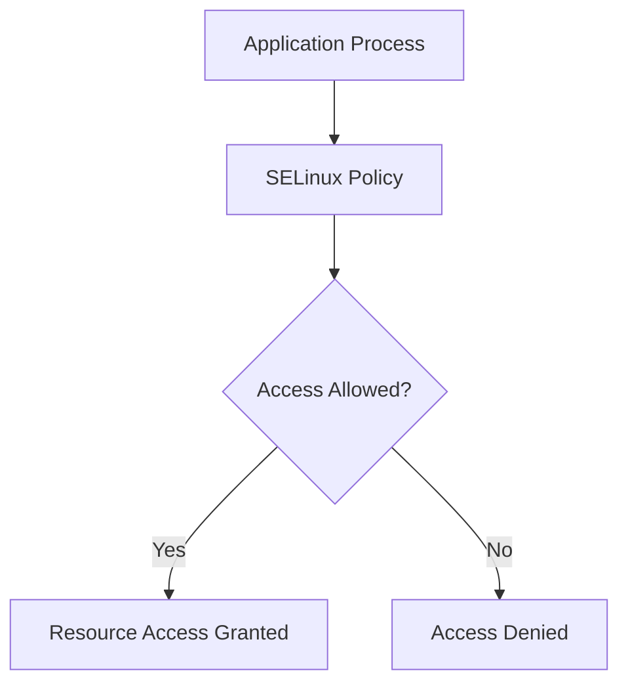

##### Benefits

- Improved device security
- Reduced attack surface
- Better protection against malware
- Enhanced system stability


##### 1.4.5.1 Policies

SELinux operates using security policies that define how processes can interact with files, services, and system resources.

A policy acts as a set of security rules that determine whether an action is permitted or denied.

##### Purpose of Policies

- Control system behavior
- Restrict unauthorized access
- Define process permissions
- Protect sensitive resources

##### Policy Components

###### Subjects

Entities requesting access.

Examples:

- Applications
- Processes
- Services

###### Objects

Resources being accessed.

Examples:

- Files
- Directories
- Hardware devices
- System services

###### Actions

Operations performed on objects.

Examples:

- Read
- Write
- Execute
- Modify

##### Policy Decision Process

```mermaid
flowchart LR
    A[Process]
    B[SELinux Policy]
    C[System Resource]

    A --> B
    B -->|Allowed| C
    B -->|Denied| D[Access Blocked]
```

##### Example

A camera application attempts to access the microphone.

SELinux checks:

1. Application identity.
2. Associated policy.
3. Requested operation.

Access is granted only if the policy permits it.

##### Advantages

- Granular access control.
- Improved system protection.
- Reduced risk of unauthorized activities.


##### 1.4.5.2 Enforcement Modes

SELinux operates in different modes that determine how policy violations are handled.

##### Types of Enforcement Modes

###### Enforcing Mode

In Enforcing Mode, SELinux actively blocks actions that violate security policies.

Characteristics:

- Violations are prevented.
- Security rules are enforced.
- Events are logged.

##### Working

```mermaid
flowchart TD
    A[Policy Violation]
    B[SELinux Check]
    C[Access Denied]
    D[Event Logged]

    A --> B
    B --> C
    C --> D
```

##### Advantages

- Maximum security
- Protection against attacks
- Prevents unauthorized operations

##### Android Usage

Modern Android versions use SELinux in Enforcing Mode by default.


###### Permissive Mode

In Permissive Mode, violations are allowed but recorded in system logs.

Characteristics:

- No access blocking
- Security events logged
- Useful for testing and debugging

##### Working

```mermaid
flowchart TD
    A[Policy Violation]
    B[SELinux Check]
    C[Access Allowed]
    D[Violation Logged]

    A --> B
    B --> C
    C --> D
```

##### Usage

- Security testing
- Policy development
- Troubleshooting

##### Comparison

| Feature | Enforcing Mode | Permissive Mode |
|----------|---------------|----------------|
| Blocks Violations | Yes | No |
| Logs Violations | Yes | Yes |
| Production Use | Yes | No |
| Debugging Use | Limited | Yes |


#### 1.4.6 Verified Boot

Verified Boot is an Android security feature that ensures the device boots only trusted and untampered software.

It verifies the integrity and authenticity of every stage of the boot process before execution.

Verified Boot protects devices from:

- Rootkits
- Boot-level malware
- Unauthorized system modifications
- Corrupted system partitions

##### Objectives

- Ensure software integrity
- Detect tampering
- Prevent unauthorized modifications
- Protect system startup

##### Boot Sequence

```mermaid
flowchart TD
    A[Bootloader]
    B[Kernel]
    C[System Partition]
    D[Android OS]

    A --> B
    B --> C
    C --> D
```

Each stage verifies the next stage before execution.

##### Benefits

- Secure startup process
- Protection against malware
- Increased user trust
- Enhanced system reliability


##### 1.4.6.1 Boot Verification

Boot Verification is the process of validating every component involved in the Android startup sequence.

Before loading the next stage, the current stage checks its integrity using cryptographic verification techniques.

##### Verification Process

```mermaid
flowchart TD
    A[Bootloader]
    B[Verify Kernel]
    C[Verify System Partition]
    D[Launch Android]

    A --> B
    B --> C
    C --> D
```

##### Steps

1. Device powers on.
2. Bootloader starts execution.
3. Bootloader verifies kernel integrity.
4. Kernel verifies system partition.
5. Android OS starts only if all checks succeed.

##### Failure Scenario

If verification fails:

- Warning may be displayed.
- Device may refuse to boot.
- Recovery mode may be triggered.

##### Advantages

- Detects system tampering.
- Prevents execution of malicious code.
- Maintains software integrity.


##### 1.4.6.2 Rollback Protection

Rollback Protection prevents attackers from installing older and potentially vulnerable versions of Android.

Older operating system versions may contain known security vulnerabilities that attackers can exploit.

##### Purpose

- Prevent downgrade attacks.
- Maintain latest security protections.
- Block vulnerable software installations.

##### Working

Android stores version information securely.

During an update:

1. Current version is checked.
2. New version is compared.
3. Downgrades are rejected.

##### Verification Process

```mermaid
flowchart TD
    A[Current Android Version]
    B[Requested Version]
    C{Version Older?}

    C -->|Yes| D[Update Rejected]
    C -->|No| E[Update Allowed]

    A --> C
    B --> C
```

##### Example

```text
Current Version: Android 14
Requested Version: Android 12
```

Result:

```text
Installation Rejected
```

Because Android 12 is older and may contain known vulnerabilities.

##### Benefits

- Prevents downgrade attacks.
- Preserves security updates.
- Protects against known exploits.
- Ensures system integrity.


##### Quick Revision

- SELinux stands for Security-Enhanced Linux.
- SELinux implements Mandatory Access Control (MAC).
- SELinux uses policies to control access.
- Android uses SELinux in Enforcing Mode.
- Enforcing Mode blocks policy violations.
- Permissive Mode logs violations without blocking them.
- Verified Boot ensures only trusted software is loaded.
- Boot Verification checks each stage of the boot process.
- Rollback Protection prevents installation of older vulnerable versions.
- Verified Boot protects against boot-level malware and system tampering.

##### Summary

SELinux and Verified Boot are critical components of Android's security architecture. SELinux enforces strict access control policies to protect system resources, while Verified Boot ensures that only authentic and untampered software is executed during startup. Together, they provide strong protection against malware, privilege escalation attacks, and unauthorized system modifications.

#### 1.4.7 Google Play Protect

Google Play Protect is a built-in Android security service developed by Google to protect devices from harmful applications and malicious activities.

It continuously monitors applications installed on the device and scans them for suspicious behavior.

Google Play Protect works automatically in the background and helps maintain device security without requiring user intervention.

##### Objectives

- Detect malicious applications
- Protect user data
- Remove harmful software
- Monitor device security
- Improve application trustworthiness

##### Key Features

- Automatic application scanning
- Malware detection
- Real-time protection
- Harmful app removal
- Security recommendations

##### Working of Google Play Protect

```mermaid
flowchart TD
    A[Application Installed]
    B[Google Play Protect Scan]
    C{Safe?}

    C -->|Yes| D[Application Allowed]
    C -->|No| E[Application Blocked/Removed]

    A --> B
    B --> C
```

##### Benefits

- Continuous security monitoring
- Malware protection
- Safer application ecosystem
- Improved user trust


##### 1.4.7.1 App Scanning

App Scanning is the primary security function of Google Play Protect.

It examines applications both before and after installation to identify potentially harmful behavior.

##### Purpose

- Detect malware
- Identify suspicious activities
- Protect sensitive information
- Prevent installation of dangerous applications

##### How App Scanning Works

1. Application is installed.
2. Google Play Protect analyzes the application.
3. Behavior and code are evaluated.
4. Threats are detected.
5. Action is taken if necessary.

##### Scanning Sources

###### Google Play Store Applications

Applications downloaded from Google Play are scanned before publication and continuously monitored afterward.

###### Third-Party Applications

Applications installed from external sources are also scanned for threats.

##### Threats Detected

- Malware
- Spyware
- Ransomware
- Trojans
- Phishing applications

##### Scanning Process

```mermaid
flowchart LR
    A[APK File]
    B[Play Protect Analysis]
    C{Threat Found?}

    C -->|No| D[Safe Installation]
    C -->|Yes| E[Warning or Removal]

    A --> B
    B --> C
```

##### Advantages

- Real-time threat detection
- Protection against malicious applications
- Improved device security


##### 1.4.7.2 SafetyNet

SafetyNet is a collection of security services and APIs provided by Google that help applications determine whether a device is secure and trustworthy.

It enables developers to verify device integrity before allowing access to sensitive features.

##### Objectives

- Verify device integrity
- Detect rooted devices
- Detect modified operating systems
- Prevent fraud and abuse

##### Functions

- Device verification
- System integrity checking
- Application integrity validation
- Security assessment

##### SafetyNet Checks

###### Device Integrity

Determines whether the device is genuine and trusted.

###### System Integrity

Checks whether the operating system has been modified.

###### Root Detection

Detects whether root access has been enabled.

##### Working

```mermaid
flowchart TD
    A[Application]
    B[SafetyNet API]
    C[Device Analysis]
    D{Secure Device?}

    D -->|Yes| E[Access Granted]
    D -->|No| F[Restricted Access]

    A --> B
    B --> C
    C --> D
```

##### Examples

Applications commonly using SafetyNet:

- Banking Applications
- Mobile Wallets
- Payment Applications
- Enterprise Security Apps

##### Benefits

- Improved application security
- Fraud prevention
- Protection against rooted devices
- Secure digital transactions


#### 1.4.8 Encryption

Encryption is a security technique used to convert readable data (plaintext) into an unreadable format (ciphertext).

Only authorized users possessing the correct decryption key can access the original information.

Android uses encryption to protect:

- User files
- Application data
- Passwords
- Financial information
- Sensitive communications

##### Objectives

- Data confidentiality
- Data protection
- Privacy preservation
- Unauthorized access prevention

##### Basic Encryption Process

```mermaid
flowchart LR
    A[Plaintext]
    B[Encryption Algorithm]
    C[Ciphertext]
    D[Decryption Key]
    E[Original Data]

    A --> B
    B --> C
    C --> D
    D --> E
```

##### Types of Encryption

###### Data-at-Rest Encryption

Protects stored data on the device.

Examples:

- Internal storage
- Databases
- Application files

###### Data-in-Transit Encryption

Protects data while being transmitted across networks.

Examples:

- HTTPS communication
- Secure messaging
- Online banking transactions

##### Benefits

- Protects stolen devices
- Secures sensitive information
- Prevents unauthorized data access
- Enhances privacy

##### Importance in Android

Even if an attacker gains physical access to a device, encrypted data remains inaccessible without proper authentication.


### 1.5 Rooting

Rooting is the process of obtaining privileged administrative access (root access) on an Android device.

Root access allows users to bypass manufacturer restrictions and gain complete control over the operating system.

In Linux-based systems, the root user possesses the highest level of privileges.

##### Why Users Root Devices

- Customize the operating system
- Install advanced applications
- Remove pre-installed software
- Modify system files
- Improve performance

##### Rooting Process

```mermaid
flowchart TD
    A[Locked Android Device]
    B[Rooting Tool]
    C[Root Access Granted]
    D[Full System Control]

    A --> B
    B --> C
    C --> D
```

##### Important Note

Rooting modifies Android's default security model and may expose the device to additional security risks.


#### 1.5.1 Introduction to Rooting

Android devices normally restrict access to critical system files and settings.

Rooting removes these restrictions and grants administrative privileges to the user.

After rooting, users can:

- Modify system partitions
- Install custom ROMs
- Access protected files
- Run root-only applications

##### Characteristics

- Provides complete system control
- Bypasses manufacturer limitations
- Enables deep customization
- Alters Android security protections

##### Common Rooting Methods

- Bootloader unlocking
- Custom recovery installation
- Root management applications


#### 1.5.2 Advantages of Rooting

Rooting provides several benefits for advanced users and developers.

##### Advantages

###### Complete Device Control

Users gain unrestricted access to all system files and settings.

###### Remove Bloatware

Pre-installed applications can be removed permanently.

###### Install Custom ROMs

Users can replace the manufacturer's operating system with customized Android versions.

###### Advanced Customization

Allows modification of:

- Themes
- User Interface
- System behaviors
- Performance settings

###### Performance Optimization

Users can:

- Overclock processors
- Adjust memory settings
- Improve battery management

###### Root-Only Applications

Certain applications require root privileges to function.

Examples:

- Titanium Backup
- AdAway
- Kernel Managers

##### Benefits Summary

- Greater flexibility
- Enhanced customization
- Improved performance control


#### 1.5.3 Disadvantages of Rooting

Although rooting offers powerful capabilities, it also introduces several disadvantages.

##### Disadvantages

###### Warranty Void

Many manufacturers may void device warranties after rooting.

###### System Instability

Improper modifications can cause:

- Crashes
- Boot loops
- Application failures

###### Update Issues

Official system updates may no longer function correctly.

###### Increased Complexity

Managing rooted devices requires advanced technical knowledge.

###### Risk of Bricking

Incorrect rooting procedures may render a device unusable.

##### Possible Problems

- Reduced reliability
- Software incompatibility
- Unsupported configurations


#### 1.5.4 Security Risks of Rooting

Rooting significantly weakens Android's built-in security protections.

Many security mechanisms rely on restricted access and application isolation.

When root access is granted, these protections can be bypassed.

##### Major Security Risks

###### Malware Escalation

Malicious applications may gain elevated privileges.

###### Bypassing Application Sandbox

Applications may access resources normally protected by Android.

###### Data Theft

Sensitive information becomes easier to access.

###### Disabled Security Features

Some protections may no longer function properly:

- Verified Boot
- SafetyNet
- Integrity Verification

###### Increased Attack Surface

More system components become exposed to potential attacks.

##### Security Risk Model

```mermaid
flowchart TD
    A[Root Access]
    B[Reduced Restrictions]
    C[Increased Privileges]
    D[Higher Security Risks]

    A --> B
    B --> C
    C --> D
```

##### Risks to Users

- Banking application restrictions
- Payment service failures
- Privacy compromise
- Malware infections
- System corruption

##### Prevention Measures

If rooting is necessary:

- Use trusted rooting tools.
- Install applications from trusted sources.
- Keep backups of important data.
- Monitor root permissions carefully.


##### Quick Revision

- Google Play Protect scans applications for malware.
- App Scanning detects harmful applications.
- SafetyNet verifies device integrity.
- Encryption protects stored and transmitted data.
- Rooting provides administrative privileges.
- Rooting allows complete system control.
- Advantages include customization and performance optimization.
- Disadvantages include warranty loss and instability.
- Rooting increases security risks.
- Rooted devices are more vulnerable to malware and unauthorized access.

##### Summary

Google Play Protect, SafetyNet, and Encryption provide critical layers of Android security by protecting applications, verifying device integrity, and securing sensitive data. Rooting, while offering greater control and customization, weakens Android's security model and introduces significant risks such as malware exposure, data theft, and system instability. Therefore, rooting should be performed only when necessary and with appropriate precautions.
