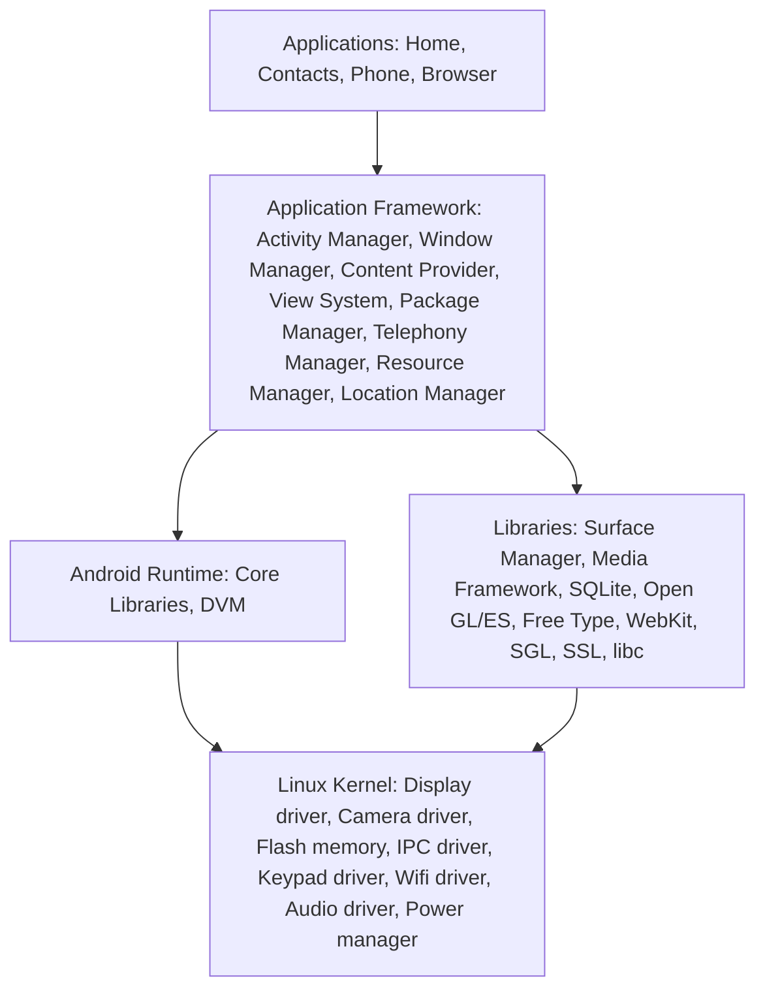

# Unit - 1
:::info[Title]
## Introduction to Android
:::

## 1. History of Android

### 1.1 Foundation and Android Inc.
#### 1.1.1 Android Inc. Origins
- **Foundation:** Android Inc. was founded in Palo Alto, California, in October 2003.
- **Founders:** Andy Rubin, Rich Miner, Nick Sears, and Chris White.
- **Vision:** Rubin described the project as having "tremendous potential in developing smarter mobile devices that are more aware of its owner's location and preferences".
- **Early Intentions:** The company's initial goal was to develop an advanced operating system for digital cameras, which formed the basis of their pitch to investors in April 2004.

#### 1.1.2 Acquisition by Google
- **Acquisition Date:** On August 17th, 2005, Google quietly acquired Android Incorporation for $50 million. Since then, it has been a subsidiary of Google Incorporation.
- **Motivation:** Interestingly, the idea of making an open-source smartphone operating system that would rival Symbian, Apple iOS, and Microsoft Windows Mobile was initially the key reason Google was *not* attracted to it. Nevertheless, it is now considered one of Google's best acquisitions to date.

### 1.2 Key Dates
- **October 2003:** Android Inc. was founded.
- **July 2005:** Google acquired Android Inc.
- **November 5th, 2007:** OHA (Open Handset Alliance) was formed.
- **October 22nd, 2008:** First Android Smartphone, the HTC Dream, was launched.
- **September 8th, 2020:** Android OS’s Latest version, Android 11, was released.

## 2. Android Hardware and Software

### 2.1 Android Hardware
#### 2.1.1 Supported Architectures
- **Primary Platform:** The main hardware platform for Android is **ARM** (the ARMv7 and ARMv8-A architectures).
- **x86 Support:** x86 and x86-64 architectures are also officially supported in later versions. 
  - The unofficial Android-x86 project provided support for x86 architectures ahead of the official support.
  - Since 2012, Android devices with Intel processors began to appear, including phones and tablets.
- **64-bit Evolution:** Android was first made to run on 64-bit x86. Since Android 5.0 ("Lollipop"), 64-bit variants of all platforms are supported in addition to the 32-bit variants.
- **RISC-V:** An unofficial experimental port of the operating system to the RISC-V architecture was released in 2021.

### 2.2 Android Software Architecture
#### 2.2.1 Architecture Diagram

```mermaid
flowchart TD
    A[Applications: Home, Contacts, Phone, Browser]
    B[Application Framework: Activity Manager, Window Manager, Content Provider, View System, Package Manager, Telephony Manager, Resource Manager, Location Manager]
    C[Android Runtime: Core Libraries, DVM]
    D[Libraries: Surface Manager, Media Framework, SQLite, Open GL/ES, Free Type, WebKit, SGL, SSL, libc]
    E[Linux Kernel: Display driver, Camera driver, Flash memory, IPC driver, Keypad driver, Wifi driver, Audio driver, Power manager]
    A --> B
    B --> C
    B --> D
    C --> E
    D --> E
```

#### 2.2.2 Applications
- **Definition:** The top layer of the Android architecture.
- **Contents:** Includes pre-installed applications (like home, contacts, camera, gallery, etc.) and third-party applications downloaded from the Play Store (like chat applications, games, etc.).
- **Execution:** Runs within the Android runtime with the help of classes and services provided by the application framework.

#### 2.2.3 Application Framework
- **Definition:** Provides several important classes used to create an Android application.
- **Features:** 
  - Provides a generic abstraction for hardware access.
  - Helps in managing the user interface with application resources.
  - Provides services to create particular classes that are helpful for application creation.
- **Components:** Includes different types of services according to prerequisites:
  - **Activity Manager**
  - **Notification Manager**
  - **View System**
  - **Package Manager**

#### 2.2.4 Android Runtime
- **Definition:** One of the most important parts of Android. It provides the base for the application framework and powers the application using core libraries.
- **Components:** 
  - **Core Libraries:** Enable the implementation of Android applications using standard JAVA or Kotlin programming languages.
  - **Dalvik Virtual Machine (DVM):** 
    - Like Java Virtual Machine (JVM), DVM is a register-based virtual machine specially designed and optimized for Android to ensure a device can run multiple instances efficiently.
    - Depends on the Linux kernel layer for threading and low-level memory management.

#### 2.2.5 Platform Libraries
- **Definition:** Includes various C/C++ core libraries and Java-based libraries providing support for Android development.
- **Key Libraries:**
  - **Media Library:** Provides support to play and record audio and video formats.
  - **Surface Manager:** Responsible for managing access to the display subsystem.
  - **SGL and OpenGL:** Both cross-language, cross-platform application program interfaces (APIs) used for 2D and 3D computer graphics.
  - **SQLite:** Provides database support.
  - **FreeType:** Provides font support.
  - **Web-Kit:** Open source web browser engine that provides all the functionality to display web content and simplify page loading.
  - **SSL (Secure Sockets Layer):** Security technology to establish an encrypted link between a web server and a web browser.

#### 2.2.6 Linux Kernel
- **Definition:** The heart of the Android architecture. It manages all available drivers (display, camera, Bluetooth, audio, memory, etc.) required during runtime.
- **Function:** Provides an abstraction layer between the device hardware and other components of the Android architecture. It manages memory, power, devices, etc.
- **Key Features:**
  - **Security:** Handles the security between the application and the system.
  - **Memory Management:** Efficiently handles memory management, providing freedom to develop apps.
  - **Process Management:** Allocates resources to processes whenever they need them.
  - **Network Stack:** Effectively handles network communication.
  - **Driver Model:** Ensures that the application works properly on the device, with hardware manufacturers responsible for building their drivers into the Linux build.

## 3. Android Security and Permission Models

### 3.1 Understanding the Android Security Model
#### 3.1.1 User Isolation vs Traditional Linux
- Android takes advantage of user isolation but treats users differently than a traditional Linux system (desktop or server).
- **Traditional Linux:** A UID is given to a physical user that logs in and executes shell commands, or to a system service (daemon) to limit damage if compromised over a network.
- **Android Sandboxing:** Because mobile phones are personal devices, there is no need to register different physical users. The physical user is implicit. 
- **Core Principle:** In Android, **UIDs are used to distinguish applications instead of physical users**. This forms the foundational basis of Android’s application sandboxing.

#### 3.1.2 Key Security Controls
- **Permission Control:** Determines what data and features an app can access.
- **Privilege Control:** Allocates a separate PID (Process ID) to each app to enforce boundaries.

### 3.2 Security Mechanisms
#### 3.2.1 Application Sandbox
- **Definition:** Each Android app operates in its own sandbox, an isolated environment preventing it from accessing other apps' data and system resources without proper permissions.
- **User ID (UID):** Each app is assigned a unique UID at install time. The Linux kernel enforces isolation by associating each UID with a specific app and its data.
- **File Permissions:** By default, an app can only access its own files and directories. This ensures that even if an app is compromised, it cannot tamper with other apps or the system.

#### 3.2.2 Permissions
- **Definition:** A mechanism controlling an app's access to system features and user data.
- **Manifest Declaration:** Apps declare the permissions they need in their `AndroidManifest.xml` file.
- **Runtime Permissions:** Since Android 6.0 (Marshmallow), sensitive permissions (e.g., access to camera, location) must be requested at runtime, allowing users to grant or deny them interactively.

#### 3.2.3 Application Signing
- **Definition:** Each Android app must be signed with a developer's private key before it can be installed.
- **Signature Verification:** During installation, the system verifies the signature against the developer's public key to ensure integrity and that it hasn't been tampered with.
- **Update Verification:** For updates, the new version must be signed with the identical key as the original app, preventing unauthorized malicious updates.

#### 3.2.4 Security-Enhanced Linux (SELinux)
- **Definition:** A mandatory access control (MAC) system that enhances the security of the Linux kernel.
- **Policies:** SELinux enforces strict policies that define how processes can interact with each other and the system, helping to prevent privilege escalation and unauthorized access.
- **Enforcement Modes:** Android uses SELinux in "enforcing mode," meaning policy violations are strictly blocked and logged.

#### 3.2.5 Verified Boot
- **Definition:** Ensures that the device's software hasn’t been tampered with and only runs software verified by the manufacturer.
- **Boot Verification:** During the boot process, each stage verifies the integrity and authenticity of the next stage (from the bootloader up to the system partition).
- **Rollback Protection:** Prevents downgrading to a previous, potentially vulnerable version of the operating system.

#### 3.2.6 Google Play Protect
- **Definition:** A security service that continuously scans devices and apps for harmful behavior.
- **App Scanning:** Scans apps both in the Google Play Store and on users’ devices to detect and remove malicious applications.
- **SafetyNet:** A set of APIs that help apps determine whether the device they're running on is secure and not tampered with.

#### 3.2.7 Encryption and User Authentication
- **Encryption:** Ensures data stored on the device is protected from unauthorized access.
  - **Full Disk Encryption:** Encrypts all user data on the device.
  - **File-Based Encryption:** Introduced in Android 7.0 (Nougat), replacing Full Disk Encryption to encrypt individual files.
  - **Encryption Keys:** Managed by the Trusted Execution Environment (TEE), ensuring keys are protected and never exposed to the main OS.
- **User Authentication:** Mechanisms to verify the user's identity.
  - **Biometrics:** Fingerprint, face recognition, and other methods.
  - **Passwords/PINs/Patterns:** Traditional authentication methods to unlock the device.

#### 3.2.8 Network Security and Updates
- **Network Security:** Measures to protect data transmitted over networks.
  - **HTTPS:** Apps are highly encouraged to use HTTPS to encrypt data in transit.
  - **Network Security Config:** Allows developers to define strict network security settings in a configuration file, ensuring secure connections and preventing insecure traffic.
- **Security Updates:** Regular updates to address vulnerabilities.
  - **Monthly Security Patches:** Google releases monthly patches to address known security vulnerabilities.
  - **Project Treble:** Aims to simplify and expedite the delivery of Android updates by separating the underlying vendor implementation from the Android OS framework.

## 4. Rooting (Android)

### 4.1 Introduction to Rooting
- **Definition:** Rooting is the process of allowing users of the Android mobile operating system to attain privileged control (known as root access) over various Android subsystems.
- **Linux Comparison:** Because Android is based on a modified Linux kernel, rooting gives similar administrative (superuser) permissions as found on Linux or Unix-like systems (like FreeBSD or macOS).
- **Goal:** Often performed to overcome limitations imposed by carriers and hardware manufacturers.
- **Capabilities:** Gives the ability to alter or replace system applications and settings, run specialized applications ("apps") that require administrator-level permissions, or perform inaccessible operations. It can also facilitate the complete removal and replacement of the operating system (usually with a newer custom ROM).

### 4.2 Checking Root Status
- **Superuser Applications:** The presence of applications like **Kinguser** or **Superuser** on the device is an obvious sign that the device has been rooted, as they manage access to superuser permissions.
  - These apps are installed as part of the rooting process and are also used to check the root status.
- **Settings Check:** For some devices, a user can go to Settings -> "About Phone" to review software versions. Any irregularities in the software will be noted here.

### 4.3 Benefits of Android Rooting
- **Custom ROMs:** Install custom versions of Android (ROMs) for better performance, extended features, or newer versions of Android not officially available for the specific device.
- **Full Control:** Complete access to the system files and settings allows for extensive, deep customization.
- **Remove Bloatware:** Uninstall pre-installed apps (bloatware) that are typically non-removable on unrooted devices.
- **Advanced Apps:** Run apps that require root access, offering advanced features like system-level backups, ad-blocking, and CPU overclocking.
- **Performance Enhancements:** Adjust low-level system settings to improve battery life, increase performance, and heavily tweak hardware components.
