# Unit - 2
:::info[TITLE]
## iOS & IPA Architecture
:::

## 1. Introduction to iOS

iOS (iPhone Operating System) is a proprietary mobile operating system developed by Apple Inc. for its mobile devices such as iPhone, iPad, and iPod Touch.

It is based on macOS and provides a secure, efficient, and user-friendly platform for mobile applications.

iOS supports multiple programming languages including:

- Swift
- Objective-C
- C
- C++

##### Features of iOS

- User-friendly interface
- High security
- Fast performance
- Regular software updates
- Strong application ecosystem
- Hardware and software integration

##### Supported Devices

- iPhone
- iPad
- iPod Touch
- Apple TV (through tvOS)
- Apple Watch (through watchOS)

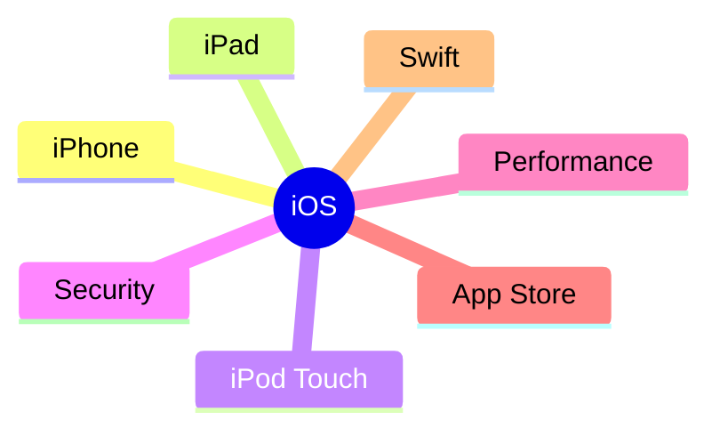

##### Advantages

- Stable operating system
- Strong security architecture
- Optimized hardware integration
- Efficient resource management

##### Summary

iOS is Apple's mobile operating system designed to provide security, performance, and seamless user experience across Apple mobile devices.

### 1.1 History of iOS

The history of iOS began with the launch of the first iPhone in 2007. Over time, Apple continuously improved the operating system by introducing new features, enhanced security mechanisms, and better performance.

##### Importance of iOS Evolution

- Improved user experience
- Better security
- Enhanced application support
- New hardware compatibility
- Increased performance

#### 1.1.1 Evolution of iOS

The evolution of iOS reflects Apple's continuous efforts to improve mobile computing.

##### Major Evolution Stages

| Version | Release Year | Major Improvement |
|----------|-------------|------------------|
| iPhone OS 1 | 2007 | Initial iPhone Release |
| iPhone OS 2 | 2008 | App Store Introduced |
| iPhone OS 3 | 2009 | Copy-Paste Support |
| iOS 4 | 2010 | Multitasking |
| iOS 5 | 2011 | Siri Introduction |
| iOS 6 | 2012 | Apple Maps |
| iOS 7 | 2013 | Major UI Redesign |
| iOS 8 | 2014 | HealthKit |
| iOS 9 | 2015 | Improved Stability |
| iOS 10 | 2016 | Enhanced Notifications |
| iOS 11 | 2017 | ARKit |
| iOS 12 | 2018 | Performance Improvements |
| iOS 13 | 2019 | Dark Mode |
| iOS 14 | 2020 | Home Screen Widgets |
| iOS 15 | 2021 | Focus Mode |
| iOS 16 | 2022 | Lock Screen Customization |
| iOS 17 | 2023 | Siri and Communication Enhancements |

##### Timeline

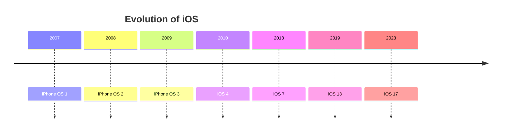

##### Key Points

- Started as iPhone OS.
- Renamed to iOS in 2010.
- Regular annual updates.
- Continuous security improvements.

##### Summary

The evolution of iOS demonstrates Apple's commitment to innovation, security, and user experience enhancement.

#### 1.1.2 iPhone OS

iPhone OS was the original name of Apple's mobile operating system.

It was introduced alongside the first iPhone on June 29, 2007.

##### Characteristics

- Designed specifically for iPhone.
- Touchscreen-oriented interface.
- Based on macOS architecture.
- Limited third-party application support initially.

##### Features of iPhone OS

- Multi-touch support
- Safari browser
- Visual voicemail
- Integrated media player

##### Architecture

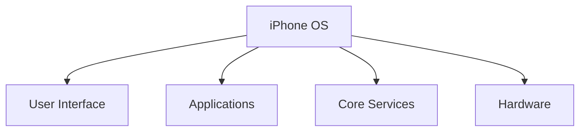

##### Limitations

- No App Store initially.
- Limited developer access.
- Restricted customization.

##### Summary

iPhone OS laid the foundation for modern iOS by introducing a revolutionary touchscreen-based mobile operating system.

#### 1.1.3 Rebranding to iOS

In June 2010, Apple officially renamed iPhone OS to iOS.

The rebranding reflected the operating system's expansion beyond the iPhone to support multiple Apple devices.

##### Reasons for Rebranding

- Support for iPad devices
- Growing Apple ecosystem
- Unified operating system identity

##### Changes After Rebranding

- Expanded device support
- New APIs and frameworks
- Enhanced multitasking
- Better application ecosystem

##### Transition

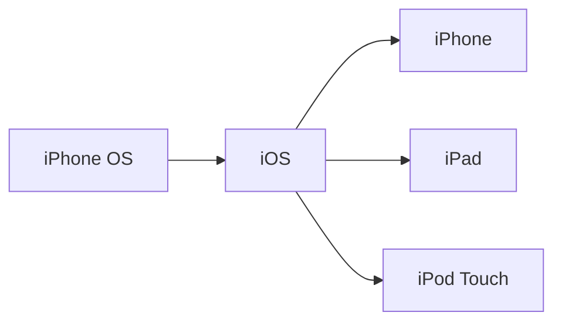

##### Benefits

- Unified branding
- Better market recognition
- Consistent development platform

##### Summary

The transition from iPhone OS to iOS marked Apple's shift toward a broader mobile ecosystem.

#### 1.1.4 iPadOS Introduction

iPadOS is a specialized version of iOS developed specifically for iPad devices.

Apple introduced iPadOS in 2019 to provide features optimized for larger screens and enhanced productivity.

##### Objectives

- Improve multitasking
- Enhance productivity
- Optimize user interface
- Support advanced workflows

##### Key Features

- Split View
- Slide Over
- Apple Pencil Support
- Improved File Management
- Desktop-Class Safari

##### Relationship with iOS

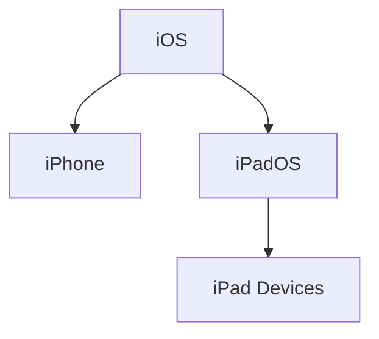

##### Advantages

- Better multitasking
- Enhanced productivity tools
- Improved user experience

##### Summary

iPadOS extends iOS capabilities by introducing tablet-specific features and optimizations.

#### 1.1.5 Key Milestones in iOS History

Several important events shaped the development of iOS.

##### Major Milestones

| Year | Milestone |
|--------|----------|
| 2007 | First iPhone Released |
| 2007 | iPod Touch Released |
| 2008 | App Store Introduced |
| 2010 | Rebranding to iOS |
| 2010 | First iPad Released |
| 2012 | iPad Mini Released |
| 2013 | iOS 7 UI Redesign |
| 2019 | iPadOS Introduced |
| 2023 | iOS 17 Released |

##### Timeline of Milestones

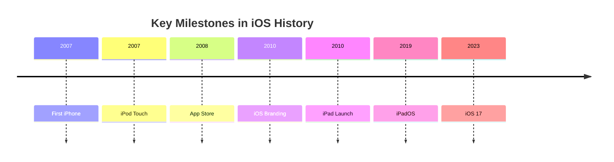

##### Importance

- Expanded device ecosystem
- Improved application support
- Enhanced security
- Better user experience

##### Summary

The milestones in iOS history highlight Apple's continuous innovation and expansion of its mobile platform.

#### 1.1.6 Features of iOS 17

iOS 17 was announced during Apple's Worldwide Developers Conference (WWDC) 2023 and introduced several usability and communication enhancements.

##### Major Features

###### Siri Improvements

- "Hey Siri" changed to simply "Siri"
- Supports back-to-back commands

###### Communication Enhancements

- Improved Phone application
- Enhanced FaceTime features
- Upgraded Messages application

###### Stickers Experience

- New sticker creation tools
- Interactive sticker usage

###### NameDrop

- Contact sharing through AirDrop
- Simplified information exchange

##### iOS 17 Feature Overview

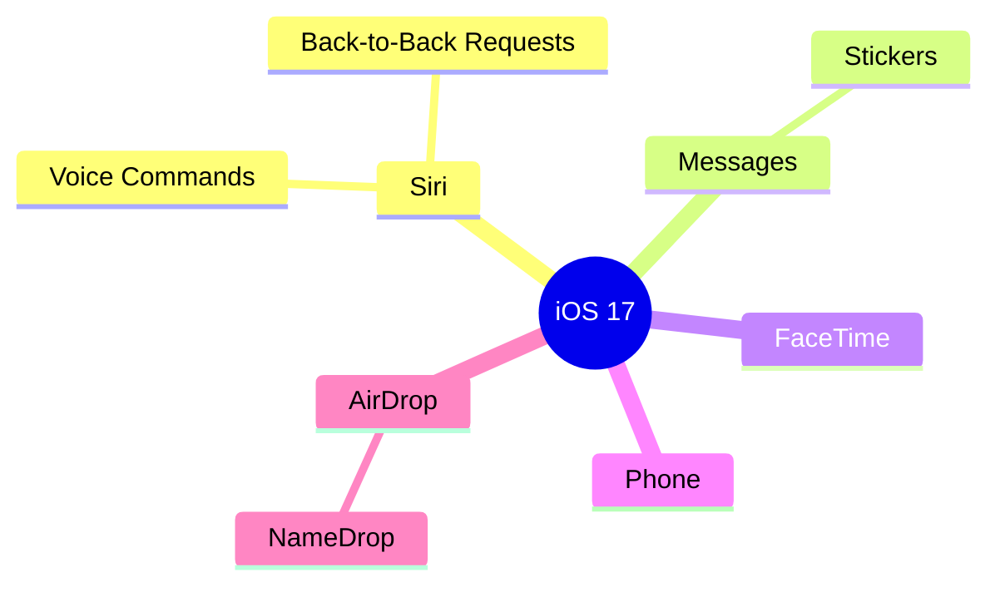

##### Benefits

- Improved productivity
- Faster interactions
- Better communication experience
- Easier contact sharing

## 2. iOS Architecture

iOS follows a layered architecture that separates system functionality into different levels. Each layer provides specific services to the layer above it while utilizing services from the layer below.

This architecture improves:

- Modularity
- Security
- Performance
- Maintainability
- Scalability

The four primary layers of iOS Architecture are:

1. Cocoa Touch Layer
2. Media Layer
3. Core Services Layer
4. Core OS Layer

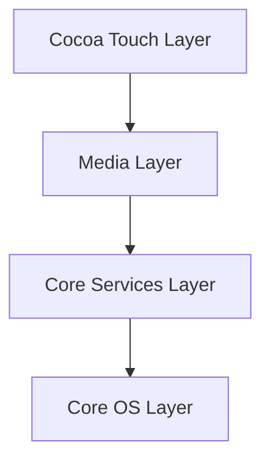

##### Benefits of Layered Architecture

- Simplified application development
- Better abstraction
- Efficient resource management
- Improved security
- Reusable frameworks

##### Summary

The layered architecture of iOS organizes system functionality into separate layers, allowing developers to build secure and efficient applications without directly interacting with hardware.

### 2.1 Overview of iOS Architecture

The iOS Architecture defines how software components interact with hardware and system services.

Each layer contains a collection of frameworks and APIs that developers use to build applications.

Applications generally interact with the upper layers, while lower layers handle system-level operations and hardware communication.

##### Architecture Components

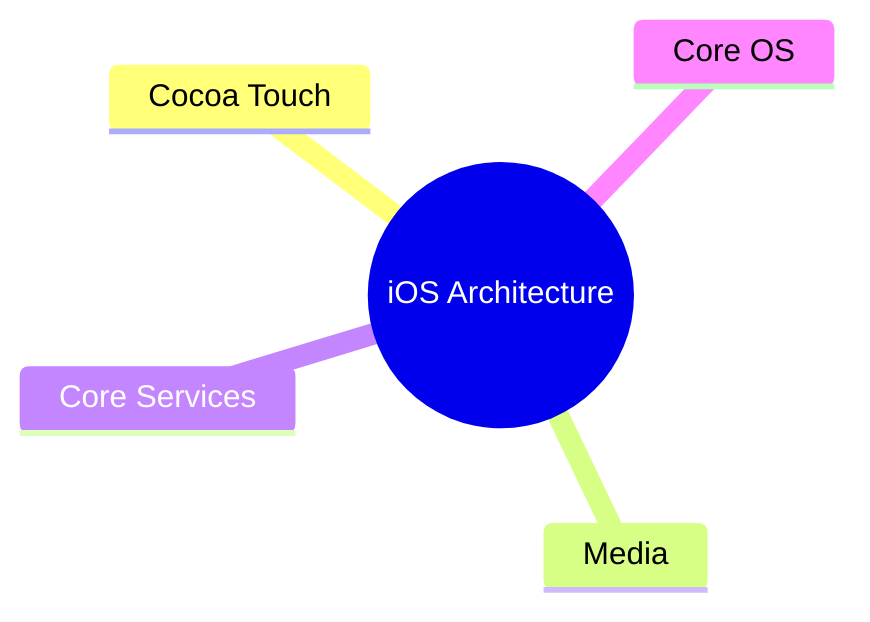

##### Objectives

- Hardware abstraction
- Framework reusability
- Security enforcement
- Performance optimization
- Simplified development

##### Advantages

- Organized system structure
- Easier maintenance
- Improved application stability
- Better hardware utilization

##### Summary

The iOS Architecture provides a structured environment that separates user interface components, multimedia services, system services, and hardware interactions into distinct layers.

#### 2.1.1 Layer-Based Architecture

The Layer-Based Architecture divides the operating system into multiple layers, where each layer performs specialized functions.

Higher layers depend on services provided by lower layers, while lower layers remain independent of application-specific logic.

##### Layers of iOS Architecture

###### Cocoa Touch Layer

Topmost layer responsible for:

- User Interface
- User Interaction
- Application Lifecycle
- Notifications

###### Media Layer

Provides:

- Graphics rendering
- Audio processing
- Video playback
- Animation support

###### Core Services Layer

Provides:

- Data management
- Networking
- Location services
- Cloud integration

###### Core OS Layer

Lowest layer responsible for:

- Memory management
- Security
- File system
- Hardware communication

##### Layer Relationship

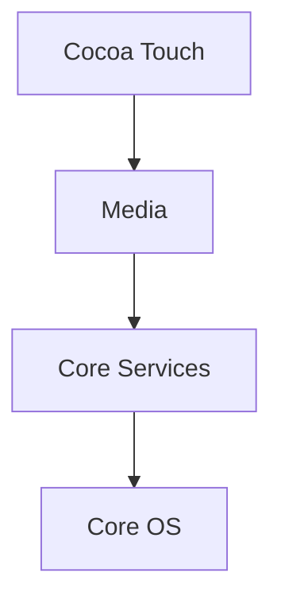

##### Characteristics

- Modular design
- Separation of concerns
- Clear responsibilities
- Reusable components

##### Advantages

- Reduced complexity
- Better maintainability
- Enhanced security
- Easier debugging

##### Example

When a user taps a button:

1. Cocoa Touch receives the interaction.
2. Media Layer renders visual changes.
3. Core Services stores required data.
4. Core OS communicates with hardware if necessary.

##### Summary

Layer-Based Architecture enables iOS to provide a stable, scalable, and secure environment by separating functionality into independent layers.

#### 2.1.2 Role of Frameworks

Frameworks are pre-built collections of libraries, APIs, classes, and tools that provide specific functionality to applications.

Instead of writing low-level code from scratch, developers use frameworks supplied by Apple.

##### Purpose of Frameworks

- Simplify development
- Promote code reuse
- Provide standardized APIs
- Improve application reliability

##### Framework Distribution by Layer

| Layer | Example Frameworks |
|---------|-------------------|
| Cocoa Touch | UIKit, MapKit, EventKit |
| Media | AVKit, Core Graphics, Core Animation |
| Core Services | Foundation, Core Data, CloudKit |
| Core OS | Security Framework, Local Authentication |

##### Framework Usage

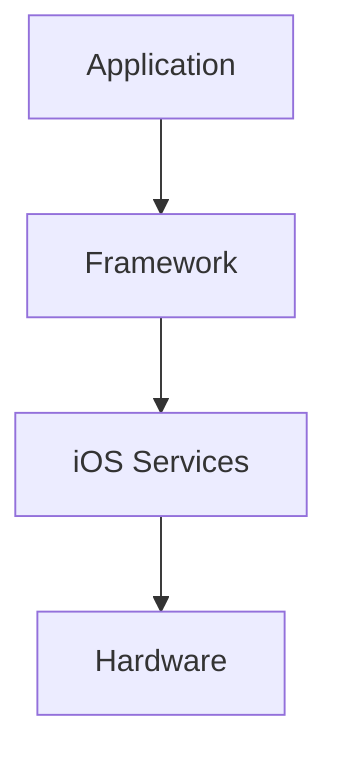

##### Example: UIKit Framework

UIKit is one of the most commonly used frameworks in iOS development.

It provides:

- Buttons
- Labels
- Navigation Controllers
- Table Views
- Application Lifecycle Management

##### Example: Creating a UILabel

```swift showLineNumbers
import UIKit

class ViewController: UIViewController {

    override func viewDidLoad() {
        super.viewDidLoad()

        let label = UILabel()
        label.text = "Hello iOS"

        view.addSubview(label)
    }
}
```

##### Explanation

- `UIKit` is imported.
- `UILabel` creates a text component.
- Text is assigned using the `text` property.
- The label is added to the current view.

##### Benefits of Frameworks

- Faster development
- Reduced code duplication
- Improved stability
- Consistent user experience

##### Summary

Frameworks provide reusable functionality that allows developers to focus on application logic rather than low-level system implementation.

#### 2.1.3 Communication Between Layers

The layers of iOS Architecture communicate in a hierarchical manner.

A higher layer requests services from the layer immediately below it, while lower layers provide those services.

Applications generally interact only with high-level frameworks and APIs.

##### Communication Flow

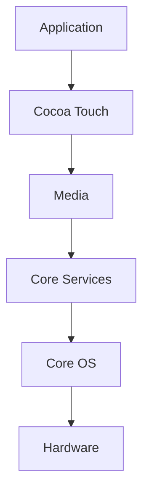

##### Working Example

Consider a music player application:

###### Step 1: User Interaction

The user presses the Play button.

Handled by:

- Cocoa Touch Layer

###### Step 2: Audio Processing

Audio playback functionality is requested.

Handled by:

- Media Layer

###### Step 3: Data Retrieval

Music file information is loaded.

Handled by:

- Core Services Layer

###### Step 4: Hardware Communication

Audio hardware is accessed.

Handled by:

- Core OS Layer

##### Communication Characteristics

- Structured communication
- Layer isolation
- Service abstraction
- Controlled access

##### Advantages

- Better security
- Improved maintainability
- Reduced dependency issues
- Easier updates

##### Architecture Communication Example

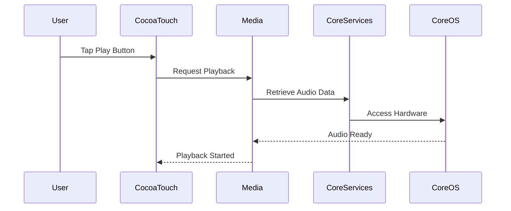

### 2.2 Core OS Layer

The Core OS Layer is the foundation of the iOS Architecture. It is the lowest layer and provides essential operating system services required by higher layers.

This layer interacts directly with the device hardware and provides low-level functionality such as:

- Memory management
- Security services
- Networking
- File system access
- Hardware communication
- Device authentication

All higher layers ultimately depend on the Core OS Layer for system-level operations.

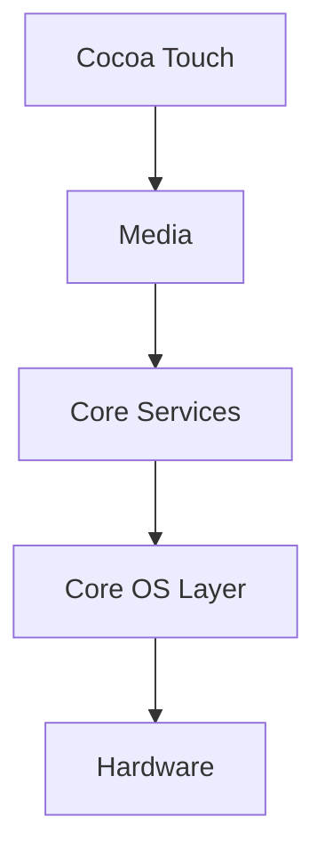

##### Responsibilities

- Hardware abstraction
- Security implementation
- Bluetooth communication
- Authentication services
- Mathematical processing
- External device communication

##### Frameworks in Core OS Layer

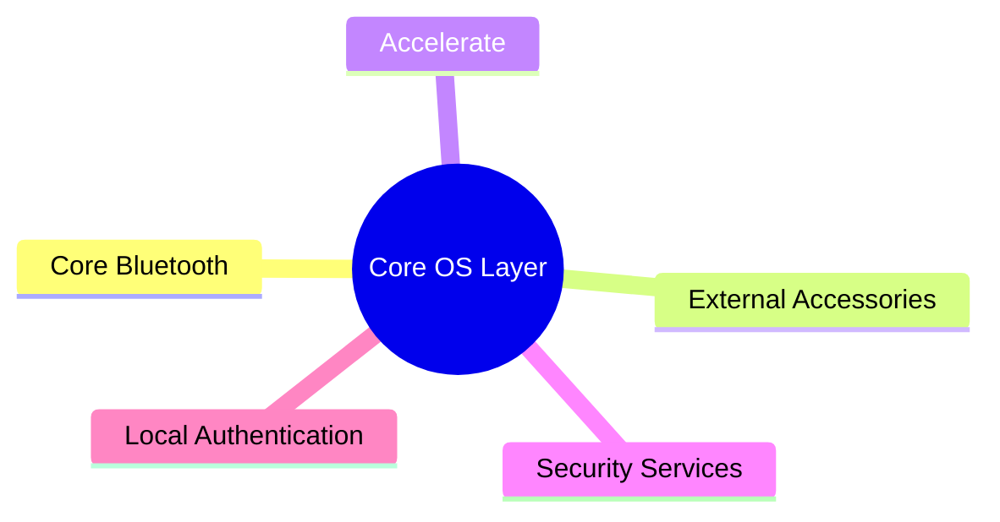

##### Summary

The Core OS Layer provides fundamental system services and hardware-level functionality that form the backbone of the iOS operating system.

#### 2.2.1 Introduction

The Core OS Layer contains low-level frameworks that provide direct access to hardware features and operating system services.

These frameworks allow applications to perform tasks such as:

- Bluetooth communication
- Device authentication
- Secure data storage
- High-performance mathematical calculations
- Interaction with external hardware devices

##### Features

- Direct hardware access
- Secure system operations
- Optimized performance
- Reliable communication services

##### Importance

Without the Core OS Layer, higher-level frameworks would not be able to access hardware resources securely and efficiently.

##### Benefits

- Better performance
- Enhanced security
- Efficient resource utilization
- Stable hardware interaction

##### Summary

The Core OS Layer serves as the bridge between iOS software components and the underlying hardware infrastructure.

#### 2.2.2 Core Bluetooth Framework

The Core Bluetooth Framework provides support for Bluetooth Low Energy (BLE) communication between iOS devices and external Bluetooth-enabled devices.

It allows applications to discover, connect, and exchange data with nearby Bluetooth peripherals.

##### Uses

- Smart watches
- Fitness trackers
- Medical devices
- IoT devices
- Wireless sensors

##### Features

- Device discovery
- Device pairing
- Data exchange
- Peripheral communication
- BLE support

##### Bluetooth Communication Process


##### Example: Scanning for BLE Devices

```swift showLineNumbers
import CoreBluetooth

class BluetoothManager: NSObject, CBCentralManagerDelegate {

    var centralManager: CBCentralManager!

    override init() {
        super.init()
        centralManager = CBCentralManager(
            delegate: self,
            queue: nil
        )
    }

    func centralManagerDidUpdateState(
        _ central: CBCentralManager
    ) {
        if central.state == .poweredOn {
            central.scanForPeripherals(
                withServices: nil,
                options: nil
            )
        }
    }
}
```

##### Explanation

- `CBCentralManager` manages Bluetooth operations.
- The application checks whether Bluetooth is enabled.
- Device scanning starts automatically.
- Nearby BLE devices can be discovered.

##### Advantages

- Low power consumption
- Wireless communication
- IoT device support
- Real-time connectivity

##### Summary

Core Bluetooth enables secure and energy-efficient communication between iOS devices and Bluetooth peripherals.

#### 2.2.3 External Accessories Framework

The External Accessories Framework allows iOS applications to communicate with external hardware accessories connected through wired or wireless connections.

##### Supported Accessories

- Barcode scanners
- Card readers
- Industrial devices
- Medical equipment
- POS systems

##### Functions

- Access external hardware
- Exchange data
- Device communication
- Hardware integration

##### Architecture

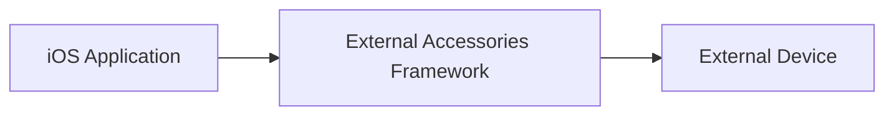

##### Example

```swift showLineNumbers
import ExternalAccessory

let accessories =
EAAccessoryManager.shared().connectedAccessories

for accessory in accessories {
    print(accessory.name)
}
```

##### Explanation

- Imports the ExternalAccessory framework.
- Retrieves connected accessories.
- Displays the names of connected devices.

##### Benefits

- Hardware integration
- Industrial application support
- Real-time communication

##### Summary

The External Accessories Framework enables seamless communication between iOS applications and external hardware devices.

#### 2.2.4 Accelerate Framework

The Accelerate Framework provides highly optimized mathematical and signal-processing functions.

It is designed to perform complex computations efficiently using hardware acceleration.

##### Uses

- Machine Learning
- Image Processing
- Scientific Computing
- Signal Processing
- Data Analysis

##### Features

- Vector operations
- Matrix calculations
- Fast Fourier Transform (FFT)
- Digital signal processing

##### Example

```swift showLineNumbers
import Accelerate

let vectorA: [Float] = [1, 2, 3]
let vectorB: [Float] = [4, 5, 6]

var result = [Float](repeating: 0, count: 3)

vDSP_vadd(
    vectorA,
    1,
    vectorB,
    1,
    &result,
    1,
    3
)

print(result)
```

##### Explanation

- Two vectors are created.
- `vDSP_vadd()` performs vector addition.
- Results are stored in the output array.
- Hardware optimization improves performance.

##### Advantages

- High-speed computations
- Reduced CPU usage
- Efficient processing

##### Summary

The Accelerate Framework provides optimized mathematical operations for computationally intensive applications.

#### 2.2.5 Security Services Framework

The Security Services Framework provides APIs for protecting sensitive data and implementing secure communication.

It supports encryption, certificates, authentication, and key management.

##### Security Features

- Encryption
- Digital certificates
- Keychain access
- Secure communication
- Authentication

##### Common Uses

- Banking applications
- Payment systems
- Secure messaging
- Enterprise applications

##### Example: Storing Data in Keychain

```swift showLineNumbers
import Security

let password = "SecurePassword"

let data = password.data(using: .utf8)!

let query: [String: Any] = [
    kSecClass as String: kSecClassGenericPassword,
    kSecValueData as String: data
]

SecItemAdd(query as CFDictionary, nil)
```

##### Explanation

- Converts the password into binary data.
- Creates a Keychain query.
- Stores the password securely in Keychain.
- Data remains protected by iOS security mechanisms.

##### Advantages

- Strong security
- Secure storage
- Encryption support
- Protection against unauthorized access

##### Summary

The Security Services Framework provides the core cryptographic and authentication capabilities used throughout iOS.

#### 2.2.6 Local Authentication Framework

The Local Authentication Framework enables biometric and device-based authentication.

It provides access to:

- Face ID
- Touch ID
- Device Passcode

##### Authentication Methods

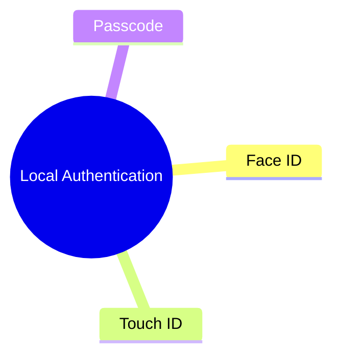

##### Example: Face ID / Touch ID Authentication

```swift showLineNumbers
import LocalAuthentication

let context = LAContext()
var error: NSError?

if context.canEvaluatePolicy(
    .deviceOwnerAuthenticationWithBiometrics,
    error: &error
) {

    context.evaluatePolicy(
        .deviceOwnerAuthenticationWithBiometrics,
        localizedReason: "Authenticate User"
    ) { success, error in

        if success {
            print("Authentication Successful")
        }
    }
}
```

##### Explanation

- Creates an authentication context.
- Checks biometric availability.
- Displays Face ID or Touch ID prompt.
- Grants access upon successful authentication.

##### Advantages

- Enhanced security
- Faster authentication
- Better user experience
- Reduced password dependency

##### Summary

The Local Authentication Framework allows applications to securely authenticate users using biometrics and device credentials.

#### 2.2.7 Advantages of Core OS Layer

The Core OS Layer provides the essential infrastructure required for secure and efficient operation of iOS devices.

##### Major Advantages

###### Direct Hardware Access

Provides controlled access to hardware resources.

###### High Security

Supports encryption, authentication, and secure storage.

###### Optimized Performance

Uses hardware acceleration for demanding operations.

###### Device Connectivity

Supports Bluetooth and external accessory communication.

###### Reliable Authentication

Provides biometric and passcode-based verification.

##### Core OS Advantages Overview

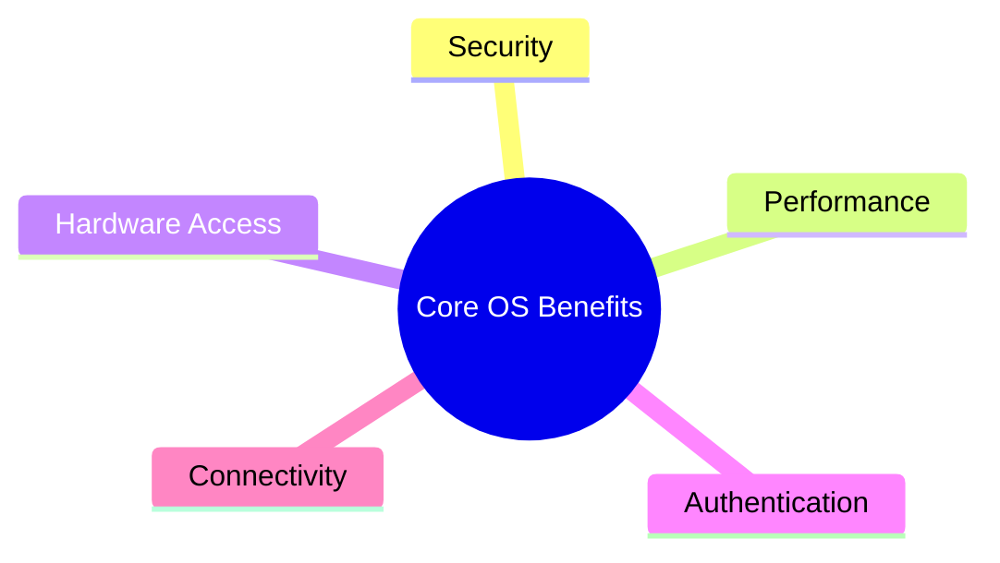

### 2.3 Core Services Layer

The Core Services Layer provides the fundamental system services required by iOS applications. It acts as a bridge between the Media Layer and the Core OS Layer.

This layer contains frameworks that support:

- Data management
- Cloud services
- Location services
- Motion sensing
- Contact management
- Health data
- Smart home integration
- Social media interaction
- In-App Purchases

##### Position in iOS Architecture


##### Major Frameworks

```mermaid
mindmap
  root((Core Services))
    Address Book
    CloudKit
    Core Data
    Core Foundation
    Core Location
    Core Motion
    Foundation
    HealthKit
    HomeKit
    Social
    StoreKit
```

##### Benefits

- Data persistence
- Cloud integration
- Device sensor access
- System service abstraction
- Enhanced application functionality

##### Summary

The Core Services Layer provides essential frameworks that handle data storage, cloud communication, location tracking, motion sensing, and other system-level services.

#### 2.3.1 Introduction

The Core Services Layer contains frameworks that simplify application development by providing reusable APIs for common tasks.

Developers use these frameworks instead of directly interacting with low-level system components.

##### Responsibilities

- Data storage
- Cloud synchronization
- Location tracking
- Sensor management
- Contact management
- Health monitoring
- Smart device communication

##### Advantages

- Faster development
- Reusable APIs
- Better performance
- Simplified implementation

##### Summary

Core Services provides the backbone for many advanced features used by modern iOS applications.

##### 2.3.1.1 Address Book Framework

The Address Book Framework provides access to the user's contacts database.

Applications can read, create, update, and manage contact information.

##### Features

- Contact retrieval
- Contact creation
- Contact modification
- Contact searching

##### Example: Accessing Contacts

```swift showLineNumbers
import Contacts

let store = CNContactStore()

store.requestAccess(for: .contacts) {
    granted, error in

    if granted {
        print("Contacts Access Granted")
    }
}
```

##### Explanation

- Imports the Contacts framework.
- Requests user permission.
- Access is granted only after user approval.

##### Applications

- Contact Managers
- Messaging Apps
- Email Clients

##### Summary

The Address Book Framework enables secure access to user contact information.

##### 2.3.1.2 CloudKit Framework

CloudKit provides cloud-based storage and synchronization using Apple's iCloud infrastructure.

Applications can store data remotely and synchronize it across multiple Apple devices.

##### Features

- Cloud storage
- Data synchronization
- User-specific records
- Secure cloud access

##### Architecture

```mermaid
flowchart LR
    A[iPhone]
    B[iCloud]
    C[iPad]
    D[Mac]

    A --> B
    C --> B
    D --> B
```

##### Example

```swift showLineNumbers
import CloudKit

let container = CKContainer.default()
let database = container.privateCloudDatabase
```

##### Explanation

- Accesses the default iCloud container.
- Retrieves the user's private database.

##### Benefits

- Automatic synchronization
- Cross-device data sharing
- Secure cloud storage

##### Summary

CloudKit simplifies cloud integration and data synchronization across Apple devices.

##### 2.3.1.3 Core Data Framework

Core Data is Apple's object graph and persistence framework used for local data storage.

It allows applications to manage structured data efficiently.

##### Features

- Data persistence
- Object relationships
- Query support
- Data caching

##### Example

```swift showLineNumbers
import CoreData

let context =
PersistenceController.shared.container.viewContext
```

##### Explanation

- Accesses the Core Data context.
- Used for creating, reading, updating, and deleting records.

##### Advantages

- Efficient storage
- Fast querying
- Object-oriented data management

##### Applications

- Notes Apps
- Inventory Systems
- Offline Applications

##### Summary

Core Data provides powerful local database functionality for iOS applications.

##### 2.3.1.4 Core Foundation Framework

Core Foundation provides low-level services and fundamental data types used throughout iOS.

It serves as the foundation for many higher-level frameworks.

##### Common Data Types

- CFString
- CFArray
- CFDictionary
- CFSet

##### Features

- Memory management
- Data structures
- Collection management
- Utility services

##### Example

```swift showLineNumbers
import Foundation

let dictionary: CFDictionary = [
    "Name": "John"
] as CFDictionary

print(dictionary)
```

##### Explanation

- Creates a Core Foundation dictionary.
- Stores key-value data.

##### Benefits

- High performance
- Low-level access
- Efficient memory usage

##### Summary

Core Foundation supplies fundamental building blocks for many iOS frameworks.

##### 2.3.1.5 Core Location Framework

Core Location provides access to geographical location services.

It supports GPS, Wi-Fi, Bluetooth, and cellular-based positioning.

##### Features

- Location tracking
- Geofencing
- Heading detection
- Region monitoring

##### Example

```swift showLineNumbers
import CoreLocation

let manager = CLLocationManager()

manager.requestWhenInUseAuthorization()
manager.startUpdatingLocation()
```

##### Explanation

- Requests location permission.
- Begins location tracking.

##### Applications

- Maps
- Ride Sharing
- Delivery Services
- Fitness Apps

##### Summary

Core Location enables location-aware applications and navigation services.

##### 2.3.1.6 Core Motion Framework

Core Motion provides access to motion and sensor data.

It uses device hardware such as:

- Accelerometer
- Gyroscope
- Magnetometer

##### Features

- Motion tracking
- Activity detection
- Orientation tracking
- Sensor fusion

##### Example

```swift showLineNumbers
import CoreMotion

let motionManager = CMMotionManager()

if motionManager.isAccelerometerAvailable {
    motionManager.startAccelerometerUpdates()
}
```

##### Explanation

- Checks sensor availability.
- Starts accelerometer monitoring.

##### Applications

- Fitness Apps
- Games
- Activity Tracking

##### Summary

Core Motion provides access to device movement and sensor information.

##### 2.3.1.7 Foundation Framework

Foundation is one of the most important frameworks in iOS.

It provides essential classes used in almost every application.

##### Common Classes

- String
- Date
- URL
- Array
- Dictionary

##### Example

```swift showLineNumbers
import Foundation

let message = "Hello iOS"

print(message)
```

##### Explanation

- Uses Foundation's String functionality.
- Displays text output.

##### Advantages

- Core utilities
- Data management
- Collection handling

##### Summary

Foundation provides the fundamental APIs required for iOS application development.

##### 2.3.1.8 HealthKit Framework

HealthKit allows applications to store and access health-related information.

It centralizes health data from various applications and devices.

##### Supported Data

- Heart Rate
- Steps
- Calories
- Sleep Data
- Workouts

##### Example

```swift showLineNumbers
import HealthKit

let healthStore = HKHealthStore()

if HKHealthStore.isHealthDataAvailable() {
    print("Health Data Available")
}
```

##### Explanation

- Creates a HealthKit store.
- Verifies HealthKit availability.

##### Benefits

- Centralized health data
- Secure health information
- Fitness integration

##### Summary

HealthKit enables health and fitness applications to access and manage wellness data securely.

##### 2.3.1.9 HomeKit Framework

HomeKit provides APIs for controlling smart home devices.

Applications can communicate with compatible smart accessories.

##### Supported Devices

- Lights
- Cameras
- Smart Locks
- Thermostats
- Sensors

##### Example

```swift showLineNumbers
import HomeKit

let homeManager = HMHomeManager()
```

##### Explanation

- Creates a HomeKit manager.
- Used to discover and manage smart home devices.

##### Advantages

- Smart home automation
- Secure device control
- Unified management

##### Summary

HomeKit enables smart home integration within iOS applications.

##### 2.3.1.10 Social Framework

The Social Framework provides integration with social networking services.

Applications can share content directly to supported social platforms.

##### Features

- Social sharing
- Account integration
- Content posting

##### Example

```swift showLineNumbers
import Social

if SLComposeViewController
    .isAvailable(forServiceType:
        SLServiceTypeTwitter) {

    print("Twitter Available")
}
```

##### Explanation

- Checks social service availability.
- Allows content sharing.

##### Applications

- News Apps
- Media Apps
- Content Sharing Platforms

##### Summary

The Social Framework simplifies social media integration in iOS applications.

##### 2.3.1.11 StoreKit Framework

StoreKit enables In-App Purchases (IAP) and App Store interactions.

Applications can sell digital products and subscriptions using StoreKit.

##### Supported Purchases

- Consumables
- Non-Consumables
- Auto-Renewable Subscriptions
- Non-Renewing Subscriptions

##### Example

```swift showLineNumbers
import StoreKit

if SKPaymentQueue.canMakePayments() {
    print("Purchases Allowed")
}
```

##### Explanation

- Checks whether purchases are permitted.
- Required before processing payments.

##### Benefits

- Secure transactions
- Subscription support
- Revenue generation

##### Architecture

```mermaid
flowchart LR
    A[Application]
    B[StoreKit]
    C[App Store]

    A --> B
    B --> C
```

##### Summary

StoreKit provides a secure mechanism for implementing purchases and subscriptions within iOS applications.

### 2.4 Media Layer

The Media Layer provides technologies and frameworks for handling graphics, audio, video, animations, and multimedia content in iOS applications.

This layer sits between the Cocoa Touch Layer and the Core Services Layer and enables developers to create rich multimedia experiences.

##### Responsibilities

- Graphics rendering
- Audio processing
- Video playback
- Image manipulation
- Animation support
- 2D and 3D graphics

##### Frameworks in Media Layer

```mermaid
mindmap
  root((Media Layer))
    UIKit Graphics
    Core Graphics
    Core Animation
    Media Player
    AVKit
    OpenAL
    Core Image
    GLKit
```

##### Benefits

- Rich user interfaces
- Multimedia support
- Hardware acceleration
- High-performance graphics rendering

##### Summary

The Media Layer provides the graphical and multimedia capabilities that enable modern iOS applications to deliver engaging user experiences.

#### 2.4.1 Introduction

The Media Layer contains frameworks responsible for rendering graphics, processing audio and video, creating animations, and managing multimedia content.

Applications such as:

- Video Players
- Games
- Photo Editors
- Streaming Services
- AR Applications

rely heavily on the Media Layer.

##### Features

- Graphics rendering
- Video playback
- Audio management
- Animation effects
- Image processing

##### Position in Architecture

```mermaid
flowchart TD
    A[Cocoa Touch]
    B[Media Layer]
    C[Core Services]
    D[Core OS]

    A --> B
    B --> C
    C --> D
```

##### Summary

The Media Layer provides advanced multimedia and graphical capabilities used by modern iOS applications.

##### 2.4.1.1 UIKit Graphics

UIKit Graphics provides basic drawing and graphics functionality used for rendering user interface components.

It enables applications to display:

- Text
- Images
- Shapes
- Custom Views

##### Features

- UI Rendering
- Image Drawing
- Text Drawing
- Custom Graphics

##### Example

```swift showLineNumbers
import UIKit

class CustomView: UIView {

    override func draw(_ rect: CGRect) {

        UIColor.blue.setFill()

        UIBezierPath(
            rect: rect
        ).fill()
    }
}
```

##### Explanation

- Creates a custom view.
- Sets blue fill color.
- Draws a filled rectangle.

##### Applications

- Custom Buttons
- Dashboards
- UI Components

##### Summary

UIKit Graphics provides the basic graphical capabilities required for rendering user interfaces.

##### 2.4.1.2 Core Graphics Framework

Core Graphics is a powerful 2D graphics rendering engine used for drawing shapes, images, and text.

It is also known as Quartz 2D.

##### Features

- Vector graphics
- Image rendering
- PDF generation
- Shape drawing

##### Example

```swift showLineNumbers
import UIKit

class DrawingView: UIView {

    override func draw(_ rect: CGRect) {

        guard let context =
            UIGraphicsGetCurrentContext()
        else { return }

        context.setStrokeColor(
            UIColor.red.cgColor
        )

        context.setLineWidth(4)

        context.move(to: CGPoint(x: 20, y: 20))
        context.addLine(to: CGPoint(x: 200, y: 200))

        context.strokePath()
    }
}
```

##### Explanation

- Obtains drawing context.
- Creates a red line.
- Renders the line on screen.

##### Benefits

- High-quality rendering
- Precise graphics control
- PDF support

##### Summary

Core Graphics enables advanced 2D drawing and rendering operations.

##### 2.4.1.3 Core Animation

Core Animation provides animation services for creating smooth and efficient visual effects.

Animations are hardware accelerated, resulting in high performance.

##### Features

- View animations
- Layer animations
- Transitions
- Visual effects

##### Example

```swift showLineNumbers
import UIKit

UIView.animate(
    withDuration: 2.0
) {

    self.view.alpha = 0.0
}
```

##### Explanation

- Starts an animation.
- Duration is 2 seconds.
- Gradually fades the view.

##### Advantages

- Smooth animations
- Hardware acceleration
- Better user experience

##### Summary

Core Animation allows developers to create fluid and visually appealing animations.

##### 2.4.1.4 Media Player Framework

The Media Player Framework provides support for playing audio and video content.

It also allows access to the user's media library.

##### Features

- Audio playback
- Video playback
- Playlist management
- Media library access

##### Example

```swift showLineNumbers
import MediaPlayer

let player =
MPMusicPlayerController.systemMusicPlayer

player.play()
```

##### Explanation

- Creates a music player instance.
- Starts media playback.

##### Applications

- Music Apps
- Podcast Apps
- Streaming Platforms

##### Summary

The Media Player Framework provides multimedia playback capabilities.

##### 2.4.1.5 AVKit

AVKit provides user-friendly interfaces for audio and video playback.

It works together with AVFoundation.

##### Features

- Video playback
- Audio playback
- Media controls
- Recording support

##### Example

```swift showLineNumbers
import AVKit

let videoURL =
URL(string:
"https://example.com/video.mp4")!

let player =
AVPlayer(url: videoURL)

let controller =
AVPlayerViewController()

controller.player = player
```

##### Explanation

- Creates a video player.
- Loads media from a URL.
- Displays playback controls.

##### Benefits

- Built-in player UI
- Easy implementation
- Multimedia support

##### Summary

AVKit simplifies audio and video playback implementation.

##### 2.4.1.6 OpenAL

OpenAL (Open Audio Library) is a cross-platform framework used for advanced audio processing and 3D sound effects.

It is commonly used in gaming applications.

##### Features

- 3D audio
- Positional sound
- Sound effects
- Real-time audio processing

##### Applications

- Mobile Games
- VR Applications
- AR Applications

##### Audio Architecture

```mermaid
flowchart LR
    A[Game]
    B[OpenAL]
    C[Audio Hardware]

    A --> B
    B --> C
```

##### Advantages

- Immersive audio
- Real-time sound processing
- Efficient performance

##### Summary

OpenAL provides advanced audio capabilities for immersive multimedia applications.

##### 2.4.1.7 Core Image

Core Image provides powerful image processing and filtering capabilities.

It supports real-time image manipulation using hardware acceleration.

##### Features

- Image filters
- Color correction
- Image enhancement
- Face detection

##### Example

```swift showLineNumbers
import CoreImage

let image =
CIImage(image: UIImage(named: "photo.jpg")!)

let filter =
CIFilter(name: "CISepiaTone")

filter?.setValue(
    image,
    forKey: kCIInputImageKey
)
```

##### Explanation

- Loads an image.
- Applies a sepia filter.
- Produces a filtered image.

##### Applications

- Photo Editors
- Camera Apps
- AR Applications

##### Summary

Core Image enables advanced image manipulation and processing.

##### 2.4.1.8 GLKit

GLKit provides simplified access to OpenGL ES for creating 2D and 3D graphics applications.

It helps developers build hardware-accelerated graphics with less code.

##### Features

- 2D rendering
- 3D rendering
- Hardware acceleration
- Graphics utilities

##### Example

```swift showLineNumbers
import GLKit

class GameViewController:
GLKViewController {

    override func viewDidLoad() {
        super.viewDidLoad()
    }
}
```

##### Explanation

- Imports GLKit.
- Creates a graphics-enabled controller.
- Provides a foundation for OpenGL rendering.

##### Applications

- Mobile Games
- Simulation Apps
- Scientific Visualization

##### Graphics Pipeline

```mermaid
flowchart LR
    A[Application]
    B[GLKit]
    C[OpenGL ES]
    D[GPU]

    A --> B
    B --> C
    C --> D
```

##### Advantages

- Hardware-accelerated graphics
- Better performance
- Simplified OpenGL usage

##### Summary

GLKit simplifies the development of high-performance 2D and 3D graphics applications.

### 2.5 Cocoa Touch Layer

The Cocoa Touch Layer is the topmost layer of the iOS Architecture. It provides the frameworks responsible for user interaction, application lifecycle management, notifications, and high-level application behavior.

This layer contains the APIs that developers interact with most frequently while developing iOS applications.

##### Responsibilities

- User Interface Management
- Event Handling
- Touch Processing
- Notifications
- Application Lifecycle Management
- Device Integration

##### Position in Architecture

```mermaid
flowchart TD
    A[Cocoa Touch Layer]
    B[Media Layer]
    C[Core Services Layer]
    D[Core OS Layer]

    A --> B
    B --> C
    C --> D
```

##### Major Frameworks

```mermaid
mindmap
  root((Cocoa Touch))
    EventKit
    GameKit
    MapKit
    PushKit
    UIKit
```

##### Benefits

- Simplified application development
- Rich user interfaces
- Event-driven programming
- Better user experience

##### Summary

The Cocoa Touch Layer serves as the primary interface between users and iOS applications by providing frameworks for UI, events, notifications, gaming, and location-based services.

#### 2.5.1 Introduction

The Cocoa Touch Layer provides high-level frameworks used to build modern iOS applications.

It manages:

- User interactions
- Application states
- Touch events
- Notifications
- User interface components

Most application development occurs within this layer.

##### Features

- Touch-based interaction
- Event handling
- Push notifications
- User interface management
- Application lifecycle support

##### Importance

Without Cocoa Touch, developers would need to manually implement user interface handling and interaction management.

##### Summary

The Cocoa Touch Layer provides the user-facing functionality required to create responsive and interactive iOS applications.

#### 2.5.2 EventKit Framework

EventKit provides access to calendar and reminder data stored on an iOS device.

Applications can create, read, update, and manage events and reminders.

##### Features

- Calendar access
- Event management
- Reminder management
- Scheduling support

##### Applications

- Calendar Apps
- Productivity Tools
- Task Managers
- Meeting Schedulers

##### Example

```swift showLineNumbers
import EventKit

let eventStore = EKEventStore()

eventStore.requestAccess(
    to: .event
) { granted, error in

    if granted {
        print("Calendar Access Granted")
    }
}
```

##### Explanation

- Imports EventKit.
- Requests calendar access permission.
- User approval is required before accessing events.

##### Benefits

- Calendar integration
- Event automation
- Reminder management

##### Summary

EventKit enables applications to manage calendar events and reminders securely.

#### 2.5.3 GameKit Framework

GameKit provides services commonly used in multiplayer and social gaming applications.

It simplifies game development by offering built-in gaming functionality.

##### Features

- Multiplayer support
- Leaderboards
- Achievements
- Player authentication
- Matchmaking

##### Game Services

```mermaid
mindmap
  root((GameKit))
    Achievements
    Leaderboards
    Matchmaking
    Multiplayer
    Authentication
```

##### Example

```swift showLineNumbers
import GameKit

GKLocalPlayer.local.authenticateHandler =
{ viewController, error in

    if GKLocalPlayer.local.isAuthenticated {
        print("Player Authenticated")
    }
}
```

##### Explanation

- Authenticates the local player.
- Enables Game Center services.
- Provides access to multiplayer features.

##### Applications

- Mobile Games
- Multiplayer Games
- Competitive Gaming Platforms

##### Summary

GameKit provides essential gaming services that simplify multiplayer and social game development.

#### 2.5.4 MapKit Framework

MapKit enables applications to display maps and location-based information.

It integrates with Apple's mapping services and location technologies.

##### Features

- Interactive maps
- Annotations
- Directions
- Route planning
- Geographical data

##### Example

```swift showLineNumbers
import MapKit

let mapView = MKMapView()

let coordinate = CLLocationCoordinate2D(
    latitude: 23.0225,
    longitude: 72.5714
)

mapView.setCenter(
    coordinate,
    animated: true
)
```

##### Explanation

- Creates a map view.
- Defines geographic coordinates.
- Centers the map on the specified location.

##### Applications

- Navigation Apps
- Delivery Services
- Ride Sharing Apps
- Travel Applications

##### Benefits

- Easy map integration
- Route visualization
- Location services support

##### Summary

MapKit provides powerful mapping and navigation capabilities for location-based applications.

#### 2.5.5 PushKit Framework

PushKit provides support for specialized push notifications and real-time communication services.

It is commonly used in communication and VoIP applications.

##### Features

- VoIP notifications
- Background updates
- Real-time communication
- Efficient notification delivery

##### Architecture

```mermaid
flowchart LR
    A[Server]
    B[Apple Push Service]
    C[PushKit]
    D[iOS Application]

    A --> B
    B --> C
    C --> D
```

##### Example

```swift showLineNumbers
import PushKit

let registry =
PKPushRegistry(queue: nil)

registry.desiredPushTypes =
[.voIP]
```

##### Explanation

- Creates a PushKit registry.
- Registers for VoIP notifications.
- Enables real-time communication updates.

##### Applications

- VoIP Apps
- Messaging Apps
- Communication Platforms

##### Summary

PushKit enables efficient delivery of specialized push notifications and communication events.

#### 2.5.6 UIKit Framework

UIKit is the most important framework within the Cocoa Touch Layer.

It provides the components required to build graphical user interfaces for iOS applications.

##### UI Components

- UILabel
- UIButton
- UITextField
- UITableView
- UIImageView
- UINavigationController

##### Features

- User interface creation
- Event handling
- Navigation management
- Touch interaction
- Animation support

##### Example: Creating a Button

```swift showLineNumbers
import UIKit

let button = UIButton(type: .system)

button.setTitle(
    "Click Me",
    for: .normal
)
```

##### Explanation

- Creates a system button.
- Assigns button text.
- Can be added to any view hierarchy.

##### Example: Button Click Event

```swift showLineNumbers
import UIKit

@IBAction func buttonTapped(
    _ sender: UIButton
) {

    print("Button Clicked")
}
```

##### Explanation

- Triggered when the user taps the button.
- Executes application logic.

##### UIKit Architecture

```mermaid
flowchart TD
    A[UIKit]
    B[Views]
    C[Controllers]
    D[Navigation]
    E[Events]

    A --> B
    A --> C
    A --> D
    A --> E
```

##### Advantages

- Rich UI components
- Consistent design patterns
- Efficient event handling
- Rapid development

##### Summary

UIKit is the foundation of iOS user interface development and provides the essential tools for creating interactive applications.

#### 2.5.7 Features of Cocoa Touch Layer

The Cocoa Touch Layer offers several features that improve application usability and user experience.

##### Major Features

###### Touch-Based Interface

Supports:

- Tap
- Swipe
- Pinch
- Drag
- Multi-touch gestures

###### Event Handling

Manages:

- User input
- Touch events
- Notifications

###### Application Lifecycle Management

Controls:

- Launching
- Background execution
- Termination

###### Push Notification Support

Enables:

- Alerts
- Updates
- Real-time communication

###### Framework Integration

Provides access to:

- EventKit
- GameKit
- MapKit
- PushKit
- UIKit

##### Feature Overview

```mermaid
mindmap
  root((Cocoa Touch Features))
    Touch Events
    UI Components
    Notifications
    Lifecycle Management
    Event Handling
    Framework Support
```

##### Advantages

- Improved user interaction
- Consistent application behavior
- Simplified development
- Rich user interfaces

## 3. iOS Security Model

Security is one of the most important design principles of iOS. Apple implements multiple layers of protection to secure devices, applications, user data, and system resources.

The iOS Security Model follows a defense-in-depth approach where hardware, software, and services work together to protect the device from unauthorized access, malware, and data breaches.

##### Security Objectives

- Protect user privacy
- Ensure data confidentiality
- Maintain system integrity
- Prevent unauthorized access
- Secure application execution

##### Security Layers

```mermaid
mindmap
  root((iOS Security))
    System Security
    Data Security
    App Security
```

##### Security Components

- Secure Boot Chain
- Secure Enclave Processor (SEP)
- Code Signing
- App Sandbox
- File Encryption
- Keychain
- Biometric Authentication

##### Benefits

- Strong protection against malware
- Secure application ecosystem
- Data confidentiality
- Hardware-assisted security

##### Summary

The iOS Security Model combines hardware and software security mechanisms to create a secure ecosystem that protects devices, applications, and user data.

### 3.1 Understanding iOS Security

iOS security is built around three major pillars:

1. System Security
2. Data Security
3. App Security

Each component protects a specific aspect of the operating system and works together to provide comprehensive security.

##### Security Architecture

```mermaid
flowchart TD
    A[iOS Security]
    B[System Security]
    C[Data Security]
    D[App Security]

    A --> B
    A --> C
    A --> D
```

##### Core Principles

###### Hardware Root of Trust

Security begins at the hardware level using Apple's secure hardware components.

###### Defense in Depth

Multiple layers of security protect against attacks.

###### Least Privilege

Applications receive only the permissions necessary for their functionality.

###### Secure by Default

Security features are enabled automatically without user intervention.

##### Importance

- Protects sensitive information.
- Prevents unauthorized system modifications.
- Reduces malware risks.
- Ensures application integrity.

##### Summary

iOS security relies on multiple independent security mechanisms that collectively protect the entire operating system.

#### 3.1.1 System Security

System Security protects the operating system itself from unauthorized modifications and malicious activities.

It ensures that only trusted software can run on an iOS device.

##### Objectives

- Protect operating system integrity
- Prevent unauthorized software execution
- Verify system authenticity
- Secure boot process

##### Major Components

```mermaid
mindmap
  root((System Security))
    Secure Boot Chain
    Boot ROM
    iBoot
    Secure Enclave
    Code Signing
```

##### Security Mechanisms

###### Secure Boot Chain

Each stage of the boot process verifies the integrity of the next stage before execution.

###### Code Signing

All executable code must be digitally signed by Apple or authorized developers.

###### Secure Enclave Processor (SEP)

A dedicated security processor responsible for protecting sensitive information.

###### Runtime Protection

Prevents unauthorized code execution during operation.

##### Example: Code Signature Verification

```swift showLineNumbers
import Security

func verifyCodeSignature() {
    print("Code signature verified before execution.")
}
```

##### Explanation

- Represents the concept of signature verification.
- In actual iOS systems, verification occurs automatically before execution.
- Unsigned applications cannot run on iOS devices.

##### Benefits

- Prevents malware execution.
- Protects system integrity.
- Ensures trusted software execution.

##### Summary

System Security ensures that only trusted and verified software can execute on an iOS device.

#### 3.1.2 Data Security

Data Security protects user information stored on the device and during transmission.

Apple uses encryption and secure key management to ensure confidentiality.

##### Objectives

- Protect stored data
- Secure transmitted data
- Prevent unauthorized access
- Protect sensitive information

##### Data Protection Components

```mermaid
mindmap
  root((Data Security))
    Encryption
    Keychain
    Secure Enclave
    File Protection
    Hardware Keys
```

##### Security Mechanisms

###### File Encryption

Files are encrypted using strong cryptographic algorithms.

###### Keychain Services

Sensitive information such as passwords and certificates are stored securely.

###### Hardware-Based Keys

Encryption keys are protected by device hardware.

###### Data Protection Classes

Different levels of protection are applied based on device lock state.

##### Example: Saving Password in Keychain

```swift showLineNumbers
import Security

let password = "MyPassword"

let passwordData =
password.data(using: .utf8)!

let query: [String: Any] = [
    kSecClass as String:
        kSecClassGenericPassword,

    kSecValueData as String:
        passwordData
]

SecItemAdd(query as CFDictionary, nil)
```

##### Explanation

- Converts password to binary format.
- Creates a Keychain query.
- Stores the password securely.
- Data remains protected by iOS security services.

##### Advantages

- Strong encryption
- Secure credential storage
- Protection against physical attacks

##### Summary

Data Security protects sensitive information through encryption, hardware security, and secure storage mechanisms.

#### 3.1.3 App Security

App Security protects users from malicious applications and prevents applications from accessing unauthorized resources.

iOS implements strict controls on application installation, execution, and communication.

##### Objectives

- Secure application execution
- Prevent malware
- Isolate applications
- Protect user privacy

##### Major Components

```mermaid
mindmap
  root((App Security))
    Code Signing
    App Sandbox
    App Store Review
    Permissions
    Runtime Protection
```

##### Security Mechanisms

###### Code Signing

Every application must be digitally signed before installation.

###### App Sandbox

Each application runs inside an isolated environment.

###### Permission Model

Applications must request access to sensitive resources.

###### App Store Review

Applications undergo security and policy verification before publication.

##### App Sandbox Architecture

```mermaid
flowchart LR
    A[App A]
    B[Sandbox A]

    C[App B]
    D[Sandbox B]

    A --> B
    C --> D
```

##### Example: Requesting Camera Permission

```swift showLineNumbers
import AVFoundation

AVCaptureDevice.requestAccess(
    for: .video
) { granted in

    if granted {
        print("Camera Permission Granted")
    }
}
```

##### Explanation

- Requests camera access.
- User approval is required.
- Access is denied if permission is not granted.

##### Benefits

- Application isolation
- Reduced malware impact
- Better privacy protection
- Secure execution environment

##### Comparison of Security Components

| Security Type | Primary Goal | Key Technologies |
|---------------|-------------|------------------|
| System Security | Protect OS Integrity | Secure Boot, Code Signing |
| Data Security | Protect User Data | Encryption, Keychain |
| App Security | Protect Applications | Sandbox, Permissions |

## 4. System Security

System Security is the first pillar of the iOS Security Model. It ensures that only trusted software executes on an iOS device and protects the operating system from unauthorized modifications.

Apple implements a chain of trust beginning from immutable hardware and extending through every stage of the boot process.

##### Objectives

- Protect operating system integrity
- Prevent unauthorized code execution
- Verify software authenticity
- Defend against malware and rootkits
- Establish trust from hardware to applications

##### Major Components

```mermaid
mindmap
  root((System Security))
    Hardware Root of Trust
    Boot ROM
    LLB
    iBoot
    Kernel Verification
    Secure Boot Chain
```

##### Security Features

- Secure Boot Chain
- Code Signing
- Secure Enclave Processor
- Runtime Protection
- System Integrity Verification

##### Summary

System Security ensures that every component loaded during startup is trusted, authenticated, and verified before execution.

### 4.1 iOS Secure Boot Chain

The Secure Boot Chain is a sequence of verification steps that occur during device startup.

Each component verifies the integrity and authenticity of the next component before allowing it to execute.

This creates a chain of trust that begins at the hardware level and extends to the operating system.

##### Purpose

- Prevent execution of malicious code
- Ensure software authenticity
- Protect against firmware tampering
- Maintain operating system integrity

##### Secure Boot Chain Overview

```mermaid
flowchart TD
    A[Hardware Root of Trust]
    B[Boot ROM]
    C[LLB]
    D[iBoot]
    E[iOS Kernel]
    F[iOS Operating System]

    A --> B
    B --> C
    C --> D
    D --> E
    E --> F
```

##### Benefits

- Strong system integrity
- Malware resistance
- Secure startup process
- Trusted execution environment

##### Summary

The Secure Boot Chain establishes trust by verifying every software component before it executes.

#### 4.1.1 Hardware Root of Trust

The Hardware Root of Trust is the foundation of iOS security.

It is implemented directly in Apple's hardware and serves as the starting point for all trust decisions.

Because it is embedded in hardware, it cannot be modified after manufacturing.

##### Characteristics

- Immutable
- Hardware-based
- Tamper-resistant
- Foundation of trust

##### Responsibilities

- Store trusted cryptographic keys
- Verify Boot ROM authenticity
- Establish initial trust

##### Security Advantages

- Resistant to software attacks
- Cannot be modified by malware
- Provides permanent trust anchor

##### Trust Relationship

```mermaid
flowchart LR
    A[Hardware Root of Trust]
    B[Boot ROM Verification]

    A --> B
```

##### Summary

The Hardware Root of Trust serves as the permanent security foundation for the entire iOS boot process.

#### 4.1.2 Boot ROM

Boot ROM is the first software component executed when an iOS device powers on.

It is permanently embedded in the device hardware and cannot be modified.

##### Responsibilities

- Initialize hardware
- Verify LLB authenticity
- Start secure boot process

##### Characteristics

- Read-only memory
- Immutable code
- Apple-signed
- Hardware protected

##### Boot ROM Process

```mermaid
flowchart TD
    A[Power On]
    B[Boot ROM]
    C[Verify LLB]

    A --> B
    B --> C
```

##### Security Features

- Digital signature verification
- Secure startup initialization
- Hardware-based protection

##### Summary

Boot ROM acts as the first trusted software component and initiates the Secure Boot Chain.

#### 4.1.3 Low-Level Bootloader (LLB)

The Low-Level Bootloader (LLB) is the second stage of the iOS boot process.

After successful verification by Boot ROM, LLB executes and performs additional initialization tasks.

##### Responsibilities

- Verify iBoot
- Configure hardware
- Continue secure startup process

##### Verification Flow

```mermaid
flowchart LR
    A[Boot ROM]
    B[Verify LLB]
    C[LLB]
    D[Verify iBoot]

    A --> B
    B --> C
    C --> D
```

##### Security Features

- Signature verification
- Secure hardware initialization
- Controlled startup sequence

##### Benefits

- Prevents unauthorized bootloaders
- Maintains chain of trust
- Ensures software authenticity

##### Summary

LLB serves as an intermediate trusted component responsible for verifying iBoot before execution.

#### 4.1.4 iBoot

iBoot is the primary bootloader of iOS.

It performs extensive verification of the operating system kernel before allowing it to execute.

##### Responsibilities

- Verify kernel integrity
- Verify digital signatures
- Manage recovery mode
- Load operating system

##### Features

- Secure verification
- Recovery support
- System integrity checks
- Kernel loading

##### Verification Process

```mermaid
flowchart TD
    A[iBoot]
    B[Verify Kernel]
    C[Load Kernel]

    A --> B
    B --> C
```

##### Recovery Mode Support

If verification fails:

- Recovery mode may be activated.
- Device restoration may be required.
- Untrusted software is blocked.

##### Benefits

- Prevents kernel tampering
- Protects operating system integrity
- Enables secure recovery

##### Summary

iBoot verifies and loads the iOS kernel while maintaining the integrity of the Secure Boot Chain.

#### 4.1.5 iOS Kernel Verification

The iOS Kernel is the core component of the operating system.

Before execution, iBoot verifies the kernel's authenticity and integrity using cryptographic signatures.

##### Purpose

- Ensure trusted kernel execution
- Prevent malicious modifications
- Protect system integrity

##### Verification Steps

1. Kernel image is loaded.
2. Digital signature is checked.
3. Integrity verification is performed.
4. Kernel executes only if validation succeeds.

##### Verification Workflow

```mermaid
flowchart TD
    A[Kernel Image]
    B[Signature Verification]
    C{Valid?}

    C -->|Yes| D[Kernel Executes]
    C -->|No| E[Boot Failure]

    A --> B
    B --> C
```

##### Example Concept

```swift showLineNumbers
import Security

func verifyKernel() {

    let kernelVerified = true

    if kernelVerified {
        print("Kernel Verified")
    }
}
```

##### Explanation

- Demonstrates the concept of kernel verification.
- Actual verification occurs automatically within iBoot.
- Invalid kernels are never executed.

##### Benefits

- Trusted operating system startup
- Malware prevention
- System integrity protection

##### Summary

Kernel verification ensures that only authentic and unmodified operating system kernels are executed.

#### 4.1.6 Secure Boot Process

The Secure Boot Process combines all verification stages into a continuous chain of trust.

Every component verifies the next component before execution.

##### Complete Boot Sequence

```mermaid
flowchart TD
    A[Hardware Root of Trust]
    B[Boot ROM]
    C[LLB]
    D[iBoot]
    E[iOS Kernel]
    F[iOS Operating System]

    A --> B
    B --> C
    C --> D
    D --> E
    E --> F
```

##### Boot Process Steps

1. Device powers on.
2. Hardware Root of Trust initializes.
3. Boot ROM executes.
4. Boot ROM verifies LLB.
5. LLB verifies iBoot.
6. iBoot verifies the kernel.
7. Kernel starts the operating system.

##### Chain of Trust

```mermaid
sequenceDiagram
    participant H as Hardware Root
    participant B as Boot ROM
    participant L as LLB
    participant I as iBoot
    participant K as Kernel

    H->>B: Trust Established
    B->>L: Verify Signature
    L->>I: Verify Signature
    I->>K: Verify Signature
    K-->>I: Valid
```

##### Failure Handling

If verification fails at any stage:

- Boot process stops.
- Untrusted software is blocked.
- Recovery mode may be activated.

##### Advantages

- Prevents boot-level malware
- Ensures trusted startup
- Protects system integrity
- Blocks unauthorized operating systems

### 4.2 System Software Authorization

System Software Authorization ensures that only trusted and Apple-authorized software can be installed and executed on iOS devices.

Every system component, firmware update, and operating system version must be digitally verified before installation.

This mechanism prevents unauthorized operating systems, modified firmware, and malicious software from running on Apple devices.

##### Objectives

- Verify software authenticity
- Prevent unauthorized modifications
- Ensure trusted updates
- Protect system integrity

##### Authorization Components

```mermaid
mindmap
  root((System Software Authorization))
    Software Updates
    Digital Signatures
    Verification
    Downgrade Protection
```

##### Benefits

- Trusted software ecosystem
- Protection against malware
- Secure update process
- Strong system integrity

##### Summary

System Software Authorization ensures that every software component installed on an iOS device is verified and trusted.

#### 4.2.1 Software Updates

Software Updates are mechanisms through which Apple distributes new features, bug fixes, and security patches.

Before installation, every update package undergoes cryptographic verification.

##### Objectives

- Deliver security patches
- Improve performance
- Fix software bugs
- Add new features

##### Update Verification Process

```mermaid
flowchart TD
    A[Update Package]
    B[Digital Signature Verification]
    C{Valid Signature?}

    C -->|Yes| D[Install Update]
    C -->|No| E[Reject Update]

    A --> B
    B --> C
```

##### Update Workflow

1. Device checks for updates.
2. Update package is downloaded.
3. Digital signature is verified.
4. Installation begins if validation succeeds.
5. System restarts and applies updates.

##### Security Features

###### Signature Verification

Ensures updates originate from Apple.

###### Integrity Validation

Detects modification or corruption.

###### Encrypted Communication

Protects update downloads from interception.

##### Example Concept

```swift showLineNumbers
import Foundation

func verifyUpdate() {

    let updateVerified = true

    if updateVerified {
        print("Update Authorized")
    }
}
```

##### Explanation

- Demonstrates update verification logic.
- Actual verification is performed by iOS automatically.
- Unauthorized updates are rejected.

##### Benefits

- Secure software installation
- Trusted update delivery
- Protection against malicious firmware

##### Summary

Software Updates maintain device security by ensuring only verified and trusted updates are installed.

#### 4.2.2 Downgrade Protection

Downgrade Protection prevents users or attackers from installing older versions of iOS that may contain known vulnerabilities.

Apple only authorizes specific versions of iOS for installation.

##### Purpose

- Prevent rollback attacks
- Maintain security patches
- Block vulnerable software versions

##### Downgrade Attack Example

```text
Current Version: iOS 17
Attempted Version: iOS 15
Result: Installation Rejected
```

##### Verification Process

```mermaid
flowchart TD
    A[Current Version]
    B[Requested Version]
    C{Older Version?}

    C -->|Yes| D[Installation Rejected]
    C -->|No| E[Installation Allowed]

    A --> C
    B --> C
```

##### Working

1. Device requests software installation.
2. Apple authorization server verifies the version.
3. Installation proceeds only if authorized.
4. Unsupported older versions are rejected.

##### Security Advantages

- Prevents exploitation of old vulnerabilities.
- Preserves latest security patches.
- Strengthens system integrity.

##### Summary

Downgrade Protection ensures devices remain protected by preventing installation of vulnerable software versions.

### 4.3 Secure Enclave Processor (SEP)

The Secure Enclave Processor (SEP) is a dedicated security coprocessor integrated into Apple devices.

It operates independently from the main processor and is responsible for protecting highly sensitive information.

SEP handles:

- Encryption keys
- Biometric information
- Authentication data
- Secure cryptographic operations

##### Objectives

- Protect sensitive information
- Isolate security operations
- Secure authentication
- Prevent data theft

##### Major Functions

```mermaid
mindmap
  root((SEP))
    Key Management
    Touch ID
    Face ID
    Secure Storage
    Cryptographic Operations
```

##### Benefits

- Hardware-based security
- Independent execution
- Enhanced privacy
- Secure authentication

##### Summary

The Secure Enclave Processor provides a dedicated hardware security environment that protects critical information from unauthorized access.

#### 4.3.1 Architecture of SEP

SEP has its own processor, memory, and operating system.

It operates independently from the main iOS operating system.

##### Architecture Components

- Dedicated CPU
- Secure Memory
- Secure Storage
- Cryptographic Engine
- Secure Boot Mechanism

##### SEP Architecture

```mermaid
flowchart TD
    A[Application]
    B[iOS]
    C[Secure Enclave Processor]
    D[Secure Memory]
    E[Cryptographic Engine]

    A --> B
    B --> C
    C --> D
    C --> E
```

##### Characteristics

- Independent execution environment
- Hardware isolation
- Secure communication channel
- Tamper-resistant design

##### Advantages

- Enhanced security
- Reduced attack surface
- Protection from OS-level attacks

##### Summary

SEP architecture isolates security-critical operations from the rest of the operating system.

#### 4.3.2 Independent Secure Boot

SEP maintains its own secure boot process separate from the main iOS boot chain.

Before SEP starts operating, its firmware must be verified.

##### Purpose

- Protect SEP firmware
- Prevent unauthorized modifications
- Establish trust within SEP

##### SEP Boot Process

```mermaid
flowchart TD
    A[SEP Hardware]
    B[SEP Boot ROM]
    C[SEP Firmware Verification]
    D[SEP Operating System]

    A --> B
    B --> C
    C --> D
```

##### Verification Steps

1. SEP powers on.
2. SEP Boot ROM executes.
3. Firmware signature is verified.
4. SEP operating system starts.

##### Security Benefits

- Trusted SEP operation
- Firmware protection
- Resistance to tampering

##### Summary

Independent Secure Boot ensures SEP firmware remains authentic and unmodified.

#### 4.3.3 Key Management

Key Management is one of the most important responsibilities of SEP.

Cryptographic keys used for encryption and authentication are generated and stored within SEP.

These keys never leave the Secure Enclave.

##### Responsibilities

- Key generation
- Key storage
- Key protection
- Cryptographic operations

##### Key Management Workflow

```mermaid
flowchart TD
    A[Generate Key]
    B[Store Inside SEP]
    C[Use for Encryption]
    D[Key Never Exposed]

    A --> B
    B --> C
    C --> D
```

##### Example Concept

```swift showLineNumbers
import CryptoKit

let key =
SymmetricKey(size: .bits256)

print("Secure Key Created")
```

##### Explanation

- Creates a cryptographic key.
- Actual SEP keys remain protected within hardware.
- Applications never directly access SEP-protected keys.

##### Advantages

- Strong encryption
- Secure key storage
- Hardware-based protection

##### Summary

SEP securely generates and manages encryption keys while preventing exposure to applications and attackers.

#### 4.3.4 Biometric Data Protection

SEP protects biometric information collected through:

- Touch ID
- Face ID

Biometric templates are stored securely within SEP and never leave the secure environment.

##### Protected Data

- Fingerprint templates
- Facial recognition templates
- Authentication metadata

##### Security Model

```mermaid
flowchart TD
    A[Touch ID / Face ID]
    B[Secure Enclave]
    C[Encrypted Storage]

    A --> B
    B --> C
```

##### Authentication Process

```mermaid
sequenceDiagram
    participant User
    participant Sensor
    participant SEP

    User->>Sensor: Biometric Scan
    Sensor->>SEP: Biometric Data
    SEP->>SEP: Template Comparison
    SEP-->>Sensor: Authentication Result
```

##### Example Concept

```swift showLineNumbers
import LocalAuthentication

let context = LAContext()

context.evaluatePolicy(
    .deviceOwnerAuthenticationWithBiometrics,
    localizedReason: "Authenticate User"
) { success, error in

    if success {
        print("Authentication Successful")
    }
}
```

##### Explanation

- Requests biometric authentication.
- SEP performs verification internally.
- Applications receive only the result.
- Raw biometric data is never exposed.

##### Benefits

- Enhanced privacy
- Secure authentication
- Protection against data theft
- Hardware-backed security


### 4.4 Touch ID

Touch ID is Apple's biometric authentication technology that uses fingerprint recognition to verify a user's identity.

It was first introduced with the iPhone 5s in 2013 and provides a secure alternative to traditional passwords and passcodes.

Touch ID integrates closely with the Secure Enclave Processor (SEP), ensuring that fingerprint data remains protected.

##### Applications of Touch ID

- Device Unlocking
- App Authentication
- Apple Pay Transactions
- Password Autofill
- Banking Applications

##### Authentication Workflow

```mermaid
flowchart TD
    A[User Places Finger]
    B[Touch ID Sensor]
    C[Fingerprint Scan]
    D[Secure Enclave]
    E[Authentication Result]

    A --> B
    B --> C
    C --> D
    D --> E
```

#### 4.4.1 Fingerprint Authentication

Fingerprint Authentication uses the unique characteristics of a user's fingerprint to verify identity.

The fingerprint sensor captures detailed fingerprint information and converts it into a mathematical representation called a biometric template.

The actual fingerprint image is never stored.

##### Authentication Process

1. User places finger on Touch ID sensor.
2. Sensor captures fingerprint information.
3. Fingerprint data is converted into a biometric template.
4. Template is sent securely to SEP.
5. SEP compares the template with stored data.
6. Authentication result is returned.

##### Fingerprint Authentication Architecture

```mermaid
sequenceDiagram
    participant User
    participant Sensor
    participant SEP

    User->>Sensor: Finger Touch
    Sensor->>SEP: Fingerprint Template
    SEP->>SEP: Compare Template
    SEP-->>Sensor: Match / No Match
```

##### Example: Touch ID Authentication

```swift showLineNumbers
import LocalAuthentication

let context = LAContext()

context.evaluatePolicy(
    .deviceOwnerAuthenticationWithBiometrics,
    localizedReason: "Authenticate using Touch ID"
) { success, error in

    if success {
        print("User Authenticated")
    }
}
```

##### Explanation

- Creates an authentication context.
- Requests biometric authentication.
- Touch ID verifies the fingerprint.
- SEP returns only the authentication result.

##### Advantages

- Fast authentication
- User convenience
- Strong security
- Reduced password dependency

#### 4.4.2 Secure Storage in SEP

Touch ID does not store fingerprint images directly.

Instead, fingerprint data is transformed into encrypted biometric templates and stored securely within the Secure Enclave Processor.

##### Why SEP is Used

- Hardware isolation
- Tamper resistance
- Secure key management
- Protection against software attacks

##### Storage Architecture

```mermaid
flowchart TD
    A[Fingerprint Sensor]
    B[Biometric Template]
    C[Secure Enclave Processor]
    D[Encrypted Storage]

    A --> B
    B --> C
    C --> D
```

##### Security Features

###### Template-Based Storage

Only mathematical representations are stored.

###### Hardware Isolation

Data remains inaccessible to applications and iOS.

###### Encryption

Stored templates are encrypted.

###### Restricted Access

Applications never access fingerprint information directly.

##### SEP Protection Model

```mermaid
flowchart LR
    A[Application]
    B[iOS]
    C[SEP]

    A -.No Direct Access.-> C
    B -.No Direct Access.-> C
```

### 4.5 Face ID

Face ID is Apple's facial recognition authentication system introduced with the iPhone X in 2017.

It provides secure biometric authentication using advanced hardware, machine learning, and the Secure Enclave Processor.

Face ID can be used for:

- Device Unlocking
- Apple Pay
- Password Authentication
- Banking Applications
- App Authentication

##### Components of Face ID

```mermaid
mindmap
  root((Face ID))
    TrueDepth Camera
    Infrared Camera
    Dot Projector
    Flood Illuminator
    Neural Engine
    Secure Enclave
```

##### Authentication Workflow

```mermaid
flowchart TD
    A[Face Scan]
    B[TrueDepth Camera]
    C[Face Mapping]
    D[Neural Processing]
    E[SEP Verification]
    F[Authentication Result]

    A --> B
    B --> C
    C --> D
    D --> E
    E --> F
```

#### 4.5.1 TrueDepth Camera System

The TrueDepth Camera System is the hardware foundation of Face ID.

It captures detailed depth information about the user's face.

##### Components

###### Infrared Camera

Captures infrared images of the user's face.

###### Dot Projector

Projects thousands of invisible infrared dots onto the face.

###### Flood Illuminator

Provides infrared illumination in low-light conditions.

##### Working

1. User looks at the device.
2. Dot Projector creates a depth map.
3. Infrared Camera captures facial information.
4. Data is sent for processing.

##### TrueDepth Architecture

```mermaid
flowchart TD
    A[Face]
    B[Dot Projector]
    C[Infrared Camera]
    D[Depth Map]

    A --> B
    B --> C
    C --> D
```

##### Benefits

- Accurate depth detection
- Works in low light
- Improved security

#### 4.5.2 Face Mapping

Face Mapping converts captured facial information into a mathematical representation.

The generated facial template is unique to the individual.

##### Process

1. Face image captured.
2. Depth information collected.
3. Facial landmarks identified.
4. Mathematical model generated.
5. Template stored securely in SEP.

##### Face Mapping Workflow

```mermaid
flowchart TD
    A[Face Capture]
    B[Depth Information]
    C[Feature Extraction]
    D[Face Template]

    A --> B
    B --> C
    C --> D
```

##### Facial Features Analyzed

- Eye Position
- Nose Shape
- Jaw Structure
- Facial Contours
- Depth Characteristics

##### Security Advantage

Raw facial images are not stored.

Only encrypted biometric templates are retained.

#### 4.5.3 Neural Network Processing

Face ID uses machine learning and neural networks to improve recognition accuracy.

Apple's Neural Engine processes facial information and adapts to gradual appearance changes.

##### Examples of Adaptation

- Hairstyles
- Glasses
- Facial Hair
- Aging
- Makeup

##### Processing Pipeline

```mermaid
flowchart TD
    A[Face Data]
    B[Neural Engine]
    C[Feature Analysis]
    D[Identity Verification]

    A --> B
    B --> C
    C --> D
```

##### Example Concept

```swift showLineNumbers
import Vision

func processFaceData() {
    print("Neural Network Processing")
}
```

##### Explanation

- Demonstrates facial processing concept.
- Actual neural processing occurs within Apple's hardware and software systems.
- Machine learning improves recognition reliability.

##### Advantages

- Higher accuracy
- Adaptive recognition
- Reduced authentication failures

#### 4.5.4 Anti-Spoofing Protection

Anti-Spoofing Protection prevents attackers from bypassing Face ID using photographs, videos, masks, or other imitation techniques.

Face ID uses depth sensing and machine learning to distinguish real faces from fake representations.

##### Threats Prevented

- Printed photographs
- Digital images
- Video playback attacks
- Basic facial masks

##### Anti-Spoofing Techniques

###### Depth Verification

Ensures the face has three-dimensional characteristics.

###### Attention Awareness

Checks whether the user's eyes are directed toward the device.

###### Neural Analysis

Detects abnormal facial characteristics.

###### Infrared Verification

Uses infrared information instead of standard images.

##### Anti-Spoofing Workflow

```mermaid
flowchart TD
    A[Face Scan]
    B[Depth Check]
    C[Attention Check]
    D[Neural Analysis]
    E{Genuine Face?}

    E -->|Yes| F[Authentication Success]
    E -->|No| G[Authentication Rejected]

    A --> B
    B --> C
    C --> D
    D --> E
```

##### Security Benefits

- Prevents photo attacks
- Prevents video attacks
- Protects sensitive information
- Strengthens biometric security

## 5. Data Security

Data Security is the second major pillar of the iOS Security Model. It focuses on protecting user information stored on the device and ensuring that sensitive data remains inaccessible to unauthorized users.

Apple implements multiple security mechanisms including:

- Hardware-Based Encryption
- Secure Enclave Processor (SEP)
- File Protection
- Key Management
- Data Isolation

These mechanisms work together to protect:

- Personal Information
- Passwords
- Financial Data
- Health Records
- Application Data

##### Data Security Architecture

```mermaid
flowchart TD
    A[User Data]
    B[Encryption]
    C[Key Management]
    D[Secure Enclave]
    E[Protected Storage]

    A --> B
    B --> C
    C --> D
    D --> E
```

##### Security Objectives

- Confidentiality
- Integrity
- Secure Storage
- Controlled Access
- Privacy Protection

### 5.1 Device ID and Group ID

Apple devices contain hardware-based identifiers that participate in the encryption and security architecture.

These identifiers help generate encryption keys and secure stored information.

The two important identifiers are:

1. Unique Device ID (UID)
2. Group ID (GID)

##### Identifier Architecture

```mermaid
flowchart TD
    A[Apple Device]
    B[UID]
    C[GID]
    D[Encryption System]

    A --> B
    A --> C

    B --> D
    C --> D
```

#### 5.1.1 Unique Device ID (UID)

The Unique Device ID (UID) is a hardware-generated cryptographic identifier embedded into every Apple device during manufacturing.

The UID is unique for each device and cannot be modified or retrieved directly by software.

##### Characteristics

- Unique per device
- Embedded in hardware
- Non-exportable
- Unknown to Apple
- Accessible only by cryptographic hardware

##### Purpose

- Generate encryption keys
- Protect stored data
- Secure device authentication

##### UID-Based Security Model

```mermaid
flowchart LR
    A[UID]
    B[Hardware Encryption Engine]
    C[Encryption Key]

    A --> B
    B --> C
```

##### Security Advantages

- Device-specific protection
- Resistant to cloning
- Hardware-level security

##### Example Concept

```swift showLineNumbers
import CryptoKit

let key =
SymmetricKey(size: .bits256)

print("Device-Specific Key Generated")
```

##### Explanation

- Demonstrates encryption key creation.
- Actual UID remains inaccessible.
- Hardware uses UID internally during cryptographic operations.

#### 5.1.2 Group ID (GID)

The Group ID (GID) is another hardware-based cryptographic identifier.

Unlike UID, the GID is shared among devices belonging to the same processor family.

##### Characteristics

- Processor-family identifier
- Hardware embedded
- Used internally by Apple
- Supports firmware protection

##### Purpose

- Secure firmware operations
- Protect low-level software
- Assist system encryption processes

##### Relationship Between UID and GID

| Feature | UID | GID |
|----------|------|------|
| Scope | Per Device | Per Processor Family |
| Uniqueness | Unique | Shared |
| Accessibility | Not Accessible | Not Accessible |
| Purpose | Data Protection | Firmware Protection |

##### Security Model

```mermaid
flowchart TD
    A[UID]
    B[GID]
    C[Encryption Engine]

    A --> C
    B --> C
```

##### Benefits

- Additional hardware security
- Secure firmware protection
- Enhanced cryptographic operations

#### 5.1.3 Hardware-Based Encryption

Hardware-Based Encryption is one of the most important security features of iOS.

Instead of relying solely on software, encryption operations are accelerated and protected by dedicated hardware components.

##### Components

- UID
- GID
- AES Encryption Engine
- Secure Enclave Processor

##### Encryption Architecture

```mermaid
flowchart TD
    A[User Data]
    B[AES Engine]
    C[UID/GID]
    D[Encrypted Data]

    A --> B
    C --> B
    B --> D
```

##### Advantages

###### High Performance

Encryption occurs using dedicated hardware.

###### Better Security

Encryption keys remain protected.

###### Low Power Consumption

Hardware acceleration improves efficiency.

##### Example Concept

```swift showLineNumbers
import CryptoKit

let key =
SymmetricKey(size: .bits256)

let data =
"Sensitive Data".data(using: .utf8)!

let sealedBox =
try AES.GCM.seal(data, using: key)

print(sealedBox.ciphertext)
```

##### Explanation

- Creates an encryption key.
- Encrypts sensitive data.
- Demonstrates hardware-assisted cryptographic concepts.

### 5.2 File-Level Protection

File-Level Protection secures files stored on an iOS device by encrypting them using cryptographic keys.

Different files may have different protection levels depending on security requirements.

##### Objectives

- Protect stored data
- Prevent unauthorized access
- Secure application files
- Support device locking mechanisms

##### File Protection Model

```mermaid
flowchart TD
    A[File]
    B[Encryption Key]
    C[Protected Storage]

    A --> B
    B --> C
```

##### Features

- Automatic encryption
- Secure key management
- Device lock integration
- Per-file protection

#### 5.2.1 File Encryption

File Encryption converts readable information into ciphertext using cryptographic algorithms.

iOS automatically encrypts protected files.

##### Encryption Process

```mermaid
flowchart LR
    A[Plaintext File]
    B[Encryption]
    C[Ciphertext]

    A --> B
    B --> C
```

##### Security Benefits

- Prevents unauthorized access
- Protects lost or stolen devices
- Maintains confidentiality

##### Example Concept

```swift showLineNumbers
import CryptoKit

let key =
SymmetricKey(size: .bits256)

let message =
"Confidential Information"

let data =
message.data(using: .utf8)!

let encrypted =
try AES.GCM.seal(data, using: key)
```

##### Explanation

- Creates a symmetric encryption key.
- Converts text into data.
- Encrypts information securely.

##### Protection Classes

| Protection Class | Description |
|------------------|-------------|
| Complete Protection | Accessible only when unlocked |
| Protected Unless Open | Remains accessible if already open |
| Protected Until First Authentication | Available after first unlock |
| No Protection | Always accessible |

#### 5.2.2 Key Hierarchy

iOS uses a hierarchical key structure to manage encryption keys securely.

Instead of using a single encryption key, multiple keys are organized into a hierarchy.

##### Benefits of Key Hierarchy

- Improved security
- Easier key management
- Reduced attack surface

##### Hierarchical Structure

```mermaid
flowchart TD
    A[UID Hardware Key]
    B[Class Keys]
    C[File Keys]
    D[Encrypted Files]

    A --> B
    B --> C
    C --> D
```

##### Components

###### Hardware Key

Root security key derived from hardware.

###### Class Keys

Associated with protection classes.

###### File Keys

Used to encrypt individual files.

##### Working

1. Hardware key protects class keys.
2. Class keys protect file keys.
3. File keys encrypt data.

##### Advantages

- Layered protection
- Strong cryptographic separation
- Efficient key management

#### 5.2.3 SEP-Based Key Storage

The Secure Enclave Processor stores and manages highly sensitive cryptographic keys.

Keys protected by SEP cannot be extracted even if the operating system is compromised.

##### Objectives

- Secure key storage
- Protect encryption keys
- Prevent key extraction
- Enable secure authentication

##### Architecture

```mermaid
flowchart TD
    A[Application]
    B[iOS]
    C[Secure Enclave]
    D[Encryption Keys]

    A --> B
    B --> C
    C --> D
```

##### Key Protection Features

###### Hardware Isolation

Keys remain isolated from applications and the operating system.

###### Secure Generation

Keys are generated inside SEP.

###### Non-Exportable Keys

Sensitive keys never leave SEP.

###### Biometric Integration

Touch ID and Face ID use SEP-managed keys.

##### Example Concept

```swift showLineNumbers
import LocalAuthentication

let context = LAContext()

context.evaluatePolicy(
    .deviceOwnerAuthentication,
    localizedReason: "Access Secure Key"
) { success, error in

    if success {
        print("Secure Access Granted")
    }
}
```

##### Explanation

- Requests secure authentication.
- SEP validates identity.
- Protected keys remain inside SEP.

##### Data Security Workflow

```mermaid
flowchart TD
    A[User Data]
    B[File Encryption]
    C[Key Hierarchy]
    D[SEP]
    E[Secure Storage]

    A --> B
    B --> C
    C --> D
    D --> E
```

### 5.3 Keychain Data Protection

Keychain Data Protection is Apple's secure credential storage system used to protect sensitive information on iOS devices.

The Keychain provides an encrypted database where applications can securely store confidential information such as:

- Passwords
- Encryption Keys
- Certificates
- Authentication Tokens
- Wi-Fi Credentials

Unlike normal application storage, Keychain data remains protected using hardware-backed encryption and integrates with the Secure Enclave Processor (SEP).

##### Keychain Architecture

```mermaid
flowchart TD
    A[Application]
    B[Keychain Services]
    C[Encryption]
    D[Secure Enclave]
    E[Protected Storage]

    A --> B
    B --> C
    C --> D
    D --> E
```

##### Features

- Secure credential storage
- Hardware-backed protection
- Automatic encryption
- Access control mechanisms
- Biometric authentication support

#### 5.3.1 Keychain Overview

The Keychain is a secure storage container managed by iOS.

Applications use Keychain APIs to securely save and retrieve sensitive information.

Data stored in the Keychain remains encrypted and protected even if the application is closed.

##### Keychain Components

```mermaid
mindmap
  root((Keychain))
    Passwords
    Certificates
    Tokens
    Keys
    Credentials
```

##### Security Characteristics

###### Encryption

All Keychain entries are encrypted.

###### Access Control

Only authorized applications can access stored items.

###### Hardware Protection

Encryption keys are protected by SEP.

###### Persistence

Keychain data can remain available across application updates.

##### Example: Creating a Keychain Entry

```swift showLineNumbers
import Security

let password = "MySecurePassword"

let passwordData =
password.data(using: .utf8)!

let query: [String: Any] = [
    kSecClass as String:
        kSecClassGenericPassword,

    kSecValueData as String:
        passwordData
]

SecItemAdd(query as CFDictionary, nil)
```

##### Explanation

- Converts password into binary data.
- Creates a Keychain query.
- Stores data securely inside Keychain.
- iOS automatically encrypts the stored value.

#### 5.3.2 Password Storage

One of the most common uses of the Keychain is secure password storage.

Instead of storing passwords in files or databases, applications store them inside Keychain.

##### Why Passwords Should Not Be Stored Normally

❌ Plain Text Storage

```text
password = "admin123"
```

Problems:

- Easy to steal
- Easy to modify
- Vulnerable to malware

##### Secure Password Storage

```mermaid
flowchart LR
    A[Password]
    B[Keychain]
    C[Encrypted Storage]

    A --> B
    B --> C
```

##### Example: Saving a Password

```swift showLineNumbers
import Security

let password = "BankingPassword123"

let query: [String: Any] = [
    kSecClass as String:
        kSecClassGenericPassword,

    kSecAttrAccount as String:
        "user@example.com",

    kSecValueData as String:
        password.data(using: .utf8)!
]

SecItemAdd(query as CFDictionary, nil)
```

##### Explanation

- Stores a password securely.
- Associates it with a user account.
- Password remains encrypted within Keychain.

##### Applications

- Banking Apps
- Email Clients
- Social Media Apps
- Password Managers

#### 5.3.3 Encryption Key Storage

Cryptographic keys are among the most sensitive pieces of information in a system.

iOS uses Keychain and SEP to securely manage encryption keys.

##### Purpose

- Protect encryption keys
- Prevent unauthorized access
- Enable secure cryptographic operations

##### Key Storage Workflow

```mermaid
flowchart TD
    A[Generate Key]
    B[Store in Keychain]
    C[SEP Protection]
    D[Secure Usage]

    A --> B
    B --> C
    C --> D
```

##### Example: Generating a Symmetric Key

```swift showLineNumbers
import CryptoKit

let key =
SymmetricKey(size: .bits256)

print("Encryption Key Generated")
```

##### Explanation

- Creates a 256-bit encryption key.
- Can be stored securely using Keychain.
- Used for encryption and decryption operations.

##### Benefits

- Strong cryptographic protection
- Hardware-assisted security
- Secure key lifecycle management

#### 5.3.4 Certificate Storage

Digital certificates are used to establish trust between systems and verify identities.

Keychain securely stores certificates required for secure communication.

##### Uses of Certificates

- HTTPS Connections
- VPN Authentication
- Enterprise Applications
- Secure Messaging

##### Certificate Security Model

```mermaid
flowchart LR
    A[Certificate]
    B[Keychain]
    C[Secure Connection]

    A --> B
    B --> C
```

##### Example Concept

```swift showLineNumbers
import Security

let certificateStored = true

if certificateStored {
    print("Certificate Available")
}
```

##### Explanation

- Demonstrates certificate availability.
- Actual certificates are securely stored within Keychain.
- Applications use them during authentication and secure communication.

##### Benefits

- Trusted communication
- Secure authentication
- Certificate management

#### 5.3.5 Session Token Protection

Session Tokens are temporary credentials used to maintain authenticated user sessions.

These tokens often grant access to sensitive services and must be protected carefully.

##### Examples of Session Tokens

- Login Tokens
- OAuth Tokens
- API Tokens
- JWT Tokens

##### Security Risks

If a session token is stolen:

- User accounts may be compromised.
- Attackers may gain unauthorized access.
- Sensitive information may be exposed.

##### Protection Workflow

```mermaid
flowchart TD
    A[User Login]
    B[Session Token]
    C[Keychain Storage]
    D[Protected Access]

    A --> B
    B --> C
    C --> D
```

##### Example: Storing a Session Token

```swift showLineNumbers
import Security

let token =
"eyJhbGciOiJIUzI1NiIsInR5cCI6IkpXVCJ9"

let query: [String: Any] = [
    kSecClass as String:
        kSecClassGenericPassword,

    kSecAttrAccount as String:
        "SessionToken",

    kSecValueData as String:
        token.data(using: .utf8)!
]

SecItemAdd(query as CFDictionary, nil)
```

##### Explanation

- Stores a session token securely.
- Protects authentication credentials.
- Prevents exposure through normal storage mechanisms.

##### Keychain Protection Flow

```mermaid
flowchart TD
    A[Passwords]
    B[Encryption Keys]
    C[Certificates]
    D[Session Tokens]

    A --> E[Keychain]
    B --> E
    C --> E
    D --> E

    E --> F[Encryption]
    F --> G[Secure Enclave]
    G --> H[Protected Storage]
```

## 6. Application Security

Application Security protects users and devices from malicious applications, unauthorized access, data leakage, and software tampering.

Unlike many mobile operating systems, iOS implements strict security controls throughout the application lifecycle, from development and distribution to installation and execution.

The primary security mechanisms include:

- App Code Signing
- Secure App Updates
- App Sandbox
- Runtime Protection
- App Store Review Process

##### Application Security Architecture

```mermaid
flowchart TD
    A[Developer]
    B[Code Signing]
    C[App Store]
    D[User Device]
    E[Sandbox]
    F[Protected Application]

    A --> B
    B --> C
    C --> D
    D --> E
    E --> F
```

##### Security Objectives

- Verify application authenticity
- Prevent software tampering
- Secure application updates
- Protect user data
- Isolate applications

### 6.1 App Code Signing

App Code Signing is a security mechanism that ensures only trusted and verified applications can run on iOS devices.

Every iOS application must be digitally signed using an Apple-issued certificate before installation.

Unsigned applications cannot execute on a standard iOS device.

##### Components of Code Signing

```mermaid
mindmap
  root((Code Signing))
    Developer Certificate
    Digital Signature
    Verification
    Integrity Check
    Trust Chain
```

##### Code Signing Workflow

```mermaid
flowchart LR
    A[Developer]
    B[Sign Application]
    C[Digital Signature]
    D[iOS Verification]
    E[Application Execution]

    A --> B
    B --> C
    C --> D
    D --> E
```

#### 6.1.1 Purpose of Code Signing

The primary purpose of code signing is to establish trust between the developer, Apple, and the user.

It allows iOS to verify:

- Who created the application
- Whether the application has been modified
- Whether the application is trusted

##### Why Code Signing is Important

###### Trust Verification

Confirms that the application originated from an authorized developer.

###### Malware Prevention

Prevents execution of unauthorized software.

###### Tamper Detection

Detects modifications to application files.

###### Secure Distribution

Ensures trusted application delivery.

##### Example: Signing an iOS Application

```bash showLineNumbers
codesign \
--sign "Apple Development" \
MyApplication.app
```

##### Explanation

- `codesign` is Apple's code-signing utility.
- `--sign` specifies the signing certificate.
- The application receives a digital signature.
- iOS verifies this signature before execution.

##### Benefits

- Trusted applications
- Enhanced security
- Protection against malware
- Software authenticity

#### 6.1.2 Authenticity Verification

Authenticity Verification confirms the identity of the application developer.

When an application is installed or launched, iOS checks whether the digital signature belongs to a trusted source.

##### Verification Process

```mermaid
flowchart TD
    A[Application]
    B[Developer Certificate]
    C[Signature Verification]
    D{Trusted?}

    D -->|Yes| E[Allow Execution]
    D -->|No| F[Block Execution]

    A --> C
    B --> C
    C --> D
```

##### Verification Steps

1. Application signature is extracted.
2. Certificate chain is verified.
3. Developer identity is validated.
4. Trust status is determined.
5. Application execution is allowed or blocked.

##### Example Concept

```swift showLineNumbers
func verifyDeveloper() {

    let trustedDeveloper = true

    if trustedDeveloper {
        print("Application Authentic")
    }
}
```

##### Explanation

- Demonstrates authenticity verification.
- Actual verification occurs automatically within iOS.
- Untrusted applications are rejected.

##### Advantages

- Developer identification
- Trust establishment
- Malware reduction

#### 6.1.3 Integrity Verification

Integrity Verification ensures that an application has not been modified after signing.

If any file within the application changes, the digital signature becomes invalid.

##### Purpose

- Detect tampering
- Protect application code
- Prevent malicious modifications

##### Integrity Verification Workflow

```mermaid
flowchart TD
    A[Signed App]
    B[Integrity Check]
    C{Modified?}

    C -->|No| D[Launch App]
    C -->|Yes| E[Reject App]

    A --> B
    B --> C
```

##### Example

Consider:

```text
Original Application
↓
Digitally Signed
↓
Attacker Modifies Files
↓
Signature Becomes Invalid
↓
Execution Blocked
```

##### Example Concept

```swift showLineNumbers
func checkIntegrity() {

    let integrityValid = true

    if integrityValid {
        print("Integrity Verified")
    }
}
```

##### Explanation

- Represents integrity validation.
- Actual verification is performed by iOS.
- Modified applications fail verification.

##### Security Benefits

- Detects tampering
- Protects application code
- Preserves trust

### 6.2 App Updates

App Updates allow developers to distribute bug fixes, security patches, and new features.

iOS ensures that updates are securely delivered and validated before installation.

##### Update Security Goals

- Verify update authenticity
- Protect application integrity
- Prevent malicious updates
- Maintain trust

##### Update Lifecycle

```mermaid
flowchart TD
    A[Developer]
    B[App Store]
    C[Update Download]
    D[Validation]
    E[Installation]

    A --> B
    B --> C
    C --> D
    D --> E
```

#### 6.2.1 Secure Updates

Secure Updates ensure that application updates originate from trusted developers and have not been modified.

All App Store updates are digitally signed and verified before installation.

##### Security Features

###### Digital Signatures

Verify developer identity.

###### Encrypted Distribution

Protect update downloads.

###### Integrity Verification

Detect tampering during transmission.

###### App Store Validation

Ensures compliance with Apple's security requirements.

##### Secure Update Workflow

```mermaid
flowchart TD
    A[Update Package]
    B[Digital Signature]
    C[Verification]
    D[Install Update]

    A --> B
    B --> C
    C --> D
```

##### Example Concept

```swift showLineNumbers
func secureUpdate() {

    let updateTrusted = true

    if updateTrusted {
        print("Update Approved")
    }
}
```

##### Explanation

- Demonstrates update approval logic.
- Actual verification is handled by App Store infrastructure and iOS.

##### Advantages

- Secure software distribution
- Trusted updates
- Reduced malware risk

#### 6.2.2 Update Validation

Update Validation verifies the authenticity and integrity of an update before installation.

This process prevents attackers from distributing malicious or modified application updates.

##### Validation Checks

- Developer verification
- Signature verification
- Integrity validation
- App Store authorization

##### Validation Process

```mermaid
flowchart TD
    A[Downloaded Update]
    B[Signature Verification]
    C[Integrity Check]
    D{Valid?}

    D -->|Yes| E[Install]
    D -->|No| F[Reject]

    A --> B
    B --> C
    C --> D
```

##### Update Validation Steps

1. Update package is downloaded.
2. Digital signature is verified.
3. Application integrity is checked.
4. Developer certificate is validated.
5. Installation proceeds only if all checks succeed.

##### Example Concept

```swift showLineNumbers
func validateUpdate() {

    let updateValid = true

    if updateValid {
        print("Update Installed")
    }
}
```

##### Explanation

- Represents update validation logic.
- Actual validation is performed automatically by iOS.
- Invalid updates are blocked from installation.

### 6.3 App Sandbox

App Sandbox is one of the most important security mechanisms in iOS.

It ensures that every application runs inside its own isolated environment and cannot directly access the data or resources of other applications.

The sandbox restricts access to:

- Files
- Databases
- System Resources
- Application Data
- Hardware Resources

##### Sandbox Architecture

```mermaid
flowchart LR
    A[App A]
    B[Sandbox A]

    C[App B]
    D[Sandbox B]

    E[App C]
    F[Sandbox C]

    A --> B
    C --> D
    E --> F
```

##### Objectives

- Application isolation
- Data protection
- Resource security
- Malware containment

#### 6.3.1 Application Isolation

Application Isolation ensures that each application operates independently from other applications.

An application can only access:

- Its own files
- Its own preferences
- Its own databases
- Approved system resources

##### Isolation Model

```mermaid
flowchart TD
    A[Application]
    B[Private Storage]
    C[Preferences]
    D[Database]

    A --> B
    A --> C
    A --> D
```

##### Example

Suppose:

```text
Banking App
Messaging App
Photo Gallery
```

The Banking App cannot:

❌ Read messages from Messaging App

❌ Access Gallery databases

❌ Modify files belonging to other applications

##### Benefits

- Better privacy
- Reduced attack surface
- Malware containment
- Data protection

#### 6.3.2 Resource Protection

Resource Protection controls how applications access sensitive device resources.

Applications must request permission before accessing protected resources.

##### Protected Resources

- Camera
- Microphone
- Photos
- Contacts
- Location
- Bluetooth

##### Permission-Based Access

```mermaid
flowchart TD
    A[Application]
    B[Permission Request]
    C{User Approval?}

    C -->|Yes| D[Access Granted]
    C -->|No| E[Access Denied]

    A --> B
    B --> C
```

##### Example: Camera Permission

```swift showLineNumbers
import AVFoundation

AVCaptureDevice.requestAccess(
    for: .video
) { granted in

    if granted {
        print("Camera Access Granted")
    }
}
```

##### Explanation

- Requests camera access.
- User approval is required.
- Access is granted only after authorization.

### 6.4 Runtime Process Security

Runtime Process Security protects applications while they are executing.

Even after installation and verification, iOS continues enforcing security policies during runtime.

Runtime security prevents:

- Code injection
- Unauthorized memory access
- Process manipulation
- Privilege escalation

##### Runtime Security Components

```mermaid
mindmap
  root((Runtime Security))
    Runtime Protection
    Process Isolation
    Memory Protection
    Code Signing
```

#### 6.4.1 Runtime Protection

Runtime Protection ensures that application code remains secure during execution.

iOS continuously verifies security policies while applications are running.

##### Security Mechanisms

###### Code Signing Enforcement

Only signed code can execute.

###### Memory Protection

Protects memory from unauthorized modification.

###### Address Space Layout Randomization (ASLR)

Randomizes memory locations to make attacks more difficult.

###### Data Execution Prevention (DEP)

Prevents execution of malicious code in data memory regions.

##### Runtime Protection Model

```mermaid
flowchart TD
    A[Application]
    B[Code Signing]
    C[Memory Protection]
    D[Secure Execution]

    A --> B
    B --> C
    C --> D
```

##### Example Concept

```swift showLineNumbers
func secureExecution() {

    let codeVerified = true

    if codeVerified {
        print("Runtime Protection Active")
    }
}
```

##### Explanation

- Demonstrates runtime verification concept.
- Actual protection mechanisms are enforced automatically by iOS.

##### Advantages

- Protection against exploits
- Memory safety
- Secure execution environment

#### 6.4.2 Process Isolation

Process Isolation prevents one application process from interfering with another.

Every application executes in its own protected memory space.

##### Purpose

- Prevent unauthorized access
- Improve stability
- Protect user data

##### Process Isolation Architecture

```mermaid
flowchart LR
    A[App A Process]
    B[Protected Memory A]

    C[App B Process]
    D[Protected Memory B]

    E[App C Process]
    F[Protected Memory C]

    A --> B
    C --> D
    E --> F
```

##### Benefits

###### Security

Applications cannot access memory belonging to other processes.

###### Stability

Application crashes do not affect other applications.

###### Privacy

Sensitive information remains isolated.

##### Example

If a messaging application crashes:

```text
Messaging App → Crash

Banking App → Unaffected

Email App → Unaffected
```

##### Result

Only the affected application is terminated.

### 6.5 App Store Review

App Store Review is Apple's security and quality assurance process for applications submitted to the App Store.

Every application must pass review before becoming available to users.

##### Objectives

- Verify application safety
- Detect malicious behavior
- Ensure policy compliance
- Protect user privacy

##### Review Process

```mermaid
flowchart TD
    A[Developer Submission]
    B[Automated Analysis]
    C[Manual Review]
    D[Security Verification]
    E[App Store Approval]

    A --> B
    B --> C
    C --> D
    D --> E
```

#### 6.5.1 Application Verification

Application Verification ensures that submitted applications meet Apple's requirements.

##### Verification Areas

- Functionality
- Stability
- Security
- Privacy
- Performance

##### Verification Workflow

```mermaid
flowchart TD
    A[Application]
    B[Verification Checks]
    C{Pass?}

    C -->|Yes| D[Approved]
    C -->|No| E[Rejected]

    A --> B
    B --> C
```

##### Verification Goals

- Validate application behavior
- Verify code signing
- Confirm policy compliance

#### 6.5.2 Malware Detection

Apple performs automated and manual analysis to identify malicious applications.

The review process searches for:

- Malware
- Spyware
- Hidden functionality
- Unauthorized tracking
- Data theft attempts

##### Malware Detection Process

```mermaid
flowchart TD
    A[Submitted App]
    B[Static Analysis]
    C[Behavior Analysis]
    D[Manual Inspection]
    E[Decision]

    A --> B
    B --> C
    C --> D
    D --> E
```

##### Common Threats Detected

- Trojan Applications
- Spyware
- Credential Theft
- Hidden Downloads
- Unauthorized Data Collection

##### Security Benefits

- Reduced malware distribution
- Improved user trust
- Safer application ecosystem

#### 6.5.3 Security Compliance

Security Compliance ensures applications follow Apple's security and privacy requirements.

Applications must comply with guidelines related to:

- User privacy
- Secure communication
- Permission usage
- Data handling
- Authentication

##### Compliance Areas

```mermaid
mindmap
  root((Security Compliance))
    Privacy
    Permissions
    Authentication
    Encryption
    Secure Communication
```

##### Examples of Requirements

###### Privacy Protection

Applications must clearly explain data collection.

###### Secure Networking

Sensitive information should use HTTPS.

###### Permission Transparency

Applications must justify permission requests.

##### Example: Secure Network Communication

```swift showLineNumbers
import Foundation

let url =
URL(string: "https://example.com")!

let task =
URLSession.shared.dataTask(
    with: url
) { data, response, error in

    print("Secure Request Sent")
}

task.resume()
```

##### Explanation

- Uses HTTPS for secure communication.
- Data is encrypted during transmission.
- Meets modern security requirements.

##### Application Security Overview

```mermaid
flowchart TD
    A[Application Security]
    B[Code Signing]
    C[Secure Updates]
    D[Sandbox]
    E[Runtime Security]
    F[App Store Review]

    A --> B
    A --> C
    A --> D
    A --> E
    A --> F
```

## 7. IPA (iOS App Store Package)

IPA (iOS App Store Package) is the application package format used by Apple devices for distributing and installing iOS applications.

An IPA file contains all components required for an application to run, including:

- Application Executable
- Resources
- Frameworks
- Configuration Files
- Digital Signatures

IPA files are similar to APK files in Android.

##### IPA Architecture

```mermaid
flowchart TD
    A[IPA File]
    B[Payload]
    C[App Bundle]
    D[Frameworks]
    E[Info.plist]
    F[Code Signature]

    A --> B
    B --> C
    C --> D
    C --> E
    C --> F
```

##### Characteristics

- Compressed archive format
- Contains complete application package
- Supports code signing
- Includes application resources
- Used for App Store distribution

### 7.1 Introduction to IPA

IPA files serve as the official application packaging format for iOS devices.

When developers build an application, Xcode packages all required files into a single IPA file.

The IPA can then be:

- Submitted to the App Store
- Distributed internally
- Installed for testing purposes

#### 7.1.1 What is an IPA File?

An IPA (iOS App Store Package) file is a compressed archive that contains all resources necessary for an iOS application.

Internally, an IPA file is similar to a ZIP archive.

##### File Extension

```text
ApplicationName.ipa
```

##### Contents of an IPA

```text
Payload/
App Bundle/
Frameworks/
Info.plist
Code Signature
Resources
```

##### IPA Structure Overview

```mermaid
flowchart TD
    A[IPA File]
    B[Payload Folder]
    C[Application Bundle]
    D[Resources]
    E[Frameworks]

    A --> B
    B --> C
    C --> D
    C --> E
```

##### Example

```bash showLineNumbers
unzip MyApplication.ipa
```

##### Explanation

- Extracts IPA contents.
- Allows inspection of internal files.
- Commonly used during security analysis.

#### 7.1.2 Purpose of IPA Files

IPA files provide a standardized mechanism for packaging and distributing applications.

##### Primary Purposes

###### Application Distribution

Used to deliver applications to users.

###### Application Installation

Provides a complete installable package.

###### App Store Submission

Required for App Store deployment.

###### Testing and Development

Used during beta testing and internal distribution.

##### Distribution Workflow

```mermaid
flowchart LR
    A[Developer]
    B[IPA Package]
    C[App Store]
    D[User Device]

    A --> B
    B --> C
    C --> D
```

##### Benefits

- Standardized packaging
- Simplified deployment
- Secure distribution
- Easy installation

### 7.2 IPA File Structure

An IPA file contains multiple directories and configuration files that collectively define the application.

##### Typical Structure

```text
MyApp.ipa
│
└── Payload/
    └── MyApp.app/
        ├── Info.plist
        ├── MyApp
        ├── Frameworks/
        ├── Resources/
        └── _CodeSignature/
```

##### Structure Overview

```mermaid
flowchart TD
    A[IPA]
    B[Payload]
    C[App Bundle]
    D[Info.plist]
    E[Frameworks]
    F[Code Signature]

    A --> B
    B --> C
    C --> D
    C --> E
    C --> F
```

#### 7.2.1 Payload Folder

The Payload Folder is the main directory inside an IPA file.

It contains the application bundle that will be installed on the device.

##### Purpose

- Store application bundle
- Organize application resources
- Serve as installation root

##### Example Structure

```text
Payload/
└── MyApp.app
```

##### Installation Flow

```mermaid
flowchart LR
    A[IPA]
    B[Payload]
    C[Application Bundle]

    A --> B
    B --> C
```

#### 7.2.2 App Bundle

The App Bundle contains all files required for application execution.

It represents the actual application package installed on the device.

##### Contents

- Executable File
- Resources
- Frameworks
- Configuration Files
- Assets

##### Example Bundle Structure

```text
MyApp.app
├── MyApp
├── Info.plist
├── Assets.car
├── Frameworks
└── Resources
```

##### App Bundle Components

```mermaid
mindmap
  root((App Bundle))
    Executable
    Resources
    Assets
    Frameworks
    Configuration
```

##### Purpose

- Store application files
- Organize resources
- Enable application execution

#### 7.2.3 Info.plist

Info.plist (Information Property List) is a configuration file containing metadata about the application.

iOS reads this file during installation and execution.

##### Information Stored

- Application Name
- Bundle Identifier
- Version Number
- Permissions
- Supported Devices

##### Example Info.plist

```xml showLineNumbers
<?xml version="1.0" encoding="UTF-8"?>

<plist version="1.0">
<dict>

    <key>CFBundleName</key>
    <string>MyApplication</string>

    <key>CFBundleIdentifier</key>
    <string>com.example.myapp</string>

</dict>
</plist>
```

##### Explanation

- `CFBundleName` specifies the application name.
- `CFBundleIdentifier` uniquely identifies the application.
- Additional keys define permissions and capabilities.

##### Importance

- Application configuration
- Device compatibility
- Permission declarations

#### 7.2.4 Frameworks Directory

The Frameworks Directory stores dynamic frameworks used by the application.

These frameworks provide reusable functionality.

##### Common Frameworks

- UIKit
- Foundation
- AVKit
- CoreLocation
- StoreKit

##### Structure

```text
Frameworks/
├── FrameworkA.framework
├── FrameworkB.framework
└── FrameworkC.framework
```

##### Framework Usage

```mermaid
flowchart LR
    A[Application]
    B[Frameworks]
    C[System APIs]

    A --> B
    B --> C
```

##### Benefits

- Code reuse
- Reduced application size
- Modular development

#### 7.2.5 Code Signature

The Code Signature verifies application authenticity and integrity.

Every iOS application contains a digital signature generated during the build process.

##### Purpose

- Verify developer identity
- Detect tampering
- Ensure trusted execution

##### Signature Directory

```text
_CodeSignature/
```

##### Verification Process

```mermaid
flowchart TD
    A[Application]
    B[Digital Signature]
    C[Verification]
    D{Valid?}

    D -->|Yes| E[Launch]
    D -->|No| F[Reject]

    A --> B
    B --> C
    C --> D
```

##### Security Benefits

- Malware prevention
- Integrity verification
- Trusted application execution

### 7.3 IPA Security

IPA Security mechanisms ensure that application packages remain authentic, trusted, and protected throughout distribution and installation.

##### Security Components

```mermaid
mindmap
  root((IPA Security))
    Code Signing
    Certificates
    Provisioning Profiles
    Validation
```

### 7.3.1 Code Signing

Code Signing protects IPA files from unauthorized modifications.

Before installation, iOS verifies the application's digital signature.

##### Code Signing Workflow

```mermaid
flowchart LR
    A[Developer]
    B[Certificate]
    C[Sign IPA]
    D[iOS Verification]

    A --> B
    B --> C
    C --> D
```

##### Example

```bash showLineNumbers
codesign \
--verify \
--deep \
MyApplication.app
```

##### Explanation

- Verifies application signatures.
- Checks embedded frameworks.
- Ensures integrity.

##### Benefits

- Authenticity verification
- Integrity protection
- Trusted execution

### 7.3.2 Provisioning Profiles

A Provisioning Profile is a configuration file that authorizes an application to run on specific devices.

It links:

- Developer Certificate
- Application Identifier
- Authorized Devices

##### Components

```mermaid
flowchart TD
    A[Provisioning Profile]
    B[Developer Certificate]
    C[Bundle Identifier]
    D[Authorized Devices]

    A --> B
    A --> C
    A --> D
```

##### Purpose

- Control application distribution
- Authorize installations
- Support development and testing

##### Example Profile Information

```text
Team ID
Bundle Identifier
Certificate
Device List
Expiration Date
```

##### Benefits

- Device authorization
- Controlled deployment
- Secure testing

### 7.3.3 Certificate Validation

Certificate Validation verifies the authenticity of the certificate used to sign the application.

Only certificates issued by Apple are trusted by iOS.

##### Validation Process

```mermaid
flowchart TD
    A[Application]
    B[Certificate]
    C[Apple Trust Chain]
    D{Valid?}

    D -->|Yes| E[Install Application]
    D -->|No| F[Reject Installation]

    A --> B
    B --> C
    C --> D
```

##### Validation Steps

1. Certificate is extracted.
2. Trust chain is verified.
3. Signature is validated.
4. Expiration date is checked.
5. Installation decision is made.

##### Example Concept

```swift showLineNumbers
func validateCertificate() {

    let certificateValid = true

    if certificateValid {
        print("Certificate Trusted")
    }
}
```

##### Explanation

- Demonstrates certificate verification logic.
- Actual validation is performed automatically by iOS.
- Invalid certificates prevent installation.

##### Security Advantages

- Trusted developer verification
- Protection against fake applications
- Secure software distribution

##### IPA Security Workflow

```mermaid
flowchart TD
    A[IPA File]
    B[Code Signing]
    C[Provisioning Profile]
    D[Certificate Validation]
    E[Installation]

    A --> B
    B --> C
    C --> D
    D --> E
```
