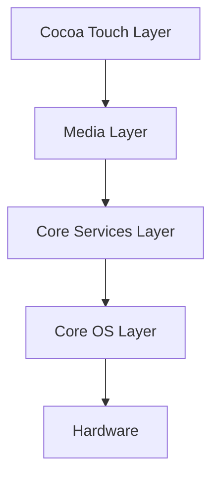

# Unit - 2
:::info[TITLE]
## iOS & IPA Architecture
:::

## 1. Introduction to iOS

### 1.1 Overview and History
#### 1.1.1 What is iOS?
- **Definition:** iOS (originally iPhone OS) is a proprietary mobile operating system developed exclusively by Apple Inc. for its hardware.
- **Foundation:** It is derived from macOS (Macintosh OS X) and shares the Darwin foundation, adapting its powerful UNIX-like environment for mobile devices.
- **Supported Languages:** Development for iOS natively supports **Swift**, **Objective-C**, **C**, and **C++**.
- **Market Position:** It is the world's second most popular and widely used mobile operating system after Android.

#### 1.1.2 Device Ecosystem
- iOS is specifically designed for Apple's handheld devices. Historically, it powered the iPhone, iPad, and iPod Touch.
- (Note: In 2019, Apple branched the iPad's operating system into a distinct entity called **iPadOS**, though it shares the same core architecture as iOS).

#### 1.1.3 Historical Timeline
- **June 2007:** The first generation iPhone was released running the initial version of iPhone OS.
- **September 5, 2007:** Apple released the iPod Touch, bringing most non-phone abilities of the iPhone to a media player.
- **April 2010:** The first generation iPad was released.
- **June 2010:** Apple officially rebranded "iPhone OS" to "iOS" to reflect its use across multiple device families.
- **November 2012:** The iPad Mini was released.
- **Fall 2023:** **iOS 17** was released with significant updates.

### 1.2 iOS 17 Features
Apple announced iOS 17 at the June 2023 Worldwide Developers Conference (WWDC). Key features include:
- **Siri Enhancements:** The wake word changed from "Hey Siri!" to simply "Siri," along with the ability to issue back-to-back commands without re-triggering the assistant.
- **App Upgrades:** Significant upgrades to the Phone, FaceTime, and Messages apps (including an all-new Stickers experience).
- **NameDrop:** An upgrade to AirDrop that allows users to easily share contact information by bringing two iPhones close together.

## 2. iOS Architecture

The structure of iOS is strictly layer-based. Communication between applications and the underlying hardware does not occur directly. Instead, applications communicate through a series of intermediate layers. The lower levels provide basic system services, while higher-level layers provide sophisticated graphics and interface-related services. Most system interfaces are bundled into special packages called **frameworks**.

### 2.1 Architecture Diagram

```mermaid
flowchart TD
    A[Cocoa Touch Layer]
    B[Media Layer]
    C[Core Services Layer]
    D[Core OS Layer]
    E[Hardware]
    
    A --> B
    B --> C
    C --> D
    D --> E
```

### 2.2 The Four Layers of iOS

#### 2.2.1 Core OS Layer
- **Definition:** The lowest level layer in the software stack, sitting directly above the device hardware. All iOS technologies are built upon this layer.
- **Features:** It provides low-level networking, access to external accessories, and basic system services. It supports 64-bit architecture, enabling applications to execute much faster.
- **Key Frameworks:**
  - **Core Bluetooth Framework:** Allows apps to interact with Bluetooth Low Energy (BLE) devices.
  - **External Accessories Framework:** Facilitates communication with hardware accessories attached to the iOS device.
  - **Accelerate Framework:** Provides high-performance, energy-efficient computation for math, large-scale data, and image processing.
  - **Security Services Framework:** Manages certificates, public/private keys, and trust policies.
  - **Local Authorization Framework:** Handles user authentication (Touch ID / Face ID / Passcode).

#### 2.2.2 Core Services Layer
- **Definition:** Provides essential services that the iOS operating system uses to function, manage data, and offer higher-level features to apps.
- **Key Frameworks:**
  - **Address Book Framework:** Provides access to the user's contact details.
  - **CloudKit Framework:** Provides a medium for seamlessly moving data between your app and Apple's iCloud.
  - **Core Data Framework:** The primary technology used to manage the data model of a Model-View-Controller (MVC) app, providing object graph management and persistence.
  - **Core Foundation Framework:** Offers fundamental data management and system service features (C-based APIs).
  - **Core Location Framework:** Provides location and heading information to the application using GPS, cellular, and Wi-Fi data.
  - **Core Motion Framework:** Accesses motion-based data generated by the device's accelerometer, gyroscope, and magnetometer.
  - **Foundation Framework:** Provides an Objective-C/Swift wrapper covering many features found in Core Foundation.
  - **HealthKit Framework:** Securely handles and manages the user's health and fitness data.
  - **HomeKit Framework:** Used for communicating with and controlling connected smart devices within the user's home.
  - **Social Framework:** An interface to seamlessly access and integrate users’ social media accounts.
  - **StoreKit Framework:** Supports in-app purchases of content and services.

#### 2.2.3 Media Layer
- **Definition:** Enables all graphics, video, and audio technology within the system.
- **Key Frameworks:**
  - **UIKit Graphics:** Provides support for designing images and animating view content.
  - **Core Graphics Framework:** Supports 2D vector and image-based rendering; it is the native drawing engine for iOS (often known as Quartz 2D).
  - **Core Animation:** Optimizes the animation experience of apps by rendering graphics efficiently directly on the GPU.
  - **Media Player Framework:** Provides support for playing media playlists and enables the user to interact with their iTunes library.
  - **AVKit & AVFoundation:** Provides easy-to-use interfaces for video presentation, recording, and playback of audio and video.
  - **OpenAL:** An industry-standard technology for rendering 3D positional audio.
  - **Core Image:** Provides advanced support for processing and analyzing motionless images.
  - **GLKit:** Manages advanced 2D and 3D rendering by integrating with hardware-accelerated OpenGL ES interfaces.

#### 2.2.4 Cocoa Touch Layer
- **Definition:** Also known as the Application Layer, it acts as the primary interface for the user and the developer to work with the iOS operating system. It defines the basic app infrastructure and supports touch and motion events.
- **Key Frameworks:**
  - **UIKit Framework:** The most crucial framework for UI development, providing window and view architecture, event handling for touch, and managing the application lifecycle.
  - **EventKit Framework:** Shows a standard system interface using view controllers for viewing and altering calendar events.
  - **GameKit Framework:** Provides support for users to share their game-related data online and utilize Game Center features (leaderboards, achievements).
  - **MapKit Framework:** Provides a highly customizable, scrollable map that can be integrated directly into the app's user interface.
  - **PushKit Framework:** Provides specialized registration support for VoIP apps, watchOS complications, and file provider updates.

## 3. iOS Security Model

Apple designs iOS security from the hardware level up through the software stack. The security model guarantees that apps are free of known malware and safeguards user data with robust encryption. The model is categorized into three main sections: **System Security**, **Data Security**, and **App Security**.

### 3.1 System Security
System security comprises five major processes designed to ensure the integrity of the device and the OS:

#### 3.1.1 iOS Secure Boot Chain
- **Hardware Root of Trust:** When an iOS device boots, it immediately executes read-only code from the **Boot ROM**, laid down during chip fabrication. This code is implicitly trusted and immutable.
- **Chain of Trust:** The Boot ROM contains the Apple root certificate public key, which it uses to verify that the **Low-Level Bootloader (LLB)** is properly signed by Apple and hasn't been tampered with.
- **iBoot and Kernel:** The LLB then verifies the **iBoot** bootloader. Finally, iBoot verifies the **iOS Kernel** before starting it. This strict chain ensures that the lowest levels of software are untampered and that the OS is running on a valid Apple device.

#### 3.1.2 System Software Authorization
- Apple regularly releases software updates to patch emerging security concerns.
- **Anti-Downgrade:** During an OS installation or restore, the device connects to Apple's servers to authorize the installation. This prevents attackers from downgrading a device to an older, vulnerable version of iOS.

#### 3.1.3 SEP (Secure Enclave Processor)
- **Definition:** The SEP is a dedicated co-processor fabricated directly into the System on Chip (SoC).
- **Isolation:** It runs its own micro-OS, undergoes a separate secure boot process, and receives independent system updates.
- **Purpose:** It handles cryptographic keys and biometric data (Touch ID / Face ID). It explicitly prevents the main Application Processor (CPU) from ever gaining direct read access to sensitive cryptographic materials.

#### 3.1.4 Touch ID & Face ID
- **Touch ID:** Scans a user's fingerprint and stores only a secure mathematical representation of it exclusively within the SEP.
- **Face ID:** Uses the TrueDepth camera system to accurately map facial geometry. It uses advanced neural networks for attention detection, matching, and anti-spoofing. This biometric data is digitally signed and sent strictly to the SEP.

### 3.2 Data Security
iOS implements three main methods to protect data at rest:

#### 3.2.1 Device ID and Group ID
- Each iOS device has a unique ID (**UID**) and a device group ID (**GID**). 
- These are AES 256-bit keys fused into the application processor and the SEP during manufacturing. 
- **Security:** No software (including iOS) or firmware can access these keys directly; they can only invoke the hardware engine to use them for encryption/decryption. 
- **Tied to Hardware:** Because the UID is unique to the silicon, data encrypted with it is cryptographically tied to that specific device. If a memory chip is physically extracted and moved to another device, the files remain permanently inaccessible.

#### 3.2.2 File Level Protection
- **Data Protection API:** iOS protects file data by constructing and managing a complex hierarchy of keys in conjunction with the hardware encryption engine.
- Every time a file is created, Data Protection creates a unique 256-bit key for that specific file, which is then wrapped by higher-level class keys based on the user's passcode. All these keys are securely managed by the SEP.

#### 3.2.3 Keychain Data Protection
- **Purpose:** The iOS Keychain securely stores short, highly sensitive bits of data such as cryptographic keys, session tokens, passwords, and certificates.
- **Security:** Uses robust encryption to protect the data from unauthorized access, ensuring it is only accessible by the authorized app that created it.

### 3.3 App Security
Apple employs five distinct methods to ensure applications remain secure:

#### 3.3.1 App Code Signing
- Ensures that all code running on the device comes from a specific, legitimate, Apple-approved developer source.
- Ensures authenticity and guarantees that the code has not been altered or injected with malware since it was digitally signed.

#### 3.3.2 App Updates
- Updates are rigorously provided to supported devices to distribute security fixes and functionality enhancements promptly, ensuring apps patch vulnerabilities quickly.

#### 3.3.3 App Sandboxing
- **Definition:** All third-party apps are heavily restricted ("sandboxed") from accessing files stored by other apps or making modifications to the device's core system.
- **Structure:** Each app is granted a randomly assigned "unique home directory" during installation.
- **Directory Paths (Based on iOS 9.3+):**
  - **Third-Party Apps:** Located in `/private/var/containers/Bundle/Application/<unique id>` (for the app bundle) and `/private/var/mobile/Containers/Data/Application/<unique id>` (for app data).
  - **Apple System Apps:** Located securely in the root `/Application` directory.
- **Benefit:** Without a sandbox, an app could potentially access all user data and system resources. With the sandbox, access is strictly limited to the app's own container unless explicitly authorized via APIs.

#### 3.3.4 Runtime Process Security
- **ASLR (Address Space Layout Randomization):** Protects against buffer overflow attacks. ASLR randomizes the memory locations of different parts of the program every time it is run. Attackers cannot predict memory addresses, making it exceedingly difficult to inject and execute a malicious payload.
- **DEP (Data Execution Prevention):** Marks pages in memory as either writable or executable, but never both simultaneously. This prevents attackers from writing executable code into memory and then running it.
- **Stack Smashing Protection:** A "canary" value is placed in memory immediately after local variables. The system checks this value before a function returns. If a buffer overflow has occurred, the canary is overwritten, the system detects the tampering, and the app crashes safely instead of executing malicious code.
- **ARC (Automatic Reference Counting):** A memory management feature that keeps track of class instances and safely deallocates them when their reference count drops to zero, vastly reducing memory leaks and use-after-free vulnerabilities.

#### 3.3.5 App Store Review
- Apple mandates a strict review process for all apps before they are published in the App Store. This manual and automated review ensures apps comply with privacy policies, are free of known malware, and function as advertised.

### 3.4 Key Considerations for Developers
To adhere to the iOS Security Model, developers must focus on:
- **Implementation:** Using secure coding practices, utilizing Apple's secure frameworks, validating all user input, and handling errors gracefully to prevent information leakage.
- **Enhancement:** Maximizing data protection APIs, enforcing secure communication protocols (HTTPS/TLS), and actively rolling out regular software updates.

## 4. The iOS Permission Model

Unlike older, highly permissive operating systems, Apple mandates a strictly segregated permission model to protect user privacy.

### 4.1 Understanding iOS Permissions
- **Explicit Consent:** Every single app attempting to access restricted classes of data must prompt the user with a system-level permission request. 
- **Settings Management:** iOS helps prevent apps from accessing personal info without permission. Users can navigate to the Settings app to review which apps have permissions, and they can grant or revoke access at any time.
- **Protected Resources Include:**
  - Contacts & Photos
  - Motion activity and fitness data
  - Location Services
  - Microphone & Camera

### 4.2 Purpose and Process
- **Purpose:** 
  - Empowers users to control exactly how apps access their personal information.
  - Protects user privacy and prevents unauthorized data harvesting.
  - Enhances app security by significantly limiting the potential attack surface.
- **Granting Process:**
  - The app triggers an API request for a sensitive resource.
  - The OS pauses the app and presents a clear, system-controlled dialog explaining the request (often including a custom usage description provided by the developer).
  - The user can choose to grant permission permanently, deny it, or (in newer iOS versions) grant temporary/one-time access.
- **Impact on Developers:** Developers must carefully justify their permission requests to users, fail gracefully if permission is denied, and architect their apps to minimize unnecessary data collection.

## 5. Jailbreaking

### 5.1 Definition and Risks
- **Definition:** Jailbreaking is the process of modifying an iOS device to systematically bypass Apple’s strict security restrictions (specifically the App Sandbox and Code Signing) to gain root (administrative) access to the OS.
- **Reasons for Jailbreaking:** 
  - Access to a wider range of apps and tweaks from unofficial repositories (like Cydia/Sileo).
  - Freedom to deeply modify system settings, UI themes, and core behavior.
  - The ability to run unsupported software, emulators, or force-install older versions of iOS.
- **Risks of Jailbreaking:**
  - **Vulnerability:** Disabling Code Signing and Sandboxing exposes the device to severe malware and security threats.
  - **Instability:** Modifying core OS files creates a high potential for device instability, crashes, or permanently "bricking" the device.
  - **Warranty:** Jailbreaking is a violation of the EULA, voiding the device warranty and resulting in a loss of official technical support from Apple.

### 5.2 Types of Jailbreaks
There are four distinct classifications of jailbreaks depending on their persistence:
1. **Tethered Jailbreak:** Requires the iOS device to be physically connected via USB to a computer running specialized software every time the device is booted or rebooted. If the device loses power away from a computer, it will fail to boot completely. This is highly inconvenient.
2. **Untethered Jailbreak:** The most sought-after type. The device can be rebooted normally at any time without connecting to a computer, and it will boot up perfectly with the jailbreak fully intact and active.
3. **Semi-Tethered Jailbreak:** Requires a computer connection to boot the device *with* the modified jailbroken code active. However, unlike a tethered jailbreak, if a computer isn't available, the device *can* still boot into a normal, non-jailbroken state.
4. **Semi-Untethered Jailbreak:** The device can reboot without a computer connection, but it will boot into a normal, non-jailbroken state. To reactivate the jailbreak, the user must run a specific side-loaded app directly on the iPhone after the reboot (no PC required).

## 6. Understanding IPA Architecture

### 6.1 IPA File Overview
- **Definition:** IPA stands for **iOS App Store Package**. It is the standard archive file format (conceptually similar to a `.zip` file) used for packaging iOS applications.
- **Contents:** An IPA file contains the compiled executable code of the app, all associated graphical and audio resources, and necessary metadata.
- **Distribution:** It is the format Apple uses to distribute apps through the App Store, and it is also used by developers for ad-hoc distribution and enterprise deployment.

### 6.2 Purpose of IPA Files
- **Distribution:** Securely distributing applications to end-users for installation on iOS devices.
- **Integrity:** Maintaining application integrity and authenticity through digital signatures embedded within the package.
- **Management:** Enabling organized app deployment, updating, and Mobile Device Management (MDM).

### 6.3 IPA File Structure and Directories
When an IPA file is unzipped, it reveals a specific, mandated directory structure:

#### 6.3.1 Payload Folder
- The most crucial directory within the IPA.
- Contains the actual application bundle (typically named `[App Name].app`).
- Inside the `.app` bundle is the compiled binary executable file, alongside subfolders strictly organizing different types of resources (images, sounds, localized data files, compiled storyboards).
- This folder is absolutely essential for the app's execution and functionality.

#### 6.3.2 iTunesArtwork
- A standalone `512x512` pixel PNG image file representing the application’s icon.
- Primarily utilized for displaying the app beautifully in older versions of iTunes and App Store backend listings.
- Essential for brand recognition and user experience outside the device environment.

#### 6.3.3 iTunesMetadata.plist
- An XML-based property list (plist) file containing extensive metadata about the application.
- **Information Provided:** App name, bundle version, developer name, copyright details, genre, and purchase information.
- **Usage:** Utilized heavily by the iOS system and App Store for app identification, displaying information in device settings, and managing app updates.

#### 6.3.4 Additional Embedded Files
- **Resource Files:** Images, sound effects, custom fonts, etc., stored within the `.app` bundle.
- **Configuration Files:** Additional `.plist` files (like `Info.plist` which dictates core app settings and capabilities).
- **Frameworks/SDKs:** Any third-party dynamic libraries or SDKs the app relies on are embedded in a dedicated `Frameworks` folder inside the app bundle.
- **Documentation:** Miscellaneous support files or legal documentation required by the developer.
