# Unit - 3

:::info[TITLE]
## Mobile App Security
:::


## 1. Android Permission Model

Android is a permission-based operating system that restricts access to sensitive resources and system functionality. Applications must obtain appropriate permissions before accessing protected data or hardware components.

The Android Permission Model acts as a security layer between applications and device resources. It ensures that applications access only those resources that have been explicitly approved by the user or system.

Android permissions help protect:

- User privacy
- Device security
- System integrity
- Sensitive information

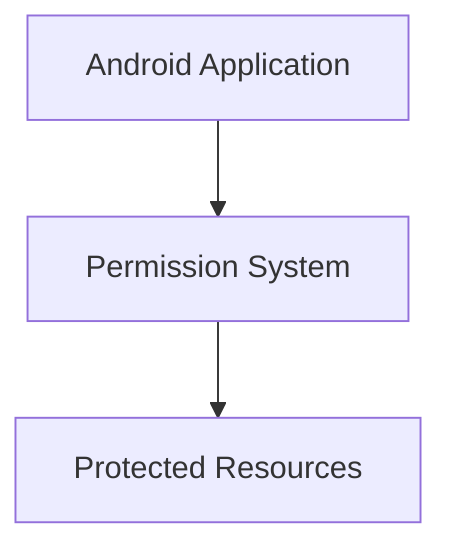

### 1.1 Introduction to Android Permission Model

The Android Permission Model is a security framework that regulates access to device resources and user data.

Whenever an application needs access to protected functionality such as the camera, contacts, location, or microphone, it must first request the required permissions.

Android verifies permissions before allowing access to sensitive resources.

**Examples of Protected Resources**

| Resource | Permission |
|-----------|------------|
| Camera | CAMERA |
| Contacts | READ_CONTACTS |
| Location | ACCESS_FINE_LOCATION |
| Microphone | RECORD_AUDIO |
| SMS | READ_SMS |

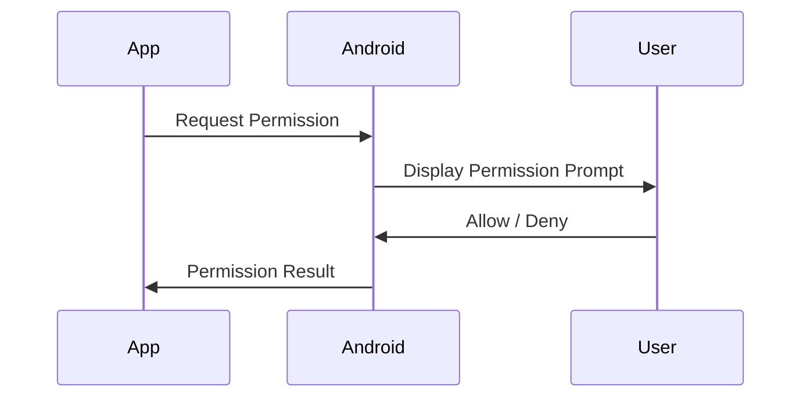

#### 1.1.1 Need for Permissions

Permissions are necessary because mobile applications often need access to sensitive information and hardware resources.

Without permissions, malicious applications could access private data, monitor users, or modify device functionality without authorization.

**Reasons Permissions Are Required**

- Protect user information
- Restrict unauthorized access
- Secure hardware resources
- Prevent malicious activities
- Maintain system integrity

**Example Scenario**

A navigation application requires location information to provide directions.

Before accessing GPS services, it must obtain location permission.

```xml showLineNumbers
<manifest>

    <uses-permission
        android:name=
        "android.permission.ACCESS_FINE_LOCATION"/>

</manifest>
```

**Explanation**

- `uses-permission` declares a required permission.
- The application requests access to GPS services.
- Android verifies the permission before allowing access.

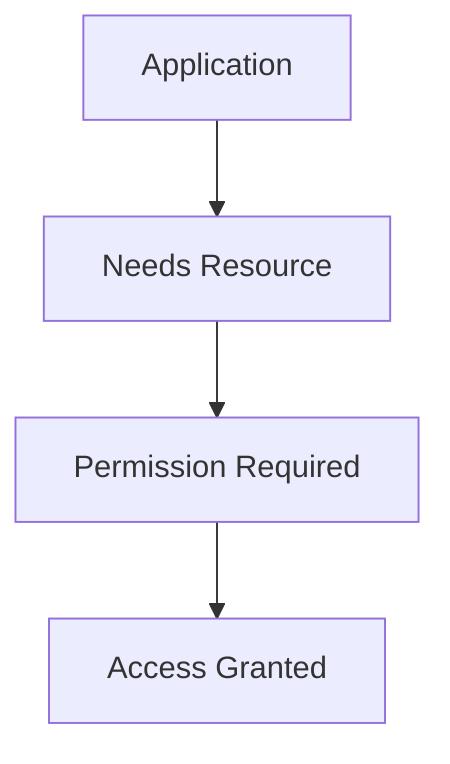

**Consequences Without Permissions**

- Privacy violations
- Data theft
- Unauthorized surveillance
- Malware abuse
- System compromise

#### 1.1.2 User Privacy and Security

One of the primary objectives of the Android Permission Model is protecting user privacy and security.

Permissions give users control over what information and device resources applications can access.

Android follows a consent-based model where users approve sensitive permissions before access is granted.

**Privacy Protection Features**

- Explicit user consent
- Runtime permission requests
- Permission revocation
- Granular access control

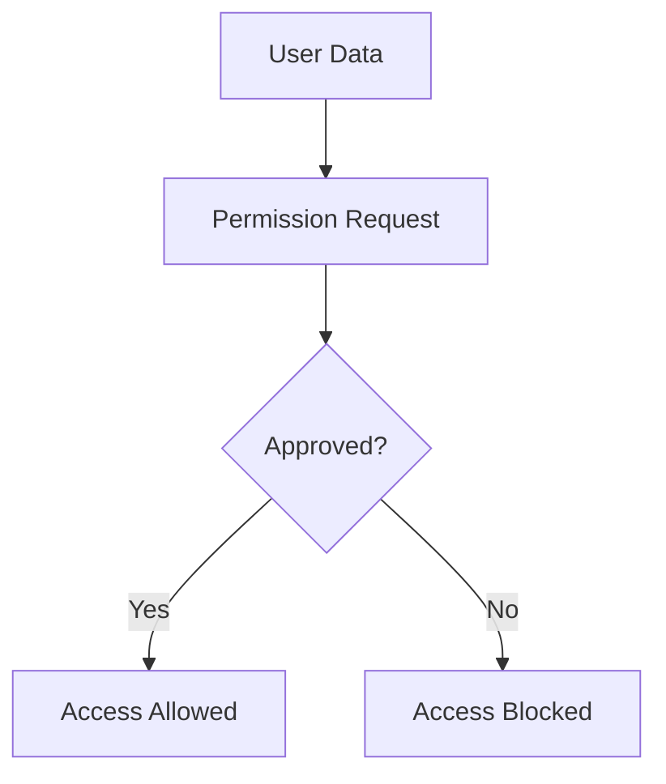

**Example: Camera Permission Request**

```java showLineNumbers
if (checkSelfPermission(
        Manifest.permission.CAMERA)
    != PackageManager.PERMISSION_GRANTED) {

    requestPermissions(
        new String[]{
            Manifest.permission.CAMERA
        },
        100
    );
}
```

**Explanation**

- Checks whether camera permission exists.
- Displays a permission prompt if necessary.
- User decides whether access is allowed.

**Benefits for Users**

- Greater privacy
- Better transparency
- Control over personal information
- Reduced risk of abuse

#### 1.1.3 Permission-Based Access Control

Permission-Based Access Control (PBAC) is a security mechanism where access decisions depend on granted permissions.

Applications receive access only to resources for which they have appropriate authorization.

Before any protected operation is performed, Android checks whether the required permission exists.

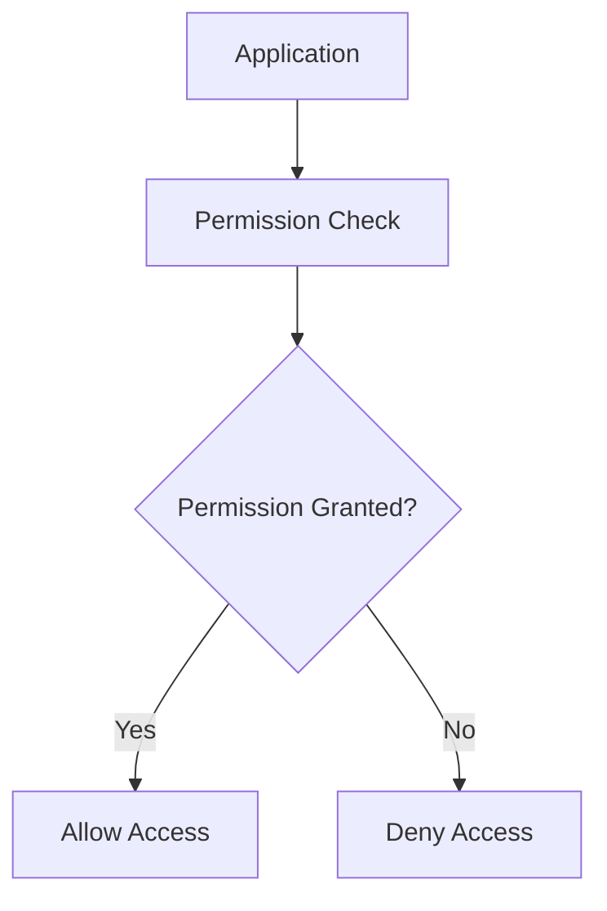

**Access Control Process**

1. Application requests a resource.
2. Android identifies required permissions.
3. Permission status is verified.
4. Access is granted or denied.

**Example**

```java showLineNumbers
if (ContextCompat.checkSelfPermission(
        this,
        Manifest.permission.READ_CONTACTS)
    == PackageManager.PERMISSION_GRANTED) {

    loadContacts();
}
```

**Explanation**

- Android checks contact permission.
- Contacts are accessed only when permission exists.
- Unauthorized access is prevented.

**Advantages**

- Fine-grained access control
- Better security
- Improved privacy protection
- Reduced attack surface

### 1.2 Importance of Application Security

Application Security refers to the measures used to protect mobile applications and user information from threats, attacks, and unauthorized access.

Modern applications process large amounts of sensitive information, making security an essential requirement.

**Security Goals**

- Confidentiality
- Integrity
- Availability
- Privacy Protection
- Trustworthiness

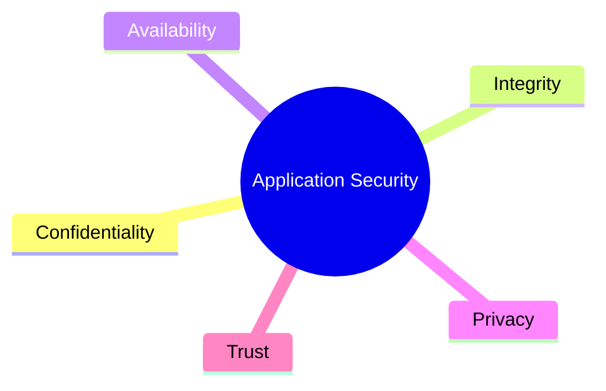

Application security helps organizations:

- Protect customer information
- Prevent financial losses
- Maintain compliance
- Build user trust

#### 1.2.1 User Trust

User Trust is one of the most important factors influencing application adoption and success.

Users expect applications to handle their information securely and responsibly.

Security incidents can quickly damage reputation and reduce user confidence.

**Factors That Build Trust**

- Secure authentication
- Transparent permission usage
- Privacy protection
- Data security

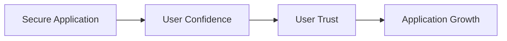

**Example**

A banking application should:

- Encrypt user data
- Protect login credentials
- Request only necessary permissions
- Provide secure transactions

**Benefits of User Trust**

- Increased user adoption
- Better customer retention
- Improved reputation
- Stronger brand image

#### 1.2.2 Personal Data Protection

Mobile applications frequently process sensitive personal information.

Protecting this information is essential for maintaining privacy and preventing misuse.

**Examples of Personal Data**

- Name
- Address
- Phone Number
- Contacts
- Photos
- Location Data
- Financial Information

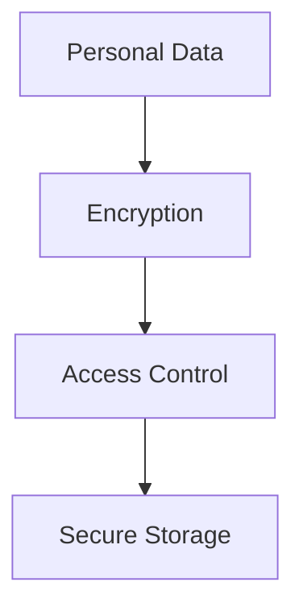

**Security Mechanisms**

- Encryption
- Authentication
- Authorization
- Permission Control
- Secure Storage

**Example**

```java showLineNumbers
String encryptedData =
encrypt(userInformation);
```

**Explanation**

- Sensitive data is encrypted.
- Unauthorized users cannot read protected information.
- Data confidentiality is maintained.

**Benefits**

- Reduced data breaches
- Improved privacy
- Stronger security
- Better compliance

#### 1.2.3 Regulatory Compliance

Many countries have introduced regulations that require organizations to protect user information and respect privacy rights.

Applications must comply with these regulations to avoid legal and financial consequences.

**Common Regulations**

| Regulation | Region |
|------------|---------|
| GDPR | European Union |
| CCPA | California |
| DPDP Act | India |
| HIPAA | United States |

**Compliance Requirements**

- User consent
- Data protection
- Secure storage
- Privacy controls
- Breach reporting

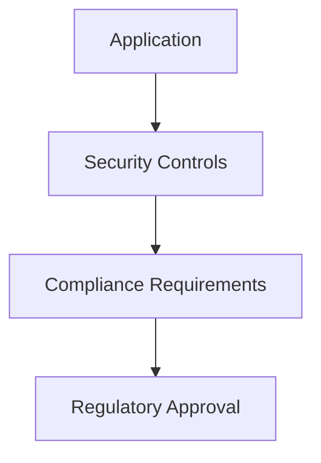

**Examples of Compliance Measures**

- Permission-based access control
- Data encryption
- Privacy policies
- User consent mechanisms

**Benefits of Compliance**

- Legal protection
- Reduced penalties
- Improved trust
- Enhanced reputation

Failure to comply with regulations can result in:

- Financial penalties
- Legal action
- Loss of customer trust
- Reputational damage


### 1.3 Android Permission System

The Android Permission System is a security framework that controls how applications access sensitive device resources and user information.

Before an application can access protected resources such as the camera, contacts, microphone, location services, or SMS, it must obtain the necessary permissions from the Android system.

The permission system helps:

- Protect user privacy
- Restrict unauthorized access
- Prevent malicious behavior
- Improve device security

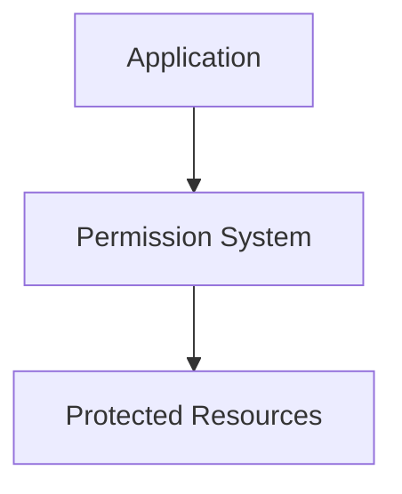

#### 1.3.1 Permission Declaration

Permission Declaration is the process of specifying required permissions in the `AndroidManifest.xml` file.

Before Android allows an application to request or use a protected resource, the required permission must be declared.

**Purpose of Permission Declaration**

- Inform Android about required permissions
- Inform users about application capabilities
- Enable permission enforcement
- Support application security

**Syntax**

```xml showLineNumbers
<uses-permission
    android:name=
    "android.permission.CAMERA"/>
```

**Example: Declaring Multiple Permissions**

```xml showLineNumbers
<manifest>

    <uses-permission
        android:name=
        "android.permission.CAMERA"/>

    <uses-permission
        android:name=
        "android.permission.ACCESS_FINE_LOCATION"/>

    <uses-permission
        android:name=
        "android.permission.RECORD_AUDIO"/>

</manifest>
```

**Explanation**

- `CAMERA` allows access to the device camera.
- `ACCESS_FINE_LOCATION` allows access to GPS location.
- `RECORD_AUDIO` allows microphone access.

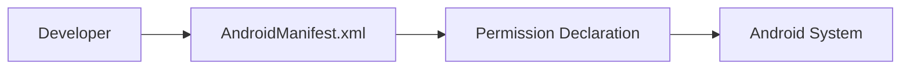

**Commonly Declared Permissions**

| Permission | Purpose |
|------------|----------|
| CAMERA | Camera Access |
| RECORD_AUDIO | Microphone Access |
| ACCESS_FINE_LOCATION | GPS Access |
| READ_CONTACTS | Read Contacts |
| READ_SMS | Read Messages |

Applications cannot request or use protected resources without declaring the corresponding permissions.

#### 1.3.2 Permission Request

Permission Request is the process of obtaining user approval for sensitive permissions.

Since Android 6.0 (API Level 23), dangerous permissions must be requested while the application is running.

This approach gives users greater control over sensitive resources.

**Runtime Permission Workflow**

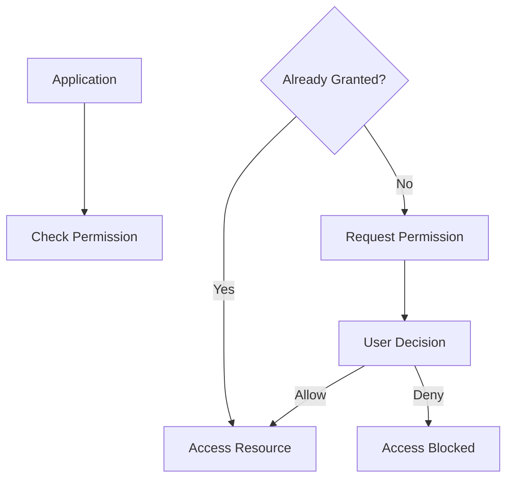

**Step 1: Check Existing Permission**

```java showLineNumbers
if (ContextCompat.checkSelfPermission(
        this,
        Manifest.permission.CAMERA)
    == PackageManager.PERMISSION_GRANTED) {

    openCamera();
}
```

**Explanation**

- Checks whether camera permission is already available.
- Opens the camera immediately if permission exists.

**Step 2: Request Permission**

```java showLineNumbers
ActivityCompat.requestPermissions(
    this,
    new String[]{
        Manifest.permission.CAMERA
    },
    100
);
```

**Explanation**

- Displays the Android permission dialog.
- Requests camera access from the user.

**Step 3: Receive User Response**

```java showLineNumbers
@Override
public void onRequestPermissionsResult(
        int requestCode,
        String[] permissions,
        int[] grantResults) {

    if (requestCode == 100 &&
        grantResults.length > 0 &&
        grantResults[0]
        == PackageManager.PERMISSION_GRANTED) {

        openCamera();
    }
}
```

**Explanation**

- Receives the user's decision.
- Grants access when approved.
- Blocks access when denied.

**Benefits of Runtime Permissions**

- Better privacy protection
- Improved transparency
- User-controlled access
- Reduced permission abuse

#### 1.3.3 Permission Usage

Permission Usage refers to accessing a protected resource after the required permission has been granted.

Even after permission approval, Android continues enforcing permission checks whenever sensitive resources are accessed.

**Permission Usage Lifecycle**

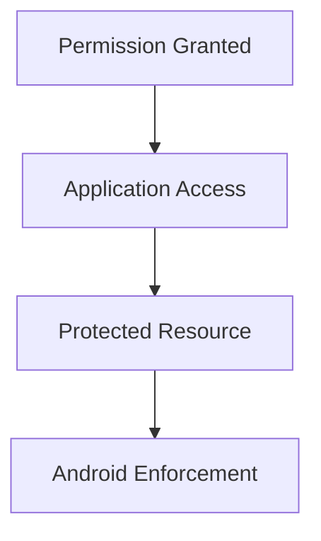

**Example: Using Location Services**

```java showLineNumbers
LocationManager locationManager =
    (LocationManager)
    getSystemService(
        Context.LOCATION_SERVICE
    );

Location location =
    locationManager.getLastKnownLocation(
        LocationManager.GPS_PROVIDER
    );
```

**Explanation**

- Retrieves GPS location information.
- Requires location permission.
- Access is denied if permission is unavailable.

**Example: Reading Contacts**

```java showLineNumbers
Cursor cursor =
    getContentResolver().query(
        ContactsContract.Contacts.CONTENT_URI,
        null,
        null,
        null,
        null
    );
```

**Explanation**

- Reads contact information.
- Requires `READ_CONTACTS` permission.
- Android prevents access without authorization.

**Best Practices**

- Request only necessary permissions.
- Use permissions only when required.
- Explain permission usage clearly.
- Respect user decisions.

### 1.4 Types of Android Permissions

Android categorizes permissions into different groups based on their security impact and level of access.

Each category follows different authorization rules.

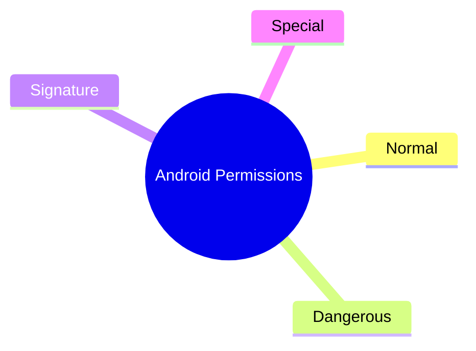

**Permission Categories**

| Permission Type | User Approval Required |
|-----------------|------------------------|
| Normal | No |
| Dangerous | Yes |
| Signature | No (Same Certificate) |
| Special | Special Approval |

#### 1.4.1 Normal Permissions

Normal Permissions provide access to low-risk features that do not directly expose sensitive user information.

These permissions are automatically granted by Android during installation.

**Characteristics**

- Low security risk
- Automatically granted
- No runtime prompt
- Minimal privacy impact

**Examples**

| Permission | Purpose |
|------------|----------|
| INTERNET | Internet Access |
| ACCESS_NETWORK_STATE | Network Status |
| VIBRATE | Device Vibration |
| SET_WALLPAPER | Wallpaper Control |

**Example**

```xml showLineNumbers
<uses-permission
    android:name=
    "android.permission.INTERNET"/>
```

**Permission Flow**

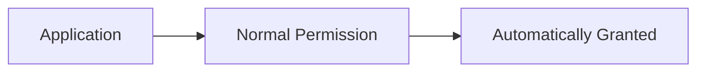

**Advantages**

- Better usability
- Faster installation
- Minimal user interruption

#### 1.4.2 Dangerous Permissions

Dangerous Permissions protect sensitive information and device resources.

These permissions require explicit user approval because misuse may impact privacy or security.

**Protected Resources**

- Camera
- Contacts
- Location
- SMS
- Microphone
- Storage

**Examples**

| Permission | Resource |
|------------|----------|
| CAMERA | Camera |
| READ_CONTACTS | Contacts |
| RECORD_AUDIO | Microphone |
| ACCESS_FINE_LOCATION | GPS |
| READ_SMS | SMS |

**Example**

```java showLineNumbers
ActivityCompat.requestPermissions(
    this,
    new String[]{
        Manifest.permission.ACCESS_FINE_LOCATION
    },
    101
);
```

**Dangerous Permission Workflow**

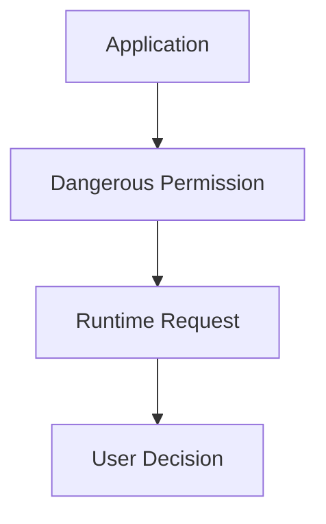

**Security Benefits**

- User awareness
- Better privacy control
- Protection of sensitive information

#### 1.4.3 Signature Permissions

Signature Permissions are granted only when the requesting application is signed using the same digital certificate as the application that defined the permission.

These permissions are commonly used for secure communication between applications developed by the same organization.

**Characteristics**

- Certificate-based trust
- High security
- No user approval required
- Developer-controlled access

**Example**

```xml showLineNumbers
<permission
    android:name=
    "com.example.SECURE_PERMISSION"

    android:protectionLevel=
    "signature"/>
```

**Signature Permission Model**

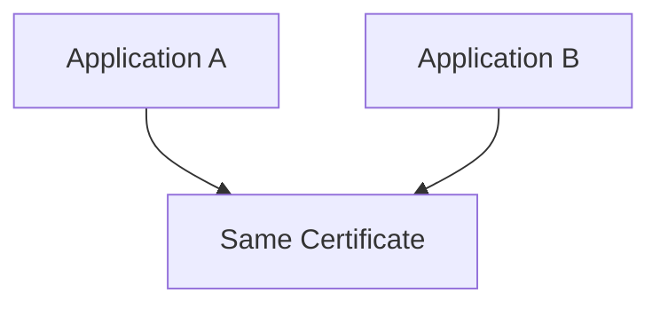

**Use Cases**

- Enterprise applications
- System applications
- Application suites from the same developer

**Advantages**

- Secure inter-application communication
- Strong trust relationships
- Reduced unauthorized access

#### 1.4.4 Special Permissions

Special Permissions provide access to highly sensitive system-level functionality.

These permissions require additional authorization beyond the normal permission model.

Applications typically direct users to a system settings page where permission approval occurs.

**Characteristics**

- High privilege access
- Additional approval required
- System-controlled authorization
- Increased security restrictions

**Examples**

| Permission | Purpose |
|------------|----------|
| SYSTEM_ALERT_WINDOW | Draw Over Other Apps |
| WRITE_SETTINGS | Modify System Settings |
| MANAGE_EXTERNAL_STORAGE | Full Storage Access |
| REQUEST_INSTALL_PACKAGES | Install Applications |

**Example**

```xml showLineNumbers
<uses-permission
    android:name=
    "android.permission.SYSTEM_ALERT_WINDOW"/>
```

**Checking Overlay Permission**

```java showLineNumbers
if (!Settings.canDrawOverlays(this)) {

    Intent intent = new Intent(
        Settings.ACTION_MANAGE_OVERLAY_PERMISSION
    );

    startActivity(intent);
}
```

**Explanation**

- Checks overlay permission status.
- Opens system settings when permission is unavailable.
- User manually grants permission.

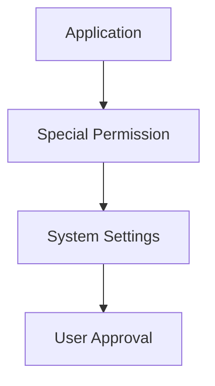

**Security Considerations**

Special permissions can:

- Modify system behavior
- Access privileged functionality
- Increase security risks if abused

Therefore, Android applies stricter controls and additional verification before granting these permissions.


### 1.5 Requesting Permissions

Requesting permissions is an important part of Android application security. Before accessing sensitive resources such as the camera, microphone, contacts, location, or SMS, an application must obtain user approval.

Android follows a runtime permission model for dangerous permissions, ensuring that users have control over sensitive resources.

**Permission Request Workflow**

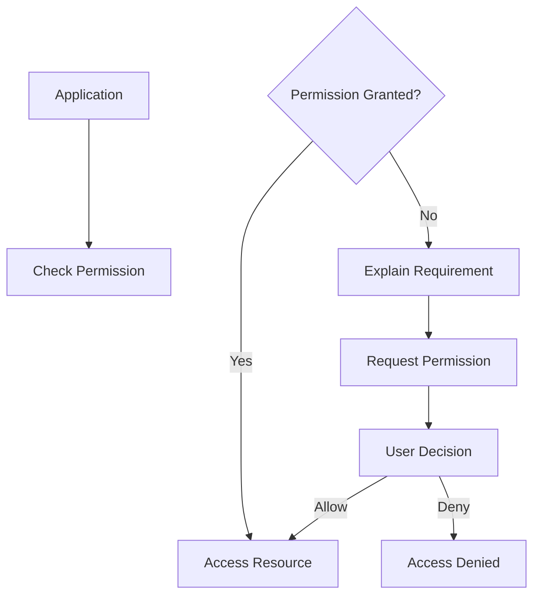

The permission request process consists of three main stages:

1. Checking Existing Permissions
2. Explaining Permission Requirements
3. Handling User Responses

#### 1.5.1 Checking Existing Permissions

Before requesting a permission, an application should verify whether the permission has already been granted.

Requesting a permission repeatedly creates a poor user experience and unnecessary permission dialogs.

**Permission Verification Process**

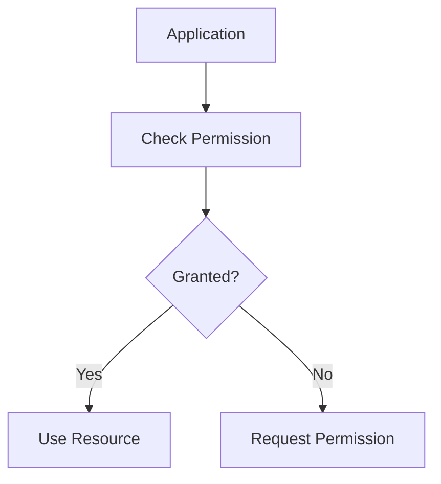

**Example: Checking Camera Permission**

```java showLineNumbers
if (ContextCompat.checkSelfPermission(
        this,
        Manifest.permission.CAMERA)
    == PackageManager.PERMISSION_GRANTED) {

    openCamera();
}
```

**Explanation**

- `checkSelfPermission()` checks the permission status.
- Android returns whether the permission is granted.
- The camera is opened only if permission exists.

**Example: Checking Location Permission**

```java showLineNumbers
if (ContextCompat.checkSelfPermission(
        this,
        Manifest.permission.ACCESS_FINE_LOCATION)
    == PackageManager.PERMISSION_GRANTED) {

    getCurrentLocation();
}
```

**Explanation**

- Verifies GPS permission.
- Prevents unauthorized location access.
- Improves application stability.

**Benefits**

- Reduces unnecessary permission prompts
- Improves user experience
- Prevents permission-related crashes
- Supports secure resource access

#### 1.5.2 Explaining Permission Requirements

Before requesting sensitive permissions, developers should explain why the permission is required.

Users are more likely to grant permissions when they understand how the permission will be used.

**Example Without Explanation**

```text
Allow Camera Access?
```

Many users may reject the request because the purpose is unclear.

**Example With Explanation**

```text
Camera access is required
to scan QR codes and upload photos.
```

The purpose becomes clear and users can make informed decisions.

**Permission Explanation Workflow**

```mermaid
flowchart TD
    A[Application]
    B[Display Explanation]
    C[User Understands Purpose]
    D[Permission Request]

    A --> B
    B --> C
    C --> D
```

**Example: Showing Permission Rationale**

```java showLineNumbers
if (ActivityCompat
    .shouldShowRequestPermissionRationale(
        this,
        Manifest.permission.CAMERA)) {

    showExplanationDialog();
}
```

**Explanation**

- Determines whether an explanation should be displayed.
- Commonly used after a permission denial.
- Improves transparency.

**Example Dialog**

```text
This application requires camera access
to scan product barcodes.
```

**Best Practices**

- Use simple language.
- Explain business purpose.
- Avoid technical terminology.
- Request permissions only when needed.

#### 1.5.3 Handling User Responses

After the user responds to a permission request, Android returns the result to the application.

Applications must handle both approval and denial scenarios appropriately.

**Possible Outcomes**

| User Action | Result |
|------------|---------|
| Allow | Permission Granted |
| Deny | Permission Rejected |
| Deny and Don't Ask Again | Future Requests Blocked |

**Response Handling Workflow**

```mermaid
flowchart TD
    A[Permission Request]
    B[User Decision]

    B -->|Allow| C[Enable Feature]
    B -->|Deny| D[Disable Feature]

    A --> B
```

**Example**

```java showLineNumbers
@Override
public void onRequestPermissionsResult(
        int requestCode,
        String[] permissions,
        int[] grantResults) {

    if (requestCode == 100 &&
        grantResults.length > 0 &&
        grantResults[0]
        == PackageManager.PERMISSION_GRANTED) {

        openCamera();

    } else {

        showPermissionDeniedMessage();
    }
}
```

**Explanation**

- Receives the user's response.
- Enables camera functionality if approved.
- Handles denial safely.

**Good Practices**

- Disable unavailable features gracefully.
- Inform users why functionality is limited.
- Avoid repeated permission requests.
- Never crash when permission is denied.

### 1.6 Permission Security Best Practices

Permissions are powerful security controls, but improper implementation can introduce vulnerabilities and privacy risks.

Developers should follow security best practices to ensure permissions are used responsibly and securely.

```mermaid
mindmap
  root((Permission Security))
    Least Privilege
    Permission Audits
    Runtime Checks
    User Awareness
```

**Security Principles**

- Request minimum permissions.
- Verify permissions before access.
- Remove unused permissions.
- Review permissions regularly.
- Respect user privacy.

#### 1.6.1 Overprivileged Applications

An Overprivileged Application requests more permissions than necessary for its intended functionality.

This violates the Principle of Least Privilege, which states that applications should receive only the permissions required to perform their tasks.

**Example**

A flashlight application requests:

```text
CAMERA
LOCATION
READ_CONTACTS
READ_SMS
RECORD_AUDIO
```

Only the camera permission is necessary for controlling the flashlight.

**Overprivileged Application Model**

```mermaid
flowchart TD
    A[Application]
    B[Required Permission]
    C[Unnecessary Permissions]

    A --> B
    A --> C
```

**Risks**

- Increased attack surface
- Privacy violations
- User distrust
- Greater malware impact

**Secure Alternative**

```text
Flashlight Application
└── CAMERA Permission Only
```

**Recommendations**

- Follow least privilege.
- Remove unused permissions.
- Conduct permission reviews regularly.

#### 1.6.2 Permission Creep

Permission Creep occurs when applications gradually accumulate permissions through updates, even when those permissions are no longer required.

Over time, the application becomes excessively privileged.

**Example Evolution**

Version 1:

```text
CAMERA
```

Version 2:

```text
CAMERA
LOCATION
```

Version 3:

```text
CAMERA
LOCATION
CONTACTS
MICROPHONE
```

The application now possesses permissions unrelated to its original functionality.

**Permission Creep Lifecycle**

```mermaid
flowchart LR
    A[Version 1]
    B[Version 2]
    C[Version 3]
    D[Excess Permissions]

    A --> B
    B --> C
    C --> D
```

**Causes**

- Feature expansion
- Poor permission reviews
- Legacy code
- Incomplete audits

**Risks**

- Increased privacy concerns
- Larger attack surface
- Regulatory compliance issues

**Prevention**

- Review permissions before every release.
- Remove obsolete permissions.
- Conduct periodic audits.

**Permission Audit Checklist**

```text
Is the permission still needed?

Is the related feature active?

Can a less privileged alternative be used?

Does the permission match application functionality?
```

#### 1.6.3 Improper Permission Checks

Improper Permission Checks occur when applications access protected resources without properly verifying permission status.

This can cause security vulnerabilities, crashes, and unauthorized access attempts.

**Incorrect Example**

```java showLineNumbers
openCamera();
```

**Problem**

- No permission verification.
- May crash on newer Android versions.
- Violates Android security requirements.

**Correct Example**

```java showLineNumbers
if (ContextCompat.checkSelfPermission(
        this,
        Manifest.permission.CAMERA)
    == PackageManager.PERMISSION_GRANTED) {

    openCamera();
}
```

**Explanation**

- Verifies permission before access.
- Prevents unauthorized operations.
- Ensures application stability.

**Permission Validation Workflow**

```mermaid
flowchart TD
    A[Application]
    B[Permission Check]
    C{Granted?}

    C -->|Yes| D[Access Resource]
    C -->|No| E[Block Access]

    A --> B
    B --> C
```

**Common Mistakes**

- Skipping runtime permission checks
- Assuming permissions are always granted
- Ignoring permission revocation
- Not handling denial scenarios

**Security Recommendations**

- Always verify permissions before use.
- Re-check permissions before sensitive operations.
- Handle permission denial gracefully.
- Test both approval and denial scenarios.


### 1.7 Permission Risk Mitigation

Permission Risk Mitigation refers to the practices and controls used to reduce security risks associated with Android permissions.

Although Android provides a strong permission framework, improper permission management can still lead to:

- Data leakage
- Privacy violations
- Unauthorized access
- Malware exploitation
- Regulatory non-compliance

Organizations and developers must continuously monitor permission usage and implement security controls to minimize risks.

```mermaid
flowchart TD
    A[Permission Risks]
    B[Permission Audits]
    C[Security Policies]
    D[User Education]
    E[Risk Reduction]

    A --> B
    A --> C
    A --> D

    B --> E
    C --> E
    D --> E
```

**Objectives of Permission Risk Mitigation**

- Reduce unnecessary permissions
- Improve privacy protection
- Minimize attack surface
- Strengthen application security
- Ensure compliance

#### 1.7.1 Regular Permission Audits

A Permission Audit is the systematic review of all permissions requested, granted, and used by an application.

Over time, applications evolve and new features are added while old features are removed. As a result, some permissions may become unnecessary.

Regular audits help identify and remove such permissions.

**Audit Process**

```mermaid
flowchart TD
    A[Application]
    B[Review Manifest]
    C[Review Source Code]
    D[Identify Unused Permissions]
    E[Remove Unnecessary Permissions]

    A --> B
    B --> C
    C --> D
    D --> E
```

**Example**

Manifest File:

```xml showLineNumbers
<uses-permission
    android:name=
    "android.permission.CAMERA"/>

<uses-permission
    android:name=
    "android.permission.READ_CONTACTS"/>
```

Suppose the application no longer uses contact-related functionality.

After the audit:

```xml showLineNumbers
<uses-permission
    android:name=
    "android.permission.CAMERA"/>
```

**Explanation**

- `READ_CONTACTS` is removed.
- Attack surface is reduced.
- User privacy is improved.

**Audit Checklist**

```text
✓ Is the permission still required?

✓ Is the related feature still active?

✓ Does the permission match app functionality?

✓ Is there a less privileged alternative?
```

**Benefits**

- Reduced security risks
- Better privacy protection
- Improved compliance
- Smaller attack surface

#### 1.7.2 Updating Security Policies

Security Policies define how permissions should be requested, used, reviewed, and monitored within an organization or application.

As Android evolves, security requirements also change. Developers must regularly update their policies to reflect new threats, permissions, and platform security mechanisms.

**Reasons for Updating Policies**

- New Android releases
- Emerging security threats
- Privacy regulations
- Security incidents
- Organizational changes

```mermaid
flowchart LR
    A[Android Updates]
    B[Security Review]
    C[Policy Revision]
    D[Implementation]

    A --> B
    B --> C
    C --> D
```

**Examples of Security Policies**

**Least Privilege Policy**

Applications should request only the permissions necessary for their functionality.

**Permission Review Policy**

All permissions should be reviewed during each development cycle.

**Runtime Permission Policy**

Dangerous permissions must be requested only when required.

**Example Policy Rules**

```text
Rule 1:
Request permissions only when necessary.

Rule 2:
Provide clear justification for permission requests.

Rule 3:
Remove obsolete permissions.

Rule 4:
Review permissions before every release.
```

**Benefits**

- Improved governance
- Consistent security practices
- Better compliance
- Reduced vulnerabilities

#### 1.7.3 User Education

User Education helps users understand permissions and their impact on privacy and security.

Many users approve permissions without understanding why they are needed or how they will be used.

Educating users allows them to make informed decisions.

**User Awareness Workflow**

```mermaid
flowchart TD
    A[Permission Request]
    B[Explanation]
    C[User Understanding]
    D[Informed Decision]

    A --> B
    B --> C
    C --> D
```

**Poor Permission Explanation**

```text
Allow Location Access?
```

The purpose is unclear.

**Better Permission Explanation**

```text
Location access is required
to display nearby restaurants
and navigation directions.
```

**User Education Methods**

- Permission explanations
- Privacy policies
- Security notices
- In-app guidance
- Permission review reminders

**Benefits**

- Better decision-making
- Improved privacy awareness
- Increased user trust
- Reduced permission misuse

### 1.8 Permission Misuse Case Studies

Permission misuse occurs when applications request excessive permissions or use permissions in ways that are unrelated to their stated functionality.

Studying real-world examples helps developers understand common mistakes and avoid security issues.

```mermaid
mindmap
  root((Permission Misuse))
    Excessive Permissions
    Hidden Data Collection
    User Tracking
    Privacy Violations
```

**Common Consequences**

- Privacy breaches
- Data theft
- User distrust
- Regulatory penalties
- Application removal from stores

#### 1.8.1 Social Media Application Case

Social media applications often require multiple permissions to provide their services.

Typical permissions include:

```text
Camera
Microphone
Contacts
Location
Storage
```

Some permissions are justified:

- Camera → Upload photos
- Microphone → Voice messages
- Storage → Save media files

Problems arise when permissions are used beyond their intended purpose.

**Example Misuse**

```text
Collecting contact lists
for advertising purposes.

Tracking location continuously
without user awareness.
```

```mermaid
flowchart TD
    A[Social Media App]
    B[Permission Granted]
    C[Excessive Data Collection]
    D[Privacy Risk]

    A --> B
    B --> C
    C --> D
```

**Lessons Learned**

- Request only necessary permissions.
- Explain data collection clearly.
- Limit background access.
- Respect user privacy choices.

#### 1.8.2 Flashlight Application Case

The flashlight application case is one of the most well-known examples of permission misuse.

A flashlight application generally requires only camera flash access.

**Required Permission**

```text
CAMERA
```

**Suspicious Permissions**

```text
READ_CONTACTS
READ_SMS
ACCESS_FINE_LOCATION
RECORD_AUDIO
```

These permissions are unrelated to flashlight functionality.

```mermaid
flowchart TD
    A[Flashlight App]
    B[Camera Permission]
    C[Location Permission]
    D[Contacts Permission]
    E[SMS Permission]

    A --> B
    A --> C
    A --> D
    A --> E
```

**Potential Risks**

- User tracking
- Data harvesting
- Privacy violations
- Unauthorized data collection

**Lessons Learned**

- Follow least privilege principles.
- Remove unnecessary permissions.
- Perform regular permission audits.
- Align permissions with functionality.

#### 1.8.3 Gaming Application Case

Many gaming applications request permissions that are not directly required for gameplay.

Commonly requested permissions include:

```text
Storage
Location
Contacts
Microphone
Camera
```

Some permissions may be legitimate:

- Storage → Save game progress
- Microphone → Voice chat
- Camera → AR gaming features

Problems occur when permissions are used for unrelated purposes.

**Examples of Misuse**

```text
Location tracking
for targeted advertising.

Collecting contacts
for marketing campaigns.
```

```mermaid
flowchart TD
    A[Gaming Application]
    B[Permission Collection]
    C[Data Analysis]
    D[Privacy Risk]

    A --> B
    B --> C
    C --> D
```

**Security Concerns**

- Excessive user profiling
- Behavioral tracking
- Privacy violations
- Increased attack surface

**Lessons Learned**

- Request permissions only when necessary.
- Explain permission usage clearly.
- Avoid collecting unrelated user data.
- Review permissions regularly.

**Common Indicators of Permission Misuse**

| Indicator | Risk Level |
|------------|------------|
| Unrelated Permission Requests | High |
| Continuous Background Access | High |
| Excessive Data Collection | High |
| Lack of Permission Explanation | Medium |
| Poor Privacy Transparency | Medium |

```mermaid
flowchart TD
    A[Minimum Permissions]
    B[Clear Explanations]
    C[Regular Audits]
    D[User Awareness]
    E[Secure Application]

    A --> E
    B --> E
    C --> E
    D --> E
```


## 2. Application Sandboxing

Application Sandboxing is a security mechanism that isolates applications from one another and restricts their access to system resources.

Each application executes within its own controlled environment called a sandbox. The sandbox prevents applications from directly accessing the data, files, memory, or resources of other applications.

Modern mobile operating systems such as Android and iOS use sandboxing as a core security feature.

**Benefits of Sandboxing**

- Protects user data
- Prevents unauthorized access
- Limits malware impact
- Improves system stability
- Enforces security policies

```mermaid
flowchart TD
    A[Application A]
    B[Sandbox A]

    C[Application B]
    D[Sandbox B]

    E[Application C]
    F[Sandbox C]

    A --> B
    C --> D
    E --> F
```

### 2.1 Introduction to Sandboxing

Sandboxing is a security technique that restricts an application's access to resources and system components.

Applications are isolated from each other and can interact with only those resources that have been explicitly permitted by the operating system.

This approach minimizes the damage that can occur if an application becomes compromised.

```mermaid
flowchart TD
    A[Application]
    B[Sandbox]
    C[Allowed Resources]

    A --> B
    B --> C
```

#### 2.1.1 Definition of Sandboxing

Sandboxing is the process of executing an application inside a restricted and isolated environment where its actions are controlled by predefined security policies.

The operating system creates boundaries that prevent applications from accessing resources beyond their authorized scope.

**Key Characteristics**

- Process isolation
- File system isolation
- Controlled resource access
- Security policy enforcement
- Restricted communication

```mermaid
flowchart LR
    A[Application]
    B[Sandbox Environment]
    C[Controlled Resources]

    A --> B
    B --> C
```

**Example**

Consider two applications:

```text
Banking App
Messaging App
```

The Banking App cannot:

- Read messaging data
- Access message databases
- Modify messaging files

Similarly, the Messaging App cannot access banking records.

This separation is achieved through sandboxing.

#### 2.1.2 Need for Sandboxing

Mobile devices store large amounts of sensitive information, including:

- Personal data
- Financial information
- Passwords
- Messages
- Photos
- Location history

Without sandboxing, malicious applications could freely access this information.

**Problems Without Sandboxing**

```text
Application A
      ↓
Accesses
      ↓
Application B Data
      ↓
Privacy Breach
```

**Need for Sandboxing**

- Protect user privacy
- Prevent malware propagation
- Restrict unauthorized access
- Protect system integrity
- Improve application reliability

```mermaid
flowchart TD
    A[Without Sandboxing]
    B[Data Theft]
    C[Privacy Violation]

    D[With Sandboxing]
    E[Controlled Access]
    F[Protected Data]

    A --> B
    B --> C

    D --> E
    E --> F
```

**Real-World Example**

A malicious game should not be able to:

- Read banking credentials
- Access private messages
- Steal contact lists
- Modify system files

Sandboxing prevents these actions.

#### 2.1.3 Security Objectives

The primary objective of sandboxing is to reduce security risks by isolating applications and controlling their interactions with the system.

**Major Security Objectives**

1. Application Isolation
2. Data Protection
3. Resource Protection
4. Malware Containment
5. System Stability

```mermaid
mindmap
  root((Sandbox Security))
    Isolation
    Privacy
    Data Protection
    Resource Security
    Malware Containment
```

**Application Isolation**

Applications operate independently.

**Data Protection**

Applications cannot access private data belonging to other applications.

**Resource Protection**

Access to hardware resources is controlled.

**Malware Containment**

Compromised applications remain confined within their sandbox.

**System Stability**

Application failures do not affect the entire system.

### 2.2 Components of Sandboxing

Sandboxing relies on several security mechanisms that work together to create a secure execution environment.

The major components include:

- Isolation
- Resource Management
- Security Enforcement

```mermaid
flowchart TD
    A[Sandboxing]
    B[Isolation]
    C[Resource Management]
    D[Security Enforcement]

    A --> B
    A --> C
    A --> D
```

#### 2.2.1 Isolation

Isolation is the foundation of sandboxing.

Each application operates within its own environment and cannot directly access the resources of another application.

**Types of Isolation**

- Process Isolation
- File System Isolation
- Memory Isolation
- User Identity Isolation

```mermaid
flowchart TD
    A[Application A]
    B[Private Environment]

    C[Application B]
    D[Private Environment]

    A --> B
    C --> D
```

**Android Example**

Android assigns each application a unique Linux User ID (UID).

```text
App A → UID 10001

App B → UID 10002
```

Because the UIDs are different:

- App A cannot access App B's files.
- App B cannot access App A's data.

**Benefits**

- Strong security boundaries
- Improved privacy
- Reduced attack surface

#### 2.2.2 Resource Management

Resource Management controls how applications use system resources.

The operating system allocates resources while preventing applications from monopolizing or misusing them.

**Managed Resources**

- CPU
- Memory
- Storage
- Network
- Battery
- Hardware Components

```mermaid
flowchart TD
    A[Operating System]
    B[CPU]
    C[Memory]
    D[Storage]
    E[Network]

    A --> B
    A --> C
    A --> D
    A --> E
```

**Resource Allocation Example**

```text
App A → 200 MB Memory

App B → 150 MB Memory

App C → 100 MB Memory
```

Applications receive only the resources allocated to them.

**Benefits**

- Fair resource distribution
- Improved performance
- Reduced resource abuse
- Better battery management

#### 2.2.3 Security Enforcement

Security Enforcement ensures that sandbox restrictions are consistently applied.

The operating system continuously verifies whether applications are attempting to perform authorized actions.

**Security Enforcement Mechanisms**

- Permission Checks
- Access Control Policies
- File Access Restrictions
- Process Restrictions
- System Call Filtering

```mermaid
flowchart TD
    A[Application Request]
    B[Security Policy Check]
    C{Allowed?}

    C -->|Yes| D[Grant Access]
    C -->|No| E[Block Access]

    A --> B
    B --> C
```

**Example: Camera Access Verification**

```java showLineNumbers
if (ContextCompat.checkSelfPermission(
        this,
        Manifest.permission.CAMERA)
    == PackageManager.PERMISSION_GRANTED) {

    openCamera();
}
```

**Explanation**

- Android verifies camera permission.
- Access is granted only when authorization exists.
- Unauthorized access attempts are blocked.

**Examples of Security Enforcement**

| Security Control | Purpose |
|-----------------|---------|
| Permission System | Control Resource Access |
| SELinux Policies | Enforce Security Rules |
| UID Isolation | Separate Applications |
| Access Controls | Protect Sensitive Data |

**Benefits**

- Consistent policy enforcement
- Stronger application security
- Reduced privilege abuse
- Better protection against malware


### 2.3 Purpose of Sandboxing in Mobile Applications

The primary purpose of sandboxing is to create a secure execution environment where applications can operate without affecting other applications or the operating system.

Sandboxing helps mobile operating systems maintain security, privacy, and stability by restricting application activities to authorized resources only.

Without sandboxing, malicious or compromised applications could access sensitive information, interfere with other applications, or damage the operating system.

```mermaid
flowchart TD
    A[Application]
    B[Sandbox]
    C[Protected System]

    A --> B
    B --> C
```

**Major Objectives**

- System Protection
- Data Protection
- Privacy Preservation

#### 2.3.1 System Protection

System Protection ensures that applications cannot modify, damage, or interfere with critical operating system components.

Mobile operating systems contain essential services that must remain protected from unauthorized access.

**Protected Components**

- Operating System Files
- System Services
- Device Drivers
- Security Mechanisms
- Configuration Settings

```mermaid
flowchart TD
    A[Application]
    B[Sandbox Boundary]
    C[Operating System]

    A --> B
    B -.Restricted Access.-> C
```

**Example**

A calculator application should not be able to:

- Modify Android system files
- Disable security controls
- Change operating system settings
- Access kernel memory

The sandbox prevents these actions.

**Benefits**

- Improved system integrity
- Reduced malware impact
- Protection against unauthorized modifications
- Increased device stability

#### 2.3.2 Data Protection

Data Protection ensures that applications cannot access private information belonging to other applications or users.

Every application maintains its own private storage area.

```mermaid
flowchart TD
    A[App A Data]
    B[Sandbox A]

    C[App B Data]
    D[Sandbox B]

    A --> B
    C --> D
```

**Examples of Protected Data**

- Contacts
- Messages
- Photos
- Login Credentials
- Banking Information
- Health Records

**Example Scenario**

```text
Banking App
      ↓
Account Information

Gaming App
      ↓
Cannot Access Banking Data
```

The operating system enforces this separation through sandboxing.

**Benefits**

- Stronger privacy
- Protection against data theft
- Reduced information leakage
- Better compliance with regulations

#### 2.3.3 Privacy Preservation

Privacy Preservation ensures that applications collect, access, and process only the information necessary for their functionality.

Sandboxing limits access to sensitive resources unless appropriate permissions have been granted.

**Protected Resources**

- Camera
- Microphone
- GPS
- Contacts
- SMS
- Storage

```mermaid
flowchart TD
    A[Application]
    B[Permission Check]
    C[Sandbox]
    D[Sensitive Resource]

    A --> B
    B --> C
    C --> D
```

**Example**

A weather application may require:

```text
Location Permission
```

However, it should not automatically gain access to:

```text
Contacts
SMS
Microphone
```

Sandboxing and permissions work together to preserve user privacy.

**Benefits**

- User control over data
- Reduced tracking
- Improved transparency
- Better privacy protection

### 2.4 Working of Sandboxing

Sandboxing works by creating isolated execution environments for applications and enforcing security controls that regulate access to resources.

Each application receives its own:

- User Identity
- Storage Area
- Memory Space
- Permission Set

The operating system continuously monitors and enforces sandbox restrictions.

```mermaid
flowchart TD
    A[Application]
    B[Sandbox]
    C[Permissions]
    D[Resource Access]

    A --> B
    B --> C
    C --> D
```

#### 2.4.1 Application Isolation

Application Isolation ensures that applications operate independently of one another.

Each application is assigned a unique identity and cannot directly interact with the internal resources of other applications.

```mermaid
flowchart LR
    A[Application A]
    B[Sandbox A]

    C[Application B]
    D[Sandbox B]

    A --> B
    C --> D
```

**Android Example**

```text
Application A → UID 10001

Application B → UID 10002
```

Since the user IDs are different:

- Application A cannot access Application B's files.
- Application B cannot access Application A's data.

**Advantages**

- Strong security boundaries
- Reduced malware spread
- Better privacy protection

#### 2.4.2 File System Isolation

File System Isolation restricts applications to their own storage directories.

Applications can access only files located within their designated storage areas unless special permissions are granted.

```mermaid
flowchart TD
    A[Application]
    B[Private Storage]
    C[Application Files]

    A --> B
    B --> C
```

**Example**

```text
/data/data/com.example.app1

/data/data/com.example.app2
```

Application 1 cannot directly access:

```text
/data/data/com.example.app2
```

The operating system blocks such access attempts.

**Benefits**

- Prevents data theft
- Protects sensitive files
- Improves privacy

#### 2.4.3 Process Isolation

Process Isolation ensures that each application runs in its own process space.

Applications cannot directly access or manipulate the memory of other running applications.

```mermaid
flowchart TD
    A[Application A]
    B[Memory Space A]

    C[Application B]
    D[Memory Space B]

    A --> B
    C --> D
```

**Example**

If a messaging application crashes:

```text
Messaging App → Crash

Banking App → Continues Running

Browser → Continues Running
```

Only the affected application is impacted.

**Benefits**

- Increased stability
- Better security
- Reduced system-wide failures

#### 2.4.4 Resource Allocation

Resource Allocation controls how applications use device resources.

The operating system distributes resources fairly while preventing abuse.

**Managed Resources**

- CPU
- Memory
- Storage
- Network
- Battery

```mermaid
flowchart TD
    A[Operating System]
    B[CPU]
    C[Memory]
    D[Storage]
    E[Network]

    A --> B
    A --> C
    A --> D
    A --> E
```

**Example**

```text
Application A → 200 MB RAM

Application B → 150 MB RAM

Application C → 100 MB RAM
```

Applications receive only their allocated resources.

**Benefits**

- Fair resource distribution
- Better performance
- Reduced resource exhaustion

#### 2.4.5 Security Policies

Security Policies define the rules that determine what actions an application can perform.

The operating system enforces these rules automatically.

**Examples of Security Policies**

- File access restrictions
- Permission enforcement
- Network access controls
- System call restrictions

```mermaid
flowchart TD
    A[Application Request]
    B[Policy Evaluation]
    C{Allowed?}

    C -->|Yes| D[Grant Access]
    C -->|No| E[Deny Access]

    A --> B
    B --> C
```

**Example**

A game attempts to access contacts:

```text
READ_CONTACTS Permission Missing
        ↓
Access Denied
```

The policy prevents unauthorized access.

#### 2.4.6 Permission Model Integration

Sandboxing works closely with the Android Permission Model.

Even when an application is isolated, it still requires permissions to access sensitive resources.

```mermaid
flowchart TD
    A[Application]
    B[Sandbox]
    C[Permission Check]
    D[Protected Resource]

    A --> B
    B --> C
    C --> D
```

**Example: Camera Access**

```java showLineNumbers
if (ContextCompat.checkSelfPermission(
        this,
        Manifest.permission.CAMERA)
    == PackageManager.PERMISSION_GRANTED) {

    openCamera();
}
```

**Explanation**

- Sandbox restricts access by default.
- Permission check verifies authorization.
- Camera access is granted only when permission exists.

**Benefits**

- Multi-layered security
- Better privacy protection
- Controlled resource access

#### 2.4.7 App Store Review Process

Modern mobile ecosystems supplement sandboxing with application review processes.

Applications submitted to app stores undergo automated and manual analysis to identify security issues.

**Review Objectives**

- Detect malware
- Identify privacy violations
- Verify policy compliance
- Protect users

```mermaid
flowchart TD
    A[Developer Submission]
    B[Automated Analysis]
    C[Manual Review]
    D[Approval]

    A --> B
    B --> C
    C --> D
```

**Security Checks**

- Malicious code detection
- Permission analysis
- Privacy review
- Policy compliance verification

**Example**

An application requesting:

```text
Camera
Microphone
Location
Contacts
SMS
```

may receive additional scrutiny if its functionality does not justify these permissions.

**Benefits**

- Reduced malware distribution
- Better application quality
- Enhanced user trust
- Improved ecosystem security


### 2.5 Benefits of Sandboxing

Sandboxing provides multiple security and stability advantages by restricting applications to controlled environments.

It prevents applications from interfering with each other and protects both user data and system resources.

```mermaid
mindmap
  root((Benefits of Sandboxing))
    Application Isolation
    Data Security
    Resource Protection
    System Stability
```

#### 2.5.1 Application Isolation

Application Isolation ensures that each application operates independently within its own sandbox.

An application's files, processes, and memory remain separated from those of other applications.

```mermaid
flowchart LR
    A[Application A]
    B[Sandbox A]

    C[Application B]
    D[Sandbox B]

    A --> B
    C --> D
```

**How Application Isolation Works**

- Each application receives a unique user identity.
- Separate process spaces are maintained.
- Private storage is created for each application.
- Direct access between applications is restricted.

**Example**

```text
Banking App
      ↓
Private Data

Social Media App
      ↓
Cannot Access Banking Data
```

**Benefits**

- Reduced malware spread
- Strong security boundaries
- Better privacy protection
- Protection against unauthorized access

#### 2.5.2 Data Security

Data Security is one of the primary benefits of sandboxing.

Applications can access only their own private data unless the user explicitly grants additional permissions.

```mermaid
flowchart TD
    A[Application]
    B[Private Storage]
    C[Sensitive Data]

    A --> B
    B --> C
```

**Protected Data Examples**

- Login Credentials
- Messages
- Banking Information
- Medical Records
- Personal Documents
- Photos

**Example**

Consider two applications:

```text
Application A
      ↓
Stores Passwords

Application B
      ↓
Cannot Read Password Data
```

**Benefits**

- Prevention of data theft
- Improved privacy
- Better confidentiality
- Stronger regulatory compliance

#### 2.5.3 Resource Protection

Resource Protection ensures that applications access hardware and software resources only when authorized.

The operating system regulates access to resources through permissions and sandbox controls.

**Protected Resources**

- Camera
- Microphone
- GPS
- Network
- Storage
- Bluetooth

```mermaid
flowchart TD
    A[Application]
    B[Permission Check]
    C[Sandbox Verification]
    D[Resource Access]

    A --> B
    B --> C
    C --> D
```

**Example**

A camera application requires:

```text
CAMERA Permission
```

Without the permission:

```text
Camera Access Denied
```

**Benefits**

- Controlled hardware access
- Reduced abuse of system resources
- Improved device security
- Better privacy protection

#### 2.5.4 Improved System Stability

Sandboxing contributes significantly to operating system stability.

When an application crashes or behaves unexpectedly, its effects remain confined within its sandbox.

Other applications and system services continue functioning normally.

```mermaid
flowchart TD
    A[Application Crash]
    B[Sandbox]
    C[Application Terminated]

    D[Other Applications]
    E[Continue Running]

    A --> B
    B --> C

    D --> E
```

**Example**

```text
Music App → Crash

Browser → Running

Banking App → Running

Messaging App → Running
```

Only the affected application is impacted.

**Benefits**

- Improved reliability
- Reduced system-wide failures
- Better user experience
- Enhanced performance

### 2.6 Sandboxing Vulnerabilities

Although sandboxing provides strong security, it is not perfect.

Attackers continuously search for weaknesses that can bypass sandbox restrictions.

These weaknesses are known as sandboxing vulnerabilities.

```mermaid
mindmap
  root((Sandboxing Vulnerabilities))
    Privacy Leaks
    Communication Flaws
    Privilege Escalation
    Zero-Day Exploits
```

Sandbox vulnerabilities may allow attackers to:

- Access sensitive information
- Escape sandbox restrictions
- Elevate privileges
- Compromise system security

#### 2.6.1 Privacy Leaks

Privacy Leaks occur when sensitive information is exposed outside the intended security boundaries.

Even if applications remain sandboxed, poor implementation can result in information leakage.

**Sources of Privacy Leaks**

- Misconfigured permissions
- Insecure data storage
- Shared storage misuse
- Excessive logging
- Improper API usage

```mermaid
flowchart TD
    A[Application]
    B[Sensitive Data]
    C[Improper Handling]
    D[Privacy Leak]

    A --> B
    B --> C
    C --> D
```

**Example**

```text
Application stores
user passwords in
plain text files.

Another process gains access.
```

**Potential Impact**

- Identity theft
- Data exposure
- Privacy violations
- Regulatory penalties

**Prevention**

- Encrypt sensitive data.
- Use secure storage mechanisms.
- Minimize data collection.
- Conduct security audits.

#### 2.6.2 Inter-Application Communication Flaws

Applications often need to exchange information.

Android provides mechanisms such as:

- Intents
- Content Providers
- Broadcast Receivers
- Bound Services

Improperly secured communication channels can create vulnerabilities.

```mermaid
flowchart LR
    A[Application A]
    B[Communication Channel]
    C[Application B]

    A --> B
    B --> C
```

**Example Vulnerability**

```text
Exported Activity
Without Validation
      ↓
Unauthorized Access
```

**Insecure Configuration Example**

```xml showLineNumbers
<activity
    android:name=".PaymentActivity"
    android:exported="true"/>
```

**Explanation**

- The activity is exposed to external applications.
- Any application may attempt to access it.
- Sensitive functionality may become vulnerable.

**Potential Risks**

- Data leakage
- Unauthorized actions
- Privilege abuse
- Information disclosure

**Prevention**

- Restrict exported components.
- Validate incoming data.
- Use permissions on IPC mechanisms.

#### 2.6.3 Privilege Escalation

Privilege Escalation occurs when an application gains access to privileges beyond those originally assigned.

An attacker may exploit vulnerabilities to perform unauthorized operations.

```mermaid
flowchart TD
    A[Application]
    B[Exploit Vulnerability]
    C[Gain Higher Privileges]
    D[Access Protected Resources]

    A --> B
    B --> C
    C --> D
```

**Types of Privilege Escalation**

**Vertical Privilege Escalation**

```text
Normal User
      ↓
Administrator Privileges
```

**Horizontal Privilege Escalation**

```text
User A
      ↓
Access User B Data
```

**Example**

A malicious application exploits a vulnerable system service:

```text
Normal Permission
      ↓
Exploit
      ↓
System-Level Access
```

**Potential Impact**

- Full device compromise
- Data theft
- Security bypass
- Malware installation

**Prevention**

- Regular patching
- Secure coding practices
- Least privilege principle
- Security testing

#### 2.6.4 Zero-Day Exploits

A Zero-Day Exploit targets a previously unknown vulnerability for which no security patch exists.

These vulnerabilities are especially dangerous because defenders are unaware of them.

```mermaid
flowchart TD
    A[Unknown Vulnerability]
    B[Attacker Discovers]
    C[Exploit Developed]
    D[System Compromise]

    A --> B
    B --> C
    C --> D
```

**Characteristics of Zero-Day Vulnerabilities**

- Unknown to vendors
- No available patch
- Difficult to detect
- High exploitation value

**Example Scenario**

```text
Sandbox Escape Vulnerability
      ↓
Application Breaks Isolation
      ↓
Accesses Protected Resources
```

**Potential Impact**

- Sandbox bypass
- Data theft
- Device compromise
- Malware execution

**Mitigation Strategies**

- Security updates
- Vulnerability disclosure programs
- Defense-in-depth security
- Continuous monitoring

**Comparison of Sandboxing Vulnerabilities**

| Vulnerability | Primary Risk |
|--------------|--------------|
| Privacy Leaks | Data Exposure |
| Communication Flaws | Unauthorized Access |
| Privilege Escalation | Security Bypass |
| Zero-Day Exploits | Complete Compromise |

```mermaid
flowchart TD
    A[Sandbox Security]
    B[Application Isolation]
    C[Data Protection]
    D[Resource Protection]

    A --> B
    A --> C
    A --> D

    E[Vulnerabilities]
    F[Privacy Leaks]
    G[Communication Flaws]
    H[Privilege Escalation]
    I[Zero-Day Exploits]

    E --> F
    E --> G
    E --> H
    E --> I
```


### 2.7 Case Studies of Sandboxing

Sandboxing is implemented differently across mobile platforms and enterprise environments. While the core objective remains the same—isolating applications and protecting resources—the implementation techniques vary based on platform architecture and security requirements.

Studying real-world sandboxing implementations helps understand how modern systems protect users and organizational assets.

```mermaid
mindmap
  root((Sandboxing Implementations))
    iOS Sandboxing
    Android Sandboxing
    Enterprise Sandboxing
```

#### 2.7.1 iOS Sandboxing

Apple introduced sandboxing as a core security feature of iOS. Every iOS application operates inside its own isolated environment and is restricted from accessing the data or resources of other applications.

The sandbox is automatically created when an application is installed.

**Key Characteristics of iOS Sandboxing**

- Mandatory application isolation
- Strict file system restrictions
- Code signing enforcement
- Controlled inter-application communication
- Permission-based resource access

```mermaid
flowchart TD
    A[iOS Application]
    B[Sandbox]
    C[Private Storage]

    A --> B
    B --> C
```

**iOS Sandbox Structure**

```text
Application Sandbox
│
├── Documents
├── Library
├── Caches
└── Temporary Files
```

**How iOS Sandboxing Works**

1. Each application receives a unique container.
2. The application can access only its own container.
3. Access to hardware resources requires permissions.
4. The operating system enforces sandbox restrictions.

**Example**

Consider two applications:

```text
Banking App

Photo Editing App
```

The Photo Editing App cannot:

- Access banking credentials
- Read banking databases
- Modify banking application files

The operating system blocks such attempts automatically.

**Security Advantages**

- Strong application isolation
- Reduced malware spread
- Improved privacy protection
- Enhanced data security

**Limitations**

- Limited inter-application communication
- Restricted developer flexibility
- Dependence on Apple's ecosystem controls

```mermaid
flowchart TD
    A[Application]
    B[Sandbox]
    C[Permission Check]
    D[Protected Resource]

    A --> B
    B --> C
    C --> D
```

#### 2.7.2 Android Sandboxing

Android implements sandboxing using Linux security mechanisms.

Each Android application runs as a separate Linux user and receives a unique User ID (UID).

This design creates strong isolation between applications.

**Key Characteristics of Android Sandboxing**

- Linux UID-based isolation
- Process separation
- Permission-based access control
- SELinux enforcement
- Application-specific storage

```mermaid
flowchart TD
    A[Android App]
    B[Unique UID]
    C[Sandbox]

    A --> B
    B --> C
```

**Example UID Assignment**

```text
Application A → UID 10001

Application B → UID 10002

Application C → UID 10003
```

Because each application has a unique UID:

- Files remain isolated.
- Processes remain separate.
- Direct access is prevented.

**Android Sandbox Architecture**

```mermaid
flowchart LR
    A[Application A]
    B[UID 10001]

    C[Application B]
    D[UID 10002]

    E[Application C]
    F[UID 10003]

    A --> B
    C --> D
    E --> F
```

**Additional Security Layers**

Android supplements sandboxing with:

- Permission Model
- SELinux Policies
- Verified Boot
- Application Signing

**Example**

An application attempting to access contacts must satisfy:

```text
Sandbox Restrictions
+
READ_CONTACTS Permission
```

Only then is access granted.

**Advantages**

- Strong application separation
- Flexible application ecosystem
- Multi-layered security architecture
- Improved malware containment

**Challenges**

- Third-party application risks
- Complex permission management
- Increased attack surface compared to tightly controlled ecosystems

#### 2.7.3 Enterprise Sandboxing Solutions

Enterprise Sandboxing extends traditional sandboxing principles to corporate environments.

Organizations use enterprise sandboxing to protect sensitive business information on employee devices.

Enterprise solutions commonly separate:

- Personal Applications
- Business Applications
- Corporate Data
- Personal Data

```mermaid
flowchart TD
    A[Mobile Device]
    B[Personal Space]
    C[Enterprise Workspace]

    A --> B
    A --> C
```

**Objectives of Enterprise Sandboxing**

- Protect corporate data
- Prevent data leakage
- Enforce security policies
- Support remote management
- Enable secure BYOD (Bring Your Own Device)

**Enterprise Sandbox Architecture**

```mermaid
flowchart LR
    A[Personal Apps]
    B[Personal Data]

    C[Corporate Apps]
    D[Corporate Data]

    A --> B
    C --> D
```

**Example Scenario**

Employee Device:

```text
Personal WhatsApp
Personal Photos
Personal Email
```

Corporate Workspace:

```text
Corporate Email
Business Documents
Internal Applications
```

The personal applications cannot access corporate resources.

Similarly, corporate policies can control only enterprise resources without affecting personal data.

**Common Enterprise Sandboxing Features**

- Data encryption
- Remote wipe capability
- Secure containers
- Application whitelisting
- Access control policies

**Example Enterprise Security Policy**

```text
Corporate files may only be opened
inside approved enterprise applications.
```

**Benefits**

- Improved corporate security
- Reduced risk of data leakage
- Secure remote work support
- Better regulatory compliance

**Challenges**

- Increased management complexity
- User resistance to restrictions
- Additional infrastructure requirements

**Comparison of Sandboxing Approaches**

| Feature | iOS Sandboxing | Android Sandboxing | Enterprise Sandboxing |
|----------|---------------|-------------------|----------------------|
| Isolation Method | App Container | Linux UID | Secure Workspace |
| Permission Model | Strict | Flexible | Policy Controlled |
| Enterprise Controls | Limited | Moderate | Extensive |
| Data Separation | Strong | Strong | Very Strong |
| Management Capability | OS Controlled | OS Controlled | Organization Controlled |

```mermaid
flowchart TD
    A[Sandboxing Approaches]

    A --> B[iOS Sandboxing]
    A --> C[Android Sandboxing]
    A --> D[Enterprise Sandboxing]

    B --> E[App Containers]
    C --> F[Linux UID Isolation]
    D --> G[Secure Workspaces]
```


## 3. Code Signing

Code Signing is a security mechanism used to verify the authenticity and integrity of software applications. It uses digital signatures and cryptographic techniques to ensure that software originates from a trusted developer and has not been modified after being signed.

Modern operating systems such as Android, iOS, Windows, and macOS rely heavily on code signing to protect users from malicious software and unauthorized modifications.

```mermaid
flowchart TD
    A[Developer]
    B[Code Signing]
    C[Signed Application]
    D[User Device]

    A --> B
    B --> C
    C --> D
```

### 3.1 Introduction to Code Signing

Code Signing provides a mechanism for establishing trust between software developers and users.

When software is signed, a digital signature is attached to the application. This signature can later be verified to confirm the software's origin and integrity.

**Objectives of Code Signing**

- Verify software authenticity
- Detect unauthorized modifications
- Establish trust
- Prevent malware distribution
- Secure software delivery

#### 3.1.1 What is Code Signing?

Code Signing is the process of digitally signing software using a cryptographic key pair.

The developer signs the application using a private key, and users verify the signature using the corresponding public key.

```mermaid
flowchart LR
    A[Software]
    B[Private Key]
    C[Digital Signature]
    D[Signed Software]

    A --> B
    B --> C
    C --> D
```

**Key Components**

- Digital Certificate
- Public Key
- Private Key
- Digital Signature
- Certificate Authority

**Example**

```text
Original Application
        ↓
Digital Signature Applied
        ↓
Signed Application
```

**Purpose**

- Verify software source
- Ensure software integrity
- Build trust between developer and user

#### 3.1.2 Importance of Code Signing

Code Signing plays a critical role in modern cybersecurity.

Without code signing, attackers could distribute modified applications while pretending to be legitimate developers.

**Why Code Signing is Important**

- Prevents software tampering
- Establishes developer identity
- Protects users from malware
- Supports secure software updates
- Improves trust

```mermaid
flowchart TD
    A[Code Signing]
    B[Authenticity]
    C[Integrity]
    D[Trust]

    A --> B
    A --> C
    A --> D
```

**Real-World Example**

When users install a mobile application, the operating system verifies the application's signature before installation.

If the signature is invalid:

```text
Installation Blocked
```

**Benefits**

- Secure software distribution
- Reduced malware risk
- Better user confidence

#### 3.1.3 Digital Trust Model

The Digital Trust Model defines how trust is established between software developers, certificate authorities, and users.

Trust is based on cryptographic certificates issued by trusted Certificate Authorities (CAs).

```mermaid
flowchart TD
    A[Certificate Authority]
    B[Developer Certificate]
    C[Signed Software]
    D[User Trust]

    A --> B
    B --> C
    C --> D
```

**Participants**

| Entity | Role |
|----------|----------|
| Developer | Creates Software |
| Certificate Authority | Issues Certificates |
| User | Verifies Trust |
| Operating System | Validates Signature |

**Trust Process**

1. Developer obtains certificate.
2. Software is signed.
3. Operating system validates signature.
4. User receives trusted software.

### 3.2 Role of Code Signing

Code Signing serves multiple security functions throughout the software lifecycle.

Its primary role is to ensure that software is authentic, unmodified, and trustworthy.

```mermaid
mindmap
  root((Code Signing))
    Authenticity
    Integrity
    Malware Prevention
```

#### 3.2.1 Authenticity Verification

Authenticity Verification confirms that software originates from the claimed developer.

When an application is signed, the digital signature is linked to the developer's certificate.

```mermaid
flowchart TD
    A[Application]
    B[Digital Signature]
    C[Developer Identity]

    A --> B
    B --> C
```

**Example**

```text
Developer: ABC Software Ltd.
        ↓
Signs Application
        ↓
User Verifies Developer Identity
```

**Benefits**

- Prevents impersonation
- Establishes trust
- Confirms software origin

#### 3.2.2 Integrity Verification

Integrity Verification ensures that software has not been modified after signing.

Even a single-byte modification changes the application's cryptographic hash and invalidates the signature.

```mermaid
flowchart TD
    A[Original Software]
    B[Hash]
    C[Digital Signature]

    A --> B
    B --> C
```

**Example**

```text
Original File
        ↓
Hash Generated
        ↓
File Modified
        ↓
Hash Mismatch
        ↓
Signature Invalid
```

**Benefits**

- Detects tampering
- Protects software integrity
- Prevents unauthorized modifications

#### 3.2.3 Malware Prevention

Code Signing helps reduce malware distribution by ensuring that applications originate from trusted developers.

Unsigned or improperly signed applications are often blocked or flagged by operating systems.

```mermaid
flowchart TD
    A[Application]
    B[Signature Verification]
    C{Valid?}

    C -->|Yes| D[Install]
    C -->|No| E[Blocked]

    A --> B
    B --> C
```

**Benefits**

- Reduces malware spread
- Protects users
- Improves ecosystem security

### 3.3 Code Signing Process

The Code Signing Process involves generating certificates, creating cryptographic keys, generating hashes, signing applications, and distributing software.

```mermaid
flowchart LR
    A[Generate Certificate]
    B[Generate Keys]
    C[Create Hash]
    D[Sign Application]
    E[Distribute Software]

    A --> B
    B --> C
    C --> D
    D --> E
```

#### 3.3.1 Generating a Certificate

A Digital Certificate identifies the software publisher and contains a public key.

Certificates are typically issued by trusted Certificate Authorities.

**Certificate Information**

- Developer Name
- Public Key
- Expiration Date
- Certificate Authority
- Serial Number

```mermaid
flowchart TD
    A[Developer]
    B[Certificate Authority]
    C[Digital Certificate]

    A --> B
    B --> C
```

**Purpose**

- Verify developer identity
- Establish trust
- Support signature verification

#### 3.3.2 Public and Private Keys

Code Signing relies on asymmetric cryptography.

A key pair consists of:

- Public Key
- Private Key

```mermaid
flowchart LR
    A[Private Key]
    B[Digital Signature]
    C[Public Key]
    D[Verification]

    A --> B
    B --> D
    C --> D
```

**Private Key**

- Kept secret
- Used for signing

**Public Key**

- Shared publicly
- Used for verification

**Security Principle**

```text
Sign → Private Key

Verify → Public Key
```

#### 3.3.3 Hash Generation

A hash function generates a unique fixed-length value representing the software.

Any modification to the software changes the resulting hash.

```mermaid
flowchart TD
    A[Application]
    B[Hash Function]
    C[Hash Value]

    A --> B
    B --> C
```

**Example**

```text
Application File
        ↓
SHA-256
        ↓
Hash Generated
```

**Benefits**

- Fast integrity verification
- Detects modifications
- Supports digital signatures

#### 3.3.4 Signing the Application

After generating the hash, the developer signs it using the private key.

The resulting signature becomes part of the application package.

```mermaid
flowchart TD
    A[Hash]
    B[Private Key]
    C[Digital Signature]

    A --> B
    B --> C
```

**Example Process**

```text
Application
      ↓
Generate Hash
      ↓
Sign Hash
      ↓
Attach Signature
      ↓
Signed Application
```

#### 3.3.5 Software Distribution

After signing, the application is distributed to users through app stores, enterprise systems, or direct downloads.

Before installation, the operating system verifies the signature.

```mermaid
flowchart TD
    A[Developer]
    B[Signed Application]
    C[Distribution Platform]
    D[User Device]

    A --> B
    B --> C
    C --> D
```

**Benefits**

- Secure delivery
- Integrity protection
- Trusted installation

### 3.4 Certificate Authorities

Certificate Authorities (CAs) are trusted organizations that issue and manage digital certificates.

They play a central role in establishing trust within the code signing ecosystem.

#### 3.4.1 Certificate Authority (CA)

A Certificate Authority verifies developer identities and issues digital certificates.

```mermaid
flowchart TD
    A[Developer]
    B[Certificate Authority]
    C[Certificate]

    A --> B
    B --> C
```

**Functions of a CA**

- Identity verification
- Certificate issuance
- Certificate management
- Trust establishment

#### 3.4.2 Trust Chain

A Trust Chain is a hierarchy of certificates used to establish trust.

```mermaid
flowchart TD
    A[Root CA]
    B[Intermediate CA]
    C[Developer Certificate]
    D[Signed Application]

    A --> B
    B --> C
    C --> D
```

**Purpose**

- Establish trust relationships
- Support certificate validation
- Improve security

#### 3.4.3 Certificate Validation

Certificate Validation verifies whether a certificate is trusted and valid.

The operating system performs validation automatically.

**Validation Checks**

- Certificate authenticity
- Expiration date
- Trust chain verification
- Revocation status

```mermaid
flowchart TD
    A[Certificate]
    B[Validation]
    C{Valid?}

    C -->|Yes| D[Trusted]
    C -->|No| E[Rejected]

    A --> B
    B --> C
```

### 3.5 Code Signing Verification

Code Signing Verification ensures that software remains authentic and unmodified.

The verification process occurs before installation or execution.

```mermaid
flowchart TD
    A[Application]
    B[Signature Verification]
    C[Trust Validation]
    D[Execution]

    A --> B
    B --> C
    C --> D
```

#### 3.5.1 Signature Verification Process

The operating system verifies the application's signature using the public key.

**Verification Steps**

1. Extract digital signature.
2. Extract certificate.
3. Validate certificate.
4. Verify signature.
5. Compare hashes.

```mermaid
flowchart LR
    A[Application]
    B[Signature]
    C[Certificate]
    D[Verification]

    A --> B
    B --> C
    C --> D
```

#### 3.5.2 Tamper Detection

Tamper Detection identifies unauthorized modifications to software.

Any modification changes the application's hash value.

```mermaid
flowchart TD
    A[Original Hash]
    B[Modified File]
    C[New Hash]

    A --> D[Comparison]
    C --> D

    D --> E[Mismatch Detected]
```

**Result**

```text
Signature Invalid
Installation Blocked
```

#### 3.5.3 Trust Verification

Trust Verification confirms that the certificate used for signing originates from a trusted Certificate Authority.

```mermaid
flowchart TD
    A[Certificate]
    B[Trust Chain]
    C[Root CA]

    A --> B
    B --> C
```

**Verification Criteria**

- Trusted issuer
- Valid certificate
- Complete trust chain
- No revocation

### 3.6 Advantages of Code Signing

Code Signing provides numerous benefits for developers, organizations, and users.

```mermaid
mindmap
  root((Advantages))
    Authenticity
    Integrity
    Secure Distribution
```

#### 3.6.1 Application Authenticity

Application Authenticity confirms the identity of the software publisher.

Users can verify that the software originates from a trusted source.

**Benefits**

- Developer identification
- Reduced impersonation
- Improved trust

#### 3.6.2 Software Integrity

Software Integrity ensures that applications remain unchanged after signing.

Any modification is immediately detected during verification.

**Benefits**

- Tamper detection
- Improved security
- Protection against unauthorized changes

#### 3.6.3 Secure Software Distribution

Secure Software Distribution ensures that applications are delivered safely from developers to users.

Code signing protects software throughout the distribution process.

```mermaid
flowchart LR
    A[Developer]
    B[Signed Application]
    C[Distribution]
    D[User]

    A --> B
    B --> C
    C --> D
```

**Benefits**

- Trusted downloads
- Secure updates
- Reduced malware distribution
- Improved user confidence