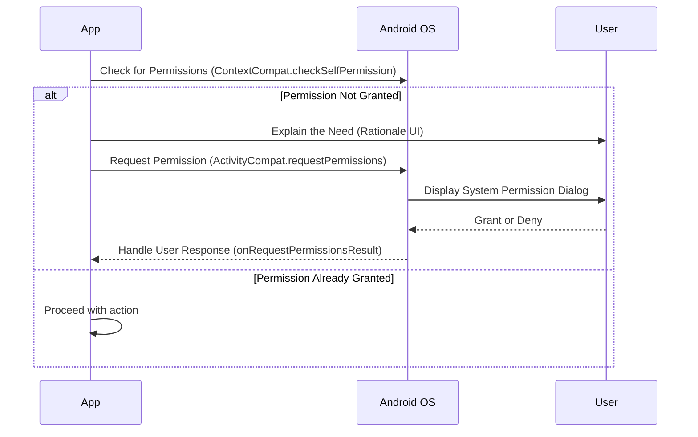

# Unit - 3
:::info[TITLE]
## Mobile App Security
:::

## 1. Introduction to Mobile App Security

Mobile Application Security is critical as smartphones house immense amounts of sensitive personal, financial, and corporate data. A robust security posture ensures data privacy and protects users from malicious entities.

### 1.1 Importance of Application Security
- **User Trust:** Securing applications is essential to maintaining user trust. A single data breach can significantly tarnish a developer's reputation, cause irreparable brand damage, and lead to a massive loss of users.
- **Personal Data Protection:** With personal data increasingly targeted by malicious entities for identity theft and financial fraud, robust security measures are absolutely crucial for protecting sensitive user information.
- **Regulatory Compliance:** International and regional regulations like **GDPR** (General Data Protection Regulation), **CCPA** (California Consumer Privacy Act), and **HIPAA** require stringent data security practices. This makes application security not just a technical necessity but a strict legal requirement.

## 2. Android Permission Model

Android is fundamentally a permission-based operating system. This means it restricts access to sensitive resources and system functionalities by default.

### 2.1 Overview of the Permission System
The Android Permission Model acts as a gateway between an application's request for sensitive user data and the user's explicit control over what that app can access.

- **Permission Declaration:** Developers must declare all the permissions their application needs in the `AndroidManifest.xml` file before the application is installed.
- **Permission Request:** At runtime, the application must explicitly request dangerous permissions, allowing users to grant or deny access to specific system features individually.
- **Permission Usage:** Applications can only execute restricted actions or access restricted data if the user has explicitly granted the required permission, giving users ultimate privacy control.

### 2.2 Types of Permissions in Android

| Permission Type | Description |
| :--- | :--- |
| **Normal** | Permissions posing little to no risk to user privacy or device operation. The system automatically grants these upon installation (e.g., internet access). |
| **Dangerous** | Permissions that grant access to sensitive data (contacts, camera, location) or control over the device. These **must** be explicitly approved by the user at runtime. |
| **Signature** | Permissions granted only if the requesting application is signed with the exact same developer certificate as the application that declared the permission. |
| **Special** | System-level permissions controlling access to particularly sensitive settings (like displaying over other apps). These are not normally available to standard third-party apps. |

### 2.3 Requesting Permissions Workflow

```mermaid
sequenceDiagram
    participant App
    participant OS as Android OS
    participant User
    
    App->>OS: Check for Permissions (ContextCompat.checkSelfPermission)
    alt Permission Not Granted
        App->>User: Explain the Need (Rationale UI)
        App->>OS: Request Permission (ActivityCompat.requestPermissions)
        OS->>User: Display System Permission Dialog
        User-->>OS: Grant or Deny
        OS-->>App: Handle User Response (onRequestPermissionsResult)
    else Permission Already Granted
        App->>App: Proceed with action
    end
```

### 2.4 Best Practices and Risk Mitigation

#### 2.4.1 Common Pitfalls
- **Overprivileged Apps:** Apps requesting far more permissions than necessary. This is a major vulnerability as they can become gateways for data breaches if the app is compromised.
- **Permission Creep:** Gradually requesting more permissions over time through updates, even when not strictly necessary for core functionality.
- **Improper Permission Checks:** Failing to explicitly check if a permission is granted before executing an action, leading to app crashes and unauthorized access attempts.

#### 2.4.2 Mitigation Strategies
- **Regular Audits:** Conduct routine code audits to ensure requested permissions still align with the app's current functionality.
- **Updating Policies:** Stay updated with the latest industry security standards and adapt permission policies to maintain regulatory compliance.
- **User Education:** Inform users via transparent, in-app messaging about *why* a permission is needed and the security implications of granting it.

#### 2.4.3 Case Studies in Permission Misuse
1. **Social Media App:** Analysis revealed excessive permission requests leading to unauthorized background data harvesting and massive privacy infringement.
2. **Flashlight App:** A simple flashlight app requested access to contacts and GPS location, illustrating severe permission misuse completely unrelated to its core functionality, eventually resulting in a data leak.
3. **Gaming App:** Permission abuse allowed a game to make unauthorized background SMS transactions, exposing sensitive payment information.

## 3. Sandboxing in Mobile Applications

### 3.1 What is Sandboxing?
Sandboxing is a core security mechanism employed to run an application in a highly restricted, isolated environment. Think of it as a "safe playground" where an app can execute without impacting other programs or accessing critical system resources.

- **Isolation:** Prevents an app from causing harm intentionally (malicious code) or accidentally (software bugs).
- **Control:** Both iOS and Android utilize strict sandbox environments to ensure apps have tightly limited access to files, data, and network exchanges.

### 3.2 How Sandboxing Works
Sandboxing relies on several operating system mechanisms:
- **Isolation:** Upon installation, the OS creates a dedicated virtual container for the app's exclusive use.
- **File System:** Each app receives a dedicated, private portion of the file system. It cannot access files belonging to other apps unless granted explicit inter-process communication permissions.
- **Process Isolation:** Apps run in their own separate OS processes. A crash in one app does not affect the stability of the entire device.
- **Resource Allocation:** The OS strictly manages CPU time, memory, and network access for each sandbox based on system constraints.
- **Security Policies & Permission Models:** The sandbox enforces access controls and requires explicit user permissions before the app can interact outside its container.

### 3.3 Benefits and Vulnerabilities
#### 3.3.1 Benefits
- Shields consumers from damaging interactions.
- Prevents rogue apps from tampering with system functions or mining data.
- Improves performance by ensuring no single app can monopolize system resources.

#### 3.3.2 Common Vulnerabilities
Despite their robustness, sandboxes are not impervious:
- **Privacy Leaks:** Flaws where sandboxed apps infer sensitive data from side-channel attacks or system interactions.
- **Inter-app Communication Flaws:** Improperly secured Intents (Android) or URL Schemes (iOS) can be hijacked.
- **Escalation of Privileges:** Exploiting kernel bugs to break out of the sandbox entirely.
- **Zero-Day Exploits:** Unknown flaws that catch even secure environments off guard.

## 4. Codesigning and App Integrity

### 4.1 What is Codesigning?
Codesigning is a digital signature technology applied to a compiled application package. It acts as a "digital shrink-wrap," mathematically guaranteeing the software's origin and integrity.

- **Trust and Authenticity:** Assures users the app comes from a verified developer and hasn't been tampered with.
- **Security:** Protects users from downloading malware disguised as legitimate apps.
- **Platform Requirements:** iOS and Android strictly enforce codesigning; devices will natively refuse to install unsigned code.

### 4.2 The Codesigning Process

```mermaid
flowchart LR
    A[Generate CA Certificate] --> B[Hash the App Code]
    B --> C[Encrypt Hash with Private Key]
    C --> D[Distribute Signed Package]
    D --> E[OS Verifies with Public Key]
```
1. **Generating a Certificate:** Obtaining a digital certificate containing a public/private key pair from a Certificate Authority (CA) or Apple/Google.
2. **Signing the Code:** Hashing the compiled code and encrypting the digest with the private key.
3. **Distribution:** Publishing the signed software.
4. **Verification:** When a user installs the app, the OS decrypts the hash using the developer's public key. If the calculated hash matches the decrypted hash, the app is authentic.

### 4.3 App Store Requirements
| Store | Requirement | Documentation Required |
| :--- | :--- | :--- |
| **Apple App Store** | iOS-specific signing with a valid Apple Developer Certificate. | Provisioning profiles, Entitlements files. |
| **Google Play Store** | Android App Bundle (AAB/APK) signed with the developer's key. | App signing by Google Play or developer's own keystore. |

### 4.4 Best Practices and Challenges
- **Key Security:** Private keys must be fiercely protected using strong passwords and Hardware Security Modules (HSMs). Loss of keys invalidates trust in the app.
- **Timestamping:** Ensures the app remains valid even after the original signing certificate expires.
- **Auditing:** Keeping detailed logs of CI/CD signing activities to detect unauthorized builds.
- **Compliance:** Staying updated with rapidly shifting platform-specific policies.

## 5. Data Encryption

Encryption is the cryptographic process of encoding plaintext data into an unreadable ciphertext format to prevent unauthorized access.

### 5.1 Why Encryption is Necessary
- **Privacy:** Ensures only the rightful owner can read sensitive data at rest or in transit.
- **Security:** Prevents massive data breaches if a device is physically stolen.
- **Data Integrity:** Prevents on-path (Man-in-the-Middle) attacks from altering data silently.
- **Authentication:** Public key infrastructure (PKI) allows users to verify they are connected to legitimate servers.

### 5.2 Types and Algorithms
- **Symmetric Encryption:** Uses a *single shared secret key* for both encryption and decryption. Highly efficient for bulk data. Examples: **AES, 3-DES, SNOW**.
- **Asymmetric Encryption:** Uses *two keys* (a public key for encryption and a private key for decryption). Foundational for TLS/SSL. Examples: **RSA, Elliptic Curve Cryptography (ECC)**.

### 5.3 Android Device Encryption
- **Full-Disk Encryption (FDE):** Supported from Android 5.0 to 9. Uses a single key (protected by the user passcode) to encrypt the entire `userdata` partition. The device cannot boot past the lock screen without the passcode.
- **File-Based Encryption (FBE):** Supported in Android 7.0 and later. Encrypts different files with different keys that can be unlocked independently. Crucially, this enables **Direct Boot**, allowing the device to boot to the lock screen and run essential background services (like alarms and accessibility) *before* the user enters their passcode.

## 6. Rooting and the APK Architecture

### 6.1 Android Rooting
Rooting is the technique of obtaining unrestricted, privileged (superuser) access to the Android system files, bypassing standard OS restrictions. It is the Android equivalent of iOS Jailbreaking.

#### 6.1.1 Benefits of Rooting
- **Complete System Control:** Delete un-removable manufacturer bloatware.
- **Custom ROMs:** Install custom operating systems to extend device lifespan or alter the UI entirely.
- **Advanced Tweaks:** Overclock/underclock the CPU, block system-wide ads, and access restricted hardware configurations.

#### 6.1.2 Disadvantages and Risks
- **Bricking:** A botched root attempt can permanently corrupt the OS, turning the phone into a "brick."
- **Warranty Void:** Manufacturers instantly void warranties upon detecting root access.
- **Catastrophic Security Issues:** Rooting intentionally breaks the Application Sandbox. If malware gains root access, it has an "open door" to silently harvest all sensitive user data, passwords, and banking credentials.

#### 6.1.3 Checking Root Status
- Presence of superuser management apps like **Kinguser**, **SuperSU**, or **Magisk**.
- Irregularities found in the kernel or build numbers under Settings > "About Phone".

### 6.2 Understanding the APK
**APK (Android Application Package)** is the standard file format used by Android for distributing and installing mobile applications. It is fundamentally a compressed ZIP archive.

#### 6.2.1 Core APK Components
- `assets/`: Directory containing raw application assets (like custom fonts or raw JSON data) that the developer explicitly bundled.
- `res/`: Directory containing resources *not* compiled into `resources.arsc`. XML layouts are converted to binary XML, and `.png` images are crunched for runtime optimization.
- `lib/`: Directory containing compiled native C/C++ libraries. It has subdirectories for different CPU architectures (ABIs like `armeabi-v7a`, `arm64-v8a`, `x86`).
- `META-INF/`: Directory containing the crucial codesigning metadata, certificate, and file manifest signatures.
- `AndroidManifest.xml`: The compiled binary XML manifest detailing the app's name, version, required permissions, and entry points.
- `classes.dex`: The actual compiled application code executed by the Dalvik/ART virtual machine in the DEX (Dalvik Executable) format. Multidex apps will have `classes2.dex`, etc.
- `resources.arsc`: A file containing heavily precompiled resources, such as localized strings, dimension values, and styling configurations.