# Unit - 1
:::info[TITLE]
## Introduction to VAPT
:::

## 1. Introduction to Vulnerability Assessment

Vulnerability Assessment (VA) is the systematic process of identifying, analyzing, and prioritizing security weaknesses (vulnerabilities) in systems, networks, applications, and cloud environments. It helps organizations discover security flaws before attackers can exploit them and provides recommendations for remediation.

Unlike penetration testing, which actively exploits vulnerabilities, Vulnerability Assessment focuses on discovering and evaluating potential weaknesses with minimal impact on the target system.

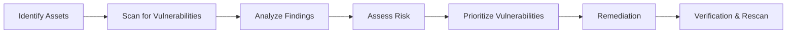

### Key Characteristics
- **Continuous and proactive** security assessment.
- Detects known vulnerabilities using databases like **CVE** and **CVSS**.
- Helps organizations reduce cyber risks and supports compliance with security standards.
- Forms the foundation of an effective **Vulnerability Management Program**.

### Vulnerability Assessment Process
| Step | Description |
|------|-------------|
| **Asset Discovery** | Identify systems, applications, databases, and network devices. |
| **Vulnerability Scanning** | Scan assets using automated tools to locate potential security weaknesses. |
| **Analysis** | Verify scan findings and eliminate false positives. |
| **Risk Assessment** | Determine severity using CVSS ratings and estimate business impact. |
| **Remediation** | Apply security patches, configuration updates, or procedural controls. |
| **Verification** | Perform rescanning to confirm vulnerabilities have been successfully resolved. |


### 1.1 Fundamentals of Vulnerability Assessment
The fundamentals of Vulnerability Assessment involve understanding what vulnerabilities are, how they occur, their impact on systems, and the methods used to manage them. Organizations perform assessments regularly because systems continuously change through software updates, new deployments, and configuration modifications.

#### 1.1.1 Definition of Vulnerability Assessment
A **Vulnerability Assessment** is the systematic process of identifying, classifying, evaluating, and reporting security vulnerabilities in information systems, networks, applications, cloud environments, and IT infrastructure. It aims to discover weaknesses before malicious attackers exploit them.

> **Exam Definition:** Vulnerability Assessment is the process of identifying, analyzing, and prioritizing security weaknesses in an information system to reduce security risks and improve the overall security posture.

- **Important Features:** Identifies known vulnerabilities; uses automated scanners and manual verification; measures severity; does not intentionally exploit flaws; produces detailed reports with remediation steps; can be performed internally or externally; supports continuous improvement.
- **Benefits:** Improves security posture; reduces attack surface; prevents cyberattacks; helps achieve regulatory compliance; protects sensitive data; supports patch management; reduces financial losses from security breaches.
- **Example:** Suppose a company runs an outdated web server with an unpatched Apache vulnerability. A vulnerability scanner identifies the outdated version, missing patches, weak SSL configuration, and enabled directory listing. The assessment report recommends updating Apache, disabling insecure configurations, and applying security patches.

#### 1.1.2 Types of Vulnerabilities
A vulnerability is a weakness in hardware, software, network infrastructure, configuration, or human processes that attackers can exploit.


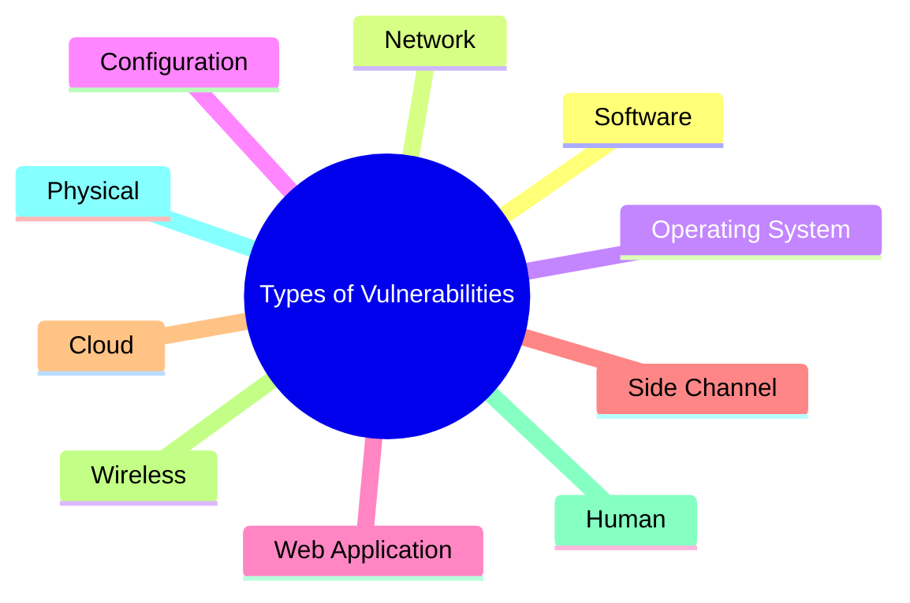

1. **Software Vulnerabilities:** Arise from programming errors, insecure coding practices, or outdated software.
   - *Examples:* Buffer Overflow, SQL Injection, Cross-Site Scripting (XSS), Remote Code Execution (RCE), Memory Corruption, Race Conditions.
2. **Network Vulnerabilities:** Weaknesses that affect communication infrastructure.
   - *Examples:* Open Ports, Weak Firewall Rules, Insecure Protocols (Telnet, HTTP), Default Network Configurations, Misconfigured Routers, Lack of Network Segmentation.
3. **Operating System Vulnerabilities:** Weaknesses present in operating systems.
   - *Examples:* Missing Security Updates, Privilege Escalation Bugs, Kernel Vulnerabilities, Weak Authentication Mechanisms, Unnecessary Services Running.
4. **Configuration Vulnerabilities:** Caused by improper security configurations.
   - *Examples:* Default Passwords, Weak Password Policies, Publicly Accessible Services, Incorrect File Permissions, Anonymous FTP Access, Disabled Security Controls.
5. **Web Application Vulnerabilities:** Common vulnerabilities affecting websites and web applications.
   - *Examples:* SQL Injection, Cross-Site Scripting (XSS), Cross-Site Request ForForgery (CSRF), Command Injection, Broken Authentication, Insecure File Upload, Server-Side Request Forgery (SSRF).
6. **Cloud Vulnerabilities:** Security weaknesses in cloud environments.
   - *Examples:* Public Cloud Storage Buckets, Excessive IAM Permissions, Weak API Security, Misconfigured Security Groups, Unencrypted Data Storage.
7. **Wireless Vulnerabilities:** Weaknesses affecting wireless communication.
   - *Examples:* Weak Wi-Fi Encryption, Rogue Access Points, Evil Twin Attacks, Weak WPA Passwords, Bluetooth Exploitation.
8. **Human Vulnerabilities:** Caused by user behavior or lack of security awareness.
   - *Examples:* Phishing, Social Engineering, Weak Passwords, Insider Threats, Sharing Credentials.
9. **Physical Vulnerabilities:** Weaknesses in physical security controls.
   - *Examples:* Unlocked Server Rooms, Unauthorized Device Access, Stolen Laptops, Lack of CCTV Monitoring, Improper Disposal of Storage Devices.

##### Vulnerability Severity Levels
- **Critical:** Immediate exploitation is possible with severe organizational impact. Fix immediately.
- **High:** Serious vulnerability requiring urgent remediation. Resolve as soon as possible.
- **Medium:** Moderate security risk with limited impact. Schedule remediation.
- **Low:** Minor vulnerability with low exploitation probability. Address during routine maintenance.
- **Informational:** Security observation with minimal or no direct risk. Monitor for future changes.

#### 1.1.3 Objectives of Vulnerability Assessment
The primary objective of Vulnerability Assessment is to identify security weaknesses before attackers exploit them and to reduce the overall security risk of an organization.

> **Primary Objectives (Slides/Exam):**
> 1. **Identify Vulnerabilities:** Discover security weaknesses ranging from critical design flaws to simple misconfigurations.
> 2. **Document Findings:** Document discovered vulnerabilities in detail so developers can easily identify and reproduce the findings.
> 3. **Remediation Guidance:** Create clear, actionable guidance to assist developers with patch application and secure configurations.

- **Identify Security Weaknesses:** Discover vulnerabilities in systems, applications, networks, cloud infrastructure, databases, and wireless setups.
- **Reduce Security Risks:** Identify and fix vulnerabilities before they become security incidents.
- **Prioritize Vulnerabilities:** Use risk ratings such as **CVSS (Common Vulnerability Scoring System)** to determine which issues require immediate attention.
- **Improve Security Posture:** Strengthen overall defenses by eliminating known weaknesses.
- **Support Patch Management:** Identify outdated software and missing patches to ensure systems remain secure.
- **Meet Regulatory Compliance:** Help organizations comply with standards like ISO 27001, PCI DSS, HIPAA, GDPR, and NIST.
- **Protect Confidential Data:** Reduce the risk of data breaches involving sensitive customer, financial, or organizational information.
- **Support Risk Management:** Provide management with detailed reports for informed security decision-making.
- **Improve Incident Prevention:** Reduce the likelihood of ransomware, malware, unauthorized access, and data theft.
- **Enable Continuous Security:** Perform regular assessments to detect newly discovered vulnerabilities and verify remediation efforts.


### Difference Between Vulnerability Assessment and Penetration Testing
| Feature | Vulnerability Assessment (VA) | Penetration Testing (PT) |
|---|---|---|
| **Objective** | Identify security vulnerabilities. | Exploit vulnerabilities to determine actual risk. |
| **Approach** | Detection and analysis. | Controlled exploitation. |
| **Testing Method** | Mostly automated. | Mostly manual with automated support. |
| **Exploitation** | Does not exploit vulnerabilities. | Actively exploits vulnerabilities. |
| **Output** | List of vulnerabilities with severity ratings. | Proof of exploitation, attack paths, and business impact. |
| **Risk** | Low operational risk. | Moderate risk due to controlled exploitation. |
| **Duration** | Usually faster. | More time-consuming. |
| **Frequency** | Performed regularly. | Performed periodically or after major changes. |
| **Skill Requirement** | Moderate technical expertise. | Advanced security and ethical hacking skills. |
| **Goal** | Reduce the attack surface. | Assess the effectiveness of security defenses. |


### 1.2 Vulnerability Assessment Process
The Vulnerability Assessment Process is a structured methodology used to identify, evaluate, prioritize, and remediate security weaknesses in an organization's IT infrastructure.

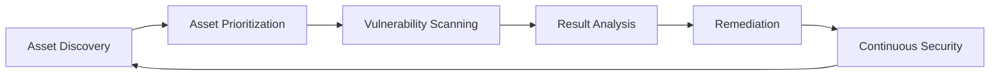

#### Phases of the Vulnerability Assessment Process
- **Asset Discovery:** Identify all IT assets (Servers, Workstations, Laptops, Mobile Devices, Routers, IoT, Cloud, Databases, Apps, APIs) that require assessment.
- **Asset Prioritization:** Rank assets according to business value, data sensitivity, exposure to the internet, compliance needs, hosted services, recovery time objective (RTO), and financial impact.
- **Vulnerability Scanning:** Detect known vulnerabilities using automated or manual techniques.
- **Result Analysis:** Validate findings, eliminate false positives, and assess their severity.
- **Remediation:** Eliminate or reduce identified vulnerabilities.
- **Continuous Security:** Continuously monitor and reassess the environment.

#### 1.2.1 Asset Discovery Methods
- **Active Discovery:** Directly interacts with network hosts (e.g., via network/port scanning, service enumeration, SNMP queries, ICMP ping sweeps).
  - *Advantages:* Highly accurate asset identification; provides detailed configurations; detects live systems.
  - *Disadvantages:* Generates network traffic; may trigger security alerts or firewall blocks.
- **Passive Discovery:** Monitors network traffic non-intrusively without sending packets (e.g., via traffic analysis, packet captures, log analysis, network sensors).
  - *Advantages:* Zero impact on production systems; hidden from hosts; suitable for sensitive industrial environments.
  - *Disadvantages:* Slower discovery process; may miss inactive devices.
- **Information Collected:** IP address, hostname, MAC address, operating system, running services, open ports, installed software, device type, owner, and business function.
- **Benefits:** Complete asset inventory, improved network visibility, better security monitoring, and a reduced attack surface.

#### 1.2.2 Asset Prioritization
Asset Prioritization ranks assets based on their business value and impact if compromised.

| Priority | Description | Example Target | Reason |
|---|---|---|---|
| **Critical** | Business-critical systems requiring immediate protection. | Domain Controller / DB Server | Controls user access / stores sensitive business data. |
| **High** | Important systems supporting essential operations. | Web Server | Public-facing business application. |
| **Medium** | Standard operational systems with moderate impact. | Employee Laptop | Limited organizational impact. |
| **Low** | Non-critical systems with limited business impact. | Test Machine | Used only for development or testing. |

- **Benefits:** Efficient resource allocation, faster remediation of high-risk systems, and improved risk management.

#### 1.2.3 Vulnerability Scanning
Vulnerability Scanning automatically detects known security weaknesses in systems, applications, and networks.

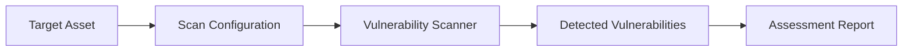

##### Types of Vulnerability Scans
1. **Network Scan:** Scans network devices and services to check open ports, running services, weak configurations, and protocol weaknesses.
2. **Host-Based Scan:** Examines individual systems for missing patches, outdated software, weak password policies, and OS vulnerabilities.
3. **Web Application Scan:** Identifies application-layer flaws such as SQL Injection, Cross-Site Scripting (XSS), CSRF, File Inclusion, and authentication issues.
4. **Database Scan:** Checks database security for weak accounts, default credentials, excessive permissions, and missing updates.
5. **Cloud Security Scan:** Examines cloud infrastructure for public storage buckets, weak IAM policies, misconfigured security groups, and unencrypted resources.

##### Authenticated vs. Unauthenticated Scans
- **Authenticated Scan:** Logs in using valid system credentials to perform a deep local assessment.
  - *Pros:* High accuracy, low false-positive rate, detailed configurations, and local patch verification.
  - *Cons:* Requires managing scan credentials.
- **Unauthenticated Scan:** Scans from the network perspective without login credentials.
  - *Pros:* Mimics an external attacker's view; identifies open ports and perimeter firewalls.
  - *Cons:* Higher false-positive rates; cannot inspect internal system files or configurations.

- **Scan Engine Architecture:** Comprises a *Scan Engine* (executes checks), a *Plugin Database* (library of signature checks), and a *Feed Update Service* (regularly downloads new signatures).
- **Advantages:** Fast detection; large-scale assessment; consistent results; supports regular security monitoring.
- **Limitations:** Produces false positives/negatives; detects only known vulnerabilities; cannot fully assess custom business logic.

#### 1.2.4 Result Analysis
Result analysis verifies and prioritizes scan findings to remove false positives, determine exploitability, evaluate business impact, and assign severity ratings.
- **Risk Factors:** CVSS score, ease of exploitation, asset importance, data sensitivity, internet exposure, and availability of exploits.
- **Severity Actions:** Fix **Critical** bugs immediately; resolve **High** bugs as soon as possible; schedule **Medium** fixes; address **Low** issues during routine maintenance; monitor **Informational** items.

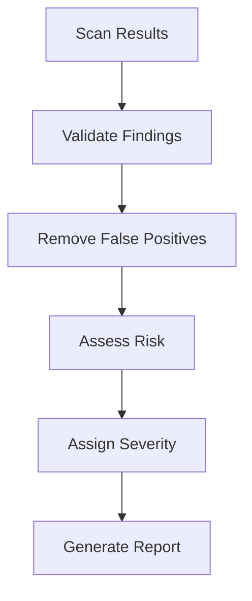

#### 1.2.5 Remediation
Remediation is the process of eliminating or reducing identified vulnerabilities to an acceptable level of risk.
- **Common Techniques:**
  - **Patch Management:** Install vendor-released security updates.
  - **Configuration Hardening:** Disable unnecessary services, close unused ports, and remove default accounts.
  - **Software Upgrade:** Replace vulnerable legacy systems with secure, supported versions.
  - **Network Security Controls:** Deploy firewalls, IDS/IPS, network segmentation, and VPNs.
  - **Access Control Improvements:** Enable Multi-Factor Authentication (MFA), least privilege, and review user permissions.
  - **Security Awareness:** Educate users about phishing, password strength, social engineering, and safe browsing.
- **Verification:** Perform rescanning, confirm vulnerabilities are fixed, update security documentation, and close remediation tickets.

#### 1.2.6 Continuous Security
Cyber threats continuously evolve, making vulnerability assessment an ongoing process rather than a one-time activity.

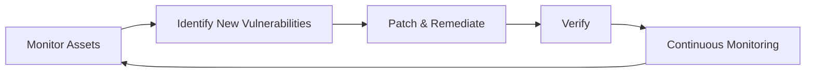

- **Continuous Security Activities:** Continuous asset monitoring, scheduled vulnerability scans, log analysis, threat intelligence integration, SIEM monitoring, compliance audits, and security awareness training.
- **Benefits:** Early detection, reduced attack surface, faster incident response, better compliance, and improved security posture.
- **Best Practices:** Maintain an up-to-date asset inventory; prioritize high-value assets; run authenticated scans; validate findings; remediate critical issues promptly; verify fixes through rescanning; continuously monitor and document findings.


## 2. Penetration Testing

Penetration Testing (PT), also known as **Ethical Hacking**, is a controlled and authorized cybersecurity assessment in which professionals simulate real-world cyberattacks to identify and exploit vulnerabilities. It demonstrates how attackers can compromise systems and evaluates the actual business impact.

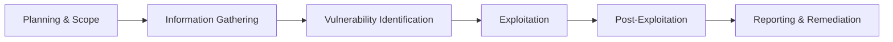

- **Key Characteristics:** Conducted with written authorization; simulates real attacker behaviors (TTPs); identifies exploitable vulnerabilities; demonstrates business impact; combines automated tools with manual testing; provides technical and executive reports.
- **Goals:** Identify exploitable weaknesses, evaluate security controls, measure the impact of successful attacks, verify vulnerability scanner findings, improve security posture, and meet regulatory requirements.

### 2.1 Introduction to Penetration Testing
Penetration Testing proactively mimics malicious attacker techniques to safely exploit vulnerabilities before they are discovered by real attackers.

> **Exam Definition:** Penetration Testing is an authorized and controlled process of simulating cyberattacks to identify and exploit security vulnerabilities in order to evaluate the security of an information system.

- **Benefits:** Identifies critical security weaknesses, validates controls, reduces attack risks, improves incident response, helps achieve compliance, and protects sensitive data.
- **Example:** A web application has a SQL Injection vulnerability. A Vulnerability Assessment reports its presence. A Penetration Tester successfully exploits it to retrieve customer records, proving the vulnerability is exploitable and demonstrating its real-world impact.
- **Major Purposes:**
  1. **Identify Exploitable Vulnerabilities:** Locate weaknesses attackers can actively compromise.
  2. **Evaluate Security Controls:** Assess firewalls, IDS/IPS, endpoint protection, access controls, and monitoring systems.
  3. **Simulate Real-World Attacks:** Mimic attacker techniques to test detection and response capabilities.
  4. **Measure Business Impact:** Determine how a successful exploit affects confidentiality, integrity, availability, operations, and reputation.
  5. **Verify Scan Results:** Confirm if scanner findings are exploitable to prioritize remediation.
  6. **Improve Incident Response:** Test the ability to detect, contain, and recover from cyberattacks.
  7. **Meet Compliance:** Maintain compliance with PCI DSS, ISO 27001, HIPAA, NIST, and GDPR.
  8. **Enhance Overall Security:** Provide actionable, prioritized recommendations to harden systems.

#### 2.1.3 Difference Between VA and PT Workflow
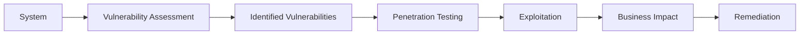

- **When to Use VA:** Routine checks, patch management, compliance scanning, large-scale sweeps, and continuous vulnerability management.
- **When to Use PT:** Before deploying critical applications, after major infrastructure changes, following security incidents, to validate remediation, and to test security controls.
- **Advantages of Combining (VAPT):** Comprehensive evaluation, better prioritization, validation of scanner findings, reduced false positives, and improved risk management.
- **Real-World VAPT Example:** A financial institution performs a VA and discovers outdated server software, weak TLS configuration, SQL injection, and missing patches. A Penetration Tester then exploits the SQL Injection, retrieves customer data, escalates privileges to admin, demonstrates the financial impact, and provides remediation recommendations.


### 2.2 Types of Penetration Testing
Penetration testing types are classified based on the amount of information provided to the tester before the assessment.

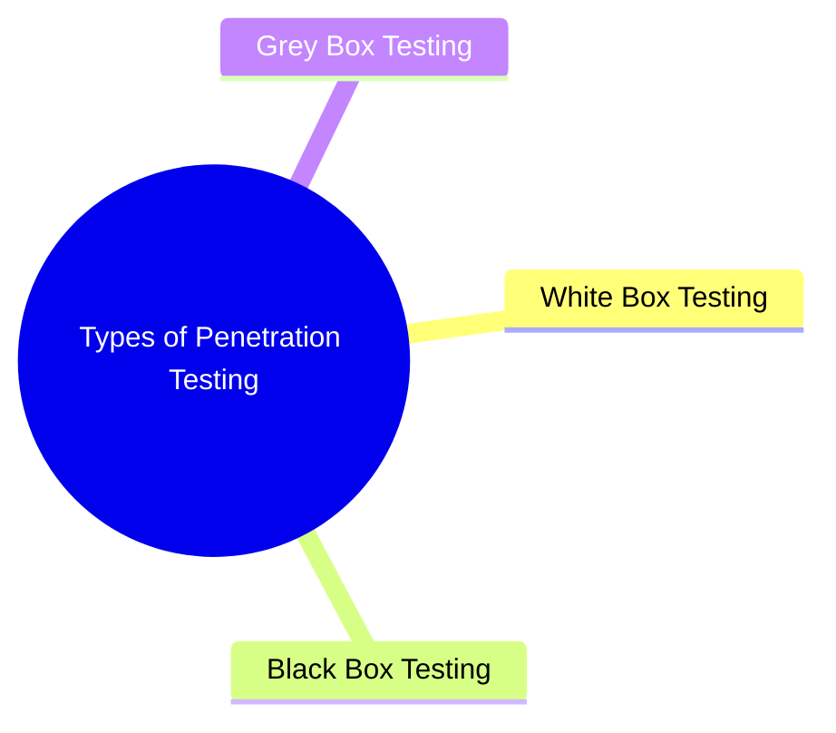

#### 2.2.1 White Box Testing (Clear/Glass Box)
Tester has complete knowledge of the target environment before testing begins.
- *Information Provided:* Source code, network diagrams, system architecture, user accounts, and credentials.
- *Characteristics:* Full system access; faster testing process; focuses on identifying hidden code flaws; simulates insider threats.
- *Advantages:* Comprehensive assessment, deep code/config review, covers internal and external issues.
- *Disadvantages:* Does not simulate a real external attacker, requires extensive documentation.
- *Example:* A company provides a tester with full network diagrams, admin credentials, and the web application source code to perform a detailed security assessment.

#### 2.2.2 Black Box Testing
Tester has no prior knowledge of the target system and must gather all information from scratch.
- *Information Provided:* Only target domain or IP scope and Rules of Engagement (RoE).
- *Characteristics:* Starts with reconnaissance; simulates external attackers; tests perimeter defenses.
- *Advantages:* Realistic attack simulation; tests detection and response controls.
- *Disadvantages:* Time-consuming; limited visibility into internal network structures.


- *Example:* A consultant is given only the public website URL and attempts to compromise the system using public intelligence.

#### 2.2.3 Grey Box Testing (Translucent Box)
Tester has partial knowledge of the target system (e.g., limited user credentials, basic network maps).
- *Characteristics:* Simulates authenticated users, contractors, or external attackers who have breached the perimeter.
- *Advantages:* Balanced testing approach, faster than Black Box, evaluates internal access controls.
- *Disadvantages:* Coverage depends on the information provided, may miss hidden architecture issues.
- *Example:* A tester receives employee-level login credentials and tests if they can perform privilege escalation or lateral movement.

##### Comparison of Testing Methodologies
| Feature | White Box | Black Box | Grey Box |
|---|---|---|---|
| **Knowledge of Target** | Complete | None | Partial |
| **Access to Source Code** | Yes | No | Limited |
| **Credentials Provided** | Full | None | Limited |
| **Testing Speed** | Fast | Slow | Moderate |
| **Simulates Attacker** | Trusted Insider | External Attacker | Compromised Account / Insider |
| **Coverage** | Highest | Moderate | High |
| **Cost** | Lower | Higher | Moderate |


### 2.3 Penetration Testing Approaches
Penetration testing approaches are classified based on where the attack originates.

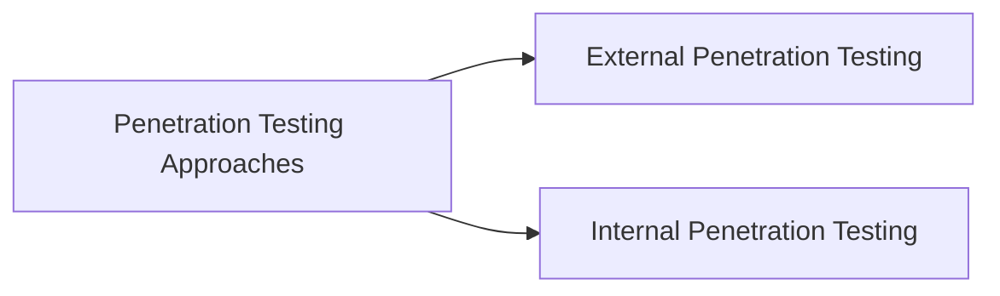

- **External Penetration Testing:** Targets assets exposed to the internet (Websites, VPN Gateways, Email Servers, DNS, Cloud Services, APIs, Firewalls).
  - *Activities:* Reconnaissance, port scanning, service enumeration, exploitation, web application testing.
  - *Advantages:* Simulates internet-based attackers; tests perimeter and firewall controls.
  - *Limitations:* Cannot assess internal configurations directly.
  - *Example:* An ethical hacker attacks a public VPN gateway and web application from a remote location.
- **Internal Penetration Testing:** Evaluates security after an attacker has already bypassed perimeter defenses or acts as an insider.
  - *Targets:* Active Directory, Domain Controllers, Database Servers, File Shares, Internal APIs, Workstations.
  - *Activities:* Privilege escalation, lateral movement, network sniffing, AD enumeration, sensitive data access.
  - *Advantages:* Identifies insider threats; evaluates network segmentation and internal patch levels.
  - *Limitations:* Requires physical or remote internal access.
  - *Example:* A tester connects a laptop to an internal office ethernet jack and attempts to gain Domain Admin privileges.

#### External vs. Internal Comparison
| Feature | External Testing | Internal Testing |
|---|---|---|
| **Attack Origin** | Outside the organization | Inside the internal network |
| **Simulates** | External attackers | Insider threats, rogue employees, perimeter breaches |
| **Focus** | Perimeter firewalls, public services | Internal segmentation, Active Directory, internal servers |
| **Common Targets**| Web apps, VPN gateways, mail servers | Domain Controllers, Databases, Workstations |


### 2.4 Roles and Responsibilities of Penetration Testers
A Penetration Tester (Ethical Hacker) is responsible for identifying, validating, and exploiting security vulnerabilities under authorization to improve security.

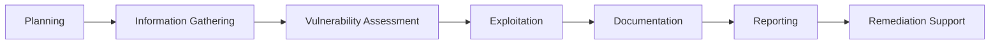

- **Primary Responsibilities:** Define scope and RoE; perform reconnaissance; identify and exploit weaknesses; document technical steps; respect privacy; maintain data confidentiality; write technical/executive reports; provide remediation support.

#### 2.4.1 Information Gathering (Reconnaissance)
Reconnaissance is the first stage of penetration testing.
- **Passive Recon:** Collecting info without directly contacting target hosts.
  - *Examples:* WHOIS lookups, DNS enumeration via public records, Shodan queries, social media analysis, search engine dorks, public GitHub repos.
  - *Pros:* Difficult to detect; zero target impact.
- **Active Recon:** Gathering info by directly sending packets to target systems.
  - *Examples:* Port scanning, service banner grabbing, OS detection, network routing sweeps.
  - *Pros:* Provides detailed configuration details; discovers live hosts.
- **Information Collected:** IP ranges, subdomains, open ports, running services, OS versions, employee emails, and software stacks.

#### 2.4.2 Ethical Responsibilities
- **Obtain Written Authorization:** Never test without a signed contract and authorization letter.
- **Follow the Scope:** Test only the systems and IP ranges defined in the RoE.
- **Avoid Damage:** Avoid disrupting services, causing DDoS, or corrupting production databases.
- **Professional Integrity:** Report all findings accurately without exaggeration or concealment.
- **Comply with Laws:** Ensure compliance with regional cybersecurity laws and regulations.
- **Respect Privacy:** Access only the data necessary to demonstrate the exploit; do not download PII.

#### 2.4.3 Confidentiality
Testers must protect the sensitive data they access during assessments (credentials, source code, database files, and network maps).
- *Confidentiality Practices:* Sign Non-Disclosure Agreements (NDAs); encrypt sensitive files and reports; restrict access to authorized team members; securely delete testing artifacts after project completion.

#### 2.4.4 Documentation
Documentation involves recording every activity, tool output, and command run during the assessment.
- *Information to Document:* Scope boundaries, tools used, exact commands, vulnerability evidence (screenshots/payloads), and replication steps.
- *Benefits:* Simplifies report writing, proves findings are reproducible, and provides legal evidence.

#### 2.4.5 Reporting
Reporting is the final stage of a penetration test, translating findings into actionable recommendations.

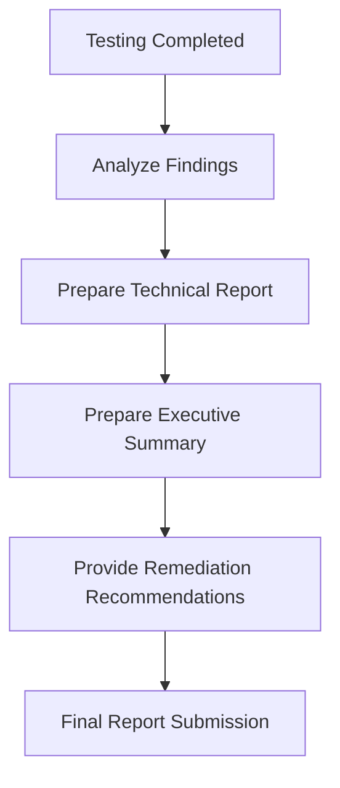

- **Report Components:**
  1. **Executive Summary:** High-level overview of objectives, overall security posture, key findings, business impact, and risk levels.
  2. **Technical Details:** Technical description, affected hosts, exact exploit proof of concept (PoC), and CVSS rating for each vulnerability.
  3. **Risk Assessment:** Categories (Critical, High, Medium, Low).
  4. **Remediation Recommendations:** Specific guidance to apply patches, harden configurations, or restrict privileges.
  5. **Conclusion:** High-level security trajectory.

##### Skills Required for a Penetration Tester
| Technical Skills | Professional Skills |
|---|---|
| Networking protocols, Operating Systems (Linux/Windows) | Clear communication, report writing |
| Web Application Security, Programming (Python, Ruby, Bash) | Problem-solving, critical thinking |
| Cryptography, Vulnerability Scanning, Exploitation | Strict ethics, time management, teamwork |


### 2.5 Penetration Testing Techniques
Organizations use a hybrid approach that balances automated speed with manual depth.

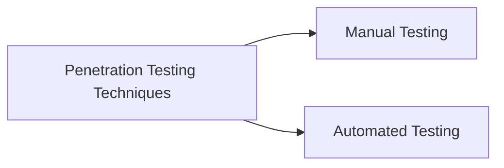

- **Manual Penetration Testing:** Done by human testers to identify complex logical flaws, verify findings, and perform exploitation.
  - *Pros:* Detects complex logic flaws; removes false positives; evaluates custom code paths.
  - *Cons:* Time-consuming; expensive; highly dependent on tester skill.
  - *Example:* A tester manually alters parameters to discover an IDOR vulnerability that scanners missed.
- **Automated Penetration Testing:** Uses software tools to quickly scan systems for known vulnerability signatures.
  - *Pros:* Fast; covers large networks; repeatable; cost-effective.
  - *Cons:* High false-positive rate; cannot assess custom business logic.
  - *Common Tools:* Nmap (ports), Nessus (vulnerabilities), OpenVAS (vulnerability scanning), OWASP ZAP (web scanning), Nikto (web server checks).

##### Manual vs. Automated Comparison
| Feature | Manual Testing | Automated Testing |
|---|---|---|
| **Performed By** | Human Security Professional | Scanning Software / Scripts |
| **Speed** | Slow (days to weeks) | Fast (minutes to hours) |
| **Accuracy** | High (false positives verified) | Moderate (prone to false positives) |
| **Business Logic** | Excellent analysis | Limited or none |
| **Best For** | Deep application assessments | Regular infrastructure reviews |

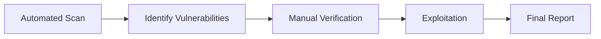

> **Exam Point:** Automated testing provides speed and scalability, while manual testing provides accuracy and logical depth. A hybrid approach yields the most reliable security validation.


### 2.6 Importance of Penetration Testing
Penetration testing validates controls, protects assets, manages brand reputation, and reduces operational risks.

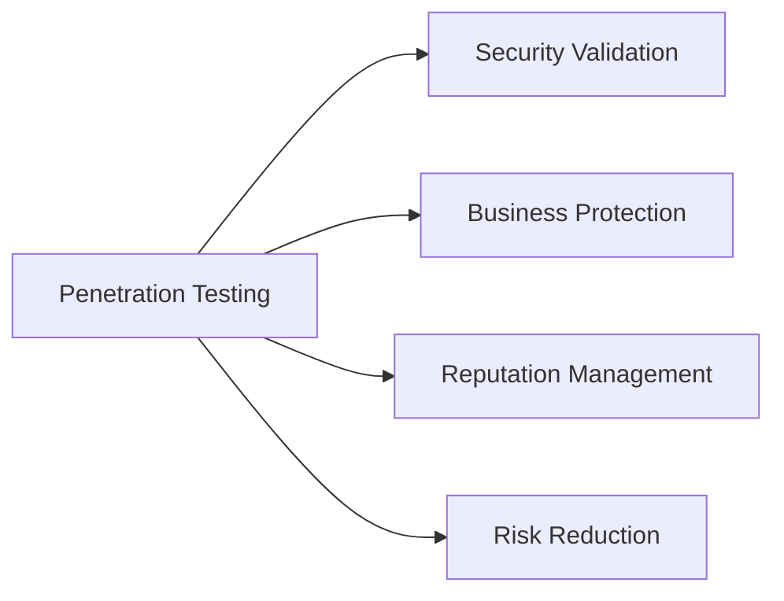

- **Security Validation:** Confirms firewalls, IDS/IPS, and endpoint protection block attacks; validates patch applications. *Example:* Verifying that firewalls block unauthorized ports.
- **Business Protection:** Secures financial records, IP, customer data, and server uptime. *Example:* Spotting a database flaw before client records are breached.
- **Reputation Management:** Prevents data leaks that cause customer churn, brand damage, or public relations crises. *Example:* Avoiding public breach disclosures by patching preemptively.
- **Risk Reduction:** Identifies operational, financial, and compliance risks to reduce the organization's attack surface.

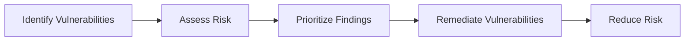
- *Example Scenarios:* Remediation of a critical Remote Code Execution (RCE) vulnerability before exploitation prevents total server compromise.
- **Exam Point:** Penetration testing is critical because it proactively validates controls, protects business assets, maintains reputation, and mitigates risks before real attacks occur.


### 2.7 Cybersecurity Myths and Realities
| Myth | Reality |
|------|---------|
| **"I have a firewall, so I'm safe."** | Firewalls can be bypassed or misconfigured. Attacking web apps or using social engineering bypasses firewalls. |
| **"My data isn't worth hacking."** | All data has value. Attackers seek personal info for identity theft, fraud, or ransomware payouts. |
| **"I use HTTPS, so my site is secure."** | HTTPS only encrypts data in transit. It does not prevent SQLi, XSS, or logic flaws on the server. |
| **"SMEs are safe from attacks."** | SMEs are easy targets because they have smaller security budgets. Ransomware frequently targets SMEs. |
| **"Fake SSL certificates are harmless."** | Invalid or self-signed certificates expose users to Man-in-the-Middle (MitM) attacks. |


## 3. Vulnerability Assessment and Penetration Testing (VAPT)

VAPT is a comprehensive security methodology that integrates the breadth of Vulnerability Assessment with the depth of Penetration Testing to locate, validate, and remediate security flaws.

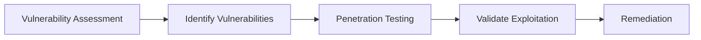

### 3.1 Introduction and Need
- **VAPT Components:** VA (scan to identify weaknesses) and PT (exploit to demonstrate impact).
- **Objectives:** Discover vulnerabilities, validate existing security controls, prioritize risks, and guide remediation.
- **Why VAPT is Needed:** Outpaces active threat landscapes; prevents data breaches, malware, and ransomware; meets compliance audits (PCI, ISO); validates defensive security investments.
- **Benefits:**
  - *Technical:* Detects system/application bugs, identifies misconfigurations, and validates patches.
  - *Business:* Protects customer data, prevents financial losses, and builds stakeholder trust.
  - *Security:* Minimizes attack surface, improves threat response, and hardens configuration controls.


### 3.2 VAPT Methodology
A standard VAPT engagement follows five sequential phases:

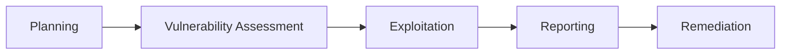

1. **Planning:** Define scope, target assets, testing schedules, and obtain written authorization and the Rules of Engagement (RoE).
   - *Deliverables:* Scope Document, Testing Plan, Authorization Letter.
2. **Vulnerability Assessment:** Perform asset discovery, port scanning, service enumeration, and automated vulnerability scanning to generate a severity-rated list of weaknesses.
   - *Output:* Comprehensive scan reports, validated asset list.
3. **Exploitation:** Safely exploit identified vulnerabilities to verify they are real flaws, escalate privileges, and establish lateral movement.
   - *Outcome:* Proof of Concept (PoC) exploit steps, validation of actual impact.
4. **Reporting:** Write technical and executive summaries detailing the vulnerabilities, exploit evidence, risk levels, and specific remediation advice.
   - *Report Features:* Clear, evidence-based, actionable, and prioritized.
5. **Remediation:** Apply vendor patches, harden configurations, close unused ports, update software, and perform **rescanning** to verify that fixes are successful.

> **Exam Point:** VAPT combines automated detection with manual exploitation to locate vulnerabilities, prove their severity, and implement remediation to reduce security risks.


## 4. Security Audit Framework

A **Security Audit** is a formal, structured evaluation of an organization's security policies, system configurations, operational processes, and compliance controls against defined standards.

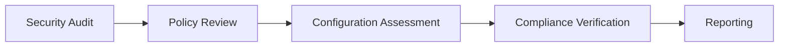

### 4.1 Audits vs. VAPT
- **Security Audit Definition:** A formal review to ensure that security policies, standards, and regulatory compliance are properly met and enforced.
- **VAPT vs. Auditing:** VAPT is a technical search for exploit paths, while a Security Audit verifies administrative controls, policy adherence, and compliance status.
- **Audit Objectives:** Identify policy/governance gaps, check control configurations, verify regulatory compliance, and improve risk governance.
- **Audit Steps:** 1. Planning -> 2. Data Collection -> 3. Security Assessment -> 4. Findings Analysis -> 5. Report Writing -> 6. Corrective Action Follow-up.

```mermaid
flowchart LR
  A[Planning] --> B[Information Collection] --> C[Assessment] --> D[Analysis] --> E[Reporting] --> F[Follow-up]
```

### 4.2 Security Audit Components
1. **Policy Review:** Reviews Information Security Policies, Password Policies, Access Control, Incident Response, Backup, and Acceptable Use procedures to check compliance and alignment.
2. **Configuration Assessment:** Inspects servers, routers, firewalls, and databases for default passwords, unpatched systems, open services, and incorrect file permissions.
3. **Compliance Verification:** Checks systems against regulatory and industry frameworks:
   - *ISO/IEC 27001:* Details requirements for establishing an Information Security Management System (ISMS).
   - *PCI DSS:* Focuses on securing credit card transactions and cardholder data storage.
   - *HIPAA:* Mandates protection of healthcare data and privacy.
   - *GDPR:* Regulates user data privacy and transfer rights.
   - *NIST Framework:* Provides security controls for government and enterprise assets.
4. **Reporting and Risk Levels:** The audit report logs findings, compliance status, and recommendations. Findings are ranked by risk: **Critical** (Immediate action), **High** (Serious issue), **Medium** (Moderate risk), **Low** (Minor issue), and **Informational** (Observation).

> **Exam Point:** A Security Audit evaluates policies, device configurations, and regulatory compliance to check the overall effectiveness of administrative and technical security controls.


## 5. Web Application Proxies & HTTP/HTTPS Security

A Web Application Proxy is an intermediary tool that sits between the browser (client) and the web server. It intercepts, monitors, and modifies HTTP/HTTPS messages in real-time.

```mermaid
flowchart LR
  A[Browser] --> B[Web Proxy] --> C[Web Server]
```

### 5.1 Web Proxy Fundamentals
- **Primary Functions:** Traffic interception, request/response monitoring, HTTP message modification, and automated security fuzzing.
- **Popular Proxy Tools:** Burp Suite, OWASP ZAP, Fiddler, Charles Proxy.
- **Proxy Interception Details:**
  - *Requests:* Testers view and modify URLs, parameters, cookies, headers, and authentication tokens before they reach the server.
  - *Responses:* Testers view status codes, cookie settings, custom headers, error messages, and server info returned by the server.

```mermaid
flowchart LR
  A[Request] --> B[Proxy] --> C[Modify / Analyze] --> D[Server]
  D --> E[Response] --> B --> F[Analyze Response]
```

### 5.2 Common Uses of Web Proxies
- **Traffic Analysis:** Monitor endpoints, parameters, API calls, and cookie exchanges to map app structure.
- **Request Modification:** Alter request parameters, headers, or cookies to test authorization and bypass client-side validation.
  - *Example:* Changing a request body from `role=user` to `role=admin` to test access controls.
- **Response Analysis:** Scan server responses for data leaks, error messages, and missing headers.
  - *Important Response Headers:* `Content-Security-Policy` (CSP), `X-Frame-Options` (Clickjacking protection), `X-Content-Type-Options` (MIME sniffing block), `Strict-Transport-Security` (HSTS).
- **Security Testing:** Execute targeted SQLi, XSS, CSRF, and authentication brute-force testing.


### 5.3 HTTP/HTTPS & Session Security
Understanding protocol headers and cryptographic key exchanges is vital for using web proxies.

#### 5.3.1 HTTP Request Methods
- **OPTIONS:** Returns the allowed HTTP methods and communication headers supported by the target resource.
- **TRACE:** Initiates an echo back of the received request, allowing clients to see what intermediate proxies modified.
- **CONNECT:** Establishes a tunnel to the target server (often used to negotiate SSL/TLS through proxies).
- **DELETE:** Deletes the specified resource on the server.
- **PATCH:** Applies partial modifications to a resource (unlike `PUT`, which replaces the entire resource).

#### 5.3.2 HTTP Header Fields
- **Server Response Headers:** Sent by the server to provide metadata (e.g., `Server`, `WWW-Authenticate`, `Set-Cookie`).
- **Entity Headers:** Define metadata about the entity body (e.g., `Content-Type`, `Content-Length`, `Last-Modified`).

#### 5.3.3 HTTP vs. HTTPS & Key Exchange
- **HTTP (Plaintext Risk):** Sends traffic in cleartext, exposing it to packet sniffing and tampering.
- **HTTPS (Secure):** Uses SSL/TLS to encrypt communication.
- **Cryptographic Key Exchange:** During the TLS handshake, the client and server verify identity using asymmetric cryptography (public and private keys). They negotiate and derive a symmetric **session key** used to encrypt all application traffic, protecting it from interception.

#### 5.3.4 Cookies & Session Management
HTTP is stateless. Session tracking keeps users authenticated across requests:
- **Cookie:** A small key-value file sent by the server and stored locally by the user's browser.
- **Session:** Server-side data store tracking user actions, mapped to a unique session token.
- **Persistent Cookie:** Saved on the client disk to retain login status or preferences after the browser closes.
- **Secure Cookie Flag:** Instructs the browser to only transmit the cookie over encrypted HTTPS channels.
- **HttpOnly Cookie Flag:** Prevents client-side scripts (JavaScript) from accessing the cookie, mitigating XSS session theft.


## 6. Burp Suite

Burp Suite is the industry-standard platform for web application security assessments, providing manual and automated tools to audit HTTP/HTTPS traffic.

```mermaid
flowchart LR
  A[Browser] --> B[Burp Suite] --> C[Web Application]
```

### 6.1 Burp Suite Fundamentals
- **Key Features:** Intercepts traffic, modifies requests, scans for vulnerabilities, analyzes session strength, decodes encodings, and compares responses.
- **Editions:**
  - *Community Edition:* Free; manual testing tools (Proxy, Repeater, Decoder, Comparer).
  - *Professional Edition:* Paid; includes automated scanner, advanced tools, and unrestricted Intruder speeds.
  - *Enterprise Edition:* Large-scale scanning, continuous automation, and centralized management.
- **Main Interface Tabs:**
```mermaid
flowchart LR
  A[Dashboard] --> B[Target] --> C[Proxy] --> D[Repeater]
  A --> E[Intruder] --> F[Decoder] --> G[Comparer] --> H[Sequencer]
```


### 6.2 Burp Suite Components
- **Proxy:** Intercepts and modifies HTTP requests and responses in real-time. Sitting between the browser and server, it is the core of Burp Suite's workflow.
- **Target:** Builds a site map, outlines application structure, manages test scope, and displays discovered endpoints.
- **Repeater:** Manually alters and replays single HTTP requests, displaying responses side-by-side to verify flaws.
- **Intruder:** Automates customized web attacks (fuzzing inputs, brute-forcing login forms) using payloads.
  - *Sniper:* Tests one position at a time using a single list of payloads.
  - *Battering Ram:* Places the same payload into all defined positions simultaneously.
  - *Pitchfork:* Uses multiple lists, placing the first item of List A in position 1, and the first item of List B in position 2.
  - *Cluster Bomb:* Iterates through all combinations of multiple lists (ideal for username/password pairs).
- **Decoder:** Encodes/decodes data into formats like URL, Base64, Hex, HTML, and Binary to analyze values or write payloads.
- **Comparer:** Performs a word-by-word or byte-by-byte visual diff between two requests or responses.
- **Sequencer:** Analyzes the entropy and statistical randomness of session tokens to determine guessability.

```mermaid
flowchart LR
  A[Session Tokens] --> B[Sequencer Analysis] --> C[Entropy Test] --> D[Randomness Report]
```

> **Exam Point:** Burp Suite is a web application security platform that provides Proxy, Target, Repeater, Intruder, Decoder, Comparer, and Sequencer modules to intercept and analyze web application traffic.


## 7. Metasploit Framework (MSF)

The Metasploit Framework is an open-source penetration testing platform used to scan network services, validate vulnerabilities, develop exploits, and manage post-exploitation activities.

```mermaid
flowchart LR
  A[Vulnerability] --> B[Exploit] --> C[Payload] --> D[Access] --> E[Post Exploitation]
```

### 7.1 Metasploit Fundamentals
- **Uses:** Vulnerability validation, penetration testing, exploit development, and post-exploitation.
- **Key Features:** Large exploit database, multiple payload configurations, encoders, and automated scans.
- **Architecture:** Consists of modular components:
```mermaid
flowchart TD
  A[Metasploit Framework] --> B[Exploits] --> C[Payloads] --> D[Auxiliary Modules] --> E[Encoders] --> F[Post Modules]
```

### 7.2 Metasploit Components
- **Modules:** Individual programs written to perform specific tasks.
- **Exploits:** Modules that leverage a vulnerability to execute arbitrary code or payloads on a target.
- **Payloads:** The code executed on the target after a successful exploit.
  - *Singles:* Self-contained, single-step payloads that execute a specific command (e.g., add user).
  - *Stagers:* Small payloads that establish a connection back to the attacker and download the larger stage.
  - *Stages:* Larger payloads containing full features loaded after the stager (e.g., Meterpreter).
  - *Examples:* Meterpreter (interactive DLL-based shell), Reverse Shell, Bind Shell.
- **Auxiliary:** Modules that perform scans, service scans, banner grabs, and fuzzing without exploiting or using payloads.
- **Encoders:** Obfuscate payloads to evade signature-based antivirus and IDS/IPS detection.
- **Post-Exploitation:** Run actions after gaining target access (gather system info, dump hashes, escalate privileges).


### 7.3 Metasploit Installation & Commands

#### Windows Installation
1. Download the official Metasploit installer from Rapid7.
2. Run the installer as Administrator, follow default prompts, and choose the target directory (e.g., `C:\metasploit`).
3. Complete setup and launch the console from the command prompt:
```powershell
msfconsole
```

#### Linux Installation
- **Kali Linux:** Metasploit is pre-installed. Run `msfconsole` to verify.
- **Ubuntu/Debian Installation:**
```bash
curl https://raw.githubusercontent.com/rapid7/metasploit-framework/master/msfinstall -o msfinstall
chmod +x msfinstall
sudo ./msfinstall
```

#### Verification & CLI Navigation
Check that the installation works and print its version:
```bash
msfconsole --version
```
Launch the console to enter the interactive prompt:
```bash
msfconsole

# Expected Prompt: 
msf6 ❯
```

##### Core Console Commands
- `help`: Display help documentation and command options.
- `search <keyword>`: Query the database for exploits, auxiliary modules, or payloads matching a keyword.
- `use <module_name>`: Load a specific exploit, auxiliary, or post module.
- `show options`: List required variables (RHOSTS, LPORT, etc.) for the current module.
- `run` / `exploit`: Execute the current module.
- `exit`: Close the console.

> **Exam Point:** The Metasploit Framework is a modular penetration testing platform that uses exploits, payloads, auxiliary modules, encoders, and post-exploitation modules to scan, validate, and compromise remote assets.
