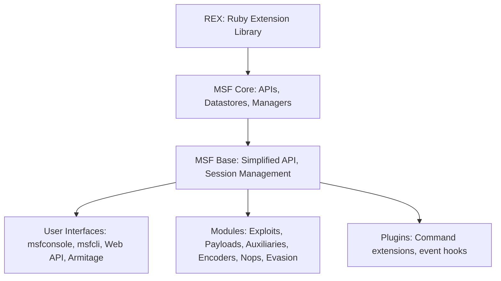
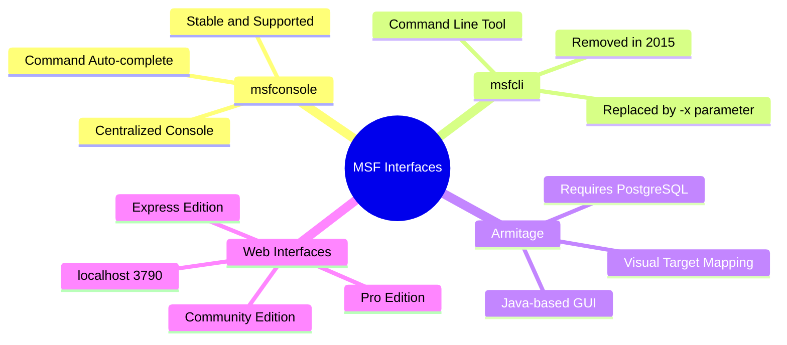
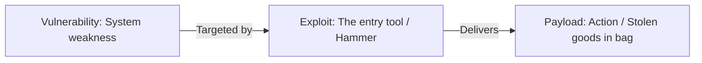
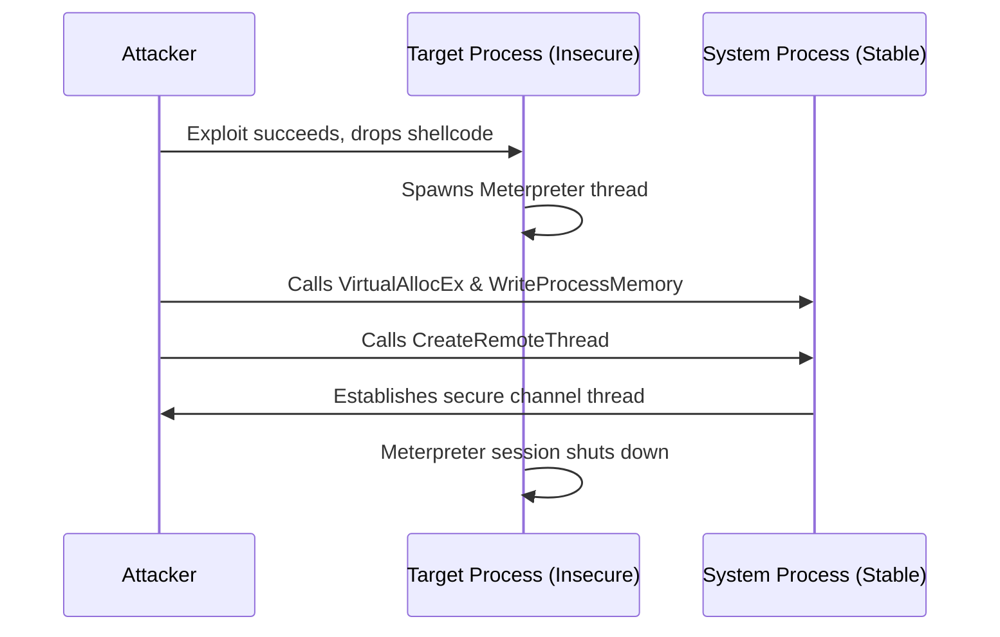

# Unit - 2
:::info[TITLE]
## Metasploit Components
:::

## 1. Introduction & History of Metasploit

The **Metasploit Framework (MSF)** is a highly modular, open-source penetration testing platform used by cybersecurity professionals and ethical hackers. It provides a standardized environment to create, test, and execute exploit code against systems, networks, and applications. By automating the process of exploitation, MSF allows security teams to verify vulnerabilities and audit security controls.

### 1.1 Metasploit Timeline and Version History

Metasploit has evolved from a simple Perl script into an enterprise-grade security platform:

- **2003 – The Perl Era (Metasploit 1.0):** Created by **H.D. Moore** alongside three other core developers. It was initially designed as an online network security game but quickly shifted toward standardizing exploit development. It was written entirely in **Perl** and offered a basic command-line interface.

- **2004 – Metasploit 2.0:** This version expanded the database of exploits and payloads. It was widely adopted by security researchers but suffered from performance issues and lack of platform-independent threading, particularly on Windows environments.

- **2007 – The Ruby Rewrite (Metasploit 3.0):** The development team completely rewrote the framework in **Ruby**. This version introduced dynamic class loading, automated class construction, and advanced fuzzing modules. Fuzzing allowed researchers to discover new zero-day software vulnerabilities rather than just executing pre-written exploits for known bugs.

- **2009 – Rapid7 Acquisition:** Rapid7 acquired the project, funding its development and establishing a split model: the open-source **Metasploit Framework** remained free, while commercial versions (**Metasploit Express** and **Metasploit Pro**) were introduced to offer advanced automated scanning, web application testing, and GUI-driven wizards.

- **2019 – Metasploit v5:** This release modernized the backend architecture, introducing database services, API control layers, evasion modules, and multi-language support.

### 1.2 In-Depth Features of Metasploit v5

The fifth major version of Metasploit brought several technical updates:

- **Data Service Layer:** In earlier versions, MSF required a local PostgreSQL database to track hosts, services, and credentials. Version 5 introduced a RESTful data service layer, allowing the framework to communicate with a remote database over HTTP/HTTPS. This supports multi-user collaboration and distributed deployments.
- **Dynamic Evasion Modules:** Rather than relying on simple static encoders, MSF v5 introduced evasion modules that dynamically compile shellcode in-memory, utilizing advanced obfuscation techniques to evade modern Endpoint Detection and Response (EDR) agents and Windows Defender.
- **JSON-RPC and Web REST APIs:** Provides a structured web-based API that allows external software tools (like custom dashboards or orchestration scripts) to control Metasploit programmatically.
- **Variable Aliasing:** In previous versions, the variable to specify target IPs varied between modules (e.g., `RHOST` vs `RHOSTS`). Version 5 aliased these variables, making variable configuration uniform across all scanners and exploits.
- **Background Shell Sessions:** Enhanced management of concurrent active sessions. Testers can run shell connections in the background, assign them to jobs, and interact with them dynamically.
- **Multi-Language Module Support:** Exploit developers are no longer restricted to writing modules in Ruby. MSF v5 natively executes modules written in **Python** and **Go**, expanding the ecosystem.

---

## 2. Metasploit Limitations

Despite its power, Metasploit is not a universal security tool. Understanding its limitations is critical for exam preparation and real-world engagements:

### 2.1 Technical & Security Limitations

- **Lack of Authentication in Legacy Remote Interfaces:** 
  Historically, remote access interfaces like `msfcli` and `msfweb` did not provide any native authentication mechanisms. If a penetration tester launched these services on a network, any user on that network could access the interface and execute remote code exploits, potentially compromising the tester's machine. The official Metasploit documentation explicitly warned users about this risk.
- **No Exploits for Web-Based Vulnerabilities:** 
  The framework does not contain modules to scan or exploit standard web-application vulnerabilities like Cross-Site Scripting (XSS), SQL Injection, or CSRF. MSF is designed for network, service, and OS-level exploitation (e.g., SMB, FTP, SSH, RPC). Testers must use dedicated tools like Burp Suite, OWASP ZAP, or SQLmap to evaluate web applications.
- **No Native Reporting Engine:** 
  Open-source MSF does not include reporting tools to compile findings, exploit logs, and vulnerability details into a final document for clients. Pentesters must manually extract data, use command-logging commands like `spool`, or purchase commercial versions (Metasploit Pro) to access reporting features.
- **Antivirus and EDR Detection:** 
  Because Metasploit is open-source, its default payloads and executable templates are well-known to security vendors. Standard antivirus software easily flags and quarantines default MSF files unless advanced custom evasion modules or encoders are used.
- **Centralized CLI Dependency:** 
  The core open-source framework lacks a native, modern GUI. Graphical wrappers like Armitage are third-party and may not support all features, forcing testers to remain proficient with the command-line console (`msfconsole`).
- **Target System Stability Risks:** 
  Exploits function by hijacking CPU execution flows, often through memory corruption (e.g., buffer overflows). If an exploit module is poorly configured, targeted at the wrong operating system version, or contains bad memory offsets, it can crash the target service, trigger a Blue Screen of Death (BSOD) on Windows, or cause kernel panics on Linux.

---

## 3. Why Ruby?

The transition of the Metasploit Framework from Perl to Ruby in version 3.0 was a significant architectural shift.

### 3.1 Rationale for the Ruby Transition

The development team analyzed several programming languages, including Python and C/C++, before selecting Ruby. The primary reasons for this choice were:

- **Object-Oriented Integrity & Reflection:** 
  Ruby is a pure object-oriented language. Its deep support for introspection (analyzing the structure and properties of objects at runtime) allowed the framework to examine module configurations, dynamically query target options, and handle complex payload structures.
- **Automated Class Construction:** 
  To support a modular design where exploits can be loaded on-demand, MSF required a language that could build and reuse classes dynamically. Ruby's module structure and dynamic class instantiation allowed developers to easily reuse network socket code, encoding schemes, and payload generation functions across hundreds of different exploits.
- **Platform-Independent Threading:** 
  Ruby provides built-in, cross-platform threading support. During the Perl era, the development team struggled to manage concurrent threads on Windows, often relying on ActiveState Perl and Cygwin, which led to significant performance degradation and instability. Ruby resolved these platform-specific threading challenges.
- **Natively Compiled Windows Interpreter:** 
  The availability of a natively compiled Ruby interpreter for Windows improved execution speed and stability on the OS where most corporate security testers run their tools.

### 3.2 Essential Ruby Features in MSF

The framework relies on specific features of the Ruby programming language:

- **Mix-ins (Modules):** 
  Ruby does not support multiple inheritance, but it allows classes to include **Modules** (referred to as Mix-ins). MSF uses Mix-ins to inject TCP/UDP socket handling, scanner logic, or brute-force code into exploits without complex class inheritance.
- **Exception Handling:** 
  Using `begin...rescue...end` blocks, MSF handles connection resets, authentication failures, and socket timeouts gracefully, preventing the entire console from crashing when an exploit fails.
- **Garbage Collection:** 
  Automates memory deallocation, which is critical for long-running scanner tasks that touch thousands of hosts.
- **Iterators and Closures:** 
  Allows clean, high-performance looping over variables (such as target IP lists) using blocks.
- **Dynamic Loading:** 
  Saves system memory by only loading exploit and auxiliary code into RAM when a user runs the `use` command.
- **High Portability:** 
  Ensures that the exact same exploit module runs identically on Linux, Windows, macOS, UNIX, and older systems like DOS or OS/2.

### 3.3 Ruby Syntax & Object Concepts in MSF (Examples)

#### Ruby Mix-in Concept
To understand how MSF uses Mix-ins to build modular scanners and exploits, observe this basic Ruby structure:

```ruby showLineNumbers
# Define a module for socket reuse
module CustomNetworkHelper
  def send_payload(target_ip, port, shellcode)
    puts "Establishing raw TCP socket to #{target_ip}:#{port}..."
    puts "Sending shellcode: #{shellcode[0..10]}..."
  end
end

# An exploit class including the module (Mix-in)
class MetasploitExploit
  include CustomNetworkHelper # Mix-in injection

  def run_exploit(target)
    # The exploit class now has direct access to send_payload
    send_payload(target, 445, "\x90\x90\x90\xeb\x0c")
  end
end

exploit = MetasploitExploit.new
exploit.run_exploit("192.168.1.100")
```

#### Exception Handling Concept
MSF uses exception handling to prevent connection resets and timeouts from crashing the command terminal:

```ruby showLineNumbers
begin
  connect_to_target("192.168.1.100", 445)
rescue Timeout::Error => e
  puts "[-] Connection timed out: #{e.message}"
rescue Errno::ECONNRESET => e
  puts "[-] Target server reset the connection: #{e.message}"
ensure
  cleanup_sockets()
end
```

---

## 4. Anatomy & Structure of MSF

The Metasploit Framework is designed as a layered architecture consisting of three core libraries, user interfaces, external plugins, and functional modules.

### 4.1 MSF Architectural Hierarchy



### 4.2 Library Descriptions

#### 1. REX (Ruby Extension Library)
- The bottom layer of the framework, handling all low-level operations.
- **Functions:**
  - Manages network sockets (TCP, UDP, Raw IP, SSL/TLS client/server sockets).
  - Handles protocol structures (HTTP request building, SMB packet parsing, FTP communications).
  - Executes raw text transformations, formatting (hexadecimal, base64), and structural encoding.
  - Manages assembly/disassembly of machine code instructions.
  - Coordinates process execution, background threads, and synchronization locks.

#### 2. MSF-CORE
- Sits on top of REX and provides the basic API that exposes the framework's functionalities.
- **Key Subsystems:**
  - **Datastore:** A hash table containing named configuration variables (such as RHOSTS, LPORT) used to share options between user inputs and backend modules.
  - **Event Notification:** Allows developers to write scripts that trigger when specific framework events occur (e.g., successful exploitation, session initiation, or background job termination).
  - **Framework Managers:** Includes the `ModuleManager` (indexes, loads, and verifies modules from disk), the `SessionManager` (tracks active shell/Meterpreter connections), and the `JobManager` (tracks active background tasks).

#### 3. MSF-BASE
- Built on top of MSF-Core to provide a simplified, developer-friendly API.
- Translates core framework actions into simpler functions, making it easier to build user interfaces (like CLI consoles or web dashboards).
- Manages persistent configuration settings, logging systems, and active user session controls.

### 4.3 Plugins vs. Mixins

- **Plugins:** 
  Plugins are software utilities that integrate with the MSF-Base API. They hook into the framework's event subsystem, automate complex testing workflows, and can register new commands within `msfconsole`. Plugins only run within the interactive console environment.
- **Mixins:** 
  Mixins are Ruby modules that are included inside individual exploits or auxiliaries to add features.
  - *The Scanner Mixin:* Overloads the default `run()` command. When a scanner module runs, the Scanner mixin parses the `RHOSTS` IP range and executes `run_host()` or `run_range()` in parallel, depending on the `THREADS` setting, without the developer having to write multithreading logic manually.
  - *The BruteForce Mixin:* Automatically handles dictionary file loading, credential iteration, and authentication loop controls for modules designed to guess logins.

### 4.4 Structure of a Metasploit Exploit Module (Ruby Example)

The following structure outlines how a standard exploit module is declared and written in Ruby:

```ruby showLineNumbers
class MetasploitModule < Msf::Exploit::Remote
  Rank = ExcellentRanking

  include Msf::Exploit::Remote::Tcp # Inherit TCP functions via Mix-in

  def initialize(info = {})
    super(update_info(info,
      'Name'           => 'Example Exploit Module',
      'Description'    => 'This module demonstrates the basic structure of an exploit in MSF.',
      'Author'         => [ 'Nihal Kumar' ],
      'License'        => MSF_LICENSE,
      'Platform'       => 'win',
      'Targets'        => [ [ 'Windows Universal', { 'Ret' => 0x77b4270d } ] ],
      'Payload'        => { 'Space' => 400, 'BadChars' => "\x00\x0a\x0d" }
    ))

    # Define user-controlled inputs (Datastore options)
    register_options([
      Opt::RPORT(445),
      OptString.new('TARGETPATH', [ true, 'Target folder directory', '\\temp'])
    ])
  end

  def exploit
    # Connect automatically handles socket creation based on RHOST and RPORT
    connect
    print_status("TCP Socket connected successfully on port #{rport}...")

    # Build the exploit string
    junk = "A" * 150
    return_address = [target.ret].pack('V') # Pack address into Little Endian
    nop_sled = "\x90" * 32
    shellcode = payload.encoded             # Generate configuration-selected payload

    # Combine into a single buffer
    buffer = junk + return_address + nop_sled + shellcode

    print_status("Sending exploit buffer (#{buffer.length} bytes)...")
    sock.put(buffer)

    # Hand over control to handle incoming connection shell
    handler
    disconnect
  end
end
```

---

## 5. Datastores & Variables

The Datastore is the configuration hub of MSF, functioning as a key-value store that determines how exploits and payloads behave.

### 5.1 Datastore Types

1. **Global Datastore (setg):** 
   Configures variables globally across the entire MSF session. These variables persist even if you switch to a different module.
   ```bash
   # Set the target range globally for all subsequent modules
   setg RHOSTS 10.10.10.0/24
   ```
2. **Module Datastore (set):** 
   Configures variables locally for the currently selected module. The configuration is lost when you select a new module.
   ```bash
   # Set the target IP only for the currently active exploit module
   set RHOST 10.10.10.15
   ```

### 5.2 Key Exploitation Variables

- **RHOSTS / RHOST:** The Remote Host(s) or target IP address(es). Accepts single IPs, CIDR ranges, or text files containing IP lists.
- **LHOST:** The Local Host or attacker IP address. This is the IP that the payload will connect back to when using a reverse shell.
- **RPORT:** The Remote Port or port running the target service (e.g., port 445 for SMB exploits).
- **LPORT:** The Local Port or port on the attacker's machine that listens for incoming reverse connections.
- **SRVHOST & SRVPORT:** Used in client-side exploits to run a temporary malicious web or file server on the attacker's system.
- **PAYLOAD:** The specific shellcode configuration to deliver after successful exploitation.

---

## 6. Metasploit Interfaces

The framework provides multiple interfaces to support different penetration testing workflows.



### 6.1 msfconsole (Interactive Console)
- The primary, most stable, and supported interface for Metasploit.
- Provides a centralized CLI environment with access to all modules, payloads, and plugins.
- **Key Features:**
  - Full readline support, command history, and auto-completion using the Tab key.
  - Ability to execute external system commands (e.g., `ping`, `nmap`) directly from the MSF prompt.

#### Critical msfconsole Commands Walkthrough

- **`search [keyword]`**: Searches the module database for exploits matching a keyword (e.g., `eternalblue`, `smb`, `ms17-010`).
- **`use [module_path]`**: Loads the specified module.
  ```bash
  use exploit/windows/smb/ms17_010_eternalblue
  ```
- **`show options`**: Displays all configurable variables (both required and optional) for the active module.
- **`set [variable] [value]`**: Assigns values to parameters.
  ```bash
  set RHOSTS 10.10.10.150
  ```
- **`show payloads`**: Displays only the payloads that are compatible with the loaded exploit and target operating system.
- **`set payload [payload_path]`**: Configures the framework to use a specific payload.
  ```bash
  set payload windows/x64/meterpreter/reverse_tcp
  ```
- **`exploit` / `run`**: Executes the module.
- **`sessions`**: Manages compromised channels.
  - `sessions -l`: Lists active sessions.
  - `sessions -i [id]`: Connects to an active session.
  - `sessions -k [id]`: Terminates a session.
- **`jobs`**: Manages background scanners or listeners.
  - `jobs -l`: Lists background jobs.
  - `jobs -k [id]`: Kills a background job.

### 6.2 msfcli (Direct Command Line - Historical)
- Designed to execute single exploits directly from the shell without launching the interactive console.
- Highly useful for scripting and direct automation.
- **Drawbacks:** Could only manage one session at a time, making it useless for client-side attacks that require persistence. It lacked the automation and session-management capabilities of `msfconsole`.
- **Status:** **msfcli was officially removed in 2015.** Today, testers use the `-x` parameter in `msfconsole` to pass commands directly:
  ```bash
  msfconsole -x "use exploit/windows/smb/ms17_010_eternalblue; set RHOSTS 10.10.10.12; run"
  ```

### 6.3 Armitage (Visual GUI)
- A Java-based graphical user interface developed by Raphael Mudge.
- Visualizes target networks as graphical icons, showing compromised machines with red borders and electric sparks.
- Recommends exploits dynamically based on open ports.
- **Startup Requirements:**
  ```bash
  # Start the backend database service
  systemctl start postgresql
  
  # Initialize the Metasploit database
  msfdb init
  
  # Launch the Armitage GUI client
  armitage
  ```

### 6.4 Web GUI
- A browser-based user interface running on port 3790 (`https://localhost:3790`).
- Provides graphical dashboards for network discovery, exploit automation, and vulnerability scanning imports.
- Available across different Metasploit commercial and community tiers:
  - **Metasploit Community Edition (Free):** Basic network discovery, vulnerability imports, and module browsing.
  - **Metasploit Express:** Adds smart exploitation wizards, basic reporting, and automated password auditing.
  - **Metasploit Pro:** The full commercial suite, including social engineering campaigns, web application vulnerability scanning, post-exploitation macro suites, VPN pivoting, and advanced IDS/IPS evasion.

---

## 7. Metasploit Modules (Components)

Modules are the functional components of Metasploit. On a standard Linux installation, the default modules are stored under:
`/usr/share/metasploit-framework/modules/`

### 7.1 Exploits
An exploit is a module that contains code designed to take advantage of a specific system vulnerability (such as a buffer overflow, SQL injection, or zero-day flaw) to bypass security controls and establish execution access on the target system.
- **Remote Exploits:** Run over the network to compromise target services without prior access.
- **Local Exploits:** Executed on an already compromised system to escalate privileges (e.g., bypassing User Account Control or elevating from user to Administrator/root).
- **Client-Side Exploits:** Target applications on the user's machine (e.g., malicious PDF readers or browser exploits) to establish an initial foothold.

### 7.2 Payloads
A payload is the actual code executed on the target system after the exploit successfully gains entry.



#### Naming Conventions (Staged vs. Stageless)
Understanding naming conventions is crucial for configuring the right payload:
- **Staged Payloads:** Denoted by a slash `/` separating the components.
  - *Example:* `windows/x64/meterpreter/reverse_tcp`
  - In this case, `reverse_tcp` is a small stager that establishes a socket connection, while `meterpreter` is the stage payload downloaded subsequently.
- **Stageless (Inline) Payloads:** Denoted by an underscore `_` linking the components.
  - *Example:* `windows/x64/meterpreter_reverse_tcp`
  - In this case, the entire Meterpreter functionality and network setup are packaged into a single, self-contained shellcode buffer.

#### The Three Main Payload Categories

##### 1. Singles (Inline Payloads)
- Self-contained payloads that perform a single, specific action.
- They contain the entire exploit payload logic in a single file (e.g., executing a local command, adding a system administrator account, or starting a keylogger).
- **Advantage:** Highly stable because they do not require additional network connections to download code.
- **Disadvantage:** Typically larger in size, which may prevent them from fitting into narrow exploit buffer spaces.

##### 2. Stagers
- Small payloads designed to establish a network connection between the target system and the attacker's machine.
- Their only job is to allocate memory, "plant the flag" on the victim system, and pull down the larger **Stage** payload over the network.
- **Advantage:** Highly compact, making them suitable for exploits with strict memory size constraints.

##### 3. Meterpreter (Meta-Interpreter)
- An advanced, multi-faceted payload operating via **DLL injection**.
- **In-Memory Execution:** Resides entirely in the target's RAM. It does not write files to the hard drive, making it extremely difficult to detect with traditional digital forensics and antivirus scans.
- **Features:** Provides an interactive, scriptable Ruby API on the client side. Testers can view command history, perform tab completion, capture keystrokes, dump password hashes, and dynamically load/unload post-exploitation plugins.

##### Core Meterpreter Commands for Exam Review
Once a Meterpreter session is opened, the following commands are commonly used:

| Command | Category | Description |
|---|---|---|
| **`sysinfo`** | System | Displays target operating system, computer name, and architecture (x86 vs x64). |
| **`getuid`** | System | Shows the current user account the payload is running under (e.g., `NT AUTHORITY\SYSTEM` or local user). |
| **`getsystem`** | Privilege Escalation | Attempts to elevate access privileges to the highest system level (`SYSTEM` or root) using local privilege exploitation techniques. |
| **`migrate [PID]`**| Post-Exploitation | Moves the Meterpreter thread out of the crashed exploit process into a stable system process (e.g., `explorer.exe` or `svchost.exe`). |
| **`hashdump`** | Credentials | Dumps the local SAM database password hashes (LM/NTLM hashes on Windows). |
| **`keyscan_start`** | User Monitoring | Launches an in-memory keylogger. |
| **`keyscan_dump`** | User Monitoring | Dumps all keystrokes captured by the keylogger. |
| **`shell`** | Command Line | Drops the tester into a standard system shell prompt (e.g., cmd.exe on Windows, bash on Linux). |
| **`upload / download`**| File System | Copies files between the attacker's system and the compromised target. |

### 7.3 Auxiliaries
Modules that perform security testing actions other than system exploitation. They do not deliver payloads.
- **Capabilities:** Port scanning, protocol fuzzing, packet sniffing, banner grabbing, and password guessing.
- *Real-World Example:* The `CERT` auxiliary module is used by system administrators to scan a network range, identify expired or invalid SSL/TLS certificates, and automate certificate management.

### 7.4 Encoders
Modules used to obfuscate and encode shellcode to bypass network security controls (such as IDS/IPS signatures) and antivirus software.
- The payload must be encoded using an encoder compatible with the target system's CPU architecture (e.g., x86, x64, MIPS, SPARC) and the code type (e.g., CMD, PHP, Python).
- *Popular Encoders:* `shikata_ga_nai` (a polymorphic XOR additive feedback encoder that generates unique signatures on every compilation), `base64`, `powershell_base64`.

#### How Shikata Ga Nai Works
- **Polymorphism:** On every execution of `msfvenom` with `-e x86/shikata_ga_nai`, the encoder generates entirely different output.
- **XOR Loop:** It encrypts the payload shellcode using a dynamically generated key.
- **Additive Feedback:** It shifts the keys and offsets dynamically during the decryption loop, meaning the decoder stub itself changes structural instructions. This prevents static signature engines from building simple rules to block it.

### 7.5 Nops (No Operation)
Generators that produce a sequence of random, non-functional instructions (`\x90` in hexadecimal format) used to pad buffers.
- Keeps payload sizes consistent to satisfy exploit structure requirements.
- Constructs **NOP sleds** to slide CPU execution directly into the payload shellcode address while evading signature detection.

### 7.6 Evasion
Evasion modules generate executable files designed to evade host security controls like Windows Defender.
- Utilizes dynamic shellcode encryption, code obfuscation, Metasm, and anti-emulation techniques.
- *Popular modules:* `windows/windows_defender_exe`, `windows/windows_defender_js_hta`.

---

## 8. In-Depth Metasploit Command Cheatsheet

Below is a detailed matrix of helper commands inside `msfconsole` that support database-driven testing and background job management:

### 8.1 Database Integration & Recon Commands

To enable database commands, the Metasploit console must be connected to the local PostgreSQL database service (verified via `db_status`).

- **`db_status`**: Verifies whether the database is connected.
  ```text
  msf > db_status
  [*] postgresql connected to msf
  ```
- **`db_nmap`**: Runs Nmap directly from the framework console and automatically saves the scan results (hosts, open ports, and services) directly to the Metasploit database.
  ```bash
  db_nmap -sV -O 192.168.1.0/24
  ```
- **`hosts`**: Displays all host IP addresses and hostnames registered in the database.
  - `hosts -c address,os_name`: Displays only the IP address and operating system name.
- **`services`**: Queries the database for all discovered network services.
  - `services -p 80`: Lists all hosts running a web server on port 80.
- **`creds`**: Displays a table of all user credentials (usernames and passwords or hashes) gathered during the scanning or exploitation phases.
- **`vulns`**: Lists all identified system vulnerabilities found on the targets.
- **`loot`**: Displays paths to files downloaded from compromised target systems (e.g., registry hives, configurations).

---

## 9. Advanced Post-Exploitation Mechanics

### 9.1 Process Migration (Under the Hood)

Process migration is a key step after a Meterpreter payload achieves execution. Since exploits usually compromise short-lived application processes (like web browsers or temporary network threads), the payload must move to a stable system process (e.g., `explorer.exe` or `svchost.exe`).

#### Migration Steps:
1. **Target Identification:** The user runs `ps` inside Meterpreter to list process IDs (PIDs).
2. **Memory Allocation:** Meterpreter calls the Windows API function `VirtualAllocEx` to allocate read, write, and execute (RWX) memory inside the target process's virtual memory space.
3. **Write Process Memory:** The payload writes its DLL injection loader code into the allocated memory space using `WriteProcessMemory`.
4. **Thread Creation:** Meterpreter calls `CreateRemoteThread` or `NtCreateThreadEx` to spawn a new execution thread running the injected code within the target process's context.
5. **Session Redirection:** The network socket connection is handed over to the new thread, and the original process thread is closed.



---

## 10. Advanced Evasion Mechanics

To bypass security systems, Metasploit employs sophisticated evasion tactics:

### 10.1 Anti-Emulation Loops
Antivirus scanners often execute suspicious files inside a virtualized sandbox for a few milliseconds (emulation) to check for malicious API calls. To defeat this, Metasploit Evasion modules insert loops that perform mathematical calculations for a set duration (e.g., 5 seconds) before running the payload. Because sandboxes have strict processing time limits per file, they exit and mark the file as safe before the shellcode runs.

### 10.2 Memory Page Refinement
Many endpoint protection platforms monitor RAM for processes that allocate memory pages with Read, Write, and Execute (RWX) permissions, as this is typical of standard DLL injection. Modern evasion modules avoid RWX allocations, instead writing payload shellcode into Read/Write (RW) pages, and then using `VirtualProtect` to change the page permissions to Read/Execute (RX) right before execution. This matches standard compiler behavior, making detection much harder.
