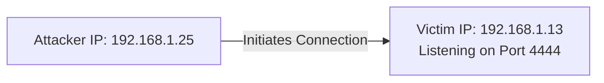
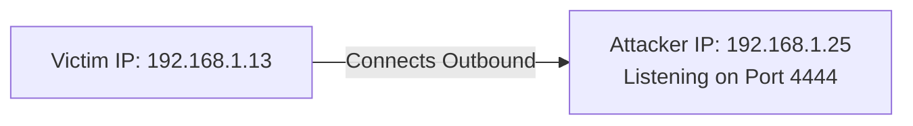

# Unit - 4
:::info[TITLE]
## Meterpreter
:::

## 1. What is Meterpreter?

Meterpreter is the short form of **Meta-Interpreter**. It is an advanced, multi-faceted, dynamically extensible payload in the Metasploit Framework that fundamentally changed how post-exploitation is conducted. 

Unlike traditional malware or reverse shells that write an executable file (`.exe`) to the victim's hard drive (which is highly susceptible to Anti-Virus detection), Meterpreter operates entirely through **in-memory DLL injection**.

- **Features:** It features command history, tab completion, encrypted communication channels, file manipulation, and deep system access.
- **Stealth:** Because Meterpreter resides *completely* in the RAM of the remote host, it leaves absolutely no traces on the physical hard drive. It utilizes encrypted communications, making network-level detection (IDS/IPS) and conventional endpoint forensic techniques exceptionally difficult.

## 2. Technical Mechanics: How Meterpreter Works

The setup phase of a Meterpreter session is a highly orchestrated series of events designed to bypass security controls. It relies heavily on a technique called **Reflective DLL Injection**.

The exact operational flow is as follows:

1. **Initial Stager Execution:** The target executes the initial, tiny payload (the *stager*, like `reverse_tcp`). Stagers are kept intentionally small so they can fit into constrained memory spaces during buffer overflow exploits.
2. **Memory Allocation:** The stager allocates a chunk of read/write/execute (`RWX`) memory in the compromised process using system APIs like `VirtualAlloc`.
3. **DLL Loading:** The stager reaches back to the attacker and downloads the massive Meterpreter DLL (the *stage*). 
4. **Reflective Injection:** Traditional DLLs require the Windows OS to load them from a disk. Meterpreter bypasses this by using a *Reflective stub* embedded in the downloaded DLL. This stub acts as a custom OS loader, manually mapping the DLL into the allocated memory and executing it without the host OS knowing a DLL was ever loaded.
5. **Core Initialization:** The Meterpreter core initializes and immediately establishes a **TLS/1.0** encrypted link over the socket to prevent network sniffing.
6. **TLV Communication:** It sends a `GET` request. From this point forward, all communication between the attacker and victim uses the **TLV (Type-Length-Value)** protocol. This serialized protocol ensures data is transmitted cleanly regardless of architecture (x86 vs x64).
7. **Extension Loading:** Meterpreter dynamically requests extensions (like `stdapi` for standard commands, or `priv` for privilege escalation) from the attacker. These extensions are securely transmitted over the network and injected into memory on the fly.

## 3. Meterpreter Design Goals

The core design philosophy of Meterpreter rests on three pillars:

### 3.1 Stealthy
- **No Disk I/O:** Writes absolutely nothing to the disk.
- **Process Hiding:** No new processes are created. Meterpreter lives parasitically inside the exploited process (e.g., if you exploit `svchost.exe`, Meterpreter runs inside `svchost.exe`).
- **Encryption:** All communications use TLS encryption.

### 3.2 Powerful
- **Channelized I/O:** Meterpreter utilizes a channelized communication system. This means it can open a command shell, run a port forward, and stream webcam footage simultaneously over a single network connection without interference.

### 3.3 Extensible
- **Dynamic Augmentation:** Features can be augmented at runtime. If you need a new feature, Metasploit simply sends a new compiled Ruby module over the network directly into the victim's RAM, without having to rebuild or restart the payload.

## 4. Shell Types: Bind vs. Reverse TCP

When executing payloads, you must choose how the network connection is established. 

### 4.1 Bind TCP Shell
A bind shell forces the target machine to open a specific port and *wait* for the attacker to connect.
- **Technical Limitation:** Modern firewalls block unexpected inbound traffic by default. If the victim has a firewall enabled, the attacker's connection attempt to the bind port will be dropped.



### 4.2 Reverse TCP Shell
A `reverse_tcp` shell forces the victim machine to proactively connect back to the attacker's machine.
- **Technical Advantage:** Firewalls typically allow outbound traffic (like HTTP/HTTPS on ports 80/443). By having the victim initiate an outbound connection to the attacker, Reverse TCP effortlessly bypasses inbound firewall restrictions.



## 5. Privilege Escalation Techniques

Frequently, client-side exploits result in a session with limited standard user rights. To dump passwords or install rootkits, the attacker must escalate to **NT AUTHORITY\SYSTEM**.

Metasploit automates this via the `getsystem` command. Under the hood, `getsystem` attempts three highly technical attacks sequentially:

1. **Named Pipe Impersonation (In Memory):** Meterpreter creates a named pipe and tricks a legitimate SYSTEM service into connecting to it. When the SYSTEM service connects, Meterpreter calls the `ImpersonateNamedPipeClient()` API to steal the SYSTEM access token.
2. **Named Pipe Impersonation (Dropper):** Similar to the first, but drops a temporary DLL to disk if the in-memory execution fails.
3. **Token Duplication:** Meterpreter scans the system for processes running as SYSTEM (like `lsass.exe` or `winlogon.exe`), uses the `OpenProcessToken` API to copy their security token, and assigns that token to the Meterpreter thread.

**Commands:** 
```bash
meterpreter > use priv
meterpreter > getsystem
...got system via technique 1 (Named Pipe Impersonation (In Memory/Admin)).
meterpreter > getuid
Server username: NT AUTHORITY\SYSTEM
```

## 6. Process Migration

Because Meterpreter lives inside the exploited process, if the user closes that program, the Meterpreter session instantly dies. 

**Migration** solves this by injecting the Meterpreter payload into a stable, long-running system process (like `explorer.exe` or `svchost.exe`).

```bash
meterpreter > ps
  PID   Name           User
  ---   ----           ----
  1340  explorer.exe   WIN-USER\Admin
  4012  bad_pdf.exe    WIN-USER\Admin

meterpreter > migrate 1340
[*] Migrating from 4012 to 1340...
[*] Migration completed successfully.
```
*Technical Note:* Migration involves allocating memory in the target process (`explorer.exe`), creating a new remote thread, and moving the active Meterpreter execution context over, all without crashing either process.

## 7. Meterpreter Core Commands

1. **`?` or `help`**
   - Shows a list of commands with brief descriptions.
2. **`background`**
   - Places the current session into the background and brings you back to the Metasploit console without terminating the session.
3. **`irb`**
   - Starts the Interactive Ruby Shell, allowing the use of the Ruby scripting language to directly interact with the compromised system.
4. **`exit` or `quit`**
   - Returns to the Meterpreter console and formally closes the active session.
5. **`migrate`**
   - Moves the active Meterpreter session to a different process ID (PID).
6. **`run`**
   - Executes a Meterpreter script. If no path is specified, it searches the `scripts/meterpreter/` directory.

## 8. Meterpreter File System Commands

1. **`cat`**
   - Displays the contents of a single file. *(Will throw an error if trying to read an empty file).*
   - ```meterpreter > cat passwords.txt```
2. **`cd`**
   - Changes the current directory on the remote system.
3. **`download`**
   - Retrieves a file from the target into the local working directory. Use the `-r` switch to recursively download an entire directory.
   - `meterpreter > download users.txt`
4. **`edit`**
   - Edits a file using the default text editor. It downloads a copy to a temp directory, and uploads the new file when editing is complete.
5. **`getlwd`** / **`lpwd`**
   - Shows the current working directory on the *local* machine (the attacker's machine).
6. **`lcd`**
   - Changes the *local* directory.
7. **`ls`**
   - Lists files in the current remote directory in a format similar to the GNU `ls` program.
8. **`mkdir`**
   - Makes a new directory on the target system.
9. **`pwd`**
   - Shows the current working directory on the *remote* machine.
10. **`rmdir`**
    - Removes an empty directory. Will throw an error if the directory is not empty.
11. **`upload`**
    - Sends a file to the target system. Use `-r` to recursively upload directories.

## 9. Meterpreter Networking Commands

1. **`ipconfig` / `ifconfig`**
   - Displays network interface information on the compromised system (IP addresses, subnets, MAC addresses).
2. **`portfwd`**
   - Sets up port forwarding on the compromised system to pivot traffic deeper into the network.
3. **`route`**
   - Displays or modifies the system's routing table.

## 10. Meterpreter System Commands

1. **`clearev`**: Clears the Application, System, and Security event logs (Anti-forensics).
2. **`execute`**: Executes a command on the remote system (e.g., `execute -f cmd.exe -c -H`).
3. **`getpid`**: Shows the current process identifier.
4. **`getuid`**: Shows the user that Meterpreter is currently running as.
5. **`kill`**: Terminates a process by PID.
6. **`pkill`**: Terminates processes by name.
7. **`ps`**: Lists running processes.
8. **`reboot`**: Reboots the remote computer.
9. **`shell`**: Drops into a standard system command shell (e.g., `cmd.exe` or `/bin/bash`).
10. **`shutdown`**: Shuts down the remote computer.
11. **`sysinfo`**: Gets information about the remote system, such as OS, architecture, and language.

## 11. Hash Dumping & Cracking

### 11.1 Dumping the Hashes (SAM Database)
Hash dumping refers to the process of extracting password hashes from a system or a computer's operating system. 
- In Windows, local user passwords are not stored in plain text. They are hashed using the NTLM algorithm and stored in the **SAM (Security Account Manager)** database located in the registry (`HKLM\SAM`).
- To extract these hashes, an attacker must have SYSTEM privileges. Once escalated, Meterpreter can extract them dynamically from memory or the registry using the `hashdump` command.

```bash
meterpreter > hashdump
Administrator:500:aad3b435b51404eeaad3b435b51404ee:31d6cfe0d16ae931b73c59d7e0c089c0:::
Guest:501:aad3b435b51404eeaad3b435b51404ee:31d6cfe0d16ae931b73c59d7e0c089c0:::
```
*(The format is: `Username : UID : LM Hash : NTLM Hash : Comment : Home Dir`)*

### 11.2 John the Ripper
Once the hashes are dumped, they must be cracked to reveal the plaintext password. **John the Ripper** is a popular open-source password-cracking software used by security professionals to identify weak passwords.

- **How it works:** It hashes millions of words from a dictionary file (like `rockyou.txt`) and compares the output to the stolen NTLM hashes. If the hashes match, the password is cracked.

**Example Cracking Command:**
```bash
$ john --format=NT --wordlist=/usr/share/wordlists/rockyou.txt hashes.txt
Loaded 1 password hash (NT [MD4 128/128 AVX 4x3])
password123      (Administrator)
```

> **Exam Point:** Remember that Meterpreter operates purely in memory to evade detection, uses Reverse TCP to bypass inbound firewalls, and requires SYSTEM level privileges (often obtained via `getsystem` token duplication) to perform advanced post-exploitation tasks like `hashdump` or `clearev`.