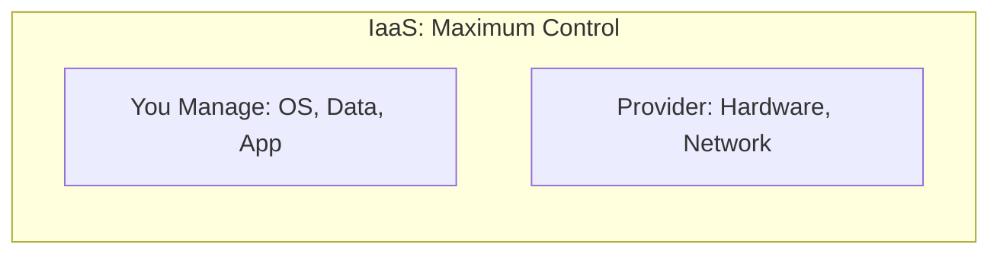
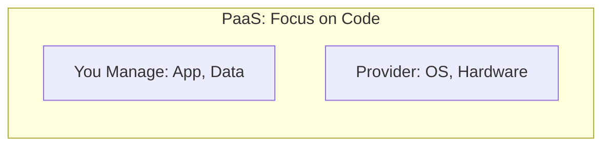
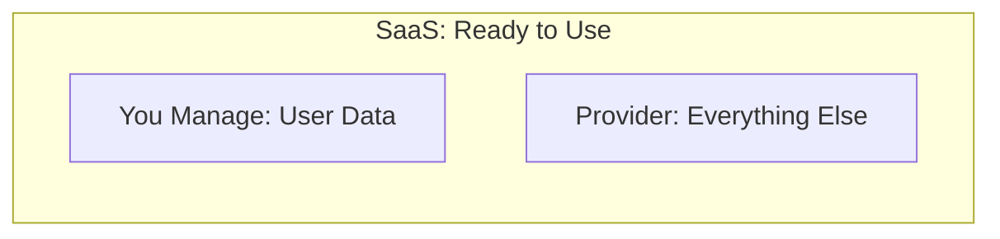
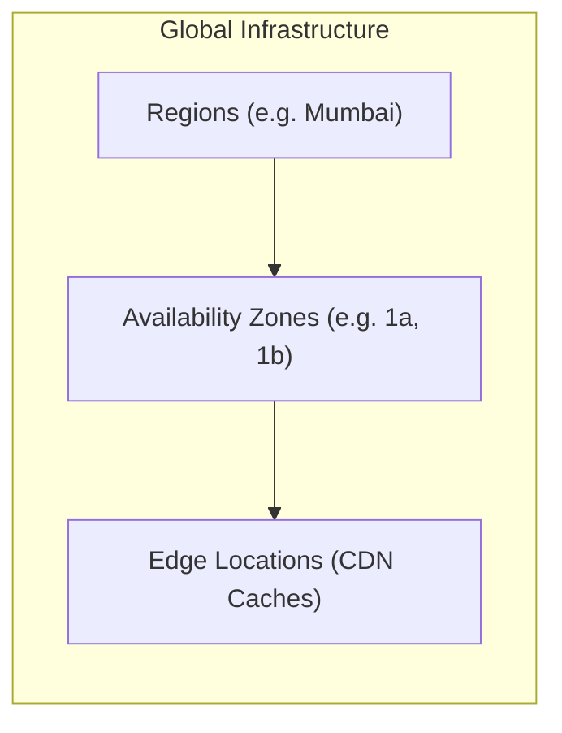

# Unit - 1

:::info[Title]
## Introduction to Cloud Computing & AWS
:::

## 1. What is Cloud Computing?

### 1.1 Definition and Core Concepts
- **Formal Definition:** Cloud computing is the on-demand delivery of IT resources (like servers, storage, databases, and networking) over the internet with a pay-as-you-go pricing model.
- **In Your Own Words:** Imagine renting a computer or server over the internet instead of buying and keeping one in your room. You don't have to worry about maintaining the hardware, and you only pay for the time you actually use it.
- **Key aspects to write in exam:**
  - **On-demand:** Available exactly when you need it without waiting for hardware delivery.
  - **Delivered over the internet:** Accessible via web browsers, command lines, or APIs.
  - **Pay-as-you-go:** No upfront costs. You are billed like electricity or water — based on consumption.

### 1.2 Key Characteristics (NIST Model)
When explaining cloud characteristics, use these 4 key pillars:

- **1. Broad Network Access:** 
  - *Explanation:* Cloud resources are available over the network and accessed through standard mechanisms (HTTP/HTTPS) that promote use by various client platforms (mobile phones, tablets, laptops, and workstations).
  - *Analogy:* Like accessing your Gmail account; you can log in from any device, anywhere in the world.
- **2. Resource Pooling:** 
  - *Explanation:* The provider's computing resources are pooled to serve multiple consumers using a multi-tenant model. Different physical and virtual resources are dynamically assigned according to consumer demand. 
  - *Analogy:* An apartment building where multiple tenants share the same water and electricity infrastructure, but each has their own secure, isolated living space.
- **3. Rapid Elasticity:** 
  - *Explanation:* Capabilities can be elastically provisioned and released to scale rapidly outward (adding more servers) and inward (removing servers) commensurate with demand.
  - *Analogy:* A restaurant hiring temporary staff for the holiday rush and letting them go when the rush is over.
- **4. Measured Service:** 
  - *Explanation:* Cloud systems automatically control, optimize, and report resource usage, providing transparency for both the provider and consumer.
  - *Analogy:* A taxi meter. It tracks how far you travel and bills you exactly for that distance.

## 2. Key Benefits of Cloud Computing

*Exam Tip: Use the acronym **"T-E-S-I-S-G"** or just memorize these 6 points to write a full answer.*

### 2.1 Trade CapEx for OpEx
- **Explanation:** **CapEx** (Capital Expenditure) means spending money upfront on physical servers and data centers. **OpEx** (Operational Expenditure) means paying for services as you use them. Cloud computing allows companies to switch from CapEx to OpEx.
- **Why it matters:** Businesses don't risk wasting millions of dollars on hardware that might sit idle if their project fails.

### 2.2 Economies of Scale
- **Explanation:** By using cloud computing, you can achieve a lower variable cost than you can get on your own. Because usage from hundreds of thousands of customers is aggregated in the cloud, providers like AWS achieve massive economies of scale.
- **Why it matters:** This bulk-buying power of AWS translates into lower pay-as-you-go prices for the end user.

### 2.3 Stop Guessing Capacity
- **Explanation:** In traditional IT, you had to guess how much server capacity you would need. Guess too high, you waste money. Guess too low, your website crashes during high traffic.
- **Why it matters:** Cloud computing eliminates guessing. You can provision just enough to start, and automatically scale out or in within minutes as demand changes.

### 2.4 Increase Speed & Agility
- **Explanation:** In a traditional data center, it could take weeks to procure and set up a new server. In the cloud, new IT resources are only a click away.
- **Why it matters:** It dramatically reduces the time it takes to make resources available to developers from weeks to just minutes, leading to a huge increase in organizational agility and faster innovation.

### 2.5 Stop Managing Data Centers
- **Explanation:** Focus on projects that differentiate your business, not the infrastructure. Cloud computing takes away the "undifferentiated heavy lifting" of racking, stacking, and powering servers.
- **Why it matters:** Companies can spend their time on building great software for customers instead of doing hardware maintenance.

### 2.6 Go Global in Minutes
- **Explanation:** Easily deploy your application in multiple regions around the world with just a few clicks. 
- **Why it matters:** You can provide lower latency (faster loading times) and a better experience for customers regardless of where they are geographically located, at minimal cost.

## 3. Cloud Service Models

*Exam Tip: Explain the difference based on **"What you manage vs. What the provider manages"**.*

### 3.1 IaaS (Infrastructure as a Service)
- **What it is:** The most basic cloud model. The provider gives you virtual hardware (servers, storage, network).
- **How to explain:** You rent the empty server. You have to install the operating system, databases, and your application yourself. It gives you the highest level of control and flexibility.
- **You manage:** OS, runtime, application, data.
- **AWS manages:** Physical servers, storage, networking.
- **Examples:** Amazon EC2 (Virtual Servers), Amazon EBS.

### 3.2 PaaS (Platform as a Service)
- **What it is:** The provider gives you a complete platform (hardware + OS + runtime) so you can just focus on deploying your code.
- **How to explain:** You don't worry about updating Windows or Linux. You just write your code, upload it, and the cloud provider handles the servers running it.
- **You manage:** Application code and data.
- **AWS manages:** Physical hardware, OS, runtime environments, middleware.
- **Examples:** AWS Elastic Beanstalk.

### 3.3 SaaS (Software as a Service)
- **What it is:** A complete, ready-to-use software application delivered over the internet.
- **How to explain:** You just create an account, log in, and use the software. You don't care how it's built or where it's hosted.
- **You manage:** Only your user data and account settings.
- **AWS manages:** Literally everything else (infrastructure, OS, software updates, security).
- **Examples:** Gmail, Dropbox, Amazon WorkMail, Amazon Chime.

## 4. Cloud Deployment Models

### 4.1 Public Cloud
- **Explanation:** Cloud resources are owned and operated by a third-party provider (like AWS, Azure) and delivered over the public internet. Infrastructure is shared among multiple organizations.
- **Exam point:** Best for general workloads, highly scalable, zero maintenance, and cost-effective.
- **Examples:** Amazon Web Services (AWS), Google Cloud Platform (GCP).

### 4.2 Private Cloud
- **Explanation:** A cloud environment dedicated entirely to one single organization. It can be hosted on-site or by a third-party, but the hardware is not shared with anyone else.
- **Exam point:** Best for highly sensitive data, strict regulatory compliance, and industries like banking or healthcare. 
- **Examples:** VMware, OpenStack, On-premises data centers.

### 4.3 Hybrid Cloud
- **Explanation:** A combination of both public and private clouds, connected together. 
- **Exam point:** Offers the "best of both worlds." A company can keep sensitive customer data on their Private Cloud, while running their web servers on the Public Cloud to handle high traffic.
- **Examples:** AWS Outposts, AWS Direct Connect.

## 5. What is AWS?

### 5.1 Introduction to AWS
- **In Your Own Words:** Amazon Web Services (AWS) is a subsidiary of Amazon providing on-demand cloud computing platforms and APIs to individuals, companies, and governments. 
- **Scale:** It is the world's most comprehensive and broadly adopted cloud platform, offering over 200 fully featured services from data centers globally.
- **Scope:** AWS covers everything from basic compute and storage (IaaS) to advanced AI, Machine Learning, and database services (PaaS/SaaS).

### 5.2 Key Facts to Mention
- **Massive Service Offering:** 200+ fully featured services available globally.
- **Global Presence:** Operates across 33 Geographic Regions and 105+ Availability Zones worldwide, making it highly available and resilient.

## 6. The AWS Global Infrastructure

*Exam Tip: Explain this as a hierarchy: Regions contain Availability Zones, and Edge Locations are separate caching sites.*

### 6.1 Regions
- **What it is:** A physical geographical location in the world where AWS has multiple data centers. 
- **Details to explain:** Each Region is completely independent and isolated from other regions. A region consists of a minimum of 3 Availability Zones.
- **Why choose a specific region?** To reduce latency (picking a region closest to your customers), to comply with local laws (data sovereignty), and to reduce costs.
- **Example:** `ap-south-1` is the AWS Region in Mumbai, India.

### 6.2 Availability Zones (AZs)
- **What it is:** Inside every Region, there are multiple Availability Zones. An AZ is one or more discrete data centers with redundant power, networking, and connectivity.
- **Details to explain:** AZs are physically separated from each other by miles (to protect against localized disasters like fires, floods, or power outages) but are connected via ultra-high-speed fiber optic networks.
- **Why it matters:** If you deploy your application across multiple AZs, it guarantees High Availability. If one AZ goes down, the others keep your app running.
- **Example:** `ap-south-1a`, `ap-south-1b`, `ap-south-1c` are the three AZs in the Mumbai region.

### 6.3 Edge Locations
- **What it is:** These are specialized data centers located in major cities worldwide, used primarily for caching content closer to the end-users. 
- **Details to explain:** Used by AWS services like **Amazon CloudFront** (Content Delivery Network). There are many more Edge Locations (over 400+) than there are Regions.
- **Why it matters:** They help deliver websites, videos, and images with ultra-low latency. If a user in London requests a video hosted in Mumbai, the Edge Location in London will cache it and serve it instantly.

## 7. Quick Revision

- **Definition:** Cloud computing is renting IT resources over the internet, paying only for what you use.
- **6 Key Benefits:** OpEx over CapEx, Economies of scale, Stop guessing capacity, Increased agility, No data center management, Global reach in minutes.
- **Service Models:** 
   - **IaaS:** You manage OS & App (e.g., EC2).
   - **PaaS:** You manage only App (e.g., Elastic Beanstalk).
   - **SaaS:** You manage nothing, just use it (e.g., Gmail/WorkMail).
- **Deployment Models:** Public (Shared), Private (Dedicated), Hybrid (Mix of both).
- **Infrastructure:** 
   - **Regions:** Large geographical areas with multiple AZs.
   - **AZs:** Isolated data centers inside a region.
   - **Edge Locations:** Caching points in major cities for fast delivery (CDN).

## 8. Important Terms

- **On-Demand:** Access to resources whenever required without provisioning delays.
- **CapEx (Capital Expenditure):** Upfront cost to purchase physical assets (hardware).
- **OpEx (Operational Expenditure):** Ongoing costs for running a product, business, or system (pay-as-you-go).
- **High Availability (HA):** Ensuring a system remains accessible and operational even if components fail.
- **Multi-Tenant:** A shared environment where multiple customers use the same physical resources securely.

## 9. Exam Questions

**Short-Answer Questions:**
1. Define Cloud Computing and mention two of its core characteristics based on the NIST model.
2. What is the difference between CapEx and OpEx in the context of cloud computing?
3. Briefly explain the difference between a Region and an Availability Zone (AZ).

**Descriptive Questions:**
4. Explain the six key benefits of Cloud Computing as defined by AWS. Provide a brief explanation for each.
5. Detail the global infrastructure of AWS. Why would a company choose to deploy their application in multiple Regions and Edge Locations?

**Compare / Differentiate:**
6. Differentiate between IaaS, PaaS, and SaaS cloud service models. Provide one AWS example for each.
7. Compare Public, Private, and Hybrid cloud deployment models, highlighting their primary use cases.

**Scenario-Based Questions:**
8. A startup wants to launch a new mobile application but is unsure how much server capacity they will need. Which cloud characteristic and benefit should they leverage to handle this uncertainty effectively without wasting money?
9. A bank requires strict regulatory compliance and must ensure its data is completely physically isolated from other companies. Which deployment model (Public, Private, or Hybrid) should they choose and why?

**MCQs:**
10. Which AWS infrastructure component is primarily used to cache content closer to end-users to reduce latency?
    - A) Region
    - B) Availability Zone
    - C) Edge Location
    - D) Data Center

## 10. Key Takeaways

- Cloud computing eliminates the need for upfront hardware investments by offering **On-Demand** resources with a **Pay-as-you-go** pricing model.
- The responsibility you hold versus what the cloud provider holds is defined by the **Service Model (IaaS, PaaS, SaaS)**.
- AWS achieves massive fault tolerance and low latency through a hierarchy of **Regions, Availability Zones, and Edge Locations**.

## 11. AWS References

- [What is Cloud Computing?](https://aws.amazon.com/what-is-cloud-computing/)
- [AWS Global Infrastructure](https://aws.amazon.com/about-aws/global-infrastructure/)

{/* Source: AWS Overview Whitepaper 2024 — docs.aws.amazon.com/whitepapers */}
