# Unit - 2
:::info[Title]
## Networking Services on AWS
:::

## 1. Networking Basics


### 1.1 IP Addressing

IP Addressing is the foundation of networking and communication in cloud environments. Every device connected to a network requires a unique IP address to send and receive data.

In AWS networking, IP addresses are used within VPCs, subnets, EC2 instances, load balancers, databases, and other resources to enable communication.

AWS supports both:

- IPv4 Addressing
- IPv6 Addressing

IP addressing also uses CIDR notation to define network ranges and allocate addresses efficiently. :contentReference[oaicite:0]{index=0}

#### 1.1.1 IPv4 Addressing

IPv4 (Internet Protocol Version 4) is the most widely used addressing system on the Internet.

An IPv4 address is a 32-bit numeric address represented in decimal format and divided into four octets separated by periods.

##### IPv4 Format

```text
192.168.1.10
```

Structure:

```text
192 . 168 . 1 . 10
 ↑     ↑     ↑    ↑
Octet Octet Octet Octet
```

Each octet can have a value between:

```text
0 - 255
```

##### IPv4 Address Structure

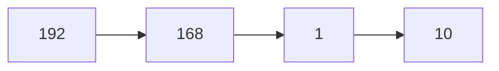

##### Characteristics of IPv4

###### 32-bit Addressing

IPv4 uses 32 bits to represent an address.

###### Limited Address Space

Maximum number of addresses:


Approximately:

```text
4.3 Billion Addresses
```

###### Human Readable

Easier to read and configure.

###### Widely Supported

Most existing systems and devices use IPv4.

##### Private IPv4 Address Ranges

| Class | Address Range |
|---------|--------------|
| Class A | 10.0.0.0 – 10.255.255.255 |
| Class B | 172.16.0.0 – 172.31.255.255 |
| Class C | 192.168.0.0 – 192.168.255.255 |

AWS VPCs commonly use:

```text
10.0.0.0/16
172.31.0.0/16
192.168.0.0/16
```

##### Example

An EC2 instance may receive:

```text
10.0.1.25
```

inside a VPC.

##### Advantages of IPv4

- Simple and widely supported
- Easy to configure
- Compatible with most applications
- Large existing infrastructure support

##### Limitations of IPv4

- Limited address space
- Address exhaustion
- Requires NAT in many environments

##### Key Points to Remember

- IPv4 uses 32 bits.
- Written as four octets.
- Maximum address space is approximately 4.3 billion addresses.
- Commonly used in AWS VPCs.

#### 1.1.2 IPv6 Addressing

IPv6 (Internet Protocol Version 6) was developed to overcome IPv4 address limitations.

IPv6 provides a significantly larger address space and improved networking capabilities.

##### IPv6 Format

```text
2001:0db8:85a3:0000:0000:8a2e:0370:7334
```

Compressed format:

```text
2001:db8:85a3::8a2e:370:7334
```

##### IPv6 Structure


##### Characteristics of IPv6

###### 128-bit Addressing

IPv6 uses 128 bits for addressing.

###### Extremely Large Address Space

Maximum number of addresses:


This provides virtually unlimited addresses.

###### Better Scalability

Supports future Internet growth.

###### Improved Routing

More efficient routing mechanisms.

###### Built-in Security Features

Designed with IPsec support.

##### IPv4 vs IPv6

| Feature | IPv4 | IPv6 |
|----------|----------|----------|
| Address Length | 32-bit | 128-bit |
| Format | Decimal | Hexadecimal |
| Address Space | 4.3 Billion | Extremely Large |
| NAT Requirement | Common | Usually Not Required |
| Header Complexity | Higher | Simplified |

##### Example

AWS supports IPv6-enabled VPCs where resources can receive:

```text
2406:da18:abcd:1234::100
```

##### Advantages of IPv6

- Vast address space
- Better scalability
- Improved routing efficiency
- Future-proof networking

##### Key Points to Remember

- IPv6 uses 128 bits.
- Written in hexadecimal format.
- Provides significantly more addresses than IPv4.
- Supported by AWS VPC networking.

#### 1.1.3 CIDR Notation

CIDR (Classless Inter-Domain Routing) is a method used to define IP address ranges.

CIDR allows networks to be divided efficiently and helps allocate IP addresses without wasting address space.

AWS heavily relies on CIDR notation when creating:

- VPCs
- Subnets
- Route Tables
- Security Rules

The PPT specifically mentions CIDR notation using the example:

```text
10.0.0.0/16
```

which defines an address range inside a VPC. :contentReference[oaicite:3]{index=3}

##### CIDR Format

```text
Network Address / Prefix Length
```

Example:

```text
10.0.0.0/16
```

Where:

```text
10.0.0.0 → Network Address
16       → Prefix Length
```

##### CIDR Structure

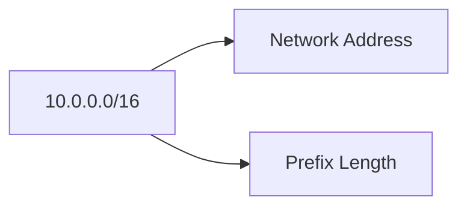

##### Meaning of Prefix Length

The prefix length indicates how many bits are reserved for the network portion.

Example:

| CIDR | Network Bits | Host Bits |
|--------|------------|------------|
| /16 | 16 | 16 |
| /24 | 24 | 8 |
| /28 | 28 | 4 |

##### Why CIDR is Important

###### Efficient IP Allocation

Reduces wastage of IP addresses.

###### Flexible Network Design

Allows creation of custom-sized networks.

###### Subnet Creation

Used for dividing VPCs into multiple subnets.

###### Routing Optimization

Simplifies route management.

##### Example CIDR Sizes

| CIDR Block | Approximate Number of Addresses |
|------------|-------------------------------|
| /16 | 65,536 |
| /24 | 256 |
| /28 | 16 |

##### AWS Usage

When creating a VPC, AWS requires a CIDR block.

Example:

```text
10.0.0.0/16
```

Subnets can then be created from that CIDR range.

##### Key Points to Remember

- CIDR defines network address ranges.
- AWS uses CIDR blocks for VPCs and subnets.
- CIDR consists of a network address and prefix length.
- Smaller prefix values provide larger address ranges.

##### 1.1.3.1 CIDR Block Example (10.0.0.0/16)

The CIDR block:

```text
10.0.0.0/16
```

is one of the most commonly used VPC address ranges in AWS.

This CIDR block belongs to the private IPv4 address range.

##### Breakdown

```text
10.0.0.0  → Network Address
/16       → Prefix Length
```

##### Address Range

The network can contain addresses from:

```text
10.0.0.0
to
10.0.255.255
```

##### CIDR Visualization

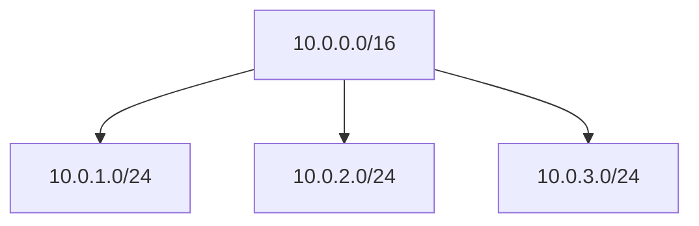

##### Example VPC Design

```text
VPC CIDR : 10.0.0.0/16

Public Subnet  : 10.0.1.0/24
Private Subnet : 10.0.2.0/24
Database Subnet: 10.0.3.0/24
```

##### Real-World AWS Example

When creating a VPC:

```text
Name      : Production-VPC
CIDR Block: 10.0.0.0/16
```

AWS allows multiple subnets to be created within this range.

##### Benefits

- Large address space
- Supports multiple subnets
- Easy network segmentation
- Common AWS best practice

##### Exam Tip

```text
10.0.0.0/16
```

is the most frequently used VPC CIDR example in AWS documentation and certification exams.

#### Summary

| Concept | Description |
|----------|-------------|
| IPv4 | 32-bit addressing scheme |
| IPv6 | 128-bit addressing scheme |
| CIDR | Method of defining network ranges |
| 10.0.0.0/16 | Common AWS VPC CIDR Block |

#### Key Points to Remember

- Every network device requires an IP address.
- IPv4 uses 32-bit addresses and remains widely used.
- IPv6 uses 128-bit addresses and solves address exhaustion.
- CIDR notation defines network ranges efficiently.
- AWS VPCs are created using CIDR blocks.
- `10.0.0.0/16` is a common VPC CIDR example in AWS networking.


### 1.2 Routing

Routing is the process of directing network traffic from a source to a destination through the most appropriate path.

In AWS networking, routing determines how data packets move:

- Between resources inside a VPC
- Between a VPC and the Internet
- Between different VPCs
- Between on-premises networks and AWS

Routing is one of the most important networking concepts because it controls connectivity and communication within cloud environments.

AWS implements routing using **Route Tables**, which contain rules that define where network traffic should be sent.

#### 1.2.1 Purpose of Routing

The primary purpose of routing is to ensure that network traffic reaches its intended destination efficiently and securely.

Without routing, devices would not know where to send data packets.

##### Why Routing is Required

Consider a network containing:

- EC2 Instances
- Databases
- Load Balancers
- Internet Gateways

These resources need a mechanism to communicate with one another.

Routing provides this mechanism.

##### Routing Concept

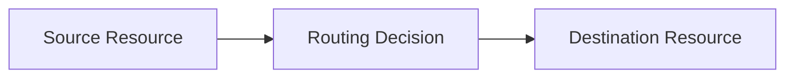

##### Objectives of Routing

###### Enable Communication

Allows resources to communicate.

###### Direct Traffic

Determines the path data should follow.

###### Improve Performance

Selects efficient routes.

###### Support Connectivity

Connects internal and external networks.

###### Enhance Security

Controls where traffic can flow.

##### Routing in AWS

AWS uses routing to enable:

- EC2-to-EC2 communication
- EC2-to-Internet communication
- VPC-to-VPC communication
- On-Premises-to-AWS communication

##### Example

An EC2 instance in a subnet wants to access:

```text
www.amazon.com
```

The routing system determines:

```text
Destination → Internet Gateway → Internet
```

##### Benefits of Routing

- Network Connectivity
- Traffic Control
- Improved Performance
- Better Network Organization

##### Key Points to Remember

- Routing determines how data travels across networks.
- It connects resources and networks.
- AWS uses route tables to implement routing.
- Every packet relies on routing decisions.

#### 1.2.2 Route Tables

A Route Table is a collection of routing rules that determine where network traffic should be directed.

Every subnet inside a VPC must be associated with a route table.

AWS automatically creates a main route table when a VPC is created.

##### Definition

A Route Table contains routes that specify:

```text
Destination → Target
```

Where:

- Destination = Network address
- Target = Next hop location

##### Route Table Structure

| Destination | Target |
|------------|----------|
| 10.0.0.0/16 | Local |
| 0.0.0.0/0 | Internet Gateway |

##### Route Table Architecture

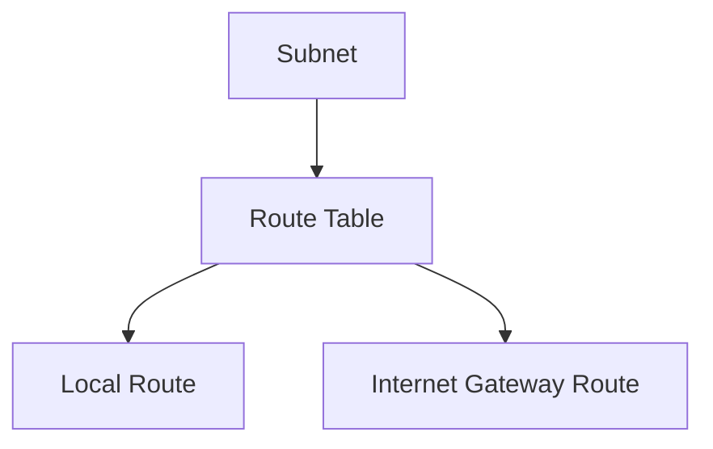

##### Components of a Route

###### Destination

Specifies the network range.

Example:

```text
10.0.0.0/16
```

###### Target

Specifies where traffic should be sent.

Examples:

- Local
- Internet Gateway
- NAT Gateway
- VPC Peering Connection
- Transit Gateway

##### Default Local Route

Every VPC automatically receives a local route.

Example:

| Destination | Target |
|------------|----------|
| 10.0.0.0/16 | Local |

This route allows communication between resources within the VPC.

##### Public Route Table Example

| Destination | Target |
|------------|----------|
| 10.0.0.0/16 | Local |
| 0.0.0.0/0 | Internet Gateway |

##### Private Route Table Example

| Destination | Target |
|------------|----------|
| 10.0.0.0/16 | Local |
| 0.0.0.0/0 | NAT Gateway |

##### Types of Route Tables

###### Main Route Table

Automatically created with the VPC.

###### Custom Route Table

Created manually for specific routing requirements.

##### Example

A public subnet uses a route table that sends Internet traffic to:

```text
Internet Gateway (IGW)
```

##### Key Points to Remember

- Route Tables contain routing rules.
- Every subnet must use a Route Table.
- AWS automatically creates a Main Route Table.
- Routes consist of Destinations and Targets.

#### 1.2.3 Traffic Flow Management

Traffic Flow Management refers to controlling and directing network traffic between AWS resources and external networks.

AWS Route Tables manage how traffic moves across the infrastructure.

Traffic can flow:

- Within a VPC
- To the Internet
- Between VPCs
- Between AWS and on-premises environments

##### Traffic Flow Overview

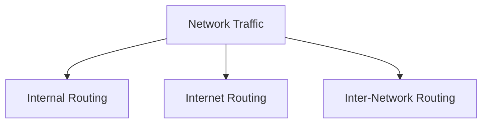

##### Benefits of Traffic Flow Management

- Efficient Communication
- Network Isolation
- Security Control
- High Availability
- Scalability

##### Key Points to Remember

- Traffic Flow Management controls packet movement.
- Route Tables govern traffic flow.
- Different traffic types require different routes.

##### 1.2.3.1 Internal VPC Routing

Internal VPC Routing refers to communication between resources inside the same VPC.

AWS automatically enables this using the Local Route.

##### Internal Routing Architecture

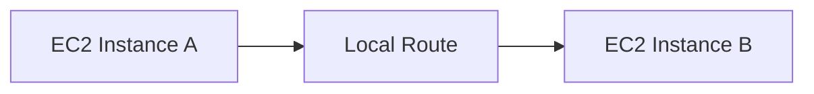

##### Default Local Route

Example:

| Destination | Target |
|------------|----------|
| 10.0.0.0/16 | Local |

This route allows all resources within the VPC to communicate.

##### Example

VPC CIDR:

```text
10.0.0.0/16
```

Resources:

```text
EC2-A → 10.0.1.10
EC2-B → 10.0.2.15
```

Communication:

```text
10.0.1.10 ↔ 10.0.2.15
```

using the Local Route.

##### Benefits

- Fast Communication
- Private Connectivity
- No Internet Required

##### Key Points to Remember

- Internal routing uses Local Routes.
- Resources communicate within the VPC.
- Traffic never leaves AWS infrastructure.

##### 1.2.3.2 Internet Routing

Internet Routing allows AWS resources to communicate with the public Internet.

This requires:

- Internet Gateway (IGW)
- Public IP Address
- Route Table Entry

##### Internet Routing Architecture

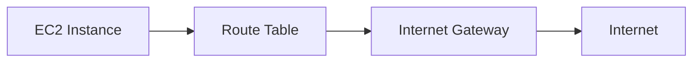

##### Internet Route

| Destination | Target |
|------------|----------|
| 0.0.0.0/0 | Internet Gateway |

Meaning:

```text
Any Unknown Destination
→ Internet Gateway
→ Internet
```

##### Example

A web server in a public subnet receives requests from Internet users.

Traffic Flow:

```text
User
 ↓
Internet
 ↓
Internet Gateway
 ↓
EC2 Instance
```

##### Requirements for Internet Access

###### Public Subnet

Subnet must use a route table connected to an IGW.

###### Internet Gateway

Must be attached to the VPC.

###### Public IP Address

Resource must have a public IP.

##### Benefits

- Global Accessibility
- Web Hosting Support
- Public API Access

##### Key Points to Remember

- Internet routing requires an Internet Gateway.
- Public subnets enable Internet access.
- Route `0.0.0.0/0` represents all external destinations.

##### 1.2.3.3 Inter-Network Routing

Inter-Network Routing enables communication between separate networks.

These networks may include:

- VPC-to-VPC
- AWS-to-On-Premises
- Multiple AWS Accounts
- Hybrid Cloud Environments

##### Inter-Network Routing Architecture

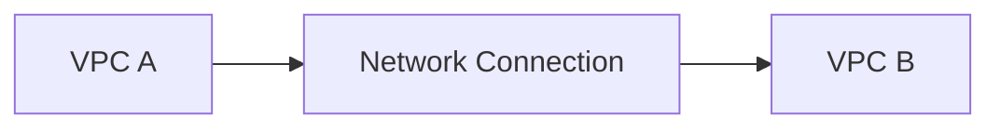

##### Common AWS Inter-Network Solutions

###### VPC Peering

Connects two VPCs privately.

###### Transit Gateway

Central hub for connecting multiple VPCs.

###### AWS Direct Connect

Dedicated connection between AWS and on-premises networks.

###### VPN Connection

Encrypted connection over the Internet.

##### VPC Peering Example

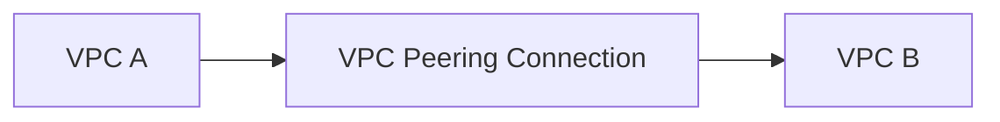

##### AWS Direct Connect Example


##### Benefits

- Hybrid Cloud Connectivity
- Secure Communication
- Resource Sharing
- Centralized Networking

##### Real-World Example

A company has:

```text
Corporate Data Center
```

connected to:

```text
AWS VPC
```

using AWS Direct Connect.

Employees access AWS resources through the private connection.

##### Key Points to Remember

- Inter-Network Routing connects separate networks.
- VPC Peering enables VPC-to-VPC communication.
- Direct Connect enables AWS-to-On-Premises connectivity.
- Transit Gateway simplifies large-scale networking.

#### Summary

| Routing Type | Purpose |
|-------------|---------|
| Internal VPC Routing | Communication within a VPC |
| Internet Routing | Communication with the Internet |
| Inter-Network Routing | Communication between separate networks |

#### Key Points to Remember

- Routing determines how network traffic reaches its destination.
- Route Tables contain routing rules.
- Every subnet must be associated with a Route Table.
- Internal VPC Routing uses Local Routes.
- Internet Routing requires an Internet Gateway.
- Inter-Network Routing enables connectivity between different networks.
- Route Tables are the foundation of AWS networking.


### 1.3 Firewalls in AWS

A firewall is a security mechanism that controls incoming and outgoing network traffic based on predefined rules.

In AWS, firewalls help protect cloud resources from unauthorized access while allowing legitimate communication.

AWS primarily provides two firewall mechanisms within a VPC:

1. Security Groups
2. Network Access Control Lists (NACLs)

These components work together to provide layered security for AWS resources.

##### Firewall Security Layers

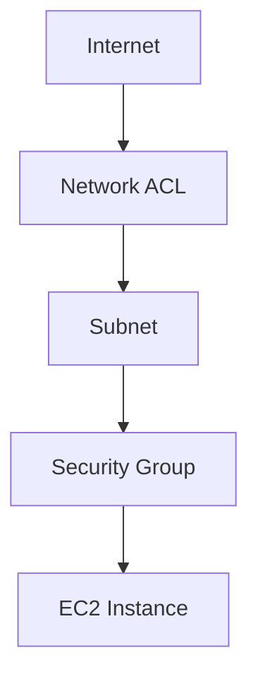

##### Why Firewalls are Important

Firewalls help:

- Prevent unauthorized access
- Protect applications
- Secure databases
- Control network communication
- Reduce attack surfaces

##### Example

A web server may allow:

```text
HTTP  (Port 80)
HTTPS (Port 443)
```

while blocking all other traffic.

##### Key Points to Remember

- Firewalls control network traffic.
- AWS provides Security Groups and NACLs.
- Security is implemented in layers.
- Firewalls are essential for protecting AWS resources.

#### 1.3.1 Purpose of Firewalls

The primary purpose of a firewall is to monitor and control network traffic entering or leaving a resource.

Firewalls enforce security policies by allowing or blocking specific types of traffic.

##### Objectives of Firewalls

###### Access Control

Determines who can access resources.

###### Traffic Filtering

Allows only approved traffic.

###### Threat Prevention

Blocks malicious network activity.

###### Network Isolation

Separates secure resources from public networks.

###### Compliance Support

Helps meet security regulations and standards.

##### Firewall Operation

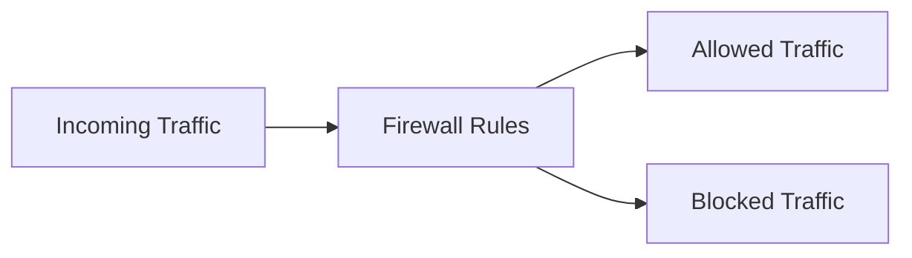

##### Example

Consider a database server.

Allowed:

```text
MySQL Port 3306
From Application Servers Only
```

Blocked:

```text
Internet Access
```

##### Benefits of Firewalls

- Improved Security
- Controlled Access
- Reduced Attack Surface
- Better Compliance

##### Real-World Example

An e-commerce application allows customers to access its website but prevents direct access to backend databases.

##### Key Points to Remember

- Firewalls control network access.
- Traffic can be allowed or denied.
- Firewalls protect cloud resources.
- Security policies are enforced through rules.

#### 1.3.2 Security Groups

A Security Group is a virtual firewall that controls traffic at the instance level.

Security Groups are attached directly to AWS resources such as:

- EC2 Instances
- RDS Databases
- Load Balancers
- Lambda Functions within VPCs

Security Groups specify which traffic is allowed to reach a resource.

##### Security Group Architecture

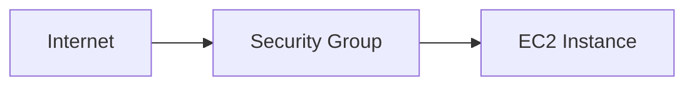

##### Characteristics of Security Groups

###### Instance-Level Security

Protects individual resources.

###### Stateful Firewall

Automatically allows return traffic.

###### Allow Rules Only

Security Groups do not contain deny rules.

###### Multiple Security Groups

A resource can be associated with multiple Security Groups.

##### Security Group Rule Components

| Component | Description |
|------------|-------------|
| Protocol | TCP, UDP, ICMP |
| Port Range | Allowed Ports |
| Source/Destination | Allowed Network |
| Action | Allow |

##### Example Security Group

| Protocol | Port | Source |
|-----------|------|---------|
| TCP | 80 | 0.0.0.0/0 |
| TCP | 443 | 0.0.0.0/0 |
| TCP | 22 | 192.168.1.0/24 |

This configuration allows:

- HTTP Traffic
- HTTPS Traffic
- SSH Access from a specific network

##### Security Group Workflow

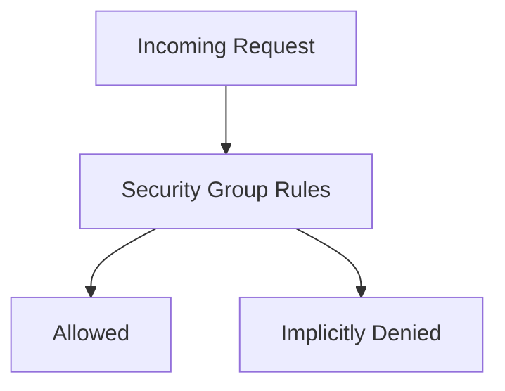

##### Benefits of Security Groups

- Fine-Grained Access Control
- Easy Configuration
- Automatic Return Traffic Handling
- Resource-Level Protection

##### Example

A web server Security Group allows:

```text
Port 80  → HTTP
Port 443 → HTTPS
```

while blocking all other traffic.

##### Key Points to Remember

- Security Groups protect individual resources.
- Security Groups contain only Allow Rules.
- Security Groups are stateful.
- Every EC2 instance should be protected by a Security Group.

##### 1.3.2.1 Stateful Firewall

A Stateful Firewall remembers previous network connections.

When incoming traffic is allowed, the response traffic is automatically permitted without requiring an explicit outbound rule.

This behavior simplifies firewall management.

##### Stateful Firewall Concept


##### How Stateful Firewalls Work

If this rule exists:

| Type | Port | Source |
|--------|------|---------|
| HTTP | 80 | 0.0.0.0/0 |

Then:

```text
Incoming Request → Allowed
Outgoing Response → Automatically Allowed
```

No separate outbound response rule is required.

##### Example

User accesses:

```text
http://example.com
```

Traffic Flow:

```text
User → EC2 → Response → User
```

The response is automatically permitted.

##### Advantages of Stateful Firewalls

- Simpler Configuration
- Automatic Return Traffic
- Reduced Administrative Effort
- Better User Experience

##### Key Points to Remember

- Security Groups are stateful.
- Return traffic is automatically allowed.
- Explicit response rules are not required.
- Stateful behavior simplifies security management.

#### 1.3.3 Network Access Control Lists (NACLs)

A Network Access Control List (NACL) is a firewall that operates at the subnet level.

NACLs control traffic entering and leaving entire subnets.

Unlike Security Groups, NACLs support both:

- Allow Rules
- Deny Rules

##### NACL Architecture

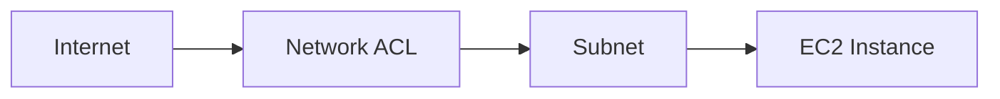

##### Characteristics of NACLs

###### Subnet-Level Security

Applies to all resources in a subnet.

###### Stateless Firewall

Does not remember previous connections.

###### Supports Allow and Deny Rules

Traffic can be explicitly permitted or blocked.

###### Rule Evaluation Order

Rules are processed sequentially based on rule numbers.

##### NACL Rule Components

| Component | Description |
|------------|-------------|
| Rule Number | Evaluation Order |
| Protocol | TCP, UDP, ICMP |
| Port Range | Allowed or Denied Ports |
| Source/Destination | Network Range |
| Action | Allow or Deny |

##### Example NACL

| Rule Number | Protocol | Port | Action |
|------------|----------|------|---------|
| 100 | TCP | 80 | Allow |
| 110 | TCP | 443 | Allow |
| 120 | TCP | 22 | Deny |

##### Rule Evaluation Process

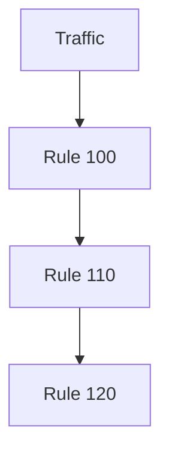

##### Benefits of NACLs

- Additional Security Layer
- Explicit Deny Capability
- Subnet-Level Protection
- Network Segmentation

##### Example

A public subnet may allow:

```text
HTTP  (80)
HTTPS (443)
```

and explicitly deny:

```text
SSH (22)
```

from the Internet.

##### Key Points to Remember

- NACLs operate at the subnet level.
- NACLs support Allow and Deny rules.
- NACLs are stateless.
- Rules are evaluated in numerical order.

##### 1.3.3.1 Stateless Firewall

A Stateless Firewall does not remember previous network connections.

Every packet is evaluated independently against the firewall rules.

Because NACLs are stateless, inbound and outbound traffic must be explicitly allowed.

##### Stateless Firewall Concept


##### How Stateless Firewalls Work

Inbound Rule:

| Port | Action |
|--------|---------|
| 80 | Allow |

Outbound Rule:

| Port | Action |
|--------|---------|
| 1024-65535 | Allow |

Both rules are required.

##### Example

User sends HTTP request:

```text
User → Server
```

Allowed by inbound rule.

Server response:

```text
Server → User
```

Requires separate outbound rule.

##### Stateful vs Stateless

| Feature | Security Group | NACL |
|----------|---------------|------|
| Type | Stateful | Stateless |
| Return Traffic | Automatically Allowed | Requires Explicit Rule |
| Rule Types | Allow Only | Allow and Deny |
| Level | Instance | Subnet |

##### Advantages of Stateless Firewalls

- Greater Control
- Explicit Rule Management
- Stronger Network Segmentation

##### Key Points to Remember

- NACLs are stateless.
- Return traffic requires explicit rules.
- Every packet is evaluated independently.
- Both inbound and outbound rules must be configured.

#### Security Groups vs NACLs

| Feature | Security Group | NACL |
|----------|---------------|------|
| Security Level | Instance Level | Subnet Level |
| Firewall Type | Stateful | Stateless |
| Allow Rules | Yes | Yes |
| Deny Rules | No | Yes |
| Rule Evaluation | All Rules Evaluated | Rules Evaluated by Number |
| Return Traffic | Automatically Allowed | Requires Explicit Rule |

##### Security Layers in AWS

```mermaid
flowchart TD

    Internet[Internet]

    NACL[Network ACL]

    Subnet[Subnet]

    SecurityGroup[Security Group]

    Instance[EC2 Instance]

    Internet --> NACL
    NACL --> Subnet
    Subnet --> SecurityGroup
    SecurityGroup --> Instance
```

#### Summary

| Firewall Type | Purpose |
|---------------|----------|
| Security Group | Instance-Level Protection |
| Network ACL | Subnet-Level Protection |
| Stateful Firewall | Remembers Connections |
| Stateless Firewall | Evaluates Every Packet Independently |

#### Key Points to Remember

- AWS provides two primary firewall mechanisms: Security Groups and NACLs.
- Security Groups operate at the instance level.
- NACLs operate at the subnet level.
- Security Groups are stateful.
- NACLs are stateless.
- Security Groups allow traffic only.
- NACLs support both allow and deny rules.
- Using Security Groups and NACLs together provides layered network security.


### 1.4 Domain Name System (DNS)

The Domain Name System (DNS) is often called the **phonebook of the Internet**.

Humans prefer using easy-to-remember domain names such as:

```text
www.amazon.com
www.google.com
www.aws.amazon.com
```

However, computers communicate using IP addresses such as:

```text
192.0.2.44
54.239.28.85
```

DNS is the system that translates domain names into IP addresses so that users can access websites and network services without remembering numerical addresses.

In AWS, DNS services are primarily provided through **Amazon Route 53**, which offers scalable and highly available domain name resolution.

#### 1.4.1 DNS Fundamentals

DNS (Domain Name System) is a distributed naming system used to translate human-readable domain names into machine-readable IP addresses.

Without DNS, users would need to memorize IP addresses for every website they visit.

##### Why DNS is Required

Humans prefer:

```text
www.amazon.com
```

Computers require:

```text
54.239.28.85
```

DNS converts:

```text
Domain Name → IP Address
```

##### Basic DNS Concept

```mermaid
flowchart LR

    User[User]

    Domain[www.amazon.com]

    DNS[DNS Server]

    IP[54.239.28.85]

    User --> Domain
    Domain --> DNS
    DNS --> IP
```

##### Components of DNS

###### Domain Name

Human-readable website address.

Examples:

```text
amazon.com
google.com
openai.com
```

###### IP Address

Numerical address used for communication.

Example:

```text
54.239.28.85
```

###### DNS Server

A server that stores DNS records and performs name resolution.

###### DNS Records

Mappings between domain names and resources.

##### DNS Hierarchy

DNS follows a hierarchical structure.

```mermaid
flowchart TD

    Root["Root (.)"]

    TLD["Top-Level Domain (.com)"]

    Domain["amazon.com"]

    Subdomain["www.amazon.com"]

    Root --> TLD
    TLD --> Domain
    Domain --> Subdomain
```

##### DNS Record Types

| Record Type | Purpose |
|------------|----------|
| A Record | Maps Domain to IPv4 Address |
| AAAA Record | Maps Domain to IPv6 Address |
| CNAME | Alias Record |
| MX Record | Mail Server Record |
| TXT Record | Text Information |
| NS Record | Name Server Record |

##### Example

A DNS A Record:

```text
amazon.com → 54.239.28.85
```

##### Benefits of DNS

- Easy website access
- Human-readable names
- Centralized name management
- Scalable Internet architecture

##### Key Points to Remember

- DNS stands for Domain Name System.
- DNS translates domain names into IP addresses.
- DNS is hierarchical.
- DNS records store domain mappings.

#### 1.4.2 Domain Name Resolution

Domain Name Resolution is the process of converting a domain name into an IP address.

Whenever a user enters a website address into a browser, DNS performs a lookup process to identify the corresponding IP address.

##### Domain Resolution Process

```mermaid
sequenceDiagram

    participant User
    participant DNS
    participant Server

    User->>DNS: Request IP for www.example.com
    DNS-->>User: Return IP Address
    User->>Server: Connect Using IP Address
    Server-->>User: Return Website
```

##### Step-by-Step Resolution

###### Step 1: User Requests Website

Example:

```text
www.amazon.com
```

###### Step 2: DNS Query

The browser sends a request to a DNS server.

###### Step 3: DNS Lookup

DNS searches for the matching record.

###### Step 4: IP Address Returned

Example:

```text
54.239.28.85
```

###### Step 5: Connection Established

The browser connects to the web server using the IP address.

##### Resolution Workflow

```mermaid
flowchart LR

    User[User]

    Domain[Domain Name]

    DNS[DNS Server]

    IP[IP Address]

    Website[Website Server]

    User --> Domain
    Domain --> DNS
    DNS --> IP
    IP --> Website
```

##### Example

User enters:

```text
www.aws.amazon.com
```

DNS returns:

```text
IP Address
```

Browser then connects to the AWS website.

##### Benefits of Domain Resolution

###### Simplicity

Users remember names instead of IPs.

###### Flexibility

IP addresses can change without affecting users.

###### Scalability

Supports billions of devices and websites.

###### Reliability

Distributed DNS infrastructure ensures availability.

##### DNS Caching

To improve performance, DNS responses are often cached.

##### DNS Cache Workflow

```mermaid
flowchart TD

    Request[DNS Request]

    Cache{Cached?}

    Cached[Return Cached Result]

    Lookup[Perform DNS Lookup]

    Request --> Cache

    Cache -->|Yes| Cached
    Cache -->|No| Lookup
```

##### Benefits of DNS Caching

- Faster responses
- Reduced DNS traffic
- Improved user experience

##### Key Points to Remember

- Domain resolution converts names into IP addresses.
- DNS servers perform lookups.
- DNS caching improves performance.
- Every website request usually involves DNS resolution.

#### 1.4.3 AWS Route 53 Overview

Amazon Route 53 is AWS's fully managed Domain Name System (DNS) service.

It provides:

- Domain Registration
- DNS Resolution
- Traffic Routing
- Health Checking

Route 53 is designed for high availability, scalability, and low-latency DNS services.

##### Why the Name Route 53?

The name comes from:

```text
Port 53
```

which is the standard port used by DNS services.

##### Route 53 Architecture

```mermaid
flowchart LR

    User[User]

    Route53[Amazon Route 53]

    Website[AWS Application]

    User --> Route53
    Route53 --> Website
```

##### Core Functions of Route 53

###### Domain Registration

Allows users to purchase and manage domain names.

Examples:

```text
example.com
mycompany.in
awsdemo.net
```

###### DNS Management

Stores and manages DNS records.

###### Traffic Routing

Routes users to appropriate resources.

###### Health Monitoring

Monitors resource availability.

##### Route 53 Features

| Feature | Description |
|----------|-------------|
| Managed DNS | Fully Managed Service |
| High Availability | Global DNS Infrastructure |
| Domain Registration | Purchase Domains |
| Routing Policies | Intelligent Traffic Routing |
| Health Checks | Endpoint Monitoring |
| AWS Integration | Works with AWS Services |

##### Route 53 Routing Example

```mermaid
flowchart TD

    User[User]

    Route53[Route 53]

    LoadBalancer[Elastic Load Balancer]

    EC2[EC2 Instances]

    User --> Route53
    Route53 --> LoadBalancer
    LoadBalancer --> EC2
```

##### Common Route 53 Routing Policies

###### Simple Routing

Single resource destination.

###### Weighted Routing

Traffic distributed based on percentages.

###### Latency-Based Routing

Routes users to the nearest region.

###### Geolocation Routing

Routes based on user location.

###### Failover Routing

Provides automatic disaster recovery.

##### AWS Services Integrated with Route 53

- Amazon EC2
- Elastic Load Balancer (ELB)
- Amazon CloudFront
- Amazon S3
- AWS Global Accelerator

##### Example

Domain:

```text
www.example.com
```

Route 53 Record:

```text
www.example.com
        ↓
Elastic Load Balancer
        ↓
EC2 Instances
```

##### Benefits of Route 53

###### High Availability

Built on AWS global infrastructure.

###### Scalability

Handles billions of DNS requests.

###### Low Latency

Fast DNS responses worldwide.

###### Security

Supports DNS security best practices.

###### AWS Integration

Works seamlessly with AWS services.

##### Real-World Example

A company hosts its application on AWS and uses Route 53 to:

- Register its domain
- Manage DNS records
- Route users to the nearest AWS Region
- Monitor application health

##### Key Points to Remember

- Route 53 is AWS's managed DNS service.
- It provides domain registration and DNS resolution.
- Route 53 supports intelligent routing policies.
- It integrates with many AWS services.
- The name Route 53 comes from DNS Port 53.

#### DNS Resolution Using Route 53

```mermaid
sequenceDiagram

    participant User
    participant Route53
    participant ELB
    participant EC2

    User->>Route53: DNS Query
    Route53-->>User: IP Address

    User->>ELB: Request

    ELB->>EC2: Forward Request

    EC2-->>User: Response
```

#### Summary

| Concept | Description |
|----------|-------------|
| DNS | Converts domain names into IP addresses |
| Domain Name Resolution | Process of finding IP addresses |
| DNS Records | Store domain-to-resource mappings |
| Route 53 | AWS Managed DNS Service |

#### Key Points to Remember

- DNS translates domain names into IP addresses.
- Domain name resolution enables website access.
- DNS uses records such as A, AAAA, CNAME, MX, and NS.
- Route 53 is AWS's managed DNS service.
- Route 53 supports domain registration, routing, and health checks.
- DNS is a fundamental component of AWS networking.

## 2. Amazon Virtual Private Cloud (VPC)


### 2.1 Introduction to Amazon VPC

Amazon Virtual Private Cloud (Amazon VPC) is one of the core networking services in AWS. It enables organizations to create a logically isolated network within the AWS Cloud where they can launch and manage AWS resources securely.

A VPC gives customers complete control over:

- IP Addressing
- Subnets
- Route Tables
- Internet Connectivity
- Security Policies

Using Amazon VPC, organizations can design cloud networks similar to traditional on-premises data centers while benefiting from AWS scalability and flexibility.

#### Amazon VPC Overview

```mermaid
flowchart TD

    AWS[AWS Cloud]

    VPC[Amazon VPC]

    Public[Public Subnet]
    Private[Private Subnet]

    EC2[EC2 Instances]
    DB[Database]

    AWS --> VPC

    VPC --> Public
    VPC --> Private

    Public --> EC2
    Private --> DB
```

#### Why Amazon VPC is Important

Amazon VPC provides:

- Network Isolation
- Security
- Traffic Control
- Custom Networking
- Hybrid Connectivity

Without VPCs, AWS resources would operate in a shared networking environment with limited customization.

#### 2.1.1 Definition of VPC

A Virtual Private Cloud (VPC) is a logically isolated virtual network within AWS where customers can launch AWS resources.

A VPC allows organizations to create their own private networking environment inside the AWS Cloud.

##### Definition

```text
A VPC is a customizable virtual network dedicated to an AWS account.
```

Resources launched inside a VPC include:

- EC2 Instances
- RDS Databases
- Load Balancers
- Lambda Functions
- Containers

##### VPC Structure

```mermaid
flowchart TD

    VPC[Amazon VPC]

    PublicSubnet[Public Subnet]
    PrivateSubnet[Private Subnet]

    WebServer[Web Server]
    Database[Database Server]

    VPC --> PublicSubnet
    VPC --> PrivateSubnet

    PublicSubnet --> WebServer
    PrivateSubnet --> Database
```

##### Characteristics of a VPC

###### Private Network

Provides an isolated networking environment.

###### Customizable

Customers define network configuration.

###### Secure

Supports multiple security controls.

###### Scalable

Can host resources ranging from small applications to enterprise workloads.

##### Components of a VPC

| Component | Purpose |
|------------|----------|
| CIDR Block | Defines IP Address Range |
| Subnet | Network Segmentation |
| Route Table | Traffic Routing |
| Internet Gateway | Internet Connectivity |
| Security Groups | Instance Security |
| NACLs | Subnet Security |

##### Example

A company creates a VPC using:

```text
CIDR Block: 10.0.0.0/16
```

and deploys:

- Web Servers
- Application Servers
- Databases

within that network.

##### Real-World Example

An e-commerce company hosts:

- Frontend servers in public subnets
- Backend databases in private subnets

inside a single VPC.

##### Key Points to Remember

- VPC stands for Virtual Private Cloud.
- A VPC is a virtual network inside AWS.
- AWS resources are launched inside a VPC.
- Customers control network configuration.

#### 2.1.2 Logical Isolation in AWS

One of the most important features of Amazon VPC is Logical Isolation.

Logical Isolation means that resources inside one VPC are separated from resources in other VPCs unless explicit connectivity is configured.

This isolation helps organizations maintain security and control over their cloud environments.

##### What is Logical Isolation?

Logical Isolation creates separate networking environments within the AWS Cloud.

Even though multiple customers share AWS infrastructure, their VPCs remain isolated from one another.

##### Logical Isolation Concept

```mermaid
flowchart LR

    VPC1[VPC A]

    AWS[AWS Infrastructure]

    VPC2[VPC B]

    VPC1 --> AWS
    VPC2 --> AWS
```

Although both VPCs use AWS infrastructure:

```text
VPC A ≠ VPC B
```

No communication occurs unless explicitly configured.

##### Benefits of Logical Isolation

###### Enhanced Security

Resources remain isolated from other networks.

###### Better Control

Organizations define their own network rules.

###### Compliance Support

Helps meet regulatory requirements.

###### Reduced Risk

Prevents accidental exposure of resources.

##### Communication Between VPCs

By default:

```text
Communication = Not Allowed
```

To enable communication:

- VPC Peering
- Transit Gateway
- VPN Connections

must be configured.

##### Isolation Example

```mermaid
flowchart TD

    VPCA[VPC A]

    VPCB[VPC B]

    Blocked[No Direct Communication]

    VPCA --> Blocked
    VPCB --> Blocked
```

##### Multi-VPC Environment

Organizations often create separate VPCs for:

| Environment | Purpose |
|-------------|----------|
| Development | Application Testing |
| Staging | Pre-Production Validation |
| Production | Live Applications |

Each VPC remains isolated.

##### Example

A company creates:

```text
Dev-VPC
Test-VPC
Production-VPC
```

to separate workloads and improve security.

##### Key Points to Remember

- VPCs are logically isolated.
- Isolation improves security.
- Resources cannot communicate across VPCs by default.
- Connectivity requires explicit configuration.

#### 2.1.3 Benefits of VPC

Amazon VPC provides numerous benefits that make it the foundation of AWS networking.

These benefits help organizations build secure, scalable, and highly available cloud environments.

##### Major Benefits of Amazon VPC

```mermaid
mindmap
  root((Amazon VPC))
    Security
    Isolation
    Scalability
    Flexibility
    Hybrid_Connectivity
    Cost_Efficiency
```

##### Security

VPC provides multiple security layers:

- Security Groups
- Network ACLs
- Private Subnets

This helps protect applications and data.

###### Example

Databases can be placed inside private subnets to prevent Internet access.

##### Network Isolation

Organizations can create separate environments for different workloads.

###### Benefits

- Improved Security
- Reduced Risk
- Better Resource Management

##### Scalability

VPCs support applications of all sizes.

Organizations can:

- Add More Subnets
- Launch More Instances
- Expand Network Capacity

without redesigning the network.

##### Flexibility

Customers control:

- IP Addressing
- Routing
- Connectivity
- Security Policies

##### Hybrid Cloud Connectivity

Amazon VPC supports integration with on-premises environments using:

- AWS VPN
- AWS Direct Connect

##### Hybrid Architecture Example

```mermaid
flowchart LR

    Datacenter[On-Premises Data Center]

    VPN[AWS VPN]

    VPC[Amazon VPC]

    Datacenter --> VPN
    VPN --> VPC
```

##### High Availability

Resources can be distributed across multiple Availability Zones.

Benefits include:

- Fault Tolerance
- Business Continuity
- Disaster Recovery

##### Cost Efficiency

Organizations pay only for resources consumed.

Benefits include:

- Reduced Infrastructure Costs
- Lower Operational Expenses
- Flexible Resource Usage

##### Real-World Example

A financial institution creates:

```text
Public Subnets
Private Subnets
Multiple Availability Zones
Dedicated Security Policies
```

within a VPC to host critical banking applications securely.

##### Comparison: Traditional Network vs Amazon VPC

| Feature | Traditional Data Center | Amazon VPC |
|----------|----------------------|-----------|
| Hardware Management | Customer | AWS |
| Network Isolation | Physical | Logical |
| Scalability | Limited | On Demand |
| Deployment Speed | Days or Weeks | Minutes |
| Global Availability | Limited | Worldwide |

##### VPC Benefits Summary

| Benefit | Description |
|----------|-------------|
| Security | Multiple security layers |
| Isolation | Separate virtual networks |
| Scalability | Expand resources easily |
| Flexibility | Full network control |
| Hybrid Connectivity | Connect AWS and on-premises |
| High Availability | Multi-AZ deployments |
| Cost Efficiency | Pay-as-you-go networking |

##### Key Points to Remember

- Amazon VPC is the foundation of AWS networking.
- VPC provides logical isolation.
- Organizations have complete control over network design.
- Security Groups and NACLs secure VPC resources.
- VPC supports hybrid cloud architectures.
- Applications can scale easily within a VPC.
- Most AWS resources are deployed inside a VPC.

#### Summary

| Topic | Description |
|----------|-------------|
| Definition of VPC | Logically isolated virtual network in AWS |
| Logical Isolation | Separation of resources and networks |
| Benefits of VPC | Security, scalability, flexibility, and connectivity |

#### Key Points to Remember

- VPC stands for Virtual Private Cloud.
- A VPC is a private network within AWS.
- VPCs provide logical isolation.
- Customers control IP addressing, routing, and security.
- VPC supports public and private subnets.
- VPC is the foundation of AWS cloud networking.


### 2.2 VPC Configuration

After creating a Virtual Private Cloud (VPC), the next step is configuring the network environment to support applications and services.

VPC configuration involves:

- Defining an IP Address Range
- Creating Subnets
- Configuring Route Tables
- Setting Up Network Gateways

These components work together to create a secure, scalable, and well-structured cloud network.

#### VPC Configuration Workflow

```mermaid
flowchart TD

    VPC[Create VPC]

    CIDR[Configure CIDR Block]

    Subnet[Create Subnets]

    RouteTable[Configure Route Tables]

    Gateway[Configure Gateways]

    VPC --> CIDR
    CIDR --> Subnet
    Subnet --> RouteTable
    RouteTable --> Gateway
```

#### 2.2.1 Custom IP Address Range

When creating a VPC, AWS requires an IP address range to be assigned.

This range determines the addresses available for all resources inside the VPC.

AWS uses CIDR notation to define the network address range.

##### Purpose of Custom IP Address Ranges

Custom IP ranges allow organizations to:

- Design scalable networks
- Avoid IP conflicts
- Create multiple subnets
- Support future expansion

##### Example

```text
10.0.0.0/16
```

This creates a private network capable of supporting thousands of resources.

##### VPC Address Range Concept

```mermaid
flowchart TD

    VPC["10.0.0.0/16"]

    Subnet1["10.0.1.0/24"]
    Subnet2["10.0.2.0/24"]
    Subnet3["10.0.3.0/24"]

    VPC --> Subnet1
    VPC --> Subnet2
    VPC --> Subnet3
```

##### Common Private CIDR Ranges

| Private Range | CIDR Example |
|---------------|-------------|
| Class A | 10.0.0.0/16 |
| Class B | 172.16.0.0/16 |
| Class C | 192.168.0.0/16 |

##### Best Practices

###### Plan for Growth

Allocate enough IP addresses for future resources.

###### Avoid Overlapping Networks

Ensure CIDR blocks do not overlap with other VPCs or on-premises networks.

###### Use Private Address Ranges

Use RFC1918 private IP ranges whenever possible.

##### Example

A company may create:

```text
Production VPC
CIDR: 10.0.0.0/16
```

to support web servers, application servers, and databases.

##### Key Points to Remember

- Every VPC requires a CIDR block.
- CIDR defines the VPC's IP address range.
- AWS recommends using private IP ranges.
- Proper planning prevents future network conflicts.

##### 2.2.1.1 CIDR Block Configuration

CIDR (Classless Inter-Domain Routing) is used to define the size and range of a network.

CIDR notation consists of:

```text
Network Address / Prefix Length
```

##### CIDR Example

```text
10.0.0.0/16
```

Where:

```text
10.0.0.0 = Network Address
16        = Prefix Length
```

##### CIDR Breakdown

| CIDR | Approximate Addresses |
|--------|----------------------|
| /16 | 65,536 |
| /24 | 256 |
| /28 | 16 |

##### CIDR Visualization

```mermaid
flowchart TD

    Network["10.0.0.0/16"]

    Sub1["10.0.1.0/24"]
    Sub2["10.0.2.0/24"]

    Network --> Sub1
    Network --> Sub2
```

##### Why CIDR is Important

###### Address Allocation

Defines available IP space.

###### Subnet Creation

Allows network segmentation.

###### Routing

Used in route tables and networking rules.

###### Scalability

Supports network expansion.

##### Example AWS Configuration

```text
VPC CIDR      : 10.0.0.0/16

Public Subnet : 10.0.1.0/24
Private Subnet: 10.0.2.0/24
```

##### Key Points to Remember

- CIDR defines network size.
- Smaller prefix values provide more addresses.
- CIDR is required during VPC creation.
- Subnets are created from the VPC CIDR block.

#### 2.2.2 Subnet Creation

A Subnet is a smaller network segment within a VPC.

Subnets divide the VPC into logical sections that can host different types of resources.

AWS allows subnets to be placed in specific Availability Zones.

##### Why Create Subnets?

Subnets help:

- Improve security
- Organize resources
- Separate workloads
- Control traffic flow

##### Subnet Architecture

```mermaid
flowchart TD

    VPC["10.0.0.0/16"]

    Public["Public Subnet
    10.0.1.0/24"]

    Private["Private Subnet
    10.0.2.0/24"]

    VPC --> Public
    VPC --> Private
```

##### Characteristics of Subnets

###### Exist Inside a VPC

Subnets cannot exist independently.

###### Associated with One Availability Zone

Each subnet belongs to a single AZ.

###### Use CIDR Blocks

Each subnet receives its own CIDR range.

###### Use Route Tables

Traffic behavior is controlled through route tables.

##### Types of Subnets

- Public Subnets
- Private Subnets

##### Example

```text
VPC CIDR : 10.0.0.0/16

Public Subnet  : 10.0.1.0/24
Private Subnet : 10.0.2.0/24
```

##### Key Points to Remember

- Subnets divide a VPC into smaller networks.
- Every subnet belongs to an Availability Zone.
- Subnets improve organization and security.
- Public and Private Subnets serve different purposes.

##### 2.2.2.1 Public Subnets

A Public Subnet is a subnet that can communicate directly with the Internet.

This is achieved through:

- Internet Gateway (IGW)
- Public Route
- Public IP Address

##### Public Subnet Architecture

```mermaid
flowchart LR

    Internet[Internet]

    IGW[Internet Gateway]

    PublicSubnet[Public Subnet]

    EC2[Web Server]

    Internet --> IGW
    IGW --> PublicSubnet
    PublicSubnet --> EC2
```

##### Characteristics

###### Internet Connectivity

Resources can communicate with the Internet.

###### Public IP Addresses

Resources typically receive public IPs.

###### Public Route Table

Contains route:

```text
0.0.0.0/0 → Internet Gateway
```

##### Typical Resources

- Web Servers
- Load Balancers
- Bastion Hosts

##### Example

```text
Subnet CIDR: 10.0.1.0/24
```

Hosts:

```text
Web Server
Application Gateway
```

##### Benefits

- Internet Accessibility
- Public Service Hosting
- Easy Customer Access

##### Key Points to Remember

- Public Subnets have Internet access.
- Route Tables direct traffic to an Internet Gateway.
- Commonly host web-facing resources.

##### 2.2.2.2 Private Subnets

A Private Subnet is a subnet that cannot be accessed directly from the Internet.

Private Subnets are used for sensitive resources requiring additional security.

##### Private Subnet Architecture

```mermaid
flowchart LR

    Internet[Internet]

    NAT[NAT Gateway]

    PrivateSubnet[Private Subnet]

    Database[Database]

    Internet --> NAT
    NAT --> PrivateSubnet
    PrivateSubnet --> Database
```

##### Characteristics

###### No Direct Internet Access

Resources cannot receive Internet traffic directly.

###### Enhanced Security

Protected from public access.

###### Internal Communication

Can communicate with other VPC resources.

##### Typical Resources

- Databases
- Application Servers
- Internal Services

##### Example

```text
Subnet CIDR: 10.0.2.0/24
```

Hosts:

```text
Amazon RDS
Backend Application Servers
```

##### Benefits

- Improved Security
- Reduced Attack Surface
- Better Compliance

##### Key Points to Remember

- Private Subnets do not allow direct Internet access.
- Ideal for sensitive workloads.
- Commonly host databases and backend systems.

#### 2.2.3 Route Table Configuration

A Route Table contains rules that determine how network traffic moves within and outside the VPC.

Every subnet must be associated with a route table.

##### Route Table Components

| Component | Description |
|------------|-------------|
| Destination | Target Network |
| Target | Next Hop |

##### Public Route Table

| Destination | Target |
|------------|----------|
| 10.0.0.0/16 | Local |
| 0.0.0.0/0 | Internet Gateway |

##### Private Route Table

| Destination | Target |
|------------|----------|
| 10.0.0.0/16 | Local |
| 0.0.0.0/0 | NAT Gateway |

##### Route Table Architecture

```mermaid
flowchart TD

    Subnet[Subnet]

    RouteTable[Route Table]

    Local[Local Route]
    Internet[Internet Gateway]

    Subnet --> RouteTable

    RouteTable --> Local
    RouteTable --> Internet
```

##### Functions of Route Tables

###### Internal Routing

Allows communication within the VPC.

###### Internet Routing

Directs traffic to the Internet Gateway.

###### NAT Routing

Supports outbound Internet access for private resources.

##### Example

Public subnet route:

```text
0.0.0.0/0 → Internet Gateway
```

Private subnet route:

```text
0.0.0.0/0 → NAT Gateway
```

##### Key Points to Remember

- Route Tables control traffic flow.
- Every subnet must use a route table.
- Routes contain destinations and targets.
- Route Tables determine Internet access.

#### 2.2.4 Network Gateway Configuration

Gateways connect a VPC to external networks.

AWS provides multiple gateway types for different networking requirements.

##### Types of AWS Gateways

| Gateway | Purpose |
|----------|----------|
| Internet Gateway (IGW) | Internet Access |
| NAT Gateway | Outbound Internet Access |
| Virtual Private Gateway | VPN Connectivity |
| Transit Gateway | Multi-Network Connectivity |

##### Internet Gateway (IGW)

Provides direct Internet access.

##### IGW Architecture

```mermaid
flowchart LR

    Internet[Internet]

    IGW[Internet Gateway]

    VPC[VPC]

    Internet --> IGW
    IGW --> VPC
```

##### NAT Gateway

Allows private subnet resources to access the Internet without becoming publicly accessible.

##### NAT Gateway Architecture

```mermaid
flowchart LR

    PrivateSubnet[Private Subnet]

    NAT[NAT Gateway]

    Internet[Internet]

    PrivateSubnet --> NAT
    NAT --> Internet
```

##### Transit Gateway

Acts as a central networking hub.

##### Transit Gateway Architecture

```mermaid
flowchart TD

    TGW[Transit Gateway]

    VPC1[VPC A]
    VPC2[VPC B]
    VPC3[VPC C]

    TGW --> VPC1
    TGW --> VPC2
    TGW --> VPC3
```

##### Benefits of Network Gateways

###### Connectivity

Connect resources to external networks.

###### Security

Control network access.

###### Scalability

Support large network architectures.

###### Hybrid Cloud Support

Enable communication with on-premises environments.

##### Example VPC Network Design

```mermaid
flowchart TD

    Internet[Internet]

    IGW[Internet Gateway]

    Public[Public Subnet]

    NAT[NAT Gateway]

    Private[Private Subnet]

    Internet --> IGW
    IGW --> Public
    Public --> NAT
    NAT --> Private
```

##### Key Points to Remember

- Gateways connect VPCs to external networks.
- Internet Gateway provides public Internet access.
- NAT Gateway supports outbound Internet access for private subnets.
- Transit Gateway connects multiple VPCs.
- Proper gateway configuration is essential for VPC networking.

#### Summary

| Component | Purpose |
|------------|----------|
| Custom IP Address Range | Defines VPC Address Space |
| CIDR Block | Specifies Network Size |
| Subnets | Divide VPC into Network Segments |
| Route Tables | Control Traffic Flow |
| Network Gateways | Enable External Connectivity |

#### Key Points to Remember

- VPC configuration begins with selecting a CIDR block.
- Subnets divide a VPC into public and private sections.
- Route Tables determine network traffic paths.
- Internet Gateways provide Internet access.
- NAT Gateways provide secure outbound connectivity for private resources.
- Proper VPC configuration is essential for secure and scalable AWS networking.


### 2.3 VPC Components

Amazon VPC consists of several networking components that work together to provide connectivity, security, and communication within AWS environments.

These components allow resources inside a VPC to:

- Access the Internet
- Communicate with external networks
- Connect with other VPCs
- Support hybrid cloud architectures

The primary VPC components covered in this section are:

1. Internet Gateway (IGW)
2. NAT Gateway
3. VPC Peering

#### VPC Components Overview

```mermaid
flowchart TD

    VPC[Amazon VPC]

    IGW[Internet Gateway]

    NAT[NAT Gateway]

    Peering[VPC Peering]

    VPC --> IGW
    VPC --> NAT
    VPC --> Peering
```

#### 2.3.1 Internet Gateway (IGW)

An Internet Gateway (IGW) is a VPC component that enables communication between resources inside a VPC and the public Internet.

It acts as a bridge between the AWS network and the Internet.

Without an Internet Gateway, resources inside a VPC cannot directly communicate with external networks.

##### Definition

```text
An Internet Gateway is a highly available AWS-managed gateway that enables Internet connectivity for a VPC.
```

##### Internet Gateway Architecture

```mermaid
flowchart LR

    Internet[Internet]

    IGW[Internet Gateway]

    VPC[VPC]

    EC2[EC2 Instance]

    Internet --> IGW
    IGW --> VPC
    VPC --> EC2
```

##### Characteristics of Internet Gateway

###### AWS Managed Service

AWS manages availability and scalability.

###### Highly Available

Automatically distributed across AWS infrastructure.

###### Horizontally Scalable

Supports increasing network traffic.

###### No Additional Management

Customers only need to attach the gateway to the VPC.

##### Requirements for Internet Access

For an EC2 instance to access the Internet:

###### Internet Gateway Attached

The VPC must have an IGW attached.

###### Public Route

Route Table must contain:

```text
0.0.0.0/0 → Internet Gateway
```

###### Public IP Address

The instance must have:

- Public IPv4 Address
- Elastic IP Address

##### Example

Public Subnet Route Table:

| Destination | Target |
|------------|----------|
| 10.0.0.0/16 | Local |
| 0.0.0.0/0 | Internet Gateway |

##### Use Cases

- Hosting Web Servers
- Public APIs
- Internet-Facing Applications
- Software Downloads

##### Benefits

- Direct Internet Access
- High Availability
- Automatic Scaling
- Easy Configuration

##### Key Points to Remember

- Internet Gateway enables Internet connectivity.
- It is attached to a VPC.
- Public Subnets use IGW routes.
- Resources need public IPs to access the Internet directly.

##### 2.3.1.1 Internet Connectivity

Internet Connectivity refers to the ability of AWS resources to communicate with external networks through the Internet.

Internet Gateway plays a central role in enabling this connectivity.

##### Internet Connectivity Workflow

```mermaid
flowchart LR

    User[Internet User]

    Internet[Internet]

    IGW[Internet Gateway]

    PublicSubnet[Public Subnet]

    EC2[Web Server]

    User --> Internet
    Internet --> IGW
    IGW --> PublicSubnet
    PublicSubnet --> EC2
```

##### Outbound Traffic Flow

```text
EC2 Instance
      ↓
Route Table
      ↓
Internet Gateway
      ↓
Internet
```

##### Inbound Traffic Flow

```text
Internet User
      ↓
Internet Gateway
      ↓
Public IP Address
      ↓
EC2 Instance
```

##### Example

A web server hosted in a public subnet receives requests from users worldwide through an Internet Gateway.

##### Benefits

- Global Accessibility
- Public Website Hosting
- API Exposure
- Application Availability

##### Key Points to Remember

- Internet connectivity requires an IGW.
- Public Route Tables direct traffic to the IGW.
- Public resources need public IP addresses.
- Internet connectivity is essential for public-facing applications.

#### 2.3.2 NAT Gateway

A NAT (Network Address Translation) Gateway allows resources in private subnets to access the Internet while preventing direct inbound Internet access.

This is commonly used for backend resources such as:

- Databases
- Application Servers
- Internal Services

##### Definition

```text
A NAT Gateway enables outbound Internet access for private resources without exposing them directly to the Internet.
```

##### Why NAT Gateway is Needed

Private subnets should remain protected from direct Internet access.

However, resources in private subnets often need to:

- Download software updates
- Access AWS services
- Connect to external APIs

NAT Gateway enables these outbound connections safely.

##### NAT Gateway Architecture

```mermaid
flowchart LR

    PrivateSubnet[Private Subnet]

    NAT[NAT Gateway]

    IGW[Internet Gateway]

    Internet[Internet]

    PrivateSubnet --> NAT
    NAT --> IGW
    IGW --> Internet
```

##### Placement of NAT Gateway

NAT Gateway must be deployed inside:

```text
Public Subnet
```

and must have:

```text
Elastic IP Address
```

##### Traffic Flow

```text
Private EC2
      ↓
NAT Gateway
      ↓
Internet Gateway
      ↓
Internet
```

##### Return Traffic

```text
Internet
      ↓
Internet Gateway
      ↓
NAT Gateway
      ↓
Private EC2
```

##### Characteristics

###### Outbound Connections Allowed

Private resources can initiate connections.

###### Inbound Connections Blocked

Internet users cannot initiate connections.

###### AWS Managed

AWS manages scaling and availability.

###### Secure Design

Private resources remain hidden.

##### Example

A private application server downloads operating system updates through a NAT Gateway.

##### Benefits

- Improved Security
- Outbound Internet Access
- Reduced Attack Surface
- Managed Service

##### Key Points to Remember

- NAT Gateway is used by private subnets.
- It enables outbound Internet connectivity.
- It blocks direct inbound Internet access.
- NAT Gateway must be placed in a public subnet.

##### 2.3.2.1 Outbound Internet Access for Private Subnets

Private Subnets are intentionally isolated from direct Internet access.

However, many applications still require outbound communication.

##### Why Outbound Access is Required

Resources may need to:

- Install Updates
- Download Packages
- Access APIs
- Communicate with AWS Services

##### Without NAT Gateway

```mermaid
flowchart LR

    Private[Private Subnet]

    Internet[Internet]

    Private -. No Access .-> Internet
```

##### With NAT Gateway

```mermaid
flowchart LR

    Private[Private Subnet]

    NAT[NAT Gateway]

    Internet[Internet]

    Private --> NAT
    NAT --> Internet
```

##### Example Route Table

Private Route Table:

| Destination | Target |
|------------|----------|
| 10.0.0.0/16 | Local |
| 0.0.0.0/0 | NAT Gateway |

##### Example

A database server in a private subnet downloads security patches without becoming publicly accessible.

##### Security Advantage

Internet users cannot directly reach:

```text
Private EC2 Instances
Private Databases
Internal Services
```

##### Key Points to Remember

- NAT Gateway provides outbound Internet access.
- Private resources remain protected.
- No direct inbound Internet access is allowed.
- Route Tables must point to the NAT Gateway.

#### 2.3.3 VPC Peering

VPC Peering is a networking connection between two VPCs that allows them to communicate privately using AWS infrastructure.

Traffic between peered VPCs does not traverse the public Internet.

##### Definition

```text
VPC Peering enables private communication between two VPCs.
```

##### Why VPC Peering is Needed

Organizations often create multiple VPCs for:

- Development
- Testing
- Production
- Different Business Units

These VPCs may need to communicate securely.

##### VPC Peering Architecture

```mermaid
flowchart LR

    VPCA[VPC A]

    Peering[VPC Peering Connection]

    VPCB[VPC B]

    VPCA --> Peering
    Peering --> VPCB
```

##### Characteristics

###### Private Connectivity

Traffic remains within AWS.

###### No Internet Required

Communication bypasses public networks.

###### Low Latency

Uses AWS backbone infrastructure.

###### Secure Communication

Data never traverses the public Internet.

##### Requirements

###### Peering Connection

Must be established between VPCs.

###### Route Table Updates

Routes must be configured.

###### Non-Overlapping CIDR Blocks

Peered VPCs cannot use overlapping IP ranges.

##### Example

VPC A:

```text
10.0.0.0/16
```

VPC B:

```text
172.16.0.0/16
```

Communication is enabled through VPC Peering.

##### Benefits

- Private Communication
- Low Latency
- High Security
- Simple Configuration

##### Key Points to Remember

- VPC Peering connects two VPCs privately.
- Traffic stays within AWS infrastructure.
- Route Tables must be updated.
- Overlapping CIDR blocks are not allowed.

##### 2.3.3.1 Private VPC-to-VPC Communication

Private VPC-to-VPC Communication allows resources in one VPC to communicate with resources in another VPC without using the public Internet.

##### Communication Workflow

```mermaid
flowchart LR

    EC21[EC2 in VPC A]

    Peering[VPC Peering]

    EC22[EC2 in VPC B]

    EC21 --> Peering
    Peering --> EC22
```

##### Example Architecture

```mermaid
flowchart TD

    VPCA[VPC A
    10.0.0.0/16]

    VPCB[VPC B
    172.16.0.0/16]

    Peering[VPC Peering Connection]

    VPCA --> Peering
    Peering --> VPCB
```

##### Example Route Table Entries

VPC A Route Table:

| Destination | Target |
|------------|----------|
| 172.16.0.0/16 | Peering Connection |

VPC B Route Table:

| Destination | Target |
|------------|----------|
| 10.0.0.0/16 | Peering Connection |

##### Use Cases

###### Development and Production Networks

Separate VPCs communicate securely.

###### Shared Services

Centralized databases and applications.

###### Multi-Account Architectures

VPCs belonging to different AWS accounts.

###### Business Unit Separation

Different departments maintain separate VPCs.

##### Benefits

- Secure Communication
- Reduced Network Complexity
- Low Latency
- No Public Internet Exposure

##### Real-World Example

A company hosts:

```text
Development Environment → VPC A
Production Environment  → VPC B
```

and enables secure communication using VPC Peering.

##### Key Points to Remember

- VPC-to-VPC communication is private.
- Peering connections use AWS infrastructure.
- Route Tables must contain peering routes.
- VPC Peering improves security and performance.

#### Comparison of VPC Components

| Component | Purpose |
|-----------|----------|
| Internet Gateway | Direct Internet Connectivity |
| NAT Gateway | Outbound Internet Access for Private Subnets |
| VPC Peering | Private Communication Between VPCs |

#### VPC Components Architecture

```mermaid
flowchart TD

    Internet[Internet]

    IGW[Internet Gateway]

    NAT[NAT Gateway]

    VPC1[VPC A]

    VPC2[VPC B]

    Peering[VPC Peering]

    Internet --> IGW
    IGW --> NAT
    NAT --> VPC1

    VPC1 --> Peering
    Peering --> VPC2
```

#### Summary

| Component | Key Function |
|-----------|--------------|
| Internet Gateway | Enables Internet Access |
| NAT Gateway | Enables Secure Outbound Access |
| VPC Peering | Enables Private VPC Communication |

#### Key Points to Remember

- Internet Gateway connects a VPC to the Internet.
- NAT Gateway enables outbound Internet access for private resources.
- VPC Peering enables private communication between VPCs.
- Internet Gateway is used by public subnets.
- NAT Gateway is used by private subnets.
- VPC Peering requires non-overlapping CIDR blocks.
- These components form the foundation of AWS VPC networking.

## 3. Subnets and Route Tables


### 3.1 Public Subnets

A Public Subnet is a subnet within an Amazon VPC that allows resources to communicate directly with the Internet.

Public Subnets are commonly used for resources that must be accessible from outside the AWS network, such as web servers, load balancers, and public-facing applications.

A subnet becomes a Public Subnet when:

- It is associated with a Route Table containing a route to an Internet Gateway (IGW).
- Resources inside the subnet have Public IP Addresses.

Public Subnets play a crucial role in hosting Internet-facing services.

#### Public Subnet Architecture

```mermaid
flowchart LR

    Internet[Internet]

    IGW[Internet Gateway]

    PublicSubnet[Public Subnet]

    EC2[Web Server]

    Internet --> IGW
    IGW --> PublicSubnet
    PublicSubnet --> EC2
```

#### Characteristics of Public Subnets

- Direct Internet Connectivity
- Public IP Address Support
- Internet Gateway Access
- Suitable for Public-Facing Applications
- Supports Incoming and Outgoing Internet Traffic

#### 3.1.1 Definition

A Public Subnet is a subnet whose Route Table contains a route to an Internet Gateway, allowing resources within the subnet to communicate with the Internet.

##### Definition

```text
A Public Subnet is a subnet that provides direct Internet access through an Internet Gateway.
```

##### How a Public Subnet Works

```mermaid
flowchart TD

    EC2[EC2 Instance]

    RouteTable[Route Table]

    IGW[Internet Gateway]

    Internet[Internet]

    EC2 --> RouteTable
    RouteTable --> IGW
    IGW --> Internet
```

##### Requirements for a Public Subnet

###### Internet Gateway

The VPC must have an attached Internet Gateway.

###### Public Route

Route Table must contain:

```text
0.0.0.0/0 → Internet Gateway
```

###### Public IP Address

Resources need public IPs for direct Internet communication.

##### Example

```text
VPC CIDR: 10.0.0.0/16

Public Subnet:
10.0.1.0/24
```

##### Benefits

- Internet Accessibility
- Global Reach
- Easy Deployment of Web Applications
- Direct User Connectivity

##### Key Points to Remember

- Public Subnets provide Internet access.
- They require an Internet Gateway.
- Public Routes must be configured.
- Commonly used for web-facing resources.

#### 3.1.2 Public IP Addresses

A Public IP Address is an Internet-routable IP address assigned to a resource, allowing it to communicate directly with external networks.

Resources in Public Subnets often receive Public IP Addresses.

##### Purpose of Public IP Addresses

Public IPs allow:

- Internet Access
- Remote Administration
- Public Service Hosting
- User Connectivity

##### Public IP Communication

```mermaid
flowchart LR

    User[Internet User]

    PublicIP[Public IP Address]

    EC2[EC2 Instance]

    User --> PublicIP
    PublicIP --> EC2
```

##### Types of Public IPs in AWS

###### Auto-Assigned Public IP

Automatically assigned when launching an instance.

###### Elastic IP (EIP)

Static public IPv4 address provided by AWS.

##### Elastic IP Example

```text
3.108.125.40
```

can remain associated with a resource even after instance restarts.

##### Public IP Workflow

```text
Internet User
      ↓
Public IP Address
      ↓
EC2 Instance
```

##### Example

Web Server:

```text
Private IP : 10.0.1.10
Public IP  : 54.210.15.100
```

Users connect using:

```text
54.210.15.100
```

##### Benefits

- Direct Internet Access
- Global Reachability
- Easy Service Exposure

##### Security Considerations

Resources with Public IPs should be protected using:

- Security Groups
- Network ACLs
- IAM Policies

##### Key Points to Remember

- Public IPs enable Internet communication.
- Resources in Public Subnets commonly use Public IPs.
- Elastic IPs provide static public addresses.
- Security controls should always be implemented.

#### 3.1.3 Internet Gateway Requirement

An Internet Gateway (IGW) is required for Internet communication between a VPC and external networks.

Without an Internet Gateway, resources inside a Public Subnet cannot access the Internet.

##### Internet Gateway Overview

```text
Internet Gateway (IGW)
=
Connection Between VPC and Internet
```

##### Internet Gateway Architecture

```mermaid
flowchart LR

    Internet[Internet]

    IGW[Internet Gateway]

    VPC[VPC]

    PublicSubnet[Public Subnet]

    Internet --> IGW
    IGW --> VPC
    VPC --> PublicSubnet
```

##### Requirements for Internet Access

###### Attach IGW to VPC

Internet Gateway must be attached.

###### Configure Route Table

Add route:

```text
0.0.0.0/0 → IGW
```

###### Assign Public IP

Resource must have a Public IP Address.

##### Public Route Example

| Destination | Target |
|------------|----------|
| 10.0.0.0/16 | Local |
| 0.0.0.0/0 | Internet Gateway |

##### Traffic Flow

```mermaid
flowchart LR

    EC2[EC2 Instance]

    RouteTable[Route Table]

    IGW[Internet Gateway]

    Internet[Internet]

    EC2 --> RouteTable
    RouteTable --> IGW
    IGW --> Internet
```

##### Benefits

- Enables Internet Access
- Supports Public Applications
- Highly Available
- AWS Managed

##### Key Points to Remember

- Internet Gateway is mandatory for Public Subnets.
- Route Tables must point to the IGW.
- Public IPs are required for Internet communication.
- IGWs are managed by AWS.

#### 3.1.4 Use Cases

Public Subnets are primarily used for resources that need direct Internet connectivity.

Typical use cases include:

- Web Servers
- Load Balancers
- Bastion Hosts
- Public APIs
- Reverse Proxies

##### Common Public Subnet Deployment

```mermaid
flowchart TD

    Internet[Internet]

    PublicSubnet[Public Subnet]

    WebServer[Web Server]

    LoadBalancer[Load Balancer]

    Internet --> PublicSubnet

    PublicSubnet --> WebServer
    PublicSubnet --> LoadBalancer
```

##### Benefits of Public Subnets

- Direct User Access
- Internet Connectivity
- Global Reachability
- Easy Application Exposure

##### Key Points to Remember

- Public Subnets host Internet-facing resources.
- Commonly used in web architectures.
- Essential for public applications and services.

##### 3.1.4.1 Web Servers

Web Servers are one of the most common resources deployed in Public Subnets.

These servers host websites and web applications that must be accessible from the Internet.

##### Web Server Architecture

```mermaid
flowchart LR

    User[User]

    Internet[Internet]

    PublicSubnet[Public Subnet]

    WebServer[EC2 Web Server]

    User --> Internet
    Internet --> PublicSubnet
    PublicSubnet --> WebServer
```

##### Common Protocols

| Protocol | Port |
|----------|------|
| HTTP | 80 |
| HTTPS | 443 |

##### Example

An EC2 instance hosting:

```text
www.example.com
```

must be deployed in a Public Subnet.

##### Benefits

- Public Accessibility
- Fast User Access
- Global Reach

##### Key Points to Remember

- Web Servers typically reside in Public Subnets.
- Require Public IPs.
- Accessible via HTTP and HTTPS.

##### 3.1.4.2 Load Balancers

Load Balancers distribute incoming traffic across multiple servers.

Internet-facing Load Balancers are typically deployed in Public Subnets.

##### Load Balancer Architecture

```mermaid
flowchart TD

    Users[Users]

    ALB[Application Load Balancer]

    Web1[Web Server 1]
    Web2[Web Server 2]

    Users --> ALB

    ALB --> Web1
    ALB --> Web2
```

##### Why Public Subnets?

Load Balancers must receive requests from Internet users.

Therefore they require:

- Public Accessibility
- Internet Gateway Connectivity
- Public Routing

##### Benefits

- High Availability
- Traffic Distribution
- Fault Tolerance
- Scalability

##### AWS Example

```text
Application Load Balancer (ALB)
```

deployed in Public Subnets.

##### Key Points to Remember

- Internet-facing Load Balancers use Public Subnets.
- They distribute traffic across backend resources.
- Improve availability and scalability.

#### 3.1.5 Example CIDR Block

Each Public Subnet is assigned a CIDR block from the parent VPC CIDR range.

##### Example VPC

```text
10.0.0.0/16
```

##### Public Subnet Example

```text
10.0.1.0/24
```

##### CIDR Allocation

```mermaid
flowchart TD

    VPC["10.0.0.0/16"]

    Public["Public Subnet
    10.0.1.0/24"]

    Private["Private Subnet
    10.0.2.0/24"]

    VPC --> Public
    VPC --> Private
```

##### Benefits of Subnet Segmentation

- Better Organization
- Improved Security
- Easier Network Management

##### Key Points to Remember

- Public Subnets use CIDR blocks derived from the VPC CIDR.
- CIDR blocks define available IP addresses.
- Public and Private Subnets use different address ranges.

##### 3.1.5.1 10.0.1.0/24

The CIDR block:

```text
10.0.1.0/24
```

is a common example of a Public Subnet.

##### Breakdown

```text
Network Address : 10.0.1.0
Prefix Length   : /24
```

##### Address Range

```text
10.0.1.0
to
10.0.1.255
```

##### Available Addresses

A `/24` subnet provides:

```text
256 Total Addresses
```

AWS reserves several addresses for internal networking purposes.

##### Example Deployment

```text
VPC              : 10.0.0.0/16
Public Subnet    : 10.0.1.0/24
Private Subnet   : 10.0.2.0/24
```

##### Public Subnet Design Example

```mermaid
flowchart TD

    PublicSubnet["10.0.1.0/24"]

    ALB[Load Balancer]

    Web1[Web Server 1]

    Web2[Web Server 2]

    PublicSubnet --> ALB
    PublicSubnet --> Web1
    PublicSubnet --> Web2
```

##### Benefits

- Sufficient Address Space
- Easy Management
- Common AWS Design Pattern

##### Exam Tip

```text
10.0.1.0/24
```

is one of the most frequently used examples of a Public Subnet CIDR block in AWS networking diagrams and certification exams.

#### Summary

| Concept | Description |
|----------|-------------|
| Public Subnet | Subnet with Internet connectivity |
| Public IP Address | Internet-routable IP address |
| Internet Gateway | Enables Internet access |
| Web Servers | Common Public Subnet resource |
| Load Balancers | Distribute Internet traffic |
| 10.0.1.0/24 | Example Public Subnet CIDR |

#### Key Points to Remember

- Public Subnets allow direct Internet communication.
- Internet Gateway is required for Internet access.
- Public IP Addresses enable connectivity with external users.
- Web Servers and Load Balancers are commonly deployed in Public Subnets.
- Route Tables must contain `0.0.0.0/0 → Internet Gateway`.
- `10.0.1.0/24` is a common Public Subnet CIDR example.


### 3.2 Private Subnets

A Private Subnet is a subnet within an Amazon VPC that does not allow direct communication with the Internet.

Resources deployed inside Private Subnets are protected from direct external access, making them ideal for hosting sensitive workloads such as databases, backend services, and internal applications.

Private Subnets improve security by ensuring that resources remain inaccessible from the public Internet while still allowing controlled communication with other AWS services and internal systems.

#### Private Subnet Architecture

```mermaid
flowchart LR

    Internet[Internet]

    NAT[NAT Gateway]

    PrivateSubnet[Private Subnet]

    Database[Database]

    AppServer[Application Server]

    Internet --> NAT
    NAT --> PrivateSubnet

    PrivateSubnet --> Database
    PrivateSubnet --> AppServer
```

#### Characteristics of Private Subnets

- No Direct Internet Access
- Enhanced Security
- Internal Resource Hosting
- NAT Gateway Support
- Suitable for Sensitive Workloads

#### 3.2.1 Definition

A Private Subnet is a subnet that does not have a direct route to an Internet Gateway.

Resources inside a Private Subnet cannot be directly accessed from the Internet.

##### Definition

```text
A Private Subnet is a subnet that prevents direct inbound and outbound Internet communication through an Internet Gateway.
```

##### Private Subnet Structure

```mermaid
flowchart TD

    VPC[VPC]

    PrivateSubnet[Private Subnet]

    Database[Database]

    AppServer[Application Server]

    VPC --> PrivateSubnet

    PrivateSubnet --> Database
    PrivateSubnet --> AppServer
```

##### Key Characteristics

###### No Internet Gateway Route

Route Tables do not contain:

```text
0.0.0.0/0 → Internet Gateway
```

###### Internal Communication

Resources communicate within the VPC.

###### Controlled Internet Access

Outbound access is provided through a NAT Gateway if required.

###### Higher Security

Resources remain hidden from external users.

##### Example

```text
VPC CIDR: 10.0.0.0/16

Private Subnet:
10.0.2.0/24
```

##### Benefits

- Increased Security
- Reduced Attack Surface
- Better Compliance
- Isolation of Critical Resources

##### Key Points to Remember

- Private Subnets are not directly accessible from the Internet.
- They are commonly used for backend resources.
- No direct route to an Internet Gateway exists.
- Security is significantly improved.

#### 3.2.2 Private IP Addresses

Resources inside Private Subnets typically use Private IP Addresses.

These addresses are only accessible within private networks and cannot be routed over the public Internet.

##### Purpose of Private IP Addresses

Private IPs enable:

- Internal Communication
- Secure Resource Access
- Network Isolation
- Backend Connectivity

##### Private IP Example

```text
10.0.2.15
```

##### Private Address Communication

```mermaid
flowchart LR

    AppServer[10.0.2.10]

    Database[10.0.2.20]

    AppServer --> Database
```

##### Common Private IP Ranges

| Range | Description |
|---------|-------------|
| 10.0.0.0/8 | Class A Private Range |
| 172.16.0.0/12 | Class B Private Range |
| 192.168.0.0/16 | Class C Private Range |

##### AWS Example

Application Server:

```text
10.0.2.10
```

Database Server:

```text
10.0.2.20
```

Communication occurs entirely within the VPC.

##### Advantages

- Increased Security
- No Public Exposure
- Efficient Internal Communication

##### Key Points to Remember

- Private Subnets use private IP addresses.
- Private IPs are not Internet-routable.
- Communication occurs within private networks.
- Common ranges include 10.x.x.x, 172.16.x.x, and 192.168.x.x.

#### 3.2.3 NAT Gateway Access

Although Private Subnets block direct Internet access, resources often require outbound connectivity.

Examples include:

- Downloading software updates
- Accessing external APIs
- Connecting to AWS services

AWS provides NAT Gateway for this purpose.

##### What is NAT Gateway?

A NAT Gateway allows resources in a Private Subnet to initiate outbound Internet communication while preventing inbound Internet access.

##### NAT Gateway Architecture

```mermaid
flowchart LR

    PrivateSubnet[Private Subnet]

    NAT[NAT Gateway]

    IGW[Internet Gateway]

    Internet[Internet]

    PrivateSubnet --> NAT
    NAT --> IGW
    IGW --> Internet
```

##### Traffic Flow

Outbound Request:

```text
Private Instance
      ↓
NAT Gateway
      ↓
Internet Gateway
      ↓
Internet
```

Response:

```text
Internet
      ↓
Internet Gateway
      ↓
NAT Gateway
      ↓
Private Instance
```

##### Route Table Example

Private Route Table:

| Destination | Target |
|------------|----------|
| 10.0.0.0/16 | Local |
| 0.0.0.0/0 | NAT Gateway |

##### Example

A private EC2 instance downloads:

```text
Linux Security Updates
```

through a NAT Gateway.

##### Benefits

- Outbound Internet Access
- No Public Exposure
- Improved Security
- AWS Managed Service

##### Key Points to Remember

- NAT Gateway enables outbound Internet access.
- Resources remain private.
- Direct inbound Internet traffic is blocked.
- NAT Gateway must be placed in a Public Subnet.

#### 3.2.4 Security Benefits

Private Subnets provide a strong security layer by isolating resources from public networks.

This is one of the most important reasons organizations use Private Subnets.

##### Security Architecture

```mermaid
flowchart TD

    Internet[Internet]

    PublicSubnet[Public Subnet]

    PrivateSubnet[Private Subnet]

    Database[Database]

    Internet --> PublicSubnet

    PublicSubnet --> PrivateSubnet

    PrivateSubnet --> Database
```

##### Security Advantages

###### No Direct Internet Access

External users cannot directly access resources.

###### Reduced Attack Surface

Fewer opportunities for cyberattacks.

###### Better Data Protection

Sensitive information remains protected.

###### Layered Security

Can be combined with:

- Security Groups
- NACLs
- IAM Policies

###### Regulatory Compliance

Helps meet security and compliance requirements.

##### Example

Database Server:

```text
Private Subnet
```

Web Server:

```text
Public Subnet
```

Users access:

```text
Web Server
```

but cannot directly access:

```text
Database
```

##### Benefits

- Enhanced Security
- Better Access Control
- Protection of Sensitive Resources

##### Key Points to Remember

- Private Subnets improve security.
- Resources remain inaccessible from the Internet.
- Ideal for critical workloads.
- Support layered security architectures.

#### 3.2.5 Use Cases

Private Subnets are designed for resources that should not be publicly accessible.

Common workloads include:

- Databases
- Application Servers
- Internal APIs
- Backend Services

##### Typical Architecture

```mermaid
flowchart TD

    Users[Users]

    PublicSubnet[Public Subnet]

    PrivateSubnet[Private Subnet]

    WebServer[Web Server]

    AppServer[Application Server]

    Database[Database]

    Users --> PublicSubnet

    PublicSubnet --> WebServer

    WebServer --> AppServer

    AppServer --> Database
```

##### Benefits

- Security
- Isolation
- Compliance
- Controlled Access

##### Key Points to Remember

- Private Subnets host backend resources.
- Users should not access these resources directly.
- Commonly used in multi-tier architectures.

##### 3.2.5.1 Databases

Databases are among the most common resources hosted in Private Subnets.

Since databases contain sensitive information, they should not be directly accessible from the Internet.

##### Database Architecture

```mermaid
flowchart LR

    WebServer[Web Server]

    AppServer[Application Server]

    Database[(Database)]

    WebServer --> AppServer
    AppServer --> Database
```

##### AWS Examples

- Amazon RDS
- Amazon Aurora
- Self-Managed Databases on EC2

##### Benefits

- Enhanced Security
- Data Protection
- Reduced Risk of Unauthorized Access

##### Example

```text
Amazon RDS
Private Subnet
10.0.2.20
```

##### Key Points to Remember

- Databases should remain private.
- Private Subnets protect sensitive data.
- Access is usually restricted to application servers.

##### 3.2.5.2 Application Servers

Application Servers process business logic and communicate with databases.

These servers usually do not require direct Internet access.

##### Application Server Architecture

```mermaid
flowchart TD

    Users[Users]

    WebServer[Web Server]

    AppServer[Application Server]

    Database[Database]

    Users --> WebServer
    WebServer --> AppServer
    AppServer --> Database
```

##### Responsibilities

- Business Logic Processing
- API Execution
- Database Communication
- Internal Service Operations

##### Benefits

- Improved Security
- Internal Access Control
- Better Application Design

##### Example

```text
Backend API Server
10.0.2.10
```

inside a Private Subnet.

##### Key Points to Remember

- Application Servers commonly reside in Private Subnets.
- They communicate with databases and frontend servers.
- Direct Internet access is usually unnecessary.

#### 3.2.6 Example CIDR Block

Each Private Subnet receives a CIDR block from the parent VPC.

##### Example VPC

```text
10.0.0.0/16
```

##### Example Private Subnet

```text
10.0.2.0/24
```

##### CIDR Allocation Example

```mermaid
flowchart TD

    VPC["10.0.0.0/16"]

    Public["10.0.1.0/24"]

    Private["10.0.2.0/24"]

    VPC --> Public
    VPC --> Private
```

##### Benefits

- Organized Network Structure
- Easy Resource Management
- Logical Separation

##### Key Points to Remember

- Private Subnets use CIDR ranges derived from the VPC.
- CIDR blocks define available IP addresses.
- Proper segmentation improves security.

##### 3.2.6.1 10.0.2.0/24

The CIDR block:

```text
10.0.2.0/24
```

is a common example of a Private Subnet.

##### Breakdown

```text
Network Address : 10.0.2.0
Prefix Length   : /24
```

##### Address Range

```text
10.0.2.0
to
10.0.2.255
```

##### Example Deployment

```text
VPC            : 10.0.0.0/16

Public Subnet  : 10.0.1.0/24

Private Subnet : 10.0.2.0/24
```

##### Private Subnet Design

```mermaid
flowchart TD

    PrivateSubnet["10.0.2.0/24"]

    AppServer[Application Server]

    Database[Database]

    PrivateSubnet --> AppServer
    PrivateSubnet --> Database
```

##### Benefits

- Adequate Address Space
- Easy Segmentation
- Common AWS Design Pattern

##### Exam Tip

```text
10.0.2.0/24
```

is one of the most commonly used examples of a Private Subnet CIDR block in AWS networking architectures and certification exams.

#### Public Subnet vs Private Subnet

| Feature | Public Subnet | Private Subnet |
|----------|--------------|---------------|
| Internet Access | Direct | Indirect via NAT Gateway |
| Public IP Address | Required | Not Required |
| Typical Resources | Web Servers, Load Balancers | Databases, Application Servers |
| Security Level | Lower | Higher |
| Internet Gateway Route | Yes | No |

#### Summary

| Concept | Description |
|----------|-------------|
| Private Subnet | Subnet without direct Internet access |
| Private IP Address | Internal network address |
| NAT Gateway | Provides outbound Internet access |
| Databases | Common Private Subnet workload |
| Application Servers | Backend processing resources |
| 10.0.2.0/24 | Example Private Subnet CIDR |

#### Key Points to Remember

- Private Subnets do not allow direct Internet access.
- Resources use private IP addresses.
- NAT Gateway enables secure outbound communication.
- Databases and Application Servers commonly reside in Private Subnets.
- Private Subnets significantly improve security.
- `10.0.2.0/24` is a common example of a Private Subnet CIDR block.


### 3.3 Route Tables

A Route Table is a set of routing rules that determines how network traffic is directed within a VPC and between AWS resources, external networks, and the Internet.

Every subnet in a VPC must be associated with a Route Table. These tables act as the traffic management system of the VPC by deciding where packets should be sent based on their destination.

Route Tables are one of the most important networking components in AWS because they control:

- Internal VPC Communication
- Internet Connectivity
- NAT Gateway Access
- VPC Peering Traffic
- Hybrid Cloud Connectivity

#### Route Table Architecture

```mermaid
flowchart TD

    Subnet[Subnet]

    RouteTable[Route Table]

    Local[Local Route]
    IGW[Internet Gateway]
    NAT[NAT Gateway]

    Subnet --> RouteTable

    RouteTable --> Local
    RouteTable --> IGW
    RouteTable --> NAT
```

#### 3.3.1 Definition

A Route Table is a collection of routing rules, called routes, that determine where network traffic from a subnet or gateway is directed.

##### Definition

```text
A Route Table contains rules that define the destination and target for network traffic.
```

##### Route Structure

Every route consists of:

```text
Destination → Target
```

Example:

```text
0.0.0.0/0 → Internet Gateway
```

Where:

- Destination = Network Address
- Target = Next-Hop Resource

##### Route Table Example

| Destination | Target |
|------------|----------|
| 10.0.0.0/16 | Local |
| 0.0.0.0/0 | Internet Gateway |

##### Route Table Workflow

```mermaid
flowchart LR

    EC2[EC2 Instance]

    RouteTable[Route Table]

    Destination[Destination Network]

    EC2 --> RouteTable
    RouteTable --> Destination
```

##### Types of Route Tables

###### Main Route Table

Automatically created when a VPC is created.

###### Custom Route Table

Created manually to support specific routing requirements.

##### Why Route Tables are Important

- Direct Traffic
- Enable Connectivity
- Support Security Architecture
- Separate Public and Private Networks

##### Example

When an EC2 instance sends traffic:

```text
Destination: 8.8.8.8
```

AWS checks the Route Table and determines where the traffic should go.

##### Key Points to Remember

- Route Tables control network traffic.
- Every subnet must be associated with a Route Table.
- Routes contain destinations and targets.
- AWS automatically creates a Main Route Table.

#### 3.3.2 Routing Rules

Routing Rules define how traffic is forwarded to its destination.

Each Route Table contains one or more routing rules.

AWS evaluates these rules whenever traffic is generated.

##### Routing Rule Format

```text
Destination CIDR → Target
```

##### Example Rules

| Destination | Target |
|------------|----------|
| 10.0.0.0/16 | Local |
| 0.0.0.0/0 | Internet Gateway |
| 172.16.0.0/16 | VPC Peering Connection |

##### Routing Rule Components

###### Destination

Specifies the IP range.

Example:

```text
10.0.0.0/16
```

###### Target

Specifies where traffic should be sent.

Examples:

- Local
- Internet Gateway
- NAT Gateway
- VPC Peering Connection
- Transit Gateway

##### Route Evaluation Process

```mermaid
flowchart TD

    Packet[Network Packet]

    RouteTable[Route Table]

    Match[Matching Route]

    Target[Target Resource]

    Packet --> RouteTable
    RouteTable --> Match
    Match --> Target
```

##### Longest Prefix Match

AWS uses the most specific route available.

Example:

| Destination | Target |
|------------|----------|
| 10.0.0.0/16 | Local |
| 10.0.1.0/24 | Special Target |

Traffic for:

```text
10.0.1.50
```

uses:

```text
10.0.1.0/24
```

because it is more specific.

##### Benefits

- Flexible Routing
- Efficient Traffic Management
- Network Segmentation

##### Key Points to Remember

- Routing Rules determine traffic destinations.
- AWS uses longest prefix matching.
- Every route has a destination and target.
- Route Tables may contain multiple routing rules.

#### 3.3.3 Internet Gateway Routes

Internet Gateway Routes allow resources in Public Subnets to communicate with the Internet.

These routes direct external traffic to an Internet Gateway (IGW).

##### Purpose

Enable:

- Web Hosting
- Public APIs
- Internet Access
- Public Application Connectivity

##### Internet Route

| Destination | Target |
|------------|----------|
| 0.0.0.0/0 | Internet Gateway |

##### Meaning

```text
All External Traffic
       ↓
Internet Gateway
       ↓
Internet
```

##### Internet Gateway Route Architecture

```mermaid
flowchart LR

    EC2[EC2 Instance]

    RouteTable[Route Table]

    IGW[Internet Gateway]

    Internet[Internet]

    EC2 --> RouteTable
    RouteTable --> IGW
    IGW --> Internet
```

##### Traffic Flow

Outbound Traffic:

```text
EC2
 ↓
Route Table
 ↓
Internet Gateway
 ↓
Internet
```

Inbound Traffic:

```text
Internet User
 ↓
Internet Gateway
 ↓
Public IP Address
 ↓
EC2 Instance
```

##### Requirements

###### Internet Gateway Attached

The VPC must have an IGW.

###### Public Route

Route:

```text
0.0.0.0/0 → IGW
```

must exist.

###### Public IP Address

Resource must have:

- Public IP
or
- Elastic IP

##### Example

Public Subnet Route Table:

| Destination | Target |
|------------|----------|
| 10.0.0.0/16 | Local |
| 0.0.0.0/0 | Internet Gateway |

##### Use Cases

- Web Servers
- Application Load Balancers
- Bastion Hosts

##### Key Points to Remember

- Internet Gateway Routes provide Internet connectivity.
- Public Subnets require IGW routes.
- Route `0.0.0.0/0` represents all external destinations.
- Public IPs are required for Internet communication.

#### 3.3.4 NAT Gateway Routes

NAT Gateway Routes enable resources in Private Subnets to access the Internet without exposing them directly.

These routes direct outbound traffic to a NAT Gateway.

##### Purpose

Provide:

- Software Updates
- Package Downloads
- API Access
- AWS Service Connectivity

while maintaining security.

##### NAT Route Example

| Destination | Target |
|------------|----------|
| 0.0.0.0/0 | NAT Gateway |

##### NAT Gateway Route Architecture

```mermaid
flowchart LR

    PrivateEC2[Private EC2]

    RouteTable[Private Route Table]

    NAT[NAT Gateway]

    Internet[Internet]

    PrivateEC2 --> RouteTable
    RouteTable --> NAT
    NAT --> Internet
```

##### Traffic Flow

Outbound Request:

```text
Private EC2
      ↓
Route Table
      ↓
NAT Gateway
      ↓
Internet
```

Response:

```text
Internet
      ↓
NAT Gateway
      ↓
Private EC2
```

##### Route Table Example

Private Route Table:

| Destination | Target |
|------------|----------|
| 10.0.0.0/16 | Local |
| 0.0.0.0/0 | NAT Gateway |

##### Benefits

###### Enhanced Security

Private resources remain hidden.

###### Controlled Internet Access

Only outbound communication is allowed.

###### Simplified Management

AWS manages the NAT Gateway.

##### Example

A database server downloads:

```text
Security Updates
```

without becoming publicly accessible.

##### Use Cases

- Database Servers
- Application Servers
- Internal Services

##### Key Points to Remember

- NAT Gateway Routes are used in Private Subnets.
- They provide outbound Internet access.
- Direct inbound Internet access remains blocked.
- NAT Gateways must be deployed in Public Subnets.

#### 3.3.5 Traffic Flow Control

Traffic Flow Control is the process of managing how network traffic moves within and outside a VPC.

Route Tables are the primary mechanism used to control traffic flow.

##### Types of Traffic Flow

```mermaid
flowchart TD

    Traffic[Network Traffic]

    Internal[Internal Traffic]

    Internet[Internet Traffic]

    Private[Private Subnet Traffic]

    Traffic --> Internal
    Traffic --> Internet
    Traffic --> Private
```

##### Internal Traffic

Communication within the VPC.

Route:

| Destination | Target |
|------------|----------|
| 10.0.0.0/16 | Local |

Example:

```text
EC2-A → EC2-B
```

##### Internet Traffic

Communication with external networks.

Route:

| Destination | Target |
|------------|----------|
| 0.0.0.0/0 | Internet Gateway |

Example:

```text
Web Server → Internet
```

##### Private Subnet Traffic

Outbound communication through NAT Gateway.

Route:

| Destination | Target |
|------------|----------|
| 0.0.0.0/0 | NAT Gateway |

Example:

```text
Database → Software Repository
```

##### Traffic Flow Example

```mermaid
flowchart TD

    EC2[EC2 Instance]

    RouteTable[Route Table]

    Decision{Destination?}

    Local[Local Route]

    IGW[Internet Gateway]

    NAT[NAT Gateway]

    EC2 --> RouteTable
    RouteTable --> Decision

    Decision -->|VPC Traffic| Local
    Decision -->|Internet Traffic| IGW
    Decision -->|Private Outbound| NAT
```

##### Benefits of Traffic Flow Control

###### Network Segmentation

Separates workloads.

###### Security

Restricts unauthorized communication.

###### Performance

Ensures efficient routing.

###### Scalability

Supports large network architectures.

##### Real-World Example

A three-tier application:

```text
Web Layer      → Public Subnet
Application    → Private Subnet
Database Layer → Private Subnet
```

uses Route Tables to ensure traffic follows secure and appropriate paths.

##### Key Points to Remember

- Traffic Flow Control determines how packets move.
- Route Tables manage all traffic decisions.
- Different routes support different traffic types.
- Proper route design improves security and performance.

#### Route Table Types Comparison

| Route Type | Target | Purpose |
|------------|---------|----------|
| Local Route | Local | Internal VPC Communication |
| Internet Route | Internet Gateway | Public Internet Access |
| NAT Route | NAT Gateway | Outbound Internet Access for Private Resources |
| Peering Route | VPC Peering | VPC-to-VPC Communication |

#### Route Table Example Architecture

```mermaid
flowchart TD

    VPC[VPC]

    PublicSubnet[Public Subnet]

    PrivateSubnet[Private Subnet]

    PublicRT[Public Route Table]

    PrivateRT[Private Route Table]

    IGW[Internet Gateway]

    NAT[NAT Gateway]

    VPC --> PublicSubnet
    VPC --> PrivateSubnet

    PublicSubnet --> PublicRT
    PrivateSubnet --> PrivateRT

    PublicRT --> IGW
    PrivateRT --> NAT
```

#### Summary

| Concept | Description |
|----------|-------------|
| Route Table | Collection of routing rules |
| Routing Rules | Define traffic destinations |
| Internet Gateway Routes | Enable Internet connectivity |
| NAT Gateway Routes | Enable secure outbound access |
| Traffic Flow Control | Manages network communication |

#### Key Points to Remember

- Route Tables determine where network traffic is sent.
- Every subnet must be associated with a Route Table.
- Routing Rules consist of destinations and targets.
- Internet Gateway Routes enable public Internet access.
- NAT Gateway Routes enable outbound Internet access for private resources.
- AWS uses longest prefix matching when evaluating routes.
- Route Tables are fundamental to AWS networking and traffic management.

## 4. VPC Security


### 4.1 Network Access Control Lists (NACLs)

A Network Access Control List (NACL) is a security layer within Amazon VPC that controls inbound and outbound traffic at the subnet level.

NACLs act as a firewall for one or more subnets and provide an additional layer of security beyond Security Groups.

Unlike Security Groups, NACLs support both:

- Allow Rules
- Deny Rules

NACLs are particularly useful for implementing network-level security policies and controlling traffic entering or leaving entire subnets.

#### NACL Architecture

```mermaid
flowchart LR

    Internet[Internet]

    NACL[Network ACL]

    Subnet[Subnet]

    EC2[EC2 Instance]

    Internet --> NACL
    NACL --> Subnet
    Subnet --> EC2
```

#### Characteristics of NACLs

- Operate at Subnet Level
- Stateless Firewall
- Support Allow and Deny Rules
- Rule-Based Traffic Filtering
- Additional Security Layer

#### 4.1.1 Definition

A Network Access Control List (NACL) is an optional layer of security that controls traffic entering and leaving a subnet.

It acts as a virtual firewall for subnets within a VPC.

##### Definition

```text
A NACL is a subnet-level firewall that controls inbound and outbound network traffic using allow and deny rules.
```

##### NACL Placement

```mermaid
flowchart TD

    Internet[Internet]

    NACL[NACL]

    Subnet[Subnet]

    Resources[Resources]

    Internet --> NACL
    NACL --> Subnet
    Subnet --> Resources
```

##### Purpose of NACLs

- Filter Traffic
- Protect Subnets
- Block Malicious Connections
- Implement Security Policies

##### Example

A NACL can:

```text
Allow HTTP (Port 80)
Allow HTTPS (Port 443)
Deny SSH (Port 22)
```

for an entire subnet.

##### Benefits

- Centralized Security
- Explicit Deny Capability
- Network-Level Protection

##### Key Points to Remember

- NACL stands for Network Access Control List.
- Operates at subnet level.
- Acts as a virtual firewall.
- Supports both allow and deny rules.

#### 4.1.2 Subnet-Level Security

NACLs provide security at the subnet level.

This means all resources within a subnet are affected by the NACL associated with that subnet.

##### Security Scope

```mermaid
flowchart TD

    NACL[NACL]

    Subnet[Subnet]

    EC21[EC2 Instance 1]
    EC22[EC2 Instance 2]
    EC23[EC2 Instance 3]

    NACL --> Subnet

    Subnet --> EC21
    Subnet --> EC22
    Subnet --> EC23
```

##### How Subnet-Level Security Works

When traffic enters or leaves a subnet:

1. NACL rules are evaluated.
2. Traffic is either allowed or denied.
3. Approved traffic reaches resources.

##### Advantages

###### Centralized Control

Single NACL controls multiple resources.

###### Consistent Security

All resources follow the same rules.

###### Simplified Management

Security policies are applied at subnet level.

##### Example

A subnet contains:

```text
Web Server 1
Web Server 2
Web Server 3
```

A NACL rule:

```text
Allow Port 80
```

applies to all servers in that subnet.

##### Security Layers

```mermaid
flowchart TD

    Internet[Internet]

    NACL[NACL]

    SecurityGroup[Security Group]

    Instance[EC2 Instance]

    Internet --> NACL
    NACL --> SecurityGroup
    SecurityGroup --> Instance
```

##### Key Points to Remember

- NACLs protect entire subnets.
- All resources in a subnet are affected.
- NACLs provide centralized security control.
- They work together with Security Groups.

#### 4.1.3 Allow Rules

Allow Rules permit specified traffic to enter or leave a subnet.

A packet matching an Allow Rule is permitted to continue.

##### Allow Rule Structure

```text
Rule Number
Protocol
Port Range
Source/Destination
Action = Allow
```

##### Example

| Rule Number | Protocol | Port | Source | Action |
|------------|----------|------|---------|---------|
| 100 | TCP | 80 | 0.0.0.0/0 | Allow |

Meaning:

```text
Allow HTTP Traffic
From Anywhere
```

##### Allow Rule Workflow

```mermaid
flowchart LR

    Traffic[Incoming Traffic]

    AllowRule[Allow Rule]

    Subnet[Subnet]

    Traffic --> AllowRule
    AllowRule --> Subnet
```

##### Common Allow Rules

###### HTTP

```text
TCP Port 80
```

###### HTTPS

```text
TCP Port 443
```

###### SSH

```text
TCP Port 22
```

##### Example NACL

| Rule | Port | Action |
|--------|------|---------|
| 100 | 80 | Allow |
| 110 | 443 | Allow |

##### Benefits

- Permit Legitimate Traffic
- Enable Service Access
- Support Application Communication

##### Key Points to Remember

- Allow Rules permit traffic.
- Defined using ports and protocols.
- Lower rule numbers are evaluated first.
- Essential for enabling application access.

#### 4.1.4 Deny Rules

Deny Rules explicitly block specified traffic.

Unlike Security Groups, NACLs support Deny Rules.

This makes NACLs useful for blocking unwanted or malicious traffic.

##### Deny Rule Structure

```text
Rule Number
Protocol
Port Range
Source/Destination
Action = Deny
```

##### Example

| Rule Number | Protocol | Port | Source | Action |
|------------|----------|------|---------|---------|
| 120 | TCP | 22 | 0.0.0.0/0 | Deny |

Meaning:

```text
Block SSH Access
From Anywhere
```

##### Deny Rule Workflow

```mermaid
flowchart LR

    Traffic[Incoming Traffic]

    DenyRule[Deny Rule]

    Blocked[Blocked]

    Traffic --> DenyRule
    DenyRule --> Blocked
```

##### Common Use Cases

###### Block Unwanted Ports

Example:

```text
Port 22
```

###### Restrict Specific IP Ranges

Example:

```text
203.0.113.0/24
```

###### Prevent Unauthorized Access

Block known malicious networks.

##### Example

| Rule Number | Port | Action |
|------------|------|---------|
| 100 | 80 | Allow |
| 120 | 22 | Deny |

Result:

```text
HTTP Allowed
SSH Blocked
```

##### Benefits

- Explicit Blocking
- Enhanced Security
- Better Traffic Control

##### Key Points to Remember

- NACLs support Deny Rules.
- Security Groups do not support Deny Rules.
- Deny Rules improve traffic filtering.
- Useful for blocking unwanted access.

#### 4.1.5 Stateless Behavior

One of the most important characteristics of NACLs is that they are Stateless.

A Stateless Firewall does not remember previous connections.

Each packet is evaluated independently against NACL rules.

##### Stateless Concept

```mermaid
flowchart LR

    User[User]

    NACL[NACL]

    Resource[Resource]

    User --> NACL
    NACL --> Resource

    Resource --> NACL
    NACL --> User
```

##### How Stateless Behavior Works

Inbound Traffic:

```text
Must Be Explicitly Allowed
```

Outbound Traffic:

```text
Must Also Be Explicitly Allowed
```

##### Example

Inbound Rule:

| Port | Action |
|--------|---------|
| 80 | Allow |

Outbound Rule:

| Port | Action |
|--------|---------|
| 1024-65535 | Allow |

Both rules are required.

##### Why This Matters

Unlike Security Groups:

```text
Inbound Allowed
≠
Outbound Automatically Allowed
```

##### Advantages

- Granular Control
- Explicit Traffic Management

##### Disadvantages

- More Configuration Required
- More Complex Rule Management

##### Key Points to Remember

- NACLs are stateless.
- Return traffic requires separate rules.
- Every packet is evaluated independently.
- Both inbound and outbound traffic must be configured.

#### 4.1.6 Rule Evaluation Order

NACL rules are evaluated in numerical order starting from the lowest rule number.

AWS stops evaluating rules once a matching rule is found.

##### Evaluation Process

```mermaid
flowchart TD

    Traffic[Traffic]

    Rule100[Rule 100]

    Rule110[Rule 110]

    Rule120[Rule 120]

    Traffic --> Rule100
    Rule100 --> Rule110
    Rule110 --> Rule120
```

##### Example Rules

| Rule Number | Port | Action |
|------------|------|---------|
| 100 | 80 | Allow |
| 110 | 443 | Allow |
| 120 | 22 | Deny |

##### Evaluation Example

Traffic:

```text
TCP Port 80
```

Result:

```text
Matches Rule 100
Allowed
```

AWS stops processing further rules.

##### Best Practice

Leave gaps between rule numbers.

Example:

```text
100
110
120
130
```

This allows future rule insertion.

##### Benefits

- Predictable Processing
- Efficient Evaluation
- Flexible Rule Management

##### Key Points to Remember

- Rules are processed in ascending order.
- First matching rule wins.
- AWS stops evaluation after a match.
- Rule numbering is important.

#### 4.1.7 Default Behavior

Every NACL has a default behavior that determines how unmatched traffic is handled.

AWS provides both:

- Default NACL
- Custom NACL

##### Default NACL

When a VPC is created, AWS automatically creates a Default NACL.

##### Default NACL Rules

| Direction | Default Action |
|------------|----------------|
| Inbound | Allow All |
| Outbound | Allow All |

##### Default NACL Architecture

```mermaid
flowchart LR

    Traffic[Traffic]

    DefaultNACL[Default NACL]

    Allowed[Allowed]

    Traffic --> DefaultNACL
    DefaultNACL --> Allowed
```

##### Custom NACL

When a custom NACL is created:

##### Default Rules

| Direction | Default Action |
|------------|----------------|
| Inbound | Deny All |
| Outbound | Deny All |

Traffic must be explicitly allowed.

##### Custom NACL Architecture

```mermaid
flowchart LR

    Traffic[Traffic]

    CustomNACL[Custom NACL]

    Denied[Denied]

    Traffic --> CustomNACL
    CustomNACL --> Denied
```

##### Rule Example

Custom NACL:

| Rule Number | Port | Action |
|------------|------|---------|
| 100 | 80 | Allow |
| * | Any | Deny |

##### Security Implications

###### Default NACL

Convenient but less restrictive.

###### Custom NACL

More secure and customizable.

##### Best Practice

Use custom NACLs with explicit rules for production workloads.

##### Key Points to Remember

- Default NACL allows all traffic.
- Custom NACL denies all traffic until rules are added.
- Unmatched traffic is automatically denied.
- Custom NACLs provide stronger security.

#### NACL Workflow Example

```mermaid
flowchart TD

    Traffic[Network Traffic]

    NACL[NACL Rules]

    Decision{Match Found?}

    Allow[Allow Traffic]

    Deny[Deny Traffic]

    Traffic --> NACL
    NACL --> Decision

    Decision -->|Allow Rule| Allow
    Decision -->|Deny Rule| Deny
```

#### Summary

| Concept | Description |
|----------|-------------|
| NACL | Subnet-level firewall |
| Allow Rules | Permit traffic |
| Deny Rules | Block traffic |
| Stateless Behavior | No connection memory |
| Rule Evaluation | Processed in numerical order |
| Default Behavior | Allow All (Default NACL), Deny All (Custom NACL) |

#### Key Points to Remember

- NACLs provide subnet-level security.
- NACLs support both allow and deny rules.
- NACLs are stateless firewalls.
- Inbound and outbound rules must be configured separately.
- Rules are evaluated in ascending numerical order.
- The first matching rule is applied.
- Default NACL allows all traffic.
- Custom NACL denies traffic until rules are added.


### 4.2 Security Groups

Security Groups are one of the primary security mechanisms in AWS. They act as virtual firewalls that control inbound and outbound traffic for AWS resources.

Unlike Network ACLs (NACLs), which operate at the subnet level, Security Groups operate at the individual resource level, providing fine-grained access control.

Security Groups are commonly associated with:

- EC2 Instances
- Amazon RDS Databases
- Elastic Load Balancers
- Amazon ECS Tasks
- Lambda Functions inside VPCs

#### Security Group Architecture

```mermaid
flowchart LR

    Internet[Internet]

    SecurityGroup[Security Group]

    EC2[EC2 Instance]

    Internet --> SecurityGroup
    SecurityGroup --> EC2
```

#### Characteristics of Security Groups

- Instance-Level Security
- Stateful Firewall
- Allow Rules Only
- Resource-Specific Protection
- Automatic Return Traffic Handling

#### 4.2.1 Definition

A Security Group is a virtual firewall that controls inbound and outbound traffic for AWS resources.

It determines which traffic is allowed to reach a resource and which traffic is allowed to leave it.

##### Definition

```text
A Security Group is an instance-level virtual firewall that controls network access to AWS resources.
```

##### Security Group Placement

```mermaid
flowchart TD

    Internet[Internet]

    SecurityGroup[Security Group]

    Instance[EC2 Instance]

    Internet --> SecurityGroup
    SecurityGroup --> Instance
```

##### Purpose of Security Groups

- Protect Resources
- Control Network Access
- Restrict Unauthorized Traffic
- Enforce Security Policies

##### Example

A Security Group may allow:

```text
HTTP  (Port 80)
HTTPS (Port 443)
SSH   (Port 22)
```

while blocking all other traffic.

##### Benefits

- Fine-Grained Security
- Easy Management
- Flexible Access Control

##### Key Points to Remember

- Security Groups are virtual firewalls.
- They protect AWS resources.
- They operate at the instance level.
- Security Groups control inbound and outbound traffic.

#### 4.2.2 Instance-Level Security

Security Groups provide security at the instance level.

This means rules apply directly to individual AWS resources rather than entire subnets.

##### Instance-Level Protection

```mermaid
flowchart TD

    SecurityGroup[Security Group]

    EC21[EC2 Instance 1]
    EC22[EC2 Instance 2]
    EC23[EC2 Instance 3]

    SecurityGroup --> EC21
    SecurityGroup --> EC22
    SecurityGroup --> EC23
```

##### How Instance-Level Security Works

Each resource can have:

- One Security Group
- Multiple Security Groups

The combined rules determine allowed traffic.

##### Example

EC2 Instance:

```text
Web Server
```

Security Group Rules:

```text
Allow HTTP
Allow HTTPS
Allow SSH
```

These rules affect only that instance.

##### Benefits

###### Granular Security

Different resources can have different security policies.

###### Flexible Configuration

Security can be customized per workload.

###### Improved Isolation

Resources remain independently protected.

##### Example Architecture

```mermaid
flowchart LR

    Internet[Internet]

    SG1[Web Security Group]

    WebServer[Web Server]

    SG2[Database Security Group]

    Database[(Database)]

    Internet --> SG1
    SG1 --> WebServer

    WebServer --> SG2
    SG2 --> Database
```

##### Key Points to Remember

- Security Groups operate at the instance level.
- Different resources can use different Security Groups.
- Provides granular access control.
- Supports multiple Security Groups per resource.

#### 4.2.3 Allow Rules Only

One of the most important characteristics of Security Groups is that they support only Allow Rules.

Security Groups do not support explicit Deny Rules.

##### Rule Logic

```text
Allowed Traffic → Permitted
All Other Traffic → Automatically Denied
```

##### Security Group Workflow

```mermaid
flowchart TD

    Traffic[Traffic]

    RuleCheck[Security Group Rules]

    Allowed[Allowed]

    Denied[Implicitly Denied]

    Traffic --> RuleCheck

    RuleCheck --> Allowed
    RuleCheck --> Denied
```

##### Example Rules

| Protocol | Port | Source |
|----------|------|---------|
| TCP | 80 | 0.0.0.0/0 |
| TCP | 443 | 0.0.0.0/0 |
| TCP | 22 | 192.168.1.0/24 |

##### Result

Allowed:

```text
HTTP
HTTPS
SSH from specific network
```

Blocked:

```text
Everything Else
```

##### Why No Deny Rules?

AWS simplifies Security Group management by using:

```text
Default Deny
```

for any traffic not explicitly allowed.

##### Benefits

- Simpler Configuration
- Reduced Complexity
- Easier Security Management

##### Key Points to Remember

- Security Groups support only Allow Rules.
- No explicit Deny Rules exist.
- Unmatched traffic is automatically denied.
- Simpler than NACL rule management.

#### 4.2.4 Stateful Behavior

Security Groups are Stateful Firewalls.

A Stateful Firewall remembers established connections and automatically allows return traffic.

This means that if inbound traffic is allowed, the response traffic is automatically permitted.

##### Stateful Firewall Concept

```mermaid
flowchart LR

    User[User]

    SecurityGroup[Security Group]

    EC2[EC2 Instance]

    User --> SecurityGroup
    SecurityGroup --> EC2

    EC2 --> SecurityGroup
    SecurityGroup --> User
```

##### How Stateful Behavior Works

Inbound Rule:

| Port | Source |
|--------|---------|
| 80 | 0.0.0.0/0 |

Result:

```text
Incoming HTTP Request → Allowed
Outgoing Response → Automatically Allowed
```

##### Example

User requests:

```text
http://example.com
```

Traffic:

```text
User → Web Server
```

Response:

```text
Web Server → User
```

No outbound rule is required for the response.

##### Comparison with NACL

| Feature | Security Group | NACL |
|----------|---------------|------|
| Stateful | Yes | No |
| Return Traffic | Automatic | Requires Rule |
| Complexity | Lower | Higher |

##### Benefits

- Simplified Management
- Automatic Response Handling
- Reduced Configuration Effort

##### Key Points to Remember

- Security Groups are stateful.
- Return traffic is automatically allowed.
- Explicit response rules are not required.
- Stateful behavior simplifies administration.

#### 4.2.5 Rule Evaluation Process

When traffic reaches a resource, AWS evaluates the Security Group rules associated with that resource.

Unlike NACLs, Security Groups do not process rules sequentially.

Instead, AWS evaluates all rules together.

##### Evaluation Workflow

```mermaid
flowchart TD

    Traffic[Incoming Traffic]

    SecurityGroup[Security Group Rules]

    Match{Rule Match?}

    Allow[Allow Traffic]

    Deny[Implicit Deny]

    Traffic --> SecurityGroup
    SecurityGroup --> Match

    Match -->|Yes| Allow
    Match -->|No| Deny
```

##### Rule Matching Process

Step 1:

```text
Traffic Arrives
```

Step 2:

```text
Check Security Group Rules
```

Step 3:

```text
Matching Rule Found?
```

Step 4:

```text
Allow or Deny
```

##### Example

Security Group:

| Protocol | Port | Source |
|----------|------|---------|
| TCP | 80 | 0.0.0.0/0 |
| TCP | 443 | 0.0.0.0/0 |

Traffic:

```text
TCP Port 80
```

Result:

```text
Allowed
```

Traffic:

```text
TCP Port 21
```

Result:

```text
Denied
```

##### Multiple Security Groups

A resource may have multiple Security Groups.

AWS combines all Allow Rules.

##### Example

Security Group A:

```text
Allow HTTP
```

Security Group B:

```text
Allow SSH
```

Effective Permissions:

```text
HTTP Allowed
SSH Allowed
```

##### Benefits

- Flexible Security Policies
- Easy Rule Management
- Resource-Level Protection

##### Key Points to Remember

- AWS evaluates all Security Group rules together.
- Any matching allow rule permits traffic.
- Unmatched traffic is denied.
- Multiple Security Groups combine permissions.

#### 4.2.6 Default Behavior

Every Security Group has default behavior that applies when no explicit rules are configured.

AWS automatically creates a Default Security Group for each VPC.

##### Default Security Group

When a VPC is created:

```text
Default Security Group
```

is automatically created.

##### Default Inbound Rule

```text
Allow Traffic
From Resources Using Same Security Group
```

##### Default Outbound Rule

```text
Allow All Outbound Traffic
```

##### Default Security Group Architecture

```mermaid
flowchart TD

    EC21[EC2 Instance A]

    DefaultSG[Default Security Group]

    EC22[EC2 Instance B]

    EC21 --> DefaultSG
    DefaultSG --> EC22
```

##### Custom Security Groups

New Security Groups typically have:

###### Inbound

```text
No Rules
```

Result:

```text
All Inbound Traffic Denied
```

###### Outbound

```text
Allow All Traffic
```

Result:

```text
All Outbound Traffic Allowed
```

##### Example

New Security Group:

Inbound Rules:

```text
None
```

Outbound Rules:

```text
Allow All
```

Result:

```text
No External Access
Outbound Communication Allowed
```

##### Security Implications

###### Safer by Default

Resources are not publicly accessible unless rules are added.

###### Controlled Access

Administrators explicitly define allowed traffic.

##### Best Practice

Follow the Principle of Least Privilege:

```text
Allow Only Required Traffic
```

##### Key Points to Remember

- Every VPC has a Default Security Group.
- Default Security Groups allow communication between associated resources.
- New Security Groups deny all inbound traffic by default.
- Outbound traffic is allowed by default.
- Security should follow least-privilege principles.

#### Security Group Workflow Example

```mermaid
flowchart TD

    User[User]

    SecurityGroup[Security Group]

    WebServer[Web Server]

    User --> SecurityGroup

    SecurityGroup --> WebServer
```

Example Rules:

| Protocol | Port | Source |
|----------|------|---------|
| TCP | 80 | 0.0.0.0/0 |
| TCP | 443 | 0.0.0.0/0 |

Result:

```text
HTTP Allowed
HTTPS Allowed
All Other Traffic Denied
```

#### Security Groups vs NACLs

| Feature | Security Group | NACL |
|----------|---------------|------|
| Security Level | Instance Level | Subnet Level |
| Stateful | Yes | No |
| Allow Rules | Yes | Yes |
| Deny Rules | No | Yes |
| Rule Evaluation | All Rules Evaluated Together | Evaluated in Number Order |
| Return Traffic | Automatically Allowed | Requires Explicit Rule |

#### Summary

| Concept | Description |
|----------|-------------|
| Security Group | Instance-level firewall |
| Instance-Level Security | Protects individual resources |
| Allow Rules Only | No explicit deny rules |
| Stateful Behavior | Automatically allows return traffic |
| Rule Evaluation | All rules evaluated together |
| Default Behavior | Deny inbound, allow outbound |

#### Key Points to Remember

- Security Groups provide instance-level security.
- Security Groups are stateful firewalls.
- They support only allow rules.
- Unmatched traffic is automatically denied.
- Return traffic is automatically allowed.
- Multiple Security Groups can be attached to a resource.
- Security Groups are one of the most important AWS security mechanisms.


### 4.3 NACLs vs Security Groups

Both Network Access Control Lists (NACLs) and Security Groups are important AWS security mechanisms used to control network traffic within a VPC.

Although both act as virtual firewalls, they operate at different levels and have different behaviors.

A common AWS security best practice is to use both NACLs and Security Groups together to provide layered security.

#### Security Layers in AWS

```mermaid
flowchart TD

    Internet[Internet]

    NACL[NACL]

    Subnet[Subnet]

    SG[Security Group]

    EC2[EC2 Instance]

    Internet --> NACL
    NACL --> Subnet
    Subnet --> SG
    SG --> EC2
```

#### Why Use Both?

```text
NACL  → Subnet-Level Protection

Security Group → Instance-Level Protection
```

Together they create a defense-in-depth security model.

#### 4.3.1 Level of Operation

The primary difference between NACLs and Security Groups is the level at which they operate.

##### NACL Level

NACLs operate at the:

```text
Subnet Level
```

A NACL applies to all resources within an associated subnet.

##### Security Group Level

Security Groups operate at the:

```text
Instance Level
```

A Security Group applies directly to an individual AWS resource.

##### Architecture Comparison

```mermaid
flowchart TD

    Internet[Internet]

    NACL[NACL]

    Subnet[Subnet]

    SG[Security Group]

    Instance[EC2 Instance]

    Internet --> NACL
    NACL --> Subnet
    Subnet --> SG
    SG --> Instance
```

##### Example

Subnet contains:

```text
Web Server
Application Server
Database
```

NACL:

```text
Protects Entire Subnet
```

Security Group:

```text
Protects Individual Resource
```

##### Key Points to Remember

- NACLs operate at subnet level.
- Security Groups operate at instance level.
- NACLs affect all resources in a subnet.
- Security Groups affect only attached resources.

#### 4.3.2 Rule Types

Another major difference is the type of rules supported.

##### NACL Rules

NACLs support:

- Allow Rules
- Deny Rules

Example:

```text
Allow HTTP
Deny SSH
```

##### Security Group Rules

Security Groups support:

- Allow Rules Only

Any traffic not explicitly allowed is automatically denied.

##### Rule Type Comparison

| Feature | NACL | Security Group |
|----------|------|---------------|
| Allow Rules | Yes | Yes |
| Deny Rules | Yes | No |

##### Example

NACL:

```text
Allow Port 80
Deny Port 22
```

Security Group:

```text
Allow Port 80
```

Port 22 is denied implicitly.

##### Benefits

###### NACL

Provides explicit blocking capability.

###### Security Group

Simplifies rule management.

##### Key Points to Remember

- NACLs support Allow and Deny rules.
- Security Groups support only Allow rules.
- Unmatched Security Group traffic is automatically denied.
- NACLs provide more granular blocking.

#### 4.3.3 Stateful vs Stateless

This is one of the most important AWS networking concepts.

##### NACLs are Stateless

NACLs do not remember previous network connections.

Each packet is evaluated independently.

##### Stateless Example

Inbound Rule:

```text
Allow HTTP (Port 80)
```

Outbound Rule:

```text
Must Also Be Configured
```

##### NACL Traffic Flow

```mermaid
flowchart LR

    User[User]

    NACL[NACL]

    Server[Server]

    User --> NACL
    NACL --> Server

    Server --> NACL
    NACL --> User
```

Both directions require rules.

##### Security Groups are Stateful

Security Groups remember established connections.

If inbound traffic is allowed, return traffic is automatically permitted.

##### Stateful Example

Inbound Rule:

```text
Allow HTTP (Port 80)
```

Result:

```text
Request Allowed
Response Automatically Allowed
```

##### Security Group Traffic Flow

```mermaid
flowchart LR

    User[User]

    SG[Security Group]

    Server[Server]

    User --> SG
    SG --> Server

    Server --> SG
    SG --> User
```

##### Comparison

| Feature | NACL | Security Group |
|----------|------|---------------|
| Firewall Type | Stateless | Stateful |
| Connection Tracking | No | Yes |
| Return Traffic | Explicit Rule Required | Automatically Allowed |

##### Key Points to Remember

- NACLs are stateless.
- Security Groups are stateful.
- NACLs require inbound and outbound rules.
- Security Groups automatically allow return traffic.

#### 4.3.4 Rule Evaluation

NACLs and Security Groups evaluate rules differently.

##### NACL Rule Evaluation

Rules are processed in ascending numerical order.

The first matching rule is applied.

##### Example

| Rule Number | Port | Action |
|------------|------|---------|
| 100 | 80 | Allow |
| 110 | 22 | Deny |

Traffic:

```text
Port 80
```

Result:

```text
Allowed
```

##### NACL Evaluation Process

```mermaid
flowchart TD

    Traffic[Traffic]

    Rule100[Rule 100]

    Rule110[Rule 110]

    Rule120[Rule 120]

    Traffic --> Rule100
    Rule100 --> Rule110
    Rule110 --> Rule120
```

##### Security Group Evaluation

Security Groups evaluate all rules together.

If any rule allows traffic, the traffic is permitted.

##### Security Group Evaluation Process

```mermaid
flowchart TD

    Traffic[Traffic]

    Rules[Security Group Rules]

    Match{Match Found?}

    Allow[Allow]

    Deny[Deny]

    Traffic --> Rules
    Rules --> Match

    Match -->|Yes| Allow
    Match -->|No| Deny
```

##### Comparison

| Feature | NACL | Security Group |
|----------|------|---------------|
| Evaluation Method | Numerical Order | All Rules Together |
| First Match Wins | Yes | No |
| Rule Numbers | Required | Not Used |

##### Key Points to Remember

- NACLs use rule numbers.
- NACLs process rules sequentially.
- Security Groups evaluate all rules together.
- Any matching Security Group rule allows traffic.

#### 4.3.5 Default Behavior

AWS provides default behavior for both NACLs and Security Groups.

##### Default NACL

AWS automatically creates a Default NACL.

Default Rules:

```text
Allow All Inbound Traffic
Allow All Outbound Traffic
```

##### Default NACL Behavior

```mermaid
flowchart LR

    Traffic[Traffic]

    DefaultNACL[Default NACL]

    Allowed[Allowed]

    Traffic --> DefaultNACL
    DefaultNACL --> Allowed
```

##### Custom NACL

When created:

```text
Deny All Inbound
Deny All Outbound
```

until rules are added.

##### Default Security Group

AWS automatically creates a Default Security Group.

Default Behavior:

###### Inbound

```text
Allow Traffic
From Same Security Group
```

###### Outbound

```text
Allow All Traffic
```

##### New Custom Security Group

Inbound:

```text
No Rules
```

Result:

```text
All Inbound Traffic Denied
```

Outbound:

```text
Allow All Traffic
```

##### Comparison

| Feature | NACL | Security Group |
|----------|------|---------------|
| Default Inbound | Allow All | Deny All |
| Default Outbound | Allow All | Allow All |
| Custom Default | Deny All | Deny Inbound |

##### Key Points to Remember

- Default NACL allows all traffic.
- Custom NACL denies all traffic until rules are added.
- Security Groups deny inbound traffic by default.
- Security Groups allow outbound traffic by default.

#### 4.3.6 Use Cases

NACLs and Security Groups serve different security purposes.

##### NACL Use Cases

NACLs are ideal for:

###### Network-Level Security

Protecting entire subnets.

###### Blocking Specific IP Addresses

Example:

```text
Deny 203.0.113.0/24
```

###### Regulatory Compliance

Implementing subnet-wide policies.

###### Additional Security Layer

Providing defense in depth.

##### NACL Example

```text
Block SSH Access
For Entire Public Subnet
```

##### Security Group Use Cases

Security Groups are ideal for:

###### Resource-Level Protection

Protecting individual instances.

###### Application Access Control

Allowing required application traffic.

###### Database Protection

Restricting database access.

###### Micro-Segmentation

Creating separate security policies for resources.

##### Security Group Example

Database Security Group:

```text
Allow MySQL Port 3306
Only From Application Servers
```

##### Multi-Layer Security Example

```mermaid
flowchart TD

    Internet[Internet]

    NACL[NACL
    Allow HTTP
    Deny SSH]

    SG[Security Group
    Allow HTTP]

    WebServer[Web Server]

    Internet --> NACL
    NACL --> SG
    SG --> WebServer
```

##### Recommended AWS Practice

Use:

```text
NACL
+
Security Group
```

Together for maximum protection.

##### Key Points to Remember

- NACLs secure subnets.
- Security Groups secure individual resources.
- NACLs are useful for broad network controls.
- Security Groups are useful for application-level controls.
- Using both provides layered security.

#### Complete Comparison Table

| Feature | NACL | Security Group |
|----------|------|---------------|
| Level of Operation | Subnet Level | Instance Level |
| Allow Rules | Yes | Yes |
| Deny Rules | Yes | No |
| Stateful | No | Yes |
| Stateless | Yes | No |
| Rule Numbers | Required | Not Required |
| Rule Evaluation | Numerical Order | All Rules Evaluated |
| Return Traffic | Explicit Rule Required | Automatically Allowed |
| Default Inbound | Allow All | Deny All |
| Default Outbound | Allow All | Allow All |
| Primary Use | Subnet Protection | Resource Protection |

#### NACL vs Security Group Architecture

```mermaid
flowchart TD

    Internet[Internet]

    NACL[NACL]

    PublicSubnet[Public Subnet]

    SG[Security Group]

    EC2[EC2 Instance]

    Internet --> NACL
    NACL --> PublicSubnet
    PublicSubnet --> SG
    SG --> EC2
```

#### Summary

| Component | Purpose |
|------------|----------|
| NACL | Subnet-Level Security |
| Security Group | Instance-Level Security |
| Stateful Firewall | Security Group |
| Stateless Firewall | NACL |
| Allow and Deny Rules | NACL |
| Allow Rules Only | Security Group |

#### Key Points to Remember

- NACLs and Security Groups are complementary security mechanisms.
- NACLs operate at the subnet level.
- Security Groups operate at the instance level.
- NACLs support both allow and deny rules.
- Security Groups support only allow rules.
- NACLs are stateless.
- Security Groups are stateful.
- NACLs use numbered rule evaluation.
- Security Groups evaluate all rules together.
- AWS recommends using both for layered security.

## 5. AWS Route 53


### 5.1 Introduction to Route 53

Amazon Route 53 is AWS's fully managed Domain Name System (DNS) web service.

It enables organizations to register domain names, manage DNS records, route Internet traffic, and monitor application health.

Route 53 is highly available, scalable, and designed to provide fast and reliable DNS resolution across the globe.

The name **Route 53** comes from:

```text
Port 53
```

which is the standard network port used by DNS services.

#### Route 53 Overview

```mermaid
flowchart LR

    User[User]

    Route53[Amazon Route 53]

    Website[AWS Application]

    User --> Route53
    Route53 --> Website
```

#### Core Functions of Route 53

- Domain Registration
- DNS Resolution
- Traffic Routing
- Health Monitoring
- High Availability

#### Why Route 53 is Important

Route 53 allows users to access applications using domain names such as:

```text
www.example.com
```

instead of remembering IP addresses such as:

```text
54.239.28.85
```

#### 5.1.1 What is Route 53

Amazon Route 53 is AWS's cloud-based DNS service that provides domain registration, DNS management, and intelligent traffic routing.

It connects user requests to AWS resources and external endpoints.

##### Definition

```text
Amazon Route 53 is a highly available and scalable Domain Name System (DNS) service provided by AWS.
```

##### Main Responsibilities

###### Domain Registration

Purchase and manage domain names.

###### DNS Resolution

Convert domain names into IP addresses.

###### Traffic Routing

Route users to appropriate endpoints.

###### Health Checking

Monitor endpoint availability.

##### Route 53 Architecture

```mermaid
flowchart TD

    User[User]

    Route53[Route 53]

    Application[AWS Application]

    User --> Route53
    Route53 --> Application
```

##### AWS Services Commonly Used with Route 53

- Amazon EC2
- Elastic Load Balancer (ELB)
- Amazon S3
- Amazon CloudFront
- AWS Global Accelerator

##### Example

A user enters:

```text
www.mycompany.com
```

Route 53 finds the corresponding IP address and directs the user to the application.

##### Benefits

- Global DNS Infrastructure
- High Availability
- Automatic Scaling
- Easy Domain Management

##### Key Points to Remember

- Route 53 is AWS's managed DNS service.
- It provides DNS resolution and domain registration.
- Route 53 routes users to applications and services.
- The name comes from DNS Port 53.

#### 5.1.2 Managed DNS Service

Route 53 is a fully managed DNS service.

AWS manages the underlying infrastructure, allowing organizations to focus on application development rather than DNS server maintenance.

##### What Does Managed Mean?

AWS handles:

- DNS Server Infrastructure
- Scaling
- Maintenance
- Availability
- Security

Customers only manage DNS records and routing policies.

##### Managed DNS Architecture

```mermaid
flowchart LR

    Customer[Customer]

    Route53[Managed Route 53 Service]

    AWS[AWS Infrastructure]

    Customer --> Route53
    Route53 --> AWS
```

##### Features of Managed DNS

###### High Availability

DNS infrastructure is distributed globally.

###### Automatic Scaling

Handles millions of DNS queries automatically.

###### Low Latency

DNS responses are delivered quickly.

###### Fault Tolerance

Continues operating even if individual components fail.

###### Security

Integrated with AWS security services.

##### Traditional DNS vs Route 53

| Feature | Traditional DNS | Route 53 |
|----------|----------------|----------|
| Server Management | Customer | AWS |
| Scaling | Manual | Automatic |
| High Availability | Customer Managed | AWS Managed |
| Maintenance | Customer | AWS |
| Global Infrastructure | Limited | Worldwide |

##### Example

Traditional DNS:

```text
Install DNS Server
Configure DNS Software
Maintain Infrastructure
```

Route 53:

```text
Create Hosted Zone
Add DNS Records
AWS Handles Everything Else
```

##### Benefits

- Reduced Administrative Overhead
- Better Reliability
- Simplified DNS Management
- Global Availability

##### Real-World Example

A startup can launch a global website without managing any DNS servers because Route 53 automatically handles DNS infrastructure.

##### Key Points to Remember

- Route 53 is fully managed by AWS.
- No DNS server maintenance is required.
- AWS provides scalability and reliability.
- Customers focus only on DNS configuration.

#### 5.1.3 Domain Name Resolution

Domain Name Resolution is the process of converting a domain name into an IP address.

Route 53 performs this function by responding to DNS queries and returning the correct IP address or endpoint.

##### Why Domain Resolution is Needed

Humans prefer:

```text
www.amazon.com
```

Computers require:

```text
54.239.28.85
```

DNS bridges this gap.

##### Domain Resolution Process

```mermaid
sequenceDiagram

    participant User
    participant Route53
    participant Application

    User->>Route53: DNS Query
    Route53-->>User: IP Address
    User->>Application: Connect Using IP
```

##### Resolution Workflow

```mermaid
flowchart LR

    User[User]

    Domain[www.example.com]

    Route53[Route 53]

    IP[IP Address]

    Server[Application Server]

    User --> Domain
    Domain --> Route53
    Route53 --> IP
    IP --> Server
```

##### Step-by-Step Process

###### Step 1: User Enters Domain Name

Example:

```text
www.example.com
```

###### Step 2: DNS Query Sent

The browser sends a DNS request.

###### Step 3: Route 53 Searches Records

Route 53 looks for the matching DNS record.

###### Step 4: IP Address Returned

Example:

```text
54.210.20.100
```

###### Step 5: Application Accessed

Browser connects to the server using the IP address.

##### DNS Record Example

| Record Type | Value |
|-------------|--------|
| A Record | 54.210.20.100 |

Meaning:

```text
www.example.com
       ↓
54.210.20.100
```

##### Benefits of Domain Resolution

###### Simplicity

Users remember names instead of IPs.

###### Flexibility

IP addresses can change without affecting users.

###### Scalability

Supports millions of websites.

###### Reliability

Route 53 provides highly available DNS services.

##### Example

A company hosts an application on EC2.

Users access:

```text
www.company.com
```

Route 53 resolves the name and directs users to the application.

##### Key Points to Remember

- Domain resolution converts domain names into IP addresses.
- Route 53 performs DNS lookups.
- DNS records store mappings between names and resources.
- Users access services using domain names instead of IP addresses.

#### Route 53 DNS Resolution Example

```mermaid
flowchart TD

    User[User]

    Domain["www.company.com"]

    Route53[Route 53]

    ELB[Load Balancer]

    EC2[EC2 Instances]

    User --> Domain
    Domain --> Route53
    Route53 --> ELB
    ELB --> EC2
```

#### Route 53 Features Summary

| Feature | Description |
|----------|-------------|
| Domain Registration | Register and manage domains |
| DNS Resolution | Convert names to IP addresses |
| Managed DNS | AWS-managed DNS infrastructure |
| Traffic Routing | Intelligent request routing |
| Health Checks | Monitor endpoint availability |
| High Availability | Global DNS service |

#### Summary

| Concept | Description |
|----------|-------------|
| Route 53 | AWS Managed DNS Service |
| Managed DNS Service | AWS handles DNS infrastructure |
| Domain Name Resolution | Converts domain names into IP addresses |

#### Key Points to Remember

- Route 53 is AWS's managed DNS service.
- It provides domain registration and DNS management.
- AWS manages DNS infrastructure and scaling.
- Domain name resolution converts names into IP addresses.
- Route 53 is highly available and globally distributed.
- The name Route 53 originates from DNS Port 53.


### 5.2 Route 53 Features

Amazon Route 53 provides a wide range of features that make it one of the most reliable and scalable DNS services available in the cloud.

These features help organizations:

- Deliver highly available applications
- Scale globally
- Manage domains easily
- Monitor application health
- Route traffic intelligently

#### Core Route 53 Features

```mermaid
mindmap
  root((Route 53))
    High Availability
    Scalability
    Domain Registration
    Health Checks
    Endpoint Monitoring
```

#### Why Route 53 Features Matter

Organizations require DNS services that can:

- Handle millions of requests
- Remain available during failures
- Route users efficiently
- Monitor application health

Route 53 provides all these capabilities through a fully managed AWS service.

### 5.2.1 High Availability

High Availability refers to the ability of Route 53 to continue providing DNS services even when failures occur.

Route 53 is built on AWS's globally distributed infrastructure and is designed to eliminate single points of failure.

#### Definition

```text
High Availability ensures that DNS services remain accessible and operational even during infrastructure failures.
```

#### High Availability Architecture

```mermaid
flowchart TD

    User[User]

    DNS1[Route 53 DNS Server]

    DNS2[Route 53 DNS Server]

    DNS3[Route 53 DNS Server]

    Endpoint[Application]

    User --> DNS1
    User --> DNS2
    User --> DNS3

    DNS1 --> Endpoint
    DNS2 --> Endpoint
    DNS3 --> Endpoint
```

#### How Route 53 Achieves High Availability

##### Global DNS Infrastructure

DNS servers are distributed worldwide.

##### Redundancy

Multiple DNS servers handle requests.

##### Automatic Failover

Traffic can be redirected if an endpoint becomes unavailable.

##### Health Checks

Continuously monitors resource availability.

#### Benefits

- Reduced Downtime
- Reliable DNS Resolution
- Improved User Experience
- Business Continuity

#### Example

If an application hosted in one AWS Region fails:

```text
Route 53 detects failure
        ↓
Traffic redirected
        ↓
Healthy Region
```

#### Real-World Example

Global applications such as Netflix and Amazon require highly available DNS services to ensure users can access content at all times.

#### Key Points to Remember

- Route 53 is highly available.
- DNS infrastructure is globally distributed.
- Failures do not stop DNS operations.
- Supports automatic failover routing.

### 5.2.2 Scalability

Scalability refers to the ability of Route 53 to handle increasing DNS query volumes without performance degradation.

Route 53 automatically scales to accommodate millions or even billions of DNS requests.

#### Definition

```text
Scalability is the ability to handle increasing workloads while maintaining performance.
```

#### Route 53 Scalability Model

```mermaid
flowchart TD

    Users[Growing Number of Users]

    Route53[Route 53]

    DNS[DNS Infrastructure]

    Users --> Route53
    Route53 --> DNS
```

#### How Route 53 Scales

##### Automatic Scaling

No manual intervention required.

##### Distributed Infrastructure

Requests are handled by global DNS servers.

##### Elastic Capacity

Resources expand based on demand.

#### Example

Traffic Growth:

```text
1,000 Requests/Day
        ↓
100,000 Requests/Day
        ↓
10 Million Requests/Day
```

Route 53 continues operating without additional configuration.

#### Benefits

- Supports Global Applications
- Handles Traffic Spikes
- No Capacity Planning Required
- Reduced Administrative Effort

#### Real-World Example

During an online shopping festival:

```text
Normal Traffic
      ↓
Massive Traffic Surge
      ↓
Route 53 Automatically Scales
```

#### Key Points to Remember

- Route 53 automatically scales.
- Supports millions of DNS queries.
- No infrastructure management required.
- Ideal for rapidly growing applications.

### 5.2.3 Domain Registration

Route 53 allows organizations to register and manage Internet domain names directly from AWS.

A domain name provides a human-readable address for websites and applications.

#### Definition

```text
Domain Registration is the process of purchasing and managing a unique Internet domain name.
```

#### Domain Registration Workflow

```mermaid
flowchart LR

    User[Organization]

    Route53[Route 53]

    Domain[Domain Name]

    User --> Route53
    Route53 --> Domain
```

#### Examples of Domains

```text
example.com
mycompany.in
awsdemo.net
```

#### Domain Registration Process

##### Step 1

Choose a domain name.

##### Step 2

Check availability.

##### Step 3

Register the domain.

##### Step 4

Configure DNS records.

#### Benefits

##### Centralized Management

Manage domains and DNS in one place.

##### AWS Integration

Works seamlessly with AWS services.

##### Simplified Administration

Single platform for domain operations.

#### Example

A startup registers:

```text
mybusiness.com
```

using Route 53 and immediately connects it to its AWS-hosted application.

#### Key Points to Remember

- Route 53 supports domain registration.
- Domain names provide human-readable addresses.
- Registration and DNS management occur in one platform.
- Integrates with AWS services.

### 5.2.4 Health Checks

Health Checks allow Route 53 to monitor the availability and health of applications and endpoints.

If an endpoint becomes unavailable, Route 53 can automatically redirect traffic to healthy resources.

#### Definition

```text
Health Checks monitor application endpoints and determine whether they are healthy or unhealthy.
```

#### Health Check Architecture

```mermaid
flowchart TD

    Route53[Route 53]

    HealthCheck[Health Check]

    Endpoint[Application Endpoint]

    Route53 --> HealthCheck
    HealthCheck --> Endpoint
```

#### What Health Checks Monitor

- Websites
- APIs
- Load Balancers
- EC2 Instances
- Public Endpoints

#### Health Check Workflow

```mermaid
flowchart TD

    Endpoint[Endpoint]

    Check{Healthy?}

    Healthy[Serve Traffic]

    Unhealthy[Redirect Traffic]

    Endpoint --> Check

    Check -->|Yes| Healthy
    Check -->|No| Unhealthy
```

#### Monitoring Methods

##### HTTP

Checks website responses.

##### HTTPS

Checks secure websites.

##### TCP

Checks network connectivity.

#### Example

Route 53 checks:

```text
https://www.example.com
```

every few seconds.

If the site fails:

```text
Health Check = Failed
```

#### Benefits

- Early Failure Detection
- Automatic Recovery
- Improved Availability
- Better Reliability

#### Real-World Example

An e-commerce website automatically redirects customers to a backup region when the primary region becomes unavailable.

#### Key Points to Remember

- Health Checks monitor resource availability.
- Supports HTTP, HTTPS, and TCP checks.
- Works with failover routing.
- Improves application reliability.

### 5.2.5 Endpoint Monitoring

Endpoint Monitoring is the continuous observation of application endpoints to ensure they remain accessible and responsive.

Route 53 uses Health Checks to perform endpoint monitoring.

#### Definition

```text
Endpoint Monitoring continuously checks application resources to verify availability and responsiveness.
```

#### Endpoint Monitoring Architecture

```mermaid
flowchart LR

    Route53[Route 53]

    Endpoint[Application Endpoint]

    Status[Health Status]

    Route53 --> Endpoint
    Endpoint --> Status
```

#### What Can Be Monitored

- Web Applications
- APIs
- Load Balancers
- EC2 Instances
- Public Services

#### Monitoring Workflow

```mermaid
flowchart TD

    Endpoint[Application Endpoint]

    Route53[Route 53]

    Status{Available?}

    Healthy[Healthy]

    Unhealthy[Unhealthy]

    Endpoint --> Route53
    Route53 --> Status

    Status --> Healthy
    Status --> Unhealthy
```

#### Monitoring Metrics

##### Availability

Is the endpoint reachable?

##### Response Time

How quickly does it respond?

##### Health Status

Is it healthy or unhealthy?

#### Example

Route 53 monitors:

```text
api.example.com
```

and verifies:

```text
Response Status = 200 OK
```

#### Benefits

- Continuous Visibility
- Faster Issue Detection
- Improved Reliability
- Automatic Failover Support

#### Real-World Example

A global banking application monitors endpoints in multiple AWS Regions to ensure uninterrupted service availability.

#### Key Points to Remember

- Endpoint Monitoring uses Route 53 Health Checks.
- Monitors application availability.
- Detects failures quickly.
- Supports highly available architectures.

### Route 53 Features Architecture

```mermaid
flowchart TD

    User[User]

    Route53[Route 53]

    Domain[Domain Registration]

    DNS[DNS Resolution]

    Health[Health Checks]

    Endpoint[Application Endpoint]

    User --> Route53

    Route53 --> Domain
    Route53 --> DNS
    Route53 --> Health

    Health --> Endpoint
```

### Route 53 Features Summary

| Feature | Purpose |
|----------|----------|
| High Availability | Ensures DNS service remains operational |
| Scalability | Handles increasing DNS requests |
| Domain Registration | Registers and manages domains |
| Health Checks | Monitors resource health |
| Endpoint Monitoring | Tracks endpoint availability |

### Summary

| Concept | Description |
|----------|-------------|
| High Availability | Continuous DNS operation during failures |
| Scalability | Automatic handling of increasing traffic |
| Domain Registration | Domain purchase and management |
| Health Checks | Resource health monitoring |
| Endpoint Monitoring | Continuous endpoint observation |

### Key Points to Remember

- Route 53 is highly available and globally distributed.
- Route 53 automatically scales to handle large workloads.
- Domain registration can be performed directly through Route 53.
- Health Checks monitor application availability.
- Endpoint Monitoring continuously tracks resource health.
- Route 53 can automatically redirect traffic during failures.
- These features make Route 53 a critical component of AWS networking.


### 5.3 Route 53 Routing Policies

Route 53 Routing Policies determine how DNS queries are answered and how users are directed to AWS resources.

Instead of simply returning a single IP address, Route 53 can intelligently route users based on factors such as:

- Traffic Distribution
- Geographic Location
- Network Latency
- Endpoint Health
- Disaster Recovery Requirements

Routing Policies help improve:

- Performance
- Availability
- Scalability
- User Experience

#### Route 53 Routing Overview

```mermaid
flowchart TD

    User[User DNS Request]

    Route53[Route 53]

    Simple[Simple Routing]
    Weighted[Weighted Routing]
    Latency[Latency Routing]
    Geo[Geolocation Routing]
    Failover[Failover Routing]

    Route53 --> Simple
    Route53 --> Weighted
    Route53 --> Latency
    Route53 --> Geo
    Route53 --> Failover

    User --> Route53
```

#### Why Routing Policies Are Important

Without routing policies:

```text
User
  ↓
Single Server
```

With routing policies:

```text
User
  ↓
Best Available Resource
```

This improves availability and performance.

### 5.3.1 Simple Routing

Simple Routing is the default Route 53 routing policy.

It routes traffic to a single resource without applying any special routing logic.

#### Definition

```text
Simple Routing returns a single DNS record in response to a query.
```

#### Architecture

```mermaid
flowchart LR

    User[User]

    Route53[Route 53]

    Server[Application Server]

    User --> Route53
    Route53 --> Server
```

#### How It Works

When a user requests:

```text
www.example.com
```

Route 53 returns:

```text
Single IP Address
```

associated with the DNS record.

#### Example

DNS Record:

```text
www.example.com
      ↓
54.210.20.100
```

#### Characteristics

- Single Resource
- Simple Configuration
- No Traffic Distribution
- No Routing Decisions

#### Use Cases

##### Small Websites

Single server applications.

##### Development Environments

Testing and learning environments.

##### Internal Applications

Applications with a single endpoint.

#### Benefits

- Easy Setup
- Minimal Configuration
- Simple DNS Management

#### Limitations

- No Load Balancing
- No Traffic Control
- No Automatic Failover

#### Example Architecture

```mermaid
flowchart TD

    User[User]

    Route53[Simple Routing]

    EC2[EC2 Instance]

    User --> Route53
    Route53 --> EC2
```

#### Key Points to Remember

- Simple Routing is the default routing policy.
- Returns a single resource.
- Suitable for basic applications.
- Does not provide traffic distribution.

### 5.3.2 Weighted Routing

Weighted Routing distributes traffic across multiple resources based on assigned weights.

Each resource receives traffic proportional to its configured weight.

#### Definition

```text
Weighted Routing distributes DNS traffic according to assigned weights.
```

#### Architecture

```mermaid
flowchart TD

    Route53[Route 53]

    ServerA[Server A
    Weight 80]

    ServerB[Server B
    Weight 20]

    Route53 --> ServerA
    Route53 --> ServerB
```

#### How It Works

Example:

| Resource | Weight |
|-----------|---------|
| Server A | 80 |
| Server B | 20 |

Traffic Distribution:

```text
Server A → 80%
Server B → 20%
```

#### Traffic Flow

```mermaid
flowchart TD

    Users[Users]

    Route53[Weighted Routing]

    A[80% Traffic]

    B[20% Traffic]

    Users --> Route53

    Route53 --> A
    Route53 --> B
```

#### Use Cases

##### Load Distribution

Spread traffic across servers.

##### Application Testing

A/B testing deployments.

##### Gradual Rollouts

Release new versions gradually.

##### Blue-Green Deployments

Safely deploy application updates.

#### Example

Application Version Distribution:

```text
Version 1 → 90%
Version 2 → 10%
```

#### Benefits

- Flexible Traffic Control
- Controlled Deployments
- Load Distribution
- Easy Testing

#### Key Points to Remember

- Weighted Routing distributes traffic based on weights.
- Supports A/B testing.
- Useful for gradual deployments.
- Weights determine traffic percentages.

### 5.3.3 Latency-Based Routing

Latency-Based Routing directs users to the AWS Region that provides the lowest network latency.

The goal is to improve application performance and user experience.

#### Definition

```text
Latency-Based Routing routes users to the region with the lowest network latency.
```

#### Architecture

```mermaid
flowchart TD

    User[User]

    Route53[Route 53]

    Mumbai[Mumbai Region]

    Singapore[Singapore Region]

    Virginia[US East Region]

    User --> Route53

    Route53 --> Mumbai
    Route53 --> Singapore
    Route53 --> Virginia
```

#### How It Works

Route 53 measures latency between users and AWS Regions.

Users are directed to the fastest endpoint.

#### Example

User Location:

```text
India
```

Route:

```text
Mumbai Region
```

instead of:

```text
Virginia Region
```

because latency is lower.

#### Latency Routing Workflow

```mermaid
flowchart LR

    User[User]

    Route53[Latency Routing]

    Closest[Lowest Latency Region]

    User --> Route53
    Route53 --> Closest
```

#### Benefits

##### Faster Response Time

Improved performance.

##### Better User Experience

Reduced delays.

##### Global Optimization

Automatic region selection.

#### Use Cases

- Global Applications
- E-Commerce Platforms
- Streaming Services
- SaaS Applications

#### Real-World Example

A user in India accesses:

```text
www.example.com
```

Route 53 directs traffic to:

```text
ap-south-1 (Mumbai)
```

instead of a distant region.

#### Key Points to Remember

- Routes users based on lowest latency.
- Improves application performance.
- Suitable for global deployments.
- Uses AWS network measurements.

### 5.3.4 Geolocation Routing

Geolocation Routing routes users based on their geographic location.

Traffic is directed according to the country, continent, or region from which the request originates.

#### Definition

```text
Geolocation Routing directs traffic based on user geographic location.
```

#### Architecture

```mermaid
flowchart TD

    Users[Global Users]

    Route53[Geolocation Routing]

    India[India Endpoint]

    Europe[Europe Endpoint]

    USA[US Endpoint]

    Users --> Route53

    Route53 --> India
    Route53 --> Europe
    Route53 --> USA
```

#### How It Works

Route 53 identifies:

- Country
- Region
- Continent

and returns the appropriate endpoint.

#### Example

| User Location | Endpoint |
|---------------|-----------|
| India | Mumbai |
| Germany | Frankfurt |
| USA | Virginia |

#### Geolocation Routing Workflow

```mermaid
flowchart LR

    User[User Location]

    Route53[Geolocation Policy]

    Endpoint[Regional Endpoint]

    User --> Route53
    Route53 --> Endpoint
```

#### Benefits

##### Localized Content

Serve region-specific content.

##### Regulatory Compliance

Meet regional legal requirements.

##### Improved User Experience

Direct users to local resources.

#### Use Cases

- Multinational Websites
- Regional Applications
- Country-Specific Services
- Legal Compliance Requirements

#### Example

Users visiting:

```text
www.company.com
```

receive:

```text
Indian Website
```

or

```text
European Website
```

based on location.

#### Key Points to Remember

- Routes users by geographic location.
- Supports country and continent-based routing.
- Useful for localized applications.
- Helps meet compliance requirements.

### 5.3.5 Failover Routing

Failover Routing provides high availability and disaster recovery.

It directs traffic to a secondary resource when the primary resource becomes unavailable.

#### Definition

```text
Failover Routing automatically redirects traffic from a failed resource to a healthy backup resource.
```

#### Architecture

```mermaid
flowchart TD

    User[User]

    Route53[Failover Routing]

    Primary[Primary Endpoint]

    Secondary[Secondary Endpoint]

    User --> Route53

    Route53 --> Primary
    Route53 --> Secondary
```

#### How It Works

##### Normal Operation

```text
User
 ↓
Primary Endpoint
```

##### Failure Detected

```text
Health Check Fails
       ↓
Traffic Redirected
       ↓
Secondary Endpoint
```

#### Failover Workflow

```mermaid
flowchart TD

    HealthCheck[Health Check]

    Healthy{Healthy?}

    Primary[Primary Resource]

    Backup[Secondary Resource]

    HealthCheck --> Healthy

    Healthy -->|Yes| Primary
    Healthy -->|No| Backup
```

#### Components

##### Primary Endpoint

Main application resource.

##### Secondary Endpoint

Backup resource.

##### Health Checks

Monitor endpoint health.

#### Example

Primary:

```text
Mumbai Region
```

Secondary:

```text
Singapore Region
```

If Mumbai becomes unavailable:

```text
Traffic → Singapore
```

#### Benefits

##### High Availability

Applications remain accessible.

##### Disaster Recovery

Automatic failover.

##### Reduced Downtime

Fast traffic redirection.

#### Use Cases

- Business-Critical Applications
- Banking Systems
- E-Commerce Platforms
- Disaster Recovery Architectures

#### Real-World Example

An online shopping platform automatically redirects customers to a backup region during a regional outage.

#### Key Points to Remember

- Failover Routing provides redundancy.
- Uses Health Checks.
- Redirects traffic automatically.
- Supports disaster recovery.

### Route 53 Routing Policy Comparison

| Routing Policy | Purpose |
|----------------|----------|
| Simple Routing | Single Resource Routing |
| Weighted Routing | Traffic Distribution Based on Weights |
| Latency-Based Routing | Route to Lowest Latency Region |
| Geolocation Routing | Route Based on User Location |
| Failover Routing | Automatic Disaster Recovery |

### Routing Policy Selection Guide

| Requirement | Recommended Policy |
|-------------|-------------------|
| Single Website | Simple Routing |
| A/B Testing | Weighted Routing |
| Global Performance | Latency-Based Routing |
| Regional Content | Geolocation Routing |
| Disaster Recovery | Failover Routing |

### Route 53 Routing Architecture

```mermaid
flowchart TD

    User[DNS Query]

    Route53[Route 53]

    Simple[Simple]

    Weighted[Weighted]

    Latency[Latency]

    Geo[Geolocation]

    Failover[Failover]

    User --> Route53

    Route53 --> Simple
    Route53 --> Weighted
    Route53 --> Latency
    Route53 --> Geo
    Route53 --> Failover
```

### Summary

| Concept | Description |
|----------|-------------|
| Simple Routing | Routes to a single resource |
| Weighted Routing | Distributes traffic using weights |
| Latency-Based Routing | Routes to the lowest latency endpoint |
| Geolocation Routing | Routes based on geographic location |
| Failover Routing | Provides automatic backup routing |

### Key Points to Remember

- Route 53 Routing Policies control how DNS queries are answered.
- Simple Routing returns a single endpoint.
- Weighted Routing distributes traffic based on configured weights.
- Latency-Based Routing improves application performance.
- Geolocation Routing delivers region-specific experiences.
- Failover Routing provides disaster recovery and high availability.
- Choosing the correct routing policy improves reliability, performance, and user experience.


### 5.4 Route 53 Integrations

Amazon Route 53 integrates seamlessly with various AWS services to provide reliable DNS resolution, traffic routing, content delivery, and highly available application architectures.

These integrations enable Route 53 to direct users to the appropriate AWS resources while improving performance, scalability, and availability.

The most common Route 53 integrations include:

- Elastic Load Balancer (ELB)
- Amazon S3
- Amazon CloudFront

#### Route 53 Integration Architecture

```mermaid
flowchart TD

    User[User]

    Route53[Route 53]

    ELB[Elastic Load Balancer]

    S3[Amazon S3]

    CloudFront[Amazon CloudFront]

    User --> Route53

    Route53 --> ELB
    Route53 --> S3
    Route53 --> CloudFront
```

#### Benefits of Route 53 Integrations

- Simplified DNS Management
- High Availability
- Better Performance
- Global Traffic Routing
- Improved User Experience

### 5.4.1 Elastic Load Balancer (ELB)

Elastic Load Balancer (ELB) is an AWS service that automatically distributes incoming application traffic across multiple targets such as EC2 instances, containers, and IP addresses.

Route 53 integrates with ELB to direct users to load-balanced applications.

#### What is ELB?

```text
Elastic Load Balancer distributes incoming traffic across multiple backend resources.
```

#### Route 53 and ELB Integration

```mermaid
flowchart TD

    User[User]

    Route53[Route 53]

    ELB[Elastic Load Balancer]

    EC21[EC2 Instance 1]

    EC22[EC2 Instance 2]

    EC23[EC2 Instance 3]

    User --> Route53
    Route53 --> ELB

    ELB --> EC21
    ELB --> EC22
    ELB --> EC23
```

#### How the Integration Works

##### Step 1

User accesses:

```text
www.example.com
```

##### Step 2

Route 53 resolves the domain.

##### Step 3

Route 53 returns the ELB endpoint.

##### Step 4

ELB distributes requests across backend servers.

#### Alias Records

Route 53 commonly uses:

```text
Alias Records
```

to point a domain directly to an ELB.

Example:

```text
www.example.com
        ↓
Application Load Balancer
```

#### Benefits

##### High Availability

Traffic is distributed across healthy resources.

##### Automatic Scaling

Works with Auto Scaling groups.

##### Simplified DNS Management

No need to manage changing IP addresses.

##### Fault Tolerance

Failed instances are automatically removed.

#### Real-World Example

An e-commerce website hosts multiple web servers behind an Application Load Balancer.

Route 53 routes users to the ELB, and the ELB distributes traffic among available servers.

#### Key Points to Remember

- Route 53 can route traffic directly to ELBs.
- Alias Records are commonly used.
- ELB improves availability and scalability.
- Route 53 and ELB together provide highly available applications.

### 5.4.2 Amazon S3

Amazon S3 (Simple Storage Service) is AWS's object storage service.

Route 53 integrates with S3 to host static websites using custom domain names.

#### What is S3 Static Website Hosting?

S3 can host static content such as:

- HTML Pages
- CSS Files
- JavaScript Files
- Images
- Videos

without requiring web servers.

#### Route 53 and S3 Integration

```mermaid
flowchart TD

    User[User]

    Route53[Route 53]

    S3[Amazon S3 Website]

    User --> Route53
    Route53 --> S3
```

#### How the Integration Works

##### Step 1

Static website stored in S3.

##### Step 2

Domain registered in Route 53.

##### Step 3

DNS record points to the S3 website endpoint.

##### Step 4

Users access the website using the custom domain.

#### Example

Website Bucket:

```text
example.com
```

Route 53 Record:

```text
www.example.com
        ↓
Amazon S3
```

#### Static Website Workflow

```mermaid
flowchart LR

    User[User]

    Route53[Route 53]

    S3[Static Website]

    User --> Route53
    Route53 --> S3
```

#### Benefits

##### Cost Effective

No web servers required.

##### Highly Durable

S3 provides 99.999999999% durability.

##### Easy Deployment

Upload files and configure DNS.

##### Scalability

Automatically handles large traffic volumes.

#### Use Cases

- Personal Websites
- Portfolio Sites
- Documentation Sites
- Landing Pages

#### Real-World Example

A company hosts its corporate website entirely on S3 and uses Route 53 for DNS management.

#### Key Points to Remember

- Route 53 integrates with S3 Static Website Hosting.
- Custom domains can point directly to S3 websites.
- No EC2 instances are required.
- Ideal for static websites.

### 5.4.3 Amazon CloudFront

Amazon CloudFront is AWS's Content Delivery Network (CDN) service.

It caches content at Edge Locations around the world to deliver data with low latency and high transfer speeds.

Route 53 integrates with CloudFront to direct users to globally distributed content.

#### What is CloudFront?

```text
CloudFront is AWS's global Content Delivery Network (CDN).
```

#### Route 53 and CloudFront Integration

```mermaid
flowchart TD

    User[User]

    Route53[Route 53]

    CloudFront[CloudFront Distribution]

    Origin[Origin Server]

    User --> Route53
    Route53 --> CloudFront
    CloudFront --> Origin
```

#### How the Integration Works

##### Step 1

User requests content.

##### Step 2

Route 53 resolves the domain.

##### Step 3

User connects to CloudFront.

##### Step 4

CloudFront serves cached content from the nearest Edge Location.

##### Step 5

If content is unavailable, CloudFront retrieves it from the origin.

#### CloudFront Workflow

```mermaid
flowchart LR

    User[User]

    Edge[Nearest Edge Location]

    Origin[Origin]

    User --> Edge
    Edge --> Origin
```

#### Common Origins

- Amazon S3
- Application Load Balancer
- EC2 Instances
- Custom Web Servers

#### Benefits

##### Lower Latency

Content delivered from nearby locations.

##### Improved Performance

Faster page loading times.

##### Reduced Origin Load

Cached content reduces backend traffic.

##### Global Reach

Content delivered worldwide.

#### Example

Domain:

```text
www.example.com
```

Route 53:

```text
DNS Resolution
```

CloudFront:

```text
Content Delivery
```

#### Real-World Example

A streaming platform delivers videos globally using CloudFront while Route 53 directs users to the CloudFront distribution.

#### Key Points to Remember

- CloudFront is AWS's CDN service.
- Route 53 routes users to CloudFront distributions.
- CloudFront uses Edge Locations worldwide.
- Improves performance and reduces latency.

### Integration Comparison

| Integration | Purpose |
|------------|----------|
| Elastic Load Balancer | Traffic Distribution |
| Amazon S3 | Static Website Hosting |
| Amazon CloudFront | Global Content Delivery |

### Route 53 Integration Architecture

```mermaid
flowchart TD

    User[User]

    Route53[Route 53]

    ELB[Elastic Load Balancer]

    S3[Amazon S3]

    CloudFront[CloudFront]

    EC2[EC2 Instances]

    User --> Route53

    Route53 --> ELB
    Route53 --> S3
    Route53 --> CloudFront

    ELB --> EC2
    CloudFront --> S3
```

### Real-World Multi-Service Example

```mermaid
flowchart TD

    User[User]

    Route53[Route 53]

    CloudFront[CloudFront]

    ELB[Application Load Balancer]

    EC2[EC2 Instances]

    S3[Static Content]

    User --> Route53

    Route53 --> CloudFront

    CloudFront --> ELB
    CloudFront --> S3

    ELB --> EC2
```

In this architecture:

- Route 53 performs DNS resolution.
- CloudFront accelerates content delivery.
- ELB distributes traffic.
- EC2 hosts applications.
- S3 stores static content.

### Summary

| Service | Route 53 Role |
|----------|--------------|
| Elastic Load Balancer | Routes traffic to load balancers |
| Amazon S3 | Routes users to static websites |
| Amazon CloudFront | Routes users to CDN distributions |

### Key Points to Remember

- Route 53 integrates tightly with AWS services.
- ELB integration provides scalable traffic distribution.
- S3 integration enables custom-domain static websites.
- CloudFront integration provides global content delivery.
- Alias Records are commonly used with AWS services.
- These integrations improve performance, scalability, and availability.


## 6. Amazon CloudFront


### 6.1 Introduction to CloudFront

Amazon CloudFront is AWS's Content Delivery Network (CDN) service that delivers web content, APIs, videos, images, and applications to users with low latency and high transfer speeds.

CloudFront improves performance by caching content at AWS Edge Locations located around the world. When users request content, CloudFront serves it from the nearest Edge Location instead of always fetching it from the origin server.

This reduces:

- Latency
- Network Congestion
- Server Load

while improving:

- Speed
- Availability
- User Experience

#### CloudFront Overview

```mermaid
flowchart LR

    User[User]

    Edge[CloudFront Edge Location]

    Origin[Origin Server]

    User --> Edge
    Edge --> Origin
```

#### Why CloudFront is Important

Without CloudFront:

```text
User
   ↓
Origin Server
```

With CloudFront:

```text
User
   ↓
Nearest Edge Location
   ↓
Origin Server (if needed)
```

This significantly reduces response times.

### 6.1.1 What is CloudFront

Amazon CloudFront is a global Content Delivery Network (CDN) service provided by AWS.

It caches copies of content at locations worldwide and serves users from the nearest Edge Location.

#### Definition

```text
Amazon CloudFront is AWS's Content Delivery Network (CDN) service that delivers content with low latency and high transfer speeds.
```

#### CloudFront Architecture

```mermaid
flowchart TD

    User[User]

    CloudFront[CloudFront]

    Edge[Edge Location]

    Origin[Origin Server]

    User --> CloudFront
    CloudFront --> Edge
    Edge --> Origin
```

#### Supported Content Types

CloudFront can deliver:

- HTML Pages
- CSS Files
- JavaScript Files
- Images
- Videos
- APIs
- Software Downloads
- Streaming Media

#### Common Origins

CloudFront can retrieve content from:

- Amazon S3
- Elastic Load Balancer (ELB)
- EC2 Instances
- API Gateway
- Custom Web Servers

#### Example

Website:

```text
www.example.com
```

CloudFront caches website content at Edge Locations around the world.

Users receive content from the nearest location.

#### Benefits

##### Faster Content Delivery

Reduces response times.

##### Global Reach

Serves users worldwide.

##### Reduced Origin Load

Caches frequently requested content.

##### Improved Availability

Distributed infrastructure increases reliability.

#### Real-World Example

Netflix and many streaming platforms use CDN technologies to deliver content quickly to global users.

#### Key Points to Remember

- CloudFront is AWS's CDN service.
- Delivers content globally.
- Uses Edge Locations.
- Improves speed and performance.

### 6.1.2 Content Delivery Network (CDN)

A Content Delivery Network (CDN) is a distributed network of servers that cache and deliver content from locations closer to users.

Instead of serving content from a single server, a CDN serves content from geographically distributed locations.

#### Definition

```text
A CDN is a distributed network of servers that delivers content from locations closest to users.
```

#### Traditional Content Delivery

```mermaid
flowchart LR

    User[User]

    Origin[Origin Server]

    User --> Origin
```

Problems:

- High Latency
- Slow Loading Times
- Increased Server Load

#### CDN-Based Content Delivery

```mermaid
flowchart LR

    User[User]

    Edge[Nearest Edge Location]

    Origin[Origin Server]

    User --> Edge
    Edge --> Origin
```

Benefits:

- Faster Response Times
- Reduced Latency
- Improved Performance

#### How a CDN Works

##### Step 1

User requests content.

##### Step 2

CDN checks nearest Edge Location.

##### Step 3

If cached content exists:

```text
Serve Content Immediately
```

##### Step 4

If content is not cached:

```text
Retrieve From Origin
        ↓
Cache Content
        ↓
Deliver To User
```

#### CDN Workflow

```mermaid
flowchart TD

    User[User Request]

    Edge[Edge Location]

    Cache{Cached?}

    Origin[Origin Server]

    User --> Edge

    Edge --> Cache

    Cache -->|Yes| User
    Cache -->|No| Origin

    Origin --> Edge
    Edge --> User
```

#### Advantages of a CDN

##### Reduced Latency

Content is delivered from nearby locations.

##### Better User Experience

Faster page loading.

##### Reduced Origin Traffic

Less load on backend servers.

##### Global Content Delivery

Supports worldwide users.

#### Example

A user in India accesses:

```text
www.example.com
```

Instead of fetching content from a server in the USA, the CDN delivers content from a nearby Indian Edge Location.

#### Key Points to Remember

- CDN stands for Content Delivery Network.
- CDN uses geographically distributed servers.
- Content is delivered from locations nearest to users.
- CloudFront is AWS's CDN service.

### 6.1.3 Purpose of CloudFront

The primary purpose of CloudFront is to improve application performance, availability, and scalability by delivering content closer to users.

CloudFront reduces the distance that data must travel, resulting in faster response times.

#### Purpose of CloudFront

```mermaid
mindmap
  root((CloudFront))
    Reduce Latency
    Improve Performance
    Increase Availability
    Reduce Origin Load
    Enhance Security
    Global Content Delivery
```

#### Major Objectives

##### Reduce Latency

Serve content from nearby Edge Locations.

##### Improve Performance

Deliver content faster.

##### Reduce Backend Load

Cache frequently accessed content.

##### Increase Availability

Distribute content globally.

##### Enhance Security

Integrates with AWS Shield and AWS WAF.

##### Support Scalability

Handle large traffic volumes automatically.

#### CloudFront Request Flow

```mermaid
flowchart LR

    User[User]

    Edge[Edge Location]

    Origin[Origin]

    User --> Edge

    Edge -->|Cache Hit| User

    Edge -->|Cache Miss| Origin
```

#### Cache Hit

Content already exists in Edge Location.

```text
Fast Response
```

#### Cache Miss

Content not available.

```text
Fetch From Origin
```

#### Benefits

##### Faster Websites

Pages load more quickly.

##### Improved Streaming

Videos play smoothly.

##### Better API Performance

Reduced response times.

##### Lower Infrastructure Costs

Reduced origin server traffic.

#### Example

An online video platform:

```text
Origin Server → Virginia
```

Users in India receive content from:

```text
Mumbai Edge Location
```

instead of the distant origin server.

#### Real-World Scenario

A global e-commerce platform uses CloudFront to:

- Deliver product images
- Serve website content
- Accelerate APIs
- Reduce page load times

for users worldwide.

#### Key Points to Remember

- CloudFront's purpose is fast content delivery.
- It reduces latency using Edge Locations.
- It caches content closer to users.
- It improves performance, availability, and scalability.
- It reduces load on origin servers.

### CloudFront Content Delivery Process

```mermaid
sequenceDiagram

    participant User
    participant Edge as Edge Location
    participant Origin as Origin Server

    User->>Edge: Request Content

    alt Content Cached
        Edge-->>User: Return Cached Content
    else Content Not Cached
        Edge->>Origin: Fetch Content
        Origin-->>Edge: Return Content
        Edge-->>User: Deliver Content
    end
```

### CloudFront Architecture

```mermaid
flowchart TD

    Users[Global Users]

    Edge1[Edge Location 1]

    Edge2[Edge Location 2]

    Edge3[Edge Location 3]

    Origin[Origin Server]

    Users --> Edge1
    Users --> Edge2
    Users --> Edge3

    Edge1 --> Origin
    Edge2 --> Origin
    Edge3 --> Origin
```

### Summary

| Concept | Description |
|----------|-------------|
| CloudFront | AWS Content Delivery Network |
| CDN | Distributed content delivery system |
| Purpose of CloudFront | Fast, secure, low-latency content delivery |

### Key Points to Remember

- CloudFront is AWS's CDN service.
- CDN stands for Content Delivery Network.
- CloudFront uses Edge Locations worldwide.
- Content is delivered from locations closest to users.
- Cached content reduces latency and improves performance.
- CloudFront reduces load on origin servers.
- CloudFront improves scalability, availability, and user experience.


### 6.2 CloudFront Architecture

CloudFront Architecture is designed to deliver content efficiently to users worldwide through a globally distributed network of Edge Locations.

Instead of sending every request directly to the origin server, CloudFront stores copies of frequently accessed content at Edge Locations closer to users.

This architecture helps achieve:

- Low Latency
- High Availability
- Fast Content Delivery
- Reduced Origin Server Load
- Global Scalability

#### CloudFront Architecture Overview

```mermaid
flowchart LR

    User[User]

    Edge[CloudFront Edge Location]

    Origin[Origin Server]

    User --> Edge
    Edge --> Origin
```

#### Main Components of CloudFront Architecture

1. Edge Locations
2. Content Caching
3. Content Distribution

#### CloudFront Request Flow

```mermaid
flowchart TD

    User[User Request]

    Edge[Nearest Edge Location]

    Cache{Content Cached?}

    Origin[Origin Server]

    User --> Edge

    Edge --> Cache

    Cache -->|Yes| User

    Cache -->|No| Origin

    Origin --> Edge

    Edge --> User
```

### 6.2.1 Edge Locations

Edge Locations are AWS data centers located around the world that store cached copies of content closer to users.

They are the primary component responsible for reducing latency and accelerating content delivery.

#### Definition

```text
Edge Locations are globally distributed AWS sites that cache and deliver content to users.
```

#### Purpose of Edge Locations

- Reduce Latency
- Deliver Content Faster
- Minimize Distance Between Users and Data
- Improve User Experience

#### Edge Location Architecture

```mermaid
flowchart TD

    User[User]

    Edge[Nearest Edge Location]

    Origin[Origin Server]

    User --> Edge
    Edge --> Origin
```

#### How Edge Locations Work

##### Step 1

User requests content.

##### Step 2

CloudFront identifies the nearest Edge Location.

##### Step 3

CloudFront checks whether the content is cached.

##### Step 4

If available, content is served immediately.

##### Step 5

If unavailable, content is retrieved from the origin.

#### Global Edge Location Network

```mermaid
flowchart TD

    User[Global Users]

    Mumbai[Mumbai Edge Location]

    Singapore[Singapore Edge Location]

    London[London Edge Location]

    Virginia[Virginia Edge Location]

    User --> Mumbai
    User --> Singapore
    User --> London
    User --> Virginia
```

#### Example

A user in India requests:

```text
www.example.com/image.jpg
```

CloudFront serves the image from:

```text
Mumbai Edge Location
```

instead of retrieving it directly from a US server.

#### Benefits

##### Lower Latency

Reduced network travel distance.

##### Faster Response Time

Content reaches users quickly.

##### Improved Performance

Reduced page load times.

##### Global Reach

Supports users worldwide.

#### Key Points to Remember

- Edge Locations store cached content.
- Users connect to the nearest Edge Location.
- Edge Locations reduce latency.
- They are globally distributed.

### 6.2.2 Content Caching

Content Caching is the process of storing copies of frequently accessed content at Edge Locations.

When users request cached content, CloudFront serves it directly from the cache rather than contacting the origin server.

#### Definition

```text
Content Caching is the temporary storage of content at Edge Locations to improve delivery speed.
```

#### Why Caching is Needed

Without caching:

```text
Every Request
       ↓
Origin Server
```

With caching:

```text
Request
   ↓
Edge Location
```

#### Content Caching Architecture

```mermaid
flowchart LR

    User[User]

    Cache[Edge Cache]

    Origin[Origin Server]

    User --> Cache

    Cache --> Origin
```

#### Cache Workflow

##### Cache Hit

Content already exists in the Edge Location.

```text
User Request
      ↓
Edge Cache
      ↓
Immediate Response
```

##### Cache Miss

Content does not exist in cache.

```text
User Request
      ↓
Edge Cache
      ↓
Origin Server
      ↓
Store in Cache
      ↓
Return Content
```

#### Cache Hit Example

```mermaid
flowchart TD

    User[User]

    Edge[Edge Location]

    Cached[Cached Content]

    User --> Edge
    Edge --> Cached
```

#### Cache Miss Example

```mermaid
flowchart TD

    User[User]

    Edge[Edge Location]

    Origin[Origin Server]

    User --> Edge
    Edge --> Origin
    Origin --> Edge
    Edge --> User
```

#### Time to Live (TTL)

Cached content remains available for a configurable period known as:

```text
TTL (Time To Live)
```

After TTL expires:

```text
CloudFront Retrieves Updated Content
```

from the origin.

#### Benefits

##### Faster Content Delivery

Content is delivered from nearby caches.

##### Reduced Origin Load

Fewer requests reach backend servers.

##### Lower Bandwidth Usage

Less data transfer from origin servers.

##### Better User Experience

Pages and applications load faster.

#### Example

Popular website logo:

```text
logo.png
```

is cached at hundreds of Edge Locations and delivered instantly to users.

#### Key Points to Remember

- Caching stores content at Edge Locations.
- Cache Hits are faster than Cache Misses.
- TTL controls cache duration.
- Caching reduces origin server load.

### 6.2.3 Content Distribution

Content Distribution is the process of delivering content from the most appropriate Edge Location to users.

CloudFront automatically distributes content across its global network.

#### Definition

```text
Content Distribution is the delivery of content through CloudFront's global Edge Location network.
```

#### Purpose

- Deliver Content Globally
- Improve Availability
- Reduce Latency
- Increase Scalability

#### Distribution Architecture

```mermaid
flowchart TD

    Origin[Origin Server]

    Edge1[Edge Location 1]

    Edge2[Edge Location 2]

    Edge3[Edge Location 3]

    Users[Global Users]

    Origin --> Edge1
    Origin --> Edge2
    Origin --> Edge3

    Edge1 --> Users
    Edge2 --> Users
    Edge3 --> Users
```

#### Distribution Process

##### Step 1

Content is stored at the origin.

##### Step 2

CloudFront receives user requests.

##### Step 3

Content is replicated to Edge Locations as needed.

##### Step 4

Users receive content from nearby locations.

#### Content Distribution Workflow

```mermaid
sequenceDiagram

    participant User
    participant Edge
    participant Origin

    User->>Edge: Request Content

    alt Content Cached
        Edge-->>User: Deliver Content
    else Content Not Cached
        Edge->>Origin: Retrieve Content
        Origin-->>Edge: Return Content
        Edge-->>User: Deliver Content
    end
```

#### Types of Content Distributed

##### Static Content

Examples:

```text
Images
CSS
JavaScript
HTML
```

##### Dynamic Content

Examples:

```text
APIs
Application Requests
Personalized Data
```

##### Streaming Content

Examples:

```text
Videos
Live Streaming
Media Delivery
```

#### Benefits

##### Global Accessibility

Content available worldwide.

##### Improved Availability

Multiple Edge Locations provide redundancy.

##### Better Scalability

Supports large traffic volumes.

##### Reduced Latency

Users connect to nearby locations.

#### Real-World Example

A global e-commerce company distributes:

```text
Product Images
Videos
Application Assets
```

through CloudFront Edge Locations across multiple continents.

#### Key Points to Remember

- Content Distribution uses CloudFront's global network.
- Users receive content from nearby Edge Locations.
- Supports static, dynamic, and streaming content.
- Improves scalability and availability.

### CloudFront Content Delivery Process

```mermaid
flowchart TD

    User[User]

    Edge[Nearest Edge Location]

    Cache{Cached?}

    Origin[Origin Server]

    User --> Edge

    Edge --> Cache

    Cache -->|Yes| User

    Cache -->|No| Origin

    Origin --> Edge

    Edge --> User
```

### CloudFront Architecture Components Summary

| Component | Purpose |
|-----------|----------|
| Edge Locations | Deliver content close to users |
| Content Caching | Store frequently accessed content |
| Content Distribution | Deliver content globally |

### CloudFront Architecture Hierarchy

```mermaid
flowchart TD

    CloudFront[CloudFront]

    Edge[Edge Locations]

    Cache[Content Caching]

    Distribution[Content Distribution]

    CloudFront --> Edge
    CloudFront --> Cache
    CloudFront --> Distribution
```

### Summary

| Concept | Description |
|----------|-------------|
| Edge Locations | Global AWS caching locations |
| Content Caching | Temporary storage of content |
| Content Distribution | Global delivery of content |

### Key Points to Remember

- CloudFront uses a global network of Edge Locations.
- Edge Locations store cached copies of content.
- Content Caching reduces latency and server load.
- Cache Hits provide the fastest responses.
- Content Distribution delivers data globally.
- CloudFront improves performance, scalability, and availability.
- Edge Locations are the foundation of CloudFront architecture.


### 6.3 CloudFront Features

Amazon CloudFront provides a rich set of features that improve content delivery, application performance, security, and scalability.

These features help organizations deliver websites, APIs, streaming media, and applications efficiently to users worldwide.

CloudFront leverages AWS's global infrastructure and integrates with several AWS services to provide secure and high-performance content delivery.

#### Core CloudFront Features

```mermaid
mindmap
  root((CloudFront))
    Global Content Delivery
    Latency Reduction
    Static Content Caching
    Dynamic Content Caching
    HTTPS Support
    Custom SSL Certificates
    AWS Shield Integration
```

#### Benefits of CloudFront Features

- Faster Content Delivery
- Improved User Experience
- Better Security
- Reduced Server Load
- Global Scalability
- DDoS Protection

### 6.3.1 Global Content Delivery

Global Content Delivery enables CloudFront to distribute content worldwide through AWS Edge Locations.

Instead of serving content from a single origin server, CloudFront delivers content from locations closer to users.

#### Definition

```text
Global Content Delivery is the process of delivering content from AWS Edge Locations located around the world.
```

#### Architecture

```mermaid
flowchart TD

    Users[Global Users]

    Edge1[Mumbai Edge Location]

    Edge2[London Edge Location]

    Edge3[Virginia Edge Location]

    Origin[Origin Server]

    Users --> Edge1
    Users --> Edge2
    Users --> Edge3

    Edge1 --> Origin
    Edge2 --> Origin
    Edge3 --> Origin
```

#### How It Works

##### Step 1

User requests content.

##### Step 2

CloudFront identifies the nearest Edge Location.

##### Step 3

Content is served from the closest location.

##### Step 4

If content is unavailable, CloudFront retrieves it from the origin.

#### Benefits

##### Faster Delivery

Reduced travel distance for data.

##### Global Reach

Supports users worldwide.

##### Improved Availability

Multiple Edge Locations provide redundancy.

##### Better User Experience

Faster page loading times.

#### Example

A user in India accesses:

```text
www.example.com
```

CloudFront serves content from:

```text
Mumbai Edge Location
```

instead of a distant server.

#### Key Points to Remember

- CloudFront delivers content globally.
- Uses Edge Locations worldwide.
- Improves speed and availability.
- Supports worldwide application deployment.

### 6.3.2 Latency Reduction

Latency Reduction is one of the primary goals of CloudFront.

Latency refers to the delay between a user request and the delivery of content.

CloudFront minimizes latency by serving content from nearby Edge Locations.

#### Definition

```text
Latency Reduction is the process of minimizing the time required to deliver content to users.
```

#### Traditional Delivery

```mermaid
flowchart LR

    User[User]

    Origin[Origin Server]

    User --> Origin
```

Problems:

- Long Network Distance
- Higher Response Time
- Slower User Experience

#### CloudFront Delivery

```mermaid
flowchart LR

    User[User]

    Edge[Nearest Edge Location]

    Origin[Origin Server]

    User --> Edge
    Edge --> Origin
```

#### How CloudFront Reduces Latency

##### Local Edge Locations

Content delivered from nearby servers.

##### AWS Global Backbone

Traffic uses AWS's optimized network.

##### Content Caching

Reduces origin server requests.

#### Benefits

- Faster Website Loading
- Improved Streaming Performance
- Better API Response Times

#### Example

Without CloudFront:

```text
India → US Server
```

With CloudFront:

```text
India → Mumbai Edge Location
```

#### Key Points to Remember

- Latency measures response delay.
- CloudFront reduces latency using Edge Locations.
- Users receive faster responses.
- Improves overall performance.

### 6.3.3 Static Content Caching

Static Content Caching stores frequently accessed static files at Edge Locations.

Static content does not change frequently and is ideal for caching.

#### Definition

```text
Static Content Caching stores static files at Edge Locations for faster delivery.
```

#### Examples of Static Content

- Images
- CSS Files
- JavaScript Files
- HTML Pages
- Documents

#### Static Content Workflow

```mermaid
flowchart TD

    User[User]

    Edge[Edge Cache]

    Origin[Origin]

    User --> Edge

    Edge -->|Cache Hit| User

    Edge -->|Cache Miss| Origin

    Origin --> Edge
```

#### Cache Hit

```text
Content Found in Cache
```

Result:

```text
Immediate Delivery
```

#### Cache Miss

```text
Content Not Cached
```

Result:

```text
Retrieve From Origin
```

#### Benefits

- Faster Delivery
- Reduced Origin Traffic
- Lower Bandwidth Usage
- Better Performance

#### Example

Website Logo:

```text
logo.png
```

cached at Edge Locations worldwide.

#### Key Points to Remember

- Static content rarely changes.
- CloudFront caches static files efficiently.
- Cache Hits provide fast responses.
- Reduces origin server load.

### 6.3.4 Dynamic Content Caching

Dynamic Content Caching accelerates content that changes frequently or is generated dynamically.

Although dynamic content is not always fully cacheable, CloudFront optimizes delivery through intelligent routing and caching mechanisms.

#### Definition

```text
Dynamic Content Caching accelerates delivery of frequently changing or application-generated content.
```

#### Examples of Dynamic Content

- API Responses
- Personalized Content
- Application Data
- Search Results

#### Dynamic Content Architecture

```mermaid
flowchart TD

    User[User]

    CloudFront[CloudFront]

    Application[Application Server]

    User --> CloudFront
    CloudFront --> Application
```

#### How CloudFront Helps

##### Connection Reuse

Reduces repeated network setup.

##### Optimized Routing

Uses AWS backbone network.

##### Selective Caching

Caches suitable dynamic responses.

#### Benefits

- Faster APIs
- Improved Application Performance
- Reduced Network Latency

#### Example

API Request:

```text
/api/products
```

CloudFront accelerates delivery between users and backend services.

#### Key Points to Remember

- Dynamic content changes frequently.
- CloudFront accelerates API and application traffic.
- Uses AWS global infrastructure.
- Improves application responsiveness.

### 6.3.5 HTTPS Support

CloudFront supports HTTPS to secure communication between users and applications.

HTTPS encrypts data during transmission.

#### Definition

```text
HTTPS Support enables secure encrypted communication between clients and CloudFront.
```

#### HTTPS Architecture

```mermaid
flowchart LR

    User[User]

    HTTPS[HTTPS Connection]

    CloudFront[CloudFront]

    User --> HTTPS
    HTTPS --> CloudFront
```

#### Benefits of HTTPS

##### Data Encryption

Protects sensitive information.

##### Data Integrity

Prevents tampering.

##### Authentication

Verifies website identity.

##### Compliance

Supports security requirements.

#### HTTPS Workflow

```mermaid
sequenceDiagram

    participant User
    participant CloudFront

    User->>CloudFront: HTTPS Request
    CloudFront-->>User: Encrypted Response
```

#### Example

Secure Website:

```text
https://www.example.com
```

#### Key Points to Remember

- HTTPS provides encrypted communication.
- CloudFront fully supports HTTPS.
- Improves security and trust.
- Required for modern web applications.

### 6.3.6 Custom SSL Certificates

CloudFront allows organizations to use custom SSL/TLS certificates for their domains.

This enables secure HTTPS communication using branded domain names.

#### Definition

```text
Custom SSL Certificates allow organizations to secure their domains using their own certificates.
```

#### SSL Certificate Architecture

```mermaid
flowchart TD

    User[User]

    Certificate[SSL Certificate]

    CloudFront[CloudFront]

    User --> Certificate
    Certificate --> CloudFront
```

#### Benefits

##### Secure Communication

Encrypts traffic.

##### Brand Identity

Uses company domain names.

##### Customer Trust

Improves website credibility.

##### Compliance

Supports industry standards.

#### Example

Domain:

```text
www.company.com
```

Certificate:

```text
company.com SSL Certificate
```

#### AWS Service Used

CloudFront commonly integrates with:

```text
AWS Certificate Manager (ACM)
```

for certificate management.

#### Key Points to Remember

- Custom SSL certificates secure custom domains.
- Supports HTTPS communication.
- ACM simplifies certificate management.
- Improves trust and security.

### 6.3.7 AWS Shield Integration

CloudFront integrates directly with AWS Shield to protect applications from Distributed Denial-of-Service (DDoS) attacks.

AWS Shield helps maintain service availability during malicious traffic events.

#### Definition

```text
AWS Shield Integration provides DDoS protection for CloudFront distributions.
```

#### Shield Architecture

```mermaid
flowchart TD

    Attack[DDoS Traffic]

    AWSShield[AWS Shield]

    CloudFront[CloudFront]

    Application[Application]

    Attack --> AWSShield
    AWSShield --> CloudFront
    CloudFront --> Application
```

#### Benefits

- Automatic Protection
- Improved Availability
- Reduced Downtime
- Global Threat Mitigation

#### Types of AWS Shield

##### AWS Shield Standard

Automatically included with CloudFront.

##### AWS Shield Advanced

Provides enhanced protection and monitoring.

#### Example

A malicious traffic spike targets:

```text
www.company.com
```

AWS Shield filters the attack before it reaches the application.

#### Key Points to Remember

- CloudFront integrates with AWS Shield.
- Shield protects against DDoS attacks.
- Shield Standard is included automatically.
- Improves service availability.

#### 6.3.7.1 DDoS Protection

Distributed Denial-of-Service (DDoS) Protection prevents attackers from overwhelming applications with excessive traffic.

CloudFront and AWS Shield work together to absorb and mitigate large-scale attacks.

#### Definition

```text
DDoS Protection safeguards applications against malicious traffic floods designed to disrupt services.
```

#### DDoS Attack Example

```mermaid
flowchart TD

    Attackers[Attackers]

    Shield[AWS Shield]

    CloudFront[CloudFront]

    Application[Application]

    Attackers --> Shield
    Shield --> CloudFront
    CloudFront --> Application
```

#### How Protection Works

##### Traffic Analysis

Suspicious traffic is detected.

##### Attack Filtering

Malicious requests are blocked.

##### Legitimate Traffic Delivery

Valid users continue accessing the application.

#### Benefits

##### High Availability

Applications remain online.

##### Improved Reliability

Reduced service disruptions.

##### Automatic Protection

Minimal operational effort.

##### Global Security

Protection across AWS infrastructure.

#### Real-World Example

During a large traffic attack:

```text
Millions of Requests
        ↓
AWS Shield Filters Traffic
        ↓
Application Remains Available
```

#### Key Points to Remember

- DDoS attacks attempt to overwhelm services.
- AWS Shield protects CloudFront distributions.
- Legitimate users continue receiving content.
- DDoS protection improves reliability and uptime.

### CloudFront Security and Delivery Architecture

```mermaid
flowchart TD

    Users[Users]

    Shield[AWS Shield]

    CloudFront[CloudFront]

    Edge[Edge Locations]

    Origin[Origin Server]

    Users --> Shield
    Shield --> CloudFront
    CloudFront --> Edge
    Edge --> Origin
```

### CloudFront Features Summary

| Feature | Purpose |
|----------|----------|
| Global Content Delivery | Worldwide content distribution |
| Latency Reduction | Faster response times |
| Static Content Caching | Cache static files |
| Dynamic Content Caching | Accelerate dynamic content |
| HTTPS Support | Secure communication |
| Custom SSL Certificates | Secure custom domains |
| AWS Shield Integration | DDoS protection |

### Summary

| Concept | Description |
|----------|-------------|
| Global Content Delivery | Deliver content worldwide |
| Latency Reduction | Reduce response times |
| Static Content Caching | Cache static content |
| Dynamic Content Caching | Accelerate application traffic |
| HTTPS Support | Secure encrypted communication |
| Custom SSL Certificates | Secure custom domains |
| AWS Shield Integration | Built-in DDoS protection |

### Key Points to Remember

- CloudFront improves performance through global content delivery.
- Edge Locations reduce latency.
- Static and dynamic content can be accelerated.
- HTTPS secures communication between users and applications.
- Custom SSL certificates enable branded secure domains.
- CloudFront integrates with AWS Shield for DDoS protection.
- AWS Shield Standard is automatically included with CloudFront.


### 6.4 Benefits of CloudFront

Amazon CloudFront provides numerous benefits that help organizations improve application performance, enhance security, and deliver content efficiently to users around the world.

By leveraging AWS's global network of Edge Locations, CloudFront ensures that content is delivered quickly, securely, and reliably.

These benefits make CloudFront a critical component for modern web applications, APIs, streaming platforms, and enterprise systems.

#### Major Benefits of CloudFront

```mermaid
mindmap
  root((CloudFront Benefits))
    Improved Performance
    Reduced Latency
    Enhanced Security
    Global Reach
```

#### Why Organizations Use CloudFront

CloudFront helps organizations:

- Accelerate Content Delivery
- Improve User Experience
- Reduce Infrastructure Load
- Increase Availability
- Protect Applications
- Scale Globally

### 6.4.1 Improved Performance

One of the primary benefits of CloudFront is improved application and content delivery performance.

CloudFront caches content at Edge Locations close to users, reducing the distance data must travel.

#### Definition

```text
Improved Performance refers to faster content delivery and better application responsiveness.
```

#### Traditional Delivery

```mermaid
flowchart LR

    User[User]

    Origin[Origin Server]

    User --> Origin
```

Every request must travel to the origin server.

#### CloudFront Delivery

```mermaid
flowchart LR

    User[User]

    Edge[Edge Location]

    Origin[Origin Server]

    User --> Edge
    Edge --> Origin
```

Frequently accessed content is delivered directly from the Edge Location.

#### How CloudFront Improves Performance

##### Content Caching

Stores copies of content at Edge Locations.

##### Optimized Routing

Uses AWS's global network infrastructure.

##### Reduced Origin Requests

Less traffic reaches backend servers.

##### Faster Data Transfer

Content is delivered from nearby locations.

#### Performance Workflow

```mermaid
flowchart TD

    User[User Request]

    Edge[Edge Cache]

    Cache{Cached?}

    Origin[Origin Server]

    User --> Edge

    Edge --> Cache

    Cache -->|Yes| User

    Cache -->|No| Origin

    Origin --> Edge
```

#### Benefits

- Faster Website Loading
- Better User Experience
- Improved API Performance
- Reduced Server Workload

#### Example

A product image requested thousands of times is served from Edge Locations instead of repeatedly fetching it from the origin server.

#### Key Points to Remember

- CloudFront improves application performance.
- Content is served from Edge Locations.
- Caching reduces origin server load.
- Users receive faster responses.

### 6.4.2 Reduced Latency

Latency is the time required for data to travel between a user and a server.

CloudFront significantly reduces latency by delivering content from the nearest Edge Location.

#### Definition

```text
Reduced Latency means minimizing the delay between a user request and content delivery.
```

#### Without CloudFront

```mermaid
flowchart LR

    User[India]

    Origin[US Server]

    User --> Origin
```

Result:

```text
Long Distance
Higher Latency
```

#### With CloudFront

```mermaid
flowchart LR

    User[India]

    Mumbai[Mumbai Edge Location]

    Origin[US Server]

    User --> Mumbai
    Mumbai --> Origin
```

Result:

```text
Shorter Distance
Lower Latency
```

#### How Latency is Reduced

##### Nearby Edge Locations

Users connect to geographically closer servers.

##### Cached Content

Frequently requested content is delivered instantly.

##### AWS Backbone Network

Traffic travels through AWS's optimized infrastructure.

#### Benefits

- Faster Page Loads
- Better Streaming Experience
- Improved API Response Times
- Lower Network Delays

#### Example

A user in India requesting a website hosted in the United States receives content from a nearby Edge Location instead of directly from the origin.

#### Real-World Impact

```text
Without CloudFront → 300 ms

With CloudFront → 40 ms
```

Actual values vary by location and application.

#### Key Points to Remember

- Latency is network delay.
- CloudFront reduces latency using Edge Locations.
- Users access nearby cached content.
- Lower latency improves user experience.

### 6.4.3 Enhanced Security

CloudFront provides multiple security features that help protect applications, websites, and APIs from threats.

It integrates with AWS security services to provide layered protection.

#### Definition

```text
Enhanced Security refers to CloudFront's ability to protect content, applications, and users through integrated security mechanisms.
```

#### Security Architecture

```mermaid
flowchart TD

    User[User]

    Shield[AWS Shield]

    WAF[AWS WAF]

    CloudFront[CloudFront]

    Origin[Origin Server]

    User --> Shield
    Shield --> WAF
    WAF --> CloudFront
    CloudFront --> Origin
```

#### Security Features

##### HTTPS Support

Encrypts communication.

##### SSL/TLS Certificates

Provides secure connections.

##### AWS Shield Integration

Protects against DDoS attacks.

##### AWS WAF Integration

Filters malicious requests.

##### Access Control

Restricts content access.

#### HTTPS Workflow

```mermaid
sequenceDiagram

    participant User
    participant CloudFront

    User->>CloudFront: HTTPS Request
    CloudFront-->>User: Encrypted Response
```

#### Benefits

##### Data Protection

Sensitive information remains encrypted.

##### Threat Mitigation

Blocks malicious traffic.

##### DDoS Protection

Reduces attack impact.

##### Compliance Support

Supports security standards and regulations.

#### Example

An online banking application uses:

```text
CloudFront
+
HTTPS
+
AWS Shield
+
AWS WAF
```

to secure customer transactions.

#### Key Points to Remember

- CloudFront provides built-in security features.
- Supports HTTPS and SSL/TLS.
- Integrates with AWS Shield and AWS WAF.
- Protects applications from common threats.

### 6.4.4 Global Reach

CloudFront enables organizations to deliver content to users worldwide through AWS's extensive global infrastructure.

Applications can serve users in different countries without requiring servers in every location.

#### Definition

```text
Global Reach is the ability to deliver content efficiently to users around the world.
```

#### Global Distribution Architecture

```mermaid
flowchart TD

    Users[Global Users]

    Edge1[Mumbai]

    Edge2[Singapore]

    Edge3[London]

    Edge4[Virginia]

    Origin[Origin Server]

    Users --> Edge1
    Users --> Edge2
    Users --> Edge3
    Users --> Edge4

    Edge1 --> Origin
    Edge2 --> Origin
    Edge3 --> Origin
    Edge4 --> Origin
```

#### How Global Reach Works

##### Global Edge Network

Content is distributed worldwide.

##### Regional Access

Users connect to nearby locations.

##### Consistent Performance

Content is delivered efficiently regardless of location.

#### Benefits

##### Worldwide Accessibility

Serve users globally.

##### Consistent User Experience

Similar performance across regions.

##### Scalability

Supports growing international traffic.

##### Business Expansion

Reach customers in new markets.

#### Example

A company hosts its application in:

```text
us-east-1
```

but serves users from:

```text
India
Europe
Australia
South America
```

through CloudFront Edge Locations.

#### Real-World Example

Global streaming platforms use CloudFront-like CDN architectures to deliver videos and media content to millions of users worldwide.

#### Key Points to Remember

- CloudFront supports global content delivery.
- Edge Locations are distributed worldwide.
- Users access content from nearby locations.
- Global Reach improves scalability and accessibility.

### CloudFront Benefits Architecture

```mermaid
flowchart TD

    Users[Global Users]

    CloudFront[CloudFront]

    Edge[Edge Locations]

    Security[Security Services]

    Origin[Origin Server]

    Users --> CloudFront

    CloudFront --> Edge
    CloudFront --> Security

    Edge --> Origin
```

### CloudFront Benefits Summary

| Benefit | Description |
|----------|-------------|
| Improved Performance | Faster content delivery |
| Reduced Latency | Lower network delays |
| Enhanced Security | Protection through AWS security services |
| Global Reach | Worldwide content distribution |

### Benefits Comparison

| Benefit | Business Impact |
|----------|----------------|
| Improved Performance | Better user experience |
| Reduced Latency | Faster application response |
| Enhanced Security | Improved protection and compliance |
| Global Reach | Worldwide customer access |

### Summary

| Concept | Description |
|----------|-------------|
| Improved Performance | Faster content access |
| Reduced Latency | Shorter response times |
| Enhanced Security | Secure and protected delivery |
| Global Reach | Global content accessibility |

### Key Points to Remember

- CloudFront improves website and application performance.
- Edge Locations reduce latency.
- Cached content reduces origin server load.
- HTTPS, AWS Shield, and AWS WAF improve security.
- CloudFront enables global content delivery.
- Organizations can serve worldwide users efficiently.
- CloudFront is a key service for scalable and secure content distribution.

## 7. Building a VPC and Launching a Web Server


### 7. Practical Implementation: Creating a VPC and Hosting a Web Server

This practical exercise demonstrates how to create a complete AWS networking environment from scratch and deploy a publicly accessible web server.

The implementation includes:

1. Creating a VPC
2. Creating Public and Private Subnets
3. Configuring Internet Connectivity
4. Setting Up Security
5. Launching an EC2 Web Server

#### Final Architecture

```mermaid
flowchart TD

    Internet[Internet]

    IGW[Internet Gateway]

    PublicSubnet[Public Subnet]

    PrivateSubnet[Private Subnet]

    EC2[Web Server EC2]

    SG[Security Group]

    Internet --> IGW

    IGW --> PublicSubnet

    PublicSubnet --> EC2

    SG --> EC2

    PrivateSubnet
```

### 7.1 VPC Creation

A Virtual Private Cloud (VPC) is the foundation of AWS networking.

The first step is to create a VPC and define its IP address range.

#### 7.1.1 Define CIDR Block

Before creating a VPC, an IP address range must be allocated using CIDR notation.

##### What is a CIDR Block?

CIDR (Classless Inter-Domain Routing) defines the range of IP addresses available within a network.

##### Example CIDR Block

```text
10.0.0.0/16
```

##### CIDR Breakdown

| Component | Value |
|------------|--------|
| Network Address | 10.0.0.0 |
| Prefix Length | /16 |
| Total Addresses | 65,536 |

##### VPC Address Allocation

```mermaid
flowchart TD

    VPC["10.0.0.0/16"]

    Public["10.0.1.0/24"]

    Private["10.0.2.0/24"]

    VPC --> Public
    VPC --> Private
```

##### Best Practices

- Choose a non-overlapping CIDR range.
- Plan for future growth.
- Reserve address space for additional subnets.

##### Example Configuration

```text
VPC CIDR:
10.0.0.0/16
```

##### Key Points to Remember

- CIDR defines the VPC address space.
- Subnets are created from the VPC CIDR range.
- Proper planning avoids future networking issues.

#### 7.1.2 Create VPC

After selecting a CIDR block, create the VPC.

##### AWS Console Steps

1. Open VPC Console.
2. Select **Create VPC**.
3. Enter VPC Name.
4. Specify CIDR Block.
5. Create VPC.

##### Example

```text
VPC Name:
Production-VPC

CIDR:
10.0.0.0/16
```

##### VPC Creation Workflow

```mermaid
flowchart TD

    Start[Start]

    CIDR[Define CIDR Block]

    Create[Create VPC]

    Ready[VPC Ready]

    Start --> CIDR
    CIDR --> Create
    Create --> Ready
```

##### Benefits

- Network Isolation
- Custom IP Addressing
- Secure Resource Deployment

##### Key Points to Remember

- A VPC is a logically isolated network.
- Every AWS network deployment begins with a VPC.
- CIDR block selection is critical.

### 7.2 Subnet Configuration

Subnets divide a VPC into smaller network segments.

In this implementation:

- Public Subnet hosts Internet-facing resources.
- Private Subnet hosts internal resources.

#### Subnet Layout

```mermaid
flowchart TD

    VPC["10.0.0.0/16"]

    Public["Public Subnet
    10.0.1.0/24"]

    Private["Private Subnet
    10.0.2.0/24"]

    VPC --> Public
    VPC --> Private
```

#### 7.2.1 Create Public Subnet

A Public Subnet hosts resources that need direct Internet access.

##### Example Configuration

```text
Subnet Name:
Public-Subnet

CIDR:
10.0.1.0/24
```

##### Purpose

- Web Servers
- Load Balancers
- Bastion Hosts

##### Public Subnet Architecture

```mermaid
flowchart TD

    Public["10.0.1.0/24"]

    Web[Web Server]

    Public --> Web
```

##### Benefits

- Internet Accessibility
- Public Service Hosting

##### Key Points to Remember

- Public Subnets require Internet Gateway routes.
- Commonly host web-facing resources.

#### 7.2.2 Create Private Subnet

A Private Subnet hosts resources that should not be directly accessible from the Internet.

##### Example Configuration

```text
Subnet Name:
Private-Subnet

CIDR:
10.0.2.0/24
```

##### Purpose

- Databases
- Backend Services
- Internal Applications

##### Private Subnet Architecture

```mermaid
flowchart TD

    Private["10.0.2.0/24"]

    Database[(Database)]

    Private --> Database
```

##### Benefits

- Improved Security
- Reduced Attack Surface

##### Key Points to Remember

- Private Subnets do not have direct Internet access.
- Ideal for sensitive workloads.

### 7.3 Internet Connectivity

Internet connectivity allows resources in Public Subnets to communicate with external networks.

#### 7.3.1 Create Internet Gateway

An Internet Gateway (IGW) enables communication between the VPC and the Internet.

##### AWS Console Steps

1. Open VPC Console.
2. Select Internet Gateways.
3. Click Create Internet Gateway.
4. Provide a name.
5. Create the IGW.

##### Example

```text
IGW Name:
Production-IGW
```

##### Internet Gateway Architecture

```mermaid
flowchart LR

    Internet[Internet]

    IGW[Internet Gateway]

    Internet --> IGW
```

##### Key Points to Remember

- IGW enables Internet communication.
- A VPC can have one attached Internet Gateway.

#### 7.3.2 Attach Internet Gateway

After creation, the Internet Gateway must be attached to the VPC.

##### Workflow

```mermaid
flowchart TD

    IGW[Internet Gateway]

    Attach[Attach to VPC]

    VPC[VPC]

    IGW --> Attach
    Attach --> VPC
```

##### Example

```text
Production-IGW
       ↓
Production-VPC
```

##### Benefits

- Enables Internet Routing
- Supports Public Subnets

##### Key Points to Remember

- Creating an IGW is not enough.
- The IGW must be attached to the VPC.

#### 7.3.3 Configure Route Tables

Route Tables determine where network traffic is sent.

##### Public Route Table

| Destination | Target |
|------------|----------|
| 10.0.0.0/16 | Local |
| 0.0.0.0/0 | Internet Gateway |

##### Route Table Architecture

```mermaid
flowchart LR

    EC2[EC2 Instance]

    RouteTable[Route Table]

    IGW[Internet Gateway]

    Internet[Internet]

    EC2 --> RouteTable
    RouteTable --> IGW
    IGW --> Internet
```

##### Configuration Steps

1. Create Route Table.
2. Add Internet Route.
3. Associate with Public Subnet.

##### Key Points to Remember

- Public Subnets require IGW routes.
- Route Tables control traffic flow.

### 7.4 Security Configuration

Security controls protect resources from unauthorized access.

AWS primarily uses Security Groups for instance-level security.

#### Security Architecture

```mermaid
flowchart TD

    Internet[Internet]

    SG[Security Group]

    EC2[Web Server]

    Internet --> SG
    SG --> EC2
```

#### 7.4.1 Create Security Groups

Create a Security Group for the web server.

##### Example

```text
Security Group Name:
Web-SG
```

##### Purpose

- Allow Web Traffic
- Allow Administrative Access

##### Benefits

- Resource Protection
- Granular Access Control

##### Key Points to Remember

- Security Groups operate at instance level.
- Security Groups are stateful.

#### 7.4.2 Configure Firewall Rules

Configure inbound rules to allow required traffic.

##### Example Rules

| Protocol | Port | Source |
|----------|------|---------|
| HTTP | 80 | 0.0.0.0/0 |
| HTTPS | 443 | 0.0.0.0/0 |
| SSH | 22 | Your Public IP |

##### Security Group Workflow

```mermaid
flowchart LR

    User[User]

    SG[Security Group]

    Web[Web Server]

    User --> SG
    SG --> Web
```

##### Best Practice

Restrict SSH access:

```text
Your-IP/32
```

instead of:

```text
0.0.0.0/0
```

##### Key Points to Remember

- Allow only necessary ports.
- Follow least-privilege principles.
- Protect administrative access.

### 7.5 Launching a Web Server

After networking and security configuration, launch an EC2 instance and host a website.

#### Deployment Workflow

```mermaid
flowchart TD

    VPC[VPC]

    Subnet[Public Subnet]

    SG[Security Group]

    EC2[EC2 Instance]

    Website[Website]

    VPC --> Subnet
    Subnet --> SG
    SG --> EC2
    EC2 --> Website
```

#### 7.5.1 Create EC2 Instance

Launch an EC2 instance in the Public Subnet.

##### Example Configuration

```text
AMI:
Amazon Linux 2023

Instance Type:
t2.micro

Subnet:
Public-Subnet
```

##### Purpose

Host the web application.

##### Key Points to Remember

- Select the Public Subnet.
- Attach the correct Security Group.

#### 7.5.2 Assign Public IP Address

To make the server accessible from the Internet, assign a Public IP.

##### Example

```text
Private IP:
10.0.1.10

Public IP:
54.221.15.20
```

##### Benefits

- Internet Accessibility
- Public Website Hosting

##### Key Points to Remember

- Public IP is required for Internet access.
- Internet Gateway must be configured.

#### 7.5.3 Configure Security Group Rules

Ensure the Security Group allows web traffic.

##### Required Rules

| Port | Purpose |
|--------|----------|
| 80 | HTTP |
| 443 | HTTPS |
| 22 | SSH Administration |

##### Example

```text
HTTP  → Allowed
HTTPS → Allowed
SSH   → Restricted
```

##### Key Points to Remember

- Security Groups control instance access.
- Web ports must be opened.

#### 7.5.4 Verify Web Server Access

After deployment, verify that the web server is accessible.

##### Verification Steps

###### Step 1

Copy Public IP Address.

###### Step 2

Open a browser.

###### Step 3

Visit:

```text
http://PUBLIC-IP
```

###### Step 4

Confirm webpage loads successfully.

##### Verification Workflow

```mermaid
flowchart TD

    Browser[Browser]

    PublicIP[Public IP]

    WebServer[EC2 Web Server]

    Browser --> PublicIP
    PublicIP --> WebServer
```

##### Example

```text
http://54.221.15.20
```

##### Expected Result

```text
Web Page Displayed Successfully
```

##### Troubleshooting Checklist

- Security Group allows HTTP.
- Internet Gateway attached.
- Public Route configured.
- Public IP assigned.
- Web server service running.

##### Key Points to Remember

- Verification confirms successful deployment.
- Always test connectivity after configuration.
- Check networking and security settings if access fails.

### Complete Architecture

```mermaid
flowchart TD

    Internet[Internet]

    IGW[Internet Gateway]

    PublicSubnet["Public Subnet
    10.0.1.0/24"]

    PrivateSubnet["Private Subnet
    10.0.2.0/24"]

    SG[Security Group]

    EC2[Web Server]

    Internet --> IGW

    IGW --> PublicSubnet

    PublicSubnet --> SG

    SG --> EC2

    PrivateSubnet
```

### Summary

| Step | Purpose |
|--------|----------|
| Create VPC | Build isolated network |
| Create Subnets | Segment network |
| Create Internet Gateway | Enable Internet access |
| Configure Route Tables | Control traffic flow |
| Create Security Groups | Protect resources |
| Launch EC2 Instance | Host web application |
| Assign Public IP | Enable public access |
| Verify Access | Confirm deployment |

### Key Points to Remember

- VPC is the foundation of AWS networking.
- Public and Private Subnets provide network segmentation.
- Internet Gateway enables Internet communication.
- Route Tables direct network traffic.
- Security Groups act as instance-level firewalls.
- Public IP addresses enable external access.
- EC2 instances can host web applications.
- Always verify deployment after configuration.
