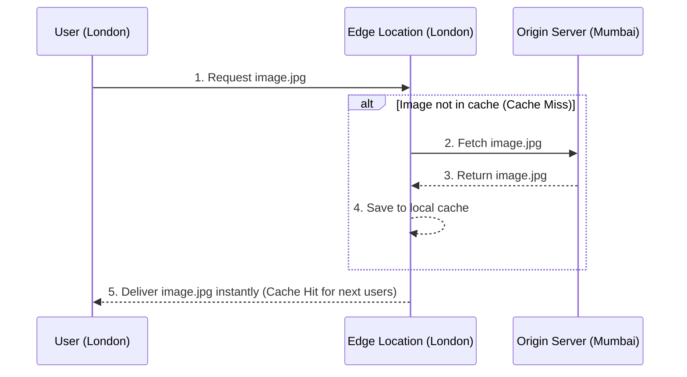
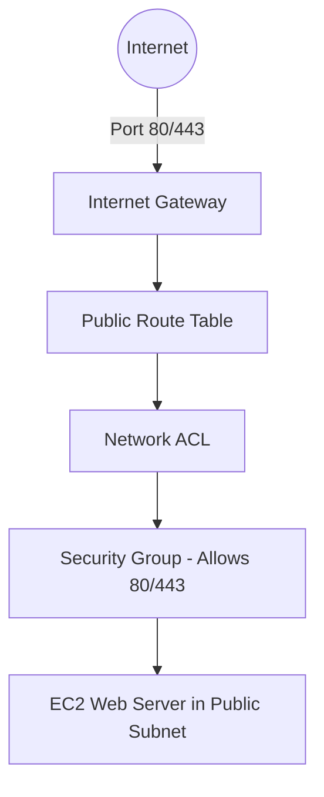

# Unit - 2

:::info[Title]
## Networking Services on AWS
:::

## 1. Networking Basics

### 1.1 IP Addressing & CIDR Notation
- **IPv4 vs IPv6:** IP addresses identify devices on a network. IPv4 uses a 32-bit format (e.g., `192.168.1.1`), providing about 4.3 billion addresses. Because the world is running out of IPv4 addresses, IPv6 was introduced using a 128-bit format.
- **CIDR (Classless Inter-Domain Routing):** This is the method used to allocate IP addresses and define network ranges. 
- **How CIDR Works (Inner Workings):** A CIDR notation looks like `10.0.0.0/16`. 
  - The `/16` is the **subnet mask**. It means the first 16 bits of the IP address are fixed representing the network itself, and the remaining 16 bits (out of 32) are available for assigning to individual hosts (devices).
  - A `/16` network gives you $2^{16}$ (65,536) available IP addresses. A `/24` gives you $2^8$ (256) IP addresses. The smaller the slash number, the larger the network.

### 1.2 Routing Mechanics
- **Explanation:** Routing determines the path network traffic should take to reach its destination.
- **Route Tables:** These contain a set of rules (routes) that dictate where network traffic is directed.
- **How it Works:** Every route in a table specifies a **Destination** (where the traffic wants to go, expressed in CIDR) and a **Target** (the gateway or connection it must pass through).
  - *Example:* If the destination is `10.0.0.0/16` and the target is `local`, it means traffic intended for within the VPC stays within the VPC. 
  - *Example:* If the destination is `0.0.0.0/0` (which means "anywhere else on the internet") and the target is `igw-xyz` (Internet Gateway), traffic flows out to the web.

### 1.3 Firewalls (Statefulness explained)
- **Explanation:** Firewalls filter inbound and outbound traffic based on rules. 
- **Stateful vs Stateless:**
  - **Stateful (Security Groups):** The firewall remembers the "state" of the connection. If your EC2 instance sends a request *out* to the internet (e.g., fetching a webpage), the firewall temporarily opens a hole to allow the exact response back *in*, regardless of inbound rules.
  - **Stateless (NACLs):** The firewall remembers nothing. Every single packet is evaluated individually. If traffic goes out, the return traffic is treated as completely new inbound traffic and will be blocked unless there is an explicit inbound rule allowing it (usually requiring ephemeral port rules).

## 2. Virtual Private Cloud (VPC) Inner Workings

*Exam Tip: Emphasize that a VPC is a Software-Defined Network (SDN).*

### 2.1 What is an Amazon VPC?
- **Formal Definition:** A logically isolated section of the AWS Cloud where you launch resources in a virtual network that you define.
- **Inner Workings:** AWS data centers contain massive physical networks. A VPC uses Software-Defined Networking (SDN) to carve out a virtualized network overlay. Your VPC traffic is completely isolated from all other customers' traffic at the hypervisor level. Even if another customer uses the exact same IP address range (like `10.0.0.0/16`), there is no conflict because the packets are encapsulated and tagged with your unique VPC identifier before traveling over the physical wires.

### 2.2 Key VPC Components
- **Internet Gateway (IGW):**
  - *How it works:* The IGW serves two purposes: it provides a target in your VPC route tables for internet-routable traffic, and it performs Network Address Translation (NAT) for instances that have been assigned public IPv4 addresses. 
  - *Under the hood:* An EC2 instance only knows its private IP. When traffic leaves the instance heading for the internet, the IGW transparently swaps the private IP for the public IP.
- **NAT Gateway:**
  - *How it works:* Designed specifically for private subnets. It allows private instances to initiate outbound IPv4 traffic to the internet but blocks the internet from initiating a connection back.
  - *Under the hood:* It uses Port Address Translation (PAT). It takes the private IP of your instance, translates it to the NAT Gateway's single Public Elastic IP, and uses unique port numbers to keep track of which internal instance made which request.

## 3. Subnets & Route Tables Deep Dive

### 3.1 Public Subnets
- **Definition:** A subnet is deemed "Public" simply because its associated Route Table contains a route to an Internet Gateway (`0.0.0.0/0` -> `igw-id`).
- **Inner Workings:** If you launch a web server here and give it a Public IP, a user on the internet can type that IP. The traffic hits the AWS network, goes through the IGW (where the public IP is translated to the private IP), passes the NACL, passes the Security Group, and hits the instance.

### 3.2 Private Subnets
- **Definition:** A subnet is "Private" if its Route Table does *not* have a route to an IGW.
- **Inner Workings:** Instead, to get software updates, its route for `0.0.0.0/0` points to a NAT Gateway (`nat-id`) which resides in the Public Subnet. Traffic flows from the Private Instance -> NAT Gateway -> Internet Gateway -> Internet.
- **Security Benefit:** Even if a hacker knows the private IP of a database inside a private subnet, internet routers literally cannot route traffic to private IP addresses. It is mathematically isolated from direct internet access.

## 4. VPC Security: NACLs vs Security Groups

*Exam Tip: Use this matrix to explain the layers of defense.*

| Feature | Network ACL (NACL) | Security Group (SG) |
| :--- | :--- | :--- |
| **Attachment Level** | Subnet level (protects the whole neighborhood). | Instance level (EC2 network interface). |
| **Rule Types** | **Allow AND Deny** rules (e.g., explicitly block a known hacker IP). | **Allow rules only** (cannot explicitly deny an IP, anything not allowed is implicitly denied). |
| **Statefulness** | **Stateless** — Return traffic is evaluated separately. Requires manual opening of high ephemeral ports (1024-65535) for return traffic. | **Stateful** — If a request is allowed in, the response is automatically allowed out. |
| **Rule Evaluation** | Evaluates numbered rules in order, starting from the lowest number. As soon as a rule matches, it stops evaluating. | Evaluates all rules simultaneously before making a decision. |
| **Default Behavior** | A newly created default NACL allows all inbound & outbound traffic. Custom NACLs deny everything by default. | Default SG denies all inbound traffic, but allows all outbound traffic. |

## 5. DNS: AWS Route 53 Inner Workings

### 5.1 What is Route 53?
- **Formal Definition:** A highly available and scalable cloud Domain Name System (DNS) web service.
- **How DNS Works:** Computers communicate using numbers (IP addresses), but humans use words (like `amazon.com`). Route 53 acts as the translator. When you type a URL, your browser asks Route 53 for the corresponding IP address (resolving an 'A Record') to establish the connection.

### 5.2 Routing Policies (How it decides where to send traffic)
Route 53 isn't just a basic translator; it's smart. It uses routing policies to return different IP addresses based on specific rules:
- **Simple Routing:** Returns a single standard IP address. Used when you have one server.
- **Weighted Routing:** You assign weights (e.g., 80% and 20%). Route 53 randomly sends 80% of users to Server A, and 20% to Server B. Great for testing new software versions.
- **Latency-Based Routing:** Route 53 constantly monitors network latency between AWS regions and global users. It automatically sends the user to the AWS Region that will provide them the fastest response time.
- **Geolocation Routing:** Uses a database mapping IP addresses to physical locations. If a user's IP is from Europe, Route 53 sends them to the European server (useful for language localization or legal compliance).
- **Failover Routing:** Route 53 performs "Health Checks" (pinging the server every few seconds). If the primary server fails the health check, Route 53 automatically updates its DNS response to point all users to a backup/disaster recovery server.

## 6. Amazon CloudFront (CDN) Inner Workings

### 6.1 What is CloudFront?
- **Formal Definition:** A fast Content Delivery Network (CDN) service that securely delivers data, videos, applications, and APIs.

### 6.2 How Caching Works (The Mechanics)
- **Edge Locations:** AWS has hundreds of Edge Locations placed in major cities worldwide (e.g., Tokyo, London, Mumbai).
- **The Process:**
  1. **Cache Miss:** A user in London requests a video hosted in a Mumbai S3 bucket (the "Origin"). The London Edge Location checks its local storage. It doesn't have it (Cache Miss). 
  2. **Fetch:** The Edge Location fetches the video from the Mumbai Origin via AWS's high-speed private fiber network.
  3. **Cache Hit:** The Edge Location sends the video to the user AND saves a copy locally for a defined Time To Live (TTL), like 24 hours.
  4. **Subsequent Requests:** When the *next* user in London requests the same video, the Edge Location serves the saved copy instantly without ever talking to the Mumbai server (Cache Hit).
- **Benefits:** Massively reduces the load on your origin servers, dramatically lowers latency for global users, and provides built-in DDoS (Distributed Denial of Service) protection because the Edge Locations absorb the malicious traffic before it reaches your actual servers.

```mermaid
sequenceDiagram
    participant User as User (London)
    participant Edge as Edge Location (London)
    participant Origin as Origin Server (Mumbai)
    
    User->>Edge: 1. Request image.jpg
    alt Image not in cache (Cache Miss)
        Edge->>Origin: 2. Fetch image.jpg
        Origin-->>Edge: 3. Return image.jpg
        Edge-->>Edge: 4. Save to local cache
    end
    Edge-->>User: 5. Deliver image.jpg instantly (Cache Hit for next users)
```

## 7. Building Your VPC & Launching a Web Server (Practical Workflow)

*Exam Tip: While the slides did not detail this explicitly, examiners often ask for the step-by-step process of setting up a VPC. Memorize this sequence.*

### 7.1 Step-by-Step Architecture Setup
To launch a web server that is accessible from the internet, you need to configure the following components in order:

1. **Create a VPC:** Define your custom IP range (e.g., `10.0.0.0/16`).
2. **Create Subnets:** Create a Public Subnet (e.g., `10.0.1.0/24`) for the web server and a Private Subnet for the database.
3. **Create an Internet Gateway (IGW):** Attach it to your newly created VPC so it can communicate with the internet.
4. **Configure the Route Table:** 
   - Edit the Route Table associated with the Public Subnet.
   - Add a route targeting the IGW for destination `0.0.0.0/0` (internet traffic).
5. **Configure Security Groups:** 
   - Create a Security Group for the Web Server.
   - Add an Inbound Rule allowing **HTTP (Port 80)** and **HTTPS (Port 443)** from anywhere (`0.0.0.0/0`).
   - Add an Inbound Rule allowing **SSH (Port 22)** from only your specific IP address.
6. **Launch the EC2 Instance:** 
   - Select an OS (e.g., Amazon Linux).
   - Place it inside the Public Subnet.
   - Assign it a Public IP address.
   - Attach the Security Group you just created.
   - Install your web server software (like Apache or Nginx).

```mermaid
flowchart TD
    Internet((Internet)) -->|Port 80/443| IGW[Internet Gateway]
    IGW --> RouteTable[Public Route Table]
    RouteTable --> NACL[Network ACL]
    NACL --> SG[Security Group - Allows 80/443]
    SG --> EC2[EC2 Web Server in Public Subnet]
```

## 8. Quick Revision

1. **VPC (Virtual Private Cloud):** Your logically isolated, software-defined network in AWS. 
2. **Subnets:**
   - **Public:** Has a route to the Internet Gateway (IGW). Instances can have public IPs.
   - **Private:** No IGW route. Uses a NAT Gateway to fetch internet updates securely.
3. **Firewalls:**
   - **Security Groups:** Protect instances. Stateful (remembers connections).
   - **NACLs:** Protect whole subnets. Stateless (evaluates every packet, requires explicit return rules).
4. **Route 53:** Smart DNS that translates names to IPs. Uses advanced routing (Latency, Geolocation, Failover) to optimize user experience.
5. **CloudFront:** CDN that caches static/dynamic files at hundreds of global Edge Locations to reduce latency and protect against DDoS attacks.

## 9. Important Terms

- **CIDR (Classless Inter-Domain Routing):** A standard method for allocating IP addresses and routing Internet Protocol packets.
- **Stateful Firewall:** Remembers the state of a connection; if traffic is allowed in, the response is automatically allowed out.
- **Stateless Firewall:** Evaluates every single packet independently; return traffic must be explicitly allowed.
- **CDN (Content Delivery Network):** A globally distributed network of servers that caches content close to users to reduce latency.
- **Latency:** The time it takes for data to travel from its source to its destination.

## 10. Exam Questions

**Short-Answer Questions:**
1. Define Amazon VPC and state its primary purpose.
2. What is the difference between a Public Subnet and a Private Subnet in an AWS VPC?
3. Briefly explain the function of an Internet Gateway (IGW).

**Descriptive Questions:**
4. Compare and contrast Security Groups and Network Access Control Lists (NACLs) detailing at least four differences.
5. Describe the inner workings of Amazon CloudFront and how it uses Edge Locations to reduce latency for end-users. Include an explanation of a "Cache Hit" and "Cache Miss".

**Compare / Differentiate:**
6. Differentiate between stateful and stateless firewalls in the context of AWS networking.

**Scenario-Based Questions:**
7. Your company hosts a sensitive database containing customer financial records. In which type of subnet (Public or Private) should this database be placed, and how would it securely download software updates from the internet without exposing itself to incoming traffic?
8. A global news website experiences slow page load times for users in Asia because its servers are located in the US. Which AWS service should they implement to solve this problem, and how does it work?

**MCQs:**
9. Which of the following AWS services is a highly available and scalable cloud Domain Name System (DNS) web service?
    - A) Amazon CloudFront
    - B) Amazon VPC
    - C) Amazon Route 53
    - D) AWS Direct Connect

## 11. Key Takeaways

- A **VPC** provides complete control over your virtual networking environment, allowing you to define custom IP ranges, subnets, and route tables.
- **Security Groups (Instance level, Stateful)** and **NACLs (Subnet level, Stateless)** work together to provide multi-layered defense.
- **Amazon Route 53 (DNS)** and **Amazon CloudFront (CDN)** are critical for routing users effectively and delivering content with ultra-low latency globally.

## 12. AWS References

- [What is Amazon VPC?](https://docs.aws.amazon.com/vpc/latest/userguide/what-is-amazon-vpc.html)
- [Amazon Route 53 Documentation](https://docs.aws.amazon.com/Route53/latest/DeveloperGuide/Welcome.html)
- [Amazon CloudFront Documentation](https://docs.aws.amazon.com/AmazonCloudFront/latest/DeveloperGuide/Introduction.html)

{/* Source: AWS VPC Documentation — aws.amazon.com/vpc */}
