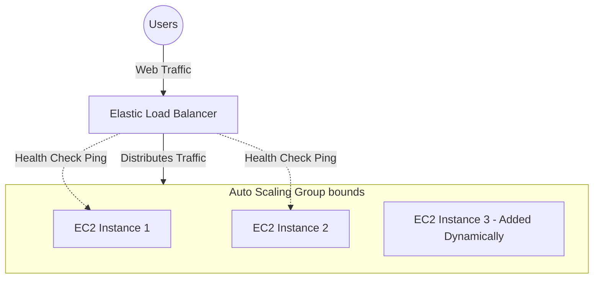

# Unit - 3

:::info[Title]
## Compute Services on AWS
:::

## 1. Introduction to Compute Services

### 1.1 IaaS & Virtual Machines in the Cloud
- **Explanation:** In traditional IT, if you need a server, you have to order physical hardware, rack it, provide power, and install an Operating System. In the cloud, Compute Services provide you with Virtual Machines (VMs) instantly over the internet.
- **In Your Own Words:** Think of a Virtual Machine as a computer inside a computer. AWS owns the massive physical computers (Hosts) and slices them up into smaller, isolated virtual computers (Guests) that you can rent.
- **IaaS (Infrastructure as a Service):** You are renting the raw virtual hardware. AWS manages the physical server, the power, and the virtualization layer. You manage everything inside the VM, starting from the Operating System upwards.

## 2. Amazon EC2 (Elastic Compute Cloud)

*Exam Tip: Always mention that EC2 provides "resizable compute capacity" and is the core IaaS service of AWS.*

### 2.1 What is Amazon EC2?
- **Formal Definition:** A web service that provides secure, resizable compute capacity in the cloud. It is designed to make web-scale cloud computing easier for developers by providing virtual servers on-demand.
- **How it Works (Inner Workings):** When you launch an EC2 instance, you are essentially requesting a slice of CPU, RAM, and Storage from AWS's massive physical server farms. You can boot it up in minutes, log in via SSH (Linux) or RDP (Windows), and use it exactly like a physical computer sitting on your desk.
- **AMI (Amazon Machine Image):** 
  - *Definition:* A pre-configured template that contains the Operating System (e.g., Linux, Windows) and pre-installed software required to launch an instance. 
  - *Analogy:* Like a cookie cutter or a ghost image of a hard drive. You can use one AMI to launch 100 identical web servers instantly.

### 2.2 EC2 Instance Types
AWS offers different "families" of instances optimized for specific use cases. 

- **General Purpose (e.g., t3, m6i):** 
  - *Characteristics:* Provides a balanced ratio of CPU, memory, and network resources.
  - *Use Case:* Web servers, code repositories, microservices.
- **Compute Optimized (e.g., c6i):** 
  - *Characteristics:* High-performance processors. More CPU compared to RAM.
  - *Use Case:* CPU-intensive tasks like gaming servers, video encoding, scientific modeling.
- **Memory Optimized (e.g., r6g):** 
  - *Characteristics:* Massive amounts of RAM.
  - *Use Case:* Large in-memory databases (like Redis), real-time big data analytics.
- **Storage Optimized (e.g., i3):** 
  - *Characteristics:* Very high disk I/O (read/write speeds) directly attached to the physical host.
  - *Use Case:* Data warehousing, massive NoSQL databases.

## 3. EC2 Pricing Models

*Exam Tip: Examiners love asking how to choose a pricing model based on a scenario. Use these rules of thumb.*

| Pricing Model | How it Works | Best Used For (Exam Scenario) |
| :--- | :--- | :--- |
| **On-Demand** | Pay by the second (Linux) or hour (Windows). No long-term commitments or upfront payments. | **Unpredictable workloads**, short-term testing, or brand new apps where you don't know the traffic yet. |
| **Reserved Instances (RI)** | You commit to a 1-year or 3-year term in exchange for a massive discount (up to 72%). | **Steady-state, predictable usage.** Like a main database that must run 24/7 for the next 3 years. |
| **Spot Instances** | You bid on spare, unused AWS capacity at a massive discount (up to 90%). However, AWS can reclaim (terminate) the instance with just a 2-minute warning if they need the capacity back. | **Flexible, fault-tolerant workloads.** Batch processing, data analysis, background image rendering. Never use for critical databases! |
| **Dedicated Hosts** | A physical server dedicated entirely to your usage. No other AWS customers share the hardware. | **Compliance & Licensing.** Used when software licenses (like Oracle/Windows) bind to physical CPU sockets, or strict government compliance requires physical isolation. |

## 4. Scaling and High Availability

### 4.1 Elastic Load Balancing (ELB)
- **What it is:** A service that automatically distributes incoming application traffic across multiple targets, such as EC2 instances, containers, or IP addresses.
- **Inner Workings:** Think of the ELB as a traffic cop. When 1,000 users visit your website, the ELB routes 500 to Server A and 500 to Server B. If Server A crashes, the ELB's **Health Checks** detect the failure and it automatically routes all 1,000 users to Server B, ensuring your users never see an error page (Fault Tolerance).
- **Types of Load Balancers:**
  - *Application Load Balancer (ALB):* Operates at Layer 7 (HTTP/HTTPS). Smart routing based on URLs (e.g., `/images` goes to Server A, `/api` goes to Server B).
  - *Network Load Balancer (NLB):* Operates at Layer 4 (TCP/UDP). Used for extreme performance and ultra-low latency (millions of requests per second).
  - *Gateway Load Balancer (GWLB):* Used for deploying third-party virtual network appliances (like advanced firewalls).

### 4.2 AWS Auto Scaling Groups (ASG)
- **What it is:** A service that monitors your applications and automatically adjusts capacity to maintain steady, predictable performance at the lowest possible cost.
- **How it Works (The Mechanics):** You define rules. For example, "If average CPU usage > 80%, add 2 more EC2 instances." 
  - You define the **Minimum** (e.g., 2), **Desired** (e.g., 4), and **Maximum** (e.g., 10) instance counts.
  - You use a **Launch Template** to tell the ASG exactly *what* to launch (which AMI, which Instance Type, which Security Group).
- **Scaling Types:**
  - *Dynamic Scaling:* Metric-based (e.g., scale up when CPU is high).
  - *Scheduled Scaling:* Time-based (e.g., scale up every Friday at 5 PM for a sale).
  - *Predictive Scaling:* Uses Machine Learning to predict traffic patterns and scale ahead of time.

## 5. Serverless Computing — AWS Lambda

### 5.1 What is Serverless?
- **Concept:** Serverless does NOT mean there are no servers. It means **you don't manage them**. AWS handles the provisioning, patching, scaling, and maintenance of the underlying servers entirely invisibly to you.

### 5.2 AWS Lambda Deep Dive
- **Formal Definition:** A serverless, event-driven compute service that lets you run code without provisioning or managing servers.
- **How it Works (Event-Driven Architecture):** 
  - You write a simple function (in Python, Node.js, Java, etc.) and upload it to Lambda.
  - The code just sits there, costing you **$0**.
  - An **Event** occurs (e.g., a user uploads an image to an S3 bucket).
  - Lambda instantly spins up an environment, runs your code (e.g., resizes the image), and spins back down.
  - You pay **only for the exact milliseconds** your code was executing.
- **Key Characteristics:** 
  - Pay per millisecond.
  - Scales automatically from 0 to tens of thousands of concurrent executions.
  - Supported Runtimes: Node.js, Python, Java, C#, Go, Ruby, PowerShell, and Custom Runtimes.

## 6. PaaS — AWS Elastic Beanstalk

### 6.1 What is Elastic Beanstalk?
- **Formal Definition:** An easy-to-use Platform as a Service (PaaS) for deploying and scaling web applications and services developed with Java, .NET, PHP, Node.js, Python, Ruby, Go, and Docker.
- **In Your Own Words:** It is the "easy button" for deploying code on AWS. If you are a developer who doesn't know how to set up VPCs, EC2s, Load Balancers, and Auto Scaling, you just hand your ZIP file of code to Elastic Beanstalk. It automatically reads your code and provisions all the underlying infrastructure for you.

### 6.2 IaaS (EC2) vs PaaS (Beanstalk) Comparison

| Responsibility | IaaS (Amazon EC2) | PaaS (Elastic Beanstalk) |
| :--- | :--- | :--- |
| **OS Updates & Patches** | **Manual:** You must log in and run `yum update` or `apt-get update`. | **Automatic:** AWS handles patching the underlying OS. |
| **App Deployment** | **Manual:** SSH into the server, pull from Git, restart the web service. | **Automatic:** Just upload a ZIP/WAR file via the console, Beanstalk deploys it to all servers. |
| **Scaling & Load Balancing** | **Manual:** You must manually configure ELB and Auto Scaling Groups. | **Automatic:** Auto-configured out of the box based on your preferences. |
| **Monitoring** | **Manual:** You must set up CloudWatch agents and dashboards. | **Built-in:** Automatic health monitoring and dashboards provided. |
| **Underlying Control** | Total control. You can change anything. | You retain full control over the AWS resources powering your app, but Beanstalk manages them. |

## 7. Quick Revision

1. **Amazon EC2 (IaaS):** Resizable virtual servers. You manage the OS, software, and scaling.
2. **EC2 Pricing:** 
   - *On-Demand:* Unpredictable/short-term.
   - *Reserved:* 1-3 year commitment for steady workloads (cheapest).
   - *Spot:* Bidding on spare capacity, can be interrupted (best for batch jobs).
3. **ELB (Load Balancer):** Distributes traffic across multiple instances to ensure high availability and fault tolerance.
4. **Auto Scaling (ASG):** Automatically adds or removes EC2 instances based on CPU usage or schedules.
5. **AWS Lambda (Serverless):** Run code without managing servers. Event-driven, pay per millisecond, scales automatically.
6. **Elastic Beanstalk (PaaS):** You just upload code (ZIP/WAR), and AWS automatically provisions the EC2, ELB, and ASG required to run it.

## 8. Important Terms

- **AMI (Amazon Machine Image):** A template containing the software configuration (OS, application server, and applications) required to launch an EC2 instance.
- **Serverless:** A cloud computing execution model where the cloud provider dynamically manages the allocation and provisioning of servers (e.g., AWS Lambda).
- **Fault Tolerance:** The property that enables a system to continue operating properly in the event of the failure of one or more of its components.
- **Elasticity:** The ability of a system to rapidly scale out (expand) and scale in (shrink) resources dynamically based on demand.

## 9. Exam Questions

**Short-Answer Questions:**
1. Define Amazon EC2 and mention two different instance families/types.
2. What is an AMI and why is it used?
3. Briefly define Serverless computing in the context of AWS Lambda.

**Descriptive Questions:**
4. Explain the four Amazon EC2 pricing models. Provide a specific, real-world use case for when a company should choose Spot Instances versus Reserved Instances.
5. Detail how Elastic Load Balancing (ELB) and Auto Scaling Groups (ASG) work together to create a highly available architecture.

**Compare / Differentiate:**
6. Compare IaaS (Amazon EC2) and PaaS (AWS Elastic Beanstalk) based on developer responsibility, OS updates, and ease of deployment.

**Scenario-Based Questions:**
7. A retail company wants to launch a marketing campaign that will generate a massive, unpredictable spike in web traffic for exactly 3 hours, after which traffic will drop back to zero. Should they use EC2 Reserved Instances or AWS Lambda for this workload, and why?
8. A university research team needs massive computational power to process a large dataset. The processing job can be interrupted and resumed at any time without losing progress, and they have a very tight budget. Which EC2 pricing model should they choose?

**MCQs:**
9. Which AWS service allows you to upload code and automatically handles the deployment, capacity provisioning, load balancing, and auto-scaling?
    - A) Amazon EC2
    - B) AWS Lambda
    - C) AWS Elastic Beanstalk
    - D) Elastic Load Balancing

## 10. Key Takeaways

- **Compute services** form the backbone of processing in AWS. 
- You can choose from maximum control (**Amazon EC2 - IaaS**), focus on code without infrastructure management (**Elastic Beanstalk - PaaS**), or completely event-driven invisible servers (**AWS Lambda - Serverless**).
- Always pair **Auto Scaling** with an **Elastic Load Balancer** to handle web traffic efficiently and fault-tolerantly.

## 11. AWS References

- [Amazon EC2 Documentation](https://docs.aws.amazon.com/ec2/)
- [AWS Lambda Documentation](https://docs.aws.amazon.com/lambda/)
- [AWS Elastic Beanstalk Documentation](https://docs.aws.amazon.com/elasticbeanstalk/)

{/* Source: AWS Compute Services Documentation */}
