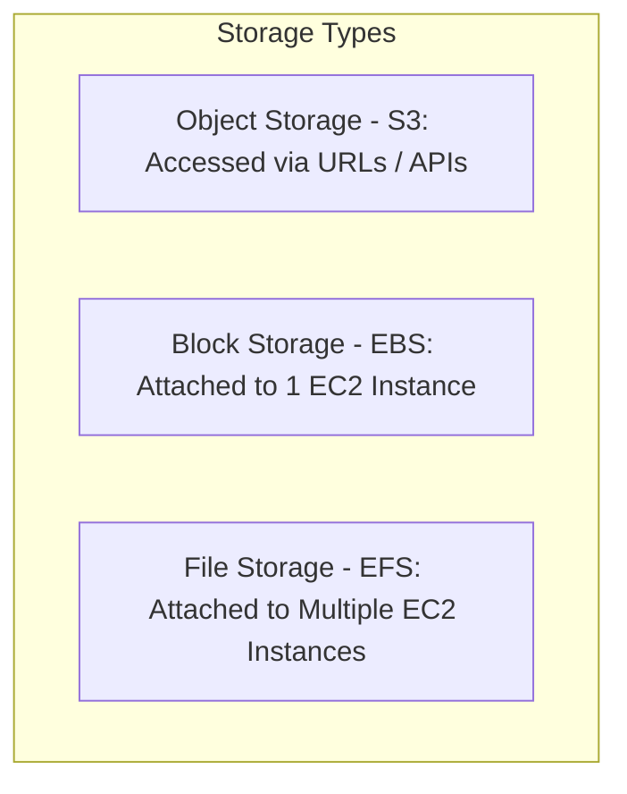

# Unit - 4

:::info[Title]
## Storage Services on AWS
:::

## 1. Types of Cloud Storage

*Exam Tip: The easiest way to score marks is knowing the difference between Object, Block, and File storage. Use the analogies below.*

### 1.1 Object Storage (Amazon S3)
- **Explanation:** Data is stored as an "Object" (the file itself + metadata describing it + a unique ID) in a flat structure called a "Bucket", rather than in folders. 
- **In Your Own Words:** Think of a valet parking garage. You give them your car (data) and they give you a unique ticket (key/URL). You don't care exactly *where* they parked it, you just hand them the ticket when you want it back.
- **Key Characteristics:**
  - Globally accessible via a URL.
  - Offers **11 nines (99.999999999%)** durability.
  - **Ideal for:** Backups, static websites, data lakes, and storing media files (images/videos).

### 1.2 Block Storage (Amazon EBS)
- **Explanation:** Data is stored in fixed-sized chunks called "blocks". It behaves exactly like a raw, unformatted hard drive that you plug into a computer.
- **In Your Own Words:** Think of it like a USB hard drive or an SSD. You format it, install an operating system on it, and it can only be plugged into **one computer at a time**.
- **Key Characteristics:**
  - Low-latency, persistent storage.
  - Resides within a single Availability Zone (AZ).
  - **Ideal for:** Operating systems, databases, and enterprise applications requiring high-speed read/write access.

### 1.3 File Storage (Amazon EFS)
- **Explanation:** A shared network file system (NFS) that stores data in a hierarchical structure (folders and directories).
- **In Your Own Words:** Think of it like a shared Google Drive or a corporate shared network folder `(Z:\ drive)`. **Multiple computers** can access, read, and write to the exact same files at the same time.
- **Key Characteristics:**
  - Shared access by MULTIPLE EC2 instances simultaneously.
  - Multi-AZ by default (highly available).
  - Scales automatically (serverless, no need to provision capacity).
  - **Ideal for:** Content management systems, shared developer environments, data science.

## 2. Amazon S3 (Simple Storage Service) Deep Dive

### 2.1 What is Amazon S3?
- **Formal Definition:** An object storage service that offers industry-leading scalability, data availability, security, and performance.
- **Inner Workings:** Data is stored as **objects** inside containers called **buckets**.
  - **Object = Data + Metadata (tags describing the data) + Unique Key (the filename).**

### 2.2 Key Features of S3
- **Unlimited Capacity:** The total volume of data and number of objects you can store are unlimited. Individual objects can range from a minimum of 0 bytes to a maximum of 5TB.
- **11 Nines Durability (99.999999999%):** AWS achieves this by automatically storing copies of your data across a minimum of 3 different Availability Zones. If a whole data center burns down, your data is safe.
- **Access Control:** You can secure your data using Bucket Policies, Access Control Lists (ACLs), and IAM policies.
- **Versioning:** If enabled, keeping multiple variants of an object in the same bucket. It protects against accidental overwrites or deletions.
- **Lifecycle Rules:** Automatically move data to cheaper storage classes or delete it after a certain period (e.g., move to Glacier after 30 days).
- **Static Website Hosting:** You can host HTML/CSS/JS files directly from an S3 bucket without needing a web server like EC2.

## 3. Amazon S3 Storage Classes

*Exam Tip: You must memorize these use cases to answer questions about optimizing storage costs.*

| Storage Class | Use Case (When to use it) | Availability | Retrieval Time |
| :--- | :--- | :--- | :--- |
| **S3 Standard** | Frequently accessed data, active static websites, mobile apps. | 99.99% | Milliseconds |
| **S3 Intelligent-Tiering** | Unknown or changing access patterns. It automatically moves data to the most cost-effective tier based on how often you access it. | 99.9% | Milliseconds |
| **S3 Standard-IA (Infrequent Access)** | Data accessed less frequently, but requires rapid access when needed (e.g., recent backups). | 99.9% | Milliseconds |
| **S3 One Zone-IA** | Infrequent access where data can be easily recreated if lost (stores data in only 1 AZ instead of 3). Cheapest for non-critical data. | 99.5% | Milliseconds |
| **S3 Glacier Instant Retrieval** | Archive data that needs immediate access (e.g., medical records requested suddenly). | 99.9% | Milliseconds |

*(Note: There are also colder Glacier tiers like Flexible Retrieval and Deep Archive that take minutes to hours to retrieve data).*

## 4. Amazon EBS & Amazon EFS Comparison

### 4.1 Amazon EBS (Elastic Block Store)
- **Nature:** Persistent block storage for EC2.
- **Attachment:** Attached to **only one** EC2 instance at a time (like an internal hard drive).
- **Location:** Locked to a **single Availability Zone**. If the AZ goes down, the volume goes down.
- **Volume Types to Remember:** 
  - *gp3 (General Purpose):* Balanced price and performance.
  - *io2 (Provisioned IOPS):* Highest performance for massive databases.
  - *st1 (Throughput Optimized):* Big data, data warehouses.
  - *sc1 (Cold HDD):* Lowest cost, infrequent access.
- **Snapshots:** You can take point-in-time backups of your EBS volumes. These snapshots are secretly stored in Amazon S3 for high durability.

### 4.2 Amazon EFS (Elastic File System)
- **Nature:** Fully managed NFS (Network File System).
- **Attachment:** Can be shared across **hundreds or thousands of EC2 instances simultaneously**.
- **Location:** **Multi-AZ** by default. It survives AZ failures automatically.
- **Capacity:** Serverless and elastic. You don't guess the size; it automatically grows and shrinks as you add or remove files, and you pay only for what you use.

## 5. Lab Workflows (Practical Steps for Exam)

*Exam Tip: Briefly describing these steps in an essay question shows deep practical knowledge.*

### 5.1 Lab: Create and Attach an EBS Volume
1. **Create the Volume:** Go to EC2 Console -> Volumes -> Create Volume. Choose the type (e.g., gp3), size (e.g., 20 GB), and critically, ensure it is in the **same Availability Zone** as your EC2 instance.
2. **Attach the Volume:** Select the volume -> Actions -> Attach Volume. Select your running EC2 instance.
3. **Mount the Volume (OS Level):** SSH into your EC2 instance, format the raw block device with a file system (e.g., using `mkfs`), and mount it to a directory.

### 5.2 Lab: Host a Static Website on S3
1. **Create a Bucket:** Go to S3 -> Create Bucket. The bucket name must be globally unique. Uncheck "Block all public access".
2. **Upload Files:** Upload your `index.html` and `error.html` files (and any CSS/JS).
3. **Enable Hosting:** Go to Bucket Properties -> Static website hosting -> Enable. Specify `index.html` as the index document.
4. **Apply Bucket Policy:** Add a JSON Bucket Policy that grants `s3:GetObject` permission to `*` (everyone), allowing the public to read the files.
5. **Access the Website:** Use the Bucket Website Endpoint URL provided by AWS to view your site.

## 6. Quick Revision

1. **3 Main Storage Types:** Object (S3), Block (EBS), File (EFS).
2. **Amazon S3:** Object storage. Infinite capacity. 11 Nines durability. Best for backups and static websites.
3. **S3 Storage Classes:** Standard (frequent), Standard-IA (infrequent), Glacier (archive), Intelligent-Tiering (unknown patterns).
4. **Amazon EBS:** Block storage (virtual hard drive). Attached to 1 EC2 instance, locked to 1 AZ. Used for OS and databases.
5. **Amazon EFS:** Shared File storage (NFS). Attached to multiple EC2 instances, spans multiple AZs. Scales automatically.
6. **Snapshots:** EBS backups are stored in S3.

## 7. Important Terms

- **Durability:** The probability that a stored object will remain intact and accessible over a period of time without data loss (S3 offers 99.999999999%).
- **Availability:** The percentage of time a storage service is operational and accessible to you (e.g., S3 Standard offers 99.99%).
- **Metadata:** Data that provides information about other data (e.g., an S3 object's size, upload date, and content type).
- **Snapshot:** A point-in-time, incremental backup of an Amazon EBS volume, securely stored in S3.

## 8. Exam Questions

**Short-Answer Questions:**
1. What are the three components that make up an "Object" in Amazon S3?
2. Mention two key differences between Amazon EBS and Amazon EFS.
3. What is the main purpose of the "S3 Intelligent-Tiering" storage class?

**Descriptive Questions:**
4. Explain the difference between Object Storage, Block Storage, and File Storage. Give an AWS service example for each.
5. Detail the process of creating, attaching, and formatting an Amazon EBS volume to a running EC2 instance.

**Compare / Differentiate:**
6. Compare Amazon S3 Standard-IA with Amazon S3 Glacier Instant Retrieval based on their intended use cases and retrieval times.

**Scenario-Based Questions:**
7. A hospital needs to store 10 years of patient records for legal compliance. These records are almost never accessed, but if a doctor requests them, they must be available immediately. Which Amazon S3 storage class is the most cost-effective solution?
8. You are building a cluster of web servers (EC2 instances) that all need to read and write to the exact same shared directory at the same time. Which AWS storage service must you use, and why?

**MCQs:**
9. An Amazon EBS volume is locked to which AWS infrastructure component?
    - A) A single Edge Location
    - B) A single Region
    - C) A single Availability Zone
    - D) A single VPC

## 9. Key Takeaways

- Choose **Amazon S3** for flat, massive-scale object storage accessed via the web. Use its Storage Classes to optimize costs.
- Choose **Amazon EBS** for fast, local block storage attached to a single EC2 instance (like a laptop hard drive).
- Choose **Amazon EFS** for a shared network file system that hundreds of EC2 instances can access simultaneously.

## 10. AWS References

- [Amazon S3 Documentation](https://docs.aws.amazon.com/s3/)
- [Amazon EBS Documentation](https://docs.aws.amazon.com/ebs/)
- [Amazon EFS Documentation](https://docs.aws.amazon.com/efs/)

{/* Source: AWS Storage Services Documentation */}
