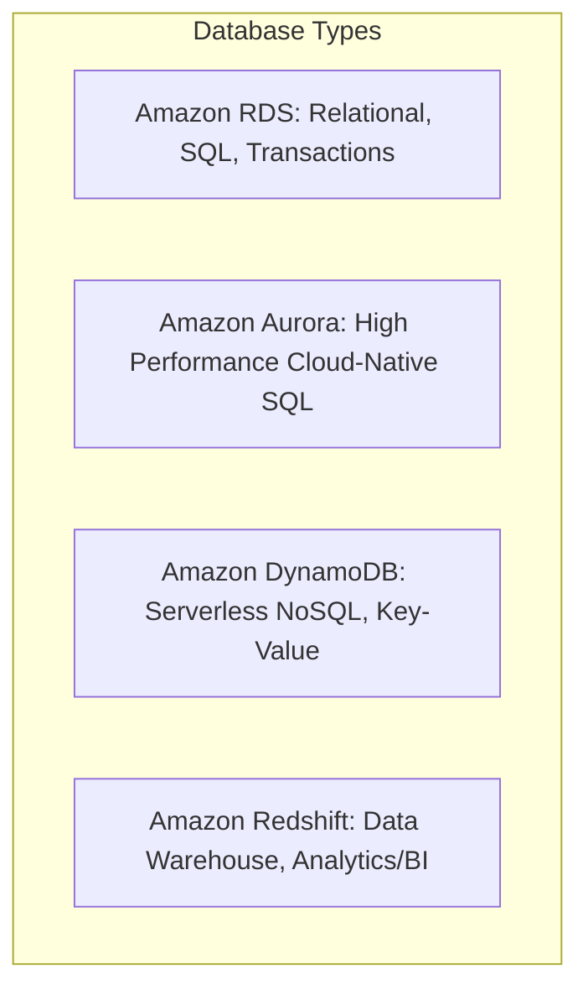

# Unit - 5

:::info[Title]
## AWS Architecture & Database Services
:::

## 1. AWS Well-Architected Framework

### 1.1 What is the Well-Architected Framework?
- **Formal Definition:** A framework developed by AWS Solutions Architects to help cloud architects build secure, high-performing, resilient, and efficient infrastructure for their applications and workloads.
- **In Your Own Words:** Think of it like a "building code" for constructing houses. Just like you need a framework to ensure a house won't collapse, catch fire, or cost too much to heat, the Well-Architected Framework ensures your cloud infrastructure is built on solid, proven best practices.
- **Key Design Principles:**
  - *Stop guessing your capacity needs:* Don't buy servers based on guesses. Use Auto Scaling to let the infrastructure adjust automatically.
  - *Test systems at production scale:* Use cloud elasticity to spin up a full-scale testing environment, run realistic load tests, and then shut it down to save money.

## 2. The 6 Pillars of the Well-Architected Framework

*Exam Tip: Memorize the acronym **"CORPSS"** (Cost, Operational Excellence, Reliability, Performance, Security, Sustainability).*

### 2.1 Operational Excellence
- **Focus:** Running and monitoring systems to deliver business value, and continually improving supporting processes.
- **Key Concepts:** Automate changes, respond to events automatically, and define strict standards for daily operations. 
- **In Your Own Words:** How well can your team manage the code and run the system without manual, error-prone tasks?

### 2.2 Security
- **Focus:** Protecting information, systems, and assets while delivering business value.
- **Key Concepts:** Implementing Identity and Access Management (IAM), encrypting data (data protection), and creating automated incident response procedures.
- **In Your Own Words:** Keeping the hackers out and ensuring that only the right people have access to the right data.

### 2.3 Reliability
- **Focus:** Ensuring a workload performs its intended function correctly and consistently when it’s expected to.
- **Key Concepts:** Recover from failures automatically, dynamically acquire resources to meet demand, and design for strict fault tolerance (e.g., using Multi-AZ deployments).
- **In Your Own Words:** If a server catches fire, does the application crash, or does it automatically fix itself and keep running?

### 2.4 Performance Efficiency
- **Focus:** Using IT and computing resources efficiently to meet system requirements.
- **Key Concepts:** Selecting the right resource types and sizes based on workload requirements (e.g., choosing a Compute-Optimized EC2 instance for video rendering), and monitoring performance to make informed decisions.

### 2.5 Cost Optimization
- **Focus:** Avoiding unnecessary costs.
- **Key Concepts:** Measuring efficiency, eliminating unneeded spending, and optimizing over time (e.g., turning off development servers on the weekends or using Reserved Instances).

### 2.6 Sustainability
- **Focus:** Minimizing the environmental impacts of running cloud workloads.
- **Key Concepts:** Maximizing resource utilization (so servers aren't running idle and wasting electricity) and reducing downstream environmental impact.

## 3. AWS Database Services Overview

*Exam Tip: AWS has a specific database for every use case. Know which one to pick based on the scenario (Relational vs NoSQL vs Analytics).*

### 3.1 Amazon RDS (Relational Database Service)
- **What it is:** A managed service that makes it easy to set up, operate, and scale a relational database in the cloud.
- **Engines Supported:** MySQL, PostgreSQL, MariaDB, Oracle, Microsoft SQL Server, and Amazon Aurora.
- **Use Cases:** Traditional web applications, ERPs (Enterprise Resource Planning), CRM systems, and e-commerce platforms requiring complex transactions.
- **AWS Manages for You (The "Managed" part):**
  - OS installation and database software patching.
  - Automated backups with point-in-time recovery (up to 35 days).
  - Multi-AZ deployments for automatic failover (High Availability).
  - Read Replicas to improve read performance and disaster recovery.

### 3.2 Amazon Aurora
- **What it is:** A cloud-native relational database designed specifically by AWS to take full advantage of cloud architecture.
- **Key Characteristics:** 
  - **Performance:** 5x faster than standard MySQL, and 3x faster than standard PostgreSQL.
  - **Compatibility:** Fully compatible with MySQL and PostgreSQL code.
  - **Scalability:** Auto-scales storage automatically up to 128TB.
  - **Serverless:** Offers a "Serverless" option that automatically starts, scales, and shuts down capacity based on application demand.

### 3.3 Amazon DynamoDB
- **What it is:** A fully managed, serverless NoSQL database.
- **Key Characteristics:** 
  - Delivers single-digit millisecond performance at any scale.
  - Can handle trillions of requests per day.
  - Key-Value and Document data model.
- **In Your Own Words:** Unlike RDS which uses tables, rows, and complex SQL joins, DynamoDB is like a massive, ultra-fast dictionary. It is perfect for massive-scale apps (like mobile games or social media feeds) where you need instant data retrieval without complex relationships.

### 3.4 Amazon Redshift
- **What it is:** A petabyte-scale cloud data warehouse.
- **Key Characteristics:** 
  - Uses columnar storage optimized for complex analytics queries.
- **In Your Own Words:** You don't use Redshift to run your live website. You use Redshift to take all the historical data from your company over the last 10 years and run massive, complex business intelligence (BI) reports to find trends.

## 4. Lab Workflow (Practical Steps for Exam)

### 4.1 Lab: Launch an Amazon RDS DB Instance
*Examiners often ask for the practical steps to deploy a database. Memorize this sequence:*

1. **Navigate to RDS:** Open the AWS Management Console and go to the RDS service.
2. **Create Database:** Click "Create database".
3. **Choose Engine:** Select the database engine (e.g., MySQL) and version.
4. **Choose Template:** Select a template based on your use case (Production, Dev/Test, or Free Tier).
5. **Configure Settings:** 
   - Set the DB instance identifier (name).
   - Create a Master Username and Master Password.
6. **Configure Instance & Storage:** Select the DB instance class (e.g., `db.t3.micro` for Free Tier) and allocate storage space.
7. **Configure Connectivity (VPC):** 
   - Choose the VPC and Subnet Group.
   - Choose whether the database should be **Publicly Accessible** (Usually set to `No` for security; only EC2 instances in the same VPC should access it).
   - Assign an existing Security Group or create a new one to allow SQL traffic (e.g., Port 3306 for MySQL).
8. **Launch:** Click "Create database" and wait for the status to change to "Available".

## 5. Quick Revision

1. **Well-Architected Framework:** 6 pillars (Operational Excellence, Security, Reliability, Performance Efficiency, Cost Optimization, Sustainability).
2. **Amazon RDS:** Managed relational DB service. Automates patching, backups, and failover. Supports MySQL, PostgreSQL, Oracle, SQL Server.
3. **Amazon Aurora:** Cloud-native relational DB. 5x faster than MySQL. Auto-scales storage up to 128TB.
4. **Amazon DynamoDB:** Serverless NoSQL database. Single-digit millisecond latency, handles trillions of requests.
5. **Amazon Redshift:** Petabyte-scale data warehouse purely for analytics and business intelligence workloads.

## 6. Important Terms

- **Relational Database (SQL):** A database structured to recognize relations among stored items of information (uses tables, rows, and columns).
- **NoSQL Database:** A non-relational database optimized for specific data models like key-value, document, or graph. Extremely fast and highly scalable.
- **Data Warehouse:** A central repository of information that can be analyzed to make more informed decisions (e.g., Redshift).
- **Read Replica:** A read-only copy of a database instance used to offload read traffic from the primary database instance.

## 7. Exam Questions

**Short-Answer Questions:**
1. List the six pillars of the AWS Well-Architected Framework.
2. What is Amazon Aurora and how does it compare to standard MySQL?
3. Briefly explain the primary use case for Amazon Redshift.

**Descriptive Questions:**
4. Explain the concept of the AWS Well-Architected Framework. Detail the "Reliability" and "Security" pillars and why they are critical for enterprise applications.
5. Provide a detailed overview of Amazon RDS. List at least three management tasks that AWS handles automatically for you when using RDS instead of installing a database yourself on an EC2 instance.

**Compare / Differentiate:**
6. Differentiate between Amazon RDS and Amazon DynamoDB based on their data models and primary use cases.

**Scenario-Based Questions:**
7. A fast-growing mobile gaming company needs a database to store player profiles and game states. The database must handle millions of read/write requests per second with single-digit millisecond latency. Which AWS database service should they choose and why?
8. Your company is performing complex, massive analytics on 5 years' worth of historical sales data (petabytes in size) to find purchasing trends. Which database service is designed specifically for this analytical workload?

**MCQs:**
9. Which pillar of the AWS Well-Architected Framework focuses on continually improving supporting processes and procedures?
    - A) Security
    - B) Reliability
    - C) Operational Excellence
    - D) Performance Efficiency

## 8. Key Takeaways

- The **Well-Architected Framework (CORPSS)** is the definitive guide to building solid cloud architecture.
- Choose **Amazon RDS** or **Aurora** for traditional relational, transactional data.
- Choose **Amazon DynamoDB** for massive-scale, low-latency NoSQL data.
- Choose **Amazon Redshift** for historical data analytics and business intelligence.

## 9. AWS References

- [AWS Well-Architected Framework](https://docs.aws.amazon.com/wellarchitected/latest/framework/welcome.html)
- [Amazon RDS Documentation](https://docs.aws.amazon.com/rds/)
- [Amazon DynamoDB Documentation](https://docs.aws.amazon.com/dynamodb/)

{/* Source: AWS Architecture & Database Documentation */}
