## Practical Assessment Index

| Sr. No. | Experiment Title | Algorithmic Paradigm | Time Complexity | Space Complexity |
| :---: | :--- | :--- | :---: | :---: |
| 1 | Prime Number Detection | Trial Division / Math | $O(n)$ | $O(1)$ |
| 2 | Search Insert Position | Binary Search | $O(\log n)$ | $O(1)$ |
| 3 | Candy Distribution Problem | Greedy (Two-Pass Traversal) | $O(N)$ | $O(N)$ |
| 4 | Aggressive Cows | Binary Search on Answer + Greedy | $O(N \log N + N \log D)$ | $O(1)$ |
| 5 | Cycle Detection in Undirected Graph | Depth-First Search (DFS) | $O(V + E)$ | $O(V + E)$ |
| 6 | Critical Connections in a Network (Bridges) | Tarjan's Algorithm (DFS + Discovery Times) | $O(V + E)$ | $O(V + E)$ |
| 7 | Number of Islands | 8-Directional Graph Traversal (DFS) | $O(N \times M)$ | $O(N \times M)$ |
| 8 | Rotting Oranges | Multi-Source Breadth-First Search (BFS) | $O(M \times N)$ | $O(M \times N)$ |
| 9 | Minimum Edit Distance | Dynamic Programming (2D Table) | $O(m \times n)$ | $O(m \times n)$ |
| 10 | Minimum Path Sum | Dynamic Programming (Grid Tabulation) | $O(n \times m)$ | $O(n \times m)$ |
| 11 | Remove K Digits | Greedy Strategy + Monotonic Stack | $O(n)$ | $O(n)$ |
| 12 | Unique Paths | Dynamic Programming (Grid Paths) | $O(m \times n)$ | $O(m \times n)$ |

## Practical 1: Primality Testing

### 1.1 Aim
- Write a program to determine whether the given number is prime or not.

### 1.2 Theory & Core Concepts
- **Prime Number Definition**: A natural number greater than 1 that possesses exactly two distinct positive divisors: 1 and itself (e.g., 2, 3, 5, 7, 11).
- **Divisibility Testing**:
  - Any number $n \le 1$ is immediately non-prime.
  - To test primality, check divisibility for factors in the interval $[2, n/2]$.
  - If $n \pmod i == 0$ for any integer $i$ in this range, $n$ is composite (not prime).
  - If no factor is encountered across all candidates, $n$ is certified prime.
- **Key Java Components**:
  - `Scanner` class for interactive console input.
  - `for` loop to iterate across prospective divisors.
  - `if` conditional statements for immediate termination.

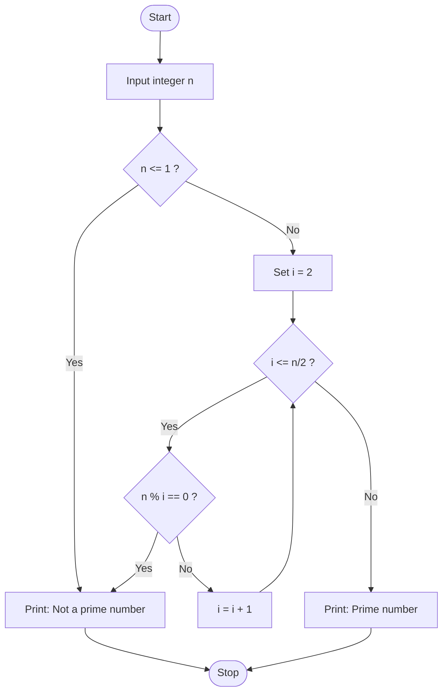

### 1.3 Algorithm
1. Start.
2. Read an integer $n$ from the user.
3. If $n \le 1$:
   - Print "Not a prime number."
   - Stop.
4. Iterate with index $i$ from 2 up to $n/2$:
   - If $n \pmod i == 0$:
     - Print "Not a prime number."
     - Stop.
5. Print "Prime number."
6. End.

### 1.4 Java Implementation
```java showLineNumbers
import java.util.Scanner; 

class prime { 
    public static void main(String[] args) { 
        Scanner sc = new Scanner(System.in); 
        int n = sc.nextInt(); 
        if (n <= 1) { 
            System.out.println("Not a prime number."); 
            return; 
        } 
        for (int i = 2; i <= n / 2; i++) { 
            if (n % i == 0) { 
                System.out.println("Not a prime number."); 
                return; 
            } 
        } 
        System.out.println("Prime number."); 
    } 
}
```

### 1.5 Sample Input & Output
- **Input:**
  ```text
  8
  ```
- **Output:**
  ```text
  Not a prime number.
  ```

### 1.6 Complexity & Frequency Analysis

| Statement / Operation | Frequency |
| :--- | :---: |
| Input: `Scanner sc = new Scanner(System.in);` | $1$ |
| Loop Header: `for (int i = 2; i <= n / 2; i++)` | $n/2$ |
| Loop Body: `if (n % i == 0)` | $n/2 - 1$ |
| **Total Operations** | $O(n)$ |

- **Time Complexity**:
  - **Best Case**: $O(1)$ when $n$ is an even number greater than 2.
  - **Worst Case**: $O(n)$ when $n$ is prime, requiring full traversal up to $n/2$.
- **Space Complexity**: $O(1)$ auxiliary space.

### 1.7 Conclusion
- The program demonstrates elementary primality testing via trial division up to $n/2$. Loop execution confirms that testing up to half the input provides a deterministic answer within $O(n)$ runtime.

## 2. Practical 2: Search Insert Position (Binary Search)

### 2.1 Aim
- Given a sorted array and a target value, return the index if the target is found. If not, return the index where it would be if it were inserted in order.

### 2.2 Theory & Core Concepts
- **Binary Search Paradigm**: Exploits monotonic order by iteratively halving the search space.
- **Search Mechanics**:
  - Maintain boundary pointers: `low = 0` and `high = n - 1`.
  - Compute midpoint: `mid = (low + high) / 2`.
  - If `arr[mid] == target`, target exists at `mid`.
  - If `arr[mid] < target`, discard left half (`low = mid + 1`).
  - If `arr[mid] > target`, discard right half (`high = mid - 1`).
- **Insertion Guarantee**: If target is absent, the search terminates with `low > high`. The variable `low` strictly points to the correct insertion rank preserving ascending order.

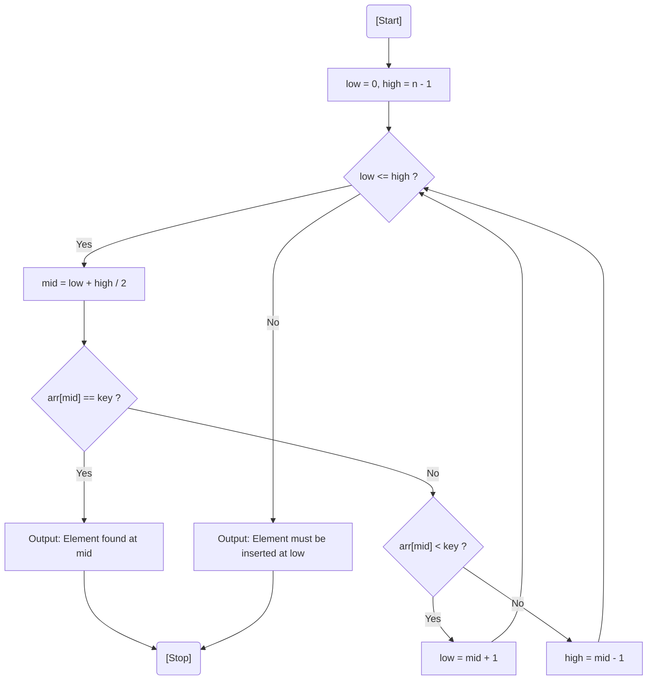

### 2.3 Algorithm
1. Start.
2. Read array size $n$, the sorted array elements, and search key.
3. Initialize `low = 0`, `high = n - 1`.
4. While `low <= high`:
   - Set `mid = (low + high) / 2`.
   - If `arr[mid] == key`:
     - Print `mid` as target index.
     - Stop.
   - Else if `arr[mid] < key`:
     - Set `low = mid + 1`.
   - Else:
     - Set `high = mid - 1`.
5. When `low > high`, print `low` as insertion index.
6. End.

### 2.4 Java Implementation
```java showLineNumbers
import java.util.Scanner; 

class binary { 
    public static void main(String[] args) { 
        Scanner sc = new Scanner(System.in); 
        System.out.print("Enter the size of array: ");  
        int n = sc.nextInt(); 

        int[] arr = new int[n]; 
        System.out.println("\nEnter the array"); 
        for (int i = 0; i < n; i++) { 
            arr[i] = sc.nextInt(); 
        } 
        System.out.println("\nEnter the key to find: "); 
        int key = sc.nextInt(); 

        int low = 0; 
        int high = n - 1; 

        while (low <= high) { 
            int mid = (low + high) / 2; 

            if (arr[mid] == key) { 
                System.out.println("\nElement found at " + mid); 
                return; 
            } else if (arr[mid] < key) { 
                low = mid + 1; 
            } else { 
                high = mid - 1; 
            } 
        } 
        System.out.println("\nElement must be inserted at " + low); 
    } 
}
```

### 2.5 Sample Input & Output
- **Input:**
  ```text
  Enter the size of array: 4
  Enter the array
  13
  144
  145
  1333
  Enter the key to find: 
  23
  ```
- **Output:**
  ```text
  Element must be inserted at 1
  ```

### 2.6 Complexity & Frequency Analysis

| Search Iteration ($k$) | Remaining Array Size |
| :---: | :---: |
| 1 | $n / 2$ |
| 2 | $n / 2^2$ |
| 3 | $n / 2^3$ |
| $\dots$ | $\dots$ |
| $k$ | $n / 2^k$ |

- **Derivation of Max Steps ($k$)**:
  $$\frac{n}{2^k} = 1 \implies n = 2^k \implies k = \log_2 n$$
- **Complexity Breakdown**:
  - **Best Case Time Complexity**: $O(1)$ (target matches middle element on initial comparison).
  - **Worst Case Time Complexity**: $O(\log_2 n)$ (element absent or at boundary).
  - **Average Case Time Complexity**: $O(\log_2 n)$.
  - **Space Complexity**: $O(1)$ in-place iterative pointers.

### 2.7 Conclusion
- Binary search optimizes search and insertion rank detection from linear $O(n)$ to logarithmic $O(\log n)$, providing scalability for large ordered datasets.

## 3. Practical 3: Candy Distribution Problem (Greedy Two-Pass)

### 3.1 Aim
- There are $N$ children standing in a line with rating values. Distribute the minimum number of candies such that:
  1. Each child receives at least one candy.
  2. Children with higher ratings than their immediate neighbours receive more candies than them.

### 3.2 Theory & Core Concepts
- **Greedy Strategy**: Instead of attempting to simultaneously reconcile left and right neighbours, decompose the problem into two monotonic passes.
- **Two-Pass Algorithm**:
  1. **Initialization**: Assign 1 candy to every child: $candies[i] = 1$.
  2. **Left-to-Right Pass**: Ensure rightward consistency:
     $$\text{If } ratings[i] > ratings[i - 1] \implies candies[i] = candies[i - 1] + 1$$
  3. **Right-to-Left Pass**: Ensure leftward consistency without invalidating the first pass:
     $$\text{If } ratings[i] > ratings[i + 1] \implies candies[i] = \max(candies[i], candies[i + 1] + 1)$$
  4. **Summation**: Aggregate all values in the candy array.

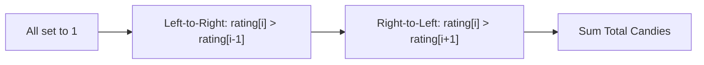

### 3.3 Algorithm
1. Start.
2. If total children $N \le 0$, output 0 and stop.
3. Allocate arrays `rating` and `candy` of size $N$. Initialize all entries of `candy` to 1.
4. **Forward Pass**: For $i$ from 1 to $N - 1$:
   - If `rating[i] > rating[i - 1]`, set `candy[i] = candy[i - 1] + 1`.
5. **Backward Pass**: For $i$ from $N - 2$ down to 0:
   - If `rating[i] > rating[i + 1]` and `candy[i] < candy[i + 1] + 1`:
     - Set `candy[i] = candy[i + 1] + 1`.
6. Compute sum of all elements in `candy`.
7. Output total candies and stop.

### 3.4 Java Implementation
```java showLineNumbers
import java.util.Scanner; 

class rate { 
    public static void main(String[] args) { 
        Scanner scanner = new Scanner(System.in); 

        int N = scanner.nextInt(); 

        int[] rating = new int[N]; 
        int[] candy = new int[N]; 

        for (int i = 0; i < N; i++) { 
            rating[i] = scanner.nextInt();  
            candy[i] = 1; 
        } 

        for (int i = 1; i < N; i++) { 
            if (rating[i] > rating[i - 1]) { 
                candy[i] = candy[i - 1] + 1; 
            } 
        } 

        for (int i = N - 2; i >= 0; i--) { 
            if (rating[i] > rating[i + 1] && candy[i] < candy[i + 1] + 1) { 
                candy[i] = candy[i + 1] + 1; 
            } 
        } 

        int total = 0; 
        for (int i = 0; i < N; i++) { 
            total = total + candy[i]; 
        } 

        System.out.println("Minimum candies: " + total); 
        scanner.close(); 
    } 
}
```

### 3.5 Sample Input & Output
- **Input:**
  ```text
  3
  1 0 5
  ```
- **Output:**
  ```text
  Minimum candies: 5
  ```

### 3.6 Complexity & Frequency Analysis

| Operation / Step | Execution Frequency |
| :--- | :---: |
| Input and candy initialization | $n$ |
| Left-to-right forward traversal | $n - 1$ |
| Right-to-left backward traversal | $n - 1$ |
| Total candy summation | $n$ |
| **Total Operations** | $4n - 2 \approx O(n)$ |

- **Time Complexity**: $O(n)$ where $n$ is the number of children.
- **Space Complexity**: $O(n)$ auxiliary memory for the candy assignment buffer.

### 3.7 Conclusion
- Decoupling bi-directional relative ranking constraints into two independent passes guarantees local optimality at each step, yielding the global minimum candy allocation in linear $O(n)$ time.

## 4. Practical 4: Aggressive Cows (Binary Search on Answer)

### 4.1 Aim
- There are $N$ stalls and $C$ cows. Stalls are located on a straight line at coordinates $x_1, \dots, x_N$ ($0 \le x_i \le 10^9$). Assign cows to stalls such that the minimum distance between any two cows is maximized.

### 4.2 Theory & Core Concepts
- **Paradigm**: Binary Search on Answer combined with Greedy Feasibility Checking.
- **Monotonicity Property**: If it is possible to place $C$ cows with at least distance $d$, then any distance $d' < d$ is also feasible. Conversely, if distance $d$ fails, any $d'' > d$ is impossible.
- **Search Interval**:
  - `low = 0`
  - `high = stall[N - 1] - stall[0]` (after sorting stall coordinates)
- **Greedy Placement Subroutine (`canplace`)**:
  - Always place the first cow in stall 0.
  - Sequentially scan stalls; place the next cow in stall $i$ as soon as $stall[i] - lastPlaced \ge d$.
  - Return `true` if cow count placed $\ge C$.

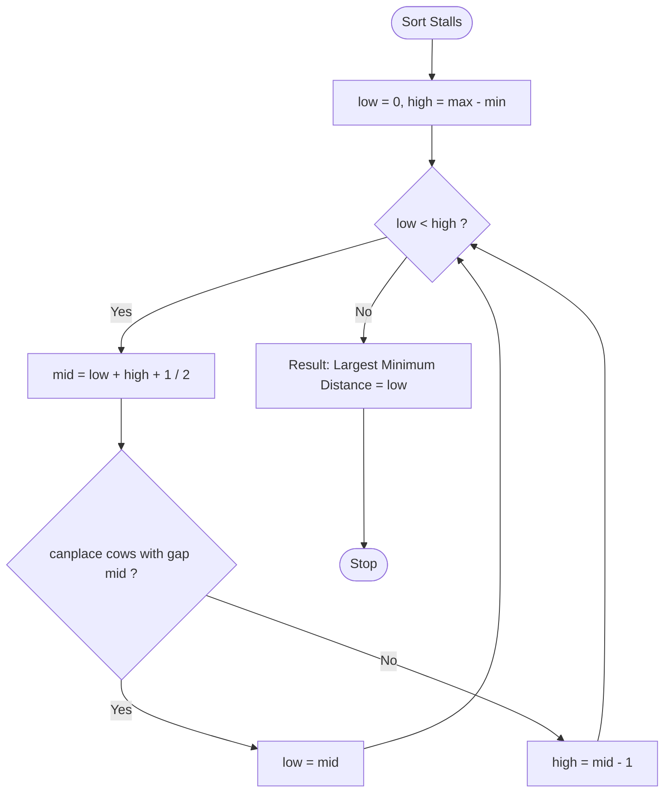

### 4.3 Algorithm
1. Start.
2. Read stall count $N$, stall positions array, and cow count $C$.
3. Sort stall positions in ascending order.
4. Set `low = 0`, `high = stall[N - 1] - stall[0]`.
5. While `low < high`:
   - Compute `mid = (low + high + 1) / 2`.
   - Test feasibility using `canplace(stall, cows, mid)`.
   - If feasible, update `low = mid`.
   - Else, update `high = mid - 1`.
6. Print `low` as the optimal maximum minimum gap.
7. Stop.

### 4.4 Java Implementation
```java showLineNumbers
import java.util.Scanner; 
import java.util.Arrays; 

class cow { 

    static boolean canplace(int[] a, int cows, int d) { 
        int count = 1, last = a[0]; 
        for (int i = 1; i < a.length; i++) { 
            if (a[i] - last >= d) { 
                count++; 
                last = a[i]; 
            } 
        } 
        return count >= cows; 
    } 

    public static void main(String[] args) { 
        Scanner sc = new Scanner(System.in); 

        int n = sc.nextInt(); 
        int[] stall = new int[n]; 

        for (int i = 0; i < n; i++) 
            stall[i] = sc.nextInt(); 

        int cows = sc.nextInt(); 
        Arrays.sort(stall); 

        int l = 0, r = stall[n - 1] - stall[0]; 

        while (l < r) { 
            int mid = (l + r + 1) / 2; 
            if (canplace(stall, cows, mid)) 
                l = mid; 
            else 
                r = mid - 1; 
        } 

        System.out.println("Minimum Gap: " + l); 
        sc.close(); 
    } 
}
```

### 4.5 Sample Input & Output
- **Input:**
  ```text
  5
  1 200000000 4000000 8000000 900000000
  3
  ```
- **Output:**
  ```text
  Minimum Gap: 199999999
  ```

### 4.6 Complexity & Frequency Analysis

| Operation | Frequency | Complexity |
| :--- | :---: | :---: |
| Sorting stall coordinates | 1 | $O(N \log N)$ |
| Binary search over coordinate range | $\log D$ | $O(\log D)$ |
| Greedy placement check (`canplace`) | $N$ per iteration | $O(N \log D)$ |
| **Overall Time Complexity** | — | **$O(N \log N + N \log D)$** |

- $D = stall[N - 1] - stall[0] \le 10^9$.
- **Space Complexity**: $O(1)$ auxiliary space beyond input arrays.

### 4.7 Conclusion
- Transforming an optimization problem into a decision problem via Binary Search on Answer reduces exponential search spaces to logarithmic evaluations, handling coordinate magnitudes up to $10^9$ within milliseconds.

## 5. Practical 5: Cycle Detection in Undirected Graph (DFS)

### 5.1 Aim
- Given an undirected graph with $V$ vertices and $E$ edges, check whether it contains any cycle or not.

### 5.2 Theory & Core Concepts
- **Cycle Condition**: An undirected graph contains a cycle if and only if Depth-First Search encounters an adjacent visited vertex that is **not** the parent from which the current vertex was entered.
- **Back-Edge Detection**:
  - `visited[]` array prevents infinite looping across cycles.
  - Passing `parent` node in recursive calls prevents false cycle detection back to the immediate caller.
  - An edge to an already visited non-parent node indicates a cycle (back-edge).
- **Disconnected Graphs**: Outer loop iterating across all vertices from $0$ to $V - 1$ ensures disconnected components are fully explored.

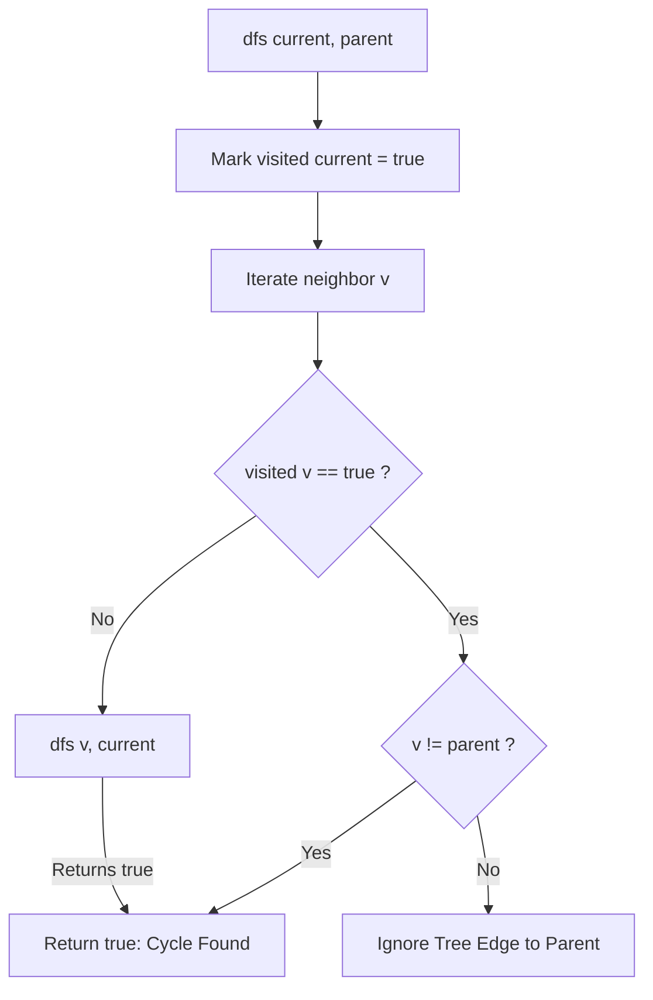

### 5.3 Algorithm
1. Start.
2. Initialize `visited[V] = false`.
3. Read edges and populate adjacency representation.
4. For each vertex $i$ from 0 to $V - 1$:
   - If `!visited[i]`:
     - Run `dfs(graph, visited, i, -1)`.
     - If `dfs` returns `true`, report "Cycle Detected" and terminate.
5. In `dfs(node, parent)`:
   - Mark `visited[node] = true`.
   - For every adjacent vertex $j$:
     - If $j$ is connected:
       - If `!visited[j]`:
         - If `dfs(graph, visited, j, node)` returns `true`, return `true`.
       - Else if $j \ne parent$:
         - Return `true` (cycle detected).
   - Return `false`.
6. Print "No Cycle Detected" if all components are acyclic.
7. Stop.

### 5.4 Java Implementation
```java showLineNumbers
import java.util.Scanner; 

public class Main { 
    static boolean dfs(int[][] graph, boolean[] visited, int node, int parent) { 
        visited[node] = true; 
        for (int i = 0; i < graph.length; i++) { 
            if (graph[node][i] == 1) { 
                if (!visited[i]) { 
                    if (dfs(graph, visited, i, node)) 
                        return true; 
                } else if (i != parent) { 
                    return true; 
                } 
            } 
        } 
        return false; 
    } 

    public static void main(String[] args) { 
        Scanner sc = new Scanner(System.in); 
        System.out.print("Enter number of vertices: "); 
        int V = sc.nextInt(); 
        System.out.print("Enter number of edges: "); 
        int E = sc.nextInt(); 
        int[][] graph = new int[V][V]; 
        System.out.println("Enter the edges (u v):"); 
        for (int i = 0; i < E; i++) { 
            int u = sc.nextInt(); 
            int v = sc.nextInt(); 
            graph[u][v] = 1; 
            graph[v][u] = 1; 
        } 
        boolean[] visited = new boolean[V]; 
        boolean cycle = false; 
        for (int i = 0; i < V; i++) { 
            if (!visited[i]) { 
                if (dfs(graph, visited, i, -1)) { 
                    cycle = true; 
                    break; 
                } 
            } 
        } 
        if (cycle) System.out.println("Cycle Detected"); 
        else System.out.println("No Cycle Detected"); 
        sc.close(); 
    } 
}
```

### 5.5 Sample Input & Output
- **Input:**
  ```text
  5 4
  0 2
  0 1
  0 3
  0 4
  ```
- **Output:**
  ```text
  No Cycle Detected
  ```

### 5.6 Complexity & Frequency Analysis

| Operation | Frequency | Complexity |
| :--- | :---: | :---: |
| Construct adjacency matrix | $E$ | $O(E)$ |
| Initialize visited array | $V$ | $O(V)$ |
| DFS exploration (matrix checking) | $V \times V$ | $O(V^2)$ |
| **Total Complexity (Adjacency Matrix)** | — | **$O(V^2)$** |
| *Total Complexity (with Adjacency List)* | — | *$O(V + E)$* |

- **Space Complexity**: $O(V^2)$ for adjacency matrix storage, plus $O(V)$ recursive call stack depth.

### 5.7 Conclusion
- Graph traversal with explicit parent tracking detects cyclic dependencies by isolating non-trivial back-edges, achieving complete verification across all forest components.

## 6. Practical 6: Critical Connections in a Network (Tarjan's Bridges)

### 6.1 Aim
- There are $n$ servers numbered 0 to $n - 1$ connected by undirected server-to-server connections. Find all critical connections (bridges) that, if removed, disconnect some servers from the rest of the network.

### 6.2 Theory & Core Concepts
- **Bridge Definition**: An edge $(u, v)$ whose removal strictly increases the number of connected components.
- **Tarjan's DFS Parameters**:
  - `disc[u]`: Discovery time of node $u$.
  - `low[u]`: Lowest discovery time reachable from $u$ via tree edges and at most one back-edge.
- **Bridge Condition**: An edge $(u, v)$ is a bridge if and only if:
  $$low[v] > disc[u]$$
  If $low[v] \le disc[u]$, node $v$ possesses an alternative path/back-edge reaching $u$ or an ancestor of $u$; hence removing $(u, v)$ does not disconnect $v$.

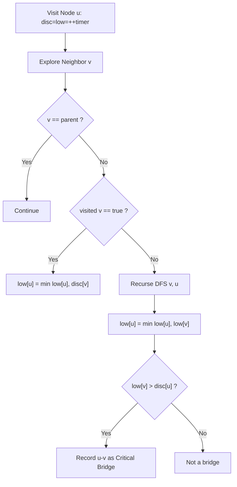

### 6.3 Algorithm
1. Start.
2. Read vertices $n$ and edges $m$. Construct adjacency list `graph`.
3. Initialize `disc[n]`, `low[n]`, `visited[n] = false`, `timer = 0`.
4. For $i = 0$ to $n - 1$, if `!visited[i]`, call `dfs(i, -1)`.
5. Inside `dfs(u, parent)`:
   - Mark `visited[u] = true`.
   - Set `disc[u] = low[u] = ++timer`.
   - For each neighbour $v$ in `graph[u]`:
     - If $v == parent$, continue.
     - If `!visited[v]`:
       - Recursively call `dfs(v, u)`.
       - `low[u] = Math.min(low[u], low[v])`.
       - If `low[v] > disc[u]`, append edge $(u, v)$ to bridge list.
     - Else:
       - `low[u] = Math.min(low[u], disc[v])`.
6. Print bridge list, or "No Bridges".
7. Stop.

### 6.4 Java Implementation
```java showLineNumbers
import java.util.*; 

class Main { 

    static ArrayList<Integer>[] graph; 
    static boolean[] visited; 
    static int[] disc; 
    static int[] low; 
    static int timer = 0; 
    static ArrayList<String> bridges = new ArrayList<>(); 

    static void dfs(int u, int parent) { 
        visited[u] = true; 
        disc[u] = low[u] = ++timer; 

        for (int v : graph[u]) { 
            if (v == parent) 
                continue; 

            if (!visited[v]) { 
                dfs(v, u); 
                low[u] = Math.min(low[u], low[v]); 

                if (low[v] > disc[u]) { 
                    bridges.add(u + " " + v); 
                } 
            } else { 
                low[u] = Math.min(low[u], disc[v]); 
            } 
        } 
    } 

    public static void main(String[] args) { 
        Scanner sc = new Scanner(System.in); 

        int n = sc.nextInt();   // Number of vertices 
        int m = sc.nextInt();   // Number of edges 

        graph = new ArrayList[n]; 

        for (int i = 0; i < n; i++) 
            graph[i] = new ArrayList<>(); 

        for (int i = 0; i < m; i++) { 
            int u = sc.nextInt(); 
            int v = sc.nextInt(); 
            graph[u].add(v); 
            graph[v].add(u); 
        } 

        visited = new boolean[n]; 
        disc = new int[n]; 
        low = new int[n]; 

        for (int i = 0; i < n; i++) 
            if (!visited[i]) 
                dfs(i, -1); 

        if (bridges.size() == 0) { 
            System.out.println("No Bridges"); 
        } else { 
            System.out.println("Bridges:"); 
            for (String s : bridges) 
                System.out.println(s); 
        } 
    } 
}
```

### 6.5 Sample Input & Output
- **Input:**
  ```text
  5 5
  0 1
  1 2
  2 0
  1 3
  3 4
  ```
- **Output:**
  ```text
  Bridges:
  3 4
  1 3
  ```

### 6.6 Complexity & Frequency Analysis

| Operation | Frequency | Complexity |
| :--- | :---: | :---: |
| Build adjacency list | $V + 2E$ | $O(V + E)$ |
| DFS vertex visits | $V$ | $O(V)$ |
| Edge traversal and bridge checks | $2E$ | $O(E)$ |
| **Total Running Time** | **$2V + 4E$** | **$O(V + E)$** |

- **Brute Force Comparison**: Naive edge removal takes $O(E \times (V + E))$. Tarjan's single-pass DFS reduces this to optimal linear time $O(V + E)$.
- **Space Complexity**: $O(V + E)$ for adjacency lists, plus $O(V)$ arrays (`disc`, `low`, recursion stack).

### 6.7 Conclusion
- Tarjan's algorithm computes subtree reachability metrics (`low` and `disc`) in a single DFS pass, finding all single points of network failure in $O(V + E)$ time.

## 7. Practical 7: Number of Islands (8-Directional DFS)

### 7.1 Aim
- Given an $N \times M$ grid consisting of `'0'` (Water) and `'1'` (Land), find the number of disconnected islands (connected land cells in all 8 directions).

### 7.2 Theory & Core Concepts
- **Graph Modeling**: Treat every grid cell as a vertex. An island is a connected component of land cells (`1`) connected horizontally, vertically, or diagonally (8 adjacent neighbours).
- **Flood Fill Strategy**:
  - Sequentially iterate over every grid cell $(i, j)$.
  - When encountering an unvisited `1`, increment the island counter.
  - Trigger recursive DFS to sink/visit all reachable cells across all 8 offset directions:
    $$\{-1, 0, 1\} \times \{-1, 0, 1\} \setminus \{(0, 0)\}$$

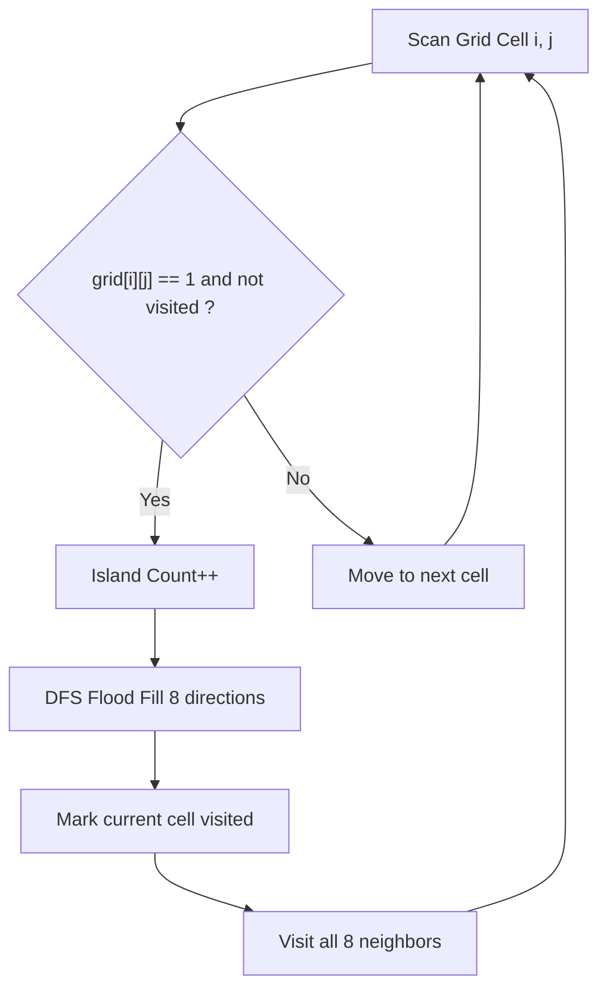

### 7.3 Algorithm
1. Start.
2. Read grid dimensions $N, M$ and populate `grid[N][M]`.
3. Initialize `visited[N][M] = false` and `count = 0`.
4. Loop through row $i$ from 0 to $N - 1$:
   - Loop through col $j$ from 0 to $M - 1$:
     - If `grid[i][j] == 1` and `!visited[i][j]`:
       - Increment `count++`.
       - Execute `dfs(grid, visited, i, j, N, M)`.
5. Inside `dfs(row, col)`:
   - If `row < 0 || row >= N || col < 0 || col >= M`, return.
   - If `grid[row][col] == 0 || visited[row][col]`, return.
   - Mark `visited[row][col] = true`.
   - Recursively call `dfs` on all 8 neighbours:
     - Top-Left, Up, Top-Right, Left, Right, Bottom-Left, Down, Bottom-Right.
6. Print `count` as total islands.
7. End.

### 7.4 Java Implementation
```java showLineNumbers
import java.util.Scanner; 

public class Main { 
    static void dfs(int[][] grid, boolean[][] visited, int row, int col, int n, int m) { 
        if (row < 0 || row >= n || col < 0 || col >= m) 
            return; 

        if (grid[row][col] == 0 || visited[row][col]) 
            return; 

        visited[row][col] = true; 

        dfs(grid, visited, row - 1, col - 1, n, m); 
        dfs(grid, visited, row - 1, col, n, m); 
        dfs(grid, visited, row - 1, col + 1, n, m); 
        dfs(grid, visited, row, col - 1, n, m); 
        dfs(grid, visited, row, col + 1, n, m); 
        dfs(grid, visited, row + 1, col - 1, n, m); 
        dfs(grid, visited, row + 1, col, n, m); 
        dfs(grid, visited, row + 1, col + 1, n, m); 
    } 

    public static void main(String[] args) { 
        Scanner sc = new Scanner(System.in); 

        int n = sc.nextInt(); 
        int m = sc.nextInt(); 

        int[][] grid = new int[n][m]; 

        for (int i = 0; i < n; i++) { 
            for (int j = 0; j < m; j++) { 
                grid[i][j] = sc.nextInt(); 
            } 
        } 

        boolean[][] visited = new boolean[n][m]; 
        int count = 0; 

        for (int i = 0; i < n; i++) { 
            for (int j = 0; j < m; j++) { 
                if (grid[i][j] == 1 && !visited[i][j]) { 
                    count++; 
                    dfs(grid, visited, i, j, n, m); 
                } 
            } 
        } 

        System.out.println(count); 
        sc.close(); 
    } 
}
```

### 7.5 Sample Input & Output
- **Input:**
  ```text
  4 4
  0 1 0 1
  0 1 0 1
  0 1 0 1
  0 1 0 1
  ```
- **Output:**
  ```text
  2
  ```

### 7.6 Complexity & Frequency Analysis

| Operation | Frequency | Complexity |
| :--- | :---: | :---: |
| Scanning all grid cells | $N \times M$ | $O(NM)$ |
| Exploring 8 neighbours per land cell | $\le 8 \times (NM)$ | $O(NM)$ |
| Marking visited states | $N \times M$ | $O(NM)$ |
| Island increment count ($K$) | $K \le NM$ | $O(K)$ |
| **Total Operations** | **$10NM + K$** | **$O(N \times M)$** |

- **Time Complexity**: $O(N \times M)$ since each cell is entered and processed a constant number of times.
- **Space Complexity**: $O(N \times M)$ for the `visited` matrix and worst-case call stack.

### 7.7 Conclusion
- Recursive flood fill on an 8-connected grid identifies connected components in linear time relative to matrix area.

## 8. Practical 8: Rotting Oranges (Multi-Source BFS)

### 8.1 Aim
- Given a matrix `mat[][]` where 0: Empty, 1: Fresh orange, 2: Rotten orange. Fresh oranges rot if adjacent (up, down, left, right) to a rotten orange (takes 1 unit time). Determine minimum time to rot all oranges, or return -1 if impossible.

### 8.2 Theory & Core Concepts
- **Multi-Source Breadth-First Search (BFS)**:
  - All initially rotten oranges begin spreading infection at time $t = 0$ simultaneously.
  - Insert all initial positions with value 2 into a `Queue`.
  - Count total fresh oranges.
  - Process queue level-by-level; each completed level represents 1 elapsed unit of time.
  - For each rotten cell, infect unvisited fresh 4-neighbours, decrement the fresh counter, and push them to the queue.
  - If fresh oranges remain $> 0$ after queue exhaustion, return -1.

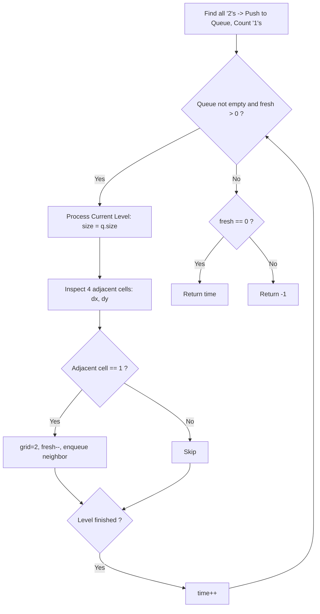

### 8.3 Algorithm
1. Start.
2. Read dimensions $m, n$ and grid matrix.
3. Initialize `Queue<int[]>`, `fresh = 0`, `time = 0`.
4. Enqueue every cell with value 2; count cells with value 1 as `fresh`.
5. Direction offsets: $dx = \{-1, 1, 0, 0\}$, $dy = \{0, 0, -1, 1\}$.
6. While `!q.isEmpty()` and `fresh > 0`:
   - `size = q.size()`.
   - While `size-- > 0`:
     - Pop `cur = q.poll()`.
     - For $k = 0$ to 3:
       - $x = cur[0] + dx[k]$, $y = cur[1] + dy[k]$.
       - If $x, y$ are valid and `grid[x][y] == 1`:
         - `grid[x][y] = 2`.
         - `fresh--`.
         - Enqueue $(x, y)$.
   - `time++`.
7. Output `fresh == 0 ? time : -1`.
8. End.

### 8.4 Java Implementation
```java showLineNumbers
import java.util.*; 

public class Main { 
    public static void main(String[] args) { 
        Scanner sc = new Scanner(System.in); 

        int m = sc.nextInt(); 
        int n = sc.nextInt(); 

        int[][] grid = new int[m][n]; 
        Queue<int[]> q = new LinkedList<>(); 
        int fresh = 0, time = 0; 

        for (int i = 0; i < m; i++) { 
            for (int j = 0; j < n; j++) { 
                grid[i][j] = sc.nextInt(); 
                if (grid[i][j] == 2) q.offer(new int[]{i, j}); 
                else if (grid[i][j] == 1) fresh++; 
            } 
        } 

        int[] dx = {-1, 1, 0, 0}; 
        int[] dy = {0, 0, -1, 1}; 

        while (!q.isEmpty() && fresh > 0) { 
            int size = q.size(); 
            while (size-- > 0) { 
                int[] cur = q.poll(); 

                for (int k = 0; k < 4; k++) { 
                    int x = cur[0] + dx[k]; 
                    int y = cur[1] + dy[k]; 

                    if (x >= 0 && y >= 0 && x < m && y < n && grid[x][y] == 1) { 
                        grid[x][y] = 2; 
                        fresh--; 
                        q.offer(new int[]{x, y}); 
                    } 
                } 
            } 
            time++; 
        } 

        System.out.println(fresh == 0 ? time : -1); 
    } 
}
```

### 8.5 Sample Input & Output
- **Input:**
  ```text
  2 3
  2 1 0
  0 0 1
  ```
- **Output:**
  ```text
  -1
  ```

### 8.6 Complexity & Frequency Analysis

| Operation | Frequency | Complexity |
| :--- | :---: | :---: |
| Matrix scan and queue initialization | $M \times N$ | $O(MN)$ |
| Queue insertion / deletion | $M \times N$ | $O(MN)$ |
| Four-neighbour boundary checking | $4 \times (M \times N)$ | $O(MN)$ |
| **Total Operations** | **$6MN$** | **$O(M \times N)$** |

- **Time Complexity**: $O(M \times N)$ since every cell is visited at most once.
- **Space Complexity**: $O(M \times N)$ to store cell coordinates in the queue.

### 8.7 Conclusion
- BFS level-order traversal simulates concurrent infection waves across graph topologies, identifying reachability and distance in linear time.

## 9. Practical 9: Minimum Edit Distance (Dynamic Programming)

### 9.1 Aim
- Given two strings `str1` and `str2`, find the minimum number of edit operations (Insert, Remove, Replace) required to convert `str1` into `str2`. Each operation has equal unit cost.

### 9.2 Theory & Core Concepts
- **Subproblem Definition**: Let `dp[i][j]` denote the minimum edits required to convert prefix `str1[0..i-1]` into prefix `str2[0..j-1]`.
- **Base Conditions**:
  - `dp[i][0] = i` (converting string of length $i$ to empty string requires $i$ deletions).
  - `dp[0][j] = j` (converting empty string to string of length $j$ requires $j$ insertions).
- **Recurrence Relation**:
  - If characters match (`str1[i-1] == str2[j-1]`):
    $$dp[i][j] = dp[i - 1][j - 1]$$
  - If characters differ:
    $$dp[i][j] = 1 + \min \begin{cases} dp[i - 1][j] & \text{(Remove)} \\ dp[i][j - 1] & \text{(Insert)} \\ dp[i - 1][j - 1] & \text{(Replace)} \end{cases}$$

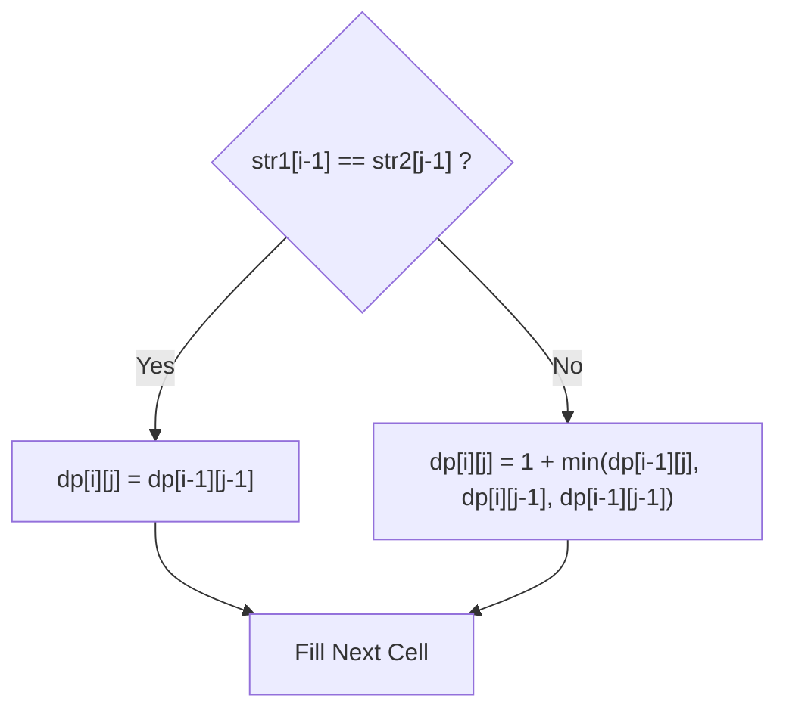

### 9.3 Algorithm
1. Start.
2. Read strings `str1` and `str2`, with lengths $m$ and $n$.
3. Allocate table `dp[m + 1][n + 1]`.
4. For $i = 0$ to $m$, set `dp[i][0] = i`.
5. For $j = 0$ to $n$, set `dp[0][j] = j`.
6. For $i = 1$ to $m$:
   - For $j = 1$ to $n$:
     - If `str1.charAt(i - 1) == str2.charAt(j - 1)`:
       - `dp[i][j] = dp[i - 1][j - 1]`.
     - Else:
       - `dp[i][j] = 1 + Math.min(dp[i - 1][j], Math.min(dp[i][j - 1], dp[i - 1][j - 1]))`.
7. Output `dp[m][n]`.
8. End.

### 9.4 Java Implementation
```java showLineNumbers
import java.util.Scanner; 

public class string { 
    public static int minSteps(String str1, String str2) { 
        int m = str1.length(); 
        int n = str2.length(); 
         
        int[][] dp = new int[m + 1][n + 1]; 
         
        for (int i = 0; i <= m; i++) { 
            dp[i][0] = i; 
        } 
        for (int j = 0; j <= n; j++) { 
            dp[0][j] = j; 
        } 
         
        for (int i = 1; i <= m; i++) { 
            for (int j = 1; j <= n; j++) { 
                if (str1.charAt(i - 1) == str2.charAt(j - 1)) { 
                    dp[i][j] = dp[i - 1][j - 1]; 
                } else { 
                    dp[i][j] = Math.min(dp[i - 1][j], 
                               Math.min(dp[i][j - 1], 
                                        dp[i - 1][j - 1])) + 1; 
                } 
            } 
        } 

        return dp[m][n]; 
    } 

    public static void main(String[] args) { 
        Scanner scanner = new Scanner(System.in); 
        System.out.print("Enter the first string: "); 
        String str1 = scanner.nextLine(); 
        System.out.print("Enter the second string: "); 
        String str2 = scanner.nextLine(); 
        scanner.close(); 

        int result = minSteps(str1, str2); 
        System.out.println("Minimum steps required: " + result); 
    } 
}
```

### 9.5 Sample Input & Output
- **Input:**
  ```text
  Enter the first string: My God
  Enter the second string: impossible
  ```
- **Output:**
  ```text
  Minimum steps required: 10
  ```

### 9.6 Complexity & Frequency Analysis

| Operation | Frequency | Complexity |
| :--- | :---: | :---: |
| Base case initialization | $(m + 1) + (n + 1)$ | $O(m + n)$ |
| Cell character comparisons | $m \times n$ | $O(mn)$ |
| Three-way minimum selection | $3mn$ | $O(mn)$ |
| **Total Operations** | $\approx 5mn$ | **$O(m \times n)$** |

- **Time Complexity**: $O(m \times n)$ where $m$ and $n$ are the lengths of the strings.
- **Space Complexity**: $O(m \times n)$ table space.

### 9.7 Conclusion
- Dynamic programming resolves overlapping alignment choices in $O(mn)$ time, replacing naive exponential $O(3^m)$ recursive search.

## 10. Practical 10: Minimum Path Sum (Dynamic Programming)

### 10.1 Aim
- Given an $n \times m$ grid filled with non-negative integers, find a path from top-left $(0, 0)$ to bottom-right $(n-1, m-1)$ that minimizes the sum of numbers along the path. Permitted movements are only **Right** and **Down**.

### 10.2 Theory & Core Concepts
- **Optimal Substructure**: The minimum path cost to arrive at cell $(i, j)$ depends solely on the minimum cost to arrive at its immediate predecessors: top cell $(i-1, j)$ and left cell $(i, j-1)$.
- **Dynamic Programming Formulation**:
  - Starting position:
    $$dp[0][0] = grid[0][0]$$
  - First row (only rightward moves possible):
    $$dp[0][j] = dp[0][j - 1] + grid[0][j]$$
  - First column (only downward moves possible):
    $$dp[i][0] = dp[i - 1][0] + grid[i][0]$$
  - General cell $(i, j)$:
    $$dp[i][j] = grid[i][j] + \min(dp[i - 1][j], dp[i][j - 1])$$

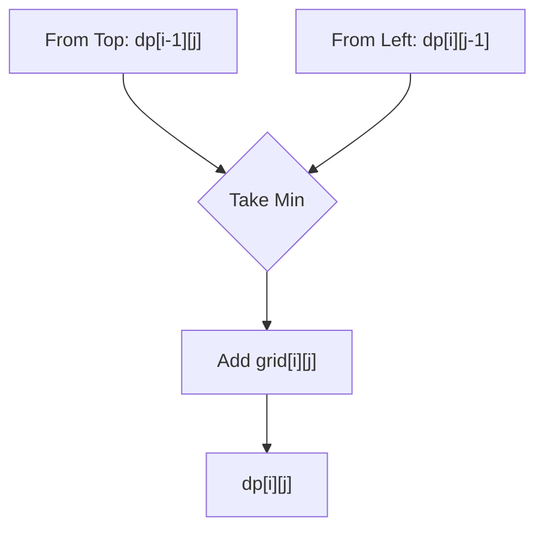

### 10.3 Algorithm
1. Start.
2. Read grid dimensions $n, m$ and elements of `grid[n][m]`.
3. Allocate `dp[n][m]`.
4. Set `dp[0][0] = grid[0][0]`.
5. Initialize first row: For $j = 1$ to $m - 1$, `dp[0][j] = dp[0][j - 1] + grid[0][j]`.
6. Initialize first column: For $i = 1$ to $n - 1$, `dp[i][0] = dp[i - 1][0] + grid[i][0]`.
7. For $i = 1$ to $n - 1$:
   - For $j = 1$ to $m - 1$:
     - `dp[i][j] = grid[i][j] + Math.min(dp[i - 1][j], dp[i][j - 1])`.
8. Output `dp[n - 1][m - 1]`.
9. Stop.

### 10.4 Java Implementation
```java showLineNumbers
import java.util.Scanner; 

public class MinimumPathSum { 
    public static int minPathSum(int[][] grid) { 
        int n = grid.length; 
        int m = grid[0].length; 

        int[][] dp = new int[n][m]; 

        dp[0][0] = grid[0][0]; 

        for (int j = 1; j < m; j++) { 
            dp[0][j] = dp[0][j - 1] + grid[0][j]; 
        } 

        for (int i = 1; i < n; i++) { 
            dp[i][0] = dp[i - 1][0] + grid[i][0]; 
        } 

        for (int i = 1; i < n; i++) { 
            for (int j = 1; j < m; j++) { 
                dp[i][j] = Math.min(dp[i - 1][j], dp[i][j - 1]) 
                           + grid[i][j]; 
            } 
        } 
        return dp[n - 1][m - 1]; 
    } 

    public static void main(String[] args) { 
        Scanner sc = new Scanner(System.in); 

        System.out.print("Enter number of rows: "); 
        int n = sc.nextInt(); 

        System.out.print("Enter number of columns: "); 
        int m = sc.nextInt(); 

        int[][] grid = new int[n][m]; 

        System.out.println("Enter the grid elements:"); 

        for (int i = 0; i < n; i++) { 
            for (int j = 0; j < m; j++) { 
                grid[i][j] = sc.nextInt(); 
            } 
        } 

        int result = minPathSum(grid); 

        System.out.println("Minimum path sum: " + result); 

        sc.close(); 
    } 
}
```

### 10.5 Sample Input & Output
- **Input:**
  ```text
  Enter number of rows: 3
  Enter number of columns: 3
  Enter the grid elements:
  1 3 1
  1 5 1
  4 2 1
  ```
- **Output:**
  ```text
  Minimum path sum: 7
  ```

### 10.6 Complexity & Frequency Analysis

| Operation | Frequency | Complexity |
| :--- | :---: | :---: |
| Base cell initialization | 1 | $O(1)$ |
| First row initialization | $m - 1$ | $O(m)$ |
| First column initialization | $n - 1$ | $O(n)$ |
| Inner cell DP transitions | $(n - 1) \times (m - 1)$ | $O(nm)$ |
| **Total Operations** | — | **$O(n \times m)$** |

- **Time Complexity**: $O(n \times m)$.
- **Space Complexity**: $O(n \times m)$ for the 2D DP matrix.

### 10.7 Conclusion
- Grid DP tabulation efficiently evaluates non-branching optimal pathways by memoizing cumulative path prefixes, guaranteeing global optimality in polynomial time.

## 11. Practical 11: Remove K Digits (Monotonic Stack & Greedy)

### 11.1 Aim
- Given string `num` representing a non-negative integer and an integer $k$, return the smallest possible integer after removing $k$ digits from `num`.

### 11.2 Theory & Core Concepts
- **Greedy Principle**: A smaller leading digit yields a smaller overall numerical value regardless of succeeding digits (e.g., $1\dots$ is always smaller than $2\dots$).
- **Monotonic Increasing Stack**:
  - Traverse digits from left to right.
  - While the stack is non-empty, remaining removal quota $k > 0$, and the top of the stack is strictly greater than the current digit:
    - Pop the top digit and decrement $k$.
  - Push the current digit onto the stack.
- **Corner Cases**:
  - If $k > 0$ after full traversal, truncate $k$ digits from the top of the stack.
  - Strip leading zeros from the final result.
  - If all digits are eliminated, return `"0"`.

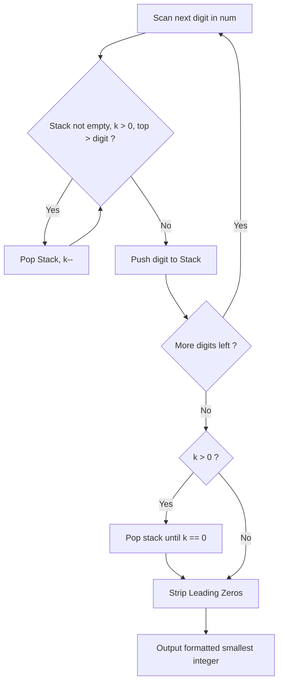

### 11.3 Algorithm
1. Start.
2. Read string `num` and integer $k$.
3. Allocate character `Stack<Character> stack`.
4. For each character `digit` in `num`:
   - While `!stack.isEmpty()` and $k > 0$ and `stack.peek() > digit`:
     - `stack.pop()`.
     - `k--`.
   - `stack.push(digit)`.
5. While $k > 0$:
   - `stack.pop()`.
   - `k--`.
6. Build string from stack contents and remove leading `'0'` characters.
7. If resulting string length is 0, return `"0"`.
8. Output formatted string.
9. Stop.

### 11.4 Java Implementation
```java showLineNumbers
import java.util.Scanner; 
import java.util.Stack; 

public class RemoveKDigits { 

    public static String removeKdigits(String num, int k) { 
        Stack<Character> stack = new Stack<>(); 

        for (char digit : num.toCharArray()) { 
            while (!stack.isEmpty() && k > 0 && 
                   stack.peek() > digit) { 
                stack.pop(); 
                k--; 
            } 
            stack.push(digit); 
        } 

        while (k > 0) { 
            stack.pop(); 
            k--; 
        } 

        StringBuilder result = new StringBuilder(); 

        for (char digit : stack) result.append(digit); 

        int i = 0; 
        while (i < result.length() && result.charAt(i) == '0') i++; 

        result = new StringBuilder(result.substring(i)); 

        if (result.length() == 0) return "0"; 

        return result.toString(); 
    } 

    public static void main(String[] args) { 
        Scanner sc = new Scanner(System.in); 

        System.out.print("Enter the number: "); 
        String num = sc.next(); 

        System.out.print("Enter the number of digits to remove: "); 
        int k = sc.nextInt(); 

        String result = removeKdigits(num, k); 

        System.out.println("Smallest possible integer: " + result); 

        sc.close(); 
    } 
}
```

### 11.5 Sample Input & Output
- **Input:**
  ```text
  Enter the number: 4592452840572141413471304981790348
  Enter the number of digits to remove: 27
  ```
- **Output:**
  ```text
  Smallest possible integer: 10348
  ```

### 11.6 Complexity & Frequency Analysis

| Operation | Frequency | Complexity |
| :--- | :---: | :---: |
| Scanning input digits | $n$ | $O(n)$ |
| Stack push operations | $\le n$ | $O(n)$ |
| Stack pop operations | $\le n$ | $O(n)$ |
| Result reconstruction and zero stripping | $\le n$ | $O(n)$ |
| **Total Operations** | — | **$O(n)$** |

- **Time Complexity**: $O(n)$ because each digit is pushed and popped at most once.
- **Space Complexity**: $O(n)$ auxiliary stack space.

### 11.7 Conclusion
- Monotonic stacks resolve inversion order constraints in $O(n)$ linear time by enforcing immediate greedy elimination of locally sub-optimal digits.

## 12. Practical 12: Unique Paths (Dynamic Programming)

### 12.1 Aim
- A robot is located at the top-left corner of an $m \times n$ grid. The robot can only move either **down** or **right** at any point. Find the total number of unique paths to reach the bottom-right corner.

### 12.2 Theory & Core Concepts
- **Combinatorial / DP Modeling**:
  - To arrive at cell $(i, j)$, the robot can only come directly from the top cell $(i-1, j)$ or left cell $(i, j-1)$.
  - Total unique paths satisfies the recurrence:
    $$dp[i][j] = dp[i - 1][j] + dp[i][j - 1]$$
- **Boundary Base Cases**:
  - The first row $dp[0][j] = 1$ for all $0 \le j < n$ (only moving right).
  - The first column $dp[i][0] = 1$ for all $0 \le i < m$ (only moving down).
- **Analytical Closed Form** (Total Paths):
  $$\binom{(m - 1) + (n - 1)}{m - 1} = \frac{(m + n - 2)!}{(m - 1)! \, (n - 1)!}$$

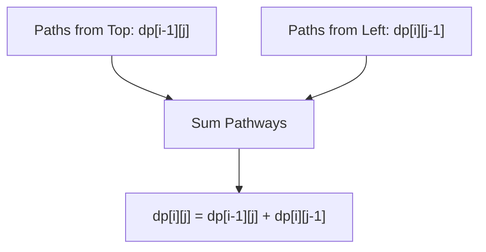

### 12.3 Algorithm
1. Start.
2. Read grid dimensions $m$ (rows) and $n$ (columns).
3. Create 2D table `dp[m][n]`.
4. Initialize `dp[i][0] = 1` for all $0 \le i < m$.
5. Initialize `dp[0][j] = 1` for all $0 \le j < n$.
6. For $i = 1$ to $m - 1$:
   - For $j = 1$ to $n - 1$:
     - `dp[i][j] = dp[i - 1][j] + dp[i][j - 1]`.
7. Output `dp[m - 1][n - 1]`.
8. Stop.

### 12.4 Java Implementation
```java showLineNumbers
import java.util.Scanner; 

public class UniquePaths { 
    public static int uniquePaths(int m, int n) { 
        int[][] dp = new int[m][n]; s

        for (int i = 0; i < m; i++) dp[i][0] = 1; 

        for (int j = 0; j < n; j++) dp[0][j] = 1; 

        for (int i = 1; i < m; i++) { 
            for (int j = 1; j < n; j++) { 
                dp[i][j] = dp[i - 1][j] + dp[i][j - 1]; 
            } 
        } 
        return dp[m - 1][n - 1]; 
    } 

    public static void main(String[] args) { 
        Scanner sc = new Scanner(System.in); 

        System.out.print("Enter number of rows: "); 
        int m = sc.nextInt(); 

        System.out.print("Enter number of columns: "); 
        int n = sc.nextInt(); 

        int result = uniquePaths(m, n); 

        System.out.println("Number of unique paths: " + result); 

        sc.close(); 
    } 
}
```

### 12.5 Sample Input & Output
- **Input:**
  ```text
  Enter number of rows: 3
  Enter number of columns: 7
  ```
- **Output:**
  ```text
  Number of unique paths: 28
  ```

### 12.6 Complexity & Frequency Analysis

| Operation | Frequency | Complexity |
| :--- | :---: | :---: |
| First row initialization | $n$ | $O(n)$ |
| First column initialization | $m$ | $O(m)$ |
| Cell additions | $(m - 1) \times (n - 1)$ | $O(mn)$ |
| **Total Operations** | — | **$O(m \times n)$** |

- **Time Complexity**: $O(m \times n)$.
- **Space Complexity**: $O(m \times n)$ table memory (can be space-optimized to $O(n)$ with a 1D buffer).

### 12.7 Conclusion
- Grid path counting decomposes into overlapping subproblems governed by Pascal's triangle identity, solved via DP tabulation in $O(mn)$ time.
