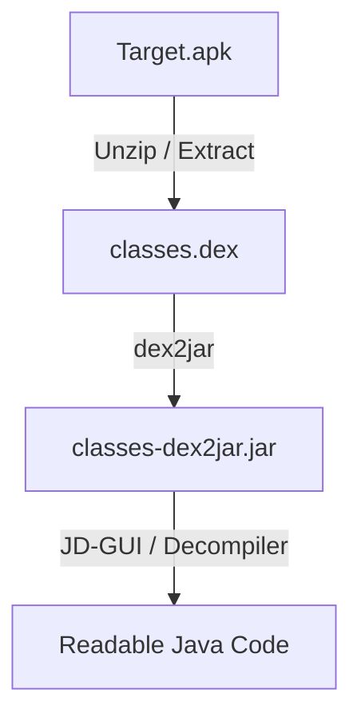
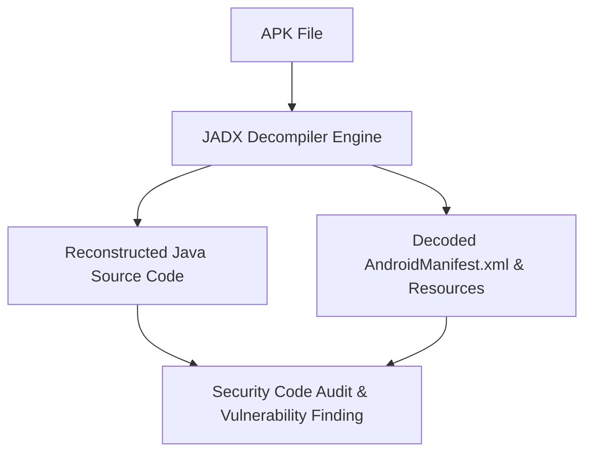
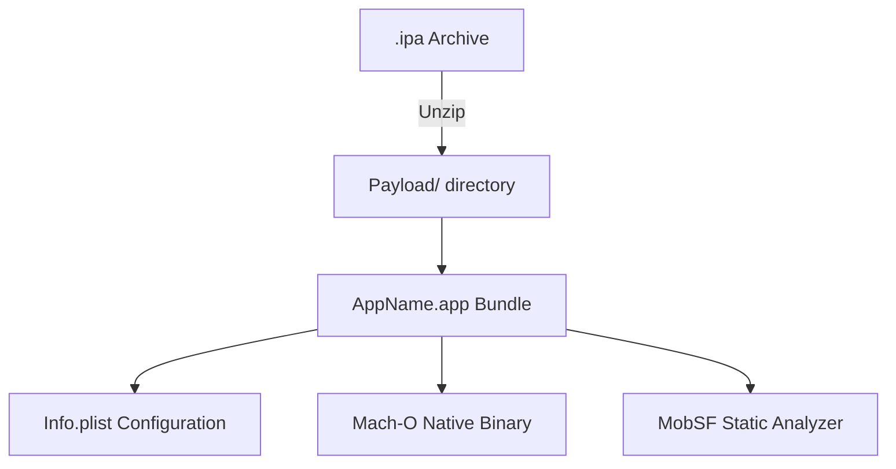
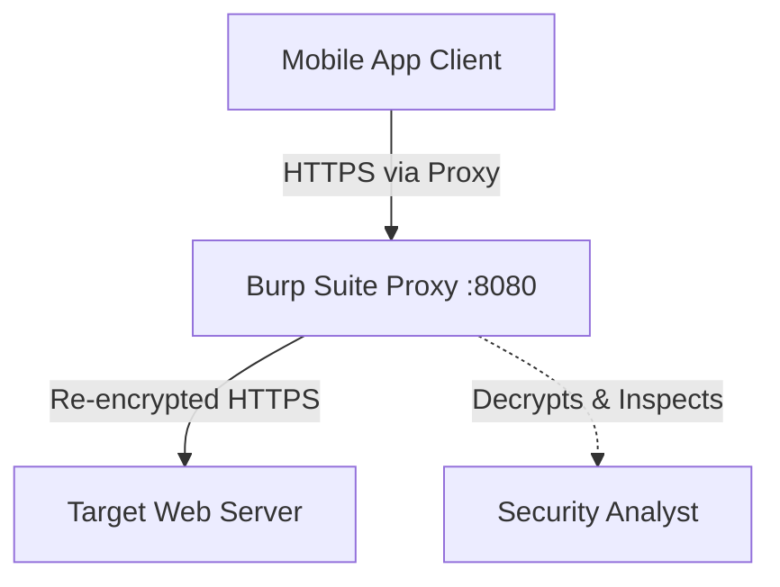
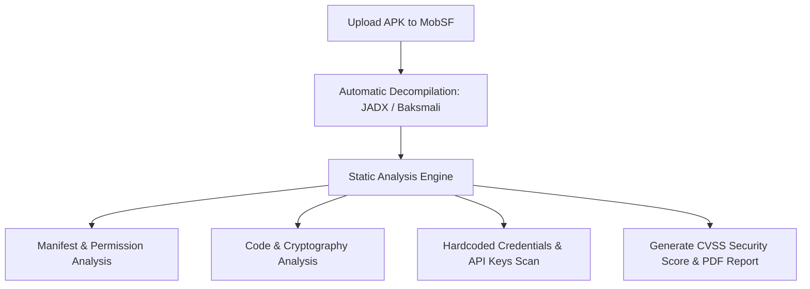
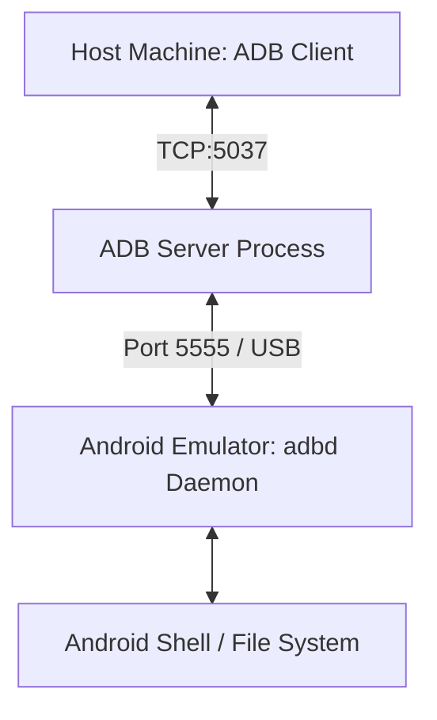
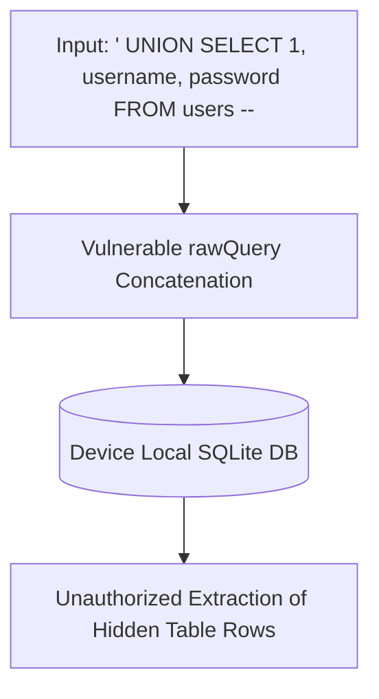
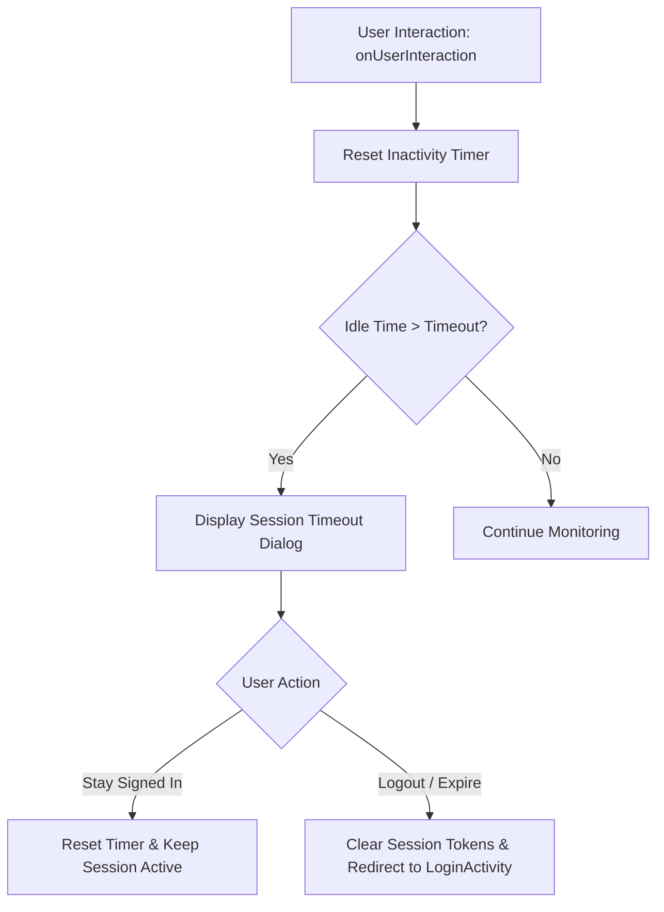

:::info[LABORATORY MANUAL OVERVIEW]
- **Course Title:** Mobile Application Security Laboratory
- **Course Code:** 303105323
- **Department:** Computer Science and Engineering
- **Semester:** 5th Semester
- **Academic Session:** 2026-27
:::

## Practical Assessment Index

| Sr. No. | Experiment Title | Security Domain / Focus | Key Tools & Platforms |
| :---: | :--- | :--- | :--- |
| 1 | Android Architecture & APK Decompilation | DEX to JAR Bytecode Conversion | Dex2jar, JD-GUI, Apktool |
| 2 | Static APK Reversing using JADX | Java Decompilation & Manifest Analysis | JADX-GUI, DivaApplication.apk |
| 3 | iOS IPA Package Reversing | iOS App Structure & Mach-O Analysis | MobSF, Docker, iMazing |
| 4 | Intercepting Mobile Traffic with Burp Suite | HTTP/HTTPS Proxying & CA Certificate Trust | Burp Suite, Android Emulator / Genymotion |
| 5 | Automated SAST using MobSF | Automated Vulnerability Scanning & Scoring | Mobile Security Framework (MobSF), Docker |
| 6 | Android Emulator & ADB Configuration | Dynamic Testing Environment Setup | Genymotion / Nox Player, ADB Platform Tools |
| 7 | OWASP Mobile Top 10 Exploitation on DIVA | Data Storage, Input Validation & Access Control | DIVA APK, ADB Shell, SQLite3 |
| 8 | Client-Side Injection Attacks | Android Local SQLite Injection | AndroGoat APK, Genymotion, JADX |
| 9 | Hard-Coded Credentials & Secrets Exposure | Static Code Auditing for Hardcoded Keys | JADX-GUI, Diva App APK |
| 10 | Mobile Session Handling & Timeout Management | Client Idle Timeout & Lifecycle Observers | Kotlin, Android Handler, Looper, Burp Suite |

## 1. Practical 1: Android Architecture & APK Decompilation (dex2jar)

### 1.1 Aim
- Study the internal architecture of the Android operating system and decompile Android Application Packages (APK) using the `dex2jar` command-line utility.

### 1.2 Theory & Core Concepts
- **Android System Architecture Layers**:
  1. **Linux Kernel**: Hardware abstraction, low-level drivers, process and memory management.
  2. **Hardware Abstraction Layer (HAL)**: Exposes device hardware capabilities to the higher-level Java API framework.
  3. **Android Runtime (ART) & Core Native Libraries**: Executes DEX bytecode using Ahead-Of-Time (AOT) and Just-In-Time (JIT) compilation.
  4. **Java API Framework**: Exposes modular OS services (`ActivityManager`, `ContentProviders`, `NotificationManager`).
  5. **System Apps & User Apps**: Top-layer applications interacting with users.
- **APK (Android Package) Anatomy**:
  - `AndroidManifest.xml`: Declares permissions, components (Activities, Services, Receivers, Providers).
  - `classes.dex`: Compiled Dalvik/ART executable bytecode.
  - `resources.arsc`: Pre-compiled binary resources.
  - `res/`: Uncompiled application resources (images, layouts).
  - `META-INF/`: Cryptographic signatures (`CERT.RSA`, `CERT.SF`) and manifest checksums (`MANIFEST.MF`).
  - `lib/`: Native C/C++ compiled shared libraries (`.so`) separated by CPU ABI (`armeabi-v7a`, `arm64-v8a`, `x86`).
- **Dex2jar Mechanism**: Translates Android Dalvik Executable (`.dex`) files into standard Java `.class` archive files (`.jar`), enabling standard Java decompilers (JD-GUI, CFR) to inspect program logic.



### 1.3 Tools & Environment
- **OS**: Kali Linux / Windows
- **Utilities**: `dex2jar` suite (`d2j-dex2jar.sh` / `d2j-dex2jar.bat`), `Apktool`, `JD-GUI`

### 1.4 Step-by-Step Implementation

1. **Extracting the DEX File**:
   - Rename `target.apk` to `target.zip` and extract its contents, or use unzip:
     ```bash
     unzip target.apk -d extracted_apk/
     ```
   - Verify the presence of `classes.dex`.

2. **Converting DEX to JAR**:
   - Run the `d2j-dex2jar` command against the extracted DEX file:
     ```bash
     d2j-dex2jar.sh classes.dex -o target_classes.jar
     ```
   - On Windows:
     ```cmd
     d2j-dex2jar.bat classes.dex -o target_classes.jar
     ```

3. **Inspecting Decompiled Code**:
   - Launch `jd-gui` and open `target_classes.jar`:
     ```bash
     jd-gui target_classes.jar
     ```
   - Navigate package structures to inspect reconstructed Java source files.

### 1.5 Conclusion
- Successfully decompiled Dalvik bytecode into standard Java archive files using `dex2jar`, demonstrating the workflow required for reverse engineering proprietary Android packages.

## 2. Practical 2: Static APK Reversing using JADX

### 2.1 Aim
- Perform static reverse engineering and decompilation of an Android APK using the JADX graphical interface (`jadx-gui`).

### 2.2 Theory & Core Concepts
- **JADX (Dex to Java Decompiler)**: A tool for producing readable Java source code directly from Android DEX and APK files without requiring intermediate conversion steps.
- **Decompilation vs. Disassembly**:
  - *Disassembly (e.g., Apktool)*: Produces intermediate Smali assembly code. Ideal for patching and rebuilding binaries.
  - *Decompilation (e.g., JADX)*: Reconstructs high-level Java classes and restores original XML layouts. Ideal for auditing, code comprehension, and vulnerability discovery.
- **Key Analysis Areas**:
  - `AndroidManifest.xml`: Checking for `android:debuggable="true"`, `android:allowBackup="true"`, and exported components (`android:exported="true"`).
  - Hardcoded strings, URLs, API keys, and sensitive business logic.



### 2.3 Step-by-Step Implementation

1. **Installation & Launch**:
   - Download the JADX release archive from GitHub and extract it.
   - Run the executable launcher:
     ```bash
     # Linux / macOS
     ./bin/jadx-gui
     ```
     ```cmd
     :: Windows
     jadx-gui.bat
     ```

2. **Loading Target Binary**:
   - Click **File -> Open File** and select `DivaApplication.apk`.
   - Wait for JADX to decompile the DEX bytecode and index resources.

3. **Analyzing `AndroidManifest.xml`**:
   - In the left sidebar, expand **Resources** and open `AndroidManifest.xml`.
   - Identify declared application permissions (`INTERNET`, `WRITE_EXTERNAL_STORAGE`).
   - Audit exported activities and content providers that lack permission guards.

4. **Source Code Auditing**:
   - Expand the package hierarchy: `Source code -> jakhar.aseem.diva`.
   - Inspect individual Activity classes (`HardcodeActivity`, `SQLIActivity`, `InsecureDataStorage1Activity`).
   - Use the text search feature (**Navigation -> Text Search** / `Ctrl + Shift + F`) to search for keywords: `password`, `key`, `token`, `secret`, `AES`.

### 2.4 Conclusion
- JADX offers a direct decompiler pipeline that extracts Java source code and XML configurations from APK files, significantly accelerating static security auditing.

## 3. Practical 3: iOS IPA Package Reversing

### 3.1 Aim
- Perform reverse engineering and static security assessment on an iOS Application Package (`.ipa`).

### 3.2 Theory & Core Concepts
- **IPA Package Anatomy**:
  - An iOS application archive is a ZIP container containing:
    - `Payload/`: Directory containing the primary application bundle (`AppName.app`).
    - `AppName.app/Info.plist`: Key configuration file defining bundle ID, URL schemes, permissions (`NSCameraUsageDescription`), and App Transport Security (ATS) settings.
    - `AppName.app/AppName`: Executable Mach-O binary compiled for ARM architectures.
    - `embedded.mobileprovision`: Provisioning profile signed by Apple.
- **Android vs. iOS Reversing Differences**:
  - Android binaries decompile to readable Java/Kotlin source via DEX translation.
  - iOS binaries are compiled natively into Mach-O ARM assembly and require disassemblers/decompilers (Ghidra, IDA Pro, Hopper) or automated frameworks (MobSF).



### 3.3 Step-by-Step Implementation

1. **Manual Inspection via Unzip**:
   - Rename `target.ipa` to `target.zip` and extract:
     ```bash
     unzip target.ipa -d ios_extracted/
     cd ios_extracted/Payload/*.app
     ```
   - View property list settings using `plutil`:
     ```bash
     plutil -p Info.plist
     ```
   - Check App Transport Security (ATS) configuration to determine whether insecure HTTP cleartext connections are permitted (`NSAllowsArbitraryLoads`).

2. **Automated Assessment using MobSF Docker**:
   - Pull and launch the official Mobile Security Framework container:
     ```bash showLineNumbers
     docker pull opensecurity/mobile-security-framework-mobsf:latest
     docker run -it --rm -p 8000:8000 opensecurity/mobile-security-framework-mobsf:latest
     ```
   - Open browser at `http://127.0.0.1:8000/`.
   - Drag and drop the target `.ipa` file into MobSF.
   - Review automated static findings:
     - Missing binary protections (PIE, ARC, Stack Canaries).
     - Dangerous API calls and insecure cryptographic libraries.
     - Custom URL scheme entry points.

### 3.4 Conclusion
- Demonstrated static inspection of iOS `.ipa` archives. While native Mach-O binaries resist direct decompilation to original high-level code, configuration audits and MobSF binary analysis identify critical architectural and security flaws.

## 4. Practical 4: Intercepting Mobile Traffic with Burp Suite

### 4.1 Aim
- Configure an Android mobile device / emulator and Burp Suite to capture, inspect, and manipulate encrypted HTTPS mobile application traffic.

### 4.2 Theory & Core Concepts
- **Traffic Interception Architecture**:
  - The Android device is configured to use the host workstation's IP running Burp Suite as an HTTP proxy.
  - To intercept TLS/HTTPS traffic, the client device must trust Burp's custom Certificate Authority (PortSwigger CA).
- **Android Trust Store Restrictions (Android 7.0+ / API 24+)**:
  - By default, Android 7+ user applications do not trust user-installed CA certificates unless explicitly specified in the application's Network Security Configuration (`res/xml/network_security_config.xml`).
  - For comprehensive testing, the certificate must either be installed into the **System Certificate Store** (`/system/etc/security/cacerts/`) on a rooted device, or the APK must be patched using objection/frida.



### 4.3 Step-by-Step Implementation

1. **Configure Burp Proxy Listener**:
   - Open Burp Suite -> **Proxy -> Proxy Settings -> Proxy Listeners**.
   - Set bind address to **All interfaces** or the specific host LAN IP (e.g., `192.168.1.50`) on port `8080`.

2. **Configure Device Proxy**:
   - In the Android device/emulator, navigate to **Settings -> Network & internet -> Wi-Fi**.
   - Modify the connected Wi-Fi network:
     - **Proxy**: Manual
     - **Proxy hostname**: `<Host_IP>` (e.g., `192.168.1.50`)
     - **Proxy port**: `8080`

3. **Install PortSwigger CA Certificate**:
   - Open the device browser and browse to `http://burp`.
   - Click **CA Certificate** to download `cacert.der`.
   - Rename `cacert.der` to `cacert.cer` using a file manager or ADB:
     ```bash
     adb push cacert.der /sdcard/cacert.cer
     ```
   - On the Android device, go to **Settings -> Security -> Encryption & credentials -> Install a certificate -> CA certificate**.
   - Select `cacert.cer` and confirm installation.

4. **Verify Traffic Capture**:
   - Turn **Intercept is on** in Burp Proxy.
   - Open a mobile browser or target test application.
   - Captured HTTP and HTTPS requests will appear in Burp Suite, allowing inspection and payload manipulation in Repeater.

### 4.4 Conclusion
- Establishing an interception proxy between the mobile client and backend APIs provides visibility into runtime API transactions, authentication headers, and client-server communication channels.

## 5. Practical 5: Automated SAST using MobSF

### 5.1 Aim
- Deploy Mobile Security Framework (MobSF) to perform automated Static Application Security Testing (SAST) and extract reconstructed source code from an Android APK.

### 5.2 Theory & Core Concepts
- **Mobile Security Framework (MobSF)**: An automated all-in-one framework capable of performing static analysis (SAST), dynamic analysis (DAST), and web API testing for Android, iOS, and Windows mobile applications.
- **MobSF Capabilities**:
  - Decompiles APK to Java and Smali.
  - Analyzes permissions against dangerous capability classifications.
  - Scans source code for hardcoded secrets, weak cryptographic algorithms (DES, MD5, SHA1), and cleartext communication.
  - Scores application security posture against the **CVSS** and **OWASP Mobile Top 10** standards.



### 5.3 Step-by-Step Implementation

1. **Running MobSF**:
   - Start the MobSF Docker instance:
     ```bash showLineNumbers
     docker run -it --rm -p 8000:8000 opensecurity/mobile-security-framework-mobsf:latest
     ```
   - Alternatively, clone the source and run `./run.sh`:
     ```bash
     git clone https://github.com/MobSF/Mobile-Security-Framework-MobSF.git
     cd Mobile-Security-Framework-MobSF
     ./setup.sh
     ./run.sh
     ```

2. **Uploading Target Application**:
   - Navigate to `http://127.0.0.1:8000/`.
   - Upload `DivaApplication.apk`.

3. **Evaluating Findings**:
   - **Information Section**: Review package name, main activity, target SDK, and minimum SDK version.
   - **Security Score**: Observe the aggregate risk score calculated from discovered vulnerabilities.
   - **Decompiled Code Access**: Click **View Java** or **View Smali** to inspect source code directly through the MobSF web IDE.
   - **Vulnerability Findings**: Review flagged issues:
     - Insecure storage flags.
     - Weak hashing functions (`MessageDigest.getInstance("MD5")`).
     - Exposed exported components without authorization checks.

### 5.4 Conclusion
- MobSF accelerates static security assessments by automating decompilation, manifest auditing, vulnerability scanning, and OWASP compliance reporting in a single interface.

## 6. Practical 6: Android Emulator & ADB Configuration

### 6.1 Aim
- Install and configure an Android virtualization platform (Genymotion / Nox Player) and interface with it using the Android Debug Bridge (ADB) command-line toolkit.

### 6.2 Theory & Core Concepts
- **Android Debug Bridge (ADB)**: A versatile command-line tool that enables communication with an Android device or emulator.
- **ADB Architecture**:
  - **Client**: Runs on the development/testing machine (invoked via `adb` commands).
  - **Daemon (`adbd`)**: Runs as a background process on the Android device/emulator.
  - **Server**: Manages communication between the client and the daemon.
- **Role in Mobile Pentesting**:
  - Installing and debugging target packages.
  - Accessing internal device shells (`adb shell`).
  - Pulling internal databases and private storage (`adb pull`).
  - Invoking exported components directly (`am start`, `am broadcast`).



### 6.3 Step-by-Step Implementation

1. **Platform Setup**:
   - Download and install **Genymotion** along with Oracle VM VirtualBox.
   - Create a virtual device (e.g., Google Pixel, Android 9.0 or 10.0).
   - Boot the virtual machine.

2. **Connecting ADB to Emulator**:
   - Verify connection status:
     ```bash
     adb devices
     ```
   - If not automatically listed, connect via TCP:
     ```bash
     adb connect 127.0.0.1:5555
     ```

3. **Core ADB Command Operations**:
   - **Access Device Shell**:
     ```bash
     adb shell
     ```
   - **Gain Root Privileges**:
     ```bash
     adb root
     adb shell "id"
     # Output: uid=0(root) gid=0(root)
     ```
   - **Install Target Package**:
     ```bash
     adb install DivaApplication.apk
     ```
   - **Query Installed Third-Party Packages**:
     ```bash
     adb shell pm list packages -3
     ```
   - **Examine Private App Storage**:
     ```bash
     adb shell "ls -la /data/data/jakhar.aseem.diva/"
     ```

### 6.4 Conclusion
- Configured a dedicated Android dynamic testing environment using Genymotion and verified root-level command and control over the platform via ADB.

## 7. Practical 7: OWASP Mobile Top 10 Exploitation on DIVA

### 7.1 Aim
- Deploy Damn Insecure and Vulnerable Application (DIVA) on the virtualized platform to exploit and analyze vulnerabilities corresponding to the OWASP Mobile Top 10.

### 7.2 Insecure Data Storage Modules

#### 7.2.1 Part A: Shared Preferences
- **Vulnerability**: Saving sensitive credentials directly into `SharedPreferences` without encryption.
- **Exploitation**:
  1. In DIVA, open **Insecure Data Storage - 1**, enter user credentials, and click **Save**.
  2. Access the private app directory via ADB:
     ```bash
     adb shell
     cat /data/data/jakhar.aseem.diva/shared_prefs/jakhar.aseem.diva_preferences.xml
     ```
  3. The stored username and password appear in plaintext XML tags.

#### 7.2.2 Part B: SQLite Database
- **Vulnerability**: Writing unencrypted user data to local SQLite database tables.
- **Exploitation**:
  1. In DIVA, open **Insecure Data Storage - 2**, enter credentials, and save.
  2. Inspect the internal database directory:
     ```bash showLineNumbers
     adb shell
     cd /data/data/jakhar.aseem.diva/databases/
     sqlite3 diva.db
     .tables
     SELECT * FROM mydata;
     ```
  3. Sensitive records are displayed in plaintext.

#### 7.2.3 Part C: Internal Storage / Temp Files
- **Vulnerability**: Writing sensitive tokens to private internal storage files (`openFileOutput()`) without encryption.
- **Exploitation**:
  ```bash
  adb shell
  cat /data/data/jakhar.aseem.diva/files/uinfo
  ```

#### 7.2.4 Part D: External Storage (SD Card)
- **Vulnerability**: Writing sensitive notes to external storage (`/sdcard/` or `/mnt/sdcard/`).
- **Exploitation**:
  - External storage is globally readable by any application possessing the `READ_EXTERNAL_STORAGE` permission.
  ```bash
  adb shell
  cat /sdcard/.uinfo.txt
  ```

### 7.3 Input Validation Issues

#### 7.3.1 Part E & F: SQL Injection in SQLite
- **Vulnerability**: Constructing SQLite queries via direct string concatenation.
- **Vulnerable Code**:
  ```java
  Cursor cr = mDB.rawQuery("SELECT * FROM sqli WHERE user = '" + input + "'", null);
  ```
- **Exploitation**:
  - Enter `' OR 1=1 --` into the search box.
  - The query evaluates to `TRUE` for all records, dumping user data without authorization.

#### 7.3.2 Part G: URL Validation & Insecure WebView
- **Vulnerability**: A WebView loads arbitrary untrusted URLs without scheme validation (`http://`, `file://`), allowing local file theft via `file:///data/data/jakhar.aseem.diva/...`.

### 7.4 Access Control Issues

#### 7.4.1 Part H: Unprotected Exported Activity
- **Vulnerability**: Sensitive activity declared with `android:exported="true"` in `AndroidManifest.xml` without permission controls.
- **Exploitation**:
  - Bypass authentication screens by invoking the target activity directly via Activity Manager:
    ```bash
    adb shell am start -n jakhar.aseem.diva/.APICredentialsActivity
    ```
  - The API credentials screen opens immediately without user authentication.

#### 7.4.2 Part I & J: Exported Content Providers & Broadcast Receivers
- **Vulnerability**: Content provider exposed without read/write permissions.
- **Exploitation**:
  - Query provider data via ADB:
    ```bash
    adb shell content query --uri content://jakhar.aseem.diva.provider.notesprovider/notes
    ```

### 7.5 Conclusion
- Successfully demonstrated vulnerabilities across insecure data storage, client-side SQL injection, and access control bypasses on DIVA. Remediation mandates hardware-backed keystore encryption (EncryptedSharedPreferences, SQLCipher) and explicitly setting `android:exported="false"` on internal components.

## 8. Practical 8: Client-Side Injection Attacks (AndroGoat)

### 8.1 Aim
- Perform client-side injection attacks on an Android application using the vulnerable AndroGoat APK.

### 8.2 Theory & Core Concepts
- **Client-Side Injection**: Occurs when untrusted data is processed locally by client-side database interpreters, WebViews, or OS shell evaluators.
- **SQLite Injection Mechanics**: Android apps frequently store offline data in SQLite databases. If search or filter queries concatenate user input, malicious SQL commands modify query semantics locally.



### 8.3 Step-by-Step Implementation

1. **Install AndroGoat**:
   - Download the AndroGoat APK from GitHub and install it:
     ```bash
     adb install AndroGoat.apk
     ```

2. **Accessing the Target Screen**:
   - Open AndroGoat on the emulator.
   - Navigate to **Input Validation Issues -> SQLite Injection**.

3. **Exploiting the Vulnerability**:
   - Enter standard SQL injection payloads into the user search field:
     ```sql
     ' OR 1=1 --
     ```
   - Observe that all user records, including admin accounts, are dumped on screen.
   - Perform schema enumeration:
     ```sql
     ' UNION SELECT 1, sql, '' FROM sqlite_master --
     ```

### 8.4 Remediation
- Always use parameterized queries with selection arguments:
  ```java showLineNumbers
  String query = "SELECT * FROM users WHERE username = ?";
  Cursor cursor = db.rawQuery(query, new String[]{ userInput });
  ```

### 8.5 Conclusion
- Proved that SQL injection vulnerabilities are not limited to server-side systems; client-side SQLite engines are equally vulnerable to manipulation when parameterized APIs are neglected.

## 9. Practical 9: Hard-Coded Credentials & Secrets Exposure

### 9.1 Aim
- Identify and exploit hard-coded encryption keys, credentials, and API secrets embedded within an Android APK.

### 9.2 Theory & Core Concepts
- **Hard-Coded Secrets Vulnerability**: Embedding private encryption keys, API tokens, or master passwords directly within compiled source code (`.java`, `.kt`), asset files, or resource strings (`res/values/strings.xml`).
- **Risk**: Any user who acquires the APK can decompile it and extract the credentials using tools like JADX or Apktool within seconds.

### 9.3 Step-by-Step Implementation

1. **Static Auditing in JADX**:
   - Open `DivaApplication.apk` in **JADX-GUI**.
   - Navigate to `Source code -> jakhar.aseem.diva -> HardcodeActivity`.

2. **Analyzing Decompiled Code**:
   - Review the validation method:
     ```java showLineNumbers
     public void access(View view) {
         EditText editText = (EditText) findViewById(R.id.hardcode_key);
         if (editText.getText().toString().equals("vendorsecretkey")) {
             Toast.makeText(this, "Access granted! See you on the other side :)", 1).show();
         } else {
             Toast.makeText(this, "Access denied! See you in hell :D", 1).show();
         }
     }
     ```
   - The vendor access key is stored directly in bytecode as plaintext: `"vendorsecretkey"`.

3. **Validating the Exploit**:
   - Launch the **Hardcode Activity** on the running device.
   - Type `vendorsecretkey` into the input field and click **Access**.
   - The application confirms "Access granted!".

### 9.4 Remediation
- Never embed static sensitive credentials in client-side code.
- Implement server-side authentication brokers or use the **Android Keystore System** to store dynamically generated cryptographic keys securely.

### 9.5 Conclusion
- Static decompilation reliably exposes hard-coded strings. Client-side applications must never be trusted with secrets or static authorization keys.

## 10. Practical 10: Mobile Session Handling & Timeout Management

### 10.1 Aim
- Demonstrate the risks of improper session handling in mobile apps and implement a robust client-side session timeout manager using Kotlin and Android lifecycle observers.

### 10.2 Theory & Core Concepts
- **Improper Mobile Session Handling**:
  - Failure to invalidate session tokens on the server when the user logs out.
  - Persisting sensitive tokens indefinitely in non-volatile storage without expiration.
  - Absence of an inactivity / idle timeout, allowing unauthorized individuals physical access to an authenticated app.
- **Defense Mechanism**:
  - Track user touch interactions via `onUserInteraction()` in a base activity.
  - Reset a background `Handler` timer on each interaction.
  - When idle duration exceeds threshold (e.g., 2 minutes), trigger session invalidation and prompt the user to re-authenticate.



### 10.3 Kotlin Architecture & Implementation

#### 10.3.1 Session Manager Class (`Manager.kt`)
```kotlin showLineNumbers
package com.security.session

import android.os.Handler
import android.os.Looper

class Manager(private val onTimeoutListener: OnTimeoutListener) {

    interface OnTimeoutListener {
        fun onSessionTimeout(lastInteractionTime: Long)
    }

    companion object {
        const val TIMEOUT = 2 * 60 * 1000L // 2 minutes idle threshold
    }

    private val handler = Handler(Looper.getMainLooper())
    private var runnable: Runnable? = null
    var lastInteractionTime: Long = System.currentTimeMillis()
        private set

    fun startSession() {
        stopSession()
        lastInteractionTime = System.currentTimeMillis()
        runnable = Runnable {
            onTimeoutListener.onSessionTimeout(lastInteractionTime)
        }
        handler.postDelayed(runnable!!, TIMEOUT)
    }

    fun onUserInteraction() {
        lastInteractionTime = System.currentTimeMillis()
    }

    fun resetSession() {
        startSession()
    }

    fun stopSession() {
        runnable?.let { handler.removeCallbacks(it) }
        runnable = null
    }
}
```

#### 10.3.2 Application Lifecycle Controller (`MyApp.kt`)
```kotlin showLineNumbers
package com.security.session

import android.app.Activity
import android.app.AlertDialog
import android.app.Application
import android.content.Intent
import android.os.Bundle

class MyApp : Application(), Manager.OnTimeoutListener {

    lateinit var manager: Manager
    var currentActivity: Activity? = null

    override fun onCreate() {
        super.onCreate()
        manager = Manager(this)

        registerActivityLifecycleCallbacks(object : ActivityLifecycleCallbacks {
            override fun onActivityCreated(activity: Activity, savedInstanceState: Bundle?) {}
            override fun onActivityStarted(activity: Activity) {}
            override fun onActivityResumed(activity: Activity) {
                currentActivity = activity
                manager.resetSession()
            }
            override fun onActivityPaused(activity: Activity) {}
            override fun onActivityStopped(activity: Activity) {}
            override fun onActivitySaveInstanceState(activity: Activity, outState: Bundle) {}
            override fun onActivityDestroyed(activity: Activity) {
                if (currentActivity == activity) {
                    currentActivity = null
                }
            }
        })
    }

    override fun onSessionTimeout(lastInteractionTime: Long) {
        val currentTime = System.currentTimeMillis()
        if (currentTime - lastInteractionTime >= Manager.TIMEOUT) {
            currentActivity?.let { activity ->
                val dialogBuilder = AlertDialog.Builder(activity)
                dialogBuilder
                    .setMessage("Your session has timed out due to inactivity.")
                    .setCancelable(false)
                    .setPositiveButton("Stay Signed In") { dialog, _ ->
                        manager.resetSession()
                        dialog.dismiss()
                    }
                    .setNegativeButton("Logout") { _, _ ->
                        manager.stopSession()
                        val intent = Intent(applicationContext, LoginActivity::class.java).apply {
                            flags = Intent.FLAG_ACTIVITY_CLEAR_TASK or Intent.FLAG_ACTIVITY_NEW_TASK
                        }
                        startActivity(intent)
                    }
                dialogBuilder.create().show()
            }
        }
    }
}
```

#### 10.3.3 Base Activity Lifecycle Hook (`BaseActivity.kt`)
```kotlin showLineNumbers
package com.security.session

import android.os.Bundle
import androidx.appcompat.app.AppCompatActivity

abstract class BaseActivity : AppCompatActivity() {

    override fun onCreate(savedInstanceState: Bundle?) {
        super.onCreate(savedInstanceState)
        (application as MyApp).manager.startSession()
    }

    override fun onUserInteraction() {
        super.onUserInteraction()
        (application as MyApp).manager.onUserInteraction()
        (application as MyApp).manager.resetSession()
    }
}
```

### 10.4 Conclusion
- Idle session management prevents unauthorized physical access to authenticated apps. Combining client-side activity lifecycle monitoring with synchronized server-side token expiration ensures secure session termination.
