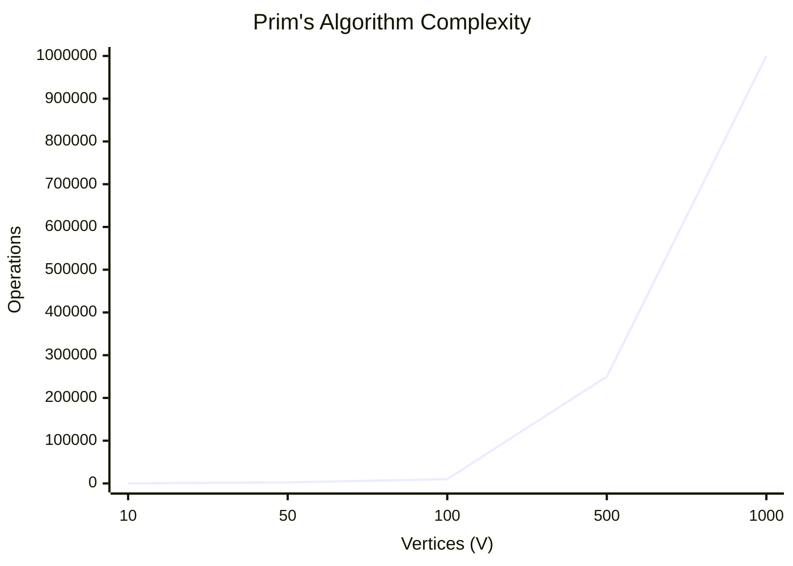
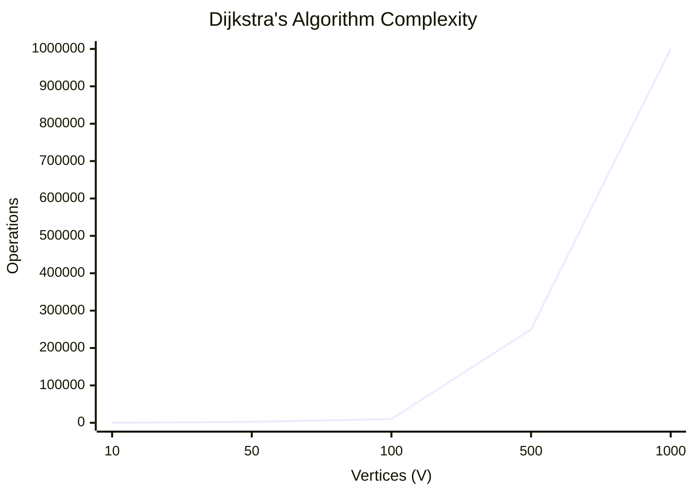
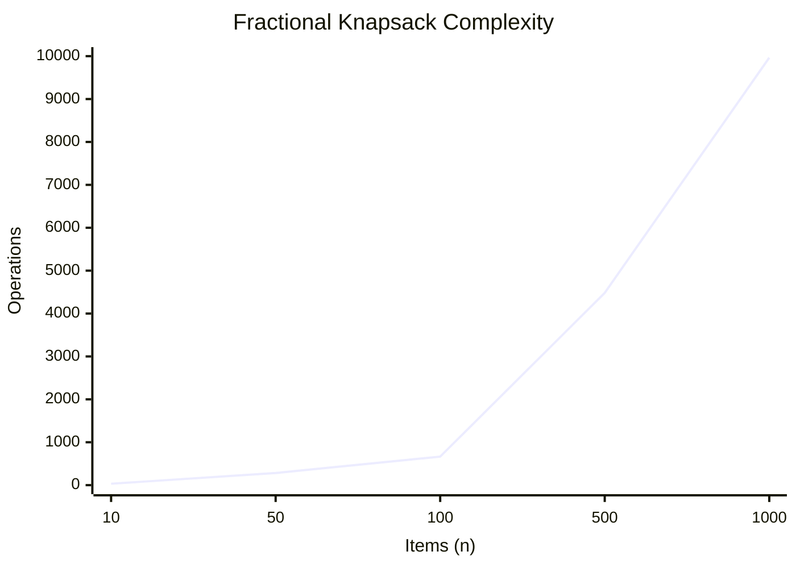
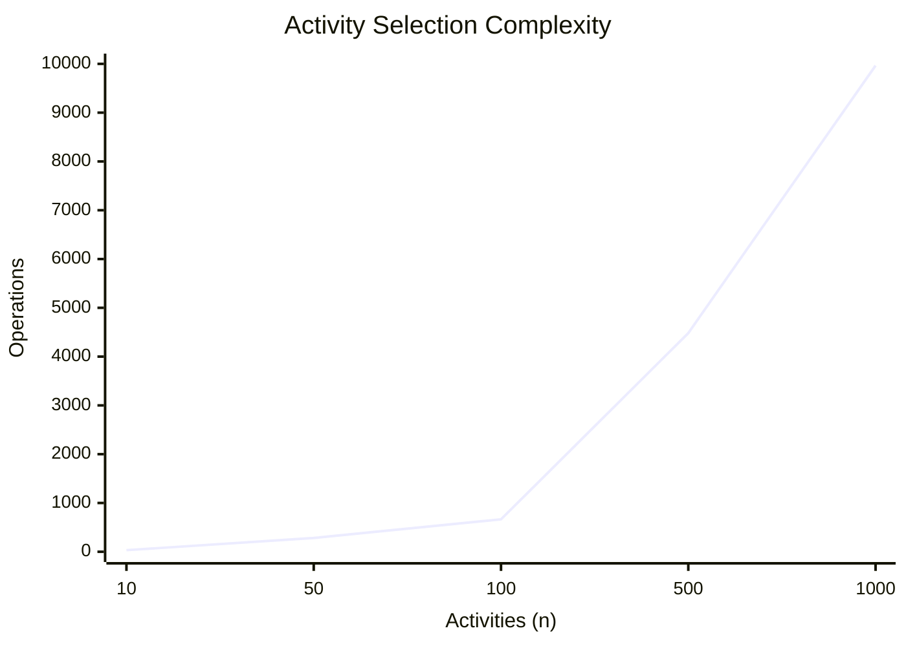
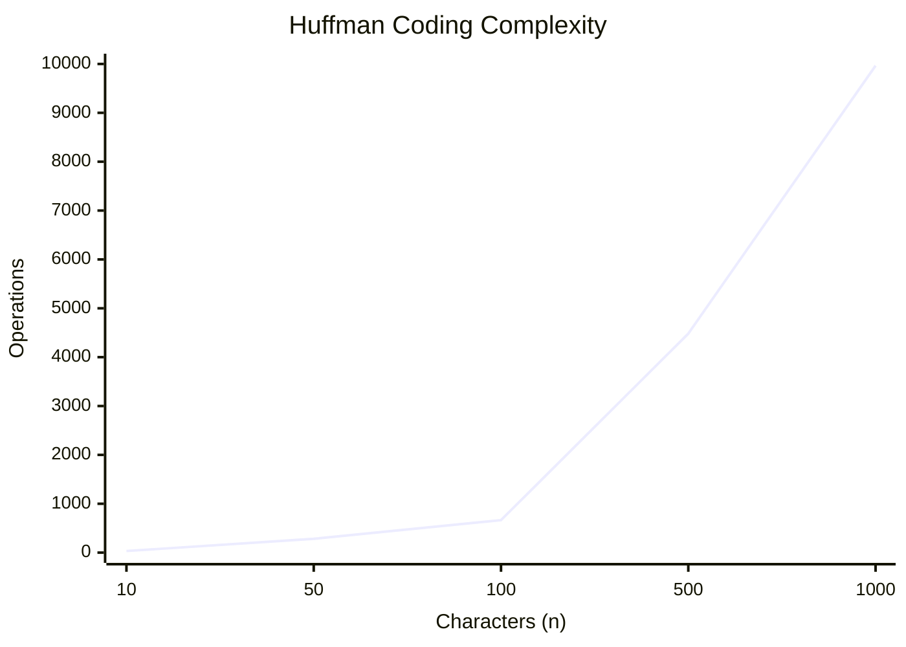

# Unit - 3
:::info[TITLE]
## Greedy Algorithms
:::

## 1. Introduction

### 1.1 Overview
- A greedy algorithm always makes the choice that seems to be the **best at that moment**.
- It **never reconsiders** this decision once it has been made.
- **Example**: Getting the best possible dress from a shop for yourself.

## 2. Characteristics of Greedy Algorithms

### 2.1 Key Features
1. The greedy approach forms a **set or list of candidates** $C$.
2. Once a candidate is **selected** in the solution, it is there forever. Once a candidate is **excluded** from the solution, it is never reconsidered.
3. To construct the solution in an optimal way, the Greedy Algorithm maintains **two sets**:
   - One set contains candidates that have already been **considered and chosen**.
   - The other set contains candidates that have been **considered but rejected**.

## 3. Elements of Greedy Strategy

### 3.1 Four Functions
1. **Solution Function**: Checks whether a chosen set of items provides a solution.
2. **Feasible Function**: Checks the feasibility of a set.
3. **Selection Function**: Tells which of the candidates is the most promising.
4. **Objective Function**: Gives the value of a solution (doesn't always appear explicitly).

## 4. Minimum Spanning Tree (MST)

### 4.1 Concept
- Let $G = \langle N, A \rangle$ be a **connected, undirected graph** where:
  - $N$ is the set of nodes.
  - $A$ is the set of edges.
- Each edge has a given **positive length or weight**.
- A **spanning tree** of a graph $G$ is a sub-graph which is a tree and contains all the vertices of $G$ but **does not contain cycles**.
- A **minimum spanning tree (MST)** of a weighted connected graph $G$ is a spanning tree with the **minimum or smallest weight** of edges.

### 4.2 Algorithms for MST
1. Kruskal’s Algorithm
2. Prim’s Algorithm

## 5. Kruskal’s Algorithm

### 5.1 Concept
- A greedy algorithm that finds an MST for a connected weighted graph by adding increasing cost edges at each step.

### 5.2 Step-by-Step Explanation
1. **Sort**: Sort all edges of the graph in increasing order of their weight.
2. **Initialize**: Create a disjoint set for each vertex to keep track of connected components. Create an empty set `T` for the MST.
3. **Iterate**: Loop through the sorted edges. For each edge $(u, v)$:
   - Check if $u$ and $v$ belong to different connected components using `find(u)` and `find(v)`.
   - If they do, adding this edge won't form a cycle. Add it to `T` and `merge(u, v)` the two components.
   - If they belong to the same component, discard the edge (as it would form a cycle).
4. **Terminate**: Stop when `T` contains $V - 1$ edges (where $V$ is the number of vertices).

### 5.3 Algorithm Complexity
- **Time Complexity**: $\Theta(E \log V)$ or $\Theta(E \log E)$ where $E$ is the number of edges and $V$ is the number of vertices (due to sorting edges).
- **Space Complexity**: $O(V)$ for the disjoint set data structure.


### 5.4 Algorithm

```text showLineNumbers
Algorithm Kruskal(G, w)
// Finds Minimum Spanning Tree (MST) using greedy approach
// Input: Connected, undirected weighted graph G = (V, E) with weight function w
// Output: Set of edges A forming the MST
{
    A <- empty set;

    for each vertex v in V do
        MakeSet(v);

    // Sort edges into non-decreasing order by weight w
    sort the edges of E in non-decreasing order of weight w;

    for each edge (u, v) in E (taken in sorted order) do
    {
        if (FindSet(u) != FindSet(v)) then
        {
            A <- A union {(u, v)};
            Union(u, v);
        }
    }
    return A;
}
```

## 6. Prim’s Algorithm

### 6.1 Concept
- In Prim's algorithm, the minimum spanning tree grows in a natural way, starting from an arbitrary root.
- At each stage, a new branch is added to the tree already constructed; the algorithm stops when all nodes have been reached.

### 6.2 Step-by-Step Explanation
1. **Initialize**: Create a set $B$ to keep track of vertices included in the MST.
2. **Start**: Pick an arbitrary vertex and add it to $B$.
3. **Iterate**: While $B$ does not contain all vertices:
   - Find the edge $e = \{u, v\}$ with the **minimum weight** such that $u \in B$ and $v \notin B$.
   - Add $v$ to $B$ and include $e$ in the MST.
4. **Terminate**: Return the MST when all vertices are in $B$.

### 6.3 Algorithm Complexity
- **Time Complexity**: $\Theta(V^2)$ with an adjacency matrix, or $\Theta(E \log V)$ using a Min-Heap.
- **Space Complexity**: $O(V + E)$ or $O(V^2)$ depending on graph representation.



### 6.4 Algorithm

```text showLineNumbers
Algorithm Prim(G, w, r)
// Finds Minimum Spanning Tree (MST) starting from root vertex r
// Input: Connected, undirected weighted graph G = (V, E) with weight function w, root r
// Output: MST represented by parent pointers parent[u]
{
    for each u in V do
    {
        key[u] <- infinity;
        parent[u] <- NIL;
    }
    key[r] <- 0;
    Q <- V; // Build min-priority queue of all vertices keyed by key[u]

    while not EMPTY(Q) do
    {
        u <- ExtractMin(Q);
        for each vertex v in Adj[u] do
        {
            if (v in Q and w(u, v) < key[v]) then
            {
                parent[v] <- u;
                key[v] <- w(u, v);
                DecreaseKey(Q, v, key[v]);
            }
        }
    }
}
```

## 7. Dijkstra’s Algorithm

### 7.1 Concept
- Used to find the **Single Source Shortest Path** in a directed (or undirected) graph with positive edge weights.

### 7.2 Step-by-Step Explanation
1. **Initialize**: Create a distance array $D$ initialized to infinity ($\infty$) for all vertices except the source vertex, which is set to $0$.
2. **Set up**: Maintain a set of unvisited vertices $C$.
3. **Iterate**:
   - Extract the vertex $u$ from $C$ that has the minimum distance value $D[u]$.
   - For every adjacent vertex $v$ of $u$:
     - If $D[v] > D[u] + \text{weight}(u, v)$, update $D[v] = D[u] + \text{weight}(u, v)$.
4. **Terminate**: The algorithm finishes when all vertices are evaluated. The array $D$ will hold the shortest distances from the source to all other vertices.

### 7.3 Algorithm Complexity
- **Time Complexity**: $O(V^2)$ with basic arrays, or $O((V+E) \log V)$ using a Min-Priority Queue.
- **Space Complexity**: $O(V)$ for the distance array and priority queue.



### 7.4 Algorithm

```text showLineNumbers
Algorithm Dijkstra(G, w, s)
// Single-Source Shortest Paths algorithm on weighted graph with non-negative weights
// Input: Graph G = (V, E), non-negative weight function w, source vertex s
// Output: Array dist[v] containing shortest path distance from s to each vertex v in V
{
    for each vertex v in V do
    {
        dist[v] <- infinity;
        parent[v] <- NIL;
    }
    dist[s] <- 0;
    S <- empty set;
    Q <- V; // Priority queue of all vertices keyed by dist[v]

    while not EMPTY(Q) do
    {
        u <- ExtractMin(Q);
        S <- S union {u};

        for each vertex v in Adj[u] do
        {
            // Edge relaxation step
            if (dist[u] + w(u, v) < dist[v]) then
            {
                dist[v] <- dist[u] + w(u, v);
                parent[v] <- u;
                DecreaseKey(Q, v, dist[v]);
            }
        }
    }
}
```

## 8. Fractional Knapsack Problem

### 8.1 Concept
- Given $n$ objects and a knapsack capacity $W$.
- Object $i$ has a positive weight $w_i$ and a positive value $v_i$.
- Goal: Fill the knapsack to **maximize the value**, breaking objects into fractions $x_i$ if necessary ($0 \le x_i \le 1$).

### 8.2 Step-by-Step Explanation
1. **Calculate Ratio**: Compute the value-to-weight ratio $v_i / w_i$ for each item.
2. **Sort**: Sort all items in **descending order** based on their $v_i / w_i$ ratio.
3. **Select**: Iterate through the sorted items:
   - If the item can completely fit in the remaining knapsack capacity, add it fully.
   - If the item cannot fully fit, add the **fraction** of the item that exactly fills the remaining capacity, then stop.
4. **Return**: The total accumulated value.

### 8.3 Algorithm Complexity
- **Time Complexity**: $O(n \log n)$ due to sorting.
- **Space Complexity**: $O(1)$ if sorted in place, otherwise $O(n)$.



### 8.4 Algorithm

```text showLineNumbers
Algorithm FractionalKnapsack(W, n, p, w)
// Solves the Fractional Knapsack problem using a greedy approach
// Input: Knapsack capacity W, number of items n, profits p[1..n], weights w[1..n]
// Output: Array x[1..n] where x[i] is the fraction of item i included (0 <= x[i] <= 1)
{
    // Sort items in non-increasing order of value-to-weight ratio p[i]/w[i]
    sort items such that p[1]/w[1] >= p[2]/w[2] >= ... >= p[n]/w[n];

    for i <- 1 to n do
        x[i] <- 0.0;

    remainingCapacity <- W;

    for i <- 1 to n do
    {
        if (w[i] <= remainingCapacity) then
        {
            x[i] <- 1.0;
            remainingCapacity <- remainingCapacity - w[i];
        }
        else
        {
            // Take fractional share of item i
            x[i] <- remainingCapacity / w[i];
            remainingCapacity <- 0;
            break;
        }
    }
    return x;
}
```

## 9. Activity Selection Problem

### 9.1 Concept
- Given a set of $n$ activities with a start time $s_i$ and finish time $f_i$.
- Find the **maximum size set of mutually compatible activities** (activities that do not overlap).

### 9.2 Step-by-Step Explanation
1. **Sort**: Sort all input activities in **increasing order of their finish times** ($f_i$).
2. **Select First**: Always select the first activity from the sorted array, as it finishes earliest and leaves maximum time for subsequent activities.
3. **Iterate**: For each remaining activity:
   - If its start time $s_i$ is **greater than or equal to** the finish time of the previously selected activity, add it to the selected set.
4. **Return**: The set of selected activities.

### 9.3 Algorithm Complexity
- **Time Complexity**: $O(n \log n)$ due to sorting. If already sorted, it takes $O(n)$.
- **Space Complexity**: $O(1)$ or $O(n)$ depending on storage for results.



### 9.4 Algorithm

```text showLineNumbers
Algorithm ActivitySelection(s, f, n)
// Selects a maximum-size set of mutually compatible activities
// Input: Start times s[1..n] and finish times f[1..n] sorted such that f[1] <= f[2] <= ... <= f[n]
// Output: Set A of selected mutually compatible activities
{
    A <- {1};  // Select the first activity
    k <- 1;    // Index of the last activity selected

    for m <- 2 to n do
    {
        // If start time of activity m is >= finish time of last selected activity
        if (s[m] >= f[k]) then
        {
            A <- A union {m};
            k <- m;
        }
    }
    return A;
}
```

## 10. Huffman Codes

### 10.1 Concept
- A greedy algorithm that constructs an **optimal prefix code** for lossless data compression.
- It assigns **variable-length codes** to input characters based on their **frequencies**.
- The most frequent character gets the **smallest code**, while the least frequent character gets the **largest code**.
- Prefix codes ensure that no code is a prefix of another code, preventing decoding ambiguity.

### 10.2 Step-by-Step Explanation
1. **Count Frequencies**: Calculate the frequency of each character in the input data.
2. **Initialize Min-Heap**: Create a leaf node for each character and insert them into a priority queue (min-heap) based on frequency.
3. **Build Tree**: While the heap contains more than one node:
   - Extract the two nodes with the **minimum frequencies**.
   - Create a new internal node with a frequency equal to the **sum** of the two nodes.
   - Attach the two nodes as left and right children.
   - Insert the new node back into the min-heap.
4. **Assign Codes**: Traverse the tree from the root. Assign `0` to the left branch and `1` to the right branch. The path from the root to a leaf node provides the Huffman code for that character.

### 10.3 Algorithm Complexity
- **Time Complexity**: $O(n \log n)$ to build the heap and tree.
- **Space Complexity**: $O(n)$ for storing the tree and codes.



### 10.4 Algorithm

```text showLineNumbers
Algorithm Huffman(C)
// Generates optimal prefix codes (Huffman tree) for characters in set C
// Input: Set C of characters, where each c in C has frequency c.freq
// Output: Root node of the optimal prefix tree
{
    n <- |C|;
    Q <- C; // Initialize min-priority queue with all characters keyed by frequency

    for i <- 1 to n - 1 do
    {
        allocate new internal node z;
        z.left <- x <- ExtractMin(Q);
        z.right <- y <- ExtractMin(Q);
        z.freq <- x.freq + y.freq;
        Insert(Q, z);
    }
    return ExtractMin(Q); // Returns root of Huffman tree
}
```

