# Unit - 5
:::info[TITLE]
## Exploring Graphs
:::

## 1. Introduction to Graphs

### 1.1 Overview and Key Terminology
A **graph** is a versatile non-linear data structure used to model pairwise relationships between objects.
- **Node / Vertex**: A fundamental unit or discrete entity representing an object (e.g., city, router, computer, person).
- **Edge / Arc / Link**: A connection or relationship between two vertices.
- **Adjacent Vertices**: Two vertices are adjacent if they are directly connected by an edge.
- **Degree of a Vertex**:
  - In an undirected graph: The total number of edges incident to the vertex.
  - In a directed graph:
    - **In-degree**: Number of incoming edges arriving at the vertex.
    - **Out-degree**: Number of outgoing edges departing from the vertex.
- **Path**: A sequence of alternating vertices and edges connecting a start vertex to an end vertex.
- **Cycle**: A path where the starting vertex and ending vertex are identical, with no other vertices repeated.

### 1.2 Mathematical Definition of Graphs
A graph $G$ is formally defined as an ordered pair:

$$
G = \langle N, A \rangle
$$

Where:
- $N$ is a **non-empty set** called the set of nodes (points, vertices):
  $$
  N = \{v_1, v_2, \dots, v_n\}
  $$
- $A$ is a set of **edges** (links, arcs):
  $$
  A = \{e_1, e_2, \dots, e_m\}
  $$
- A mapping function exists from the set of edges $A$ to pairs of elements of $N$.

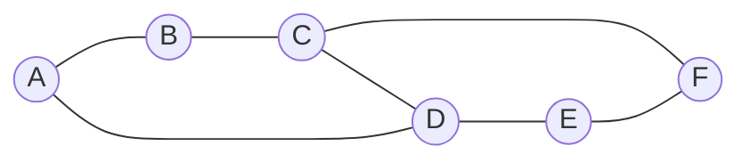

## 2. Graph Types and Representations

### 2.1 Directed Graph (Digraph)
- A graph in which **every edge is directed** (assigned a specific one-way orientation).
- Each edge is represented by an **ordered pair** $(u, v)$, indicating a one-way path directed from vertex $u$ to vertex $v$.
- $u$ is the initial node (source / predecessor), and $v$ is the terminal node (target / successor).

### 2.2 Undirected Graph
- A graph in which **every edge is bidirectional** (undirected).
- Each edge is represented by an **unordered pair** $\{u, v\}$, meaning traversal is permitted freely in both directions: $u \to v$ and $v \to u$.

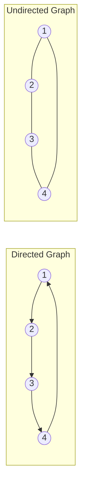

### 2.3 Graph Storage Representations
Graphs are typically implemented in memory using one of two standard data structures:

| Criterion | Adjacency Matrix | Adjacency List |
| :--- | :--- | :--- |
| **Data Structure** | 2D Array of size $\|V\| \times \|V\|$ | Array/Vector of Lists of size $\|V\|$ |
| **Space Complexity** | $\Theta(V^2)$ | $\Theta(V + E)$ |
| **Edge Lookup $(u, v)$** | $O(1)$ | $O(\text{deg}(u))$ |
| **Iterate over Neighbors** | $O(V)$ | $O(\text{deg}(u))$ |
| **Best Suited For** | Dense graphs ($E \approx V^2$) | Sparse graphs ($E \ll V^2$) |

## 3. Traversing Graphs vs Trees

### 3.1 Tree Traversal Techniques
A tree is a special, hierarchical form of a connected, acyclic undirected graph with a single root. Standard systematic tree traversals include:

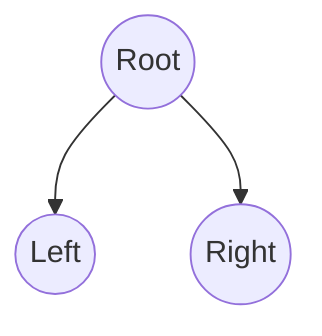

#### 3.1.1 Preorder Traversal
1. Visit the **root**.
2. Traverse the **left subtree** in preorder.
3. Traverse the **right subtree** in preorder.
- **Rule Order**: `Root -> Left -> Right`

#### 3.1.2 Inorder Traversal
1. Traverse the **left subtree** in inorder.
2. Visit the **root**.
3. Traverse the **right subtree** in inorder.
- **Rule Order**: `Left -> Root -> Right`

#### 3.1.3 Postorder Traversal
1. Traverse the **left subtree** in postorder.
2. Traverse the **right subtree** in postorder.
3. Visit the **root**.
- **Rule Order**: `Left -> Right -> Root`

### 3.2 Transition from Tree Traversal to Graph Traversal
Traversing general graphs requires additional considerations compared to trees:
1. **Cycles and Infinite Loops**: Graphs can have cycles; a node can point back to an ancestor. A `mark[v]` (visited) table or boolean flag is mandatory to prevent infinite loops.
2. **Disconnected Components**: A tree is always connected and accessible from its root; a graph may contain multiple isolated subgraphs. The outer loop must iterate through every vertex $v \in N$ to ensure complete coverage.
3. **No Inherent Root**: Unlike trees, any vertex $v \in N$ can serve as an arbitrary starting point for graph traversal.

## 4. Depth First Search (DFS)

### 4.1 Concept and Core Mechanism
**Depth First Search (DFS)** explores as deeply as possible along each branch before backtracking.

:::tip[Core Traversal Rules]
1. Select any node $v \in N$ as the starting point and mark it as **visited**.
2. Select an **unvisited adjacent node** of the current node. Make it the new starting point and mark it as visited (recursive step).
3. If the current node has **no unvisited adjacent nodes**, backtrack to its parent node and continue searching.
4. When all nodes adjacent to $v$ are marked, the search starting at $v$ finishes.
5. If unvisited nodes remain in $G$, choose any unvisited node and repeat the procedure.
:::

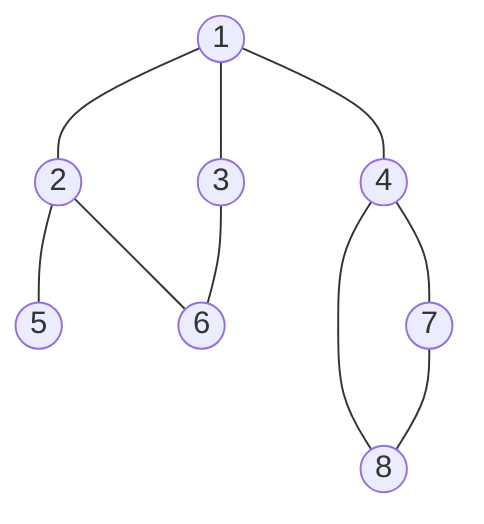

### 4.2 DFS Algorithm Pseudocode

```text showLineNumbers
procedure dfsearch(G)
    for each v in N 
        do mark[v] <- not-visited
    for each v in N 
        do if mark[v] != visited 
            then dfs(v)

procedure dfs(v)
    {Node v has not previously been visited}
    mark[v] <- visited
    for each node w adjacent to v 
        do if mark[w] != visited 
            then dfs(w)
```

### 4.3 Step-by-Step Execution and Trace Example
Tracing the 8-node graph shown above starting at node `1`:

| Step | Action | Node Visited / Calling State | Backtrack / Neighbor Note |
| :---: | :--- | :--- | :--- |
| **1** | `dfs(1)` | **1** | Initial call; selects adjacent node 2 |
| **2** | `dfs(2)` | **2** | Recursive call; selects adjacent node 3 |
| **3** | `dfs(3)` | **3** | Recursive call; selects adjacent node 6 |
| **4** | `dfs(6)` | **6** | Recursive call; selects unvisited neighbor 5 (via 2) |
| **5** | `dfs(5)` | **5** | Recursive call; **progress is blocked** (no unvisited neighbors) |
| -- | Backtrack | Returns up to node 1 | Nodes 2, 3, 5, 6 are already marked visited |
| **6** | `dfs(4)` | **4** | Node 4 is an unvisited neighbor of node 1 |
| **7** | `dfs(7)` | **7** | Recursive call; selects adjacent node 8 |
| **8** | `dfs(8)` | **8** | Recursive call; all neighbors (4, 7) already visited |
| **9** | Terminate | Done | There are no more unvisited nodes left in the graph |

- **Final Visited Sequence**: `1 -> 2 -> 3 -> 6 -> 5 -> 4 -> 7 -> 8`

### 4.4 Complexity and Properties
- **Time Complexity**:
  - **Adjacency List**: $O(V + E)$ (each vertex and edge is examined at most twice in undirected graphs).
  - **Adjacency Matrix**: $O(V^2)$ (scanning row for each vertex requires $O(V)$ operations).
- **Space Complexity**: $O(V)$ auxiliary space for the recursion call stack and the `mark[]` array.

### 4.5 Iterative DFS Algorithm (Using Stack)

```text showLineNumbers
Algorithm IterativeDFS(s, G)
// Traverses graph G starting from vertex s using an explicit stack
// Input: Starting vertex s, graph G = (V, E)
{
    for each v in V do
        visited[v] <- false;

    S <- EMPTY_STACK();
    PUSH(S, s);

    while not EMPTY(S) do
    {
        u <- POP(S);
        if not visited[u] then
        {
            visited[u] <- true;
            visit(u); // Process vertex u

            // Push all unvisited adjacent vertices onto stack
            for each v in Adj[u] do
            {
                if not visited[v] then
                    PUSH(S, v);
            }
        }
    }
}
```

## 5. Breadth First Search (BFS)

### 5.1 Concept and Queue Mechanism
**Breadth First Search (BFS)** explores a graph level by level (layer by layer), visiting all neighbors of a node before moving to vertices at the next depth level. It utilizes a **First-In, First-Out (FIFO) Queue**.

:::tip[Core Traversal Rules]
1. Select any node $v \in N$ as the starting point and mark it as **visited**.
2. **Enqueue** visited node $v$ into queue $Q$.
3. While queue $Q$ is not empty:
   - **Dequeue** node $u$ from the front of $Q$.
   - Find all **unvisited adjacent nodes** of $u$, mark them as visited, and enqueue them into $Q$.
4. If any nodes remain unvisited, restart BFS on the next unvisited vertex.
:::

### 5.2 BFS Algorithm Pseudocode

```text showLineNumbers
procedure bfs(v)
    Q <- empty-queue
    mark[v] <- visited
    enqueue v into Q
    while Q is not empty 
    do u <- first(Q)
        dequeue u from Q
        for each node w adjacent to u 
            do if mark[w] != visited 
                then mark[w] <- visited
                     enqueue w into Q

procedure search(G)
    for each v in N 
        do mark[v] <- not visited
    for each v in N 
        do if mark[v] != visited 
            then bfs(v)
```

### 5.3 Step-by-Step Execution and Trace Example
Tracing BFS on the same 8-node graph starting from node `1`:

| Step | Action | Dequeued Node | Unvisited Adjacent Nodes Enqueued | Queue State ($Q$) |
| :---: | :--- | :---: | :--- | :--- |
| **0** | Start | - | Mark 1 visited, Enqueue 1 | `[1]` |
| **1** | Dequeue & Explore | **1** | Neighbors 2, 3, 4 marked visited and enqueued | `[2, 3, 4]` |
| **2** | Dequeue & Explore | **2** | Neighbors 5, 6 marked visited and enqueued | `[3, 4, 5, 6]` |
| **3** | Dequeue & Explore | **3** | Neighbor 6 is already visited; none added | `[4, 5, 6]` |
| **4** | Dequeue & Explore | **4** | Neighbors 7, 8 marked visited and enqueued | `[5, 6, 7, 8]` |
| **5** | Dequeue & Explore | **5** | No unvisited neighbors | `[6, 7, 8]` |
| **6** | Dequeue & Explore | **6** | No unvisited neighbors | `[7, 8]` |
| **7** | Dequeue & Explore | **7** | Neighbor 8 already visited | `[8]` |
| **8** | Dequeue & Explore | **8** | No unvisited neighbors | `[]` (Empty, finishes) |

- **Final Visited Sequence**: `1 -> 2 -> 3 -> 4 -> 5 -> 6 -> 7 -> 8`

### 5.4 Complexity and Properties
- **Time Complexity**:
  - **Adjacency List**: $O(V + E)$
  - **Adjacency Matrix**: $O(V^2)$
- **Space Complexity**: $O(V)$ for the queue $Q$ and visited lookup array.
- **Shortest Path Property**: In an unweighted graph, BFS is guaranteed to discover the shortest path (minimum edge count) from the start node to all other reachable nodes.

### 5.5 Queue-Based BFS Traversal Algorithm

```text showLineNumbers
Algorithm BFS(s, G)
// Explores graph G level-by-level starting from source vertex s
// Input: Source vertex s, graph G = (V, E) represented by adjacency list Adj
// Output: Shortest distance d[v] and predecessor parent[v] for all v in V
{
    for each u in V - {s} do
    {
        color[u] <- WHITE;
        d[u] <- infinity;
        parent[u] <- NIL;
    }
    color[s] <- GRAY;
    d[s] <- 0;
    parent[s] <- NIL;

    Q <- EMPTY_QUEUE();
    ENQUEUE(Q, s);

    while not EMPTY(Q) do
    {
        u <- DEQUEUE(Q);
        for each v in Adj[u] do
        {
            if (color[v] = WHITE) then
            {
                color[v] <- GRAY;
                d[v] <- d[u] + 1;
                parent[v] <- u;
                ENQUEUE(Q, v);
            }
        }
        color[u] <- BLACK;
    }
}
```

## 6. Graph Traversal Comparison: DFS vs BFS

### 6.1 Comparative Walkthrough Example
Consider the 6-vertex graph below:

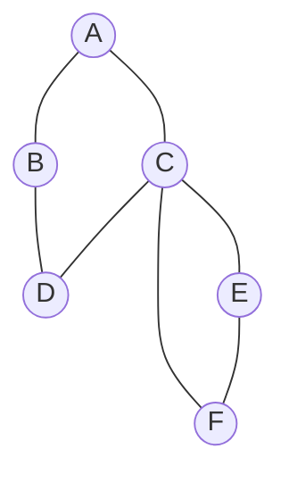

Starting from vertex `A` and ordering adjacent nodes alphabetically:
- **DFS Traversal Order**: `A -> B -> D -> C -> E -> F`
  - Explores branch: $A \to B \to D \to C \to E \to F$ to maximum depth.
- **BFS Traversal Order**: `A -> B -> C -> D -> E -> F`
  - Level 0: $A$
  - Level 1: $B, C$
  - Level 2: $D, E, F$

### 6.2 Key Differences Summary

| Feature | Depth First Search (DFS) | Breadth First Search (BFS) |
| :--- | :--- | :--- |
| **Core Philosophy** | Goes deep along one path before backtracking | Explores all immediate neighbors level-by-level |
| **Primary Data Structure**| **LIFO Stack** (call stack or explicit stack) | **FIFO Queue** |
| **Shortest Path** | Does not find shortest path in unweighted graphs | **Guarantees shortest path** in unweighted graphs |
| **Memory Consumption** | $O(\text{height})$, proportional to graph depth | $O(\text{breadth})$, proportional to maximum layer size |
| **Backtracking** | Innate feature of the recursive approach | No backtracking mechanism needed |
| **Typical Applications** | Topological sort, cycle detection, strongly connected components, maze solving | Shortest path, web crawling, peer-to-peer networks, garbage collection |

## 7. Topological Sorting

### 7.1 Concept and Conditions (DAG)
A **Topological Sort** (or topological ordering) of a **Directed Acyclic Graph (DAG)** is a linear ordering of its vertices such that for every directed edge $(u, v)$ from vertex $u$ to vertex $v$, **$u$ precedes $v$** in the ordering:

$$
(u, v) \in E \implies \text{position}(u) < \text{position}(v)
$$

:::tip[DAG Prerequisite]
Topological sort is **only possible** on Directed Acyclic Graphs. If the graph contains any directed cycle, no linear dependency ordering exists because circular dependencies cannot be resolved.
:::

### 7.2 Real-World Analogy: Recipe Preparation
Preparing pancakes requires dependencies to be completed in order:

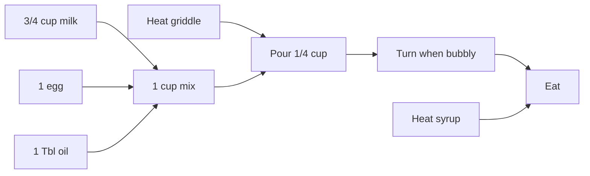

- Ingredients (milk, egg, oil) must be combined into mix before pouring.
- Griddle must be heated before pouring mix.
- Pancake must be turned when bubbly before eating.
- Syrup must be heated before eating.

### 7.3 Algorithms for Topological Sorting

#### 7.3.1 Kahn's Algorithm (In-degree Elimination Method)
1. Compute the **in-degree** for every vertex in the graph.
2. Initialize a queue with all vertices having an **in-degree of 0** (no prerequisites).
3. While the queue is not empty:
   - Dequeue a vertex $u$ and append it to the topological output.
   - For each outgoing edge $(u, v)$, decrement the in-degree of $v$ by 1.
   - If the in-degree of $v$ drops to 0, enqueue $v$.
4. If the count of visited vertices is less than $\|V\|$, the graph contains a **cycle**.

#### 7.3.2 DFS-Based Approach
1. Perform standard DFS traversal.
2. When all outgoing neighbors of a vertex $u$ have finished processing (post-visit), push $u$ onto a stack.
3. After completing DFS for all vertices, pop elements from the stack to produce the topological ordering.

### 7.4 Trace Examples

#### 7.4.1 Example 1 (Alphabetical Graph)
Given DAG with vertices $\{A, B, C, D, E, F\}$ and edges:
- $A \to B$, $A \to D$
- $B \to C$
- $C \to D$, $C \to E$
- $D \to E$
- $F$ (independent node, in-degree 0)

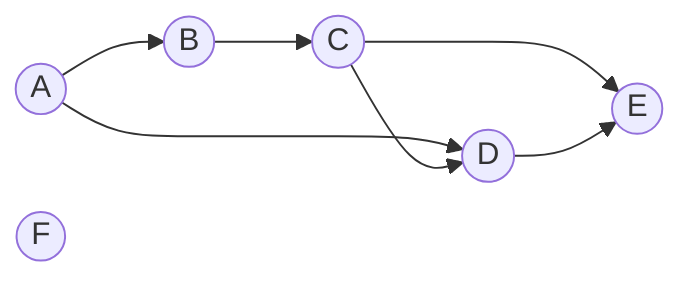

1. Vertices with in-degree 0: **$A$** and **$F$**.
2. Select $A$, remove its edges $(A, B)$ and $(A, D)$. Output: `[A]`
3. Next $B$ has in-degree 0, remove $(B, C)$. Output: `[A, B]`
4. Next $C$ has in-degree 0, remove $(C, D)$ and $(C, E)$. Output: `[A, B, C]`
5. Next $D$ has in-degree 0, remove $(D, E)$. Output: `[A, B, C, D]`
6. Next $E$ has in-degree 0. Output: `[A, B, C, D, E]`
7. Node $F$ has in-degree 0. Output: `[A, B, C, D, E, F]`
- **Topological Order**: `A B C D E F`

#### 7.4.2 Example 2 (Numerical Graph)
Given DAG with vertices $\{0, 1, 2, 3, 4, 5\}$ and edges:
- $5 \to 2$, $5 \to 0$
- $4 \to 0$, $4 \to 1$
- $2 \to 3$
- $3 \to 1$

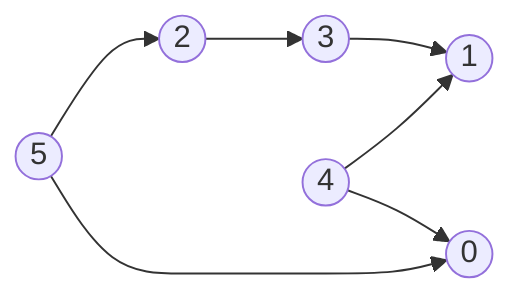

**In-Degree Table**:
- `0`: 2 (from 4, 5)
- `1`: 2 (from 3, 4)
- `2`: 1 (from 5)
- `3`: 1 (from 2)
- `4`: **0**
- `5`: **0**

**Step-by-Step Elimination**:
1. Remove **4** (in-degree 0): decrements in-degree of 0 to 1, and 1 to 1.
2. Remove **5** (in-degree 0): decrements in-degree of 2 to 0, and 0 to 0.
3. Remove **0** (in-degree 0).
4. Remove **2** (in-degree 0): decrements in-degree of 3 to 0.
5. Remove **3** (in-degree 0): decrements in-degree of 1 to 0.
6. Remove **1** (in-degree 0).
- **Final Output Sequence**: `4 5 0 2 3 1`

### 7.5 Complexity Analysis
- **Time Complexity**: $O(V + E)$ (calculating in-degrees takes $O(V + E)$ and each vertex/edge is processed once).
- **Space Complexity**: $O(V)$ for the in-degree array, queue/stack, and output array.

### 7.6 Kahn's Topological Sorting Algorithm

```text showLineNumbers
Algorithm KahnTopologicalSort(G)
// Computes topological ordering of a Directed Acyclic Graph (DAG) using in-degrees
// Input: Directed graph G = (V, E) represented by adjacency list Adj
// Output: Array order containing topologically sorted vertices
{
    // Step 1: Compute in-degrees of all vertices
    for each v in V do
        inDegree[v] <- 0;
    for each u in V do
        for each v in Adj[u] do
            inDegree[v] <- inDegree[v] + 1;

    // Step 2: Initialize queue with all vertices having in-degree 0
    Q <- EMPTY_QUEUE();
    for each v in V do
        if (inDegree[v] = 0) then
            ENQUEUE(Q, v);

    count <- 0;

    // Step 3: Process vertices
    while not EMPTY(Q) do
    {
        u <- DEQUEUE(Q);
        count <- count + 1;
        order[count] <- u;

        for each v in Adj[u] do
        {
            inDegree[v] <- inDegree[v] - 1;
            if (inDegree[v] = 0) then
                ENQUEUE(Q, v);
        }
    }

    if (count < |V|) then
        print "Graph contains a directed cycle (Topological sort impossible)";
    else
        return order;
}
```

## 8. Connected Components

### 8.1 Connected Components in Undirected Graphs
A **connected component** (or component) of an undirected graph is a **maximal subgraph** in which any two vertices are connected to each other by paths.

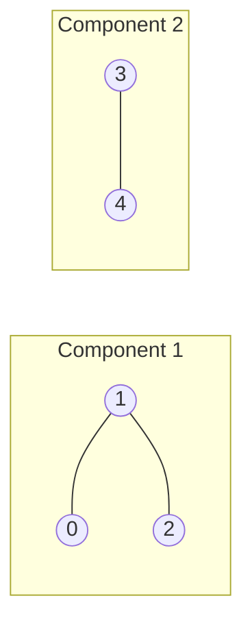

- In the example above, the graph has vertices $\{0, 1, 2, 3, 4\}$.
- There are **two connected components**:
  1. Component 1: Vertices `0, 1, 2`
  2. Component 2: Vertices `3, 4`

### 8.2 Strongly Connected Components (SCC) in Directed Graphs
In a directed graph, connectivity has two forms:
1. **Strongly Connected Component (SCC)**: A maximal subgraph where every vertex is reachable from every other vertex in the subgraph ($u \to v$ and $v \to u$ paths both exist).
2. **Weakly Connected Component**: A subgraph that is connected if all directed edges are replaced with undirected edges.

Algorithms to compute SCCs in $O(V + E)$ time:
- **Kosaraju's Algorithm**: Two DFS passes (first on $G$, second on transpose graph $G^T$).
- **Tarjan's Algorithm**: Single DFS pass maintaining discovery times and a stack.

### 8.3 Computing Connected Components
- Iterate through all vertices $v \in V$.
- If $v$ is not yet visited, initiate a DFS or BFS traversal from $v$.
- Every vertex discovered during that traversal belongs to the same connected component.
- Increment the component counter and continue.
- **Time Complexity**: $O(V + E)$
- **Space Complexity**: $O(V)$

```text showLineNumbers
Algorithm ConnectedComponents(G)
// Finds and prints all connected components of an undirected graph G = (V, E)
// Output: Prints each connected component with its member vertices
{
    for each v in V do
        visited[v] <- false;

    componentId <- 0;
    for each v in V do
    {
        if (not visited[v]) then
        {
            componentId <- componentId + 1;
            print "Component", componentId, ":";
            DFSComponent(v, G);
            print "\n";
        }
    }
}

Algorithm DFSComponent(u, G)
// Traverses and visits all vertices in the component reachable from u
{
    visited[u] <- true;
    print u, " ";
    for each v in Adj[u] do
    {
        if (not visited[v]) then
            DFSComponent(v, G);
    }
}
```

## 9. Articulation Points (Cut Vertices)

### 9.1 Concept and Vulnerability in Networks
- An **articulation point** (or **cut vertex**) in a connected graph is a vertex whose removal (along with all its incident edges) **disconnects the graph** (increases the number of connected components).
- **Cybersecurity & Network Relevance**: Articulation points represent critical **Single Points of Failure (SPOFs)**. If an attacker disables an articulation node (or router), the entire network fragments into isolated segments.

### 9.2 Conditions for Articulation Points (Tarjan's DFS Tree)
Using DFS traversal, we assign two values to every vertex $u$:
- `disc[u]`: Discovery time when node $u$ is first visited.
- `low[u]`: Lowest discovery time reachable from $u$ through tree edges and at most one back-edge.

A vertex $u$ is an articulation point if:
1. **Root Condition**: $u$ is the root of the DFS tree and has **two or more independent children** in the DFS tree.
2. **Non-Root Condition**: $u$ is not the root of the DFS tree, and has a child $v$ such that:
   $$
   low[v] \ge disc[u]
   $$
   *(This signifies that no vertex in the subtree rooted at $v$ has a back-edge to any proper ancestor of $u$. Thus, removing $u$ traps $v$ and isolates the subtree).*

### 9.3 Examples Walkthrough

#### 9.3.1 Example 1
Vertices: $\{1, 2, 3, 4, 5\}$ with edges:
- Triangle: $(1, 4), (1, 2), (4, 2)$
- Bridge edges: $(2, 3)$ and $(3, 5)$

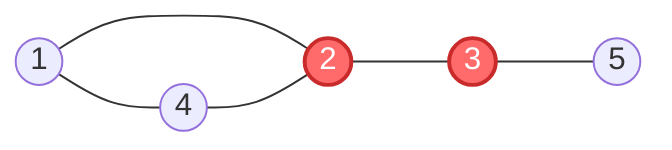

- **Articulation Points**: **2, 3**
- **Analysis**:
  - Removing vertex `2` splits the graph into $\{1, 4\}$ and $\{3, 5\}$.
  - Removing vertex `3` isolates vertex `5` from the rest of the graph.
  - Removing vertices `1`, `4`, or `5` leaves the remaining vertices connected.

#### 9.3.2 Example 2
Vertices: $\{1, 2, 3, 4, 5, 6, 7\}$ with edges:
- Triangle: $(1, 2), (1, 3), (2, 3)$
- Leaf node attached: $(3, 4)$
- Diamond component: $(3, 5), (3, 6), (5, 7), (6, 7)$

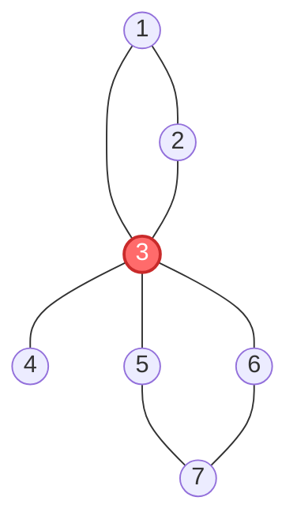

- **Articulation Points**: **3**
- **Analysis**:
  - Vertex `3` is the central nexus connecting 3 distinct groups: $\{1, 2\}$, $\{4\}$, and $\{5, 6, 7\}$.
  - Removing vertex `3` divides the graph into **3 separate disconnected components**.
  - No other individual vertex deletion disconnects the graph.

### 9.4 Complexity Analysis
- **Time Complexity**: $O(V + E)$ (a single DFS traversal).
- **Space Complexity**: $O(V)$ auxiliary arrays for `disc[]`, `low[]`, `parent[]`, and recursion stack.

### 9.5 Articulation Points Algorithm (Tarjan's DFS)

```text showLineNumbers
Algorithm FindArticulationPoints(G)
// Finds all articulation points (cut-vertices) in connected undirected graph G = (V, E)
{
    timer <- 0;
    for each u in V do
    {
        visited[u] <- false;
        disc[u] <- 0;
        low[u] <- 0;
        parent[u] <- NIL;
        isAP[u] <- false;
    }

    for each u in V do
        if (not visited[u]) then
            AP_DFS(u);

    for each u in V do
        if (isAP[u] = true) then
            print u, "is an Articulation Point";
}

Algorithm AP_DFS(u)
{
    visited[u] <- true;
    timer <- timer + 1;
    disc[u] <- low[u] <- timer;
    children <- 0;

    for each v in Adj[u] do
    {
        if (v = parent[u]) then
            continue;

        if visited[v] then
        {
            // Back-edge found
            low[u] <- min(low[u], disc[v]);
        }
        else
        {
            // Forward tree-edge
            children <- children + 1;
            parent[v] <- u;
            AP_DFS(v);

            low[u] <- min(low[u], low[v]);

            // Case 1: Non-root node with low[v] >= disc[u]
            if (parent[u] != NIL and low[v] >= disc[u]) then
                isAP[u] <- true;
        }
    }

    // Case 2: Root of DFS tree has 2 or more children
    if (parent[u] = NIL and children > 1) then
        isAP[u] <- true;
}
```

## 10. Summary and Quick Revision Cheat Sheet

### 10.1 Graph Algorithm Complexity Master Table

| Algorithm | Primary Data Structure | Graph Compatibility | Time Complexity | Space Complexity | Primary Use Case |
| :--- | :--- | :--- | :---: | :---: | :--- |
| **DFS** | LIFO Stack (call stack) | Directed & Undirected | $O(V + E)$ | $O(V)$ | Connectivity, cycle detection, path finding |
| **BFS** | FIFO Queue | Directed & Undirected | $O(V + E)$ | $O(V)$ | Shortest path in unweighted graphs, level order |
| **Topological Sort** | In-degree array + Queue / Stack | **DAG only** | $O(V + E)$ | $O(V)$ | Task scheduling, dependency resolution, build systems |
| **Connected Components** | Visited array + DFS/BFS | Undirected Graphs | $O(V + E)$ | $O(V)$ | Network partitioning, cluster discovery |
| **Articulation Points** | DFS Tree (`disc[]`, `low[]`) | Connected Undirected | $O(V + E)$ | $O(V)$ | Single Point of Failure (SPOF) identification |

### 10.2 Formula and Rule Quick-Sheet
- **Graph Formal Definition**: $G = \langle N, A \rangle$, where $N$ is the set of nodes and $A$ is the set of edges.
- **Topological Condition**: Directed Acyclic Graph (DAG) only. If in-degree 0 vertices vanish before all vertices are visited, a **cycle exists**.
- **Articulation Point Conditions**:
  - Root: $\ge 2$ children in DFS tree.
  - Non-root: Child $v$ satisfies $low[v] \ge disc[u]$.