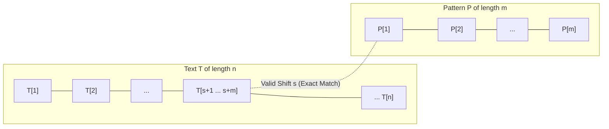
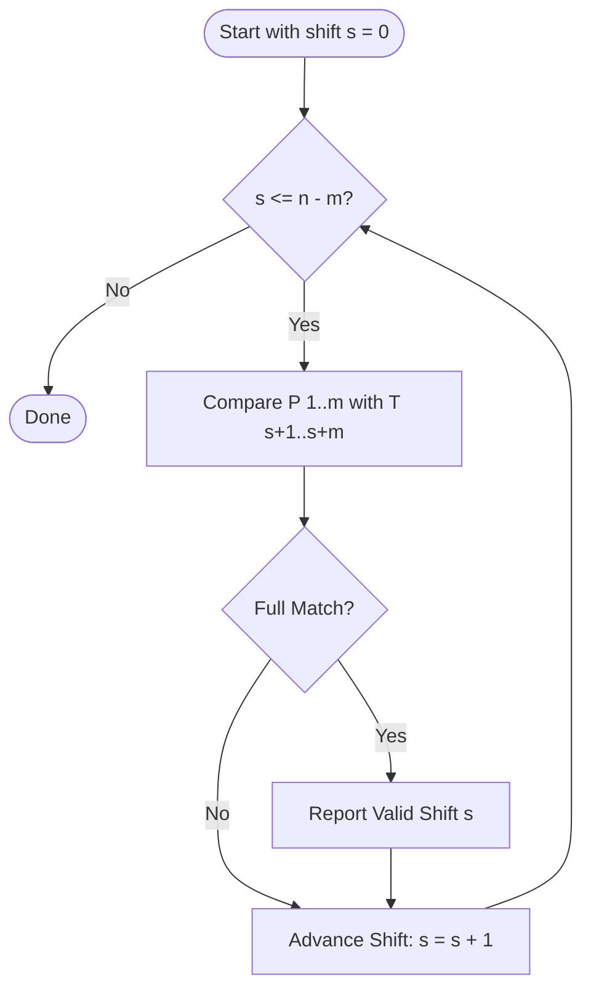
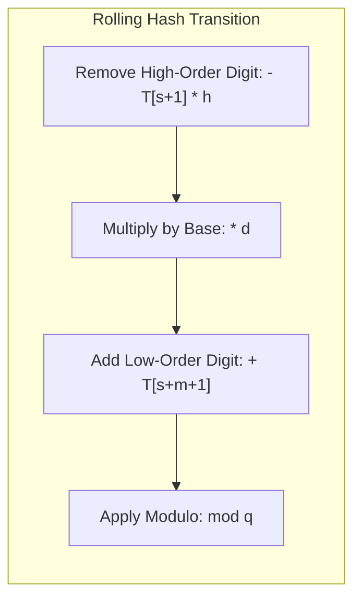
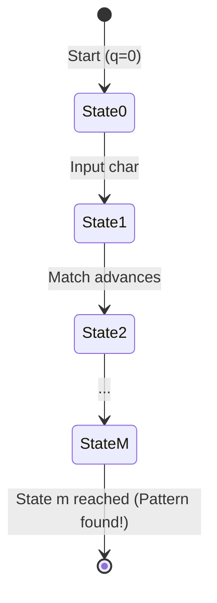
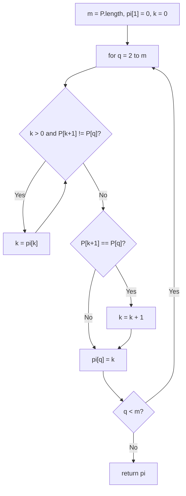
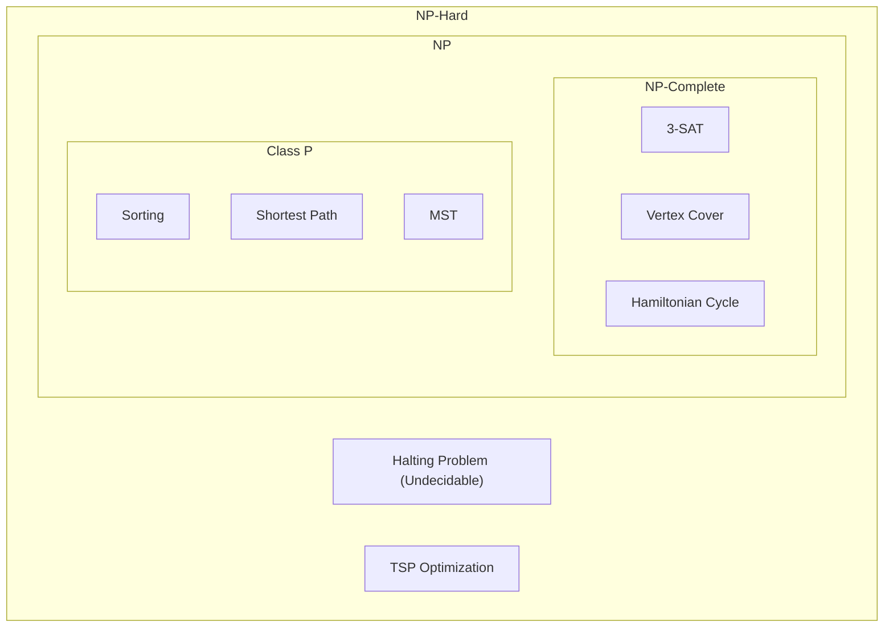
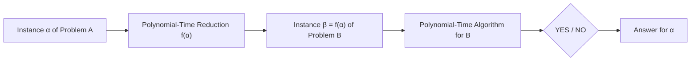
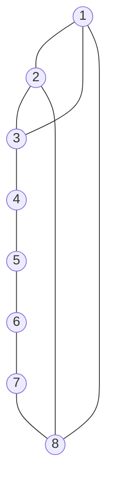

# Unit - 7
:::info[TITLE]
## String Matching & NP-Completeness
:::

## 1. Introduction to String Matching

### 1.1 Problem Definition and Formal Model
The **string-matching problem** formalizes the task of locating all valid occurrences of a given pattern string within a larger body of text.
- **Text**: Modeled as an array $T[1 \dots n]$ of length $n$.
- **Pattern**: Modeled as an array $P[1 \dots m]$ of length $m$, where $m \le n$.
- Both $T$ and $P$ are composed of character elements chosen from a finite alphabet $\Sigma$.
- **Valid Shift**: We say that pattern $P$ occurs with **shift $s$** in text $T$ if:
  $$
  0 \le s \le n - m \quad \text{and} \quad T[s + 1 \dots s + m] = P[1 \dots m]
  $$
  If $P$ occurs with shift $s$ in $T$, then $s$ is called a **valid shift**; otherwise, it is an **invalid shift**.



### 1.2 Applications in Modern Computing
- **Text Editing & Word Processors**: Find and replace tools, syntax highlighting, spelling correctors.
- **Search Engines & Information Retrieval**: Indexing and fast retrieval of queries across internet documents.
- **Bioinformatics & Computational Genomics**: Locating specific nucleotide (DNA/RNA: $\{A, C, G, T\}$) or amino acid sequence motifs.
- **Cybersecurity & Network Intrusion Detection**: Inspecting packet payloads against known malicious signatures (e.g., Snort rules).

## 2. Naive String Matching Algorithm

### 2.1 Working Principle and Shift Exploration
The **Naive String Matching** algorithm finds all valid shifts by systematically testing every possible shift $s \in \{0, 1, \dots, n - m\}$:
- For each shift $s$, it performs a character-by-character comparison between $P[1 \dots m]$ and the text window $T[s + 1 \dots s + m]$.
- As soon as a mismatch is detected, it shifts the pattern forward by exactly 1 position ($s \leftarrow s + 1$) and restarts comparison from the first character of $P$.



### 2.2 Algorithm Pseudocode

```text showLineNumbers
NAIVE-STRING-MATCHER(T, P)
n = T.length
m = P.length
for s = 0 to n - m do
    if P[1..m] == T[s + 1 .. s + m] then
        print "Pattern occurs with shift " s
```

### 2.3 Step-by-Step Trace Example
Given:
- Text: $T = \text{"acaabc"}$ ($n = 6$)
- Pattern: $P = \text{"aab"}$ ($m = 3$)
- Possible shifts: $s \in \{0, 1, 2, 3\}$ ($n - m = 6 - 3 = 3$)

| Shift ($s$) | Text Window $T[s+1 \dots s+m]$ | Pattern $P[1 \dots m]$ | Character Comparisons | Outcome |
| :---: | :---: | :---: | :--- | :--- |
| **$s = 0$** | `a c a` | `a a b` | $T[1] == P[1]$ ('a' == 'a'), but $T[2] \ne P[2]$ ('c' $\ne$ 'a') | **Mismatch** at index 2 |
| **$s = 1$** | `c a a` | `a a b` | $T[2] \ne P[1]$ ('c' $\ne$ 'a') | **Mismatch** at index 1 |
| **$s = 2$** | `a a b` | `a a b` | $T[3]==P[1]$, $T[4]==P[2]$, $T[5]==P[3]$ ('a'=='a', 'a'=='a', 'b'=='b') | **Valid Match!** ($s = 2$) |
| **$s = 3$** | `a b c` | `a a b` | $T[4] == P[1]$ ('a' == 'a'), but $T[5] \ne P[2]$ ('b' $\ne$ 'a') | **Mismatch** at index 2 |

### 2.4 Complexity Analysis
- **Preprocessing Time**: None ($O(0)$).
- **Worst-Case Time Complexity**: $O((n - m + 1)m)$
  - Occurs when text and pattern consist of repeating identical characters with a mismatch at the end (e.g., $T = \text{"aaaaaaa"}$, $P = \text{"aaab"}$).
- **Best-Case Time Complexity**: $O(n)$ (when the very first character mismatches at every shift).
- **Space Complexity**: $O(1)$ auxiliary space.

## 3. Rabin-Karp Algorithm

### 3.1 Hash-Based String Matching Concept
The **Rabin-Karp** algorithm speeds up string matching by comparing numerical hash values of the pattern and text windows before performing character-by-character verification:
1. Treat characters as digits in a radix-$d$ positional notation (where $d = |\Sigma|$).
2. Compute the hash value $p$ for the pattern $P[1 \dots m]$.
3. Compute the hash value $t_s$ for each sliding text window $T[s + 1 \dots s + m]$.
4. If $p == t_s$, perform a character verification to guard against **spurious hits** (hash collisions).

### 3.2 Radix Notation and Rolling Hash Formula
To prevent large integers from causing arithmetic overflow, calculations are performed modulo a large prime $q$:
- Pattern hash:
  $$
  p = (P[1] \cdot d^{m-1} + P[2] \cdot d^{m-2} + \dots + P[m]) \bmod q
  $$
- Initial text window ($s = 0$):
  $$
  t_0 = (T[1] \cdot d^{m-1} + T[2] \cdot d^{m-2} + \dots + T[m]) \bmod q
  $$
- Precomputed constant:
  $$
  h = d^{m-1} \bmod q
  $$
- **Rolling Hash Formula** (compute $t_{s+1}$ from $t_s$ in $O(1)$ time):
  $$
  t_{s+1} = \left( d \cdot (t_s - T[s + 1] \cdot h) + T[s + m + 1] \right) \bmod q
  $$



### 3.3 Spurious Hits vs. Valid Matches
- **Valid Match**: When $t_s \equiv p \pmod q$ AND $T[s + 1 \dots s + m] == P[1 \dots m]$.
- **Spurious Hit**: When $t_s \equiv p \pmod q$, but $T[s + 1 \dots s + m] \ne P[1 \dots m]$ (a hash collision due to the modulo operation).

### 3.4 Algorithm Pseudocode

```text showLineNumbers
RABIN-KARP-MATCHER(T, P, d, q)
n = T.length
m = P.length
h = d^(m - 1) mod q
p = 0
t0 = 0

// Preprocessing
for i = 1 to m do
    p = (d * p + P[i]) mod q
    t0 = (d * t0 + T[i]) mod q

// Matching
for s = 0 to n - m do
    if p == ts then
        if P[1..m] == T[s + 1 .. s + m] then
            print "Pattern occurs with shift " s
    if s < n - m then
        ts+1 = (d * (ts - T[s + 1] * h) + T[s + m + 1]) mod q
```

### 3.5 Step-by-Step Trace Example
Given:
- Text: $T = \text{"31415926535"}$ ($n = 11$)
- Pattern: $P = \text{"26"}$ ($m = 2$)
- Base $d = 10$, Prime $q = 11$
- $h = 10^{2-1} \bmod 11 = 10$
- Pattern hash: $p = 26 \bmod 11 = \mathbf{4}$

**Sliding Window Hash Calculations**:

| Shift ($s$) | Text Substring | Value | Value $\bmod 11$ ($t_s$) | Status ($t_s == p$) | Verification Check | Result |
| :---: | :---: | :---: | :---: | :---: | :---: | :--- |
| **0** | `3 1` | 31 | $31 \bmod 11 = \mathbf{9}$ | $9 \ne 4$ | Skipped | No match |
| **1** | `1 4` | 14 | $14 \bmod 11 = \mathbf{3}$ | $3 \ne 4$ | Skipped | No match |
| **2** | `4 1` | 41 | $41 \bmod 11 = \mathbf{8}$ | $8 \ne 4$ | Skipped | No match |
| **3** | `1 5` | 15 | $15 \bmod 11 = \mathbf{4}$ | $4 == 4$ | "15" $\ne$ "26" | **Spurious Hit** |
| **4** | `5 9` | 59 | $59 \bmod 11 = \mathbf{4}$ | $4 == 4$ | "59" $\ne$ "26" | **Spurious Hit** |
| **5** | `9 2` | 92 | $92 \bmod 11 = \mathbf{4}$ | $4 == 4$ | "92" $\ne$ "26" | **Spurious Hit** |
| **6** | `2 6` | 26 | $26 \bmod 11 = \mathbf{4}$ | $4 == 4$ | "26" $==$ "26" | **Valid Match! ($s = 6$)** |
| **7** | `6 5` | 65 | $65 \bmod 11 = \mathbf{10}$ | $10 \ne 4$ | Skipped | No match |
| **8** | `5 3` | 53 | $53 \bmod 11 = \mathbf{9}$ | $9 \ne 4$ | Skipped | No match |
| **9** | `3 5` | 35 | $35 \bmod 11 = \mathbf{2}$ | $2 \ne 4$ | Skipped | No match |

### 3.6 Complexity and Performance Characteristics
- **Preprocessing Time**: $\Theta(m)$
- **Worst-Case Time Complexity**: $\Theta((n - m + 1)m)$
  - Occurs when all windows produce hash matches and require full string comparisons (e.g., $T = \text{"1111111"}$, $P = \text{"111"}$).
- **Average / Expected Running Time**: $O(n + m)$ (with suitable choice of prime $q \gg m$).
- **Space Complexity**: $O(1)$ auxiliary memory.

## 4. String Matching with Finite Automata (FA)

### 4.1 5-Tuple Automaton Model
A string-matching automaton is a deterministic finite state machine defined by the 5-tuple:

$$
M = (Q, q_0, A, \Sigma, \delta)
$$

- $Q = \{0, 1, \dots, m\}$: Set of states, where state $q$ denotes that a prefix of length $q$ of $P$ has been matched.
- $q_0 = 0$: Initial state (no characters matched yet).
- $A = \{m\}$: Accepting state (indicating a complete match of $P[1 \dots m]$).
- $\Sigma$: Finite input alphabet.
- $\delta: Q \times \Sigma \to Q$: State transition function.



### 4.2 Suffixes and Prefix-Suffix Matching Concept
- **Suffix Notation**: $\omega \sqsupset x$ indicates that string $\omega$ is a suffix of string $x$.
- **Prefix Function $\sigma(x)$**: The length of the longest prefix of $P$ that is also a suffix of $x$:
  $$
  \sigma(x) = \max \{k : P_k \sqsupset x\}
  $$
- The state transition function is defined as:
  $$
  \delta(q, a) = \sigma(P_q a)
  $$

### 4.3 Transition Function Computation ($\delta$)

```text showLineNumbers
COMPUTE-TRANSITION-FUNCTION(P, Sigma)
m = P.length
for q = 0 to m do
    for each character a in Sigma do
        k = min(m + 1, q + 2)
        repeat
            k = k - 1
        until P_k is a suffix of P_q a
        delta(q, a) = k
return delta
```

### 4.4 Transition Table Walkthrough: Pattern `ababaca`
Given $P = \text{"ababaca"}$ ($m = 7$) over $\Sigma = \{a, b, c\}$:

| State ($q$) | Match String $P_q$ | Input `'a'` | Input `'b'` | Input `'c'` |
| :---: | :--- | :---: | :---: | :---: |
| **0** | $\epsilon$ | **1** ($P_1 = \text{"a"}$) | **0** | **0** |
| **1** | `a` | **1** ($P_1 = \text{"a"}$) | **2** ($P_2 = \text{"ab"}$) | **0** |
| **2** | `ab` | **3** ($P_3 = \text{"aba"}$) | **0** | **0** |
| **3** | `aba` | **1** ($P_1 = \text{"a"}$) | **4** ($P_4 = \text{"abab"}$) | **0** |
| **4** | `abab` | **5** ($P_5 = \text{"ababa"}$) | **0** | **0** |
| **5** | `ababa` | **1** ($P_1 = \text{"a"}$) | **4** ($P_4 = \text{"abab"}$) | **6** ($P_6 = \text{"ababac"}$) |
| **6** | `ababac` | **7** ($P_7 = \text{"ababaca"}$) | **0** | **0** |
| **7** | `ababaca` | **1** ($P_1 = \text{"a"}$) | **2** ($P_2 = \text{"ab"}$) | **0** |

### 4.5 Finite Automaton Matcher Algorithm and Trace

```text showLineNumbers
FINITE-AUTOMATON-MATCHER(T, delta, m)
n = T.length
q = 0
for i = 1 to n do
    q = delta(q, T[i])
    if q == m then
        print "Pattern occurs with shift " (i - m)
```

**Trace on Text $T = \text{"abababacaba"}$**:

| Step ($i$) | Text Char $T[i]$ | State Transition ($\delta(q, T[i])$) | New State ($q$) | Condition ($q == 7$) |
| :---: | :---: | :---: | :---: | :--- |
| **1** | `'a'` | $\delta(0, 'a')$ | **1** | - |
| **2** | `'b'` | $\delta(1, 'b')$ | **2** | - |
| **3** | `'a'` | $\delta(2, 'a')$ | **3** | - |
| **4** | `'b'` | $\delta(3, 'b')$ | **4** | - |
| **5** | `'a'` | $\delta(4, 'a')$ | **5** | - |
| **6** | `'b'` | $\delta(5, 'b')$ | **4** | (Reverts to state 4) |
| **7** | `'a'` | $\delta(4, 'a')$ | **5** | - |
| **8** | `'c'` | $\delta(5, 'c')$ | **6** | - |
| **9** | `'a'` | $\delta(6, 'a')$ | **7** | **Match at shift $i - m = 9 - 7 = 2$!** |
| **10** | `'b'` | $\delta(7, 'b')$ | **2** | - |
| **11** | `'a'` | $\delta(2, 'a')$ | **3** | - |

### 4.6 Complexity Analysis
- **Preprocessing Time**: $O(m^3 |\Sigma|)$ (can be optimized to $O(m |\Sigma|)$).
- **Matching Time**: $\Theta(n)$ (strictly linear; exactly one state transition per character).
- **Space Complexity**: $O(m |\Sigma|)$ to store the transition table $\delta$.

## 5. Knuth-Morris-Pratt (KMP) Algorithm

### 5.1 Motivation: Eliminating Text Backtracking
The **Knuth-Morris-Pratt (KMP)** algorithm eliminates the need to backtrack the text pointer $i$:
- When a mismatch occurs after matching $q$ characters, the pattern itself contains information about where the next possible match could begin.
- It precomputes a **Prefix Function $\pi$** (or **LPS Array** - Longest Proper Prefix which is also a Suffix).

### 5.2 Proper Prefixes, Proper Suffixes, and the $\pi$ Function
- **Proper Prefix**: A prefix of string $S$ that is strictly shorter than $S$ ($P_k \sqsubset S$).
  - For `"Snape"`: `{"S", "Sn", "Sna", "Snap"}`.
- **Proper Suffix**: A suffix of string $S$ that is strictly shorter than $S$ ($P_k \sqsupset S$).
  - For `"Hagrid"`: `{"agrid", "grid", "rid", "id", "d"}`.
- **Prefix Function $\pi[q]$**:
  $$
  \pi[q] = \max \{k : k < q \text{ and } P_k \sqsupset P_q\}
  $$
  $\pi[q]$ stores the length of the longest proper prefix of $P$ that is also a proper suffix of $P[1 \dots q]$.

### 5.3 Prefix Function Computation Algorithm



```text showLineNumbers
COMPUTE-PREFIX-FUNCTION(P)
m = P.length
pi[1] = 0
k = 0
for q = 2 to m do
    while k > 0 and P[k + 1] != P[q] do
        k = pi[k]
    if P[k + 1] == P[q] then
        k = k + 1
    pi[q] = k
return pi
```

### 5.4 Step-by-Step Prefix Function Traces

#### 5.4.1 Example 1: `ababaca`

| $q$ | Sub-pattern $P[1 \dots q]$ | Proper Prefixes | Proper Suffixes | Longest Common | $\pi[q]$ |
| :---: | :--- | :--- | :--- | :--- | :---: |
| **1** | `a` | $\emptyset$ | $\emptyset$ | None | **0** |
| **2** | `ab` | `a` | `b` | None | **0** |
| **3** | `aba` | `a`, `ab` | `a`, `ba` | `a` | **1** |
| **4** | `abab` | `a`, `ab`, `aba` | `b`, `ab`, `bab` | `ab` | **2** |
| **5** | `ababa` | `a`, `ab`, `aba`, `abab` | `a`, `ba`, `aba`, `baba` | `aba` | **3** |
| **6** | `ababac` | `...` | `...` | None | **0** |
| **7** | `ababaca` | `...` | `...` | `a` | **1** |

$$\pi = [0, 0, 1, 2, 3, 0, 1]$$

#### 5.4.2 Example 2: `acacabacacabacacac` (Length 18)

| Index $q$ | 1 | 2 | 3 | 4 | 5 | 6 | 7 | 8 | 9 | 10 | 11 | 12 | 13 | 14 | 15 | 16 | 17 | 18 |
| :--- | :---: | :---: | :---: | :---: | :---: | :---: | :---: | :---: | :---: | :---: | :---: | :---: | :---: | :---: | :---: | :---: | :---: | :---: |
| **Pattern $P$** | `a` | `c` | `a` | `c` | `a` | `b` | `a` | `c` | `a` | `c` | `a` | `b` | `a` | `c` | `a` | `c` | `a` | `c` |
| **$\pi[q]$** | **0** | **0** | **1** | **2** | **3** | **0** | **1** | **2** | **3** | **4** | **5** | **6** | **7** | **8** | **9** | **10** | **11** | **4** |

#### 5.4.3 Example 3: `ACACAGT`

| Index $q$ | 1 | 2 | 3 | 4 | 5 | 6 | 7 |
| :--- | :---: | :---: | :---: | :---: | :---: | :---: | :---: |
| **Pattern $P$** | `A` | `C` | `A` | `C` | `A` | `G` | `T` |
| **$\pi[q]$** | **0** | **0** | **1** | **2** | **3** | **0** | **0** |

### 5.5 KMP Matcher Algorithm and Text Search Trace

```text showLineNumbers
KMP-MATCHER(T, P)
n = T.length
m = P.length
pi = COMPUTE-PREFIX-FUNCTION(P)
q = 0
for i = 1 to n do
    while q > 0 and P[q + 1] != T[i] do
        q = pi[q]
    if P[q + 1] == T[i] then
        q = q + 1
    if q == m then
        print "Pattern occurs with shift " (i - m)
        q = pi[q]
```

**Walkthrough**:
- Text: $T = \text{"acatacgacacagt"}$, Pattern: $P = \text{"acacagt"}$ ($\pi = [0, 0, 1, 2, 3, 0, 0]$).
- Match reaches $q = 3$ (`"aca"`), next char in text is `'t'` while $P[4] = \text{'c'}$.
- Fallback: $q \leftarrow \pi[3] = 1$. It resumes comparing from $P[2]$ against text char `'t'`, avoiding re-examining matched prefix `'a'`.
- Shift continues smoothly until valid match is reported at shift $s = 7$.

### 5.6 Complexity Analysis
- **Preprocessing Time**: $\Theta(m)$ to compute $\pi$.
- **Matching Time**: $\Theta(n)$ (inner `while` loop amortizes to $O(n)$ because $q$ increases at most $n$ times).
- **Total Time Complexity**: $\Theta(n + m)$
- **Space Complexity**: $\Theta(m)$ for table $\pi$.

## 6. String Matching Algorithms (Formal Procedures)

### 6.1 Naive String Matching Algorithm

```text showLineNumbers
Algorithm NaiveStringMatcher(T, P)
// Finds all occurrences of pattern P in text T by brute-force character checking
// Input: Text string T of length n, pattern string P of length m (m <= n)
// Output: Prints all valid shift positions s where P matches T[s+1 .. s+m]
{
    n <- length(T);
    m <- length(P);

    for s <- 0 to n - m do
    {
        j <- 1;
        while (j <= m and T[s + j] = P[j]) do
            j <- j + 1;

        if (j > m) then
            print "Pattern occurs with shift", s;
    }
}
```

### 6.2 Rabin-Karp Matching Algorithm

```text showLineNumbers
Algorithm RabinKarpMatcher(T, P, d, q)
// Finds occurrences of pattern P in text T using rolling hash fingerprints
// Input: Text T of length n, pattern P of length m, radix d, prime modulus q
// Output: Prints all valid shift positions where P occurs in T
{
    n <- length(T);
    m <- length(P);
    h <- (d^(m - 1)) mod q;
    p <- 0;
    t <- 0;

    // Preprocessing: compute hash value of P and first window of T
    for i <- 1 to m do
    {
        p <- (d * p + P[i]) mod q;
        t <- (d * t + T[i]) mod q;
    }

    // Matching: slide pattern over text
    for s <- 0 to n - m do
    {
        if (p = t) then
        {
            // Verify character by character to eliminate spurious hits
            match <- true;
            for j <- 1 to m do
            {
                if (P[j] != T[s + j]) then
                {
                    match <- false;
                    break;
                }
            }
            if match then
                print "Pattern occurs with shift", s;
        }

        // Compute rolling hash for next window T[s+1 .. s+m]
        if (s < n - m) then
        {
            t <- (d * (t - T[s + 1] * h) + T[s + m + 1]) mod q;
            if (t < 0) then
                t <- t + q;
        }
    }
}
```

### 6.3 Knuth-Morris-Pratt (KMP) Matching Algorithm

```text showLineNumbers
Algorithm KMPMatcher(T, P)
// Finds all occurrences of pattern P in text T in linear time without backtracking
// Input: Text string T of length n, pattern string P of length m
// Output: Prints all valid shift positions where P occurs in T
{
    n <- length(T);
    m <- length(P);
    pi <- ComputePrefixFunction(P);
    q <- 0; // Number of characters matched

    for i <- 1 to n do
    {
        while (q > 0 and P[q + 1] != T[i]) do
            q <- pi[q]; // Next character does not match, backtrack along pi

        if (P[q + 1] = T[i]) then
            q <- q + 1; // Next character matches

        if (q = m) then
        {
            print "Pattern occurs with shift", i - m;
            q <- pi[q]; // Look for next match
        }
    }
}

Algorithm ComputePrefixFunction(P)
// Computes auxiliary prefix function pi for pattern P
// Input: Pattern string P of length m
// Output: Array pi[1..m] storing length of longest proper prefix of P[1..q] that is also a suffix
{
    m <- length(P);
    pi[1] <- 0;
    k <- 0;

    for q <- 2 to m do
    {
        while (k > 0 and P[k + 1] != P[q]) do
            k <- pi[k];

        if (P[k + 1] = P[q]) then
            k <- k + 1;

        pi[q] <- k;
    }
    return pi;
}
```

## 7. Asymptotic Notation & Complexity Foundations

### 7.1 Performance Analysis Definitions
Asymptotic notations describe the behavior of algorithm running time as the input size $n$ tends toward infinity.

### 7.2 Big-O ($O$), Big-$\Omega$ ($\Omega$), and Big-$\Theta$ ($\Theta$)

| Notation | Formal Definition | Mathematical Meaning | Nature of Bound |
| :--- | :--- | :--- | :--- |
| **Big-O ($O$)** | $O(g(n)) = \{f(n) : \exists c > 0, n_0 \ge 0 \text{ s.t. } 0 \le f(n) \le c \cdot g(n), \forall n \ge n_0\}$ | $f(n) \le c \cdot g(n)$ | **Asymptotic Upper Bound** |
| **Big-$\Omega$ ($\Omega$)** | $\Omega(g(n)) = \{f(n) : \exists c > 0, n_0 \ge 0 \text{ s.t. } 0 \le c \cdot g(n) \le f(n), \forall n \ge n_0\}$ | $f(n) \ge c \cdot g(n)$ | **Asymptotic Lower Bound** |
| **Big-$\Theta$ ($\Theta$)** | $\Theta(g(n)) = \{f(n) : \exists c_1, c_2 > 0, n_0 \ge 0 \text{ s.t. } 0 \le c_1 g(n) \le f(n) \le c_2 g(n), \forall n \ge n_0\}$ | $c_1 g(n) \le f(n) \le c_2 g(n)$ | **Asymptotically Tight Bound** |

### 7.3 Exponential Complexity and Infeasibility
Algorithms running in $O(2^n)$ or $O(n!)$ time become computationally intractable even for moderate input sizes:
- Example: Naive recursive calculation of Fibonacci numbers ($T(n) = T(n-1) + T(n-2) \approx O(1.618^n)$).
- A computer computing `fib(50)` recursively would require over $10^{14}$ operations, stalling execution for days, whereas dynamic programming computes it in $O(n)$ operations within microseconds.

## 8. Complexity Classes: P, NP, NP-Complete, and NP-Hard

### 8.1 Class P (Deterministic Polynomial Time)
- **Definition**: The class of decision problems solvable in polynomial time by a **deterministic Turing Machine** (deterministic algorithm).
- Running time is bounded by $O(n^k)$ for some fixed constant $k$.
- **Examples**:
  - Sorting algorithms ($O(n \log n)$)
  - Minimum Spanning Trees ($O(E \log V)$)
  - Shortest Path / Dijkstra ($O(V^2)$ or $O(E + V \log V)$)
  - Fractional Knapsack ($O(n \log n)$)

### 8.2 Class NP (Non-Deterministic Polynomial Time)
- **Definition**: The class of decision problems whose candidate solution (certificate/witness) can be **verified in polynomial time** by a deterministic algorithm.
- Problems in NP are verifiable quickly, even if finding the solution requires exponential time via exhaustive search.
- **Key distinction**: Finding a solution vs. verifying a proposed solution.

### 8.3 Class NP-Complete
A decision problem $X$ is **NP-Complete** if:
1. $X \in NP$ (solutions are verifiable in polynomial time).
2. Every problem $Y \in NP$ is polynomial-time reducible to $X$ ($Y \le_P X$).
- **Significance**: NP-Complete problems are the hardest problems in NP. If **any single** NP-Complete problem is solved in polynomial time, then **$P = NP$**.
- No polynomial-time algorithm is known for any NP-Complete problem.
- **Examples**: Circuit-SAT, 3-SAT, Vertex Cover, Hamiltonian Cycle, 0/1 Knapsack (Decision).

### 8.4 Class NP-Hard
A problem $X$ is **NP-Hard** if every problem $Y \in NP$ can be reduced to $X$ in polynomial time ($Y \le_P X$):
- NP-Hard problems are **at least as hard as** NP-Complete problems.
- **Key distinction**: NP-Hard problems **do not need to be in NP** (they do not need to be decision problems, nor verifiable in polynomial time).
- **Examples**:
  - Traveling Salesperson Problem (Optimization)
  - Turing Halting Problem (Undecidable, hence not in NP, but NP-Hard)

### 8.5 P vs. NP Classification and Euler Diagram



- Fundamental Theorem:
  $$
  P \subseteq NP
  $$
- If $P \ne NP$: $P$ and $NP\text{-Complete}$ are disjoint subsets of $NP$.

## 9. Polynomial-Time Reductions

### 9.1 Concept of Problem Reduction ($A \le_P B$)
Let $A$ and $B$ be two decision problems. A **polynomial-time reduction** ($A \le_P B$) is a deterministic algorithm that transforms any instance $\alpha$ of problem $A$ into an instance $\beta$ of problem $B$ such that:
1. The transformation executes in polynomial time ($O(n^k)$).
2. The outputs are identical: $\alpha \text{ is a YES-instance of } A \iff \beta \text{ is a YES-instance of } B$.



### 9.2 Theoretical Implications
- **Proving Tractability ("Easiness")**: If $B \in P$ and $A \le_P B$, then $A \in P$. We use the efficiency of $B$ to solve $A$.
- **Proving Intractability ("Hardness")**: If $A$ is known to be NP-Hard and $A \le_P B$, then $B$ is also NP-Hard.

## 10. Classic NP Problems & Hamiltonian Cycles

### 10.1 Hamiltonian Cycle Problem
- **Instance**: A connected directed or undirected graph $G = (V, E)$ with $n$ vertices.
- **Hamiltonian Cycle**: A round-trip closed loop along $n$ edges that visits **every vertex in $V$ exactly once** and returns to the initial vertex.
- **Decision Formulation**: "Does graph $G$ contain a Hamiltonian cycle?"

### 10.2 Polynomial Verification
Given a proposed sequence of vertices $C = \langle v_1, v_2, \dots, v_n, v_{n+1} \rangle$:
1. Verify $v_1 == v_{n+1}$.
2. Verify all intermediate vertices $v_1, \dots, v_n$ are distinct.
3. Verify that edge $(v_i, v_{i+1}) \in E$ for all $1 \le i \le n$.
- Total verification time: $O(V)$ operations $\implies$ **Hamiltonian Cycle $\in NP$**.

### 10.3 Backtracking Procedure for Finding Hamiltonian Cycles
1. Define a solution vector $X = (X_1, X_2, \dots, X_n)$ where $X_i$ represents the $i$-th visited vertex.
2. Initialize $X[1] = 1$ (without loss of generality, start at vertex 1).
3. For position $k$ from $2$ to $n$:
   - Check if an edge exists from $X[k-1]$ to $X[k]$.
   - Check if $X[k]$ has not been visited earlier.
4. When $k = n$, check if an edge exists from $X[n]$ back to $X[1]$. If so, a valid cycle is found; otherwise, backtrack.

### 10.4 Example Graph $G_1$ Trace



Valid Hamiltonian Cycles in $G_1$:
1. $1 \to 3 \to 4 \to 5 \to 6 \to 7 \to 8 \to 2 \to 1$
2. $1 \to 2 \to 8 \to 7 \to 6 \to 5 \to 4 \to 3 \to 1$

### 10.5 Traveling Salesperson Problem (TSP)
- **Problem**: Given a complete weighted graph $G = (V, E)$, find a Hamiltonian cycle with **minimum total edge weight**.
- **NP-Hard Classification**: Because finding whether a cycle exists is NP-Complete, finding the minimum-weight cycle across all $(n-1)! / 2$ permutations is **NP-Hard**.

## 11. Decision Problems vs. Optimization Problems

### 11.1 Fundamental Differences

| Dimension | Decision Problem | Optimization Problem |
| :--- | :--- | :--- |
| **Output Type** | Binary answer: **"YES"** or **"NO"** | An optimal structure or minimum/maximum value |
| **Formulation** | Determines whether a solution satisfies a bound $c$ | Finds a solution that achieves the optimal bound |
| **Complexity Class** | Belongs directly to $P$, $NP$, or $NP\text{-Complete}$ | Belongs to $NP\text{-Hard}$ (if corresponding decision problem is NP-Complete) |

### 11.2 Converting Optimization Problems to Decision Problems
Every optimization problem can be cast as a decision problem by introducing a numerical threshold parameter $c$:

| Problem | Optimization Version | Decision Version |
| :--- | :--- | :--- |
| **Minimum Spanning Tree** | Find a spanning tree of $G$ with minimum total weight. | Does there exist a spanning tree of $G$ with total weight $\le c$? |
| **Longest Common Subsequence** | Find the maximum length of a common subsequence. | Does there exist a common subsequence of length $\ge c$? |
| **Traveling Salesperson** | Find a tour visiting every city once with minimum total length. | Does there exist a tour of length $\le c$? |
| **0/1 Knapsack** | Maximize $\sum v_i x_i$ subject to $\sum w_i x_i \le W$. | Does there exist a subset of items with weight $\le W$ and value $\ge c$? |

### 11.3 Hierarchy of Computational Hardness
- An optimization problem is **at least as difficult as** its decision counterpart.
- If the decision version is computationally hard (NP-Complete), the optimization version is automatically hard (NP-Hard).
- An optimization problem can be solved by repeatedly querying its decision version using **Binary Search** over the bound $c$.

## 12. Unit 7 Summary and Quick Revision Cheat Sheet

### 12.1 String Matching Algorithms Master Table

| Algorithm | Preprocessing Time | Matching Time | Total Time | Auxiliary Space | Key Advantage / Mechanism |
| :--- | :---: | :---: | :---: | :---: | :--- |
| **Naive** | $0$ | $O((n - m + 1)m)$ | $O(nm)$ | $O(1)$ | Simple implementation, no extra memory |
| **Rabin-Karp** | $\Theta(m)$ | $O((n - m + 1)m)$ | $O(n + m)$ (avg) | $O(1)$ | Modular rolling hash, ideal for multi-pattern search |
| **Finite Automata** | $O(m |\Sigma|)$ | $\Theta(n)$ | $\Theta(n + m |\Sigma|)$ | $O(m |\Sigma|)$ | Strictly linear matching, no text backtracking |
| **KMP** | $\Theta(m)$ | $\Theta(n)$ | $\Theta(n + m)$ | $\Theta(m)$ | Prefix function $\pi$, zero text backtracking |

### 12.2 Complexity Classes Reference Card

| Class | Definition | Verification Time | Solution Finding Time | Example Problems |
| :--- | :--- | :---: | :---: | :--- |
| **P** | Solvable in polynomial time deterministically | Polynomial ($O(n^k)$) | Polynomial ($O(n^k)$) | Merge Sort, Dijkstra, Prim, Kruskal |
| **NP** | Verifiable in polynomial time | Polynomial ($O(n^k)$) | Exponential ($O(2^n)$) | Hamiltonian Cycle, Subset Sum, 3-SAT |
| **NP-Complete** | Hardest problems in NP; all NP reduce to them | Polynomial ($O(n^k)$) | Unknown ($P \stackrel{?}{=} NP$) | Circuit-SAT, 3-SAT, Vertex Cover |
| **NP-Hard** | At least as hard as NP-Complete; not necessarily in NP | Not necessarily poly | Exponential / Undecidable | TSP Optimization, Halting Problem |

### 12.3 Key Formulas Cheat Sheet
- **Rabin-Karp Rolling Hash**:
  $$
  t_{s+1} = \left( d \cdot (t_s - T[s + 1] \cdot h) + T[s + m + 1] \right) \bmod q, \quad h = d^{m-1} \bmod q
  $$
- **KMP Prefix Function**:
  $$
  \pi[q] = \max \{k : k < q \text{ and } P_k \sqsupset P_q\}
  $$
- **Asymptotic Inclusion**:
  $$
  f(n) = \Theta(g(n)) \iff f(n) = O(g(n)) \text{ and } f(n) = \Omega(g(n))
  $$
- **Class Inclusion**:
  $$
  P \subseteq NP, \quad NP\text{-Complete} = NP \cap NP\text{-Hard}
  $$
