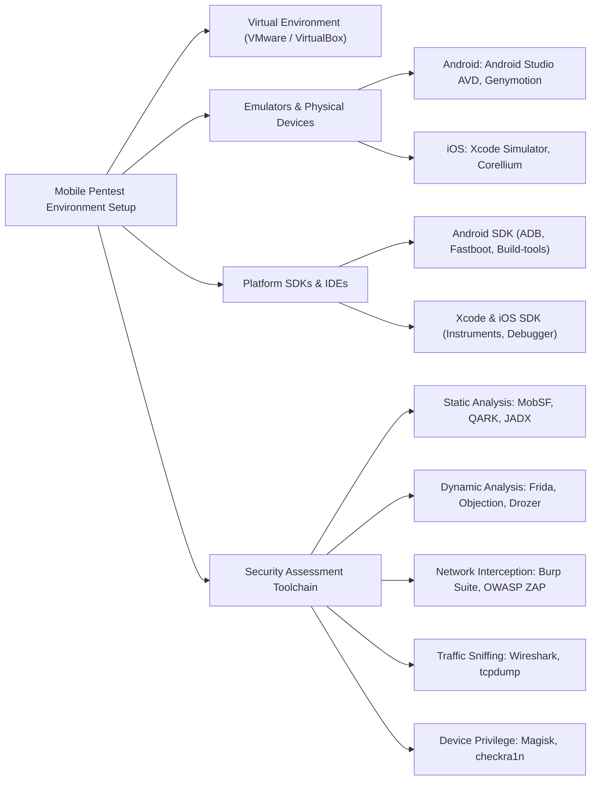
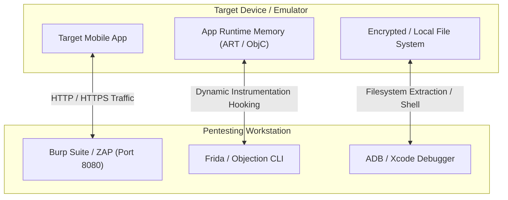
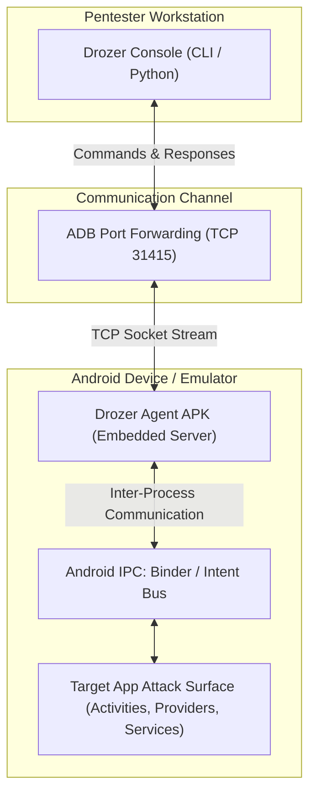
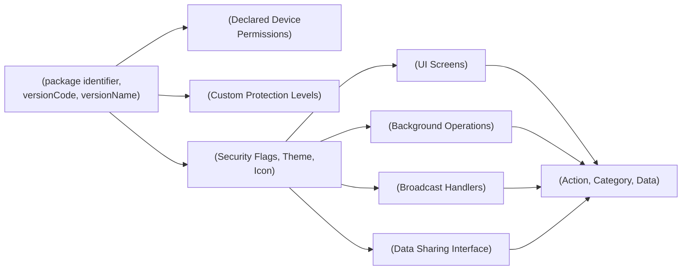
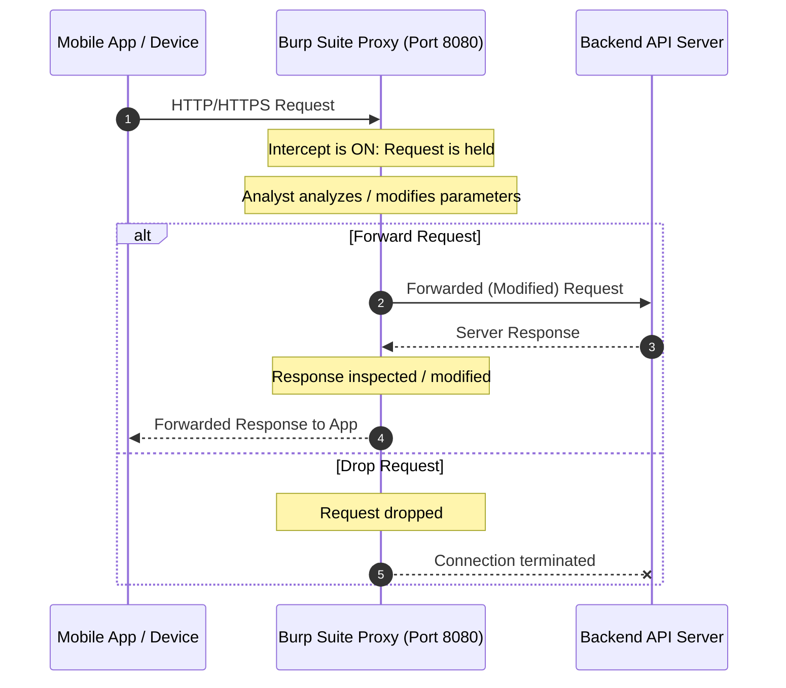
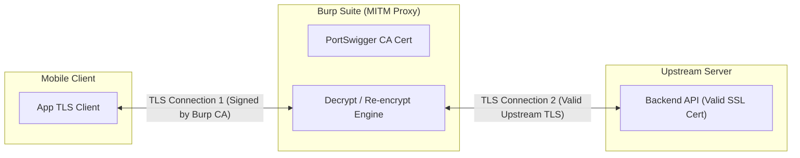
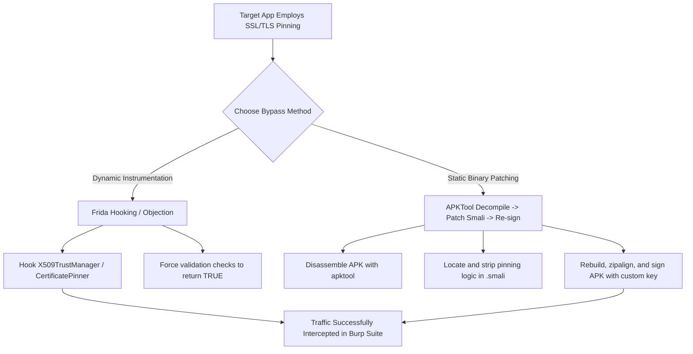

# Unit - 4
:::info[TITLE]
## Setting up Mobile Vulnerability Systems & Devices
:::

## 1. Setting up Mobile App Pentesting Environment

### 1.1 Overview and Prerequisites
Setting up a mobile application penetration testing environment involves establishing an isolated, repeatable, and tool-rich workspace to analyze Android and iOS applications for vulnerabilities.

#### 1.1.1 Platform Selection
- **Platform Scope:** Assess whether the engagement targets **Android**, **iOS**, or cross-platform architectures.
- **Methodology & Tool Differences:**
  - **Android:** Uses Java/Kotlin, Dalvik/ART bytecode, APK packages, ADB debugging, open-source file system access, and rooting solutions like Magisk.
  - **iOS:** Uses Objective-C/Swift, Mach-O binaries, IPA packages, Xcode instrumentation, sandboxed file structures, and jailbreaks (e.g., checkra1n, palera1n).

#### 1.1.2 Virtual Environment & Isolation
- **Host Isolation:** Security testing tools, dependencies, and malicious sample binaries must be isolated from the analyst's primary workstation.
- **Hypervisors:** Use **VMware Workstation/Fusion** or **Oracle VirtualBox** to run dedicated security distributions (e.g., Kali Linux, Remnux) or dedicated emulator host machines.
- **Snapshot Support:** Allows testers to create clean baseline snapshots and instantly revert configurations after intrusive tests or device manipulations.

### 1.2 Essential Tooling and Software Stack



#### 1.2.1 Emulators and Simulators
- **Android Emulators:**
  - **Android Studio AVD (Android Virtual Device):** Official QEMU-based emulator supporting diverse API levels, system architectures (ARM/x86_64), and Google Play Services.
  - **Genymotion:** High-performance, VirtualBox/Cloud-accelerated Android emulator offering custom hardware profiles, rooted images by default, and GPS/battery simulation.
- **iOS Simulators:**
  - **Xcode Simulator:** Emulates the iOS UI and APIs on macOS at the application layer (runs x86_64/ARM64 code compiled specifically for the simulator, not Mach-O ARM device binaries).
  - **Corellium:** Advanced cloud/virtualized hardware emulation executing true iOS kernels and device binaries.

#### 1.2.2 Required SDKs and IDEs
- **Android SDK:**
  - Core command-line utilities including **ADB (Android Debug Bridge)** for shell access, port forwarding, and file transfers, alongside `fastboot` and platform utilities.
  - **Android Studio:** Primary IDE for building, compiling, inspecting layouts, and viewing logcat outputs.
- **Xcode & iOS SDK:**
  - Includes developer toolchains, iOS SDKs, debugger (`lldb`), and performance profiling tools (`Instruments`).
  - **Xcode IDE:** Primary environment for managing provisioning profiles, testing symbols, and deploying test binaries to iOS targets.

#### 1.2.3 Core Security Tools Classification

| Category | Android Tools | iOS Tools | Purpose / Description |
| :--- | :--- | :--- | :--- |
| **Web Proxy / Interception** | Burp Suite, OWASP ZAP | Burp Suite, OWASP ZAP | Intercept, inspect, and modify HTTP/S requests and responses between app and backend servers. |
| **Dynamic Instrumentation** | Frida, Objection | Frida, Objection, Cycript | Hook into runtime functions, manipulate memory, bypass security controls, and inspect crypto routines. |
| **Reverse Engineering** | JADX, APKTool, Bytecode Viewer | Hopper, IDA Pro, Ghidra | Decompile Dalvik bytecode to Java, disassemble native Mach-O/ELF binaries, decode compiled resources. |
| **Static Code Analysis** | MobSF, QARK | MobSF | Automated scanning of source code, binary flags, hardcoded credentials, and configuration weaknesses. |
| **Dynamic Testing Frameworks**| Drozer | iOS SSL Kill Switch | Automated component attack-surface assessment and runtime security feature validation. |
| **Network Sniffing** | Wireshark, tcpdump | Wireshark, tcpdump | Packet-level protocol analysis and raw packet capture on device interfaces. |
| **Privilege Escalation** | Magisk, SuperSU | checkra1n, unc0ver, palera1n | Gain root/superuser privileges to bypass OS sandboxing and access protected data directories. |

### 1.3 Step-by-Step Pentesting Methodology

#### 1.3.1 Proxy Configuration
- Configure the testing device or emulator to route all outbound HTTP/HTTPS traffic to the local interception proxy (e.g., Burp Suite listening on host interface `8080`).
- Install and trust the proxy's root Certificate Authority (CA) certificate on the client device.

#### 1.3.2 Test Case Preparation
- Align test procedures with recognized industry standards, primarily the **OWASP Mobile Top 10** and the **OWASP Mobile Application Security Verification Standard (MASVS)**.
- Formulate specific test matrices spanning authentication, session handling, cryptography, local data storage, and IPC vulnerabilities.

#### 1.3.3 Execution, Documentation, Remediation, and Improvement
- **Execution:** Perform combined automated and manual testing against client-side binaries and backend APIs.
- **Documentation:** Record reproduction steps, proof-of-concept (PoC) scripts, screenshots, and CVSS scores for all discovered flaws.
- **Report & Remediate:** Present executive and technical findings to developers with concrete remediation recommendations.
- **Continuous Improvement:** Regularly update toolchains, device images, signatures, and methodologies against new attack vectors and OS patch levels.

#### 1.3.4 Legal and Ethical Guidelines
- Pentesting mobile apps without explicit written authorization is illegal under anti-hacking statutes (e.g., CFAA, IT Act).
- Maintain defined Rules of Engagement (RoE), strictly test within agreed scopes, and protect user data encountered during testing.

## 2. Interacting with Mobile Devices

### 2.1 Dynamic Analysis Techniques



#### 2.1.1 Dynamic Analysis on Emulators / Simulators
- **UI Exploration:** Exercise all application views, user workflows, authentication gates, and error handlers to stimulate background processing.
- **Runtime Debugging:** Use **ADB** (`adb logcat`, `adb shell`) on Android and Xcode's `lldb` on iOS to monitor runtime logs, exceptions, unhandled signals, and memory usage.
- **Environment Simulation:** Leverage emulator controls to simulate fluctuating hardware states, such as low memory, incoming calls/SMS, network latency, GPS location spoofing, and battery states.

#### 2.1.2 Dynamic Analysis on Physical Devices
- **Physical Hardware Realism:** Necessary for testing features inaccessible in emulation (e.g., NFC, Bluetooth Low Energy, biometric authenticators, camera feeds, hardware keystores).
- **Setup:** Enable **USB Debugging** (Android Developer Options) or trust the Mac host machine with an iOS Developer Provisioning Profile.
- **Tool Attachment:** Run agent daemons (`frida-server`) on rooted/jailbroken devices to allow remote hook injection and runtime modification directly over USB.

### 2.2 Network Traffic Interception and Manipulation
- **Proxy Interception:** Route mobile HTTP/HTTPS traffic through Burp Suite or OWASP ZAP to inspect API communication, auth tokens, REST endpoints, and serialized objects.
- **Vulnerabilities Discovered:**
  - **Insecure Communication:** Transmission of unencrypted cleartext data over HTTP.
  - **Sensitive Data Exposure:** Personally Identifiable Information (PII), access tokens, or credentials visible in headers, URLs, or query parameters.
  - **Insufficient Input Validation:** Vulnerability to parameter tampering, SQL injection, NoSQL injection, and path traversal in API endpoints.
  - **Session Flaws:** Insecure session expiration, predictable session tokens, or missing anti-replay controls.

### 2.3 Runtime Manipulation and Dynamic Instrumentation
- **Dynamic Instrumentation:** Techniques that inject custom scripts into an application's running process memory without modifying the binary on disk.
- **Primary Frameworks:**
  - **Frida:** Scriptable dynamic inspection toolkit that injects the Google V8 engine into the target process, allowing Javascript hooks into native functions and Java/Objective-C/Swift runtimes.
  - **Objection:** A runtime mobile exploration toolkit powered by Frida that automates common pentesting tasks (bypassing SSL pinning, disabling jailbreak detection, dumping memory).
  - **Cycript:** Interactive runtime manipulation console primarily used on iOS to examine and modify Objective-C and Swift runtime state.
- **Core Operations:**
  - **Function Hooking:** Override function return values (e.g., forcing `hasBiometricsPassed()` or `isRooted()` to return `true` or `false`).
  - **Memory Inspection:** Dump cryptographic keys, session tokens, and passwords directly before encryption or after decryption routines.
  - **Logic Alteration:** Bypass step-up authentication, license checks, and anti-tamper controls.

### 2.4 Device & System-Level Assessment

#### 2.4.1 File System Analysis
- Inspect the application's private sandboxed data directory (`/data/data/<package_name>/` on Android; `/var/mobile/Containers/Data/Application/<UUID>/` on iOS).
- **Target Data Storage Artefacts:**
  - **Shared Preferences & Plists:** Plaintext XML or plist configuration files frequently containing leaked API keys or credentials.
  - **SQLite Databases:** Unencrypted databases (`.db`, `.sqlite`) storing sensitive chats, transaction histories, or cached user tables.
  - **App Cache and Temp Files:** Unpurged temporary media, HTTP caches, and diagnostic crash logs.
  - **Improper File Permissions:** Files set to world-readable (`chmod 666` or `chmod 777`), enabling other malicious applications on the device to read sensitive files.

#### 2.4.2 Device Emulation and Manipulation
- **Platforms:** Utilize **Genymotion** (Android) and **Corellium** (iOS) to test varied OS version regressions and device configurations.
- **Hostile State Simulation:** Validate how the app behaves when running in a rooted/jailbroken state, under throttled or interrupted network connections, or in simulated compromised environments.

#### 2.4.3 User Input Manipulation
- **Input Validation Testing:** Fuzz text inputs with oversized strings (buffer overflow and DoS), format strings, script tags (XSS in WebViews), and SQL syntax across search bars and input forms.
- **UI & Multi-Touch Exploits:** Test rapid clicking, interrupted gestures, and screen overlay interactions to identify UI state inconsistencies and tapjacking vulnerabilities.

## 3. Starting with Drozer

### 3.1 Overview and Architecture
Drozer is a comprehensive security audit and attack framework for Android. It allows security testers to assume the role of an untrusted third-party application installed on the target device, probing the system and other apps for IPC vulnerabilities.



#### 3.1.1 Drozer Architecture
- **Drozer Console:** Command-line interface running on the pentester's host machine (installed via Python/pip or source code).
- **Drozer Agent:** An APK installed on the Android test device that acts as a local agent server running under standard non-privileged application UID permissions.
- **Interaction Model:** The console transmits commands to the agent over a forwarded TCP port (`31415`). The agent executes queries against Android's IPC layer and returns results to the console.

### 3.2 Installation and Setup

#### 3.2.1 Installation Steps
1. Install Drozer console on host workstation via Python pip or GitHub release binaries:
   ```bash
   pip install drozer
   ```
2. Download and install `drozer-agent.apk` onto the Android test device via ADB:
   ```bash
   adb install drozer-agent.apk
   ```

#### 3.2.2 Device Configuration and Port Forwarding
1. Connect device to workstation and ensure USB debugging is active:
   ```bash
   adb devices
   ```
2. Forward the communication port from host to Android device:
   ```bash
   adb forward tcp:31415 tcp:31415
   ```
3. Open the Drozer Agent app on the device and toggle the **Embedded Server** to **ON**.
4. Connect the host console to the device agent:
   ```bash
   drozer console connect
   ```

### 3.3 Core Drozer Capabilities and Lifecycle

#### 3.3.1 Information Gathering & Attack Surface Enumeration
- Identify installed packages, filter by keywords, and analyze application component exposure.
- Enumerate exported activities, broadcast receivers, content providers, and services.

#### 3.3.2 Vulnerability Assessment
- **Exported Component Exploitation:** Trigger internal unexported workflows or bypass authentication activities.
- **Content Provider Insecurity:** Query unauthenticated content providers, perform SQL injection attacks, and exploit path traversal vulnerabilities to access private files.
- **Service & Broadcast Manipulation:** Transmit malformed intents to trigger crashes, unauthorized state changes, or sensitive broadcast interception.

#### 3.3.3 Exploitation and Proof-of-Concept
- Execute commands to extract private records, invoke hidden UI screens, or leverage the Drozer agent's permissions to interact with system APIs.

#### 3.3.4 Reporting and Remediation
- Categorize findings by severity (Critical, High, Medium, Low) and map them to OWASP Mobile Top 10 vulnerabilities.
- Provide actionable developer remedies, such as setting `android:exported="false"` or enforcing explicit custom permissions.

#### 3.3.5 Practical Drozer Command Cheat Sheet

```bash showLineNumbers
# 1. Forward TCP port to device
adb forward tcp:31415 tcp:31415

# 2. Start console session
drozer console connect

# 3. Search for target package name
run app.package.list -f vulnerableapp

# 4. Enumerate overall attack surface of target package
run app.package.attacksurface com.example.vulnerableapp

# 5. List all exported activities
run app.activity.info -a com.example.vulnerableapp

# 6. Launch an exported activity directly (Auth Bypass)
run app.activity.start --component com.example.vulnerableapp com.example.vulnerableapp.AdminActivity

# 7. Enumerate exported Content Providers
run app.provider.info -a com.example.vulnerableapp

# 8. Query sensitive tables via Content Provider URI
run app.provider.query content://com.example.vulnerableapp.provider/users/

# 9. Test Content Provider for SQL Injection
run app.provider.query content://com.example.vulnerableapp.provider/users/ --projection "' OR 1=1--"

# 10. Scan for directory traversal in Content Providers
run scanner.provider.traversal -a com.example.vulnerableapp
```

## 4. AndroidManifest.xml Analysis

### 4.1 Overview of AndroidManifest.xml
The `AndroidManifest.xml` file is the foundational configuration and blueprint file required at the root of every Android application package (APK). It declares the application structure, security configuration, components, permissions, and minimum hardware/software requirements to the Android operating system.



#### 4.1.1 Manifest Attributes
- **Package Name:** Defined via the `package` attribute in the root `<manifest>` tag. It provides a unique namespace identifier for the app across the device and within the Google Play Store (e.g., `package="com.example.app"`).
- **Version Information:**
  - `android:versionCode`: An internal integer value used by the OS and app stores to evaluate upgrades and version sequence.
  - `android:versionName`: A user-facing release version string presented to end-users (e.g., `"2.1.0"`).
- **Application Metadata:** Configured within the `<application>` tag (e.g., `android:icon`, `android:theme`, `android:label`, and custom `<meta-data>` key-value pairs).

### 4.2 Core Application Components

#### 4.2.1 Activities
- Represent individual screens that present a user interface to the user.
- Declared via `<activity>` tags inside `<application>`.
- **Security Implication:** If an activity is exported, unauthorized third-party apps can trigger the screen directly, potentially bypassing login or authorization checks.

#### 4.2.2 Services
- Background processing components that execute long-running operations without presenting a user interface (e.g., data synchronization, audio playback).
- Declared via `<service>` tags.
- **Security Implication:** Exported services can be invoked or bound by malicious applications to trigger background actions or drain device resources.

#### 4.2.3 Broadcast Receivers
- Asynchronous messaging gateways that listen for system-wide broadcast announcements (e.g., `BOOT_COMPLETED`, `BATTERY_LOW`) or custom application broadcasts.
- Declared via `<receiver>` tags.
- **Security Implication:** Exported receivers accepting unvalidated incoming intents can be abused to manipulate internal state or inject fraudulent messages.

#### 4.2.4 Content Providers
- Structured data abstraction layers managing access to application datasets (e.g., SQLite databases, flat files, or key-value caches).
- Declared via `<provider>` tags using an `android:authorities` URI identifier.
- **Security Implication:** Insecurely exported content providers allow unauthorized apps to read, update, delete sensitive records, or execute SQL injection attacks.

### 4.3 Permissions and Intent Filters

#### 4.3.1 Permissions Management
- **Requesting Permissions:** Applications declare permissions required to access protected device features (camera, location, storage) using `<uses-permission>` tags:
  ```xml
  <uses-permission android:name="android.permission.INTERNET" />
  ```
- **Custom Permissions:** Applications can declare custom permissions via `<permission>` tags to restrict access to their own exported components, specifying protection levels:
  - `normal`: Automatically granted at install time.
  - `dangerous`: Requires explicit runtime approval from the user.
  - `signature`: Granted only if the requesting app is signed with the same developer signing certificate.

#### 4.3.2 Intent Filters & Exportation Rules
- **Intent Filters:** Declared via `<intent-filter>` to specify the types of intents an activity, service, or receiver can process by defining `<action>`, `<category>`, and `<data>` tags.
- **Exportation Mechanics:**
  - Explicit: Setting `android:exported="true"` or `android:exported="false"`.
  - Implicit Default Rule (Android 11 and earlier): If an `android:exported` attribute is **not** specified, any component containing an `<intent-filter>` automatically defaults to **`exported="true"`**, while components without intent filters default to **`exported="false"`**.
  - Modern Enforcement (Android 12+): Explicit declaration of `android:exported` is mandatory for all components.

### 4.4 Comprehensive Manifest Structure Example

```xml showLineNumbers
<?xml version="1.0" encoding="utf-8"?>
<manifest xmlns:android="http://schemas.android.com/apk/res/android"
    package="com.example.vulnerableapp"
    android:versionCode="1"
    android:versionName="1.0.0">

    <!-- Requested System Permissions -->
    <uses-permission android:name="android.permission.INTERNET" />
    <uses-permission android:name="android.permission.ACCESS_FINE_LOCATION" />
    <uses-permission android:name="android.permission.READ_EXTERNAL_STORAGE" />

    <!-- Custom Permission Definition -->
    <permission
        android:name="com.example.vulnerableapp.permission.READ_CREDENTIALS"
        android:protectionLevel="signature" />

    <application
        android:allowBackup="true"
        android:debuggable="true"
        android:icon="@mipmap/ic_launcher"
        android:label="@string/app_name"
        android:theme="@style/AppTheme">

        <!-- Entry Point Activity -->
        <activity
            android:name=".MainActivity"
            android:exported="true">
            <intent-filter>
                <action android:name="android.intent.action.MAIN" />
                <category android:name="android.intent.category.LAUNCHER" />
            </intent-filter>
        </activity>

        <!-- Insecurely Exported Admin Activity (Vulnerability: Authentication Bypass) -->
        <activity
            android:name=".AdminDashboardActivity"
            android:exported="true" /> |>

        <!-- Protected Background Service -->
        <service
            android:name=".DataSyncService"
            android:exported="false" />

        <!-- Broadcast Receiver Listening to System Boot -->
        <receiver
            android:name=".BootCompletedReceiver"
            android:exported="true">
            <intent-filter>
                <action android:name="android.intent.action.BOOT_COMPLETED" />
            </intent-filter>
        </receiver>

        <!-- Insecure Content Provider (Vulnerability: Unauthenticated Data Access & SQLi) -->
        <provider
            android:name=".UserDataProvider"
            android:authorities="com.example.vulnerableapp.provider"
            android:exported="true" />
    </application>
</manifest>
```

## 5. Burp Suite and Traffic Interception

### 5.1 Introduction to Burp Suite
Burp Suite (by PortSwigger) is the industry-standard graphical web application and API security assessment tool. It functions as an HTTP/HTTPS interception proxy, sitting between the mobile client and backend servers to capture, analyze, and manipulate traffic.

#### 5.1.1 Editions
- **Burp Suite Community Edition:** Free, includes essential features: Proxy, Repeater, Decoder, Comparer, and Sequencer.
- **Burp Suite Professional:** Commercial edition adding automated vulnerability scanning, Intruder (rate-unlimited fuzzing), extensibility (BApp Store), and project file saving.

### 5.2 Step-by-Step Traffic Interception Workflow



#### 5.2.1 Installation and Proxy Listener Setup
1. Download and install Burp Suite from the official PortSwigger website.
2. Navigate to **Proxy -> Proxy settings -> Proxy listeners**.
3. By default, Burp listens on `127.0.0.1:8080`.
4. For mobile testing, edit the listener to bind to **All interfaces** or the specific host IP address on the shared local network (e.g., `192.168.1.100:8080`).

#### 5.2.2 Mobile Device / Emulator Configuration
1. Connect the mobile device/emulator to the same Wi-Fi network or virtual subnet as the host machine.
2. In the device's **Wi-Fi Advanced Settings**, set Proxy to **Manual**:
   - **Proxy Hostname:** Host machine's IP address (e.g., `192.168.1.100`).
   - **Proxy Port:** `8080`.

#### 5.2.3 Interception and Traffic Inspection
1. Navigate to **Proxy -> Intercept** in Burp Suite and verify that **Intercept is on**.
2. Open the mobile application; outgoing requests will pause within the Intercept tab.
3. Inspect HTTP headers, cookies, URL query parameters, and payload bodies.

#### 5.2.4 Modifying, Forwarding, and Dropping Requests
- **Modify:** Edit parameters, tokens, or header values on the fly to test server-side validation and resilience against parameter tampering or injection.
- **Forward:** Sends the pending (or modified) request onward to the destination server.
- **Drop:** Terminates the connection and discards the packet, preventing it from reaching the server.

### 5.3 HTTPS Interception and SSL/TLS Decryption



#### 5.3.1 The Man-In-The-Middle (MITM) Mechanism
- Because HTTPS encrypts traffic, a proxy cannot inspect encrypted bytes without terminating the TLS tunnel.
- Burp acts as a MITM proxy: it terminates the TLS connection from the client using a dynamically generated certificate signed by its own custom **PortSwigger CA**, and establishes an independent upstream TLS connection to the destination server.

#### 5.3.2 CA Certificate Installation
1. With device proxy settings active, open the device browser and navigate to `http://burp`.
2. Click **CA Certificate** to download `cacert.der`.
3. Rename the extension to `.crt` or `.cer` if required by the operating system.
4. **Android Installation:** Go to **Settings -> Security -> Encryption & Credentials -> Install a certificate -> CA certificate**.
   - *Android 7.0+ (API 24+) Limitation:* Apps target the system trust store by default and ignore user-installed CAs unless configured with a custom `network_security_config.xml` or running on a rooted device where the CA is moved to `/system/etc/security/cacerts/`.
5. **iOS Installation:** Download profile via Safari, navigate to **Settings -> Profile Downloaded -> Install**. Then go to **Settings -> General -> About -> Certificate Trust Settings** and enable full trust for the PortSwigger CA.

### 5.4 Logging, History, and Session Management
- **HTTP History:** Automatically logs all HTTP/HTTPS transactions chronologically in the **Proxy -> HTTP history** tab, even when live interception is disabled.
- **Session Management:** Burp allows projects to be saved, exported, filtered by URL/MIME type, and restored for later reporting and verification.

## 6. Traffic Interception Bypass Techniques

### 6.1 Certificate Pinning and Bypass

#### 6.1.1 What is Certificate Pinning?
- **Mechanism:** Hardcoding the server's X.509 certificate, public key hash, or CA certificate directly inside the mobile app binary.
- **Purpose:** Prevents MITM attacks by ensuring the client connects strictly to the expected server, actively rejecting any proxy's custom CA (including Burp Suite's CA) even if it is installed in the device's trust store.



#### 6.1.2 Pinning Bypass Techniques
- **Dynamic Instrumentation (Frida & Objection):**
  - Inject JavaScript hooks into standard networking libraries (e.g., OkHttp, TrustManagerImpl, Network Security Config) to intercept validation checks and force them to return success.
  - Objection command: `android sslpinning disable` or `ios sslpinning disable`.
- **Binary Patching & Repackaging:**
  - Decompile APK using **APKTool**, locate the pinning logic within the disassembled `.smali` code, modify conditional branch instructions, rebuild, and re-sign the APK using `uber-apk-signer` or `apksigner`.

#### 6.1.3 Universal Frida SSL Pinning Bypass Script

```javascript showLineNumbers
// Universal Android TLS/SSL Pinning Bypass Script via Frida
Java.perform(function () {
    console.log("[*] Initializing Frida SSL Pinning Bypass...");

    // 1. Hook Android TrustManagerImpl
    try {
        var TrustManagerImpl = Java.use('com.android.org.conscrypt.TrustManagerImpl');
        TrustManagerImpl.verifyChain.implementation = function (untrustedChain, trustAnchorChain, host, clientAuth, ocspData, tlsSctData) {
            console.log("[+] Bypassed TrustManagerImpl verifyChain for host: " + host);
            return untrustedChain;
        };
    } catch (err) {
        console.log("[-] TrustManagerImpl hook failed: " + err);
    }

    // 2. Hook OkHttp3 CertificatePinner
    try {
        var CertificatePinner = Java.use('okhttp3.CertificatePinner');
        CertificatePinner.check.overload('java.lang.String', 'java.util.List').implementation = function (hostname, peerCertificates) {
            console.log("[+] Bypassed OkHttp3 CertificatePinner for host: " + hostname);
            return;
        };
    } catch (err) {
        console.log("[-] OkHttp3 CertificatePinner hook failed: " + err);
    }
});
```

### 6.2 Transport Layer Security Downgrades

#### 6.2.1 SSL/TLS Stripping
- **Concept:** Forcefully downgrades secure HTTPS requests into unencrypted plaintext HTTP when applications fail to enforce end-to-end encryption or improperly handle 301/302 redirects.
- **Tools:** **SSLStrip** and **Bettercap** intercept outbound requests, rewrite HTTPS links as HTTP, and broker cleartext communication with the victim while maintaining HTTPS with the server.

#### 6.2.2 HSTS Bypass
- **Mechanism:** HTTP Strict Transport Security (HSTS) instructs the client to strictly use HTTPS.
- **Bypass Techniques:** Exploiting misconfigured subdomains, manipulating NTP system clocks, or exploiting HSTS supercookies to invalidate stored policies and intercept traffic.

### 6.3 Anti-Proxy and Client Defense Evasion

#### 6.3.1 Custom Proxy Detection Evasion
- Some applications query system properties (e.g., `http.proxyHost`) or scan network interfaces to detect active proxies and abort execution.
- **Countermeasure:** Use transparent proxying (redirecting port `80`/`443` via `iptables` or `redsocks` on a rooted device), modify HTTP headers via extensions like **ModHeader**, or hook proxy detection APIs using Frida.

#### 6.3.2 User-Agent Spoofing
- WAFs or servers may drop requests missing legitimate mobile client identifiers or reject recognizable pentest headers.
- **Countermeasure:** Configure Burp's Proxy Match/Replace rules to spoof legitimate browser or mobile operating system User-Agent strings (e.g., standard Chrome, Safari, or native Dalvik User-Agents).

#### 6.3.3 Dynamic IP Rotation
- Aggressive security testing or automated fuzzing triggers rate-limiting rules, IP blacklisting, or CAPTCHA challenges.
- **Countermeasure:** Route traffic through rotating proxy pools or dynamic IP relays (e.g., AWS API Gateway proxies or Tor relays) to avoid single-source blocking.

#### 6.3.4 Traffic Obfuscation
- Applications or API firewalls may detect known pentest payload signatures or serialized object tampering.
- **Countermeasure:** Apply payload encoding (Base64, Hex, URL encoding), custom cryptographic wrappers, or tools like **Obfsproxy** to mask traffic patterns.

#### 6.3.5 Timing and Frequency Controls
- Network intrusion detection systems (NIDS) and WAFs detect automated vulnerability scans based on burst rates.
- **Countermeasure:** Introduce randomized sleep intervals, throttle concurrency, and limit request frequency in Burp Intruder or automated scripts to emulate organic user interaction.

#### 6.3.6 Manual Interaction & Anti-Automation Bypass
- Automated scanners fail against multi-step workflows, dynamic JavaScript challenges, or interactive CAPTCHAs.
- **Countermeasure:** Complete critical workflows manually in the app UI, using the proxy solely to record, modify, and replay isolated API requests.

#### 6.3.7 Continuous Monitoring and Adaptive Security Testing
- Defensive controls continuously evolve; application security testing requires iteratively analyzing defensive blocks, updating scripts, and refining bypass routines.
- Maintain rigorous legal compliance and strictly limit bypass evaluations to authorized scope targets.
